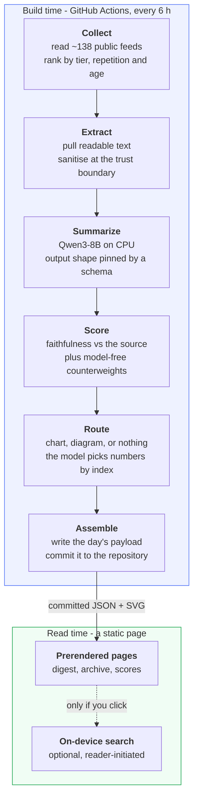

# yen-idhazh

**A daily news digest that checks its own work.**

**Read it: <https://miztiik.github.io/yen-idhazh/>**

*idhazh* is Tamil for a journal. **yen-idhazh** is "my journal".

Every morning it reads a curated set of public sources, writes a short summary of
what matters, and - the part that makes it different - **scores each summary
against the article it came from** and shows you the score. Where the check went
badly, the item says so.

Nothing runs when you read it. The page is plain files.

---

## What you get

| | |
| --- | --- |
| **Five subjects, one page** | AI, energy, business and economy, world, India. Ten to fifteen stories, not a firehose. |
| **A confidence mark on every story** | Each summary is machine-checked against its source article. A story that scored badly is labelled, not hidden. |
| **The link, always** | The digest gives you our summary and the address it came from. It never republishes the article. |
| **Two minutes, then out** | It is a digest, not a feed. There is no infinite scroll and nothing to come back for. |
| **Nothing follows you** | No accounts, no analytics, no cookies, no third-party scripts, no calls home. |
| **A picture only when it earns one** | Numbers become a chart. A process becomes a diagram. Everything else gets nothing, because a decorative image with invented labels is worse than no image. |
| **Search on your device** | Optional. A one-time download, then the archive is searchable without anything you type leaving your browser. |

### Who it is for

Someone who wants to know what happened in a few subjects, in two minutes, from
a page that tells them how much to trust it. Not a researcher, not an ML
engineer, and not somebody who wants another feed to scroll.

---

## How it works



The line between the two boxes is the whole design: **everything expensive
happens before you arrive.** By the time a page reaches you, the summaries are
already in the HTML.

### The one rule that shapes everything

The pipeline runs on a stock GitHub runner - 4 vCPU, no GPU, a 6-hour job cap.
That is not a budget to be raised; it is the platform. It decides which model can
be used, how work is sharded, and which features never ship. When a measurement
contradicts the design, the design changes - and it already has, twice.

---

## Where the stories come from

Sources are **curated, not crawled**. Every feed is listed by hand in
[`config/sources.json`](config/sources.json) with a subject and a tier:

| Tier | What it is | Example |
| --- | --- | --- |
| 1 | The institution that *is* the fact | a central bank, a statistical agency, a lab's own blog |
| 2 | Trade press that covers the beat daily | a specialist outlet, a wire's section feed |
| 3 | Community and aggregators | a forum, a link aggregator |

Ranking is arithmetic, not judgement: **tier weight, times how many independent
sources carried the story today**, plus a bonus for a watched entity. A story
three independent outlets carried is the day's story. No model is involved in
choosing.

Live feed counts, measured 2026-08-22: ai 38, world 27, india 27, energy 24,
business-economy 22.

A source that dies is retired in config, never deleted - deleting an id would
break every payload that referenced it. See
[`docs/architecture/sources/discovery.md`](docs/architecture/sources/discovery.md).

---

## Documentation

Start here, in this order:

| If you want to know | Read |
| --- | --- |
| What this is and is not | [`docs/concepts/vision.md`](docs/concepts/vision.md) |
| **How the whole system fits together** | [`docs/architecture/overview.md`](docs/architecture/overview.md) |
| What each pipeline stage owns | [`docs/concepts/pipeline-loop.md`](docs/concepts/pipeline-loop.md) |
| How a summary is scored, and why | [`docs/concepts/evaluation.md`](docs/concepts/evaluation.md) |
| What the summarizer is asked for | [`docs/architecture/summarize/prompt.md`](docs/architecture/summarize/prompt.md) |
| Where stories come from | [`docs/architecture/sources/discovery.md`](docs/architecture/sources/discovery.md) |
| Why a story gets a chart or nothing | [`docs/architecture/publishing/visuals.md`](docs/architecture/publishing/visuals.md) |
| Real numbers from real hardware | [`docs/reference/measurements.md`](docs/reference/measurements.md) |
| **What every top-level directory is for** | [`docs/reference/repository-layout.md`](docs/reference/repository-layout.md) |
| How to run it yourself | [`docs/how-to/run-the-pipeline.md`](docs/how-to/run-the-pipeline.md) |
| **How to test the models locally** | [`docs/how-to/test-models-locally.md`](docs/how-to/test-models-locally.md) |

---

## Running it yourself

```bash
python -m venv .venv
.venv/bin/pip install -e ".[dev]"        # .venv/Scripts/pip on Windows
.venv/bin/python -m pytest               # tests
.venv/bin/python -m ruff check .         # lint
.venv/bin/python -m mypy                 # strict type check
```

One day, end to end, needs a local model server - see
[`docs/how-to/set-up-local-inference.md`](docs/how-to/set-up-local-inference.md):

```bash
python -m idhazh plan      --date 2026-08-22
python -m idhazh work      --date 2026-08-22 --shard 0 --shards 1
python -m idhazh route     --date 2026-08-22   # needs the small model served
python -m idhazh assemble  --date 2026-08-22
```

Model weights and llama.cpp binaries are downloaded, never committed.

## Repository layout

| Path | What lives there |
| --- | --- |
| `backend/` | The Python producer. Runs in CI and locally, never as a service. `backend/idhazh/contracts/` holds the Pydantic models that are the source of truth for every persisted shape. |
| `frontend/` | The published static site, plus generated TypeScript contracts. |
| `config/` | Human-edited tunable knobs, schema-validated. A fresh clone runs on the defaults. |
| `schemas/` | JSON Schema generated from the Pydantic models. Never hand-edited. |
| `state/` | Everything one run commits for a later run to read: scores, fingerprints, seen URLs, feed health. Never served to a reader. |
| `tests/` | Cross-cutting fixtures only - captured pages, golden summaries, injection canaries. The tests themselves live in `backend/tests/`. |
| `docs/` | Canonical knowledge, in Diataxis tiers. |
| `TODO/` | Active plan-docs. Working material, never the source of truth. |

## See also

- [`CLAUDE.md`](CLAUDE.md) - the engineering contract every change is held to.
- [`AGENTS.md`](AGENTS.md) - the pointer coding agents start from.
- [`TODO/20260815-digest-pipeline-plan.md`](TODO/20260815-digest-pipeline-plan.md) - the build plan and its current state.
