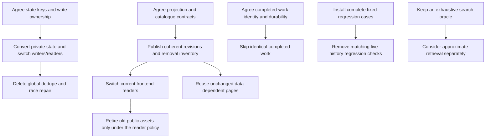

# Data Growth Research And Planning Handover

**Last Updated**: 2026-09-06

Status: research only. No implementation is authorized by this document. The
155 findings describe source revision `76c2d27cbfb7ba9d868e0747dea366b2223e408f`.
Priorities and effort are engineering judgment requested by the owner, not measured
savings or a delivery estimate. Read this document to prepare the next plans.
Do not execute the numbered findings as a queue.

## Decision Board

Read this table to choose the next investment. It is ordered by **expected total
impact, highest first**, not ease of delivery. This is judgment, not a new timing
study. The numbered ranks below are not audit finding IDs. The families overlap;
assign work through the package register, not by giving each rank to an agent.

Status checked on 2026-09-06 against fetched `origin/main` at `eb97568e`, the
tracked plans and open PR list. The source audit below remains pinned to
`76c2d27c`. No whole growth package is verified complete. "No plan linked" means
this register has no current execution plan for that scope, not that no related
work exists anywhere. Recheck the register and live PRs before claiming work.

| Rank | Work And Main Packages | Where The Payoff Appears | Size | Status / Existing Plan | First Assignment |
| --- | --- | --- | --- | --- | --- |
| 1 | Stop rebuilding dashboard history: Published Projections, Frontend Reductions | Faster publication/builds; less data and repeated work in the console | Small loop fixes; Large final change | No growth plan linked. [Console backfill](20260905-03-console-backfill-plan.md) is complete, but adds visibility rather than eliminating history reads. | Plan one-pass grouping and the run/health join first; design exact precomputed page facts alongside it. |
| 2 | Reuse unchanged publication and build output: Build Reuse | Shorter CI/build/deploy tail for every new run | Large; job artifact reuse Medium | No growth plan linked. [Site-cap defence](20260905-04-site-cap-defence-plan.md) addresses capacity, not incremental builds. | Define complete build identities, changed outputs and deletion handling before skipping work. |
| 3 | Replace lifetime state scans and race repair: Indexed State | Faster planning, small appends and publication retries as history grows | Large | Needs an ownership/storage decision; no plan linked. | Agree exact keys and one writer. Delete global repair only after that replacement works. |
| 4 | Stop loading and retaining whole days for small views: Date And Day Data, Browser Ownership | Faster dated/topic pages, deeper paging and long sessions on small devices | Medium local fixes; Large payload change | No current growth plan linked; the [payload/search handover](20260825-payload-and-search-handover.md) is prior context, not a claim. | Start ID indexes/read reuse; settle page, byte and navigation bounds before a payload cutover. |
| 5 | Reuse decoded vectors and select exact top results: Exact Search | Faster repeat search after model startup; cheaper retrieval evaluation | Medium exact changes; Large segmentation | No growth plan linked. Keep exhaustive scoring as the correctness oracle. | Plan decoded-value reuse and exact top-K with unchanged scores, ties and candidate coverage. |
| 6 | Remove growing test inputs and repeated setup: Regression Fixtures, Test Runner | Shorter local checks and CI without losing distinct cases | Medium | Active overlap: [PR #426](https://github.com/miztiik/yen-idhazh/pull/426), branch `chore/cut-the-o-n-checks`. Not verified complete. | Reconcile its merged scope first; assign only remaining fixture/setup work. |
| 7 | Reuse correctly identified completed model work: Replay Results | Cheaper failed-shard retries, reassembly and repeated checker inputs | Large; request reuse Small | Needs identity/durability design; no plan linked. Gain depends on repeated work, not every clean run. | Separate safe in-operation reuse from persistent results; define invalidation before skipping inference. |
| 8 | Reduce repeated same-story comparisons and lead lookup: Exact Search, Text And Model Inputs | Faster assembly as the day fills | Small lead index; Large grouping change | No plan linked. Shares owners/files with search and replay work. | Index lead membership first. Treat approximate grouping as a separate accuracy decision. |
| 9 | Remove nested copied-text/extraction scans: Text And Model Inputs | Fewer slow items and repeated parsing/scoring costs | Medium | No growth plan linked. Trust and metric semantics must remain unchanged. | Plan exact longest-match parity and bounded adversarial parser cases before changing algorithms. |
| 10 | Reduce work on each click, hover and chart update: Browser Ownership, Frontend Reductions | Smoother read marks, chart readouts, filtering and long sessions | Small/Medium | No growth plan linked. Coordinate with ranks 1 and 4; do not build competing caches. | Select one owned interaction, preserve freshness and test its lifecycle. |

**Best immediate start:** the local grouping/join part of rank 1. It has direct
operation-count evidence and needs no new persisted shape. Rank 3's state design
and rank 5's exact search work can be planned independently, with file ownership
agreed first. Rank 6 is already occupied in part; do not duplicate it.

### Work Ownership

This is the single claim register for all 15 primary packages. The 155-row routing
index below maps each finding to one of these names. `Unclaimed` is not permission
to implement a Level-5 change. `Overlap` means another effort touches the area but
has not claimed or closed this whole package. No agent is assigned by this doc PR.

| Package | Status | Execution Plan / Related Work | Owner / Branch |
| --- | --- | --- | --- |
| Indexed State | Unclaimed | No plan linked; ownership and storage decision needed | None recorded |
| Replay Results | Unclaimed | No plan linked; result identity/durability decision needed | None recorded |
| Published Projections | Unclaimed | No growth plan linked; [console backfill](20260905-03-console-backfill-plan.md) is related completed work | None recorded |
| Date And Day Data | Unclaimed | No current plan linked; [payload/search handover](20260825-payload-and-search-handover.md) is prior context | None recorded |
| Build Reuse | Unclaimed | No growth plan linked; [site-cap defence](20260905-04-site-cap-defence-plan.md) is related, not coverage | None recorded |
| Frontend Reductions | Unclaimed | No plan linked; local equivalent-output changes can be planned | None recorded |
| Browser Ownership | Unclaimed | No plan linked; agree request/cache ownership with day and search work | None recorded |
| Exact Search | Unclaimed | No current plan linked; [payload/search handover](20260825-payload-and-search-handover.md) is prior context | None recorded |
| Text And Model Inputs | Unclaimed | No growth plan linked; separate exact preparation from trust/quality changes | None recorded |
| Contract Checks | Unclaimed | No plan linked; equivalent recounts can be planned independently | None recorded |
| Regression Fixtures | Overlap | [PR #426](https://github.com/miztiik/yen-idhazh/pull/426); map exact covered findings after merge | No new claim; coordinate `chore/cut-the-o-n-checks` |
| Test Runner | Overlap | [PR #426](https://github.com/miztiik/yen-idhazh/pull/426); do not duplicate CI/test setup edits | No new claim; coordinate `chore/cut-the-o-n-checks` |
| Operator Tools | Unclaimed | No growth plan linked; explicit audit/training work is lower priority | None recorded |
| Retirement | Overlap | [Site-cap defence](20260905-04-site-cap-defence-plan.md) row 4 concerns cleanup reporting, not scan removal. Rows 1-3 have merged PRs #431-#433 despite stale IN-FLIGHT labels there. | No growth claim; worktree branch `state/the-cleanup-says-what-it-skipped` observed; completion unverified |
| Keep Necessary Work | Review only | Confirm the bound or the current contract's human-approved exception; not an optimization backlog | None recorded |

### Claiming Work

1. Fetch main and check the linked plan, open PRs and shared-file list below.
  Record the exact audit IDs, local slice and excluded work in the chosen plan.
2. Claim the package here with the plan link, named branch and responsible worker
  before dispatch. Land the claim on main; a private worktree edit is not a
  reservation. If splitting a package, list each slice and its disjoint files
  in that plan; do not let two agents edit the same reducer or payload owner.
3. Use `Planning`, `Ready`, `In progress`, `Blocked`, `Partial` or `Done` after the
  initial states above. Link a reason for `Blocked` and the remaining IDs for
  `Partial`. A local reducer fix does not close its producer's full-history read.
4. Mark `Done` only with merged PRs, the closed audit IDs and focused validation
  evidence. Update the living subsystem docs as each decision lands. Do not
  overwrite historical source evidence to make the audit look current.

## Answer About Ordering

| Question | Answer |
| --- | --- |
| Ordered by incremental benefit? | No. The original sequence does not rank marginal savings. This document adds a subjective offender ranking and a separate first-return sequence. |
| Ordered by implementation complexity? | No. A small loop fix and a new persistence contract can sit next to each other. Effort is stated for the work packages below. |
| Logically grouped? | Yes. Backend state/publication, item/model work, contracts, frontend build data, browser work, then tests/utilities/workflows. Within each section the order is an inventory, not a priority. |
| Random numbering? | Not random by subsystem, but the numeric order has no execution meaning. Keep the IDs so later plans can refer to the same finding. |
| Non-overlapping? | No. Some entries show a producer, consumer, test or workflow view of one cost. Some show different costs in the same file. They are not 155 independent bugs or additive savings. |
| Can any row start independently? | Its local, semantics-preserving correction often can. A persisted-index, payload, accuracy or deletion proposal cannot start implementation until its named contract and cutover prerequisites are settled. |
| Must work follow row order? | No. Follow dependency edges and shared-file ownership. A high-priority destination may need a lower-priority foundation first. |

The shorter 15-row chat summary used its own numbers. **Do not use those numbers
as audit IDs.** The 155-entry table reproduced below is the stable inventory.

## Scope And Authority

The owner asked for every linear or worse traversal in the frontend, backend,
tests and supporting workflows, not just archive browsing. The owner permits
deleting obsolete code and a coordinated old-to-new cutover. No permanent
dual-write system or long-lived compatibility implementation is requested.
The owner now asks for a complete context-free research record in `TODO/`.

This is a research snapshot, not a ratified architecture or an execution-ready
plan. The factual audit also remains in
[docs/reference/data-growth-audit.md](../docs/reference/data-growth-audit.md).
Living subsystem docs remain authoritative for current behavior. When a future
plan adopts a decision, put that decision in the living doc it changes. Do not
delete this research until every retained finding, decision, caveat and evidence
record has an explicit successor home.

There is no application-code change in this handover. No new performance
measurement was requested or taken for prioritization. Existing operation-count
and parity checks are preserved below, with their limits. The priority column
does not override the engineering contract's requirement for measured claims.

### Baseline Freshness

The first audit fetched and isolated `76c2d27c`. The shared checkout was then at
`b68f6256`, 38 commits behind. That temporary audit worktree was removed after
read-only verification. Recreate a read-only snapshot only when a comparison
requires it; do not depend on that deleted directory or session temp files.

The first handover pass observed local source at the audited revision and an
`origin/main` log with newer console closure, site-growth and site-cap work
through `b8dd92aa`. The owner's concurrent-session context also reports a
constant-cost policy change and archive-reader migrations. These are **recheck
signals, not verified closures of this table**. A future agent must fetch current
main, read its contract and inspect the named files before opening a plan row.
Do not restore deleted migration/test code because a historical row names it.
The decision board records the newer shipping-time status check separately.

Pinned GitHub links identify the original evidence. Scheduled history pruning
can eventually make old commits unavailable. The function names, call paths,
growth explanation, retained detailed notes and counterexamples in this document
are therefore part of the record, not decoration around the links.

## Priority Legend

| Priority | Meaning |
| --- | --- |
| Highest | My strongest structural offenders: repeated growing history in common workflows, quadratic copying/joins on substantial data, or browser work with direct interaction impact. This is not a measured bottleneck verdict. |
| High | Material recurring or user-visible work, a costly replay path, or a correctness dependency needed before a claimed saving is safe. |
| Medium | A useful bounded/local correction, less frequent operation, or supporting work whose benefit depends on the selected workflow. |
| Low | Small settings/vocabulary work, rare maintenance, or completed-migration clutter. Do not lead the program with this merely because it is easy. |
| Keep | Necessary input/output or already fixed-size work. Record its bound or seek a human-approved exception under the current contract; do not pretend this review approved growing work. |

The ranking considers frequency, growth, repeated materialization, reader blocking,
developer wait and how much other work a correction enables. It does not equate
the largest asymptotic exponent with the biggest elapsed-time saving today.
Model inference may still dominate a refresh even when a CSV scan is badly
designed. Conversely, a small scan on every pointer event can matter to a reader.

## Worst Offenders

This is a **subjective rank of overlapping cost families**, not a sum of row
savings. The cited IDs below refer to the complete table, not this ranking.

| Rank | Cost Family And Audit IDs | Why I Put It Here | Where Someone Notices | Evidence And Effort |
| --- | --- | --- | --- | --- |
| 1 | Raw history rebuilt for every dashboard/build: 57-63, 65-79, 95, 102, 107-109 | Several routes and layout helpers reconstruct the same growing histories, sometimes quadratically, to show a small answer. It affects more than one panel. | Developers wait for site/canary builds and CI; readers pay for any full-history arrays that reach console pages and preset interactions. | Source-confirmed; the clock join in 66 made 64, 256 and 1,024 row checks as both dimensions doubled. Small local corrections; a large producer-view cutover. |
| 2 | Full publication rebuild/staging/verification amplification: 16-17, 80, 83, 114-120, 137 | One new run can make several jobs read, copy, hash, render or upload unchanged history again. It multiplies costs across the workflow. | `digest.yml` publication tail, CI site/browser/whole-day preparation, `pages.yml`, local build and preview startup. | Source-confirmed call paths. Large architectural work; duplicate-artifact reuse is a smaller independent slice. Full final upload is still output-sized. |
| 3 | Lifetime state lookup and repair: 1-12, 21, 115 | Small appends and membership questions depend on all old rows and on Git race-repair scans. History retention does not remove archived identity loading. | Plan startup, worker record steps, assembly, rejected-push retries and time until new stories appear. | Real publication preload visited 6,856 rows for 6,775 keys. Indexed storage/ownership is a contract decision, not a one-file optimization. |
| 4 | Whole-day data and cumulative browser lists: 58-59, 77-79, 84-90, 93, 110-111 | A small seed/display cap hides full downloads, repeated derived arrays, deep-link prefixes and growing caches. | Opening a dated/topic page, paging deep into a day, typing filters, archive browsing and long/offline sessions, especially on small devices. | Source-confirmed; no phone timing claim. Medium local indexing; large payload/product decisions for byte/DOM bounds. |
| 5 | Exact vector search does repeated decoding plus full sorting: 15, 37-38, 45, 90-92, 128 | Every query rebuilds numeric vectors, visits every candidate and sorts all hits just to return a few. | Archive Search after the encoder is ready; retrieval-evaluation runs; monthly index publication. | Late third vector beat the first two with result limit one. Medium no-loss ranking changes; approximate search is a separate quality decision. |
| 6 | Tests tied to growing live data: 121-140 | Collection, fixture copying and assertions can grow without adding a new behavioral case. This is a recurring developer tax, but not every small backend reader is expensive today. | `pytest`, Playwright groups, CI browser/whole-day and local selected checks. | Existing audit evidence and source reads; time-rail/served-day migrations already landed before the baseline and are not new savings. Medium fixture work, often independent. |
| 7 | Repeating completed model work: 14, 23-24, 35, 41, 92 | A replay can repeat expensive computation rather than just loading completed, correctly identified results. Conditional on retries or repeated queries. | Rerunning a failed work shard/assembly; qualification setup; repeated archive queries. | No replay timing taken. Potentially large conditional gain, not a daily speedup promise. Full identity and result durability must be designed first. |
| 8 | Same-story complete-link comparisons: 28-29 | Exact grouping is quadratic in day items and vector width; lead-membership reconstruction adds avoidable work around it. | Assembly as a day fills and assembly retries. | Source-derived quadratic bound, not cubic. Small lead-index correction; substantial exact-grouping optimization and storage tradeoff. |
| 9 | Copied-text and nested extraction scans: 25, 30-35 | Long/repetitive/adversarial inputs expose avoidable nested work at item boundaries. | Extraction, acceptance, scoring, qualification and unusual slow items. | Longest-match replacement agreed on 900 bounded cases. Parser worst-case claims remain static until adversarial repros. Medium, with strict trust/quality parity. |
| 10 | Per-interaction state and chart work: 88, 94-106, 111 | Rewriting all marks, rebuilding telemetry and scanning every chart column can tax frequent interactions even when each dataset seems modest. | Mark read, window/filter changes, hover/touch readouts, resize/theme changes and long browsing sessions. | Source-confirmed operations. Mostly small/medium independent slices, but cache and live-chart correctness must be tested before counting the saving. |

## Best First Returns

This ordering is **benefit relative to delivery risk**, not a contradictory second
ranking of total cost. It provides useful starts while larger contracts are being
decided. Recheck current source and active owners before claiming any row.

| Suggested Start | Audit IDs | Why It Can Start | What It Does Not Claim |
| --- | --- | --- | --- |
| One-pass frontend grouping and clock join | 65-66, 68-69, 95; test helper 140 | Pure reducers already accept row arrays. Preserve outputs and test skewed groups, duplicate scrapes and paired clocks. | It does not eliminate cold raw-ledger reading in 61. Do not create a second reducer the later projection must keep. |
| Exact item lookup and pointer selection | 86-87, 103; redundant output 113 | Internal indexes and hit selection can preserve existing public payloads. | It does not bound whole-day transfer, rendered prefixes or native layout. |
| Remove duplicate day/request preparation | 13, 24, 59, 64, 79 | Reuse values already available within one immutable operation; no new persisted cache is required for the local slice. | A process-local reuse does not close a proposal for persistent result reuse or incremental publication. |
| Bounded regression inputs and setup | 123-127, 130-134, 139-143 | Tests can be made independent of production history without changing production formats. | The separate live auditor and complete fixed competitor/permission cases must remain. Check concurrent archive-test migrations first. |
| One-pass contract recount and bin counting | 43, 71 | Replaces redundant computation while retaining the same validator/statistic. | Whole-input validation and sorting/quantiles do not become constant-time. |
| Exact top-K search and shared decoded values | 38, 91 | Can keep scores, floor, ties, candidate population and public shape unchanged. | No arbitrary early stop, ANN adoption or unmeasured search-latency target. Numeric precision is part of parity. |
| Design indexed state and publication generation in parallel with the above | 1-12, 15-17, 57-63, 80, 83 | Contract work can begin from preserved evidence and explicit decision questions. | Implementation must wait for those decisions; independent design does not authorize competing writers in shared files. |

## Work Packages And Dependencies

Each finding has exactly one **primary planning package** in the routing index.
This prevents duplicate ownership. It does not make packages file-disjoint or
their benefits additive. Related production and test changes can land together.
Package names are descriptive, not new subsystem names or mandatory abstractions.

Effort means scope, not hours: **Small** is a local algorithm plus focused tests;
**Medium** spans a feature and its callers; **Large** changes ownership, persisted
shapes or the publication workflow. A package can have a small local slice and a
large final design. That distinction is intentional.

| Package | Effort | Can Start Now? | Hard Prerequisite For The Final Change | Shared Work / Savings Rule |
| --- | --- | --- | --- | --- |
| Indexed State | Large; local set/copy removal Small | Research/design; local no-format fixes | Keys, authority, durability, corrections, retention, single writer and migration accepted | Owns the state-storage saving once. Projection and test rows do not claim it again. |
| Replay Results | Large; request reuse Small/Medium | Internal request/preparation reuse | Complete text/model/tokenizer/config identities; durable completed results and retry semantics | Depends on Indexed State only if that store is chosen for result identity. Immutable run artifacts are another option, not a hidden forced dependency. |
| Published Projections | Large | Local redundant reductions; projection contract design | Exact statistical populations, changed-partition ownership, revision/public compatibility accepted | Can be produced from current state before Indexed State changes. It must not claim delta-only production while scanning all CSVs. |
| Date And Day Data | Large; duplicate read removal Small | Internal read reuse; catalogue/payload design | Catalogue/seed/topic/whole-day contract, generation identity and reader navigation agreed | Shared inputs and output invalidation with Published Projections and Build Reuse. A full archive calendar is not a bounded page. |
| Build Reuse | Large; duplicate job artifact reuse Medium | Matching-build reuse with current behavior | Complete dependency/asset identities, deletion inventory, immutable generation and rollback | Fine-grained data-only page reuse needs agreed projection/catalogue generations; full packaging/upload remains linear. |
| Frontend Reductions | Medium; individual pure reducers Small | Yes, on current public shapes | Output/unknown/tie/denominator parity; no persisted contract prerequisite for local fixes | A later Published Projections replacement can supersede these reducers. Avoid both rewriting a doomed reducer and funding its replacement twice. |
| Browser Ownership | Medium; new payload integration Large | Local lifecycle/store correctness and ID indexes | Revision/coverage contract for persistent freshness; product acceptance for paging/eviction/virtualization | Owns day/search/telemetry request lifetime. Exact Search owns ranking, not a second request cache. |
| Exact Search | Medium; segmented/approximate redesign Large | Exact numeric/top-K changes | Coherent metadata/vector revisions for segmentation; separate quality approval for approximation | Index writer, decoder, query ranker and evaluation oracle are one behavioral chain, not four independent savings. |
| Text And Model Inputs | Medium | Local preparation and equivalence work | Trust-boundary/prompt/quality decision when acceptance, matching or model requests change | Reuse recorded outputs without changing metric population. Do not turn input cache work into an incidental model swap. |
| Contract Checks | Small/Medium | Yes for equivalent recount/order checks | Accepted new shape for any field/identity change | Full fresh validation remains necessary; Indexed State/Build Reuse owns repeat-validation avoidance. |
| Regression Fixtures | Medium; single migration Small | Yes, if current main has not already done it | Replacement fixed cases and named live-audit owner before deleting live checks | Does not depend on new production storage. Rework format fixtures once the corresponding contract is chosen. |
| Test Runner | Medium | Yes for duplicate setup, pure cases and selected probes | Trustworthy input/output receipts before weakening repeat verification | Shares build-state and report code with Build Reuse. One owner per shared file/change. |
| Operator Tools | Small/Medium | Usually yes, preserving requested output | User agreement if a report/experiment capability is removed | Cold explicit audits/training are not routine reader costs. Do not assign them Highest just for scanning many bytes. |
| Retirement | Large for coordinated removal; cleanup Small after it | Inventory and conversion design only | Accepted conversion, current readers/writers, drained old jobs and cached-consumer policy | Final action, not a first optimization. Removing repair while its triggering architecture survives creates debt. |
| Keep Necessary Work | No rewrite by default | Confirm bounds/approval, not a performance project | Current contract's exception requirements when growth is deliberately retained | Input/output lower bounds and fixed-vocabulary work are not duplicate bug tickets. |

### Hard Edges Versus Useful Sequencing



There is no edge from finishing Indexed State to starting every frontend or test
change. Do not manufacture a program-wide serial queue. There **is** an edge
from proving replacement ownership to deleting global repair. Likewise, a
projection can remove frontend cost while its producer still scans old rows;
that is partial completion and must be reported as such.

### Important Overlaps

| Findings | Relationship | How To Plan Without Double Counting |
| --- | --- | --- |
| 10 and 115 | Python settlement and the shell retry that invokes it | One race-repair replacement; include both sides and their real-Git tests. |
| 8, 21, 47 and 124 | Live/archived measurement identity, archive contract and its tests | One identity/retention decision. Do not drop archived keys to make appends appear fast. |
| 11, 61-62, 75 and 94-98 | Telemetry producer, cold reader, preset preparation and browser consumers | One end-to-end data path with separable cold-build and browser costs. A writer-only change does not close the browser rows. |
| 15, 45, 90-92, 126 and 128 | Index writer/validator, loader/ranker and its oracles | One retrieval contract. Exact top-K can land locally; segmentation and approximation are different decisions. |
| 57-60, 63, 76-79 and 84-87 | Day facts/catalogue, route seeds, whole-day load and ID queries | Separate redundant build work, transfer and rendered output; never sum each row as a full-day saving. |
| 65-71, 95, 97-99 and 140 | Shared reductions and test expectations | Some are the same helper reached from multiple callers. Count each execution once and keep test oracles independently expressed. |
| 66, 72, 75, 108 and 144 | Run/health reconciliation in build, browser and operator reporting | The proven R-times-N scan belongs to the owning reducer. Callers can share its answer; they are not independent quadratic bugs. |
| 16, 43-47, 52 and 123-126 | Full-input validation, redundant recounting and repeat checks | Keep one fresh boundary validation; optimize its algorithm separately from skipping unchanged historical validation. |
| 17, 80, 83, 116-120 and 137 | Inventory/staging/rendering/build receipt/CI certification | One artifact identity model. Saved copying, rendering and hashing are different measured stages, not each a whole-build saving. |
| 22, 53 and 149 | Old-shape conversion and the commands/tests that retain it | One coordinated retirement after users, jobs and retained data move. |
| 88, 93-94, 106 and 111 | Read-state, resource, chart and offline lifetimes | Different owners but shared revision/deletion semantics. A faster stale cache is not a successful fix. |

### Shared File Ownership

Do not dispatch independent editors to the same file just because their finding
IDs differ. In particular, coordinate these existing files:

- [backend/idhazh/cli.py](../backend/idhazh/cli.py): state, replay, qualification,
  assembly, validation and retirement.
- [backend/idhazh/assemble.py](../backend/idhazh/assemble.py): embeddings, duplicate
  groups, leads, search segments and day facts.
- [frontend/src/lib/server/payload.ts](../frontend/src/lib/server/payload.ts):
  catalogue, day loading, state ingestion and projection readers.
- [frontend/src/lib/server/model-work.ts](../frontend/src/lib/server/model-work.ts):
  grouping, distributions, source joins and model comparison populations.
- [frontend/src/lib/charts/series.ts](../frontend/src/lib/charts/series.ts):
  telemetry, failure, compression and histogram behavior across consumers.
- [frontend/src/lib/charts/frame.ts](../frontend/src/lib/charts/frame.ts):
  pointer behavior, readout formatting and shared geometry.
- [frontend/src/routes/console/+page.server.ts](../frontend/src/routes/console/+page.server.ts)
  and [frontend/src/routes/console/+page.svelte](../frontend/src/routes/console/+page.svelte):
  projection changes, browser coverage and per-panel reductions.
- [frontend/scripts/build-state.ts](../frontend/scripts/build-state.ts) and
  [.github/workflows/ci.yml](../.github/workflows/ci.yml): build reuse and test receipts.
- [backend/tests/test_contracts.py](../backend/tests/test_contracts.py) and
  [backend/tests/test_workflows.py](../backend/tests/test_workflows.py): shared oracles.

## Planning Routing Index

This narrow index supplies the added columns in the full table. Every audit ID
has exactly one primary package. Priority is independent of startability. A row
can contain both a local correction and a later contract destination; the package
section explains which part can begin now.

| Finding | Priority | Where The Reader Or Developer Notices | Primary Package |
| --- | --- | --- | --- |
| 1 | Highest | Digest plan startup and delay before worker jobs can begin. | Indexed State |
| 2 | High | Digest planning across desks, including a binding daily source ceiling. | Indexed State |
| 3 | Medium | Digest plan first-sighting lookup and month-boundary startup. | Indexed State |
| 4 | High | Later runs on the same day planning failures and source shares. | Indexed State |
| 5 | High | Digest plan/source-health publication and feed-status preparation. | Indexed State |
| 6 | Highest | Worker record and assembly steps appending small batches to growing state. | Indexed State |
| 7 | High | Feed result recording, retries and permanent-retirement writes. | Indexed State |
| 8 | Highest | Worker/assembly score recording, including old archived measurements. | Indexed State |
| 9 | Medium | Recording pipeline identities and operator label saves. | Indexed State |
| 10 | Highest | Rejected-push recovery and delay before a digest commit succeeds. | Indexed State |
| 11 | Highest | Every assembly's telemetry publication tail as history grows. | Published Projections |
| 12 | Highest | Every assembly's source-health publication and subsequent site build. | Published Projections |
| 13 | High | Assembly reading the run twice before publishing the day. | Replay Results |
| 14 | High | Assembly regeneration after a push race or retry; not every clean first run. | Replay Results |
| 15 | High | Assembly/monthly search-index rebuild and vector backfill. | Exact Search |
| 16 | High | Publication validation and CI checking unchanged historical days. | Build Reuse |
| 17 | Medium | Assembly size reporting, site-weight gates and build certification. | Build Reuse |
| 18 | Low | Explicit visual-retention operation; disabled path has no scan. | Retirement |
| 19 | Low | Scheduled/explicit state-maintenance inventory and dry runs. | Retirement |
| 20 | Medium | Old telemetry folding and repeated maintenance dry runs. | Retirement |
| 21 | High | Score archival and later ordinary appends that reopen archived identities. | Indexed State |
| 22 | Low | Explicit old-shape conversion and legacy manifest fallback. | Retirement |
| 23 | High | Retrying a failed work shard and holding a shard's full bodies in memory. | Replay Results |
| 24 | Medium | Per-article request setup and disabled-tracing overhead in work jobs. | Replay Results |
| 25 | Medium | Planning, extraction and lead selection repeatedly matching vocabulary. | Text And Model Inputs |
| 26 | Medium | Feed-candidate ranking, source-cap second pass and ID-collision cases. | Text And Model Inputs |
| 27 | Medium | Qualification corpus capture when a required stratum is scarce. | Text And Model Inputs |
| 28 | High | Assembly of a large accumulated day and exact same-story replay. | Exact Search |
| 29 | High | Lead selection and omission explanations during assembly. | Text And Model Inputs |
| 30 | Medium | Extraction of deeply nested restriction metadata on a source page. | Text And Model Inputs |
| 31 | Medium | Sanitizing malformed/repetitive inputs or parsing unusual model replies. | Text And Model Inputs |
| 32 | Medium | Every extracted body, especially long articles and absent sibling evidence. | Text And Model Inputs |
| 33 | Medium | Visual-planner request preparation and quantity-heavy articles. | Text And Model Inputs |
| 34 | High | Copied-text acceptance/scoring on repetitive long source/summary pairs. | Text And Model Inputs |
| 35 | High | Scored work items and repeated overlapping checker windows. | Replay Results |
| 36 | Medium | Preparing a stratified human label queue from a large score population. | Operator Tools |
| 37 | High | Retrieval-evaluation startup and tests loading more than the pinned corpus. | Exact Search |
| 38 | High | Retrieval quality/noise sweeps over many query-item pairs. | Exact Search |
| 39 | Medium | Due corpus harvest and operator rescoring/refill peak memory. | Operator Tools |
| 40 | Medium | Corpus harvest/refill serialization and window maintenance. | Operator Tools |
| 41 | Medium | Cold model identity checks and qualification/legacy-validation repeats. | Replay Results |
| 42 | Keep | Required feed/body processing, permissions and new rendered output. | Keep Necessary Work |
| 43 | High | Assembly/validation of days with many runs; repeated contract recounts. | Contract Checks |
| 44 | Medium | Served-day projection and contract verification during publication. | Contract Checks |
| 45 | Medium | Search-index validation and repeated vector-size queries. | Contract Checks |
| 46 | Keep | Fresh plan/manifest validation at process boundaries. | Keep Necessary Work |
| 47 | Keep | First archive conversion and independent consistency verification. | Keep Necessary Work |
| 48 | Low | Config preparation and repeated source/tombstone lookup. | Contract Checks |
| 49 | Low | Small taxonomy/watchlist lookups and startup validation. | Contract Checks |
| 50 | Low | Band/preset/config lookup; current vocabulary is small. | Contract Checks |
| 51 | Low | Source/icon registry order checks during generation/load. | Contract Checks |
| 52 | Keep | Fresh arbitrary payload read, canonical output and derived identity checks. | Keep Necessary Work |
| 53 | Low | Legacy config keys on startup; mainly debt retirement rather than latency. | Retirement |
| 54 | Low | Repeated training-row word counts and retirement-evidence conversion. | Contract Checks |
| 55 | Low | Job-end metrics, memory-sample and model-load capture parsing. | Operator Tools |
| 56 | Keep | Schema export/import checks and the cached fixed calendar calculation. | Keep Necessary Work |
| 57 | Highest | Every build discovering dates and asking for the newest publication. | Date And Day Data |
| 58 | High | Route/build readers loading whole day vectors only to discard them. | Date And Day Data |
| 59 | High | Rendering each dated/topic seed and repeated full-day sorting. | Date And Day Data |
| 60 | Medium | Repeated overlapping seeded drawings during static builds. | Date And Day Data |
| 61 | Highest | Console/canary builds reading all score, item and feed ledgers. | Published Projections |
| 62 | High | Console opening/widest-window preparation and large monthly files. | Published Projections |
| 63 | Highest | Console/shell builds recounting publication and chart totals from full days. | Published Projections |
| 64 | Low | Every route/config accessor during a build; a small repeated-input cost. | Frontend Reductions |
| 65 | Highest | Console/Model builds with many observations concentrated in one date. | Frontend Reductions |
| 66 | Highest | Console shell and Hardware builds reconciling every run against all health. | Frontend Reductions |
| 67 | High | Model source-doubt preparation for overlapping presets. | Published Projections |
| 68 | High | Source-cut/range preparation and large per-source observation groups. | Published Projections |
| 69 | High | Model run-length preparation and repeated per-article band sorting. | Frontend Reductions |
| 70 | Medium | Model-change comparisons and setup-boundary histories at build time. | Published Projections |
| 71 | High | Histogram/item-cost preparation repeatedly scanning samples per bin. | Frontend Reductions |
| 72 | Highest | All console-route builds deriving the standing status band. | Published Projections |
| 73 | Medium | Console source-status notes and ranked source lists. | Published Projections |
| 74 | Highest | Model-page build reading every published item for reason/instrument facts. | Published Projections |
| 75 | High | Pipelines/Hardware build preparation of overlapping preset answers. | Published Projections |
| 76 | High | Every route build obtaining small newest-day/footer facts. | Date And Day Data |
| 77 | High | Home build, home download and recent-day count preparation. | Date And Day Data |
| 78 | Highest | Archive build/open with many published dates and topic metadata. | Date And Day Data |
| 79 | High | Dated/topic prerender across the archive and repeated day reads. | Date And Day Data |
| 80 | Highest | Every local/CI build deleting and restaging unchanged publication trees. | Build Reuse |
| 81 | Low | Conditional unseen-route handling, especially empty/topicless trees. | Date And Day Data |
| 82 | Medium | Console chart prerender and duplicate SVG data during builds. | Build Reuse |
| 83 | Highest | Data-only publishing that recompiles/regenerates all historical routes. | Build Reuse |
| 84 | Highest | Reader opens dated/topic page and the full day arrives after its seed. | Browser Ownership |
| 85 | High | Reader types a day filter or toggles hide-read on a large day. | Browser Ownership |
| 86 | High | Deep story link and paging far into a day; growing rendered prefix. | Browser Ownership |
| 87 | Medium | Resolving leads and hydrating archive search results from loaded days. | Browser Ownership |
| 88 | High | Every mark-read click and long-lived local reading history. | Browser Ownership |
| 89 | Highest | Archive typing, sparse-topic browsing and repeatedly loading more months. | Browser Ownership |
| 90 | Medium | First month download and archive search-scope/count preparation. | Exact Search |
| 91 | Highest | Every submitted archive query after the encoder is ready. | Exact Search |
| 92 | Medium | First Search startup, repeat queries, progress and cancellation. | Replay Results |
| 93 | High | Same-date refresh, navigation races, failed-load retry and long sessions. | Browser Ownership |
| 94 | High | Console preset expansion/retry and corrected telemetry in a visited month. | Browser Ownership |
| 95 | Highest | Console rows/window changes with many same-day telemetry records. | Frontend Reductions |
| 96 | High | Console failure chart redraw and resize with many causes/days. | Frontend Reductions |
| 97 | High | Console failure filter/drilldown and ranked source/cause lists. | Frontend Reductions |
| 98 | High | Console summary-band/outlier changes on large held telemetry. | Frontend Reductions |
| 99 | Medium | Console stage-timing window changes and chart resizing. | Frontend Reductions |
| 100 | High | Model throughput view after long publication history or calendar gaps. | Frontend Reductions |
| 101 | Medium | Run-length/source-range/swap/histogram chart data and resize updates. | Frontend Reductions |
| 102 | High | Console glance/status/size plots deriving small outputs from history. | Frontend Reductions |
| 103 | High | Every chart hover, drag or touch readout over many columns. | Frontend Reductions |
| 104 | Medium | Shared chart axis/coverage work on data/window/resize changes. | Frontend Reductions |
| 105 | Medium | Ranked panels, stacks and sparkline construction before display caps. | Frontend Reductions |
| 106 | High | Console opening, live shape/window changes, theme change and resize. | Browser Ownership |
| 107 | High | Model preset changes, card trends, swap markers and explanatory readings. | Frontend Reductions |
| 108 | High | Hardware preset/resize changes over many runs and latency curves. | Frontend Reductions |
| 109 | Medium | Pipelines run/feed strips when changing the displayed window. | Frontend Reductions |
| 110 | Medium | Revealing deep stories, lazy drawings, focus, printing and speech. | Browser Ownership |
| 111 | High | Offline/long sessions, revisiting a day and shell/data cache growth. | Browser Ownership |
| 112 | Keep | Small local presentation work and unavoidable DOM layout/repaint. | Keep Necessary Work |
| 113 | Low | Unused readout/hidden preparation in chart and list construction. | Frontend Reductions |
| 114 | High | Digest visuals upload/download between jobs as the archive grows. | Build Reuse |
| 115 | Highest | Rejected push/rebase regeneration in scheduled digest publication. | Indexed State |
| 116 | High | CI site/whole-day jobs building identical real outputs twice. | Build Reuse |
| 117 | High | Repeated digest completion and Pages deployment of unchanged inputs. | Build Reuse |
| 118 | High | Local selected-check/build reuse preflight reading broad input bytes. | Build Reuse |
| 119 | High | Local preview/browser-test startup and completion hashing both trees. | Build Reuse |
| 120 | Medium | Local test launcher startup, lock entry and reused-result verification. | Test Runner |
| 121 | Medium | Pytest collection and xdist startup; current census already reduced once. | Test Runner |
| 122 | Medium | Adding a test that hides a live archive read behind a helper. | Regression Fixtures |
| 123 | High | Backend contract suite and CI repeating full-day compatibility checks. | Regression Fixtures |
| 124 | Medium | Backend ledger/migration tests copying current monthly state. | Regression Fixtures |
| 125 | Medium | Backend label/evidence suite over today's score population. | Regression Fixtures |
| 126 | High | Backend search-index integration suite rebuilding committed months. | Regression Fixtures |
| 127 | Medium | Backend editorial/duplicate tests selecting or replaying real days. | Regression Fixtures |
| 128 | High | Retrieval test startup, real encoding and query-noise sweeps. | Regression Fixtures |
| 129 | Medium | Ordinary suites running current-population monitoring/reporting. | Regression Fixtures |
| 130 | High | Real-Git workflow tests cloning the production training corpus. | Regression Fixtures |
| 131 | Medium | Repeated backend test setup and accumulated temp directories. | Test Runner |
| 132 | Low | Fixed chunk/calendar/robots proofs, not daily archive growth. | Test Runner |
| 133 | High | Frontend archive/assist/machine tests indirectly loading production files. | Regression Fixtures |
| 134 | High | Frontend failure tests at collection and per-cause assertions. | Regression Fixtures |
| 135 | High | Whole-day discovery/setup and large-day browser audit. | Regression Fixtures |
| 136 | High | Dated/topic/reading browser suites multiplying cases with publication dates. | Regression Fixtures |
| 137 | High | Publishing tests and bundle certification rewalking built files. | Build Reuse |
| 138 | Medium | Source/flag/icon/token tests reopening the same authored files. | Test Runner |
| 139 | Medium | Frontend loader/SSR fixture compilation and canary-copy setup. | Test Runner |
| 140 | Medium | Expected-value grouping in console/source test helpers. | Test Runner |
| 141 | Medium | Dense-label/overlap browser geometry audits. | Test Runner |
| 142 | High | CI/browser suite wall-clock from repeated waits and per-cell round trips. | Test Runner |
| 143 | Medium | Workflow contract/test-selector tests creating many small Git repositories. | Test Runner |
| 144 | Medium | Operator run/shard ledger measurement and reconciliation reports. | Operator Tools |
| 145 | Medium | Manual training refill startup, zero-limit preview and repeated writes. | Operator Tools |
| 146 | Medium | Corpus token-budget, verification and holdout split commands. | Operator Tools |
| 147 | Medium | Human reference queue generation with deep or skewed buckets. | Operator Tools |
| 148 | Medium | Explicit entity-coverage report over requested history. | Operator Tools |
| 149 | Low | Old-checkout migration/backfill commands and their replay tests. | Retirement |
| 150 | Low | Explicit historical sizing/image/model experiment reruns. | Operator Tools |
| 151 | Medium | Benchmark progress recording and repeated weight-identity reporting. | Operator Tools |
| 152 | Medium | Scheduled drift/prune jobs, not-due checkout and repeated dry runs. | Operator Tools |
| 153 | Low | Manual safe cleanup of local worktrees and branches. | Operator Tools |
| 154 | Medium | Off-runner notebook checkout, showcase and weight packaging. | Operator Tools |
| 155 | Keep | Fixed canary/config/icon preparation and necessary authored output. | Keep Necessary Work |

## Complete Annotated Audit

The following is a self-contained copy of the complete accepted baseline, not a
link that requires session history. The original six columns and all post-table
research sections are retained. Added priority, noticed-workflow and package
columns come from the routing index above. No finding is renumbered or silently
dropped. New plans must distinguish historical evidence from current source.

<!-- BEGIN PRESERVED AUDIT -->

### Preserved Audit Baseline

**Last Updated**: 2026-09-06

Status: review and redesign proposal, not an implemented architecture. No application
code, contracts, configuration, tests or stored publication data changed in this
audit. The proposals have not received performance or migration qualification.

Audited revision: `76c2d27cbfb7ba9d868e0747dea366b2223e408f`, fetched from `main`.
The open checkout was at `b68f6256`, 38 commits behind. Reviewers read a separate
snapshot. Source links below point to the audited revision, not the older editor
checkout. Carmack, Fowler and Andre reviewed the relevant code. Their findings
were reconciled against source and focused execution checks.

### Ruling

Replace repeated history reconstruction with indexed state, immutable run outputs,
precomputed page facts and explicit changed-partition processing. Delete the old
readers and repair paths when the replacement takes over. Do not put a cache in
front of every existing scan and call the job finished.

Literal constant time for everything is impossible. Reading new text, validating
arbitrary input, returning every matching row, drawing every mark and uploading
the complete site require work proportional to those inputs or outputs. Exact
vector ranking is not guaranteed constant time either.

The useful requirement is: **an ordinary lookup, append or page interaction must
not revisit unrelated history**. Count cold loading, index maintenance, correction,
deletion, transfer and output work as well as the lookup itself.

### Reading The Tables

**The finding numbers are stable IDs, not an execution sequence.** The sections
are grouped by subsystem. Neither benefit nor implementation difficulty determines
the order within a section. The entries overlap: a producer, its caller and its
tests can describe the same underlying work. Do not add their savings together
or turn every entry into a separate change.

The self-contained planning handover is
[TODO/20260906-data-growth-research.md](#work-packages-and-dependencies).
It retains this baseline, adds subjective priorities and affected workflows, and
maps findings to work packages, prerequisites, detailed evidence and checks.
It is research for future plans, not permission to execute a redesign.

Priority is a subjective exposure/benefit judgment, not a measured bottleneck
rank: **Highest**, **High**, **Medium**, **Low**, or **Keep** for necessary work.
The noticed-workflow column names where a reader or developer feels the cost.
The primary package is a planning owner, not proof that files or savings are
disjoint. The research handover defines prerequisites and effort separately.

Each numbered entry groups one operation or closely related call sites. Entries
include defects, redesign opportunities and necessary work. They are not a count
of independent bugs. Shared operations appear with their different callers where
the execution frequency or assurance changes.

- Backend means Python running locally or in CI, never a production service.
- Build means frontend code running during static publication.
- Browser means code running on the reader's device.
- Tests/tooling includes collection, utilities, notebooks and workflows.
- `N` is the growing population named in that row. `B` is bytes. `K` is requested
  output or an explicit size limit. `R` is runs, `D` dates, `M` months, `P` presets,
  `Q` queries and `d` vector dimensions. `delta` means new, changed or deleted input.
- **Indexed** means a maintained exact index. A B-tree normally costs
  $O(\log N + K)$ for a lookup/range result. A hash lookup is expected $O(1)$ only
  after its storage is available; constructing or downloading it is not free.
- **Bounded** requires both a record limit and a byte limit. A month, a day,
  a fixed chart width or a result limit alone does not supply those limits.
- Complexity is source-derived. No runtime speedup, memory saving, capacity date
  or dependency installation cost is claimed here.

### Backend State And Publication

| # | Code Functionality And Evidence | Runs In | What Grows | Current Work | Can Be Constant Work? Replacement And Deletion | Priority (Judgment) | Where You Notice It | Primary Package |
| --- | --- | --- | --- | --- | --- | --- | --- | --- |
| 1 | [ledger.load_published](https://github.com/miztiik/yen-idhazh/blob/76c2d27c/backend/idhazh/ledger.py#L343) remembers whether an address was ever published. | Backend, every plan | Lifetime publication rows | Reads the full CSV and rebuilds a dictionary. | **Indexed lookup.** Query candidate addresses in an exact persistent key index. Delete lifetime preload. Never expire publication identity or use a Bloom filter as the final answer. | Highest | Digest plan startup and delay before worker jobs can begin. | Indexed State |
| 2 | [rank.plan_vertical](https://github.com/miztiik/yen-idhazh/blob/76c2d27c/backend/idhazh/rank.py#L399) combines already-published addresses with failed addresses for each desk. | Backend, each desk/plan pass | History keys times desks | Repeated set unions copy the lifetime set. | **Yes per membership query after indexing.** Query the two exclusion indexes separately, or share one prepared exclusion view. Delete per-desk history copies. | High | Digest planning across desks, including a binding daily source ceiling. | Indexed State |
| 3 | [ledger.shards_in_window/load_seen](https://github.com/miztiik/yen-idhazh/blob/76c2d27c/backend/idhazh/ledger.py#L215) finds first sightings used for undated articles. | Backend, every plan | Window days, touched months and their rows | Walks days to find months, then loads whole month shards. | **Indexed.** Advance by month and query candidate keys. Preserve earliest sight and the existing boundary-month semantics. A narrow date window alone does not bound bytes. | Medium | Digest plan first-sighting lookup and month-boundary startup. | Indexed State |
| 4 | [load_settled_failures/load_source_counts](https://github.com/miztiik/yen-idhazh/blob/76c2d27c/backend/idhazh/ledger.py#L350) finds today's settled failures and each source's published share. | Backend, every plan | All rows in today's month | Two separate full-month reads before filtering to today. | **Indexed daily facts.** Maintain failure membership and exact per-source address counts together. Delete both monthly reconstructions; preserve retryable failures and distinct-address counting. | High | Later runs on the same day planning failures and source shares. | Indexed State |
| 5 | [load_health](https://github.com/miztiik/yen-idhazh/blob/76c2d27c/backend/idhazh/ledger.py#L677), discovery settlement and endpoint history derive source state. | Backend, plan and source view | Feed attempts in retained shards | Parse, validate, sort and settle the same histories in several consumers. | **Incremental per endpoint.** Maintain ordered, settled events and current state. Delete repeated sorting/replay. An old correction must replay or retract the affected endpoint's dependent state. | High | Digest plan/source-health publication and feed-status preparation. | Indexed State |
| 6 | [append_item_health/append_runtime_counters](https://github.com/miztiik/yen-idhazh/blob/76c2d27c/backend/idhazh/ledger.py#L416) avoids duplicate item and shard records. | Backend, recording/assembly | Existing monthly item rows and lifetime counter rows | Scan-before-append builds full sets. Item recording is per batch/shard, not a file scan per item. | **Indexed inserts.** Enforce declared unique keys during ingestion. Delete recorded-key preloads. Keep distinct scrape refusal and each ledger's winner rule. | Highest | Worker record and assembly steps appending small batches to growing state. | Indexed State |
| 7 | [append_health/append_retirements](https://github.com/miztiik/yen-idhazh/blob/76c2d27c/backend/idhazh/ledger.py#L410) keeps the winning feed verdict and one permanent retirement. | Backend, plan | Existing health/retirement rows | Append, then settle the whole file. | **Indexed updates.** Update one event/address atomically. Delete post-append full-file settlement. A successful retry must still replace an earlier failure. | High | Feed result recording, retries and permanent-retirement writes. | Indexed State |
| 8 | [evals.writer.append/recorded_observations](https://github.com/miztiik/yen-idhazh/blob/76c2d27c/backend/idhazh/evals/writer.py#L117) records each measurement once, even after archival. | Backend, worker and assembly | Live score rows, archived identity lists and shard headers | Reads all historical identities and checks every live header for a nonempty append. | **Indexed inserts.** Keep exact observation identities independently of raw-row retention. Delete live-plus-archive set reconstruction. Preserve the declared key; changing what counts as an observation is a separate contract change. | Highest | Worker/assembly score recording, including old archived measurements. | Indexed State |
| 9 | [fingerprint.append_new](https://github.com/miztiik/yen-idhazh/blob/76c2d27c/backend/idhazh/fingerprint.py#L327) and label appends suppress repeated identities. | Backend/operator | Lifetime stamps and labels | Rebuild membership sets before adding a few records. | **Indexed.** Reuse the shared persistence primitive with their own keys. Delete duplicate lookup machinery, not label evidence or provenance. | Medium | Recording pipeline identities and operator label saves. | Indexed State |
| 10 | [stage_dedupe_ledgers](https://github.com/miztiik/yen-idhazh/blob/76c2d27c/backend/idhazh/cli.py#L2545), ledger settlement and raced-asset cleanup repair rejected pushes. | Backend/workflow retry | All keyed ledgers and public paths, times retries | History-wide deduplication, listing and possible rewrites after rebase. | **Delete routine repair after ownership cutover.** Immutable worker outputs plus one state/publication writer remove the reason for union-merge cleanup. Until then, restrict repair to changed partitions; do not simply remove protection. | Highest | Rejected-push recovery and delay before a digest commit succeeds. | Indexed State |
| 11 | [publish_telemetry.publish](https://github.com/miztiik/yen-idhazh/blob/76c2d27c/backend/idhazh/publish_telemetry.py#L112) produces browser-safe telemetry. | Backend, every assembly | Every item-health month and row | Revalidates and rewrites every month's projection. | **Changed partitions only.** Freeze closed projections; rebuild only changed bounded pages. Delete unconditional all-month publication. A changed monolithic month still costs its full output bytes. | Highest | Every assembly's telemetry publication tail as history grows. | Published Projections |
| 12 | [publish_source_health._load_items/build](https://github.com/miztiik/yen-idhazh/blob/76c2d27c/backend/idhazh/publish_source_health.py#L287) reports source results over complete recorded dates. | Backend, every assembly | All historical item rows | Loads everything before choosing the relevant dates and source census. | **Indexed dates and maintained census.** Select the required complete recorded dates first. Delete history preload. Preserve gaps, completeness and per-address counts; calendar subtraction is not an equivalent query. | Highest | Every assembly's source-health publication and subsequent site build. | Published Projections |
| 13 | [stage_assemble/_item_payloads](https://github.com/miztiik/yen-idhazh/blob/76c2d27c/backend/idhazh/cli.py#L2764) builds the day and the item-health census. | Backend, assembly/retry | Current run's payload bytes and accumulated day | Article/summary payloads are read twice; counts are reconstructed for multiple consumers. | **One preparation pass.** Read/validate each run item once and share typed facts/counters. Delete the second traversal. Returning/writing the day remains output-sized. | High | Assembly reading the run twice before publishing the day. | Replay Results |
| 14 | [stage_assemble/build_embeddings](https://github.com/miztiik/yen-idhazh/blob/76c2d27c/backend/idhazh/assemble.py#L243) creates vectors and derived day output. | Backend, assembly regeneration | Run items, text and vector bytes | Retry regeneration can repeat encoding and derived publication work. | **Result lookup for unchanged work.** Keep completed run results keyed by text, model, tokenizer and configuration identity. Reuse them on retry. A changed encoder requires real recomputation. | High | Assembly regeneration after a push race or retry; not every clean first run. | Replay Results |
| 15 | [days_in_month/build_search_index](https://github.com/miztiik/yen-idhazh/blob/76c2d27c/backend/idhazh/assemble.py#L858) writes browse metadata and packed vectors. | Backend, each touched-month rebuild | Every day/item/vector in that month | Loads full day payloads, validates, decodes old vectors and rewrites the JSON/binary pair. | **Changed segments only.** Publish immutable day or byte-bounded search segments with coherent metadata/vector revisions. Delete monthly full-day reconstruction. Catalogue and full-corpus download costs remain. | High | Assembly/monthly search-index rebuild and vector backfill. | Exact Search |
| 16 | [stage_validate_days](https://github.com/miztiik/yen-idhazh/blob/76c2d27c/backend/idhazh/cli.py#L3293) verifies stored and served day shapes. | Backend, publication validation | All archived days and bytes | Parses and validates unchanged historical days repeatedly. | **Yes to reusing an unchanged validation result.** Key receipts on content and validator/projector versions. Validate every changed payload fully and recheck all affected history when rules change. Delete unconditional unchanged-day validation. | High | Publication validation and CI checking unchanged historical days. | Build Reuse |
| 17 | [assemble.site_size](https://github.com/miztiik/yen-idhazh/blob/76c2d27c/backend/idhazh/assemble.py#L1274) and [retention.measure/count_published_items](https://github.com/miztiik/yen-idhazh/blob/76c2d27c/backend/idhazh/retention.py#L164) measure publication size. | Backend/build gates | Public files, built files and staged day bytes | Separate tree walks and whole-day parses for counts. | **Maintained totals for ordinary queries.** Build an exact file/count inventory while producing output; retract deletions. Keep an independent full artifact audit when certification requires it. Do not mix source-tree and built-tree bytes. | Medium | Assembly size reporting, site-weight gates and build certification. | Build Reuse |
| 18 | [visuals_older_than](https://github.com/miztiik/yen-idhazh/blob/76c2d27c/backend/idhazh/retention.py#L295) locates expired drawings. | Backend, explicit retention path | Every public path | Sorts the full tree before selecting expired files. The deletion fuse does not cap scanning. | **Expiry-index query.** Traverse dated partitions or maintained expiry entries. Delete broad rediscovery. Removing expired output still costs the number of files removed. The disabled path already does no scan. | Low | Explicit visual-retention operation; disabled path has no scan. | Retirement |
| 19 | [month_shards/prune methods](https://github.com/miztiik/yen-idhazh/blob/76c2d27c/backend/idhazh/retention.py#L364) chooses state partitions to retire. | Backend, maintenance | Partition counts | Repeated directory inventories/sorts across stores. | **Indexed expiry and due checks.** Touch only due partitions after catalogue lookup. Preserve backdated-run safety, explicit dry-run behavior and deletion fuses. | Low | Scheduled/explicit state-maintenance inventory and dry runs. | Retirement |
| 20 | [fold_month/prune_telemetry](https://github.com/miztiik/yen-idhazh/blob/76c2d27c/backend/idhazh/retention.py#L401) preserves totals and timing distributions before deleting detail. | Backend, maintenance/dry run | Expired month's item rows | Materializes groups and sorts sample values; repeated dry runs repeat the fold. | **Reuse a verified fold by input identity.** Stream additive totals and retain exact quantile evidence. Delete redundant repeated folds, not independent reconciliation before deletion. Exact quantiles are not additive daily summaries. | Medium | Old telemetry folding and repeated maintenance dry runs. | Retirement |
| 21 | [evals.archive](https://github.com/miztiik/yen-idhazh/blob/76c2d27c/backend/idhazh/evals/archive.py#L233) and score retirement preserve observations and distributions. | Backend, maintenance | Score rows, cohort values and observation digests | Full materialization, per-column lists, sorted identities, serialization, reread and reconciliation. | **Not constant for first conversion.** Stream cohort accumulators and use an exact identity index. Serialize once. Delete redundant copies/repeated dry-run work; retain independent checks before deleting source evidence. | High | Score archival and later ordinary appends that reopen archived identities. | Indexed State |
| 22 | [telemetry migration](https://github.com/miztiik/yen-idhazh/blob/76c2d27c/backend/idhazh/publish_telemetry.py#L123) and [legacy manifest count repair](https://github.com/miztiik/yen-idhazh/blob/76c2d27c/backend/idhazh/cli.py#L2977) read old shapes. | Backend, migration/read fallback | Legacy bytes and day items | Multiple full reads/conversions and count reconstruction. | **Delete after one accepted private-data conversion.** Preserve unknown values and recorded meaning. Drain old jobs before removing artifact readers. Public cached consumers need a separate compatibility decision. | Low | Explicit old-shape conversion and legacy manifest fallback. | Retirement |

### Backend Item And Model Work

| # | Code Functionality And Evidence | Runs In | What Grows | Current Work | Can Be Constant Work? Replacement And Deletion | Priority (Judgment) | Where You Notice It | Primary Package |
| --- | --- | --- | --- | --- | --- | --- | --- | --- |
| 23 | [stage_work/shard_of](https://github.com/miztiik/yen-idhazh/blob/76c2d27c/backend/idhazh/cli.py#L897) chooses a worker's items and groups ready articles by prompt band. | Backend, each shard/replay | Plan size, shard bodies and retries | Each shard selects from the full plan; all uncapped ready bodies stay in memory; completed inference is not skipped on replay. | **Indexed completed-result lookup, bounded working memory.** Partition once, spool bodies, retain small band metadata and read one body when needed. A safe skip needs article-input identity, not filename existence. | High | Retrying a failed work shard and holding a shard's full bodies in memory. | Replay Results |
| 24 | [summarize.build_request](https://github.com/miztiik/yen-idhazh/blob/76c2d27c/backend/idhazh/summarize.py#L144) and [tracing preparation](https://github.com/miztiik/yen-idhazh/blob/76c2d27c/backend/idhazh/cli.py#L1143) construct model calls. | Backend, every article | Text/request bytes, repeated static schemas | Repeated configuration/schema construction, serialization and hashes, including trace-only work when tracing is off. | **Constant static-template lookup; linear new request bytes.** Compile immutable band templates/schema once; avoid disabled-trace construction; serialize each actual request once without changing decoder field order. | Medium | Per-article request setup and disabled-tracing overhead in work jobs. | Replay Results |
| 25 | [tag.tags/tagged](https://github.com/miztiik/yen-idhazh/blob/76c2d27c/backend/idhazh/tag.py#L51) finds subjects, events and entities. | Backend, planning/extraction/lead selection | Vocabulary terms times text length | Re-normalizes terms/text and searches once per phrase, across several consumers. | **Not constant in new text.** Prepare the vocabulary once and reuse normalized text/matches. A mature multi-pattern matcher can make scanning proportional to text plus matches; preserve whole-word and phrase rules. | Medium | Planning, extraction and lead selection repeatedly matching vocabulary. | Text And Model Inputs |
| 26 | [rank.merge/score/_ordered/assign_ids](https://github.com/miztiik/yen-idhazh/blob/76c2d27c/backend/idhazh/rank.py#L175) ranks candidates and allocates stable IDs. | Backend, plan | Candidates, desks and colliding ID bases | Repeated desk filtering/scoring/sorting; a second ceiling pass repeats preparation; collision stepping revisits occupied IDs. | **One preparation pass, not constant total selection.** Share ordered desk pools; use exact bounded selection where only a cap is required. Use next-free-slot indexing for collisions. Never silently change existing anchors or source-share replacement rules. | Medium | Feed-candidate ranking, source-cap second pass and ID-collision cases. | Text And Model Inputs |
| 27 | [_freeze/_unmet/_stratified](https://github.com/miztiik/yen-idhazh/blob/76c2d27c/backend/idhazh/cli.py#L1689) captures a qualification corpus with required strata. | Backend, qualification setup | Captured candidates and scarce strata | Recounts the growing pool after its floor; front-removal from lists shifts remaining entries. Can become quadratic. | **Constant counter updates per accepted candidate.** Maintain stratum counts and use bucket cursors/deques. Delete repeated census and `pop(0)` work. Keep required strata and deterministic selection. | Medium | Qualification corpus capture when a required stratum is scarce. | Text And Model Inputs |
| 28 | [collapse_same_story/_weakest_link](https://github.com/miztiik/yen-idhazh/blob/76c2d27c/backend/idhazh/assemble.py#L375) groups near-duplicate stories without chaining. | Backend, each day assembly | Day items squared times vector width | Exact complete-link comparisons cost $O(N^2d)$ in the worst case. Cluster members partition prior items; this is not cubic. | **No guaranteed exact constant-time replacement.** Reuse unchanged-day results and native blocked dot products; avoid source-set copies. Pair caches trade quadratic storage for fewer repeated distance calculations. Approximate candidates change grouping recall. | High | Assembly of a large accumulated day and exact same-story replay. | Exact Search |
| 29 | [leading_stories/_notable](https://github.com/miztiik/yen-idhazh/blob/76c2d27c/backend/idhazh/assemble.py#L605) selects and explains the lead block. | Backend, day assembly | Items times subject memberships | Repeated reverse scans of cluster tuples despite an item index; tuple append copies growing membership collections. | **Constant membership lookup after one build.** Use item-to-cluster lists and mutable local builders, then freeze. Delete reverse membership search and repeated tuple copying. Preserve lead caps, omissions and ordering. | High | Lead selection and omission explanations during assembly. | Text And Model Inputs |
| 30 | [_json_ld_values/_declares_paywall](https://github.com/miztiik/yen-idhazh/blob/76c2d27c/backend/idhazh/extract.py#L124) detects publisher-declared restrictions. | Backend, extraction | JSON nodes, nesting and repeated descendants | Materializes descendant lists recursively and revisits nested subtrees. Work exceeds a single traversal and worsens with depth. | **Linear traversal, not constant.** Use one iterative/post-order walk with the exact restricted-part predicate. Delete flattened descendant lists. Do not weaken paywall rejection or invent a new interpretation. | Medium | Extraction of deeply nested restriction metadata on a source page. | Text And Model Inputs |
| 31 | [sanitize](https://github.com/miztiik/yen-idhazh/blob/76c2d27c/backend/idhazh/sanitize.py#L66), completion-wrapper parsing and trace detail trimming process delimiters. | Backend, untrusted text/replies | Input bytes and repeated unmatched openers | Ordinary multiple text passes; a lazy comment search can revisit suffixes for many unmatched openers. Repeated string slicing also copies suffixes. | **Linear bytes.** Use forward-only delimiter handling with unchanged failure behavior. Delete repeated suffix construction/search, not sanitization or output rejection. Adversarial equivalence tests must precede a parser change. | Medium | Sanitizing malformed/repetitive inputs or parsing unusual model replies. | Text And Model Inputs |
| 32 | [to_article_with_source/truncate_to_tokens](https://github.com/miztiik/yen-idhazh/blob/76c2d27c/backend/idhazh/extract.py#L293) counts, classifies and truncates text. | Backend, every fetched body | Body bytes/words/lines | Repeated splits and counts; constructs sibling-line evidence even when no sibling evidence was supplied. | **Linear input with fewer allocations.** Share word/line facts and skip the empty-evidence computation. Preserve pre-cap versus post-cap counts, short/list signals and the order of failure checks. | Medium | Every extracted body, especially long articles and absent sibling evidence. | Text And Model Inputs |
| 33 | [visual_planner.numeric_facts/user_turn/same_unit_bars](https://github.com/miztiik/yen-idhazh/blob/76c2d27c/backend/idhazh/visual_planner.py#L126) decides whether a story earns a chart. | Backend, visual planning | Text bytes, accepted facts and draft points | Full lead splits, repeated prompt/schema work, quantity/context scans; point-group tie searches are quadratic but the draft point count is small and capped. | **Linear text, cached static inputs.** Reuse prompt/schema and first-unit positions. Remove the unused diagram/steps generation request only with prompt/schema qualification. The fact-count cap does not bound rejected-number scanning. | Medium | Visual-planner request preparation and quantity-heavy articles. | Text And Model Inputs |
| 34 | [metrics.verbatim_run](https://github.com/miztiik/yen-idhazh/blob/76c2d27c/backend/idhazh/evals/metrics.py#L239) finds the longest copied passage. | Backend, acceptance/scoring/qualification | Source words and summary words | Nested start/origin/extension loops can cost source words times summary words squared. | **No constant-time exact match.** Replace the custom extension loop with `SequenceMatcher(..., autojunk=False).find_longest_match` over the same normalized tokens. Worst case becomes quadratic in the two sequence lengths. Retain exact copied-share semantics. | High | Copied-text acceptance/scoring on repetitive long source/summary pairs. | Text And Model Inputs |
| 35 | [score.to_eval_row/metrics](https://github.com/miztiik/yen-idhazh/blob/76c2d27c/backend/idhazh/evals/score.py#L147) and [hhem.score_over_chunks/dual_score](https://github.com/miztiik/yen-idhazh/blob/76c2d27c/backend/idhazh/evals/hhem.py#L72) assess summaries. | Backend, scored items | Text tokens, checker windows and repeated observations | Metrics repeatedly normalize/tokenize the same inputs. Different full/seen texts repeat shared checker windows. Equal texts already reuse a score. | **Shared prepared inputs and exact result cache.** Cache identical window/summary/checker identities and stream windows. Delete duplicate preparation/calls, not distinct full-source scoring. New model input still requires model work. | High | Scored work items and repeated overlapping checker windows. | Replay Results |
| 36 | [labels.draw/pairs/strata/run_days](https://github.com/miztiik/yen-idhazh/blob/76c2d27c/backend/idhazh/evals/labels.py#L142) builds human review samples. | Backend/operator | Eligible measurements and group dates | Full bucket materialization/sorts to retain a small sample; date lists retained for simple inventory values. | **Not constant without maintained selection state.** Use stable bounded heaps per stratum and running inventories. Delete discarded sorted tails. Keep scorer populations, deciles, ties and global label ordering. | Medium | Preparing a stratified human label queue from a large score population. | Operator Tools |
| 37 | [retrieval corpus loaders/searchable/entity_queries](https://github.com/miztiik/yen-idhazh/blob/76c2d27c/backend/idhazh/evals/retrieval.py#L270) prepares retrieval evaluation. | Backend, explicit evaluation/tests | All archive bytes, vectors and entity memberships | Loads history before the date pin; reparses scope metadata; rebuilds searchable tuples; rescans items per entity. | **Selected input only.** Choose partitions before reading, hold one corpus view and build entity postings once. Delete post-load filtering and repeated materialization. Keep the full fixed competitor population for a valid regression test. | High | Retrieval-evaluation startup and tests loading more than the pinned corpus. | Exact Search |
| 38 | [retrieval.rank/evaluate/null_scores](https://github.com/miztiik/yen-idhazh/blob/76c2d27c/backend/idhazh/evals/retrieval.py#L439) ranks test queries and measures noise. | Backend, retrieval evaluation | Queries times vectors and noise scores | Exhaustive dot products, full hit sorts and a full sorted query-item noise population. | **No exact constant-time ranking.** Use top-K heaps and exact quantile selection, or threshold counts if only a threshold predicate is needed. Delete unnecessary full hit/noise storage. Keep exhaustive ranking as the approximate-search oracle. | High | Retrieval quality/noise sweeps over many query-item pairs. | Exact Search |
| 39 | [corpus.scored_from_items/harvest_rows/rescored](https://github.com/miztiik/yen-idhazh/blob/76c2d27c/backend/idhazh/corpus.py#L196) prepares training examples. | Backend, due harvest/operator | Artifact files and full article/summary/eval bytes | Sorts recursive inventory and retains every complete triple while constructing training turns. | **Streaming input.** Process complete triples one at a time into the retained window. Delete the all-triples body list. Changed source text still needs new metrics; old scores cannot be attached to refetched text. | Medium | Due corpus harvest and operator rescoring/refill peak memory. | Operator Tools |
| 40 | [corpus.roll/read_rows/census/write](https://github.com/miztiik/yen-idhazh/blob/76c2d27c/backend/idhazh/corpus.py#L413) maintains the portable training window. | Backend, harvest/refill | Retained/incoming rows and message bytes | Full JSONL parsing, repeated sorting, endpoint-date sorting and whole-output string construction. The configured row cap does not cap row bytes. | **Bounded window plus output bytes.** Merge ordered inputs, calculate census once and stream atomic output. Delete redundant full sorts and string copies. Keep first-row precedence, holdout separation and rows/meta consistency. | Medium | Corpus harvest/refill serialization and window maintenance. | Operator Tools |
| 41 | [model loading/hashing](https://github.com/miztiik/yen-idhazh/blob/76c2d27c/backend/idhazh/embed.py#L150), qualification repeats and evidence reads verify real computation. | Backend, startup/qualification/operator | Weight bytes, experiment repetitions and evidence text | Required initial load/hash; some callers hash/load identical models again or rerun separate legacy validation orchestration. | **Reuse verified identities/sessions, not arbitrary bytes.** Delete duplicate loads/digests and unify legacy validation with frozen qualification. Forced determinism repeats must bypass result caches. Fresh evidence hashing and model execution remain input-sized. | Medium | Cold model identity checks and qualification/legacy-validation repeats. | Replay Results |
| 42 | [discover.candidates_from_feed](https://github.com/miztiik/yen-idhazh/blob/76c2d27c/backend/idhazh/discover.py#L125), [fetch.read_capped](https://github.com/miztiik/yen-idhazh/blob/76c2d27c/backend/idhazh/fetch.py#L250) and render/write consume and emit bytes. | Backend, every new item | Feeds, body bytes, output bytes and drawings | Parsing, canonicalization, permission checks, bounded response reading, encoding and SVG/JSON output. | **Keep necessary linear work.** Reuse parsed permission documents and eliminate duplicate buffers. Concurrency can overlap waits but does not change complexity. Do not skip source validation, content hashing or atomic output to claim constant time. | Keep | Required feed/body processing, permissions and new rendered output. | Keep Necessary Work |

### Contract Validation And Migration

| # | Code Functionality And Evidence | Runs In | What Grows | Current Work | Can Be Constant Work? Replacement And Deletion | Priority (Judgment) | Where You Notice It | Primary Package |
| --- | --- | --- | --- | --- | --- | --- | --- | --- |
| 43 | [DigestDay consistency validators](https://github.com/miztiik/yen-idhazh/blob/76c2d27c/backend/idhazh/contracts/digest_day.py#L539) verify item IDs, append order, counts, leads and duplicate targets. | Backend boundary | Items times runs/desks | `introduced.count` for every run and an item scan for every desk. Valid one-item-per-run input can be quadratic. | **Linear validation.** Accumulate counts and IDs once, then check references and adjacent order. Delete nested recounts. A per-run cap does not bound accumulated day size. | High | Assembly/validation of days with many runs; repeated contract recounts. | Contract Checks |
| 44 | [DigestView.project/order validation](https://github.com/miztiik/yen-idhazh/blob/76c2d27c/backend/idhazh/contracts/digest_view.py#L230) creates the permitted reader shape. | Backend boundary, frontend consumer | Served items and text bytes | Field projection, nested validation, ID checks and sorting to verify order. | **Linear fresh projection.** Combine compatible passes and use adjacent order checks. Keep allow-lists, explicit nulls and malformed-tail rejection. Reusing a verified immutable projection can avoid repeating it. | Medium | Served-day projection and contract verification during publication. | Contract Checks |
| 45 | [SearchIndex validation/vector_bytes](https://github.com/miztiik/yen-idhazh/blob/76c2d27c/backend/idhazh/contracts/search_index.py#L128) checks month/order/uniqueness/dense offsets. | Backend boundary | Index entries | Several entry walks; `vector_bytes` recounts vectors on each property query. | **Constant size query after linear validation.** Retain the validated final offset on an immutable prepared result. Delete recounts and unnecessary order sorting, not width/offset/month checks. | Medium | Search-index validation and repeated vector-size queries. | Contract Checks |
| 46 | [RunPlan](https://github.com/miztiik/yen-idhazh/blob/76c2d27c/backend/idhazh/contracts/run_plan.py#L308) and [RunManifest](https://github.com/miztiik/yen-idhazh/blob/76c2d27c/backend/idhazh/contracts/run_manifest.py#L453) validate whole work/run lists. | Backend boundary | Plan items and day runs | Already broadly linear set/count/order checks; nested model lists add their own input work. | **Keep linear boundary validation.** Only an owned append to previously validated immutable state can check just new records. Do not replace full validation of arbitrary files with trusted counts. | Keep | Fresh plan/manifest validation at process boundaries. | Keep Necessary Work |
| 47 | [ScoreArchive/ScoreCohort](https://github.com/miztiik/yen-idhazh/blob/76c2d27c/backend/idhazh/contracts/score_archive.py#L235) checks folded totals and exact observation identities. | Backend boundary | Digests, cohorts and measurement maps | Walks identities/maps and constructs temporary key lists. | **Keep linear conversion checks.** Iterate ordered cohort keys without a second list and retain a separate exact lookup index for repeated queries. Do not treat the archive's identity list as a constant-time storage format. | Keep | First archive conversion and independent consistency verification. | Keep Necessary Work |
| 48 | [Sources.known_feeds and lifecycle checks](https://github.com/miztiik/yen-idhazh/blob/76c2d27c/backend/idhazh/contracts/sources.py#L130) resolves live and retired source identities. | Backend/config build | Live feeds, retired feeds and salience entries | Repeated live-plus-retired list copies and uniqueness passes. | **Constant ID lookup after preparation.** Hold an immutable combined collection/index or iterate when enumeration is required. Delete repeated copies. Tombstones are needed to interpret old records, not disposable clutter. | Low | Config preparation and repeated source/tombstone lookup. | Contract Checks |
| 49 | [Taxonomy.vertical/terms](https://github.com/miztiik/yen-idhazh/blob/76c2d27c/backend/idhazh/contracts/taxonomy.py#L216) and [Watchlist validation](https://github.com/miztiik/yen-idhazh/blob/76c2d27c/backend/idhazh/contracts/watchlist.py#L147) resolve vocabulary. | Backend/config build | Desks, aliases, entities and nested feeds | Linear lookup/map reconstruction; enum coverage sorting; ID/CIK/feed uniqueness scans. | **Indexed lookup; linear new configuration.** Prepare maps once; use set-plus-length for enum coverage. An entity count cap does not cap aliases or nested feeds. | Low | Small taxonomy/watchlist lookups and startup validation. | Contract Checks |
| 50 | [band and preset config checks](https://github.com/miztiik/yen-idhazh/blob/76c2d27c/backend/idhazh/contracts/app_config.py#L696) select prompt ranges and validate ordered settings. | Backend, startup/per item | Bands, presets, route ceilings and list settings | Sorting to check order, repeated band scans and preset membership/max scans. | **Prepared lookup.** Validate adjacent order once; use binary search when bands genuinely grow. Keep small fixed-vocabulary loops simple. Do not add an index solely for a handful of settings. | Low | Band/preset/config lookup; current vocabulary is small. | Contract Checks |
| 51 | [SourceHealthView order check](https://github.com/miztiik/yen-idhazh/blob/76c2d27c/backend/idhazh/contracts/source_health_view.py#L271) and icon-manifest validation verify sorted unique IDs. | Backend boundary/build | Registry entries | Builds lists/sets and sorts just to check order. | **Linear, constant auxiliary state.** Strictly increasing adjacent IDs prove order and uniqueness. Keep required nonempty checks. Valid sorted inputs already benefit from linear adaptive sorting. | Low | Source/icon registry order checks during generation/load. | Contract Checks |
| 52 | [Contract.read/from_json/to_json](https://github.com/miztiik/yen-idhazh/blob/76c2d27c/backend/idhazh/contracts/base.py#L272), canonical serialization and derived hashes enforce boundaries. | Backend, all payloads | Input/output bytes and dynamic map keys | Full parse/validation/dump/hash; malformed JSON may take a second parser path; canonical key ordering adds sort work. | **No for fresh arbitrary bytes.** Stream where byte identity permits and reuse deeply immutable validated objects/encoded output. A stored hash or shallow freeze alone is not a validation receipt. | Keep | Fresh arbitrary payload read, canonical output and derived identity checks. | Keep Necessary Work |
| 53 | [read_a_renamed_key/refuse_a_removed_knob](https://github.com/miztiik/yen-idhazh/blob/76c2d27c/backend/idhazh/contracts/app_config.py#L188) handles old configuration keys. | Backend, config loading | Configuration block keys and duplicate structured values | Shallow copies and possible deep equality for aliases; fixed rename vocabulary. | **Delete obsolete private-key readers after conversion.** Return unchanged blocks on the no-legacy path. Keep conflict rejection during cutover. Scalar compatibility defaults are not an archive-sized cost. | Low | Legacy config keys on startup; mainly debt retirement rather than latency. | Retirement |
| 54 | [CorpusRow.source_words](https://github.com/miztiik/yen-idhazh/blob/76c2d27c/backend/idhazh/contracts/corpus.py#L148) and [retirement evidence CSV](https://github.com/miztiik/yen-idhazh/blob/76c2d27c/backend/idhazh/contracts/feed_retirement.py#L89) derive row-local facts. | Backend, per row/property access | User-turn bytes and evidence IDs | Splits words on each query; joins/splits and checks every evidence ID. | **Cache immutable row facts; keep linear import.** Use streaming word counting to reduce allocation. The retirement threshold is not an evidence-list maximum; replacing IDs with only a count loses auditability. | Low | Repeated training-row word counts and retirement-evidence conversion. | Contract Checks |
| 55 | [RuntimeCounters capture readers](https://github.com/miztiik/yen-idhazh/blob/76c2d27c/backend/idhazh/contracts/runtime_counters.py#L363) reads metrics, processor ticks, memory samples and model-load logs. | Backend, per job | Capture bytes and samples | Whole `splitlines` buffers, peak-value lists and trailing log scans. CSV field loops are fixed per schema, not per archive. | **Linear parsing with bounded accumulators.** Stream maxima and stop after both first load markers. Keep duplicate-series, null-versus-zero and paired-clock rules. | Low | Job-end metrics, memory-sample and model-load capture parsing. | Operator Tools |
| 56 | [schema export](https://github.com/miztiik/yen-idhazh/blob/76c2d27c/backend/idhazh/contracts/export.py#L86), class changelogs and [calendar month bound](https://github.com/miztiik/yen-idhazh/blob/76c2d27c/backend/idhazh/contracts/app_config.py#L31) validate source/config metadata. | Backend, import/build | Schema/source history, not article history | Schema walks/emission; changelog checks at class creation; a cached, fixed 400-year calendar cycle. | **Keep.** The calendar work is already constant relative to archive size. Schema generation remains output-sized. Changelog arrays are not traversed for every data row. | Keep | Schema export/import checks and the cached fixed calendar calculation. | Keep Necessary Work |

### Frontend Build And Page Data

| # | Code Functionality And Evidence | Runs In | What Grows | Current Work | Can Be Constant Work? Replacement And Deletion | Priority (Judgment) | Where You Notice It | Primary Package |
| --- | --- | --- | --- | --- | --- | --- | --- | --- |
| 57 | [publishedDates/latestDate](https://github.com/miztiik/yen-idhazh/blob/76c2d27c/frontend/src/lib/server/payload.ts#L84) finds dates and the newest day. | Build, many loaders | Published directory entries/dates | Repeated tree enumeration, existence checks and sorting, even for one newest date. | **Yes for latest; indexed for history.** Publish a bounded latest pointer and bounded-fanout date catalogue. Delete ordinary directory discovery. One growing `dates.json` is still a linear cold read. | Highest | Every build discovering dates and asking for the newest publication. | Date And Day Data |
| 58 | [loadDay/dropVectors](https://github.com/miztiik/yen-idhazh/blob/76c2d27c/frontend/src/lib/server/payload.ts#L117) loads a day without returning its vectors. | Build, each consumer | All day bytes, including embeddings | Reads/parses vectors before replacing the top-level field. No shared result cache. | **Bounded page/fact read.** Read producer-written facts or a selected item page. Delete reading unused embedded vectors. A whole-day request remains proportional to the day. | High | Route/build readers loading whole day vectors only to discard them. | Date And Day Data |
| 59 | [dayShell](https://github.com/miztiik/yen-idhazh/blob/76c2d27c/frontend/src/lib/server/payload.ts#L244) orders items and creates topic/seed/remainder views. | Build, every dated/topic route | Day items times routes | Full day sort, topic filter and repeated seed/rest passes. Small seeds do not bound preprocessing. | **Precompute ordered views once per day revision.** Loader reads seed membership and counts directly. Delete route-by-route sorting. Preserve lead items outside the simple prefix and the exact display tie order. | High | Rendering each dated/topic seed and repeated full-day sorting. | Date And Day Data |
| 60 | [inlineSvg/withDrawing](https://github.com/miztiik/yen-idhazh/blob/76c2d27c/frontend/src/lib/server/payload.ts#L204) supplies safe seed drawings. | Build, overlapping route seeds | Selected drawing bytes and repeated routes | Repeated read and safety scan of identical drawings. | **Reuse by drawing hash and refusal-rule version.** New SVG bytes still need a scan. Delete overlapping rereads, not the SVG safety boundary. Path-only caching would keep corrected drawings stale. | Medium | Repeated overlapping seeded drawings during static builds. | Date And Day Data |
| 61 | [readCsv/readShards/evalRows/itemHealthRows/feedResults](https://github.com/miztiik/yen-idhazh/blob/76c2d27c/frontend/src/lib/server/payload.ts#L338) supplies raw histories to dashboards. | Build, dashboard loaders/layout | All retained ledger bytes/rows | Whole CSV tables and all shards are parsed/materialized before downstream filters. Repeated callers do it again. | **Delete raw-ledger reads from frontend builds.** Consume typed precomputed day/run/source facts. Producer updates changed partitions; arbitrary raw-file imports still owe their byte cost. Never serve private state CSVs for drilldown. | Highest | Console/canary builds reading all score, item and feed ledgers. | Published Projections |
| 62 | [telemetryRows and cutoff discovery](https://github.com/miztiik/yen-idhazh/blob/76c2d27c/frontend/src/lib/server/payload.ts#L413) seeds a default/widest time window. | Build, console | Selected month rows plus metadata months | Opens full monthly files before filtering; finding a valid dated row can inspect more shards. Cache lives only within a call. | **Indexed range with explicit coverage.** Precompute cutoff facts and use bounded dated pages. Delete repeated shard reading. `windowDays` bounds dates, not runs, rows or bytes. | High | Console opening/widest-window preparation and large monthly files. | Published Projections |
| 63 | [loadManifests/publishedItems/publishedCharts](https://github.com/miztiik/yen-idhazh/blob/76c2d27c/frontend/src/lib/server/payload.ts#L613) supplies run facts and publication counts. | Build, dashboards | Every date, manifest, day and item | Separate history sweeps; full days are read to obtain lengths and chart counts. | **Precomputed exact day facts.** Write final item/chart counts together at assembly. Delete duplicate day parses. Planned/succeeded counts are not interchangeable with the actual published set. | Highest | Console/shell builds recounting publication and chart totals from full days. | Published Projections |
| 64 | [config accessors](https://github.com/miztiik/yen-idhazh/blob/76c2d27c/frontend/src/lib/server/config.ts#L459) supplies UI/model/console settings. | Build, each accessor/route | Config bytes times accessor calls | Repeated JSON reading/layer merging. | **Yes for prepared settings lookup.** Parse and freeze once per immutable build context. Delete repeated parsing; retain appearance precedence, missing-file fallback and browser allow-lists. | Low | Every route/config accessor during a build; a small repeated-input cost. | Frontend Reductions |
| 65 | [model-work.byDate/modelWork/modelByDate](https://github.com/miztiik/yen-idhazh/blob/76c2d27c/frontend/src/lib/server/model-work.ts#L141) produces daily model statistics. | Build, several consumers | Rows per date and repeated calls | Appends by copying the entire growing date bucket. A concentrated day creates quadratic copying; medians add sorting. | **Linear cold grouping, incremental day facts.** Use local `push` builders or direct accumulators. Delete bucket spreading and repeated regrouping. Exact percentile work is separate. | Highest | Console/Model builds with many observations concentrated in one date. | Frontend Reductions |
| 66 | [machineCounters/oneRun/poolLedger](https://github.com/miztiik/yen-idhazh/blob/76c2d27c/frontend/src/lib/server/runtime-counters.ts#L396) reconciles model-server and item clocks. | Build, console shell/Hardware | Runs times all item-health rows | Each accepted run scans the complete health table. Run/shard buckets also copy growing arrays. | **One indexed join.** Group paired item totals by run/shard once, then look up each run. Cold work becomes rows plus counters and required ordering. Delete repeated full-health scans; preserve conflicting-scrape refusal. | Highest | Console shell and Hardware builds reconciling every run against all health. | Frontend Reductions |
| 67 | [sourceDoubts/sourceByUrlKey](https://github.com/miztiik/yen-idhazh/blob/76c2d27c/frontend/src/lib/server/model-work.ts#L817) attributes doubtful summaries to sources. | Build, each preset | All health attribution rows plus selected score rows | Rebuilds a global address-to-source join for every view, then groups and ranks. | **Maintained attribution index and score contributions.** Delete repeated global joins. A corrected winning attribution outside the display window can invalidate facts inside it; do not assume only the changed day is affected. | High | Model source-doubt preparation for overlapping presets. | Published Projections |
| 68 | [sourceCuts/capPoints/spread](https://github.com/miztiik/yen-idhazh/blob/76c2d27c/frontend/src/lib/server/model-work.ts#L470) reports partial reading and source ranges. | Build, presets | Article observations, sources and distinct cap values | Full-input anchoring/filtering, winner selection, quadratic source buckets and value sorting before display caps. | **Exact article candidates and distributions.** Maintain winners and rank selected source output. Delete bucket copies and discarded tails. Removing the winning observation must reveal the next valid one; distinct cap values need their own output bound. | High | Source-cut/range preparation and large per-source observation groups. | Published Projections |
| 69 | [runLengths/askFor](https://github.com/miztiik/yen-idhazh/blob/76c2d27c/frontend/src/lib/server/model-work.ts#L918) compares requested and written summary lengths. | Build, each preset/run | Item rows, runs and bands | Quadratic run grouping; repeated sample sorts; band ladder sorted for each article. | **Prepared bands and run facts.** Sort bands once and update only affected runs. Delete per-article band sorting and growing bucket copies. Preserve unknown requested bounds. | High | Model run-length preparation and repeated per-article band sorting. | Frontend Reductions |
| 70 | [pipelineChanges/modelSwap](https://github.com/miztiik/yen-idhazh/blob/76c2d27c/frontend/src/lib/server/model-work.ts#L291) marks setup changes and compares model populations. | Build, Model/shell | History dates, stamps and full comparison populations | Repeated groups/date sorting and broad before/after scans. A before population can span all earlier model-days. | **Indexed boundaries and explicit populations.** Retain predecessor edges and exact comparison facts. Delete repeat reconstruction. A boundary correction can invalidate a large population; do not promise delta-only recomputation for that event. | Medium | Model-change comparisons and setup-boundary histories at build time. | Published Projections |
| 71 | [distribution](https://github.com/miztiik/yen-idhazh/blob/76c2d27c/frontend/src/lib/charts/series.ts#L963) bins timing samples and locates exact percentiles. | Build, model/item-cost reducers | Samples times bins | Sorts values, then scans the entire sorted array once per bin. | **One bin-count pass after sorting.** Use an advancing cursor; preserve exact percentile interpolation over values. Delete per-bin full scans. Histograms alone cannot recover exact percentiles. | High | Histogram/item-cost preparation repeatedly scanning samples per bin. | Frontend Reductions |
| 72 | [consoleShell](https://github.com/miztiik/yen-idhazh/blob/76c2d27c/frontend/src/lib/server/console-shell.ts#L380) derives the standing status band. | Build, shared console layout | Feed/model/machine/site histories | Loads and recomputes several histories, including duplicate publication-count calls in one invocation. | **Bounded stored shell fact.** Write latest verdicts, carry states and size facts once per publication revision. Delete raw-history derivation from layout loading. Preserve all-time meaning where the band is not windowed. | Highest | All console-route builds deriving the standing status band. | Published Projections |
| 73 | [source health/titles and notes](https://github.com/miztiik/yen-idhazh/blob/76c2d27c/frontend/src/lib/server/payload.ts#L549) displays configured source status. | Build, console | Source-view bytes and ranked sources | Reads a published projection already, then repeatedly tallies/sorts before capping notes. | **Precomputed totals and ranked note pages.** Extend the existing projection rather than add another raw-history reader. Deletion removes duplicate reductions, not permission/retirement facts. | Medium | Console source-status notes and ranked source lists. | Published Projections |
| 74 | [Model loader](https://github.com/miztiik/yen-idhazh/blob/76c2d27c/frontend/src/routes/console/model/+page.server.ts#L75) supplies doubt reasons, evaluation instruments and throughput. | Build | Whole digest items and score/health rows | Walks full day items and repeatedly groups rows before reducing or trimming. Some full-history arrays still reach the browser. | **Producer-written daily instruments and selected run pages.** Delete full-day reason reconstruction. Preserve the published reason, not a newly recomputed verdict, and preserve whether a statistic describes summaries or days. | Highest | Model-page build reading every published item for reason/instrument facts. | Published Projections |
| 75 | [Pipelines preset preparation](https://github.com/miztiik/yen-idhazh/blob/76c2d27c/frontend/src/routes/console/+page.server.ts#L635) and [Hardware answers](https://github.com/miztiik/yen-idhazh/blob/76c2d27c/frontend/src/routes/console/machine/+page.server.ts#L138) prepares overlapping views. | Build | Presets times rows/runs | Repeated in-memory filters, joins, quantiles and overlapping result lists. Not a separate disk read per preset. | **Maintained exact preset answers and shared series pages.** Update entering/leaving/corrected contributions. Delete repeated reductions and duplicate serialized run populations. Quantiles, distinct counts and ratios each require the right maintained state. | High | Pipelines/Hardware build preparation of overlapping preset answers. | Published Projections |
| 76 | [root layout loader](https://github.com/miztiik/yen-idhazh/blob/76c2d27c/frontend/src/routes/+layout.server.ts#L15) supplies chrome and retention information. | Build, common routes | Date topology and latest-day bytes, times invocations | Scans dates and reads the latest complete day for small facts. Shared latest facts also make old documents depend on new data. | **Bounded latest header.** Read only the required facts and scope changing facts to routes that need them. Delete repeated whole-day loading from common chrome. | High | Every route build obtaining small newest-day/footer facts. | Date And Day Data |
| 77 | [home loader/loadWholeDay](https://github.com/miztiik/yen-idhazh/blob/76c2d27c/frontend/src/routes/+page.server.ts#L13) shows the whole newest day and recent dates. | Build | Latest-day output and recent-day bytes | Sorts/splits/rejoins the whole day and opens recent days for counts. | **Remove preparation waste, keep honest output cost.** Use day facts for counts and avoid split/rejoin for the whole-day consumer. Bounding home output requires an explicit pagination/reading-behavior change. | High | Home build, home download and recent-day count preparation. | Date And Day Data |
| 78 | [archive loader](https://github.com/miztiik/yen-idhazh/blob/76c2d27c/frontend/src/routes/archive/+page.server.ts#L8) derives calendar, topic labels and totals. | Build | Every day/item plus all date links | Retains all days to derive small metadata; calendar data/HTML still grow with dates. | **Indexed catalogue and precomputed totals.** Delete all-day reads for labels/counts. Bounded initial calendar requires real year/month pages; collapsing DOM sections does not bound output. | Highest | Archive build/open with many published dates and topic metadata. | Date And Day Data |
| 79 | [dated loader](https://github.com/miztiik/yen-idhazh/blob/76c2d27c/frontend/src/routes/[date]/+page.server.ts#L7) and [topic loader](https://github.com/miztiik/yen-idhazh/blob/76c2d27c/frontend/src/routes/[date]/[vertical]/+page.server.ts#L8) enumerate/render routes. | Build | Dates, topics and full day bytes per route | Date route reads a day for leads and again for the shell; every topic reads/sorts its whole day. | **Precomputed route/seed facts and affected-route rendering.** Delete duplicate reads and per-topic whole-day sorting. A full cold route enumeration remains proportional to the number of routes. | High | Dated/topic prerender across the archive and repeated day reads. | Date And Day Data |
| 80 | [copy-visuals staging](https://github.com/miztiik/yen-idhazh/blob/76c2d27c/frontend/scripts/copy-visuals.mjs#L90) clears and recreates reader assets. | Build, every build | Entire digest, search/vector and telemetry trees | Deletes old generated trees, walks/stat-checks inputs, reprojects days and recopies all matching bytes. | **Changed-object staging with explicit removals.** Use an artifact inventory and coherent index/vector revisions. Delete unconditional clear/rebuild. Cold staging is still all-input/output work. | Highest | Every local/CI build deleting and restaging unchanged publication trees. | Build Reuse |
| 81 | [prerender-guard.surveyDigest](https://github.com/miztiik/yen-idhazh/blob/76c2d27c/frontend/prerender-guard.js#L58) decides whether missing dated routes are expected. | Build, conditional guard | Date topology and potentially every day | Enumerates topology first, then parses until a topic is found; worst case reads all. | **Bounded existence facts.** Read catalogue day/topic flags. Delete conditional discovery only when those facts are validated. Never replace a real missing-route failure with unconditional ignore. | Low | Conditional unseen-route handling, especially empty/topicless trees. | Date And Day Data |
| 82 | [chart-render](https://github.com/miztiik/yen-idhazh/blob/76c2d27c/frontend/src/lib/server/chart-render.ts#L20) creates server-rendered chart SVG. | Build, each chart | Options, marks and SVG bytes | Initializes/layouts/renders/disposes charts; scans SVG substitutions; SVG can be carried both as data and rendered markup. | **Reuse unchanged render outputs.** Key by data, renderer, size and style rules. Remove redundant SVG-as-data where existing SSR components preserve behavior. Fresh rendering remains output-sized; engine internals were not benchmarked. | Medium | Console chart prerender and duplicate SVG data during builds. | Build Reuse |
| 83 | [build orchestration/config](https://github.com/miztiik/yen-idhazh/blob/76c2d27c/frontend/package.json#L9) rebuilds historical static pages with global build stamps. | Build/workflows | All routes/assets and publication epochs | No affected-route reuse; global commit/date/version changes can invalidate otherwise unchanged output. | **Separate code compilation from data rendering.** Stable code assets plus page-specific data revisions allow unchanged HTML reuse. Delete historical regeneration on ordinary data changes. Template changes and full Pages packaging retain linear lower bounds. | Highest | Data-only publishing that recompiles/regenerates all historical routes. | Build Reuse |

### Browser Work

| # | Code Functionality And Evidence | Runs In | What Grows | Current Work | Can Be Constant Work? Replacement And Deletion | Priority (Judgment) | Where You Notice It | Primary Package |
| --- | --- | --- | --- | --- | --- | --- | --- | --- |
| 84 | [readDay and reading-route fetch completion](https://github.com/miztiik/yen-idhazh/blob/76c2d27c/frontend/src/lib/assist/day.ts#L93) expands a seeded reading page. | Browser, day load | Entire day bytes/items | Downloads, parses and validates the whole day; topic selection happens afterwards. Seed/pager size does not bound retained input. | **Not under the current whole-day contract.** Prepare one revision-owned day representation. A byte-bounded fetch needs a new static page contract; preserving instant whole-day substring filtering then requires a separate local index/download. | Highest | Reader opens dated/topic page and the full day arrives after its seed. | Browser Ownership |
| 85 | [DigestList derived views](https://github.com/miztiik/yen-idhazh/blob/76c2d27c/frontend/src/lib/components/DigestList.svelte#L83) orders, filters and hides read stories. | Browser, data/filter changes | Day items and searchable text bytes | Several full-array views; substring matching scans titles, summaries and key points. Sorting is data-dependent, not rerun indiscriminately on every keystroke. | **Prepared order and exact candidate index.** Lowercase fields once and share revision-owned indexes. An inverted token index is not equivalent to substring search; a gram index still requires candidate verification and worst-case linear work. | High | Reader types a day filter or toggles hide-read on a large day. | Browser Ownership |
| 86 | [DigestList reach/missing/paged](https://github.com/miztiik/yen-idhazh/blob/76c2d27c/frontend/src/lib/components/DigestList.svelte#L105) resolves anchors and reveals pages. | Browser, deep link/paging | Visible-item list and rendered prefix | Repeated `findIndex`/membership scans; full-array filtering to select a prefix; deep links can reveal all preceding stories. | **Constant indexed target lookup, output-sized reveal.** Hold ID positions and build only prefix plus outlying leads. Virtualizing that prefix changes find-in-page, selection, printing, focus and speech unless preserved. | High | Deep story link and paging far into a day; growing rendered prefix. | Browser Ownership |
| 87 | [leadingStories and archive itemOf](https://github.com/miztiik/yen-idhazh/blob/76c2d27c/frontend/src/lib/assist/day.ts#L201) resolves IDs to displayed stories. | Browser, view/result rendering | Loaded day size times result/lead lookups | Rebuilds whole-day maps in some views; repeated `.find` in others; arrivals trigger more lookups. | **Yes after one index build per day revision.** Share `(date,item_id)` lookup and title maps. Delete repeated map construction/search. Keep missing-day and missing-item fallbacks. | Medium | Resolving leads and hydrating archive search results from loaded days. | Browser Ownership |
| 88 | [readstate.markRead/loadRead/forgetAll](https://github.com/miztiik/yen-idhazh/blob/76c2d27c/frontend/src/lib/readstate.ts#L37) stores read marks locally. | Browser, each mark/load/forget | All stored mark bytes, not just the clicked item | Parses/validates/spreads/serializes the entire store; clones the current Set; sorts stored dates on load. | **Per-mark indexed storage or smaller writes.** One store owner with indexed membership removes unrelated reparsing. Per-day localStorage remains linear in that day's marks. Preserve newest-stored-date retention and per-day forget behavior. | High | Every mark-read click and long-lived local reading history. | Browser Ownership |
| 89 | [archive browsable/showMore/fetchDays](https://github.com/miztiik/yen-idhazh/blob/76c2d27c/frontend/src/routes/archive/+page.svelte#L71) browses loaded months. | Browser, typing/topic/more/results | Accumulated entries and visited days | Repeated prefix spreads/filtering/sorting; a sparse topic may read every remaining month before filling a page; retained caches grow. | **Segment ownership and exact topic indexes.** Append/filter only new segments for an unchanged predicate. Delete accumulated-array copies. Query changes still process exact candidates; output slicing alone buys no input bound. | Highest | Archive typing, sparse-topic browsing and repeatedly loading more months. | Browser Ownership |
| 90 | [month.newestFirst/indexOf](https://github.com/miztiik/yen-idhazh/blob/76c2d27c/frontend/src/lib/assist/month.ts#L27), scope and search count helpers prepare metadata. | Browser, cold month/search | Month entries, searchable dates and all visited months | Parse/filter/group/sort/flatten, then recount dates/entries for scope and copy. | **Prepare once or publish ordered metadata.** Store searchable counts/date membership with the same revision. Delete browser regrouping/recounting. Initial transfer and validation remain proportional to selected metadata bytes. | Medium | First month download and archive search-scope/count preparation. | Exact Search |
| 91 | [search.rank/decodeVectorAt](https://github.com/miztiik/yen-idhazh/blob/76c2d27c/frontend/src/lib/assist/search.ts#L209) selects similar stories. | Browser, every submitted query | All eligible vectors and qualifying hits | Decodes/normalizes each vector every query, scores all, sorts all hits, then takes the limit. | **No guaranteed exact O(1).** Reuse matching-precision decoded vectors and retain exact top-K with a heap. Preserve floor and complete tie order. A hard candidate budget requires approximate search and measured recall, not an early break after K hits. | Highest | Every submitted archive query after the encoder is ready. | Exact Search |
| 92 | [encoder loader/progress/embedQuery](https://github.com/miztiik/yen-idhazh/blob/76c2d27c/frontend/src/lib/assist/loader.ts#L108) loads and runs the local query encoder. | Browser, startup/query | Model bytes, cache entries, query text and progress events | Cache-key enumeration, repeated progress-map sums, new query encoding; a stopped attempt can still start encoding after awaited downloads. | **Bounded repeated-query cache; incremental progress totals.** Reuse exact query/encoder identities and check cancellation before expensive stages. New text/model initialization remain real work. | Medium | First Search startup, repeat queries, progress and cancellation. | Replay Results |
| 93 | [day/watch/search request caches](https://github.com/miztiik/yen-idhazh/blob/76c2d27c/frontend/src/lib/assist/day.ts#L154) shares requests across views. | Browser, navigation/retry/update | Visited resources, retained promises and stale revisions | Cache keys can outlive same-date updates; failed promises persist; stale callbacks can deliver old route results. | **Revision and lifetime ownership.** Key resources by content revision; track loading/failure/completion; reject obsolete route/query generations and detach timers/subscribers. Delete accidental lifetime caches, not useful single-flight sharing. | High | Same-date refresh, navigation races, failed-load retry and long sessions. | Browser Ownership |
| 94 | [console merge/loadVisibleMonths](https://github.com/miztiik/yen-idhazh/blob/76c2d27c/frontend/src/routes/console/+page.svelte#L97) extends telemetry. | Browser, time-window changes | All rows/months visited | Rebuilds and sorts all held rows. A partial seed marks its month loaded; failed loads are marked before success; merge cannot retract corrected-away rows. | **Revision-owned shards with coverage.** Replace a shard's owned row set and retain explicit covered dates/pages. Delete whole-cache merge/sort and false-complete markers. Preserve legitimate duplicate observation identities. | High | Console preset expansion/retry and corrected telemetry in a visited month. | Browser Ownership |
| 95 | [failureSeries](https://github.com/miztiik/yen-idhazh/blob/76c2d27c/frontend/src/lib/charts/series.ts#L560) builds daily failure denominators. | Browser/build, rows or window changes | Rows per day | Bucket spreading copies each growing day array; then each stage filters the group again. | **Linear cold accumulation, stored daily answers thereafter.** Count planned/reached/failure/code facts directly. Delete bucket copies. Keep stage-dependent denominators, plan exclusions and null rates. | Highest | Console rows/window changes with many same-day telemetry records. | Frontend Reductions |
| 96 | [FailurePanels](https://github.com/miztiik/yen-idhazh/blob/76c2d27c/frontend/src/lib/components/FailurePanels.svelte#L85) draws codes and stacked failure marks. | Browser, data/window/resize | Days, stages, causes and drawn bands | Repeated full code scans, prefix slices/reductions for stacked bases and duplicate readout preparation. | **Output-sized normalized matrix.** Accumulate code totals with daily facts and compute cumulative band bases once. Delete repeated prefix work and hidden formatting. Thin-sample behavior must stay unchanged. | High | Console failure chart redraw and resize with many causes/days. | Frontend Reductions |
| 97 | [FailureList/failureLedger/sourceLosses/failedRows](https://github.com/miztiik/yen-idhazh/blob/76c2d27c/frontend/src/lib/components/FailureList.svelte#L61) shows ranked failures and drilldown. | Browser, filters/windows | All held rows, causes, sources and distinct addresses | Multiple full-window scans/sorts and trends for hidden causes before capping. Closed details do not stop top-level derivations. | **Indexed failures and maintained exact totals.** Build trends only for displayed candidates. Delete repeated scans/hidden work. Window-wide distinct counts and top sources cannot be obtained by adding daily distinct counts/top lists. | High | Console failure filter/drilldown and ranked source/cause lists. | Frontend Reductions |
| 98 | [BandDistance and compression helpers](https://github.com/miztiik/yen-idhazh/blob/76c2d27c/frontend/src/lib/components/BandDistance.svelte#L121) compares summaries with requested lengths. | Browser, data/window/bands | All held observations and outliers | Deduplicates/sorts all compression points before window filtering; fully sorts/formats outliers, then ranks again. | **Relevant day buckets and exact winners.** Apply the requested range before unrelated reductions, share band placement and exact top outliers. Delete duplicate sorting and discarded formatting. Preserve paired lengths from the winning observation. | High | Console summary-band/outlier changes on large held telemetry. | Frontend Reductions |
| 99 | [StageTimings](https://github.com/miztiik/yen-idhazh/blob/76c2d27c/frontend/src/lib/components/StageTimings.svelte#L134) draws timing paths, zeros and gaps. | Browser, window/resize | Supplied days and stage marks | Repeated sort/filter/extent/zero/presence/path/readout passes; resizes repeat data-dependent work. | **Prepared data plus output geometry.** Compute bounds, counts, positive marks, zeros and gaps once per revision/window. Delete duplicate passes; keep geometry proportional to marks and never bridge missing measurements. | Medium | Console stage-timing window changes and chart resizing. | Frontend Reductions |
| 100 | [ThroughputTrend](https://github.com/miztiik/yen-idhazh/blob/76c2d27c/frontend/src/lib/components/ThroughputTrend.svelte#L77) shows all supplied throughput history. | Browser, mount/data/resize | Measured dates, total calendar span and run captions | Sorts full history, expands every calendar date and constructs all run descriptions. It has no active-window input. | **Implicit date axis and lazy readouts.** Remove empty-day array expansion and duplicate captions. Measured marks remain output-sized. Restricting it to the console preset would change its present all-history behavior. | High | Model throughput view after long publication history or calendar gaps. | Frontend Reductions |
| 101 | [RunLengths](https://github.com/miztiik/yen-idhazh/blob/76c2d27c/frontend/src/lib/components/RunLengths.svelte#L58), SourceCutRange, SwapDots and TimeHistogram prepare plot geometry. | Browser, data/resize | Runs, source/cap marks, measures or bins | Multiple extent/label/description/geometry passes, repeated on resize. The dimensions differ; a histogram sees bins, not original samples. | **Retain normalized bounds/labels.** Recompute only resized coordinates. Delete duplicate preparation. Drawing every run/cap/bin remains proportional to that output; source caps do not bound distinct cap marks. | Medium | Run-length/source-range/swap/histogram chart data and resize updates. | Frontend Reductions |
| 102 | [glance siteCost/runHealth/chartArm/horizon/skyline](https://github.com/miztiik/yen-idhazh/blob/76c2d27c/frontend/src/lib/charts/glance.ts#L227) derives small status plots. | Browser/build | Full manifest/day arrays and selected values | Whole-history maps/sorts and repeated window medians/differences for small outputs. | **Maintained day deltas and exact totals/statistics.** Delete whole-history reconstruction. Correcting or deleting a predecessor changes the next delta too; preserve null denominators and non-monotonic counts. | High | Console glance/status/size plots deriving small outputs from history. | Frontend Reductions |
| 103 | [pointerReadout/nearest/readoutMarks](https://github.com/miztiik/yen-idhazh/blob/76c2d27c/frontend/src/lib/charts/frame.ts#L839) selects the column under the pointer. | Browser, each pointer move/down | All chart columns | Reads element geometry and linearly scans marks, even for unchanged selection; preformats unused `ReadoutMark.lines`. | **Yes for truly affine coordinates; logarithmic otherwise.** Use exact coordinate arithmetic or ordered binary search, preserving duplicate positions and first-on-tie. Delete unused readout strings. Layout reads and selected text output remain separate costs. | High | Every chart hover, drag or touch readout over many columns. | Frontend Reductions |
| 104 | [frame/viewport/run-history geometry](https://github.com/miztiik/yen-idhazh/blob/76c2d27c/frontend/src/lib/charts/frame.ts#L375) builds axes, gaps, ticks and coverage. | Browser/build | Marks, dates, series and tick candidates | Multiple map/filter/extent passes; date sorting; day-by-day month enumeration; tick fitting retries candidate sets. Tick density itself is configured and small. | **Indexed dates and prepared extents.** Advance months directly and separate data from resize geometry. Keep output-sized mark placement and gap semantics. Do not label fixed-density tick fitting quadratic in all history. | Medium | Shared chart axis/coverage work on data/window/resize changes. | Frontend Reductions |
| 105 | [rank/stacked/sparkline option builders](https://github.com/miztiik/yen-idhazh/blob/76c2d27c/frontend/src/lib/charts/rank.ts#L88) supplies capped lists and chart series. | Browser/build | Candidates and series-by-column values | Full sorts before caps; repeated normalization/extrema/string conversion; large argument spreading into min/max. | **Exact bounded selection and shared normalized series.** Delete discarded tails, duplicate conversions and argument spreading. Full uncapped ordering/output still costs its size. Tiny donut/target inputs do not justify complex indexing. | Medium | Ranked panels, stacks and sparkline construction before display caps. | Frontend Reductions |
| 106 | [Chart/engine/theme](https://github.com/miztiik/yen-idhazh/blob/76c2d27c/frontend/src/lib/charts/engine.ts#L51) hydrates, repaints and resizes charts. | Browser, mount/theme/resize | Mounted charts, option data and SVG marks | Hydrates offscreen/hidden charts; theme replacement recursively copies options/data and invokes engine work. Some changed options never reach the live chart. | **Explicit chart lifetime and data/style updates.** Avoid obsolete/offscreen work while preserving SSR, and avoid cloning data for style-only changes where supported. Fix update/destroy behavior with marks-based tests. Engine repaint is not proven constant-time. | High | Console opening, live shape/window changes, theme change and resize. | Browser Ownership |
| 107 | [Model route derived instruments](https://github.com/miztiik/yen-idhazh/blob/76c2d27c/frontend/src/routes/console/model/+page.svelte#L242) draws cards, swaps, reasons and notes. | Browser, preset/data | Model days, series, swaps and instruments | Repeated history flatten/filter/sort; each swap searches card dates; several consumers recalculate the same reason/eval totals. | **One selected-view result.** Reuse preset spans/totals and binary-search series-specific dates. Delete duplicate note/card computations. Preserve whether each measure is a middle day or a middle summary. | High | Model preset changes, card trends, swap markers and explanatory readings. | Frontend Reductions |
| 108 | [Hardware route](https://github.com/miztiik/yen-idhazh/blob/76c2d27c/frontend/src/routes/console/machine/+page.svelte#L197) draws run context and latency histories. | Browser, preset/resize | Runs, boundaries and five percentile series | Refilters run populations, uses repeated `.some` for rule membership and builds multiple paths/descriptions/readouts. | **Indexed ranges, boundary sets and retained extents.** Delete repeated membership scans and caption preparation. Five plotted percentiles are a fixed multiplier, not a constant bound on the run population. | High | Hardware preset/resize changes over many runs and latency curves. | Frontend Reductions |
| 109 | [run/feed strip preparation](https://github.com/miztiik/yen-idhazh/blob/76c2d27c/frontend/src/routes/console/+page.svelte#L304) displays run boards and source histories. | Browser, window/data | Full supplied history, feeds times shown days and runs | Rebuilds whole-history maps for a windowed strip; renders all selected squares and accessible rows. | **Reuse revision-owned maps and query selected facts.** Delete full-history map reconstruction on preset changes. Keep output-sized strip rendering. There is no authored per-scroll scan in the native strip scrolling path. | Medium | Pipelines run/feed strips when changing the displayed window. | Frontend Reductions |
| 110 | [ItemVisual/drawing refusal](https://github.com/miztiik/yen-idhazh/blob/76c2d27c/frontend/src/lib/components/ItemVisual.svelte#L66) and story rendering display revealed content. | Browser, reveal/near-viewport/focus/speech | Revealed stories, SVG bytes, observers and DOM nodes | One observer per waiting visual, new SVG safety scans/DOM parsing and per-story content creation. A deep reveal grows the DOM. | **Share revision-owned visual requests; keep necessary output.** Detach obsolete observers/requests. Virtualization is a product trade involving printing/find/focus/speech. Deleting safety scans or spoken content is not a lossless optimization. | Medium | Revealing deep stories, lazy drawings, focus, printing and speech. | Browser Ownership |
| 111 | [service-worker caching](https://github.com/miztiik/yen-idhazh/blob/76c2d27c/frontend/src/service-worker.ts#L207) and offline helpers retain reading data. | Browser, requests/install/retirement | Response bytes, shell-cache entries and cached days | Cached-day requests also refresh/write full responses and enumerate keys; shell cache can collect successful same-origin GETs. Cached-day count does not bound bytes. | **Revision-coherent reading sets and explicit byte eviction.** Distinguish shell assets from data. Delete unnecessary refresh/copy work for known immutable revisions. Eviction reduces offline availability and must preserve the assets needed by retained days. | High | Offline/long sessions, revisiting a day and shell/data cache growth. | Browser Ownership |
| 112 | [format/theme/lens helpers](https://github.com/miztiik/yen-idhazh/blob/76c2d27c/frontend/src/lib/format.ts#L130), root layout and app styles implement local presentation. | Browser | Text/IDs, fixed vocabularies and total DOM | String hashing/formatting and small lens loops; native layout/repaint scale with rendered DOM. No authored document-wide scroll loop or all-DOM keyboard scan was found. | **Keep small local work.** Cache repeated source formatting where useful. Do not invent a historical-data defect in fixed chrome or assume absence of a scroll listener makes layout free. | Keep | Small local presentation work and unavoidable DOM layout/repaint. | Keep Necessary Work |
| 113 | [readoutMarks and unused presentation branches](https://github.com/miztiik/yen-idhazh/blob/76c2d27c/frontend/src/lib/charts/frame.ts#L750) include work with no present reader. | Browser/build | Preformatted columns and unused generated values | Unused readout lines, repeated outlier sorting and hidden trends have clear deletion opportunities; some components/option arms need full-callsite confirmation. | **Delete proven non-readers.** Remove unused internal output, not public fields merely unused by this bundle. `key_points` still serves filtering. Retiring public fields or URLs needs an explicit consumer contract decision. | Low | Unused readout/hidden preparation in chart and list construction. | Frontend Reductions |

### Tests, Utilities And Workflows

| # | Code Functionality And Evidence | Runs In | What Grows | Current Work | Can Be Constant Work? Replacement And Deletion | Priority (Judgment) | Where You Notice It | Primary Package |
| --- | --- | --- | --- | --- | --- | --- | --- | --- |
| 114 | [visuals artifact upload](https://github.com/miztiik/yen-idhazh/blob/76c2d27c/.github/workflows/digest.yml#L991) transfers drawings between jobs. | Workflow, each refresh | Complete digest archive bytes/files | Upload includes historical content unrelated to the run. | **Run-output-sized transfer.** Transfer only run-owned decisions/drawings. Delete historical copies from the artifact; retain missing-visual degradation and canceled-worker evidence. | High | Digest visuals upload/download between jobs as the archive grows. | Build Reuse |
| 115 | [commit-and-push repair helpers](https://github.com/miztiik/yen-idhazh/blob/76c2d27c/.github/scripts/commit-and-push.sh#L146) preserves published assets during push races. | Workflow retry/tests | Public paths, state rows and retries | Broad listing/restoration and producer regeneration after a rejected push. | **Delete after single-writer ownership.** Keep immutable early worker records and exact ingestion keys. Git transport/history work does not become constant-time. Retain real race tests until the new owner proves those guarantees structurally. | Highest | Rejected push/rebase regeneration in scheduled digest publication. | Indexed State |
| 116 | [CI build modes](https://github.com/miztiik/yen-idhazh/blob/76c2d27c/.github/workflows/ci.yml#L347) runs site, model-absent, canary and whole-day checks. | CI | Site size times duplicate builds | Browser-selected CI includes two ordinary real builds plus distinct absent-model/canary modes. | **Reuse only the identical real artifact.** Delete duplicate computation if source/data/toolchain/base-path identity agrees. Keep the distinct modes. Transfer bytes and dependency waiting must be measured before claiming faster CI. | High | CI site/whole-day jobs building identical real outputs twice. | Build Reuse |
| 117 | [post-publish rebuild](https://github.com/miztiik/yen-idhazh/blob/76c2d27c/.github/workflows/digest.yml#L1221) and [Pages build](https://github.com/miztiik/yen-idhazh/blob/76c2d27c/.github/workflows/pages.yml#L50) publish refreshed state. | Workflows | Full site and repeated workflow completions | Whole builds can repeat without changes to publication inputs. | **Build on relevant input identity.** Reuse a matching final artifact. Do not gate solely on workflow success: a failed refresh can still publish useful state. Preserve candidate validation and the site cap. | High | Repeated digest completion and Pages deployment of unchanged inputs. | Build Reuse |
| 118 | [build-state.inputFingerprint](https://github.com/miztiik/yen-idhazh/blob/76c2d27c/frontend/scripts/build-state.ts#L47) proves a reusable build's inputs. | Tests/build preflight | Broad tracked/untracked bytes | Enumerates and hashes unrelated corpus/history/assets as well as selected inputs, repeatedly. | **Selected immutable dependency identities.** Delete unrelated invalidation and duplicate verification within one trusted build. A mutable working tree without a trusted change record still needs fresh byte checking. | High | Local selected-check/build reuse preflight reading broad input bytes. | Build Reuse |
| 119 | [build-state tree/output fingerprints](https://github.com/miztiik/yen-idhazh/blob/76c2d27c/frontend/scripts/build-state.ts#L22) verifies static and preview outputs. | Tests/preview/build completion | Both output trees and recursive path lists | Reads/hashes duplicate outputs and repeatedly assembles/sorts subtree inventories. | **One authoritative artifact inventory and verified content hashes.** Delete duplicate tree materialization where preview/deploy share the same owned artifact. Keep tamper, missing-file and removal detection. | High | Local preview/browser-test startup and completion hashing both trees. | Build Reuse |
| 120 | [run-checks/main and test-results](https://github.com/miztiik/yen-idhazh/blob/76c2d27c/frontend/scripts/run-checks.ts#L238) prepares and certifies local checks. | Tooling | Installed distributions, selected dependencies and report bytes | Repeated environment discovery/import probes around locking; parses whole reports to certify small result facts. | **Selection-scoped probes and compact result receipts.** Delete irrelevant checks/repeated discovery. Preserve the across-lock input-change check and evidence that tests ran, not just collected or skipped. | Medium | Local test launcher startup, lock entry and reused-result verification. | Test Runner |
| 121 | [test_marks.census](https://github.com/miztiik/yen-idhazh/blob/76c2d27c/backend/tests/test_marks.py#L120) and archive-derived parametrization inspect collection. | Test collection | Test inventory, archive and xdist workers | One extra full subprocess collection remains; data-derived parameters can be discovered by each worker. The old six-collection defect is already fixed. | **Reuse real collection; fixed parameters.** Delete the extra census process only after its assertions run in genuine full collection. A partial test selection must not certify a full mark census. | Medium | Pytest collection and xdist startup; current census already reduced once. | Test Runner |
| 122 | [test_archive_readers.archive_readers](https://github.com/miztiik/yen-idhazh/blob/76c2d27c/backend/tests/test_archive_readers.py#L96) stops new live-data test dependencies. | Tests, source scan | Authored test source, plus readers it misses | Literal patterns miss helper forwarding, support modules, corpus paths and assist indexes. Its own scan is source-sized, not archive-sized. | **Stronger dependency boundary, not a faster regex.** Require explicit fixture roots and cover indirect readers. Delete the exception list after migration; do not hide remaining readers behind helpers. | Medium | Adding a test that hides a live archive read behind a helper. | Regression Fixtures |
| 123 | [test_contracts committed-day/view checks](https://github.com/miztiik/yen-idhazh/blob/76c2d27c/backend/tests/test_contracts.py#L2645) checks compatibility and publication consistency. | Backend tests | All committed days/manifests/items | Many archive sweeps overlap producer validation and the separate day auditor. | **Constant relative to archive growth.** Use fixed supported-version/current/corrupt fixtures. Move actual-tree assurance into one changed-data auditor; run a whole-tree audit when the invariant changes. Keep malformed tail and unknown/null cases. | High | Backend contract suite and CI repeating full-day compatibility checks. | Regression Fixtures |
| 124 | [ledger tests](https://github.com/miztiik/yen-idhazh/blob/76c2d27c/backend/tests/test_ledger.py#L354), telemetry, fingerprint and pipeline tests exercise appends/migrations. | Backend tests | Full state shards and copies | Copies and validates real ledgers to test a tiny append or an already-completed migration. | **Fixed fixture tests.** Replace production copies with narrow/wide/duplicate/empty captured cases. Delete completed migration replay. Preserve live header/key checks once in the actual-data auditor; header-only reads need no row migration. | Medium | Backend ledger/migration tests copying current monthly state. | Regression Fixtures |
| 125 | [labels/evidence tests](https://github.com/miztiik/yen-idhazh/blob/76c2d27c/backend/tests/test_labels.py#L34) checks review queues and premise integrity. | Backend tests | Scores, producer pairs and evidence | Repeated full ledger loads and per-pair scans. | **Fixed stratified evidence plus indexed joins.** Delete dependency on today's population. Preserve every decile, thin/empty groups, blindness, producer separation and mismatched premise rejection. | Medium | Backend label/evidence suite over today's score population. | Regression Fixtures |
| 126 | [search-index tests](https://github.com/miztiik/yen-idhazh/blob/76c2d27c/backend/tests/test_search_index.py#L179) checks metadata/vector bijection. | Backend tests | Months times all days/items | Rebuilds months and global maps repeatedly, compares every published vector. | **Fixed two-month oracle plus affected-index audit.** Preserve exact bytes/offsets, absent/foreign vectors, deletion and deterministic rebuilding. Delete repeated full-archive regression input. | High | Backend search-index integration suite rebuilding committed months. | Regression Fixtures |
| 127 | [leading-story and same-story tests](https://github.com/miztiik/yen-idhazh/blob/76c2d27c/backend/tests/test_leading_stories.py#L544) checks editorial grouping/selection. | Backend tests | All published days and day comparisons | Recomputes history and scans to find a suitable sample. | **Fixed multi-desk cases.** Keep the complete fixed hand-labelled duplicate oracle; it is already independent of future archive growth. Delete live sample discovery and whole-history lead replay. | Medium | Backend editorial/duplicate tests selecting or replaying real days. | Regression Fixtures |
| 128 | [retrieval-evaluation fixtures](https://github.com/miztiik/yen-idhazh/blob/76c2d27c/backend/tests/test_retrieval_eval.py#L250) checks ranking quality. | Backend tests | Corpus, query-vector products and workers | Loads history before pinning; separate live/noise reports repeat work. Session fixtures may be repeated across workers. | **Fixed complete competitor corpus.** Keep real encoding and ranking gates, not only gold answers. Move live-corpus monitoring to an explicit evaluation command. This moves monitoring; it does not make live evaluation constant-time. | High | Retrieval test startup, real encoding and query-noise sweeps. | Regression Fixtures |
| 129 | [entity-gap and live-policy tests](https://github.com/miztiik/yen-idhazh/blob/76c2d27c/backend/tests/test_entity_gap.py#L252) monitors source coverage, token distributions and corpus census. | Backend tests/operator checks | Current publication/training population | Operational/editorial measurements run as ordinary regression tests. | **Separate bounded regression from live audit.** Delete routine all-population test dependence. A fixed fixture cannot certify today's coverage, token percentile or feed readiness; retain those as explicitly scheduled/requested audits. | Medium | Ordinary suites running current-population monitoring/reporting. | Regression Fixtures |
| 130 | [workflow Git origin fixtures](https://github.com/miztiik/yen-idhazh/blob/76c2d27c/backend/tests/test_workflows.py#L1199) exercises real race/push behavior. | Backend test setup | Real training corpus times test repositories | Copies current corpus into Git templates/checkouts unrelated to the assertion. | **Fixed valid tiny corpus.** Delete production corpus copying. Keep real Git, competing pushes, preserved assets and staged-path assertions. | High | Real-Git workflow tests cloning the production training corpus. | Regression Fixtures |
| 131 | [plan and shared fixture setup](https://github.com/miztiik/yen-idhazh/blob/76c2d27c/backend/tests/test_plan.py#L266) prepares repeated cases. | Backend tests | Setup repetitions and retained temp files | Repeated config/feed parsing, whole fixture-tree preparation and unmanaged temporary directories. | **Owned temporary roots and shared immutable preparation.** Delete duplicate setup/leaked directories. Do not share mutable output or remove fresh-transport cases that test isolation. | Medium | Repeated backend test setup and accumulated temp directories. | Test Runner |
| 132 | [chunk-window proof](https://github.com/miztiik/yen-idhazh/blob/76c2d27c/backend/tests/test_pipeline.py#L762) and [robots matrix](https://github.com/miztiik/yen-idhazh/blob/76c2d27c/backend/tests/test_extract.py#L282) tests fixed rules exhaustively. | Backend tests | Fixed premise lengths and fixture/path matrix | Quadratic total materialized prefix words; repeated parsing of one robots document per tested path. | **Reduce construction, keep the proof.** Use arithmetic/boundary cases for windows and parse each robots fixture once. These are fixed-domain costs, not archive-growth defects. Preserve all permission outcomes. | Low | Fixed chunk/calendar/robots proofs, not daily archive growth. | Test Runner |
| 133 | [assist-guard/indirect frontend readers](https://github.com/miztiik/yen-idhazh/blob/76c2d27c/frontend/tests/assist-guard.spec.ts#L34) checks index/header and machine inputs. | Frontend tests | Every index/state shard reached through helpers | Loads committed data despite narrow assertions and a literal-path archive guard. | **Explicit bounded roots.** Capture rollover/offset/foreign-encoder/conflicting-counter cases. Delete helper-hidden production reads. Include enough feeds to exercise display caps. | High | Frontend archive/assist/machine tests indirectly loading production files. | Regression Fixtures |
| 134 | [console-failures tests](https://github.com/miztiik/yen-idhazh/blob/76c2d27c/frontend/tests/console-failures.spec.ts#L58) checks failure partitions and lists. | Frontend test collection/assertions | Telemetry rows times causes/sources | Multiple describe blocks reread shards; expected partitions repeatedly filter all rows. | **One bounded grouped fixture.** Delete repeated production parsing. Preserve object-identity duplicates, complete partitions, empty states and hidden-tail counts. | High | Frontend failure tests at collection and per-cause assertions. | Regression Fixtures |
| 135 | [whole-day test discovery](https://github.com/miztiik/yen-idhazh/blob/76c2d27c/frontend/tests/whole-day.spec.ts#L142) chooses and checks a complete real reading day. | Frontend test collection/browser | Dates, directory entries and selected-day output | Directory I/O inside comparisons, quadratic date membership and repeated render/scroll work. | **Precomputed maximum and sets.** Use a declared large fixture for routine scale behavior and retain explicit live-largest-day auditing. Do not replace this with the small canary and claim equal scale coverage. | High | Whole-day discovery/setup and large-day browser audit. | Regression Fixtures |
| 136 | [reading-page](https://github.com/miztiik/yen-idhazh/blob/76c2d27c/frontend/tests/reading-page.spec.ts#L75), dated-day/topic and metadata tests traverse published routes. | Frontend tests | Archive discovery, built routes and revealed items | Production-data sample selection and cases generated for every date/topic. | **Fixed representative routes.** Keep deep links, leads, no-JS, paging, offline and empty/missing/corrupt cases. Move live route completeness to artifact auditing; delete per-archive-date regression multiplication. | High | Dated/topic/reading browser suites multiplying cases with publication dates. | Regression Fixtures |
| 137 | [payload-weight/staged-day/chart/build checks](https://github.com/miztiik/yen-idhazh/blob/76c2d27c/frontend/tests/payload-weight.spec.ts#L78) audits published artifacts. | Frontend tests/build gates | All built files/bytes | Separate walks and reads for related assertions; recursive concatenation repeatedly copies path prefixes. | **One append-based inventory and shared audit pass.** Keep all-page marker, projection, safety and eager-encoder checks. Cache unchanged artifact results by content and rule identity, not mtime. | High | Publishing tests and bundle certification rewalking built files. | Build Reuse |
| 138 | [flag/source audits](https://github.com/miztiik/yen-idhazh/blob/76c2d27c/backend/tests/test_summarize.py#L290) and frontend icon/token/manifest checks enforce ownership. | Tests, source inspection | Source bytes times flags/rules | Reopens identical source files for each flag/rule. | **Read once, inspect completely.** Delete duplicate I/O/inventories. Keep full-source guarantees; sampling files would lose security/drift assurance. Matching each requested rule still has computation cost. | Medium | Source/flag/icon/token tests reopening the same authored files. | Test Runner |
| 139 | [day-loader support and SSR harnesses](https://github.com/miztiik/yen-idhazh/blob/76c2d27c/frontend/tests/support/day-loader.ts#L68) exercises real loader/component code. | Frontend test setup | Repeated bundles and copied fixture trees | Rebundles/recompiles identical code and copies entire canary trees for local mutations. | **One immutable preparation per worker/input.** Delete repeated compilation and copy only case-owned data. Keep real compiler execution, base-path handling, separate mutable roots and hostile/ordinary visual cases. | Medium | Frontend loader/SSR fixture compilation and canary-copy setup. | Test Runner |
| 140 | [console-feeds and expected-value helpers](https://github.com/miztiik/yen-idhazh/blob/76c2d27c/frontend/tests/console-feeds.spec.ts#L100) calculates independent expected results. | Frontend tests | Rows per feed/source/date/run | Test helpers use the same quadratic spread-append pattern and repeated group scans. | **Linear independent grouping.** Use local pushes and indexes without reusing the exact production reducer as its own oracle. Delete quadratic construction, not independent expectations. | Medium | Expected-value grouping in console/source test helpers. | Test Runner |
| 141 | [console-axis and geometry checks](https://github.com/miztiik/yen-idhazh/blob/76c2d27c/frontend/tests/console-axis.spec.ts#L65) checks label/gap/rectangle placement. | Frontend tests | Labels, owners, intervals and rectangles | Owner rediscovery per label; mark-by-gap or all-pair comparisons. | **Indexed owners and ordered intervals/spatial checks.** Delete repeated discovery. Arbitrary collision output can itself be quadratic; retain clipping/multiline/collision cases rather than promise universal O(1). | Medium | Dense-label/overlap browser geometry audits. | Test Runner |
| 142 | [readout/browser matrices](https://github.com/miztiik/yen-idhazh/blob/76c2d27c/frontend/tests/console-readout.spec.ts#L130) verifies interaction implementations. | Frontend browser tests | Routes, panels, columns and steps | Fixed sleeps, per-cell browser round trips and duplicated full traversals multiply cost. | **Readiness assertions and batched observation.** Delete only traced duplicate coverage. Preserve each different interaction implementation, route/viewport and cold download/cancel/retry path. Waiting less is not evidence that behavior is preserved. | High | CI/browser suite wall-clock from repeated waits and per-cell round trips. | Test Runner |
| 143 | [workflow YAML/scope harnesses](https://github.com/miztiik/yen-idhazh/blob/76c2d27c/backend/tests/test_workflows.py#L509) checks workflow contracts and test selection. | Backend/tooling tests | YAML bytes, path cases and Git processes | Parsing is already cached, but callers deep-copy all YAML; many pure path cases create Git repositories. | **Immutable YAML plus direct selector tests.** Copy only mutated branches. Delete per-case Git setup except representative base/rename/main integration cases. Keep broadening-on-unknown behavior. | Medium | Workflow contract/test-selector tests creating many small Git repositories. | Test Runner |
| 144 | [measure_ledgers.shard_clocks/admissions](https://github.com/miztiik/yen-idhazh/blob/76c2d27c/backend/utilities/measure_ledgers.py#L216) produces operator timing/admission reports. | Operator utility | Runs/shards times all input rows | Filters full rows for every run and again for shards. | **One grouped join.** Build run/shard facts once; query only requested runs where possible. Delete repeated scans. Keep unknown-shard fallback, refused joins and independent clock populations. | Medium | Operator run/shard ledger measurement and reconciliation reports. | Operator Tools |
| 145 | [data_wrangler.refill](https://github.com/miztiik/yen-idhazh/blob/76c2d27c/backend/utilities/data_wrangler.py#L431) refills training data. | Operator utility | Full candidate archive and repeated window writes | Loads/sorts history before applying room/limit, then periodically rewrites the window. | **Lazy candidate execution and staged fold.** Separate exhaustive preview from a limited refill. Delete unnecessary zero-limit/full-census work only if that report is no longer promised. Keep re-extraction, identity checks and resumability. | Medium | Manual training refill startup, zero-limit preview and repeated writes. | Operator Tools |
| 146 | [token_budget.summarise](https://github.com/miztiik/yen-idhazh/blob/76c2d27c/backend/utilities/token_budget.py#L96) and wrangler verification/split checks corpus sizing. | Operator/tests | Token values, corpus copies and held-out dates | Repeated sorts for percentiles/caps; repeated whole-corpus buffers; list-based date membership. | **One ordering, prefix totals and date sets.** Stream validation when possible. Delete repeated sorts/copies. Exact duplicate checks retain keys and portable output still costs bytes. | Medium | Corpus token-budget, verification and holdout split commands. | Operator Tools |
| 147 | [reference_set.spread/_tasks_from_corpus](https://github.com/miztiik/yen-idhazh/blob/76c2d27c/backend/utilities/reference_set.py#L225) balances the human review queue. | Operator utility | Bucket depth, groups, tasks and bands | Re-sorts group keys each round, revisits exhausted buckets and compares prompts against every band. | **Ordered active queue and prompt lookup.** Delete repeated sorting/empty-bucket visits. Preserve deterministic round-robin order, first match, rare strata and train/test separation. | Medium | Human reference queue generation with deep or skewed buckets. | Operator Tools |
| 148 | [entity_gap.report](https://github.com/miztiik/yen-idhazh/blob/76c2d27c/backend/utilities/entity_gap.py#L271) reports covered and missing subjects. | Operator utility | Text bytes, entities and dates | Rematches text for several report sections and walks registry entities per day. | **One match per item plus indexed contributions.** Delete duplicate matching. Keep the requested full population, never-seen entities, calendar gaps and unknown IDs. A whole-population report remains population-sized. | Medium | Explicit entity-coverage report over requested history. | Operator Tools |
| 149 | [migrate_score_ledger and migration/backfill commands](https://github.com/miztiik/yen-idhazh/blob/76c2d27c/backend/utilities/migrate_score_ledger.py#L87) converts old persisted data. | Operator/tests | Converted ledger/archive bytes | Completed conversion machinery and replay tests remain; this utility's default still names the obsolete unsharded score path. | **One accepted conversion, then delete.** Remove retired commands/defaults/tests once all owned inputs move. Keep present writer/reader/corruption tests and a backfill only for a named remaining operation. Loss: self-service conversion of obsolete checkouts. | Low | Old-checkout migration/backfill commands and their replay tests. | Retirement |
| 150 | [index_sizing benchmark harness](https://github.com/miztiik/yen-idhazh/blob/76c2d27c/backend/utilities/index_sizing.py#L97) and historical experiment arms estimate/measure alternatives. | Explicit operator experiments | Chosen corpus and compression repetitions | Runs copied legacy decode/ranking code and recompresses identical inputs. | **Current-code benchmark or deletion.** Delete obsolete copied algorithms after retiring their workflow targets. Keep captured evidence and current-path measurements. This removes historical rerun capability, not a routine production scan. | Low | Explicit historical sizing/image/model experiment reruns. | Operator Tools |
| 151 | [measure_llm.run_benchmarks](https://github.com/miztiik/yen-idhazh/blob/76c2d27c/backend/utilities/measure_llm.py#L237) persists benchmark progress and identity. | Operator/workflow experiments | Cases squared in cumulative report bytes; model bytes | Rewrites a growing report after each case; reporting can hash already-verified weights again. | **Atomic case records and one fold; reuse observed identity.** Delete prefix rewrites and duplicate hashes within the same immutable job. Keep interrupted-case evidence and verification of restored/downloaded weights. | Medium | Benchmark progress recording and repeated weight-identity reporting. | Operator Tools |
| 152 | [drift workflow](https://github.com/miztiik/yen-idhazh/blob/76c2d27c/.github/workflows/drift.yml#L77) and prune maintenance evaluate history windows. | Scheduled workflows | All score months, checkout bytes and repeated dry runs | Drift reads all history before filtering; not-due maintenance can still materialize the whole checkout; dry-run folds repeat. | **Select relevant partitions and cheap due inputs.** Delete unrelated reads. Preserve sparse-window failure and backdated safety. Keep all-history diagnostics separately if still required; due pruning/packaging remains linear in affected data. | Medium | Scheduled drift/prune jobs, not-due checkout and repeated dry runs. | Operator Tools |
| 153 | [sweep_worktrees.read_facts/remove](https://github.com/miztiik/yen-idhazh/blob/76c2d27c/backend/utilities/sweep_worktrees.py#L210) safely cleans completed local work. | Operator utility | Worktrees, files and remote queries | Queries facts for already-disqualified dirty trees and prunes metadata after each removal. | **Early rejection and batched facts.** Delete needless queries/repeated prune calls. Recheck destructive-action safety at execution time; unknown still means keep. Actual file inspection/removal remains file-sized. | Low | Manual safe cleanup of local worktrees and branches. | Operator Tools |
| 154 | [fine-tuning notebook](https://github.com/miztiik/yen-idhazh/blob/76c2d27c/notebooks/finetune.ipynb#L157) obtains training data, trains and packages weights. | Operator, off-runner notebook | Checkout/training bytes, showcase candidates and adapter bytes | Retrieves unrelated repository content, scans past showcase needs, reads the whole adapter for hashing and creates packaging output even when unused. | **Required-data checkout, early showcase selection, streaming hash.** Delete unrelated transfer and unused packaging. Training over every selected example and requested archive emission are inherently input/output-sized; do not reduce holdout or loss-mask checks. | Medium | Off-runner notebook checkout, showcase and weight packaging. | Operator Tools |
| 155 | [remaining fixed/setup/output paths](https://github.com/miztiik/yen-idhazh/blob/76c2d27c/frontend/scripts/build-canary.mjs#L28), icon/frame generation, permission/runtime wrappers and canary builders supply bounded fixtures or authored assets. | Backend/build/tests | Their explicit input/output, not publication history | Fixed config/vocabulary loops; source-sized generation; fixture-sized preparation; no additional history scan in package initializers. | **Keep or skip unchanged generation by input identity.** Frame/worker-switch generation already avoids unchanged writes. Do not replace every loop with another abstraction or remove real network-boundary, renderer, model-absent or injection tests. | Keep | Fixed canary/config/icon preparation and necessary authored output. | Keep Necessary Work |

### Change Families And End State

This is a grouping of destinations, not a dependency order. Fixed regression
inputs and local algorithms can improve independently of the storage cutover.
The research handover owns the explicit dependency and first-return views.

| Family | Decision | What Disappears | Honest Remaining Cost |
| --- | --- | --- | --- |
| Local algorithms | Remove repeated full-history joins, bucket spreading and per-call reconstruction. | Run-by-health scans, copied grouping prefixes, repeated ID/date lookups and unused readout strings. | One input pass plus required sorting/output. No format change is needed for these local corrections. |
| Operational state | Give operational state exact indexed ownership. | Scan-before-append, global deduplication repair, lifetime CSV lookup loads and union-merge settlement. | Indexed reads/updates, new input validation and durable commit/transfer work. |
| Page facts | Have the producer publish page-ready facts. | Frontend raw-state ingestion, item-level dashboard reduction and whole-day reads for counts/labels. | Changes to affected facts and bounded view/page reads; exact statistic maintenance remains real work. |
| Publication reuse | Give publication explicit changed objects and stable code assets. | Clearing/restaging unchanged trees and regenerating every dated page for an ordinary data append. | Cold rebuild, template-wide invalidation and complete Pages artifact packaging/upload. |
| Regression inputs | Replace live-archive regression inputs with fixed cases. | Tests that grow with every publish, repeated migration replay and duplicated fixture compilation/copying. | Tests grow with authored behavior/fixtures; explicit current-data audits grow with the data they certify. |
| Separate decision | Change exact search, grouping or all-history presentation only with an explicit quality/product contract. | Optional exhaustive search or unbounded same-page DOM. | Approximate recall loss, pagination/navigation changes or history loss must be stated and tested, not hidden as optimization. |

The first changes should be structural and preserve results. Do not combine them
with changes to measurement definitions or source/reader behavior in one opaque
rewrite.

### Proposed Storage And Cutover

| Concern | Concrete Proposal | Condition For Removing The Old Path |
| --- | --- | --- |
| Write ownership | Workers emit immutable run/shard results and early failure evidence. One serialized ingestion/publication owner applies them with idempotent keys. Publication serialization need not serialize inference. | Canceled work remains recorded; replayed/overlapping shards settle correctly without line-based Git repair. |
| Exact operational lookup | Prototype standard-library SQLite indexes on the developer/CI side, never a hosted database. Use typed input contracts and keys for publication, observations, endpoint events and completed stage results. | Measure cold restore, update, Git delta and largest-file costs. Reject an unbounded monolithic database blob; use bounded partitions and a bounded-fanout catalogue if it cannot meet those costs. SQLite alone does not make checkout or persistence O(1). |
| Source of truth | Keep one authoritative representation of each fact. Page projections, catalogues and build receipts are derived outputs with declared owners, not extra competing databases. Retain raw evidence only for a named audit/replay requirement and its explicit retention. | Readers stop silently reconstructing missing indexes from all history. An absent required generation fails validation or produces a named degraded state. A deliberate rebuild command owns full reconstruction. |
| Lookup and browse catalogues | Store fixed-size latest headers and bounded catalogue pages. Preserve exact key/date routing. | Cold access reads only the lookup path and requested pages. A growing root JSON or fixed-count bucket with unbounded contents is not accepted as O(1). |
| Exact summaries | Maintain additive counters, paired sums and exact distinct-member state. Keep exact value populations or counted order-statistic structures where medians/percentiles are required. Materialize the configured view answers. | Corrections and deletions retract old contributions; expiry removes the correct population. Daily means/medians/distinct counts are not blindly combined. Approximate sketches require a separate accuracy decision. |
| Publication objects | Emit approved day facts, seed/topic pages, search/vector segments, console facts and an artifact inventory with content revisions. Keep source text/private state outside the served tree. | New/changed objects validate, missing/retracted objects cannot survive accidentally, and metadata/vector halves belong to one generation. |
| Build identity | Bind reuse to code, schema, reducer, relevant configuration, effective data-root contents, renderer/toolchain and asset identities. Keep data revisions distinct from global code epochs. | A same-size content change, removed file, custom root, changed band, changed renderer or changed window invalidates exactly its dependents. A filename, mtime or schema date alone is insufficient. |
| One-time conversion | Convert owned private data in one coordinated cutover. Compare records, keys, nulls, declared winner rules, aggregates, links and output membership. Retire old jobs or keep each on its original code until drained. | Old readers, aliases, repair commands and migration-only tests are deleted in the cutover. Artifacts already in flight are converted, regenerated or deliberately drained, not assumed upgraded by a repository rewrite. |
| Browser compatibility | Switch current readers directly to one coherent revision. Keep old static addresses only where cached/offline consumers still need them, or keep a deliberately stable public wire format. This is asset compatibility, not a second application implementation. | Existing dated links and cached shells still work. Offline storage has no automatic retirement deadline merely because it limits stored dates. Removing old URLs requires an explicit accepted reader-loss policy. |
| Rollback | Retain a verified previous complete release/snapshot for atomic redeployment. Do not keep a permanent old-code fallback or dual-write system. | Rollback restores a coherent release, not mixed new indexes and old rows. New work after cutover has a declared recovery path. |

New persisted shapes and authoritative-state changes are Level 5 design changes
under [CLAUDE.md](../CLAUDE.md). The user has allowed deletion and direct
cutover. That does not authorize losing source evidence, reader content,
measurement meaning or cached-reader compatibility without saying so.

### Verification Required

| Surface | Proof Required Before Shipping |
| --- | --- |
| Indexed state | Replay identical deltas; overlap workers; success after failure; correction/deletion of a winning row; an address published years earlier; duplicates after raw-row archival. Trace reads to prove unrelated partitions stay closed. |
| Day/contracts | Wrong final count, duplicate final ID, decreasing run, dangling lead/duplicate target, corrupt tail after the seed, missing optional values and old supported formats. Compare old/new acceptance and canonical bytes. |
| Ranking/grouping | Late best vector, every tie key, exact score-floor boundary, null/foreign/truncated vectors and all hand-labelled false-merge controls. Compare exact outputs on identical vectors before any approximate-search proposal. |
| Search accuracy | For approximate search, compare nearest-neighbor recall against exhaustive top-K on the same frozen corpus/query vectors. Then measure relevance separately. Limit actual distance/edge visits; a library search-width setting alone is not a hard operation bound. |
| Statistics | Unequal daily populations, exact quantile interpolation, missing versus zero, different paired populations, distinct addresses across days, corrected extremes and predecessor removal at a window edge. |
| Browser | Same-date updates, partial-month seeds, failed-fetch retry, out-of-order navigation/results, deleted rows, live-chart option changes, pointer midpoints/ties, deepest anchors, keyboard/focus, speech and offline assets. |
| Build/deployment | Data-only updates preserve unrelated page identities; code/template changes invalidate dependents; deleted assets stay deleted; full output respects Pages and file limits. Verify preview and deployed artifacts are the same owned generation. |
| Tests | Grow unrelated production history while holding code/fixtures fixed: selected regression inputs and operation counts must not grow. Keep full fixed competitor/permission/canary cases and explicit data-audit coverage. |
| Performance | Measure cold startup, warm lookup/query, changed-input update, correction/deletion, full rebuild, peak RAM, transferred bytes and artifact size separately. Record hardware, date and spread. Do not report cache-hit latency as end-to-end cost. |

### Checks Executed In This Audit

These are behavior/operation checks, not latency benchmarks. They ran offline on
2026-09-06 on the Windows development machine. No model inference or full
application suite was run. Source/data in the audit worktree remained unchanged.

| Check | Observed Result | What It Establishes |
| --- | --- | --- |
| Real `ledger.load_published` over the pinned CSV, with a line-visit trace and no replaced reader | 6,856 loop-body visits produced 6,775 distinct address keys. | A normal preload reads every physical record, including duplicates. This is not evidence that duplicate physical records change the final answer. |
| Real `machineCounters` with constructed run/health inputs and a counted `run_id` accessor | 4 runs / 16 rows: 64 checks. 8 runs / 32 rows: 256. 16 runs / 64 rows: 1,024. All runs accepted. | The join visits every health row for every accepted run. Doubling both dimensions quadruples checks. These are deterministic operation counts, not elapsed-time measurements. |
| Real `failureSeries` on 16 rows, four failing at fetch | Planned 16, failed 4, rate 0.25. | Confirms the scoped denominator behavior that a one-pass replacement must preserve. |
| Real browser `rank`, three 384-dimensional vectors, result limit one | The third vector wins; with limit two, the tied earlier vectors follow the item-ID rule. | An arbitrary early exit at the result limit is wrong. Exact bounded selection must still consider a possible late winner. |
| Current `verbatim_run` versus standard-library longest-match, `autojunk=False` | Equal outputs on all 900 pairs of one-to-four-word sequences drawn from two normalized words. | Supports the proposed standard-library replacement on that bounded domain. It is not a full text-normalization or performance qualification. |

A disposable frontend harness initially failed because its CommonJS compile call
had no filename. Supplying the explicit filename fixed the harness; the same
checks then passed. That failure was not an application defect.

### Coverage And Limits

The Git inventory at the pinned revision gave the following coverage groups.
Counts describe tracked files, not a performance measurement or a test result.

| Area | Inventoried Scope | Disposition |
| --- | --- | --- |
| Backend implementation | 43 files outside contracts, including package entry points and prompt templates | Persistence, pipeline, extraction, source health, rendering, corpus, model runtime, embedding, evaluation, ranking and explicit repair paths reviewed. Shared byte-processing and fixed initialization are recorded rather than omitted. |
| Backend contracts | All 33 modules | Validators, migrations, serialization, dynamic maps, hashes, CSV conversion, runtime capture parsing and schema export reviewed. No separate growing custom traversal in scalar-only row models beyond shared behavior. |
| Backend tests/support | 54 files | Archive reads, collection, fixture ownership, real Git harnesses, fixed proofs, model/canary oracles and source audits reviewed. |
| Backend utilities | All 22 modules | Operator reports, corpus/refill/reference tools, migration/backfill, sizing/model experiments, gates, canary generation and worktree maintenance reviewed. |
| Frontend build library | All six server-library files | Payload/config readers, chart rendering, console shell, model work and runtime-counter reducers reviewed. |
| Frontend routes | All 19 route files | Every server loader and Svelte route reviewed, including root/error, archive, date/topic, three console surfaces and eval redirect. No universal client loaders or hooks were found in the inventoried source tree. |
| Browser/shared library | Complete library tree outside `server`, including all component/chart/assist/payload/console helpers and authored icons | Query, grouping, resize/pointer paths, cache ownership, local persistence, rendering and emitted-data boundaries reviewed. Fixed-size vocabulary and output-sized operations are included. |
| Frontend scripts/self-tests | All 16 files | Build/staging generators, selection, result receipts, preview certification, bundle gates and four script-test files reviewed. |
| Frontend tests/support | 82 files | Direct and helper-hidden production-data access, output auditing, geometry/interaction matrices and compiler/loader preparation reviewed. |
| Workflow code | Eight workflows and three shared shell scripts | Triggers/call frequency, checkout, transfers, retries, repeat builds, due maintenance, validation and final publication reviewed. |
| Other authored surfaces | Root tool configuration; app HTML/types/styles; service worker and offline switch; one fine-tuning notebook; authored static manifests/icons | No code location was excluded merely because it was called migration, consistency, initialization, tooling or a test. |
| Stored/generated data | Shapes and their readers/writers, not every historical data value | A data-correctness census of every archived item was not performed. Generated schemas/assets were traced to their owners, not treated as independent handwritten implementations. |
| External implementations | Standard-library/parser/model/chart/build/cache calls traced at their boundaries | No exhaustive audit of ONNX, WASM, Svelte compiler, ECharts, Git or operating-system internals. Library calls do not count as O(1) merely because they are one call; their unmeasured internals remain an explicit limit. |

Already-delivered fixes were not reopened: the time-rail and served-day tests use
fixed fixtures; the marker census uses one extra collection rather than six;
equal full/seen checker inputs reuse their score; some generated configuration
assets already skip unchanged writes; search vectors already use byte offsets.

### Rejected Shortcuts

| Shortcut | Why It Does Not Meet The Request |
| --- | --- |
| Put all dates, manifests or keys in one JSON file and call one read | The bytes, parse and deserialization still grow with history. |
| Replace CSV with one unbounded SQLite blob and call the system constant-time | Indexed queries improve, but cold restore, Git persistence, file limits and transfer can still grow with the entire database. |
| Move work to a browser worker, native vector kernel or parallel job | It can change latency and responsiveness. It does not by itself remove data-dependent work or transfer. |
| Stop vector ranking after K acceptable hits | A later vector can be better. The executed fixture demonstrates that failure. |
| Average/merge daily medians to obtain the window's median summary | Different daily sample counts make that a different statistic. Preserve a day-level statistic only when it is explicitly labelled as one. |
| Sum daily distinct counts or daily top-source lists | Repeated addresses and sources crossing daily rank cutoffs change the window answer. |
| Cap the displayed list and leave full input loading/reduction untouched | DOM may shrink while transfer, memory and preprocessing remain unbounded. |
| Cache by date, path, schema stamp or mtime | Same-date publication, correction, deletion and changed configuration can reuse stale results. |
| Remove consistency/migration checks immediately | Ownership and a verified conversion must remove their purpose first. Cached browsers and in-flight jobs do not upgrade when repository files are rewritten. |
| Replace every archive test with the eight-story canary | It removes large-day, competitor-population and live-audit coverage unless those are deliberately preserved elsewhere. |
| Treat a calendar window or fixed pixel width as a data-size bound | Neither bounds rows, bytes, runs per day, distinct values or mounted nodes. |
| Promise no full-tree work anywhere while retaining full cold builds and Pages uploads | A complete artifact must be generated or read and uploaded. That is an output-size lower bound, not technical debt. |

### Preserved Audit Links

- [Engineering contract](../CLAUDE.md) - Rules 1, 2, 3, 5, 7, 9, 10 and 11, and correction levels.
- [Publishing layout](../docs/architecture/publishing/layout.md) - existing persisted and served outputs.
- [Frontend architecture](../docs/architecture/publishing/frontend.md) - reading and console behavior.
- [Telemetry series](../docs/architecture/publishing/telemetry-series.md) - current public columns and unknown-value rules.
- [Source health](../docs/architecture/sources/health.md) - settlement and retirement meaning.
- [Contracts](../docs/architecture/contracts/schemas.md) - schema and migration ownership.
- [Determinism](../docs/architecture/contracts/determinism.md) - identities and replay requirements.
- [Run the gates](../docs/how-to/run-the-gates.md) - focused local selection and authoritative CI verification.

<!-- END PRESERVED AUDIT -->

## Detailed Evidence Notes

The six retained reviews below contain the additional function-level observations,
memory bounds, call-frequency explanations, candidate deletions and nearest
counterexample/test suggestions behind the accepted table. They were all taken
against the same audit revision. Their local row numbers are explicitly labelled
as **review notes**, not the 155 finding IDs.

These notes preserve relevant research, not a transcript of advisor debate.
Repeated caveats are retained where needed to interpret a table independently.
Source-level proposals remain unqualified until the named focused check runs.
The accepted inventory and the correction notes below take precedence over an
unverified claim in an underlying review. Do not add review row counts to 155.

| Detailed Review | Primary Audit Areas | How To Match A Finding |
| --- | --- | --- |
| Pipeline evidence | 1-42; workflow callers 114-115 and maintenance/tool overlaps | Match the owning function/path, then its caller and trigger; a CLI wrapper alone is not the cost owner. |
| Model and retrieval evidence | 14-15, 23-41, 45, 90-92, 125-128, 145-151 | Match text/model identity, exact ranking/grouping and evaluation population. |
| Frontend build evidence | 57-83, build-invoked parts of 95-109, 116-120 and 137 | Distinguish physical reading, CPU reduction, serialization and output growth. |
| Browser evidence | 84-113, with producer/test boundary references | Distinguish cold load, data change, keystroke, pointer event, resize and output size. |
| Contract evidence | 43-56; shared validation in 16, 21-22 and tests | Preserve acceptance, nulls, ordering, hash bytes and actual collection bounds. |
| Test and tooling evidence | 114-155 and the production paths they call | Distinguish fixed regression behavior from live-population assurance and explicit operator work. |

<!-- BEGIN RETAINED REVIEWS -->

### Pipeline Evidence

Provenance: retained substantive review of `76c2d27cbfb7ba9d868e0747dea366b2223e408f`. Local review-note
numbers below are not audit finding IDs. Match by the named function/path and
the routing table above. Proposed checks are unexecuted unless the preserved
audit explicitly records their execution.

#### Pipeline: Cost

Notation: $H$ = historical rows; $h$ = rows physically read from selected shards; $N$ = current operation's items; $F$ = feeds; $V$ = desks; $K$ = terms; $D$ = days; $M$ = shard files; $d$ = vector width; $\Delta$ = changed records. Row-count bounds assume bounded cells; variable text and serialized bytes are stated separately. Memory excludes model weights. Hash-table operations are expected/amortized, not guaranteed worst-case constant time.

| Review Note | Location And Symbol | Function, Growth, And Trigger | Current Time / Memory | Attainable Bound | Concrete Redesign, Deletion, And Loss | Nearest Test Or Cheap Check |
| --- | --- | --- | --- | --- | --- | --- |
| Pipeline note 1 | [cli.py:2545](https://github.com/miztiik/yen-idhazh/blob/76c2d27cbfb7ba9d868e0747dea366b2223e408f/backend/idhazh/cli.py#L2545) `stage_dedupe_ledgers`; [ledger.py:598](https://github.com/miztiik/yen-idhazh/blob/76c2d27cbfb7ba9d868e0747dea366b2223e408f/backend/idhazh/ledger.py#L598) `drop_repeated_rows`; [render/write.py:103](https://github.com/miztiik/yen-idhazh/blob/76c2d27cbfb7ba9d868e0747dea366b2223e408f/backend/idhazh/render/write.py#L103) `drop_raced_assets` | **History-wide repair after push races.** Plan and worker commit steps invoke settlement after rebase. It visits all registered health, item, counter, retirement, and score files. Asset repair also constructs a set of the public tree listing. | Per repair: $O(H+M\log M)$ plus public-path enumeration and decision sorting. Memory: largest ledger's lines, parsed row dictionaries and keys, plus public paths. Repeated for rejected pushes. | Indexed $\Delta$ processing; not end-to-end $O(1)$. | Give workers durable immutable deltas and one writer unique-key ingestion. Delete global union-merge cleanup. Until cutover, settle only changed files and restrict asset checks to this day's decision paths. Preserve health preference rules and first-wins rules elsewhere. Do not lose cancelled-worker evidence. | [test_ledger.py](https://github.com/miztiik/yen-idhazh/blob/76c2d27cbfb7ba9d868e0747dea366b2223e408f/backend/tests/test_ledger.py), [test_workflows.py](https://github.com/miztiik/yen-idhazh/blob/76c2d27cbfb7ba9d868e0747dea366b2223e408f/backend/tests/test_workflows.py), [test_published_assets.py](https://github.com/miztiik/yen-idhazh/blob/76c2d27cbfb7ba9d868e0747dea366b2223e408f/backend/tests/test_published_assets.py). Replay overlapping deltas; verify unchanged shards are never opened. |
| Pipeline note 2 | [publish_telemetry.py:112](https://github.com/miztiik/yen-idhazh/blob/76c2d27cbfb7ba9d868e0747dea366b2223e408f/backend/idhazh/publish_telemetry.py#L112) `publish` | **Rewrites every item-health month's browser projection**, on every assembly and regeneration. Reads and validates rows even in unchanged closed months. | $O(H+M\log M)$ plus validation and emitted bytes; memory $O(h_{\max})$, not all history simultaneously. | Changed-shard work plus output. A monolithic changed month still costs its full output size. | Pass the changed month set from ingestion. Freeze unchanged projections; stream changed ones through an atomic writer. Delete the unconditional all-month rebuild. Preserve nulls, column order, and forbidden-field exclusion. | [test_publish_telemetry.py](https://github.com/miztiik/yen-idhazh/blob/76c2d27cbfb7ba9d868e0747dea366b2223e408f/backend/tests/test_publish_telemetry.py). Change one month; assert byte-identical output and no reads/writes for another month. |
| Pipeline note 3 | [publish_source_health.py:287](https://github.com/miztiik/yen-idhazh/blob/76c2d27cbfb7ba9d868e0747dea366b2223e408f/backend/idhazh/publish_source_health.py#L287) `_load_items`; `build` | **Loads all item-health history to report the last configured number of complete recorded dates.** Runs after every assembly. | $O(H)$ parsing/validation, date-set sorting, census set construction, and health reductions; memory $O(H)$ plus retained address sets. | Indexed date selection and $\Delta$ census updates, plus $O(F)$ output. | Maintain exact per-date/source/address census facts and a recorded-date index. Select the last qualifying dates before loading item evidence. Delete `_load_items`' all-history preload. Preserve "recorded complete dates," not merely the last calendar days. | [test_publish_source_health.py](https://github.com/miztiik/yen-idhazh/blob/76c2d27cbfb7ba9d868e0747dea366b2223e408f/backend/tests/test_publish_source_health.py). Add years of irrelevant older rows and gaps between dates; output must stay identical and old rows unread. |
| Pipeline note 4 | [ledger.py:343](https://github.com/miztiik/yen-idhazh/blob/76c2d27cbfb7ba9d868e0747dea366b2223e408f/backend/idhazh/ledger.py#L343) `load_published`; [rank.py:399](https://github.com/miztiik/yen-idhazh/blob/76c2d27cbfb7ba9d868e0747dea366b2223e408f/backend/idhazh/rank.py#L399) `plan_vertical` | **Lifetime dedupe preload, then another lifetime-set copy per desk.** `already_published` is rebuilt every plan; each desk unions it with today's failures, including a possible second planning pass. Publication appends can retain physical duplicates. | $O(H)$ preload plus $O(V(H+\text{failures}))$ copying; memory $O(H)$ with transient duplicate containers. | Exact persistent lookup: typically $O(\log H)$; expected constant lookup requires a persistent hash index. Neither makes checkout free. | Index `url_key -> earliest published date`; query candidate keys without loading history. Check the two exclusion sets independently or construct their union once. Delete repeated set copies and duplicate physical publication records. Never window "published forever"; a Bloom filter alone would wrongly drop stories. | [test_ledger.py](https://github.com/miztiik/yen-idhazh/blob/76c2d27cbfb7ba9d868e0747dea366b2223e408f/backend/tests/test_ledger.py), [test_discover.py](https://github.com/miztiik/yen-idhazh/blob/76c2d27cbfb7ba9d868e0747dea366b2223e408f/backend/tests/test_discover.py). A very old publication must still block; increasing irrelevant history must not increase rows parsed. |
| Pipeline note 5 | [ledger.py:410](https://github.com/miztiik/yen-idhazh/blob/76c2d27cbfb7ba9d868e0747dea366b2223e408f/backend/idhazh/ledger.py#L410) `append_health`; [ledger.py:416](https://github.com/miztiik/yen-idhazh/blob/76c2d27cbfb7ba9d868e0747dea366b2223e408f/backend/idhazh/ledger.py#L416) `append_item_health`; [ledger.py:491](https://github.com/miztiik/yen-idhazh/blob/76c2d27cbfb7ba9d868e0747dea366b2223e408f/backend/idhazh/ledger.py#L491) `append_runtime_counters`; [fingerprint.py:327](https://github.com/miztiik/yen-idhazh/blob/76c2d27cbfb7ba9d868e0747dea366b2223e408f/backend/idhazh/fingerprint.py#L327) `append_new` | **Whole-file idempotence checks for small writes.** Health/retirement settle after append; item health, counters, and stamps scan before append. [ledger.py:663](https://github.com/miztiik/yen-idhazh/blob/76c2d27cbfb7ba9d868e0747dea366b2223e408f/backend/idhazh/ledger.py#L663) `load_runtime_counters` scans lifetime counters for one run. Worker recording is once per shard, **not per item**. | $O(h+\Delta)$ for monthly files; $O(H+\Delta)$ for lifetime files. Memory proportional to the scanned rows. Across workers, the same baseline is loaded repeatedly. | Indexed unique-key updates, $O(\Delta\log H)$ with a B-tree; run queries $O(\log H+\text{results})$. | Put uniqueness and winner rules in the ingestion store. Delete `recorded_*` full-file sets and fingerprint preload. Retain header/schema refusal during migration. A process-local set alone only amortizes repeated calls within that process. | [test_ledger.py](https://github.com/miztiik/yen-idhazh/blob/76c2d27cbfb7ba9d868e0747dea366b2223e408f/backend/tests/test_ledger.py), [test_fingerprint.py](https://github.com/miztiik/yen-idhazh/blob/76c2d27cbfb7ba9d868e0747dea366b2223e408f/backend/tests/test_fingerprint.py). Repeated batches, empty batches, conflicting health verdicts, stale headers, and one-run counter queries. |
| Pipeline note 6 | [cli.py:3293](https://github.com/miztiik/yen-idhazh/blob/76c2d27cbfb7ba9d868e0747dea366b2223e408f/backend/idhazh/cli.py#L3293) `stage_validate_days`; `_day_faults` | **Revalidates every frozen day against both committed and served shapes** before each scheduled publication. | At least total archive-byte reading plus $O(D\log D)$ path sorting, then both contract traversals. Memory: path list plus the largest parsed day and its projection. | $\Delta$ validation when validators are unchanged; whole archive on validator/projection changes. | Cache successful validation by immutable content identity **and validator/projection identity**. Validate every new or changed day fully. Delete routine unchanged-day revalidation, not either contract check. Mtime-only caching would lose correctness. | [test_pipeline.py](https://github.com/miztiik/yen-idhazh/blob/76c2d27cbfb7ba9d868e0747dea366b2223e408f/backend/tests/test_pipeline.py). Corrupt an item beyond the seed; change only validator identity; verify both invalidate the right checks. |
| Pipeline note 7 | [cli.py:2764](https://github.com/miztiik/yen-idhazh/blob/76c2d27cbfb7ba9d868e0747dea366b2223e408f/backend/idhazh/cli.py#L2764) `stage_assemble`; [cli.py:2300](https://github.com/miztiik/yen-idhazh/blob/76c2d27cbfb7ba9d868e0747dea366b2223e408f/backend/idhazh/cli.py#L2300) `_item_payloads` | **Reads article/summary payloads twice**, then rebuilds run vectors, day output, indexes and projections on regeneration. [commit-and-push.sh](https://github.com/miztiik/yen-idhazh/blob/76c2d27cbfb7ba9d868e0747dea366b2223e408f/.github/scripts/commit-and-push.sh) permits an initial assembly plus up to three regeneration calls; the final rejected attempt can regenerate without a later push attempt. | Repeated $O(N+\text{payload bytes})$ and validation, plus encoding and downstream rows below. Day/manifest counts also scan day items per desk. Memory includes summaries, digest items, rows and previous day. | One preparation pass; retries proportional to changed state and required output, subject to merge semantics. | Prepare immutable validated run results and vectors once, keyed by actual producer/config/input identities. Reuse them on retry; merge against the new tip and publish dirty outputs. Use shared counters for desk/run counts. Preserve newer-vector-wins behavior; do not blindly discard vector collisions. | [test_pipeline.py](https://github.com/miztiik/yen-idhazh/blob/76c2d27cbfb7ba9d868e0747dea366b2223e408f/backend/tests/test_pipeline.py), [test_assemble_embeddings.py](https://github.com/miztiik/yen-idhazh/blob/76c2d27cbfb7ba9d868e0747dea366b2223e408f/backend/tests/test_assemble_embeddings.py). Count payload reads and encoder calls across an unchanged retry; compare all published fields. |
| Pipeline note 8 | [assemble.py:605](https://github.com/miztiik/yen-idhazh/blob/76c2d27cbfb7ba9d868e0747dea366b2223e408f/backend/idhazh/assemble.py#L605) `_notable`; `leading_stories` | **Rejected lead candidates search whole cluster member tuples**, although `clusters_by_item` already exists. Tuple extension also recopies each item's growing membership tuple. Every assembly runs this over the whole day. | With $A$ total cluster memberships: $O(NA+\sum a_i^2+N\log N)$ plus tagging. Worst membership scans are quadratic in day size. Memory $O(N+A)$. | Linear membership construction and lookup, plus required ranking/log ordering. Not constant because only a few leads render. | Make `_notable` use `clusters_by_item`; build membership lists, freezing once. Delete reverse membership searches and repeated tuple reconstruction. Keep eligibility, caps, reasons and omission logs unchanged. | [test_leading_stories.py](https://github.com/miztiik/yen-idhazh/blob/76c2d27cbfb7ba9d868e0747dea366b2223e408f/backend/tests/test_leading_stories.py). Many low-band stories naming one qualifying subject must produce identical omissions without quadratic membership probes. |
| Pipeline note 9 | [extract.py:124](https://github.com/miztiik/yen-idhazh/blob/76c2d27cbfb7ba9d868e0747dea366b2223e408f/backend/idhazh/extract.py#L124) `_json_ld_values`; [extract.py:142](https://github.com/miztiik/yen-idhazh/blob/76c2d27cbfb7ba9d868e0747dea366b2223e408f/backend/idhazh/extract.py#L142) `_declares_paywall` | **Repeated subtree flattening at the web-text boundary.** Descendant lists are copied up the tree, then rebuilt beneath every false-access node. HTML script matching and marker normalization add other walks. | For $J$ nodes and depth $q$: flattening $O(Jq)$; repeated nested `hasPart` flattening can reach $O(Jq^2)$, hence cubic chains before recursion limits. Memory $O(J+L)$. Malformed script searches can also rescan suffixes. | $O(J+L)$ traversal, not $O(1)$. | Use one iterative traversal carrying the "inside a restricted hasPart" state, or a bottom-up predicate. Delete descendant-list materialization. Collect script bodies with a structured parser. Preserve the exact paywall predicate; broader malformed-HTML acceptance needs fixture review. | [test_extract.py](https://github.com/miztiik/yen-idhazh/blob/76c2d27cbfb7ba9d868e0747dea366b2223e408f/backend/tests/test_extract.py). Nested false-access `hasPart` nodes without a qualifying selector, then one with a selector; compare answers and node visits. |
| Pipeline note 10 | [sanitize.py:66](https://github.com/miztiik/yen-idhazh/blob/76c2d27cbfb7ba9d868e0747dea366b2223e408f/backend/idhazh/sanitize.py#L66) `sanitize` | **Unterminated repeated comment openers make the lazy comment regex rescan suffixes.** Otherwise this is several full text passes. Idempotent does not mean computationally free. | Ordinary $O(L)$ passes; comment failure case up to $O(L^2)$; memory $O(L)$. Runs on feed titles, extracted bodies and fenced model inputs. | Linear byte processing. | Replace the comment search with a forward-only delimiter scan preserving unfinished-comment behavior. Delete retrying suffix searches. Retain defensive sanitization at trust boundaries; removing it is not a performance fix. | [test_canaries.py](https://github.com/miztiik/yen-idhazh/blob/76c2d27cbfb7ba9d868e0747dea366b2223e408f/backend/tests/test_canaries.py). Geometrically increase unterminated comment openers; retain every canary's required facts and fence guarantees. |
| Pipeline note 11 | [cli.py:605](https://github.com/miztiik/yen-idhazh/blob/76c2d27cbfb7ba9d868e0747dea366b2223e408f/backend/idhazh/cli.py#L605) `_plan_desks`; `stage_plan`, `_within_ceiling`, `_dedupe_planned_items`; `rank.plan_vertical` | Refilters all feeds and candidates per desk, then may repeat grouping, date parsing, scoring, sorting and item construction for the daily-source ceiling. Ranking scans each carrier group for both best source and authority. | $O(V(F+C)+\sum C_v\log C_v+P\log P)$, excluding row 4; memory $O(F+C+P)$. A second pass repeats it, not squares it. | One partition/scoring pass; reuse ordered desk pools. Top-cap selection can use $O(P\log \text{cap})$. | Partition feeds/candidates once. Compute ordering and parsed dates once; rerun only selection against the day ceiling. Delete duplicate preprocessing and unnecessary full sorting for a small global cap. Preserve replacement/backfill behavior, cross-desk dedupe and stable output order. | [test_plan.py](https://github.com/miztiik/yen-idhazh/blob/76c2d27cbfb7ba9d868e0747dea366b2223e408f/backend/tests/test_plan.py), [test_discover.py](https://github.com/miztiik/yen-idhazh/blob/76c2d27cbfb7ba9d868e0747dea366b2223e408f/backend/tests/test_discover.py). Exercise a binding day ceiling with replacements, ties and cross-desk duplicate URLs. |
| Pipeline note 12 | [tag.py:51](https://github.com/miztiik/yen-idhazh/blob/76c2d27cbfb7ba9d868e0747dea366b2223e408f/backend/idhazh/tag.py#L51) `tags`; `terms_of`, `tagged` | Re-normalizes vocabulary on each call and searches the text per phrase. Extraction normalizes the same article separately for lenses, events and entities; planning and lead selection repeat title matching. | Roughly $O(KL+\text{phrase bytes}+t\log t)$ per call; memory $O(L+\text{normalized vocabulary})$. | Prepared-vocabulary cost once, then text/match work; not $O(1)$. | Compile normalized terms once per settings identity and normalize each text once. Reuse matches where the text and vocabulary agree. A multi-pattern matcher can remove per-term scans if measured necessary. Delete repeated normalization, not tagging dimensions. | [test_tag.py](https://github.com/miztiik/yen-idhazh/blob/76c2d27cbfb7ba9d868e0747dea366b2223e408f/backend/tests/test_tag.py). Whole words, punctuation, phrase order, retired tags and phrases crossing supplied text parts must agree. |
| Pipeline note 13 | [cli.py:897](https://github.com/miztiik/yen-idhazh/blob/76c2d27cbfb7ba9d868e0747dea366b2223e408f/backend/idhazh/cli.py#L897) `stage_work`; [cli.py:924](https://github.com/miztiik/yen-idhazh/blob/76c2d27cbfb7ba9d868e0747dea366b2223e408f/backend/idhazh/cli.py#L924) band-sorted model loop | Fetches every assigned article before modeling and retains **all uncapped bodies** in `ready`. Every retry performs the work again. `shard_of` walks the full plan per worker; `stage_record` filters its shard after `_item_payloads` begins reading. | Sorting $O(N\log N)$ plus all fetch/extract/model work. Memory $O(\sum L_{\text{uncapped bodies}})$, not one article. Plan selection/recording adds repeated full-plan work across shards. | Bounded working-set processing with unchanged band order; total input/model work remains. | Retain ordered metadata and paths, spool uncapped bodies privately, and load one body for scoring. This adds disk I/O. Give recording only its shard's items. Safe restart skipping needs article-input identity plus pipeline identity; filename existence or unused `classify` is insufficient. | [test_pipeline.py](https://github.com/miztiik/yen-idhazh/blob/76c2d27cbfb7ba9d868e0747dea366b2223e408f/backend/tests/test_pipeline.py). Preserve in-band order and full-text scoring; measure peak retained body bytes. Use stage timings, since `duration_ms` includes queue waiting. |
| Pipeline note 14 | [cli.py:1143](https://github.com/miztiik/yen-idhazh/blob/76c2d27cbfb7ba9d868e0747dea366b2223e408f/backend/idhazh/cli.py#L1143) `_summarize_one`; [telemetry.py:425](https://github.com/miztiik/yen-idhazh/blob/76c2d27cbfb7ba9d868e0747dea366b2223e408f/backend/idhazh/telemetry.py#L425) `Tracer.span`; [telemetry.py:632](https://github.com/miztiik/yen-idhazh/blob/76c2d27cbfb7ba9d868e0747dea366b2223e408f/backend/idhazh/telemetry.py#L632) `detail_cell` | **Tracing off still constructs spans, validates attributes, serializes/hashes requests and hashes source text.** Summary word counts repeat. Enabled `FileSink` opens a file per span. Detail-prefix removal repeatedly slices strings. | Trace-only work is proportional to source/request/summary bytes even when discarded. Detail stripping can be $O(L^2)$, although current classifier callers supply short fixed messages. | Constant off-path bookkeeping; enabled work proportional to emitted trace bytes. | Skip expensive trace-only value construction when disabled. Keep one file handle with the required flush policy. Strip prefixes with one index walk. Delete discarded serialization and repeated suffix copies. Trace-only validation would no longer run while off; enabled leak guards must remain. | [test_spans.py](https://github.com/miztiik/yen-idhazh/blob/76c2d27cbfb7ba9d868e0747dea366b2223e408f/backend/tests/test_spans.py), [test_telemetry.py](https://github.com/miztiik/yen-idhazh/blob/76c2d27cbfb7ba9d868e0747dea366b2223e408f/backend/tests/test_telemetry.py), canaries. Compare pipeline outputs on/off and profile digest/serialization calls. |
| Pipeline note 15 | [ledger.py:215](https://github.com/miztiik/yen-idhazh/blob/76c2d27cbfb7ba9d868e0747dea366b2223e408f/backend/idhazh/ledger.py#L215) `shards_in_window`; [ledger.py:323](https://github.com/miztiik/yen-idhazh/blob/76c2d27cbfb7ba9d868e0747dea366b2223e408f/backend/idhazh/ledger.py#L323) `load_seen`; `cli._first_sights` | Walks days to discover months, using list membership, then loads whole selected seen shards. New sightings are sorted and appended once per plan. | $O(WM+h+\Delta\log\Delta)$; memory $O(h+M+\Delta)$. The selected months include boundary-month margins. | Month enumeration $O(M)$; indexed candidate lookups plus new output. | Step through months directly and use exact keyed first-sighting queries. Delete daily enumeration and whole-shard dictionaries where a durable index answers the query. Preserve the **same selected-month range** and earliest-sighting rule, not a silently tighter date range. | [test_ledger.py](https://github.com/miztiik/yen-idhazh/blob/76c2d27cbfb7ba9d868e0747dea366b2223e408f/backend/tests/test_ledger.py), [test_retention.py](https://github.com/miztiik/yen-idhazh/blob/76c2d27cbfb7ba9d868e0747dea366b2223e408f/backend/tests/test_retention.py). Leap days, month boundaries, backdated anchors and repeated sightings. |
| Pipeline note 16 | [ledger.py:350](https://github.com/miztiik/yen-idhazh/blob/76c2d27cbfb7ba9d868e0747dea366b2223e408f/backend/idhazh/ledger.py#L350) `load_settled_failures`; [ledger.py:375](https://github.com/miztiik/yen-idhazh/blob/76c2d27cbfb7ba9d868e0747dea366b2223e408f/backend/idhazh/ledger.py#L375) `load_source_counts` | Two separate full-month reads to answer today's failure and source-share questions, every plan. | $O(h)$ twice; memory includes the entire CSV row list and today's keyed sets/maps. | Date-indexed $O(\log H+\text{today's rows})$, or maintained daily counters plus $\Delta$. | Share one date-scoped read initially; ultimately maintain exact daily address facts. Delete duplicate monthly materialization. Preserve address dedupe, success/failure distinction and retryable failures. | [test_ledger.py](https://github.com/miztiik/yen-idhazh/blob/76c2d27cbfb7ba9d868e0747dea366b2223e408f/backend/tests/test_ledger.py). Repeated attempts, failure followed by success, yesterday versus today, and empty dates. |
| Pipeline note 17 | [ledger.py:677](https://github.com/miztiik/yen-idhazh/blob/76c2d27cbfb7ba9d868e0747dea366b2223e408f/backend/idhazh/ledger.py#L677) `load_health`; `discover.settled/resting`; [source_health.py:103](https://github.com/miztiik/yen-idhazh/blob/76c2d27cbfb7ba9d868e0747dea366b2223e408f/backend/idhazh/source_health.py#L103) `endpoint_records` | Selected health months are validated and sorted. Plan and public view independently reduce them; the public view settles repeatedly and sorts per-feed rows again. Gone-run IDs use list membership. | $O(h\log h)$ plus linear folds and potentially $\sum g_e^2$ gone-run membership work. Memory $O(h)$. Per-feed folds operate on disjoint groups: **not $O(Fh)$**. Retirement normally limits gone streaks. | One ordered reduction; incremental state plus affected-endpoint replay. | Share settled, ordered evidence; retain per-endpoint state and use a set alongside ordered evidence IDs. Delete redundant settlement/sorting. Preserve corrections to old events, window expiry, unknown endpoint identities, permission and retirement separately. | [test_source_health.py](https://github.com/miztiik/yen-idhazh/blob/76c2d27cbfb7ba9d868e0747dea366b2223e408f/backend/tests/test_source_health.py), [test_discover.py](https://github.com/miztiik/yen-idhazh/blob/76c2d27cbfb7ba9d868e0747dea366b2223e408f/backend/tests/test_discover.py). Reordered attempts, success clearing strikes, duplicate runs and an edited endpoint URL. |
| Pipeline note 18 | [assemble.py:858](https://github.com/miztiik/yen-idhazh/blob/76c2d27cbfb7ba9d868e0747dea366b2223e408f/backend/idhazh/assemble.py#L858) `days_in_month`; [assemble.py:879](https://github.com/miztiik/yen-idhazh/blob/76c2d27cbfb7ba9d868e0747dea366b2223e408f/backend/idhazh/assemble.py#L879) `build_search_index` | Reads and validates every full day in the month, including bodies irrelevant to the browse index, then decodes vectors and emits the complete JSON/bin pair. Every assembly and touched-month backfill. | $O(B_{\text{month}}+N_{\text{month}}d+D_{\text{month}}\log D_{\text{month}})$ plus validation; memory includes all parsed days and both vector buffers. | $O(\Delta+\text{month output})$ with cached narrow inputs. Not row-bounded merely because it is monthly. | Store/reuse narrow per-day index inputs; stream the changed month's output once. Delete full-day preload and repeated decoding of unchanged inputs. Preserve order, dense offsets, missing-vector entries and newest-encoder selection. Removing the full output cost needs a public-format change. | [test_search_index.py](https://github.com/miztiik/yen-idhazh/blob/76c2d27cbfb7ba9d868e0747dea366b2223e408f/backend/tests/test_search_index.py). Byte-identical rebuild, missing vectors, encoder change, deleted day and dense offsets. |
| Pipeline note 19 | [assemble.py:1274](https://github.com/miztiik/yen-idhazh/blob/76c2d27cbfb7ba9d868e0747dea366b2223e408f/backend/idhazh/assemble.py#L1274) `site_size`; [retention.py:164](https://github.com/miztiik/yen-idhazh/blob/76c2d27cbfb7ba9d868e0747dea366b2223e408f/backend/idhazh/retention.py#L164) `measure`; [retention.py:181](https://github.com/miztiik/yen-idhazh/blob/76c2d27cbfb7ba9d868e0747dea366b2223e408f/backend/idhazh/retention.py#L181) `count_published_items` | Walks the committed digest tree during assembly. The later site-weight command separately walks the built tree and parses staged days to count items. | $O(A+D\log D+B_{\text{staged days}})$; memory $O(A+\text{largest day})$ from path lists and JSON parsing. | Streaming census $O(A)$; maintained manifest plus changed files where independently trustworthy. | Accumulate sizes/counts in one walk and reuse build-produced item counts tied to that exact tree. Delete path-list materialization and redundant document parsing. Keep committed-tree and built-tree measurements separate. A per-run item cap is not a hard daily growth rate. | [test_retention.py](https://github.com/miztiik/yen-idhazh/blob/76c2d27cbfb7ba9d868e0747dea366b2223e408f/backend/tests/test_retention.py). Compare a fixed tree's independent total, deletions, empty tree and changed item counts. |
| Pipeline note 20 | [retention.py:295](https://github.com/miztiik/yen-idhazh/blob/76c2d27cbfb7ba9d868e0747dea366b2223e408f/backend/idhazh/retention.py#L295) `visuals_older_than`; [retention.py:364](https://github.com/miztiik/yen-idhazh/blob/76c2d27cbfb7ba9d868e0747dea366b2223e408f/backend/idhazh/retention.py#L364) `month_shards`; `prune*` | Visual pruning sorts the entire tree before selecting old assets. State pruning separately lists/sorts store directories. The deletion fuse limits removals, **not the scan**. Visual pruning is currently off; scheduled state pruning is dry-run. | Visual path: $O(A\log A)$ time/$O(A)$ memory. Monthly inventories: $O(M\log M)$/$O(M)$. Disabled visual path is constant work. | Expiry-index work plus expired/output entries; otherwise a streaming scan. | Traverse dated directories before files, or maintain an expiry index. Delete repeated whole-tree discovery. Preserve exact candidate counts, suffix exclusions, backdated-run safety and fuse behavior. Stopping at the fuse would lose the full backlog count. | [test_retention.py](https://github.com/miztiik/yen-idhazh/blob/76c2d27cbfb7ba9d868e0747dea366b2223e408f/backend/tests/test_retention.py). Invalid names, old/new dates, fuse overflow, backdated anchors and dry-run equivalence. |
| Pipeline note 21 | [retention.py:401](https://github.com/miztiik/yen-idhazh/blob/76c2d27cbfb7ba9d868e0747dea366b2223e408f/backend/idhazh/retention.py#L401) `fold_month`; `prune_telemetry` | Reads an expired month, groups all rows, sorts elapsed samples per date/stage, writes and verifies aggregates, then removes source and public copy. Dry-run still computes the fold. | $O(h+\sum h_g\log h_g+G\log G)$ plus percentile helper work; memory $O(h)$. Repeated dry runs repeat the computation. | One fold per source identity; exact quantiles require samples or an order-statistics structure. | Cache a verified fold by source identity; stream additive totals and retain only what exact quantiles need. Delete repeated dry-run folding. Keep write/readback-before-delete and orphan-copy recovery. Fixed bins would lose exact percentiles and are not an equivalent replacement. | [test_retention.py](https://github.com/miztiik/yen-idhazh/blob/76c2d27cbfb7ba9d868e0747dea366b2223e408f/backend/tests/test_retention.py). Reconcile totals/quantiles; simulate interruption between source and public-copy deletion. |
| Pipeline note 22 | [retention.py:761](https://github.com/miztiik/yen-idhazh/blob/76c2d27cbfb7ba9d868e0747dea366b2223e408f/backend/idhazh/retention.py#L761) `prune_scores` | Invokes archive construction for each expired score month, serializes it to count bytes, then writes, reads and reconciles it before deletion. | Archive-helper cost **belongs to the eval reviewer**, plus $O(B_{\text{archive}})$ extra serialization/encoding and file enumeration. Memory includes the archive and serialized copies. | Expired-input plus archive-output work; no constant-time exact fold. | Serialize once and reuse the bytes/count. Avoid recomputing unchanged dry-run archives. Delete the redundant size-only serialization, **not reconciliation or the exact dedupe index**. | [test_retention.py](https://github.com/miztiik/yen-idhazh/blob/76c2d27cbfb7ba9d868e0747dea366b2223e408f/backend/tests/test_retention.py). Corrupt archive or source identity; source must remain. Confirm helper traversal counts with the eval reviewer. |
| Pipeline note 23 | [publish_telemetry.py:123](https://github.com/miztiik/yen-idhazh/blob/76c2d27cbfb7ba9d868e0747dea366b2223e408f/backend/idhazh/publish_telemetry.py#L123) `migrate`; [cli.py:2977](https://github.com/miztiik/yen-idhazh/blob/76c2d27cbfb7ba9d868e0747dea366b2223e408f/backend/idhazh/cli.py#L2977) `_manifest_with_run_vertical_counts` | Explicit telemetry migration rereads bytes and validated rows several times. Legacy manifest loading can parse twice, scan the day's items, rebuild run/desk counts, and validate again. | Telemetry: $O(B)$ with several full passes/copies. Manifest: $O(B_{\text{manifest}}+N+RV)$ plus validation; comparable working memory. | One-time input/output-sized migration. | Do one coordinated migration and retire private legacy branches only after every retained input and reader moves. Reuse serialization buffers. Do not drop validation to save a pass. Deleting compatibility prematurely loses old manifests or retained telemetry. | [test_publish_telemetry.py](https://github.com/miztiik/yen-idhazh/blob/76c2d27cbfb7ba9d868e0747dea366b2223e408f/backend/tests/test_publish_telemetry.py), [test_pipeline.py](https://github.com/miztiik/yen-idhazh/blob/76c2d27cbfb7ba9d868e0747dea366b2223e408f/backend/tests/test_pipeline.py). Mixed versions, old run counts, malformed rows and repeat migration. |
| Pipeline note 24 | [corpus.py:196](https://github.com/miztiik/yen-idhazh/blob/76c2d27cbfb7ba9d868e0747dea366b2223e408f/backend/idhazh/corpus.py#L196) `scored_from_items`; `harvest_rows`; [corpus.py:256](https://github.com/miztiik/yen-idhazh/blob/76c2d27cbfb7ba9d868e0747dea366b2223e408f/backend/idhazh/corpus.py#L256) `rescored` | Sorts a recursive artifact inventory and loads every complete article/summary/eval triple. Harvest builds targets/prompts per accepted item. Refill invokes multiple excluded metrics against fresh text. Expensive harvest is due periodically or forced, not every normal run. | $O(A\log A+B_{\text{artifacts}})$ plus target/prompt/metric costs. Memory retains all triples and incoming training turns together. | Streaming artifact input plus bounded retained output; metrics remain input-dependent. | Keep deterministic path order but stream triples through the filter and roll. Delete the all-article `Scored` list. Reuse prepared prompt/schema inputs where supported. Never reuse old metric values against refetched text. | [test_corpus_harvest.py](https://github.com/miztiik/yen-idhazh/blob/76c2d27cbfb7ba9d868e0747dea366b2223e408f/backend/tests/test_corpus_harvest.py). Flat versus nested artifacts, incomplete triples, exact prompt turns and edited refetched bodies. |
| Pipeline note 25 | [corpus.py:413](https://github.com/miztiik/yen-idhazh/blob/76c2d27cbfb7ba9d868e0747dea366b2223e408f/backend/idhazh/corpus.py#L413) `roll`; `read_rows`, `census`, `write`, `read_holdout` | Loads the entire JSONL window, sorts old and incoming rows, sorts dates again for min/max, joins every serialized row into one string, and replaces rows/meta files. Holdout reading builds a whole-file set when invoked. | $O((C+N)\log(C+N)+B_{\text{corpus}})$; memory includes parsed rows and whole serialized copies. Normal retained row count is explicitly capped at 2,000; byte volume still matters. | Bounded-window processing; ordered merge plus output bytes, not $O(\Delta)$ with monolithic output. | Merge ordered inputs, calculate census/min/max in one pass, and stream JSONL to a temp file. Skip unchanged row-file replacement when safely established. Delete date sorting and whole-string joining. Preserve original-row precedence, eviction and deterministic ties; make rows/meta generation consistent. | [test_corpus_harvest.py](https://github.com/miztiik/yen-idhazh/blob/76c2d27cbfb7ba9d868e0747dea366b2223e408f/backend/tests/test_corpus_harvest.py). Boundary eviction, duplicates, input-order changes, holdout membership and interrupted publication. |
| Pipeline note 26 | [cli.py:3050](https://github.com/miztiik/yen-idhazh/blob/76c2d27cbfb7ba9d868e0747dea366b2223e408f/backend/idhazh/cli.py#L3050) `stage_backfill_vectors`; `earns_a_vector`, `needs_backfill` | Explicit repair scans and parses every published day, calls readability selection twice on compatible days, re-encodes incomplete closed days, then rebuilds touched months. Not a normal daily stage. | Archive-byte reads and day sorting, repeated readability calls, affected encoding/output. Memory: current day plus encoder and later monthly rebuild. | Changed/known-incomplete days plus their output; full scan remains a valid audit mode. | Record completeness and encoder identity at publication. Reuse the already-computed earned set. Delete duplicate selection and routine rediscovery. Preserve full-day re-encoding when arithmetic changed; model ID/width alone is not a sufficient cache identity. | [test_backfill_vectors.py](https://github.com/miztiik/yen-idhazh/blob/76c2d27cbfb7ba9d868e0747dea366b2223e408f/backend/tests/test_backfill_vectors.py). Complete, short, surplus, wrong-encoder and open days; second invocation must do no encoding. |
| Pipeline note 27 | [cli.py:1689](https://github.com/miztiik/yen-idhazh/blob/76c2d27cbfb7ba9d868e0747dea366b2223e408f/backend/idhazh/cli.py#L1689) `_freeze`; [cli.py:1758](https://github.com/miztiik/yen-idhazh/blob/76c2d27cbfb7ba9d868e0747dea366b2223e408f/backend/idhazh/cli.py#L1758) `_stratified`; validation/qualification entry points | Once the pool floor is reached, `_unmet` recounts the growing pool on subsequent candidates. Selection shifts lists with `pop(0)`. Validation walks planned items; qualification deliberately repeats frozen items and gathers reports/canaries. | Missing-stratum case: $O(bN^2)$ recounts; selection up to $O(kN+N\log N)$. Memory retains frozen full texts. Inference/scoring costs and repeated scorer-digest internals are peer-owned. | Incremental quota counters and cursor/deque selection; required experiment repetitions remain. | Update band/brief/truncation counts on insertion; consume buckets by cursor. Delete recounts and front-shifts. Do not reduce strata or repetitions. Keep capture-once replay, report validation and the legacy validation arm unless its callers are deliberately retired. | [test_corpus.py](https://github.com/miztiik/yen-idhazh/blob/76c2d27cbfb7ba9d868e0747dea366b2223e408f/backend/tests/test_corpus.py), [test_qualify.py](https://github.com/miztiik/yen-idhazh/blob/76c2d27cbfb7ba9d868e0747dea366b2223e408f/backend/tests/test_qualify.py), [test_validation.py](https://github.com/miztiik/yen-idhazh/blob/76c2d27cbfb7ba9d868e0747dea366b2223e408f/backend/tests/test_validation.py). Large pool missing one band; selected corpus and attempted count must match. |
| Pipeline note 28 | [drift.py:101](https://github.com/miztiik/yen-idhazh/blob/76c2d27cbfb7ba9d868e0747dea366b2223e408f/backend/idhazh/drift.py#L101) `compare`; caller [drift.yml](https://github.com/miztiik/yen-idhazh/blob/76c2d27cbfb7ba9d868e0747dea366b2223e408f/.github/workflows/drift.yml) | Weekly caller loads all score shards before selecting recent/baseline windows. Reducer groups by domain and computes six exact medians; `statistics.median` sorts. | Caller $O(H)$ time/memory; reducer $O(\sum h_g\log h_g+G\log G)$ time/$O(h)$ memory. | Window-sized input; exact median work or maintained order statistics. | Select relevant shards first and stream rows into windows. Keep the pure reducer initially. Delete all-history raw-row storage. The current unknown-length diagnostic counts all loaded history; preserve it separately or explicitly relabel it as window-only. | [test_drift.py](https://github.com/miztiik/yen-idhazh/blob/76c2d27cbfb7ba9d868e0747dea366b2223e408f/backend/tests/test_drift.py). Same alerts with irrelevant old rows added; sparse windows and unknown lengths. Caller change belongs to tooling coverage. |
| Pipeline note 29 | [rank.py:73](https://github.com/miztiik/yen-idhazh/blob/76c2d27cbfb7ba9d868e0747dea366b2223e408f/backend/idhazh/rank.py#L73) `assign_ids` | Sorted URL keys receive decimal IDs; collisions probe occupied successors repeatedly. Each desk selection invokes it. | Usual sorting $O(N\log N)$; collision chains can add $O(N^2)$ probes. Memory $O(N)$. This is conditional, not evidence of a present hot collision rate. | Sorting plus amortized next-free-slot lookup. | Remember the next free numeric slot instead of revisiting occupied runs. Delete repeated string parsing/probing. Preserve wraparound and sorted-key assignment exactly; changing existing IDs would break anchors. | [test_discover.py](https://github.com/miztiik/yen-idhazh/blob/76c2d27cbfb7ba9d868e0747dea366b2223e408f/backend/tests/test_discover.py). Force identical numeric bases, reverse input order, and test namespace wraparound. |
| Pipeline note 30 | [discover.py:125](https://github.com/miztiik/yen-idhazh/blob/76c2d27cbfb7ba9d868e0747dea366b2223e408f/backend/idhazh/discover.py#L125) `candidates_from_feed`; `canonicalise`, `split_blocked`, `salience_urls`, `clean_title` | **Required input walks.** Parse each fetched feed, canonicalize links, dedupe, sanitize titles, apply address markers and collect votes. | Feed-parser cost plus URL-byte processing, $\sum q\log q$ query sorting and marker searches. Memory includes parsed feed and candidates. A 500-character output title does not cap sanitization input work. | Input-sized processing; query ordering still has sorting cost. | Keep exact canonicalization and per-feed dedupe. Prepare marker normalization once and avoid needless intermediate lists. Delete no source signal without a separate decision. Truncating before canonicalization/sanitization changes identity or surviving text. | [test_discover.py](https://github.com/miztiik/yen-idhazh/blob/76c2d27cbfb7ba9d868e0747dea366b2223e408f/backend/tests/test_discover.py). Tracking parameters, meaningful query parameters, duplicates, blocked markers, votes and long titles. |
| Pipeline note 31 | [fetch.py:250](https://github.com/miztiik/yen-idhazh/blob/76c2d27cbfb7ba9d868e0747dea366b2223e408f/backend/idhazh/fetch.py#L250) `read_capped`; [fetch.py:258](https://github.com/miztiik/yen-idhazh/blob/76c2d27cbfb7ba9d868e0747dea366b2223e408f/backend/idhazh/fetch.py#L258) `fetch`; `cli.live_fetcher` | **Required bounded byte reads and permission checks.** DNS addresses are inspected; retries are finite. Robots documents are cached per origin **per fetcher/process**, not once for all CI jobs. | Response work/memory proportional to the configured byte cap; cached rules grow with origins/rules. Add DNS, Protego parsing/matching and serial network waits. Socket timeout is not a proof of a total DNS/request deadline. | Bounded per-response memory; total work remains proportional to requests and bytes. | Keep byte caps, refusal rules and parsed-document reuse. If waits dominate measurement, use bounded concurrency with single-flight origin checks and deterministic result order. This trades more RAM for overlapping waits; no speedup is established here. | [test_extract.py](https://github.com/miztiik/yen-idhazh/blob/76c2d27cbfb7ba9d868e0747dea366b2223e408f/backend/tests/test_extract.py). Cap boundary, denied/unreachable robots, normalized origins, transient versus permanent outcomes and request counts. |
| Pipeline note 32 | [extract.py:293](https://github.com/miztiik/yen-idhazh/blob/76c2d27cbfb7ba9d868e0747dea366b2223e408f/backend/idhazh/extract.py#L293) `to_article_with_source`; `truncate_to_tokens`, prose/line counters, `boilerplate_ratio` | Several full body splits/counts occur before and after truncation. The normal CLI supplies no sibling-line evidence, yet still builds/scans lines for a zero boilerplate ratio. | Owned passes $O(L)$ time/$O(L)$ temporary storage, plus trafilatura. Word/token output limits do not make extraction constant-time. | Linear input processing with fewer allocations. | Reuse word/line counts; short-circuit sibling comparison before creating lines when evidence is empty. Delete duplicate splits and the empty-evidence walk. Removing the whole boilerplate API requires checking other callers; preserve original versus capped counts and signal precedence. | [test_extract.py](https://github.com/miztiik/yen-idhazh/blob/76c2d27cbfb7ba9d868e0747dea366b2223e408f/backend/tests/test_extract.py). Cut and uncut bodies, whitespace boundaries, short/list-shaped text and supplied sibling evidence. |
| Pipeline note 33 | [visual_planner.py:224](https://github.com/miztiik/yen-idhazh/blob/76c2d27cbfb7ba9d868e0747dea366b2223e408f/backend/idhazh/visual_planner.py#L224) `output_schema`, `system_prompt`, `user_turn`, `parse_draft`; [visual_planner.txt:16](https://github.com/miztiik/yen-idhazh/blob/76c2d27cbfb7ba9d868e0747dea366b2223e408f/backend/idhazh/prompts/visual_planner.txt#L16) | Rebuilds schema and rereads a static prompt per model question. Splits the whole article to keep a lead. **Still asks for diagrams and steps although diagrams have no renderer.** Malformed thinking/fence regexes can rescan reply text. | Per item: schema/prompt work plus $O(L)$ lead splitting. Malformed repeated delimiters/overlapping whitespace quantifiers can be superlinear, with a cubic regex upper bound requiring runtime confirmation. Memory proportional to request/reply bytes. | Prepared static inputs plus linear request/reply processing. | Cache immutable prompt/schema inputs, bound lead tokenization, and strip wrappers with forward-only parsing. Delete diagram choice, `steps`, diagram instructions and refusal-only machinery together. No rendered diagram is lost, but changed chart/none decisions need qualification. | [test_visual_planner.py](https://github.com/miztiik/yen-idhazh/blob/76c2d27cbfb7ba9d868e0747dea366b2223e408f/backend/tests/test_visual_planner.py), canaries. Malformed fenced replies and unchanged valid drafts; live chart-decision regression before prompt cutover. |
| Pipeline note 34 | [visual_planner.py:126](https://github.com/miztiik/yen-idhazh/blob/76c2d27cbfb7ba9d868e0747dea366b2223e408f/backend/idhazh/visual_planner.py#L126) `numeric_facts`; [visual_planner.py:342](https://github.com/miztiik/yen-idhazh/blob/76c2d27cbfb7ba9d868e0747dea366b2223e408f/backend/idhazh/visual_planner.py#L342) `same_unit_bars` | **Mostly bounded or required.** Scans until enough accepted facts, expands context to whole words, groups units, builds specs/alt text. Rejected/repeated quantities may require scanning the whole article. | $O(L+fL)$ worst context expansion, plus digit-length-dependent Decimal/integer work. Unit tie-breaking uses $O(p^2)$ list searches, but draft points are capped at eight; facts are configured at sixteen. | Input-sized fact scan; bounded point processing. | Keep quantity identity and unit controls. Record each unit's first position instead of `points.index`; avoid repeated context expansion if it proves material. Do not confuse an accepted-fact limit with a scan or context-byte limit. Deletes no facts. | [test_visual_planner.py](https://github.com/miztiik/yen-idhazh/blob/76c2d27cbfb7ba9d868e0747dea366b2223e408f/backend/tests/test_visual_planner.py). Repeated values with different units, long unbroken context, many rejected numbers and unit-group ties. |
| Pipeline note 35 | [render/chart.py:25](https://github.com/miztiik/yen-idhazh/blob/76c2d27cbfb7ba9d868e0747dea366b2223e408f/backend/idhazh/render/chart.py#L25) `render_chart`; `render/write.render_visual`, `assets_in_day`; [assemble.py:95](https://github.com/miztiik/yen-idhazh/blob/76c2d27cbfb7ba9d868e0747dea366b2223e408f/backend/idhazh/assemble.py#L95) `write_atomic` | **Required render/output work.** The wrapper validates JSON before conversion, receives a whole SVG, then atomically writes bytes. Day-asset listing is directory-sized. Generic JSON and CSV writers also serialize/emit their output. | $O(B_{\text{spec}}+B_{\text{SVG}})$ plus Vega internals; memory includes whole returned SVG. Atomic writing is at least $O(B_{\text{output}})$; current string-building callers can hold another full copy. | Output-sized, with bounded streaming buffers where the producer supports them. | Keep the in-process renderer and direct item-derived filenames. Share a streaming atomic-write primitive; remove duplicate buffering and duplicate atomic-writer implementations where useful. Do not remove validation or temp-then-rename. Race inventory is charged in row 1. | [test_render.py](https://github.com/miztiik/yen-idhazh/blob/76c2d27cbfb7ba9d868e0747dea366b2223e408f/backend/tests/test_render.py), [test_published_assets.py](https://github.com/miztiik/yen-idhazh/blob/76c2d27cbfb7ba9d868e0747dea366b2223e408f/backend/tests/test_published_assets.py). Render failure, interrupted replacement, exact SVG bytes and unchanged public paths. |
| Pipeline note 36 | [fingerprint.py:77](https://github.com/miztiik/yen-idhazh/blob/76c2d27cbfb7ba9d868e0747dea366b2223e408f/backend/idhazh/fingerprint.py#L77) `file_digest`; `build_inputs`, `host_cpu`, spelling helpers | **Required verification and small metadata work.** Weight/binary hashing streams chunks; prompt/schema hashing visits their bytes. Host identification eagerly reads the processor text file. | File hash $O(B)$ time and fixed chunk memory. Other work scales with supplied text/metadata, not article history. | Streaming is already appropriate. Exact verification cannot skip unverified bytes. | Keep full hashing at verification boundaries and reuse an established result for the same verified immutable file. Delete no provenance input. Pipeline-only `classify` is not a worker skip and must not be presented as one. | [test_fingerprint.py](https://github.com/miztiik/yen-idhazh/blob/76c2d27cbfb7ba9d868e0747dea366b2223e408f/backend/tests/test_fingerprint.py). Mutate one byte without changing file length; digest must change. Preserve field coverage and placeholder rejection. |
| Pipeline note 37 | [config.py:49](https://github.com/miztiik/yen-idhazh/blob/76c2d27cbfb7ba9d868e0747dea366b2223e408f/backend/idhazh/config.py#L49) `load`; `cli.main`, `_load_plan`, `_next_run_n`; package entry points | **Small but not magically constant.** Every CLI invocation loads five config documents and hashes four. Thin commands can deserialize the full plan for a count or run identity. Local run numbering also reads the day/manifest; CI supplies execution identity instead. | $O(B_{\text{config}}+B_{\text{plan}})$ plus contract validation, including the excluded calendar-window helper. Source/name maps scale with configured live and retired entries. | Input-sized startup; already-held lengths/path/scalar helpers are constant work. | Keep required startup validation. Share immutable loaded inputs within an invocation; give thin commands narrow trusted metadata if startup measurement warrants it. Delete no validation blindly. Package initializers and static summarizer template add no material data traversal of their own. | [test_pipeline.py](https://github.com/miztiik/yen-idhazh/blob/76c2d27cbfb7ba9d868e0747dea366b2223e408f/backend/tests/test_pipeline.py), [test_plan.py](https://github.com/miztiik/yen-idhazh/blob/76c2d27cbfb7ba9d868e0747dea366b2223e408f/backend/tests/test_plan.py). Missing config, changed config digest, shard count and distinct CI execution identities. |

#### Pipeline: Coverage

Inventory preceded source review: **24 Python files and two prompt files**, all read. Requested excluded implementations were not reviewed.

- **Finding or conditional improvement:** [assemble.py](https://github.com/miztiik/yen-idhazh/blob/76c2d27cbfb7ba9d868e0747dea366b2223e408f/backend/idhazh/assemble.py#L1), [cli.py](https://github.com/miztiik/yen-idhazh/blob/76c2d27cbfb7ba9d868e0747dea366b2223e408f/backend/idhazh/cli.py#L1), [corpus.py](https://github.com/miztiik/yen-idhazh/blob/76c2d27cbfb7ba9d868e0747dea366b2223e408f/backend/idhazh/corpus.py#L1), [extract.py](https://github.com/miztiik/yen-idhazh/blob/76c2d27cbfb7ba9d868e0747dea366b2223e408f/backend/idhazh/extract.py#L1), [fingerprint.py](https://github.com/miztiik/yen-idhazh/blob/76c2d27cbfb7ba9d868e0747dea366b2223e408f/backend/idhazh/fingerprint.py#L1), [ledger.py](https://github.com/miztiik/yen-idhazh/blob/76c2d27cbfb7ba9d868e0747dea366b2223e408f/backend/idhazh/ledger.py#L1), [publish_source_health.py](https://github.com/miztiik/yen-idhazh/blob/76c2d27cbfb7ba9d868e0747dea366b2223e408f/backend/idhazh/publish_source_health.py#L1), [publish_telemetry.py](https://github.com/miztiik/yen-idhazh/blob/76c2d27cbfb7ba9d868e0747dea366b2223e408f/backend/idhazh/publish_telemetry.py#L1), [rank.py](https://github.com/miztiik/yen-idhazh/blob/76c2d27cbfb7ba9d868e0747dea366b2223e408f/backend/idhazh/rank.py#L1), [retention.py](https://github.com/miztiik/yen-idhazh/blob/76c2d27cbfb7ba9d868e0747dea366b2223e408f/backend/idhazh/retention.py#L1), [sanitize.py](https://github.com/miztiik/yen-idhazh/blob/76c2d27cbfb7ba9d868e0747dea366b2223e408f/backend/idhazh/sanitize.py#L1), [tag.py](https://github.com/miztiik/yen-idhazh/blob/76c2d27cbfb7ba9d868e0747dea366b2223e408f/backend/idhazh/tag.py#L1), [telemetry.py](https://github.com/miztiik/yen-idhazh/blob/76c2d27cbfb7ba9d868e0747dea366b2223e408f/backend/idhazh/telemetry.py#L1), [visual_planner.py](https://github.com/miztiik/yen-idhazh/blob/76c2d27cbfb7ba9d868e0747dea366b2223e408f/backend/idhazh/visual_planner.py#L1), [render/write.py](https://github.com/miztiik/yen-idhazh/blob/76c2d27cbfb7ba9d868e0747dea366b2223e408f/backend/idhazh/render/write.py#L1), [prompts/visual_planner.txt](https://github.com/miztiik/yen-idhazh/blob/76c2d27cbfb7ba9d868e0747dea366b2223e408f/backend/idhazh/prompts/visual_planner.txt#L1).
- **Inspected; no separate material finding beyond the bounded/required passes above:** [config.py](https://github.com/miztiik/yen-idhazh/blob/76c2d27cbfb7ba9d868e0747dea366b2223e408f/backend/idhazh/config.py#L1), [discover.py](https://github.com/miztiik/yen-idhazh/blob/76c2d27cbfb7ba9d868e0747dea366b2223e408f/backend/idhazh/discover.py#L1), [drift.py](https://github.com/miztiik/yen-idhazh/blob/76c2d27cbfb7ba9d868e0747dea366b2223e408f/backend/idhazh/drift.py#L1), [fetch.py](https://github.com/miztiik/yen-idhazh/blob/76c2d27cbfb7ba9d868e0747dea366b2223e408f/backend/idhazh/fetch.py#L1), [source_health.py](https://github.com/miztiik/yen-idhazh/blob/76c2d27cbfb7ba9d868e0747dea366b2223e408f/backend/idhazh/source_health.py#L1), [render/chart.py](https://github.com/miztiik/yen-idhazh/blob/76c2d27cbfb7ba9d868e0747dea366b2223e408f/backend/idhazh/render/chart.py#L1), [render/\_\_init\_\_.py](https://github.com/miztiik/yen-idhazh/blob/76c2d27cbfb7ba9d868e0747dea366b2223e408f/backend/idhazh/render/__init__.py#L1), [\_\_init\_\_.py](https://github.com/miztiik/yen-idhazh/blob/76c2d27cbfb7ba9d868e0747dea366b2223e408f/backend/idhazh/__init__.py#L1), [\_\_main\_\_.py](https://github.com/miztiik/yen-idhazh/blob/76c2d27cbfb7ba9d868e0747dea366b2223e408f/backend/idhazh/__main__.py#L1), [prompts/summarize.txt](https://github.com/miztiik/yen-idhazh/blob/76c2d27cbfb7ba9d868e0747dea366b2223e408f/backend/idhazh/prompts/summarize.txt#L1). The drift input-loading finding belongs to its workflow caller.
- **Caller evidence:** [digest.yml](https://github.com/miztiik/yen-idhazh/blob/76c2d27cbfb7ba9d868e0747dea366b2223e408f/.github/workflows/digest.yml), [drift.yml](https://github.com/miztiik/yen-idhazh/blob/76c2d27cbfb7ba9d868e0747dea366b2223e408f/.github/workflows/drift.yml), [commit-and-push.sh](https://github.com/miztiik/yen-idhazh/blob/76c2d27cbfb7ba9d868e0747dea366b2223e408f/.github/scripts/commit-and-push.sh), and [drop_raced_assets.py](https://github.com/miztiik/yen-idhazh/blob/76c2d27cbfb7ba9d868e0747dea366b2223e408f/backend/utilities/drop_raced_assets.py). These establish frequency and inputs, not an independent tooling audit.

#### Pipeline: Recommendation

Make **one persistence/publication cutover**: durable worker deltas, one shared-state writer, exact key/date indexes, prepared run artifacts, and dirty-day/month publication. Migrate all private readers together and delete scan-before-append sets, global rebase settlement, and unconditional historical projection rebuilds. Standard-library SQLite is a concrete index option, but a committed monolithic database still incurs whole-blob Git costs and eventual file-size pressure; measure that before choosing its partitioning. Do not claim the whole pipeline becomes $O(\Delta)$.

Apply the no-loss local fixes independently: indexed lead membership, forward-only JSON-LD/comment traversal, prepared tag vocabularies, and disabled tracing that avoids discarded work. Preserve exact same-story grouping: it is $O(N^2d)$, **not cubic**, and a stronger new item can change earlier groups. Caching unchanged-day results is valid; pretending an arbitrary changed day can be processed delta-only is not. Removing grouping would lose the other-source coverage facts.

#### Pipeline: Doc Impact

On approval, update [freshness.md](https://github.com/miztiik/yen-idhazh/blob/76c2d27cbfb7ba9d868e0747dea366b2223e408f/docs/architecture/sources/freshness.md), [health.md](https://github.com/miztiik/yen-idhazh/blob/76c2d27cbfb7ba9d868e0747dea366b2223e408f/docs/architecture/sources/health.md), [layout.md](https://github.com/miztiik/yen-idhazh/blob/76c2d27cbfb7ba9d868e0747dea366b2223e408f/docs/architecture/publishing/layout.md), and [telemetry-series.md](https://github.com/miztiik/yen-idhazh/blob/76c2d27cbfb7ba9d868e0747dea366b2223e408f/docs/architecture/publishing/telemetry-series.md). In particular, "published forever" does **not** imply "scan every published row." No documentation was changed.

### Model And Retrieval Evidence

Provenance: retained substantive review of `76c2d27cbfb7ba9d868e0747dea366b2223e408f`. Local review-note
numbers below are not audit finding IDs. Match by the named function/path and
the routing table above. Proposed checks are unexecuted unless the preserved
audit explicitly records their execution.

#### Model: Mechanical gotchas

The table gives **static complexity, not measured speedups**. $N$ is the population named in each row, $B$ its text/file bytes, $H$ historical records, $A/S$ source/summary words, and $\Delta$ changed items. The current vector width is $d=384$; the configured result limit is $k=10$. Hash-table bounds are expected bounds.
$G$, $E$ and $F$ denote generator, encoder and checker forward-pass costs. Their external kernels were not executed or inspected. Token caps bound model inputs, not necessarily earlier text processing. "Exact" below means preserving the current stored-vector scores, thresholds and tie rules, including checks for floating-point differences.

| Review Note | Verified Path, Line And Function | Job, Trigger And Growth | Current Time And Memory | Replacement, Semantics And Risk | Delete, Cutover And Closest Check |
| ---: | --- | --- | --- | --- | --- |
| Model note 1 | [cli.py:847](https://github.com/miztiik/yen-idhazh/blob/76c2d27cbfb7ba9d868e0747dea366b2223e408f/backend/idhazh/cli.py#L847), `stage_work`, `shard_of` | Every worker selects its shard, fetches all assigned articles, retains their full bodies, sorts them, then runs inference. Replays repeat this work. | Shard selection scans the whole plan per worker. Ready-item sorting is $O(N\log N)$; generation/checking adds per-item model work. RAM retains all ready bodies plus metadata and models. | Partition once. Read one shard. Use stable band buckets and disk-backed bodies. With complete stage keys, only $\Delta$ items need model work; input verification and result reads still cost bytes. | Replace unused fingerprint-only `classify`/`SKIPPABLE` with article-aware identities. Published-address filtering already works, but is not worker resume. Extend [test_pipeline.py](https://github.com/miztiik/yen-idhazh/blob/76c2d27cbfb7ba9d868e0747dea366b2223e408f/backend/tests/test_pipeline.py#L1): identical replay makes no model call; changed body invalidates it. |
| Model note 2 | [summarize.py:144](https://github.com/miztiik/yen-idhazh/blob/76c2d27cbfb7ba9d868e0747dea366b2223e408f/backend/idhazh/summarize.py#L144), `output_schema`, `system_prompt`, `build_request`; `cli._summarize_one` | Per article: select a band, dump config, substitute prompt, generate schema, join/fence text, serialize/hash for tracing, then serialize again for transport. | Repeated $O(B+\text{schema size}+\text{bands})$ work and temporary strings. The template and draft **class** are cached; the rendered schema/request are not. Trace preparation runs even with tracing disabled. | Compile immutable prompt/schema material once per settings identity. Serialize the actual request once. Keep per-article text construction linear. Exact if framing and decoder property order remain unchanged. | Remove repeated schema/config work and disabled-trace serialization. Do **not** send sorted canonical JSON in place of the existing schema order. [test_summarize.py](https://github.com/miztiik/yen-idhazh/blob/76c2d27cbfb7ba9d868e0747dea366b2223e408f/backend/tests/test_summarize.py#L1) covers prompt, schema and knob changes. |
| Model note 3 | [server.py:218](https://github.com/miztiik/yen-idhazh/blob/76c2d27cbfb7ba9d868e0747dea366b2223e408f/backend/idhazh/llm/server.py#L218), `post`, `parse_completion`; [summarize.py:354](https://github.com/miztiik/yen-idhazh/blob/76c2d27cbfb7ba9d868e0747dea366b2223e408f/backend/idhazh/summarize.py#L354), `to_summary` | One local generation request per eligible item; whole response read, outer JSON parse, draft parse, reasoning/address/length checks and output digest. | $G(P,O)+O(B_\text{request}+B_\text{reply})$, excluding row 4. Repeated unmatched thinking openers can make the regex search quadratic in reply length. RAM: weights, configured runtime buffers, request/reply and parsed objects. | Keep one generation and all acceptance checks. Cache only completed, fully identified results. Linear delimiter handling can remove the adversarial regex bound. Runtime/context work does not become $O(1)$. | Keep unique I/O and validation passes. Remove repeated parsing/hashing only across already-validated consumers. Check recorded completions, reasoning channels, malformed replies and dangling markers in [test_summarize.py](https://github.com/miztiik/yen-idhazh/blob/76c2d27cbfb7ba9d868e0747dea366b2223e408f/backend/tests/test_summarize.py#L1). |
| Model note 4 | [metrics.py:239](https://github.com/miztiik/yen-idhazh/blob/76c2d27cbfb7ba9d868e0747dea366b2223e408f/backend/idhazh/evals/metrics.py#L239), `verbatim_run` | Finds the longest contiguous copied passage. Called by acceptance, scoring, qualification and corpus rescoring. | Indexes source-token positions, then nests summary starts, matching source positions and extension walks. Worst-case $O(AS^2)$; RAM $O(A+S)$. Early exits help some inputs, not the worst case. | Standard-library `SequenceMatcher(..., autojunk=False).find_longest_match` gives exact contiguous matching with $O(AS)$ worst-case time and linear storage. Preserve normalization. | Delete the custom extension loop. Differentially check repeated-prefix/break-token cases and all copying fixtures in [test_evals.py](https://github.com/miztiik/yen-idhazh/blob/76c2d27cbfb7ba9d868e0747dea366b2223e408f/backend/tests/test_evals.py#L1). Default `autojunk=True` would change semantics. |
| Model note 5 | [metrics.py:192](https://github.com/miztiik/yen-idhazh/blob/76c2d27cbfb7ba9d868e0747dea366b2223e408f/backend/idhazh/evals/metrics.py#L192), word/ngram/lead/entity/number/hedge/density functions; [score.py:147](https://github.com/miztiik/yen-idhazh/blob/76c2d27cbfb7ba9d868e0747dea366b2223e408f/backend/idhazh/evals/score.py#L147), `to_eval_row` | Per scored item, repeatedly tokenizes and normalizes the same texts. `lead` splits the whole source before retaining its opening sentences. Corpus rescoring repeats the same family. | Several linear byte/token passes; lead-name containment adds $O(eS)$ for $e$ names. Fixed four-word ngrams cost $O(A+S)$ time/storage. Copy matching is additional. | Build one metric-input record: tokens, counts, lead, numbers and ngrams. Reuse it across metrics. Multi-pattern name matching can remove repeated summary searches. Exact definitions can remain unchanged. | Delete duplicate tokenization and whole-source sentence materialization. Preserve newline/entity boundaries and nullable counts. Check metric values and band reasons in [test_evals.py](https://github.com/miztiik/yen-idhazh/blob/76c2d27cbfb7ba9d868e0747dea366b2223e408f/backend/tests/test_evals.py#L1). |
| Model note 6 | [extract.py:124](https://github.com/miztiik/yen-idhazh/blob/76c2d27cbfb7ba9d868e0747dea366b2223e408f/backend/idhazh/extract.py#L124), `_json_ld_values`, `_declares_paywall`; [extract.py:53](https://github.com/miztiik/yen-idhazh/blob/76c2d27cbfb7ba9d868e0747dea366b2223e408f/backend/idhazh/extract.py#L53), `truncate_to_tokens`; [sanitize.py:66](https://github.com/miztiik/yen-idhazh/blob/76c2d27cbfb7ba9d868e0747dea366b2223e408f/backend/idhazh/sanitize.py#L66), `sanitize` | Prepare model input: JSON-LD checks, body/line/sentence counts, truncation and repeated defensive sanitization. | Ordinary text passes are $O(B)$ each, with $O(B)$ materialization. JSON subtree flattening costs $O(Jh)$; repeated descendant flattening has an $O(J^2h)$ upper bound. Repeated unclosed comment openers can cause $O(B^2)$ regex work. | One post-order JSON walk, bounded delimiter scans, shared counters and bounded-prefix extraction: $O(B+J)$ preprocessing, apart from the external extractor. Preserve exact paywall and sanitation rules. | Delete recursive flattened lists and duplicate split buffers. Do not remove prompt-boundary sanitation without a typed, verified replacement. Check [test_canaries.py](https://github.com/miztiik/yen-idhazh/blob/76c2d27cbfb7ba9d868e0747dea366b2223e408f/backend/tests/test_canaries.py#L1), plus nested JSON and unmatched-marker cases. |
| Model note 7 | [hhem.py:72](https://github.com/miztiik/yen-idhazh/blob/76c2d27cbfb7ba9d868e0747dea366b2223e408f/backend/idhazh/evals/hhem.py#L72), `chunks`, `score_over_chunks`, `dual_score` | Each successfully summarized item in a sampled run gets checker windows over seen/full text. | For $c$ windows of $w$ words: $O(A+cw+cF(w,S))$; materializes words and all window strings. Equal full/seen strings correctly share one score. Different texts repeat overlapping identical windows. | Generate windows lazily; memoize identical `(window, summary, checker identity)` pairs. Same worst-case model count, fewer repeated windows, bounded window storage. Preserve anchored windows and max aggregation. | Delete duplicate common-window calls, not the full-text measurement. Changing to whole-article scoring or averaging is a different instrument. [test_pipeline.py](https://github.com/miztiik/yen-idhazh/blob/76c2d27cbfb7ba9d868e0747dea366b2223e408f/backend/tests/test_pipeline.py#L755) checks boundaries, max aggregation and dual-score behavior. |
| Model note 8 | [hhem.py:138](https://github.com/miztiik/yen-idhazh/blob/76c2d27cbfb7ba9d868e0747dea366b2223e408f/backend/idhazh/evals/hhem.py#L138), `weights_digest`; [embed.py:150](https://github.com/miztiik/yen-idhazh/blob/76c2d27cbfb7ba9d868e0747dea366b2223e408f/backend/idhazh/embed.py#L150), `load`; [runtime_counters.py:404](https://github.com/miztiik/yen-idhazh/blob/76c2d27cbfb7ba9d868e0747dea366b2223e408f/backend/idhazh/contracts/runtime_counters.py#L404), counter/log readers | Cold model startup and identity verification; job-end metrics, CPU and RSS parsing. Qualification hashes loaded checker weights twice. Repair reloads the encoder for each rebuilt day. | Weight reads/hash are $O(W)$, plus parameter-name sorting. Tensor hashing allocates a largest-tensor byte copy. Logs/RSS are $O(B)$ with whole-file/list storage. Fixed CPU fields and flags do not grow with articles. | One loaded session and observed digest per process/model identity. Stream log counters and maxima. Initial load/hash remains $O(W)$; log parsing remains $O(B)$ with bounded working storage. | Delete duplicate digest/load calls and RSS-value lists. Keep observed-byte verification. Check unloaded-scorer refusal, encoder arithmetic and recorded counter captures; [test_evals.py](https://github.com/miztiik/yen-idhazh/blob/76c2d27cbfb7ba9d868e0747dea366b2223e408f/backend/tests/test_evals.py#L707). |
| Model note 9 | [base.py:293](https://github.com/miztiik/yen-idhazh/blob/76c2d27cbfb7ba9d868e0747dea366b2223e408f/backend/idhazh/contracts/base.py#L293), `Contract.read`; [cli.py:2744](https://github.com/miztiik/yen-idhazh/blob/76c2d27cbfb7ba9d868e0747dea366b2223e408f/backend/idhazh/cli.py#L2744), `stage_assemble`; [digest_day.py:539](https://github.com/miztiik/yen-idhazh/blob/76c2d27cbfb7ba9d868e0747dea366b2223e408f/backend/idhazh/contracts/digest_day.py#L539), day validator | Cross-stage reads, assembly census, digest construction, validation and serialization. Assembly reads articles/summaries twice. | Multiple $O(B)$ parse/dump/hash passes. Day validation adds sorting and per-run/per-vertical recounts: $O(N\log N+N(r+v))$ worst case. RAM includes raw text, containers and assembled output. | Read each item once; derive all consumers from one typed record. Use counters and adjacent-order checks: $O(B+N+r+v)$ validation. New/changed payloads still require validation and output-byte emission. | Delete the second `_item_payloads` traversal and repeated recounts. Retain stale-version errors and read-side migration. Check [test_pipeline.py](https://github.com/miztiik/yen-idhazh/blob/76c2d27cbfb7ba9d868e0747dea366b2223e408f/backend/tests/test_pipeline.py#L1) and [test_assemble_embeddings.py](https://github.com/miztiik/yen-idhazh/blob/76c2d27cbfb7ba9d868e0747dea366b2223e408f/backend/tests/test_assemble_embeddings.py#L1). |
| Model note 10 | [writer.py:140](https://github.com/miztiik/yen-idhazh/blob/76c2d27cbfb7ba9d868e0747dea366b2223e408f/backend/idhazh/evals/writer.py#L140), `append`, `recorded_observations`; `fingerprint.append_new`; `labels.append` | Each nonempty append checks historical membership. Worker record and assembly both call eval append. | Reads live score rows plus every archived digest: $O(B_H+H)$ time/RAM, before processing the new batch. Fingerprint/label writers likewise reconstruct historical keys. | Exact indexed uniqueness: warm $O(p\log H+B_p)$ for $p$ incoming rows, bounded page-cache RAM. Initial import costs $O(B_H+H\log H)$ and storage remains $O(H)$; cold restoration is not free. | Delete historical set reconstruction. Eval identity currently omits source-text digests: same output over changed evidence can be suppressed. Add complete identities; preserve legacy evidence without inventing missing hashes. Check archived-repeat cases in [test_evals.py](https://github.com/miztiik/yen-idhazh/blob/76c2d27cbfb7ba9d868e0747dea366b2223e408f/backend/tests/test_evals.py#L880). |
| Model note 11 | [archive.py:233](https://github.com/miztiik/yen-idhazh/blob/76c2d27cbfb7ba9d868e0747dea366b2223e408f/backend/idhazh/evals/archive.py#L233), `summarise`, `_cohort`, `_moment`, `reconcile`, `archived_observations` | Cold retirement of score months; archived membership is also read by row 10. | Reads CSV into objects, groups rows, builds numeric lists, sorts unique digests/cohorts, hashes file bytes, writes, rereads and recomputes. $O(B+H\log H)$ time; full rows/value lists/digests in RAM. | Stream cohort accumulators and use indexed/external ordering. Cold sorting can remain $O(H\log H)$; remove full row/value copies. Exact distinct counts and ordered digest output still require storage. | Delete per-column value lists and grouping copies, **retain independent reconciliation before deletion**. Floating summation order needs parity checks. [test_evals.py](https://github.com/miztiik/yen-idhazh/blob/76c2d27cbfb7ba9d868e0747dea366b2223e408f/backend/tests/test_evals.py#L790) covers moments, distinct observations and tampering. |
| Model note 12 | [labels.py:142](https://github.com/miztiik/yen-idhazh/blob/76c2d27cbfb7ba9d868e0747dea366b2223e408f/backend/idhazh/evals/labels.py#L142), `draw`, `eligible`, `pairs`, `strata`, `run_days` | Cold label-queue construction and inventory. | Copies eligible rows, sorts every decile, then retains a small sample: $O(N\log N)$ time, $O(N)$ row storage. Inventory retains all dates before calculating count/min/max. | Per-decile bounded heaps: $O(N\log s+bs\log(bs))$, $O(bs)$ sample storage for $b$ buckets and $s$ selections each. Running inventory aggregates need only groups/distinct days. Exact with stable tie handling. | Delete full buckets and date lists. Preserve global label-ID ordering and scorer population. Compare complete selected identities, including ties, in [test_labels.py](https://github.com/miztiik/yen-idhazh/blob/76c2d27cbfb7ba9d868e0747dea366b2223e408f/backend/tests/test_labels.py#L1). |
| Model note 13 | [evidence.py:98](https://github.com/miztiik/yen-idhazh/blob/76c2d27cbfb7ba9d868e0747dea366b2223e408f/backend/idhazh/evals/evidence.py#L98), `index`, `look_up`, `of` | Cold package discovery; interactive evidence lookup and premise verification. | Discovery sorts $f$ filenames: $O(f\log f)$ time/$O(f)$ storage. Each lookup reads, parses and hashes its evidence bytes: $O(B_\text{item})$. | Manifested package addressing removes repeated discovery. A keyed lookup still owes $O(B_\text{item})$ verified reading. Retain validated objects during one labelling session. | Delete the global filename sort only after duplicate-name handling is explicit. Keep premise digest checks and private storage. [test_evidence.py](https://github.com/miztiik/yen-idhazh/blob/76c2d27cbfb7ba9d868e0747dea366b2223e408f/backend/tests/test_evidence.py#L1) covers nested packages, edited text and missing evidence. |
| Model note 14 | [cli.py:1654](https://github.com/miztiik/yen-idhazh/blob/76c2d27cbfb7ba9d868e0747dea366b2223e408f/backend/idhazh/cli.py#L1654), `_freeze`, `_unmet`; [cli.py:1727](https://github.com/miztiik/yen-idhazh/blob/76c2d27cbfb7ba9d868e0747dea366b2223e408f/backend/idhazh/cli.py#L1727), `_stratified` | Qualification capture until both pool size and scarce-tier requirements are met. | After the pool floor, repeated recounting can cost $O(bN^2)$. Bucket sorting costs $O(N\log N)$; front removals add $O(\text{kept}\times N)$. RAM retains captured full bodies. | Incremental tier counters; stable boolean buckets and deques. Selection becomes linear in pool size plus band ordering/selection work. Keep bodies on disk and retain metadata. Exact capture/selection policy. | Delete repeated `_unmet` census and `pop(0)`. Do not stop early merely to meet an item count. [test_corpus.py](https://github.com/miztiik/yen-idhazh/blob/76c2d27cbfb7ba9d868e0747dea366b2223e408f/backend/tests/test_corpus.py#L180) checks scarce tiers and shard composition. |
| Model note 15 | [cli.py:2022](https://github.com/miztiik/yen-idhazh/blob/76c2d27cbfb7ba9d868e0747dea366b2223e408f/backend/idhazh/cli.py#L2022), `stage_qualify`, `_observe`; [qualify.py:363](https://github.com/miztiik/yen-idhazh/blob/76c2d27cbfb7ba9d868e0747dea366b2223e408f/backend/idhazh/evals/qualify.py#L363), `publishable_length` | Cold qualification: repeat generation, first-repeat scoring, canaries, merge, gates and diagnostics. | $rN$ generator calls, but correctly only $N$ first-repeat checker evaluations. Observations/reducers are linear; median/order work can be $O(rN\log(rN))$. RAM holds frozen bodies and observations. | Keep forced repeats uncached. Reuse compiled requests and parsed attempt facts; stream reducers, retaining exact median evidence. Model work remains necessary for the test being performed. | The length gate filters `ok` replies after acceptance applied the same range; it cannot detect rejected lengths. Record raw attempt length separately. Require an end-to-end rejected-completion test, not only the synthetic gate case in [test_qualify.py](https://github.com/miztiik/yen-idhazh/blob/76c2d27cbfb7ba9d868e0747dea366b2223e408f/backend/tests/test_qualify.py#L1). |
| Model note 16 | [golden.py:60](https://github.com/miztiik/yen-idhazh/blob/76c2d27cbfb7ba9d868e0747dea366b2223e408f/backend/idhazh/evals/golden.py#L60), `results_in`, `measured_hhem`; [validation.py:45](https://github.com/miztiik/yen-idhazh/blob/76c2d27cbfb7ba9d868e0747dea366b2223e408f/backend/idhazh/evals/validation.py#L45), `decide`; [drift.py:102](https://github.com/miztiik/yen-idhazh/blob/76c2d27cbfb7ba9d868e0747dea366b2223e408f/backend/idhazh/drift.py#L102), `compare`; `hhem.band_edges` | Legacy model validation and cold score aggregation/drift review. | Legacy validation refetches/regenerates per model. Means/ranges rescan scores; drift groups and sorts values for exact medians. Arithmetic is $O(N\log N)$ worst case, RAM $O(N)$, plus model work. | Make frozen qualification the sole capture/replay path. One-pass means/ranges are $O(N)$; exact median selection can be expected-linear but still needs value storage. Do not substitute cohort means for medians. | Delete duplicate legacy orchestration and sort-for-min/max. Preserve decision thresholds and absent-value semantics. Check [test_validation.py](https://github.com/miztiik/yen-idhazh/blob/76c2d27cbfb7ba9d868e0747dea366b2223e408f/backend/tests/test_validation.py#L1) and [test_drift.py](https://github.com/miztiik/yen-idhazh/blob/76c2d27cbfb7ba9d868e0747dea366b2223e408f/backend/tests/test_drift.py#L1). |
| Model note 17 | [corpus.py:361](https://github.com/miztiik/yen-idhazh/blob/76c2d27cbfb7ba9d868e0747dea366b2223e408f/backend/idhazh/corpus.py#L361), `harvest_rows`; [corpus.py:413](https://github.com/miztiik/yen-idhazh/blob/76c2d27cbfb7ba9d868e0747dea366b2223e408f/backend/idhazh/corpus.py#L413), `roll`, `write`, `census`, readers/rescoring | Due harvest or operator rebuild. Reads item triples/window/holdout, rebuilds prompts, filters targets, rolls and writes portable JSONL. | $O(B+(w+m)\log(w+m))$ for window $w$ and incoming $m$, plus row-5 metrics on rescoring. Full text, rows and serialized output coexist; census also sorts dates just for endpoints. | Stream JSONL; sort incoming rows once and merge with the verified sorted window; compute census in one pass. $O(B+w+m\log m)$. Writing a complete portable window still costs its output bytes. | Delete whole-file split buffers, redundant full sorts and date sorting. Enforce first-row identity also within incoming batches. Preserve target field order and holdout separation. [test_corpus_harvest.py](https://github.com/miztiik/yen-idhazh/blob/76c2d27cbfb7ba9d868e0747dea366b2223e408f/backend/tests/test_corpus_harvest.py#L1). |
| Model note 18 | [embed.py:162](https://github.com/miztiik/yen-idhazh/blob/76c2d27cbfb7ba9d868e0747dea366b2223e408f/backend/idhazh/embed.py#L162), `encode`, `readable_share`, vector codecs; [assemble.py:243](https://github.com/miztiik/yen-idhazh/blob/76c2d27cbfb7ba9d868e0747dea366b2223e408f/backend/idhazh/assemble.py#L243), `build_embeddings` | Each supplied publishable item gets readability checks, tokenization, one ONNX forward pass, pooling, normalization, quantization and base64. | $O(B+\sum E(t)+Ntd+Nd)$, with model workspace and returned/stored vectors. Readability allocates a letter list. Quantize/dequantize/base64/norm/dot are each $O(d)$, not zero work. | Cache by **published text plus complete encoder identity**. Stream readability counts; load once. Changed items still pay encoding and $O(d)$ output. Keep single-sequence, unpadded arithmetic. | Delete repeated loads/text construction, not normalization or width/sign checks. Batching dynamically quantized sentences changes vectors. Check pure round trips and [test_embed.py](https://github.com/miztiik/yen-idhazh/blob/76c2d27cbfb7ba9d868e0747dea366b2223e408f/backend/tests/test_embed.py#L210) arithmetic/neighbor-independence tests. |
| Model note 19 | [cli.py:3094](https://github.com/miztiik/yen-idhazh/blob/76c2d27cbfb7ba9d868e0747dea366b2223e408f/backend/idhazh/cli.py#L3094), `stage_backfill_vectors`, `needs_backfill`, `earns_a_vector` | Cold repair walks every day; incomplete closed days are re-encoded whole. | Archive-byte reading/validation plus repeated readability passes; all items of each "wrong" day pay encoding. Encoder reloads per rebuilt day. RAM is principally one day plus model/workspace. | The normal compiler should compare text/encoder identities and rebuild changed segments. Cold import still walks the archive; warm repair follows verified changed identities. Unknown legacy arithmetic requires one deliberate rebuild. | Delete count-only repair policy. Same-key stale or malformed vectors can pass today. Rebuild vector-dependent grouping as well as search indexes. Extend [test_backfill_vectors.py](https://github.com/miztiik/yen-idhazh/blob/76c2d27cbfb7ba9d868e0747dea366b2223e408f/backend/tests/test_backfill_vectors.py#L1) with same-key text/arithmetic changes. |
| Model note 20 | [assemble.py:375](https://github.com/miztiik/yen-idhazh/blob/76c2d27cbfb7ba9d868e0747dea366b2223e408f/backend/idhazh/assemble.py#L375), `collapse_same_story`, `_weakest_link`, `cosine_int8` | Every assembly regroups the **whole day**, including earlier runs. | $O(N^2d+N\log N)$ worst case, RAM $O(Nd+N)$. Clusters partition prior items, so the nested cluster/member loops are quadratic, **not cubic**. Source-set subtraction adds avoidable group-size work. | Keep exact complete-linkage. Native blocked integer dot products remove Python arithmetic overhead, not the quadratic bound. A pair cache makes new distance work $O(\Delta Nd)$ but costs $O(N^2)$ storage; greedy replay can remain quadratic. | Delete repeated Python dot work/source-set copies; widen int8 before multiplication. Preserve strength order, best-cluster choice and no chaining. [test_same_story.py](https://github.com/miztiik/yen-idhazh/blob/76c2d27cbfb7ba9d868e0747dea366b2223e408f/backend/tests/test_same_story.py#L1). ANN candidates would change grouping recall. |
| Model note 21 | [tag.py:51](https://github.com/miztiik/yen-idhazh/blob/76c2d27cbfb7ba9d868e0747dea366b2223e408f/backend/idhazh/tag.py#L51), `tags`, `tagged`; [assemble.py:721](https://github.com/miztiik/yen-idhazh/blob/76c2d27cbfb7ba9d868e0747dea366b2223e408f/backend/idhazh/assemble.py#L721), `leading_stories`, `subject_clusters`, `_notable` | Per-item tagging; whole-day subject clusters, lead scoring, caps and omission explanations. | Re-normalized vocabulary and repeated phrase searches cost roughly $O(KB)$. `_notable` can scan all membership tuples for each item: $O(N\,\text{memberships})$. Tuple rebuilding and five stable sorts add work. | Compile the vocabulary once; use exact multi-pattern matching and item-to-cluster indexes. $O(B+\text{matches}+N\log N)$ after compilation; storage for vocabulary and memberships. | Delete repeated phrase preparation, reverse membership scans and tuple appends. Keep title-only lead matching, caps and tie order. Check [test_tag.py](https://github.com/miztiik/yen-idhazh/blob/76c2d27cbfb7ba9d868e0747dea366b2223e408f/backend/tests/test_tag.py#L1) and [test_leading_stories.py](https://github.com/miztiik/yen-idhazh/blob/76c2d27cbfb7ba9d868e0747dea366b2223e408f/backend/tests/test_leading_stories.py#L1). Price any new matcher dependency. |
| Model note 22 | [rank.py:175](https://github.com/miztiik/yen-idhazh/blob/76c2d27cbfb7ba9d868e0747dea366b2223e408f/backend/idhazh/rank.py#L175), `merge`, `score`, `_ordered`, `assign_ids`, `plan_vertical`; CLI planning helpers | URL deduplication and editorial ranking before model work. A binding day ceiling repeats desk planning. | Input grouping/scoring is linear; full ordering is $O(N\log N)$. Per-desk filtering/skip-set unions repeat scans. Collision stepping in `assign_ids` can be quadratic in colliding IDs. RAM holds groups, rankings and history keys. | Group desks/URLs and compute scores once; reuse them for ceiling selection. Full ordered output can still require $O(N\log N)$. Indexed successor allocation can preserve collision policy without repeated probing. | Delete repeated desk filtering/ranking and duplicate authority scans. Do not change existing article IDs silently. Cheap check: duplicate URLs across desks, source-cap fallback, tied scores and deliberately colliding IDs. |
| Model note 23 | [visual_planner.py:126](https://github.com/miztiik/yen-idhazh/blob/76c2d27cbfb7ba9d868e0747dea366b2223e408f/backend/idhazh/visual_planner.py#L126), `numeric_facts`, `_snap`, `user_turn`, `same_unit_bars`; `cli.stage_visual_planner` | Rank eligible items, scan quantities, reject unreachable charts, otherwise make one generator call; parse/check/render. | Text/context work grows with bytes and retained context spans; lead extraction splits the whole body. Bar grouping is $O(p^2)$, presently bounded by eight draft bars. Stage sorting/median costs $O(N\log N)$, plus model work. | Keep the exact reachability skip. Cache completed decisions by full inputs. Read only the required lead, cache prompt/schema, track each unit's first index. Bar grouping becomes $O(p)$; necessary model calls remain. | Delete unused diagram/steps generation only with prompt/schema requalification. Published-item skip works; unpublished completed decisions are not resumed. [test_visual_planner.py](https://github.com/miztiik/yen-idhazh/blob/76c2d27cbfb7ba9d868e0747dea366b2223e408f/backend/tests/test_visual_planner.py#L1) checks quantities, units and reachability. |
| Model note 24 | [assemble.py:858](https://github.com/miztiik/yen-idhazh/blob/76c2d27cbfb7ba9d868e0747dea366b2223e408f/backend/idhazh/assemble.py#L858), `days_in_month`; [assemble.py:879](https://github.com/miztiik/yen-idhazh/blob/76c2d27cbfb7ba9d868e0747dea366b2223e408f/backend/idhazh/assemble.py#L879), `build_search_index`, `rebuild_search_index`, `site_size` | Each assembly rereads/validates the whole month, projects entries, decodes base64, copies binary output and writes both files. Also inventories the published file tree. | $O(B_\text{month}+Nd+\text{validation}+\text{files})$; sorting and canonical map serialization add their ordering costs. RAM holds month payloads, entries, binary buffers and file paths. `vector_bytes` recounts entries. | Immutable per-day retrieval segments: rebuild the changed day, not every closed day in its month. Maintain a verified file-size catalogue. Cold reconstruction and publishing all segment bytes remain linear. | Delete monthly reread/base64 projection once segments are authoritative. Bind JSON/vector hashes to one release. More segment requests must be measured, not hidden. [test_search_index.py](https://github.com/miztiik/yen-idhazh/blob/76c2d27cbfb7ba9d868e0747dea366b2223e408f/backend/tests/test_search_index.py#L1) supplies projection, deletion and byte-parity checks. |
| Model note 25 | [retrieval.py:270](https://github.com/miztiik/yen-idhazh/blob/76c2d27cbfb7ba9d868e0747dea366b2223e408f/backend/idhazh/evals/retrieval.py#L270), loaders, `Corpus.searchable`, `through`, `entity_queries`, report properties | Cold retrieval-eval corpus loads; query-set construction and report aggregation. | Loads/decodes the archive **before** applying the date pin. Scope probing reparses JSON. `searchable` rebuilds a tuple each access. Entity queries rescan items per slug. RAM $O(B+Nd)$; metadata work can reach $O(N\times\text{entity memberships})$. | Select files before loading; retain one typed corpus/searchable view; build entity postings in one pass. Cache report aggregates. Exact $O(B_\text{selected}+Nd+\text{memberships})$ loading/construction, plus required ordered outputs. | Delete post-load pinning, duplicate JSON reads and per-query searchable copies. Keep a separate live diagnostic. Check pin, membership and entity fixtures in [test_retrieval_eval.py](https://github.com/miztiik/yen-idhazh/blob/76c2d27cbfb7ba9d868e0747dea366b2223e408f/backend/tests/test_retrieval_eval.py#L1). |
| Model note 26 | [retrieval.py:439](https://github.com/miztiik/yen-idhazh/blob/76c2d27cbfb7ba9d868e0747dea366b2223e408f/backend/idhazh/evals/retrieval.py#L439), `rank`, `evaluate`; [retrieval.py:511](https://github.com/miztiik/yen-idhazh/blob/76c2d27cbfb7ba9d868e0747dea366b2223e408f/backend/idhazh/evals/retrieval.py#L511), `null_scores` | Cold quality sweeps rank each query and assess every non-gold query/item pair. No neural reranker exists. | Ranking $O(QNd+QN\log N)$; all-noise collection/sort $O(QNd+QN\log(QN))$, with $O(QN)$ score storage. The noise test separately reloads/re-encodes queries despite the session fixture. | Exact bounded-heap top-k: $O(QNd+QN\log k)$, $O(k)$ extra ranking storage. Use exact selection for a numeric percentile; if only its threshold predicate is needed, stream counts without sorting. | Delete full hit sorts and unnecessary noise-score storage/re-encoding. Keep exhaustive ranking as the ANN oracle. Check floor, limit, tie ordering and null-distribution tests in [test_retrieval_eval.py](https://github.com/miztiik/yen-idhazh/blob/76c2d27cbfb7ba9d868e0747dea366b2223e408f/backend/tests/test_retrieval_eval.py#L1). |
| Model note 27 | [month.ts:27](https://github.com/miztiik/yen-idhazh/blob/76c2d27cbfb7ba9d868e0747dea366b2223e408f/frontend/src/lib/assist/month.ts#L27), `indexOf`, `newestFirst`; `index.loadIndex/loadVectors`; `search.readScope/searchedDays` | First browse/search in a tab loads monthly metadata; search adds vectors. Scope and display counts inspect entries. | JSON download/parse/filter/group/flatten is $O(B+N+D\log D)$ for $D$ dates; vector download is $O(Nd)$. Promises cache successful **and failed** loads. Resident memory grows with all months browsed. | Producer-ordered segments with stored scope counts remove browser regrouping. Validate once per release. Bound caches explicitly. Initial selected-corpus transfer remains $O(B+Nd)$; cached lookup does not erase that cost. | Delete reorder copies only with a versioned producer contract. Define retry eviction and partial-scope reporting. Check [archive-scope.spec.ts](https://github.com/miztiik/yen-idhazh/blob/76c2d27cbfb7ba9d868e0747dea366b2223e408f/frontend/tests/archive-scope.spec.ts#L1) and [assist-guard.spec.ts](https://github.com/miztiik/yen-idhazh/blob/76c2d27cbfb7ba9d868e0747dea366b2223e408f/frontend/tests/assist-guard.spec.ts#L1). |
| Model note 28 | [loader.ts:108](https://github.com/miztiik/yen-idhazh/blob/76c2d27cbfb7ba9d868e0747dea366b2223e408f/frontend/src/lib/assist/loader.ts#L108), `cachedEncoder`, `watch`, `load`, `embedQuery`; `ArchiveSearch.run` | Reader-initiated model startup and one encoding per submitted query. | Cold download/session initialization costs model/runtime bytes. Each query costs text processing, $E(t)$, pooling and $O(d)$ conversion. Stale-cache detection enumerates keys; every progress event sums its file map. No query-vector cache. | Keep single-flight loading; use a bounded query cache keyed by encoder/tokenizer identity; update progress totals by deltas. Warm repeated identical queries avoid encoding. New queries do not. | Delete repeated progress summation. Check cancellation before starting expensive work: current Stop discards results but does not cancel computation and can still proceed from vector loading into encoding. [search.spec.ts](https://github.com/miztiik/yen-idhazh/blob/76c2d27cbfb7ba9d868e0747dea366b2223e408f/frontend/tests/search.spec.ts#L1) covers stop/retry/loading. |
| Model note 29 | [search.ts:70](https://github.com/miztiik/yen-idhazh/blob/76c2d27cbfb7ba9d868e0747dea366b2223e408f/frontend/src/lib/assist/search.ts#L70), `decodeVectorAt`; [search.ts:209](https://github.com/miztiik/yen-idhazh/blob/76c2d27cbfb7ba9d868e0747dea366b2223e408f/frontend/src/lib/assist/search.ts#L209), `rank` | Every submitted query decodes, normalizes and scores every searchable vector, then sorts surviving hits. | $O(Nd+N\log N)$ time. Cached int8 corpus plus $O(N)$ hits/$O(d)$ transient storage; allocation traffic is $O(Nd)$ per query. | Decode once into matching-precision arrays; exact heap top-k gives $O(Nd+N\log k)$, resident $O(Nd)$ plus $O(k)$. Bounded ANN can reduce examined candidates, but is **approximate** and needs recall validation. | Delete per-query normalization and full hit arrays/sort. Preserve floor and complete tie order, including near-ties. Exact high-dimensional NN is **not guaranteed $O(1)$**. Check backend/browser parity and exact-neighbor recall before adopting ANN. |
| Model note 30 | [day.ts:201](https://github.com/miztiik/yen-idhazh/blob/76c2d27cbfb7ba9d868e0747dea366b2223e408f/frontend/src/lib/assist/day.ts#L201), `itemOf`, `readDay`; [archive page:130](https://github.com/miztiik/yen-idhazh/blob/76c2d27cbfb7ba9d868e0747dea366b2223e408f/frontend/src/routes/archive/+page.svelte#L130), `fetchDays`, rendering/browse updates | Returned hits fetch full days, validate/filter their items and find each result. Browsing appends months and filters loaded titles. | Cold hydration reads all returned-day bytes, not just $k$ summaries. Each render can do $O(kN_\text{day})$ lookup; arrivals repeat renders. Caches retain days; spreads copy growing maps/entry prefixes. | Build a per-day ID map during the required read: $O(B_\text{day}+N_\text{day})$ once, then $O(k)$ lookups. Retain segmented browse arrays. Exact substring filtering may still scan loaded title bytes. | Delete repeated `find`, whole-map spreads and cumulative prefix copies. Keep `(date,item_id)` identity, source links and missing-day fallback. Check result hydration in [search.spec.ts](https://github.com/miztiik/yen-idhazh/blob/76c2d27cbfb7ba9d868e0747dea366b2223e408f/frontend/tests/search.spec.ts#L165). |

**Coverage**
All assigned source files were read: the 13 evaluation-package files, both LLM-package files, embedding and summarization modules, and all six assist files. Neither the requested dedupe module nor a finetune package exists in this snapshot; deduplication and training-window behavior are covered above.
Extra backend files inspected: assembly, CLI, corpus, drift, extraction, fingerprinting, ranking, sanitation, tagging and visual planning. Contract reads covered base, summary, evidence, corpus, digest-day, search-index, qualification, score-archive and runtime-counters; relevant model/evaluation/band config sections were inspected. **Browser overlap:** all assist files, [ArchiveSearch.svelte](https://github.com/miztiik/yen-idhazh/blob/76c2d27cbfb7ba9d868e0747dea366b2223e408f/frontend/src/lib/components/ArchiveSearch.svelte#L1), and the archive page's loading/rendering paths.
Corresponding tests were inspected, not executed. Residual test-cost findings: archive-dependent embedding-budget, grouping, index, retrieval, label and evidence tests; repeated source-file reads per runtime flag; and the chunk test's exhaustive prefix-length sweep. These should become bounded fixtures or explicit archive diagnostics, not mandatory work proportional to accumulated publication.
**No corpus-dependent traversal findings:** [package initializer](https://github.com/miztiik/yen-idhazh/blob/76c2d27cbfb7ba9d868e0747dea366b2223e408f/backend/idhazh/__init__.py#L1), [eval exports](https://github.com/miztiik/yen-idhazh/blob/76c2d27cbfb7ba9d868e0747dea366b2223e408f/backend/idhazh/evals/__init__.py#L1), [LLM exports](https://github.com/miztiik/yen-idhazh/blob/76c2d27cbfb7ba9d868e0747dea366b2223e408f/backend/idhazh/llm/__init__.py#L1), and [encoder constants](https://github.com/miztiik/yen-idhazh/blob/76c2d27cbfb7ba9d868e0747dea366b2223e408f/frontend/src/lib/assist/encoder.ts#L1). [Run sampling](https://github.com/miztiik/yen-idhazh/blob/76c2d27cbfb7ba9d868e0747dea366b2223e408f/backend/idhazh/evals/sampling.py#L32) hashes only the bounded run ID; fixed flags, enum checks and dimension operations were not mistaken for zero work. Utilities, notebooks and unrelated frontend surfaces are outside this ownership audit.

#### Model: How you will know it works

Require offline old/new equality for accepted payloads, metric values, selected IDs, vector bytes, ranking order and complete-linkage groups. Add replay-with-zero-model-calls, changed-source invalidation, same-key stale vectors, interrupted-release and mixed-index-generation cases. Keep forced qualification repeats independent of caches.
For ANN, compare against exhaustive top-k on the **same fixed corpus and query vectors**, then assess relevance separately. A hard distance/edge-visit budget $v$ can bound candidate work near $O(vd+v\log v)$; `efSearch` alone is not that guarantee. Index construction, download, validation, updates and resident graph storage remain separate costs. The [label fixture](https://github.com/miztiik/yen-idhazh/blob/76c2d27cbfb7ba9d868e0747dea366b2223e408f/tests/fixtures/search/retrieval-queries.json#L2) says agent-written, so it is not verified independent human evidence.
Before adoption, measure cold start, warm query, changed-item update and full rebuild separately, with hardware/date/spread, peak RAM and transferred bytes. **No inference, downloads, builds, tests, edits, branches, commits or persisted-data changes were performed here.**

#### Model: Smallest model that passes

No model change is justified by this audit. Retain configured Qwen3.5-9B Q4_K_M, Qwen3-4B Q4_K_M, HHEM and quantized MiniLM while removing redundant work. Their current on-disk sizes and smallest-passing alternatives were not measured.

#### Model: Injection surface

Keep strict decoder schemas, source fencing, address rejection and canary counter-oracles against **prompt injection**, including OWASP LLM01. The visual planner currently leaves its title outside the fenced blocks and strips inline reasoning rather than asserting its absence; do not carry those assumptions into a new shared prompt path.

#### Model: What to skip

Skip hosted services, a new orchestration framework, speculative model swaps, ANN-as-exact claims, and deleting checks to improve timings. **Make one direct replacement, preserve the evidence, and delete duplicate reconstruction paths.** Linear input/output work and exact worst-case comparison costs are the parts to retain honestly.

### Frontend Build Evidence

Provenance: retained substantive review of `76c2d27cbfb7ba9d868e0747dea366b2223e408f`. Local review-note
numbers below are not audit finding IDs. Match by the named function/path and
the routing table above. Proposed checks are unexecuted unless the preserved
audit explicitly records their execution.

Notation: $n$ means input rows/items; $D/M/R/F$ mean dates/months/runs/files; $P$ means presets; $W$ means calendar days, **not rows**; $G$ means marks; $J$ means histogram bins. $B$ means logical bytes read or produced. $Q=\sum n_g^2$ describes bucket copying; $S=\sum n_g\log n_g$ describes grouped sorting. Sort terms count comparisons. Proposed $K/b$ limits must bound both rows and encoded bytes.
Cold/warm: server readers and reducers have no shared result cache. Warm filesystem caches do not remove parsing or reduction work. The telemetry shard map lasts one call; engine imports can be reused, rendered charts cannot. Replacement query bounds below require maintained indexes and verified content identities. Pure transformations add no file I/O. All tests listed are proposals.

| Review Note | Proven Operation And Functionality | Current Growth, CPU And I/O | Concrete Replacement And Bound | Discriminating Test |
| --- | --- | --- | --- | --- |
| Build note 1 | [payload.ts:84](https://github.com/miztiik/yen-idhazh/blob/76c2d27cbfb7ba9d868e0747dea366b2223e408f/frontend/src/lib/server/payload.ts#L84) `publishedDates`, `dirsIn`, `latestDate`: discover publication topology | Enumerates directories, checks each candidate day, sorts directories and dates. Metadata work grows with the tree; returning all dates necessarily costs $\Omega(D)$. Taking the first result does not change that. | Delete discovery from ordinary loaders. Maintain a fixed-size latest pointer and bounded-fanout date catalog. Latest: bounded bytes; page lookup: $O(\log D+K)$. Enumerate all dates only when actually required. | Add/remove the latest day and a topic; verify catalog and route membership. |
| Build note 2 | [payload.ts:117](https://github.com/miztiik/yen-idhazh/blob/76c2d27cbfb7ba9d868e0747dea366b2223e408f/frontend/src/lib/server/payload.ts#L117) `loadDay`: decode one committed day | Reads and parses **all** $B_d$, including embeddings. `dropVectors` only replaces the top-level field afterwards; it does not avoid reading vectors. No cache. | Read producer-written day facts or a byte-bounded item page. Query $O(b)$; deriving facts still consumes changed input bytes. | Grow vectors and unseen items without changing the seed; trace loader bytes. |
| Build note 3 | [payload.ts:244](https://github.com/miztiik/yen-idhazh/blob/76c2d27cbfb7ba9d868e0747dea366b2223e408f/frontend/src/lib/server/payload.ts#L244) `dayShell`: order, select topic, split seed/rest | Whole-day load, $O(n_d\log n_d)$ sort, then topic filtering and repeated seed/rest passes. The seed bounds neither input reading nor sorting. Facts also retain run/topic metadata. | Produce the ordered stream and topic indexes once per changed day. Store explicit seed membership, lead membership and remainder counts. Loader reads bounded facts/pages. | Compare ordering, ties, lead anchors and topic membership with the original full-day result. |
| Build note 4 | [payload.ts:204](https://github.com/miztiik/yen-idhazh/blob/76c2d27cbfb7ba9d868e0747dea366b2223e408f/frontend/src/lib/server/payload.ts#L204) `inlineSvg`, `withDrawing`: attach safe seed drawings | One existence check/read/refusal scan per selected drawing; work proportional to SVG bytes. Overlapping route seeds reread drawings. | Keep the safety check. Cache its result by drawing content hash and refusal-rule version, not path or item ID. New drawing bytes still require $\Omega(B_{\rm svg})$. | Correct/delete a same-path drawing; confirm no stale inline markup survives. |
| Build note 5 | [payload.ts:338](https://github.com/miztiik/yen-idhazh/blob/76c2d27cbfb7ba9d868e0747dea366b2223e408f/frontend/src/lib/server/payload.ts#L338) `readCsv`, `parseCsv`: construct named rows | Whole-file character traversal, cell construction and row-by-column object construction. Reads $B_{\rm csv}$ and materializes the table. | Delete frontend private-CSV parsing after typed-view cutover. Keep full parsing where the producer genuinely consumes a changed CSV; bounded public pages cost $O(b)$. | Quoted commas/newlines, blank cells, absent files and appended columns. |
| Build note 6 | [payload.ts:363](https://github.com/miztiik/yen-idhazh/blob/76c2d27cbfb7ba9d868e0747dea366b2223e408f/frontend/src/lib/server/payload.ts#L363) `readShards`, `evalRows`, `itemHealthRows`: concatenate ledgers | Lists/sorts every CSV shard and parses every row. $O(M\log M+B)$; all rows remain materialized. Spread into `push` also has an argument-limit risk. No window pushdown. | Replace these frontend APIs with indexed view queries. Producer uses changed partitions or explicit row changes; no all-history concatenation for a page. | Grow an unrelated old shard; verify current-page reads do not expand. |
| Build note 7 | [payload.ts:383](https://github.com/miztiik/yen-idhazh/blob/76c2d27cbfb7ba9d868e0747dea366b2223e408f/frontend/src/lib/server/payload.ts#L383), [396](https://github.com/miztiik/yen-idhazh/blob/76c2d27cbfb7ba9d868e0747dea366b2223e408f/frontend/src/lib/server/payload.ts#L396): telemetry/index month discovery | Directory enumeration and $O(M\log M)$ sorting; returned month arrays grow with $M$. | Use bounded catalog pages or direct range lookup. A single growing month/date JSON still costs $O(B_{\rm index})$, not $O(1)$. | Extend the catalog without enlarging its root page. |
| Build note 8 | [payload.ts:413](https://github.com/miztiik/yen-idhazh/blob/76c2d27cbfb7ba9d868e0747dea366b2223e408f/frontend/src/lib/server/payload.ts#L413), [440](https://github.com/miztiik/yen-idhazh/blob/76c2d27cbfb7ba9d868e0747dea366b2223e408f/frontend/src/lib/server/payload.ts#L440): telemetry cutoff and seed | Reads complete selected monthly shards before filtering. Finding a dated row can inspect every shard. Local memoization prevents duplicate reads **within this call only**. Neither month size nor row count is bounded by `windowDays`. | Store dated summaries and bounded row pages with explicit coverage. Query costs selected-page bytes plus catalog lookup. Share one immutable build input context where needed. | Increase rows within one unchanged month; include undated/empty shards and a cross-month window. |
| Build note 9 | [payload.ts:487](https://github.com/miztiik/yen-idhazh/blob/76c2d27cbfb7ba9d868e0747dea366b2223e408f/frontend/src/lib/server/payload.ts#L487), [feed-health.ts:155](https://github.com/miztiik/yen-idhazh/blob/76c2d27cbfb7ba9d868e0747dea366b2223e408f/frontend/src/lib/feed-health.ts#L155): read and settle feed events | Reads all feed CSV bytes, maps all rows, then linear settlement by feed/run. Settlement itself is not quadratic and is necessary. Repeated callers repeat ingestion. | Maintain settled events and feed summaries privately. Preserve success precedence, timestamp precedence and tie behavior. Frontend reads bounded summaries. | Duplicate attempts, earlier success versus later failure, equal timestamps and removal of the winning event. |
| Build note 10 | [payload.ts:613](https://github.com/miztiik/yen-idhazh/blob/76c2d27cbfb7ba9d868e0747dea366b2223e408f/frontend/src/lib/server/payload.ts#L613) `loadManifests`: project run records | Repeats date discovery, reads every manifest and maps/folds all runs and model uses. $O(B_{\rm manifests}+R)$ plus topology work. | Persist per-run/per-day facts and a latest-run header. Page queries $O(\log R+K)$; do not copy run-level facts into every item. | Correct a run, remove a manifest and distinguish last-run site size from summed counts. |
| Build note 11 | [payload.ts:669](https://github.com/miztiik/yen-idhazh/blob/76c2d27cbfb7ba9d868e0747dea366b2223e408f/frontend/src/lib/server/payload.ts#L669) `publishedItems`: count actual published items | Another full topology/day-JSON sweep: $O(B_{\rm days})$, despite only using array lengths. Keeps counts, not all days. | Publish item counts from the assembled day itself. Do **not** substitute planned/succeeded manifest counts. Read indexed day facts. | Repeated runs publish overlapping items; count the final published set. |
| Build note 12 | [payload.ts:698](https://github.com/miztiik/yen-idhazh/blob/76c2d27cbfb7ba9d868e0747dea366b2223e408f/frontend/src/lib/server/payload.ts#L698) `publishedCharts`: count surviving rendered charts | Independently repeats the same day sweep, then filters every item: $O(B_{\rm days}+n)$. Already returns item counts too. | Produce item/chart counts together. Delete both duplicate frontend sweeps after consumers use that fact. | Drafted, failed-render and rendered charts must remain distinct. |
| Build note 13 | [payload.ts:549](https://github.com/miztiik/yen-idhazh/blob/76c2d27cbfb7ba9d868e0747dea366b2223e408f/frontend/src/lib/server/payload.ts#L549), [console loader:220](https://github.com/miztiik/yen-idhazh/blob/76c2d27cbfb7ba9d868e0747dea366b2223e408f/frontend/src/routes/console/+page.server.ts#L220): source health, titles and notes | Parses the complete source view; repeatedly tallies states, sorts withheld sources, then caps notes. $O(B_{\rm sources}+s\log s)$. This already consumes a published projection, not raw feed evidence. | Extend that projection with totals and ranked note pages. Frontend $O(b)$; source labels remain attached to source identities. Keep permission decisions producer-owned. | Change title/state, cross the ranking cap and check tail totals and missing-view degradation. |
| Build note 14 | [config.ts:459](https://github.com/miztiik/yen-idhazh/blob/76c2d27cbfb7ba9d868e0747dea366b2223e408f/frontend/src/lib/server/config.ts#L459): all config accessors | Each accessor can reparse whole configuration files. Layer merging and field selection add config-key work. Cost grows with config bytes and accessor invocations, not archive rows directly. | Parse/freeze each configuration once per immutable build context; retain migration precedence and browser allow-lists. Cold $O(B_{\rm config})$; subsequent selections use held objects. | Missing appearance file, legacy fallback and changed configuration content. |
| Build note 15 | [model-work.ts:141](https://github.com/miztiik/yen-idhazh/blob/76c2d27cbfb7ba9d868e0747dea366b2223e408f/frontend/src/lib/server/model-work.ts#L141): `byDate`, `modelWork`, `modelByDate`, daily statistics/swaps | Each insertion copies its existing date bucket: $\Theta(Q)$. Daily medians add $S$; dates/model IDs are sorted. The same grouping is reconstructed by multiple callers. | Use append-only buckets for a cold reduction, then maintain affected day facts. Cold grouping $O(n)$ rather than $Q$; exact daily statistics remain separately accounted for. | Concentrate rows in one date, then distribute them; check allocations and exact outputs. |
| Build note 16 | [model-work.ts:291](https://github.com/miztiik/yen-idhazh/blob/76c2d27cbfb7ba9d868e0747dea366b2223e408f/frontend/src/lib/server/model-work.ts#L291) `pipelineChanges`: detect changed setup | Scans all score rows, builds per-date stamp sets, sorts dates and compares neighbors. $O(n+D\log D)$ plus stamp-set work. | Maintain per-date stamp sets and predecessor edges. Query only relevant boundaries, while retaining the predecessor needed at a window edge. | Remove/correct a scored date; verify both neighboring comparisons. |
| Build note 17 | [model-work.ts:470](https://github.com/miztiik/yen-idhazh/blob/76c2d27cbfb7ba9d868e0747dea366b2223e408f/frontend/src/lib/server/model-work.ts#L470) `sourceCuts`, `capPoints`, `spread` | Full health scan for the window anchor/filter; per-article winner selection; **quadratic source buckets**; length/loss sorts; source ranking and cap-point sorting. A capped source list does not cap articles or distinct cap values. | Maintain window-aware article candidates, exact length distributions and ranked source totals. Emit capped source pages **and** paged cap metadata. Never sum daily distinct-article counts blindly. | Delete the longest winning observation; preserve its paired lengths, replacement winner, ties and tail counts. |
| Build note 18 | [model-work.ts:817](https://github.com/miztiik/yen-idhazh/blob/76c2d27cbfb7ba9d868e0747dea366b2223e408f/frontend/src/lib/server/model-work.ts#L817) `sourceDoubts`, `sourceByUrlKey` | Rebuilds the join from **all health rows**, filters all scores, aggregates and sorts sources. $O(n_h+n_s+s_w\log s_w)$ per preset. Last valid health-row assignment wins globally. | Maintain article attribution once and indexed score contributions by source/date. A changed attribution invalidates dependent historical views, not merely the changed day's view. | Correct/remove the winning attribution outside the displayed score window. |
| Build note 19 | [model-work.ts:650](https://github.com/miztiik/yen-idhazh/blob/76c2d27cbfb7ba9d868e0747dea366b2223e408f/frontend/src/lib/server/model-work.ts#L650), [692](https://github.com/miztiik/yen-idhazh/blob/76c2d27cbfb7ba9d868e0747dea366b2223e408f/frontend/src/lib/server/model-work.ts#L692): writing/checking distributions | Each call filters the full supplied array, builds values and invokes distribution work. Presets repeat CPU work over overlapping rows; they do not reread files per preset. | Maintain exact configured-window answers privately. Frontend reads $O(J)$ histogram/count facts per answer, or $O(PJ)$ when all presets remain inline. | Unequal daily populations, untimed values, zero rules and window expiry. |
| Build note 20 | [series.ts:963](https://github.com/miztiik/yen-idhazh/blob/76c2d27cbfb7ba9d868e0747dea366b2223e408f/frontend/src/lib/charts/series.ts#L963) `distribution`: bins and exact percentiles | Sorts $n$ values, then filters the sorted array once **per bin**: $O(n\log n+nJ)$. Percentiles come from values, not bins. | Sort once and count bins with one advancing cursor: $O(n\log n+n+J)$. Persistent exact rank-count structures can avoid unchanged-window recomputation. | Bin-edge values, empty internal bins and percentile agreement with the full sorted oracle. |
| Build note 21 | [model-work.ts:918](https://github.com/miztiik/yen-idhazh/blob/76c2d27cbfb7ba9d868e0747dea366b2223e408f/frontend/src/lib/server/model-work.ts#L918), [882](https://github.com/miztiik/yen-idhazh/blob/76c2d27cbfb7ba9d868e0747dea366b2223e408f/frontend/src/lib/server/model-work.ts#L882): run lengths and target bands | Quadratic per-run grouping, per-run value sorts, run sorting, and a fresh band sort **for each article** through `askFor`. | Sort/validate bands once; index run facts and update affected runs. Cold reduction $O(n+S+R\log R)$ plus band lookup; frontend reads $K$ run records. | Band boundaries, mixed article lengths and deletion of a run's extreme value. |
| Build note 22 | [model-work.ts:1116](https://github.com/miztiik/yen-idhazh/blob/76c2d27cbfb7ba9d868e0747dea366b2223e408f/frontend/src/lib/server/model-work.ts#L1116) `modelSwap`, `sideMeasures` | Rebuilds model-by-date groups. When a boundary exists, scans both ledgers and sorts multiple full-side value arrays. The "before" population includes **all earlier model-days**, not just the immediately previous model's segment. | Persist explicit comparison populations and exact statistics. Boundary changes may invalidate large populations; acknowledge that cost rather than declaring the update local. | Several model changes, mixed-model days, missing values and boundary removal. |
| Build note 23 | [runtime-counters.ts:606](https://github.com/miztiik/yen-idhazh/blob/76c2d27cbfb7ba9d868e0747dea366b2223e408f/frontend/src/lib/server/runtime-counters.ts#L606), [628](https://github.com/miztiik/yen-idhazh/blob/76c2d27cbfb7ba9d868e0747dea366b2223e408f/frontend/src/lib/server/runtime-counters.ts#L628): machine input loading | Whole runtime CSV plus whole item-health ledger. The Machine loader separately reads item health again. No reader cache. | Consume producer-written machine/run facts and separately indexed item timing facts. Delete the frontend full-ledger convenience loader. | Confirm no repeated health read within one Machine load. |
| Build note 24 | [runtime-counters.ts:577](https://github.com/miztiik/yen-idhazh/blob/76c2d27cbfb7ba9d868e0747dea366b2223e408f/frontend/src/lib/server/runtime-counters.ts#L577), [435](https://github.com/miztiik/yen-idhazh/blob/76c2d27cbfb7ba9d868e0747dea366b2223e408f/frontend/src/lib/server/runtime-counters.ts#L435): run/shard grouping, refusal and counter folds | Copies growing run and duplicate-shard buckets, then sorts runs/shards. Repeated reading/pooled-rate folds are linear in reported shards. | Use keyed run/shard accumulators: cold grouping $O(n_c)$, plus required ordering. Preserve identical-scrape deduplication and conflicting-scrape refusal. | Duplicate identical rows versus different scrapes of one shard. |
| Build note 25 | [runtime-counters.ts:396](https://github.com/miztiik/yen-idhazh/blob/76c2d27cbfb7ba9d868e0747dea366b2223e408f/frontend/src/lib/server/runtime-counters.ts#L396) `poolLedger`, through `clockCheck` | Every accepted run scans **all** health rows: $O(R_{\rm accepted}n_h)$. This is a repeated join, not unavoidable aggregation. | Pool health once by run, including paired-token/time coverage. Cold $O(n_h+n_c)$ before ordering; update touched runs thereafter. | Add unrelated runs; count row visits and compare every pooled result. |
| Build note 26 | [console-shell.ts:380](https://github.com/miztiik/yen-idhazh/blob/76c2d27cbfb7ba9d868e0747dea366b2223e408f/frontend/src/lib/server/console-shell.ts#L380), [console layout:12](https://github.com/miztiik/yen-idhazh/blob/76c2d27cbfb7ba9d868e0747dea366b2223e408f/frontend/src/routes/console/+layout.server.ts#L12): standing console band | Each invocation derives whole-history feeds/model/machine/site facts. [Two publication-count calls](https://github.com/miztiik/yen-idhazh/blob/76c2d27cbfb7ba9d868e0747dea366b2223e408f/frontend/src/lib/server/console-shell.ts#L478) occur in one invocation. Layout reuse is not a result cache. | Publish one shell fact containing latest verdicts, carries and whole-record size statistics. Loader $O(b)$. Delete unrelated historical derivation from layout loading. | Compare the band across console routes; ensure a window change cannot alter it. |
| Build note 27 | [feed-health.ts:278](https://github.com/miztiik/yen-idhazh/blob/76c2d27cbfb7ba9d868e0747dea366b2223e408f/frontend/src/lib/feed-health.ts#L278), [187](https://github.com/miztiik/yen-idhazh/blob/76c2d27cbfb7ba9d868e0747dea366b2223e408f/frontend/src/lib/feed-health.ts#L187), [console-shell.ts:204](https://github.com/miztiik/yen-idhazh/blob/76c2d27cbfb7ba9d868e0747dea366b2223e408f/frontend/src/lib/server/console-shell.ts#L204), [console loader:505](https://github.com/miztiik/yen-idhazh/blob/76c2d27cbfb7ba9d868e0747dea366b2223e408f/frontend/src/routes/console/+page.server.ts#L505): reliability, streaks, trouble and daily strips | Repeated quadratic feed/date grouping, chronological sorting, suffix scans and ranking. Histories are computed for all troubled feeds **before** the display cap. | Maintain settled per-feed event summaries, exact suffix state and daily tallies; rank before preparing displayed histories. Bound returned strips by dates and selected feeds. | Earlier-event correction, success reset, preserving refusal, rest expiry and ranking changes. |
| Build note 28 | [root layout:15](https://github.com/miztiik/yen-idhazh/blob/76c2d27cbfb7ba9d868e0747dea366b2223e408f/frontend/src/routes/+layout.server.ts#L15): common UI/footer data | Repeats topology discovery and parses the latest whole day merely to obtain retention information. This cost applies per invocation. | Read a compact latest header. Scope changing latest facts to routes that need them instead of making every historical document depend on them. | Update latest content without changing footer facts; inspect affected-artifact set. |
| Build note 29 | [home loader:13](https://github.com/miztiik/yen-idhazh/blob/76c2d27cbfb7ba9d868e0747dea366b2223e408f/frontend/src/routes/+page.server.ts#L13), [payload.ts:279](https://github.com/miztiik/yen-idhazh/blob/76c2d27cbfb7ba9d868e0747dea366b2223e408f/frontend/src/lib/server/payload.ts#L279): whole home day and recent counts | Sorts/splits/rejoins the latest day, scans topology again, and parses recent whole days for counts. Whole-day home output necessarily costs $\Omega(B_{\rm displayed\ text})$. | Obtain counts from day facts and avoid split/rejoin for a whole-day consumer. **Keep the output lower bound** unless home paging is an explicit design change. | Every home story remains reachable; recent counts use the actual published set. |
| Build note 30 | [archive loader:8](https://github.com/miztiik/yen-idhazh/blob/76c2d27cbfb7ba9d868e0747dea366b2223e408f/frontend/src/routes/archive/+page.server.ts#L8): labels, totals and calendar | Loads and retains all vector-free days to derive metadata; calendar sorting adds $D\log D$. HTML/load data still grow with dates/months/topics, despite collapsed presentation. | Maintain archive totals and a paged calendar/catalog. First page $O(b)$, navigation $O(\log D+K)$. Retain historical navigation without JavaScript. | Add an old date/topic and verify totals, navigation and bounded root output. |
| Build note 31 | [dated loader:7](https://github.com/miztiik/yen-idhazh/blob/76c2d27cbfb7ba9d868e0747dea366b2223e408f/frontend/src/routes/[date]/+page.server.ts#L7), [28](https://github.com/miztiik/yen-idhazh/blob/76c2d27cbfb7ba9d868e0747dea366b2223e408f/frontend/src/routes/[date]/+page.server.ts#L28): date entries and seed | Enumerates all dates; each load parses the day once for leads and again through `dayShell`. | Read leads and seed from the same precomputed day artifact. Full cold route enumeration remains $\Omega(D)$; data updates render only affected route artifacts. | Leads beyond the prefix, missing dates and unchanged historical HTML identities. |
| Build note 32 | [topic loader:8](https://github.com/miztiik/yen-idhazh/blob/76c2d27cbfb7ba9d868e0747dea366b2223e408f/frontend/src/routes/[date]/[vertical]/+page.server.ts#L8), [34](https://github.com/miztiik/yen-idhazh/blob/76c2d27cbfb7ba9d868e0747dea366b2223e408f/frontend/src/routes/[date]/[vertical]/+page.server.ts#L34): topic entries and pages | Entry discovery opens every day. Each topic load reads/sorts the whole day again: summed cost follows $\sum_d V_d(B_d+n_d\log n_d)$. | Generate topic route metadata and ordered topic pages during one day reduction. Read the selected topic seed directly. | Add/remove one topic and verify route deletion, membership and order. |
| Build note 33 | [console loader:547](https://github.com/miztiik/yen-idhazh/blob/76c2d27cbfb7ba9d868e0747dea366b2223e408f/frontend/src/routes/console/+page.server.ts#L547): stage medians, cut counts, run grid and seed | Full-ledger ingestion, another quadratic date grouping, grouped timing sorts and run folds. Returns all timing days/manifests/grid/chart days and publication counts, alongside row-level telemetry. | Emit daily timing facts, run pages and bounded console series. Preserve zero versus untimed and distinct-address cut counts. Frontend work follows selected facts, not raw history. | Partly timed days, duplicate articles and old history outside the opening view. |
| Build note 34 | [console loader:635](https://github.com/miztiik/yen-idhazh/blob/76c2d27cbfb7ba9d868e0747dea366b2223e408f/frontend/src/routes/console/+page.server.ts#L635), [item-cost.ts:135](https://github.com/miztiik/yen-idhazh/blob/76c2d27cbfb7ba9d868e0747dea366b2223e408f/frontend/src/lib/console/item-cost.ts#L135): per-preset cost/cut answers | $P$ overlapping in-memory filters/reductions and multiple median/distribution sorts. Default and widest telemetry ingestion are separate calls. Preset output is reduced, but its computation is not bounded by output size. | Maintain anchored preset answers with exact value populations and paired sums. Read reduced answers; update entering, leaving and corrected contributions. | Different preset boundaries, null cache readings and unequal timing/token populations. |
| Build note 35 | [chart-flow.ts:105](https://github.com/miztiik/yen-idhazh/blob/76c2d27cbfb7ba9d868e0747dea366b2223e408f/frontend/src/lib/charts/chart-flow.ts#L105): visual-arm losses | Folds all supplied days once per fixed stage, then builds a fixed-topology flow. Aggregation grows with $D$; graph topology does not. | Keep the fixed flow. Feed it maintained totals for the declared span, giving bounded graph construction. No need to retain raw item facts here. | Non-monotonic counts must still refuse a misleading flow. |
| Build note 36 | [glance.ts:227](https://github.com/miztiik/yen-idhazh/blob/76c2d27cbfb7ba9d868e0747dea366b2223e408f/frontend/src/lib/charts/glance.ts#L227): site cost and anomaly flags | Sorts all manifests, differences neighboring sizes, then calculates window median, distance spread, flags and plot arrays. Related arm/horizon/skyline helpers scan or sort supplied day arrays. | Maintain dated deltas and exact window statistics. A corrected/removed manifest also invalidates its successor's delta. Keep output-sized chart work. | Correct/remove the predecessor just outside a window; compare flags and denominators. |
| Build note 37 | [Model loader:75](https://github.com/miztiik/yen-idhazh/blob/76c2d27cbfb7ba9d868e0747dea366b2223e408f/frontend/src/routes/console/model/+page.server.ts#L75): doubt-reason counts | Explicitly opens every digest and maps every item's band/reason before reducing and applying the widest window. **The Model page does use per-item published facts.** | Produce reason counts from the published items during assembly, not by re-running the scorer's decision. Query daily counts in the span. | Reasonless doubtful items, unreadable days and changed published reasons. |
| Build note 38 | [eval-instruments.ts:280](https://github.com/miztiik/yen-idhazh/blob/76c2d27cbfb7ba9d868e0747dea366b2223e408f/frontend/src/lib/console/eval-instruments.ts#L280), [521](https://github.com/miztiik/yen-idhazh/blob/76c2d27cbfb7ba9d868e0747dea366b2223e408f/frontend/src/lib/console/eval-instruments.ts#L521): score projections and headlines | `evalDays` uses linear bucket appends, then grouped sorts. Later reductions use daily values. `leadHeadline` takes a median of daily medians but calls it the middle summary. Other readings explicitly describe a middle day. | Maintain exact daily instruments. Keep correctly named day statistics; fix that headline's population or compute the actual item-window median. Do not substitute one statistic for another. | Unequal daily sample counts, rank-rule differences and rounding boundaries. |
| Build note 39 | [Model loader:137](https://github.com/miztiik/yen-idhazh/blob/76c2d27cbfb7ba9d868e0747dea366b2223e408f/frontend/src/routes/console/model/+page.server.ts#L137): throughput, windows and serialized history | Rebuilds day groups and per-day/per-run rate distributions; sorts dates per preset; invokes overlapping score/health reductions. Returns all `modelWork` and `throughputDays`, although other sections trim to the widest span. | Query precomputed day/run facts and preset answers. Page historical records separately; retain newest facts and swap context explicitly. | Grow unrelated old history; verify bounded first-page output and exact history access. |
| Build note 40 | [Machine loader:138](https://github.com/miztiik/yen-idhazh/blob/76c2d27cbfb7ba9d868e0747dea366b2223e408f/frontend/src/routes/console/machine/+page.server.ts#L138): answer every preset | Each answer filters full counters/health, rebuilds token totals, cache days and coverage notes. Overlapping presets construct overlapping run lists. Calendar limits do not bound runs per span. | Maintain run facts and preset totals; carry run series once in bounded pages. Query $O(PW+K)$ fixed-shape facts, subject to byte limits. | Many runs on one date; verify totals and no repeated serialized run populations. |
| Build note 41 | [machine.ts:837](https://github.com/miztiik/yen-idhazh/blob/76c2d27cbfb7ba9d868e0747dea366b2223e408f/frontend/src/lib/charts/machine.ts#L837) `percentileHistory`: latency distributions | Scans all health, sorts every run's values and run IDs, then the loader filters to its widest span. Even below-floor groups are sorted. | Maintain exact per-run quantiles and coverage counts; query only needed runs. Cold work $O(n+S+R\log R)$; unchanged runs require no recomputation. | Below-floor runs, corrected extremes and latest eligible run selection. |
| Build note 42 | [machine.ts:657](https://github.com/miztiik/yen-idhazh/blob/76c2d27cbfb7ba9d868e0747dea366b2223e408f/frontend/src/lib/charts/machine.ts#L657) `clockAgreement`: finest available comparison | Scans all health for the newest run, then filters its rows again for each reported shard. $O(n_h+s_{\rm newest}n_{\rm newest})$. | Index paired item totals by run/shard once. Lookup/fold $O(s_{\rm newest})$ after maintained aggregation. | Mixed shard coverage must preserve run-level fallback. |
| Build note 43 | [recording.ts:116](https://github.com/miztiik/yen-idhazh/blob/76c2d27cbfb7ba9d868e0747dea366b2223e408f/frontend/src/lib/console/recording.ts#L116): recording gaps | Sorts recorded dates and uses repeated `includes` for set difference. The Model loader also performs date-array membership repeatedly. Worst-case quadratic date comparisons. | Use held date sets or indexed coverage counts. Cold set comparison $O(D)$, plus ordering only where required. | Disjoint, overlapping and empty recording sets. |
| Build note 44 | [series.ts:560](https://github.com/miztiik/yen-idhazh/blob/76c2d27cbfb7ba9d868e0747dea366b2223e408f/frontend/src/lib/charts/series.ts#L560): failure-series projection | Filters input rows, copies growing date buckets, then scans each group for stages/causes and emits every calendar day. $O(n+Q_w+W)$ for fixed stages. Adjacent row/band/source projections perform further scans, deduplication and sorts over supplied rows. | Maintain exact stage denominators, cause/source contributions and band placements. Serve bounded approved drilldown pages; never publish raw state CSV. | Stage reach denominators, repeated articles, cause totals and stable outlier ordering. |
| Build note 45 | [frame.ts:375](https://github.com/miztiik/yen-idhazh/blob/76c2d27cbfb7ba9d868e0747dea366b2223e408f/frontend/src/lib/charts/frame.ts#L375), [viewport.ts:58](https://github.com/miztiik/yen-idhazh/blob/76c2d27cbfb7ba9d868e0747dea366b2223e408f/frontend/src/lib/charts/viewport.ts#L58): chart geometry and date operations | Extents/columns/strips/stacked arrays grow with marks. Tick fitting can cost $O(T^2)$ in candidate density. Window anchoring sorts all dates; month enumeration walks days and repeatedly searches its month list. Pointer lookup scans marks. | Keep necessary $O(G)$ exact geometry; bound supplied marks through explicit paging. Hold latest date, advance months directly and use indexed hit lookup where applicable. Fixed CSS dimensions are not a mark bound. | Dense labels, gaps, repeated dates, narrow frames and equal-distance hit ties. |
| Build note 46 | [chart-render.ts:20](https://github.com/miztiik/yen-idhazh/blob/76c2d27cbfb7ba9d868e0747dea366b2223e408f/frontend/src/lib/server/chart-render.ts#L20): SVG rendering | Every call initializes, lays out, renders and disposes a chart; sentinel conversion scans SVG text. ECharts internal CPU cannot be bounded accurately from this wrapper. SVG also travels as loader data and rendered markup. | Cache by input/renderer/size identity. For direct deletion, use the existing shared SVG-component approach so complete SVG strings need not cross loader data. New output still costs $\Omega(B_{\rm svg})$. | Renderer/size/theme-rule changes invalidate cache; SSR geometry and data agree. |
| Build note 47 | [prerender-guard.js:58](https://github.com/miztiik/yen-idhazh/blob/76c2d27cbfb7ba9d868e0747dea366b2223e408f/frontend/prerender-guard.js#L58) `surveyDigest` | **Conditional on unseen-route handling.** Enumerates all topology first, then parses days until a topic is found; worst case reads all day JSON. Not an unconditional hot path. | Read maintained day/topic existence facts. Keep failure for genuinely missing routes; do not replace the guard with unconditional ignore. | Empty tree, topicless days, malformed payload and an unexpectedly unseen real route. |
| Build note 48 | [copy-visuals.mjs:90](https://github.com/miztiik/yen-idhazh/blob/76c2d27cbfb7ba9d868e0747dea366b2223e408f/frontend/scripts/copy-visuals.mjs#L90), [123](https://github.com/miztiik/yen-idhazh/blob/76c2d27cbfb7ba9d868e0747dea366b2223e408f/frontend/scripts/copy-visuals.mjs#L123): clear and restage digest tree | Deletes generated trees, recursively enumerates/stat-checks every input, projects every day and copies every matching image. Reads/writes all relevant bytes even unchanged. | Replace wholesale clearing with an artifact manifest, changed-object writes and explicit removals. Incremental work follows changed bytes and manifest paths; cold staging remains full-sized. | Removed assets cannot survive or return; unchanged objects retain identity. |
| Build note 49 | [copy-visuals.mjs:94](https://github.com/miztiik/yen-idhazh/blob/76c2d27cbfb7ba9d868e0747dea366b2223e408f/frontend/scripts/copy-visuals.mjs#L94), [170](https://github.com/miztiik/yen-idhazh/blob/76c2d27cbfb7ba9d868e0747dea366b2223e408f/frontend/scripts/copy-visuals.mjs#L170): stage indexes/vectors and telemetry | Lists and copies every matching file. Monthly granularity does not limit file bytes. Index/vector halves are separate files with a shared logical identity requirement. | Stage verified immutable pages by digest; publish paired index/vector revisions atomically. Copy only changed bytes during incremental preparation. | Correct/remove a month or one pair member; reject mixed revisions. |
| Build note 50 | [project.ts:174](https://github.com/miztiik/yen-idhazh/blob/76c2d27cbfb7ba9d868e0747dea366b2223e408f/frontend/src/lib/payload/project.ts#L174): served-day projection | Whole JSON parse, item/visual field projection and whole JSON serialization: $O(B_{\rm input}+n+B_{\rm output})$. Linear work is appropriate when rewriting that entire artifact. | Have the producer write the approved, versioned served pages once. Delete frontend reprojection. Preserve allow-lists and explicit-null semantics. | Forbidden-field canaries, old payload fields and deterministic output. |
| Build note 51 | [build-state.ts:47](https://github.com/miztiik/yen-idhazh/blob/76c2d27cbfb7ba9d868e0747dea366b2223e408f/frontend/scripts/build-state.ts#L47): input fingerprint | Git enumerates paths; code sorts and reads every included file's contents. Includes unrelated corpus/backend/state inputs unless excluded. A warm check still processes their bytes. | Declare mode-specific dependencies and use verified immutable object identities. Arbitrary mutable-worktree integrity checking still has a full-read lower bound without a trustworthy change record. | Same-size/same-time content mutation, additions, removals and unrelated corpus changes. |
| Build note 52 | [build-state.ts:22](https://github.com/miztiik/yen-idhazh/blob/76c2d27cbfb7ba9d868e0747dea366b2223e408f/frontend/scripts/build-state.ts#L22), [71](https://github.com/miztiik/yen-idhazh/blob/76c2d27cbfb7ba9d868e0747dea366b2223e408f/frontend/scripts/build-state.ts#L71): tree/output fingerprints | Recursively constructs and sorts subtree file lists, sorts again for hashing, and reads both build and preview output trees. Repeated subtree handling grows with depth; all output bytes are hashed. | Traverse once when verification is required. Use one authoritative artifact inventory/tree for preview and deployment; reuse verified object hashes only under an immutable-store contract. | Deep directories, changed preview-only files and omitted/removed outputs. |
| Build note 53 | [build-state.ts:115](https://github.com/miztiik/yen-idhazh/blob/76c2d27cbfb7ba9d868e0747dea366b2223e408f/frontend/scripts/build-state.ts#L115), [run-checks.ts:248](https://github.com/miztiik/yen-idhazh/blob/76c2d27cbfb7ba9d868e0747dea366b2223e408f/frontend/scripts/run-checks.ts#L248), [verified-preview.ts:7](https://github.com/miztiik/yen-idhazh/blob/76c2d27cbfb7ba9d868e0747dea366b2223e408f/frontend/scripts/verified-preview.ts#L7): validate/reuse builds | Reuse invokes full input/output hashing again. Begin/complete, queued checks and preview add further verification. Identity includes selected environment fields but not all output inputs, including effective custom-root contents and injected commit/date values. | Preserve integrity checks; key receipts on the complete dependency/environment identity. Avoid repeating unchanged certification within one trusted immutable generation. Do not substitute path/mtime for content identity. | Custom-root changes, changed build stamps, tampered output and joined-run reuse. |
| Build note 54 | [bundle-gate.mjs:52](https://github.com/miztiik/yen-idhazh/blob/76c2d27cbfb7ba9d868e0747dea366b2223e408f/frontend/scripts/bundle-gate.mjs#L52), [100](https://github.com/miztiik/yen-idhazh/blob/76c2d27cbfb7ba9d868e0747dea366b2223e408f/frontend/scripts/bundle-gate.mjs#L100), [117](https://github.com/miztiik/yen-idhazh/blob/76c2d27cbfb7ba9d868e0747dea366b2223e408f/frontend/scripts/bundle-gate.mjs#L117): enumerate, scan and gzip output | Repeated concatenation copies accumulated lists, potentially quadratic. Page discovery also traverses non-HTML static trees. Every discovered HTML file is compressed; the filename cache lasts one process. | Use a push/generator traversal and the emitted route inventory. Persist gzip results by HTML hash and compressor identity; maintain per-class maxima with deletion support. Full fresh certification still reads its inputs. | Wide/deep trees, removal of the heaviest page and changed compressor identity. |
| Build note 55 | [build-icons.mjs:36](https://github.com/miztiik/yen-idhazh/blob/76c2d27cbfb7ba9d868e0747dea366b2223e408f/frontend/scripts/build-icons.mjs#L36): icon generation | Enumerates/reads icons, transforms SVG text, sorts IDs and rewrites outputs unconditionally. Grows with icon sources, not digest history. | Keep this feature work; regenerate only when source/generator identity changes. $O(B_{\rm icons}+I\log I)$ cold. | Remove/rename an icon; unchanged generation must not rewrite outputs. |
| Build note 56 | [build-frame-css.mjs:47](https://github.com/miztiik/yen-idhazh/blob/76c2d27cbfb7ba9d868e0747dea366b2223e408f/frontend/scripts/build-frame-css.mjs#L47), [build-worker-switch.mjs:42](https://github.com/miztiik/yen-idhazh/blob/76c2d27cbfb7ba9d868e0747dea366b2223e408f/frontend/scripts/build-worker-switch.mjs#L42): configuration-generated assets | Parse configuration and compare previous generated text. They already avoid unchanged writes. No archive-dependent traversal. | **Keep.** Run from declared configuration/generator dependencies; cost remains proportional to those bytes. | Legacy fallback, unchanged outputs and worker-retirement changes. |
| Build note 57 | [build-canary.mjs:28](https://github.com/miztiik/yen-idhazh/blob/76c2d27cbfb7ba9d868e0747dea366b2223e408f/frontend/scripts/build-canary.mjs#L28), [48](https://github.com/miztiik/yen-idhazh/blob/76c2d27cbfb7ba9d868e0747dea366b2223e408f/frontend/scripts/build-canary.mjs#L48): fixture staging | Sorts fixture directories, scans fixture scores, constructs fixture rows and invokes the ordinary build. Fixture preparation grows with fixture inputs, not the production archive. | **Keep bounded fixtures.** The invoked build receives the same staging/reader redesign; fixture generation must not reach real roots. | Canary-root isolation and score/item join identity. |
| Build note 58 | [vite.config.ts:8](https://github.com/miztiik/yen-idhazh/blob/76c2d27cbfb7ba9d868e0747dea366b2223e408f/frontend/vite.config.ts#L8), [svelte.config.js:11](https://github.com/miztiik/yen-idhazh/blob/76c2d27cbfb7ba9d868e0747dea366b2223e408f/frontend/svelte.config.js#L11), [package.json:9](https://github.com/miztiik/yen-idhazh/blob/76c2d27cbfb7ba9d868e0747dea366b2223e408f/frontend/package.json#L9): build epoch and whole-site orchestration | Config helpers have no direct archive walk. The build supplies all historical entries and injects global commit/date/version information. No affected-route reuse exists here; the Pages workflow invokes the full build. | Separate code compilation from data rendering. Use stable code/asset epochs and page-specific generation facts; rebuild affected pages on data changes and all dependent pages on template changes. Static-first does **not** require every historical HTML file to be regenerated. | Data-only update preserves unrelated HTML and valid asset references; code-epoch change invalidates dependents. |
| Build note 59 | [console page:97](https://github.com/miztiik/yen-idhazh/blob/76c2d27cbfb7ba9d868e0747dea366b2223e408f/frontend/src/routes/console/+page.svelte#L97), [119](https://github.com/miztiik/yen-idhazh/blob/76c2d27cbfb7ba9d868e0747dea366b2223e408f/frontend/src/routes/console/+page.svelte#L119), [130](https://github.com/miztiik/yen-idhazh/blob/76c2d27cbfb7ba9d868e0747dea366b2223e408f/frontend/src/routes/console/+page.svelte#L130): seed/cache boundary | A partial seed marks its whole month loaded. Requested months are marked before success. Merge rebuilds/sorts all held rows and cannot remove rows absent from a corrected shard. Held data grows with visited history. | Track revision, covered range, pending and successful states separately. Replace a shard's owned row set on correction; page/evict by explicit byte limits. This is a correctness requirement, not merely an optimization. | Same-month expansion, failed-fetch retry, corrected-row removal and stale-revision rejection. |

**Cutover**
The producer should publish day counts/topics/reasons/seed references, run and machine facts, feed summaries, exact preset answers and bounded historical pages. Delete the corresponding frontend CSV readers and reducers after a one-time backfill and contract cutover. Use bounded-fanout catalogs, not a growing root index. Keep exact value populations or counted order-statistic structures privately for quantiles; histograms and daily medians cannot reconstruct arbitrary item-window medians. Maintain candidate records for article winners and settled feed events so deletion can reveal the previous winner. Paging costs additional navigation, but must not remove history or no-JavaScript access. No new dependency or runtime service is proposed.
Cache identities must include content hashes, membership/removal records, schema/reducer versions, configuration, effective roots, window anchor/coverage, toolchain and exact rendering assets. Apply corrections by retracting old contributions and inserting new ones, then invalidate dependent dates, joins, boundaries and pages. If input changes arrive only as replacement CSVs, reading those changed files remains necessary. Exact mutable-file verification and final whole-site packaging/upload retain their respective $\Omega(B)$ floors. Warm incremental bounds require verified immutable objects; they are not a claim that this design already fits the budgets.
**Coverage**
The table covers every file in the recursively inventoried server directory, every route server loader, all build/staging scripts and the named configs. No nested server modules, server hooks or route endpoints were found. There is no separate server source-label/waste/anomaly module; the actual operations are identified above. Also inspected [test-scope.ts](https://github.com/miztiik/yen-idhazh/blob/76c2d27cbfb7ba9d868e0747dea366b2223e408f/frontend/scripts/test-scope.ts#L29), [test-groups.ts](https://github.com/miztiik/yen-idhazh/blob/76c2d27cbfb7ba9d868e0747dea366b2223e408f/frontend/scripts/test-groups.ts#L37), [test-results.ts](https://github.com/miztiik/yen-idhazh/blob/76c2d27cbfb7ba9d868e0747dea366b2223e408f/frontend/scripts/test-results.ts#L15) and all four script-test files: [build-state](https://github.com/miztiik/yen-idhazh/blob/76c2d27cbfb7ba9d868e0747dea366b2223e408f/frontend/scripts/tests/build-state.test.mjs#L1), [run-checks](https://github.com/miztiik/yen-idhazh/blob/76c2d27cbfb7ba9d868e0747dea366b2223e408f/frontend/scripts/tests/run-checks.test.mjs#L1), [test-scope](https://github.com/miztiik/yen-idhazh/blob/76c2d27cbfb7ba9d868e0747dea366b2223e408f/frontend/scripts/tests/test-scope.test.mjs#L1), [test-results](https://github.com/miztiik/yen-idhazh/blob/76c2d27cbfb7ba9d868e0747dea366b2223e408f/frontend/scripts/tests/test-results.test.mjs#L1). Their selection/report/fixture walks grow with their own inputs; no additional publication-history reduction was found. Scalar formatters, fixed chart registrations, target geometry and CSP configuration add no material archive-dependent walk. Shared chart, console, projection and caller boundaries were inspected; ECharts internals remain unmeasured. The frontend and telemetry architecture docs need the cutover/cache contract when implementation lands; this audit changed neither.

### Browser Evidence

Provenance: retained substantive review of `76c2d27cbfb7ba9d868e0747dea366b2223e408f`. Local review-note
numbers below are not audit finding IDs. Match by the named function/path and
the routing table above. Proposed checks are unexecuted unless the preserved
audit explicitly records their execution.

All links below target the audit snapshot, not the stale checkout. Costs describe source-level growth, not measured savings. `$N$` means the input named in the row; `$B$` means bytes; `$K$` means a display cap. Map lookups mean expected constant time **after** index construction. Producing output still costs at least its size.
**Growth Audit**

| Verified Sites And Purpose | Growth, Trigger, And Memory | Exact Redesign, Deletion, Or Loss |
| --- | --- | --- |
| **Quadratic failure grouping:** [series.ts:560](https://github.com/miztiik/yen-idhazh/blob/76c2d27cbfb7ba9d868e0747dea366b2223e408f/frontend/src/lib/charts/series.ts#L560), `failureSeries`; called by `FailurePanels` and the route's `failureSeriesFor`. Builds daily stage denominators and code counts. | On rows/window changes: full-input filtering, then repeated bucket spreading costs `$O(\sum_d N_d^2)$`; subsequent stage filters revisit each group. Retained memory is linear, but cumulative copied elements are quadratic. | **Replace Pipeline With Loop:** count each day's planned items, reached stages, failures, and codes directly. `$O(N+\text{daily output})$`. Preserve `plan` exclusion, stage-specific denominators, and null rates. Tests: F. |
| **Telemetry accumulation and preset pricing:** [console route:119](https://github.com/miztiik/yen-idhazh/blob/76c2d27cbfb7ba9d868e0747dea366b2223e408f/frontend/src/routes/console/+page.svelte#L119), `merge`, `loadVisibleMonths`, `show`, `monthsFor`; [WindowControl:37](https://github.com/miztiik/yen-idhazh/blob/76c2d27cbfb7ba9d868e0747dea366b2223e408f/frontend/src/lib/components/WindowControl.svelte#L37). | Each arriving month rebuilds a Map over all held rows, copies them, and sorts them. Preset pricing repeatedly runs `datesIn`, date sorting, and month selection. Memory retains every visited month. | Own immutable shards and indexes once; update only changed shards/days. Cache newest date and preset costs. Track **loading, failed, partial, and complete** separately: a date found in a seed does not prove its whole month is loaded. `merge` also collapses rows by run/item, although historical duplicate rows are explicitly supported elsewhere; do not carry that loss into a new index. Tests: C/F. |
| **Full-history route payloads:** [Pipelines return:668](https://github.com/miztiik/yen-idhazh/blob/76c2d27cbfb7ba9d868e0747dea366b2223e408f/frontend/src/routes/console/+page.server.ts#L668), [Summaries return:290](https://github.com/miztiik/yen-idhazh/blob/76c2d27cbfb7ba9d868e0747dea366b2223e408f/frontend/src/routes/console/model/+page.server.ts#L290), [Hardware return](https://github.com/miztiik/yen-idhazh/blob/76c2d27cbfb7ba9d868e0747dea366b2223e408f/frontend/src/routes/console/machine/+page.server.ts#L314). | Pipelines returns supplied manifests, grid, charts, timing days, feed histories, dates, and published counts without a route-level history cut. Summaries returns `modelWork` and `throughputDays` similarly. Transfer/deserialization retains their full size before a window filters anything. Hardware bounds run series by dates, not run count. | **Move Function / Materialized View:** publish exact all-time totals separately from window-addressable daily/run data. Trim only records no offered view can use. Keep the predecessor needed for differencing. Full-history throughput remains an output-sized case, not a free deletion. Tests: C/M. |
| **Whole-day loading:** [home loader:15](https://github.com/miztiik/yen-idhazh/blob/76c2d27cbfb7ba9d868e0747dea366b2223e408f/frontend/src/routes/+page.server.ts#L15), [dated route:52](https://github.com/miztiik/yen-idhazh/blob/76c2d27cbfb7ba9d868e0747dea366b2223e408f/frontend/src/routes/[date]/+page.svelte#L52), [topic route:62](https://github.com/miztiik/yen-idhazh/blob/76c2d27cbfb7ba9d868e0747dea366b2223e408f/frontend/src/routes/[date]/[vertical]/+page.svelte#L62), [day.ts:93](https://github.com/miztiik/yen-idhazh/blob/76c2d27cbfb7ba9d868e0747dea366b2223e408f/frontend/src/lib/assist/day.ts#L93). | Home reassembles the whole day into route data. Dated routes fetch and parse the whole served day; a topic then filters every item. Validation adds another item pass. Seed size and the twelve-row pager do **not** bound these bytes or retained objects. | One revision-owned day representation removes duplicate parsing/indexing, not the first `$O(B)$` read. Bounding transferred bytes requires a new presentation-payload contract. Keeping the current one-file whole-day contract necessarily keeps linear transfer. Tests: R. |
| **Day ordering, filtering, leads, anchors, and pagination:** [DigestList:83](https://github.com/miztiik/yen-idhazh/blob/76c2d27cbfb7ba9d868e0747dea366b2223e408f/frontend/src/lib/components/DigestList.svelte#L83), [matchItems:158](https://github.com/miztiik/yen-idhazh/blob/76c2d27cbfb7ba9d868e0747dea366b2223e408f/frontend/src/lib/day-shape.ts#L158), [keepDrawings:29](https://github.com/miztiik/yen-idhazh/blob/76c2d27cbfb7ba9d868e0747dea366b2223e408f/frontend/src/lib/day-shape.ts#L29). Includes `orderByTime`, `leadingStories`, `reach`, `missing`, `paged`, `railRows`, `splitPills`, and vertical maps. | Item changes trigger copy/sort `$O(N\log N)$`; active typing scans title, summary, and key-point text. Hiding read items scans matches. Paging scans all visible items; anchor checks scan again. Lead resolution builds a whole-list title Map. Rail construction walks rendered rows. Arrays retain linear references. These do **not** all rerun on every keystroke. | Index IDs, positions, topics, and lead titles once per revision. Keep separately lowercased fields; concatenating fields changes substring semantics. Assemble the prefix plus outlying leads without filtering the whole day. Anchor lookup can become `$O(1)$`, but rendering its current full prefix cannot. Recompute rail boundaries only for changed output. Tests: R. |
| **Read marks:** [readstate.ts:37](https://github.com/miztiik/yen-idhazh/blob/76c2d27cbfb7ba9d868e0747dea366b2223e408f/frontend/src/lib/readstate.ts#L37), `read`, `prune`, `loadRead`, [markRead:70](https://github.com/miztiik/yen-idhazh/blob/76c2d27cbfb7ba9d868e0747dea366b2223e408f/frontend/src/lib/readstate.ts#L70), `forgetAll`, `persist`. | Each mark clones the current Set, parses and validates the entire stored record, spreads it, and serializes it again: `$O(B_{\text{marks}})$`. Pruning sorts stored dates on load. It retains the newest **stored dates**, not a rolling age cutoff; marks per date are uncapped. | **Separate Query From Modifier:** one storage owner and indexed membership. Per-day persistence reduces writes to that day's marks; it is still linear in those marks. Per-mark indexed persistence avoids whole-record serialization, but its storage operations are not proven `$O(1)$`. Import valid dated marks and preserve existing expiry/forget semantics. Tests: R. |
| **Archive browse accumulation:** [archive route:71](https://github.com/miztiik/yen-idhazh/blob/76c2d27cbfb7ba9d868e0747dea366b2223e408f/frontend/src/routes/archive/+page.svelte#L71), `browsable`, `listed`, `showMore`, `fetchDays`, `dayPayloads`; [itemOf:201](https://github.com/miztiik/yen-idhazh/blob/76c2d27cbfb7ba9d868e0747dea366b2223e408f/frontend/src/lib/assist/day.ts#L201). | Typing/topic changes filter every loaded entry. Each month spreads the entire accumulated array and reruns filtering; cumulative work is the sum of growing prefixes. A sparse topic can make one "more" action read all remaining months. `slice` limits neither this work nor cached data. Each result performs a linear full-day item lookup; day-map spreads grow with visited result dates. | Retain chunks, a next-month cursor, and revision-keyed item indexes. Append/filter only new entries for an unchanged predicate. Exact query changes must still inspect candidates; preserve title-only substring matching and published order within each day. Lookup becomes `$O(1)$`; enumeration remains candidate/output-sized. Tests: A. |
| **Archive calendar:** [archive-calendar.ts:77](https://github.com/miztiik/yen-idhazh/blob/76c2d27cbfb7ba9d868e0747dea366b2223e408f/frontend/src/lib/archive-calendar.ts#L77), `archiveCalendar`; [archive markup](https://github.com/miztiik/yen-idhazh/blob/76c2d27cbfb7ba9d868e0747dea366b2223e408f/frontend/src/routes/archive/+page.svelte#L178), `monthFold` and year/month/day loops. | Calendar grouping/sorting runs at **build time**, not as a browser calendar computation. The browser receives and hydrates every day link: `$O(D)$` DOM and payload. Closed disclosures reduce visible rows, not DOM size. | Keep the current output-sized cost for an exact same-page calendar. Static year/month pages can bound initial DOM, but lose all-date single-page find/navigation and add navigation steps. That is an explicit design trade, not a lossless "collapse." Tests: A. |
| **Month loading and search scope:** [index.ts:40](https://github.com/miztiik/yen-idhazh/blob/76c2d27cbfb7ba9d868e0747dea366b2223e408f/frontend/src/lib/assist/index.ts#L40), `loadIndex/loadMonth/loadVectors`; [month.ts:27](https://github.com/miztiik/yen-idhazh/blob/76c2d27cbfb7ba9d868e0747dea366b2223e408f/frontend/src/lib/assist/month.ts#L27), `indexOf/newestFirst`; [readScope](https://github.com/miztiik/yen-idhazh/blob/76c2d27cbfb7ba9d868e0747dea366b2223e408f/frontend/src/lib/assist/search.ts#L174), `searchedDays`; [ArchiveSearch:131](https://github.com/miztiik/yen-idhazh/blob/76c2d27cbfb7ba9d868e0747dea366b2223e408f/frontend/src/lib/components/ArchiveSearch.svelte#L131). | New months incur JSON parsing, entry filtering, grouping, date sorting, and flattening. Scope construction recounts searchable days; the component separately recounts entries. Month count is bounded for search, but entries and bytes per month are not. Promise caches retain successful and failed answers. | Build searchable counts/date sets with the index once. Bind JSON and binary files to the **same content revision**. Month/date/schema-version alone is insufficient. Derive reported searched scope from successfully loaded, eligible vectors; partial binary failure currently can leave the displayed scope/count wider than ranking's input. Tests: A. |
| **Vector ranking and encoder integration:** [rank:209](https://github.com/miztiik/yen-idhazh/blob/76c2d27cbfb7ba9d868e0747dea366b2223e408f/frontend/src/lib/assist/search.ts#L209), `decodeVectorAt/cosine`; [loader:108](https://github.com/miztiik/yen-idhazh/blob/76c2d27cbfb7ba9d868e0747dea366b2223e408f/frontend/src/lib/assist/loader.ts#L108), `cachedEncoder/watch/load/embedQuery`. | Every submitted query scans eligible vectors, allocating a decoded array per vector, then sorts all qualifying hits: `$O(384N+H\log H)$`. Raw vectors remain resident. Cache discovery enumerates cache keys; each progress event sums per-file counters. Tokenization/inference has separate text/model costs. | Exact top-$K$ selection can retain `$O(K)$` hits while **still visiting every vector**, preserving comparator and stable ties. Width is **384**, not 386. No early stop after $K$ hits; vectors are not query-score ordered. Keep arithmetic parity at thresholds. Check cancellation **before** starting embedding after vector loading; current stop can still permit that work. Tests: A. |
| **Day/search request lifetimes:** [watchDay:154](https://github.com/miztiik/yen-idhazh/blob/76c2d27cbfb7ba9d868e0747dea366b2223e408f/frontend/src/lib/assist/day.ts#L154), dated/topic `fetchRest`, archive `fetchDays`, [ArchiveSearch.run](https://github.com/miztiik/yen-idhazh/blob/76c2d27cbfb7ba9d868e0747dea366b2223e408f/frontend/src/lib/components/ArchiveSearch.svelte#L215). | Outstanding requests/timers retain callbacks and data. Dated effects do not cancel or reject an old route's completion. Search attempts reject stop/failure completions, but typing/topic changes do not invalidate the attempt. Same-date caches can retain an earlier publication. | **Introduce Parameter Object:** identity includes resource, content revision, route/query generation, and scope. Detach obsolete subscribers, clear timers, abort unneeded app fetches, and reject stale completions. Preserve shared in-flight requests still needed elsewhere. These are behavioral correctness fixes, not just performance changes. Tests: R/A; add race cases. |
| **Story rendering and visuals:** [ItemVisual:66](https://github.com/miztiik/yen-idhazh/blob/76c2d27cbfb7ba9d868e0747dea366b2223e408f/frontend/src/lib/components/ItemVisual.svelte#L66), `read/whenNear`; [drawing.ts:46](https://github.com/miztiik/yen-idhazh/blob/76c2d27cbfb7ba9d868e0747dea366b2223e408f/frontend/src/lib/payload/drawing.ts#L46); [ReadAloud](https://github.com/miztiik/yen-idhazh/blob/76c2d27cbfb7ba9d868e0747dea366b2223e408f/frontend/src/lib/components/ReadAloud.svelte#L19), `DigestItem`, `ItemMeta`, `SourceMark`, `LensChips`. | Mounted stories, observers, text, and inline SVG DOM grow with revealed output. Visual fetching scans new SVG bytes for safety, then the browser parses markup. There is one observer per waiting visual, not a globally bounded set. Speech constructs the whole title/summary utterance. | Share visual requests by path **and revision**; retain the SVG refusal boundary. Handle action updates and late fetch completion. Normalize lenses once; cache source-name/ID formatting. Do not claim `rootMargin: '100%'` is a strict viewport-height bound. Virtualization also needs speech/focus ownership: destroying any `ReadAloud` currently cancels global speech. Tests: R. |
| **Pointer/readout hot path:** [pointerReadout:839](https://github.com/miztiik/yen-idhazh/blob/76c2d27cbfb7ba9d868e0747dea366b2223e408f/frontend/src/lib/charts/frame.ts#L839), `nearest`; [readoutMarks:750](https://github.com/miztiik/yen-idhazh/blob/76c2d27cbfb7ba9d868e0747dea366b2223e408f/frontend/src/lib/charts/frame.ts#L750), `columnStrip/bandShares`; [ChartReadout](https://github.com/miztiik/yen-idhazh/blob/76c2d27cbfb7ba9d868e0747dea366b2223e408f/frontend/src/lib/components/ChartReadout.svelte#L43). | Every pointer move/down reads a DOM rectangle and scans all `$C$` marks, even when selection stays unchanged. Setup allocates all column/series strings. Keyboard stepping itself is constant; printing a selected column costs its row count. Rectangle reads may force layout. | Exact affine columns permit `$O(1)$` hit selection; rounded/irregular coordinates need ordered binary search `$O(\log C)$`. Preserve first-on-tie behavior and duplicate positions. Format only selected/resting output. **Delete `ReadoutMark.lines`: the action never reads it.** Tests: C; add midpoint/duplicate-position cases. |
| **Shared chart arithmetic:** [frame.ts:89](https://github.com/miztiik/yen-idhazh/blob/76c2d27cbfb7ba9d868e0747dea366b2223e408f/frontend/src/lib/charts/frame.ts#L89), `linearAxis/logAxis/labelGutter/thinLabels/dayTicks/dayColumns/modelRules/coverage/coverageRegions`; [axisLabels:168](https://github.com/miztiik/yen-idhazh/blob/76c2d27cbfb7ba9d868e0747dea366b2223e408f/frontend/src/lib/charts/run-history.ts#L168). | Extent helpers filter then call `d3.extent`, adding another linear scan. Geometry arrays, coverage, and rule placement walk columns. `dayTicks` tries successively smaller candidate sets: `$O(T^2)$`, where `$T=\min(C,\text{tick density})$`; the configured density is six, so calling it quadratic in full history would be wrong. | Separate revision-dependent bounds/counts from resize-dependent geometry. Pass coordinate accessors where only selected ticks need positions. Keep exact zero/null treatment, gaps, inward labels, and model-boundary placement. Drawing all marks still costs output size. Tests: C. |
| **Live engine, theme, and lifecycle:** [Chart:100](https://github.com/miztiik/yen-idhazh/blob/76c2d27cbfb7ba9d868e0747dea366b2223e408f/frontend/src/lib/charts/Chart.svelte#L100), [engine.hydrate:51](https://github.com/miztiik/yen-idhazh/blob/76c2d27cbfb7ba9d868e0747dea366b2223e408f/frontend/src/lib/charts/engine.ts#L51), [resolveSentinels:109](https://github.com/miztiik/yen-idhazh/blob/76c2d27cbfb7ba9d868e0747dea366b2223e408f/frontend/src/lib/charts/theme.ts#L109). | Every mounted chart hydrates, including offscreen/CSS-hidden ones. Theme changes recursively copy the entire option, including data, then call `setOption`. Resize invokes engine relayout. Options, engine data, SVG, and readout arrays coexist. ECharts' internal scan/diff/hit-test costs were **not source-verified** because installed package sources are absent. | Use a proper update/destroy lifecycle and separate style changes from data changes; do not promise constant-time engine repaint. Current `LiveChart` has no option update: cache/failure-mix shape changes can leave a stale live chart; cost-chart pans keep the same key while its readout changes. Also guard unmount during awaited hydration. Removing the engine wholesale loses responsive layout and engine interactions unless replaced. Tests: C/M. |
| **FailurePanels:** [FailurePanels:85](https://github.com/miztiik/yen-idhazh/blob/76c2d27cbfb7ba9d868e0747dea366b2223e408f/frontend/src/lib/components/FailurePanels.svelte#L85), `codes`, `segments`, `below/bandTop/bandHeight`, `columns`; [failureLoad:550](https://github.com/miztiik/yen-idhazh/blob/76c2d27cbfb7ba9d868e0747dea366b2223e408f/frontend/src/lib/charts/glance.ts#L550). | After `failureSeries`, code discovery flattens series/day keys, then scans every day/series **for each code**. Stacked positioning repeatedly slices/reduces preceding bands. Paths, coverage, readouts, and marks walk day/series output. | Count codes during aggregation; compute cumulative band bases once per column; share the normalized column matrix. Preserve thin-sample null rates and failure-stage denominators. Remaining work is proportional to codes and plotted output. Tests: F/C. |
| **FailureList:** [FailureList:61](https://github.com/miztiik/yen-idhazh/blob/76c2d27cbfb7ba9d868e0747dea366b2223e408f/frontend/src/lib/components/FailureList.svelte#L61), `ledger/losses/failures/entries/trends/sourceEntries/page`; [failureLedger:675](https://github.com/miztiik/yen-idhazh/blob/76c2d27cbfb7ba9d868e0747dea366b2223e408f/frontend/src/lib/charts/series.ts#L675), [sourceLosses:782](https://github.com/miztiik/yen-idhazh/blob/76c2d27cbfb7ba9d868e0747dea366b2223e408f/frontend/src/lib/charts/series.ts#L782), `failedRows`. | Several whole-input window scans precede capped display. Selection filters and sorts every matching failure. Cause trends allocate one window-sized array per cause, including hidden causes. Source Sets retain article identities. Closing `<details>` does not suppress these derivations. | One active-window aggregate with exact membership/reference counts; ordered failure indexes for intersecting code/cause/source queries. Build trends only for ranked rows shown. Do **not** add distinct-source counts across days or use daily top sources to infer window winners. Tests: F. |
| **BandDistance:** [BandDistance:121](https://github.com/miztiik/yen-idhazh/blob/76c2d27cbfb7ba9d868e0747dea366b2223e408f/frontend/src/lib/components/BandDistance.svelte#L121), `placed/split/outliers/ranked`; [series.ts:307](https://github.com/miztiik/yen-idhazh/blob/76c2d27cbfb7ba9d868e0747dea366b2223e408f/frontend/src/lib/charts/series.ts#L307), `bandPlacements/bandSplit/bandOutliers`; `compressionView` in `Viewport`. | All held telemetry is deduplicated and sorted into compression points before the window is applied. Band placement copies/filters points and walks the band ladder. Outliers are fully sorted, formatted, then sorted again by `rank` before the cap. | Reduce only relevant day buckets; retain the greatest-article-length winning row and its paired lengths. Compute split, missing counts, and exact top outliers together. Remove the duplicate sort and hidden-row formatting. Cache by data revision **and band configuration**. Tests: F. |
| **StageTimings:** [StageTimings:134](https://github.com/miztiik/yen-idhazh/blob/76c2d27cbfb7ba9d868e0747dea366b2223e408f/frontend/src/lib/components/StageTimings.svelte#L134), `ordered/scale/drawn/timed/timedItems/columns/resting`; [marksOf/runs/zeros:284](https://github.com/miztiik/yen-idhazh/blob/76c2d27cbfb7ba9d868e0747dea366b2223e408f/frontend/src/lib/components/StageTimings.svelte#L284). | Window changes filter full supplied history and sort retained days. Each stage separately walks the calendar for presence, totals, positive marks, zero marks, and broken paths; zero detection repeats a pass. Resizes regenerate bounds and geometry. Memory holds multiple calendar/point/string arrays. | Index/sort data once; derive each stage's gaps, zero marks, positive marks, and totals in one pass. Reuse data bounds during resize. Keep zeros distinct from missing timings and never bridge an unmeasured day. Tests: C. |
| **ThroughputTrend:** [ThroughputTrend:77](https://github.com/miztiik/yen-idhazh/blob/76c2d27cbfb7ba9d868e0747dea366b2223e408f/frontend/src/lib/components/ThroughputTrend.svelte#L77), `ordered/calendar/drawn/rates/column/swaps/columns/caption`. | It has **no active-window prop**. It sorts all supplied days and expands every calendar day between the endpoints. Captions enumerate every run, twice across read/write series. Memory/DOM grow with measured days, calendar span, and run descriptions, not viewport width. | Use an implicit date axis and lazy empty-day readouts, retaining exact gap positions without expanding empty-day arrays. Cache order/captions. Measured marks still require `$O(D)$` output. Restricting this to ninety days changes its present all-history behavior and must be announced. Tests: M/C. |
| **RunLengths:** [RunLengths:58](https://github.com/miztiik/yen-idhazh/blob/76c2d27cbfb7ba9d868e0747dea366b2223e408f/frontend/src/lib/components/RunLengths.svelte#L58), `yAxis/placed/askLow/askHigh/swaps/firsts/labels/description/columns`. | Multiple `$O(R)$` maps/filters/extents over runs, plus full descriptions and readout strings. Resizing rebuilds geometry and data-dependent passes. Three marks per run means `$O(R)$`, **not** constant work per day. | One normalized run view holds bounds, first-of-day positions, swap positions, and captions. Resize derives only geometry. Keep every run and both unknown ask bounds. Tests: M. |
| **SourceCutRange and SwapDots:** [SourceCutRange:89](https://github.com/miztiik/yen-idhazh/blob/76c2d27cbfb7ba9d868e0747dea366b2223e408f/frontend/src/lib/components/SourceCutRange.svelte#L89), `gutter/xAxis/minorTicks/widest/placed`; [SwapDots:94](https://github.com/miztiik/yen-idhazh/blob/76c2d27cbfb7ba9d868e0747dea366b2223e408f/frontend/src/lib/components/SwapDots.svelte#L94), `drawn/unmeasured/greyed/gutter/scale/description`. | Linear in supplied sources/cap points or measures; repeated label/bounds scans on resize. The source rows are capped upstream, but **distinct cap points are a separate dimension**. Swap measures are vocabulary-sized, not historical samples. | Cache labels/extents and partition measures once. Keep data-derived cap dates, both absolute values, and absent-side explanations. Do not invent a "two caps" bound. These are smaller priorities than raw-item scans. Tests: M. |
| **TimeHistogram:** [TimeHistogram:99](https://github.com/miztiik/yen-idhazh/blob/76c2d27cbfb7ba9d868e0747dea366b2223e408f/frontend/src/lib/components/TimeHistogram.svelte#L99), `yBars/bars/curve/edges/shownEdges/description/columns`; [distribution:963](https://github.com/miztiik/yen-idhazh/blob/76c2d27cbfb7ba9d868e0747dea366b2223e408f/frontend/src/lib/charts/series.ts#L963). | Browser work is linear in **bins**, not original timings. The shared reducer sorts timings and filters the entire sorted array once per bin, but its current production calls are build-time. Strings and geometry remain bin-sized. | One histogram counting pass removes repeated sample scans; compute exact quantiles from the original values with the existing interpolation. Never infer them from bins or merge medians. Browser resize can reuse counts/domain. Tests: M. |
| **Glance and flow:** [runHealth:65](https://github.com/miztiik/yen-idhazh/blob/76c2d27cbfb7ba9d868e0747dea366b2223e408f/frontend/src/lib/charts/glance.ts#L65), [chartArm:160](https://github.com/miztiik/yen-idhazh/blob/76c2d27cbfb7ba9d868e0747dea366b2223e408f/frontend/src/lib/charts/glance.ts#L160), [siteCost:228](https://github.com/miztiik/yen-idhazh/blob/76c2d27cbfb7ba9d868e0747dea366b2223e408f/frontend/src/lib/charts/glance.ts#L228), `publishingHorizon/publishedSkyline/sizeGain`; [chartFlow:105](https://github.com/miztiik/yen-idhazh/blob/76c2d27cbfb7ba9d868e0747dea366b2223e408f/frontend/src/lib/charts/chart-flow.ts#L105). | Whole-history sums/maps/sorts feed small charts. `siteCost` sorts all manifests before selecting its window. Arm/horizon medians sort selected values. Each skyline rebuilds a history Map. Flow reduces history four times, but its graph itself has a fixed stage/loss vocabulary. | Materialize exact daily differences, lookup maps, and all-time totals once. Keep predecessor, negative changes, null denominators, and current median definition. Current flow uses `data.charts`, failure mix uses the initial seed, and other panels use the window: aligning scopes is a **separate behavior change**. Tests: C/M. |
| **Option and geometry builders:** [stacked:48](https://github.com/miztiik/yen-idhazh/blob/76c2d27cbfb7ba9d868e0747dea366b2223e408f/frontend/src/lib/charts/stacked.ts#L48), `failureMix/failureMixColumns`, [rank:88](https://github.com/miztiik/yen-idhazh/blob/76c2d27cbfb7ba9d868e0747dea366b2223e408f/frontend/src/lib/charts/rank.ts#L88), [sparklineShape:48](https://github.com/miztiik/yen-idhazh/blob/76c2d27cbfb7ba9d868e0747dea366b2223e408f/frontend/src/lib/charts/sparkline.ts#L48), `sparklineMarks/sparkline`, `donut/waterfall/targetBar`. | Stacks scan/copy series-by-column data several times. Ranking sorts all candidates before capping. Sparklines filter, compute extrema, normalize, then stringify points in the component. `Math.min/max(...array)` sites also expand argument lists. Donut/target inputs are tiny at current callers. | Share normalized series, use reductions instead of argument spreading, and exact bounded selection where capped. Uncapped sorting still costs sorting. Preserve stable ties, hidden totals, finite-value filtering, and movement semantics. `waterfall` and engine-only sparkline/target arms have no browser caller found; that is not proof of no server caller. Tests: F/C/M. |
| **Hardware chart builders:** [cacheChart:396](https://github.com/miztiik/yen-idhazh/blob/76c2d27cbfb7ba9d868e0747dea366b2223e408f/frontend/src/lib/charts/machine.ts#L396), `cacheColumns/contextColumns`, [clocksChart:720](https://github.com/miztiik/yen-idhazh/blob/76c2d27cbfb7ba9d868e0747dea366b2223e408f/frontend/src/lib/charts/machine.ts#L720), `clockColumns/curveOf/latencyColumns/percentileChart/percentileColumns`, [tokenChart:1044](https://github.com/miztiik/yen-idhazh/blob/76c2d27cbfb7ba9d868e0747dea366b2223e408f/frontend/src/lib/charts/machine.ts#L1044). | Separate option/readout builders repeat day/run/pair filtering and mapping. Token charts independently scan maxima, labels, and values for input/output. Percentile output is runs/curves times the fixed five percentiles. | Produce shared normalized rows and extents once. **Use the returned grid for hit testing:** the cache route keeps `.option` but does not pass its computed grid to `Chart`; default insets can disagree with the marks. Preserve missing clock pairs and each chart's denominator. Tests: M/C. |
| **Summaries route and instruments:** [model route:242](https://github.com/miztiik/yen-idhazh/blob/76c2d27cbfb7ba9d868e0747dea366b2223e408f/frontend/src/routes/console/model/+page.svelte#L242), `modelDays/modelSwaps/modelSpan/modelWindow/tableRows/trendFor/cards`; [derived panels:403](https://github.com/miztiik/yen-idhazh/blob/76c2d27cbfb7ba9d868e0747dea366b2223e408f/frontend/src/routes/console/model/+page.svelte#L403); `reasonTotals/reasonsDrawn/reasonColumns/reasonHeadline/unexplainedNote/neverSeenNote`; `evalTotals/matchHeadline/widerNote/leadHeadline/leadFloorNote/recordedReadings/flagReadings`. | History is flattened and rescanned for the window. Eleven card trends scan their days; each swap searches each card's date list. Reason totals are recomputed by several consumers. Eval headlines and recorded instruments repeat filtering/sorting. Reason/eval arrays are date-window bounded upstream; model history is separate. | Reuse supplied preset spans, one window summary, and per-series ordered dates. Binary-search swap placement while preserving series-specific missing days. Share totals across notes/plots. Preserve upper-middle day statistics versus interpolated sample quantiles; they are different existing rules. Tests: M. |
| **Hardware route:** [machine route:197](https://github.com/miztiik/yen-idhazh/blob/76c2d27cbfb7ba9d868e0747dea366b2223e408f/frontend/src/routes/console/machine/+page.svelte#L197), `inSpan/firstOfDay/runTicks/contextX/contextY/contextRules/contextStrip/line/tailY/tailRules/tailStrip/tailLine`; rendered maxima and too-few-run text. | Filters widest-preset run arrays on selection. Rule membership uses `.some` for every run. Context and five latency paths map/stringify run arrays; readouts and hidden value lists duplicate representation. Extents and rule work repeat on resize. Memory grows with runs, even inside a fixed day window. | Index window ranges, use a changed-date Set, retain data extents, and precompute captions. Build only requested output geometry. Keep null measurements, per-run identity, five common-scale percentile plots, and named too-small samples. Tests: M/C. |
| **Run/feed strips and small list renderers:** [console route:304](https://github.com/miztiik/yen-idhazh/blob/76c2d27cbfb7ba9d868e0747dea366b2223e408f/frontend/src/routes/console/+page.svelte#L304), `stripDates/strips/windowGrid/windowRuns/runColumns/axis`; `RankedList`, `Sparkline`, `ShardBoard`, `ConsoleBand`, `ConsoleNav`, `WindowControl`. | Feed maps include supplied history even though rendered strips use a window. `windowGrid` rebuilds a full-history date Map on window changes. Rendering is feed-by-window or run-sized; `ShardBoard` walks rows twice for visible/accessible output. Preset/template calls can repeat pricing. | Keep maps outside window derivation; reuse date/run indexes. Retain only data each view can request, with static history access where required. Native strip scrolling performs no authored scan; initial positioning uses one animation frame and layout reads. These render loops are output costs, not all candidates for deletion. Tests: C/M. |
| **Offline storage:** [service-worker:207](https://github.com/miztiik/yen-idhazh/blob/76c2d27cbfb7ba9d868e0747dea366b2223e408f/frontend/src/service-worker.ts#L207), `fromDayCache/trim/fromNetworkFirst`, install/activate/retire; [offline.ts:109](https://github.com/miztiik/yen-idhazh/blob/76c2d27cbfb7ba9d868e0747dea366b2223e408f/frontend/src/lib/offline.ts#L109), `retireOfflineReader/daysHeldOffline`. | Every cached-day request also fetches and writes a full fresh response, then enumerates day keys. Fourteen cached days bounds keys, not bytes; concurrent writes can temporarily exceed it. The shell cache keeps successful same-origin GET responses without its own entry limit. Retirement enumerates caches/registrations. | Classify shell assets separately from data and retain revision-coherent offline reading sets. Exact cache lookup is possible; response copying remains `$O(B)$`. Do not discard a day's required assets independently. Eviction loses offline availability for evicted content and must be explicit. Date-cache invalidation alone does not bypass the worker's stale response. Tests: O. |
| **Build-invoked helpers outside `server`:** `archiveCalendar`; [feed-health](https://github.com/miztiik/yen-idhazh/blob/76c2d27cbfb7ba9d868e0747dea366b2223e408f/frontend/src/lib/feed-health.ts#L75), `chronological/streak/resting/settled/feedDays/reliability`; `reasonDays/evalDays`; [itemCost:135](https://github.com/miztiik/yen-idhazh/blob/76c2d27cbfb7ba9d868e0747dea366b2223e408f/frontend/src/lib/console/item-cost.ts#L135); [recordingNotes:116](https://github.com/miztiik/yen-idhazh/blob/76c2d27cbfb7ba9d868e0747dea366b2223e408f/frontend/src/lib/console/recording.ts#L116); machine `shardBoard/readingAgainstWriting/cacheByDay/contextHeadroom/peakMemory/pooledReadRate/clockAgreement/percentileHistory/tokensByRun`; `projectDay/projectItem`. | These contain linear/sorting work, quadratic bucket spreads in feed grouping, repeated membership searches in recording notes, and shard-by-item scans in clock agreement. **No current browser execution of these reducer paths was found.** Their reduced outputs can still grow in browser payloads. | Keep raw-ledger reductions on the producer. Remove repeated grouping with one-pass maps, not by moving ledgers into a worker in the browser. Retain exact percentile, settlement, refusal, and projection rules. Projector parse/stringify is necessarily byte-sized. |
| **Global DOM, formatting, and fixed code:** [app.html](https://github.com/miztiik/yen-idhazh/blob/76c2d27cbfb7ba9d868e0747dea366b2223e408f/frontend/src/app.html#L1), [layout](https://github.com/miztiik/yen-idhazh/blob/76c2d27cbfb7ba9d868e0747dea366b2223e408f/frontend/src/routes/+layout.svelte#L1), [format:130](https://github.com/miztiik/yen-idhazh/blob/76c2d27cbfb7ba9d868e0747dea366b2223e408f/frontend/src/lib/format.ts#L130), [styles](https://github.com/miztiik/yen-idhazh/blob/76c2d27cbfb7ba9d868e0747dea366b2223e408f/frontend/src/styles/app.css#L145), theme and icon helpers. | No authored document-wide scroll listener, interval, or all-DOM keyboard scan was found. `restoreAnchor` uses literal-ID lookup, then scroll/focus. Native layout, sticky elements, SVG parsing, `:has`, and theme repaint still scale with DOM. Hover preloading can fetch large route data before navigation. Monograms/hash formatting scan strings; lens matching scans supplied lens IDs. | Keep event work local; cache repeated source formatting. Do not call "no scroll listener" zero scroll cost. Virtualization changes find-in-page, selection, focus, printing, and speech unless explicitly preserved. Fixed metadata/chrome has no archive-sized computation to optimize. Tests: R/C/O. |
| **Deletable work versus public evidence:** [readoutMarks](https://github.com/miztiik/yen-idhazh/blob/76c2d27cbfb7ba9d868e0747dea366b2223e408f/frontend/src/lib/charts/frame.ts#L750), [KpiCard](https://github.com/miztiik/yen-idhazh/blob/76c2d27cbfb7ba9d868e0747dea366b2223e408f/frontend/src/lib/components/KpiCard.svelte#L104), [project fields](https://github.com/miztiik/yen-idhazh/blob/76c2d27cbfb7ba9d868e0747dea366b2223e408f/frontend/src/lib/payload/project.ts#L98). | Unused readout `lines`, duplicate band sorting, hidden-row trend construction, repeated normalization, and unused `TREND_DAYS` are internal work. No browser value-reader was found for served `carried_by`, `watchlist_hit`, `on_front_page`, `rank_score`, or `introduced_by_run`. | **Remove Dead Code** for proven internal non-readers. `StatusChip`, `waterfall`, and unused engine-option branches are deletion candidates subject to the excluded server-call check. Do **not** delete public fields/URLs merely because this bundle does not read them. Never drop `key_points`: filtering consumes them. |

**Coverage Inventory**
All **103 library files** outside the excluded server directory were read, including 43 components, 17 chart files, and 15 source SVGs. Server loaders below were read only to establish browser payloads; the library server directory was not inspected.

| Group | Complete File Coverage |
| --- | --- |
| Library root | [archive-calendar.ts](https://github.com/miztiik/yen-idhazh/blob/76c2d27cbfb7ba9d868e0747dea366b2223e408f/frontend/src/lib/archive-calendar.ts#L1), [bands.ts](https://github.com/miztiik/yen-idhazh/blob/76c2d27cbfb7ba9d868e0747dea366b2223e408f/frontend/src/lib/bands.ts#L1), [day-shape.ts](https://github.com/miztiik/yen-idhazh/blob/76c2d27cbfb7ba9d868e0747dea366b2223e408f/frontend/src/lib/day-shape.ts#L1), [feed-health.ts](https://github.com/miztiik/yen-idhazh/blob/76c2d27cbfb7ba9d868e0747dea366b2223e408f/frontend/src/lib/feed-health.ts#L1), [format.ts](https://github.com/miztiik/yen-idhazh/blob/76c2d27cbfb7ba9d868e0747dea366b2223e408f/frontend/src/lib/format.ts#L1), [links.ts](https://github.com/miztiik/yen-idhazh/blob/76c2d27cbfb7ba9d868e0747dea366b2223e408f/frontend/src/lib/links.ts#L1), [offline.generated.ts](https://github.com/miztiik/yen-idhazh/blob/76c2d27cbfb7ba9d868e0747dea366b2223e408f/frontend/src/lib/offline.generated.ts#L1), [offline.ts](https://github.com/miztiik/yen-idhazh/blob/76c2d27cbfb7ba9d868e0747dea366b2223e408f/frontend/src/lib/offline.ts#L1), [readstate.ts](https://github.com/miztiik/yen-idhazh/blob/76c2d27cbfb7ba9d868e0747dea366b2223e408f/frontend/src/lib/readstate.ts#L1), [theme.ts](https://github.com/miztiik/yen-idhazh/blob/76c2d27cbfb7ba9d868e0747dea366b2223e408f/frontend/src/lib/theme.ts#L1). |
| Assist and payload | Assist: [day.ts](https://github.com/miztiik/yen-idhazh/blob/76c2d27cbfb7ba9d868e0747dea366b2223e408f/frontend/src/lib/assist/day.ts#L1), [encoder.ts](https://github.com/miztiik/yen-idhazh/blob/76c2d27cbfb7ba9d868e0747dea366b2223e408f/frontend/src/lib/assist/encoder.ts#L1), [index.ts](https://github.com/miztiik/yen-idhazh/blob/76c2d27cbfb7ba9d868e0747dea366b2223e408f/frontend/src/lib/assist/index.ts#L1), [loader.ts](https://github.com/miztiik/yen-idhazh/blob/76c2d27cbfb7ba9d868e0747dea366b2223e408f/frontend/src/lib/assist/loader.ts#L1), [month.ts](https://github.com/miztiik/yen-idhazh/blob/76c2d27cbfb7ba9d868e0747dea366b2223e408f/frontend/src/lib/assist/month.ts#L1), [search.ts](https://github.com/miztiik/yen-idhazh/blob/76c2d27cbfb7ba9d868e0747dea366b2223e408f/frontend/src/lib/assist/search.ts#L1). Payload: [drawing.ts](https://github.com/miztiik/yen-idhazh/blob/76c2d27cbfb7ba9d868e0747dea366b2223e408f/frontend/src/lib/payload/drawing.ts#L1), [lenses.ts](https://github.com/miztiik/yen-idhazh/blob/76c2d27cbfb7ba9d868e0747dea366b2223e408f/frontend/src/lib/payload/lenses.ts#L1), [project.ts](https://github.com/miztiik/yen-idhazh/blob/76c2d27cbfb7ba9d868e0747dea366b2223e408f/frontend/src/lib/payload/project.ts#L1), [types.ts](https://github.com/miztiik/yen-idhazh/blob/76c2d27cbfb7ba9d868e0747dea366b2223e408f/frontend/src/lib/payload/types.ts#L1). |
| Charts | [Chart.svelte](https://github.com/miztiik/yen-idhazh/blob/76c2d27cbfb7ba9d868e0747dea366b2223e408f/frontend/src/lib/charts/Chart.svelte#L1), [chart-flow.ts](https://github.com/miztiik/yen-idhazh/blob/76c2d27cbfb7ba9d868e0747dea366b2223e408f/frontend/src/lib/charts/chart-flow.ts#L1), [core.ts](https://github.com/miztiik/yen-idhazh/blob/76c2d27cbfb7ba9d868e0747dea366b2223e408f/frontend/src/lib/charts/core.ts#L1), [donut.ts](https://github.com/miztiik/yen-idhazh/blob/76c2d27cbfb7ba9d868e0747dea366b2223e408f/frontend/src/lib/charts/donut.ts#L1), [engine.ts](https://github.com/miztiik/yen-idhazh/blob/76c2d27cbfb7ba9d868e0747dea366b2223e408f/frontend/src/lib/charts/engine.ts#L1), [frame.ts](https://github.com/miztiik/yen-idhazh/blob/76c2d27cbfb7ba9d868e0747dea366b2223e408f/frontend/src/lib/charts/frame.ts#L1), [glance.ts](https://github.com/miztiik/yen-idhazh/blob/76c2d27cbfb7ba9d868e0747dea366b2223e408f/frontend/src/lib/charts/glance.ts#L1), [machine.ts](https://github.com/miztiik/yen-idhazh/blob/76c2d27cbfb7ba9d868e0747dea366b2223e408f/frontend/src/lib/charts/machine.ts#L1), [rank.ts](https://github.com/miztiik/yen-idhazh/blob/76c2d27cbfb7ba9d868e0747dea366b2223e408f/frontend/src/lib/charts/rank.ts#L1), [run-history.ts](https://github.com/miztiik/yen-idhazh/blob/76c2d27cbfb7ba9d868e0747dea366b2223e408f/frontend/src/lib/charts/run-history.ts#L1), [series.ts](https://github.com/miztiik/yen-idhazh/blob/76c2d27cbfb7ba9d868e0747dea366b2223e408f/frontend/src/lib/charts/series.ts#L1), [sparkline.ts](https://github.com/miztiik/yen-idhazh/blob/76c2d27cbfb7ba9d868e0747dea366b2223e408f/frontend/src/lib/charts/sparkline.ts#L1), [stacked.ts](https://github.com/miztiik/yen-idhazh/blob/76c2d27cbfb7ba9d868e0747dea366b2223e408f/frontend/src/lib/charts/stacked.ts#L1), [targetbar.ts](https://github.com/miztiik/yen-idhazh/blob/76c2d27cbfb7ba9d868e0747dea366b2223e408f/frontend/src/lib/charts/targetbar.ts#L1), [theme.ts](https://github.com/miztiik/yen-idhazh/blob/76c2d27cbfb7ba9d868e0747dea366b2223e408f/frontend/src/lib/charts/theme.ts#L1), [viewport.ts](https://github.com/miztiik/yen-idhazh/blob/76c2d27cbfb7ba9d868e0747dea366b2223e408f/frontend/src/lib/charts/viewport.ts#L1), [waterfall.ts](https://github.com/miztiik/yen-idhazh/blob/76c2d27cbfb7ba9d868e0747dea366b2223e408f/frontend/src/lib/charts/waterfall.ts#L1). |
| Reading components | [ArchiveSearch](https://github.com/miztiik/yen-idhazh/blob/76c2d27cbfb7ba9d868e0747dea366b2223e408f/frontend/src/lib/components/ArchiveSearch.svelte#L1), [ConfidenceChip](https://github.com/miztiik/yen-idhazh/blob/76c2d27cbfb7ba9d868e0747dea366b2223e408f/frontend/src/lib/components/ConfidenceChip.svelte#L1), [DayNotice](https://github.com/miztiik/yen-idhazh/blob/76c2d27cbfb7ba9d868e0747dea366b2223e408f/frontend/src/lib/components/DayNotice.svelte#L1), [DigestItem](https://github.com/miztiik/yen-idhazh/blob/76c2d27cbfb7ba9d868e0747dea366b2223e408f/frontend/src/lib/components/DigestItem.svelte#L1), [DigestList](https://github.com/miztiik/yen-idhazh/blob/76c2d27cbfb7ba9d868e0747dea366b2223e408f/frontend/src/lib/components/DigestList.svelte#L1), [EmptyDay](https://github.com/miztiik/yen-idhazh/blob/76c2d27cbfb7ba9d868e0747dea366b2223e408f/frontend/src/lib/components/EmptyDay.svelte#L1), [FilterBar](https://github.com/miztiik/yen-idhazh/blob/76c2d27cbfb7ba9d868e0747dea366b2223e408f/frontend/src/lib/components/FilterBar.svelte#L1), [ItemMeta](https://github.com/miztiik/yen-idhazh/blob/76c2d27cbfb7ba9d868e0747dea366b2223e408f/frontend/src/lib/components/ItemMeta.svelte#L1), [ItemVisual](https://github.com/miztiik/yen-idhazh/blob/76c2d27cbfb7ba9d868e0747dea366b2223e408f/frontend/src/lib/components/ItemVisual.svelte#L1), [LeadingStories](https://github.com/miztiik/yen-idhazh/blob/76c2d27cbfb7ba9d868e0747dea366b2223e408f/frontend/src/lib/components/LeadingStories.svelte#L1), [LensChips](https://github.com/miztiik/yen-idhazh/blob/76c2d27cbfb7ba9d868e0747dea366b2223e408f/frontend/src/lib/components/LensChips.svelte#L1), [MoreDays](https://github.com/miztiik/yen-idhazh/blob/76c2d27cbfb7ba9d868e0747dea366b2223e408f/frontend/src/lib/components/MoreDays.svelte#L1), [PayloadState](https://github.com/miztiik/yen-idhazh/blob/76c2d27cbfb7ba9d868e0747dea366b2223e408f/frontend/src/lib/components/PayloadState.svelte#L1), [ReadAloud](https://github.com/miztiik/yen-idhazh/blob/76c2d27cbfb7ba9d868e0747dea366b2223e408f/frontend/src/lib/components/ReadAloud.svelte#L1), [SiteFooter](https://github.com/miztiik/yen-idhazh/blob/76c2d27cbfb7ba9d868e0747dea366b2223e408f/frontend/src/lib/components/SiteFooter.svelte#L1), [SiteHeader](https://github.com/miztiik/yen-idhazh/blob/76c2d27cbfb7ba9d868e0747dea366b2223e408f/frontend/src/lib/components/SiteHeader.svelte#L1), [SourceLink](https://github.com/miztiik/yen-idhazh/blob/76c2d27cbfb7ba9d868e0747dea366b2223e408f/frontend/src/lib/components/SourceLink.svelte#L1), [SourceMark](https://github.com/miztiik/yen-idhazh/blob/76c2d27cbfb7ba9d868e0747dea366b2223e408f/frontend/src/lib/components/SourceMark.svelte#L1), [ThemeToggle](https://github.com/miztiik/yen-idhazh/blob/76c2d27cbfb7ba9d868e0747dea366b2223e408f/frontend/src/lib/components/ThemeToggle.svelte#L1), [TimeRail](https://github.com/miztiik/yen-idhazh/blob/76c2d27cbfb7ba9d868e0747dea366b2223e408f/frontend/src/lib/components/TimeRail.svelte#L1). `DayNotice` reduces all run references; `MoreDays` filters its input, currently capped to seven by its caller. |
| Console components | [BandDistance](https://github.com/miztiik/yen-idhazh/blob/76c2d27cbfb7ba9d868e0747dea366b2223e408f/frontend/src/lib/components/BandDistance.svelte#L1), [ChartReadout](https://github.com/miztiik/yen-idhazh/blob/76c2d27cbfb7ba9d868e0747dea366b2223e408f/frontend/src/lib/components/ChartReadout.svelte#L1), [ConsoleBand](https://github.com/miztiik/yen-idhazh/blob/76c2d27cbfb7ba9d868e0747dea366b2223e408f/frontend/src/lib/components/ConsoleBand.svelte#L1), [ConsoleNav](https://github.com/miztiik/yen-idhazh/blob/76c2d27cbfb7ba9d868e0747dea366b2223e408f/frontend/src/lib/components/ConsoleNav.svelte#L1), [FailureList](https://github.com/miztiik/yen-idhazh/blob/76c2d27cbfb7ba9d868e0747dea366b2223e408f/frontend/src/lib/components/FailureList.svelte#L1), [FailurePanels](https://github.com/miztiik/yen-idhazh/blob/76c2d27cbfb7ba9d868e0747dea366b2223e408f/frontend/src/lib/components/FailurePanels.svelte#L1), [KpiCard](https://github.com/miztiik/yen-idhazh/blob/76c2d27cbfb7ba9d868e0747dea366b2223e408f/frontend/src/lib/components/KpiCard.svelte#L1), [Panel](https://github.com/miztiik/yen-idhazh/blob/76c2d27cbfb7ba9d868e0747dea366b2223e408f/frontend/src/lib/components/Panel.svelte#L1), [RankedList](https://github.com/miztiik/yen-idhazh/blob/76c2d27cbfb7ba9d868e0747dea366b2223e408f/frontend/src/lib/components/RankedList.svelte#L1), [RateControl](https://github.com/miztiik/yen-idhazh/blob/76c2d27cbfb7ba9d868e0747dea366b2223e408f/frontend/src/lib/components/RateControl.svelte#L1), [RunLengths](https://github.com/miztiik/yen-idhazh/blob/76c2d27cbfb7ba9d868e0747dea366b2223e408f/frontend/src/lib/components/RunLengths.svelte#L1), [ShapeSwitch](https://github.com/miztiik/yen-idhazh/blob/76c2d27cbfb7ba9d868e0747dea366b2223e408f/frontend/src/lib/components/ShapeSwitch.svelte#L1), [ShardBoard](https://github.com/miztiik/yen-idhazh/blob/76c2d27cbfb7ba9d868e0747dea366b2223e408f/frontend/src/lib/components/ShardBoard.svelte#L1), [SourceCutRange](https://github.com/miztiik/yen-idhazh/blob/76c2d27cbfb7ba9d868e0747dea366b2223e408f/frontend/src/lib/components/SourceCutRange.svelte#L1), [Sparkline](https://github.com/miztiik/yen-idhazh/blob/76c2d27cbfb7ba9d868e0747dea366b2223e408f/frontend/src/lib/components/Sparkline.svelte#L1), [StageTimings](https://github.com/miztiik/yen-idhazh/blob/76c2d27cbfb7ba9d868e0747dea366b2223e408f/frontend/src/lib/components/StageTimings.svelte#L1), [StatusChip](https://github.com/miztiik/yen-idhazh/blob/76c2d27cbfb7ba9d868e0747dea366b2223e408f/frontend/src/lib/components/StatusChip.svelte#L1), [SwapDots](https://github.com/miztiik/yen-idhazh/blob/76c2d27cbfb7ba9d868e0747dea366b2223e408f/frontend/src/lib/components/SwapDots.svelte#L1), [TargetBar](https://github.com/miztiik/yen-idhazh/blob/76c2d27cbfb7ba9d868e0747dea366b2223e408f/frontend/src/lib/components/TargetBar.svelte#L1), [ThroughputTrend](https://github.com/miztiik/yen-idhazh/blob/76c2d27cbfb7ba9d868e0747dea366b2223e408f/frontend/src/lib/components/ThroughputTrend.svelte#L1), [TimeHistogram](https://github.com/miztiik/yen-idhazh/blob/76c2d27cbfb7ba9d868e0747dea366b2223e408f/frontend/src/lib/components/TimeHistogram.svelte#L1), [Viewport](https://github.com/miztiik/yen-idhazh/blob/76c2d27cbfb7ba9d868e0747dea366b2223e408f/frontend/src/lib/components/Viewport.svelte#L1), [WindowControl](https://github.com/miztiik/yen-idhazh/blob/76c2d27cbfb7ba9d868e0747dea366b2223e408f/frontend/src/lib/components/WindowControl.svelte#L1). |
| Console helpers and icons | [doubt-reasons.ts](https://github.com/miztiik/yen-idhazh/blob/76c2d27cbfb7ba9d868e0747dea366b2223e408f/frontend/src/lib/console/doubt-reasons.ts#L1), [eval-instruments.ts](https://github.com/miztiik/yen-idhazh/blob/76c2d27cbfb7ba9d868e0747dea366b2223e408f/frontend/src/lib/console/eval-instruments.ts#L1), [item-cost.ts](https://github.com/miztiik/yen-idhazh/blob/76c2d27cbfb7ba9d868e0747dea366b2223e408f/frontend/src/lib/console/item-cost.ts#L1), [recording.ts](https://github.com/miztiik/yen-idhazh/blob/76c2d27cbfb7ba9d868e0747dea366b2223e408f/frontend/src/lib/console/recording.ts#L1). Icons: [Icon.svelte](https://github.com/miztiik/yen-idhazh/blob/76c2d27cbfb7ba9d868e0747dea366b2223e408f/frontend/src/lib/icons/Icon.svelte#L1), [generated.ts](https://github.com/miztiik/yen-idhazh/blob/76c2d27cbfb7ba9d868e0747dea366b2223e408f/frontend/src/lib/icons/generated.ts#L1), [manifest.json](https://github.com/miztiik/yen-idhazh/blob/76c2d27cbfb7ba9d868e0747dea366b2223e408f/frontend/src/lib/icons/manifest.json#L1), [PROVENANCE.md](https://github.com/miztiik/yen-idhazh/blob/76c2d27cbfb7ba9d868e0747dea366b2223e408f/frontend/src/lib/icons/PROVENANCE.md#L1), and all fifteen SVG files named by the manifest. Fixed glyph geometry; module initialization enumerates the fixed icon set. |
| Routes and loaders | All ten Svelte files: root error/layout/page; archive; date; date/topic; Pipelines; Summaries; Hardware; evals. All nine server loaders: root layout/page, archive, date, date/topic, console layout/page, model, machine. **No universal/client loader or hooks file exists in the enumerated source tree.** Root layout registers offline support and restores anchors after navigation; evals is a static redirect. |
| App and authored static code | [app.html](https://github.com/miztiik/yen-idhazh/blob/76c2d27cbfb7ba9d868e0747dea366b2223e408f/frontend/src/app.html#L1), [app.d.ts](https://github.com/miztiik/yen-idhazh/blob/76c2d27cbfb7ba9d868e0747dea366b2223e408f/frontend/src/app.d.ts#L1), [service-worker.ts](https://github.com/miztiik/yen-idhazh/blob/76c2d27cbfb7ba9d868e0747dea366b2223e408f/frontend/src/service-worker.ts#L1); all three stylesheets; manifest, kill-switch JSON, favicon, and both app-icon SVG sources. Build/config/staging wiring was read. Model/runtime/font/raster assets were inventoried as non-authored-code inputs; ONNX/WASM internals and compiled Svelte/ECharts internals were not exhaustively audited. |

**Nearby Tests**
R: [readstate](https://github.com/miztiik/yen-idhazh/blob/76c2d27cbfb7ba9d868e0747dea366b2223e408f/frontend/tests/readstate.spec.ts#L1), [filter-bar](https://github.com/miztiik/yen-idhazh/blob/76c2d27cbfb7ba9d868e0747dea366b2223e408f/frontend/tests/filter-bar.spec.ts#L1), [day-seam](https://github.com/miztiik/yen-idhazh/blob/76c2d27cbfb7ba9d868e0747dea366b2223e408f/frontend/tests/day-seam.spec.ts#L1), [dated-day](https://github.com/miztiik/yen-idhazh/blob/76c2d27cbfb7ba9d868e0747dea366b2223e408f/frontend/tests/dated-day.spec.ts#L1), [payload-state](https://github.com/miztiik/yen-idhazh/blob/76c2d27cbfb7ba9d868e0747dea366b2223e408f/frontend/tests/payload-state.spec.ts#L1), [served-day](https://github.com/miztiik/yen-idhazh/blob/76c2d27cbfb7ba9d868e0747dea366b2223e408f/frontend/tests/served-day.spec.ts#L1), and [day-states](https://github.com/miztiik/yen-idhazh/blob/76c2d27cbfb7ba9d868e0747dea366b2223e408f/frontend/tests/day-states.spec.ts#L1) were read. Item-visual, time-rail, reading-page, leading-stories, lenses, and topic-day specs also exist.
A: [archive](https://github.com/miztiik/yen-idhazh/blob/76c2d27cbfb7ba9d868e0747dea366b2223e408f/frontend/tests/archive.spec.ts#L1), [archive-calendar](https://github.com/miztiik/yen-idhazh/blob/76c2d27cbfb7ba9d868e0747dea366b2223e408f/frontend/tests/archive-calendar.spec.ts#L1), [archive-scope](https://github.com/miztiik/yen-idhazh/blob/76c2d27cbfb7ba9d868e0747dea366b2223e408f/frontend/tests/archive-scope.spec.ts#L1), [assist-guard](https://github.com/miztiik/yen-idhazh/blob/76c2d27cbfb7ba9d868e0747dea366b2223e408f/frontend/tests/assist-guard.spec.ts#L1), and [search](https://github.com/miztiik/yen-idhazh/blob/76c2d27cbfb7ba9d868e0747dea366b2223e408f/frontend/tests/search.spec.ts#L1) were read. Search/calendar coverage is present; it is not a growth-complexity proof.
F: [console-failures](https://github.com/miztiik/yen-idhazh/blob/76c2d27cbfb7ba9d868e0747dea366b2223e408f/frontend/tests/console-failures.spec.ts#L1) and [console-ranked](https://github.com/miztiik/yen-idhazh/blob/76c2d27cbfb7ba9d868e0747dea366b2223e408f/frontend/tests/console-ranked.spec.ts#L1) were read. Failure, compression, band, and source-loss neighbors were inventoried.
C: [frame](https://github.com/miztiik/yen-idhazh/blob/76c2d27cbfb7ba9d868e0747dea366b2223e408f/frontend/tests/frame.spec.ts#L1), [charts](https://github.com/miztiik/yen-idhazh/blob/76c2d27cbfb7ba9d868e0747dea366b2223e408f/frontend/tests/charts.spec.ts#L1), [console-readout](https://github.com/miztiik/yen-idhazh/blob/76c2d27cbfb7ba9d868e0747dea366b2223e408f/frontend/tests/console-readout.spec.ts#L1), [console-chrome](https://github.com/miztiik/yen-idhazh/blob/76c2d27cbfb7ba9d868e0747dea366b2223e408f/frontend/tests/console-chrome.spec.ts#L1), and window-test coverage were inspected. The shape-switch browser test checks control state, not that live marks changed.
M/O: Model-instruments/reasons/panels, machine/data/page, timings, throughput, source-cuts, site-size, and published specs exist. [service-worker](https://github.com/miztiik/yen-idhazh/blob/76c2d27cbfb7ba9d868e0747dea366b2223e408f/frontend/tests/service-worker.spec.ts#L1) was read: it tests offline reading and retirement, not cache-growth or same-date freshness. **No tests were run.**
**Exact Shortlist**

1. **Replace Array With Object:** revision-owned day, item, date, topic, and telemetry indexes. Reuse indexes across consumers; do not rebuild them inside every derived view.
2. **Replace Pipeline With Loop:** remove quadratic bucket spreads; combine compatible counting passes; avoid formatting and trend construction for hidden candidates. Maintain exact distinct membership, not summed distinct counts.
3. **Extract Function:** exact nearest-column selection, with constant-time affine lookup or binary search as appropriate. Delete unused readout strings; keep keyboard, touch, tie, and empty-column behavior.
4. **Separate Query From Modifier:** one read-mark owner and explicit request/chart lifecycles. Keep immutable data separate from reactive selection. Persist the smallest exact unit rather than rewriting unrelated marks.
5. **Move Function / Remove Dead Code:** precompute exact view summaries and immutable bounds; remove redundant sorts/maps and proven unused branches. Keep output-sized rendering and exact search work where the behavior requires them.

**Direct Cutover**
This is Level 4 structural work; new persisted presentation shapes are Level 5 design work. Use separate structural commits for indexes/reductions, behavioral commits for stale callbacks/chart updates/freshness, and a separately approved contract change for bounded static payloads. No feature flags or permanent duplicate calculation paths are needed.
For a payload redesign, generate old and new representations from **one producer**, publish one coherent revision, and switch all new readers directly. Preserve existing day/CSV URLs for cached readers. Deleting those URLs while promising a smooth, lossless cutover is not possible without a consumer-retirement guarantee. Smaller payloads must preserve substring matching, no-fetch typing, all reachable stories, and unknown/null semantics; otherwise state the lost behavior before approval.
Required proof is fixture-backed parity plus operation-count checks: late winning vectors and ties; same-date updates; partial-month seeds; out-of-order completion; duplicate telemetry rows; exact quantiles; pointer midpoints; live chart shape changes; offline asset retention; and deep-link/focus/speech behavior. No runtime saving, corpus-size bound, or vendor-internal complexity bound is claimed by this audit.

### Contract Evidence

Provenance: retained substantive review of `76c2d27cbfb7ba9d868e0747dea366b2223e408f`. Local review-note
numbers below are not audit finding IDs. Match by the named function/path and
the routing table above. Proposed checks are unexecuted unless the preserved
audit explicitly records their execution.

#### Contract: Refactorings in play

Locations below abbreviate `backend/idhazh/contracts/`. All implementations execute in **backend Python**; "frontend" names the consumer. Costs are static analysis, not timings. Here $n$ means the named entry count and $b$ means input/output bytes. Hash-table costs assume ordinary hashing. A sort of an **already ordered valid list is linear**; the general sorting upper bound is not a claim that every validation takes $n\log n$ work.

| Location And Symbol | Scope And Consumer | Function And Trigger | Growth And Bound | Constant-Time Possibility / Proposal | Cheap Check |
| --- | --- | --- | --- | --- | --- |
| [digest_day.py:539](https://github.com/miztiik/yen-idhazh/blob/76c2d27cbfb7ba9d868e0747dea366b2223e408f/backend/idhazh/contracts/digest_day.py#L539) `DigestDay._order_is_global_and_append_only`; [lead](https://github.com/miztiik/yen-idhazh/blob/76c2d27cbfb7ba9d868e0747dea366b2223e408f/backend/idhazh/contracts/digest_day.py#L580) and [duplicate-target](https://github.com/miztiik/yen-idhazh/blob/76c2d27cbfb7ba9d868e0747dea366b2223e408f/backend/idhazh/contracts/digest_day.py#L596) validators | Whole day; frontend | Checks IDs, append order, recorded runs, run/desk counts, lead references and one-hop duplicate targets on validation. | **Repeated `.count` costs $O(nr)$; per-desk `sum` costs $O(nv)$**, for $r$ runs and $v$ desks. Sorting adds at most $O(n\log n)$; other walks are linear. One item per run makes a valid input quadratic. Five current desks and 160 items **per run** do not cap a day. | No whole-input $O(1)$. Accumulate run/desk counts and ID indexes once; check adjacent order. Total becomes $O(n+r+v)$, including lead/target checks. | One item per run; wrong final `items_added`; wrong desk count; collapsed target pointing at another collapsed item. |
| [digest_view.py:230](https://github.com/miztiik/yen-idhazh/blob/76c2d27cbfb7ba9d868e0747dea366b2223e408f/backend/idhazh/contracts/digest_view.py#L230) `DigestView.project`; [264](https://github.com/miztiik/yen-idhazh/blob/76c2d27cbfb7ba9d868e0747dea366b2223e408f/backend/idhazh/contracts/digest_view.py#L264) `_the_published_order_survives_the_projection` | Whole served day; frontend | Checks mapping inputs, copies allowed fields and visual fields, validates projected items, then checks IDs/order. | Several $O(n)$ passes and allocations, plus order sorting. Field count is fixed; item and text counts are not. | No $O(1)$ projection. Combine construction/checking where error semantics permit; replace sort with adjacent comparisons. Keep the allow-list and null handling. | Non-object final item; missing optional ranking field; duplicate ID; decreasing run number. |
| [search_index.py:128](https://github.com/miztiik/yen-idhazh/blob/76c2d27cbfb7ba9d868e0747dea366b2223e408f/backend/idhazh/contracts/search_index.py#L128) `SearchIndex` order validation; [142](https://github.com/miztiik/yen-idhazh/blob/76c2d27cbfb7ba9d868e0747dea366b2223e408f/backend/idhazh/contracts/search_index.py#L142) dense offsets; [163](https://github.com/miztiik/yen-idhazh/blob/76c2d27cbfb7ba9d868e0747dea366b2223e408f/backend/idhazh/contracts/search_index.py#L163) `vector_bytes` | Whole month; frontend | Checks month membership, date order, unique date/item pairs and consecutive vector offsets. Recounts vectors on each property access. | Validation walks all entries and sorts dates; `vector_bytes` is $O(n)$ **per call**. A month limits dates, not entries. No vector arithmetic or binary-file read occurs here. | Linear validation; retain its final offset in an immutable validated result for an $O(1)$ size query. Do not find the "last vector" by another reverse scan. | Null between vectors; trailing nulls; offset gap; wrong month; reversed dates. |
| [run_plan.py:308](https://github.com/miztiik/yen-idhazh/blob/76c2d27cbfb7ba9d868e0747dea366b2223e408f/backend/idhazh/contracts/run_plan.py#L308) `RunPlan._the_list_is_ordered_and_distinct` | Whole plan; backend workers | Builds URL/ID sets, tracks previous score and item counts by desk, compares counted desks with summaries. | Already $O(n+v)$, plus per-item validation. The producer's current ceiling is 160; the contract list has no maximum. | Keep linear validation; optionally combine set-building passes. Indexed queries can be constant-time afterward. | Duplicate final URL; rising desk score. **Existing gap:** an unused desk with `planned > 0` is not reconciled; duplicate desk definitions overwrite in the map. |
| [run_manifest.py:453](https://github.com/miztiik/yen-idhazh/blob/76c2d27cbfb7ba9d868e0747dea366b2223e408f/backend/idhazh/contracts/run_manifest.py#L453) `RunManifest._runs_are_append_only_and_addressed_by_date` | Whole day manifest; backend and frontend | Enumerates runs, checks consecutive ordinals, date prefixes and distinct execution IDs. Nested models validate each run's fields/lists. | $O(r)$ custom check; nested collections add their total size. Per-run count reconciliation is scalar arithmetic. No run-list cap. | Already linear. An owned append can check new records against a retained index, but an arbitrary manifest still needs full validation. | Final ordinal gap, duplicate execution ID or wrong date prefix. |
| [score_archive.py:235](https://github.com/miztiik/yen-idhazh/blob/76c2d27cbfb7ba9d868e0747dea366b2223e408f/backend/idhazh/contracts/score_archive.py#L235) `ScoreCohort._the_parts_fit_the_whole`; [325](https://github.com/miztiik/yen-idhazh/blob/76c2d27cbfb7ba9d868e0747dea366b2223e408f/backend/idhazh/contracts/score_archive.py#L325) `ScoreArchive` consistency validator | Whole archived month; backend | Checks distributions, signal/moment counts, sorted distinct observation digests/cohort keys, and total rows. | Linear in digests, cohorts and their map entries. Ten deciles and three bands are fixed; signal/measurement maps and monthly observation counts are not. | Keep linear checks. Iterate cohort keys without materializing the temporary list. Existing sorted digests support binary search; a reusable hash index supports expected $O(1)$ membership. | Duplicate digest; wrong cohort total; moment count above cohort rows. **Existing gap:** a cohort from another month currently passes. |
| [qualification.py:305](https://github.com/miztiik/yen-idhazh/blob/76c2d27cbfb7ba9d868e0747dea366b2223e408f/backend/idhazh/contracts/qualification.py#L305) `QualificationShard`; [347](https://github.com/miztiik/yen-idhazh/blob/76c2d27cbfb7ba9d868e0747dea366b2223e408f/backend/idhazh/contracts/qualification.py#L347) `QualificationReport`; [364](https://github.com/miztiik/yen-idhazh/blob/76c2d27cbfb7ba9d868e0747dea366b2223e408f/backend/idhazh/contracts/qualification.py#L364) `corpus_digest` | Whole qualification; backend/operator | Joins observation IDs to frozen items; checks complete gates/verdict; sorts hash triples for an order-independent corpus digest. | Shard check $O(\text{items}+\text{observations})$, plus sorting unknown IDs on failure. Digest $O(n\log n+b)$. Valid reports have exactly 11 gates; corpus/repeat lists are uncapped here. | Keep first-time verification and canonical hashing. Register/sort the immutable corpus once and reuse its digest; do not substitute a weak commutative hash. | Permuting corpus leaves digest unchanged; changing one text hash changes it; unknown final observation; missing gate. |
| [source_health_view.py:271](https://github.com/miztiik/yen-idhazh/blob/76c2d27cbfb7ba9d868e0747dea366b2223e408f/backend/idhazh/contracts/source_health_view.py#L271) `SourceHealthView._one_row_per_address`; [icon_manifest.py:44](https://github.com/miztiik/yen-idhazh/blob/76c2d27cbfb7ba9d868e0747dea366b2223e408f/backend/idhazh/contracts/icon_manifest.py#L44) `IconManifest._ids_are_distinct_and_present` | Whole registries; frontend | Builds ID lists/sets and sorts solely to check order; icons must also be nonempty. | General sort upper bound $O(n\log n)$; valid ordered input $O(n)$. Neither list has a schema count cap. Source-health window checks are scalar, not date walks. | Adjacent **strictly increasing** checks establish both order and uniqueness in $O(n)$ with constant auxiliary state. | Duplicate final ID; adjacent inversion; empty icon list. |
| [sources.py:130](https://github.com/miztiik/yen-idhazh/blob/76c2d27cbfb7ba9d868e0747dea366b2223e408f/backend/idhazh/contracts/sources.py#L130) `known_feeds`; [143](https://github.com/miztiik/yen-idhazh/blob/76c2d27cbfb7ba9d868e0747dea366b2223e408f/backend/idhazh/contracts/sources.py#L143) lifecycle checks; [153](https://github.com/miztiik/yen-idhazh/blob/76c2d27cbfb7ba9d868e0747dea366b2223e408f/backend/idhazh/contracts/sources.py#L153) `_ids_are_distinct` | Curated config; backend and frontend build | Copies live plus retired feeds; checks lifecycle placement, IDs across all three lists, and exact URL uniqueness across live plus retired feeds. | $O(\text{live}+\text{retired}+\text{salience})$ passes. Every `known_feeds()` call allocates another combined list. Tombstones grow; lists are uncapped. | Full enumeration cannot be $O(1)$. Use an iterator when a list is unnecessary, or retain an immutable combined collection and by-ID index. Preserve tombstones. | Live/retired ID collision; repeated URL; retired feed in live list; old source ID still resolves. |
| [taxonomy.py:216](https://github.com/miztiik/yen-idhazh/blob/76c2d27cbfb7ba9d868e0747dea366b2223e408f/backend/idhazh/contracts/taxonomy.py#L216) vocabulary checks; [230](https://github.com/miztiik/yen-idhazh/blob/76c2d27cbfb7ba9d868e0747dea366b2223e408f/backend/idhazh/contracts/taxonomy.py#L230) `vertical`; [233](https://github.com/miztiik/yen-idhazh/blob/76c2d27cbfb7ba9d868e0747dea366b2223e408f/backend/idhazh/contracts/taxonomy.py#L233) term/weight builders | Curated config; both builds | Checks desk uniqueness and exact enum coverage; scans desks for lookup; rebuilds lens/event maps. It does not match article text here. | Desk lookup $O(v)$ per call. Valid vocabularies have 7 lenses/9 events; malformed lists and keyword bytes can grow. Vocabulary comparison sorts both lists. Current desks: 5. | Use set **and length** checks for enum coverage. A validated immutable desk map gives expected $O(1)$ lookup; reuse term maps when needed repeatedly. | Duplicate enum replacing a missing one; lookup of final desk; retired weighted lens excluded. |
| [watchlist.py:147](https://github.com/miztiik/yen-idhazh/blob/76c2d27cbfb7ba9d868e0747dea366b2223e408f/backend/idhazh/contracts/watchlist.py#L147) `entity_terms`; [156](https://github.com/miztiik/yen-idhazh/blob/76c2d27cbfb7ba9d868e0747dea366b2223e408f/backend/idhazh/contracts/watchlist.py#L156) `_ids_are_distinct` | Curated config; backend | Returns live alias lists; checks entity IDs, nested feed IDs and non-null CIKs. | $O(\text{entities}+\text{total feeds})$ custom validation; alias bytes add parsing cost. Terms construction is $O(\text{entities})`, not alias matching. The config test enforces 30 entities; the model itself has no cap. | Keep linear checks; reuse immutable term/index maps. Neither alias lists nor nested feeds become bounded merely because entities are capped. | Same feed ID under two entities; repeated CIK; retired entity excluded from terms. |
| [app_config.py:696](https://github.com/miztiik/yen-idhazh/blob/76c2d27cbfb7ba9d868e0747dea366b2223e408f/backend/idhazh/contracts/app_config.py#L696) `SummarizeConfig` band checks; [708](https://github.com/miztiik/yen-idhazh/blob/76c2d27cbfb7ba9d868e0747dea366b2223e408f/backend/idhazh/contracts/app_config.py#L708) `band_for`; [3773](https://github.com/miztiik/yen-idhazh/blob/76c2d27cbfb7ba9d868e0747dea366b2223e408f/backend/idhazh/contracts/app_config.py#L3773) `AppConfig._the_ask_sits_inside_the_gate` | Config and per-item query; both builds | Sorts unique band starts, scans all bands to select one, and checks every requested range against the acceptance gate. | $O(n\log n)$ validation upper bound; $O(n)$ per lookup and cross-block check. Five shipped bands, no schema count cap. | Adjacent strict-order validation; binary search for general lookup, preserving first-band fallback. Five current entries alone do not justify a new indexing abstraction. | Boundary 59/60 words; duplicate start; final band exceeding the gate. |
| [app_config.py:1684](https://github.com/miztiik/yen-idhazh/blob/76c2d27cbfb7ba9d868e0747dea366b2223e408f/backend/idhazh/contracts/app_config.py#L1684) `ConsoleConfig._window_bounds_are_ordered`; [1455](https://github.com/miztiik/yen-idhazh/blob/76c2d27cbfb7ba9d868e0747dea366b2223e408f/backend/idhazh/contracts/app_config.py#L1455) `VisualsConfig._bounds_are_orderable`; [2099](https://github.com/miztiik/yen-idhazh/blob/76c2d27cbfb7ba9d868e0747dea366b2223e408f/backend/idhazh/contracts/app_config.py#L2099) `PageWeightConfig` validator | Config; backend and frontend build | Sorts presets, scans membership/bounds/maximum; scans enabled kinds and route ceilings. Native validation also walks markers, labellers, sections and settled-code lists. | Presets $O(n\log n)$ upper bound; other walks linear. Shipped: four presets, one enabled kind, six ceilings. No general collection maxima. | One preset pass plus endpoints after order validation; retain per-entry checks. Do not mistake enum cardinality for a list-length bound: repeated kinds can still fill a list. | Default missing from presets; duplicate preset; late out-of-range preset; zero ceiling; `none` among enabled kinds. |
| [app_config.py:31](https://github.com/miztiik/yen-idhazh/blob/76c2d27cbfb7ba9d868e0747dea366b2223e408f/backend/idhazh/contracts/app_config.py#L31) `months_a_window_can_touch` | Fixed calendar computation; backend | Finds the maximum month shards an inclusive day window can touch. Called by retention/config checks. | **Fixed 400 years  x  12 months = 4,800 iterations** on cache miss; 16-entry cache. Constant with respect to archive size and window length within representable dates. | Already $O(1)$ for the growth under review. Keep exact calendar arithmetic; no replacement by division by 30. | A 366-day window can touch 14 months, not 13. |
| [app_config.py:188](https://github.com/miztiik/yen-idhazh/blob/76c2d27cbfb7ba9d868e0747dea366b2223e408f/backend/idhazh/contracts/app_config.py#L188) `refuse_a_removed_knob`; [220](https://github.com/miztiik/yen-idhazh/blob/76c2d27cbfb7ba9d868e0747dea366b2223e408f/backend/idhazh/contracts/app_config.py#L220) `read_a_renamed_key` | Config migration/override validation; backend | Scans fixed rename maps, shallow-copies incoming blocks, and compares conflicting old/new values. Finetune roles and old `VerticalPlan` names also copy blocks. | $O(\text{block keys})$ copies; duplicate structured values can require deep comparison. Rename inventories are fixed. Scalar/default migrations are constant work. | Return unchanged data when no legacy key exists; delete migration branches after coordinated conversion. Validated overrides must still check affected lists and cross-block rules; `model_copy(update=...)` is not validation. | Agreeing aliases accepted; conflicting aliases refused; unrelated override unchanged; old plan keeps unknown floor absent. |
| [base.py:272](https://github.com/miztiik/yen-idhazh/blob/76c2d27cbfb7ba9d868e0747dea366b2223e408f/backend/idhazh/contracts/base.py#L272) `Contract.from_json`; [276](https://github.com/miztiik/yen-idhazh/blob/76c2d27cbfb7ba9d868e0747dea366b2223e408f/backend/idhazh/contracts/base.py#L276) `read`; [article.py:165](https://github.com/miztiik/yen-idhazh/blob/76c2d27cbfb7ba9d868e0747dea366b2223e408f/backend/idhazh/contracts/article.py#L165) `_state_is_complete` | Shared document/row boundary; backend | Reads/decodes JSON and validates nested collections. `read` classifies incompatible stamped payloads; malformed JSON takes a second parser path. Article adds lens/event uniqueness sets. | At least $O(b)$ for fresh JSON, plus custom checks above. Includes embedding maps, corpus census maps and all nested lists. Valid Article tags are bounded by 7/9 enum members; malformed duplicate lists are not length-capped. | **No $O(1)$ validation from arbitrary bytes.** Only reuse a receipt for an already validated, deeply immutable object under the same contract. Missing-version stamping merely shallow-copies top-level fields. | Invalid final item; forged derived field; duplicate tag; malformed JSON; incompatible stamped artifact. |
| [base.py:25](https://github.com/miztiik/yen-idhazh/blob/76c2d27cbfb7ba9d868e0747dea366b2223e408f/backend/idhazh/contracts/base.py#L25) shared string types; [watchlist.py:29](https://github.com/miztiik/yen-idhazh/blob/76c2d27cbfb7ba9d868e0747dea366b2223e408f/backend/idhazh/contracts/watchlist.py#L29) `ContactEmail`; [runtime_counters.py:497](https://github.com/miztiik/yen-idhazh/blob/76c2d27cbfb7ba9d868e0747dea366b2223e408f/backend/idhazh/contracts/runtime_counters.py#L497) `_log_microseconds` | Row/field strings; backend | Checks identifiers, paths, URLs, dates, email and log timestamps; includes prefix checks on item/run addresses. | Field regex scans grow with text. URLs cap at 2,048 characters, paths 512, `UntrustedLine` 500, CPU names 120; slugs/terms can grow. Pydantic field patterns use Rust regex. | Keep validation. **No demonstrated superlinear regex case** for the Python stem/log patterns; do not assign speculative exponential costs. | Long invalid suffix; bad path segment; newline in CPU name; malformed timestamp prefix. |
| [base.py:97](https://github.com/miztiik/yen-idhazh/blob/76c2d27cbfb7ba9d868e0747dea366b2223e408f/backend/idhazh/contracts/base.py#L97) `canonical_json`; [107](https://github.com/miztiik/yen-idhazh/blob/76c2d27cbfb7ba9d868e0747dea366b2223e408f/backend/idhazh/contracts/base.py#L107) `compact_json`; [311](https://github.com/miztiik/yen-idhazh/blob/76c2d27cbfb7ba9d868e0747dea366b2223e408f/backend/idhazh/contracts/base.py#L311) `Contract.to_json` | Shared whole-payload output; backend -> consumers | Dumps nested models, sorts every object's keys, escapes text, emits JSON and newline. View/index overrides use compact output. | $O(b)$ emission plus key sorting: $O(k\log k)$ comparisons per $k$-key map; comparisons can scan key text. Fixed model fields are bounded; vectors, census and measurement maps are not. Multiple full buffers can coexist. | No $O(1)$ emission. Stream identical canonical encoding; reuse immutable encoded output or precomputed ordering where justified. Removing `sort_keys` blindly changes bytes **and hashes**. | Byte-identical round trip; shuffled map insertion order; ASCII escaping/LF; manifest wire aliases retained. |
| [base.py:75](https://github.com/miztiik/yen-idhazh/blob/76c2d27cbfb7ba9d868e0747dea366b2223e408f/backend/idhazh/contracts/base.py#L75) `derive_url_key`; [85](https://github.com/miztiik/yen-idhazh/blob/76c2d27cbfb7ba9d868e0747dea366b2223e408f/backend/idhazh/contracts/base.py#L85) `derive_text_digest`; [124](https://github.com/miztiik/yen-idhazh/blob/76c2d27cbfb7ba9d868e0747dea366b2223e408f/backend/idhazh/contracts/base.py#L124) `derive_output_digest`; [fingerprint.py:69](https://github.com/miztiik/yen-idhazh/blob/76c2d27cbfb7ba9d868e0747dea366b2223e408f/backend/idhazh/contracts/fingerprint.py#L69) `PipelineInputs.fingerprint`; [feed_health.py:40](https://github.com/miztiik/yen-idhazh/blob/76c2d27cbfb7ba9d868e0747dea366b2223e408f/backend/idhazh/contracts/feed_health.py#L40) `derive_endpoint_key` | Row/input identity; backend | Encodes/hashes URLs, premise text, published words or pipeline inputs. Article/plan, Summary, EvidenceItem and FingerprintRow invoke their rebuild checks on validation. | $O(b)$ each call; output hashing also copies key points and serializes them. Text and pipeline strings lack universal byte caps. Endpoint hashes are writer-derived, **not rebuilt from ledger rows**, which omit the URL. | Fresh hashing cannot be $O(1)$. Stream canonical bytes or reuse an immutable input's verified digest. A stored hash alone is not validation proof. | Change URL, premise, key point or runtime input without changing its digest; retain old null-title digest spelling. |
| [corpus.py:128](https://github.com/miztiik/yen-idhazh/blob/76c2d27cbfb7ba9d868e0747dea366b2223e408f/backend/idhazh/contracts/corpus.py#L128) turn validation; [148](https://github.com/miztiik/yen-idhazh/blob/76c2d27cbfb7ba9d868e0747dea366b2223e408f/backend/idhazh/contracts/corpus.py#L148) `CorpusRow.source_words` | One training row; backend | Checks turn order; splits the **user message** to count words on each property access. | Exactly three turns: fixed order work. Word counting is $O(b)$ and allocates all words. The 2,000-row corpus setting does not cap message length in this contract. | Cache a count only on an immutable message/result; streaming word counting reduces allocation, not the required scan. | Reordered roles; repeated whitespace; changed user message after a cached query. |
| [feed_retirement.py:89](https://github.com/miztiik/yen-idhazh/blob/76c2d27cbfb7ba9d868e0747dea366b2223e408f/backend/idhazh/contracts/feed_retirement.py#L89) `_evidence_names_distinct_runs`; [104](https://github.com/miztiik/yen-idhazh/blob/76c2d27cbfb7ba9d868e0747dea366b2223e408f/backend/idhazh/contracts/feed_retirement.py#L104) `csv_row`; [116](https://github.com/miztiik/yen-idhazh/blob/76c2d27cbfb7ba9d868e0747dea366b2223e408f/backend/idhazh/contracts/feed_retirement.py#L116) `from_csv_row` | One variable-width evidence row; backend | Builds a distinct-run set; joins/splits all evidence IDs into/from one cell. | $O(\text{evidence IDs}+b)$ per row. Five runs is the configured decision threshold, not a contract maximum. | Already linear. An incremental producer can maintain a seen-set, but arbitrary evidence still needs checking. Replacing IDs with only a count loses auditability. | Repeat one run five times; space-separated CSV round trip. |
| [runtime_counters.py:363](https://github.com/miztiik/yen-idhazh/blob/76c2d27cbfb7ba9d868e0747dea366b2223e408f/backend/idhazh/contracts/runtime_counters.py#L363) `from_metrics_text`; [426](https://github.com/miztiik/yen-idhazh/blob/76c2d27cbfb7ba9d868e0747dea366b2223e408f/backend/idhazh/contracts/runtime_counters.py#L426) `_cpu_ticks`; [449](https://github.com/miztiik/yen-idhazh/blob/76c2d27cbfb7ba9d868e0747dea366b2223e408f/backend/idhazh/contracts/runtime_counters.py#L449) `_cpu_busy_pct` | One shard's captures; backend | Splits/scans metrics, strips lines, looks up eight named series; finds aggregate CPU lines and computes tick differences. | $O(b)$ capture processing. `splitlines()` materializes the whole input even when CPU lookup returns early. Repeated CPU sums cover **two snapshots and at most ten fields**, not growing nested loops. | Stream lines while preserving duplicate-series and missing-value semantics. Keep bounded CPU arithmetic. No $O(1)$ parsing of arbitrary captures. | Later duplicate metric; non-whole count; missing series; real CPU pair with guest-time subtraction. |
| [runtime_counters.py:473](https://github.com/miztiik/yen-idhazh/blob/76c2d27cbfb7ba9d868e0747dea366b2223e408f/backend/idhazh/contracts/runtime_counters.py#L473) `_peak_rss_bytes`; [506](https://github.com/miztiik/yen-idhazh/blob/76c2d27cbfb7ba9d868e0747dea366b2223e408f/backend/idhazh/contracts/runtime_counters.py#L506) `_model_load_ms` | One shard's samples/log; backend | Finds the memory column, builds every peak then takes maximum; searches every log line for two first stamped markers. | $O(b+\text{samples})$ and whole-input allocations. Header membership plus `.index` are **two $O(h)$ scans once**, not once per sample. Production is job-scoped; strings have no contract cap. | Stream maximum with constant accumulator space; stop log iteration after both first stamps. This requires avoiding eager `splitlines()`. Producer-maintained validated summaries permit constant-time later queries. | Moved column; earlier maximum followed by blanks; zero versus absent; long irrelevant log tail after both markers. |
| [runtime_counters.py:328](https://github.com/miztiik/yen-idhazh/blob/76c2d27cbfb7ba9d868e0747dea366b2223e408f/backend/idhazh/contracts/runtime_counters.py#L328) CSV helpers; [fingerprint.py:115](https://github.com/miztiik/yen-idhazh/blob/76c2d27cbfb7ba9d868e0747dea366b2223e408f/backend/idhazh/contracts/fingerprint.py#L115) flattening; [public_telemetry.py:191](https://github.com/miztiik/yen-idhazh/blob/76c2d27cbfb7ba9d868e0747dea366b2223e408f/backend/idhazh/contracts/public_telemetry.py#L191) nullable-cell reader | Shared per-row conversion; backend, public projection to frontend | Enumerates fields, builds columns/maps, flattens fingerprint inputs, converts optional blanks and validates rows. Applies also to ledger modules in coverage below. | $O(f)$ field work per row, where $f$ is fixed per contract/release; text/nested content adds its own costs. Reading $n$ rows still costs $O(nf)$. | Precompute immutable column/nullable-field plans if reused. Full row conversion is not $O(1)$ in row bytes. Preserve each model's missing-column rules and public telemetry's version-free header. | Nullable values round-trip as blank; legacy missing columns; appended versus inserted public column. |
| [base.py:220](https://github.com/miztiik/yen-idhazh/blob/76c2d27cbfb7ba9d868e0747dea366b2223e408f/backend/idhazh/contracts/base.py#L220) subclass checks; [247](https://github.com/miztiik/yen-idhazh/blob/76c2d27cbfb7ba9d868e0747dea366b2223e408f/backend/idhazh/contracts/base.py#L247) `json_schema`; [export.py:86](https://github.com/miztiik/yen-idhazh/blob/76c2d27cbfb7ba9d868e0747dea366b2223e408f/backend/idhazh/contracts/export.py#L86) `export`; [appearance_config.py:241](https://github.com/miztiik/yen-idhazh/blob/76c2d27cbfb7ba9d868e0747dea366b2223e408f/backend/idhazh/contracts/appearance_config.py#L241), [351](https://github.com/miztiik/yen-idhazh/blob/76c2d27cbfb7ba9d868e0747dea366b2223e408f/backend/idhazh/contracts/appearance_config.py#L351) fixed checks | Shared schema/import/fixed fields; both builds | Checks class changelog order/distinctness; walks schema fields/definitions/history; exports and inventories 33 schemas. Appearance checks three breakpoints and two themes  x  three colours. Includes fixed enum/privacy guards and scalar migrations. | History sorting is bounded by source history, schema generation by emitted schema size. **Changelog is class/schema metadata, not walked per payload.** `schema_version()` is $O(1)$. Fixed comparisons, moment arithmetic and aggregate percentile indexing are already constant-time. | Keep these controls. Adjacent history checks or cached schema text may remove repeat work; schema emission remains proportional to output. No archive-growth redesign needed for fixed checks. | Duplicate/out-of-order changelog; schema drift; fourth breakpoint; confidence-colour reuse; forbidden projection field. |

**Coverage remainder:** Fully inspected, with no additional growing custom walk beyond the shared hashing, field/CSV and serialization work above: [eval_row.py](https://github.com/miztiik/yen-idhazh/blob/76c2d27cbfb7ba9d868e0747dea366b2223e408f/backend/idhazh/contracts/eval_row.py#L1), [evidence.py](https://github.com/miztiik/yen-idhazh/blob/76c2d27cbfb7ba9d868e0747dea366b2223e408f/backend/idhazh/contracts/evidence.py#L1), [item_health.py](https://github.com/miztiik/yen-idhazh/blob/76c2d27cbfb7ba9d868e0747dea366b2223e408f/backend/idhazh/contracts/item_health.py#L1), [label_row.py](https://github.com/miztiik/yen-idhazh/blob/76c2d27cbfb7ba9d868e0747dea366b2223e408f/backend/idhazh/contracts/label_row.py#L1), [seen.py](https://github.com/miztiik/yen-idhazh/blob/76c2d27cbfb7ba9d868e0747dea366b2223e408f/backend/idhazh/contracts/seen.py#L1), [summary.py](https://github.com/miztiik/yen-idhazh/blob/76c2d27cbfb7ba9d868e0747dea366b2223e408f/backend/idhazh/contracts/summary.py#L1), [telemetry_aggregate.py](https://github.com/miztiik/yen-idhazh/blob/76c2d27cbfb7ba9d868e0747dea366b2223e408f/backend/idhazh/contracts/telemetry_aggregate.py#L1), [validation_row.py](https://github.com/miztiik/yen-idhazh/blob/76c2d27cbfb7ba9d868e0747dea366b2223e408f/backend/idhazh/contracts/validation_row.py#L1), [visual_decision.py](https://github.com/miztiik/yen-idhazh/blob/76c2d27cbfb7ba9d868e0747dea366b2223e408f/backend/idhazh/contracts/visual_decision.py#L1), [\_\_init\_\_.py](https://github.com/miztiik/yen-idhazh/blob/76c2d27cbfb7ba9d868e0747dea366b2223e408f/backend/idhazh/contracts/__init__.py#L1).
**Config coverage:** [idhazh.json](https://github.com/miztiik/yen-idhazh/blob/76c2d27cbfb7ba9d868e0747dea366b2223e408f/config/idhazh.json#L1), [appearance.json](https://github.com/miztiik/yen-idhazh/blob/76c2d27cbfb7ba9d868e0747dea366b2223e408f/config/appearance.json#L1), [taxonomy.json](https://github.com/miztiik/yen-idhazh/blob/76c2d27cbfb7ba9d868e0747dea366b2223e408f/config/taxonomy.json#L1), and the collection structures in [sources.json](https://github.com/miztiik/yen-idhazh/blob/76c2d27cbfb7ba9d868e0747dea366b2223e408f/config/sources.json#L1) and [watchlist.json](https://github.com/miztiik/yen-idhazh/blob/76c2d27cbfb7ba9d868e0747dea366b2223e408f/config/watchlist.json#L1).

#### Contract: Tests that must ship

Later changes need bounded fixture-backed unit/contract checks. The table gives counterexamples; existing anchors include [test_contracts.py](https://github.com/miztiik/yen-idhazh/blob/76c2d27cbfb7ba9d868e0747dea366b2223e408f/backend/tests/test_contracts.py#L1), [test_search_index.py](https://github.com/miztiik/yen-idhazh/blob/76c2d27cbfb7ba9d868e0747dea366b2223e408f/backend/tests/test_search_index.py#L1), [test_appearance_config.py](https://github.com/miztiik/yen-idhazh/blob/76c2d27cbfb7ba9d868e0747dea366b2223e408f/backend/tests/test_appearance_config.py#L1) and [test_qualify.py](https://github.com/miztiik/yen-idhazh/blob/76c2d27cbfb7ba9d868e0747dea366b2223e408f/backend/tests/test_qualify.py#L1). **None were run.**

#### Contract: Schema / contract migration

**Owned inputs: prefer one coordinated cutover where possible.** Convert config/retained private inputs once, or regenerate disposable evidence/corpus artifacts; reconcile preserved values and unknowns, update readers/writers/schema history, then delete obsolete readers. Drain old jobs, keep every job on its original contract revision, or cancel and regenerate their artifacts. Rewriting committed files does not convert artifacts already in flight. Cheap scalar compatibility defaults are not the source of data-wide growth.

**Public cached consumers are different.** Converting files does not upgrade an old browser shell. Preserve `DigestView` compatibility, public telemetry's positional prefix and manifest wire keys, or introduce versioned assets while retaining what old consumers require. An offline cache's day-count limit is not an expiry guarantee. A serialization change must also account for hashes derived from its bytes.

#### Contract: Out of scope for this PR

Pipeline/eval/frontend/tooling implementations remain with their reviewers. This was read-only: **no edits, installs, tests, builds or data changes; no speed claims**. HEAD was checked through worktree metadata; Git log/status commands were unavailable.

#### Contract: Smell to avoid

Calling full validation constant-time because a payload carries counts or hashes. The base models are mutable; shallow freezing is insufficient. A reusable receipt must bind the **deeply immutable validated object and contract version**. Fresh arbitrary bytes still require inspection.

### Test And Tooling Evidence

Provenance: retained substantive review of `76c2d27cbfb7ba9d868e0747dea366b2223e408f`. Local review-note
numbers below are not audit finding IDs. Match by the named function/path and
the routing table above. Proposed checks are unexecuted unless the preserved
audit explicitly records their execution.

**Findings**
Costs describe the identified work, with called validators, inference and compilation additional. $K$ means fixed fixture data, not constant-time processing. "Lost" names assurance or functionality that moves or disappears.

| Review Note | Location, Function, Phase | Purpose and Growth | Current -> Replacement | Cutover, Coverage, Cheap Check |
| --- | --- | --- | --- | --- |
| Tooling note 1 | [.github/workflows/digest.yml:991](https://github.com/miztiik/yen-idhazh/blob/76c2d27cbfb7ba9d868e0747dea366b2223e408f/.github/workflows/digest.yml#L991), `visuals` upload; every refresh | Transfers the entire digest archive between jobs. Grows with archive bytes/files. | $O(\text{archive}) \rightarrow O(\text{run outputs})$. | Upload only run-owned decisions and drawings. Keep canceled-job uploads and missing-visual degradation; lose unrelated historical copies. Check: a two-day upload fixture that excludes the untouched day. |
| Tooling note 2 | [.github/scripts/commit-and-push.sh:146](https://github.com/miztiik/yen-idhazh/blob/76c2d27cbfb7ba9d868e0747dea366b2223e408f/.github/scripts/commit-and-push.sh#L146), `spare_the_published_assets`, `hand_back`; rejected pushes | Lists broad trees, restores shared outputs, rebases, then deduplicates or regenerates. Grows with history and retries. | Repeated history-sized work -> affected-output folding, **with an exact persisted identity lookup**; Git work remains. | Introduce one publication writer and immutable early worker records. Delete union-merge repair and its substitute producer. Keep canceled-run evidence, duplicate protection and unrelated commits. Check: existing real-Git race fixtures. Contract-owner consultation required. |
| Tooling note 3 | [.github/workflows/ci.yml:347](https://github.com/miztiik/yen-idhazh/blob/76c2d27cbfb7ba9d868e0747dea366b2223e408f/.github/workflows/ci.yml#L347), `whole-day` build; CI | Browser-selected CI performs four builds: two ordinary real builds, model-absent, and canary. | Four build costs -> one reusable real artifact plus the two distinct modes; artifact transfer remains linear in bytes. | Consider sharing identical real outputs, including preview output. Keep all modes and merge-candidate coverage; lose duplicate computation only. Check artifact/environment identity. Measure transfer and dependency delay before claiming faster CI. |
| Tooling note 4 | [.github/workflows/digest.yml:1221](https://github.com/miztiik/yen-idhazh/blob/76c2d27cbfb7ba9d868e0747dea366b2223e408f/.github/workflows/digest.yml#L1221), rebuild; [.github/workflows/pages.yml:50](https://github.com/miztiik/yen-idhazh/blob/76c2d27cbfb7ba9d868e0747dea366b2223e408f/.github/workflows/pages.yml#L50), build | Rebuilds after every publish and after completed refreshes even when relevant inputs did not change. | Repeated full builds -> rebuild on publication-input changes. | Reuse only matching source, data, dependencies and `BASE_PATH`. Do **not** filter on workflow success alone: failed runs can publish useful state. Keep final-candidate validation and cap checks. Check unchanged, rebased, dependency-changed and failed-but-published cases. |
| Tooling note 5 | [frontend/scripts/build-state.ts:47](https://github.com/miztiik/yen-idhazh/blob/76c2d27cbfb7ba9d868e0747dea366b2223e408f/frontend/scripts/build-state.ts#L47), `inputFingerprint`, `assertBuild`; local checks | Hashes broad tracked/untracked inputs, including corpus, history and committed model assets; repeatedly hashes both output trees. | Repeated whole-input/output byte reads -> selected inputs and one start/end verification per owned build. Git inventory still costs work. | Introduce explicit input sets; hash dirty/untracked content, retain immutable committed identities. Keep stale, wrong-mode and changed-output rejection; lose unrelated invalidations. Check existing build-state mutation fixtures. |
| Tooling note 6 | [frontend/scripts/run-checks.ts:238](https://github.com/miztiik/yen-idhazh/blob/76c2d27cbfb7ba9d868e0747dea366b2223e408f/frontend/scripts/run-checks.ts#L238), `main`; preflight and completion | Imports heavy Python modules, inventories installed distributions, probes packages, then repeats setup inside the lock. Result readers parse complete JSON/XML reports. | Repeated environment discovery and report-sized parsing -> selected dependency checks and compact execution summaries. | Preserve the input-change check across lock acquisition and evidence that tests executed. Lose unrelated environment invalidation, not failure detail. Check runner/result self-tests, including interrupted, stale and all-skipped runs. |
| Tooling note 7 | [backend/tests/test_marks.py:120](https://github.com/miztiik/yen-idhazh/blob/76c2d27cbfb7ba9d868e0747dea366b2223e408f/backend/tests/test_marks.py#L120), `census`; `test_published_assets.py:33`, `committed_days`; collection | Adds one full subprocess collection; archive-based parameter lists are rediscovered by each xdist worker. | Extra collection plus worker-multiplied archive discovery -> reuse full collection and fixed parameters. | Delete the extra census process once its assertions run during genuine full collection. Partial selections must not certify a full census. Keep resolved marks and non-vacuity. Check marker inventory and identical worker node IDs. |
| Tooling note 8 | [backend/tests/test_archive_readers.py:96](https://github.com/miztiik/yen-idhazh/blob/76c2d27cbfb7ba9d868e0747dea366b2223e408f/backend/tests/test_archive_readers.py#L96), `archive_readers`; guard tests | Literal regexes miss helper calls, support modules, corpus roots and assist indexes. The guard itself scans authored source, not history. | Source-linear before and after; this is a coverage correction. | Require explicit fixture roots and cover forwarding helpers. Remove the allowance list after migration. Keep detection of new production-data dependencies; lose permissive exceptions. Check examples containing indirect readers found below. |
| Tooling note 9 | [backend/tests/test_contracts.py:2645](https://github.com/miztiik/yen-idhazh/blob/76c2d27cbfb7ba9d868e0747dea366b2223e408f/backend/tests/test_contracts.py#L2645), `test_every_committed_day_serves_a_view_that_validates`; tests/CI | Repeated day, manifest, alias and absent-field sweeps; whole-day validation is also invoked separately. | Many archive-sized reads/validations -> fixed compatibility cases plus one actual data auditor. | Capture supported old/current shapes, null-versus-zero and malformed tail items. Keep current-format and supported-reader contracts; move live-tree assurance out of individual tests. Check the existing served-day fixture and validation CLI on a bounded tree. |
| Tooling note 10 | [backend/tests/test_ledger.py:354](https://github.com/miztiik/yen-idhazh/blob/76c2d27cbfb7ba9d868e0747dea366b2223e408f/backend/tests/test_ledger.py#L354), committed-score check; related telemetry/pipeline tests | Replays migrations, copies full shards to append one row, repeatedly validates headers, widths and keys. | Repeated full-ledger work -> $O(K)$ behavioral fixtures plus one data-integrity pass. | Delete completed migration replay tests after accepted conversion. Keep append, duplicate/conflict, empty-cell and malformed-header cases. Live ledger cleanliness moves to the auditor. Check existing narrow/wide CSV and duplicate fixtures. Header-only reads are not row sweeps. |
| Tooling note 11 | [backend/tests/test_labels.py:34](https://github.com/miztiik/yen-idhazh/blob/76c2d27cbfb7ba9d868e0747dea366b2223e408f/backend/tests/test_labels.py#L34), `ledger`; evidence/label tests | Reloads all scores across cases; pair checks filter the ledger per pair. | Repeated reads and $O(\text{pairs}\times\text{rows})$ -> bounded stratified rows and indexed joins. | Introduce state/config parameters. Keep every decile, thin/empty pools, producer separation, blindness and missing/mismatched evidence. Lose dependency on today's population. Check neighboring draw and evidence-refusal cases. |
| Tooling note 12 | [backend/tests/test_search_index.py:179](https://github.com/miztiik/yen-idhazh/blob/76c2d27cbfb7ba9d868e0747dea366b2223e408f/backend/tests/test_search_index.py#L179), writer oracle; integration tests | Reloads every day, rebuilds months repeatedly, reconstructs global maps inside the month loop and compares every vector. | Repeated archive work, including $O(\text{months}\times\text{days})$ setup -> fixed two-month tests plus one affected-index audit. | Keep exact offsets, vector bytes, null/foreign vectors, deletion and deterministic rebuilds. Move current archive bijection to the auditor. Check `test_a_deleted_day_leaves_the_shard_correct` with captured vectors. |
| Tooling note 13 | [backend/tests/test_leading_stories.py:544](https://github.com/miztiik/yen-idhazh/blob/76c2d27cbfb7ba9d868e0747dea366b2223e408f/backend/tests/test_leading_stories.py#L544), committed-day oracle; lead/duplicate tests | Recomputes lead selection/clustering over history and scans all days to find a suitable case. | Archive-wide repeated computation -> fixed multi-desk scenarios. | Keep caps, omission reasons, ties and non-loss. Preserve the **whole fixed hand-labelled duplicate oracle**; it is already bounded against future history. Shrink three-item validation cases separately. Check existing positive and false-merge controls. |
| Tooling note 14 | [backend/tests/test_retrieval_eval.py:250](https://github.com/miztiik/yen-idhazh/blob/76c2d27cbfb7ba9d868e0747dea366b2223e408f/backend/tests/test_retrieval_eval.py#L250), `corpus`, `report`, `live_report`; evaluation | Loads all history before applying the date pin; also evaluates live recall and sorts query-item noise scores. | Up to $O(QNd+QN\log(QN))$, plus loading; session fixtures can repeat across workers. | Capture the complete pinned competitor set, not only gold answers. Keep real encoding, labels and ranking gates; move live reports/noise monitoring to explicit evaluation. Lose per-suite live-population monitoring. Check unchanged pinned results and scoped-month fixtures. |
| Tooling note 15 | [backend/tests/test_entity_gap.py:252](https://github.com/miztiik/yen-idhazh/blob/76c2d27cbfb7ba9d868e0747dea366b2223e408f/backend/tests/test_entity_gap.py#L252), double-report oracle; other live-policy tests | Full-data determinism, token-percentile, source-label-share, corpus-census and ledger-health checks mix monitoring with regression tests. | Population-sized work per suite -> fixed regression cases; population-sized work only in the named audit. | Move, rather than disguise, these operational/editorial measurements. Fixtures do **not** prove today's label share, token percentile or feed readiness. Check existing four-day entity fixture and explicit current-data auditor outputs. |
| Tooling note 16 | [backend/tests/test_workflows.py:1199](https://github.com/miztiik/yen-idhazh/blob/76c2d27cbfb7ba9d868e0747dea366b2223e408f/backend/tests/test_workflows.py#L1199), `_seed_digest_origin`; Git harness setup | Copies the real training corpus into template repositories and subsequent checkouts. | $O(\text{tests}\times\text{corpus bytes}) \rightarrow O(\text{tests}\times K)$. | Seed a tiny valid captured corpus. Keep real Git pushes, conflicts, assets and staged-path behavior; lose irrelevant production corpus content. Check existing racing-day and canceled-worker scenarios. |
| Tooling note 17 | [backend/tests/test_plan.py:266](https://github.com/miztiik/yen-idhazh/blob/76c2d27cbfb7ba9d868e0747dea366b2223e408f/backend/tests/test_plan.py#L266), `plan`; shared backend fixture setup | Repeatedly parses feeds/config and creates unmanaged temporary directories; other tests rebuild whole fixture trees or identical traced runs. | Repeated setup; leftover files grow across runs -> scoped immutable inputs and owned temporary roots. | Use pytest-managed roots; share immutable preparation, not mutable output. Keep fresh transport/isolation cases and destructive-operation safeguards. Check two consecutive runs, no leaked directories, and existing retention/trace fixtures. |
| Tooling note 18 | [backend/tests/test_pipeline.py:762](https://github.com/miztiik/yen-idhazh/blob/76c2d27cbfb7ba9d868e0747dea366b2223e408f/backend/tests/test_pipeline.py#L762), window proof; `test_extract.py:282`, robots grid | Materializes every premise length; reparses each robots file for every tested path. Calendar proofs also cover large fixed domains. | Quadratic materialized word slots at fixed geometry; repeated file parsing -> arithmetic/boundary cases and one parse per robots file. | These are **bounded proofs, not archive growth**. Keep complete permission outcomes and calendar boundaries. Check the unchanged robots grid digest and current exhaustive window results before reducing construction. |
| Tooling note 19 | [frontend/tests/assist-guard.spec.ts:34](https://github.com/miztiik/yen-idhazh/blob/76c2d27cbfb7ba9d868e0747dea366b2223e408f/frontend/tests/assist-guard.spec.ts#L34), `committedMonths`; indirect-reader tests | Repeatedly loads every index. Archive-scope reads a whole fixed month; machine-data and console tests also reach live state through helpers. | Full index/state reads -> explicit bounded fixtures. | Keep encoder/width/offset rejection, rollover and conflicting counters. Add an over-cap feed fixture. Live index/state assurance moves to an auditor. Check existing foreign-encoder and duplicate-shard cases with production roots absent. |
| Tooling note 20 | [frontend/tests/console-failures.spec.ts:58](https://github.com/miztiik/yen-idhazh/blob/76c2d27cbfb7ba9d868e0747dea366b2223e408f/frontend/tests/console-failures.spec.ts#L58), `shardRows`; collection and assertions | Reads all telemetry in separate describe blocks; partitions it by repeatedly filtering each cause/source. | $O((\text{causes}+\text{sources})N)$ plus repeated parsing -> bounded cases and one grouped partition. | Keep object-identity duplicates, complete partitions, empty states and hidden-tail counts. Lose routine live census. Check a fixture with repeated rows, several causes and more sources than the display cap. |
| Tooling note 21 | [frontend/tests/whole-day.spec.ts:142](https://github.com/miztiik/yen-idhazh/blob/76c2d27cbfb7ba9d868e0747dea366b2223e408f/frontend/tests/whole-day.spec.ts#L142), `DAY` comparator; `theTreeUnderTest`; collection/browser | Performs directory I/O inside sorting, quadratic date membership checks, then repeats full rendering and scrolling. | $O(D^2)$ membership plus repeated directory scans -> sets and one precomputed maximum; rendering still scales with the selected day. | Use a declared large fixture for routine scale tests; retain live-largest-day inspection as an explicit audit. Keep lazy drawing arrival, last-story reachability and both themes. Check a fixture with drawings beyond the seed. |
| Tooling note 22 | [frontend/tests/reading-page.spec.ts:75](https://github.com/miztiik/yen-idhazh/blob/76c2d27cbfb7ba9d868e0747dea366b2223e408f/frontend/tests/reading-page.spec.ts#L75), `servedDays`; `dated-day.spec.ts:143`, `dayRoutes` | Parses history to choose test data; dated/topic specs generate cases for every built route and page through their stories. | Growing discovery and cumulative rendering -> fixed representative routes and pagination boundaries. | Keep multi-desk leads, deepest links, no-JS, missing/empty/corrupt payloads and offline behavior. Live route completeness moves to artifact auditing. Check the existing failure arms on a deliberately over-seed fixture. |
| Tooling note 23 | [frontend/tests/payload-weight.spec.ts:78](https://github.com/miztiik/yen-idhazh/blob/76c2d27cbfb7ba9d868e0747dea366b2223e408f/frontend/tests/payload-weight.spec.ts#L78), `pages`; staged-day/charts/bundle auditors | Rewalks and rereads the build for separate assertions; recursive concatenation can repeatedly copy growing path lists. | Repeated $O(\text{build bytes})$ reads, potentially quadratic list copying -> one append-based inventory and shared audit pass. | Keep all-page marker, projection and eager-encoder guarantees. Move uncapped gzip reporting out of routine gating if unwanted. Lose that routine report only. Check a bounded build containing one planted violation per rule. |
| Tooling note 24 | [backend/tests/test_summarize.py:290](https://github.com/miztiik/yen-idhazh/blob/76c2d27cbfb7ba9d868e0747dea366b2223e408f/backend/tests/test_summarize.py#L290), flag-owner assertion; frontend source auditors | Reads each Python file again for each flag; token/icon/manifest checks repeat source discovery. | Flag-check I/O $O(\text{flags}\times\text{source bytes}) \rightarrow O(\text{source bytes})$; unchanged matching still has its original CPU cost. | Read once and reuse inventories. Keep complete source/security checks; lose no coverage. Check a second flag owner, undeclared token and forbidden import. Do not replace whole-source guarantees with sampled files. |
| Tooling note 25 | [frontend/tests/support/day-loader.ts:68](https://github.com/miztiik/yen-idhazh/blob/76c2d27cbfb7ba9d868e0747dea366b2223e408f/frontend/tests/support/day-loader.ts#L68), `loaderSource`; SSR/browser harness setup | Bundles the same loader in separate specs, recompiles components, copies the whole canary tree for one altered day. | Repeated compilation/copying -> one preparation per worker and minimal per-case data. | Share immutable compiled code; retain independent mutable roots. Keep real compiler, project-base URL and hostile/ordinary drawing controls. Lose duplicate setup only. Check loader interception counts and existing rendering cases. |
| Tooling note 26 | [frontend/tests/console-feeds.spec.ts:100](https://github.com/miztiik/yen-idhazh/blob/76c2d27cbfb7ba9d868e0747dea366b2223e408f/frontend/tests/console-feeds.spec.ts#L100), `byFeed`; expected-value helpers | Appends with array spreads in feed/source/day/run buckets; related helpers rescan full rows per group. | $O(\sum n_g^2)$ copying -> $O(N)$ grouping; required sorting remains. | Replace spread-appends with local pushes and indexed groups. Keep independently expressed expectations, ordering and duplicate semantics; lose nothing. Check skewed groups and the shared feed-health fixture. |
| Tooling note 27 | [frontend/tests/console-axis.spec.ts:65](https://github.com/miztiik/yen-idhazh/blob/76c2d27cbfb7ba9d868e0747dea366b2223e408f/frontend/tests/console-axis.spec.ts#L65), `labelsOn`; geometry checks | Rediscovers owners per label; other specs compare marks against every gap or rectangles pairwise. | Repeated owner scans/pair products -> one owner map and ordered interval/spatial checks, including reported collisions. | Keep clipping, multiline text and real overlaps. Arbitrary collision output can itself be quadratic. Leave tiny fixed flow diagrams simple. Check deliberately overlapping and non-overlapping geometry fixtures. |
| Tooling note 28 | [frontend/tests/console-readout.spec.ts:130](https://github.com/miztiik/yen-idhazh/blob/76c2d27cbfb7ba9d868e0747dea366b2223e408f/frontend/tests/console-readout.spec.ts#L130), `open`; browser matrices | Repeated fixed sleeps, per-cell round trips and full keyboard traversals; source-mark repeats shared overflow coverage. | Multiplicative route/panel/step overhead -> readiness polling and aggregated reads. | Keep each distinct interaction implementation, route, viewport and cold download/cancel/retry arm. Delete only traced duplicates; preserve retrying assertions. Check existing readout boundaries and shared overflow tests. |
| Tooling note 29 | [backend/tests/test_workflows.py:509](https://github.com/miztiik/yen-idhazh/blob/76c2d27cbfb7ba9d868e0747dea366b2223e408f/backend/tests/test_workflows.py#L509), `_load_workflows`, `_browser_scope`; tooling tests | Deep-copies all parsed YAML per caller; builds real Git repositories for many pure path-selection cases. | Repeated YAML-sized copies and Git startups -> shared read-only YAML, narrow mutation copies and direct selector cases. | Keep real Git tests for changed/base/rename/main behavior. Lose duplicate wrapper execution, not the case matrix. Check existing selector self-tests and a few actual repository scenarios. YAML parsing is already cached. |
| Tooling note 30 | [backend/utilities/measure_ledgers.py:216](https://github.com/miztiik/yen-idhazh/blob/76c2d27cbfb7ba9d868e0747dea366b2223e408f/backend/utilities/measure_ledgers.py#L216), `shard_clocks`, `admissions`; operator report | Filters all item/counter rows for each run, then again per shard. | $O(\text{runs}\times\text{rows}) \rightarrow O(\text{rows}+\text{run sorting})$. | Group once by run/shard. Keep unknown-shard fallback, unjoinable runs and independent clocks. Lose nothing. Check the existing four-run fixture. Single-run reconciliation still scans its month and counter file until storage changes. |
| Tooling note 31 | [backend/utilities/data_wrangler.py:431](https://github.com/miztiik/yen-idhazh/blob/76c2d27cbfb7ba9d868e0747dea366b2223e408f/backend/utilities/data_wrangler.py#L431), `refill`; `:409`, `_commit`; manual refill | Loads/sorts history before applying room/limit; periodically rewrites the corpus window. | Archive-wide planning plus batches  x  window processing -> lazy bounded execution and staged records with one fold. Worst-case candidate search remains population-sized. | Separate exhaustive preview from execution. Keep identity checks, re-extraction, permissions and resumability. A fast zero-limit path loses today's full candidate census. Check zero-limit, rewritten-source and interruption fixtures. |
| Tooling note 32 | [backend/utilities/token_budget.py:96](https://github.com/miztiik/yen-idhazh/blob/76c2d27cbfb7ba9d868e0747dea366b2223e408f/backend/utilities/token_budget.py#L96), `summarise`; wrangler verification/split | Sorts repeatedly for percentiles/caps; verification materializes several full copies; holdout membership uses a date list. | Repeated sorting and $O(N\times\text{held dates})$ -> one ordering/prefix sums and set membership. | Stream validation where possible; exact duplicate detection still needs retained keys. Keep percentile definitions, canonical bytes and full-corpus checks. Lose nothing. Check boundary quantiles and existing corpus round-trip/holdout tests. |
| Tooling note 33 | [backend/utilities/reference_set.py:225](https://github.com/miztiik/yen-idhazh/blob/76c2d27cbfb7ba9d868e0747dea366b2223e408f/backend/utilities/reference_set.py#L225), `spread`, `_tasks_from_corpus`; human queues | Re-sorts bucket keys at every depth and revisits exhausted groups; compares each prompt against every band. | Sorting plus depth  x  groups overhead -> sorted active queue and prompt lookup. | Preserve first-match semantics for duplicate prompts and deterministic round-robin order. Keep rare strata and train/test separation. Check skewed buckets and existing reference fixtures. Do not remove label-time evidence revalidation unless evidence is immutable. |
| Tooling note 34 | [backend/utilities/entity_gap.py:271](https://github.com/miztiik/yen-idhazh/blob/76c2d27cbfb7ba9d868e0747dea366b2223e408f/backend/utilities/entity_gap.py#L271), `report`; full-history report | Rematches the same text for appearances, live days, coverage and agreement; loops registry entries per day. | Several matching passes plus $O(\text{days}\times\text{entities})$ -> one match/item and updates for present entities. | Keep the full requested population, never-seen entries, calendar holes and unregistered IDs. Matching still depends on text and vocabulary. Lose nothing. Check the four-day report fixture byte-for-byte. |
| Tooling note 35 | [backend/utilities/migrate_score_ledger.py:87](https://github.com/miztiik/yen-idhazh/blob/76c2d27cbfb7ba9d868e0747dea366b2223e408f/backend/utilities/migrate_score_ledger.py#L87), `honest`; migration/backfill tooling | Completed migrations retain replay machinery/tests; this command still defaults to obsolete unsharded scores. Backfill is dispatch-only. | One-shot linear conversion; recurring replay tests -> accepted conversion followed by deletion. | Delete completed repair commands and their replay tests, not unknown-value semantics. Keep forward writer/reader and corruption checks. Lose self-service conversion of obsolete checkouts. Check one final migration audit; retain backfill only for a named remaining repair. |
| Tooling note 36 | [backend/utilities/index_sizing.py:97](https://github.com/miztiik/yen-idhazh/blob/76c2d27cbfb7ba9d868e0747dea366b2223e408f/backend/utilities/index_sizing.py#L97), `_NODE_HARNESS`; `:275`, `linearity`; experiments | Benchmarks copied legacy decode/rank code and compresses identical blobs repeatedly. Other historical experiment arms retain separate collection paths. | Repeated requested-population work -> current implementation benchmark with reused compression results, or deletion. | Delete obsolete sizing/image/corpus experiment arms only after retiring their named workflow targets. Lose historical rerun capability; retain captures and current-path measurements. Check a captured vector fixture against the current ranking entry point. These do not run on ordinary pushes. |
| Tooling note 37 | [backend/utilities/measure_llm.py:237](https://github.com/miztiik/yen-idhazh/blob/76c2d27cbfb7ba9d868e0747dea366b2223e408f/backend/utilities/measure_llm.py#L237), `run_benchmarks`; [.github/workflows/digest.yml:936](https://github.com/miztiik/yen-idhazh/blob/76c2d27cbfb7ba9d868e0747dea366b2223e408f/.github/workflows/digest.yml#L936), identity note | Rewrites the growing resource report after each case; workflows hash already-verified weights again for reporting. | Report-prefix serialization $O(C^2)\rightarrow O(C)$; duplicate weight passes -> one verified pass per owned job. | Write atomic case records and fold once. Reuse the verified immutable identity, never skip checking restored bytes. Keep interrupted-run evidence and integrity refusal. Check partial-case reporting and existing wrong-weight fixtures. |
| Tooling note 38 | [.github/workflows/drift.yml:77](https://github.com/miztiik/yen-idhazh/blob/76c2d27cbfb7ba9d868e0747dea366b2223e408f/.github/workflows/drift.yml#L77), window comparison; `prune.yml:61`, checkout; maintenance | Drift reads all months before filtering; daily prune checks materialize the whole tree; dry-run retirement repeats work without retiring anything. | Whole-history reads/checkouts -> relevant shards and minimal due-check inputs, plus Git metadata; due maintenance remains full work. | Keep no-data failure, date semantics, dry-run safety and independent history maintenance. Lose the all-history unknown-length total unless separately audited. Check two-month drift fixtures with correct shard dates and the not-due checkout path. |
| Tooling note 39 | [backend/utilities/sweep_worktrees.py:210](https://github.com/miztiik/yen-idhazh/blob/76c2d27cbfb7ba9d868e0747dea366b2223e408f/backend/utilities/sweep_worktrees.py#L210), `read_facts`, `remove`; operator maintenance | Queries PR/remote/history even for disqualified dirty trees; prunes worktree metadata after each removal. | Per-tree redundant queries/prunes -> early rejection, batched remote facts and one final prune. | Keep fresh destructive-action safety checks and unknown-is-keep behavior. Lose unnecessary diagnostics for already-rejected trees. Filesystem status/deletion still scale with files. Check existing real temporary-worktree tests. |
| Tooling note 40 | [notebooks/finetune.ipynb:157](https://github.com/miztiik/yen-idhazh/blob/76c2d27cbfb7ba9d868e0747dea366b2223e408f/notebooks/finetune.ipynb#L157), checkout; `:603`, `encode`; `:904`, adapter identity | Clones unrelated repository data, scans beyond showcase needs, reads the adapter wholly into memory and always creates a ZIP. | Full-tree transfer/full-buffer hashing -> required-data checkout, early showcase selection and streaming hash; requested packaging remains byte-linear. | Keep complete pinned training inputs, holdout separation, loss-mask checks and real training. Skip ZIP only when unused. Lose unrelated checkout/download output, not training coverage. Check notebook source guards; GPU execution remains a separate validation. |

**Retain**
Whole-month index generation, full artifact packaging, security scans and genuine current-data audits are necessary work. They remain proportional to the files, bytes or population they inspect. Keep real encoder oracles, raw canaries with positive controls, schema drift checks and final publication validation. Audit unchanged history once when its governing invariant changes, not independently in dozens of regression tests.

**Coverage**
Backend: all 51 test modules and `conftest.py`, `rebuild_day.py`, `settle_ledger.py` were read. Archive/orchestration cases are covered above. The bounded/source/config group is `test_{appearance_config,assemble_embeddings,backfill_vectors,canaries,canary_day,corpus,corpus_contract,data_wrangler,discover,drift,evals,extract,fingerprint,gate_lock,grader_length_bias,measure_llm,notebooks,publish_source_health,qualify,reband_scores,reference_set,render,retention,source_health,spans,summarise_bench,sweep_worktrees,tag,validation,visual_planner}.py`; shared setup/proof costs are noted above.
Frontend: all 78 specs and `support/day-loader.ts` were read. No separate finding beyond shared setup/source checks in `appearance-config`, `archive-calendar`, `archive`, `canaries`, `console-{chrome,frame,machine-page,machine,model-panels,model,nav,polarity,ranked,run-health,site-size,source-cuts,title}`, `day-states`, `footer-facts`, `frame`, `item-card`, `item-zones`, `layout`, `lenses`, `manifest`, `preview-port`, `readstate`, `served-day`, `service-worker`, `theme`, `time-rail`, `topics`, `vocabulary`. These names have the `.spec.ts` suffix under `frontend/tests/`.
Utilities: all 22 modules were read. The canary builder, raced-asset wrapper, lock, grader-bias probe and re-band report have no separate avoidable history-growth finding beyond their callers or intentional population work. Benchmark execution itself is not reported as redundant.
Tooling: all 12 frontend scripts, four script self-tests, three Playwright configurations, package/tooling settings, prerender guard, root `pyproject.toml`, all eight workflows and all three shell scripts were covered. The notebook was read without execution. Fixture loaders and harness imports were inspected; this was not a data-validity audit of every fixture or published record.
Already improved: time-rail and served-day use bounded cases; the marker census runs one extra collection, not six; workflow YAML parsing is cached; whole-day reaches the last story directly rather than clicking through every page.

**Recommendation**
Start with **Introduce Parameter** for fixture roots, then a separate behavioral cutover to fixed regression data and explicit data auditors. Next, restrict visual transfers to run-owned outputs and remove duplicate verification/build work where input identity proves reuse. Keep structural preparation and behavioral changes in separate commits.
The durable publication fix is a **Level 5 contract consultation**: one publication writer, immutable early worker records and exact identity lookup. Convert private history once, then **Delete Dead Code** for obsolete repair paths. The main reviewer must own that contract decision. Preserve existing public addresses and compatibility for cached reader shells.

**Limits**
No edits, branches, commits, installs, builds, tests or notebooks were executed. Available tools could not run Git commands, so HEAD was verified through worktree metadata, but cleanliness and tracked-file inventory were not independently verified. All suggested checks remain unrun.

### Pinned Authored File Inventory

This is the pinned tracked source/test/tool inventory, not a claim to have
inspected external dependency internals. Generated runtime assets and historical
payload values are covered through their producers/readers, not independently
listed as handwritten algorithms. Recheck current paths before planning.

- [.github/scripts/browser-suite-needed.sh](https://github.com/miztiik/yen-idhazh/blob/76c2d27cbfb7ba9d868e0747dea366b2223e408f/.github/scripts/browser-suite-needed.sh)
- [.github/scripts/commit-and-push.sh](https://github.com/miztiik/yen-idhazh/blob/76c2d27cbfb7ba9d868e0747dea366b2223e408f/.github/scripts/commit-and-push.sh)
- [.github/scripts/start-llama-server.sh](https://github.com/miztiik/yen-idhazh/blob/76c2d27cbfb7ba9d868e0747dea366b2223e408f/.github/scripts/start-llama-server.sh)
- [.github/workflows/backfill.yml](https://github.com/miztiik/yen-idhazh/blob/76c2d27cbfb7ba9d868e0747dea366b2223e408f/.github/workflows/backfill.yml)
- [.github/workflows/ci.yml](https://github.com/miztiik/yen-idhazh/blob/76c2d27cbfb7ba9d868e0747dea366b2223e408f/.github/workflows/ci.yml)
- [.github/workflows/digest.yml](https://github.com/miztiik/yen-idhazh/blob/76c2d27cbfb7ba9d868e0747dea366b2223e408f/.github/workflows/digest.yml)
- [.github/workflows/drift.yml](https://github.com/miztiik/yen-idhazh/blob/76c2d27cbfb7ba9d868e0747dea366b2223e408f/.github/workflows/drift.yml)
- [.github/workflows/measure.yml](https://github.com/miztiik/yen-idhazh/blob/76c2d27cbfb7ba9d868e0747dea366b2223e408f/.github/workflows/measure.yml)
- [.github/workflows/pages.yml](https://github.com/miztiik/yen-idhazh/blob/76c2d27cbfb7ba9d868e0747dea366b2223e408f/.github/workflows/pages.yml)
- [.github/workflows/prune.yml](https://github.com/miztiik/yen-idhazh/blob/76c2d27cbfb7ba9d868e0747dea366b2223e408f/.github/workflows/prune.yml)
- [.github/workflows/validate.yml](https://github.com/miztiik/yen-idhazh/blob/76c2d27cbfb7ba9d868e0747dea366b2223e408f/.github/workflows/validate.yml)
- [backend/idhazh/\_\_init\_\_.py](https://github.com/miztiik/yen-idhazh/blob/76c2d27cbfb7ba9d868e0747dea366b2223e408f/backend/idhazh/__init__.py)
- [backend/idhazh/\_\_main\_\_.py](https://github.com/miztiik/yen-idhazh/blob/76c2d27cbfb7ba9d868e0747dea366b2223e408f/backend/idhazh/__main__.py)
- [backend/idhazh/assemble.py](https://github.com/miztiik/yen-idhazh/blob/76c2d27cbfb7ba9d868e0747dea366b2223e408f/backend/idhazh/assemble.py)
- [backend/idhazh/cli.py](https://github.com/miztiik/yen-idhazh/blob/76c2d27cbfb7ba9d868e0747dea366b2223e408f/backend/idhazh/cli.py)
- [backend/idhazh/config.py](https://github.com/miztiik/yen-idhazh/blob/76c2d27cbfb7ba9d868e0747dea366b2223e408f/backend/idhazh/config.py)
- [backend/idhazh/contracts/\_\_init\_\_.py](https://github.com/miztiik/yen-idhazh/blob/76c2d27cbfb7ba9d868e0747dea366b2223e408f/backend/idhazh/contracts/__init__.py)
- [backend/idhazh/contracts/app_config.py](https://github.com/miztiik/yen-idhazh/blob/76c2d27cbfb7ba9d868e0747dea366b2223e408f/backend/idhazh/contracts/app_config.py)
- [backend/idhazh/contracts/appearance_config.py](https://github.com/miztiik/yen-idhazh/blob/76c2d27cbfb7ba9d868e0747dea366b2223e408f/backend/idhazh/contracts/appearance_config.py)
- [backend/idhazh/contracts/article.py](https://github.com/miztiik/yen-idhazh/blob/76c2d27cbfb7ba9d868e0747dea366b2223e408f/backend/idhazh/contracts/article.py)
- [backend/idhazh/contracts/base.py](https://github.com/miztiik/yen-idhazh/blob/76c2d27cbfb7ba9d868e0747dea366b2223e408f/backend/idhazh/contracts/base.py)
- [backend/idhazh/contracts/corpus.py](https://github.com/miztiik/yen-idhazh/blob/76c2d27cbfb7ba9d868e0747dea366b2223e408f/backend/idhazh/contracts/corpus.py)
- [backend/idhazh/contracts/digest_day.py](https://github.com/miztiik/yen-idhazh/blob/76c2d27cbfb7ba9d868e0747dea366b2223e408f/backend/idhazh/contracts/digest_day.py)
- [backend/idhazh/contracts/digest_view.py](https://github.com/miztiik/yen-idhazh/blob/76c2d27cbfb7ba9d868e0747dea366b2223e408f/backend/idhazh/contracts/digest_view.py)
- [backend/idhazh/contracts/eval_row.py](https://github.com/miztiik/yen-idhazh/blob/76c2d27cbfb7ba9d868e0747dea366b2223e408f/backend/idhazh/contracts/eval_row.py)
- [backend/idhazh/contracts/evidence.py](https://github.com/miztiik/yen-idhazh/blob/76c2d27cbfb7ba9d868e0747dea366b2223e408f/backend/idhazh/contracts/evidence.py)
- [backend/idhazh/contracts/export.py](https://github.com/miztiik/yen-idhazh/blob/76c2d27cbfb7ba9d868e0747dea366b2223e408f/backend/idhazh/contracts/export.py)
- [backend/idhazh/contracts/feed_health.py](https://github.com/miztiik/yen-idhazh/blob/76c2d27cbfb7ba9d868e0747dea366b2223e408f/backend/idhazh/contracts/feed_health.py)
- [backend/idhazh/contracts/feed_retirement.py](https://github.com/miztiik/yen-idhazh/blob/76c2d27cbfb7ba9d868e0747dea366b2223e408f/backend/idhazh/contracts/feed_retirement.py)
- [backend/idhazh/contracts/fingerprint.py](https://github.com/miztiik/yen-idhazh/blob/76c2d27cbfb7ba9d868e0747dea366b2223e408f/backend/idhazh/contracts/fingerprint.py)
- [backend/idhazh/contracts/icon_manifest.py](https://github.com/miztiik/yen-idhazh/blob/76c2d27cbfb7ba9d868e0747dea366b2223e408f/backend/idhazh/contracts/icon_manifest.py)
- [backend/idhazh/contracts/item_health.py](https://github.com/miztiik/yen-idhazh/blob/76c2d27cbfb7ba9d868e0747dea366b2223e408f/backend/idhazh/contracts/item_health.py)
- [backend/idhazh/contracts/label_row.py](https://github.com/miztiik/yen-idhazh/blob/76c2d27cbfb7ba9d868e0747dea366b2223e408f/backend/idhazh/contracts/label_row.py)
- [backend/idhazh/contracts/public_telemetry.py](https://github.com/miztiik/yen-idhazh/blob/76c2d27cbfb7ba9d868e0747dea366b2223e408f/backend/idhazh/contracts/public_telemetry.py)
- [backend/idhazh/contracts/qualification.py](https://github.com/miztiik/yen-idhazh/blob/76c2d27cbfb7ba9d868e0747dea366b2223e408f/backend/idhazh/contracts/qualification.py)
- [backend/idhazh/contracts/run_manifest.py](https://github.com/miztiik/yen-idhazh/blob/76c2d27cbfb7ba9d868e0747dea366b2223e408f/backend/idhazh/contracts/run_manifest.py)
- [backend/idhazh/contracts/run_plan.py](https://github.com/miztiik/yen-idhazh/blob/76c2d27cbfb7ba9d868e0747dea366b2223e408f/backend/idhazh/contracts/run_plan.py)
- [backend/idhazh/contracts/runtime_counters.py](https://github.com/miztiik/yen-idhazh/blob/76c2d27cbfb7ba9d868e0747dea366b2223e408f/backend/idhazh/contracts/runtime_counters.py)
- [backend/idhazh/contracts/score_archive.py](https://github.com/miztiik/yen-idhazh/blob/76c2d27cbfb7ba9d868e0747dea366b2223e408f/backend/idhazh/contracts/score_archive.py)
- [backend/idhazh/contracts/search_index.py](https://github.com/miztiik/yen-idhazh/blob/76c2d27cbfb7ba9d868e0747dea366b2223e408f/backend/idhazh/contracts/search_index.py)
- [backend/idhazh/contracts/seen.py](https://github.com/miztiik/yen-idhazh/blob/76c2d27cbfb7ba9d868e0747dea366b2223e408f/backend/idhazh/contracts/seen.py)
- [backend/idhazh/contracts/source_health_view.py](https://github.com/miztiik/yen-idhazh/blob/76c2d27cbfb7ba9d868e0747dea366b2223e408f/backend/idhazh/contracts/source_health_view.py)
- [backend/idhazh/contracts/sources.py](https://github.com/miztiik/yen-idhazh/blob/76c2d27cbfb7ba9d868e0747dea366b2223e408f/backend/idhazh/contracts/sources.py)
- [backend/idhazh/contracts/summary.py](https://github.com/miztiik/yen-idhazh/blob/76c2d27cbfb7ba9d868e0747dea366b2223e408f/backend/idhazh/contracts/summary.py)
- [backend/idhazh/contracts/taxonomy.py](https://github.com/miztiik/yen-idhazh/blob/76c2d27cbfb7ba9d868e0747dea366b2223e408f/backend/idhazh/contracts/taxonomy.py)
- [backend/idhazh/contracts/telemetry_aggregate.py](https://github.com/miztiik/yen-idhazh/blob/76c2d27cbfb7ba9d868e0747dea366b2223e408f/backend/idhazh/contracts/telemetry_aggregate.py)
- [backend/idhazh/contracts/validation_row.py](https://github.com/miztiik/yen-idhazh/blob/76c2d27cbfb7ba9d868e0747dea366b2223e408f/backend/idhazh/contracts/validation_row.py)
- [backend/idhazh/contracts/visual_decision.py](https://github.com/miztiik/yen-idhazh/blob/76c2d27cbfb7ba9d868e0747dea366b2223e408f/backend/idhazh/contracts/visual_decision.py)
- [backend/idhazh/contracts/watchlist.py](https://github.com/miztiik/yen-idhazh/blob/76c2d27cbfb7ba9d868e0747dea366b2223e408f/backend/idhazh/contracts/watchlist.py)
- [backend/idhazh/corpus.py](https://github.com/miztiik/yen-idhazh/blob/76c2d27cbfb7ba9d868e0747dea366b2223e408f/backend/idhazh/corpus.py)
- [backend/idhazh/discover.py](https://github.com/miztiik/yen-idhazh/blob/76c2d27cbfb7ba9d868e0747dea366b2223e408f/backend/idhazh/discover.py)
- [backend/idhazh/drift.py](https://github.com/miztiik/yen-idhazh/blob/76c2d27cbfb7ba9d868e0747dea366b2223e408f/backend/idhazh/drift.py)
- [backend/idhazh/embed.py](https://github.com/miztiik/yen-idhazh/blob/76c2d27cbfb7ba9d868e0747dea366b2223e408f/backend/idhazh/embed.py)
- [backend/idhazh/evals/\_\_init\_\_.py](https://github.com/miztiik/yen-idhazh/blob/76c2d27cbfb7ba9d868e0747dea366b2223e408f/backend/idhazh/evals/__init__.py)
- [backend/idhazh/evals/archive.py](https://github.com/miztiik/yen-idhazh/blob/76c2d27cbfb7ba9d868e0747dea366b2223e408f/backend/idhazh/evals/archive.py)
- [backend/idhazh/evals/evidence.py](https://github.com/miztiik/yen-idhazh/blob/76c2d27cbfb7ba9d868e0747dea366b2223e408f/backend/idhazh/evals/evidence.py)
- [backend/idhazh/evals/golden.py](https://github.com/miztiik/yen-idhazh/blob/76c2d27cbfb7ba9d868e0747dea366b2223e408f/backend/idhazh/evals/golden.py)
- [backend/idhazh/evals/hhem.py](https://github.com/miztiik/yen-idhazh/blob/76c2d27cbfb7ba9d868e0747dea366b2223e408f/backend/idhazh/evals/hhem.py)
- [backend/idhazh/evals/labels.py](https://github.com/miztiik/yen-idhazh/blob/76c2d27cbfb7ba9d868e0747dea366b2223e408f/backend/idhazh/evals/labels.py)
- [backend/idhazh/evals/metrics.py](https://github.com/miztiik/yen-idhazh/blob/76c2d27cbfb7ba9d868e0747dea366b2223e408f/backend/idhazh/evals/metrics.py)
- [backend/idhazh/evals/qualify.py](https://github.com/miztiik/yen-idhazh/blob/76c2d27cbfb7ba9d868e0747dea366b2223e408f/backend/idhazh/evals/qualify.py)
- [backend/idhazh/evals/retrieval.py](https://github.com/miztiik/yen-idhazh/blob/76c2d27cbfb7ba9d868e0747dea366b2223e408f/backend/idhazh/evals/retrieval.py)
- [backend/idhazh/evals/sampling.py](https://github.com/miztiik/yen-idhazh/blob/76c2d27cbfb7ba9d868e0747dea366b2223e408f/backend/idhazh/evals/sampling.py)
- [backend/idhazh/evals/score.py](https://github.com/miztiik/yen-idhazh/blob/76c2d27cbfb7ba9d868e0747dea366b2223e408f/backend/idhazh/evals/score.py)
- [backend/idhazh/evals/validation.py](https://github.com/miztiik/yen-idhazh/blob/76c2d27cbfb7ba9d868e0747dea366b2223e408f/backend/idhazh/evals/validation.py)
- [backend/idhazh/evals/writer.py](https://github.com/miztiik/yen-idhazh/blob/76c2d27cbfb7ba9d868e0747dea366b2223e408f/backend/idhazh/evals/writer.py)
- [backend/idhazh/extract.py](https://github.com/miztiik/yen-idhazh/blob/76c2d27cbfb7ba9d868e0747dea366b2223e408f/backend/idhazh/extract.py)
- [backend/idhazh/fetch.py](https://github.com/miztiik/yen-idhazh/blob/76c2d27cbfb7ba9d868e0747dea366b2223e408f/backend/idhazh/fetch.py)
- [backend/idhazh/fingerprint.py](https://github.com/miztiik/yen-idhazh/blob/76c2d27cbfb7ba9d868e0747dea366b2223e408f/backend/idhazh/fingerprint.py)
- [backend/idhazh/ledger.py](https://github.com/miztiik/yen-idhazh/blob/76c2d27cbfb7ba9d868e0747dea366b2223e408f/backend/idhazh/ledger.py)
- [backend/idhazh/llm/\_\_init\_\_.py](https://github.com/miztiik/yen-idhazh/blob/76c2d27cbfb7ba9d868e0747dea366b2223e408f/backend/idhazh/llm/__init__.py)
- [backend/idhazh/llm/server.py](https://github.com/miztiik/yen-idhazh/blob/76c2d27cbfb7ba9d868e0747dea366b2223e408f/backend/idhazh/llm/server.py)
- [backend/idhazh/publish_source_health.py](https://github.com/miztiik/yen-idhazh/blob/76c2d27cbfb7ba9d868e0747dea366b2223e408f/backend/idhazh/publish_source_health.py)
- [backend/idhazh/publish_telemetry.py](https://github.com/miztiik/yen-idhazh/blob/76c2d27cbfb7ba9d868e0747dea366b2223e408f/backend/idhazh/publish_telemetry.py)
- [backend/idhazh/rank.py](https://github.com/miztiik/yen-idhazh/blob/76c2d27cbfb7ba9d868e0747dea366b2223e408f/backend/idhazh/rank.py)
- [backend/idhazh/render/\_\_init\_\_.py](https://github.com/miztiik/yen-idhazh/blob/76c2d27cbfb7ba9d868e0747dea366b2223e408f/backend/idhazh/render/__init__.py)
- [backend/idhazh/render/chart.py](https://github.com/miztiik/yen-idhazh/blob/76c2d27cbfb7ba9d868e0747dea366b2223e408f/backend/idhazh/render/chart.py)
- [backend/idhazh/render/write.py](https://github.com/miztiik/yen-idhazh/blob/76c2d27cbfb7ba9d868e0747dea366b2223e408f/backend/idhazh/render/write.py)
- [backend/idhazh/retention.py](https://github.com/miztiik/yen-idhazh/blob/76c2d27cbfb7ba9d868e0747dea366b2223e408f/backend/idhazh/retention.py)
- [backend/idhazh/sanitize.py](https://github.com/miztiik/yen-idhazh/blob/76c2d27cbfb7ba9d868e0747dea366b2223e408f/backend/idhazh/sanitize.py)
- [backend/idhazh/source_health.py](https://github.com/miztiik/yen-idhazh/blob/76c2d27cbfb7ba9d868e0747dea366b2223e408f/backend/idhazh/source_health.py)
- [backend/idhazh/summarize.py](https://github.com/miztiik/yen-idhazh/blob/76c2d27cbfb7ba9d868e0747dea366b2223e408f/backend/idhazh/summarize.py)
- [backend/idhazh/tag.py](https://github.com/miztiik/yen-idhazh/blob/76c2d27cbfb7ba9d868e0747dea366b2223e408f/backend/idhazh/tag.py)
- [backend/idhazh/telemetry.py](https://github.com/miztiik/yen-idhazh/blob/76c2d27cbfb7ba9d868e0747dea366b2223e408f/backend/idhazh/telemetry.py)
- [backend/idhazh/visual_planner.py](https://github.com/miztiik/yen-idhazh/blob/76c2d27cbfb7ba9d868e0747dea366b2223e408f/backend/idhazh/visual_planner.py)
- [backend/tests/conftest.py](https://github.com/miztiik/yen-idhazh/blob/76c2d27cbfb7ba9d868e0747dea366b2223e408f/backend/tests/conftest.py)
- [backend/tests/rebuild_day.py](https://github.com/miztiik/yen-idhazh/blob/76c2d27cbfb7ba9d868e0747dea366b2223e408f/backend/tests/rebuild_day.py)
- [backend/tests/settle_ledger.py](https://github.com/miztiik/yen-idhazh/blob/76c2d27cbfb7ba9d868e0747dea366b2223e408f/backend/tests/settle_ledger.py)
- [backend/tests/test_appearance_config.py](https://github.com/miztiik/yen-idhazh/blob/76c2d27cbfb7ba9d868e0747dea366b2223e408f/backend/tests/test_appearance_config.py)
- [backend/tests/test_archive_readers.py](https://github.com/miztiik/yen-idhazh/blob/76c2d27cbfb7ba9d868e0747dea366b2223e408f/backend/tests/test_archive_readers.py)
- [backend/tests/test_assemble_embeddings.py](https://github.com/miztiik/yen-idhazh/blob/76c2d27cbfb7ba9d868e0747dea366b2223e408f/backend/tests/test_assemble_embeddings.py)
- [backend/tests/test_backfill_vectors.py](https://github.com/miztiik/yen-idhazh/blob/76c2d27cbfb7ba9d868e0747dea366b2223e408f/backend/tests/test_backfill_vectors.py)
- [backend/tests/test_canaries.py](https://github.com/miztiik/yen-idhazh/blob/76c2d27cbfb7ba9d868e0747dea366b2223e408f/backend/tests/test_canaries.py)
- [backend/tests/test_canary_day.py](https://github.com/miztiik/yen-idhazh/blob/76c2d27cbfb7ba9d868e0747dea366b2223e408f/backend/tests/test_canary_day.py)
- [backend/tests/test_contracts.py](https://github.com/miztiik/yen-idhazh/blob/76c2d27cbfb7ba9d868e0747dea366b2223e408f/backend/tests/test_contracts.py)
- [backend/tests/test_corpus.py](https://github.com/miztiik/yen-idhazh/blob/76c2d27cbfb7ba9d868e0747dea366b2223e408f/backend/tests/test_corpus.py)
- [backend/tests/test_corpus_contract.py](https://github.com/miztiik/yen-idhazh/blob/76c2d27cbfb7ba9d868e0747dea366b2223e408f/backend/tests/test_corpus_contract.py)
- [backend/tests/test_corpus_harvest.py](https://github.com/miztiik/yen-idhazh/blob/76c2d27cbfb7ba9d868e0747dea366b2223e408f/backend/tests/test_corpus_harvest.py)
- [backend/tests/test_data_wrangler.py](https://github.com/miztiik/yen-idhazh/blob/76c2d27cbfb7ba9d868e0747dea366b2223e408f/backend/tests/test_data_wrangler.py)
- [backend/tests/test_discover.py](https://github.com/miztiik/yen-idhazh/blob/76c2d27cbfb7ba9d868e0747dea366b2223e408f/backend/tests/test_discover.py)
- [backend/tests/test_drift.py](https://github.com/miztiik/yen-idhazh/blob/76c2d27cbfb7ba9d868e0747dea366b2223e408f/backend/tests/test_drift.py)
- [backend/tests/test_embed.py](https://github.com/miztiik/yen-idhazh/blob/76c2d27cbfb7ba9d868e0747dea366b2223e408f/backend/tests/test_embed.py)
- [backend/tests/test_entity_gap.py](https://github.com/miztiik/yen-idhazh/blob/76c2d27cbfb7ba9d868e0747dea366b2223e408f/backend/tests/test_entity_gap.py)
- [backend/tests/test_evals.py](https://github.com/miztiik/yen-idhazh/blob/76c2d27cbfb7ba9d868e0747dea366b2223e408f/backend/tests/test_evals.py)
- [backend/tests/test_evidence.py](https://github.com/miztiik/yen-idhazh/blob/76c2d27cbfb7ba9d868e0747dea366b2223e408f/backend/tests/test_evidence.py)
- [backend/tests/test_extract.py](https://github.com/miztiik/yen-idhazh/blob/76c2d27cbfb7ba9d868e0747dea366b2223e408f/backend/tests/test_extract.py)
- [backend/tests/test_fingerprint.py](https://github.com/miztiik/yen-idhazh/blob/76c2d27cbfb7ba9d868e0747dea366b2223e408f/backend/tests/test_fingerprint.py)
- [backend/tests/test_gate_lock.py](https://github.com/miztiik/yen-idhazh/blob/76c2d27cbfb7ba9d868e0747dea366b2223e408f/backend/tests/test_gate_lock.py)
- [backend/tests/test_grader_length_bias.py](https://github.com/miztiik/yen-idhazh/blob/76c2d27cbfb7ba9d868e0747dea366b2223e408f/backend/tests/test_grader_length_bias.py)
- [backend/tests/test_labels.py](https://github.com/miztiik/yen-idhazh/blob/76c2d27cbfb7ba9d868e0747dea366b2223e408f/backend/tests/test_labels.py)
- [backend/tests/test_leading_stories.py](https://github.com/miztiik/yen-idhazh/blob/76c2d27cbfb7ba9d868e0747dea366b2223e408f/backend/tests/test_leading_stories.py)
- [backend/tests/test_ledger.py](https://github.com/miztiik/yen-idhazh/blob/76c2d27cbfb7ba9d868e0747dea366b2223e408f/backend/tests/test_ledger.py)
- [backend/tests/test_marks.py](https://github.com/miztiik/yen-idhazh/blob/76c2d27cbfb7ba9d868e0747dea366b2223e408f/backend/tests/test_marks.py)
- [backend/tests/test_measure_ledgers.py](https://github.com/miztiik/yen-idhazh/blob/76c2d27cbfb7ba9d868e0747dea366b2223e408f/backend/tests/test_measure_ledgers.py)
- [backend/tests/test_measure_llm.py](https://github.com/miztiik/yen-idhazh/blob/76c2d27cbfb7ba9d868e0747dea366b2223e408f/backend/tests/test_measure_llm.py)
- [backend/tests/test_notebooks.py](https://github.com/miztiik/yen-idhazh/blob/76c2d27cbfb7ba9d868e0747dea366b2223e408f/backend/tests/test_notebooks.py)
- [backend/tests/test_pipeline.py](https://github.com/miztiik/yen-idhazh/blob/76c2d27cbfb7ba9d868e0747dea366b2223e408f/backend/tests/test_pipeline.py)
- [backend/tests/test_plan.py](https://github.com/miztiik/yen-idhazh/blob/76c2d27cbfb7ba9d868e0747dea366b2223e408f/backend/tests/test_plan.py)
- [backend/tests/test_publish_source_health.py](https://github.com/miztiik/yen-idhazh/blob/76c2d27cbfb7ba9d868e0747dea366b2223e408f/backend/tests/test_publish_source_health.py)
- [backend/tests/test_publish_telemetry.py](https://github.com/miztiik/yen-idhazh/blob/76c2d27cbfb7ba9d868e0747dea366b2223e408f/backend/tests/test_publish_telemetry.py)
- [backend/tests/test_published_assets.py](https://github.com/miztiik/yen-idhazh/blob/76c2d27cbfb7ba9d868e0747dea366b2223e408f/backend/tests/test_published_assets.py)
- [backend/tests/test_qualify.py](https://github.com/miztiik/yen-idhazh/blob/76c2d27cbfb7ba9d868e0747dea366b2223e408f/backend/tests/test_qualify.py)
- [backend/tests/test_reband_scores.py](https://github.com/miztiik/yen-idhazh/blob/76c2d27cbfb7ba9d868e0747dea366b2223e408f/backend/tests/test_reband_scores.py)
- [backend/tests/test_reference_set.py](https://github.com/miztiik/yen-idhazh/blob/76c2d27cbfb7ba9d868e0747dea366b2223e408f/backend/tests/test_reference_set.py)
- [backend/tests/test_render.py](https://github.com/miztiik/yen-idhazh/blob/76c2d27cbfb7ba9d868e0747dea366b2223e408f/backend/tests/test_render.py)
- [backend/tests/test_retention.py](https://github.com/miztiik/yen-idhazh/blob/76c2d27cbfb7ba9d868e0747dea366b2223e408f/backend/tests/test_retention.py)
- [backend/tests/test_retrieval_eval.py](https://github.com/miztiik/yen-idhazh/blob/76c2d27cbfb7ba9d868e0747dea366b2223e408f/backend/tests/test_retrieval_eval.py)
- [backend/tests/test_same_story.py](https://github.com/miztiik/yen-idhazh/blob/76c2d27cbfb7ba9d868e0747dea366b2223e408f/backend/tests/test_same_story.py)
- [backend/tests/test_search_index.py](https://github.com/miztiik/yen-idhazh/blob/76c2d27cbfb7ba9d868e0747dea366b2223e408f/backend/tests/test_search_index.py)
- [backend/tests/test_source_health.py](https://github.com/miztiik/yen-idhazh/blob/76c2d27cbfb7ba9d868e0747dea366b2223e408f/backend/tests/test_source_health.py)
- [backend/tests/test_spans.py](https://github.com/miztiik/yen-idhazh/blob/76c2d27cbfb7ba9d868e0747dea366b2223e408f/backend/tests/test_spans.py)
- [backend/tests/test_summarise_bench.py](https://github.com/miztiik/yen-idhazh/blob/76c2d27cbfb7ba9d868e0747dea366b2223e408f/backend/tests/test_summarise_bench.py)
- [backend/tests/test_summarize.py](https://github.com/miztiik/yen-idhazh/blob/76c2d27cbfb7ba9d868e0747dea366b2223e408f/backend/tests/test_summarize.py)
- [backend/tests/test_sweep_worktrees.py](https://github.com/miztiik/yen-idhazh/blob/76c2d27cbfb7ba9d868e0747dea366b2223e408f/backend/tests/test_sweep_worktrees.py)
- [backend/tests/test_tag.py](https://github.com/miztiik/yen-idhazh/blob/76c2d27cbfb7ba9d868e0747dea366b2223e408f/backend/tests/test_tag.py)
- [backend/tests/test_telemetry.py](https://github.com/miztiik/yen-idhazh/blob/76c2d27cbfb7ba9d868e0747dea366b2223e408f/backend/tests/test_telemetry.py)
- [backend/tests/test_validation.py](https://github.com/miztiik/yen-idhazh/blob/76c2d27cbfb7ba9d868e0747dea366b2223e408f/backend/tests/test_validation.py)
- [backend/tests/test_visual_planner.py](https://github.com/miztiik/yen-idhazh/blob/76c2d27cbfb7ba9d868e0747dea366b2223e408f/backend/tests/test_visual_planner.py)
- [backend/tests/test_workflows.py](https://github.com/miztiik/yen-idhazh/blob/76c2d27cbfb7ba9d868e0747dea366b2223e408f/backend/tests/test_workflows.py)
- [backend/utilities/\_\_init\_\_.py](https://github.com/miztiik/yen-idhazh/blob/76c2d27cbfb7ba9d868e0747dea366b2223e408f/backend/utilities/__init__.py)
- [backend/utilities/bench_image.py](https://github.com/miztiik/yen-idhazh/blob/76c2d27cbfb7ba9d868e0747dea366b2223e408f/backend/utilities/bench_image.py)
- [backend/utilities/build_canary_day.py](https://github.com/miztiik/yen-idhazh/blob/76c2d27cbfb7ba9d868e0747dea366b2223e408f/backend/utilities/build_canary_day.py)
- [backend/utilities/data_wrangler.py](https://github.com/miztiik/yen-idhazh/blob/76c2d27cbfb7ba9d868e0747dea366b2223e408f/backend/utilities/data_wrangler.py)
- [backend/utilities/drop_raced_assets.py](https://github.com/miztiik/yen-idhazh/blob/76c2d27cbfb7ba9d868e0747dea366b2223e408f/backend/utilities/drop_raced_assets.py)
- [backend/utilities/entity_gap.py](https://github.com/miztiik/yen-idhazh/blob/76c2d27cbfb7ba9d868e0747dea366b2223e408f/backend/utilities/entity_gap.py)
- [backend/utilities/gate_lock.py](https://github.com/miztiik/yen-idhazh/blob/76c2d27cbfb7ba9d868e0747dea366b2223e408f/backend/utilities/gate_lock.py)
- [backend/utilities/grader_length_bias.py](https://github.com/miztiik/yen-idhazh/blob/76c2d27cbfb7ba9d868e0747dea366b2223e408f/backend/utilities/grader_length_bias.py)
- [backend/utilities/index_sizing.py](https://github.com/miztiik/yen-idhazh/blob/76c2d27cbfb7ba9d868e0747dea366b2223e408f/backend/utilities/index_sizing.py)
- [backend/utilities/label_queue.py](https://github.com/miztiik/yen-idhazh/blob/76c2d27cbfb7ba9d868e0747dea366b2223e408f/backend/utilities/label_queue.py)
- [backend/utilities/measure_corpus.py](https://github.com/miztiik/yen-idhazh/blob/76c2d27cbfb7ba9d868e0747dea366b2223e408f/backend/utilities/measure_corpus.py)
- [backend/utilities/measure_ledgers.py](https://github.com/miztiik/yen-idhazh/blob/76c2d27cbfb7ba9d868e0747dea366b2223e408f/backend/utilities/measure_ledgers.py)
- [backend/utilities/measure_llm.py](https://github.com/miztiik/yen-idhazh/blob/76c2d27cbfb7ba9d868e0747dea366b2223e408f/backend/utilities/measure_llm.py)
- [backend/utilities/migrate_feed_health.py](https://github.com/miztiik/yen-idhazh/blob/76c2d27cbfb7ba9d868e0747dea366b2223e408f/backend/utilities/migrate_feed_health.py)
- [backend/utilities/migrate_published_ledger.py](https://github.com/miztiik/yen-idhazh/blob/76c2d27cbfb7ba9d868e0747dea366b2223e408f/backend/utilities/migrate_published_ledger.py)
- [backend/utilities/migrate_score_ledger.py](https://github.com/miztiik/yen-idhazh/blob/76c2d27cbfb7ba9d868e0747dea366b2223e408f/backend/utilities/migrate_score_ledger.py)
- [backend/utilities/reband_scores.py](https://github.com/miztiik/yen-idhazh/blob/76c2d27cbfb7ba9d868e0747dea366b2223e408f/backend/utilities/reband_scores.py)
- [backend/utilities/reconcile_prefill.py](https://github.com/miztiik/yen-idhazh/blob/76c2d27cbfb7ba9d868e0747dea366b2223e408f/backend/utilities/reconcile_prefill.py)
- [backend/utilities/reference_set.py](https://github.com/miztiik/yen-idhazh/blob/76c2d27cbfb7ba9d868e0747dea366b2223e408f/backend/utilities/reference_set.py)
- [backend/utilities/summarise_bench.py](https://github.com/miztiik/yen-idhazh/blob/76c2d27cbfb7ba9d868e0747dea366b2223e408f/backend/utilities/summarise_bench.py)
- [backend/utilities/sweep_worktrees.py](https://github.com/miztiik/yen-idhazh/blob/76c2d27cbfb7ba9d868e0747dea366b2223e408f/backend/utilities/sweep_worktrees.py)
- [backend/utilities/token_budget.py](https://github.com/miztiik/yen-idhazh/blob/76c2d27cbfb7ba9d868e0747dea366b2223e408f/backend/utilities/token_budget.py)
- [frontend/playwright.config.ts](https://github.com/miztiik/yen-idhazh/blob/76c2d27cbfb7ba9d868e0747dea366b2223e408f/frontend/playwright.config.ts)
- [frontend/playwright.logic.config.ts](https://github.com/miztiik/yen-idhazh/blob/76c2d27cbfb7ba9d868e0747dea366b2223e408f/frontend/playwright.logic.config.ts)
- [frontend/playwright.whole-day.config.ts](https://github.com/miztiik/yen-idhazh/blob/76c2d27cbfb7ba9d868e0747dea366b2223e408f/frontend/playwright.whole-day.config.ts)
- [frontend/prerender-guard.js](https://github.com/miztiik/yen-idhazh/blob/76c2d27cbfb7ba9d868e0747dea366b2223e408f/frontend/prerender-guard.js)
- [frontend/scripts/build-canary.mjs](https://github.com/miztiik/yen-idhazh/blob/76c2d27cbfb7ba9d868e0747dea366b2223e408f/frontend/scripts/build-canary.mjs)
- [frontend/scripts/build-frame-css.mjs](https://github.com/miztiik/yen-idhazh/blob/76c2d27cbfb7ba9d868e0747dea366b2223e408f/frontend/scripts/build-frame-css.mjs)
- [frontend/scripts/build-icons.mjs](https://github.com/miztiik/yen-idhazh/blob/76c2d27cbfb7ba9d868e0747dea366b2223e408f/frontend/scripts/build-icons.mjs)
- [frontend/scripts/build-state.ts](https://github.com/miztiik/yen-idhazh/blob/76c2d27cbfb7ba9d868e0747dea366b2223e408f/frontend/scripts/build-state.ts)
- [frontend/scripts/build-worker-switch.mjs](https://github.com/miztiik/yen-idhazh/blob/76c2d27cbfb7ba9d868e0747dea366b2223e408f/frontend/scripts/build-worker-switch.mjs)
- [frontend/scripts/bundle-gate.mjs](https://github.com/miztiik/yen-idhazh/blob/76c2d27cbfb7ba9d868e0747dea366b2223e408f/frontend/scripts/bundle-gate.mjs)
- [frontend/scripts/copy-visuals.mjs](https://github.com/miztiik/yen-idhazh/blob/76c2d27cbfb7ba9d868e0747dea366b2223e408f/frontend/scripts/copy-visuals.mjs)
- [frontend/scripts/run-checks.ts](https://github.com/miztiik/yen-idhazh/blob/76c2d27cbfb7ba9d868e0747dea366b2223e408f/frontend/scripts/run-checks.ts)
- [frontend/scripts/test-groups.ts](https://github.com/miztiik/yen-idhazh/blob/76c2d27cbfb7ba9d868e0747dea366b2223e408f/frontend/scripts/test-groups.ts)
- [frontend/scripts/test-results.ts](https://github.com/miztiik/yen-idhazh/blob/76c2d27cbfb7ba9d868e0747dea366b2223e408f/frontend/scripts/test-results.ts)
- [frontend/scripts/test-scope.ts](https://github.com/miztiik/yen-idhazh/blob/76c2d27cbfb7ba9d868e0747dea366b2223e408f/frontend/scripts/test-scope.ts)
- [frontend/scripts/tests/build-state.test.mjs](https://github.com/miztiik/yen-idhazh/blob/76c2d27cbfb7ba9d868e0747dea366b2223e408f/frontend/scripts/tests/build-state.test.mjs)
- [frontend/scripts/tests/run-checks.test.mjs](https://github.com/miztiik/yen-idhazh/blob/76c2d27cbfb7ba9d868e0747dea366b2223e408f/frontend/scripts/tests/run-checks.test.mjs)
- [frontend/scripts/tests/test-results.test.mjs](https://github.com/miztiik/yen-idhazh/blob/76c2d27cbfb7ba9d868e0747dea366b2223e408f/frontend/scripts/tests/test-results.test.mjs)
- [frontend/scripts/tests/test-scope.test.mjs](https://github.com/miztiik/yen-idhazh/blob/76c2d27cbfb7ba9d868e0747dea366b2223e408f/frontend/scripts/tests/test-scope.test.mjs)
- [frontend/scripts/verified-preview.ts](https://github.com/miztiik/yen-idhazh/blob/76c2d27cbfb7ba9d868e0747dea366b2223e408f/frontend/scripts/verified-preview.ts)
- [frontend/src/app.d.ts](https://github.com/miztiik/yen-idhazh/blob/76c2d27cbfb7ba9d868e0747dea366b2223e408f/frontend/src/app.d.ts)
- [frontend/src/app.html](https://github.com/miztiik/yen-idhazh/blob/76c2d27cbfb7ba9d868e0747dea366b2223e408f/frontend/src/app.html)
- [frontend/src/lib/archive-calendar.ts](https://github.com/miztiik/yen-idhazh/blob/76c2d27cbfb7ba9d868e0747dea366b2223e408f/frontend/src/lib/archive-calendar.ts)
- [frontend/src/lib/assist/day.ts](https://github.com/miztiik/yen-idhazh/blob/76c2d27cbfb7ba9d868e0747dea366b2223e408f/frontend/src/lib/assist/day.ts)
- [frontend/src/lib/assist/encoder.ts](https://github.com/miztiik/yen-idhazh/blob/76c2d27cbfb7ba9d868e0747dea366b2223e408f/frontend/src/lib/assist/encoder.ts)
- [frontend/src/lib/assist/index.ts](https://github.com/miztiik/yen-idhazh/blob/76c2d27cbfb7ba9d868e0747dea366b2223e408f/frontend/src/lib/assist/index.ts)
- [frontend/src/lib/assist/loader.ts](https://github.com/miztiik/yen-idhazh/blob/76c2d27cbfb7ba9d868e0747dea366b2223e408f/frontend/src/lib/assist/loader.ts)
- [frontend/src/lib/assist/month.ts](https://github.com/miztiik/yen-idhazh/blob/76c2d27cbfb7ba9d868e0747dea366b2223e408f/frontend/src/lib/assist/month.ts)
- [frontend/src/lib/assist/search.ts](https://github.com/miztiik/yen-idhazh/blob/76c2d27cbfb7ba9d868e0747dea366b2223e408f/frontend/src/lib/assist/search.ts)
- [frontend/src/lib/bands.ts](https://github.com/miztiik/yen-idhazh/blob/76c2d27cbfb7ba9d868e0747dea366b2223e408f/frontend/src/lib/bands.ts)
- [frontend/src/lib/charts/Chart.svelte](https://github.com/miztiik/yen-idhazh/blob/76c2d27cbfb7ba9d868e0747dea366b2223e408f/frontend/src/lib/charts/Chart.svelte)
- [frontend/src/lib/charts/chart-flow.ts](https://github.com/miztiik/yen-idhazh/blob/76c2d27cbfb7ba9d868e0747dea366b2223e408f/frontend/src/lib/charts/chart-flow.ts)
- [frontend/src/lib/charts/core.ts](https://github.com/miztiik/yen-idhazh/blob/76c2d27cbfb7ba9d868e0747dea366b2223e408f/frontend/src/lib/charts/core.ts)
- [frontend/src/lib/charts/donut.ts](https://github.com/miztiik/yen-idhazh/blob/76c2d27cbfb7ba9d868e0747dea366b2223e408f/frontend/src/lib/charts/donut.ts)
- [frontend/src/lib/charts/engine.ts](https://github.com/miztiik/yen-idhazh/blob/76c2d27cbfb7ba9d868e0747dea366b2223e408f/frontend/src/lib/charts/engine.ts)
- [frontend/src/lib/charts/frame.ts](https://github.com/miztiik/yen-idhazh/blob/76c2d27cbfb7ba9d868e0747dea366b2223e408f/frontend/src/lib/charts/frame.ts)
- [frontend/src/lib/charts/glance.ts](https://github.com/miztiik/yen-idhazh/blob/76c2d27cbfb7ba9d868e0747dea366b2223e408f/frontend/src/lib/charts/glance.ts)
- [frontend/src/lib/charts/machine.ts](https://github.com/miztiik/yen-idhazh/blob/76c2d27cbfb7ba9d868e0747dea366b2223e408f/frontend/src/lib/charts/machine.ts)
- [frontend/src/lib/charts/rank.ts](https://github.com/miztiik/yen-idhazh/blob/76c2d27cbfb7ba9d868e0747dea366b2223e408f/frontend/src/lib/charts/rank.ts)
- [frontend/src/lib/charts/run-history.ts](https://github.com/miztiik/yen-idhazh/blob/76c2d27cbfb7ba9d868e0747dea366b2223e408f/frontend/src/lib/charts/run-history.ts)
- [frontend/src/lib/charts/series.ts](https://github.com/miztiik/yen-idhazh/blob/76c2d27cbfb7ba9d868e0747dea366b2223e408f/frontend/src/lib/charts/series.ts)
- [frontend/src/lib/charts/sparkline.ts](https://github.com/miztiik/yen-idhazh/blob/76c2d27cbfb7ba9d868e0747dea366b2223e408f/frontend/src/lib/charts/sparkline.ts)
- [frontend/src/lib/charts/stacked.ts](https://github.com/miztiik/yen-idhazh/blob/76c2d27cbfb7ba9d868e0747dea366b2223e408f/frontend/src/lib/charts/stacked.ts)
- [frontend/src/lib/charts/targetbar.ts](https://github.com/miztiik/yen-idhazh/blob/76c2d27cbfb7ba9d868e0747dea366b2223e408f/frontend/src/lib/charts/targetbar.ts)
- [frontend/src/lib/charts/theme.ts](https://github.com/miztiik/yen-idhazh/blob/76c2d27cbfb7ba9d868e0747dea366b2223e408f/frontend/src/lib/charts/theme.ts)
- [frontend/src/lib/charts/viewport.ts](https://github.com/miztiik/yen-idhazh/blob/76c2d27cbfb7ba9d868e0747dea366b2223e408f/frontend/src/lib/charts/viewport.ts)
- [frontend/src/lib/charts/waterfall.ts](https://github.com/miztiik/yen-idhazh/blob/76c2d27cbfb7ba9d868e0747dea366b2223e408f/frontend/src/lib/charts/waterfall.ts)
- [frontend/src/lib/components/ArchiveSearch.svelte](https://github.com/miztiik/yen-idhazh/blob/76c2d27cbfb7ba9d868e0747dea366b2223e408f/frontend/src/lib/components/ArchiveSearch.svelte)
- [frontend/src/lib/components/BandDistance.svelte](https://github.com/miztiik/yen-idhazh/blob/76c2d27cbfb7ba9d868e0747dea366b2223e408f/frontend/src/lib/components/BandDistance.svelte)
- [frontend/src/lib/components/ChartReadout.svelte](https://github.com/miztiik/yen-idhazh/blob/76c2d27cbfb7ba9d868e0747dea366b2223e408f/frontend/src/lib/components/ChartReadout.svelte)
- [frontend/src/lib/components/ConfidenceChip.svelte](https://github.com/miztiik/yen-idhazh/blob/76c2d27cbfb7ba9d868e0747dea366b2223e408f/frontend/src/lib/components/ConfidenceChip.svelte)
- [frontend/src/lib/components/ConsoleBand.svelte](https://github.com/miztiik/yen-idhazh/blob/76c2d27cbfb7ba9d868e0747dea366b2223e408f/frontend/src/lib/components/ConsoleBand.svelte)
- [frontend/src/lib/components/ConsoleNav.svelte](https://github.com/miztiik/yen-idhazh/blob/76c2d27cbfb7ba9d868e0747dea366b2223e408f/frontend/src/lib/components/ConsoleNav.svelte)
- [frontend/src/lib/components/DayNotice.svelte](https://github.com/miztiik/yen-idhazh/blob/76c2d27cbfb7ba9d868e0747dea366b2223e408f/frontend/src/lib/components/DayNotice.svelte)
- [frontend/src/lib/components/DigestItem.svelte](https://github.com/miztiik/yen-idhazh/blob/76c2d27cbfb7ba9d868e0747dea366b2223e408f/frontend/src/lib/components/DigestItem.svelte)
- [frontend/src/lib/components/DigestList.svelte](https://github.com/miztiik/yen-idhazh/blob/76c2d27cbfb7ba9d868e0747dea366b2223e408f/frontend/src/lib/components/DigestList.svelte)
- [frontend/src/lib/components/EmptyDay.svelte](https://github.com/miztiik/yen-idhazh/blob/76c2d27cbfb7ba9d868e0747dea366b2223e408f/frontend/src/lib/components/EmptyDay.svelte)
- [frontend/src/lib/components/FailureList.svelte](https://github.com/miztiik/yen-idhazh/blob/76c2d27cbfb7ba9d868e0747dea366b2223e408f/frontend/src/lib/components/FailureList.svelte)
- [frontend/src/lib/components/FailurePanels.svelte](https://github.com/miztiik/yen-idhazh/blob/76c2d27cbfb7ba9d868e0747dea366b2223e408f/frontend/src/lib/components/FailurePanels.svelte)
- [frontend/src/lib/components/FilterBar.svelte](https://github.com/miztiik/yen-idhazh/blob/76c2d27cbfb7ba9d868e0747dea366b2223e408f/frontend/src/lib/components/FilterBar.svelte)
- [frontend/src/lib/components/ItemMeta.svelte](https://github.com/miztiik/yen-idhazh/blob/76c2d27cbfb7ba9d868e0747dea366b2223e408f/frontend/src/lib/components/ItemMeta.svelte)
- [frontend/src/lib/components/ItemVisual.svelte](https://github.com/miztiik/yen-idhazh/blob/76c2d27cbfb7ba9d868e0747dea366b2223e408f/frontend/src/lib/components/ItemVisual.svelte)
- [frontend/src/lib/components/KpiCard.svelte](https://github.com/miztiik/yen-idhazh/blob/76c2d27cbfb7ba9d868e0747dea366b2223e408f/frontend/src/lib/components/KpiCard.svelte)
- [frontend/src/lib/components/LeadingStories.svelte](https://github.com/miztiik/yen-idhazh/blob/76c2d27cbfb7ba9d868e0747dea366b2223e408f/frontend/src/lib/components/LeadingStories.svelte)
- [frontend/src/lib/components/LensChips.svelte](https://github.com/miztiik/yen-idhazh/blob/76c2d27cbfb7ba9d868e0747dea366b2223e408f/frontend/src/lib/components/LensChips.svelte)
- [frontend/src/lib/components/MoreDays.svelte](https://github.com/miztiik/yen-idhazh/blob/76c2d27cbfb7ba9d868e0747dea366b2223e408f/frontend/src/lib/components/MoreDays.svelte)
- [frontend/src/lib/components/Panel.svelte](https://github.com/miztiik/yen-idhazh/blob/76c2d27cbfb7ba9d868e0747dea366b2223e408f/frontend/src/lib/components/Panel.svelte)
- [frontend/src/lib/components/PayloadState.svelte](https://github.com/miztiik/yen-idhazh/blob/76c2d27cbfb7ba9d868e0747dea366b2223e408f/frontend/src/lib/components/PayloadState.svelte)
- [frontend/src/lib/components/RankedList.svelte](https://github.com/miztiik/yen-idhazh/blob/76c2d27cbfb7ba9d868e0747dea366b2223e408f/frontend/src/lib/components/RankedList.svelte)
- [frontend/src/lib/components/RateControl.svelte](https://github.com/miztiik/yen-idhazh/blob/76c2d27cbfb7ba9d868e0747dea366b2223e408f/frontend/src/lib/components/RateControl.svelte)
- [frontend/src/lib/components/ReadAloud.svelte](https://github.com/miztiik/yen-idhazh/blob/76c2d27cbfb7ba9d868e0747dea366b2223e408f/frontend/src/lib/components/ReadAloud.svelte)
- [frontend/src/lib/components/RunLengths.svelte](https://github.com/miztiik/yen-idhazh/blob/76c2d27cbfb7ba9d868e0747dea366b2223e408f/frontend/src/lib/components/RunLengths.svelte)
- [frontend/src/lib/components/ShapeSwitch.svelte](https://github.com/miztiik/yen-idhazh/blob/76c2d27cbfb7ba9d868e0747dea366b2223e408f/frontend/src/lib/components/ShapeSwitch.svelte)
- [frontend/src/lib/components/ShardBoard.svelte](https://github.com/miztiik/yen-idhazh/blob/76c2d27cbfb7ba9d868e0747dea366b2223e408f/frontend/src/lib/components/ShardBoard.svelte)
- [frontend/src/lib/components/SiteFooter.svelte](https://github.com/miztiik/yen-idhazh/blob/76c2d27cbfb7ba9d868e0747dea366b2223e408f/frontend/src/lib/components/SiteFooter.svelte)
- [frontend/src/lib/components/SiteHeader.svelte](https://github.com/miztiik/yen-idhazh/blob/76c2d27cbfb7ba9d868e0747dea366b2223e408f/frontend/src/lib/components/SiteHeader.svelte)
- [frontend/src/lib/components/SourceCutRange.svelte](https://github.com/miztiik/yen-idhazh/blob/76c2d27cbfb7ba9d868e0747dea366b2223e408f/frontend/src/lib/components/SourceCutRange.svelte)
- [frontend/src/lib/components/SourceLink.svelte](https://github.com/miztiik/yen-idhazh/blob/76c2d27cbfb7ba9d868e0747dea366b2223e408f/frontend/src/lib/components/SourceLink.svelte)
- [frontend/src/lib/components/SourceMark.svelte](https://github.com/miztiik/yen-idhazh/blob/76c2d27cbfb7ba9d868e0747dea366b2223e408f/frontend/src/lib/components/SourceMark.svelte)
- [frontend/src/lib/components/Sparkline.svelte](https://github.com/miztiik/yen-idhazh/blob/76c2d27cbfb7ba9d868e0747dea366b2223e408f/frontend/src/lib/components/Sparkline.svelte)
- [frontend/src/lib/components/StageTimings.svelte](https://github.com/miztiik/yen-idhazh/blob/76c2d27cbfb7ba9d868e0747dea366b2223e408f/frontend/src/lib/components/StageTimings.svelte)
- [frontend/src/lib/components/StatusChip.svelte](https://github.com/miztiik/yen-idhazh/blob/76c2d27cbfb7ba9d868e0747dea366b2223e408f/frontend/src/lib/components/StatusChip.svelte)
- [frontend/src/lib/components/SwapDots.svelte](https://github.com/miztiik/yen-idhazh/blob/76c2d27cbfb7ba9d868e0747dea366b2223e408f/frontend/src/lib/components/SwapDots.svelte)
- [frontend/src/lib/components/TargetBar.svelte](https://github.com/miztiik/yen-idhazh/blob/76c2d27cbfb7ba9d868e0747dea366b2223e408f/frontend/src/lib/components/TargetBar.svelte)
- [frontend/src/lib/components/ThemeToggle.svelte](https://github.com/miztiik/yen-idhazh/blob/76c2d27cbfb7ba9d868e0747dea366b2223e408f/frontend/src/lib/components/ThemeToggle.svelte)
- [frontend/src/lib/components/ThroughputTrend.svelte](https://github.com/miztiik/yen-idhazh/blob/76c2d27cbfb7ba9d868e0747dea366b2223e408f/frontend/src/lib/components/ThroughputTrend.svelte)
- [frontend/src/lib/components/TimeHistogram.svelte](https://github.com/miztiik/yen-idhazh/blob/76c2d27cbfb7ba9d868e0747dea366b2223e408f/frontend/src/lib/components/TimeHistogram.svelte)
- [frontend/src/lib/components/TimeRail.svelte](https://github.com/miztiik/yen-idhazh/blob/76c2d27cbfb7ba9d868e0747dea366b2223e408f/frontend/src/lib/components/TimeRail.svelte)
- [frontend/src/lib/components/Viewport.svelte](https://github.com/miztiik/yen-idhazh/blob/76c2d27cbfb7ba9d868e0747dea366b2223e408f/frontend/src/lib/components/Viewport.svelte)
- [frontend/src/lib/components/WindowControl.svelte](https://github.com/miztiik/yen-idhazh/blob/76c2d27cbfb7ba9d868e0747dea366b2223e408f/frontend/src/lib/components/WindowControl.svelte)
- [frontend/src/lib/console/doubt-reasons.ts](https://github.com/miztiik/yen-idhazh/blob/76c2d27cbfb7ba9d868e0747dea366b2223e408f/frontend/src/lib/console/doubt-reasons.ts)
- [frontend/src/lib/console/eval-instruments.ts](https://github.com/miztiik/yen-idhazh/blob/76c2d27cbfb7ba9d868e0747dea366b2223e408f/frontend/src/lib/console/eval-instruments.ts)
- [frontend/src/lib/console/item-cost.ts](https://github.com/miztiik/yen-idhazh/blob/76c2d27cbfb7ba9d868e0747dea366b2223e408f/frontend/src/lib/console/item-cost.ts)
- [frontend/src/lib/console/recording.ts](https://github.com/miztiik/yen-idhazh/blob/76c2d27cbfb7ba9d868e0747dea366b2223e408f/frontend/src/lib/console/recording.ts)
- [frontend/src/lib/day-shape.ts](https://github.com/miztiik/yen-idhazh/blob/76c2d27cbfb7ba9d868e0747dea366b2223e408f/frontend/src/lib/day-shape.ts)
- [frontend/src/lib/feed-health.ts](https://github.com/miztiik/yen-idhazh/blob/76c2d27cbfb7ba9d868e0747dea366b2223e408f/frontend/src/lib/feed-health.ts)
- [frontend/src/lib/format.ts](https://github.com/miztiik/yen-idhazh/blob/76c2d27cbfb7ba9d868e0747dea366b2223e408f/frontend/src/lib/format.ts)
- [frontend/src/lib/icons/Icon.svelte](https://github.com/miztiik/yen-idhazh/blob/76c2d27cbfb7ba9d868e0747dea366b2223e408f/frontend/src/lib/icons/Icon.svelte)
- [frontend/src/lib/icons/generated.ts](https://github.com/miztiik/yen-idhazh/blob/76c2d27cbfb7ba9d868e0747dea366b2223e408f/frontend/src/lib/icons/generated.ts)
- [frontend/src/lib/links.ts](https://github.com/miztiik/yen-idhazh/blob/76c2d27cbfb7ba9d868e0747dea366b2223e408f/frontend/src/lib/links.ts)
- [frontend/src/lib/offline.generated.ts](https://github.com/miztiik/yen-idhazh/blob/76c2d27cbfb7ba9d868e0747dea366b2223e408f/frontend/src/lib/offline.generated.ts)
- [frontend/src/lib/offline.ts](https://github.com/miztiik/yen-idhazh/blob/76c2d27cbfb7ba9d868e0747dea366b2223e408f/frontend/src/lib/offline.ts)
- [frontend/src/lib/payload/drawing.ts](https://github.com/miztiik/yen-idhazh/blob/76c2d27cbfb7ba9d868e0747dea366b2223e408f/frontend/src/lib/payload/drawing.ts)
- [frontend/src/lib/payload/lenses.ts](https://github.com/miztiik/yen-idhazh/blob/76c2d27cbfb7ba9d868e0747dea366b2223e408f/frontend/src/lib/payload/lenses.ts)
- [frontend/src/lib/payload/project.ts](https://github.com/miztiik/yen-idhazh/blob/76c2d27cbfb7ba9d868e0747dea366b2223e408f/frontend/src/lib/payload/project.ts)
- [frontend/src/lib/payload/types.ts](https://github.com/miztiik/yen-idhazh/blob/76c2d27cbfb7ba9d868e0747dea366b2223e408f/frontend/src/lib/payload/types.ts)
- [frontend/src/lib/readstate.ts](https://github.com/miztiik/yen-idhazh/blob/76c2d27cbfb7ba9d868e0747dea366b2223e408f/frontend/src/lib/readstate.ts)
- [frontend/src/lib/server/chart-render.ts](https://github.com/miztiik/yen-idhazh/blob/76c2d27cbfb7ba9d868e0747dea366b2223e408f/frontend/src/lib/server/chart-render.ts)
- [frontend/src/lib/server/config.ts](https://github.com/miztiik/yen-idhazh/blob/76c2d27cbfb7ba9d868e0747dea366b2223e408f/frontend/src/lib/server/config.ts)
- [frontend/src/lib/server/console-shell.ts](https://github.com/miztiik/yen-idhazh/blob/76c2d27cbfb7ba9d868e0747dea366b2223e408f/frontend/src/lib/server/console-shell.ts)
- [frontend/src/lib/server/model-work.ts](https://github.com/miztiik/yen-idhazh/blob/76c2d27cbfb7ba9d868e0747dea366b2223e408f/frontend/src/lib/server/model-work.ts)
- [frontend/src/lib/server/payload.ts](https://github.com/miztiik/yen-idhazh/blob/76c2d27cbfb7ba9d868e0747dea366b2223e408f/frontend/src/lib/server/payload.ts)
- [frontend/src/lib/server/runtime-counters.ts](https://github.com/miztiik/yen-idhazh/blob/76c2d27cbfb7ba9d868e0747dea366b2223e408f/frontend/src/lib/server/runtime-counters.ts)
- [frontend/src/lib/theme.ts](https://github.com/miztiik/yen-idhazh/blob/76c2d27cbfb7ba9d868e0747dea366b2223e408f/frontend/src/lib/theme.ts)
- [frontend/src/routes/+error.svelte](https://github.com/miztiik/yen-idhazh/blob/76c2d27cbfb7ba9d868e0747dea366b2223e408f/frontend/src/routes/+error.svelte)
- [frontend/src/routes/+layout.server.ts](https://github.com/miztiik/yen-idhazh/blob/76c2d27cbfb7ba9d868e0747dea366b2223e408f/frontend/src/routes/+layout.server.ts)
- [frontend/src/routes/+layout.svelte](https://github.com/miztiik/yen-idhazh/blob/76c2d27cbfb7ba9d868e0747dea366b2223e408f/frontend/src/routes/+layout.svelte)
- [frontend/src/routes/+page.server.ts](https://github.com/miztiik/yen-idhazh/blob/76c2d27cbfb7ba9d868e0747dea366b2223e408f/frontend/src/routes/+page.server.ts)
- [frontend/src/routes/+page.svelte](https://github.com/miztiik/yen-idhazh/blob/76c2d27cbfb7ba9d868e0747dea366b2223e408f/frontend/src/routes/+page.svelte)
- [frontend/src/routes/[date]/+page.server.ts](https://github.com/miztiik/yen-idhazh/blob/76c2d27cbfb7ba9d868e0747dea366b2223e408f/frontend/src/routes/[date]/+page.server.ts)
- [frontend/src/routes/[date]/+page.svelte](https://github.com/miztiik/yen-idhazh/blob/76c2d27cbfb7ba9d868e0747dea366b2223e408f/frontend/src/routes/[date]/+page.svelte)
- [frontend/src/routes/[date]/[vertical]/+page.server.ts](https://github.com/miztiik/yen-idhazh/blob/76c2d27cbfb7ba9d868e0747dea366b2223e408f/frontend/src/routes/[date]/[vertical]/+page.server.ts)
- [frontend/src/routes/[date]/[vertical]/+page.svelte](https://github.com/miztiik/yen-idhazh/blob/76c2d27cbfb7ba9d868e0747dea366b2223e408f/frontend/src/routes/[date]/[vertical]/+page.svelte)
- [frontend/src/routes/archive/+page.server.ts](https://github.com/miztiik/yen-idhazh/blob/76c2d27cbfb7ba9d868e0747dea366b2223e408f/frontend/src/routes/archive/+page.server.ts)
- [frontend/src/routes/archive/+page.svelte](https://github.com/miztiik/yen-idhazh/blob/76c2d27cbfb7ba9d868e0747dea366b2223e408f/frontend/src/routes/archive/+page.svelte)
- [frontend/src/routes/console/+layout.server.ts](https://github.com/miztiik/yen-idhazh/blob/76c2d27cbfb7ba9d868e0747dea366b2223e408f/frontend/src/routes/console/+layout.server.ts)
- [frontend/src/routes/console/+page.server.ts](https://github.com/miztiik/yen-idhazh/blob/76c2d27cbfb7ba9d868e0747dea366b2223e408f/frontend/src/routes/console/+page.server.ts)
- [frontend/src/routes/console/+page.svelte](https://github.com/miztiik/yen-idhazh/blob/76c2d27cbfb7ba9d868e0747dea366b2223e408f/frontend/src/routes/console/+page.svelte)
- [frontend/src/routes/console/machine/+page.server.ts](https://github.com/miztiik/yen-idhazh/blob/76c2d27cbfb7ba9d868e0747dea366b2223e408f/frontend/src/routes/console/machine/+page.server.ts)
- [frontend/src/routes/console/machine/+page.svelte](https://github.com/miztiik/yen-idhazh/blob/76c2d27cbfb7ba9d868e0747dea366b2223e408f/frontend/src/routes/console/machine/+page.svelte)
- [frontend/src/routes/console/model/+page.server.ts](https://github.com/miztiik/yen-idhazh/blob/76c2d27cbfb7ba9d868e0747dea366b2223e408f/frontend/src/routes/console/model/+page.server.ts)
- [frontend/src/routes/console/model/+page.svelte](https://github.com/miztiik/yen-idhazh/blob/76c2d27cbfb7ba9d868e0747dea366b2223e408f/frontend/src/routes/console/model/+page.svelte)
- [frontend/src/routes/evals/+page.svelte](https://github.com/miztiik/yen-idhazh/blob/76c2d27cbfb7ba9d868e0747dea366b2223e408f/frontend/src/routes/evals/+page.svelte)
- [frontend/src/service-worker.ts](https://github.com/miztiik/yen-idhazh/blob/76c2d27cbfb7ba9d868e0747dea366b2223e408f/frontend/src/service-worker.ts)
- [frontend/src/styles/app.css](https://github.com/miztiik/yen-idhazh/blob/76c2d27cbfb7ba9d868e0747dea366b2223e408f/frontend/src/styles/app.css)
- [frontend/src/styles/frame.generated.css](https://github.com/miztiik/yen-idhazh/blob/76c2d27cbfb7ba9d868e0747dea366b2223e408f/frontend/src/styles/frame.generated.css)
- [frontend/src/styles/tokens.css](https://github.com/miztiik/yen-idhazh/blob/76c2d27cbfb7ba9d868e0747dea366b2223e408f/frontend/src/styles/tokens.css)
- [frontend/svelte.config.js](https://github.com/miztiik/yen-idhazh/blob/76c2d27cbfb7ba9d868e0747dea366b2223e408f/frontend/svelte.config.js)
- [frontend/tests/appearance-config.spec.ts](https://github.com/miztiik/yen-idhazh/blob/76c2d27cbfb7ba9d868e0747dea366b2223e408f/frontend/tests/appearance-config.spec.ts)
- [frontend/tests/archive-calendar.spec.ts](https://github.com/miztiik/yen-idhazh/blob/76c2d27cbfb7ba9d868e0747dea366b2223e408f/frontend/tests/archive-calendar.spec.ts)
- [frontend/tests/archive-scope.spec.ts](https://github.com/miztiik/yen-idhazh/blob/76c2d27cbfb7ba9d868e0747dea366b2223e408f/frontend/tests/archive-scope.spec.ts)
- [frontend/tests/archive.spec.ts](https://github.com/miztiik/yen-idhazh/blob/76c2d27cbfb7ba9d868e0747dea366b2223e408f/frontend/tests/archive.spec.ts)
- [frontend/tests/assist-guard.spec.ts](https://github.com/miztiik/yen-idhazh/blob/76c2d27cbfb7ba9d868e0747dea366b2223e408f/frontend/tests/assist-guard.spec.ts)
- [frontend/tests/canaries.spec.ts](https://github.com/miztiik/yen-idhazh/blob/76c2d27cbfb7ba9d868e0747dea366b2223e408f/frontend/tests/canaries.spec.ts)
- [frontend/tests/charts.spec.ts](https://github.com/miztiik/yen-idhazh/blob/76c2d27cbfb7ba9d868e0747dea366b2223e408f/frontend/tests/charts.spec.ts)
- [frontend/tests/console-axis.spec.ts](https://github.com/miztiik/yen-idhazh/blob/76c2d27cbfb7ba9d868e0747dea366b2223e408f/frontend/tests/console-axis.spec.ts)
- [frontend/tests/console-band.spec.ts](https://github.com/miztiik/yen-idhazh/blob/76c2d27cbfb7ba9d868e0747dea366b2223e408f/frontend/tests/console-band.spec.ts)
- [frontend/tests/console-charts-arm.spec.ts](https://github.com/miztiik/yen-idhazh/blob/76c2d27cbfb7ba9d868e0747dea366b2223e408f/frontend/tests/console-charts-arm.spec.ts)
- [frontend/tests/console-chrome.spec.ts](https://github.com/miztiik/yen-idhazh/blob/76c2d27cbfb7ba9d868e0747dea366b2223e408f/frontend/tests/console-chrome.spec.ts)
- [frontend/tests/console-compression.spec.ts](https://github.com/miztiik/yen-idhazh/blob/76c2d27cbfb7ba9d868e0747dea366b2223e408f/frontend/tests/console-compression.spec.ts)
- [frontend/tests/console-coverage.spec.ts](https://github.com/miztiik/yen-idhazh/blob/76c2d27cbfb7ba9d868e0747dea366b2223e408f/frontend/tests/console-coverage.spec.ts)
- [frontend/tests/console-doubt.spec.ts](https://github.com/miztiik/yen-idhazh/blob/76c2d27cbfb7ba9d868e0747dea366b2223e408f/frontend/tests/console-doubt.spec.ts)
- [frontend/tests/console-failure.spec.ts](https://github.com/miztiik/yen-idhazh/blob/76c2d27cbfb7ba9d868e0747dea366b2223e408f/frontend/tests/console-failure.spec.ts)
- [frontend/tests/console-failures.spec.ts](https://github.com/miztiik/yen-idhazh/blob/76c2d27cbfb7ba9d868e0747dea366b2223e408f/frontend/tests/console-failures.spec.ts)
- [frontend/tests/console-feeds.spec.ts](https://github.com/miztiik/yen-idhazh/blob/76c2d27cbfb7ba9d868e0747dea366b2223e408f/frontend/tests/console-feeds.spec.ts)
- [frontend/tests/console-flow.spec.ts](https://github.com/miztiik/yen-idhazh/blob/76c2d27cbfb7ba9d868e0747dea366b2223e408f/frontend/tests/console-flow.spec.ts)
- [frontend/tests/console-frame.spec.ts](https://github.com/miztiik/yen-idhazh/blob/76c2d27cbfb7ba9d868e0747dea366b2223e408f/frontend/tests/console-frame.spec.ts)
- [frontend/tests/console-item-cost.spec.ts](https://github.com/miztiik/yen-idhazh/blob/76c2d27cbfb7ba9d868e0747dea366b2223e408f/frontend/tests/console-item-cost.spec.ts)
- [frontend/tests/console-machine-data.spec.ts](https://github.com/miztiik/yen-idhazh/blob/76c2d27cbfb7ba9d868e0747dea366b2223e408f/frontend/tests/console-machine-data.spec.ts)
- [frontend/tests/console-machine-page.spec.ts](https://github.com/miztiik/yen-idhazh/blob/76c2d27cbfb7ba9d868e0747dea366b2223e408f/frontend/tests/console-machine-page.spec.ts)
- [frontend/tests/console-machine.spec.ts](https://github.com/miztiik/yen-idhazh/blob/76c2d27cbfb7ba9d868e0747dea366b2223e408f/frontend/tests/console-machine.spec.ts)
- [frontend/tests/console-model-instruments.spec.ts](https://github.com/miztiik/yen-idhazh/blob/76c2d27cbfb7ba9d868e0747dea366b2223e408f/frontend/tests/console-model-instruments.spec.ts)
- [frontend/tests/console-model-panels.spec.ts](https://github.com/miztiik/yen-idhazh/blob/76c2d27cbfb7ba9d868e0747dea366b2223e408f/frontend/tests/console-model-panels.spec.ts)
- [frontend/tests/console-model-reasons.spec.ts](https://github.com/miztiik/yen-idhazh/blob/76c2d27cbfb7ba9d868e0747dea366b2223e408f/frontend/tests/console-model-reasons.spec.ts)
- [frontend/tests/console-model-rule.spec.ts](https://github.com/miztiik/yen-idhazh/blob/76c2d27cbfb7ba9d868e0747dea366b2223e408f/frontend/tests/console-model-rule.spec.ts)
- [frontend/tests/console-model.spec.ts](https://github.com/miztiik/yen-idhazh/blob/76c2d27cbfb7ba9d868e0747dea366b2223e408f/frontend/tests/console-model.spec.ts)
- [frontend/tests/console-nav.spec.ts](https://github.com/miztiik/yen-idhazh/blob/76c2d27cbfb7ba9d868e0747dea366b2223e408f/frontend/tests/console-nav.spec.ts)
- [frontend/tests/console-polarity.spec.ts](https://github.com/miztiik/yen-idhazh/blob/76c2d27cbfb7ba9d868e0747dea366b2223e408f/frontend/tests/console-polarity.spec.ts)
- [frontend/tests/console-published.spec.ts](https://github.com/miztiik/yen-idhazh/blob/76c2d27cbfb7ba9d868e0747dea366b2223e408f/frontend/tests/console-published.spec.ts)
- [frontend/tests/console-ranked.spec.ts](https://github.com/miztiik/yen-idhazh/blob/76c2d27cbfb7ba9d868e0747dea366b2223e408f/frontend/tests/console-ranked.spec.ts)
- [frontend/tests/console-readout.spec.ts](https://github.com/miztiik/yen-idhazh/blob/76c2d27cbfb7ba9d868e0747dea366b2223e408f/frontend/tests/console-readout.spec.ts)
- [frontend/tests/console-run-health.spec.ts](https://github.com/miztiik/yen-idhazh/blob/76c2d27cbfb7ba9d868e0747dea366b2223e408f/frontend/tests/console-run-health.spec.ts)
- [frontend/tests/console-site-size.spec.ts](https://github.com/miztiik/yen-idhazh/blob/76c2d27cbfb7ba9d868e0747dea366b2223e408f/frontend/tests/console-site-size.spec.ts)
- [frontend/tests/console-source-cuts.spec.ts](https://github.com/miztiik/yen-idhazh/blob/76c2d27cbfb7ba9d868e0747dea366b2223e408f/frontend/tests/console-source-cuts.spec.ts)
- [frontend/tests/console-sources.spec.ts](https://github.com/miztiik/yen-idhazh/blob/76c2d27cbfb7ba9d868e0747dea366b2223e408f/frontend/tests/console-sources.spec.ts)
- [frontend/tests/console-throughput.spec.ts](https://github.com/miztiik/yen-idhazh/blob/76c2d27cbfb7ba9d868e0747dea366b2223e408f/frontend/tests/console-throughput.spec.ts)
- [frontend/tests/console-timings.spec.ts](https://github.com/miztiik/yen-idhazh/blob/76c2d27cbfb7ba9d868e0747dea366b2223e408f/frontend/tests/console-timings.spec.ts)
- [frontend/tests/console-title.spec.ts](https://github.com/miztiik/yen-idhazh/blob/76c2d27cbfb7ba9d868e0747dea366b2223e408f/frontend/tests/console-title.spec.ts)
- [frontend/tests/console-window.spec.ts](https://github.com/miztiik/yen-idhazh/blob/76c2d27cbfb7ba9d868e0747dea366b2223e408f/frontend/tests/console-window.spec.ts)
- [frontend/tests/console.spec.ts](https://github.com/miztiik/yen-idhazh/blob/76c2d27cbfb7ba9d868e0747dea366b2223e408f/frontend/tests/console.spec.ts)
- [frontend/tests/dated-day.spec.ts](https://github.com/miztiik/yen-idhazh/blob/76c2d27cbfb7ba9d868e0747dea366b2223e408f/frontend/tests/dated-day.spec.ts)
- [frontend/tests/day-seam.spec.ts](https://github.com/miztiik/yen-idhazh/blob/76c2d27cbfb7ba9d868e0747dea366b2223e408f/frontend/tests/day-seam.spec.ts)
- [frontend/tests/day-states.spec.ts](https://github.com/miztiik/yen-idhazh/blob/76c2d27cbfb7ba9d868e0747dea366b2223e408f/frontend/tests/day-states.spec.ts)
- [frontend/tests/empty-day.spec.ts](https://github.com/miztiik/yen-idhazh/blob/76c2d27cbfb7ba9d868e0747dea366b2223e408f/frontend/tests/empty-day.spec.ts)
- [frontend/tests/filter-bar.spec.ts](https://github.com/miztiik/yen-idhazh/blob/76c2d27cbfb7ba9d868e0747dea366b2223e408f/frontend/tests/filter-bar.spec.ts)
- [frontend/tests/footer-facts.spec.ts](https://github.com/miztiik/yen-idhazh/blob/76c2d27cbfb7ba9d868e0747dea366b2223e408f/frontend/tests/footer-facts.spec.ts)
- [frontend/tests/frame.spec.ts](https://github.com/miztiik/yen-idhazh/blob/76c2d27cbfb7ba9d868e0747dea366b2223e408f/frontend/tests/frame.spec.ts)
- [frontend/tests/icons.spec.ts](https://github.com/miztiik/yen-idhazh/blob/76c2d27cbfb7ba9d868e0747dea366b2223e408f/frontend/tests/icons.spec.ts)
- [frontend/tests/item-card.spec.ts](https://github.com/miztiik/yen-idhazh/blob/76c2d27cbfb7ba9d868e0747dea366b2223e408f/frontend/tests/item-card.spec.ts)
- [frontend/tests/item-meta.spec.ts](https://github.com/miztiik/yen-idhazh/blob/76c2d27cbfb7ba9d868e0747dea366b2223e408f/frontend/tests/item-meta.spec.ts)
- [frontend/tests/item-visual.spec.ts](https://github.com/miztiik/yen-idhazh/blob/76c2d27cbfb7ba9d868e0747dea366b2223e408f/frontend/tests/item-visual.spec.ts)
- [frontend/tests/item-zones.spec.ts](https://github.com/miztiik/yen-idhazh/blob/76c2d27cbfb7ba9d868e0747dea366b2223e408f/frontend/tests/item-zones.spec.ts)
- [frontend/tests/layout-overflow.spec.ts](https://github.com/miztiik/yen-idhazh/blob/76c2d27cbfb7ba9d868e0747dea366b2223e408f/frontend/tests/layout-overflow.spec.ts)
- [frontend/tests/layout.spec.ts](https://github.com/miztiik/yen-idhazh/blob/76c2d27cbfb7ba9d868e0747dea366b2223e408f/frontend/tests/layout.spec.ts)
- [frontend/tests/leading-stories.spec.ts](https://github.com/miztiik/yen-idhazh/blob/76c2d27cbfb7ba9d868e0747dea366b2223e408f/frontend/tests/leading-stories.spec.ts)
- [frontend/tests/lenses.spec.ts](https://github.com/miztiik/yen-idhazh/blob/76c2d27cbfb7ba9d868e0747dea366b2223e408f/frontend/tests/lenses.spec.ts)
- [frontend/tests/malformed-day.spec.ts](https://github.com/miztiik/yen-idhazh/blob/76c2d27cbfb7ba9d868e0747dea366b2223e408f/frontend/tests/malformed-day.spec.ts)
- [frontend/tests/manifest.spec.ts](https://github.com/miztiik/yen-idhazh/blob/76c2d27cbfb7ba9d868e0747dea366b2223e408f/frontend/tests/manifest.spec.ts)
- [frontend/tests/payload-state.spec.ts](https://github.com/miztiik/yen-idhazh/blob/76c2d27cbfb7ba9d868e0747dea366b2223e408f/frontend/tests/payload-state.spec.ts)
- [frontend/tests/payload-weight.spec.ts](https://github.com/miztiik/yen-idhazh/blob/76c2d27cbfb7ba9d868e0747dea366b2223e408f/frontend/tests/payload-weight.spec.ts)
- [frontend/tests/prerender-guard.spec.ts](https://github.com/miztiik/yen-idhazh/blob/76c2d27cbfb7ba9d868e0747dea366b2223e408f/frontend/tests/prerender-guard.spec.ts)
- [frontend/tests/preview-port.spec.ts](https://github.com/miztiik/yen-idhazh/blob/76c2d27cbfb7ba9d868e0747dea366b2223e408f/frontend/tests/preview-port.spec.ts)
- [frontend/tests/reading-page.spec.ts](https://github.com/miztiik/yen-idhazh/blob/76c2d27cbfb7ba9d868e0747dea366b2223e408f/frontend/tests/reading-page.spec.ts)
- [frontend/tests/readstate.spec.ts](https://github.com/miztiik/yen-idhazh/blob/76c2d27cbfb7ba9d868e0747dea366b2223e408f/frontend/tests/readstate.spec.ts)
- [frontend/tests/search.spec.ts](https://github.com/miztiik/yen-idhazh/blob/76c2d27cbfb7ba9d868e0747dea366b2223e408f/frontend/tests/search.spec.ts)
- [frontend/tests/served-day.spec.ts](https://github.com/miztiik/yen-idhazh/blob/76c2d27cbfb7ba9d868e0747dea366b2223e408f/frontend/tests/served-day.spec.ts)
- [frontend/tests/service-worker.spec.ts](https://github.com/miztiik/yen-idhazh/blob/76c2d27cbfb7ba9d868e0747dea366b2223e408f/frontend/tests/service-worker.spec.ts)
- [frontend/tests/source-mark.spec.ts](https://github.com/miztiik/yen-idhazh/blob/76c2d27cbfb7ba9d868e0747dea366b2223e408f/frontend/tests/source-mark.spec.ts)
- [frontend/tests/staged-day.spec.ts](https://github.com/miztiik/yen-idhazh/blob/76c2d27cbfb7ba9d868e0747dea366b2223e408f/frontend/tests/staged-day.spec.ts)
- [frontend/tests/support/day-loader.ts](https://github.com/miztiik/yen-idhazh/blob/76c2d27cbfb7ba9d868e0747dea366b2223e408f/frontend/tests/support/day-loader.ts)
- [frontend/tests/theme.spec.ts](https://github.com/miztiik/yen-idhazh/blob/76c2d27cbfb7ba9d868e0747dea366b2223e408f/frontend/tests/theme.spec.ts)
- [frontend/tests/time-rail.spec.ts](https://github.com/miztiik/yen-idhazh/blob/76c2d27cbfb7ba9d868e0747dea366b2223e408f/frontend/tests/time-rail.spec.ts)
- [frontend/tests/tokens.spec.ts](https://github.com/miztiik/yen-idhazh/blob/76c2d27cbfb7ba9d868e0747dea366b2223e408f/frontend/tests/tokens.spec.ts)
- [frontend/tests/topic-day.spec.ts](https://github.com/miztiik/yen-idhazh/blob/76c2d27cbfb7ba9d868e0747dea366b2223e408f/frontend/tests/topic-day.spec.ts)
- [frontend/tests/topics.spec.ts](https://github.com/miztiik/yen-idhazh/blob/76c2d27cbfb7ba9d868e0747dea366b2223e408f/frontend/tests/topics.spec.ts)
- [frontend/tests/vocabulary.spec.ts](https://github.com/miztiik/yen-idhazh/blob/76c2d27cbfb7ba9d868e0747dea366b2223e408f/frontend/tests/vocabulary.spec.ts)
- [frontend/tests/whole-day.spec.ts](https://github.com/miztiik/yen-idhazh/blob/76c2d27cbfb7ba9d868e0747dea366b2223e408f/frontend/tests/whole-day.spec.ts)
- [frontend/vite.config.ts](https://github.com/miztiik/yen-idhazh/blob/76c2d27cbfb7ba9d868e0747dea366b2223e408f/frontend/vite.config.ts)
- [notebooks/finetune.ipynb](https://github.com/miztiik/yen-idhazh/blob/76c2d27cbfb7ba9d868e0747dea366b2223e408f/notebooks/finetune.ipynb)
- [pyproject.toml](https://github.com/miztiik/yen-idhazh/blob/76c2d27cbfb7ba9d868e0747dea366b2223e408f/pyproject.toml)
- [tests/fixtures/pages/article.html](https://github.com/miztiik/yen-idhazh/blob/76c2d27cbfb7ba9d868e0747dea366b2223e408f/tests/fixtures/pages/article.html)
- [tests/fixtures/pages/chrome-only.html](https://github.com/miztiik/yen-idhazh/blob/76c2d27cbfb7ba9d868e0747dea366b2223e408f/tests/fixtures/pages/chrome-only.html)
- [tests/fixtures/pages/hostile.html](https://github.com/miztiik/yen-idhazh/blob/76c2d27cbfb7ba9d868e0747dea366b2223e408f/tests/fixtures/pages/hostile.html)
- [tests/fixtures/short-sources/ai2-blog-01.html](https://github.com/miztiik/yen-idhazh/blob/76c2d27cbfb7ba9d868e0747dea366b2223e408f/tests/fixtures/short-sources/ai2-blog-01.html)
- [tests/fixtures/short-sources/bbc-world-01.html](https://github.com/miztiik/yen-idhazh/blob/76c2d27cbfb7ba9d868e0747dea366b2223e408f/tests/fixtures/short-sources/bbc-world-01.html)
- [tests/fixtures/short-sources/carbon-brief-01.html](https://github.com/miztiik/yen-idhazh/blob/76c2d27cbfb7ba9d868e0747dea366b2223e408f/tests/fixtures/short-sources/carbon-brief-01.html)
- [tests/fixtures/short-sources/deepmind-blog-01.html](https://github.com/miztiik/yen-idhazh/blob/76c2d27cbfb7ba9d868e0747dea366b2223e408f/tests/fixtures/short-sources/deepmind-blog-01.html)
- [tests/fixtures/short-sources/eia-today-01.html](https://github.com/miztiik/yen-idhazh/blob/76c2d27cbfb7ba9d868e0747dea366b2223e408f/tests/fixtures/short-sources/eia-today-01.html)
- [tests/fixtures/short-sources/google-research-blog-01.html](https://github.com/miztiik/yen-idhazh/blob/76c2d27cbfb7ba9d868e0747dea366b2223e408f/tests/fixtures/short-sources/google-research-blog-01.html)
- [tests/fixtures/short-sources/guardian-world-01.html](https://github.com/miztiik/yen-idhazh/blob/76c2d27cbfb7ba9d868e0747dea366b2223e408f/tests/fixtures/short-sources/guardian-world-01.html)
- [tests/fixtures/short-sources/japan-times-01.html](https://github.com/miztiik/yen-idhazh/blob/76c2d27cbfb7ba9d868e0747dea366b2223e408f/tests/fixtures/short-sources/japan-times-01.html)
- [tests/fixtures/short-sources/japan-times-02.html](https://github.com/miztiik/yen-idhazh/blob/76c2d27cbfb7ba9d868e0747dea366b2223e408f/tests/fixtures/short-sources/japan-times-02.html)
- [tests/fixtures/short-sources/llama-cpp-releases-01.html](https://github.com/miztiik/yen-idhazh/blob/76c2d27cbfb7ba9d868e0747dea366b2223e408f/tests/fixtures/short-sources/llama-cpp-releases-01.html)
- [tests/fixtures/short-sources/llama-cpp-releases-02.html](https://github.com/miztiik/yen-idhazh/blob/76c2d27cbfb7ba9d868e0747dea366b2223e408f/tests/fixtures/short-sources/llama-cpp-releases-02.html)
- [tests/fixtures/short-sources/marginal-revolution-01.html](https://github.com/miztiik/yen-idhazh/blob/76c2d27cbfb7ba9d868e0747dea366b2223e408f/tests/fixtures/short-sources/marginal-revolution-01.html)
- [tests/fixtures/short-sources/mit-news-ai-01.html](https://github.com/miztiik/yen-idhazh/blob/76c2d27cbfb7ba9d868e0747dea366b2223e408f/tests/fixtures/short-sources/mit-news-ai-01.html)
- [tests/fixtures/short-sources/nber-new-01.html](https://github.com/miztiik/yen-idhazh/blob/76c2d27cbfb7ba9d868e0747dea366b2223e408f/tests/fixtures/short-sources/nber-new-01.html)
- [tests/fixtures/short-sources/nber-new-02.html](https://github.com/miztiik/yen-idhazh/blob/76c2d27cbfb7ba9d868e0747dea366b2223e408f/tests/fixtures/short-sources/nber-new-02.html)
- [tests/fixtures/short-sources/nist-news-01.html](https://github.com/miztiik/yen-idhazh/blob/76c2d27cbfb7ba9d868e0747dea366b2223e408f/tests/fixtures/short-sources/nist-news-01.html)
- [tests/fixtures/short-sources/npr-world-01.html](https://github.com/miztiik/yen-idhazh/blob/76c2d27cbfb7ba9d868e0747dea366b2223e408f/tests/fixtures/short-sources/npr-world-01.html)

<!-- END RETAINED REVIEWS -->

## Evidence Corrections And Open Risks

### Rejected Early Review Claims

Two initial frontend reconnaissance reports were not accepted as evidence. They
contained incorrect bounds, invented savings and missing-test claims. Their
useful questions were rechecked in independent frontend build/browser passes.
Their unsupported statements are not copied into the research tables as facts.

| Rejected Claim | Correction To Carry Into Plans |
| --- | --- |
| A single growing date/manifest JSON file makes reading O(1) | File opens can fall while transfer, parse and memory still grow. Bound catalogue pages, not just file count. |
| A day/month or viewport bounds its item count | No such general bound exists. Separate dates, runs per date, rows, bytes and rendered nodes. |
| Stop vector scanning after enough acceptable hits | Incorrect without a valid score bound. The late-winning-vector execution check disproved this shortcut. |
| Vectors are 386-dimensional | The audited encoder uses 384 dimensions. Read the stored/declared width and validate it. |
| Cache sorted data by date alone | Same-date content can change. Use immutable object identity or explicit content revision and invalidate membership/removals. |
| Replace substring filtering with token lookup | Changes semantics. Keep exact field-local substring behavior or get explicit product agreement. |
| Search/calendar/read-state have no tests | Existing specs were found and recorded in the retained browser review. Missing growth/race coverage is not absence of all tests. |
| Model route consumes no per-item facts | Its build loader explicitly walks published items for doubt reasons and raw score/health rows for instruments. |
| Static-first requires rebuilding every historical HTML file every data update | Static-first constrains serving. Verified unchanged static artifacts can be reused; cold builds and complete packaging still have output-size costs. |
| Raw state CSV can serve as browser drilldown | Private state remains unserved. Define a browser-safe projection with the right field allow-list. |
| Fixed arrays, model cap or result limit prove fast elapsed time | No unmeasured speedup percentage or constant-time claim follows. Count the actual owning operation and qualify later. |

### Additional Correctness Questions

These were discovered while following growth paths. They are preserved so a
performance plan does not accidentally encode the defect as its new invariant.
Unless a check is explicitly recorded as executed, these are **source-grounded
questions requiring a focused repro**, not new confirmed incidents.

| Audit IDs | Observation To Recheck | Required Separation |
| --- | --- | --- |
| 8, 23, 35 | The score observation key and a completed-work skip key answer different questions. Reusing a score after changed source evidence can be wrong even if published words match. | Do not quietly widen or reuse identity semantics in a storage optimization. Decide identity and migrate explicitly. |
| 15, 90-93 | Same-key text/encoder arithmetic changes can evade count-only vector completeness checks; metadata and binary revisions can disagree. | Use complete encoder/text identity and generation coherence before trusting cache hits. |
| 46 | RunPlan validation counts only desks reached by items; unused positive desk summaries and duplicate summaries need an explicit counterexample check. | Keep a correctness fix separate from equivalent validation-performance refactoring. |
| 47 | ScoreArchive's cohort consistency check may not reject a cohort belonging to another month. | Test the contract boundary before defining an archive partition index around that assumption. |
| 74, 107 | `leadHeadline` takes a median of daily medians but describes the middle summary; other readings explicitly describe the middle day. | Preserve or correct the named statistical population intentionally. A faster daily aggregate must not silently change a summary-level claim. |
| 93 | Dated/topic fetch completion can outlive navigation; an older result may reach a newer view without a generation check. | Prove the race with controlled completions; separate lifecycle repair from byte/paging redesign. |
| 94 | Partial seed/month bookkeeping, pre-success loaded markers and append-only merge semantics can hide missing/deleted rows. | Prove expansion/retry/retraction before a cache-performance claim. |
| 103, 106 | Chart option changes may not update live marks; control-state tests alone do not prove rendering changed. Computed cache-chart insets may not reach hit testing. | Assert real geometry/data after a shape/window change and preserve pointer tie behavior. |
| 110 | Unmounting one ReadAloud can cancel the global speech engine; virtualization can expose this ownership bug. | Preserve active reader speech/focus before detaching offscreen items. |
| 111 | Same-date cache freshness is not guaranteed by an application-level date-cache reset if the service worker returns stale bytes. | Treat app and worker caches as one revision/retention contract. |
| 27, 41 | A qualification length check over accepted replies may exclude the very rejected lengths it ought to measure. | Test a real rejected completion end-to-end; do not optimize away forced qualification observations. |
| 30-31, 33 | Review notes discuss superlinear delimiter/JSON nesting cases without executing every adversarial input. | Treat exact exponent claims as unqualified until traced; the accepted proposal is forward-only traversal with semantic parity. |
| 33 | The visual-planner review raised an unfenced-title/inline-reasoning concern. | Trust-boundary review and canaries are separate from removing obsolete diagram output requests. |
| 118-120 | Build receipts must include effective custom data-root contents and injected output inputs, not only familiar source paths. | Do not reduce certification work by silently omitting a dependency. |

### What Has Actually Been Proved

Only the operation/parity checks in the preserved audit were executed in that
audit. The temporary frontend harness used the installed development bundler and
actual snapshot functions with bounded in-memory inputs. It did not build the
site, download a model or time a browser. A counted health-row accessor measured
how many times the actual reducer inspected a run key. The ledger trace used the
real CSV reader without replacement. The longest-match comparison covered only
two normalized words and sequences up to four words, not all punctuation/Unicode
or large adversarial inputs.

The source/reference/Markdown validation proves the report is well formed and
points at the inspected files. It does not make a suggested replacement correct.
No full suite was run for a documentation-only change. No benchmark spreadsheet,
speedup claim, migration script or new schema exists behind this handover.

## Reproducible Focused Checks

These recipes preserve the method after temporary session scripts disappear.
Run against an isolated current or pinned checkout, with its exact dependencies.
Do not time these instrumentation examples as production benchmarks. Do not let a
real network/model call escape a regression fixture.

### Publication Reader Visits

Import `idhazh.ledger` from the checkout being checked. Verify its module path
belongs to that checkout. Set a Python line trace on the loop-body line inside
`load_published`; call it against the chosen `state/`; disable the trace in a
`finally` block. Compare visits with physical CSV rows and dictionary keys.
The audited trace visited 6,856 physical rows and returned 6,775 unique addresses.
This is a read-cost proof, not proof of a wrong publication answer.

### Clock Join Multiplication

Load the real `machineCounters` export. Supply one counter row per run with
`date`, `run_id`, `shard: '0'`, `shards: '1'`. Supply four health rows per run;
each has a counted `run_id` getter and `input_tokens: '100'`,
`cached_tokens: '20'`, `prefill_ms: '100'`. Use null machine ceilings. Require
every run to be accepted. For 4, 8 and 16 runs, the audited reads were respectively
64, 256 and 1,024. A one-pass replacement must retain the answer while reading
each health row once to form the run index.

### Late Winning Vector And Ties

Use the actual declared encoder ID and width. Create three int8 vectors: the
first two start with `[100, 90]`, the third with `[127, 0]`; all remaining cells
are zero. Set scale to `1 / 127` and query to `[1, 0, ...]`. All entries share
the same date; name them `beta`, `alpha`, `winner` in that order with consecutive
byte offsets. With floor zero and limit one, require `winner`. With limit two,
require `winner`, then `alpha`. A result-limit early exit fails; an exact top-K
heap must pass along with near-floor and precision cases added by the next plan.

### Failure Denominator

Pass `failureSeries` 16 rows on one date: four `fetch` failures with
`http_client_error` and twelve successful `summarize` rows. Select that date.
Require planned 16, fetch failures 4 and fetch rate 0.25. Add `plan`-only rows,
later-stage failures, missing days and null-rate cases before shipping a rewrite.

### Copied Passage Parity

```python
from difflib import SequenceMatcher
from itertools import product
from idhazh.evals.metrics import verbatim_run

sequences = [
    ' '.join(tokens)
    for length in range(1, 5)
    for tokens in product(('alpha', 'beta'), repeat=length)
]
for summary in sequences:
    for source in sequences:
        expected = SequenceMatcher(
            None, summary.split(), source.split(), autojunk=False
        ).find_longest_match().size / len(summary.split())
        assert verbatim_run(summary, source) == expected
```

This yields 900 comparisons. Preserve the production normalizer in the actual
replacement; raw `split()` is equivalent only on this deliberately simple domain.
Default `autojunk=True` is not an equivalent algorithm for repeated words.

## Questions The Next Plans Must Settle

| Question | Why It Blocks An Implementation Decision |
| --- | --- |
| Which state representation is authoritative and how is it durably committed? | An index alone can move the full-history bill into cold restore or a monolithic Git blob. There must be one source of truth and a measured storage/transfer bound. |
| Which exact keys settle each ledger/result? | Publication forever, first sight, success-preferred feed event, conflicting scrape refusal and measurement identity are different rules. A universal dedupe helper cannot guess them. |
| How do corrections, removals and expiry retract derived answers? | Counters can decrement; distinct membership needs counts/candidates; median/extreme/winner/predecessor changes need more state. Append-only happy-path tests are insufficient. |
| Which browser views promise whole-day or all-history access without another fetch? | Paging/eviction can save work only by changing that contract or adding the correct narrow index. The trade must be approved and tested. |
| Is exact vector/grouping behavior retained? | Native math and top-K preserve the target with parity work; ANN or bounded candidates can lose recall and need a separate quality bar. |
| What makes one generation coherent across code, JSON, vector bytes and offline assets? | Separate files can otherwise be individually valid and mutually stale. Old cached shells and in-flight jobs do not upgrade automatically. |
| Which existing live-data checks are still required, and where do they run once? | Replacing production archive tests with fixtures must not erase current-data validation, scale inspection, retrieval competition or permission canaries. |
| Which newer work has already closed or changed an audit row? | The source snapshot is historical, recent main/branches moved, and duplicate work is the exact failure this program is trying to remove. |

## Preparing A Plan From This Research

1. Name the user/developer workflow being improved and choose a work package,
   not a block of consecutive finding IDs.
2. Fetch current main. Read current rules, living subsystem docs and open plans.
   Check the exact function and callers named by the selected IDs. Mark each
   finding current, already fixed, changed, false positive or still unverified.
3. Name the one owner of each shared file. Merge coupled rows or establish a
   dependency; do not let several agents each build their own index of one fact.
4. Specify the new bound for cold load, warm query, update, correction/deletion,
   memory, transfer and output separately. State every deliberately growing case
   and obtain the current contract's required human approval.
5. Define a smallest discriminating fixture/check for each semantics risk before
   choosing the implementation. Preserve an independent old/new oracle where it
   genuinely establishes equality.
6. Decide the contract/cutover before logic where persisted shape, authority or
   reader semantics changes. Name what will be deleted and the condition that
   permits its deletion. Keep rollback as a coherent previous release, not a
   permanent second implementation.
7. Follow the repository's plan-authoring skill to write a separate execution-ready
   plan. Its rows must reference these stable finding IDs and record overlap so
   benefits and completion are counted once.
8. Execute only when authorized. Use dedicated named worktrees for code, selected
   local gates and authoritative CI. Never resume a frozen research row as though
   it already contains an approved implementation plan.

## See Also

- [docs/reference/data-growth-audit.md](../docs/reference/data-growth-audit.md) - accepted factual baseline and matching priorities.
- [CLAUDE.md](../CLAUDE.md) - current constraints, correction levels and approval requirements.
- [docs/architecture/publishing/frontend.md](../docs/architecture/publishing/frontend.md) - reading and console behavior.
- [docs/architecture/publishing/layout.md](../docs/architecture/publishing/layout.md) - published shapes and retention.
- [docs/architecture/publishing/telemetry-series.md](../docs/architecture/publishing/telemetry-series.md) - public telemetry and unknown-value meaning.
- [docs/architecture/contracts/schemas.md](../docs/architecture/contracts/schemas.md) - contract/migration rules.
- [docs/architecture/contracts/determinism.md](../docs/architecture/contracts/determinism.md) - identity and replay.
- [docs/how-to/run-the-gates.md](../docs/how-to/run-the-gates.md) - focused verification and environment pitfalls.
