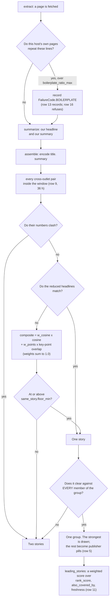

# Plan 29 - the same story, found once

**Last Updated**: 2026-09-16

Non-authoritative working material (CLAUDE.md section 3). Nothing here is a
decision. Current project behaviour belongs in `docs/` (Guardrail #4).

## Why this plan exists

Defect 22 closed on 2026-09-14 and fixed the visible tip of the problem, not the
problem. The pass now groups two items whose published headlines say the same
thing, which took the one-headline cross-source groups still left apart from 27
of 42 down to 1 over the committed days.

**Then the Editor read a full day by hand and the picture changed.** On
2026-09-12 - 356 items, 61 sources - about **95 items, 27 percent of the day**,
sit in a cross-source cluster. The pass found 12, and 4 of those were one outlet
counted twice, so the true figure was **8 of 95**. Byte-identical headlines were
never most of the duplication; nine outlets writing nine different headlines
about the New Delhi Declaration is.

**Owner ruling, 2026-09-14: a duplicate is worse than a miss.** "Having
duplicates is worse than having none - as app owner. It wastes readers' time and
loses attention and interest span." This reverses the lean recorded in
[`../docs/architecture/publishing/layout.md`](../docs/architecture/publishing/layout.md)
under `What chose 0.94`, which set the threshold high because a false merge
costs a story nobody can see is missing. That reasoning still holds **the day
the collapse is drawn**, and until then the ruling stands: reach for recall.

## What the rest of the world does

Read on 2026-09-14. Two papers carry the load and one of them contradicts the
design we have.

**Miranda et al., "Multilingual Clustering of Streaming News", EMNLP 2018**
([arXiv:1809.00540](https://arxiv.org/abs/1809.00540)). The reference online
news clustering system, and the closest match to our problem shape.

| What they do | What it means here |
| --- | --- |
| A document is **not one vector**. It is several TF-IDF sub-vectors - words, lemmas, named entities - and **each is repeated for the title, the body, and both together**. | Our single `title. summary` vector is the thing their design exists to avoid. A title sub-vector is not an optimisation, it is the baseline. |
| Similarity is a **weighted sum of the per-sub-vector cosines**, weights learned by SVM-rank. | One threshold over one cosine is the weakest form of what they built. |
| **Three timestamp features** - Gaussian decay against the newest, mean and oldest document in the cluster, sigma 72 hours. | Adding them moved English F1 92.7 to 94.1, German 90.7 to 97.1, Spanish 88.8 to 94.2. We group within one published day and use no time signal at all. |
| **Embeddings did worse than TF-IDF** for same-language clustering: F1 **74.8 against 92.7**. | Directly contradicts our approach. Worth testing on our data before buying a second encoder. |
| A learned classifier decides when to open a new cluster, beating a tuned threshold: F1 **82.8 to 94.1**. | The "is this a new story" decision is a different question from "how similar are these two", and we answer both with one number. |
| Evaluation is **pairwise** precision, recall and F1 over clustered-together pairs. | The protocol below is theirs. |

**Liu et al., "Growing Story Forest Online from Massive Breaking News", CIKM
2017** ([arXiv:1803.00189](https://arxiv.org/abs/1803.00189)). Tencent's
production system over 60 GB of news. Two layers: cluster **keywords** into a
keyword graph first, then documents into events inside that graph, then events
into story trees. It exists because their stream "contains highly redundant
information" - the same problem in the same words. The transferable idea is the
**two-stage shape**: a cheap blocking pass that proposes candidates, then an
expensive pass that judges only those.

Ground News and Event Registry (Leban et al., WWW 2014) publish no method, but
both are centroid clustering over entity-and-token features with a time window,
which is the same family.

### Easy to hard, with what each buys

| id | Move | Effort | What it buys | Evidence it works |
| --- | --- | --- | --- | --- |
| E1 | **Count an outlet once, not once per feed** | Trivial | Removes a false sentence | Measured: 3 of 43 groups were CGTN with CGTN. Row #2 |
| E2 | **Stop printing the sentence we cannot support** | Trivial | Removes a false sentence | Row #1 |
| E3 | **TF-IDF over headline words, per day** | Half a day, no encoder, no new field | Miranda's own best monolingual feature | F1 92.7 against 74.8 for embeddings, in their data. Untested in ours - row #3 measures it |
| E4 | **Title-only encoder vector** | Half a day, one new persisted field | The labelled false pair drops 0.9317 to 0.7824; two missed true pairs go to 1.0000 and 0.9706 | Row #3 measures it |
| E5 | **Weighted sum of several similarities** instead of one cosine | Days | Miranda's core result | Needs the labels row #3 produces |
| E6 | **Two-stage: cheap blocking, then a judge on the survivors** | Days | Story Forest's shape; also the only way off the quadratic in note 28 | A cross-encoder over ~25 candidate pairs a day fits the runner easily |
| E7 | **Time-decay features** | Days | Their single largest single gain | We group within one day, so the gain is smaller here. Unmeasured |
| E8 | **A canonical "what happened" line from the summariser**, encoded instead of the summary | Weeks | Reaches pairs whose headlines genuinely differ | Cannot be backfilled - no committed day can measure it |

## Status Reckoner

| # | Row | Depends on | Wave | Status | Worker | PR | Worktree |
| --- | --- | --- | --- | --- | --- | --- | --- |
| 1 | Stop printing "Only one of our sources carried this" | - | A | DONE | - | #782 | - |
| 2 | Two feeds of one outlet are one source | - | A | DONE | - | #782 | - |
| 3 | Measure: title signal against the committed days | - | A | DONE | - | #782 | - |
| 4 | Correct the token-share number defect 22 shipped | - | A | DONE | - | #785 | - |
| 5 | Draw the collapse, with a publisher stack that links | - | B | DONE | - | - | - |
| 6 | Retire the four hosts that serve one page | - | B | DONE | - | - | - |
| 7 | One outlet never runs the identical piece twice | - | B | PENDING | - | - | - |
| 8 | A ceiling on the day, beside the ceiling on a run | - | B | PENDING | - | - | - |
| 9 | The same story is one story for 36 hours, not one day | - | C | PENDING | - | - | - |
| 10 | A story that has been running ranks below one that broke today | - | C | PENDING | - | - | - |
| 11 | The lead is a weighted score, and the page says how | 10 | C | PENDING | - | - | - |
| 12 | Label the sheet, then set the weights | - | C | PENDING | - | - | - |
| 13 | The chrome ledger: a host that repeats itself is caught | - | C | PENDING | - | - | - |
| 14 | The composite score, proving it changed nothing | - | C | PENDING | - | - | - |
| 15 | The weights and the 0.88 floor | 12, 14 | D | PENDING | - | - | - |
| 16 | Refuse boilerplate, on a week of evidence | 13 | D | PENDING | - | - | - |
| 17 | Does a short extraction publish at all | - | D | PENDING | - | - | - |

**Owner decisions, 2026-09-15.** Every row carries its contract. The contracts
are the owner's and Fowler's; a worker implements them and decides nothing.
Six candidates were refused and are recorded under `Rejected` so nobody
re-proposes them.

**The comparison is over our own summary, and that is a bet the owner is
making on purpose.** "Assuming the summariser has done the job properly, that
is the premise of the app - let us bet it did and compare on that." Every row
below reads `title. summary` and `key_points`, which the pass already has. No
row reads an article body at assemble.

**Two contracts were ruled by Fowler on 2026-09-15**, under the owner's standing
instruction that the domain authority leads on a contract question and rules in
alignment with intent even where that means scope expansion. Rows 13 and 14
carry those rulings verbatim, including the expansions and the refusals.

### The whole rule, on one picture

**Three things the picture is deliberate about.** The numbers veto sits
**before** everything, because a clashing figure is evidence of difference and
no amount of similarity outvotes it. The headline rule stays a threshold-free
joiner **above** the composite rather than a term inside it, so the rule that
landed on 2026-09-14 cannot regress. And the composite's weights sum to 1.0, so
a floor is a number on the cosine's own scale rather than a coincidence.

## Row #1 - stop printing the sentence we cannot support

- **Scope:** `coverage()` in `frontend/src/lib/components/ItemMeta.svelte` returns
  null at 0 as well as at null. Nothing else changes; `also_covered_by` keeps
  its meaning and the projection keeps the field.
- **Why:** printed **5,299 times** over the committed days against 93 for the
  positive form. The Editor's read of 2026-09-12 says roughly a quarter of the
  items carrying it were on the page more than once. On 2026-09-03 five cards
  said it about an acquisition that ran 13 times on the same page, while three
  other cards on that page said the story was covered twice.
- **What the reader loses, stated:** the genuine signal that a story is an
  exclusive. It comes back when row #3 has measured recall.
- **Oracle:** a reading-page test asserts nothing is drawn at 0, and the existing
  assertions at 1 and at N stay.

## Row #2 - two feeds of one outlet are one source

- **Scope:** `outlet_of` in `backend/idhazh/assemble.py`, used by the
  across-sources refusal and by the `also_covered_by` count.
- **Why:** `source_id` is a feed. Four of our feeds are CGTN and two are The
  Straits Times. Measured 2026-09-15: **3 of the 43 groups** on the committed
  days were one outlet grouped with itself, each printing a corroboration the
  reader did not have.
- **Where the line falls:** `source_name` is the masthead and separates 143 of
  160 feeds. It deliberately does not fold two mastheads of one owner - The
  Hindu and The Hindu BusinessLine are different papers with different desks.
- **Oracle:** two tests, one either side of that line, and the first fails when
  the rule is reverted to `source_id`.

## Row #3 - measure the title signal

- **Scope:** three frozen days named before scoring - 2026-08-24 (730 items),
  2026-08-29 (366), 2026-08-30 (431), the last because it holds the one pair a
  person has labelled TWO STORIES. Four scorers over the same cross-outlet
  pairs: the combined cosine we already have, the same encoder over the headline
  alone, per-day TF-IDF over headline words, and the shipped headline rule.
- **Protocol:** one person labels a shuffled sheet carrying only the two
  outlets and the two headlines - **no scores, no indication of which rule fired**.
  Three verdicts: SAME EVENT, RELATED BUT DIFFERENT, UNRELATED.
- **Read-out:** a precision curve per scorer, and the first honest precision
  figure for the rule that shipped.
- **What it does not measure:** recall. Every candidate is found by a rule, so
  the denominator is missing. The Editor's position is that recall needs a
  hand-labelled **full day**, not a pair sample. That is a second measurement.

### What the machine half already says

Measured 2026-09-14 on a developer machine / Python 3.14.2, 1,527 items over the
three frozen days, **597 candidate cross-outlet pairs** - every pair scoring 0.70
or more on any of the three scorers, plus every pair the shipped rule fires on.
The counts are deterministic and have no spread.

| Scorer | Floor | Pairs found | New, against the rule that ships today |
| --- | ---: | ---: | ---: |
| **The rule that ships today** | - | **16** | - |
| combined `title. summary` | 0.95 | 7 | 0 |
| combined | 0.90 | 67 | 54 |
| combined | 0.85 | 154 | 139 |
| combined | 0.80 | 279 | 264 |
| **title, same encoder** | **0.95** | **21** | **6** |
| title, same encoder | 0.90 | 50 | 35 |
| title, same encoder | 0.85 | 86 | 71 |
| title, per-day TF-IDF | 0.80 | 18 | 4 |
| title, per-day TF-IDF | 0.75 | 26 | 12 |
| title, per-day TF-IDF | 0.70 | 38 | 23 |

**Three things this says before anybody labels anything.**

The combined vector cannot be tuned. Between 0.95 and 0.90 it goes from 7 pairs
to 67, and it is already known to be wrong on most of what it adds - the
labelled two-stories pair sits at 0.9317, inside that jump. There is no floor
with both volume and margin.

**The title scorers are tunable and the combined one is not.** Both title
scorers move smoothly and both concentrate: the title encoder at 0.90 proposes
50 pairs over three days against the combined vector's 67, and it is the one
whose known-bad pair scores 0.7824 rather than 0.9317.

**All of them are still short of what the Editor counted by hand.** The best
tunable setting measured here proposes about 29 pairs a day. The Editor's read
of one day counted about 95 items in cross-source clusters. Pairs and items are
different units, but not by enough to close that gap - so precision is what the
labels will settle, and recall needs the full-day count the Editor asked for.

**The blind sheet exists**: 597 pairs, shuffled with a fixed seed, carrying only
the date, the two outlets and the two headlines. No score, no indication of
which rule fired, no hint of which side is which. At roughly ten seconds a pair
that is about two hours, which is the price Andre named for a number that can be
called recall.

## Row #4 - correct the token-share number

Defect 22 shipped the claim that the summary is "roughly nineteen words in
twenty" of the encoded string, in `story_key`'s neighbourhood, in
`AssembleConfig.group_identical_titles`, in the changelog and in
`docs/architecture/publishing/layout.md`. It was never measured. Andre measured
it on 2026-09-14 with the committed tokenizer over 75 items of the 2026-09-13
day: the title is a median **16 tokens** and title-plus-summary a median **121**,
so the summary is **87 percent of the tokens** and the headline is about one
part in eight. Guardrail #10: an unmeasured number may not justify a design, and
this one is now measured and wrong.

## Row #5 - draw the collapse, with a publisher stack

**Intent.** A reader sees one card per story, and that card says which
newsrooms ran it. Today the grouping is computed, persisted and deliberately
withheld from the page, so every detection gain is invisible.

**Contract.**

- `DigestViewItem` carries `same_story_as`, which the projection drops today,
  and gains `covered_by: list[DigestCoverage]` - **outlet names, not a count**,
  each carrying the name and the member's own item id, ordered by `rank_score`,
  capped at three plus a remainder.
- An item whose `same_story_as` is set **is not drawn as its own card**. The
  anchor draws one card carrying a stack of publisher pills.
- **Every pill is a link to that publisher's own item page**, which carries our
  summary of their piece and its `Read the original` link. It links to our page
  rather than straight out: a reader who wanted the publisher's version still
  reaches it in one more click, and a reader who wanted ours does not lose it.
  Nothing is removed - each member keeps its address, its archive entry and its
  month search entry. This is the reachability answer that pulled the collapse
  the first time, and it is not optional.
- `ui.draw_same_story`, default **true**, removal condition on the declaring
  line. It is the revert path.
- `also_covered_by` keeps its meaning and stays on the wire, because the count
  and the names answer different questions.

**Why the names and the fold ship together.** The fold is what makes a false
merge expensive - a story goes behind a pill instead of printing a wrong number.
The names are what make it recoverable. Shipping the fold first would be the
worst order available.

**Oracle.** A reading-page test on a built day with a known group: the anchor
draws once, the members do not draw as cards, every member's address still
resolves, and every member appears in the month index. A second arm with
`ui.draw_same_story` off restores one card per item.

**What the reader loses, stated.** On a false merge, a story is one click away
instead of on the page. That is the trade the owner took on 2026-09-14.

## Row #6 - retire the four hosts that serve one page

**Intent.** Three of these four feeds do not publish articles. They publish one
template with a different URL each time, and we have been summarising it. The
fourth, `energymonitor`, does publish articles, and the count below is what
found that out.

**What was measured, 2026-09-16.** Found from recorded outcomes only - the
`code`, `source_words` and `source_chars` cells on `state/item-health/**` -
never by matching words in a body. 23 day shards, 12,357 rows, 2026-08-24 to
2026-09-15. Cross-checked against the committed digest tree, which holds 26 days
to the same end date and 9,554 published cards.

| Feed | Rows | Items | Published cards | Median body words | Median body chars | What the rows say |
| --- | ---: | ---: | ---: | ---: | ---: | --- |
| `lemonde-en` | 176 | 169 | 151 | 35 | 209 | `too_short` on 162 rows, `length_out_of_range` on 11. All 173 rows carrying a count say 35 words, and no other value appears. |
| `offshore-wind` | 50 | 45 | 44 | 3 | 18 | `not_prose` on 39 rows. 5 rows carry 219 to 606 words, all on 2026-09-04. |
| `climate-home` | 15 | 13 | 12 | 51 | 331 | `not_prose` on 12 rows. One row carries 2,340 words. |
| `energymonitor` | 34 | 33 | 32 | 357 | 2,474 | **No failure code on 28 of 34 rows.** Those 28 carry 286 to 1,025 words, on 10 separate days. |

260 items, 239 published cards, 2.50 percent of the 9,554 cards in the digest
tree.

**Three of the four had already gone quiet before this row ran.** The last item
each one put in front of the ranker: `offshore-wind` 2026-09-04,
`energymonitor` 2026-09-09, `climate-home` 2026-09-11. Feed health says all four
answered every read to 2026-09-15, so this is the gap health cannot see - the
door opens and nothing recent is behind it. `lemonde-en` alone ran to the last
day.

**The count corrects this row's own table, and one correction is material.**
The estimates it replaces were derived from characters at 6.5 characters a word.
`offshore-wind` at 3 words and `climate-home` at 51 were exact. `lemonde-en` was
9 percent low - 32 estimated, 35 counted - which changes nothing. The item
counts were each a little low: 166, 40 and 12 estimated against 169, 45 and 13
counted.

`energymonitor` was wrong in a way that inverts the finding. The row read 6
items at 398 chars and 61 words and called the signal "none". Those 6 rows are
real, and they are 6 rows out of 34. The other 28 carry no failure code and run
286 to 1,025 words. **Energy Monitor served an article about four times in
five, up to the day it went quiet.** The row's own subset was its failures, and
a feed's failures always look like a template host, because that is what a
failure is.

**It was retired anyway, and the retirement stands on its own facts.** The row
said to retire it and a worker decides nothing (`CLAUDE.md` section 0, section
0d), and Energy Monitor has put nothing in front of the ranker since
2026-09-09 either way. What is handed back is the reason: it was retired as a
template host and it is not one. Un-retiring it is one `retired_on` field and
one `status`. The `energy` desk went from 27 active feeds to 24 on this row
against a floor of 21; putting Energy Monitor back takes it to 25.

**Contract.**

- Each of the four moves from `feeds` to `retired` in `config/sources.json`,
  with `status: retired` and `retired_on` set to the date the row lands. That is
  the tombstone shelf the contract already describes - read by nobody who
  fetches and by everybody who has to put a name on an id.
- **Nothing published is touched.** Their committed items keep their addresses,
  their archive entries and their search entries. A retired feed stops costing a
  request; it does not un-publish a story.
- The `lemonde-en` candidate leaves `config/pipeline-tests.json`, which drops the
  list from 24 to 23 against a floor of 20. A test dispatch resolves a
  candidate's vertical and tier off the live feed list, so an orphan is a
  `KeyError` 40 minutes in.

**What the reader loses, stated.** Three of these are energy feeds and the desk
is already thin. For three of the four the reader loses nothing, because they
never delivered an article. For `energymonitor` the reader loses 32 cards over
26 days - a little over one a day - and that is a real loss rather than a paper
one, even though the feed had already stopped delivering them.

**Oracle.** The four ids appear in `retired` and not in `feeds`; a collect run
asks them for nothing. The existing retirement tests cover the shape.
`test_the_address_list_can_still_answer_a_draw` now reads the live feed list
rather than searching the file's text, which would find a retired id on the
tombstone shelf and pass.

## Row #7 - one outlet never runs the identical piece twice

**Intent.** The same piece from one outlet appears once.

**Contract.**

- A deterministic same-outlet, same-identity check at **plan** time, so the
  second copy is never summarised.
- It is **not** part of `collapse_same_story`. That pass refuses same-outlet
  pairs by design and therefore can never catch this; adding it there would
  break the across-outlets rule row #2 just repaired.

**Oracle.** A built plan carrying one outlet's piece twice plans it once. A
second arm with two different outlets plans both.

## Row #8 - a ceiling on the day, beside the ceiling on a run

**Intent.** Two different things need bounding and one knob is doing both
badly. A run has to finish inside its shard. A day has to be readable.

**Contract.**

- `run.safety_ceiling_per_run` stays, and its reason is narrowed in writing: it
  protects the worker from its timeout.
- `run.safety_ceiling_per_day` is added. It bounds what the day publishes across
  every run.
- **Both are guardrails, not rules.** They only ever refuse. Neither chooses
  content, ranks it, or reorders it; they bound how much the content-picker may
  hand over. A day under the ceiling is untouched.
- Numbers are the owner's and are recorded on the line that declares them.

**Why both.** The per-run cap is 80 and the day runs about five times, so a
number a person set at 80 publishes about 356. Anybody reading `80` and picturing
an 80-item day is wrong by a factor of four and a half.

**Oracle.** A built multi-run day stops at the day ceiling with runs still
under their own. A second arm stops a single run at the run ceiling with the day
still under its own.

## Row #9 - the same story is one story for 36 hours, not one day

**Intent.** A story that breaks at 23:00 and is picked up at 07:00 is one story.
Today grouping sees one published day and stops at midnight, so it is two.

**Contract.**

- `assemble.same_story_window_hours`, **default 36**, configurable so the number
  can move without a source edit. 36 covers an evening break picked up the next
  morning and refuses a genuine follow-up two days later.
- The pass reads the current day plus **only** those earlier days the window can
  still reach - at 36 hours that is one earlier day, and the read is bounded by
  the window rather than by how much archive exists (Guardrail #12). The
  declaration goes beside the code and names what it reads and why a single day
  cannot answer the question.
- **Nothing in an already-published day is rewritten.** A day that has been
  published is finished. When today's item matches yesterday's, the grouping is
  recorded on **today's** item only, and it points at yesterday's id.
- `same_story_as` therefore has to carry a date as well as an id. That is a
  persisted contract change: stamp `version`, append the changelog entry, and
  ship the read-side migration in the same commit - an item written before this
  carries a bare id and means "today".
- The card's wording changes when the match is older: the pill says the outlet
  and that it ran earlier, rather than implying it ran today.

**What this costs, to be measured before it lands.** One extra day of items and
vectors loaded per run, and the pair count rises with the square of the items in
the window. On a 356-item day that is about four times the pairs. The pass uses
0.23 percent of the assemble budget today, so four times is still about 1
percent - but that is arithmetic on a measured number, not a measurement, and
the row takes the reading before it claims it.

**Oracle.** A built pair 30 hours apart groups; the same pair 40 hours apart does
not; the window set to 0 restores today's same-day behaviour exactly. A built
earlier day is byte-identical before and after the later run.

## Row #10 - a story that has been running ranks below one that broke today

**Intent.** Freshness is a ranking signal we already have the data for and do
not use.

**Contract.**

- A derived decay term over `published_at`, which every item already carries.
  No model, no new persisted field, no fetch.
- It feeds **ranking**, never grouping. A story's age changes where it sits, not
  whether it is the same story as another.
- The shape and its constant are config, with a sane default, so the behaviour
  changes without a source edit.

**Oracle.** Two items alike in every other signal, one published today and one
two days ago, rank in that order; with the knob at zero they rank as they do
today.

## Row #11 - the lead is a weighted score, and the page says how

**Intent.** The day's leading stories are chosen by one score today. They should
be chosen by several signals with declared weights, and a reader should be able
to find out what those are.

**Contract.**

- A composite score over signals the payload already carries. At minimum: the
  existing `rank_score`, how many outlets ran it (`also_covered_by`), and the
  freshness term from row #10.
- **Every weight is config with a sane default.** Change the config and the lead
  order changes with no source edit (Guardrail #6). No weight is a literal.
- The composite is **deterministic and model-free**. It reads numbers the
  pipeline already wrote; no model ranks anything.
- **`also_covered_by` enters the composite only above a floor the owner sets**,
  because at today's recall the count is zero on most genuinely multi-source
  stories. Below that floor its weight is zero and the lead behaves as it does
  now. Row #12 supplies the recall figure that sets the floor.

**The documentation is part of the row, not a follow-up.** A page under
`docs/architecture/publishing/` owns the composite and carries a mermaid diagram
showing, in one picture: what signals enter, where each is computed, how the
same-story pass folds a group, and how the leading stories are chosen over the
folded day. The existing same-story flowchart in
[`../docs/architecture/publishing/layout.md`](../docs/architecture/publishing/layout.md)
is one half of it and is linked rather than copied.

**Oracle.** A built day where the top item by `rank_score` alone is not the top
item by the composite, proving the weights bind. A second arm with every weight
but `rank_score` set to zero reproduces today's order exactly.

## Row #12 - label the sheet, then set the floor

**Intent.** No floor is chosen by taste, and no weight in row #11 is either.

**What labelling is, since it has been asked.** It is **not** training a model
and it produces no model. A person reads two headlines and says whether they are
the same story. With a few hundred of those answers, we can count - for any
candidate floor - how many pairs the rule gets right and how many it gets wrong.
That is how the number is chosen instead of guessed. Nothing about it assigns a
score to a publisher; it scores the **rule**.

**Contract.**

- The sheet, its answer key and the script that builds it live under
  `test-results/same-story-labels/`, which git ignores. They are working
  material, not a published artefact.
- Blind: date, two outlet names, two headlines. No scores, no indication of
  which rule fired, shuffled with a recorded seed.
- Three verdicts: SAME EVENT, RELATED BUT DIFFERENT, UNRELATED.
- Regenerate the sheet **after** row #9, so the window's new pairs are in it.
- **Precision is not recall.** Every candidate is found by a rule, so the sheet
  measures precision only. Draw 200 further pairs at random from **below** the
  candidate filter and label those too; if none is SAME EVENT, the filter's own
  recall is at least 98.5 percent and the study may use the word recall. If any
  is, it reports a lower bound and names what it could not see.

**A question this row should answer while it has the labels.** The vector is
built over `title. summary`. Three cheap variants can be scored on the same
labels at no extra cost: the summary alone, the title alone, and the item's
`key_points` joined. If one separates better than what ships, that is a free
improvement and the measurement is already paid for.

## Row #13 - the chrome ledger: a host that repeats itself is caught

**Ruled by Fowler, 2026-09-15. Correction level 4.** The scope expansions below
are his, under the owner's standing instruction that structure fixes matter.

**Intent.** A publisher that serves one template for every article is caught the
third time, not the 166th. No length rule can see a 400-word template; only
comparing a host's pages against each other can.

**The defect.** `boilerplate_ratio(lines, seen_elsewhere)` in
`backend/idhazh/extract.py` has existed, with an enum value, two config knobs,
tests and documentation on three pages, and **has never fired**: nothing in
production passes `seen_elsewhere`, so it divides by an empty set and returns
0.0. Measured: **zero `boilerplate` cells in 12,277 committed item-health rows.**

**Contract.**

| What | Ruling |
| --- | --- |
| Grain | **One row per (host, line hash)**, keyed on the registrable host of `canonical_url` - **not `source_id`**. Chrome belongs to the server template, and keying on the feed both fragments the evidence and re-makes the mistake row #2 repaired |
| Store | **`state/chrome.csv`, one file, unsharded.** The read carries no time window - chrome learned in August is chrome in September - so a partition would open every file anyway |
| Contract file | `backend/idhazh/contracts/chrome_line.py`, plus the import and tuple entry in `contracts/export.py` |
| Schema stem | `chrome-line-row` |
| Fields | `version, host, line_rule, line_hash, pages_seen, first_seen, last_seen`. `line_hash` uses the existing `Sha256` type |
| `line_rule` | **A column, not a comment.** It versions the normaliser (NFKC, whitespace collapsed, casefolded, then sha256) and a read filters to the current rule. Without it a changed normaliser makes every row dead weight that silently never matches |
| Writer | **`assemble`, not `extract`.** Only assemble has the day's whole item set, so only assemble can count distinct pages a host served. A work shard sees `index % shards` of the day, and eight shards incrementing one key through a `merge=union` CSV is a race this repository has already paid for twice |
| Reader | `stages/common._fetch_one`, passing the host's line set into the `seen_elsewhere` parameter that already exists. **`extract.py` does not change at all** |
| Bound | Two config caps **and an eviction order**, and the order is load-bearing: evict by `pages_seen` **ascending**, then `last_seen` ascending. Recency eviction would evict the chrome using the very articles you compare against |
| Knobs | `extract.chrome_lines_per_host_max`, `extract.chrome_forget_days`, `extract.chrome_pages_min` (default 3), on `ExtractConfig` |
| Guardrail #12 | **A declaration is required**, and the shape is a cover enforced on the store rather than on the read - `state/traces/` is the precedent. It says: the read is one streaming scan filtered to the hosts this shard's plan names; the file is bounded by hosts times `chrome_lines_per_host_max`, so it grows with the source registry and stops, never with the archive |
| The pruner | **Ships in the same commit as the writer**, in `stages/prune_state.py` beside `prune_seen`. A store bound with no pruner is prose |
| Read-side migration | **None.** The ledger is new, so no earlier run wrote a shape to migrate. `line_rule` is a forward provision, not a migration |
| `reject_boilerplate` | **Stays false in this commit.** The signal has never fired once, so flipping the refusal in the commit that first makes it fire means nobody can tell a correct refusal from 12,000 wrong ones. That is row #16 |

**What the bodies never do.** Only hashes persist. A chrome line is fetched text,
and a sha256 of it cannot carry an instruction (Guardrail #11). Nothing on the
row is free text, by construction.

**Removals in this row.** `FailureCode.BOILERPLATE` leaves
`SOURCE_NEUTRAL_FAILURE_CODES` in `backend/idhazh/telemetry.py`, and the count
stated in words in `docs/architecture/sources/item-health.md` moves with it.
That set means "a failure that says nothing about the source", and the moment
this fires, `boilerplate` says the host serves a template - the most
source-specific thing a failure can say. Leaving it in credits a host that
served nothing.

**Corrections, not deletions.** Three pages describe the signal as inert and
each becomes wrong when this lands:
`docs/architecture/sources/trust-boundary.md`, `docs/concepts/config.md`,
`docs/concepts/pipeline-loop.md`. **No test is deleted** - the unit tests in
`backend/tests/test_extract.py` cover a function that is about to run for real;
any docstring in them calling the path theoretical is corrected.

**Tests.** Unit: the line normaliser, the eviction order, the fold. Contract:
the new schema, a fixture under `tests/fixtures/contracts/chrome-line-row/`, the
export entry, and the three new keys in **both**
`every-knob-differs-from-the-committed-config.json` and `tuned.json` - only the
full suite catches those. Integration: `to_article_with_source` driven with a
`seen_elsewhere` set built by the real fold from two captured pages under
`tests/fixtures/pages/`, no mocks. End-to-end: one canary arm proving a refused
item still writes an honest item-health row. No test walks `state/` or the
committed days.

**The number this row does NOT claim.** The 5.2 hours of summarize time those
four hosts consumed are **not** this row's to save - row #6 retires them, and
three of the four already carry a length signal. What this row uniquely catches
is the Energy Monitor shape: a host whose template is long enough that no length
rule will ever see it.

## Row #14 - the composite score, proving it changed nothing

**Ruled by Fowler, 2026-09-15. Correction level 4.** This is the structural half
of the owner's composite ruling; row #15 is the behavioural half.

**Intent.** Replace one cosine and one floor with a weighted score over several
signals, so no signal is traded away for another - and prove the machinery
changed nothing before any weight moves.

**Contract.**

| What | Ruling |
| --- | --- |
| Shape | **An extension of `AssembleConfig`, as a nested `SameStoryConfig`** in `backend/idhazh/contracts/knobs/placement.py`. Nothing new is persisted and no boundary is crossed, so a new contract would be ceremony with no beneficiary. Nested because the weights carry an invariant across them |
| Schema stem | None new. It lands in `schemas/app-config.schema.json` |
| **The invariant** | **The positive weights sum to exactly 1.0, enforced by a `model_validator`, and every term is itself on 0 to 1.** Without it, "floor 0.88" answers nothing - 0.88 of what? With it the composite is on the cosine's own scale, so every threshold already recorded in the docs stays readable |
| Terms | **Two: the cosine over `title. summary`, and key-point overlap.** Cosine separates 100 percent; key-point overlap separates 97.0 percent and is the only other term whose different-pair p99 (0.0962) sits below its same-pair median (0.2419) |
| The numbers clash | **A hard veto, not a negative weight.** It fires on 0.0 percent of same-story pairs - zero of 67 - and a term with no false positives is a rule, not evidence. In a sum, a large enough cosine outvotes it, which is the one case it exists to refuse. A negative weight would also break the sum-to-one invariant |
| The headline rule | **Stays a threshold-free joiner above the composite**, not a term inside it. Inside a sum, a matching-headline pair with a weak cosine could fall below the floor - a regression against the rule that took one-headline groups still apart from 27 of 42 down to 1 |
| Order | numbers clash refuses; identical reduced headlines join; otherwise the composite scores; then complete-link, unchanged |
| `duplicate_similarity_min` | **Retired and refused, not aliased.** `refuse_a_removed_knob("duplicate_similarity_min" -> "same_story.floor_min")`. 0.94 of a cosine and 0.94 of a composite are different quantities, so a silent alias would carry a stale number forward as if it still meant the same thing |
| Interpretability | The weights sum to 1.0; every term is on 0 to 1, validated; **the pass logs the terms that carried each group** at INFO through the existing `telemetry.event` path - about 84 groups a day, no contract needed; and the published field is a **count**, not the score, so the score never reaches a reader |
| Payloads written under the old rule | **Untouched, and nothing re-derives them.** `_validator_identity()` does not hash `collapse_same_story`, so **no day-validation receipt is re-earned** |

**The oracle is the whole point of this row.** It ships with cosine weight 1.0,
key-point weight 0.0 and floor 0.94, and its acceptance is a replay over the
committed days producing the **identical groups**. That proves the machinery
moved nothing. Mixing the mechanism with the weights means a group that moves
cannot be attributed to either.

**Refused from the composite: shared rare title tokens.** Its different-pair p99
is 1.0000, so about one in a hundred different pairs scores a perfect 1.0 - over
9,055 pairs that is roughly 90 wrong pairs each handed a full weight. Its
separation, 35.8 percent, is the weakest of the three and its top end is
actively misleading. What reopens it: the same distribution measured
**conditioned on the cosine already being near the floor**, rather than over
9,055 random pairs of which 99.9 percent are nowhere near the decision.

**Removals in this row.** `assemble.duplicate_similarity_min` from
`config/idhazh.json` and from `contracts/knobs/placement.py`, with its long
`Field(description=...)`; the module constant `DUPLICATE_SIMILARITY_MIN` in
`backend/idhazh/assemble.py`; and the prose in
`docs/architecture/publishing/layout.md` that calls 0.94 a cosine floor. The
labelled table under `What chose 0.94` **stays** as the evidence it is, retitled
to what it measured.

## Row #15 - the weights and the 0.88 floor

**Intent.** The owner's ruling, 2026-09-15: "drop to 0.88, the world is full of
regurgitated stuff, then originality wins on merit."

**Contract.**

- `same_story.floor_min` moves to **0.88**, and the weights move off
  `1.0 / 0.0` to values fitted on the labels row #12 produces. Fitting weights
  against unlabelled marginal distributions is fitting to noise.
- Nothing else changes. Row #14 has already proved the machinery.

**The price, stated once so nobody has to rediscover it.** At floor 0.88 the
cosine admits **7 of 9,055** random cross-outlet pairs, and the pair a person
labelled TWO STORIES scores **0.9317**, so 0.88 merges it. Whether the composite
pulls that pair back under the floor is **unknown** - the measured numbers are
marginal distributions over all pairs, and 99.9 percent of those are nowhere
near the decision. Row #12's labels are what answer it.

**Why now is the cheapest moment.** `same_story_as` is recorded and not drawn, so
today a false merge costs exactly one wrong corroboration count. The day row #5
draws the collapse, a false merge starts costing a story nobody can see is
missing. **Today a false merge is cheap and it will never be this cheap again.**

## Row #16 - refuse boilerplate, on a week of evidence

**Intent.** Turn the chrome signal from a recording into a refusal, once there
are real rows to read.

**Contract.** After row #13 has run for a week, read the `boilerplate` cells it
wrote. If they name hosts that genuinely serve templates, flip
`extract.reject_boilerplate` to true and land the refusal **before summarize**.
If they name genuine articles, tune `boilerplate_ratio_max` instead and say what
the reading was.

**This is a reading, not a design question.** Correction level 3, and it needs a
person because it changes what publishes.

## Row #17 - does a short extraction publish at all

**Surfaced by Fowler and explicitly NOT ruled by him**, because it decides what a
reader gets, which is the Editor's and the owner's altitude (section 14).

**The situation.** `extract.reject_too_short` does not exist. Roughly 200 of the
206 cards in row #6's table were `too_short` and published anyway, because
**Owner override O3** says a shape signal records and lets the item continue.
The structural half is already clean: an abstract-form feed gets `brief=True,
failure_code=None` while an article-form feed with 35 words gets `brief=True,
failure_code=TOO_SHORT`, so the two facts are already distinguishable and no
contract change is needed. It is one knob and one branch beside two that exist.

**What it costs to take.** It overturns O3, which must be amended in the same
commit (section 0). Row #6 has already removed the measured benefit by retiring
the four hosts, so what remains is a rule for the next host that does it - and a
cost of roughly **386 genuine short items** dropped.

**This row is a decision request, not an implementation.** It does not start
until the Editor and the owner rule.

Recorded so nobody proposes them again. Each is a dated decision, not a law
(section 0a) - what would reopen it is named.

| Proposal | Why it was refused | What would reopen it |
| --- | --- | --- |
| Cut the day to 90-120 items | The digest is a self-curating feed of digests, not a fixed-size bulletin. Content chooses its position and its relevance; we do not choose content, and more desks are coming rather than fewer | Nothing on the present design. The day is bounded by row #8's ceilings, which refuse without choosing |
| Per-day TF-IDF over headline words | Refused as a dependency, and that reason was wrong - it is about twenty lines of `collections.Counter` and `math.log`, no install and no shipped bytes. It stands refused because the comparison this project bets on is semantic and over the summary, and a word-overlap score is neither | Row #12 measuring it beating the shipped scorer on the same labels |

| A canonical "what happened" line from the summariser | Cannot be backfilled, so no committed day can measure it | A measured failure that only a rewritten summary could reach |
| Encode the article's lede and compare that | Proposed on 2026-09-15 and refused the same day. It serves no purpose the summary does not already serve, and the premise of this project is that the summariser did its job - so the comparison is over what the summariser wrote. The encoder's 256-token window meant it was never the whole article either | A measurement showing our summaries of one story diverge in a way the articles do not |
| Shared rare title tokens as a term in the composite | Its different-pair p99 is 1.0000 - about one different pair in a hundred scores a perfect match, which over 9,055 pairs is roughly 90 wrong pairs each handed a full weight. Separation 35.8 percent, the weakest of the three | The same distribution measured conditioned on the cosine already being near the floor, rather than over random pairs 99.9 percent of which are nowhere near the decision |
| Writing the chrome ledger from the work shards | A shard sees `index % shards` of the day, so it cannot count distinct pages a host served, and eight shards incrementing one key through a `merge=union` CSV is a race already paid for twice | Sharding changing so one host's items land in one shard - which `stages/common.py` deliberately refuses, because it would concentrate long articles on one worker |
| Keying the chrome ledger on `source_id` | Chrome belongs to the server template, not the feed. Keying on the feed fragments the evidence and re-makes the mistake row #2 repaired | A measurement showing two feeds on one host serve different templates |
| Rebalance which desks get space | Same ruling as the day size: content chooses its position | Nothing on the present design |
| Let the cross-source count pick the day's leads | Not refused - **taken**, as row #11, with the count gated behind a recall floor so it cannot feed noise into the most valuable slots on the page | - |

## Which page owns which question

Ruled by Fowler, 2026-09-15. One page answers one question; a page that would
end up holding two gets a split rather than a section.

| Question a person arrives holding | Page | New? |
| --- | --- | --- |
| Why did two items become one story, and on what score? | `docs/architecture/publishing/layout.md`, the same-story section and its flowchart | Existing. `docs/agents/bootstrap.md` already routes here. The flowchart gains the veto box and the composite box |
| What are the weights, and what did the labels say? | Same page, the `What chose 0.94` section, retitled to what it now decides | Existing |
| **Why does a host serve chrome instead of an article, and what do we do about it?** | **`docs/architecture/extraction/chrome.md`** | **New.** That directory holds only `elements.md` today. The question stands alone - somebody arrives holding "why did this host publish 200 empty cards" without needing another page's title in the sentence |
| Where does `state/chrome.csv` live, what is its grain, does its read carry a window? | `docs/architecture/contracts/schemas.md` | Existing - one row |
| Does this read cost more as the repository grows? | `docs/concepts/growing-reads.md`, under `A cover that is not a clock` | Existing - one paragraph beside `state/traces/` |
| What do the three new knobs do? | `docs/concepts/config.md` | Existing |
| What does a `boilerplate` cell in item-health mean now? | `docs/architecture/sources/item-health.md` | Existing |
| What ages out of `state/`, and on what age? | `docs/architecture/publishing/retention.md` | Existing - the chrome prune joins the inventory |

**The chrome rule does not go in `item-health.md` or `trust-boundary.md`.** Both
already answer their own question, and a chrome subsystem inside either makes a
page hold two answers.

## Limits nobody trades

From the Editor's ruling, 2026-09-14, except where the owner has since moved
one. Each is a rule a grouping change has to honour, not a preference.

- **A reaction is never merged into its event.** The reaction is the newer news.
  This is the 0.9317 pair.
- **An analysis piece is never merged into a reporting piece.** `source_kind`
  already records which is which. It is 5 percent of the day and the most
  distinctive 5 percent.
- **A round-up or live blog is never grouped, in either direction.**
- **Two feeds of one outlet are one source.** Row #2, landed.
- **No sentence on a card may state as fact something the same page
  contradicts.** Silence is always available.
- **A published day is never rewritten.** Row #9 crosses days by recording the
  match on the newer item only.
- ~~Grouping never crosses days.~~ **Overruled by the owner, 2026-09-15.** A
  story that breaks at 23:00 and is picked up at 07:00 is one story, and the
  window is `assemble.same_story_window_hours`, default 36.

From the Editor's ruling, 2026-09-14. Each is a rule a grouping change has to
honour, not a preference.

- **A reaction is never merged into its event.** The reaction is the newer news.
  This is the 0.9317 pair.
- **An analysis piece is never merged into a reporting piece.** `source_kind`
  already records which is which. It is 5 percent of the day and the most
  distinctive 5 percent.
- **A round-up or live blog is never grouped, in either direction.**
- **Two feeds of one outlet are one source.** Row #2.
- **No sentence on a card may state as fact something the same page
  contradicts.** Silence is always available.
- **Grouping never crosses days.**
- **Nothing is removed from the page until recall is measured.**

## Out of scope

- **Two-stage blocking** - bucket items on a cheap key, compare only inside a
  bucket. The premise is a cost problem we do not have: the pass spends 0.23
  percent of the assemble budget on a typical day and 0.97 percent on the
  largest ever published. Row #9 raises the pair count about fourfold, which is
  still around 1 percent, so this stays out until a reading says otherwise.
- **Time decay inside the grouping pass.** Row #9 makes the window 36 hours
  rather than weighting by age inside it: a pair is inside the window or it is
  not. A decay curve would add a second number to tune for no measured gain.
  Row #10 takes the half of the idea that pays, in the ranker.
- **Rewriting a published day.** Row #9 records a cross-day match on the newer
  item only. A finished day stays finished.
- Day size and desk balance - both refused above.

## See also

- [`../docs/architecture/publishing/layout.md`](../docs/architecture/publishing/layout.md) - the rule, the flowchart and the measurements.
- [`20260823-known-defects-plan.md`](20260823-known-defects-plan.md) - defect 22, which this plan continues.
- [`20260906-data-growth-research.md`](20260906-data-growth-research.md) - note 28, the quadratic this pass is.
