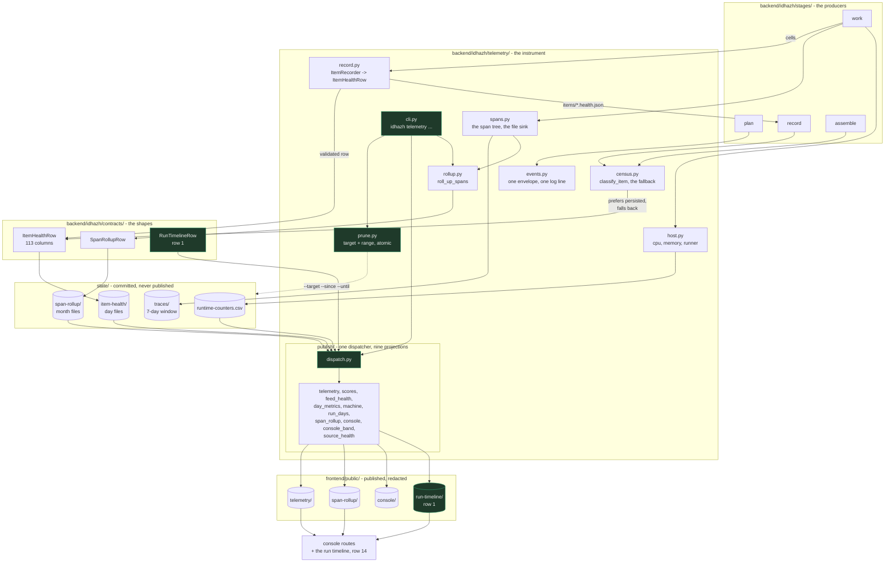

# Plan 32 - one telemetry package, and the 113 columns land

**Last Updated**: 2026-09-15
**Level**: 5 (persisted contracts, a package boundary, and the published operator surface)

Non-authoritative working material (CLAUDE.md section 3). Nothing here is a
decision about current behaviour; that belongs in `docs/` (Guardrail #4).

## Section 0 - Operating contract

| Field | Value |
| --- | --- |
| Why this plan exists | 70 of item-health's 113 columns are empty on every committed row, 58 of them because the value is computed and discarded; and the code that observes this pipeline is 7,300 lines spread over 19 modules with no owner. |
| Hard scope - in | A `backend/idhazh/telemetry/` package that owns every observation writer. The recorded row persisted so the census stops being rebuilt from two payloads. 64 of the 70 empty columns filled. A `prune` subcommand. The run timeline, contract first. A provenance line for all 113 columns. |
| Hard scope - out | see the table below |
| ESCALATE triggers | (1) any row needs a NEW field on `ItemHealthRow` - the plan fills columns that already exist and mints none; (2) `state/` grows by more than 25 percent on a published day; (3) a published payload a reader's page fetches changes shape; (4) the timeline needs a model verdict of any kind (section 0a). |
| Chosen strategy | Rip the bandage: the package is created, proven, and the producers cut over in one pass per surface, with no compatibility shim and no dual-write period. Owner ruling, 2026-09-15 - "no prolonged cutover, no hostages". |
| Execution | autonomous orchestrator per `docs/how-to/execute-a-plan.md`. Parallel N = 4. |

### Hard scope - out

| What is out | What it costs to leave out | What would bring it in |
| --- | --- | --- |
| `ledger.py`, `retention.py`, `day_partition.py`, `month_partition.py` moving into the package | 3,341 lines stay outside the owner of the thing they store. A reader looking for "where does a row land" still opens two trees | A measurement that a change to one of them required a change inside `telemetry/` in the same commit, twice |
| `frontend/public/digest/` and `frontend/public/assist/` producers | they stay outside the package, which is correct - they are the product, not the instrument. Costs nothing unless somebody later reads the package name as "everything that writes a file" | Never. This is a boundary, not a backlog item |
| The three server-slot columns (`slot_id`, `kv_tokens_at_start`, `prefix_shared_with_previous`) | 3 of 113 stay empty and prefix reuse stays unmeasurable per item | **answered by row 16, 2026-09-15: build `b10598-56db501e7` carries all three on the `/completions` reply the summarizer already reads** - `id_slot`, `tokens_cached` and `timings.cache_n`, at no extra request. What is left is a decision, not a reading: `slot_id` is a constant at `-np 1` and `timings.cache_n` is already filed as `cached_tokens`, so only `kv_tokens_at_start` says anything new |
| Re-encoding any column value | 369,855 bytes stay on disk - 7.1 percent of the store. Measured 2026-09-15: every closed-vocabulary column written as an ordinal integer costs 58,567 bytes against 428,422 today. `version` alone is 148,774 bytes of 13 repeated date stamps | it is row 16's measurement that defers this, not a refusal. **Measured 2026-09-15: compressing the same files saves 3,551,430 bytes, 68.4 percent of the store and 9.6 times the ordinal**, with no readability cost, so it is taken first and this is re-priced after |
| Compressing the published projections | **measured 2026-09-15: 6,720,442 bytes of 8,726,606 stay uncompressed, 77.0 percent**. The site is at 39.2 MB of a 1 GB cap, so nothing binds | one build proving every console fetch path handles the encoding |
| A year rung on the fold ladder | year-over-year has no shape | a month fold that is too big to read. At kilobytes a month it is not |

---

## Section 1 - Status Reckoner

| # | Row title | Depends-on | Parallel-group | Status | Worktree | PR | Subagent |
| --- | --- | --- | --- | --- | --- | --- | --- |
| 1 | The shape the timeline reads, settled first | - | A | PENDING | - | - | - |
| 2 | Where every one of the 113 columns comes from | - | A | PENDING | - | - | - |
| 3 | The package exists and re-exports | - | A | PENDING | - | - | - |
| 4 | The recorder moves in and returns a validated row | 3 | B | PENDING | - | - | - |
| 5 | The work stage persists what it recorded | 1, 4 | C | PENDING | - | - | - |
| 6 | The census prefers the persisted row | 5 | D | PENDING | - | - | - |
| 7 | Six columns that are arithmetic over filled ones | 6 | E | PENDING | - | - | - |
| 8 | The label call's own clock and both finish reasons | 6 | E | PENDING | - | - | - |
| 9 | The host sampler moves in | 3 | B | PENDING | - | - | - |
| 10 | Nine publishers become one dispatcher | 3 | B | PENDING | - | - | - |
| 11 | `idhazh telemetry` and its subcommands | 3, 10 | F | PENDING | - | - | - |
| 12 | `telemetry prune` takes a target and a range | 11 | G | PENDING | - | - | - |
| 13 | A closed vocabulary is an enum | 2 | B | PENDING | - | - | - |
| 14 | The run timeline draws | 1, 7, 8 | H | PENDING | - | - | - |
| 15 | The two published mirrors nothing reads are deleted | 10 | F | PENDING | - | - | - |
| 16 | Does the server answer `/slots`, and the ordinal encoding priced | - | A | DONE | p32r16 | - | - |

**Column arithmetic.** 43 of 113 carry a value today; `telemetry._row` names 31 fields and `_flatten_calls` adds the call cells, 44 written of which one is always empty. Row 6 fills 58, row 7 fills 6, row 8 fills 3. **110 of 113 after row 8.** The last three are row 16's question.

## Section 1a - What every row delivers, without being asked

A row is not done when its code works. Each row below ships all five of these or it does not merge. Owner ruling, 2026-09-15.

| Part | Rule |
| --- | --- |
| The change | the code the row's Scope names |
| The tests | at the tier matching the surface (CLAUDE.md section 13), in the same commit |
| **The removal** | the module, the test and the doc paragraph the change makes dead go in the SAME commit. A row that adds a producer and leaves the old one is a row that doubled the sprawl it was written to end |
| **The docs** | the page that owns the surface, updated. A page answers ONE question; where the row's answer does not fit the page's question, it gets its own page rather than a section (`docs/reference/documentation-structure.md`) |
| The diagram | where the row changes what flows where, the diagram in section 1b moves with it |

**No row is allowed to leave a deprecation.** There is no shim, no `_old` suffix, no "kept for compatibility" and no commented-out block. If the old thing still has a caller, the row that removes the caller is a dependency, not a follow-up.

## Section 1b - What the package looks like when the plan is done

Green is new in this plan. Everything else is a move, not a rewrite.

**What leaves.** `backend/idhazh/telemetry.py`, `itemrecord.py`, `machine.py`, `stages/counters.py` and nine `publish_*.py` modules are deleted by the row that moves them, not left beside their replacement. `frontend/public/scores/` and `frontend/public/feed-health/` are deleted by row 15.

---

## Section 2 - Row #1 - The shape the timeline reads, settled first

- **Scope:** A `RunTimelineRow` contract and its published projection are declared and generated, before any producer fills a column, so the writers in rows 5 to 8 produce the shape the chart reads rather than a shape it has to migrate.
- **Files touched:**
  - `backend/idhazh/contracts/run_timeline.py` (new)
  - `schemas/run-timeline-row.schema.json` (generated)
  - `frontend/src/contracts/` (generated)
  - `docs/architecture/publishing/console-payloads.md`
- **Acceptance gates:** local `ruff check .`, `mypy backend`, `python -m idhazh.contracts.export` with zero drift. CI runs the full suite.
- **Oracle:** the generated schema round-trips a hand-built row carrying every step, and a second row carrying only `fetch` loads with the rest null. It cannot settle whether the chart is readable - that is row 14.
- **Decisions:**

| # | Decision | Authority |
| --- | --- | --- |
| 1 | A row is one item, not one stage and not one span. The chart's y axis is items | Jony |
| 2 | The x axis is elapsed milliseconds from the run's start, so an item that queued 40 seconds sits 40 seconds right. A category axis hides the queue | Jony |
| 3 | Eight named steps in the order they happen: plan, fetch, extract, label call, summary call, visual plan, score, publish | Jony |
| 4 | The residual is its own field and is drawn hollow, never tinted. Nobody has agreed how much overhead is too much, so a colour would publish an alarm that does not exist | Susan |
| 5 | The contract lands before the producers. A consumer that starts reading a shape the writers then change is a migration nobody needed | Fowler |

- **Rejected alternatives:**

| # | Option | Why rejected | What it would cost to take | Authority |
| --- | --- | --- | --- | --- |
| 1 | Build the chart first and infer the shape from what it needs | the chart would ship against empty columns and apologise, which is what the console already does on three panels | one rebuild of the projection after the columns fill | Susan |
| 2 | Draw from `span-rollup` alone | the rollup is per shard and per span name, so it cannot place one item on a clock | a second per-item store | Fowler |

---

## Section 3 - Row #2 - Where every one of the 113 columns comes from

- **Scope:** `docs/architecture/sources/item-health.md` gains a provenance line per column: which module computes it, which writer lands it, and whether it is filled today.
- **Files touched:**
  - `docs/architecture/sources/item-health.md`
  - `backend/utilities/item_health_provenance.py` (new; operator surface, not a test)
- **Acceptance gates:** local `python backend/utilities/doc_load.py`, `ruff check .`. No application suite - documentation and one operator script.
- **Oracle:** the utility reads `ItemHealthRow.csv_columns()` and the package source, and every column it prints appears in the doc table exactly once. It cannot settle whether a stated producer is the *right* producer.
- **Decisions:**

| # | Decision | Authority |
| --- | --- | --- |
| 1 | The table is generated by a utility and pasted, not hand-maintained. 113 rows hand-kept is 113 rows that drift | Fowler |
| 2 | It lives in `backend/utilities/`, not in `backend/tests/`. It reads a growing collection to report what is filled, which section 13 forbids a test to do | Fowler |
| 3 | The row count reached 113 through eight groups, and the doc names them: identity 9, what happened 9, the article 7, the two model calls 36, the item clock 15, selection and planning 15, the machine 13, the run settings 9 | Fowler |

- **Rejected alternatives:**

| # | Option | Why rejected | What it would cost to take | Authority |
| --- | --- | --- | --- | --- |
| 1 | A test that asserts every column has a producer | it walks the committed archive to decide "filled", which is a growing read with a fuse on it (section 13) | a fixture that would go stale the day a column fills | Fowler |

---

## Section 4 - Row #3 - The package exists and re-exports

- **Scope:** `backend/idhazh/telemetry.py` becomes `backend/idhazh/telemetry/`, split by question, with `__init__.py` re-exporting every name the module exported so no caller changes in this row.
- **Files touched:**
  - `backend/idhazh/telemetry/__init__.py`, `events.py`, `spans.py`, `census.py`, `rollup.py` (new)
  - `backend/idhazh/telemetry.py` (deleted)
- **Acceptance gates:** local `ruff check .`, `mypy backend`, `pytest backend/tests/test_telemetry.py backend/tests/test_spans.py backend/tests/contracts`. CI runs the full suite.
- **Oracle:** `set(dir(telemetry))` before and after the split is identical for every public name. It cannot settle whether the split is at the right seam.
- **Decisions:**

| # | Decision | Authority |
| --- | --- | --- |
| 1 | The name is `telemetry`, not a new word. `docs/concepts/telemetry.md` already owns the concept and one concept is defined once (Guardrail #4) | Fowler |
| 2 | `__init__.py` re-exports in this row and the re-exports are deleted in row 10, once every caller is inside the package's own tree. A re-export that outlives its cut-over is a second name for everything | Fowler |
| 3 | Each module's first sentence names one question (section 1a). `telemetry.py` at 1,267 lines answers four | Fowler |
| 4 | `ItemHealthRow` stays in `contracts/`. The package owns who fills the row, never what the row is | Fowler |

- **Rejected alternatives:**

| # | Option | Why rejected | What it would cost to take | Authority |
| --- | --- | --- | --- | --- |
| 1 | A new package name such as `observe` or `census` | two names for one concept, which is the exact failure `key_points` against `keyphrases` already is | one rename across 19 modules and every doc that says telemetry | Fowler |
| 2 | Move `ledger.py` and `retention.py` in too | 3,341 lines of storage under a package named for observation makes it the file every change touches | a later move, priced when a change is shown to cross the line twice | Fowler |

---

## Section 5 - Row #4 - The recorder moves in and returns a validated row

- **Scope:** `itemrecord.py` becomes `telemetry/record.py`, and `ItemRecorder.close()` returns a validated `ItemHealthRow` instead of `dict[str, object]`.
- **Files touched:**
  - `backend/idhazh/telemetry/record.py` (moved from `backend/idhazh/itemrecord.py`)
  - `backend/idhazh/stages/work.py`
  - `backend/idhazh/stages/two_calls.py`
- **Acceptance gates:** local `ruff check .`, `mypy backend`, `pytest backend/tests/test_telemetry.py backend/tests/pipeline`. CI runs the full suite.
- **Oracle:** a recorder driven through one item against the canary day under `backend/var/canary/` returns a row that validates, and every cell it was handed is present and equal on that row. It cannot settle whether the cells are correct - only that none is dropped between the recorder and the contract.
- **Decisions:**

| # | Decision | Authority |
| --- | --- | --- |
| 1 | `close()` returns the contract type. A loose dict is what let 53 cells be computed and discarded without a type error | Fowler |
| 2 | `_slowest` in `stages/work.py` reads the typed row. It is the only consumer today and it stays working | Fowler |
| 3 | The test drives the canary day, not the committed archive. Fixed cost and it can carry a case the archive never produced (section 13) | Fowler |

- **Rejected alternatives:**

| # | Option | Why rejected | What it would cost to take | Authority |
| --- | --- | --- | --- | --- |
| 1 | Keep the dict and validate at the write site | the type error then surfaces one layer from where the cell was set, which is how this defect survived two plans | nothing to take; it is the status quo | Fowler |

---

## Section 6 - Row #5 - The work stage persists what it recorded

- **Scope:** `stage_work` writes the recorded row to `items/<item_id>.health.json` beside the article and summary payloads, so the value stops dying with the process.
- **Files touched:**
  - `backend/idhazh/stages/work.py`
  - `backend/idhazh/telemetry/record.py`
  - `.github/workflows/digest.yml` (the artifact the shard uploads)
  - `backend/tests/workflows/test_worker_ledgers.py`
- **Acceptance gates:** local `ruff check .`, `mypy backend`, `pytest backend/tests/workflows backend/tests/pipeline`. CI runs the full suite plus `whole-day`.
- **Oracle:** one item driven through the work stage leaves a `.health.json` whose every non-null cell equals the recorder's, and the ratchet from PR #777 confirms every store the stage writes is staged by the job. It cannot settle what assemble does with the file - that is row 6.
- **Decisions:**

| # | Decision | Authority |
| --- | --- | --- |
| 1 | No new contract is minted. The payload IS `ItemHealthRow` serialised, so section 11 owes nothing | Fowler |
| 2 | It is written with the temp-file-plus-rename every other per-item payload uses (section 1a) | Fowler |
| 3 | It rides in the shard's existing payload artifact rather than being committed per item. A per-item commit is 80 commits a run | Carmack |

- **Rejected alternatives:**

| # | Option | Why rejected | What it would cost to take | Authority |
| --- | --- | --- | --- | --- |
| 1 | Have `classify_item` read the job log | the log is a CI artifact kept two days, and a number nobody can recompute is not a measurement (Guardrail #10) | nothing; it cannot be taken | Fowler |
| 2 | Widen the `Summary` payload to carry the cells | it makes a reader-facing contract carry operator data, and the cells that are about selection were never the summary's to hold | one schema stamp and a migration on a published shape | Fowler |

---

## Section 7 - Row #6 - The census prefers the persisted row

- **Scope:** `stage_record` and `stage_assemble` read `<item_id>.health.json` and prefer it over rebuilding from the two payloads, with `classify_item` as the fallback for an item that has none. 58 columns start carrying values.
- **Files touched:**
  - `backend/idhazh/telemetry/census.py`
  - `backend/idhazh/stages/record.py`
  - `backend/idhazh/stages/assemble.py`
  - `backend/tests/test_telemetry.py`
- **Acceptance gates:** local `ruff check .`, `mypy backend`, `pytest backend/tests` in full - this row changes the row every later gate reads. CI runs the full suite plus `whole-day`.
- **Oracle:** a unit ratchet asserting every column of `ItemHealthRow.csv_columns()` is either named by a production writer or listed in a declared frozen set with a written reason. Pure code, no fixture, cannot age out. It cannot settle that a written value is the right value.
- **Decisions:**

| # | Decision | Authority |
| --- | --- | --- |
| 1 | `ledger.append_item_health` keeps the FIRST row for a key, so the write order is asserted rather than assumed | Fowler |
| 2 | The fallback stays. An item whose worker died has no persisted row and still needs a census line | Fowler |
| 3 | `state/` growing about 3.2 percent on a published day is accepted. Measured: +70.5 bytes a row, +37.5 KB a day against a 1.19 MB daily commit | Carmack |

- **Rejected alternatives:**

| # | Option | Why rejected | What it would cost to take | Authority |
| --- | --- | --- | --- | --- |
| 1 | Delete `classify_item` and read only the persisted row | a run that dies mid-shard then records nothing for its items, which is the failure the second writer exists to prevent | one lost day per interrupted run | Fowler |
| 2 | A test that walks the committed ledger asserting no column is empty | a growing read timed to go red the day the last unmigrated payload ages out (section 13) | every open pull request red at once, on a date nobody set | Fowler |

---

## Section 8 - Row #7 - Six columns that are arithmetic over filled ones

- **Scope:** `label_cache_pct`, `summary_cache_pct` and the four prefill/decode rate columns are computed from columns that already carry values.
- **Files touched:**
  - `backend/idhazh/telemetry/census.py`
  - `backend/tests/test_telemetry.py`
- **Acceptance gates:** local `ruff check .`, `mypy backend`, `pytest backend/tests/test_telemetry.py`. CI runs the full suite.
- **Oracle:** a built row with known token counts and durations produces the six values by hand-checked arithmetic, and a row with a zero duration produces null rather than a division error. It cannot settle whether the rates are useful, only that they are right.
- **Decisions:**

| # | Decision | Authority |
| --- | --- | --- |
| 1 | Derived at write time, not at read time. A reader that divides is a second definition of the rate | Fowler |
| 2 | A zero or missing denominator writes null, never zero. Zero is a measurement and null is an absence | Carmack |

- **Rejected alternatives:**

| # | Option | Why rejected | What it would cost to take | Authority |
| --- | --- | --- | --- | --- |
| 1 | Drop the six columns and let the console divide | the console is not the only reader, and two dividers drift | six fewer columns and one more thing every reader must know | Fowler |

---

## Section 9 - Row #8 - The label call's own clock and both finish reasons

- **Scope:** `label_ms`, `label_finish_reason` and `summary_finish_reason` are recorded at the call site. `summary_ms` already has a producer and is wired in row 6.
- **Files touched:**
  - `backend/idhazh/classify/calls.py`
  - `backend/idhazh/stages/two_calls.py`
  - `backend/tests/test_telemetry.py`
- **Acceptance gates:** local `ruff check .`, `mypy backend`, `pytest backend/tests/test_telemetry.py backend/tests/pipeline`. CI runs the full suite.
- **Oracle:** a recorded completion whose finish reason is `length` lands `length` on the row, and one cut by the budget lands a `label_ms` greater than its decode time. It cannot settle the three server-slot columns, which are out of scope.
- **Decisions:**

| # | Decision | Authority |
| --- | --- | --- |
| 1 | The finish reason is the server's own string, mapped to a closed vocabulary in row 13. An unmapped value is recorded as the failure, never silently dropped | Andre |
| 2 | `label_ms` is the call's wall clock including the wait, not prefill plus decode. Those two are already separate columns | Carmack |

- **Rejected alternatives:**

| # | Option | Why rejected | What it would cost to take | Authority |
| --- | --- | --- | --- | --- |
| 1 | Derive `label_ms` from prefill plus decode | it would hide the wait, which is the number that says whether the server was the bottleneck | one column that agrees with its neighbours by construction and measures nothing new | Carmack |

---

## Section 10 - Row #9 - The host sampler moves in

- **Scope:** `machine.py` and `stages/counters.py` become `telemetry/host.py`, and the six host columns plus `cpu_busy_pct` and `cgroup_peak_bytes` reach the item row.
- **Files touched:**
  - `backend/idhazh/telemetry/host.py` (moved from `backend/idhazh/machine.py` and `backend/idhazh/stages/counters.py`)
  - `backend/idhazh/stages/work.py`
  - `backend/idhazh/publish_machine.py`
- **Acceptance gates:** local `ruff check .`, `mypy backend`, `pytest backend/tests/workflows backend/tests/test_telemetry.py`. CI runs the full suite.
- **Oracle:** the host columns on an item row and the same-named columns on that shard's `runtime-counters` row are read from one sampler call, so they cannot disagree. It cannot settle whether the sample is representative of the item's whole run.
- **Decisions:**

| # | Decision | Authority |
| --- | --- | --- |
| 1 | One sampler, two consumers. `runtime-counters` stays a separate store at shard grain because it is the independent check on the census's timings | Carmack |
| 2 | The item row records the sample taken while that item ran, not the shard's average. An average tells you nothing about the item that was slow | Carmack |

- **Rejected alternatives:**

| # | Option | Why rejected | What it would cost to take | Authority |
| --- | --- | --- | --- | --- |
| 1 | Fold `runtime-counters` into item-health | a check folded into the thing it checks stops being a check (Guardrail #10) | the ability to catch the census lying about its own clock | Carmack |

---

## Section 11 - Row #10 - Nine publishers become one dispatcher

- **Scope:** `publish_telemetry.py`, `publish_scores.py`, `publish_feed_health.py`, `publish_day_metrics.py`, `publish_machine.py`, `publish_run_days.py`, `publish_span_rollup.py`, `publish_console.py` and `publish_source_health.py` move under `telemetry/publish/` behind one dispatcher. The row 3 re-exports are deleted.
- **Files touched:**
  - `backend/idhazh/telemetry/publish/` (new tree; nine modules moved in)
  - `backend/idhazh/telemetry/__init__.py`
  - `backend/idhazh/assemble.py`
  - `backend/tests/workflows/test_publish_ordering.py`
- **Acceptance gates:** local `ruff check .`, `mypy backend`, `pytest backend/tests/workflows backend/tests/test_publish_telemetry.py`. CI runs the full suite plus `site` and `browser`.
- **Oracle:** every file under `frontend/public/` is byte-identical before and after the move, over the canary day. Nothing a reader or the console fetches may change in this row. It cannot settle whether the dispatcher's ordering is right - `test_publish_ordering.py` owns that.
- **Decisions:**

| # | Decision | Authority |
| --- | --- | --- |
| 1 | `publish_console_band.py` (1,337 lines) moves too. It is the console's own payload and belongs with the rest | Fowler |
| 2 | `publish_source_health.py` and `source_health.py` move. A feed's reliability is an observation, not a product surface | Fowler |
| 3 | The digest and assist producers do NOT move. They write the product | Fowler |
| 4 | The dispatcher holds routing only; each projection stays in its own module (section 1a) | Fowler |

- **Rejected alternatives:**

| # | Option | Why rejected | What it would cost to take | Authority |
| --- | --- | --- | --- | --- |
| 1 | Rewrite the nine into one module | 3,000 lines answering nine questions, and a file every change touches is a file no change owns | one reviewer's time now against every later reader's | Fowler |
| 2 | Leave them where they are and only add the dispatcher | two places to look for a publisher, which is the sprawl this plan exists to end | nothing to take; it is the status quo | Fowler |

---

## Section 12 - Row #11 - `idhazh telemetry` and its subcommands

- **Scope:** one entry point, `idhazh telemetry <subcommand>`, with `publish`, `rollup`, `census` and `show` dispatching into the package. Every existing CLI verb keeps working.
- **Files touched:**
  - `backend/idhazh/telemetry/cli.py` (new)
  - `backend/idhazh/cli.py`
  - `docs/reference/cli.md`
- **Acceptance gates:** local `ruff check .`, `mypy backend`, `pytest backend/tests/workflows`. CI runs the full suite.
- **Oracle:** every verb the workflows invoke resolves and exits 0 on the canary day, asserted from the workflow YAML rather than from a list written here. It cannot settle whether the subcommand names are the right ones.
- **Decisions:**

| # | Decision | Authority |
| --- | --- | --- |
| 1 | The old verbs stay. A workflow is pinned to its trigger commit, so a run in flight must not lose a verb | Carmack |
| 2 | The router contains routing only; every subcommand's body is in its own module (section 1a) | Fowler |

- **Rejected alternatives:**

| # | Option | Why rejected | What it would cost to take | Authority |
| --- | --- | --- | --- | --- |
| 1 | Replace the old verbs outright | a scheduled run triggered before the merge would call a verb that no longer exists, mid-pipeline | one failed day | Carmack |

---

## Section 13 - Row #12 - `telemetry prune` takes a target and a range

- **Scope:** `idhazh telemetry prune --target <store> --since <date> --until <date>`, atomic per store, reusing the retention machinery `stages/prune_state.py` already holds.
- **Files touched:**
  - `backend/idhazh/telemetry/prune.py` (new)
  - `backend/idhazh/stages/prune_state.py`
  - `docs/architecture/publishing/retention.md`
- **Acceptance gates:** local `ruff check .`, `mypy backend`, `pytest backend/tests/retention`. CI runs the full suite.
- **Oracle:** a prune over a built tree deletes exactly the day files inside the range and leaves every sibling byte-identical, and a prune that fails part way leaves the tree as it found it. It cannot settle what the scheduled prune should delete - that stays a config decision.
- **Decisions:**

| # | Decision | Authority |
| --- | --- | --- |
| 1 | It defaults to `--dry-run`, like the fold step already does. `.github/workflows/prune.yml` force-pushes `main`, so a state file this deletes stops being recoverable from history (section 8) | Fowler |
| 2 | `--target` is a closed vocabulary of store names, not a path. A path argument is a deletion primitive pointed at the repository | Carmack |
| 3 | `published` and `seen` are refused as targets. They are the two stores whose whole job is not forgetting | Fowler |

- **Rejected alternatives:**

| # | Option | Why rejected | What it would cost to take | Authority |
| --- | --- | --- | --- | --- |
| 1 | A general `--path` argument | fetched text never becomes a file path (Guardrail #11), and an operator typo becomes an unrecoverable delete after the next scheduled prune | one class of accident nobody can undo | Carmack |

---

## Section 14 - Row #13 - A closed vocabulary is an enum

- **Scope:** every column whose values come from a closed set is typed as a `StrEnum` on `ItemHealthRow`, so a producer selects rather than spells.
- **Files touched:**
  - `backend/idhazh/contracts/item_health.py`
  - `schemas/item-health-row.schema.json` (generated)
  - `backend/tests/contracts/test_taxonomy_and_prompts.py`
- **Acceptance gates:** local `ruff check .`, `mypy backend`, `python -m idhazh.contracts.export` with zero drift, `pytest backend/tests/contracts`. CI runs the full suite.
- **Oracle:** every enum member appears in the generated schema's `enum` array, and a row built with an off-vocabulary string raises. It cannot settle whether the vocabulary is complete - only that it is closed.
- **Decisions:**

| # | Decision | Authority |
| --- | --- | --- |
| 1 | Measured 2026-09-15: this is smaller than it looks. 8 columns are already enum-typed, 8 are identity strings, and 97 are numeric or boolean. The real candidates are the columns rows 8 to 10 fill - the two finish reasons, `time_source`, `carried_by`, `runner_name`, `model_quantisation` | Fowler |
| 2 | An unmapped server string is recorded as a failure code, never coerced to the nearest member | Andre |
| 3 | The date-stamped `version` and changelog land in this row, since it is the only one that changes the contract's shape (section 11) | Fowler |

- **Rejected alternatives:**

| # | Option | Why rejected | What it would cost to take | Authority |
| --- | --- | --- | --- | --- |
| 1 | Re-encode `outcome` as a boolean to save bytes | measured: `true`/`false` costs 51,327 bytes against 33,430 today, 54 percent more, because `ok` is two characters and 82 percent of rows. And a row is `stage` x `outcome`, so one boolean cannot say "fetch failed". The ordinal form is a different proposal and is priced in row 16 | five new columns to replace one, and the five can disagree | Carmack |
| 2 | Make `vertical` an enum | it is already a constrained `Slug` bound to `config/taxonomy.json`, so an enum would freeze in code a list a config file owns (Guardrail #6) | one config edit becoming a code change | Fowler |

---

## Section 15 - Row #14 - The run timeline draws

- **Scope:** the console route that renders the shape row 1 declared, against the columns rows 5 to 8 filled.
- **Files touched:**
  - `frontend/src/routes/console/` (new route)
  - `frontend/src/lib/charts/`
  - `backend/idhazh/telemetry/publish/`
  - `frontend/tests/`
- **Acceptance gates:** local `npm --prefix frontend run test:changed -- --list` then the selected checks, plus the browser smoke in CLAUDE.md section 12. CI runs `site`, `browser` and `whole-day`.
- **Oracle:** every column the panel reads carries a value on at least one row of the canary day; the panel does not ship otherwise. Fixture-driven and it cannot age out. It cannot settle whether the chart answers the operator's question - row 14's own design review does.
- **Decisions:**

| # | Decision | Authority |
| --- | --- | --- |
| 1 | The empty-column rule becomes a gate: a panel that reads a column nothing writes does not ship. Three panels on the console break this today | Susan |
| 2 | Eight steps map to the eight stops of the chart ramp, which holds none of the confidence hues, so no step is accidentally told it is failing | Susan |
| 3 | The existing day-stack panel stays. It answers "did it get slower over weeks", which is a different question | Jony |

- **Rejected alternatives:**

| # | Option | Why rejected | What it would cost to take | Authority |
| --- | --- | --- | --- | --- |
| 1 | Ship the timeline before the columns fill | it renders empty and apologises, and an operator who reads "not yet" twice stops opening the page | the page's credibility, which is not recoverable by a later fix | Susan |
| 2 | Tint the residual | it publishes an alarm nobody has agreed a threshold for | one number that reads as a verdict and is not | Susan |

---

## Section 16 - Row #15 - The two published mirrors nothing reads are deleted

- **Scope:** `frontend/public/scores/` and `frontend/public/feed-health/` are removed, with their projections.
- **Files touched:**
  - `backend/idhazh/telemetry/publish/`
  - `.github/workflows/digest.yml`
  - `backend/tests/workflows/test_staged_paths.py`
  - `docs/concepts/telemetry.md`
- **Acceptance gates:** local `ruff check .`, `mypy backend`, `pytest backend/tests/workflows`. CI runs `site` and `browser`.
- **Oracle:** no route under `frontend/src/` fetches either path, asserted by search over the built bundle rather than over the source. It cannot settle whether something outside this repository fetches them.
- **Decisions:**

| # | Decision | Authority |
| --- | --- | --- |
| 1 | 6.3 MB with no reader. The argument is not bytes - the site is at 39.2 MB of a 1 GB cap - it is that a published file nobody reads drifts from the ledger it mirrors, unwatched | Susan |
| 2 | The ledgers under `state/` stay. Only the published copies go | Fowler |

- **Rejected alternatives:**

| # | Option | Why rejected | What it would cost to take | Authority |
| --- | --- | --- | --- | --- |
| 1 | Keep them in case somebody fetches them | the cost of being wrong is one re-publish, and the cost of keeping them is two projections maintained for nobody | two modules and 6.3 MB kept for an unmeasurable maybe | Susan |

---

## Section 17 - Row #16 - Does the server answer `/slots`, and the ordinal encoding priced

- **Scope:** two measurements, no production change. One: whether the pinned `llama-server` build returns slot state, which decides the last three columns. Two: the byte and readability price of ordinal encoding, against compression, so the owner picks with numbers rather than instinct.
- **Files touched:**
  - `backend/utilities/slot_probe.py` (new; operator surface)
  - `docs/reference/measurements.md`
  - `docs/concepts/telemetry.md`
- **Acceptance gates:** local `ruff check .`, `mypy backend`, `python backend/utilities/doc_load.py`. No application suite - one operator script and two doc entries.
- **Oracle:** the probe names the build it asked and the fields it got back, so a later reader can retake it. It cannot settle whether the three columns are worth filling once the answer is yes - that is a row this one would author.
- **Decisions:**

| # | Decision | Authority |
| --- | --- | --- |
| 1 | `slot_id`, `kv_tokens_at_start` and `prefix_shared_with_previous` exist only on the contract at `item_health.py:673` - no module writes them and nobody had asked the server whether it could. A column declared against an unchecked source is a guess with a schema around it. **Asked and answered 2026-09-15: all three arrive on the `/completions` reply the summarizer already reads** | Carmack |
| 2 | Measured 2026-09-15: ordinal encoding of every closed-vocabulary column costs 58,567 bytes against 428,422 today, saving 369,855 - **7.1 percent of a 5,194,794-byte store**. `version` is the largest single line at 148,774 bytes, being one date stamp repeated 12,277 times | Carmack |
| 3 | It is not taken in this plan, and the reason is order rather than merit. **Measured 2026-09-15: compression saves 3,551,430 bytes of `state/item-health/`, 68.4 percent, against the ordinal's 369,855 - 9.6 times more** - and costs no readability. An ordinal taken first would be re-encoded again when compression lands | Carmack |
| 4 | The readability cost is named rather than implied: the console parses these files in the browser, so an ordinal needs a legend shipped beside it or a chart axis reads `3`; and `grep failed` over a committed day stops working | Susan |

- **Rejected alternatives:**

| # | Option | Why rejected | What it would cost to take | Authority |
| --- | --- | --- | --- | --- |
| 1 | Take the ordinal encoding now | it changes a published payload a console route fetches, which is this plan's ESCALATE trigger 3, and it would be redone after compression | one migration of every committed day, then a second one | Carmack |
| 2 | Delete the three slot columns instead of asking | a column removed because nobody checked is the same mistake as a column added because nobody checked | the ability to measure prefix reuse per item, which is the one number that says whether the cache is working | Carmack |
| 3 | Fold `version` out of the row to reclaim its 148,774 bytes | it is the read-side migration key - a row that cannot say which shape it was written under cannot be migrated (section 11) | every committed row becoming unmigratable | Fowler |

---

Implement this plan per [`../docs/how-to/execute-a-plan.md`](../docs/how-to/execute-a-plan.md).
