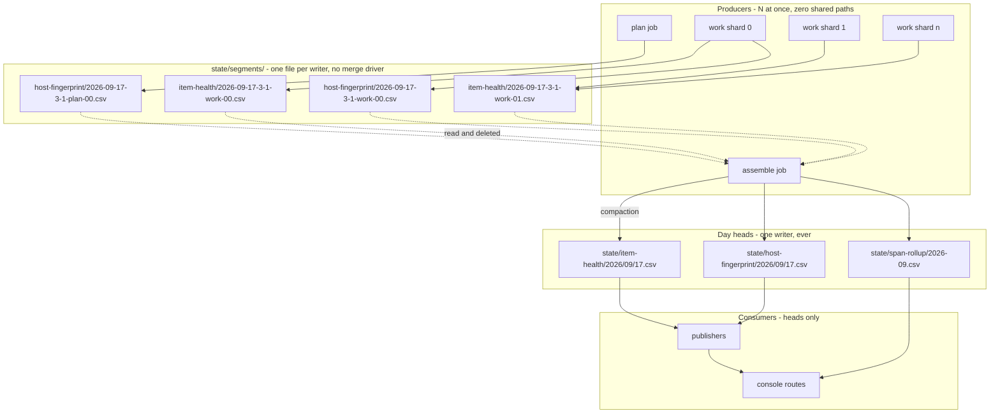
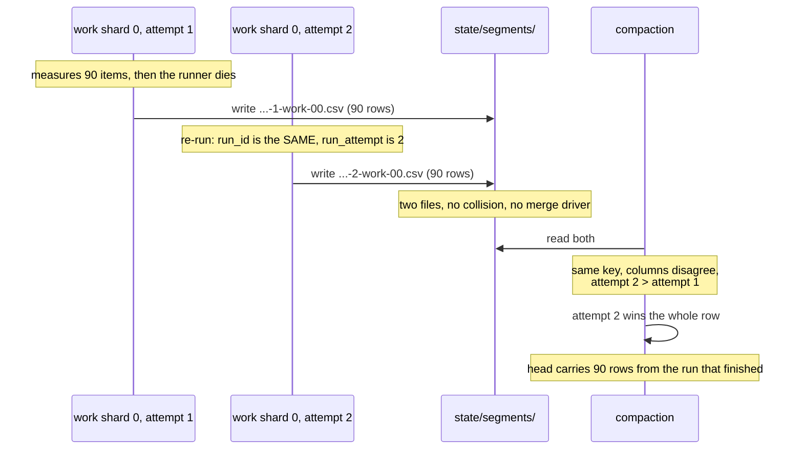

# Collision-free telemetry: segments, compaction, and the retirement of runtime-counters

**Last Updated**: 2026-09-17
**Level**: 5 (core design, four persisted contracts, the trust-free boundary between concurrent runners)

Execute per docs/how-to/execute-a-plan.md: one owner carries the plan and delegates a row where delegation pays; keep parallel N = 4 rows in flight, refilling a slot as soon as a worker returns and never waiting on a merge; consult a persona only where two answers would lead to different code; AUTO-merge on green gates; honor the ESCALATE triggers in section 0. AUTHOR-AND-STOP until the user authorizes.

## 0 - Operating contract

| Field | Value |
| --- | --- |
| Why this plan exists | Up to eight runners write the same ledger file at the same time, and a runner cannot resolve a conflict; one collision on 2026-09-16 destroyed 303 measured rows and left a day with no machine record at all. |
| Hard scope - in | A writer with siblings writes a file nobody else writes. A consumer reads one file for one day, K files for a K-day window, and never a file whose size grows with project history. `state/runtime-counters.csv` is deleted and every column it held is moved to the grain that column actually has. Every surface, test and doc the deletions orphan is deleted in the same row. |
| Hard scope - out | See table 0a. |
| ESCALATE triggers | See table 0b. |
| Chosen strategy | Per-writer segments compacted by a single writer into day heads. Fowler ruled the shape; Carmack priced it and corrected the filename; Susan ruled the operator surface. |
| Execution | autonomous orchestrator per docs/how-to/execute-a-plan.md. Parallel N = 4. |
| Rollback | None. Git is the backup. No dual-read, no strangler fig, no compatibility shim, no deprecation window. A row that replaces a thing deletes that thing in the same commit. |

### Table 0a - out of scope

| id | What is out | What it costs to leave out | What would bring it in |
| --- | --- | --- | --- |
| 0a1 | `state/seen`, `state/feed-health`, `state/published`, `state/counterfactual-scores`, `state/visual-prunes` move to segments | Nothing today. Each has exactly one writing job, so no collision is possible. | A second job starts writing one of them. Then that ledger takes a segment row of its own, copied from Row #2. |
| 0a2 | `state/traces` moves to segments | Nothing. It is already `<YYYY>/<MM>/<DD>-<run_id>-<shard>.jsonl` - one writer, one file - and has never blocked a rebase. It is the existing proof the shape works. | Nothing. It is already in the target state. |
| 0a3 | `state/feed-health`'s unbounded read in `console_band.read_spread_of` | One walk of every committed day on every visuals run. Guardrail #12 debt that predates this plan. | Its own plan. Mixing a read fix into a write fix doubles the surface of every row here. |
| 0a4 | `state/score-index`'s unbounded read by the eval dashboard | One walk of every committed day, operator-only surface. | Same as 0a3. |
| 0a5 | Retention and prune policy for the new `state/runtime-counters` day tree | `runtime-counters.csv` is deleted by Row #9, so there is nothing left to prune. The columns land on `item-health` and `host-fingerprint`, which already carry their own retention. | Nothing. The question dies with the file. |

### Table 0b - ESCALATE triggers

An escalation STOPS that row and reports. It does not stop the plan; other rows keep running.

| id | Trigger | Why a person decides |
| --- | --- | --- |
| 0b1 | A row must widen `.gitattributes` beyond the two lines section 2.6 names, or must keep `merge=union` on any path. | The whole plan rests on no path having two writers. Needing a merge driver means the shape is wrong, not that the driver is needed. |
| 0b2 | Compaction cannot be made idempotent for a ledger - running it twice produces a different head than running it once. | Section 2.4 is the contract every recovery path depends on. |
| 0b3 | A measured reading shows the compaction pushing the `assemble` job past 900 s (75 percent of its 1200 s timeout). | Guardrail #2 is GitHub's limit, not ours. The next move is a smaller design, and which part gets cut is a person's call. |
| 0b4 | A runtime-counters column in section 2.3 turns out NOT to be derivable from `item-health` or `host-fingerprint` after the row is built. | Deleting a measurement nothing replaces is a Guardrail #10 loss. |
| 0b5 | Sampling `/proc/meminfo` per item measurably slows an item (over 1 percent of median item wall clock, measured n>=20 on one runner). | Trading throughput for telemetry is a person's trade. |

Everything else: dispatch the personas in DEBATE per docs/how-to/execute-a-plan.md, converge to one written ruling, bake it into the row, move on.

## 1 - Status Reckoner

| # | Row title | Depends-on | Parallel-group | Status | Worktree | PR | Subagent |
| --- | --- | --- | --- | --- | --- | --- | --- |
| 1 | Segment store and the `compact` stage, shipped inert | - | A | PENDING | - | - | - |
| 2 | `host-fingerprint` writes segments | 1 | B | PENDING | - | - | - |
| 3 | `item-health`, `scores`, `score-index` write segments | 1 | B | PENDING | - | - | - |
| 4 | `span-rollup` writes segments | 1 | B | PENDING | - | - | - |
| 5 | Machine page stops lying about a day with no rows | - | A | PENDING | - | - | - |
| 6 | One concurrency group for `digest`, `validate`, `measure` | - | A | PENDING | - | - | - |
| 7 | OS memory and load, per item | - | C | PENDING | - | - | - |
| 8 | Memory split by prefill and decode | 7 | C | PENDING | - | - | - |
| 9 | Server batching counters, per item | - | C | PENDING | - | - | - |
| 10 | `model_load_ms` and `job_seconds` join `host-fingerprint` | 2 | D | PENDING | - | - | - |
| 11 | Delete `runtime-counters` and everything that reads it | 7, 8, 9, 10 | E | PENDING | - | - | - |
| 12 | Delete the merge machinery | 2, 3, 4, 11 | E | PENDING | - | - | - |
| 13 | Compaction lag on the console band | 1, 5 | F | PENDING | - | - | - |
| 14 | The per-item machine load panel | 7, 8, 5 | F | PENDING | - | - | - |
| 15 | Generated TypeScript contracts replace the hand-written ones | 2, 11 | F | PENDING | - | - | - |
| 16 | Docs, and the orphan sweep | 1-15 | G | PENDING | - | - | - |

## 2 - THE CONTRACT

This section is the intent and the contract derived from it. A worker implements it. A worker does not re-decide it. Where a worker finds the contract wrong, that is an ESCALATE under table 0b or a persona debate under docs/how-to/execute-a-plan.md - never a local judgement call.

### 2.1 Intent

Three sentences. Everything below serves them.

1. **A producer cannot collide.** Two jobs running at the same time never write the same path, so no merge driver, no rebase resolution and no dedup pass stands between a measurement and the repository.
2. **A consumer reads O(1) at best and O(change) at worst.** One day is one file. A K-day window is K files, and K comes from config. No read is ever proportional to how long the project has run.
3. **Every measurement lands at the grain it was measured at.** A number about one article lives on the article's row. A number about one job lives on the job's row. No number is stamped 400 times to make it fit a file.

### 2.2 The shape



Three facts the diagram encodes and a worker must preserve.

- **A segment is written once and read once.** Nothing else ever opens it. It is not a payload a consumer knows about.
- **A head has exactly one writer**, and that writer is `assemble`. `plan` and `work` never touch a head again.
- **The segment directory sits outside every ledger root.** `backend/idhazh/day_partition.py` line 70 raises on any filename it cannot place, by design - "A file the reader cannot place is how it starts missing rows". A `state/<ledger>/segments/` directory would raise in every day-tree read of five ledgers. The fix is not a skip clause in the one walk whose value is that it skips nothing.

### 2.3 Segment path grammar

```
state/segments/<ledger>/<date>-<run_seq>-<attempt>-<job>-<shard>.csv
```

| Element | Source | Format | Example |
| --- | --- | --- | --- |
| `<ledger>` | the head's `*_DIRNAME` constant in `ledger.py` | as declared | `item-health` |
| `<date>` | `plan.date` | `YYYY-MM-DD` | `2026-09-17` |
| `<run_seq>` | the run ordinal within the day, already inside `RunId` | integer, no padding | `3` |
| `<attempt>` | `GITHUB_RUN_ATTEMPT` | integer, no padding, default `1` | `1` |
| `<job>` | the `ServerJob` enum value | as declared | `work` |
| `<shard>` | shard index in the job | two digits, zero-padded | `00` |

`<attempt>` is load-bearing and nothing in the backend reads it today - `git grep GITHUB_RUN_ATTEMPT backend` returns nothing. GitHub keeps `run_id` stable across a re-run and increments `run_attempt`. Without `<attempt>` in the name, a re-run writes the path its first attempt already wrote.

A segment file carries the head's own header and the head's own columns. It gets no contract of its own and no schema of its own. That is deliberate: a segment is the head's rows in transit, and giving it a second shape is the thing that drifts.

**What the attempt element buys, drawn.** The left column is what happens without it and is the defect this grammar exists to prevent.



Without `<attempt>`, both writes take one path, `.gitattributes` stacks them, and the dedup pass keeps the FIRST - the numbers from the attempt that failed. That is today's behaviour, and section 2.5 inverts it on purpose.

### 2.3a Read cost - the property this plan is for

Intent 2.1.2 is a claim about every consumer. This table is the claim made checkable. A worker who changes a reader checks its row here.

| Consumer question | Files opened | Cost | Grows with |
| --- | --- | --- | --- |
| "today's item health" | 1 | O(1) | nothing |
| "the last K days" (console presets) | K | O(K) | a config knob |
| "this month's machine rows" | 1 month head, or `days_by_month` over K day files | O(K) | a config knob |
| "what has not been compacted yet" | segments this run wrote, plus any a failed run left | O(change) | runs since the last successful compaction, never history |
| "every row ever written" | - | **not a question any consumer asks** | - |

No row in this table is proportional to the number of days the project has run. `state/runtime-counters.csv` was the last one that was, and Row #11 deletes it.

### 2.4 Compaction

```
idhazh compact --state-root <path>
```

One stage, its own module, invocable alone with files in and files out (CLAUDE.md section 4). Two callers, one implementation.

**Algorithm, in order. A worker implements exactly this.**

1. List `state/segments/*/*.csv`. This is the only listing; its cost is the number of segments this run wrote plus any a failed run left, never the project's history.
2. Group by `<ledger>`, then parse every row of every segment of that ledger with the head's contract.
3. Group the parsed rows by the head each belongs to. **The head is chosen by the row's own `date` cell, never by today's date.** A segment left behind by a run three days ago compacts into that day's head.
4. For each head: read it once, then merge the segment rows in by the ledger's existing `*_KEY` tuple, applying section 2.5.
5. Write the head with a temp-file-plus-rename.
6. `git rm` every segment file that was read, in the same commit as the head writes.
7. Log one line: ledgers touched, segments read, rows merged, rows superseded, oldest segment date.

**Ordering inside `assemble`.** The compaction runs inside `stage_assemble` before `dispatch.publish_all` (`backend/idhazh/stages/assemble.py` line 344). The publishers read heads, so a compaction after them publishes a page that disagrees with the record it was built from.

**Idempotence is the contract** (ESCALATE 0b2). Running the compaction twice over the same segments produces the same head as running it once. The key merge in section 2.5 is what makes that true.

**The API a worker writes to.** These four are the whole public surface. Nothing else in the codebase reaches into `state/segments/`.

```python
# backend/idhazh/ledger.py
SEGMENTS_DIRNAME: Final = "segments"

def segment_path(
    state_dir: Path, ledger: str, date: str, run_id: str, attempt: int, job: str, shard: int
) -> Path:
    """Where this writer puts its rows. Nobody else writes this path."""

def segment_files(state_dir: Path, ledger: str | None = None) -> list[Path]:
    """Every segment on disk, or one ledger's. The only listing; cost is what is
    waiting, never what the project has written."""

# backend/idhazh/stages/compact.py
@dataclass(frozen=True, slots=True)
class CompactionReport:
    segments_read: int
    rows_merged: int
    rows_superseded: int
    heads_written: tuple[str, ...]      # repo-relative POSIX paths
    oldest_segment_date: str | None     # DateStamp, None when nothing waited

def stage_compact(state_dir: Path) -> CompactionReport:
    """Merge every segment into its head and remove the segment. Safe to run twice."""
```

`CompactionReport` is what Row #13 reads for the band fields and what the log line in step 7 prints. It is a return value, not a persisted payload, so it gets no schema.

**Two things `stage_compact` must not do.** It does not call git - the caller stages, because `assemble` already stages `state` whole and a stage that shells out to git is a stage that cannot be tested from a fixture. And it does not consult today's date for anything; a date it needs comes off a row.

### 2.5 The merge rule, per key

Two segment rows may share a `*_KEY`. Three cases, and exactly three.

| Case | Condition | Rule | Why |
| --- | --- | --- | --- |
| Join | Same key, and no column is non-null in both | Take the union of non-null cells into one row | This is what lets a probe that runs at job start and a counters read that runs at job end share one `host-fingerprint` row without either becoming mutable |
| Supersede | Same key, a column is non-null in both, and the rows come from different `<attempt>` values | **Highest attempt wins the whole row** | Attempt 2 exists because attempt 1 did not finish. Attempt 1's numbers describe a job that failed. Today's first-row-wins keeps exactly the wrong one |
| Repeat | Same key, a column is non-null in both, same `<attempt>` | Keep the row already in the head; count it as superseded; do not fail | This is what makes a second compaction free, and it is the recovery path when a run dies between the head write and the `git rm` |

A row already in the head counts as attempt-equal to itself for this rule. A segment row with a strictly higher attempt replaces it.

### 2.6 `.gitattributes`

Exactly two changes. Any third is ESCALATE 0b1.

```
# ADD - a segment has one writer, so a union driver it never asked for
# would silently stack two copies where a conflict should stop the push.
state/segments/**/*.csv -merge

# DELETE - these two lines are why a lost push race stacks rows today.
state/*.csv           merge=union
state/**/*.csv        merge=union
```

The `state/published/**` and `state/visual-prunes/**` union lines stay. Those ledgers keep one writing job (table 0a1) and their union lines are what the `-merge` above prevents them inheriting by accident.

### 2.7 `ItemHealthRow` - the columns this plan adds

Eleven columns. `version` stamps to `2026-09-17` with one changelog entry.

| Column | Type | Sampled | Description that ships in the Field |
| --- | --- | --- | --- |
| `os_mem_available_bytes` | `int \| None` | item end | Memory the kernel says a new allocation could have, from `/proc/meminfo` `MemAvailable`. This is headroom; an RSS mark is not. |
| `os_mem_free_bytes` | `int \| None` | item end | Memory on no list at all, from `MemFree`. Lower than available, because the kernel counts reclaimable cache separately. |
| `os_mem_total_bytes` | `int \| None` | item end | What the machine has, from `MemTotal`. Constant within a job; recorded per item so a row means something on its own. |
| `os_mem_cached_bytes` | `int \| None` | item end | Page cache, from `Cached`. Most of the model weights sit here, so a drop is the kernel evicting what the next item has to read again. |
| `os_swap_free_bytes` | `int \| None` | item end | From `SwapFree`. A fall here is the machine in trouble before the cgroup kill. |
| `os_mem_available_min_bytes` | `int \| None` | over the item | Lowest `MemAvailable` seen while this item ran. The closest this item took the machine to its limit. |
| `llama_rss_peak_prefill_bytes` | `int \| None` | over prefill | Peak resident memory of the model server while it was reading the prompt. |
| `llama_rss_peak_decode_bytes` | `int \| None` | over decode | Peak resident memory of the model server while it was writing the reply. |
| `os_mem_available_min_prefill_bytes` | `int \| None` | over prefill | Lowest machine headroom while reading the prompt. |
| `os_mem_available_min_decode_bytes` | `int \| None` | over decode | Lowest machine headroom while writing the reply. |
| `n_decode_calls` | `int \| None` | over the item | `llama_decode()` calls this item cost, as the delta of the server's cumulative counter across the item. |
| `busy_slots_per_decode` | `float \| None` | over the item | Mean filled slots per decode call over this item, from the same two counter reads. Batching efficiency at the grain the batching happens. |

That is twelve rows in the table; `n_decode_calls` and `busy_slots_per_decode` belong to Row #9 and the ten above them to Rows #7 and #8.

**Where the samples come from.** The sampler that already writes `rss-samples.tsv` reads `/proc/meminfo` and appends a new column at the END of its row - `backend/tests/workflows/test_model_server_jobs.py` line 227 holds that rule and says why. The per-item reader takes the sample rows whose `ts` falls inside the item's own window. No new sampler process; no new artifact.

**Prefill and decode boundary.** The worker already knows when prefill ended for an item - `prefill_ms` and `decode_ms` are separate fields today. The phase split partitions the same sample window at that boundary. Where the server reports no prefill/decode split for a call, all four phase columns are null for that item and the whole-item columns still carry.

**The literal field shape.** Every new column follows this, so a worker writes columns, not decisions. `Contract` and the `Field` conventions are the ones already in `backend/idhazh/contracts/item_health.py`.

```python
os_mem_available_bytes: int | None = Field(
    default=None,
    ge=0,
    description=(
        "Memory the kernel says a new allocation could have when the item ended, "
        "from /proc/meminfo MemAvailable. This is headroom; an RSS mark is not."
    ),
)
```

Four rules bind all eleven, and a worker does not vary them.

1. `default=None`. A missing sample is unknown, never zero (section 2.7 decision 4 of Row #7).
2. Byte counts are `int | None` with `ge=0`. Rates are `float | None`. `busy_slots_per_decode` is `float | None` with `ge=0`.
3. The description says what it measures AND where it came from, in that order, because the second is what makes a stale reading findable.
4. Column order in `csv_columns()` follows the table in 2.7, appended after the existing columns. Nothing is inserted between existing columns.

### 2.7a Every runtime-counters column, and where it went

This is the row-by-row justification for deleting D1. ESCALATE 0b4 fires if a worker finds any line of it false.

| runtime-counters column | Disposition | Its replacement |
| --- | --- | --- |
| `peak_rss_bytes` | delete | `item_health.llama_rss_peak_bytes`, per item |
| `python_peak_rss_bytes` | delete | `item_health.python_rss_bytes`, per item |
| `cgroup_peak_bytes` | delete | already on `item_health`, per item |
| `cpu_busy_pct` | delete | already on `item_health`, mean over the item |
| `n_ctx_configured` | delete | already on `item_health` |
| `cpu_model` | delete | `host_fingerprint.cpu_model` |
| `prompt_tokens_total` | delete | sum of `item_health.input_tokens` over the day |
| `prompt_tokens_cached_total` | delete | sum of `item_health.cached_tokens` |
| `prompt_seconds_total` | delete | sum of `item_health.prefill_ms` |
| `tokens_predicted_total` | delete | sum of `item_health.output_tokens` |
| `tokens_predicted_seconds_total` | delete | sum of `item_health.decode_ms` |
| `n_tokens_max` | delete | max of `item_health.input_tokens + output_tokens` |
| `date`, `run_id`, `shard`, `job`, `version` | delete | both surviving ledgers carry them |
| `scraped_at`, `shards` | delete | metadata about a file that no longer exists |
| `n_decode_total` | **move** | `item_health.n_decode_calls`, per-item delta (Row #9) |
| `n_busy_slots_per_decode` | **move** | `item_health.busy_slots_per_decode`, per-item delta (Row #9) |
| `model_load_ms` | **move** | `host_fingerprint.model_load_ms` (Row #10) |
| `job_seconds` | **move** | `host_fingerprint.job_seconds` (Row #10) |

Twenty-three columns. Nineteen already have a home or are metadata. Four move. Nothing is lost, and the two that were the second instrument get finer.

### 2.8 `HostFingerprintRow` - the columns this plan adds

Two columns. `version` stamps to `2026-09-17` with one changelog entry.

| Column | Type | Description that ships in the Field |
| --- | --- | --- |
| `model_load_ms` | `float \| None` | Milliseconds the server spent opening the weights before the first item. Once per job, which is this row's grain. |
| `job_seconds` | `int \| None` | The job's own wall clock. The truncation cap reverts on the slowest work job's, and before this cell the only place that number lived was the GitHub jobs API, which drops a job record when the run ages out. |

`HOST_FINGERPRINT_KEY` is already `("date", "run_id", "job", "shard")` - the same key `RUNTIME_COUNTERS_KEY` uses. The two ledgers were always one row split across two files. Section 2.5's Join case is what lets the early probe and the late counters read land on it without the row ever being updated in place.

### 2.9 `console/band.json` - the compaction lag

Three fields, and one sentence built from them.

| Field | Type | Meaning |
| --- | --- | --- |
| `compaction_lag_days` | `int` | Whole days between the oldest date in `state/segments/` and today. `0` when the directory is empty. |
| `rows_uncompacted` | `int` | Rows across every segment file. `0` when the directory is empty. |
| `covers_through` | `DateStamp \| None` | The newest date every head has been compacted through. |

The sentence the band renders when `compaction_lag_days > 0`:

> **The machine record is 2 days behind.** 303 rows from 4 runs are committed and waiting to be merged in. The Hardware page stops at 15 September. This is a merge that has not run, not a pipeline that did no work.

**These are written by `visuals`, from a listing of `state/segments/`, in a run that succeeded.** The rejected design put the number on the census row, which `assemble` writes - so the signal could not report its own failure mode. Susan ruled on it; her reasoning is in Row #13's Decisions.

**The last clause of the sentence is not decoration.** A page that stops early reads as a pipeline that did nothing. Saying which of the two it is stops an operator opening an incident. This project already draws that distinction in two other places (`frontend/src/lib/console/recording.ts` line 82 and `frontend/src/routes/console/machine/SpanPanel.svelte` line 45); reuse the phrasing, do not invent a third.

### 2.10 Vocabulary

| Word | Means | Does not mean |
| --- | --- | --- |
| **segment** | one writer's slice of one ledger for one job, before it is merged in | a work shard, a day partition, a published shard |
| **compaction** | merging segments into a day head, and merging day heads into a month file | anything to do with `casefold`, `chrome.fold`, or text |
| **head** | the file a consumer reads: `<Y>/<M>/<D>.csv` or `<Y>-<M>.csv` | a git ref |

`retention.fold_month` is renamed `retention.compact_month` in Row #16 - it is the same operation one level up, and one word for one operation is the point. `casefold()` and `chrome.fold()` keep their names; those are a different meaning of an English word and renaming them is churn that buys nothing.

### 2.11 The deletion inventory

No technical debt. Every artifact below is deleted by the row named, in the same commit that replaces it. A row that leaves one of these standing is not done.

| id | Artifact | Deleted by | Replaced by |
| --- | --- | --- | --- |
| D1 | `state/runtime-counters.csv` | #11 | `item-health` columns (2.7) and `host-fingerprint` columns (2.8) |
| D2 | `backend/idhazh/contracts/runtime_counters.py` | #11 | - |
| D3 | `schemas/runtime-counters-row.schema.json` | #11 | - |
| D4 | The `counters` CLI stage and its parser block in `backend/idhazh/cli.py` | #11 | the per-item sample reader |
| D5 | `host.stage_counters` and every helper only it calls | #11 | - |
| D6 | `ledger.append_runtime_counters`, `ledger.load_runtime_counters`, `RUNTIME_COUNTERS_KEY` | #11 | - |
| D7 | `backend/idhazh/telemetry/publish/machine.py` whole-file read, `months_on_file`, and the module docstring accepting it | #11 | a day-cover read of `item-health` and `host-fingerprint` |
| D8 | `frontend/src/lib/server/runtime-counters.ts` | #11 | a reader over the two surviving ledgers |
| D9 | Every test naming `runtime_counters`, `RuntimeCountersRow`, or the `counters` stage | #11 | tests for the new columns |
| D10 | The `Take the model server's counters` step in `digest.yml` | #11 | - |
| D11 | `state/*.csv merge=union` and `state/**/*.csv merge=union` | #12 | `state/segments/**/*.csv -merge` |
| D12 | `DROP_REPEATED_ROWS_COMMAND` and its wiring in `commit-and-push.sh` and `digest.yml` | #12 | the keyed merge in 2.5 |
| D13 | `backend/idhazh/stages/dedupe_ledgers.py` call site, its CLI stage, its `--every-shard` flag | #12 | the keyed merge in 2.5. **`ledger.keyed_paths` and the `*_KEY` tuples survive** - they move into the compaction |
| D14 | The six hand-listed staging paths at `digest.yml` line 809 | #12 | `state/segments` and `state` |
| D15 | `export interface HostFingerprint` in `frontend/src/lib/server/host-fingerprint.ts` | #15 | the generated contract |
| D16 | The `state/runtime-counters.csv` entry in `docs/concepts/growing-reads.md` | #16 | - |
| D17 | Every doc sentence describing a union merge, a dedup pass, or a shared-file ledger write | #16 | the segment and compaction description |
| D18 | `retention.fold_month` (the name) | #16 | `retention.compact_month` |

**The sweep that proves it.** Row #16 runs `git grep -in 'runtime.counters\|runtime_counters\|merge=union\|DROP_REPEATED_ROWS\|dedupe.ledgers\|fold_month'` across the whole repository and the result is empty apart from the two surviving `state/published/**` and `state/visual-prunes/**` union lines. A non-empty result that is not one of those two is an unfinished deletion.

## 3 - Row #1 - Segment store and the `compact` stage, shipped inert

- **Scope:** `state/segments/` exists, `idhazh compact` drains it and is wired into `assemble` and the hygiene workflow, and nothing writes a segment yet.
- **Files touched:**
  - `backend/idhazh/ledger.py` - `SEGMENTS_DIRNAME`, `segment_path()`, `segment_files()`
  - `backend/idhazh/stages/compact.py` - new
  - `backend/idhazh/cli.py` - the `compact` stage
  - `backend/idhazh/stages/assemble.py` - call before `dispatch.publish_all`
  - `backend/idhazh/run_context.py` - read `GITHUB_RUN_ATTEMPT`
  - `.gitattributes` - the `-merge` line from 2.6 (the two deletions wait for #12)
  - `.github/workflows/digest.yml` - stage `state/segments`, add it to `REFRESH_PATHS` on both assemble commits
  - `.github/workflows/prune.yml` - call `idhazh compact` as the catch-up
  - `state/segments/.gitkeep`
  - `backend/tests/pipeline/test_compact.py` - new
  - `backend/tests/workflows/test_daily_commit_steps.py`
- **Acceptance gates:** local - `python backend/utilities/gate_lock.py -- python -m ruff check .`, `mypy .`, `pytest backend/tests/pipeline/test_compact.py backend/tests/workflows -n auto`. CI - full suite, drift gate.
- **Oracle:** a built fixture segment directory carrying (a) two segments for one date, (b) one segment for a date the head does not have, (c) two segments with the same key and different attempts, (d) a segment for a date three days old. After one compaction every row is in the right head, the directory is empty, and a second compaction over the same input leaves both heads byte-identical. **What it cannot settle:** whether a real runner's `git rm` of a segment survives a lost push race - that needs Row #2 on a real run.
- **Decisions:**

| # | Decision | Authority |
| --- | --- | --- |
| 1 | Segments live at `state/segments/<ledger>/`, outside every ledger root | Fowler - `day_partition.py` line 70 raises on an unplaceable name, and a skip clause in the one walk that skips nothing is how a new writer arrives unnoticed |
| 2 | The compaction adds no workflow step and no commit; it rides `Commit the day` | Carmack - `digest.yml` line 1212 already stages `state` whole, so `git add state` records the deletions with no path-list change |
| 3 | `state/segments` joins `REFRESH_PATHS` | Carmack - a lost push hands the heads back to the tip and re-runs the compaction against it, including segments a sibling pushed while this run built |
| 4 | Ship inert first | Fowler - an empty-directory compaction proves the staging path, the `git rm`, the ordering against the site build, and Carmack's sub-second estimate, with zero rows at risk |
| 5 | The compaction routes by the row's `date` cell, not today's date | Fowler - it is the whole recovery path for a day `assemble` died on |

- **Rejected alternatives:**

| # | Option | Why rejected | What it would cost to take | Authority |
| --- | --- | --- | --- | --- |
| 1 | `state/<ledger>/segments/` | Raises `ValueError` in every backend day-tree read of five ledgers | A skip clause in `day_partition.day_files`, which is the one walk whose stated value is that it skips nothing | Fowler |
| 2 | Route all state through build artifacts so only `assemble` commits | Refused in writing at `digest.yml` line 654 - an artifact expires and is never committed, so a run stopped after the workers measured would record nothing | Re-opening a decision taken because this exact loss already happened | Fowler |
| 3 | A branch per job that `assemble` merges | A stale branch pins pre-prune history and defeats `prune.yml` | Branch cleanup for a dead assemble, plus 8 fetch-merge-delete cycles a run, for durability one commit already gives | Fowler |
| 4 | Leave the rebase-tolerance fix (PR 840) as the whole answer | Writers still share a filename, so it fails intent 2.1.1 outright | Keeping `dedupe_ledgers`, six `*_KEY` tuples, the two-header repair and six hand-listed staging paths | Fowler |

## 4 - Row #2 - `host-fingerprint` writes segments

- **Scope:** `plan`, `work` and `assemble` write `host-fingerprint` segments; `assemble` compacts them; nothing writes the head directly.
- **Files touched:** `backend/idhazh/ledger.py`, `backend/idhazh/telemetry/silicon.py`, `.github/workflows/digest.yml`, `.github/workflows/measure.yml`, `backend/tests/pipeline/test_compact.py`, `backend/tests/telemetry/test_silicon.py`
- **Acceptance gates:** local - ruff, mypy, `pytest backend/tests/telemetry backend/tests/pipeline -n auto`. CI - full suite, drift gate.
- **Oracle:** ten writers (one plan, eight work shards, one assemble) produce ten segments and, after compaction, the day head carries ten rows with ten distinct `(job, shard)` pairs and no repeats. **What it cannot settle:** whether ten real runners racing produce the same result - the first live run is the check, and `state/host-fingerprint/2026/09/16.csv` being header-only today is what it is being checked against.
- **Decisions:**

| # | Decision | Authority |
| --- | --- | --- |
| 1 | This ledger goes first of the four movers | Fowler - it is the one a collision already emptied, and it is the one Row #10 needs |
| 2 | `HostFingerprintRow` does not change shape in this row | Fowler - the path moves, and a path is not a persisted shape. No `version` stamp, no migration |
| 3 | `measure.yml` writes segments under `state/pipeline-tests/` the same way | Carmack - it is the only state writer with no concurrency group at all |

- **Rejected alternatives:**

| # | Option | Why rejected | What it would cost to take | Authority |
| --- | --- | --- | --- | --- |
| 1 | Move all four ledgers in one row | One revert would take four ledgers with it | Nothing technical; it trades a reviewable unit for a shorter table | Fowler |
| 2 | Keep `assemble` writing the head directly since it has no siblings | Two writers of one path is the thing being removed, and "has no siblings today" is how the next one arrives | An exception a later reader has to re-derive | Fowler |

## 5 - Row #3 - `item-health`, `scores`, `score-index` write segments

- **Scope:** `work` and `assemble` write segments for the three item-grain ledgers.
- **Files touched:** `backend/idhazh/ledger.py`, `backend/idhazh/evals/writer.py`, `backend/idhazh/evals/archive.py`, `backend/idhazh/stages/assemble.py`, `.github/workflows/digest.yml`, `backend/tests/pipeline/test_compact.py`, `backend/tests/evals/`
- **Acceptance gates:** local - ruff, mypy, `pytest backend/tests/evals backend/tests/pipeline -n auto`. CI - full suite, drift gate.
- **Oracle:** the canary day under `backend/var/canary/` runs work-then-assemble against a fixture `STATE_ROOT`; every item that entered appears exactly once in the `item-health` head, `state/segments/` is empty, and the two-header-block shape `dedupe_ledgers.py` line 59 calls "the one shape every reader of it assumes cannot happen" is now unreachable because two files never merge. **What it cannot settle:** row counts at production scale.
- **Decisions:**

| # | Decision | Authority |
| --- | --- | --- |
| 1 | Three ledgers, one row | Fowler - same writer, same job, same risk; splitting buys a reviewer nothing |
| 2 | `ITEM_HEALTH_KEY`, `EvalRow` and `ObservationIndexRow` keep their shapes and schemas | Fowler - drift gate byte-identical is this row's proof no contract moved |

- **Rejected alternatives:**

| # | Option | Why rejected | What it would cost to take | Authority |
| --- | --- | --- | --- | --- |
| 1 | Give segments their own contract and schema | A segment holds the head's rows; a second shape for the same rows is the thing that drifts | Three more schemas and a drift surface that proves nothing | Fowler |

## 6 - Row #4 - `span-rollup` writes segments

- **Scope:** `work` writes `span-rollup` segments; compaction merges them into the month head.
- **Files touched:** `backend/idhazh/ledger.py`, `backend/idhazh/telemetry/spans.py`, `.github/workflows/digest.yml`, `backend/tests/pipeline/test_compact.py`
- **Acceptance gates:** local - ruff, mypy, `pytest backend/tests/telemetry backend/tests/pipeline -n auto`. CI - full suite, drift gate.
- **Oracle:** segments carrying two dates in the same month compact into one month head with both dates present and `SPAN_ROLLUP_KEY` unique across it. **What it cannot settle:** the month-boundary case where a run at 23:59 UTC writes a segment the next day's compaction reads - covered by the built fixture, not by a real run.
- **Decisions:**

| # | Decision | Authority |
| --- | --- | --- |
| 1 | A month head is a head like any other; the compaction routes by the row's `date` cell and derives the month from it | Fowler - one routing rule, not two |

- **Rejected alternatives:**

| # | Option | Why rejected | What it would cost to take | Authority |
| --- | --- | --- | --- | --- |
| 1 | Move `span-rollup` to a day tree while we are here | Unrelated to collision; its reader is already bounded by `TIMELINE_WINDOW_MONTHS` | A published-shard rewrite and a console reader change for no collision benefit | Fowler |

## 7 - Row #5 - Machine page stops lying about a day with no rows

- **Scope:** the Hardware route distinguishes "the instrument had not started" from "the instrument ran and we have no rows", and says which.
- **Files touched:** `frontend/src/lib/charts/machine-cards.ts`, `frontend/src/lib/components/MachineCard.svelte`, `frontend/src/routes/console/machine/+page.server.ts`, the fleet panel, `frontend/tests/`
- **Acceptance gates:** local - `npm --prefix frontend run test:changed -- --list` then the selected checks, plus `npx playwright test --project=console`. CI - full suite. Browser smoke per CLAUDE.md section 12, including the data-absent arm with `STATE_ROOT` pointed at an empty temp directory.
- **Oracle:** rendered against a fixture day whose `host-fingerprint` head is header-only, the page contains no sentence claiming the record starts later, and does contain a statement that the day has no rows. **What it cannot settle:** whether the wording reads well to an operator - that is Susan's ruling, baked below, not a test.
- **Decisions:**

| # | Decision | Authority |
| --- | --- | --- |
| 1 | This lands before any row that can make a fold go stale | Susan - a page that cannot say a day is missing is the reason 2026-09-16's loss is invisible |
| 2 | It is its own row, not folded into #2 | Susan - filing a shipped defect inside an architecture change buries it |
| 3 | Reuse the phrasing at `recording.ts` line 82 and `SpanPanel.svelte` line 45 | Susan - the project already drew this distinction twice; a third phrasing is a third thing to maintain |
| 4 | The three things this route does better than most must not change: `Reading<T>` carrying `from` and `outOf`, a refused run named with its reason, and the untinted residual in both timing panels | Susan |

- **Rejected alternatives:**

| # | Option | Why rejected | What it would cost to take | Authority |
| --- | --- | --- | --- | --- |
| 1 | Leave it; the page just draws fewer points | It does not draw fewer points, it prints a false sentence - `machine-cards.ts` line 191 falls back to `source: 'counters'` and the card then says the record had not begun | The operator keeps losing the difference between a missing instrument and destroyed rows | Susan |

## 8 - Row #6 - One concurrency group for `digest`, `validate`, `measure`

- **Scope:** the three workflows that commit `state/` cannot run at the same time.
- **Files touched:** `.github/workflows/digest.yml`, `.github/workflows/validate.yml`, `.github/workflows/measure.yml`, `backend/tests/workflows/`
- **Acceptance gates:** local - `pytest backend/tests/workflows -n auto`, plus `shellcheck` is CI-only (not installed locally). CI - full suite.
- **Oracle:** a test reads the three workflow files and asserts all three declare the same `concurrency.group` and that `cancel-in-progress` is false on each. **What it cannot settle:** whether a dispatched run now waits too long - that is a human's patience, not a gate.
- **Decisions:**

| # | Decision | Authority |
| --- | --- | --- |
| 1 | One shared group across the three | Carmack - `measure.yml` has no `concurrency` block at all, and `validate.yml` stages `state` whole with no dedup command; a qualification overlapping a digest run is the live exposure |
| 2 | `backfill.yml` is not included | Carmack - it stages `frontend/public/digest` and `frontend/public/assist/index` and no `state/` at all |
| 3 | Independent of the segment work; run it in parallel | Carmack - two lines in two files, and it retires a class on its own |

- **Rejected alternatives:**

| # | Option | Why rejected | What it would cost to take | Authority |
| --- | --- | --- | --- | --- |
| 1 | Let segments fix it | Segments narrow what a digest shard can lose; they do not narrow what `validate.yml` picks up when it stages `state` whole | An unbounded, rare, human-triggered corruption path left open | Carmack |

## 9 - Row #7 - OS memory and load, per item

- **Scope:** every item row records what the machine had, not only what a process held.
- **Files touched:** `backend/idhazh/contracts/item_health.py`, `schemas/item-health-row.schema.json` (generated), `backend/idhazh/telemetry/host.py`, the sampler script under `.github/scripts/`, `backend/idhazh/stages/summarize.py`, `backend/tests/telemetry/`, `backend/tests/contracts/`
- **Acceptance gates:** local - ruff, mypy, `pytest backend/tests/telemetry backend/tests/contracts -n auto`, `python -m idhazh.contracts.export` then `git status --porcelain -- schemas/` empty. CI - full suite, drift gate.
- **Oracle:** a built fixture `rss-samples.tsv` with known `MemAvailable` values and a known item window produces exactly the expected five whole-item columns and the expected `os_mem_available_min_bytes`; an item whose window contains no sample produces six nulls and no exception. **What it cannot settle:** whether `MemAvailable` on a GitHub runner means what the kernel documents - that is the kernel's contract, not ours.
- **Decisions:**

| # | Decision | Authority |
| --- | --- | --- |
| 1 | Five whole-item columns plus one minimum, exactly as section 2.7 | Carmack - `MemAvailable` is the only one of them that is headroom; the other four are what makes it readable |
| 2 | No new sampler process and no new artifact; read the sample rows the existing sampler already writes | Carmack - a second sampler adds load to the thing it measures |
| 3 | A new sampler column is appended at the END of its row | the existing rule at `test_model_server_jobs.py` line 227 - one reader reads by position, so an insert shifts every field after it and reports a process count as kilobytes |
| 4 | An item with no sample in its window records nulls, never zeros | CLAUDE.md section 1a, degrade do not fail - a zero here would read as a machine with no memory left |

- **Rejected alternatives:**

| # | Option | Why rejected | What it would cost to take | Authority |
| --- | --- | --- | --- | --- |
| 1 | Keep using `cgroup_peak_bytes` as the machine-level number | cgroup `memory.peak` never resets, so on an item row it is the job's peak so far, not this item's | Every per-item memory chart would be monotonic and say nothing | Carmack |
| 2 | Sum the two RSS marks and subtract from 16 GB | Already retracted in this repository - it double-counts shared pages, counts evictable weight pages, and reserves nothing for the kernel or the runner agent. `docs/reference/measurements.md` carries the retraction | Re-publishing a number the project already withdrew | Carmack |

## 10 - Row #8 - Memory split by prefill and decode

- **Scope:** four columns saying what memory did while reading the prompt versus while writing the reply.
- **Files touched:** `backend/idhazh/contracts/item_health.py`, `schemas/item-health-row.schema.json` (generated), `backend/idhazh/telemetry/host.py`, `backend/idhazh/stages/summarize.py`, `backend/tests/telemetry/`
- **Acceptance gates:** as Row #7, plus a timing check: median item wall clock over n>=20 fixture items moves by under 1 percent (ESCALATE 0b5 above that).
- **Oracle:** a fixture item whose prefill and decode windows are known, with sample rows straddling the boundary, yields four columns each computed over its own side and none over both. **What it cannot settle:** whether the boundary the worker records matches the instant the server switched phases - the server reports the split, we record where it said it was.
- **Decisions:**

| # | Decision | Authority |
| --- | --- | --- |
| 1 | The split uses the boundary the worker already has from `prefill_ms` and `decode_ms` | no new instrument for a boundary already measured |
| 2 | Where the server gives no phase split, all four are null and the whole-item columns still carry | degrade do not fail |
| 3 | Both RSS and OS-headroom get the split | the question is which phase pushes the machine, and a process mark alone cannot answer it |

- **Rejected alternatives:**

| # | Option | Why rejected | What it would cost to take | Authority |
| --- | --- | --- | --- | --- |
| 1 | One peak over the whole item, as today | Cannot say whether the prompt or the generation is what takes the runner toward its kill limit | The question that motivated this row goes unanswered | Carmack |
| 2 | A continuous per-item memory series instead of four summary cells | A series per item multiplies the ledger by the sample count | Measure it before proposing it: samples per item times items per day against the current row size | Carmack |

## 11 - Row #9 - Server batching counters, per item

- **Scope:** the server's own cumulative counters become per-item deltas, so the cross-check on our stopwatch survives at item grain.
- **Files touched:** `backend/idhazh/contracts/item_health.py`, `schemas/item-health-row.schema.json` (generated), `backend/idhazh/telemetry/host.py`, `backend/idhazh/stages/summarize.py`, `backend/tests/telemetry/`
- **Acceptance gates:** as Row #7.
- **Oracle:** two synthetic counter reads with a known difference produce exactly that difference in `n_decode_calls`, and a counter that went backwards (a server restart) produces null rather than a negative. **What it cannot settle:** whether the server's counters are themselves correct - that is the point of having two instruments, not one.
- **Decisions:**

| # | Decision | Authority |
| --- | --- | --- |
| 1 | Per-item deltas, not job totals | Andre and Carmack - `runtime-counters` existed to check `item-health`'s timings; moving the check to item grain sharpens it rather than losing it |
| 2 | A counter that decreases records null | a restart is not a negative decode count |
| 3 | This row is what makes D1 safe to delete | ESCALATE 0b4 fires if it turns out otherwise |

- **Rejected alternatives:**

| # | Option | Why rejected | What it would cost to take | Authority |
| --- | --- | --- | --- | --- |
| 1 | Drop the batching counters entirely | They are the only two of the twenty-three with no per-item equivalent anywhere, and they measure batching, which happens across items | Guardrail #10 - deleting the second instrument leaves one number with nothing to check it | Andre |
| 2 | Keep them at job grain on `host-fingerprint` | Batching varies within a job; a job mean hides the thing it measures | One fewer column move, one less useful number | Carmack |

## 12 - Row #10 - `model_load_ms` and `job_seconds` join `host-fingerprint`

- **Scope:** the two genuinely job-grain cells move to the ledger whose grain is the job.
- **Files touched:** `backend/idhazh/contracts/host_fingerprint.py`, `schemas/host-fingerprint-row.schema.json` (generated), `backend/idhazh/telemetry/silicon.py`, `.github/workflows/digest.yml`, `backend/tests/telemetry/`, `backend/tests/contracts/`
- **Acceptance gates:** local - ruff, mypy, `pytest backend/tests/telemetry backend/tests/contracts -n auto`, export then drift empty. CI - full suite, drift gate.
- **Oracle:** the early fingerprint probe and the late job-clock write produce two segments with the same `HOST_FINGERPRINT_KEY` and disjoint non-null columns, and compaction yields ONE row carrying both. **What it cannot settle:** nothing material.
- **Decisions:**

| # | Decision | Authority |
| --- | --- | --- |
| 1 | `HostFingerprintRow` stamps `version: 2026-09-17` with one changelog entry | CLAUDE.md section 11 - new fields on a persisted surface |
| 2 | The probe stays early and the job clock stays late; section 2.5's Join is what unites them | Fowler ruled against merging while the ledger was append-only-with-union; the segment design removes the blocker rather than moving the probe. `mhz_at_probe` and `boot_seconds` want an idle machine and keep it |
| 3 | No read-side migration. Old rows have the two cells null | the user's ruling, 2026-09-17 - rip the bandage, git is the backup |

- **Rejected alternatives:**

| # | Option | Why rejected | What it would cost to take | Authority |
| --- | --- | --- | --- | --- |
| 1 | Put them on `item-health` | They happen once per job; stamping a job total on ~400 item rows is the failure Susan rejected for the staleness signal | An operator reads the number 400 times and can act on it zero times | Susan |
| 2 | Move the fingerprint probe to job end so one write carries everything | Destroys `mhz_at_probe` and `boot_seconds`, the two readings the probe exists for | Two measurements, to save a join the compaction already does | Fowler |

## 13 - Row #11 - Delete `runtime-counters` and everything that reads it

- **Scope:** D1 through D10 of section 2.11 are gone, and the Hardware page is rebuilt on `item-health` and `host-fingerprint`.
- **Files touched:** every path named in D1-D10, plus `frontend/src/routes/console/machine/+page.server.ts`, `frontend/src/lib/charts/machine-cards.ts`, `frontend/src/lib/charts/fleet.ts`, `backend/idhazh/telemetry/publish/machine.py`, `docs/concepts/growing-reads.md`
- **Acceptance gates:** local - ruff, mypy, `pytest backend/tests -n auto`, export then drift empty, `npm --prefix frontend run test:changed -- --list` then selected checks, `npx playwright test --project=console`. CI - full suite. Browser smoke per section 12 including the data-absent arm.
- **Oracle:** every figure the Hardware page drew from `runtime-counters` before this row, recomputed from `item-health` and `host-fingerprint` over the same fixture day, matches to within float representation. **What it cannot settle:** a month older than the `item-health` retention window, which `runtime-counters` could have answered and no longer can - that is the cost, named, and the retention window is the knob.
- **Decisions:**

| # | Decision | Authority |
| --- | --- | --- |
| 1 | The publisher's day cover comes from `public_machine_keep_months` (14, about 426 days), NOT from `console.window_presets` (91) | Susan - `series.py` line 141 re-reads any month whose published shard is missing, so a 91-day cover reproduces 3 months and writes 11 empty on any rebuild or fresh clone |
| 2 | The `machine.py` docstring loses its unbounded-read justification but KEEPS one line naming the cover | Susan - it is the only place that states how far back the publisher must reach; delete the justification, not the fact |
| 3 | Delete, do not deprecate. No dual read, no fallback, no compatibility window | the user's ruling, 2026-09-17 |
| 4 | The `state/runtime-counters.csv` file is removed from the working tree in this commit | 383 rows, 72 KB; git holds it |

- **Rejected alternatives:**

| # | Option | Why rejected | What it would cost to take | Authority |
| --- | --- | --- | --- | --- |
| 1 | Move it to a day tree and keep it as its own ledger | 9 of its 23 columns are already on `item-health` and 12 more are derivable from it; a day tree would preserve a duplicate | A ledger nobody needs, kept because moving it was easier than reading its columns | the user, overruling Fowler's earlier E2 ruling on 2026-09-17 after the column-by-column comparison |
| 2 | Keep the file for the cross-check | Row #9 moves the cross-check to item grain, which is finer | 411 MB of git a year to carry 250 KB of rows | Carmack |
| 3 | Keep a read-side fallback for one release | The user ruled no strangler fig | A second code path that has to be deleted later, by someone who no longer remembers why it exists | the user |

## 14 - Row #12 - Delete the merge machinery

- **Scope:** D11 through D14 of section 2.11. No path in the repository carries a union merge driver except the two single-writer ledgers that declare it explicitly.
- **Files touched:** `.gitattributes`, `.github/scripts/commit-and-push.sh`, `.github/workflows/digest.yml`, `backend/idhazh/stages/dedupe_ledgers.py`, `backend/idhazh/cli.py`, `backend/tests/workflows/`, `backend/tests/pipeline/`
- **Acceptance gates:** local - ruff, mypy, `pytest backend/tests -n auto`, `bash -n .github/scripts/commit-and-push.sh`. CI - full suite plus `shellcheck --severity=style .github/scripts/*.sh`, which is the first real lint of the shell change because shellcheck is not installed locally.
- **Oracle:** `git check-attr merge -- state/item-health/2026/09/17.csv state/segments/item-health/x.csv` reports `unspecified` for the head and `-merge` for the segment; and the end-to-end commit-script test still lands a racing push with no dedup command configured. **What it cannot settle:** a union merge that already stacked rows in committed history - that is data, and this row does not touch it.
- **Decisions:**

| # | Decision | Authority |
| --- | --- | --- |
| 1 | `ledger.keyed_paths`, the `*_KEY` tuples and `contracts.feed_health.supersedes` SURVIVE | Carmack - the keys are the load-bearing part and they move into the compaction; only the post-merge call site dies, because after segments there is no merge to run after |
| 2 | `state/published/**` and `state/visual-prunes/**` keep their explicit union lines | they have one writing job (table 0a1), and the explicit line is what stops them inheriting `-merge` by accident |
| 3 | The six hand-listed staging paths become `state/segments` and `state` | Carmack - `commit-and-push.sh` line 128 records that the hand-written list has been short three times |

- **Rejected alternatives:**

| # | Option | Why rejected | What it would cost to take | Authority |
| --- | --- | --- | --- | --- |
| 1 | Delete `dedupe_ledgers.py` whole | Its key logic is what makes the compaction idempotent | Re-deriving six key tuples and the supersede rule inside the new module | Carmack |
| 2 | Keep `merge=union` as a safety net | A silent stack is worse than a conflict that stops the push, and a net nobody tests is a net nobody has | The exact failure `dedupe_ledgers.py` line 30 calls "the one shape every reader of it assumes cannot happen" | Carmack |

## 15 - Row #13 - Compaction lag on the console band

- **Scope:** `band.json` carries the three fields in section 2.9 and the console renders the sentence when the lag is non-zero.
- **Files touched:** `backend/idhazh/contracts/console_band.py`, `schemas/console-band.schema.json` (generated), `backend/idhazh/telemetry/publish/console_band.py`, `frontend/src/lib/console/band.ts`, `frontend/src/lib/components/ConsoleBand.svelte`, `frontend/src/contracts/`, `frontend/tests/`
- **Acceptance gates:** local - ruff, mypy, `pytest backend/tests/telemetry backend/tests/contracts -n auto`, export then drift empty, frontend selected checks, `npx playwright test --project=console`. CI - full suite, drift gate. Browser smoke.
- **Oracle:** with a fixture segment directory two days old holding 303 rows, the band renders a sentence naming 2 days, 303 rows and the date the Hardware page stops at; with an empty directory it renders nothing at all. **What it cannot settle:** whether an operator acts on it.
- **Decisions:**

| # | Decision | Authority |
| --- | --- | --- |
| 1 | The signal is a sentence on `band.json`, written by `visuals` | Susan - it must be written by a run that succeeded, about a compaction that did not |
| 2 | `inbox_age_days` / `compaction_lag_days` as a census-row cell is REFUSED | Susan - stamped 400 times on a per-item row, written by the job whose failure it reports, and answering no question anybody has. "A number an operator scrolls past teaches them that numbers on this page can be scrolled past" |
| 3 | The compaction ALSO logs one line naming segments read, rows merged and oldest segment date | Carmack - a log line is for the person reading a run; it is not a surface and was never offered as one |
| 4 | No test globs `state/segments/` to assert it is empty | Carmack and CLAUDE.md section 13 - data hygiene in a test's clothing, walking a growing collection, carrying a fuse that fires on the first day `assemble` fails |

- **Rejected alternatives:**

| # | Option | Why rejected | What it would cost to take | Authority |
| --- | --- | --- | --- | --- |
| 1 | A new console route for compaction health | The band is fetched by every console route and already ranks a worst-thing across them | A route, a payload, a nav entry, for one sentence | Susan |
| 2 | Say nothing; the window control already shows the end date | Every number on the page reads as current. A page silently two days behind is not thinner, it is confidently wrong | The operator finds out from somewhere else, or not at all | Susan |

## 16 - Row #14 - The per-item machine load panel

- **Scope:** one panel drawing what each item cost the machine, from the columns Rows #7 and #8 create.
- **Files touched:** `frontend/src/lib/charts/`, `frontend/src/routes/console/machine/`, `frontend/src/lib/server/payload.ts`, `frontend/tests/`
- **Acceptance gates:** local - frontend selected checks, `npx playwright test --project=console`. CI - full suite. Browser smoke per section 12 including the data-absent arm. Plus the sufficiency checks in `docs/concepts/design-system.md`.
- **Oracle:** rendered against a fixture day, the panel shows one mark per item in run order, and a day whose items carry null OS columns renders the panel's empty state rather than a flat line at zero. **What it cannot settle:** whether it is good enough to ship - that is Susan's ruling on the built panel, taken during the row.
- **Decisions:**

| # | Decision | Authority |
| --- | --- | --- |
| 1 | The panel answers one question: does memory climb across a job or reset per item | Jony - a panel that answers two questions is two panels |
| 2 | Whether it is one panel or two (memory and CPU together, or apart) is settled by a Jony-and-Susan debate during the row | this plan does not pre-empt a ruling that needs the built thing to look at |
| 3 | Absence is drawn as absence, per `Reading<T>` carrying `from` and `outOf` | Susan - a figure made from three shards of sixteen may not pose as covering the run |

- **Rejected alternatives:**

| # | Option | Why rejected | What it would cost to take | Authority |
| --- | --- | --- | --- | --- |
| 1 | No panel; the columns are enough for an operator querying the CSV | The data has existed per item for weeks and nobody has seen it; a column nobody draws is a column nobody checks | The question that motivated Rows #7 and #8 stays unanswered on the page | Susan |

## 17 - Row #15 - Generated TypeScript contracts replace the hand-written ones

- **Scope:** `HostFingerprint` and any other hand-written TypeScript mirror of a Pydantic contract is generated, and the drift gate covers it.
- **Files touched:** `frontend/src/lib/server/host-fingerprint.ts`, `frontend/src/contracts/`, `backend/idhazh/contracts/export.py`, `frontend/scripts/`, `backend/tests/contracts/`
- **Acceptance gates:** local - export then `git status --porcelain` empty across `schemas/` AND `frontend/src/contracts/`, frontend selected checks. CI - full suite, drift gate.
- **Oracle:** adding a field to `HostFingerprintRow` and regenerating produces a diff in the generated TypeScript; before this row the same change produces no diff anywhere in the frontend, which is the gap. **What it cannot settle:** whether other hand-written mirrors exist - the row's first task is the sweep that finds them, and any it finds are listed in the PR.
- **Decisions:**

| # | Decision | Authority |
| --- | --- | --- |
| 1 | The hand-written interface is deleted, not deprecated | CLAUDE.md section 10 forbids hand-editing generated artifacts; a hand-written parallel type is the same failure one step earlier |
| 2 | The row sweeps for other hand-written mirrors and lists what it finds | Fowler - one hand-written mirror is rarely alone |

- **Rejected alternatives:**

| # | Option | Why rejected | What it would cost to take | Authority |
| --- | --- | --- | --- | --- |
| 1 | Leave it; it has not drifted yet | "Has not drifted yet" is the state every drift starts in, and section 1a already says frontend types are generated | A silent divergence the drift gate cannot see | Fowler |

## 18 - Row #16 - Docs, and the orphan sweep

- **Scope:** every page that describes the old shape describes the new one, `retention.fold_month` is renamed, and the sweep in section 2.11 returns empty.
- **Files touched:** `docs/reference/github-actions.md`, `docs/concepts/telemetry.md`, `docs/concepts/growing-reads.md`, `docs/concepts/partitions.md`, `docs/concepts/adaptive-pruning.md`, `docs/architecture/contracts/schemas.md`, `backend/idhazh/retention.py`, `AGENTS.md`, any module `AGENTS.md` whose invariants moved
- **Acceptance gates:** local - `python backend/utilities/doc_load.py` before and after, ruff, mypy, `pytest backend/tests -n auto`. CI - full suite, drift gate. No application suite is owed for the documentation-only part.
- **Oracle:** `git grep -in 'runtime.counters\|runtime_counters\|merge=union\|DROP_REPEATED_ROWS\|dedupe.ledgers\|fold_month'` across the repository returns only the two surviving `state/published/**` and `state/visual-prunes/**` union lines. **What it cannot settle:** a doc that describes the old shape without using any of those words - read `docs/concepts/telemetry.md` and `docs/reference/github-actions.md` end to end rather than trusting the grep.
- **Decisions:**

| # | Decision | Authority |
| --- | --- | --- |
| 1 | `retention.fold_month` becomes `retention.compact_month`; `casefold()` and `chrome.fold()` keep their names | section 2.10 - one word for one operation, and those two are a different meaning of an English word |
| 2 | Each page pays the split test before a section is added to it | `docs/reference/documentation-structure.md` |
| 3 | The deletion sweep is this row's Oracle, not a checklist item | no technical debt means the absence is proved, not asserted |

- **Rejected alternatives:**

| # | Option | Why rejected | What it would cost to take | Authority |
| --- | --- | --- | --- | --- |
| 1 | A docs row per surface, folded into each code row | A doc that describes a shape half-migrated is worse than one that describes the old shape honestly | Sixteen partial rewrites of five pages | Fowler |
| 2 | Rename every `fold` in the repository | 49 files, most of them Unicode case-folding | Churn with no reader benefit | Fowler |
