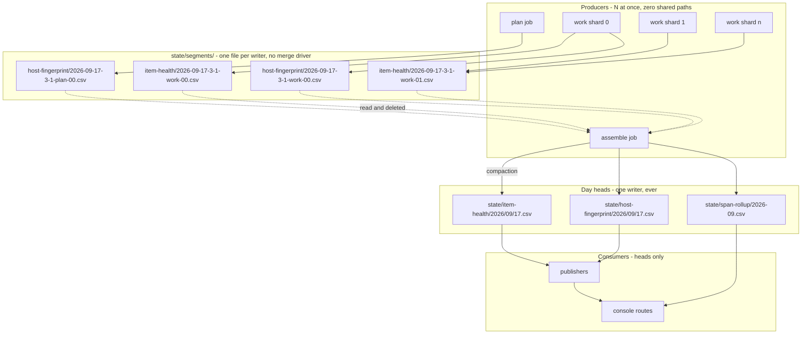
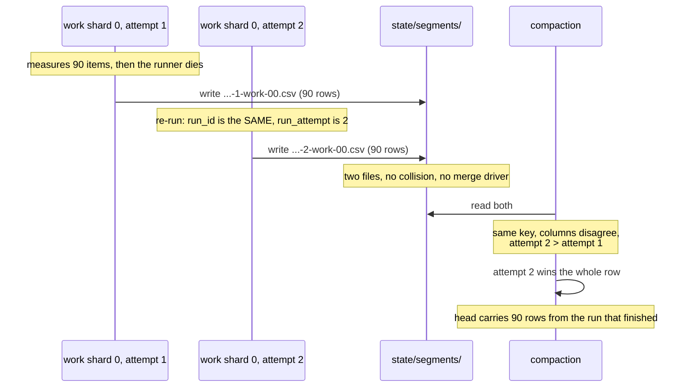

# Collision-free telemetry: segments, compaction, and the retirement of runtime-counters

**Last Updated**: 2026-09-17
**Level**: 5 (core design, four persisted contracts, the trust-free boundary between concurrent runners)

Execute per docs/how-to/execute-a-plan.md: one owner carries the plan and delegates a row where delegation pays; keep parallel N = 4 rows in flight, refilling a slot as soon as a worker returns and never waiting on a merge; consult a persona only where two answers would lead to different code; AUTO-merge on green gates; honor the ESCALATE triggers in section 0. AUTHOR-AND-STOP until the user authorizes.

## 0 - Operating contract

| Field | Value |
| --- | --- |
| Why this plan exists | Up to eight runners write the same ledger file at the same time, and a runner cannot resolve a conflict; one collision on 2026-09-16 destroyed 303 measured rows and left a day with no machine record at all. |
| Hard scope - in | A writer with siblings writes a file nobody else writes. A consumer reads one file for one day, K files for a K-day window, and never a file whose size grows with project history. `state/runtime-counters.csv` is deleted and every column it held is moved to the grain that column actually has. Every surface, test and doc the deletions orphan is deleted in the same row. |
| Hard scope - out | See table 0a. |
| ESCALATE triggers | See table 0b. |
| Chosen strategy | Per-writer segments compacted by a single writer into day heads. Fowler ruled the shape; Carmack priced it and corrected the filename; Susan ruled the operator surface. |
| Execution | autonomous orchestrator per docs/how-to/execute-a-plan.md. Parallel N = 4. |
| Rollback | None. Git is the backup. No dual-read, no strangler fig, no compatibility shim, no deprecation window. A row that replaces a thing deletes that thing in the same commit. |

### Table 0a - out of scope

| id | What is out | What it costs to leave out | What would bring it in |
| --- | --- | --- | --- |
| 0a1 | `state/seen`, `state/feed-health`, `state/published`, `state/counterfactual-scores`, `state/visual-prunes` move to segments | Nothing today. Each has exactly one writing job, so no collision is possible. | A second job starts writing one of them. Then that ledger takes a segment row of its own, copied from Row #2. |
| 0a2 | `state/traces` moves to segments | Nothing. It is already `<YYYY>/<MM>/<DD>-<run_id>-<shard>.jsonl` - one writer, one file - and has never blocked a rebase. It is the existing proof the shape works. | Nothing. It is already in the target state. |
| 0a3 | `state/feed-health`'s unbounded read in `console_band.read_spread_of` | One walk of every committed day on every visuals run. Guardrail #12 debt that predates this plan. | Its own plan. Mixing a read fix into a write fix doubles the surface of every row here. |
| 0a4 | `state/score-index`'s unbounded read by the eval dashboard | One walk of every committed day, operator-only surface. | Same as 0a3. |
| 0a5 | Retention and prune policy for the new `state/runtime-counters` day tree | `runtime-counters.csv` is deleted by Row #9, so there is nothing left to prune. The columns land on `item-health` and `host-fingerprint`, which already carry their own retention. | Nothing. The question dies with the file. |

### Table 0b - ESCALATE triggers

An escalation STOPS that row and reports. It does not stop the plan; other rows keep running.

| id | Trigger | Why a person decides |
| --- | --- | --- |
| 0b1 | A row must widen `.gitattributes` beyond the two lines section 2.6 names, or must keep `merge=union` on any path. | The whole plan rests on no path having two writers. Needing a merge driver means the shape is wrong, not that the driver is needed. |
| 0b2 | Compaction cannot be made idempotent for a ledger - running it twice produces a different head than running it once. | Section 2.4 is the contract every recovery path depends on. |
| 0b3 | A `work` shard's measured wall clock passes 190 min of its 200 min `run.shard_timeout_minutes` bound. | **This is the job at risk, and it is at risk today.** Twenty shard-jobs on 2026-09-16 ran 114.8 to 183.7 min - the worst is 91.9 percent of the bound, 16.3 min spare. `docs/reference/measurements.md` sized the bound in advance and predicted 155 min worst case, so the prediction was 28 min optimistic. A killed work job uploads nothing. |
| 0b4 | A runtime-counters column in section 2.7a turns out to be derivable ONLY from the ledger it was created to check. | **Not "not derivable" - that is the trigger that misses.** Every column is derivable by arithmetic; what can vanish is its INDEPENDENCE. A number that can only be recomputed from the thing it was measuring cannot disagree with it, and a number that cannot disagree is not a check (Guardrail #10). Andre found the first draft's wording blind to exactly this on 2026-09-17. |
| 0b5 | The Machine page read over its 426-day cover passes 120 s in the `assemble` job. | Measured 2.6 s for 24 committed days and 12,837 rows (best of 3, this workspace, 2026-09-17), which projects to about 46 s and 228,000 rows at 426 days. That is 14 percent of assemble's 1200 s bound and fine; a reading four times higher is a design question. |
| 0b6 | Any row needs a new timestamp column on `ItemHealthRow` to make a phase measurement possible. | Section 2.7's note on the phase split. Adding instrumentation to make a measurement possible is a different piece of work from moving a measurement that exists. |

Everything else: dispatch the personas in DEBATE per docs/how-to/execute-a-plan.md, converge to one written ruling, bake it into the row, move on.

## 1 - Status Reckoner

**The collision fix does not wait on the telemetry work.** Rows #1 to #6, #17 and #12 are the fix for the day that was destroyed, and they close on their own. Rows #7, #9, #10, #11, #14 and #15 are the telemetry redesign, and nothing in the fix depends on them. Fowler found the first draft welding the two together - Row #12 depended on Row #11, which depended on four rows of unrelated column work through a contract file that would have gone red - and Row #17 is what breaks that chain.

| # | Row title | Depends-on | Parallel-group | Status | Worktree | PR | Subagent |
| --- | --- | --- | --- | --- | --- | --- | --- |
| 1 | Segment store and the `compact` stage, shipped inert | - | A | PENDING | - | - | - |
| 5 | Machine page stops lying about a day with no rows | - | A | PENDING | - | - | - |
| 6 | One concurrency group for `digest`, `validate`, `measure` | - | A | PENDING | - | - | - |
| 7 | OS memory and load, per item | - | A | PENDING | - | - | - |
| 2 | `host-fingerprint` writes segments | 1 | B | PENDING | - | - | - |
| 3 | `item-health`, `scores`, `score-index` write segments | 2 | B | PENDING | - | - | - |
| 4 | `span-rollup` writes segments | 3 | B | PENDING | - | - | - |
| 17 | `runtime-counters` writes segments | 4 | B | PENDING | - | - | - |
| 10 | `model_load_ms` and `job_seconds` join `host-fingerprint` | 2 | C | PENDING | - | - | - |
| 12 | Delete the merge machinery | 2, 3, 4, 17 | D | PENDING | - | - | - |
| 13 | Compaction lag on the console band | 1, 5, 12 | D | PENDING | - | - | - |
| 11 | Delete `runtime-counters` and everything that reads it | 7, 10, 17 | E | PENDING | - | - | - |
| 15 | Generated TypeScript contracts replace the hand-written ones | 10, 11 | F | PENDING | - | - | - |
| 14 | The per-item machine load panel | 5, 7, 15 | F | PENDING | - | - | - |
| 16 | Docs, and the orphan sweep | all | G | PENDING | - | - | - |
| 9 | Server batching counters, per item | - | - | **COLLAPSED into #7** | - | - | - |
| 8 | Memory split by prefill and decode | - | - | **ESCALATED - not dispatchable** | - | - | - |

**Row #9 is collapsed, not descoped.** Its useful half - `n_decode_calls` - is derivable from columns the row already carries and moved into Row #7 with no probe. Its other half is refused with a measurement. Section 11 carries the rationale.

**Row #8 is not a row.** Carmack showed on 2026-09-17 that it cannot be built on what `ItemHealthRow` records: an item's model time is four alternating segments, not a prefill followed by a decode, and no column says when any phase started. It needs new timestamp columns first, which is ESCALATE 0b6 and a separate decision. It stays in the table so nobody re-derives it as a good idea.

**The `Depends-on` edges that look conservative are file-overlap edges, not logical ones.** Rows #2, #3, #4 and #17 all touch `backend/idhazh/ledger.py`, `.github/workflows/digest.yml` and `backend/tests/pipeline/test_compact.py`, so they are chained rather than fanned out. Rows #13, #14 and #15 share `frontend/src/contracts/` and `frontend/src/lib/charts/`, and `frontend/src/contracts/` does not exist until Row #15 creates it.

## 2 - THE CONTRACT

This section is the intent and the contract derived from it. A worker implements it. A worker does not re-decide it. Where a worker finds the contract wrong, that is an ESCALATE under table 0b or a persona debate under docs/how-to/execute-a-plan.md - never a local judgement call.

### 2.1 Intent

Three sentences. Everything below serves them.

1. **A producer cannot collide.** Two jobs running at the same time never write the same path, so no merge driver, no rebase resolution and no dedup pass stands between a measurement and the repository.
2. **A consumer reads O(1) at best and O(change) at worst.** One day is one file. A K-day window is K files, and K comes from config. No read is ever proportional to how long the project has run.
3. **Every measurement lands at the grain it was measured at.** A number about one article lives on the article's row. A number about one job lives on the job's row. No number is stamped 400 times to make it fit a file.

### 2.2 The shape



Three facts the diagram encodes and a worker must preserve.

- **A segment is written once and read once.** Nothing else ever opens it. It is not a payload a consumer knows about.
- **A head has exactly one writer**, and that writer is `assemble`. `plan` and `work` never touch a head again.
- **The segment directory sits outside every ledger root.** `backend/idhazh/day_partition.py` line 70 raises on any filename it cannot place, by design - "A file the reader cannot place is how it starts missing rows". A `state/<ledger>/segments/` directory would raise in every day-tree read of five ledgers. The fix is not a skip clause in the one walk whose value is that it skips nothing.

### 2.3 Segment path grammar

```
state/segments/<ledger>/<run_id>-<attempt>-<job>-<shard>.csv
```

| Element | Source | Format | Example |
| --- | --- | --- | --- |
| `<ledger>` | the head's `*_DIRNAME` constant in `ledger.py`, validated against a declared set - never a bare string | as declared | `item-health` |
| `<run_id>` | `plan.run_id`, used WHOLE | `YYYY-MM-DD-<digits>`, matching `RUN_ID_PATTERN` at `backend/idhazh/contracts/base.py` line 64 | `2026-09-17-35196099426` |
| `<attempt>` | `GITHUB_RUN_ATTEMPT` | integer, no padding, default `1` | `1` |
| `<job>` | the `ServerJob` enum value | as declared | `work` |
| `<shard>` | shard index in the job | two digits, zero-padded | `00` |

**There is no day-ordinal element.** A `RunId` is the date plus the GitHub run id - `2026-09-17-35196099426` - and the ordinal within the day is computed by `assemble.run_n_for`, which a work shard cannot call. The run id already makes the name unique; a second uniqueness element would be a field a writer cannot fill.

**`<ledger>` is a declared set, not a string.** `segment_path` takes an enum or a `Literal`, never `ledger: str` - a shape nobody declared is Guardrail #3's exact failure. A directory under `state/segments/` naming something outside that set raises, the same way `day_partition` raises on a name it cannot place.

`<attempt>` is load-bearing and nothing in the backend reads it today - `git grep GITHUB_RUN_ATTEMPT backend` returns nothing. GitHub keeps `run_id` stable across a re-run and increments `run_attempt`. Without `<attempt>` in the name, a re-run writes the path its first attempt already wrote.

A segment file carries the head's own header and the head's own columns. It gets no contract of its own and no schema of its own. That is deliberate: a segment is the head's rows in transit, and giving it a second shape is the thing that drifts.

**What the attempt element buys, drawn.** The left column is what happens without it and is the defect this grammar exists to prevent.



Without `<attempt>`, both writes take one path, `.gitattributes` stacks them, and the dedup pass keeps the FIRST - the numbers from the attempt that failed. That is today's behaviour, and section 2.5 inverts it on purpose.

### 2.3a Read cost - the property this plan is for

Intent 2.1.2 is a claim about every consumer. This table is the claim made checkable. A worker who changes a reader checks its row here.

| Consumer question | Files opened | Cost | Grows with |
| --- | --- | --- | --- |
| "today's item health" | 1 | O(1) | nothing |
| "the last K days" (console presets) | K | O(K) | a config knob |
| "this month's machine rows" | 1 month head, or `days_by_month` over K day files | O(K) | a config knob |
| "what has not been compacted yet" | segments this run wrote, plus any a failed run left | O(change) | runs since the last successful compaction, never history |
| "every row ever written" | - | **not a question any consumer asks** | - |

No row in this table is proportional to the number of days the project has run. `state/runtime-counters.csv` was the last one that was, and Row #11 deletes it.

### 2.4 Compaction

```
idhazh compact --state-root <path>
```

One stage, its own module, invocable alone with files in and files out (CLAUDE.md section 4). Two callers, one implementation.

**Algorithm, in order. A worker implements exactly this.**

1. List `state/segments/*/*.csv`. This is the only listing; its cost is the number of segments this run wrote plus any a failed run left, never the project's history.
2. Group by `<ledger>`. **A directory naming a ledger outside the declared set raises** - it is a writer that arrived without anyone noticing, which is the failure this whole plan exists to stop. **A filename the grammar in 2.3 cannot parse raises the same way.**
3. Parse every row of every segment of that ledger with the head's contract, carrying `<attempt>` from the filename onto each parsed row as a sort key. **A row that fails to parse raises, naming the file and the row number.** A segment is written by our own code from a validated model one step earlier; a row that will not parse means the writer and the reader disagree, and degrading past that is how a ledger quietly loses a column. This is the one place the compaction does not degrade, and it is deliberate.
4. Group the parsed rows by the head each belongs to. **The head is chosen by the row's own `date` cell, never by today's date.** A segment left behind by a run three days ago compacts into that day's head. For `span-rollup` the head is the month file the date falls in; for every other ledger it is the day file. The ledger-to-head-shape mapping is a declared table beside the ledger set, not a rule a worker re-derives.
5. For each head: **if it does not exist, create its parent directories and open it with the contract's `csv_columns()` header and the contract's current `version`.** Otherwise read it once. Then merge the segment rows in by the ledger's existing `*_KEY` tuple, applying section 2.5.
6. Write the head with a temp-file-plus-rename.
7. Remove every segment file that was read, from the working tree, with `Path.unlink`. **The compaction does not call git.** The caller stages and commits; `assemble` already stages `state` whole, so `git add state` records the deletions with no path-list change. A stage that shells out to git is a stage that cannot be driven from a fixture.
8. Return a `CompactionReport` and log one line from it: ledgers touched, segments read, rows merged, rows superseded, oldest segment date.

**Ordering inside `assemble`.** The compaction runs inside `stage_assemble` before `dispatch.publish_all` (`backend/idhazh/stages/assemble.py` line 344). The publishers read heads, so a compaction after them publishes a page that disagrees with the record it was built from.

**The second caller is the `plan` job of the next digest run, NOT `prune.yml`.** `plan` already sits in the concurrency group Row #6 creates, already commits through `commit-and-push.sh`, and runs five times a day, so a segment left by a dead assemble waits at most 4.8 hours. `prune.yml` is disqualified three times over and a worker must not put it there: it commits nothing on 29 of 30 wakes (both its commit steps are gated `if: steps.due.outputs.due == 'true'`), it stages only `corpus` on the day it is due, and it ends in `git push --force origin main` - deliberately not `--force-with-lease`. A compaction there would delete every waiting segment from a runner that then throws itself away, and on the due day it would discard anything a shard pushed since its own checkout. That is the loss this plan exists to prevent, rebuilt and given a schedule.

**Idempotence is the contract** (ESCALATE 0b2). Running the compaction twice over the same segments produces the same head as running it once. The key merge in section 2.5 is what makes that true.

**The API a worker writes to.** These four are the whole public surface. Nothing else in the codebase reaches into `state/segments/`.

```python
# backend/idhazh/ledger.py
SEGMENTS_DIRNAME: Final = "segments"

def segment_path(
    state_dir: Path, ledger: str, date: str, run_id: str, attempt: int, job: str, shard: int
) -> Path:
    """Where this writer puts its rows. Nobody else writes this path."""

def segment_files(state_dir: Path, ledger: str | None = None) -> list[Path]:
    """Every segment on disk, or one ledger's. The only listing; cost is what is
    waiting, never what the project has written."""

# backend/idhazh/stages/compact.py
@dataclass(frozen=True, slots=True)
class CompactionReport:
    segments_read: int
    rows_merged: int
    rows_superseded: int
    heads_written: tuple[str, ...]      # repo-relative POSIX paths
    oldest_segment_date: str | None     # DateStamp, None when nothing waited

def stage_compact(state_dir: Path) -> CompactionReport:
    """Merge every segment into its head and remove the segment. Safe to run twice."""
```

`CompactionReport` is what Row #13 reads for the band fields and what the log line in step 7 prints. It is a return value, not a persisted payload, so it gets no schema.

**Two things `stage_compact` must not do.** It does not call git - the caller stages, because `assemble` already stages `state` whole and a stage that shells out to git is a stage that cannot be tested from a fixture. And it does not consult today's date for anything; a date it needs comes off a row.

### 2.5 The merge rule, per key

Two segment rows may share a `*_KEY`. Three cases, and exactly three.

**`<attempt>` comes from the filename and rides with the row through steps 3 and 4. It is never a column.** A row already in the head has no filename, so **a head row counts as attempt 0** - lower than every segment, which is what lets any segment correct a head and what makes the rule total.

| Case | Condition | Rule | Why |
| --- | --- | --- | --- |
| Join | Same key, and no **non-key, non-`version`** column is non-null in both | Take the union of non-null cells into one row, keeping the highest attempt seen | This is what lets a probe that runs at job start and a counters read that runs at job end share one `host-fingerprint` row without either becoming mutable |
| Supersede | Same key, a non-key column is non-null in both, and the attempts differ | The higher attempt wins each contested cell; a cell only the lower attempt filled is KEPT | Attempt 2 exists because attempt 1 did not finish. Attempt 1's numbers describe a job that failed. Today's first-row-wins keeps exactly the wrong one - and a whole-row replacement would throw away a cell a longer-lived first attempt filled |
| Repeat | Same key, a non-key column is non-null in both, same attempt | Keep the cell already held; count the row as superseded; do not fail | This is what makes a second compaction free, and it is the recovery path when a run dies between the head write and the commit |

**The key columns are excluded on purpose, and this is the bug the first draft had.** `version`, `date`, `run_id`, `job` and `shard` are non-null in both rows by construction, so a Join condition reading "no column is non-null in both" can never fire - every same-key pair would fall to Repeat, the incumbent would win, and Row #10's two new cells would be silently discarded. Fowler found it on 2026-09-17.

**`ITEM_HEALTH_KEY` has no `job` cell** (`ledger.py` line 157 - `("date", "run_id", "item_id")`), and both `work` and `assemble` write a row for the same item. Today `telemetry/census.py` line 126 prefers the shard's sealed row. Under Repeat alone, read order would decide, and read order is filename order, so `assemble` would beat `work` alphabetically and silently reverse a shipped behaviour. **So `item-health` compaction keeps the existing preference:** the rule is `ledger._PREFERENCES` (`ledger.py` line 326, applied at line 1535), which already carries per-key merge preference and already documents "first row wins unless the key declares otherwise" at line 1513. Section 2.5 governs where a key declares no preference; `_PREFERENCES` governs where it does. One vocabulary, not two.

### 2.6 `.gitattributes`

Exactly two changes. Any third is ESCALATE 0b1. **The quoted text is what the file actually holds** - a worker matching on a shortened form will not find these lines.

```
# ADD - a segment has one writer, so a union driver it never asked for
# would silently stack two copies where a conflict should stop the push.
# THIS LINE GOES BELOW THE state/**/*.csv LINE. Last match wins in
# .gitattributes, so placing it above leaves segments inheriting the union
# driver until Row #12 - which is the defect, reintroduced by placement.
state/segments/**/*.csv -merge

# DELETE - these two lines are why a lost push race stacks rows today.
# Both carry `text eol=lf` before the driver; LF survives because
# `*.csv text eol=lf` at the bottom of the file still pins it.
state/*.csv           text eol=lf merge=union
state/**/*.csv        text eol=lf merge=union
```

The `state/published/**` and `state/visual-prunes/**` union lines stay. Those ledgers keep one writing job (table 0a1) and their explicit lines are what stop them inheriting the `-merge` above by accident.

**The window between Row #2 and Row #12 is safe, and it is safe by design rather than by luck.** In that window a head still carries `merge=union` while only one writer remains. A union of two appends is harmless, but the compaction REWRITES a head whole, and `.gitattributes` lines 30-32 already state what a union of two rewrites costs: "a file with every row twice". What covers the window is that `DROP_REPEATED_ROWS_COMMAND` stays wired until Row #12 (`digest.yml` lines 340 and 806) and sweeps the repeats. Row #12 removes the union driver and the dedup pass in the same commit, so the window closes rather than being left open.

### 2.7 `ItemHealthRow` - the columns this plan adds

Seven columns. **One changelog entry, one `version` stamp, paid once** - see the note at the end of this section.

| Column | Type | Sampled | Description that ships in the Field |
| --- | --- | --- | --- |
| `os_mem_available_bytes` | `int \| None` | last `Watch` tick of the item | Memory the kernel says a new allocation could have, from `/proc/meminfo` `MemAvailable`. This is headroom; an RSS mark is not. |
| `os_mem_free_bytes` | `int \| None` | last tick | Memory on no list at all, from `MemFree`. Lower than available, because the kernel counts reclaimable cache separately. |
| `os_mem_total_bytes` | `int \| None` | last tick | What the machine has, from `MemTotal`. Constant within a job; recorded per item so a row means something on its own. |
| `os_mem_cached_bytes` | `int \| None` | last tick | Page cache, from `Cached`. Most of the model weights sit here, so a drop is the kernel evicting what the next item has to read again. |
| `os_swap_free_bytes` | `int \| None` | last tick | From `SwapFree`. A fall here is the machine in trouble before the cgroup kill. |
| `os_mem_available_min_bytes` | `int \| None` | minimum over the item's MODEL window | Lowest `MemAvailable` seen while the model was working on this item. The closest this item took the machine to its limit. |
| `n_decode_calls` | `int \| None` | derived, no probe | `llama_decode()` calls this item cost. Computed as `label_output_tokens + summary_output_tokens + model_calls` - measured across four committed runner captures, a shard's decode total exceeds its generated tokens by 30 to 44 against about 40 model calls, so this is the count to within about one call per request. |

**Where the samples come from, and why the obvious answer is wrong.** Do NOT select `rss-samples.tsv` rows by `item_started_at..item_ended_at`. That interval is not an item's window: the stage fetches every item and then runs the model over them in a different order, so the median `item_ended_at - item_started_at` is 4,021 s against a median model time of 452 s - nine times longer - and a median of 19 items out of 20 have their windows open at the same instant. Selecting by it would put the JOB's minimum on almost every row, which is the exact failure this section's own rejected alternative refuses for `cgroup_peak_bytes`. Carmack measured it on 2026-09-17 against `state/item-health/2026/09/16.csv`, 400 rows over 5 runs and 20 shard-jobs.

**Use `host.Watch` instead.** It already runs per item, in-process, over the MODEL window rather than the queue window, and already produces `cpu_busy_max`, `cpu_busy_min` and `llama_rss_peak_bytes` that way (`backend/idhazh/telemetry/host.py` lines 330-440). Add `/proc/meminfo` to its `read_now()` - one more file read on a tick that already opens four. At today's `logging.waiting_heartbeat_seconds` of 30 s that is about 15 samples across a median item; the sampler's own 15.6 s period would give about 29. Cost: about 40 ms a shard against a 183.7 min worst-case job, which is 0.0004 percent.

**The prefill-and-decode split is NOT in this plan, and that is ESCALATE 0b6.** It cannot be built on what the row records. An item's model time is four segments in alternation - label prefill, label decode, summary prefill, summary decode - proved by `prefill_ms == label_prefill_ms + summary_prefill_ms` on 370 of 370 committed rows with `model_calls == 2`. So there is no single prefill-to-decode boundary, and no column records when any phase STARTED; `prefill_ms` and `decode_ms` are durations, not instants. Building it needs `label_started_at` and `summary_started_at` on the row first, which is new instrumentation rather than a measurement being moved. That is a separate decision with a separate price.

**`busy_slots_per_decode` is NOT in this plan either, and it is refused rather than deferred.** `llamacpp:n_busy_slots_per_decode` is declared `# TYPE ... gauge` in the committed captures - a lifetime average, not a counter - so two reads cannot be differenced into an interval average. And it would measure nothing if they could: 382 of 383 committed rows record `1.0`, the 383rd records `0.0` for a shard whose server never decoded. One python worker per shard sends one request at a time, and a shard's summed item model time equals its job span exactly on 16 of 20 shard-jobs, so there is never a second busy slot to count. Twenty-one days of production, one observed value.

**`n_decode_calls` needs no HTTP scrape.** It is arithmetic over columns the row already carries. `runtime_counters.py` warns that "a per-request scrape would add requests to the thing it measures"; deriving the number obeys that warning instead of arguing with it.

**The literal field shape.** Every new column follows this, so a worker writes columns, not decisions. `Contract` and the `Field` conventions are the ones already in `backend/idhazh/contracts/item_health.py`.

```python
os_mem_available_bytes: int | None = Field(
    default=None,
    ge=0,
    description=(
        "Memory the kernel says a new allocation could have when the item ended, "
        "from /proc/meminfo MemAvailable. This is headroom; an RSS mark is not."
    ),
)
```

Four rules bind all seven, and a worker does not vary them.

1. `default=None`. A missing sample is unknown, never zero.
2. Byte counts are `int | None` with `ge=0`. Counts are `int | None` with `ge=0`.
3. The description says what it measures AND where it came from, in that order, because the second is what makes a stale reading findable.
4. Column order in `csv_columns()` follows the table in 2.7, appended after the existing columns. Nothing is inserted between existing columns.

**The changelog budget is paid once, and this is why Rows #7 and #9 ship as ONE contract commit.** `backend/idhazh/contracts/item_health.py` already holds five `ChangelogEntry` blocks and `backend/tests/contracts/test_changelog_shape.py` line 60 fails above five. Two rows each appending an entry would go red on the second. So the seven columns land in one commit, with one entry and one `version` stamp, and the older entries are pruned to the cap per CLAUDE.md section 11 - git is the archive. This also removes the hand-merge conflict two parallel rows would have had in the same changelog block.

**One file outside `backend/` holds the item-health column list literally.** `frontend/scripts/build-canary.mjs` carries it and a backend test guards the pair, so a widening that does not touch it leaves every backend gate green and takes CI's `site` and `browser` jobs red. It is in Row #7's file list for that reason.

### 2.7a Every runtime-counters column, and where it went

This is the row-by-row justification for what happens to D1. ESCALATE 0b4 fires if a worker finds any line of it false.

| runtime-counters column | Disposition | Its replacement |
| --- | --- | --- |
| `peak_rss_bytes` | delete | `item_health.llama_rss_peak_bytes`, per item |
| `python_peak_rss_bytes` | delete | `item_health.python_rss_bytes`, per item |
| `cgroup_peak_bytes` | delete | already on `item_health`, per item |
| `cpu_busy_pct` | delete | already on `item_health`. **A different measurement at a different grain, not the same number relocated** - the counters cell is `/proc/stat` deltas across the whole job, the item cell is `Watch` over the model window |
| `n_ctx_configured` | delete | already on `item_health` |
| `cpu_model` | delete | `host_fingerprint.cpu_model`, identical key |
| `prompt_tokens_total` | **KEEP, as `host_fingerprint.server_prompt_tokens`** | Nothing replaces it. The ledger's own answer is `sum(input_tokens) - sum(cached_tokens)` - **not `sum(input_tokens)`**, because llama-server documents this counter as prompt tokens processed EXCLUDING cached tokens, and the first draft's mapping would have reported a permanent ~90 percent gap. This is half of the second instrument; see 2.7b |
| `prompt_tokens_cached_total` | delete | sum of `item_health.cached_tokens` |
| `prompt_seconds_total` | **KEEP, as `host_fingerprint.server_prompt_seconds`** | The other half. A rate is a ratio, and the 80 percent defect this check caught was in the numerator, so one column alone could not see it |
| `tokens_predicted_total` | delete | sum of `item_health.output_tokens` |
| `tokens_predicted_seconds_total` | delete | sum of `item_health.decode_ms` |
| `n_tokens_max` | delete | max of `item_health.input_tokens + output_tokens` |
| `date`, `run_id`, `shard`, `job`, `version` | delete | both surviving ledgers carry them |
| `scraped_at`, `shards` | delete | metadata about a file that no longer exists |
| `n_decode_total` | **derive** | `item_health.n_decode_calls` (Row #7). **Its `Field` description opens with the word \"derived\"** - it restates three columns the row already carries, and the counter that used to validate that formula is going, so it must never be quoted as a count |
| `n_busy_slots_per_decode` | **delete, refused** | Nothing. It is a gauge that reads `1.0` on 382 of 383 committed rows; section 2.7 carries the refusal |
| `model_load_ms` | **move** | `host_fingerprint.model_load_ms` (Row #10) |
| `job_seconds` | **move** | `host_fingerprint.job_seconds` (Row #10) |

Twenty-three columns. Seventeen already have a home or are metadata. **Two are KEPT as the second instrument**, two more move, one is derived, and one is refused with its reason.

### 2.7b The second instrument is KEPT, and this is why

**`state/runtime-counters.csv` exists as an independent check, and it has caught two real defects.** Deleting it outright would have been a Guardrail #10 loss. Andre found this on 2026-09-17, against the first draft's claim that Row #9 moved the cross-check to item grain - a claim that was false, because Row #9's survivor is arithmetic over the very ledger it would be checking, and **arithmetic over a ledger cannot check that ledger.**

| What the second instrument caught | Size | What changed because of it |
| --- | --- | --- |
| The ledger counted cached tokens as read (before 2026-08-27) | **11.09 tok/s against 19.96 on run `2026-08-25-1` - 80 percent wrong** | The definition of a read prompt token moved to one place. Recorded in `docs/reference/measurements.md` and `backend/utilities/reconcile_prefill.py` |
| A refused model reply counted by the server and missing from the ledger (2026-09-13) | **0.746 percent on run `2026-09-12-34717684802`** - one article eating 15 percent of the 5 percent tolerance; 93 of 93 failed summarize rows carried no cost at all | `backend/idhazh/summarize.py` now hands the reply to the failure path and the census row carries the five cost cells. Recorded in `docs/architecture/summarize/throughput.md` |

A 0.746 percent drift caused by one article is the size of signal only a second instrument can see - far below anything a trend line shows, far above rounding. The instrument did not sit silent; two of its three recorded readings are disagreements.

**So Row #10 carries four columns, and two of them are this instrument.** They land on `host-fingerprint`, whose key is already `(date, run_id, job, shard)` - the same key the counters row used - so the two-clocks panel keeps shard grain with no new join and no extra changelog entry. The `GET /metrics` read that fills them already runs at job end.

**If a later decision drops them anyway, it must say what the operator loses in these words:** the only place on the site where two instruments measure one quantity and can disagree, and with it the right of `docs/architecture/summarize/throughput.md` and the Hardware route to publish a throughput number at all under Guardrail #10.

**The 5 percent bound is not a `config/` knob.** `backend/utilities/reconcile_prefill.py` states why: tuning it is how a failing check is made to pass.

### 2.8 `HostFingerprintRow` - the columns this plan adds

Four columns. `version` stamps to `2026-09-17` with one changelog entry.

| Column | Type | Description that ships in the Field |
| --- | --- | --- |
| `model_load_ms` | `float \| None` | Milliseconds the server spent opening the weights before the first item. Once per job, which is this row's grain. |
| `job_seconds` | `int \| None` | The job's own wall clock. The truncation cap reverts on the slowest work job's, and before this cell the only place that number lived was the GitHub jobs API, which drops a job record when the run ages out. |
| `server_prompt_tokens` | `int \| None` | Prompt tokens llama-server itself counted reading, cached tokens excluded. **The second instrument.** The ledger's own answer is `sum(input_tokens) - sum(cached_tokens)`; a gap over 5 percent means one of the two is wrong. |
| `server_prompt_seconds` | `float \| None` | Seconds llama-server itself counted reading prompts. Pairs with the column above - a rate is a ratio, and the 80 percent defect this check caught in August was in the numerator. |

`HOST_FINGERPRINT_KEY` is already `("date", "run_id", "job", "shard")` - the same key `RUNTIME_COUNTERS_KEY` uses. The two ledgers were always one row split across two files. Section 2.5's Join case is what lets the early probe and the late counters read land on it without the row ever being updated in place.

### 2.9 `console/band.json` - the compaction lag

Three fields, and one sentence built from them.

| Field | Type | Meaning |
| --- | --- | --- |
| `compaction_lag_days` | `int` | Whole days between the oldest segment the compaction FOUND WAITING and the date it ran. `0` when it found none. |
| `rows_uncompacted` | `int` | Rows the compaction merged in from segments older than its own run date. `0` when there were none. |
| `covers_through` | `DateStamp \| None` | The newest date every head is now compacted through. |

**The three fields come from `CompactionReport` - what the compaction found when it STARTED - never from a listing taken afterwards.** The first draft had them read `state/segments/` at publish time, and Susan showed on 2026-09-17 that the field could then never be non-zero: the compaction runs before `dispatch.publish_all`, so by the time the band is written the directory is always empty, and on the run where the compaction raises, `publish_all` never runs and no band exists at all. **A signal with no reachable non-zero state is worse than no signal - it teaches an operator that no warning means nothing is wrong.**

**There is no `visuals` job.** `digest.yml` has three - `plan`, `work`, `assemble`. The band is written by `console_band.publish`, dispatched from `dispatch.publish_all`, inside `stage_assemble`. That does not withdraw the ruling that the signal must come from a run that succeeded; it sharpens the tense.

The sentence the band renders when `compaction_lag_days > 0`, in the PAST tense:

> **This run merged 303 rows that had been waiting 2 days.** The Hardware page now reaches 17 September.

Present tense on a page that was just brought current is a false sentence, and a false sentence is exactly what Row #5 exists to delete.

**What this signal cannot cover, and the plan says so rather than implying otherwise:** an `assemble` that fails for days writes no band at all. The band's existing `generated_at` is what covers that case. Row #13 states the limit on the page's own terms.

### 2.10 Vocabulary

| Word | Means | Does not mean |
| --- | --- | --- |
| **segment** | one writer's slice of one ledger for one job, before it is merged in | a work shard, a day partition, a published shard |
| **compaction** | merging segments into a day head, and merging day heads into a month file | anything to do with `casefold`, `chrome.fold`, or text |
| **head** | the file a consumer reads: `<Y>/<M>/<D>.csv` or `<Y>-<M>.csv` | a git ref |

`retention.fold_month` is renamed `retention.compact_month` in Row #16 - it is the same operation one level up, and one word for one operation is the point. `casefold()` and `chrome.fold()` keep their names; those are a different meaning of an English word and renaming them is churn that buys nothing.

### 2.11 The deletion inventory

No technical debt. Every artifact below is deleted by the row named, in the same commit that replaces it. A row that leaves one of these standing is not done.

| id | Artifact | Deleted by | Replaced by |
| --- | --- | --- | --- |
| D1 | `state/runtime-counters.csv` | #11 | `item-health` columns (2.7) and `host-fingerprint` columns (2.8) |
| D2 | `backend/idhazh/contracts/runtime_counters.py` | #11 | - |
| D3 | `schemas/runtime-counters-row.schema.json` | #11 | - |
| D4 | The `counters` CLI stage and its parser block in `backend/idhazh/cli.py` | #11 | the per-item sample reader |
| D5 | `host.stage_counters` and every helper only it calls | #11 | - |
| D6 | `ledger.append_runtime_counters`, `ledger.load_runtime_counters`, `RUNTIME_COUNTERS_KEY` | #11 | - |
| D7 | `backend/idhazh/telemetry/publish/machine.py` whole-file read, `months_on_file`, and the module docstring accepting it | #11 | **a read scoped by `series.months_to_write` over a 426-day cover** of `item-health` and `host-fingerprint`. The module's stated exception - its source is one unsharded file, so there is no month boundary to inherit - dies with the file, and the publisher becomes an ordinary month-scoped producer |
| D8 | `frontend/src/lib/server/runtime-counters.ts` | #11 | a reader over the two surviving ledgers, keeping `server_prompt_tokens` and `server_prompt_seconds` as the second clock |
| D9 | Every test naming `runtime_counters`, `RuntimeCountersRow`, the `counters` stage, **or the frontend spelling `RunCounters`** | #11 | tests for the new columns. **The underscore spelling alone misses six browser specs and `frontend/tests/support/reduction-input.ts`** |
| D10 | The `Take the model server's counters` step in `digest.yml` | #11 | - |
| D11 | `state/*.csv merge=union` and `state/**/*.csv merge=union` | #12 | `state/segments/**/*.csv -merge` |
| D12 | `DROP_REPEATED_ROWS_COMMAND` and its wiring in `commit-and-push.sh` and `digest.yml` | #12 | the keyed merge in 2.5 |
| D13 | `backend/idhazh/stages/dedupe_ledgers.py` call site, its CLI stage, its `--every-shard` flag | #12 | the keyed merge in 2.5. **`ledger.keyed_paths`, `ledger._PREFERENCES` and the `*_KEY` tuples survive** - they are what the compaction merges by |
| D14 | The six hand-listed staging paths at `digest.yml` line 809 | #12 | `state/segments` and `state` |
| D15 | `export interface HostFingerprint` in `frontend/src/lib/server/host-fingerprint.ts` | #15 | the generated contract |
| D16 | The `state/runtime-counters.csv` entry in `docs/concepts/growing-reads.md` | #16 | - |
| D17 | Every doc sentence describing a union merge, a dedup pass, or a shared-file ledger write | #16 | the segment and compaction description |
| D18 | `retention.fold_month` (the name) | #16 | `retention.compact_month` |
| D19 | `frontend/src/lib/charts/machine.ts` and `machine-split.ts` - both `import type { RunCounters } from '$lib/server/runtime-counters'` | #11 | readers over the two surviving ledgers |
| D20 | `frontend/scripts/build-canary.mjs` writes `runtime-counters.csv`; `frontend/scripts/tests/build-state.test.mjs` reads it | #11 | the canary writes the two surviving ledgers |
| D21 | `state/runtime-counters.csv` in the assemble `REFRESH_PATHS` at `digest.yml` line 1201, and its two entries in the closed-world sets at `backend/tests/workflows/_harness.py` lines 698 and 931 | #11 | - |
| D22 | `COUNTERS_FIXTURE` at `backend/tests/workflows/_harness.py` line 834 and the fixture file it points at | #11 | - |
| D23 | `backend/idhazh/stages/dedupe_ledgers.py` - **the whole module** | #12 | nothing. The settle function and `keyed_paths` live in `ledger.py` (lines 1357, 1500-1560), not in the stage. Once the call site, the CLI stage and `--every-shard` go, the module is a wrapper with no caller whose docstring is entirely about the union merge that commit deletes |
| D24 | `COMMIT_REFRESH_PATHS` at `backend/tests/workflows/_harness.py` line 914, asserted at `test_daily_commit_steps.py` line 213 | #1 | the same list plus `state/segments`. **This is a closed-world set; Row #1's first draft named the assert and not the list** |
| D25 | `backend/utilities/reconcile_prefill.py` - **REBUILT, not deleted** | #11 | It imports `WORK_JOB`, `RuntimeCountersRow` and `load_runtime_counters` from modules D2 and D6 delete, and `backend/tests/test_ledger.py` imports four symbols from it. Row #11 without this takes `mypy` and the backend suite red. **It is the audit that found both defects in 2.7b**, so it is rebuilt on `host_fingerprint.server_prompt_tokens` and `server_prompt_seconds`, never removed |
| D26 | `frontend/src/routes/console/machine/+page.svelte` (64,634 bytes, all 15 panel titles), and the seven panels that read `RunCounters`: Shards of the newest run, Prompt cache, Context headroom, Peak memory, Reading against writing, The machines this run drew, What the platform has been giving us | #11 | readers over `item-health` and `host-fingerprint`. **Only their chart modules were named in the first draft; the route file and the panel titles were not** |
| D27 | The `runtime-counters` citations in the docstrings of `frontend/src/lib/server/host-fingerprint.ts` and `frontend/src/lib/server/span-rollup.ts` | #11 | the two surviving ledgers |

**One symbol MOVES rather than dying.** `ServerJob` and `WORK_JOB` are defined in `backend/idhazh/contracts/runtime_counters.py` at lines 116 and 153, which D2 deletes - and nine production modules import them (`contracts/host_fingerprint.py`, `contracts/item_health.py`, `stages/record.py`, `stages/work.py`, `telemetry/census.py`, `telemetry/host.py`, `telemetry/silicon.py`, plus six test modules). **They move to `backend/idhazh/contracts/base.py`**, which already owns `JOB_NAME_PATTERN` and is the bottom of the contracts dependency graph, so both `host_fingerprint.py` and `item_health.py` may import it. A worker left to choose would put it in `host_fingerprint.py` and create a contracts-to-contracts edge that bites the day a third contract needs it. Row #11 does the move in the same commit as the delete, or the tree does not build.

**The sweep that proves it.** Row #16 runs `git grep -in 'runtime.counters\|runtime_counters\|merge=union\|DROP_REPEATED_ROWS\|dedupe.ledgers\|fold_month\|RunCounters'` across the whole repository and the result is empty apart from the two surviving `state/published/**` and `state/visual-prunes/**` union lines. A non-empty result that is not one of those two is an unfinished deletion. **The sweep is a one-time row check, never a committed test** - a grep over the repository walks `corpus/` and `state/`, which Guardrail #12 forbids a test to do.

## 3 - Row #1 - Segment store and the `compact` stage, shipped inert

- **Scope:** `state/segments/` exists, `idhazh compact` drains it and is wired into `assemble` and the hygiene workflow, and nothing writes a segment yet.
- **Files touched:**
  - `backend/idhazh/ledger.py` - `SEGMENTS_DIRNAME`, `segment_path()`, `segment_files()`
  - `backend/idhazh/stages/compact.py` - new
  - `backend/idhazh/cli.py` - the `compact` stage
  - `backend/idhazh/stages/assemble.py` - call before `dispatch.publish_all`
  - `backend/idhazh/run_context.py` - read `GITHUB_RUN_ATTEMPT`
  - `.gitattributes` - the `-merge` line from 2.6 (the two deletions wait for #12)
  - `.github/workflows/digest.yml` - stage `state/segments`, add it to `REFRESH_PATHS` on both assemble commits, and call `idhazh compact` in the `plan` job as the catch-up
  - `backend/tests/workflows/_harness.py` - `COMMIT_REFRESH_PATHS` at line 914 and `COMMIT_STAGED_PATHS` are **closed-world sets**; the assert at `test_daily_commit_steps.py` line 213 reads them, so editing the assert without the list is a guaranteed red
  - `state/segments/.gitkeep`
  - `backend/tests/pipeline/test_compact.py` - new
  - `backend/tests/workflows/test_daily_commit_steps.py`
- **Acceptance gates:** local - `python backend/utilities/gate_lock.py -- python -m ruff check .`, `mypy .`, `pytest backend/tests/pipeline/test_compact.py backend/tests/workflows -n auto`. CI - full suite, drift gate.
- **Oracle:** a built fixture segment directory carrying (a) two segments for one date, (b) one segment for a date the head does not have, (c) two segments with the same key and different attempts, (d) a segment for a date three days old, (e) a filename the grammar cannot parse, and (f) a directory naming an undeclared ledger. After one compaction every row from (a) to (d) is in the right head, the directory is empty of those four, and a second compaction leaves every head byte-identical; (e) and (f) each raise, naming the offending path. **What it cannot settle:** whether a real runner's segment deletion survives a lost push race - that needs Row #2 on a real run.
- **Decisions:**

| # | Decision | Authority |
| --- | --- | --- |
| 1 | Segments live at `state/segments/<ledger>/`, outside every ledger root | Fowler - `day_partition.py` line 70 raises on an unplaceable name, and a skip clause in the one walk that skips nothing is how a new writer arrives unnoticed |
| 2 | The compaction adds no workflow step and no commit; it rides `Commit the day` | Carmack - `digest.yml` line 1212 already stages `state` whole, so `git add state` records the deletions with no path-list change |
| 3 | `state/segments` joins `REFRESH_PATHS` | Carmack - a lost push hands the heads back to the tip and re-runs the compaction against it, including segments a sibling pushed while this run built |
| 4 | Ship inert first | Fowler - an empty-directory compaction proves the staging path, the deletions, the ordering against the site build, and Carmack's sub-second estimate, with zero rows at risk |
| 5 | The compaction routes by the row's `date` cell, not today's date | Fowler - it is the whole recovery path for a day `assemble` died on |
| 6 | The catch-up caller is the `plan` job, NEVER `prune.yml` | Carmack - `prune.yml` commits nothing on 29 of 30 wakes, stages only `corpus` on the day it is due, and ends in `git push --force origin main`. A compaction there deletes every waiting segment from a runner that throws itself away, and on the due day discards whatever a shard pushed since its own checkout. `plan` runs five times a day, is inside Row #6's concurrency group, and already commits through `commit-and-push.sh` |

- **Rejected alternatives:**

| # | Option | Why rejected | What it would cost to take | Authority |
| --- | --- | --- | --- | --- |
| 1 | `state/<ledger>/segments/` | Raises `ValueError` in every backend day-tree read of five ledgers | A skip clause in `day_partition.day_files`, which is the one walk whose stated value is that it skips nothing | Fowler |
| 2 | Route all state through build artifacts so only `assemble` commits | Refused in writing at `digest.yml` line 654 - an artifact expires and is never committed, so a run stopped after the workers measured would record nothing | Re-opening a decision taken because this exact loss already happened | Fowler |
| 3 | A branch per job that `assemble` merges | A stale branch pins pre-prune history and defeats `prune.yml` | Branch cleanup for a dead assemble, plus 8 fetch-merge-delete cycles a run, for durability one commit already gives | Fowler |
| 4 | Leave the rebase-tolerance fix (PR 840) as the whole answer | Writers still share a filename, so it fails intent 2.1.1 outright | Keeping `dedupe_ledgers`, six `*_KEY` tuples, the two-header repair and six hand-listed staging paths | Fowler |

## 4 - Row #2 - `host-fingerprint` writes segments

- **Scope:** `plan`, `work` and `assemble` write `host-fingerprint` segments; `assemble` compacts them; nothing writes the head directly.
- **Files touched:** `backend/idhazh/ledger.py`, `backend/idhazh/telemetry/silicon.py`, `.github/workflows/digest.yml`, `.github/workflows/measure.yml`, `backend/tests/pipeline/test_compact.py`, `backend/tests/telemetry/test_silicon.py`
- **Acceptance gates:** local - ruff, mypy, `pytest backend/tests/telemetry backend/tests/pipeline -n auto`. CI - full suite, drift gate.
- **Oracle:** ten writers (one plan, eight work shards, one assemble) produce ten segments and, after compaction, the day head carries ten rows with ten distinct `(job, shard)` pairs and no repeats. **What it cannot settle:** whether ten real runners racing produce the same result - the first live run is the check, and `state/host-fingerprint/2026/09/16.csv` being header-only today is what it is being checked against.
- **Decisions:**

| # | Decision | Authority |
| --- | --- | --- |
| 1 | This ledger goes first of the four movers | Fowler - it is the one a collision already emptied, and it is the one Row #10 needs |
| 2 | `HostFingerprintRow` does not change shape in this row | Fowler - the path moves, and a path is not a persisted shape. No `version` stamp, no migration |
| 3 | `measure.yml` writes segments under `state/pipeline-tests/` the same way | Carmack - it is the only state writer with no concurrency group at all |

- **Rejected alternatives:**

| # | Option | Why rejected | What it would cost to take | Authority |
| --- | --- | --- | --- | --- |
| 1 | Move all four ledgers in one row | One revert would take four ledgers with it | Nothing technical; it trades a reviewable unit for a shorter table | Fowler |
| 2 | Keep `assemble` writing the head directly since it has no siblings | Two writers of one path is the thing being removed, and "has no siblings today" is how the next one arrives | An exception a later reader has to re-derive | Fowler |

## 5 - Row #3 - `item-health`, `scores`, `score-index` write segments

- **Scope:** `work` and `assemble` write segments for the three item-grain ledgers.
- **Files touched:** `backend/idhazh/ledger.py`, `backend/idhazh/evals/writer.py`, `backend/idhazh/evals/archive.py`, `backend/idhazh/stages/assemble.py`, `.github/workflows/digest.yml`, `backend/tests/pipeline/test_compact.py`, `backend/tests/evals/`
- **Acceptance gates:** local - ruff, mypy, `pytest backend/tests/evals backend/tests/pipeline -n auto`. CI - full suite, drift gate.
- **Oracle:** the canary day under `backend/var/canary/` runs work-then-assemble against a fixture `STATE_ROOT`; every item that entered appears exactly once in the `item-health` head, `state/segments/` is empty, and **a head written by the compaction has exactly one header line**. The last clause replaces a first draft that asserted the two-header-block shape was "now unreachable" - an unreachability claim has no red state, so it was not an oracle at all (Fowler, 2026-09-17). **What it cannot settle:** row counts at production scale.
- **Decisions:**

| # | Decision | Authority |
| --- | --- | --- |
| 1 | Three ledgers, one row | Fowler - same writer, same job, same risk; splitting buys a reviewer nothing |
| 2 | `ITEM_HEALTH_KEY`, `EvalRow` and `ObservationIndexRow` keep their shapes and schemas | Fowler - drift gate byte-identical is this row's proof no contract moved |

- **Rejected alternatives:**

| # | Option | Why rejected | What it would cost to take | Authority |
| --- | --- | --- | --- | --- |
| 1 | Give segments their own contract and schema | A segment holds the head's rows; a second shape for the same rows is the thing that drifts | Three more schemas and a drift surface that proves nothing | Fowler |

## 6 - Row #4 - `span-rollup` writes segments

- **Scope:** `work` writes `span-rollup` segments; compaction merges them into the month head.
- **Files touched:** `backend/idhazh/ledger.py`, `backend/idhazh/telemetry/spans.py`, `.github/workflows/digest.yml`, `backend/tests/pipeline/test_compact.py`
- **Acceptance gates:** local - ruff, mypy, `pytest backend/tests/telemetry backend/tests/pipeline -n auto`. CI - full suite, drift gate.
- **Oracle:** segments carrying two dates in the same month compact into one month head with both dates present and `SPAN_ROLLUP_KEY` unique across it. **What it cannot settle:** the month-boundary case where a run at 23:59 UTC writes a segment the next day's compaction reads - covered by the built fixture, not by a real run.
- **Decisions:**

| # | Decision | Authority |
| --- | --- | --- |
| 1 | A month head is a head like any other; the compaction routes by the row's `date` cell and derives the month from it | Fowler - one routing rule, not two |

- **Rejected alternatives:**

| # | Option | Why rejected | What it would cost to take | Authority |
| --- | --- | --- | --- | --- |
| 1 | Move `span-rollup` to a day tree while we are here | Unrelated to collision; its reader is already bounded by `TIMELINE_WINDOW_MONTHS` | A published-shard rewrite and a console reader change for no collision benefit | Fowler |

## 6a - Row #17 - `runtime-counters` writes segments

- **Scope:** the `counters` stage writes a segment instead of appending to the one shared file, so `runtime-counters` stops being a collider while it still exists.
- **Files touched:** `backend/idhazh/ledger.py`, `backend/idhazh/telemetry/host.py` (`stage_counters`), `.github/workflows/digest.yml`, `.gitattributes`, `backend/tests/pipeline/test_compact.py`
- **Acceptance gates:** local - ruff, mypy, `pytest backend/tests/telemetry backend/tests/pipeline -n auto`. CI - full suite, drift gate.
- **Oracle:** eight shard writers produce eight segments; after compaction the single `state/runtime-counters.csv` head carries eight rows with eight distinct `(job, shard)` pairs and one header line. **What it cannot settle:** nothing. This ledger is deleted four rows later; this row exists only so the deletion of `merge=union` does not have to wait for it.
- **Decisions:**

| # | Decision | Authority |
| --- | --- | --- |
| 1 | This row exists so **Row #12 does not depend on Row #11** | Fowler - the first draft made the fix for a destroyed day wait on eleven rows of unrelated telemetry work. `runtime-counters` is the fifth ledger with two writers, and the cheapest way to unblock the deletion of the merge driver is to make it write segments like the other four, not to delete it first |
| 2 | The head stays a single file, not a day tree | It is deleted by Row #11. Moving it to a day tree would be work thrown away, and the single file is not a collider once only the compaction writes it |
| 3 | This row IS thrown away by Row #11, and that is priced | One `append_*` path change and one workflow line, against landing the collision fix without waiting for a contract redesign |

- **Rejected alternatives:**

| # | Option | Why rejected | What it would cost to take | Authority |
| --- | --- | --- | --- | --- |
| 1 | Let Row #12 depend on Row #11 as first drafted | The collision fix - the thing 303 rows were destroyed for - would wait on four rows of column work through a contract file whose changelog was already at its cap | Weeks of exposure to the failure the plan exists to stop | Fowler |
| 2 | Split the plan in two | The user asked for one plan, and this row buys the same independence for one extra `append_*` path | Two plan-docs, two closures, one shared contract section to keep in sync | Fowler proposed it; the user's one-plan instruction and this row together answer it |

## 7 - Row #5 - Machine page stops lying about a day with no rows

- **Scope:** the Hardware route tells three states apart and says which: the instrument had not started, the day was quiet, and **the day published articles and its machine record is gone**.
- **Files touched:** `frontend/src/lib/charts/machine-cards.ts`, `frontend/src/lib/components/MachineCard.svelte`, `frontend/src/lib/console/recording.ts`, `frontend/src/routes/console/machine/+page.server.ts`, `frontend/src/routes/console/machine/+page.svelte`, the fleet panel, `frontend/tests/`
- **Acceptance gates:** local - `npm --prefix frontend run test:changed -- --list` then the selected checks, plus `npx playwright test --project=console`. CI - full suite. Browser smoke per CLAUDE.md section 12, including the data-absent arm with `STATE_ROOT` pointed at an empty temp directory.
- **Oracle:** on a fixture day whose `host-fingerprint` head is header-only but whose digest carries items, `notes.startedMidWindow` is null and the destroyed-row slot is non-null, **asserted on the named branch state and a `data-` attribute, never on page prose**. A prose assertion here fails OPEN: rename the card's string and "the page contains no sentence claiming the record starts later" passes while the page prints the lie. `recording.ts` already declares `RecordingNotes` with four named slots, and this route already uses `data-timing="empty"` and `data-model-rule-empty` as named states. **What it cannot settle:** whether the wording reads well to an operator - that is Susan's ruling, baked below, not a test.
- **Decisions:**

| # | Decision | Authority |
| --- | --- | --- |
| 1 | This lands before any row that can make a fold go stale | Susan - a page that cannot say a day is missing is the reason 2026-09-16's loss is invisible |
| 2 | It is its own row, not folded into #2 | Susan - filing a shipped defect inside an architecture change buries it |
| 3 | Reuse the phrasing at `recording.ts` line 82 and `SpanPanel.svelte` line 45 | Susan - the project already drew this distinction twice; a third phrasing is a third thing to maintain |
| 4 | The three things this route does better than most must not change: `Reading<T>` carrying `from` and `outOf`, a refused run named with its reason, and the untinted residual in both timing panels | Susan |
| 5 | **A third state: a day that published articles and has no machine rows is provably a LOSS, and the page says so** | Susan, 2026-09-17 - "this day has no rows" is the same sentence a quiet day gets, and 2026-09-16 was not quiet, it lost 303 measured rows. The derivation is one join: the digest for that day carries items, the `host-fingerprint` head is header-only. The sentence: **"This day published 431 articles and its machine record is missing. The run worked; what it measured about the machine did not survive."** That is the difference between an operator closing the tab and an operator opening an incident |
| 6 | Assert on named branch state and `data-` attributes, never on page prose | Susan - a negative prose assertion fails open, so the defect returns invisible |

- **Rejected alternatives:**

| # | Option | Why rejected | What it would cost to take | Authority |
| --- | --- | --- | --- | --- |
| 1 | Leave it; the page just draws fewer points | It does not draw fewer points, it prints a false sentence - `machine-cards.ts` line 191 falls back to `source: 'counters'` and the card then says the record had not begun | The operator keeps losing the difference between a missing instrument and destroyed rows | Susan |

## 8 - Row #6 - One concurrency group for `digest`, `validate`, `measure`

- **Scope:** the three workflows that commit `state/` cannot run at the same time.
- **Files touched:** `.github/workflows/digest.yml`, `.github/workflows/validate.yml`, `.github/workflows/measure.yml`, `backend/tests/workflows/`
- **Acceptance gates:** local - `pytest backend/tests/workflows -n auto`, plus `shellcheck` is CI-only (not installed locally). CI - full suite.
- **Oracle:** a test reads the three workflow files and asserts all three declare the same `concurrency.group` and that `cancel-in-progress` is false on each. **What it cannot settle:** whether a dispatched run now waits too long - that is a human's patience, not a gate.
- **Decisions:**

| # | Decision | Authority |
| --- | --- | --- |
| 1 | One shared group across the three | Carmack - `measure.yml` has no `concurrency` block at all, and `validate.yml` stages `state` whole with no dedup command; a qualification overlapping a digest run is the live exposure |
| 2 | `backfill.yml` is not included | Carmack - it stages `frontend/public/digest` and `frontend/public/assist/index` and no `state/` at all |
| 3 | Independent of the segment work; run it in parallel | Carmack - two lines in two files, and it retires a class on its own |

- **Rejected alternatives:**

| # | Option | Why rejected | What it would cost to take | Authority |
| --- | --- | --- | --- | --- |
| 1 | Let segments fix it | Segments narrow what a digest shard can lose; they do not narrow what `validate.yml` picks up when it stages `state` whole | An unbounded, rare, human-triggered corruption path left open | Carmack |

## 9 - Row #7 - OS memory, load, and the derived decode count, per item

- **Scope:** every item row records what the MACHINE had, not only what a process held, plus the one server counter worth keeping - in ONE contract commit with ONE changelog entry.
- **Files touched:** `backend/idhazh/contracts/item_health.py`, `schemas/item-health-row.schema.json` (generated), `backend/idhazh/telemetry/host.py` (`Watch.read_now`), `backend/idhazh/stages/summarize.py`, `frontend/scripts/build-canary.mjs`, `backend/tests/telemetry/`, `backend/tests/contracts/`
- **Acceptance gates:** local - ruff, mypy, `pytest backend/tests/telemetry backend/tests/contracts -n auto`, `python -m idhazh.contracts.export` then `git status --porcelain -- schemas/` empty. CI - full suite, drift gate, **and the `site` and `browser` jobs**, which are the only gates that see `build-canary.mjs`.
- **Oracle:** a built `Watch` driven over a fixture item with known `/proc/meminfo` readings produces exactly the five whole-item columns and a `os_mem_available_min_bytes` equal to the lowest reading in the window and NOT equal to the lowest reading in the job; an item with no tick produces six nulls and no exception; and `n_decode_calls` equals `label_output_tokens + summary_output_tokens + model_calls` on a row with known values. **What it cannot settle:** whether `MemAvailable` on a GitHub runner means what the kernel documents - that is the kernel's contract, not ours.
- **Decisions:**

| # | Decision | Authority |
| --- | --- | --- |
| 1 | Sample through `host.Watch`, NOT by selecting `rss-samples.tsv` rows on `item_started_at..item_ended_at` | Carmack - that interval is nine times the item's model time and 19 of 20 items overlap, so it would stamp the JOB minimum on almost every row. `Watch` already runs per item over the model window and already produces `cpu_busy_max` and `llama_rss_peak_bytes` that way |
| 2 | Add `/proc/meminfo` to `Watch.read_now()` - one more file read on a tick that already opens four | Carmack - about 40 ms a shard against a 183.7 min worst-case job, which is 0.0004 percent |
| 3 | Seven columns, one commit, one changelog entry, one `version` stamp | `item_health.py` already holds five entries and the cap is five (`test_changelog_shape.py` line 60). Two rows each appending one would go red on the second, and would hand-conflict in the same block |
| 4 | An item with no tick records nulls, never zeros | CLAUDE.md section 1a - a zero here would read as a machine with no memory left |
| 5 | `n_decode_calls` is DERIVED from columns already on the row, with no HTTP scrape | Carmack - across four committed runner captures a shard's decode total exceeds its generated tokens by 30 to 44 against about 40 model calls, so the arithmetic is the count to within about one call per request. `runtime_counters.py` warns that a per-request scrape adds requests to the thing it measures; deriving it obeys that rather than arguing with it |

- **Rejected alternatives:**

| # | Option | Why rejected | What it would cost to take | Authority |
| --- | --- | --- | --- | --- |
| 1 | Keep using `cgroup_peak_bytes` as the machine-level number | cgroup `memory.peak` never resets, so on an item row it is the job's peak so far, not this item's | Every per-item memory chart would be monotonic and say nothing | Carmack |
| 2 | Sum the two RSS marks and subtract from 16 GB | Already retracted in this repository - it double-counts shared pages, counts evictable weight pages, and reserves nothing for the kernel or the runner agent. `docs/reference/measurements.md` carries the retraction | Re-publishing a number the project already withdrew | Carmack |
| 3 | Read the samples out of `rss-samples.tsv` by item window | Decision 1 - measured wrong on production data | The plan's own rejected alternative 1, rebuilt with a different instrument | Carmack |
| 4 | `busy_slots_per_decode` as a per-item delta | `llamacpp:n_busy_slots_per_decode` is declared a gauge - a lifetime average, not a counter - so two reads cannot be differenced. And it reads `1.0` on 382 of 383 committed rows, because one python worker per shard sends one request at a time | Nothing buys it. The number does not vary and the mechanism does not support the arithmetic | Carmack, correcting his own earlier ruling |

## 10 - Row #8 - Memory split by prefill and decode - ESCALATED, NOT DISPATCHABLE

**This row cannot be built on what the row records. Do not dispatch it. It is here so nobody re-derives it as a good idea.**

The user asked for `llama_rss_peak_prefill_bytes` and `llama_rss_peak_decode_bytes` on 2026-09-17, and it is a good question. It is also unbuildable today, for a reason measured rather than assumed:

- An item's model time is **four segments in alternation** - label prefill, label decode, summary prefill, summary decode. Proof: `prefill_ms == label_prefill_ms + summary_prefill_ms` on 370 of 370 committed rows, with `model_calls == 2` on all of them.
- So there is no single prefill-to-decode boundary to split on.
- And **no column records when any phase started.** `prefill_ms` and `decode_ms` are durations, not instants.

**What would make it buildable:** `label_started_at` and `summary_started_at` on `ItemHealthRow`, and a `Watch` that marks its ticks against them. That is new instrumentation to make a measurement possible, which is a different piece of work from moving a measurement that already exists - ESCALATE 0b6. It needs its own price and its own decision.

## 11 - Row #9 - COLLAPSED into Row #7

Its two columns split three ways once Carmack measured them on 2026-09-17. `n_decode_calls` is derivable from columns the row already carries, so it moved into Row #7 with no probe at all. `busy_slots_per_decode` is refused outright - it is a gauge, so two reads cannot be differenced into an interval average, and it reads `1.0` on 382 of 383 committed rows because one python worker per shard never opens a second slot. Section 2.7 carries both rulings.

Collapsing it also retires the changelog overflow and the five-file hand-conflict that two parallel `ItemHealthRow` rows would have had.

## 12 - Row #10 - `model_load_ms` and `job_seconds` join `host-fingerprint`

- **Scope:** the two genuinely job-grain cells move to the ledger whose grain is the job.
- **Files touched:** `backend/idhazh/contracts/host_fingerprint.py`, `schemas/host-fingerprint-row.schema.json` (generated), `backend/idhazh/telemetry/silicon.py`, `.github/workflows/digest.yml`, `backend/tests/telemetry/`, `backend/tests/contracts/`
- **Acceptance gates:** local - ruff, mypy, `pytest backend/tests/telemetry backend/tests/contracts -n auto`, export then drift empty. CI - full suite, drift gate.
- **Oracle:** the early fingerprint probe and the late job-clock write produce two segments with the same `HOST_FINGERPRINT_KEY` and disjoint non-key columns, and compaction yields ONE row carrying both. **This Oracle is only reachable because section 2.5's Join case excludes the key columns** - in the first draft Join could never fire, the pair fell to Repeat, and these two cells were silently dropped. **What it cannot settle:** whether a job that dies between the probe and the clock leaves a usable half-row - it does, with two nulls, and that is the degrade path rather than a failure.
- **Decisions:**

| # | Decision | Authority |
| --- | --- | --- |
| 1 | `HostFingerprintRow` stamps `version: 2026-09-17` with one changelog entry | CLAUDE.md section 11 - new fields on a persisted surface |
| 2 | The probe stays early and the job clock stays late; section 2.5's Join is what unites them | Fowler ruled against merging while the ledger was append-only-with-union; the segment design removes the blocker rather than moving the probe. `mhz_at_probe` and `boot_seconds` want an idle machine and keep it |
| 3 | No read-side migration. Old rows have the two cells null | the user's ruling, 2026-09-17 - rip the bandage, git is the backup |

- **Rejected alternatives:**

| # | Option | Why rejected | What it would cost to take | Authority |
| --- | --- | --- | --- | --- |
| 1 | Put them on `item-health` | They happen once per job; stamping a job total on ~400 item rows is the failure Susan rejected for the staleness signal | An operator reads the number 400 times and can act on it zero times | Susan |
| 2 | Move the fingerprint probe to job end so one write carries everything | Destroys `mhz_at_probe` and `boot_seconds`, the two readings the probe exists for | Two measurements, to save a join the compaction already does | Fowler |

## 13 - Row #11 - Delete `runtime-counters` and everything that reads it

- **Scope:** D1 through D10 and D19 through D22 of section 2.11 are gone, `ServerJob` and `WORK_JOB` move to `contracts/base.py`, and the Hardware page is rebuilt on `item-health` and `host-fingerprint`.
- **Files touched:** every path named in D1-D10 and D19-D22, plus `backend/idhazh/contracts/base.py`, `frontend/src/routes/console/machine/+page.server.ts`, `frontend/src/lib/charts/machine-cards.ts`, `frontend/src/lib/charts/fleet.ts`, `frontend/src/lib/charts/machine.ts`, `frontend/src/lib/charts/machine-split.ts`, `frontend/scripts/build-canary.mjs`, `frontend/scripts/tests/build-state.test.mjs`, `backend/tests/workflows/_harness.py`, `backend/idhazh/telemetry/publish/machine.py`, `docs/concepts/growing-reads.md`
- **Acceptance gates:** local - ruff, mypy, `pytest backend/tests -n auto`, export then drift empty, `npm --prefix frontend run test:changed -- --list` then selected checks, `npx playwright test --project=console`. CI - full suite. Browser smoke per section 12 including the data-absent arm.
- **Oracle:** on the built canary day, blank the five cost cells from ONE item row - which is exactly the 2026-09-13 defect from 2.7b - and assert the two-clocks panel reports `agrees === false`; restore the row and assert `agrees === true`. **This oracle has a red state only an independent instrument can enter, which is the whole point.** The first draft's oracle - "every figure recomputed from `item-health` and `host-fingerprint` matches to within float representation" - passed trivially for that panel, because under the deletion both sides became the same expression over the same rows. `frontend/scripts/build-canary.mjs` already builds its fixture 1.1 percent apart on purpose and writes the rule in one line: "Equal figures would pass a check that had never run." **What it cannot settle:** a month older than the `item-health` retention window, which `runtime-counters` could have answered and no longer can - that is the cost, named, and the retention window is the knob.
- **Decisions:**

| # | Decision | Authority |
| --- | --- | --- |
| 1 | The publisher's day cover comes from `public_machine_keep_months` (14, about 426 days), NOT from `console.window_presets` (widest preset 90 days), **and the read is scoped by `series.months_to_write`** | Susan and Carmack converged on 2026-09-17. `series.py` line 156 re-reads any month whose published shard is missing, so a 90-day cover would write three months and leave eleven empty on any rebuild - the Hardware page would then show three months where `public_machine_keep_months: 14` promises fourteen, and read as "the machine did nothing before June". Carmack measured the flat read at 46 s over the full cover; `months_to_write` makes that **1 month and about 3 s on a normal run**, and 46 s only on the run after a fresh clone. Assemble goes from about 126 s to about 129 s daily - a quarter of one percent of its 1200 s bound |
| 2 | The `machine.py` docstring loses its unbounded-read justification but KEEPS one line naming the cover | Susan - it is the only place that states how far back the publisher must reach; delete the justification, not the fact |
| 3 | Delete, do not deprecate. No dual read, no fallback, no compatibility window | the user's ruling, 2026-09-17 |
| 4 | The `state/runtime-counters.csv` file is removed from the working tree in this commit | 383 rows, 72 KB; git holds it |
| 5 | `ServerJob` and `WORK_JOB` MOVE to `backend/idhazh/contracts/base.py` in the same commit | Fowler - nine production modules and six test modules import them from the file D2 deletes. `base.py` already owns `JOB_NAME_PATTERN` and is the bottom of the contracts dependency graph, so both `host_fingerprint.py` and `item_health.py` may import it. Putting them in `host_fingerprint.py` instead creates a contracts-to-contracts edge that bites the day a third contract needs them |
| 6 | Measure the rebuilt Machine page read and record it | Carmack measured 2.6 s for 24 committed days and 12,837 rows (best of 3, this workspace, 2026-09-17), which projects to about 46 s and 228,000 rows over the 426-day cover. That takes `assemble` from about 126 s to about 172 s - 14 percent of its 1200 s bound, which is fine. ESCALATE 0b5 fires above 120 s |

- **Rejected alternatives:**

| # | Option | Why rejected | What it would cost to take | Authority |
| --- | --- | --- | --- | --- |
| 1 | Move it to a day tree and keep it as its own ledger | 9 of its 23 columns are already on `item-health` and 12 more are derivable from it; a day tree would preserve a duplicate | A ledger nobody needs, kept because moving it was easier than reading its columns | the user, overruling Fowler's earlier E2 ruling on 2026-09-17 after the column-by-column comparison |
| 2 | Keep the file for the cross-check | **The cross-check is kept WITHOUT the file** - `server_prompt_tokens` and `server_prompt_seconds` move to `host-fingerprint` at the same key (2.7b), so the two-clocks panel keeps working on two independent instruments. The first draft said Row #9 moved the check to item grain; that was **false**, and Andre caught it on 2026-09-17: Row #9's survivor is arithmetic over the very ledger it would be checking | 411 MB of git a year to carry 250 KB of rows, for a check two columns already give | Andre |
| 3 | Keep a read-side fallback for one release | The user ruled no strangler fig | A second code path that has to be deleted later, by someone who no longer remembers why it exists | the user |

## 14 - Row #12 - Delete the merge machinery

- **Scope:** D11 through D14 and D23 of section 2.11. No path in the repository carries a union merge driver except the two single-writer ledgers that declare it explicitly.
- **Files touched:** `.gitattributes`, `.github/scripts/commit-and-push.sh`, `.github/workflows/digest.yml`, `backend/idhazh/stages/dedupe_ledgers.py` (deleted whole), `backend/idhazh/cli.py`, `backend/tests/workflows/`, `backend/tests/pipeline/`
- **Acceptance gates:** local - ruff, mypy, `pytest backend/tests -n auto`, `bash -n .github/scripts/commit-and-push.sh`. CI - full suite plus `shellcheck --severity=style .github/scripts/*.sh`, which is the first real lint of the shell change because shellcheck is not installed locally.
- **Oracle:** `git check-attr merge -- state/item-health/2026/01/01.csv state/segments/item-health/x.csv` reports `unspecified` for the head and `-merge` for the segment - **paths that need not exist, because `check-attr` does not open a file and a committed date literal in an oracle rots**; and the end-to-end commit-script test still lands a racing push with no dedup command configured. **What it cannot settle:** a union merge that already stacked rows in committed history - that is data, and this row does not touch it.
- **Decisions:**

| # | Decision | Authority |
| --- | --- | --- |
| 1 | `ledger.keyed_paths`, `ledger._PREFERENCES` and the `*_KEY` tuples SURVIVE; `dedupe_ledgers.py` is DELETED WHOLE | Fowler corrected his own first ruling on 2026-09-17: the settle function and `keyed_paths` live in `ledger.py` lines 1357 and 1500-1560, not in the stage module. Once the call site, the CLI stage and `--every-shard` go, the module is a wrapper with no caller whose docstring is entirely about the union merge this commit deletes |
| 2 | `state/published/**` and `state/visual-prunes/**` keep their explicit union lines | they have one writing job (table 0a1), and the explicit line is what stops them inheriting `-merge` by accident |
| 3 | The six hand-listed staging paths become `state/segments` and `state` | Carmack - `commit-and-push.sh` line 128 records that the hand-written list has been short three times |

- **Rejected alternatives:**

| # | Option | Why rejected | What it would cost to take | Authority |
| --- | --- | --- | --- | --- |
| 1 | Delete `dedupe_ledgers.py` whole | Its key logic is what makes the compaction idempotent | Re-deriving six key tuples and the supersede rule inside the new module | **REVERSED on 2026-09-17.** Fowler showed the premise false: `keyed_paths` and the settle function are in `ledger.py`, not the stage. The module IS deleted whole, and this row is kept to record the error |
| 2 | Keep `merge=union` as a safety net | A silent stack is worse than a conflict that stops the push, and a net nobody tests is a net nobody has | The exact failure `dedupe_ledgers.py` line 30 calls "the one shape every reader of it assumes cannot happen" | Carmack |

## 15 - Row #13 - Compaction lag on the console band

- **Scope:** `band.json` carries the three fields in section 2.9 and the console renders the sentence when the lag is non-zero.
- **Files touched:** `backend/idhazh/contracts/console_band.py`, `schemas/console-band.schema.json` (generated), `backend/idhazh/telemetry/publish/console_band.py`, `frontend/src/lib/console/band.ts`, `frontend/src/lib/components/ConsoleBand.svelte`, `frontend/src/contracts/`, `frontend/tests/`
- **Acceptance gates:** local - ruff, mypy, `pytest backend/tests/telemetry backend/tests/contracts -n auto`, export then drift empty, frontend selected checks, `npx playwright test --project=console`. CI - full suite, drift gate. Browser smoke.
- **Oracle:** with a fixture segment directory two days old holding 303 rows, the band renders a sentence naming 2 days, 303 rows and the date the Hardware page stops at; with an empty directory it renders nothing at all. **What it cannot settle:** whether an operator acts on it.
- **Decisions:**

| # | Decision | Authority |
| --- | --- | --- |
| 1 | The signal is a sentence on `band.json`, built from `CompactionReport` - what the compaction found WAITING when it started | Susan, corrected 2026-09-17 - a listing taken after the compaction is always empty, because the compaction runs before `publish_all`. The field would have had no reachable non-zero state |
| 2 | `compaction_lag_days` as a census-row cell is REFUSED | Susan - stamped 400 times on a per-item row, written by the job whose failure it reports, and answering no question anybody has. "A number an operator scrolls past teaches them that numbers on this page can be scrolled past" |
| 3 | The sentence is PAST tense, and the row states what the signal cannot cover | Susan - present tense on a page that was just brought current is a false sentence. An `assemble` that fails for days writes no band at all; the band's existing `generated_at` is what covers that |
| 4 | The compaction ALSO logs one line naming segments read, rows merged and oldest segment date | Carmack - a log line is for the person reading a run; it is not a surface and was never offered as one |
| 5 | No test globs `state/segments/` to assert it is empty | Carmack and CLAUDE.md section 13 - data hygiene in a test's clothing, walking a growing collection, carrying a fuse that fires on the first day `assemble` fails |

- **Rejected alternatives:**

| # | Option | Why rejected | What it would cost to take | Authority |
| --- | --- | --- | --- | --- |
| 1 | A new console route for compaction health | The band is fetched by every console route and already ranks a worst-thing across them | A route, a payload, a nav entry, for one sentence | Susan |
| 2 | Say nothing; the window control already shows the end date | Every number on the page reads as current. A page silently two days behind is not thinner, it is confidently wrong | The operator finds out from somewhere else, or not at all | Susan |

## 16 - Row #14 - The per-item machine load panel

- **Scope:** one panel drawing what each item cost the machine, from the columns Row #7 creates.
- **Files touched:** `frontend/src/lib/charts/`, `frontend/src/routes/console/machine/+page.svelte`, `frontend/src/lib/server/payload.ts`, `frontend/tests/`
- **Acceptance gates:** local - frontend selected checks, `npx playwright test --project=console`. CI - full suite. Browser smoke per section 12 including the data-absent arm. Plus the sufficiency checks in `docs/concepts/design-system.md`.
- **Oracle:** rendered against a fixture day, the panel shows one mark per item in run order, and a day whose items carry null OS columns renders the panel's empty state rather than a flat line at zero. **What it cannot settle:** whether it is good enough to ship - that is Susan's ruling on the built panel, taken during the row.
- **Decisions:**

| # | Decision | Authority |
| --- | --- | --- |
| 1 | The panel answers one question: **does the machine lose headroom as a job goes on, and is the kernel evicting the weight pages while it does** - `os_mem_available_min_bytes` against `os_mem_cached_bytes`, one mark per item in run order | Jony and Susan. It is a live question: a work shard ran at 91.9 percent of its 200 min bound and peak server memory reached 12.66 GiB of 16 GB |
| 2 | **The panel must say what it cannot separate.** It cannot say WHICH phase of the model call costs the peak - that is the escalated Row #8 | Susan - "a memory panel that stays silent about what it cannot separate invites the reader to assume it separated it" |
| 3 | The panel declares a `tone` and sits with the newest-run panels; it does NOT become a 16th flat `h2` sibling | Susan - the route already fails the one-thing-lands-first check with 15 equal siblings and zero grouping headings. The grouping question itself is Jony's and is not this row |
| 4 | Absence is drawn as absence, per `Reading<T>` carrying `from` and `outOf` | Susan - a figure made from three shards of sixteen may not pose as covering the run |

- **Rejected alternatives:**

| # | Option | Why rejected | What it would cost to take | Authority |
| --- | --- | --- | --- | --- |
| 1 | No panel; the columns are enough for an operator querying the CSV | The data has existed per item for weeks and nobody has seen it; a column nobody draws is a column nobody checks | The question that motivated Rows #7 and #8 stays unanswered on the page | Susan |

## 17 - Row #15 - Generated TypeScript contracts replace the hand-written ones

- **Scope:** `HostFingerprint` and any other hand-written TypeScript mirror of a Pydantic contract is generated, and the drift gate covers it.
- **Files touched:** `frontend/src/lib/server/host-fingerprint.ts`, `frontend/src/contracts/`, `backend/idhazh/contracts/export.py`, `frontend/scripts/`, `backend/tests/contracts/`
- **Acceptance gates:** local - export then `git status --porcelain` empty across `schemas/` AND `frontend/src/contracts/`, frontend selected checks. CI - full suite, drift gate.
- **Oracle:** a committed test - not a manual procedure - adds a field to `HostFingerprintRow`, regenerates, and asserts the generated TypeScript changed. Before this row the same change produces no diff anywhere in the frontend, which is the gap. **A manual check closes nothing: the gap reopens the next time someone hand-writes a mirror, so the oracle has to ship in the suite.** **What it cannot settle:** whether other hand-written mirrors exist - the row's first task is the sweep that finds them, and any it finds are listed in the PR.
- **Decisions:**

| # | Decision | Authority |
| --- | --- | --- |
| 1 | The hand-written interface is deleted, not deprecated | CLAUDE.md section 10 forbids hand-editing generated artifacts; a hand-written parallel type is the same failure one step earlier |
| 2 | The row sweeps for other hand-written mirrors and lists what it finds | Fowler - one hand-written mirror is rarely alone |

- **Rejected alternatives:**

| # | Option | Why rejected | What it would cost to take | Authority |
| --- | --- | --- | --- | --- |
| 1 | Leave it; it has not drifted yet | "Has not drifted yet" is the state every drift starts in, and section 1a already says frontend types are generated | A silent divergence the drift gate cannot see | Fowler |

## 18 - Row #16 - Docs, and the orphan sweep

- **Scope:** every page that describes the old shape describes the new one, `retention.fold_month` is renamed, and the sweep in section 2.11 returns empty.
- **Files touched:** `docs/reference/github-actions.md`, `docs/concepts/telemetry.md`, `docs/concepts/growing-reads.md`, `docs/concepts/partitions.md`, `docs/concepts/adaptive-pruning.md`, `docs/architecture/contracts/schemas.md`, `docs/reference/repository-layout.md`, `docs/reference/measurements.md`, `backend/idhazh/retention.py`, `AGENTS.md`, any module `AGENTS.md` whose invariants moved
- **Acceptance gates:** local - `python backend/utilities/doc_load.py` before and after, ruff, mypy, `pytest backend/tests -n auto`. CI - full suite, drift gate. No application suite is owed for the documentation-only part.
- **Oracle:** `git grep -in 'runtime.counters\|runtime_counters\|merge=union\|DROP_REPEATED_ROWS\|dedupe.ledgers\|fold_month'` across the repository returns only the two surviving `state/published/**` and `state/visual-prunes/**` union lines. **What it cannot settle:** a doc that describes the old shape without using any of those words - read `docs/concepts/telemetry.md` and `docs/reference/github-actions.md` end to end rather than trusting the grep.
- **Decisions:**

| # | Decision | Authority |
| --- | --- | --- |
| 1 | `retention.fold_month` becomes `retention.compact_month`; `casefold()` and `chrome.fold()` keep their names | section 2.10 - one word for one operation, and those two are a different meaning of an English word |
| 2 | Each page pays the split test before a section is added to it | `docs/reference/documentation-structure.md` |
| 3 | The deletion sweep is this row's Oracle, not a checklist item | no technical debt means the absence is proved, not asserted |

- **Rejected alternatives:**

| # | Option | Why rejected | What it would cost to take | Authority |
| --- | --- | --- | --- | --- |
| 1 | A docs row per surface, folded into each code row | A doc that describes a shape half-migrated is worse than one that describes the old shape honestly | Sixteen partial rewrites of five pages | Fowler |
| 2 | Rename every `fold` in the repository | 49 files, most of them Unicode case-folding | Churn with no reader benefit | Fowler |
