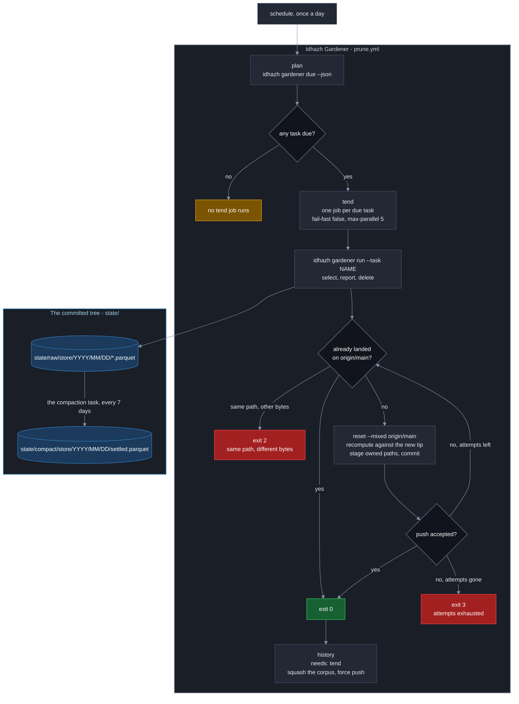

# Plan 50 - Idhazh Gardener: one utility tends every store, and parquet becomes the format

**Last Updated**: 2026-09-24

**Level**: 4 (CLAUDE.md section 6). It crosses `backend/`, `config/`, `frontend/` and the one workflow that rewrites history; it introduces the persistence format the whole project moves to; it adds two persisted contracts and renames one persisted key. The Level-5 pieces inside it - the format decision, the `corpus.meta.json` key rename and the force-push workflow rewrite - were decided by the owner on 2026-09-24 and are listed as ESCALATE triggers so a worker stops there and nowhere else.

**Chain**: intent (one utility tends every store; parquet is the persistence format; tasks run in parallel with no task depending on another) -> contract (`backend/idhazh/store/`, `config/idhazh_gardener.json`, `GardenerRunRow`, the `state/raw/` and `state/compact/` layout, the path-ownership registry) -> code (the rows below).

Execute per docs/how-to/execute-a-plan.md: one owner carries the plan and delegates a row where delegation pays; keep parallel N = 3 rows in flight (three because rows 6-9 share `backend/idhazh/gardener/tasks.py` and `backend/idhazh/retention.py`, and a wider pool buys queueing rather than throughput), refilling a slot as soon as a worker returns and never waiting on a merge; consult a persona only where two answers would lead to different code; AUTO-merge on green gates; honor the ESCALATE triggers in section 0. AUTHOR-AND-STOP until the user authorizes.

## 0. Operating contract

| Field | Value |
| --- | --- |
| Why this plan exists | Four unrelated programs delete things on four unrelated schedules, the biggest has one `--dry-run` flag covering eleven independent decisions, and every store writes its own format by hand. This makes one utility with one verb per task, one config, one persistence door, and one safe way to commit. |
| Hard scope - in | - `backend/idhazh/store/` becomes the one door a payload goes through to reach disk, in parquet or in JSON, with exactly one module importing the parquet engine so it can be swapped in one file.<br>- Parquet becomes the persistence format for what this plan writes. `state/raw/<store>/<shard>` is where a writer files; `state/compact/<store>/<shard>` is what the seven-day compaction leaves.<br>- `backend/idhazh/gardener/` becomes the single home for every retention task: a router copying `telemetry/cli.py`'s shape, a task registry, a due-date schedule, a record writer and a commit loop.<br>- The eleven passes inside `backend/idhazh/stages/prune_state.py` become eleven tasks, each with its own `dry_run`.<br>- The corpus history squash moves out of inline shell in `.github/workflows/prune.yml` into Python.<br>- `backend/utilities/prune_artifacts.py` becomes a scheduled task for the first time.<br>- `config/idhazh_gardener.json` becomes the one place a retention age is set.<br>- `.github/workflows/prune.yml` stops naming a task: it asks the gardener what is due and runs that, one job per task, no ordering between them.<br>- The console learns to read parquet before any writer starts producing it.<br>- A seven-day compaction task folds `state/raw/` into `state/compact/`.<br>- `docs/architecture/publishing/idhazh-gardener.md` becomes the page that owns the gardener's architecture, carrying the workflow diagram.<br>- `backend/idhazh/retention.py` loses its site-size half to a module of its own. |
| Hard scope - out | see the table below |
| ESCALATE triggers | 1. Any row that would make a gardener task read a collection whose size grows with the archive (Guardrail #12) - stop and price it.<br>2. Row 11's rename of the persisted key `corpus/corpus.meta.json:pruned_date` - stop before the commit that removes the alias, not before the commit that adds it.<br>3. Row 12's rewrite of the force-push step - stop if the tip-moved refusal in `backend/utilities/push_rewritten_history.py` would change behaviour in any way, including its exit code.<br>4. Any task whose window would include today (`Window.older_than` refuses `days < 1` for this reason) - stop; a task that can delete what a running job just wrote is a design error, not a tuning error.<br>5. Any row that would make a second module import the parquet engine directly - stop; the single-import rule is what makes the engine swappable and row 2's oracle enforces it.<br>6. A migration of an existing CSV tree to parquet - stop. This plan moves what it creates plus `visual-prune`; the rest is a separate plan. |
| Chosen strategy | One persistence door first, then the router pattern that already works (`idhazh telemetry`), then tasks one risk class at a time, reader before writer throughout. Ruled by Fowler (architecture, contracts, module structure - CLAUDE.md section 14). |
| Execution | autonomous orchestrator per docs/how-to/execute-a-plan.md. Parallel N = 3. |

### Hard scope - out

| What is out | What it costs to leave out | What would bring it in |
| --- | --- | --- |
| Migrating the nine existing CSV day trees to parquet | Nine trees keep two formats alive in the repository until a later plan moves them | Its own plan. The owner's direction on 2026-09-24 is that all producers and consumers eventually switch, `state/` first and the digest after; this plan lays the door and the layout that plan uses |
| Migrating `frontend/public/digest/` to parquet | The published payloads stay JSON, which is what a browser fetches without a reader | Its own plan, after the console reader from row 4 is proven. The owner named it as the direction, not as this plan's scope |
| Switching the visuals deletion on (removing `dry_run` from the visuals task) | The published tree keeps SVGs no day page links to; the site-size headroom stays where it is today | Plan `20260905-13-switch-on-deletion-plan.md`, row titled "The fuse comes out, and one run is watched". Row 9 below moves that row's subject from a CLI flag to a config key; the plan is updated after this one delivers, per the owner, 2026-09-24 |
| Evicting `corpus/corpus.jsonl` rows as a gardener task | The row cap stays where it is - applied by `corpus.roll()` at harvest time, so a corpus that is never harvested is never trimmed | A harvest cadence long enough that the cap stops binding. It is out because it is a count bound, not an age bound, and the harvest that writes the file is already the only reader of the cap |
| An `enabled` boolean per task | A task is switched off by removing its window, which is a coarser gesture than a flag | Nothing. It was considered and rejected: `dry_run` already gives "run and report, change nothing", and a second off-switch means two places to look when a task did not run |
| Moving `idhazh compact` (the closed-day CSV fold) under the gardener | The existing fold keeps its own verb and its place in `digest.yml` | The CSV trees migrating to parquet, at which point row 13's compaction subsumes it. It is out because the existing fold changes no answer and is an implementation detail of reading a day, not a retention decision |
| A rollback for a deletion | A task that deletes the wrong thing is recovered from git history, not from the gardener | Nothing. `prune/one_at_a_time.py` already refuses to carry one, on purpose |

## 1. Status Reckoner

| # | Row title | Depends-on | Parallel-group | Status | Worktree | PR | Subagent |
| --- | --- | --- | --- | --- | --- | --- | --- |
| 1 | The site-size instruments leave the prune module | - | A | PENDING | - | - | - |
| 2 | The payload store: one door, two formats, one engine import | - | A | PENDING | - | - | - |
| 3 | The gardener package, its config and its two read-only verbs | - | A | PENDING | - | - | - |
| 4 | The console learns to read parquet | 2 | B | PENDING | - | - | - |
| 5 | The record layout and the commit loop | 2, 3 | B | PENDING | - | - | - |
| 6 | Eight window-delete tasks move in | 1, 5 | C | PENDING | - | - | - |
| 7 | The telemetry fold moves in | 6 | C | PENDING | - | - | - |
| 8 | The visuals task moves in and `prune-state` retires | 4, 7 | C | PENDING | - | - | - |
| 9 | The retention ages move to the gardener config | 3, 8 | D | PENDING | - | - | - |
| 10 | The corpus history squash becomes Python | 5 | B | PENDING | - | - | - |
| 11 | `prune.yml` stops naming a task | 8, 10 | E | PENDING | - | - | - |
| 12 | The GitHub collections task gets a schedule | 8 | D | PENDING | - | - | - |
| 13 | The seven-day compaction: raw folds to compact | 8 | D | PENDING | - | - | - |
| 14 | The architecture page, and the diagram moves into it | 11, 13 | F | PENDING | - | - | - |

`Parallel-group` is a hint. Rows 6, 7, 8 and 12 each add one import line and one tuple entry to `backend/idhazh/gardener/tasks.py`, and rows 6, 7 and 8 each delete from `backend/idhazh/retention.py`. That is a shared surface, so they are serial whatever the pool width says (execute-a-plan.md, "Rows that share one surface do not parallelise"). Rows 10 and 13 share neither and run beside them.

## 2. The persisted layout this plan establishes

Confirmed against the owner's instruction, 2026-09-24. A writer files under `raw`; the compaction leaves its answer under `compact`; the shard pattern is the same in both.

```
state/raw/gardener/<YYYY>/<MM>/<DD>/<run_id>-<attempt>-<job>-<shard>.parquet
state/raw/visual-prune/<YYYY>/<MM>/<DD>/<run_id>-<attempt>-<job>-<shard>.parquet

state/compact/gardener/<YYYY>/<MM>/<DD>/settled.parquet
state/compact/visual-prune/<YYYY>/<MM>/<DD>/settled.parquet
```

Worked example - run 17482910337, first attempt, the seen-shard task at matrix index 03, on 2026-09-24:

```
state/raw/gardener/2026/09/24/17482910337-1-tend-03.parquet
```

The shard pattern is `ledger.segment_name()` unchanged, with `.parquet` passed as its `suffix` - the parameter that already exists on it for exactly this, because one tree's writer files were already not CSV. Two writers cannot take one path: two tasks in one run differ by matrix index, two runs differ by run id, two attempts differ by attempt.

## 3. What was measured, 2026-09-24

Every number below was taken on this machine and is quoted in the rows that use it. A figure that contradicts one of these is ESCALATE trigger 5.

**The Python parquet writers.** Installed size and install time into a clean virtual environment:

| Library | Version | Install time | Installed size |
| --- | --- | --- | --- |
| duckdb | 1.5.5 | 11.6 s | 47.3 MiB |
| pyarrow | 25.0.1 | 17.3 s | 96.9 MiB |
| polars | 1.44.2 | 32.1 s | 186.7 MiB |
| fastparquet | 2026.5.0 | 123.2 s | 137.0 MiB |

**What a record costs as parquet against CSV**, over the fifteen columns of `GardenerRunRow`:

| Rows in the file | CSV | parquet, snappy | parquet, zstd |
| --- | --- | --- | --- |
| 1 | 224 B | 3,796 B | 4,017 B |
| 13 | 1,070 B | 4,184 B | 4,459 B |
| 91 | 6,920 B | 6,731 B | 5,195 B |
| 1,000 | 80,495 B | 35,592 B | 15,949 B |

Read plainly: a single-row parquet file is about seventeen times the size of the same row as CSV, because a parquet footer is a fixed cost of roughly 3.5 KB whatever it carries. Parquet draws level at about 91 rows and wins from there - at a thousand rows it is 44 percent of the CSV with snappy and 20 percent with zstd. Two decisions follow, and they are in rows 5 and 13: **a job writes one file holding all of its rows, never one file per row**, and **the seven-day compaction is what turns the fixed cost into the win**, not a nicety.

## 4. The shape this plan builds

The workflow the owner approved on 2026-09-24: the plan job asks what is due, one `tend` job runs each due task with no ordering between them, and the history job rewrites the corpus after every other push has landed.

**This diagram is the plan's copy and it is expected to move.** It is drawn to the Mermaid contract in [docs/reference/documentation-structure.md](../docs/reference/documentation-structure.md) so it can be lifted unchanged, and row 14 lifts it into the architecture page. While the plan is being refined the diagram is refined here; once row 14 lands, the page owns it and this section becomes a link (Guardrail #4).



**`digest.yml` is not on the picture, and that is the point.** It runs five times a day and writes today; every gardener window is strictly in the past, so no task can touch what a running job just wrote. Row 3 decision 7 turns that from an arrangement into a check: a task whose window would include today is refused at config load.

---

### Row #1 - The site-size instruments leave the prune module

- **Scope:** `backend/idhazh/retention.py` is 1,880 lines answering two questions; the half that measures the published site and never deletes anything moves to its own module, unchanged.
- **Files touched:**
  - `backend/idhazh/retention.py` (delete the site-size half)
  - `backend/idhazh/site_weight.py` (new: `SiteSize`, `measure`, `count_published_items`, `heaviest_directories`, `over_budget`, `over_cap`, `headroom_mb`, `daily_growth_bytes`, `days_to_alarm`, `days_to_cap`, `budget_alarm`, `cap_breach`, `PAGES_HARD_CAP_MB`)
  - `backend/idhazh/cli.py` (the `site-weight` verb imports the new module)
  - every caller the move breaks, found by `git grep -n 'retention\.\(SiteSize\|measure\|count_published_items\|heaviest_directories\|over_budget\|over_cap\|headroom_mb\|daily_growth_bytes\|days_to_alarm\|days_to_cap\|budget_alarm\|cap_breach\|PAGES_HARD_CAP_MB\)'`
  - `backend/tests/` (the covering test module moves with them; `UNMARKED_MODULES` in `backend/tests/test_marks.py` gains any new file)
  - `docs/architecture/publishing/console-site-size.md`, `docs/architecture/publishing/retention.md`
- **Acceptance gates:**
  - Local: `ruff check .` from the repo root; `mypy backend`; `pytest backend/tests -k "site_weight or site_size or retention"`.
  - CI: full suite.
- **Oracle:** the moved function bodies are byte-identical - every line of the site half appears in the new file unchanged, and `retention.py` loses exactly those lines and no others. It cannot settle whether the split is the right seam; it settles only that nothing changed while it moved.
- **Decisions:**

  | # | Decision | Authority |
  | --- | --- | --- |
  | 1 | This row ships first and alone, because rows 6, 7 and 8 all delete from `retention.py` and a pure move underneath a semantic change is a merge nobody can review | Fowler (CLAUDE.md section 14) |
  | 2 | The module is named for what it produces (`site_weight`), matching the verb `idhazh site-weight` that already prints it | CLAUDE.md section 1a, naming conventions |
  | 3 | No behaviour changes in this row. Not a rename, not a signature, not a default | execute-a-plan.md, structural and behavioural change are not interleaved in one row |

- **Rejected alternatives:**

  | # | Option | Why rejected | What it would cost to take | Authority |
  | --- | --- | --- | --- | --- |
  | 1 | Leave `retention.py` whole and let the gardener import from it | The file keeps answering two questions, and every gardener row then edits the same 1,880-line file as every site-size row | Zero to take now; the cost lands later as a merge conflict per row, on rows that are already serial | CLAUDE.md section 1a, "a source file answers one narrow question" |
  | 2 | Move the site half under `backend/idhazh/gardener/` | The gardener deletes; this half measures and deletes nothing. Putting it there makes the gardener's own first sentence false | Zero to take; costs the gardener package a second question | Fowler |

---

### Row #2 - The payload store: one door, two formats, one engine import

- **Scope:** one call persists any contract payload to any path, in parquet or in JSON, atomically - and exactly one module in the repository imports the parquet engine, so swapping it is one file.
- **Files touched:**
  - `backend/idhazh/store/__init__.py` (which module answers which question)
  - `backend/idhazh/store/persist.py` (the one door: `persist(rows, *, path, fmt)` and `load(path, model)`; temp-file-plus-rename, per CLAUDE.md section 1a)
  - `backend/idhazh/store/parquet.py` (**the only module that imports pyarrow**)
  - `backend/idhazh/store/json_lines.py` (the JSON side of the same door)
  - `backend/idhazh/store/arrow_schema.py` (Pydantic model -> arrow schema, one function)
  - `backend/idhazh/contracts/knobs/store.py` (`StoreConfig`: `format`, `compression`)
  - `config/idhazh.json` (a `store` block: `format` default `parquet`, `compression` default `snappy`)
  - `pyproject.toml` (`pyarrow>=21` joins the runtime dependencies)
  - `.gitattributes` (`*.parquet binary` - no end-of-line conversion, no diff, no merge driver)
  - `schemas/` (regenerated by `python -m idhazh.contracts.export`)
  - `backend/tests/store/test_persist.py`, `test_arrow_schema.py`, `test_single_engine_import.py`
  - `backend/tests/test_marks.py`
  - `docs/architecture/contracts/persistence.md` (new: the door, the two formats, the swap procedure)
- **The door:**

  ```python
  def persist(rows: Sequence[CsvContract], *, path: Path, fmt: StoreFormat) -> None:
      """Write these rows to this path, atomically, in this format."""
  ```

  `persist` knows nothing about parquet. It resolves `fmt` to an engine, writes through it to `path.with_suffix(path.suffix + ".tmp")`, then renames. The engine module exposes two functions - `write(rows, schema, sink, compression)` and `read(source, model)` - and that pair is the whole swap surface.

- **Acceptance gates:**
  - Local: `ruff check .`; `mypy backend`; `pytest backend/tests/store -q`; `python -m idhazh.contracts.export` leaves the tree clean.
  - CI: full suite, including the schema drift gate.
- **Oracle:** two checks, and both are load-bearing. First, round-trip parity: for every contract model this plan persists, `load(persist(rows))` returns rows equal to the input, field for field, for both formats - so parquet and JSON are interchangeable answers to the same question. Second, the single-engine rule: `git grep -l 'pyarrow'` over `backend/` and `frontend/` returns exactly one path, `backend/idhazh/store/parquet.py`. It cannot settle whether the arrow schema is the best mapping of a Pydantic type - only that it round-trips.
- **Decisions:**

  | # | Decision | Authority |
  | --- | --- | --- |
  | 1 | Parquet is the persistence format this project moves to, `state/` first and the published payloads after. This plan writes what it creates in parquet and lays the door the rest use | Owner, 2026-09-24. Not open for re-argument by a later row |
  | 2 | The engine is **pyarrow**. It is the reference implementation, so everything else - duckdb, polars, pandas, and every JavaScript reader - reads what it writes without a caveat; its column-oriented API maps straight onto a contract model's fields; and at 96.9 MiB and 17.3 s it is the cheaper of the two libraries that write native Python objects | Fowler and Carmack. Measured 2026-09-24, section 3 above |
  | 3 | **duckdb is the named swap candidate**, at 47.3 MiB and 11.6 s - half the size and two thirds the install. It is not the pick today because writing goes through SQL and it brings a whole query engine where a writer is wanted. Row 2's single-import rule is what makes it a one-file change if the size ever binds | Carmack. Measured 2026-09-24 |
  | 4 | `compression` is a config knob, defaulting to `snappy` for `state/raw/`. Snappy is what every reader supports without a plugin, and at the file sizes a raw shard holds the codec barely moves the number - 3,796 B against 4,017 B at one row. Row 13 sets zstd for `state/compact/`, where it is 2.2 times smaller at a thousand rows | Guardrail #6, and section 3's measurements |
  | 5 | A parquet footer records the writer version, so two runs on different pyarrow versions do not produce identical bytes for identical rows. That does not break row 5's "same path, same bytes" invariant: a retry inside one job writes the same path with the same version, and a different run writes a different path | Fowler. Stated because it is the non-obvious interaction between the format and the commit loop |
  | 6 | JSON stays a first-class format behind the same door rather than being deleted. A payload a person has to read in a pull request is one that should not be binary | Owner, 2026-09-24, asking for a utility that does both |

- **Rejected alternatives:**

  | # | Option | Why rejected | What it would cost to take | Authority |
  | --- | --- | --- | --- | --- |
  | 1 | polars | 186.7 MiB and 32.1 s - the largest of the four and nearly twice pyarrow, for a dataframe surface this plan does not use | Measured; taking it costs 90 MiB per job over pyarrow | Carmack, measured 2026-09-24 |
  | 2 | fastparquet | 123.2 s to install - seven times pyarrow - and 137.0 MiB, because it compiles against numpy and cramjam | Measured; taking it costs about 106 s per job | Carmack, measured 2026-09-24 |
  | 3 | Let each writer import pyarrow directly | The engine stops being swappable the moment the second module imports it, and the owner asked for a component that swaps easily | Zero to take; costs the swap, which is the whole reason the door exists | Owner, 2026-09-24 |
  | 4 | Generate the arrow schema by inference from the first row | A nullable column whose first row is null infers as null type, and the file then refuses the second row | Zero to take; costs a class of write failures that only appear on sparse data | Fowler |

---

### Row #3 - The gardener package, its config and its two read-only verbs

- **Scope:** the package exists, `config/idhazh_gardener.json` exists and validates, and `idhazh gardener list` and `idhazh gardener due` answer from it. No task has moved and nothing is deleted.
- **Files touched:**
  - `backend/idhazh/gardener/__init__.py`, `cli.py` (the router - a copy of `backend/idhazh/telemetry/cli.py`'s shape: a frozen `Subcommand` dataclass with `name`, `summary` and an `arguments` hook, and a tuple that is the surface)
  - `backend/idhazh/gardener/tasks.py` (the registry: a frozen tuple of `Task`, each carrying a name, the module that runs it, and the paths it owns)
  - `backend/idhazh/gardener/schedule.py` (`prune_due.py` generalised: is this task due today, and what range would it take)
  - `backend/idhazh/contracts/knobs/gardener.py` (`GardenerConfig`, `TaskPolicy`, the `Cadence` discriminated union)
  - `config/idhazh_gardener.json`
  - `backend/idhazh/config.py` (load and validate the new file; refuse a missing one by name)
  - `backend/idhazh/cli.py` (the `gardener` verb joins the `choices` tuple)
  - `schemas/` (regenerated)
  - `backend/tests/gardener/test_schedule.py`, `test_registry.py`, `backend/tests/contracts/test_gardener_config.py`
  - `backend/tests/test_marks.py`
  - `docs/concepts/config.md` (the index gains a row), `docs/concepts/config/idhazh-gardener.md` (new)
- **Acceptance gates:**
  - Local: `ruff check .`; `mypy backend`; `pytest backend/tests/gardener backend/tests/contracts -q`; `python -m idhazh.contracts.export` leaves the tree clean.
  - CI: full suite, including the schema drift gate.
- **Oracle:** the registry and the config are a bijection - every task name in `tasks.py` has exactly one block in `config/idhazh_gardener.json` and every block has exactly one task, asserted both ways. Plus the pairwise-disjointness check: for every pair of tasks, neither's owned paths intersect the other's and neither is a prefix of the other. That is what makes row 11's parallel matrix safe by construction. It cannot settle whether a task's declared paths are the paths its code touches; row 6's oracle does that.
- **Decisions:**

  | # | Decision | Authority |
  | --- | --- | --- |
  | 1 | The config file is `config/idhazh_gardener.json`, not a block inside `config/idhazh.json` | Owner, 2026-09-24 |
  | 2 | The router copies `backend/idhazh/telemetry/cli.py` verbatim in shape, so consolidation introduces no new convention | Fowler |
  | 3 | Each task declares the paths it owns, in config. One declaration yields four things: the disjointness proof, the sparse-checkout cone, the permitted delete set, and the staging list | Fowler |
  | 4 | Cadence is a discriminated union tagged on `unit`, with `days` and `months` as the two members. `count` is not a member: the only count-bounded store here is `corpus/corpus.jsonl`, and `corpus.roll()` at harvest time already owns it | Owner, 2026-09-24, correcting an earlier draft that called the corpus squash count-bounded. The squash boundary is a date from `finetune.prune_keep_days`; the commit count in `prune.yml` is a "worth doing" check, not a policy |
  | 5 | No `enabled` flag. `dry_run` is the per-task off-switch and it is the one that still reports | Fowler |
  | 6 | `schedule.py` keeps `prune_due.py`'s standard-library-only discipline where `prune.yml` calls it before `pip install`, or row 11 moves the call after the install and says so | Carmack (runner budget) |
  | 7 | A task whose window would include today is refused at config load, extending the refusal `Window.older_than` already makes for `days < 1` | Fowler. This is what makes row 11 safe to run while `digest.yml` is live |

- **Rejected alternatives:**

  | # | Option | Why rejected | What it would cost to take | Authority |
  | --- | --- | --- | --- | --- |
  | 1 | Put the gardener knobs in `config/idhazh.json` | Overloads the app config with a subsystem nothing else reads | Zero to take; costs every reader of the app config a block that is not theirs | Owner, 2026-09-24 |
  | 2 | Resolve the task registry dynamically from config via `importlib` | Turns a config string into an import path, and makes the set of tasks something no reader can see in code | Zero to take; costs the closed-set property `SegmentLedger` and `ServerJob` both rely on | Fowler; precedent is `ledger.SegmentLedger` - "A ledger joins this set in the row that moves its writer, never before it" |
  | 3 | One flat `idhazh gardener-<task>` verb per task | Thirteen top-level verbs, and the `choices` tuple stops being readable | Zero to take; costs the CLI its shape | Fowler |

---

### Row #4 - The console learns to read parquet

- **Scope:** the console's build-time reader can read a parquet day tree, before any writer produces one. Reader before writer.
- **Files touched:**
  - `frontend/package.json` (a parquet reader joins the dependencies)
  - `frontend/src/lib/server/parquet.ts` (new: the only module that imports the reader)
  - `frontend/src/lib/server/payload.ts` (the state read dispatches on file suffix)
  - `frontend/tests/` (a fixture parquet day tree, read back and asserted field for field)
  - `tests/fixtures/parquet/` (the fixture, written by row 2's door so the two sides are proven against one file)
  - `docs/architecture/publishing/console-payloads.md`
- **Acceptance gates:**
  - Local: `npm --prefix frontend run check`; `npm --prefix frontend run test:changed -- --list` then the selected checks; the browser smoke on one console page (CLAUDE.md section 12), including the missing-data case - a page that white-screens when its parquet file is absent is a failure.
  - CI: full suite.
- **Oracle:** cross-language parity on one file - the fixture written by `backend/idhazh/store/parquet.py` is read by `frontend/src/lib/server/parquet.ts` and every field compares equal, including the nullable ones and the integers. That is the check that catches a type mapping which round-trips in Python and decodes as something else in node. It cannot settle performance over a large tree; row 13's compaction is what bounds the file count.
- **Decisions:**

  | # | Decision | Authority |
  | --- | --- | --- |
  | 1 | This row ships before any writer switches format. A console reading a format nothing writes is harmless; a console meeting a format it cannot read is a broken page | author-a-plan.md, reader before writer |
  | 2 | The reader sits behind one module on the console side too, mirroring row 2's rule, so the JavaScript engine is swappable on the same terms as the Python one | Fowler |
  | 3 | The first candidate to evaluate is `hyparquet` - pure JavaScript, no dependencies, reads in node and in a browser. The check before adopting it: `npm view hyparquet version dependencies`, its published size, and whether it decodes the snappy codec row 2 defaults to. If it does not, `parquet-wasm` is the fallback and its cost is named in the row's own notes | Jony rules the surface, Carmack rules the bytes. This is a named measurement rather than an assertion, because the registry was unreachable from this machine on 2026-09-24 (Guardrail #10) |
  | 4 | The dispatch is on file suffix, not on a config flag, so a tree holding both formats during a migration reads correctly without a knob to set | Fowler |

- **Rejected alternatives:**

  | # | Option | Why rejected | What it would cost to take | Authority |
  | --- | --- | --- | --- | --- |
  | 1 | `duckdb-wasm` | Tens of megabytes of WebAssembly to read a fifteen-column file | Measure `npm view @duckdb/duckdb-wasm dist.unpackedSize` before quoting a number; the order of magnitude is what rules it out, not the digit | Carmack |
  | 2 | Have the backend emit a JSON sidecar for the console to read | Two files saying one thing, and the second one is the one that goes stale | Zero to take; costs a divergence nobody sees until a page is wrong | Guardrail #4 |
  | 3 | Defer the console until a writer needs it | The writer row then carries a broken page until this lands | Zero to take; costs a red main | author-a-plan.md |

---

### Row #5 - The record layout and the commit loop

- **Scope:** every gardener run writes one parquet record under `state/raw/gardener/`, and lands it on `main` with a loop that never merges.
- **Files touched:**
  - `backend/idhazh/contracts/base.py` (`ServerJob` gains `TEND = "tend"` and `HISTORY = "history"`, the two job ids row 11 will spell in `prune.yml`)
  - `backend/idhazh/store/paths.py` (new: `raw_path(store, date, identity)` and `compact_path(store, date)`, built on `ledger.segment_name(..., suffix=".parquet")`)
  - `backend/idhazh/contracts/gardener_run.py` (new: `GardenerRunRow`)
  - `backend/idhazh/gardener/report.py` (one record shape for every task)
  - `backend/idhazh/gardener/publish.py` (new: `publish()` and the three `already_landed` kinds)
  - `schemas/` (regenerated)
  - `backend/tests/gardener/test_publish.py`, `backend/tests/store/test_paths.py`, `backend/tests/contracts/test_gardener_run.py`
  - `tests/fixtures/gardener/` (a fixture raw day directory)
  - `docs/architecture/publishing/committing.md` (the third writer kind joins the page)
- **The columns.** `GardenerRunRow`: `date`, `task`, `run_id`, `attempt`, `cadence_unit`, `cadence_value`, `boundary`, `dry_run`, `candidates_seen`, `selected`, `deleted`, `bytes_freed`, `stopped_because`, `resume_from`, `duration_ms`. `task` is a column rather than a path level below `gardener/` - see decision 3.
- **`already_landed`, specified:**

  | Writer kind | Which tasks | What "already landed" means | What a re-apply does |
  | --- | --- | --- | --- |
  | add-only | the record write itself | every owned path exists on `origin/main` with a blob identical to the local one. Same path with different bytes is a data-integrity error: exit 2, no retry, no push | re-stage the same bytes |
  | delete-only | the eight window tasks, the visuals task, the collections task | every path the task selected for removal is already absent from `origin/main` | recompute the removal set against the new tip. It does not replay the old set - a path that arrived after the fetch is not this run's to judge |
  | fold | the telemetry fold, and row 13's compaction | add-only for the written file, then delete-only for the inputs it replaced, in that order, in one commit | re-run the fold against the new tip |

  ```python
  def publish(task: Task, message: str, *, attempts: int) -> int:
      """Land this task's own paths on main, retrying only the push."""
      for _ in range(attempts):
          git("fetch", "origin", "main", "--depth=1")
          verdict = task.already_landed()          # add-only / delete-only / fold
          if verdict is Verdict.LANDED:
              return EXIT_OK
          if verdict is Verdict.CONFLICTING_BYTES:
              return EXIT_INTEGRITY
          git("reset", "--mixed", "origin/main")
          task.apply()                             # recomputed against the new tip
          stage(task.owned_paths)
          git("commit", "-m", message)
          if git_ok("push", "origin", "HEAD:refs/heads/main"):
              return EXIT_OK
      return EXIT_PUSH_KEPT_LOSING
  ```

- **Acceptance gates:**
  - Local: `ruff check .`; `mypy backend`; `pytest backend/tests/gardener backend/tests/store backend/tests/contracts -q`; `python -m idhazh.contracts.export` leaves the tree clean.
  - CI: full suite.
- **Oracle:** a three-way property test over `publish()` against a local bare repository standing in for `origin` - for each writer kind, running it twice leaves the same tree as running it once, and running it against a tip that moved leaves both the mover's change and this task's change. It cannot settle what a real GitHub push rejection does; row 11's first scheduled run is the named observation for that.
- **Decisions:**

  | # | Decision | Authority |
  | --- | --- | --- |
  | 1 | The layout is `state/raw/<store>/<YYYY>/<MM>/<DD>/<identity>.parquet`, with the identity grammar unchanged from `ledger.segment_name()` - which already takes a `suffix` argument for a tree whose files are not CSV | Owner, 2026-09-24, specifying `state/raw/gardener/<shard pattern>` |
  | 2 | **One file per job, holding every row that job produced - never one file per row.** A one-row parquet file is 3,796 B against 224 B as CSV, because the footer is a fixed 3.5 KB; thirteen rows in one file is 4,184 B, which is the same footer paid once | Measured 2026-09-24, section 3. This is the single most consequential line in the row |
  | 3 | `task` is a column, not a path level. `state/raw/gardener/<task>/<YYYY>/...` would give thirteen date trees, so "what ran today" becomes thirteen walks instead of one, and with one file per job it would also mean thirteen footers where one would do | Fowler, on decision 2's measurement. Collision safety does not need it: two tasks in one run differ by matrix index, two runs by run id |
  | 4 | `ServerJob` gains `TEND` and `HISTORY` here, before row 11 spells them in the workflow. Precedent: `DECIDE` was added for `validate.yml`'s gate job on exactly this ground - it names a writer of a ledger and of nothing else | `backend/idhazh/contracts/base.py`, `ServerJob` docstring |
  | 5 | `git reset --mixed` is the reconcile, never `git rebase` and never `git merge`. A rebase of a deletion onto a tip that appended to the same tree resurrects the deleted rows where a union merge driver is in play, and git calls neither side a conflict | Owner, 2026-09-24. `git reset --hard` stays banned (CLAUDE.md section 8); `--mixed` is not on that list and keeps the working tree |
  | 6 | Four exit codes: 0 landed or already landed, 1 the task failed, 2 data-integrity error, 3 the push kept losing. Only 2 is un-retryable | Fowler |

- **Rejected alternatives:**

  | # | Option | Why rejected | What it would cost to take | Authority |
  | --- | --- | --- | --- | --- |
  | 1 | One parquet file per record row | 3,796 B to carry 224 B of data, committed to git history for ever | Measured; taking it costs about seventeen times the bytes, permanently | Carmack, measured 2026-09-24 |
  | 2 | `git rebase` onto the moved tip instead of reset-and-reapply | A deletion rebased onto an append to the same union-merged file keeps both sides and the deleted rows come back, at exit zero | Zero to take; costs silent data resurrection | Owner, 2026-09-24 |
  | 3 | A repository-wide concurrency group so only one writer runs | Serialises thirteen tasks that have no reason to wait for each other, and a queued job still meets a moved tip when it starts | Zero to take; costs the parallelism this plan exists for | Owner, 2026-09-24 |
  | 4 | `git push --force-with-lease` on rejection | A lease names a commit; the point of a rejection is that the commit it would name is stale. A force push here would delete whatever landed in between | Zero to take; costs another run's commit | CLAUDE.md section 8 |

---

### Row #6 - Eight window-delete tasks move in

- **Scope:** the eight passes in `stages/prune_state.py` that delete whole files behind a window become eight tasks, each with its own `dry_run` and its own owned paths.
- **The eight:** `_prune_seen_shards`, `_prune_counterfactual_shards`, `_prune_trace_shards`, `_prune_feed_health_shards`, `_prune_host_fingerprint_shards`, `_prune_score_shards`, `_prune_day_validation_shards`, `_prune_trial_shards`.
- **Files touched:**
  - `backend/idhazh/gardener/tasks/seen.py`, `counterfactual_scores.py`, `traces.py`, `feed_health.py`, `host_fingerprint.py`, `scores.py`, `day_validations.py`, `trials.py` (new)
  - `backend/idhazh/gardener/tasks.py` (eight import lines, eight tuple entries)
  - `backend/idhazh/retention.py` (the eight `prune_*` functions leave)
  - `backend/idhazh/stages/prune_state.py` (the eight passes leave; the module still runs the remaining three)
  - `config/idhazh_gardener.json` (eight task blocks)
  - `backend/tests/gardener/tasks/` (one test module per task, driven from `tests/fixtures/` and `backend/var/canary/`, never from the committed archive)
  - `backend/tests/test_marks.py`
  - `docs/architecture/publishing/retention.md`, `docs/concepts/adaptive-pruning.md`
- **Acceptance gates:**
  - Local: `ruff check .`; `mypy backend`; `pytest backend/tests/gardener -q`, plus the existing prune tests the move touches.
  - CI: full suite.
- **Oracle:** for each of the eight, the old `stage_prune_state` pass and the new task over the same fixture tree produce the identical removal set, asserted per task. It cannot settle the `trials` task, whose input is "every directory under `state/` that is not a known ledger" - that one takes an extra fixture holding a directory the known set does not name.
- **Decisions:**

  | # | Decision | Authority |
  | --- | --- | --- |
  | 1 | Each task routes through `prune/one_at_a_time.py`, which two of the four existing surfaces already use and the eleven biggest do not. That is the consolidation, not the router | Fowler |
  | 2 | Every task keeps its current window value here. The windows move file in row 9; they do not change value in either row | execute-a-plan.md, one risk class per row |
  | 3 | `stages/prune_state.py` stays alive through rows 6 and 7 and dies in row 8, so `digest.yml` keeps working the whole way | Fowler |
  | 4 | The `trials` task declares its owned paths as "under `state/`, excluding the named ledgers", and row 3's disjointness check is taught that shape rather than the task being given a hardcoded list | Guardrail #6 |
  | 5 | These eight delete CSV day trees and do not convert them. A tree migrates format in its own plan (ESCALATE trigger 6) | Owner scope, 2026-09-24 |

- **Rejected alternatives:**

  | # | Option | Why rejected | What it would cost to take | Authority |
  | --- | --- | --- | --- | --- |
  | 1 | Move all eleven passes in one row | Three writer kinds and three risk profiles in one change; the visuals pass carries a deletion fuse another plan is watching | Zero to take; costs the reviewer any chance of reading it | author-a-plan.md, "Never bundle mixed risk profiles" |
  | 2 | Keep one shared `--dry-run` across the eight | It is the defect this plan exists to remove: switching one on switches all eight | Zero to take; costs the ability to enable deletion anywhere without enabling it everywhere | Owner, 2026-09-24 |
  | 3 | Convert each tree to parquet while moving its prune | Two risk profiles in one row, on trees no row here reads | Its own plan; the cost is a migration per tree plus a console reader per shape | ESCALATE trigger 6 |

---

### Row #7 - The telemetry fold moves in

- **Scope:** `retention.prune_telemetry` - the item-health fold, its browser copy and its aggregate - becomes one task, and `idhazh telemetry prune` keeps its own verb by forwarding to it.
- **Files touched:**
  - `backend/idhazh/gardener/tasks/telemetry_fold.py` (new)
  - `backend/idhazh/gardener/tasks.py` (one import line, one tuple entry)
  - `backend/idhazh/telemetry/prune.py` (the body moves out; what stays forwards)
  - `backend/idhazh/retention.py` (`prune_telemetry` and its helpers leave)
  - `backend/idhazh/stages/prune_state.py` (the pass leaves)
  - `config/idhazh_gardener.json` (one task block)
  - `backend/tests/gardener/tasks/test_telemetry_fold.py`, `backend/tests/telemetry/` (the forward is asserted)
  - `backend/tests/test_marks.py`
  - `docs/architecture/publishing/telemetry-series.md`, `docs/architecture/contracts/schemas.md`
- **Acceptance gates:**
  - Local: `ruff check .`; `mypy backend`; `pytest backend/tests/gardener backend/tests/telemetry -q`.
  - CI: full suite.
- **Oracle:** over a fixture month, the fold writes the same `TelemetryAggregateRow` content whether reached through `idhazh telemetry prune` or `idhazh gardener run --task telemetry-fold`, and the same inputs are gone afterwards. It cannot settle the double-fold case the schemas page names - a fold running twice over a shard a lost race restored - which row 5's idempotence property covers instead.
- **Decisions:**

  | # | Decision | Authority |
  | --- | --- | --- |
  | 1 | `idhazh telemetry prune` survives as a verb and forwards. An operator's muscle memory is not a reason to move a body, and the gardener needs to reach it too | Owner, 2026-09-24 |
  | 2 | This is the fold writer kind: it writes a summary and deletes its inputs, so `already_landed` is add-only then delete-only, in that order, in one commit | Fowler |
  | 3 | The fold's own answer does not change, and its output stays in its current format. `TelemetryAggregateRow` is rewritten rather than appended to, and that stays true | `docs/architecture/contracts/schemas.md`; ESCALATE trigger 6 |

- **Rejected alternatives:**

  | # | Option | Why rejected | What it would cost to take | Authority |
  | --- | --- | --- | --- | --- |
  | 1 | Delete `idhazh telemetry prune` and make the gardener the only door | Removes a verb an operator uses, for no gain the gardener does not already have | Zero to take; costs an operator a working command | Owner, 2026-09-24 |
  | 2 | Split the fold into write-then-delete as two tasks | The delete is safe only because the write happened, so two tasks need an ordering - and this plan exists to remove orderings | Zero to take; costs the parallel property | Fowler |

---

### Row #8 - The visuals task moves in and `prune-state` retires

- **Scope:** `_clean_the_visuals` becomes the last task and writes its record as parquet under `state/raw/visual-prune/`; `stages/prune_state.py` is deleted; `digest.yml` stops calling it; `prune-state` survives one release as an alias.
- **Files touched:**
  - `backend/idhazh/gardener/tasks/visual_prune.py` (new)
  - `backend/idhazh/gardener/tasks.py` (one import line, one tuple entry)
  - `backend/idhazh/contracts/visual_prune.py` (`VisualPruneRow` gains its `version` stamp and a `changelog` line for the store move, per CLAUDE.md section 11)
  - `backend/idhazh/retention.py` (the visual prune and `_report_removals` leave)
  - `backend/idhazh/stages/prune_state.py` (deleted)
  - `backend/idhazh/cli.py` (`prune-state` forwards to `gardener run` and warns; the removal condition sits on the declaring line)
  - `.github/workflows/digest.yml` (the assemble job's prune step is removed; the commit step is left as it is)
  - `config/idhazh_gardener.json` (one task block, `dry_run: true`)
  - `frontend/src/lib/server/payload.ts` (the visual-prune read follows the tree to `state/raw/visual-prune/`, through row 4's parquet reader)
  - `backend/tests/gardener/tasks/test_visual_prune.py`, `backend/tests/workflows/`, `frontend/tests/`
  - `backend/tests/test_marks.py`
  - `docs/architecture/publishing/one-visual-one-file-and-the-race-between-two-runs.md`, `docs/concepts/adaptive-pruning.md`, `docs/architecture/publishing/retention.md`
- **The read-side migration.** `state/visual-prunes/` holds committed CSV days and `state/raw/visual-prune/` will hold parquet ones. The reader reads both for one release: the old tree until its last committed day ages out, the new tree from this row on. The removal condition for the old branch sits on the line that declares it - it goes when no committed day remains under `state/visual-prunes/`.
- **Acceptance gates:**
  - Local: `ruff check .`; `mypy backend`; `pytest backend/tests/gardener backend/tests/workflows -q`; `npm --prefix frontend run test:changed -- --list` then the selected checks; the browser smoke on the console page that shows visual prunes, including the case where the new tree is empty; `git grep -n 'prune-state\|prune_state'` returns only the alias and its removal condition.
  - CI: full suite.
- **Oracle:** the visuals task writes a record on every run, dry or not, exactly as the pass does today - asserted over a fixture day where nothing is eligible for deletion, because a run that deletes nothing is the case that used to write nothing. Paired with the console reading that record back through row 4's reader and rendering the same values the CSV path rendered. It cannot settle whether the deletion itself is correct; that is the observation plan 13's row books.
- **Decisions:**

  | # | Decision | Authority |
  | --- | --- | --- |
  | 1 | `dry_run` stays `true`. This row moves the task; it does not switch deletion on | Plan `20260905-13-switch-on-deletion-plan.md`, row titled "The fuse comes out, and one run is watched". That plan is updated after this one delivers, per the owner, 2026-09-24, and its subject changes from a CLI flag to `config/idhazh_gardener.json`'s `visual-prune.dry_run` |
  | 2 | The alias `prune-state` carries its removal condition on its declaring line and goes one release later | Guardrail #6 |
  | 3 | `digest.yml`'s assemble job loses the prune step entirely rather than keeping a no-op. The step existed to run after the day was committed; once row 11 lands, the gardener runs in its own workflow and the ordering constraint is gone | Owner, 2026-09-24 |
  | 4 | The visuals task owns paths under `frontend/public/digest/`, which no other task owns. That is what lets it stage its own deletions - the thing `digest.yml`'s commit step never staged, and the reason the deletion could not be switched on there | Fowler |

- **Rejected alternatives:**

  | # | Option | Why rejected | What it would cost to take | Authority |
  | --- | --- | --- | --- | --- |
  | 1 | Keep `prune-state` in the assemble job and move only the other ten | Every task then commits from two workflows, and the visuals deletion stays impossible because the assemble commit step does not stage `frontend/public/digest` | Zero to take; costs the deletion plan 13 is waiting on | Owner, 2026-09-24 |
  | 2 | Delete the `prune-state` verb immediately | A dispatch or a script naming it breaks with no warning | Zero to take; costs an operator a silent failure | Guardrail #6 |
  | 3 | Copy the committed `state/visual-prunes/` days into the new tree | A rewrite of committed history's worth of data to change a format, for days that age out anyway | Zero to take; costs a large commit and a migration to verify | Fowler; the dual read costs one branch with a removal condition instead |

---

### Row #9 - The retention ages move to the gardener config

- **Scope:** the retention windows living in `config/idhazh.json` move into `config/idhazh_gardener.json`, and the console adapts to read them from there.
- **Files touched:**
  - `config/idhazh.json` (the windows leave: `observability.feed_health_keep_months`, `host_fingerprint_keep_months`, `item_health_full_grain_months`, `scores_full_grain_months`, `visuals_full_grain_months`, `public_telemetry_keep_months`, `public_run_timeline_keep_months`, `trace_window_days`, the four `*_aggregate_keep_months`, `score_archive_keep_months`; `retention.day_validation_keep_months`, `image_months`, `trial_state_days`, `max_deletes_per_run`, `dry_run`; `collect.seen_window_days`; `lens_weights.window_days`)
  - `config/idhazh_gardener.json` (they arrive, one per task)
  - `backend/idhazh/contracts/knobs/observability.py` (`refuse_windows_shorter_than` becomes a cross-file check at `config.load()`, because the two values it compares now live in two files), `collect.py`, `retention.py`, `lens_weights.py`
  - `backend/idhazh/config.py` (the cross-file refusal)
  - `frontend/src/lib/server/config.ts` and every console surface that prints a retention window
  - `frontend/src/lib/**` (the field-set and vocabulary tests that bind the frontend copy)
  - `schemas/` (regenerated)
  - `backend/tests/contracts/`, `frontend/tests/`
  - `docs/concepts/config/retention-ages.md`, `run-limits.md`, `appearance.md`, `docs/architecture/publishing/console-payloads.md`
- **Acceptance gates:**
  - Local: `ruff check .`; `mypy backend`; `pytest backend/tests/contracts -q`; `npm --prefix frontend run test:changed -- --list` then the selected checks; the browser smoke on any console page that prints a window.
  - CI: full suite, including the frontend field-set and vocabulary tests.
- **Oracle:** every window value is byte-identical before and after the move, asserted by a test comparing the pre-move values (frozen in a fixture) against the post-move config, key by key. It cannot settle whether a console page reads the right one; the browser smoke does that.
- **Decisions:**

  | # | Decision | Authority |
  | --- | --- | --- |
  | 1 | The windows move rather than being duplicated. A value in two files is two answers | Owner, 2026-09-24 |
  | 2 | The console adapting is part of this row, not an activity tracked elsewhere. A console printing a window from a key that no longer exists is a broken page | Owner, 2026-09-24. Jony rules the surface; the move is what forces it |
  | 3 | `appearance.json`'s cleanup-age floor and `observability`'s window refusal become cross-file checks at `config.load()`, refusing by name | Guardrail #3 |
  | 4 | No window changes value in this row | execute-a-plan.md |

- **Rejected alternatives:**

  | # | Option | Why rejected | What it would cost to take | Authority |
  | --- | --- | --- | --- | --- |
  | 1 | Leave the windows in `config/idhazh.json` and have the gardener read them there | The gardener's config then answers half the question, and an operator has two files to check before changing a retention age | Zero to take; costs the single-source property | Owner, 2026-09-24 |
  | 2 | Copy the windows and leave the originals as deprecated | Two files disagree the first time somebody edits one | Zero to take; costs a silent divergence | Guardrail #4 |

---

### Row #10 - The corpus history squash becomes Python

- **Scope:** the forty lines of inline shell in `prune.yml` that do the squash move into a module, `prune_due.py` folds into `schedule.py`, `prune-stamp` becomes the task's own record write, and the persisted key `pruned_date` becomes `last_run`.
- **Files touched:**
  - `backend/idhazh/gardener/tasks/corpus_history.py` (new: resolve the boundary commit, the orphan-root squash, the rebase, the record, the push)
  - `backend/idhazh/gardener/tasks.py` (one import line, one tuple entry)
  - `backend/idhazh/gardener/schedule.py` (absorbs `prune_due.py`)
  - `backend/utilities/prune_due.py` (deleted)
  - `backend/utilities/push_rewritten_history.py` (the tip-moved refusal moves into the task, behaviour and exit code unchanged)
  - `backend/idhazh/corpus.py` (`stamp_prune()` becomes `record_run()`)
  - `backend/idhazh/contracts/corpus.py` (`CorpusMeta.pruned_date` becomes `last_run`, with a `model_validator(mode="before")` alias for one release, then `refuse_a_removed_knob` - precedent `models.route` to `models.visual_planner`, PR #1045). Section 11 applies: `version` stamped, one `changelog` line appended, read-side migration in the same commit
  - `backend/idhazh/cli.py` (`prune-stamp` retires)
  - `corpus/corpus.meta.json`
  - `config/idhazh_gardener.json` (one task block, cadence `days`)
  - `schemas/` (regenerated)
  - `backend/tests/gardener/tasks/test_corpus_history.py`, `backend/tests/contracts/test_corpus_meta.py`
  - `docs/how-to/fine-tune-a-model.md`, `docs/concepts/adaptive-pruning.md`, and the pages `git grep -n 'prune-stamp\|stamp_prune\|pruned_date'` names
- **Acceptance gates:**
  - Local: `ruff check .`; `mypy backend`; `pytest backend/tests/gardener/tasks/test_corpus_history.py backend/tests/contracts -q` - the squash runs against a temporary repository the test builds, never against this one; `python -m idhazh.contracts.export` leaves the tree clean.
  - CI: full suite.
  - **Not a gate:** dispatching `prune.yml`. What it would prove is a force push onto `main`, which cannot be repeated, cannot run unattended and ends with somebody reverting history. **Named observation instead:** the first scheduled run after row 11 merges - read the job log for the boundary commit it resolved and the count it collapsed, and confirm `corpus/corpus.meta.json:last_run` advanced. If the push was refused, the log says the tip moved and no stamp was written, and it is due again at the next daily wake.
- **Oracle:** against a temporary repository with a known commit graph, the task collapses exactly the commits at or before the boundary date and leaves every later commit reachable with its tree intact, compared by `git rev-parse HEAD^{tree}` before and after. It cannot settle what a real force push does under a concurrent push; the tip-moved refusal handles that and is carried over unchanged.
- **Decisions:**

  | # | Decision | Authority |
  | --- | --- | --- |
  | 1 | The boundary is a date, from `finetune.prune_keep_days`. The commit count `prune.yml` computes is a "worth doing" check that skips when one commit or fewer is behind the cut, not a retention policy | Owner, 2026-09-24, correcting an earlier draft |
  | 2 | `corpus/corpus.jsonl`'s row cap (`finetune.corpus_rows`) does not move here. It is a count bound applied by `corpus.roll()` at harvest time, and the harvest is its only reader | Owner, 2026-09-24 |
  | 3 | The force push keeps `--force` and not `--force-with-lease`. The rebase rewrote every commit a lease would name | `backend/utilities/push_rewritten_history.py`, carried over |
  | 4 | The tip-moved refusal is carried over verbatim, including its exit code. Changing it is ESCALATE trigger 3 | CLAUDE.md section 8, the standing exception and its written limit |
  | 5 | This task does not use row 5's commit loop. It rewrites every commit and force-pushes; reset-and-reapply is for a task that adds a commit | Fowler |
  | 6 | `corpus/corpus.jsonl` stays JSON lines. It is the file a trainer loads, and every one of TRL, Unsloth, Axolotl and LLaMA-Factory reads that shape | `backend/tests/test_corpus_contract.py`; ESCALATE trigger 6 |

- **Rejected alternatives:**

  | # | Option | Why rejected | What it would cost to take | Authority |
  | --- | --- | --- | --- | --- |
  | 1 | Leave the squash in inline shell | It is the largest piece of untested logic in the repository and it force-pushes `main` | Zero to take; costs the only force push any test coverage at all | Fowler |
  | 2 | Keep `pruned_date` and add `last_run` beside it | Two keys naming one fact | A one-release alias is what a rename costs; keeping both costs a permanent second spelling | Guardrail #4 |
  | 3 | Put the squash in the parallel matrix with the other tasks | It rewrites every commit and needs a full clone with history; every sibling job's push would be invalidated mid-flight | Zero to take; costs every other task its commit | Owner, 2026-09-24 |

---

### Row #11 - `prune.yml` stops naming a task

- **Scope:** the workflow asks the gardener what is due and runs that, one job per task, with no ordering between tasks.
- **Files touched:**
  - `.github/workflows/prune.yml` (rewritten: three jobs)
  - `backend/tests/workflows/` (the harness assertions - the job ids `plan`, `tend` and `history` are `ServerJob` members; each matrix job's sparse-checkout cone matches the owned paths its task declares)
  - `docs/architecture/publishing/retention.md`, `docs/concepts/adaptive-pruning.md`
- **The shape:**
  - job `plan` - depth-1 sparse checkout of `config/` and `backend/`, runs `idhazh gardener due --json`, emits the matrix.
  - job `tend` - `needs: plan`, `strategy: {matrix: {task: ${{ fromJSON(needs.plan.outputs.tasks) }}}, fail-fast: false, max-parallel: 5}`. Each runner sparse-checks out only the paths its task declares, runs `idhazh gardener run --task ${{ matrix.task }}`, then publishes with row 5's loop.
  - job `history` - `needs: tend`, full clone with history, runs the corpus squash and force-pushes with the tip-moved refusal.
- **Acceptance gates:**
  - Local: `pytest backend/tests/workflows -q`; the workflow file parses as YAML.
  - CI: full suite.
  - **Not a gate:** dispatching the workflow.
  - **Named observation, first scheduled run after merge:** read each `tend` job's log for the task it ran and the record path it wrote; confirm one file per task that ran under `state/raw/gardener/<YYYY>/<MM>/<DD>/`; confirm no job reports exit 2 or exit 3. If any reports 2, stop and read the path it named - two writers took one path and the registry's disjointness claim is wrong.
- **Oracle:** a test over the committed workflow file and the committed registry - the set of tasks the matrix can produce is exactly the set in `tasks.py`, and every job id the workflow spells is a `ServerJob` member. It cannot settle whether five runners pushing at once land; the named observation does that.
- **Decisions:**

  | # | Decision | Authority |
  | --- | --- | --- |
  | 1 | `max-parallel: 5`. Jobs beyond that queue, and a queue is fine | Owner, 2026-09-24. Settled; not to be re-argued by a later row |
  | 2 | `needs: tend` on the history job is the only ordering in the workflow, and it is not one task depending on another: it is everything else being pushed before history is rewritten | Owner, 2026-09-24 |
  | 3 | `fail-fast: false`. One task failing is not a reason to cancel twelve unrelated ones | Owner, 2026-09-24 |
  | 4 | The workflow names no task. The matrix comes from the registry through `gardener due`, so adding a task is a config block and a module, never a workflow edit | Owner, 2026-09-24 |
  | 5 | The schedule stays at `37 23 * * *` in this row. It may widen later because no task's window includes today (row 3, decision 7) - the property that made "after the commit, never before" necessary is now checked rather than arranged - but moving it is its own decision with its own reason | Fowler |
  | 6 | `concurrency: {group: corpus-prune, cancel-in-progress: false}` stays on the `history` job and does not cover `tend` | Fowler |

- **Rejected alternatives:**

  | # | Option | Why rejected | What it would cost to take | Authority |
  | --- | --- | --- | --- | --- |
  | 1 | One job running every due task in sequence | Thirteen tasks in one job, one failure taking the rest, and one long-held checkout racing every push for its whole duration | Zero to take; costs the parallelism and the isolation | Owner, 2026-09-24 |
  | 2 | A repository-wide `concurrency` group covering `tend` | Serialises the matrix, which is what the matrix is for | Zero to take; costs the parallelism | Owner, 2026-09-24 |

---

### Row #12 - The GitHub collections task gets a schedule

- **Scope:** `backend/utilities/prune_artifacts.py` - which prunes workflow artifacts and workflow runs, and which no workflow calls today - becomes two gardener tasks and runs on a schedule for the first time.
- **Files touched:**
  - `backend/idhazh/gardener/tasks/github_collections.py` (new: wraps the existing utility)
  - `backend/idhazh/gardener/tasks.py` (one import line, one tuple entry)
  - `config/idhazh_gardener.json` (two task blocks - `workflow-artifacts` and `workflow-runs` - both `dry_run: true`)
  - `config/idhazh.json` (the `prune.collections` block leaves, joining row 9's move)
  - `.github/workflows/prune.yml` (the `tend` job gains `actions: write`)
  - `backend/tests/gardener/tasks/test_github_collections.py` (driven from a recorded response, never the network - Guardrail #7)
  - `backend/tests/test_marks.py`
  - `docs/architecture/publishing/retention.md`
- **Acceptance gates:**
  - Local: `ruff check .`; `mypy backend`; `pytest backend/tests/gardener/tasks/test_github_collections.py -q`.
  - CI: full suite.
  - **Named observation, first scheduled run after merge:** the two records under `state/raw/gardener/` report `dry_run` true, a `candidates_seen` above zero and a `deleted` of zero. A `deleted` above zero on a dry run is a defect in the wrapper, not in the utility.
- **Oracle:** against a recorded GitHub API response, the task selects exactly the artifacts older than `retain_days` and never more than `max_deletes_per_run`, and with `dry_run` true it issues no DELETE. It cannot settle what the real API returns; the named observation is the first reading of that.
- **Decisions:**

  | # | Decision | Authority |
  | --- | --- | --- |
  | 1 | This is the only row that adds behaviour rather than moving it, so it ships last among the task rows, with `dry_run: true` | Fowler |
  | 2 | Two tasks, not one. `workflow-artifacts` and `workflow-runs` have different retention values today (30 and 90 days) and no reason to run together | Owner, 2026-09-24, one verb per task |
  | 3 | It writes no file under `state/` except its own record, so its sparse-checkout cone is `state/raw/gardener/` alone | Fowler |
  | 4 | `EXIT_A_DELETE_FAILED = 1` is carried over; a failed delete is a task failure, not an integrity error | Fowler |

- **Rejected alternatives:**

  | # | Option | Why rejected | What it would cost to take | Authority |
  | --- | --- | --- | --- | --- |
  | 1 | Ship it with `dry_run: false` | A first scheduled run of a program nothing has ever scheduled, deleting from a collection outside this repository | Zero to take; costs an unrecoverable deletion if the selection is wrong | Guardrail #10 - low downside is the test and this one fails it |
  | 2 | Leave it operator-only | Artifacts and runs accumulate until somebody remembers; the utility exists and nothing runs it | Zero to take; costs the storage it was written to bound | Owner, 2026-09-24 |

---

### Row #13 - The seven-day compaction: raw folds to compact

- **Scope:** a gardener task that every seven days reads a closed day under `state/raw/<store>/`, writes one settled parquet file under `state/compact/<store>/`, and deletes the raw files it read.
- **Files touched:**
  - `backend/idhazh/gardener/tasks/compaction.py` (new)
  - `backend/idhazh/gardener/tasks.py` (one import line, one tuple entry)
  - `backend/idhazh/store/paths.py` (`compact_path` gains its reader)
  - `backend/idhazh/store/settle.py` (new: the read-side settlement over a day directory - one row per record whether it reads one file or fifty, so a compacted day and an uncompacted day read identically)
  - `frontend/src/lib/server/payload.ts` (the console reads `state/compact/` then `state/raw/`, in that order)
  - `config/idhazh_gardener.json` (one task block, cadence `days: 7`, `compression: zstd`)
  - `backend/tests/gardener/tasks/test_compaction.py`, `backend/tests/store/test_settle.py`, `frontend/tests/`
  - `backend/tests/test_marks.py`
  - `docs/concepts/adaptive-pruning.md`, `docs/architecture/publishing/retention.md`
- **Acceptance gates:**
  - Local: `ruff check .`; `mypy backend`; `pytest backend/tests/gardener backend/tests/store -q`; `npm --prefix frontend run test:changed -- --list` then the selected checks; the browser smoke on the console page reading a compacted day.
  - CI: full suite.
- **Oracle:** the fold changes no answer - `settle()` over a raw day directory and `settle()` over the compacted file it produced return equal rows, in equal order. That is what makes the compaction safe to skip, safe to repeat and safe to run on only some days. It cannot settle whether the size win holds at the volumes the repository will actually reach; the record its own run writes carries `bytes_freed`, which is the reading.
- **Decisions:**

  | # | Decision | Authority |
  | --- | --- | --- |
  | 1 | The output is `state/compact/<store>/<YYYY>/<MM>/<DD>/settled.parquet` - the same shard pattern as `raw`, one level deeper than the store name | Owner, 2026-09-24 |
  | 2 | Cadence is seven days, and it folds only days already closed. A day a run may still write is never touched | Owner, 2026-09-24 |
  | 3 | `compact` uses zstd where `raw` uses snappy. At a thousand rows zstd is 15,949 B against snappy's 35,592 B - 2.2 times smaller - and a compacted file is read by this project alone, so the widest-codec-support argument that governs `raw` does not apply | Measured 2026-09-24, section 3 |
  | 4 | This is why the parquet footer cost is acceptable. A raw day of thirteen one-job files carries thirteen footers; compaction turns them into one, and at that point parquet is smaller than the CSV it replaced | Measured 2026-09-24, section 3. This row is what makes row 2's format decision pay |
  | 5 | It is a fold writer kind: add-only for `settled.parquet`, then delete-only for the raw files, in one commit | Fowler |
  | 6 | The console reads `compact` before `raw`, so a day present in both is read once from the settled file | Fowler |
  | 7 | The task compacts only the stores this plan created - `gardener` and `visual-prune`. A CSV tree joins when it migrates | ESCALATE trigger 6 |

- **Rejected alternatives:**

  | # | Option | Why rejected | What it would cost to take | Authority |
  | --- | --- | --- | --- | --- |
  | 1 | Compact into the same `state/raw/` tree, as the existing CSV fold does with `settled.csv` | A reader then cannot tell a compacted tree from an uncompacted one by path, and a prune over `raw` would have to know which files are outputs | Zero to take; costs the property that `raw` holds only writer files | Owner, 2026-09-24, specifying two roots |
  | 2 | Roll a whole month into one file instead of a day | Larger files and a better ratio, but a month cannot be folded until it ends, so the newest thirty days keep the worst ratio | The measurement that would settle it: `bytes_freed` across a quarter of day folds. It is the next compaction level, not a reason to skip this one | Carmack |
  | 3 | Skip compaction and accept the footer cost | At one row per file, parquet is seventeen times the CSV, committed for ever | Measured; taking it costs the whole size argument for the format | Carmack, measured 2026-09-24 |

---

### Row #14 - The architecture page, and the diagram moves into it

- **Scope:** one page owns how the gardener runs, and the workflow diagram moves out of this plan into it.
- **Files touched:**
  - `docs/architecture/publishing/idhazh-gardener.md` (new: the job graph and the diagram, the task registry and the path-ownership rule, the record layout, the three `already_landed` kinds and the commit loop, the compaction)
  - `TODO/20260924-50-idhazh-gardener-plan.md` (section 4 becomes a link to the page)
  - `docs/architecture/publishing/retention.md`, `docs/concepts/adaptive-pruning.md` (each links to the new page for how, and keeps what is deleted and why)
  - `docs/reference/github-actions.md` (the `prune.yml` section points at the new page rather than restating the job graph)
  - `docs/architecture/publishing/layout.md`, `docs/concepts/glossary.md` (the index links)
- **Acceptance gates:**
  - Local: `python backend/utilities/doc_load.py` before and after, and every column it prints is read rather than compared to a threshold; the six diagram checks in [docs/reference/documentation-structure.md](../docs/reference/documentation-structure.md) run by eye on a light page and a dark one; `npm --prefix frontend run test:changed -- --list` then the selected checks, because a frontend spec reads `docs/` and a moved heading breaks it.
  - CI: full suite.
- **Oracle:** the diagram in the page passes all six merge checks in `documentation-structure.md` - the `%%{init}%%` line naming `theme: base`, every node in a class, every arrow out of a diamond labelled, `yes` and `no` on outcomes rather than subjects, every subgraph carrying a `sys*` accent with a title a reader can open, and read once light and once dark. It cannot settle whether the page answers one question rather than two; the split test in `documentation-structure.md` does that, and this row applies it to every page it adds a section to.
- **Decisions:**

  | # | Decision | Authority |
  | --- | --- | --- |
  | 1 | The page lives beside `retention.md`, which already answers what is deleted and why. This one answers how it runs | `docs/reference/documentation-structure.md` routing |
  | 2 | The diagram is drawn to the repository's Mermaid contract from the moment it enters the plan, so this row is a move rather than a redraw | Owner, 2026-09-24 |
  | 3 | The subgraph accents are `sysOps` for the workflow and `sysPublish` for the committed tree. The gardener serves the pipeline rather than the reader, which is what `sysOps` covers | `docs/reference/documentation-structure.md`, the accent table |
  | 4 | The plan keeps a link, not a copy. Two pictures of one job graph disagree the first time the workflow changes | Guardrail #4 |
  | 5 | This row runs last, after rows 11 and 13, so the page describes what shipped rather than what was planned | Fowler |

- **Rejected alternatives:**

  | # | Option | Why rejected | What it would cost to take | Authority |
  | --- | --- | --- | --- | --- |
  | 1 | Add the gardener as a section of `retention.md` | That page answers what is deleted and for how long; the job graph, the commit loop and the record layout are a second question, and the split test in `documentation-structure.md` is what a page pays when a section is added to it | Zero to take; costs the page its single question, and the next reader a longer search | `docs/reference/documentation-structure.md` |
  | 2 | Leave the diagram in the plan only | A plan-doc is a cache of `docs/`; a picture that lives only there is lost when the plan closes | Zero to take; costs the diagram | Guardrail #4 |
  | 3 | Write the page first, before the rows ship | It would describe an intention, and every row that changed a detail would leave it wrong | Zero to take; costs the page its accuracy for the length of the plan | Fowler |

---

## Dependent plan

`TODO/20260905-13-switch-on-deletion-plan.md`, row titled "The fuse comes out, and one run is watched": its subject moves from the `--dry-run` flag on `digest.yml`'s assemble step to `config/idhazh_gardener.json`'s `visual-prune.dry_run`. That plan is updated after this one delivers, per the owner, 2026-09-24.
