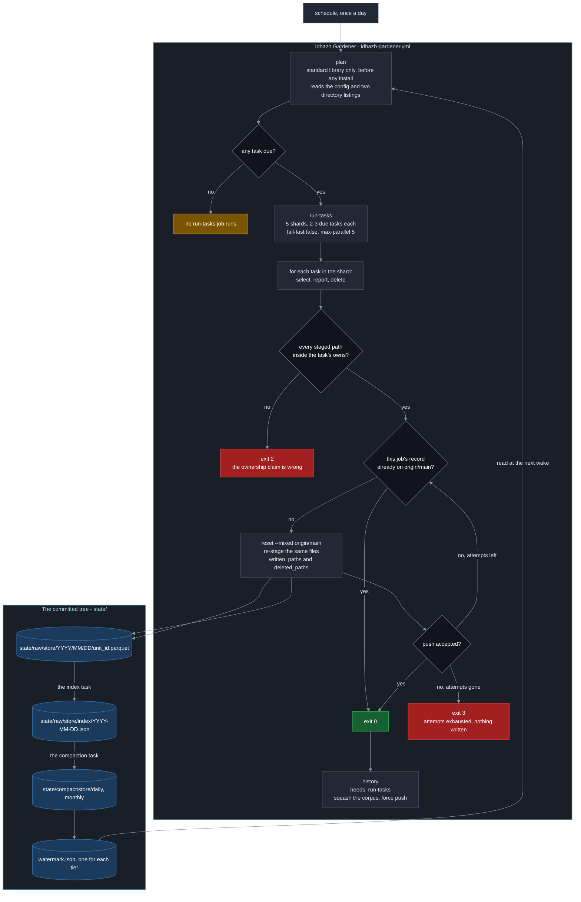
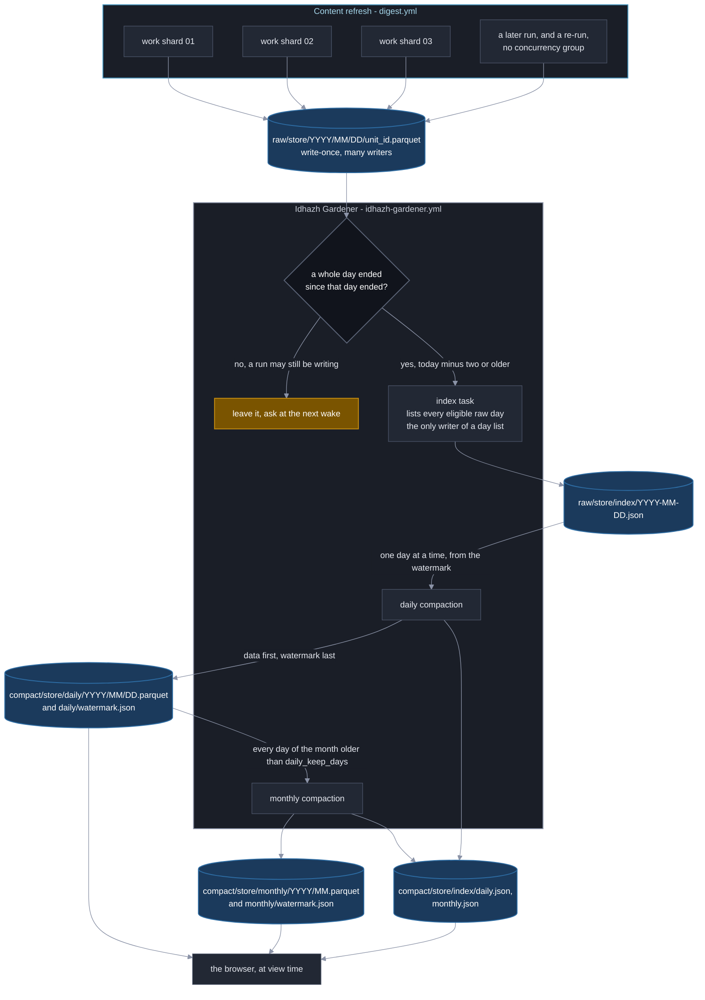

# Plan 50 - Idhazh Gardener: one utility tends every store

**Last Updated**: 2026-09-24

**Level**: 5 (CLAUDE.md section 6). It changes a persisted contract, the project's persistence format, and the one workflow that force-pushes `main`. The owner's rulings recorded in section 0 and in each row ARE the design consultation; the ESCALATE triggers name what still stops a worker.

**Chain** (CLAUDE.md section 0d). **Intent**: [docs/concepts/telemetry-intent.md](../docs/concepts/telemetry-intent.md) is the north star this plan serves; section 0's intent map says which of its eleven statements this plan delivers and which it only clears the way for. Locally: one utility tends every store; its config decides what happens and when; it runs the decision tree every day; nothing depends on anything else. **Contract**: section 5 below declares every persisted shape, path, key and exit code in full. **Code**: the seven rows.

Execute per docs/how-to/execute-a-plan.md: one owner carries the plan and delegates a row where delegation pays; keep parallel N = 2 - rows 3 and 4 share no file and every other pair shares `config/idhazh_gardener.json`; merge each pull request before dispatching the next; consult a persona only where two answers would lead to different code; AUTO-merge on green gates where no ESCALATE trigger fired; honor the ESCALATE triggers in section 0. AUTHOR-AND-STOP until the user authorizes.

## 0. Operating contract

| Field | Value |
| --- | --- |
| Why this plan exists | Four programs delete things on four unrelated schedules, one `--dry-run` flag covers eleven independent decisions, every store writes its own format by hand, and two schedulers disagree about when a day is closed. This makes one utility with one verb per task, one config, one persistence door, one record and one safe way to commit. |
| Hard scope - in | - `backend/idhazh/store/` is the one door a payload takes to disk, parquet or JSON, with exactly one module importing the parquet engine.<br>- `state/raw/<store>/<YYYY>/<MM>/<DD>/<unit_id>.parquet` is where a new writer files; `state/compact/<store>/<period>/...` is what compaction leaves, named for the period it covers - `daily/2026/09/23.parquet`, `monthly/2026/08.parquet`.<br>- `backend/idhazh/gardener/` holds the registry, the schedule, the record and the commit loop.<br>- All eleven passes in `backend/idhazh/stages/prune_state.py` become eleven tasks, each with its own window and its own `dry_run`.<br>- The corpus squash leaves inline shell for a tested Python module.<br>- `backend/utilities/prune_artifacts.py` is deleted and its work becomes two tasks; a utility that is also a task is two places to look.<br>- `.github/workflows/prune.yml` names no task: a standard-library `plan` job asks what is due, a sharded `run-tasks` job runs it, a `history` job rewrites the corpus last.<br>- `digest.yml`'s compaction step moves to the gardener, so one scheduler decides when a day is closed.<br>- **Every store the console reads moves to parquet here**: `item-health`, `scores`, `host-fingerprint` and `span-rollup`, plus the two small stores that prove the door. That is four producers in two modules, and it is what lets a later plan delete the six projections under `frontend/public/` that exist only because the build had to do the work in advance. |
| Hard scope - out | see the table below |
| ESCALATE triggers | 1. Removing the `pruned_date` read-side alias - stop before the commit that removes it, not before the commit that adds it.<br>2. Any behaviour change to the tip-moved refusal in `backend/utilities/push_rewritten_history.py`, including its exit code.<br>3. Migrating any CSV tree to `state/raw/` or to parquet beyond the two named in section 5.8.<br>4. A measured figure that contradicts section 4, **or** a measured chain in front of the force push that does not fit the gap it must sit in - the remedy for the second is a cron change, which moves when the site publishes.<br><br>**Four earlier triggers became controls instead**, because a control that fires is a red test and a test is a better stop than a note: a window including today is refused by name at config load (section 5.2); a second parquet importer is caught by row 2's oracle; a writer outside the two roots raises in `paths` (section 5.4); and a task in config with no registry entry fails the bijection refusal. |
| Chosen strategy | Register the two new roots, lay the persistence door, then move tasks in one PR per outcome, reader before writer, behaviour unchanged until the row that changes it. Ruled by Fowler (CLAUDE.md section 14). |
| Execution | autonomous orchestrator per docs/how-to/execute-a-plan.md. Parallel N = 2; rows 3 and 4 are disjoint and so are rows 9 and 10, and every other pair shares `config/idhazh_gardener.json`. |

### Hard scope - out

| What is out | What it costs to leave out | What would bring it in |
| --- | --- | --- |
| Migrating the rest of `state/` to `state/raw/` | Two layouts coexist: the gardener's own stores and the two row 3 takes sit under `state/raw/`, the rest stay where they are. Row 2 registers both roots so nothing reads them as strays. Section 5.8 lists what is left, with its producer and its consumer, so the later plan starts from a map rather than a survey | Its own plan. The owner's direction on 2026-09-24 is that `state/raw/` is where every writer lands **in future**; that is a rule for new writers, and moving committed data is a separate change with its own fixtures |
| Migrating the remaining CSV day trees to parquet | They stay CSV, and `backend/idhazh/day_shards.py` stays CSV-only and says so in one docstring line. Section 5.8 shows the write side is two functions and the read side is two more, so the later plan is bounded work rather than a store-by-store slog | Its own plan, now that the store door has two producers rather than none |
| The other nine console stores, and the other fifteen ECharts importers | One panel on `/console/machine` reads parquet and draws in d3; every other panel keeps its CSV reader and its ECharts option builder, and `echarts` stays installed. Two grammars coexist on one route until the charting plan closes it | The charting plan, which starts from the house style written by `TODO/20260924-51-console-fetches-and-draws-its-own-data-plan.md`'s row titled **One panel end to end: parquet at rest, queried in the browser, drawn in d3** |
| Everything the console does: one panel reading parquet in the browser, the d3 house style, the console shell, and the Hardware route's double count | Telemetry-intent N2, N3 and N5 get no stone in this plan, and `/console/machine` keeps a count that is wrong by about a fifth until that plan lands | Nothing. It is `TODO/20260924-51-console-fetches-and-draws-its-own-data-plan.md`, whose row titled **One panel end to end: parquet at rest, queried in the browser, drawn in d3** waits on this plan's row titled **The payload store, the two roots, and two stores moved to parquet**. They were split because they share no consumer, no risk class and no escalation surface: these seven rows change what is deleted from `main` and what force-pushes it, and nothing in that plan can lose data |
| Switching the visuals deletion on | The published tree keeps SVGs no day page links to | Plan `20260905-13-switch-on-deletion-plan.md`, row titled "The fuse comes out, and one run is watched". Row 5 moves that row's subject from a CLI flag to `config/idhazh_gardener.json`'s `visual-prune.dry_run` |
| Evicting `corpus/corpus.jsonl` rows as a task | The row cap stays with the harvest | It is a count bound, not an age bound, and `corpus.roll()` at harvest time is its only reader |
| An `enabled` flag per task | A task is switched off with `dry_run`, which still reports | Nothing. Two off-switches means two places to look when a task did not run |
| A rollback for a deletion | A wrong deletion is recovered from git history | Nothing. `one_at_a_time.py` already refuses to carry one, on purpose |
| Applying this naming to what `digest.yml` commits | The one path pair that can still lose a race stays as it is: `corpus/corpus.jsonl` and `corpus/corpus.meta.json` have no merge driver, are in neither `paths.DERIVED` nor `paths.UNION_SAFE`, and carry no writer identity in their names - so where the rebase replay conflicts, `commit_and_push.py` cannot choose a side and the push fails | Its own plan. Everything else `digest.yml` commits is already safe - `state/` shards carry a per-writer name, nine collections take a union driver, and every path under `frontend/public/` is in `paths.DERIVED` and rebuilt against the tip before the rebase. **The published payloads can never take this naming**: a static site cannot list a directory, so something must answer at a known address. That address is the store's own committed index (section 5.9.13), fetched by the query door at view time. **It is not `console/band.json`** - that route was taken for a day and reversed on 2026-09-25, because `+layout.ts` prerenders and would inline the list into every console document |

### The intent this plan serves

[docs/concepts/telemetry-intent.md](../docs/concepts/telemetry-intent.md) is the north star: eleven statements about what must be true of telemetry when the workstream is done. It sits above this plan (CLAUDE.md section 0d), so where the two disagree **this plan is what changes**. Not everything below ships here; this plan is a stepping stone and the map says which stones it lays.

| # | The intent, in short | What plan 50 does about it |
| --- | --- | --- |
| N1 | Parquet at rest, PyArrow writes it, CSV retired | **Stone laid.** Row 2 builds `backend/idhazh/store/` as the one door and row 3 takes two stores through it. Section 5.8 names every store still on CSV, its producer and its consumer |
| N2 | The browser queries the parquet itself | **Not here.** `TODO/20260924-51-console-fetches-and-draws-its-own-data-plan.md`. **What this plan owes it is the compact tier**: that is what the browser addresses, so no row here may change a tier's grain, its cadence or its index shape without plan 51's row titled "One panel end to end: parquet at rest, queried in the browser, drawn in d3" |
| N3 | The browser fetches its own data at view time | **Not here.** Plan 51, and no row here may make it harder |
| N4 | Prerendering is an anti-pattern; the prerendered routes come off it | **Not here.** Nine files under `frontend/src` carry `export const prerender` today, verified 2026-09-24, and plan 51 leaves all nine |
| N5 | d3.js is the only charting library; ECharts is retired | **Not here.** Plan 51 writes the house style and moves one importer of fifteen. Two of the fifteen, `waterfall.ts` and `donut.ts`, have no importer at all |
| N6 | One writer per path; bytes never change after the writer closes | **Stone laid.** Section 5.7 mints the name from the writer's identity, and row 3 retires a `merge=union` driver on each store it migrates |
| N7 | `state/` is the console's only source; no projection survives in `frontend/` | **Not here.** Nine payloads live under `frontend/public/` |
| N8 | `frontend/` holds UI code, not production artefacts | **Not here**, the same nine |
| N9 | A file is named `<uuid8>.parquet` | **Delivered for raw** by section 5.7, which is where the rule earns its keep - raw has many uncoordinated writers. **Narrowed for compact**: a compact file is named for the period it covers, because that tier has one writer and a minted name there costs the browser a computable address. Owner ruling, 2026-09-25, overturning 2026-09-24 |
| N10 | `state/` splits into `state/raw/` and `state/compact/` | **Delivered** by section 2 and section 5.4, as a refusal rather than a convention |
| N11 | One shard pattern for every tree, keyed on `covers_date` | **Delivered for what this plan writes**, mapped for the rest in section 5.8 |

**Five of the eleven are about the console and none of them is here.** They are `TODO/20260924-51-console-fetches-and-draws-its-own-data-plan.md`, which waits on this plan's row titled **The payload store, the two roots, and two stores moved to parquet**, and on nothing else. What this plan owes that one is a door and two roots that already work.

## 1. Status Reckoner

One row is one pull request, and there are ten. No row merges into another: each is one outcome that can be verified and reverted on its own, and none mixes a deletion with anything else. The console rows are `TODO/20260924-51-console-fetches-and-draws-its-own-data-plan.md` - they share no consumer, no risk class and no escalation surface with these ten.

| # | Row title | Depends-on | Parallel-group | Status | Worktree | PR | Subagent |
| --- | --- | --- | --- | --- | --- | --- | --- |
| 1 | The site-size instruments leave the prune module | - | A | PENDING | - | - | - |
| 2 | The payload store, the two roots, and the arrow mapping | 1 | B | PENDING | - | - | - |
| 3 | Two stores become parquet and their union drivers retire | 2 | C | PENDING | - | - | - |
| 4 | The gardener: registry, config, schedule, record, commit loop | 2 | C | PENDING | - | - | - |
| 5 | Eleven passes become eleven tasks | 4 | D | PENDING | - | - | - |
| 6 | The corpus squash becomes Python | 4 | E | PENDING | - | - | - |
| 7 | The index task, two compact periods, and the diagram moves into the page | 5 | F | PENDING | - | - | - |
| 8 | `prune.yml` becomes `idhazh-gardener.yml`, and the whole garden is scheduled | 6, 7 | G | PENDING | - | - | - |
| 9 | The three stores `work.py` writes become parquet | 7 | H | PENDING | - | - | - |
| 10 | `span-rollup` becomes parquet | 7 | H | PENDING | - | - | - |

**Two pairs run two-wide, and both were checked by diffing their `Files touched` lists.** Rows 3 and 4 share nothing: row 3 holds `backend/idhazh/ledger.py`, `backend/idhazh/paths.py`, `backend/idhazh/stages/prune_state.py`, the two migrated contracts and `.gitattributes`; row 4 holds `backend/idhazh/gardener/`, `backend/idhazh/prune/`, `backend/idhazh/cli.py`, `backend/idhazh/config.py` and `config/idhazh_gardener.json`. Rows 9 and 10 share nothing either: row 9 is `backend/idhazh/stages/work.py` and three contracts, row 10 is `backend/idhazh/telemetry/publish/day_metrics.py` and one. Rows 5 to 8 all write `config/idhazh_gardener.json`, so they are serial whatever their letters say.

**Rows 9 and 10 wait on row 7 rather than on row 2.** Migrating a store before the index task and the compaction exist would leave per-writer parquet shards with nothing to consolidate them, which section 4 measures at 15.1 times the CSV they replace.

**Rows 3, 9 and 10 are the only one-way changes in this plan, and each is alone in its own pull request.** Once one lands, its committed CSV is gone and committed parquet is there. Row 2 adds code and moves no committed byte, so it reverts to nothing - which is why the door and the first migration are two rows and not one.

**Every new test module a row adds carries a module-level `pytestmark`, so `backend/tests/test_marks.py` is not in its `Files touched`.** That file holds `UNMARKED_MODULES`, the set of test modules carrying no mark, and it appears only in a row that moves or renames one of those. This is the sentence that makes any row here parallel with any other; without it every row shares one file and `Parallel N` is fiction.

**Row 4 edits `frontend/src/lib/server/host-fingerprint.ts`** - `SERVER_JOB` gains `run-tasks` and `history`, and `backend/tests/contracts/test_frontend_vocabularies.py` binds the two and goes red without it. Plan 51's rows 1 and 4 edit that same file, so an owner running both plans holds whichever is not already in flight.

**Compaction lands before the workflow.** The old order scheduled a gardener whose own record store had nothing pruning it, which would have made `state/raw/gardener/` the only unbounded tree in the repository between two rows. The switch goes last.

**Every `Files touched` entry below names a file, never a directory**, because readiness is computed by diffing those lists ([execute-a-plan.md](../docs/how-to/execute-a-plan.md)). Two directories qualify for the one exception - a directory the row creates that no other row in either plan touches - and each is marked on its own line: `backend/idhazh/store/` and `backend/idhazh/gardener/tasks/`. `backend/tests/` and `docs/` never qualify.

## 2. The layout this plan establishes

**This is telemetry-intent N10 and N11 made concrete, and it binds every writer added after this plan.** Everything under `state/` goes to one of two roots and nothing else: `state/raw/` for data as a writer left it, `state/compact/` for what a compaction left behind. A third root is not a thing. The stores that sit directly under `state/` today predate the rule; row 2 moves two of them and section 5.8 maps the rest to their own plan (ESCALATE trigger 5). What this plan owes is that **nothing new is ever born outside the two roots**, and section 5.4 makes that a refusal rather than a convention.

**This tree is the reference. Every path literal in this plan and in `TODO/20260924-51-console-fetches-and-draws-its-own-data-plan.md` is one of these shapes and no other.**

```
state/
|-- raw/
|   `-- <store>/
|       |-- 2026/
|       |   `-- 09/
|       |       |-- 23/
|       |       |   |-- a81f3c92....parquet      many writers, write-once
|       |       |   `-- b27d9e11....parquet
|       |       `-- 24/
|       |           `-- c93ab812....parquet
|       `-- index/
|           |-- 2026-09-23.json                  the index task wrote this, whole
|           `-- 2026-09-24.json
`-- compact/
    `-- <store>/
        |-- daily/
        |   |-- 2026/
        |   |   `-- 09/
        |   |       |-- 23.parquet
        |   |       `-- 24.parquet
        |   `-- watermark.json
        |-- monthly/
        |   |-- 2026/
        |   |   |-- 07.parquet
        |   |   `-- 08.parquet
        |   `-- watermark.json
        `-- index/
            |-- daily.json
            `-- monthly.json
```

**Two periods, not three.** A yearly period is not built here: at `monthly_keep_months: 13` the monthly period is already bounded, and the first yearly file could not be written before January 2028. A period with no writer and no reader for twenty-seven months is minted by the plan that needs it.

**"Tier" and "period" are two words for two things and are never swapped.** A **tier** is `raw` or `compact` - the two roots, and the `Tier` enum. A **period** is `daily` or `monthly` - how much time one compact file covers, and the `Period` enum. `state/compact/<store>/daily/` is the daily period of the compact tier.

**A raw file carries a minted name; a compact file carries a date.** Raw has many uncoordinated writers, so `<unit_id>` (section 5.7) is what stops two of them taking one path. A compact period has exactly one writer and its path comes from the period it covers, so a minted name there buys nothing and costs the reader a computable address - **owner ruling, 2026-09-25, overturning the 2026-09-24 ruling that bound the `<unit_id>` name to every tier.** N9 still binds raw, which is where it was earning its keep.

**There is one `state/` tree and there always was.** `raw` and `compact` are two directories inside it, not two trees and not a second checkout. "The two roots" in this plan always means those two directories; "the two stores" always means the two things row 3 migrates, `feed-retirements.csv` and `visual-prunes`.

Worked example - run 2026-09-24-17482910337, first attempt, `run-tasks` shard 03, on 2026-09-24:

```
state/raw/gardener/2026/09/24/01a0d03c-2e00-8461-98e0-a67898e9a802.parquet
state/raw/gardener/index/2026-09-24.json
state/compact/gardener/daily/2026/09/24.parquet
state/compact/gardener/daily/watermark.json
state/compact/gardener/index/daily.json
```

`<store>` is `gardener` or `visual-prune`; this plan creates no others, and `StoreName` (section 5.9.1) is the closed set that refuses a typo.

**A data file is written once and never rewritten. Four small JSON files are rewritten in place, and each one has exactly one writer.** The raw day index, and the index and watermark of each compact period. A path with one writer cannot lose a push race, needs no merge driver, and makes "same path, different identity" a detectable defect - so single writership is the property that matters here, not immutability, and section 5.4's `paths.py` is what makes it structural rather than hoped for.

**Why a watermark file exists when the newest file already names a date.** A listing cannot tell you about a gap. If 23 September produced nothing, no daily file is written, the newest file still says the 22nd, and the task retries the 23rd every day forever. The watermark records "I looked at the 23rd and there was nothing", which is the one fact no walk of the tree recovers. There is one per period because there are two roll-ups - raw to daily, daily to monthly - and each is its own task; one shared file would have two writers, which is the race this whole design removes.

**Compaction is per store and per period, at each period's own cadence.** Section 4 says what each grain costs.

## 3. The shape this plan builds

**This diagram is the plan's copy and it is expected to move.** It is drawn to the Mermaid contract in [docs/reference/documentation-structure.md](../docs/reference/documentation-structure.md) so it can be lifted unchanged; row 7 lifts it into the architecture page and this section becomes a link (Guardrail #4).



**`digest.yml` is not on the picture, and that is the point.** It runs five times a day and writes today; every gardener window is strictly in the past, so no task can touch what a running job just wrote. Section 5 turns that from an arrangement into a load-time refusal.

### How a row travels from a writer to a reader

The diagram above answers which jobs run and how a push is landed. This one answers how a row moves between tiers, which is a different question and so is a different picture.



**A whole day must have ended before a day is read, which makes the rule today minus two.** At a wake just after midnight, yesterday ended half an hour ago and the day before ended twenty-four and a half hours ago. The second is taken and the first is left. No run can still be writing into a day that ended a full day ago, and the one case that can - a re-run of a failed job, which GitHub permits for thirty days - is absorbed by re-compacting that day rather than guarded against by waiting longer.

**Every step is resumable and none of them reconciles anything.** A compaction takes one day at a time, writes that day's file, rewrites the index, then advances the watermark. Two days missed produce two files. A run that dies in the middle leaves the watermark behind the truth, so the next wake redoes that one day and no more. The opposite order - watermark first - would leave a day in no period and in no index, gone with no error and no test able to see it.

## 4. What was measured, 2026-09-24

Three readings drove a decision. Everything else was noise and is not kept. A figure that contradicts one of these is ESCALATE trigger 6.

**Parquet's cost is a fixed charge per file plus a charge per column in that file, so the only number that matters is how many rows share one file.** The footer is about 3,764 bytes. A column costs roughly 200 bytes when it is empty and its own data when it is not. **So the format is expensive at one row and cheap at several hundred, and consolidation is the whole design.**

**Measured 2026-09-25 against the eight newest committed `item-health` files - 220 rows, 122 columns.**

| What | Bytes | Against the CSV |
| --- | --- | --- |
| The eight committed CSV files as they are | 225,711 | - |
| One parquet file, every column | **87,714** | **2.6 times smaller** |
| One parquet file, the 83 columns a page reads | 62,304 | 3.6 times smaller, and 29 percent below the line above |
| One parquet file, every column, per-column statistics off | 81,739 | saves 6.8 percent |

**And measured at the other extreme, against three days of `host-fingerprint` - 79 per-writer shards of one or two rows each: 57,888 bytes of CSV become 873,872 bytes of parquet, 15.1 times larger.** That is the same format and the same data, split 79 ways instead of one. A one-row file of 31 columns is about 9,300 bytes of page, dictionary and statistics overhead around 370 bytes of data.

**Those two readings are the whole argument for this plan.** A store written per writer and never consolidated is the worst thing parquet does; the same store consolidated into one file a day is better than the CSV it replaces. **Nothing is published from the raw tier**, and every compact period is one file.

**A constant column costs about 250 bytes flat** - a page header, a dictionary page and statistics. That is what decides section 5.7's column-or-footer split: a column earns its 250 bytes only when a query filters on it, because row-group statistics then let a reader skip the whole file.

**Git delta-compresses a rewritten period file rather than storing a whole new blob.** Measured over nine real `host-fingerprint` days: 119,207 bytes written becomes 37,315 bytes packed, and one period-file rewrite costs 1,649 bytes. Five rewrites a day is about 8 KB, and 742 KB over the 90 days `finetune.prune_keep_days: 60` and `prune_every_days: 30` allow history to hold. An earlier draft asserted "roughly 360 MB" for daily compaction across every store; that was arithmetic on a false premise and is 33 times too high. **The churn was never the constraint, so cadence is a preference about what a reader gains.**

**Every size in this section names its compression.** 32 bytes a row is snappy; a period file is zstd, which row 2 decision 5 measured at 2.2 times smaller at a thousand rows. **A worker pricing a new store off this section reads the compression before the number, and re-takes the reading for that store's own column count** - the break-even is a function of width, and `host-fingerprint`'s 31 columns and `item-health`'s 122 do not behave alike.

**pyarrow is the largest thing the gardener installs.** It is an optional extra, not a runtime dependency: `pip install -e .` appears at 18 call sites across 9 workflow files and `digest.yml` alone runs it 30 times a day. **Row 9 puts it into three of those job kinds**, so the installed size is re-taken on `ubuntu-latest` in row 2 before any sentence quotes it - the reading in hand is from Windows and the two platforms bundle different shared objects.

**Zero published bytes, in this plan only.** Nothing this plan writes reaches a reader's browser; it lays the store and the periods, and `TODO/20260924-51-console-fetches-and-draws-its-own-data-plan.md` is where a download is first paid for and priced.

## 5. The contracts

**A worker implements these and invents nothing.** Everything here is declared before any logic reads or writes it (Guardrail #3).

### 5.1 `CollectionPruneRow`, widened - there is no new record contract

`backend/idhazh/contracts/collection_prune.py`, stem `collection-prune-row`. Eight of the fields already exist with these meanings; nothing persists the shape today, so the widening owes a `version` stamp and one `changelog` line and no migration. Minting a second near-twin contract would be two shapes for one question (Guardrail #4).

| Field | Type | Meaning |
| --- | --- | --- |
| `version` | `DateStamp`, inherited from `Contract` | The shape's own date stamp |
| `date` | `DateStamp` | The day the pass ran |
| `task` | `Slug` | **Renamed from `collection`.** The task's name - the config key, the `--task` value and the registry entry. It named a GitHub collection when only two tasks wrote this row; every task writes it now, so the column is `task` and the rename ships with a `version` stamp and one `changelog` line |
| `run_id` | `str`, `RUN_ID_PATTERN` | **new.** The execution that produced the row, so a reader finds the job log after the path is gone |
| `attempt` | `int`, `ge=1` | **new.** The GitHub run attempt; says whether a retry happened |
| `job` | `ServerJob` | **new.** `run-tasks` or `history` |
| `shard` | `int`, `ge=0` | **new.** The matrix index, so a row maps to one job log when three tasks share a job |
| `cadence_unit` | `CadenceUnit` - `days` or `months` | **new.** The schedule the run believed it was on |
| `cadence_value` | `int`, `ge=1` | **new.** With `cadence_unit`, how often the task is meant to run |
| `since` | `DateStamp \| None` | Oldest day a member may carry and still qualify. Empty means no lower end |
| `until` | `DateStamp \| None` | Newest day a member may carry and still qualify, inclusive. Empty means no upper end |
| `max_deletes_per_run` | `int \| None`, `ge=0` | **widened to optional.** `null` is no ceiling; `0` keeps its meaning of a survey that reports the first qualifying member and takes nothing |
| `dry_run` | `bool` | True when the pass only reported. `selected` and `deleted` still say what it would have taken |
| `candidates_seen` | `int`, `ge=0` | Members the listing yielded before the pass stopped. Never the size of the collection |
| `selected` | `int`, `ge=0` | Of those, how many the window held |
| `deleted` | `int`, `ge=0` | How many it removed, or would have. A compaction's written bytes are not netted against this |
| `bytes_freed` | `int`, `ge=0` | What those deletes freed, or would. `0` is honest where a member has no readable size |
| `stopped_because` | `StopReason` - `exhausted`, `ceiling` or `failed` | Why the pass ended. `failed` is how one task's failure reaches the record without taking its shard siblings down |
| `resume_from` | `MemberId \| None` | Where the next pass begins. Empty exactly when `stopped_because` is `exhausted` |
| `duration_ms` | `int`, `ge=0` | **new.** Wall clock for this task alone, never the job |

Cross-field validators, existing ones kept and one amended: `selected <= candidates_seen`; `deleted <= selected`; `deleted <= max_deletes_per_run` when it is neither null nor 0; `(stopped_because is exhausted) == (resume_from is None)`; `since <= until` when both are set.

### 5.2 `config/idhazh_gardener.json`

`GardenerConfig` in `backend/idhazh/contracts/knobs/gardener.py`.

**Hard constraint: dueness must be decidable from this file with `json`, `datetime` and `pathlib` alone**, because the `plan` job runs before any `pip install` - the discipline `backend/utilities/prune_due.py` already keeps and states.

```json
{
  "version": "2026-09-24",
  "attempts": 5,
  "shards": 5,
  "tasks": {
    "seen": {
      "cadence": { "unit": "days", "value": 1 },
      "window":  { "unit": "days", "value": 90 },
      "dry_run": false,
      "max_deletes_per_run": null,
      "owns": ["state/seen"]
    },
    "trials": {
      "cadence": { "unit": "days", "value": 1 },
      "window":  { "unit": "days", "value": 90 },
      "dry_run": false,
      "max_deletes_per_run": null,
      "owns_everything_else_under": ["state"]
    }
  }
}
```

| Key | Type | Meaning |
| --- | --- | --- |
| `version` | `DateStamp` | The config shape's date stamp |
| `attempts` | `int`, `ge=1` | How many times the commit loop re-fetches, recomputes and pushes before exit 3 |
| `shards` | `int`, `ge=1` | How many `run-tasks` jobs the `plan` job splits the due list into. A workflow test asserts `idhazh-gardener.yml`'s `max-parallel` is not below it |
| `tasks` | object keyed by task name (`Slug`) | One block per task. The registry and this object are a bijection, asserted both ways |
| `tasks.<name>.state` | `active` or `retired`. **Required, no default** | The task's place in the garden. `active` runs when due; **a task that should act on nothing is `dry_run: true`, which runs and reports.** `retired` means the module is gone but the block stays, so a reader of a committed record can still see the policy that produced it; deleting the block instead would orphan every record naming the task. **There is no third state**: `paused` would be a second off-switch, and this plan rejects a second off-switch by name three rows below - the worse of the two, because `dry_run` reports and a pause makes a store silently stop being tended |
| `tasks.<name>.cadence` | `{unit: days\|months, value: int ge=1}` | Discriminated on `unit`. How often the task should run. `count` is not a member: the only count-bounded store is `corpus/corpus.jsonl` and `corpus.roll()` owns it at harvest time |
| `tasks.<name>.window` | the same union | What the task keeps. Two units so a store counted in months keeps a month window |
| `tasks.<name>.dry_run` | `bool`, **required, no default** | Run and report, change nothing |
| `tasks.<name>.max_deletes_per_run` | `int \| null`, `ge=0` | `null` no ceiling, `0` survey. Same meaning as the record column |
| `tasks.<name>.owns` | list of POSIX path prefixes, repository-relative | Every path this task may delete under. One declaration yields four things: the disjointness proof, the sparse-checkout cone, the permitted delete set and the staging list |
| `tasks.<name>.owns_everything_else_under` | list of POSIX path prefixes | The complement form, for the `trials` task only. The set is `under` minus every other task's `owns` minus the registered store names |

**Load-time refusals, each naming the offender:** an `active` task in config with no registry entry, or a registry entry with no block; a `retired` task that still has a registry entry; a window that would include today; two tasks whose owned sets intersect or where one is a prefix of the other; more than one task using the complement form; `gardener.tasks.seen.window.value` shorter than `collect.seen_window_days`; `gardener.tasks.telemetry-aggregate` carrying a series window shorter than the `observability` key that series covers; a `deleted_paths` entry naming a directory rather than a file; an `owns` entry that is not a directory prefix, because the checkout's cone mode matches directories and a file-valued entry would silently match nothing; **a store in `StoreConfig.published` whose daily compaction does not run daily**; **a store in `StoreConfig.published` with any of its three keep-windows null**, naming the store and the knob; and **a `daily_keep_days` that does not leave at least one whole month before `monthly_keep_months` begins**, which would open a gap no tier covers.

**The last refusal is the one that keeps a reader's first request from growing with the archive.** A published store's compact periods are what the browser addresses, so what it can reach is bounded by `daily_keep_days` and `monthly_keep_months` and by nothing that is a term of elapsed time. `config/idhazh.json` carries three null windows today (`item_health_aggregate_keep_months`, `score_archive_keep_months`, `visual_aggregate_keep_months`), where null means never delete. **A published store may not leave either of its windows null.** Publishing a store is what makes its windows load-bearing for a reader, and that is the moment to insist on them (Guardrail #12, and `TODO/20260924-51-console-fetches-and-draws-its-own-data-plan.md`'s section titled "How the browser reaches the bytes").

Four more refusals ride with it, each naming both knobs it read:

- **a published store whose daily compaction does not run at the end of every content run.** The reader's open period is every day past the daily watermark, and no raw file is published, so a day that has not been compacted is a day the console cannot draw.
- **a published store whose `daily_keep_days` is below the largest value in `console.span_choices_days`**, which would put a reader's span on both sides of a period boundary for no gain.
- **a `monthly_keep_months` that, with `daily_keep_days`, reaches less far back than that store's own retention window.** Once a store goes through the door the two periods *are* its retention, and a shorter pair silently cuts it.
- **a `raw_index_keep_days` shorter than `daily_keep_days`**, which would delete an index the daily period may still need to rebuild its own file.

**Adding a task is a module and a block. Pausing one is a word. Retiring one is a word and a deletion.** The gardener is expected to carry a list that grows and occasionally shrinks, so the three states are in the contract from the first commit rather than bolted on when the first task needs retiring.

**Two knobs do not move into this file**: `collect.seen_window_days` and `lens_weights.window_days`. Both are read by the pipeline to produce a day, not only by a prune, and moving them would make the planner load the retention config. The cross-file refusal above is what keeps the two in step.

### 5.3 How dueness is known, and why a watermark is not a stamp

**There is no stamp store.** An earlier draft gave each task a small JSON file it overwrote on every run, recording when the task last ran. That file was not sharded, it sat flat at the root of a store, and five jobs rewrote it - exactly the lost-push-race the whole design exists to remove.

**A watermark is not that, and the difference is what it records.** A stamp says *when a job ran*; a watermark says *what the data covers*. Re-running a task against an unchanged stamp does nothing, so a lost stamp write silently skips work. Re-running a compaction against an unchanged watermark redoes exactly the periods that are genuinely not done, so a lost watermark write costs one repeat and loses nothing. That is why one is refused and the other is the mechanism.

The question splits four ways, and every answer reads a file that already exists.

| Task kind | Which tasks | How the `plan` job knows, with the standard library only |
| --- | --- | --- |
| **Windowed** | The eleven retention tasks, and both GitHub collection tasks | It does not need to know. They run **every day** - `cadence` is `days: 1` - and the window decides what qualifies. A day on which nothing is old enough is a listing that finds nothing and a record that says `deleted: 0`. No last-run state exists because none is needed |
| **Index** | `index-gardener`, `index-visual-prune` | It does not need to know either. The task runs at every wake and restates every raw day index of its store except today's. Bounded by the compaction's lag rather than by the archive: the daily compaction deletes a day's raw files, so the directories that exist are the open day plus whatever the compaction has not yet taken |
| **Compaction** | `compact-<store>-daily` and `compact-<store>-monthly`, one pair per store | That period's own `watermark.json`: one file opened, one date read. Work starts at the watermark plus one period and takes at most `max_periods_per_run`, so the cost is bounded by config and never by the size of the archive |
| **History** | `squash-history` | `corpus/corpus.meta.json:last_run`, which the corpus already owns and which `backend/utilities/prune_due.py` already reads this way today |

**Why running the windowed tasks daily is the cheaper answer, not the lazier one.** A cadence for a windowed task is a second control over the same thing the window already controls, and two controls over one behaviour is how a store quietly stops being pruned when somebody widens one and forgets the other. Daily is also what makes a missed day cost a day: a task that failed or lost its push simply runs again at the next wake with no state to reconcile.

**An absent watermark means the store has never been compacted, and the first run is bounded by config rather than by the archive.** A compaction consumes at most `max_periods_per_run` eligible periods in one wake. With no watermark it starts at the oldest period that store's own keep-window still admits, **never at the oldest file in the tree**. A store published carrying fourteen months of history drains its backlog over several wakes instead of in one long job or one period a day for two months. This is the one number that makes "starts at the watermark plus one" and "one period at a time" the same program (Guardrail #12).

#### The daily compaction, in order

**A day is eligible once a whole day has ended since it ended.** Not "today minus one" - **today minus two**, which falls out of the arithmetic rather than being asserted.

Worked example. The gardener wakes at 00:30 on the 25th.

| Day | Ended at | Elapsed | Eligible |
| --- | --- | --- | --- |
| the 24th | 00:00 on the 25th | 30 minutes | **no** - a run that started on the 24th may still be writing |
| the 23rd | 00:00 on the 24th | 24.5 hours | **yes** |
| the 22nd and older | - | - | yes, if the watermark has not passed them |

1. Take the days from the watermark plus one up to the newest eligible day, at most `max_periods_per_run` of them, **and do each one separately**.
2. For each day: read that day's index, read exactly the files it names, write `state/compact/<store>/daily/<YYYY>/<MM>/<DD>.parquet`, rewrite `index/daily.json`, delete the raw files, then advance the watermark.

**Two days that were missed produce two files, never one.** If the run on the 25th fails and the next one is on the 26th, the watermark still says the 22nd, so the task compacts the 23rd into `23.parquet` and the 24th into `24.parquet`. **Merging two days into one file is a defect, not an optimisation**: the file is named for the day it covers, and a file named `23.parquet` holding the 24th's rows makes every date query wrong.

**A day already below the watermark that still has raw files is compacted again.** Its compact file is rewritten from the union and the watermark stays where it is. This is how a re-run of a failed job - GitHub allows one for thirty days, and it writes into its original day - is absorbed without a second mechanism.

#### The monthly compaction, in order, and no step may be reordered

1. A month `M` is **eligible** when `today - last_day_of(M) > daily_keep_days`. Nothing else makes a month eligible.
2. Take the oldest eligible month after the monthly watermark. Read `index/daily.json` and confirm it names a daily file for **every** day of `M` that the daily watermark has passed. A missing day is a hole: refuse the month by name, leave the watermark where it is, and exit 1.
3. Write `state/compact/<store>/monthly/<YYYY>/<MM>.parquet` from exactly those files.
4. Rewrite `state/compact/<store>/index/monthly.json`.
5. Delete exactly the daily files absorbed, and rewrite `daily.json`.
6. Advance `state/compact/<store>/monthly/watermark.json` **last**.

Steps 3 to 5 are one commit, so there is no instant at which a date sits in two periods or in neither.

**A month is absorbed whole or not at all.** Absorbing it in pieces would make a date reachable through two periods, and the browser's coarsest-period rule would then read a month file that does not yet hold the day it asked for - a silent undercount with no 404 and no error, which is the defect class this design exists to remove. The price is that the daily period holds between `daily_keep_days` and `daily_keep_days + 31` days rather than exactly 45.

**What a watermark means, per period.** `daily/watermark.json.through` is the newest **day** whose raw files have been absorbed. `monthly/watermark.json.through` is the newest **month** fully absorbed, stamped `YYYY-MM`. A date after the daily watermark is open and read from raw; a date at or before it and inside a month named in `monthly.json` is read from that month file; everything between is read from the daily period.

**Cadence is a per-task value and one of them is load-bearing.** A published store's daily compaction runs at the end of every content run (section 5.9.4); every other store's runs weekly. The monthly compaction cannot usefully run more often than the period it produces, and `squash-history` force-pushes and rewrites history, so it keeps the cadence it has.

### 5.4 The paths, and the refusal that keeps the two roots true

`backend/idhazh/store/paths.py` is the only module that builds any of these, and the set is closed:

| Builder | Answers |
| --- | --- |
| `raw_path(store, date, unit_id)` | `state/raw/<store>/<YYYY>/<MM>/<DD>/<unit_id>.parquet` |
| `raw_index_path(store, date)` | `state/raw/<store>/index/<YYYY-MM-DD>.json` |
| `compact_path(store, period, covers)` | `state/compact/<store>/daily/<YYYY>/<MM>/<DD>.parquet`, or the monthly shape |
| `compact_index_path(store, period)` | `state/compact/<store>/index/<period>.json` |
| `watermark_path(store, period)` | `state/compact/<store>/<period>/watermark.json` |

`store` is a `StoreName` and `period` is a `Period` on every one of them, so a typo is a `ValueError` at the call site rather than a directory nobody meant. `compact_path` takes no `tier`: a compact path is compact by construction.

Grammar and the full tree in section 2. `.gitattributes` gains exactly these lines, path-anchored so a generic name cannot match elsewhere in the repository:

```
state/**/*.parquet                -merge
state/raw/*/index/*.json          -merge
state/compact/*/index/*.json      -merge
state/compact/*/*/watermark.json  -merge
*.parquet                         binary
```

**The door refuses a path whose second segment is neither `raw` nor `compact`, by name, at build time.** Not a lint, not a review habit - a `ValueError` naming the offending path and the rule. A test proves the refusal fires.

This needs no allow-list and no register of exceptions. The stores section 5.8 leaves on CSV do not call this door; they build paths through `ledger.day_shard_path`, which is untouched. A store migrates by moving to the door, and inherits the rule the moment it does. When the last one has moved, `ledger.day_shard_path` is deleted and the rule is the only way to build a state path.

`state/raw` and `state/compact` are subtracted from the trial-roots computation in the same commit that creates them. Without that, `retention._trial_roots` reads them as unknown directories and the gardener deletes its own records.

### 5.5 The task registry

`backend/idhazh/gardener/tasks/__init__.py` - a frozen tuple built from **explicit imports** of its sibling modules. A closed set, no dynamic import, and `ls backend/idhazh/gardener/tasks/` is the set. The registry holds a name and a callable and nothing else, because config decides what happens and when. **There is no `tasks.py` beside this package**: a module and a package of one name cannot both exist, and the package wins silently, which is how a registry ends up unimportable and nobody notices.

```python
@dataclass(frozen=True, slots=True)
class Task:
    """One verb. Everything else about it is config."""

    name: Slug                          # equals the config key and the --task value
    run: Callable[[TaskContext], Pass]


@dataclass(frozen=True, slots=True)
class TaskContext:
    state_dir: Path
    repo_root: Path
    today: date
    policy: TaskPolicy                  # this task's validated config block
    run_id: str
    attempt: int
    job: ServerJob
    shard: int
```

`run` returns the `Pass` that `backend/idhazh/gardener/one_at_a_time.py` defines - moved there from `backend/idhazh/prune/` in row 4, because a module answering "how do I delete a collection's members one at a time" is the gardener's core and not a neighbour's - and `backend/idhazh/gardener/report.py` turns a `Pass` into the record row, filling the six new identity and cadence columns from the `TaskContext`.

**The invariant the runner asserts on every task before staging: the delete set is a subset of the read set, and every deleted path sits under that task's `owns`.** A violation is exit 2. This is what stops the telemetry aggregation deleting a derived path its own producer rebuilds.

### 5.6 The checkout, the commit loop and the exit codes

**The checkout is partial and sparse, and that is what keeps the job's cost flat as the repository grows** (Guardrail #12). A `run-tasks` runner never downloads historical parquet:

```yaml
      # The cone is this shard's tasks' `owns` prefixes, emitted by the `plan`
      # job from the same config that declares them, plus the three directories
      # the code lives in. A task whose store sits outside the cone lists an
      # empty directory and reports success - the one failure no gate catches.
      - uses: actions/checkout@v6
        with:
          fetch-depth: 1
          filter: blob:none
          sparse-checkout: |
            config
            backend
            .github
            ${{ matrix.cone }}
```

`filter: blob:none` omits file contents until git needs one; `sparse-checkout` keeps the rest out of the working tree.

**`matrix.cone` is a field of the section 5.9 plan payload, never an expression invented in YAML.** `gardener_due.py` computes it from the same config that declares `owns`.

**The cone does not grow with the archive, and that is Guardrail #12's answer rather than its escape hatch.** Every prefix in it is a store some task prunes to a window, so the cone grows to that window and stops. The one prefix that is not a store is the `trials` task's `state`, and that task reads **directory names at depth one** - `git ls-tree HEAD state/`, no `-r` - because it is looking for a directory nobody claims and the contents of a claimed one are not its business. One tree read at constant cost, and it replaces a sweep over every file under `state/`.

**Before a task lists anything, it asserts its owned prefix exists in the working tree and exits 1 naming the prefix if it does not.** A silent zero is what a wrong cone produces, and an assertion is the only thing that turns it into a red job. One harness test: every `owns` prefix in the committed config appears in exactly one shard's cone, computed by the function the `plan` job calls.

**Clone and fetch are not two ways to do this, and neither is written by hand.** `git clone` creates the repository; `git fetch` updates one that already exists, so a job that has checked nothing out has nothing to fetch into. The job needs both, at different moments - the clone once at the top, a fetch on each turn of the commit loop below. The clone is not spelled out because `actions/checkout@v6` already does it and is the only step that writes the credential header the later `git push` needs; all thirty-eight checkout steps in this repository use it, and a hand-rolled `git clone` beside it buys a second clone or a push with no token.

```python
def publish(shard: Shard, message: str, *, attempts: int, deadline_seconds: int) -> int:
    """Land the files this job already produced. The work is not done again."""
    deadline = time.monotonic() + deadline_seconds
    for attempt in range(1, attempts + 1):
        git("fetch", "origin", "main", "--depth=1")

        if exists_on_remote(shard.record_path):
            if remote_blob(shard.record_path) == local_blob(shard.record_path):
                return EXIT_OK                      # an earlier attempt won
            return EXIT_INTEGRITY                   # two writers, one path

        git("reset", "--mixed", "origin/main")      # the index moves, the tree does not

        # Explicit files, never a prefix. `git add -- <prefix>` after a reset
        # stages every difference under it against the new tip, and digest.yml
        # writes into these prefixes five times a day - so a prefix would stage
        # the deletion of a shard that landed while this job worked.
        for path in shard.written_paths:
            git("add", "--sparse", "--", str(path))
        for path in shard.deleted_paths:
            git("rm", "--cached", "--sparse", "--ignore-unmatch", "--", str(path))

        # Read the index back. This is the one class of error that commits
        # cleanly, pushes cleanly and passes every gate.
        if staged_names() != {str(p) for p in shard.written_paths | shard.deleted_paths}:
            return EXIT_INTEGRITY

        git("commit", "-m", message)
        if git_ok("push", "origin", "HEAD:refs/heads/main"):
            return EXIT_OK
        if time.monotonic() >= deadline:
            break
        sleep_with_jitter(attempt)
    return EXIT_PUSH_KEPT_LOSING
```

**Three shapes this forces, and the first is load-bearing.**

- **`Shard` carries `written_paths` and `deleted_paths`, two explicit file lists the tasks produced.** `owns` stays in config as the **permission** each path is checked against, never as the staging list. One field answering both questions is how a gardener deletes a file a digest run wrote twenty minutes earlier and exits 0.
- **A wall-clock deadline, jittered backoff, and `attempts` as the secondary bound.** Five shards pushing at once burn five bare attempts in seconds. `backend/utilities/commit_and_push.py` already solved this with a monotonic deadline, and `config/idhazh.json` already declares `run.push_deadline_seconds: 300`. **The gardener reads that key rather than minting a second spelling of it** (Guardrail #4).
- **The loop needs a git identity before its first commit**, set from the same constants `commit_and_push.py` uses: `miztiik <miztiik@users.noreply.github.com>` (CLAUDE.md section 8). Without it a bare runner exits 128 on `git commit`, and `backend/tests/workflows/_harness.py`'s identity-source tuple names `prune.yml` today, so it moves to the new filename in row 8 or loses its only member.
- **`git config index.sparse true` immediately after checkout.** `git reset --mixed` expands the index to the whole repository unless the index is sparse, and `actions/checkout` does not set it - so without this the worktree cost is flat and the index cost is not.
- **The index read-back is exit 2, beside the ownership assertion.** It is what stops this class of error returning later as a different prefix.

**The work happens once, before the loop. The loop only stages and pushes.** That is what keeps a job's cost flat however many times it loses a race, and it is why nothing here has to be recomputed against the new tip: every path this job touches is one the registry proves no other task owns, so a moved tip cannot have changed them.

**Same path and same bytes is a successful retry. Same path and different bytes is a data-integrity error.** The invariant holds as written, with no second tier, because **the file is written once and its name is minted once**. A retry re-stages the same bytes; it does not re-produce them. Two different contents at one path would mean two writers minted one identifier, which the identifier's construction (section 5.7) makes impossible - so exit 2 is an assertion that should never fire, which is exactly what it is for.

**Every task is one kind: add its record, always; then delete its selected paths, possibly none, in one commit.** Three writer kinds were three ways to get this wrong - the worst being that a dry run selects nothing, so a "nothing left to delete" verdict would report success and publish no record at all.

| Code | Meaning | Retryable |
| --- | --- | --- |
| 0 | Every task in this job landed, or was already landed | - |
| 1 | A task failed. Its row carries `stopped_because: failed` and `resume_from`; its shard siblings still ran and still have rows | Yes, next wake |
| 2 | Either this job staged a path outside the declared `owns` of the task that produced it, or one record path holds two identities. The registry's ownership claim is wrong | **No** |
| 3 | The push kept losing after `attempts`. Nothing landed, so a windowed task simply runs again at the next wake and a periodic one is still due | Yes, next wake |

**Why reset-and-reapply rather than rebase, stated once.** The writer has exactly one local change - the files it just produced - so there is nothing to merge. Reset to the new tip, re-add the same artefacts, commit, push. **The amount of local work does not grow with the size of the repository**: no historical parquet is downloaded, nothing accumulated is rebased, no other directory is reconciled by hand. A rebase would also carry a real hazard: a deletion rebased onto an append to the same union-merged file keeps both sides and the deleted rows come back at exit zero.

`git reset --hard` stays banned (CLAUDE.md section 8); `--mixed` is not on that list and is what keeps the working tree while the index moves. `--force-with-lease` is not used - a lease names the commit a rejection has just made stale.

### 5.7 The unit identifier, and the envelope inside the file

**North star, and it binds every store added after this plan. A filename carries identity, never meaning. Everything a reader needs to know about a file is inside the file.** A filename that is parsed is an undeclared, unversioned, unvalidated schema, and renaming a file becomes a breaking change. With the envelope inside, a file can be renamed, moved or re-partitioned and every reader still knows what it holds - which is the thing a filename cannot survive when one query opens a hundred files at once.

This plan applies the rule to the stores it creates and to the two row 3 migrates. The trees section 5.8 leaves behind keep their parsed names until they migrate, because `ledger.SEGMENT_NAME` is a compiled pattern that `idhazh.paths` uses to answer whether a committed path has exactly one writer, and retiring that is the migration plan's work, not this one's.

#### The identifier

`backend/idhazh/store/naming.py`. A version-8 UUID: a 48-bit millisecond clock, then 74 bits derived from the writer's identity.

```python
NAMESPACE = uuid.uuid5(uuid.NAMESPACE_URL, "github.com/miztiik/yen-idhazh")

def unit_id(*, dataset: str, run_id: str, attempt: int, job: str, shard: int) -> uuid.UUID:
    """The name of one file. Minted once, when the file is written, and then kept."""
    seed = f"{NAMESPACE}|{dataset}|{run_id}|{attempt}|{job}|{shard}".encode()
    digest = hashlib.sha256(seed).digest()
    return _pack_v8(
        time.time_ns() // 1_000_000 & 0xFFFFFFFFFFFF,   # the clock, at this instant
        int.from_bytes(digest[0:2], "big") & 0xFFF,
        int.from_bytes(digest[2:10], "big") & ((1 << 62) - 1),
    )
```

Measured 2026-09-24 against `uuid.uuid8`: version 8, variant RFC 4122, files written in the same millisecond share the 13-character clock prefix, and sort order equals time order across milliseconds.

| # | Decision | Why |
| --- | --- | --- |
| 1 | **The name is minted once, when the file is written, and held in a variable.** A retry re-stages that same path; it never mints a second one | The caller keeps the file and the name across push attempts, exactly as the checkout recipe in section 5.6 does. Nothing has to recompute a name, so nothing has to be reproducible |
| 2 | The clock is the write instant | It makes the name sort by time, which is what a listing and any later object store both want |
| 3 | The other 74 bits are a hash of `dataset`, `run_id`, `attempt`, `job` and `shard` | Two writers in one millisecond cannot collide, because no two writers share all five. `attempt` is in there because GitHub keeps `run_id` stable across a re-run |
| 4 | `_pack_v8` is hand-written, about ten lines | `uuid.uuid8` arrived in Python 3.14 and `requires-python` is `>=3.12`. The RFC 9562 layout is fixed, so packing it ourselves costs less than raising the floor |
| 5 | Within one millisecond the order is arbitrary | The bits after the clock are a hash. Ordering is a property across time, not within an instant. Said plainly because a group of files from one run looks ordered and is not |
| 6 | What it costs: a person reading a git diff no longer sees the run, attempt, job and shard in the filename | The path still carries `<store>/<YYYY>/<MM>/<DD>`, the commit message names the run, and the envelope inside the file carries all four. A reader who needs more opens the file |

#### The envelope

Parquet file-level key-value metadata, written by `backend/idhazh/store/parquet.py`, declared as `FileEnvelope` in `backend/idhazh/contracts/file_envelope.py`. Parquet metadata is bytes to bytes, so every value is a UTF-8 string and any structure is JSON inside one.

**What goes in a column and what goes in the footer, with the measurement that decides it.** A constant column costs about **250 bytes flat, whatever the row count** - a page header, a dictionary page and statistics. Six identity columns are about 1,500 bytes: 30 percent of a 3-row raw file, 4.5 percent of a 420-row month file. The envelope costs about **1,920 bytes for 612 bytes of JSON**, because pyarrow stores schema metadata twice, once as parquet key-value and once base64-encoded inside `ARROW:schema`. `store_schema=False` saves 3,244 bytes and **deletes the envelope entirely**, so it cannot be used.

So the rule: **a field is a column when a query filters or groups on it**, because row-group statistics then let a reader skip a whole file without decompressing anything - measured, a constant column carries `min == max` and that is what a skip reads. **Everything else is footer only**, where it is provenance a person reads after the fact and costs nothing per row.

| # | Key | Value | Also a column? |
| --- | --- | --- | --- |
| 1 | `envelope_version` | `YYYY-MM-DD`. The envelope's own stamp, distinct from the row schema's, so the envelope can evolve | no |
| 2 | `schema_version` | `YYYY-MM-DD` of the row contract (CLAUDE.md section 11) | yes, as `version` - a reader selects rows of one shape |
| 3 | `tier` | `raw` or `compact`. A compacted file says it is one | no - the path already says it, and this is the copy that survives a move |
| 4 | `dataset` | Which ledger: `gardener`, `visual-prune`, `item-health` | yes - the commonest filter |
| 5 | `covers_date` | The day the rows describe, **not** the day they were written | yes, as `date` - every time filter uses it |
| 6 | `partition` | The `state/raw/<store>/<YYYY>/<MM>/<DD>` it was written under, so a moved file still knows where it came from | no |
| 7 | `written_at_ms` | Arrival time, epoch milliseconds. **This is the clock that is in the name** | no - never filtered, and as a column it is 250 bytes for one value |
| 8 | `run_id`, `attempt`, `job`, `shard` | Which writer produced it | yes, all four - tracing a bad run is a filter on `run_id` |
| 9 | `unit_id` | The identifier in the filename. Deduplication is `GROUP BY unit_id`, never a filename convention | yes - you cannot group by a footer key |
| 10 | `content_sha256` | Over the row bytes. Tells two files apart after a rename and proves a copy is a copy | no |
| 11 | `git_sha` | The commit the producing run checked out. The one field tying a data file to the code that made it | no |
| 12 | `writer` | `idhazh.store.parquet`. The parquet footer's own `created_by` names pyarrow, not us | no |
| 13 | `writer_version` | The engine version, because a footer is not byte-stable across engine versions | no |
| 14 | `compression` | `snappy` or `zstd` | no |
| 15 | - | *(`name_strategy` was here and is cut. It had a beneficiary only under a design where a reader computes a name and must know which algorithm minted it; that design died on N6 on 2026-09-25, so the key has no reader and `envelope_version` already answers the question it was invented for)* | - |
| 16 | `built_from` | On a `compact` file only: how many files it read to make this one. Absent on a raw file | no |

**`row_count` is deliberately not a key.** The parquet footer already carries `num_rows`, free and authoritative, and the footer is written last so its presence already proves the file is complete. A second spelling is two answers to one question (Guardrail #4).

A worked envelope, and what it costs:

```python
{
  "envelope_version": "2026-09-24", "schema_version": "2026-09-24", "tier": "raw",
  "dataset": "gardener", "covers_date": "2026-09-24",
  "partition": "state/raw/gardener/2026/09/24",
  "written_at_ms": "1790200000431",
  "run_id": "2026-09-24-17482910337", "attempt": "1", "job": "run-tasks", "shard": "03",
  "unit_id": "01a0d03c-2e00-8461-98e0-a67898e9a802",
  "content_sha256": "9f2c...", "git_sha": "0735031c2...",
  "writer": "idhazh.store.parquet", "writer_version": "25.0.1",
  "compression": "snappy",
}
```

Read back without touching a row: `pq.read_metadata(path).metadata[b"unit_id"]`, and `pq.read_metadata(path).num_rows`. Verified to round-trip intact, 2026-09-24.

**The oracle for this, in row 2:** every file the door writes carries a complete envelope, the envelope round-trips byte-identically, `unit_id` in the envelope equals the filename stem, and `unit_id` recomputed from the envelope's own identity fields equals both. That last clause is what makes the name checkable rather than merely unique.

### 5.8 Every store, its producer, its consumer, and what moves it

**The CSV-to-parquet migration of all of `state/` is bounded by four functions, not by twenty-nine stores.** That is why this section exists: it is the finding that makes telemetry-intent N1 and N11 affordable, and it is what a later plan starts from instead of re-deriving.

| Side | The chokepoint | What goes through it |
| --- | --- | --- |
| Write | `ledger.write_segment` and `extend_segment`, keyed by the `SegmentLedger` enum | Nine day-sharded stores: `item-health`, `host-fingerprint`, `span-rollup`, `scores`, `score-index`, `validation`, `feed-health`, `counterfactual-scores`, `day-validations` |
| Write | `ledger.extend_ledger_file` | Seven append-and-union stores: `feed-retirements.csv`, `visual-prunes`, `scored-pairs`, `fitted-thresholds`, `llm-council/shard-outcomes`, judge `metrics`, `merge-line-holdout-scores` |
| Read, backend | `backend/idhazh/day_shards.py` | Every day-sharded store the backend compacts or settles |
| Read, console | `readCsv`, `readDayShards`, `dayShardFiles`, `settledDayShards` - all four exported from `frontend/src/lib/server/payload.ts` | Every store the console draws |

`backend/idhazh/store/` is the fifth door, and it is the one the other four eventually forward to. **That is what makes row 2 the load-bearing row of this plan**: it is not a utility the gardener happens to need, it is the door the other sixteen writers walk through later.

**The stores, producer and consumer verified by call site on 2026-09-24.** A store with a console route moves only when a plan owns its reader. `host-fingerprint` is the first, in plan 51's row titled **One panel end to end: parquet at rest, queried in the browser, drawn in d3**; the rest wait on the charting plan. **A store the console draws is named in `StoreConfig.published` (section 5.9.4), which is what a browser may address and the input to the daily-cadence refusal.**

| Store under `state/` | Producer | Consumer | Console route | Moved by |
| --- | --- | --- | --- | --- |
| `feed-retirements.csv` | `stages/plan.py`, `stages/assemble.py` | those two, plus `telemetry/publish/source_health.py` | - | **Row 3** |
| `visual-prunes` | `stages/prune_state.py` | backend only | - | **Row 3** |
| `raw/gardener` | `gardener/report.py` | the gardener's own dueness check | - | **Row 4**, born parquet |
| `seen` | `stages/plan.py` | `stages/plan.py`, `discover.py` | - | a later plan |
| `published` | `stages/assemble.py` | `day_shards.py`, `month_partition.py` | - | a later plan |
| `digest-fragments` | `stages/assemble.py` | `assemble.py` | - | a later plan |
| `traces` | `telemetry/traces.py` | `telemetry/rollup.py` | - | a later plan |
| `counterfactual-scores` | `stages/plan.py` | backend only | - | a later plan |
| `score-index` | `evals/writer.py` | `evals/writer.py`, `stages/rebuild_score_index.py` | - | a later plan |
| `day-validations` | `stages/validate_days.py` | `retention.py` | - | a later plan |
| `validation` | `stages/decide.py`, `stages/qualify_decide.py` | backend only | - | a later plan |
| `llm-council/shard-outcomes` | `council/session.py` | backend only | - | a later plan |
| `content-similarity-judge/scored-pairs` | `stages/count_verdicts.py` | `similarity/counting.py` | - | a later plan |
| `content-similarity-judge/metrics` | `stages/count_verdicts.py` | backend only | - | a later plan |
| `pipeline-tests/**` | the pipeline-test workflow | backend only | - | a later plan |
| `content-similarity-judge/fitted-thresholds` | `stages/set_merge_line.py` | `lib/server/similarity-ledger.ts` | `/console/judgement` | a console plan |
| `content-similarity-judge/merge-line-holdout-scores` | `stages/score_merge_line_holdout.py` | `lib/server/similarity-holdout.ts` | `/console/judgement` | a console plan |
| `content-similarity-judge/score-distribution.json` | `stages/count_verdicts.py` | `lib/server/similarity-ledger.ts` | `/console/judgement` | a console plan |
| `content-similarity-judge/holdout-pairs.csv` | hand-labelled, read by `similarity/holdout.py` | `lib/server/similarity-holdout.ts` | `/console/judgement` | a console plan |
| `span-rollup` | `stages/work.py` | `lib/server/span-rollup.ts`, `run-timeline.ts` | `/console` | a console plan |
| `host-fingerprint` | `telemetry/silicon.py` | `lib/server/host-fingerprint.ts`, `machine-counters.ts` | `/console/machine` | a console plan |
| `day-metrics` | `stages/assemble.py` | `lib/server/payload.ts`, `model-work.ts` | `/console/model` | a console plan |
| `feed-health` | `stages/plan.py` | `lib/server/payload.ts`, `lib/feed-health.ts` | `/console/voices` | a console plan |
| `item-health` | `stages/assemble.py`, `stages/record.py` | `lib/server/payload.ts`, `machine-counters.ts` | four routes | a console plan |
| `scores` | `evals/writer.py` | `lib/server/payload.ts` | `/console/model` | a console plan |

**What `state/` weighs today, so no later plan re-measures it.** Twenty-nine leaf stores, **876 files, 55.7 MiB**, measured 2026-09-25 - it gained 931 files in the seven days before that reading, which is itself the Guardrail #12 signal. Three stores hold two thirds: `traces`, `seen` and `scores`. The two row 3 takes are 11 KB and 0.1 KB together - deliberately, because rows 2 and 3 prove a door rather than move a corpus.

---

### 5.9 The shapes a worker must not invent

**Every shape below is declared here or the row that needs it cannot start.** A field named without its type, its default, its nullability and one sentence of description is not declared (Guardrail #3). Ranked by where a worker stops first.

#### 5.9.1 `StoreName`, `Tier`, `Period`, `Format`, `WriterIdentity`, `FileEnvelope` - `backend/idhazh/contracts/file_envelope.py`

```python
class StoreName(StrEnum):
    """Every tree `backend/idhazh/store/` may write. A closed set.

    A store joins by adding a member here and a task block in the gardener
    config; the bijection refusal in section 5.2 asserts both ways.
    """
    GARDENER = "gardener"
    VISUAL_PRUNE = "visual-prune"

class Tier(StrEnum):
    """Which of the two roots under `state/` a file sits in."""
    RAW = "raw"          # data as a writer left it
    COMPACT = "compact"  # what a compaction left behind

class Period(StrEnum):
    """How much time one compact file covers. Also the directory name."""
    DAILY = "daily"
    MONTHLY = "monthly"

class Format(StrEnum):
    PARQUET = "parquet"
    JSON = "json"

class WriterIdentity(Model):
    """Which run, attempt, job and shard wrote a file, and from which tree."""
    run_id: RunId            # no default; the `RUN_ID_PATTERN` alias, not a bare str
    attempt: int             # ge=1, no default
    job: ServerJob           # no default
    shard: int               # ge=0, no default
    git_sha: CommitSha       # no default

class FileEnvelope(Contract):
    __schema_stem__: ClassVar[str] = "file-envelope"
    __changelog__: ClassVar[tuple[ChangelogEntry, ...]] = (
        ChangelogEntry(
            version="2026-09-25",
            change="Initial shape: fourteen footer keys, raw and compact alike.",
            why="A parquet file must say what it holds without its filename being parsed.",
        ),
    )
```

**`WriterIdentity` is a `Model`, not a `Contract`.** It is nested inside an envelope and has no file of its own; a `Contract` would demand a stem, a changelog and a version string for a value that is never written alone. The same rule puts `CompactEntry` (5.9.13) and `Shard` (5.9.6) on `Model`.

**`ChangelogEntry` takes three fields - `version`, `change` and `why` - not two.** `backend/idhazh/contracts/base.py` requires all three, so every "one `changelog` line" instruction in this plan means a three-field entry. The two-field form in CLAUDE.md section 11 is the prose summary, and the code is what validates.

**Every new `Contract` in this plan declares `__schema_stem__` and `__changelog__`.** `Contract.__pydantic_init_subclass__` raises `TypeError` at import without them, and the stem is a **published key** the fixture map addresses - a worker inventing one invents a published identifier. The six stems are `file-envelope`, `raw-day-index`, `compact-index`, `watermark`, `gardener-config` and `gardener-plan`.

**Nothing is generated.** `schemas/` and `idhazh.contracts.export` were deleted on 2026-09-23 and `backend/tests/contracts/test_no_generated_layer.py` is a ratchet that fails if either returns. A new contract joins `CONTRACTS` and `__all__` in `backend/idhazh/contracts/__init__.py`, and that file is in the `Files touched` list of every row that mints one.

No field is nullable and none has a default: an identity with a hole cannot mint a name. `fmt: Format | None = None` on `persist()` means **take it from `config/idhazh.json`'s `store.format`**, and that is the only meaning it has.

#### 5.9.2 The arrow type mapping - `backend/idhazh/store/arrow_schema.py`

Row 2's rejected alternative 4 forbids inferring a schema from the first row, so **the mapping is the module** and it is a literal table, not a fallback chain. Every annotation the two migrated contracts use appears here; an annotation that is not in the table raises by name.

| Python annotation | Arrow type | Nullable |
| --- | --- | --- |
| `str`, and every constrained-string alias in `contracts/base.py` | `pa.string()` | no |
| `str \| None` | `pa.string()` | yes |
| `int` | `pa.int64()` | no |
| `int \| None` | `pa.int64()` | yes |
| `float`, `float \| None` | `pa.float64()` | as annotated |
| `bool`, `bool \| None` | `pa.bool_()` | as annotated |
| `DateStamp` | `pa.string()`, **not `date32`** | no |
| any `StrEnum` | `pa.string()`, **not `dictionary`** | as annotated |
| anything else | raise `TypeError` naming the field and its annotation | - |

`DateStamp` stays a string because it is a `YYYY-MM-DD` stamp a person reads in a diff and a partition path, and a date type would make two spellings of one value. A `StrEnum` stays a string because a dictionary column's encoding is an engine's choice and this file is read by two engines.

#### 5.9.3 `FileEnvelope` - the field list is section 5.7's table and nothing restates the count

Section 5.7's table is the field list. **No sentence anywhere gives a number**, because three sentences gave three different numbers and a worker could not tell which was the shape. Two keys were cut on 2026-09-24 and their rows are gone rather than tombstoned: `partition` is exactly reconstructable from `tier` + `dataset` + `covers_date`, and `name_strategy` has no reader, no second strategy, and `envelope_version` already answers the question it was invented for.

`built_from: int | None` is the one key a raw file omits.

**The model declares the typed field only.** One method, `as_metadata() -> dict[bytes, bytes]`, is the single place a value becomes a UTF-8 string, and one classmethod, `from_metadata(mapping)`, is the single place it comes back. Every value is `str(value)`, except `built_from`, which is omitted from the mapping when `None`, and `attempt` and `shard`, which are zero-padded to two digits. The round-trip test asserts `from_metadata(e.as_metadata()) == e` for a raw envelope and a compact one. **There is no parallel string field on the model**: a second spelling of every key is a second thing to keep in step.

**One envelope shape, raw and compact alike.** Two shapes would be two contracts and a reader that has to know which one it is holding. The cost of carrying the envelope on a small raw file is bounded rather than growing: a published store's raw days are compacted at the end of every content run and every other store's within the week.

#### 5.9.4 `StoreConfig`, and the literal that goes in `config/idhazh.json`

```json
"store": {
  "format": "parquet",
  "compression_raw": "snappy",
  "compression_compact": "zstd",
  "published": []
}
```

**Four fields**, and `published: list[StoreName]`. Decision 5 requires two compressions and one field cannot hold them; `published` names the stores a browser may address. **`published` ships empty.** Neither store this plan creates is drawn by any console panel, and naming one here would fire the daily-compaction and no-null-window refusals for a reader that does not exist. The first entry is added by `TODO/20260924-51-console-fetches-and-draws-its-own-data-plan.md`'s row titled **`host-fingerprint` becomes parquet, is compacted every run, and is published**.

The browser never reads this list; one backend test asserts that every store a console panel names is in it.

**A published store's daily compaction runs at the end of every content run; every other store's runs weekly.** `.github/workflows/digest.yml`'s assemble job ends by running the daily compaction for every store `published` names. **That is one scheduler, not two**: the policy is still the gardener's config block and the workflow step is only a trigger, so the gardener's own wake runs the same task and finds the watermark already moved.

**No raw file is ever published, and that is what the per-run cadence buys.** Section 4 measures a published store's raw period at 15.1 times the CSV it replaces, so a reader fetching an open day verbatim would pay about 342 KB and thirty requests to draw one day. Compacting after every run makes the newest daily file at most one run old, and a one-day span becomes two index requests and one file of about 13 KB. The cost is git churn, measured at about 8 KB of history a day per store - not the 360 MB an earlier draft asserted.

`format` defaults to `parquet`, `compression_raw` to `snappy`, `compression_compact` to `zstd`, `published` to an empty list. The matching non-default entry goes in `tests/fixtures/contracts/app-config/every-knob-differs-from-the-committed-config.json` in the same commit, and `backend/idhazh/contracts/app_config.py` gains the `store` block - without that line nothing can reach the knob.

#### 5.9.5 `GardenerConfig`, `TaskPolicy`, and all twenty blocks

**`config/idhazh_gardener.json` is written out in full, block by block, in row 4's first commit, and the bijection refusal is what makes that structural rather than hoped for.** A block missing from the file is a load-time `ValueError` naming the task, so a partial file cannot ship. **No value in it is invented: every window is transcribed from a named `config/idhazh.json` key and the block carries that key's name**, so row 5's move is a transcription a reviewer can check against the source line. Two of those windows delete data, which is why a guessed value is not an acceptable outcome and why the refusal exists.

**`TaskPolicy` is a discriminated union on a required `kind`.** Five members: `retention`, `collection`, `index`, `compaction`, `history`. A key on the wrong member is refused by name at load.

| Where | Keys |
| --- | --- |
| **On the base, every member** | `state` (required, no default), `kind`, `cadence`, `window`, `dry_run`, `max_deletes_per_run`, and **exactly one** of `owns` / `owns_everything_else_under` - both or neither is refused |
| `IndexPolicy` only | `raw_index_keep_days` |
| `CompactionPolicy` only | `period: Period` (required), `max_periods_per_run`, and `daily_keep_days` or `monthly_keep_months` according to `period` |
| `RetentionPolicy` only | `series: dict[Slug, SeriesWindow]`, non-empty for `telemetry-aggregate` and absent everywhere else. `SeriesWindow` is `{unit, value}`, the same union as `window` |

| Knob | Type | Whose | What it acts on |
| --- | --- | --- | --- |
| `compact_after_hours` | `int`, `ge=1`, default `24` | index and daily compaction | How long after a day ends before that day may be read. **At the current wake time every value from 1 to 24 produces the same answer** - the day before yesterday is eligible and yesterday is not - because the job starts about half an hour after midnight. The knob exists so the rule survives a change to the cron, and its default states the rule it means: a whole day must have ended |
| `raw_index_keep_days` | `int`, `ge=1`, default `90` | index | How long `state/raw/<store>/index/<YYYY-MM-DD>.json` survives. **Without it the raw index tree grows by 365 files a store a year forever**: it is written by the index task, read by the daily compaction once, and after that day is in the daily period nothing reads it again. It outlives the daily period deliberately, so a compaction that was reverted still has its input |
| `daily_keep_days` | `int`, `ge=1`, default `45` | monthly compaction | **How old every day of a month must be before that month is absorbed.** It is not a per-file age test. A daily file is never deleted before its month's file exists, so the daily period holds between `daily_keep_days` and `daily_keep_days + 31` days |
| `monthly_keep_months` | `int`, `ge=1`, default `13` | monthly compaction | How long a month file survives. With `daily_keep_days` this is the store's real retention floor once it goes through the door: about 14 months at the defaults |
| `max_periods_per_run` | `int`, `ge=1`, default `8` | compaction | How many eligible periods one wake may consume. **This is what keeps a first run's cost off the size of the archive** (Guardrail #12) and what makes "starts at the watermark plus one" and "one period at a time" the same program |

**`yearly_keep_years` is not declared**, because no yearly period ships (section 2).

**The telemetry aggregation reads three `observability` keys, not one window and not eleven.** Verified 2026-09-24: `item_health_full_grain_months`, `item_health_aggregate_keep_months` and `public_telemetry_keep_months`. The three become three named series entries under one task, `telemetry-aggregate.series.<name>.window`, so the task keeps one policy and the three keep their own numbers. The cross-file refusal in 5.2 is stated per series, not once.

#### 5.9.6 `Shard` - `backend/idhazh/gardener/publish.py`

```python
class Shard(Model):
    """One matrix leg: the tasks it ran, the file it must land, and what it changed."""
    index: int                      # ge=0
    task_names: tuple[str, ...]     # what this leg ran, in order
    cone: tuple[RelPath, ...]       # the sparse-checkout prefixes, from section 5.6
    record_path: RelPath            # the one file this leg writes
    written_paths: frozenset[RelPath]
    deleted_paths: frozenset[RelPath]
```

**`owned_paths` is not a field.** Ownership is a permission checked against config; it is not the staging list, and one field answering both questions is how committed data gets deleted.

#### 5.9.7 The plan payload - `backend/idhazh/contracts/gardener_plan.py`

A standard-library script writes it and a YAML matrix expression reads it, so it is a **cross-process contract** and it is declared like one. `gardener_due.py` cannot import the model (it runs before `pip install`), so this is the hand-copy case, and `backend/tests/contracts/test_gardener_plan_matrix.py` asserts the committed workflow's matrix expression reads only keys the model declares.

```json
{
  "due": true,
  "history_due": false,
  "shard_count": 5,
  "shards": [
    { "index": 0, "task_names": ["seen", "traces"], "cone": "state/seen\nstate/traces" }
  ],
  "matrix": { "include": [ { "shard": 0, "cone": "state/seen\nstate/traces" } ] }
}
```

**Four fields the workflow reads and each is read differently.** `due` gates the `run-tasks` job. `history_due` gates the `history` job, which fires about twelve times a year while the windowed tasks fire daily, so one flag cannot serve both. `shard_count` is a **number**, because `max-parallel` given a JSON array is invalid and GitHub fails the workflow at parse. `matrix` carries `include`, because `cone` must be a matrix member rather than a sibling field - an expression naming a missing context property evaluates to the empty string with no error, so a missed `cone` checks out nothing and every deletion silently finds nothing.

**`cone` crosses the boundary as one newline-joined string and is a tuple on both sides of it.** `Shard.cone` is `tuple[RelPath, ...]`; the payload's `cone` is `"\n".join(shard.cone)`, because `sparse-checkout` takes a block scalar. The join and the split each live in one named function and the field-set test asserts a round trip.

**A task using `owns_everything_else_under` emits an empty `cone`.** Cone-mode sparse checkout matches directories and has no depth-one form, so a cone of `state` would materialise every file under `state/` - 876 files and 58,427,904 bytes, every day, to read eighteen directory names. The `trials` task asks `git ls-tree HEAD state/` with no `-r`, which reads tree objects a `blob:none` clone already holds and needs no working tree at all. **A cone of a bare store root is Guardrail #12 broken rather than answered**, and one harness test asserts no shard's cone contains one.

`"due": false` ships `"shards": []`, `"shard_count": 0` and `"matrix": {"include": []}` - the empty case is a shape, not an absence, because a matrix expression reading a missing key fails differently on every runner.

#### 5.9.8 The exit codes, ordered

A shard runs several tasks and exits with the **worst** code, and worst is not numeric maximum: **2 > 3 > 1 > 0**. Unretryable outranks retryable, because a job that reports 3 gets re-run and a job that reports 2 must not be.

#### 5.9.9 `run_id` is a dated address, and every example in this plan uses one

`contracts/base.py` declares `RUN_ID_PATTERN` as `^\d{4}-\d{2}-\d{2}-[0-9]+$`. A bare workflow number fails it. Every worked example in sections 2 and 5.7 reads `2026-09-24-17482910337`, and `unit_id` takes `run_id: RunId` rather than `str`, so a bad shape is refused before a name is minted from it.

#### 5.9.10 The true task count

**Twenty registry entries. Nineteen in the matrix. Sixteen due on an ordinary day.** Eleven retention tasks, two GitHub collection tasks, two index tasks, four compactions - a daily and a monthly for each of two stores - and `squash-history`, which has its own job and so is not in the matrix. The monthly compactions wake weekly and find nothing due on most wakes. **Sixteen over five shards is 3.4 tasks a shard**, which is the number `timeout-minutes` is derived against; an earlier draft said 2-3 and sized the timeout against a shard that does not exist. Every figure in sections 3 and 4 and in rows 7 and 8 is keyed to one of those three numbers and says which.

#### 5.9.11 The workflow's own values, so row 8 transcribes rather than chooses

| Key | Value | Reason |
| --- | --- | --- |
| `name` | `Idhazh Gardener` | The rename is the row's point; a display name left behind still reads `Corpus prune` in the Actions list |
| `on.schedule.cron` | `24 23 * * *` | Derived from the three timeouts below, the way `prune.yml` derives its own. The push lands inside the 22:34 to 03:00 idle gap |
| `on.workflow_dispatch` | keep the `force` boolean, redefined as "run every task, due or not" | The only way to take rows 6 and 8's named observations without waiting a day |
| `timeout-minutes` | `plan: 5`, `run-tasks: 20`, `history: 30` | 30 is what `prune.yml` uses for the same history work. 5 for a job that reads two committed files. **20 is derived and here is the derivation, every figure an estimate**: sparse checkout 30 s, `setup-python` 20 s, a cold `.[parquet]` install 120 s, **3 to 4 tasks** (section 5.9.10) at 180 s, and the push deadline at 300 s. That is 10.5 minutes worst case and leaves 9.5 of headroom. Row 8's named observation reads the real five off the first scheduled run and restates this line |
| `concurrency` | `group: idhazh-gardener`, `cancel-in-progress: false`, at workflow level | The history job force-pushes, and two copies push two histories. **Not keyed on `github.ref`**, or a dispatch and a schedule run together |
| `permissions` | `contents: write` **and `actions: write`** | The second is missing from every workflow here today, and `github_collections.py` refuses by name without it - so the two collection tasks 403 on their first live run |
| `env` on the run-tasks step | `GITHUB_TOKEN: ${{ secrets.GITHUB_TOKEN }}` | `github_collections.py` reads it from the environment and raises when unset. **`dry_run: true` still lists**, so row 8's observation is unreachable without it |
| `persist-credentials` | left at the default `true` | It is the only thing that writes the credential header the later push uses |
| `runs-on` | `ubuntu-latest`, all three jobs | Guardrail #2 |
| python | `actions/setup-python@v7`, `3.12`, on `run-tasks` and `history` only | The `plan` job installs nothing and uses the runner's `python3`, as `prune.yml`'s due step does |
| the install step | `pip install -e .${{ matrix.extras }}` | **`extras` is a matrix field the `plan` job computes**, `[parquet]` for a shard holding an index or compaction task and empty for the rest. Only four of nineteen matrix tasks touch parquet, and row 2 made it an optional extra to keep it out of `digest.yml`'s thirty installs a day |
| pip cache | `cache: pip`, `cache-dependency-path: pyproject.toml`, **`cache-suffix`** naming the extras | `setup-python` keys on the OS, the interpreter and the dependency file - **never on the extras** - so without a suffix this workflow and `digest.yml` share one entry whose contents depend on which ran first. A cache key that does not name the resolved set it holds reports a hit and delivers a miss |
| `max-parallel` | `${{ fromJSON(needs.plan.outputs.shard_count) }}` | A **number**, not the shard array: `max-parallel` given a JSON array is invalid and GitHub fails the workflow at parse. **The workflow test asserting `max-parallel` is not below the shard count is deleted**: it cannot fail |
| the matrix | `include: ${{ fromJSON(needs.plan.outputs.matrix).include }}` | `cone` must be a matrix member, not a sibling field. An expression naming a missing context property evaluates to the **empty string with no error**, so a missed `cone` checks out nothing and every deletion silently finds nothing |
| zero-due day | `run-tasks`: `if: needs.plan.outputs.due == 'true'`. `history`: `needs: [plan, run-tasks]`, `if: always() && needs.plan.outputs.history_due == 'true' && (needs.run-tasks.result == 'success' \|\| needs.run-tasks.result == 'skipped')` | **A skipped `needs` skips the dependant**, so the force-push job would never run on an idle day. `history` also needs its own dueness output: the squash fires about twelve times a year and the windowed tasks fire daily, so one flag cannot serve both |
| commit message | run-tasks: `gardener: <task names> on <date>`. history: `corpus: squash history older than <keep_days> days`, **byte-identical to today's** | The history line is the one string a person greps the rewritten history for |

**The plan payload is emitted on one line** - `json.dumps(payload, separators=(",", ":"))` - because a value carrying a literal newline needs the heredoc form in `$GITHUB_OUTPUT` and the obvious pretty-printed version breaks it silently.

#### 5.9.12 The helpers `publish()` calls

`git`, `git_ok`, `exists_on_remote`, `remote_blob`, `local_blob`, `staged_names`, `sleep_with_jitter` and the **four** `EXIT_*` constants - `EXIT_OK`, `EXIT_TASK_FAILED`, `EXIT_INTEGRITY`, `EXIT_PUSH_KEPT_LOSING` - all live in `backend/idhazh/gardener/publish.py`. All four in one place, because the worst-code rule in 5.9.8 needs all four to compare them. Four helpers carry git semantics a worker would get wrong:

| Helper | Body | Why it is not the obvious one |
| --- | --- | --- |
| `staged_names()` | `set(git("diff", "--cached", "--name-only", "-z").split("\0")) - {""}` | **`-z` is load-bearing.** Without it git C-quotes a path holding a non-ASCII byte and the set comparison fails on a path the repository may legally hold |
| `exists_on_remote(p)` | `git_ok("cat-file", "-e", f"origin/main:{p}")` | - |
| `remote_blob(p)` | `git("rev-parse", f"origin/main:{p}")` | - |
| `local_blob(p)` | `git("hash-object", "--", str(p))` | It hashes the **working file**, not an index entry: the file is on disk and not yet staged when the check runs |

**The staged-set assertion is three checks, not one equality.** Every write must be staged; nothing outside the union may be staged; and a deletion that staged nothing is an error **only if it still exists on the remote**. A flat equality turns a benign race - `digest.yml` rebuilding a path the `visual-prune` task was about to delete - into exit 2, the one code that must never be retried. It is named for git's staging area and has nothing to do with the file indexes in section 5.9.13.

#### 5.9.13 The three small files, and what is in each

All three are read by a later run, so all three are contracts with a `__schema_stem__` and a `__changelog__` (section 5.9.1). All three are written whole, never appended to, through the same temp-file-plus-rename as a data file.

**`version` is inherited from `Contract` and is never re-declared.** It is `SchemaVersion`, not `DateStamp`: the base permits a same-day revision stamp and a narrower alias would silently take that away.

Two aliases join `backend/idhazh/contracts/base.py`, because both are strings that reach a fetch URL and Guardrail #11 names the schema as the control:

```python
#: `<unit_id>.parquet`. A name this project minted, never a name it was given.
UNIT_FILE_PATTERN: Final = r"^[0-9a-f]{8}-[0-9a-f]{4}-8[0-9a-f]{3}-[89ab][0-9a-f]{3}-[0-9a-f]{12}\.parquet$"
UnitFileName = Annotated[str, StringConstraints(pattern=UNIT_FILE_PATTERN)]

#: What one compact file covers: `2026-09-23` or `2026-08`. Two branches in one
#: alias, because a reader narrows on `CompactIndex.period`, not on the string.
PERIOD_STAMP_PATTERN: Final = r"^\d{4}-\d{2}(?:-\d{2})?$"
PeriodStamp = Annotated[str, StringConstraints(pattern=PERIOD_STAMP_PATTERN)]
```

`DateStamp` cannot hold `2026-08`, so it is not the type for anything a monthly period writes.

```python
class RawDayIndex(Contract):
    """Which raw files exist for one day of one store, and what the tree held
    when this index was last written."""
    store: StoreName
    date: DateStamp
    files: list[UnitFileName]   # ascending, unique; empty is legal and meaningful
    file_count: int             # ge=0
    content_sha256: str         # over "\n".join(files)
    sealed_at: Timestamp

class CompactEntry(Model):     # one row inside CompactIndex, never a file
    covers: PeriodStamp
    rows: int                  # ge=0
    bytes: int                 # ge=0

class CompactIndex(Contract):
    """Which compact files exist in one period of one store."""
    store: StoreName
    period: Period
    entries: list[CompactEntry]

class Watermark(Contract):
    """How far one period of one store has been compacted."""
    store: StoreName
    period: Period
    through: PeriodStamp       # the newest period this one has finished
    advanced_at: Timestamp
```

A `model_validator(mode="after")` on `RawDayIndex` asserts `files == sorted(files)`, `len(set(files)) == len(files)` and `file_count == len(files)`. One on `CompactIndex` asserts every `entries[].covers` matches the granularity its `period` declares.

**`sealed_at` says when the index task last agreed with the tree.**

**The index task** runs at every wake and writes an index for every raw day directory of its store that is eligible under `compact_after_hours`. It lists the directory, computes `file_count` and `content_sha256` over the sorted filename list, and writes the index whole.

**The daily compaction** reads the index for the day it is about to take. It re-lists that one directory first and, on a mismatch, rewrites the index before compacting - one listing, for one day, at the moment it matters. It never skips.

**A day already below the watermark that has raw files again** was written into by a re-run of a failed job, which GitHub permits for thirty days. The compaction rewrites that day's compact file from the union, deletes the raw files and leaves the watermark alone. A period-file rewrite costs 1,649 bytes packed, which is what makes absorbing a late arrival cheaper than guarding against one.

**An empty eligible day writes an index with `files: []`.** The day was looked at and produced nothing. Writing nothing instead would have the browser ask for a file that is not there.

**What a reader does with a stamp it does not know.** On the Python side `Contract.read()` already refuses a stale payload by name. In the browser the rule is: the query door compares an index's `version` against the one the bundle was built with, and on any mismatch it renders the `unreachable` state with both stamps in the console and fetches nothing. A build and the tree it reads ship from one checkout in one artefact, so a mismatch is a deployment fault rather than a data fault, and reading past it would draw a chart from a shape nobody checked.

**The read-side migration when an index changes shape.** These files are derived and rebuildable: the compaction that owns a period rewrites its whole index on its next wake. So a breaking change to `CompactIndex` or `Watermark` ships a one-line reset of that period's watermark to its first period, which makes the next run rewrite every file and every index in it. `RawDayIndex` cannot take that route, because a sealed day's raw files are not rewritten, so it ships a read-side branch on `version` in `store/settle.py`, kept for one release.

---

### Row #1 - The site-size instruments leave the prune module

- **Scope:** `backend/idhazh/retention.py` is 1,880 lines answering two questions; the half that measures the published site and deletes nothing moves to its own module, unchanged.
- **Files touched:**
  - `backend/idhazh/retention.py` (the site-size half leaves)
  - `backend/idhazh/site_weight.py` (new: `SiteSize`, `measure`, `count_published_items`, `heaviest_directories`, `over_budget`, `over_cap`, `headroom_mb`, `daily_growth_bytes`, `days_to_alarm`, `days_to_cap`, `budget_alarm`, `cap_breach`, `PAGES_HARD_CAP_MB`)
  - `backend/idhazh/cli.py` (the `site-weight` verb)
  - every caller the move breaks, found by `git grep -n 'retention\.\(SiteSize\|measure\|count_published_items\|heaviest_directories\|over_budget\|over_cap\|headroom_mb\|daily_growth_bytes\|days_to_alarm\|days_to_cap\|budget_alarm\|cap_breach\|PAGES_HARD_CAP_MB\)'`
  - `backend/tests/` (the covering module moves with them), `backend/tests/test_marks.py`
  - `docs/architecture/publishing/console-site-size.md`, `docs/architecture/publishing/retention.md`
- **Acceptance gates:** local `ruff check .` from the repository root, `mypy backend`, `pytest backend/tests -k "site_weight or site_size or retention"`. CI runs the full suite.
- **Oracle:** the moved function bodies are byte-identical - every line of the site half appears in the new file unchanged and `retention.py` loses exactly those lines. It cannot settle whether the seam is right; only that nothing changed while it moved.
- **Decisions:**

  | # | Decision | Authority |
  | --- | --- | --- |
  | 1 | Ships first and alone, because row 5 deletes from `retention.py` and a pure move underneath a semantic change is a merge nobody can review | Fowler |
  | 2 | Named for what it produces, matching the `idhazh site-weight` verb that prints it | CLAUDE.md section 1a |
  | 3 | No behaviour changes. Not a rename, not a signature, not a default | execute-a-plan.md |

- **Rejected alternatives:**

  | # | Option | Why rejected | What it would cost to take | Authority |
  | --- | --- | --- | --- | --- |
  | 1 | Leave `retention.py` whole | It keeps answering two questions, and every gardener row then edits the same 1,880-line file as every site-size row | Zero now; the cost lands as a conflict on every later row | CLAUDE.md section 1a |
  | 2 | Move the site half under `backend/idhazh/gardener/` | The gardener deletes; this half measures. It would make the package's first sentence false | Zero; costs the package a second question | Fowler |

---

### Row #2 - The payload store, the two roots, and the arrow mapping

- **Scope:** one call persists any contract payload as parquet or JSON; exactly one module imports the parquet engine; `state/raw/` and `state/compact/` exist and are registered. **No committed byte moves in this row**, which is what makes it revert to nothing.

**`state/raw/` and `state/compact/` are pruned like everything else.** Each store inside them gets its own retention task with its own window and cadence - row 8 carries the two this plan creates. What this row registers them against is narrower: the `trials` task sweeps any directory under `state/` that no task claims, and without the registration it would read the two roots as strays and delete the gardener's own records. "Registered" means "not a stray", never "not pruned".
- **Files touched:**
  - `backend/idhazh/store/` - the directory this row creates, which no other row in either plan touches: `__init__.py`, `persist.py`, `parquet.py` (**the only module that imports pyarrow**), `json_lines.py`, `arrow_schema.py`, `paths.py`, `naming.py`

**The one door every producer reuses, now and later:**

```python
def persist(
    rows: Sequence[Contract], *, dataset: StoreName, covers_date: str,
    identity: WriterIdentity, tier: Tier = Tier.RAW, fmt: Format | None = None,
) -> Path:
    """Write these rows and return where they went. The caller names no path and no file."""
```

It mints the name from `naming.unit_id` (section 5.7), builds the path through `paths.raw_path` or `paths.compact_path`, assembles the envelope, writes through a temp file and renames. **A producer never builds a path, never invents a filename and never assembles an envelope** - which is what makes the next producer's migration a change of call site rather than a change of design.
  - `backend/idhazh/contracts/file_envelope.py` (new: `StoreName`, `Tier`, `Period`, `Format`, `WriterIdentity`, `FileEnvelope`, per section 5.9.1)
  - `backend/idhazh/contracts/__init__.py` (`FileEnvelope` joins `CONTRACTS` and `__all__`. **Nothing is generated** - `schemas/` and `idhazh.contracts.export` were deleted on 2026-09-23 and `backend/tests/contracts/test_no_generated_layer.py` refuses their return)
  - `backend/idhazh/contracts/base.py` (`UnitFileName` and `PeriodStamp`, per section 5.9.13)
  - `backend/idhazh/contracts/knobs/store.py` (`StoreConfig`: `format`, `compression_raw`, `compression_compact`, `published` - **four fields**, per section 5.9.4), `backend/idhazh/contracts/app_config.py` (`AppConfig` gains the `store` block - without this line nothing can reach the knob), `config/idhazh.json` (the `store` block literal), `tests/fixtures/contracts/app-config/every-knob-differs-from-the-committed-config.json`
  - `backend/idhazh/ledger.py` and `backend/idhazh/stages/prune_state.py` (register `state/raw` and `state/compact` in `_trial_roots`, which lives in the second file and not in `retention.py`; register `DAY_VALIDATIONS_DIRNAME`, absent today), `backend/tests/retention/test_trial_state.py`
  - `backend/idhazh/day_shards.py` (one docstring line: this reader is CSV-only and parquet goes through `store/`)
  - `pyproject.toml` (`[project.optional-dependencies] parquet = ["pyarrow>=21"]`, and `dev` depends on it)
  - `.gitattributes` (the five lines in section 5.4)
  - `backend/tests/store/test_persist.py`, `test_arrow_schema.py`, `test_single_engine_import.py`, `test_trial_roots.py`; `tests/fixtures/parquet/`
  - `docs/architecture/contracts/persistence.md` (new: the door, the two formats, the swap procedure)
- **Acceptance gates:** local `ruff check .`, `mypy backend`, `pytest backend/tests/store backend/tests/retention backend/tests/contracts -q`. CI runs the full suite.
  - **Named measurement before merge:** re-take pyarrow's installed size and install time on `ubuntu-latest` (throwaway workflow off `main`, n=3, installed bytes before and after, cold and warm cache), and correct section 4. The Windows figure is 96.9 MiB; the estimate is 120-135 MiB. **Plan 51's row titled `host-fingerprint` becomes parquet, is compacted every run, and is published reads this figure before it merges**, because it puts pyarrow into thirty `digest.yml` jobs a day.
- **Oracle:** four checks. Round-trip parity - for every model this plan persists, `load(persist(rows))` returns rows equal to the input in both formats. The single-engine rule - **an AST walk** over every module under `backend/idhazh/` and `frontend/src/` finds exactly one `import pyarrow`, in `backend/idhazh/store/parquet.py`. An AST walk and not a grep: the test names the package and a grep would count its own file. The two-root refusal - `raw_path` and `compact_path` raise by name on any path whose second segment is neither `raw` nor `compact`. The trial-roots check - over a tree holding only `raw/` and `compact/`, the trial-roots computation returns empty. It cannot settle whether the arrow type mapping is the best one, only that it round-trips.
- **Decisions:**

  | # | Decision | Authority |
  | --- | --- | --- |
  | 1 | Parquet is the persistence format the project moves to, `state/` first and published payloads after. This plan writes what it creates in parquet and lays the door the rest use | Owner, 2026-09-24. Not open to a later row |
  | 2 | The engine is pyarrow: the reference implementation, so everything else reads what it writes; its column API maps onto a contract model's fields; and it is the cheaper of the two that write native Python objects | Fowler and Carmack, on section 4 |
  | 3 | duckdb is the named swap candidate at 47.3 MiB and 11.6 s. Not the pick today because writing goes through SQL and it brings a query engine where a writer is wanted. The single-import rule makes taking it a one-file change | Carmack |
  | 4 | pyarrow is an **optional extra**, not a runtime dependency. `pip install -e .` appears at 18 call sites across 9 workflow files and `digest.yml` alone runs it 30 times a day; only the jobs that touch parquet install `.[parquet]` | Carmack. Precedent: `digest.yml` already installs `.[faithfulness]` |
  | 5 | `compression` is a knob, `snappy` for `raw`, `zstd` for `compact`. Snappy is what every reader supports without a plugin and barely moves a raw shard's size; zstd is 2.2x smaller at a thousand rows, and a compacted file is read by this project alone | Guardrail #6, on section 4 |
  | 6 | A parquet footer records the writer version, so two runs on different pyarrow versions do not produce identical bytes. That breaks nothing: the commit loop compares path existence, not bytes | Fowler |
  | 7 | JSON stays first-class behind the same door. A payload a person reads in a pull request should not be binary | Owner, 2026-09-24 |
  | 8 | `state/raw` and `state/compact` are registered in the same commit that creates them. Without it `retention._trial_roots` reads them as unknown directories and the gardener deletes its own records | Fowler. `DAY_VALIDATIONS_DIRNAME` is registered here too - it is absent today, a live defect this row closes by consequence |
  | 9 | `day_shards.py` stays CSV-only. Teaching one reader two formats is how a tree ends up with two grammars; `store/` exists to avoid that | Fowler |
  | 10 | **The door ships before any byte moves.** Row 3 is the only one-way change in this plan; keeping it out of this pull request is what lets either be reverted alone | Fowler |

- **Rejected alternatives:**

  | # | Option | Why rejected | What it would cost to take | Authority |
  | --- | --- | --- | --- | --- |
  | 1 | polars | 186.7 MiB and 32.1 s for a dataframe surface this plan does not use | 90 MiB per job over pyarrow, measured | Carmack |
  | 2 | fastparquet | 123.2 s to install, seven times pyarrow, because it compiles against numpy and cramjam | About 106 s per job, measured | Carmack |
  | 3 | Let each writer import pyarrow | The engine stops being swappable the moment a second module imports it | Zero; costs the swap, which is why the door exists | Owner, 2026-09-24 |
  | 4 | Infer the arrow schema from the first row | A nullable column whose first row is null infers as null type and then refuses the second row | Zero; costs a class of failures that appear only on sparse data | Fowler |
  | 5 | Move every remaining store under `state/raw/` in this row | It changes where committed data lives across twenty-odd trees at once, which is a migration with its own fixtures, readers and merge drivers | Its own plan, from the map in section 5.8. The owner's rule is where a writer lands in future | ESCALATE trigger 3 |
  | 6 | Ship the door and the migration in one pull request | Reverting the migration would revert the door, and reverting the door would leave committed parquet nothing can read | One extra merge cycle | Fowler |

---

### Row #3 - Two stores become parquet and their union drivers retire

- **Scope:** **two** existing stores move end to end to parquet, producer and consumer, to prove the chain; the two writers of retirements collapse into one; both union merge drivers retire.

**The chain proof: two stores, both ends.** Together they are 11 KB, which is the point - this row proves a door, it does not move a corpus (section 5.8).

`state/feed-retirements.csv` **proves the reader and the union retirement.** Two writers reach it - `stages/plan.py` retires an address that answered `410 Gone` on five separate runs, `stages/assemble.py` retires one that kept answering and stopped being worth reading - and each reaches `ledger.append_retirements` with its own rows and its own warning line. Three readers, those two plus `telemetry/publish/source_health.py`, all through `ledger.load_retirements`. Eight columns, three test files, no fixtures, one committed file of about 500 bytes, no console reader.

**The two writers collapse into one, and both stages call it.** Owner direction, 2026-09-24. `telemetry/source_health.py` grows `file_retirements(state, rows, identity)`: it drops what is already retired, persists through the row 2 door, and writes the one warning line. `ledger.append_retirements` goes. **The two stages keep their two causes** - `410 Gone` and low yield are different evidence about different failures, and merging them would lose why an address went - but neither owns the write any more.

`state/visual-prunes/` **proves the layout, and it is in scope by owner direction, 2026-09-24.** Row 5 turns its pass into a gardener task; leaving the format for a later plan would mean the gardener's record and the gardener's own pass disagreed about how a store is written, in the same release. One writer (`stages/prune_state.py`), fifteen columns, eighteen committed files of 11 KB, no reader outside the backend. It moves onto `state/raw/visual-prune/<YYYY>/<MM>/<DD>/<unit_id>.parquet`, one file per writer.

**The migration is one-shot and it ships in this row's own commit.** `backend/idhazh/store/migrate_csv.py` reads the committed CSV tree, writes the parquet, deletes the CSV, and **is deleted by row 8**; its removal condition is written on the line that declares it (Guardrail #6). Without it, every committed `state/visual-prunes/<YYYY>/<MM>/<DD>.csv` and `state/feed-retirements.csv` becomes unreadable at its old path, which CLAUDE.md section 11 calls a release blocker.
- **Files touched:**
  - `backend/idhazh/store/migrate_csv.py` (new, one-shot, deleted by row 8)
  - `backend/idhazh/telemetry/source_health.py` (grows `file_retirements`), `backend/idhazh/stages/plan.py`, `backend/idhazh/stages/assemble.py` (the two `ledger.append_retirements` call sites), `backend/tests/test_source_health.py`
  - `backend/idhazh/contracts/feed_retirement.py`, `backend/idhazh/contracts/visual_prune.py` (**no `version` stamp**: no field moves, and a stamp would say a shape moved when only its address did)
  - `backend/idhazh/ledger.py` (**`append_retirements` and `append_visual_prunes` are deleted, not left forwarding** - per decision 5 - and their `extend_ledger_file` paths go with them)
  - `backend/idhazh/stages/prune_state.py` (writes through the door)
  - `backend/idhazh/paths.py` (the `state/feed-retirements.csv` and `state/visual-prunes` union entries go), `.gitattributes` (the same two union lines go)
  - `backend/tests/store/test_migrate_csv.py`, `backend/tests/test_ledger.py`
  - `docs/architecture/contracts/persistence.md` (the migration section)
- **Acceptance gates:** local `ruff check .`, `mypy backend`, `pytest backend/tests/store backend/tests/test_ledger.py backend/tests/test_source_health.py -q`. CI runs the full suite.
- **Oracle:** **migration parity** - every row in the committed `state/feed-retirements.csv` and `state/visual-prunes/` tree reads back from the parquet the migration wrote, field for field, with no row lost and none invented. It cannot settle whether a later store migrates as cleanly; each brings its own arrow mapping.
- **Decisions:**

  | # | Decision | Authority |
  | --- | --- | --- |
  | 1 | Two stores, not one. The second costs one more arrow mapping and one more migration test, and it buys the only two shapes that matter: a flat file with two writers, and a day-sharded tree with one. A door proved against one shape is a door proved against one shape | Fowler |
  | 2 | `state/visual-prunes/` migrates here, not in a later plan. Row 5 makes its pass a gardener task, and a release where the gardener's record is parquet and the gardener's own pass still appends CSV to a shared day file is a release that ships the defect it was written to remove | Owner, 2026-09-24 |
  | 3 | Both retire a `merge=union` driver and a `paths.UNION_SAFE` entry, which is part of the proof rather than a surprise: a per-writer parquet file has nothing for a union to settle | Fowler |
  | 4 | **No `version` stamp on either contract.** A store move changes no field. Stamping it would say a shape moved when only its address did, and the next reader of the changelog would go looking for the field | Fowler, CLAUDE.md section 11 |
  | 5 | `telemetry/source_health.file_retirements` is the only writer of retirements after this row, and `ledger.append_retirements` is deleted rather than left forwarding. A second way in is how the first way stops being true | Owner, 2026-09-24 |

- **Rejected alternatives:**

  | # | Option | Why rejected | What it would cost to take | Authority |
  | --- | --- | --- | --- | --- |
  | 1 | Leave the CSV in place and dual-write for one release | Two writers of one fact, and the second one is the format this plan exists to retire. The stores are 11 KB; there is nothing to stage | Zero; costs a second writer | Fowler |
  | 2 | Keep `ledger.append_retirements` forwarding to the new writer | A second way in is how the first way stops being true | Zero; costs the single-writer property | Owner, 2026-09-24 |
  | 3 | Migrate every remaining store here | Twenty-odd trees with their own fixtures, readers and merge drivers | Its own plan, from the map in section 5.8 | ESCALATE trigger 3 |

---

### Row #4 - The gardener: registry, config, schedule, record, commit loop

- **Scope:** `idhazh gardener list-tasks | find-due | run-task | squash-history` answer from `config/idhazh_gardener.json`; a run writes one record per shard and lands it on `main`. `backend/idhazh/prune/` is absorbed. No retention pass has moved and nothing is deleted.

**`backend/idhazh/prune/` becomes `backend/idhazh/gardener/`.** That package is not a telemetry thing and never was: `one_at_a_time.py` answers "how do I delete a collection's members one at a time, safely, resumably, under a ceiling", which is the gardener's whole job; `report.py` turns a pass into the record row; `github_collections.py` is a task. All three move, `contracts/knobs/prune.py` merges into `contracts/knobs/gardener.py`, and the package is deleted rather than left as a second home. `telemetry/prune.py` keeps its verb and imports the core from its new place, which is the right direction of dependency - a task depending on the gardener, not the gardener on a task.

**The verbs are two words where one was doing too much work:**

| Verb | What it does |
| --- | --- |
| `idhazh gardener list-tasks` | Prints every registered task, its state, its cadence, its window and what it owns |
| `idhazh gardener find-due` | Answers which tasks are due today and emits the shard arrays. The standard-library twin under `backend/utilities/` is what the `plan` job runs |
| `idhazh gardener run-task NAME` or `--shard N` | Runs one task, or one shard's worth |
| `idhazh gardener squash-history` | The corpus history squash (row 6). Not a matrix task |

**The verb says nothing about the work, and that is deliberate.** The twenty tasks do four different kinds of work - delete behind a window, list a raw day, compact one period into the next, rewrite history - so any verb naming the work would be wrong for some of them; the task's own name already says which kind it is. An earlier draft used `tend`, which was gardening vocabulary rather than a description, and made a reader hold the metaphor to know what the command did (CLAUDE.md section 0b). The workflow job is `run-tasks` for the same reason, and `ServerJob` takes that spelling.
- **Files touched:**
  - `backend/idhazh/gardener/__init__.py`, `cli.py` (the router - a copy of `backend/idhazh/telemetry/cli.py`'s shape), `tasks/__init__.py` (the registry, section 5.5 - **a package, never a module called `tasks.py`**; an empty frozen tuple in this row, filled by rows 5, 7 and 8), `schedule.py`, `runner.py` (the shard loop and the ownership assertion), `publish.py` (section 5.6)
  - `backend/utilities/gardener_due.py` (new: the standard-library-only dueness reader the `plan` job runs before any install)
  - `backend/idhazh/contracts/knobs/gardener.py` (section 5.2), `config/idhazh_gardener.json`, `backend/idhazh/config.py` (load, and every refusal in section 5.2)
  - `backend/idhazh/contracts/collection_prune.py` (widened per section 5.1, with its `version` stamp and one `changelog` line), `backend/idhazh/contracts/knobs/prune.py` (merges into `knobs/gardener.py`)
  - `backend/idhazh/prune/` (deleted: `one_at_a_time.py` and `report.py` move to `gardener/`, `github_collections.py` to `gardener/tasks/`), `backend/idhazh/telemetry/prune.py` and `backend/utilities/prune_artifacts.py` (their imports follow), `backend/tests/prune/` (moves with them)
  - `backend/idhazh/contracts/base.py` (`ServerJob` gains `RUN_TASKS` and `HISTORY`)
  - `backend/idhazh/cli.py` (the `gardener` verb joins the `choices` tuple)
  - `backend/tests/gardener/`, `backend/tests/contracts/test_gardener_config.py`, `tests/fixtures/gardener/`
  - `frontend/src/lib/server/host-fingerprint.ts` (`SERVER_JOB` gains `run-tasks` and `history`; `backend/tests/contracts/test_frontend_vocabularies.py` binds the two and goes red without it)
  - `docs/architecture/publishing/idhazh-gardener.md` (new - created here so rows 5 to 8 extend a page rather than each inventing one), `docs/concepts/config.md`, `docs/concepts/config/idhazh-gardener.md`, `docs/architecture/publishing/committing.md`
- **Acceptance gates:** local `ruff check .`, `mypy backend`, `pytest backend/tests/gardener backend/tests/contracts -q`, and `python backend/utilities/gardener_due.py` runs under a bare interpreter with no package installed. CI runs the full suite.
- **Oracle:** two checks. The bijection - every task name in `tasks.py` has exactly one block in the config and every block has exactly one task, asserted both ways; and for every pair, neither's owned set intersects the other's and neither is a prefix of the other, with the complement task's discovered set empty against the named set. And idempotence - `publish()` against a local bare repository standing in for `origin` leaves the same tree run twice as run once, and against a moved tip leaves both the mover's change and this job's. It cannot settle what a real GitHub rejection does; row 6's named observation is the first reading of that.
- **Decisions:**

  | # | Decision | Authority |
  | --- | --- | --- |
  | 1 | The config file is `config/idhazh_gardener.json`, not a block in the app config | Owner, 2026-09-24 |
  | 2 | The router copies `telemetry/cli.py` verbatim in shape, so consolidation introduces no new convention | Fowler |
  | 3 | The record contract is `CollectionPruneRow` widened, not a new twin. Eight fields already exist with these meanings and nothing persists the shape today | Fowler, section 5.1 |
  | 4 | **No last-run state is persisted anywhere.** A windowed task runs daily and its window decides; a compaction's dueness is the newest month under its own output, read with two directory listings; the history squash reads the key the corpus already owns. A mutable per-task file would have been the one unsharded, overwritten path under `state/`, which is the race the whole design removes | Section 5.3 |
  | 5 | The `plan` job's dueness reader is standard library only, so it runs before `pip install` exactly as `prune_due.py` does today. This is a hard constraint on the config shape | Carmack |
  | 6 | A task whose window would include today is refused at config load. That is what makes the gardener safe to run while `digest.yml` is live, and it turns an arrangement into a check | Fowler |
  | 7 | `ServerJob` gains `RUN_TASKS` and `HISTORY` here, before row 8 spells them in the workflow. Precedent: `DECIDE` was added for `validate.yml`'s gate job on the same ground. **The frontend copy `SERVER_JOB` moves in the same commit** - `test_frontend_vocabularies.py` asserts the two hold the same members in order | `backend/idhazh/contracts/base.py` |
  | 8 | No `enabled` flag. `dry_run` is the off-switch and it still reports | Fowler |

- **Rejected alternatives:**

  | # | Option | Why rejected | What it would cost to take | Authority |
  | --- | --- | --- | --- | --- |
  | 1 | Resolve the registry from config with `importlib` | Turns a config string into an import path and makes the set of tasks invisible in code | Zero; costs the closed-set property `SegmentLedger` and `ServerJob` both rely on | Fowler |
  | 2 | One flat `idhazh gardener-<task>` verb per task | Sixteen top-level verbs; the `choices` tuple stops being readable | Zero; costs the CLI its shape | Fowler |
  | 3 | Three writer kinds for `already_landed` | A dry run selects nothing, so a delete-only verdict reads as "already landed" and publishes no record - exactly the reading the dry run exists to produce | Zero; costs every dry run its output | Fowler |
  | 4 | Compare blobs to decide whether a record landed | `duration_ms` and the parquet footer are not byte-stable across a retry, so it fires the un-retryable code on the happy path | Zero; costs the loop its first iteration | Fowler |

---

### Row #5 - Eleven passes become eleven tasks

- **Scope:** every pass in `backend/idhazh/stages/prune_state.py` becomes a task with its own window in the gardener config and its own `dry_run`; the module is deleted; `digest.yml` stops calling it.
- **The eleven, named so none is missed:** `_prune_seen_shards`, `_prune_counterfactual_shards`, `_prune_trace_shards`, `_prune_feed_health_shards`, `_prune_host_fingerprint_shards`, `_prune_score_shards`, `_prune_day_validation_shards`, `_prune_trial_shards`, `_prune_digest_fragments`, `retention.prune_telemetry`, `_clean_the_visuals`.
- **Files touched:**
  - `backend/idhazh/gardener/tasks/` - one module per task: `seen.py`, `counterfactual_scores.py`, `traces.py`, `feed_health.py`, `host_fingerprint.py`, `scores.py`, `day_validations.py`, `trials.py`, `digest_fragments.py`, `telemetry_aggregate.py`, `visual_prune.py`
  - `backend/idhazh/gardener/tasks/__init__.py` (eleven imports into the frozen tuple), `config/idhazh_gardener.json` (eleven blocks, each carrying the window moved from `config/idhazh.json` and naming the key it came from)
  - `config/idhazh.json` (the moved windows leave `observability` and `retention`; `collect.seen_window_days` and `lens_weights.window_days` stay)
  - `backend/idhazh/contracts/knobs/observability.py`, `retention.py` (the emptied keys; `refuse_windows_shorter_than` becomes the cross-file check at `config.load()`)
  - `backend/idhazh/retention.py` (the eleven prune functions leave), `backend/idhazh/stages/prune_state.py` (deleted), `backend/idhazh/telemetry/prune.py` (the body leaves; the verb forwards)
  - `backend/idhazh/cli.py` (`prune-state` forwards and warns, with its removal condition on the declaring line)
  - `.github/workflows/digest.yml` (the prune step is removed; the commit step is untouched)
  - `frontend/src/lib/server/config.ts` and every console surface printing a retention window; the frontend field-set and vocabulary tests
  - `backend/tests/gardener/tasks/`, `backend/tests/workflows/`
  - `docs/architecture/publishing/idhazh-gardener.md`, `retention.md`, `telemetry-series.md`, `one-visual-one-file-and-the-race-between-two-runs.md`, `docs/concepts/adaptive-pruning.md`, `docs/concepts/config/retention-ages.md`
- **Acceptance gates:** local `ruff check .`, `mypy backend`, `pytest backend/tests/gardener backend/tests/workflows backend/tests/contracts -q`, `npm --prefix frontend run test:changed -- --list` then the selected checks, and the browser smoke on any console page that prints a retention window (CLAUDE.md section 12). `git grep -n 'prune-state\|prune_state'` returns only the alias and its removal condition. CI runs the full suite.
- **Commits inside this pull request:** one per task, then the window move, then the console follow, then the module deletion last. A reviewer reads eleven small diffs rather than one large one.
- **Oracle:** for each of the eleven, the old pass and the new task over the same fixture tree produce the identical removal set, asserted per task; and every window value is byte-identical before and after the move, compared key by key against a frozen fixture. It cannot settle whether a console page reads the right key; the browser smoke does that.
- **Decisions:**

  | # | Decision | Authority |
  | --- | --- | --- |
  | 1 | **`dry_run` is required with no default, and each task ships whatever that pass does today.** `digest.yml` passes `--dry-run` over the whole invocation, so `visual-prune` ships `true`; the rest ship what they currently do. Flipping a live deletion to `true` inside a move row is a behaviour change dressed as a refactor, and the tree would grow while everything read green | Fowler |
  | 2 | `_prune_digest_fragments` is a task. It was missing from the earlier draft entirely, and with the module deleted its store would have grown unbounded with no test going red | Verified against `stages/prune_state.py`, 2026-09-24 |
  | 3 | Each task's window moves in this row, with its task. A separate row would be a second pass over every file this row already touches, and the oracle works per task exactly as well as in bulk | Fowler |
  | 4 | `collect.seen_window_days` and `lens_weights.window_days` do not move. Both are read by the pipeline to produce a day; moving them would make the planner load the retention config. The cross-file refusal keeps the two in step | Fowler |
  | 5 | The `trials` task declares the **complement** - everything under `state` that no other task owns and no store name claims - not a prefix. A prefix would be a prefix of every other task's path and the disjointness oracle could never pass | Fowler |
  | 6 | Each task routes through `backend/idhazh/gardener/one_at_a_time.py`, which two of the four existing surfaces already use and the eleven biggest do not. That is the consolidation, not the router | Fowler |
  | 7 | `idhazh telemetry prune` survives as a verb and forwards. An operator's muscle memory is not a reason to move a body | Owner, 2026-09-24 |
  | 8 | The visuals task keeps `dry_run: true` and owns paths under `frontend/public/digest/`, which no other task owns. That ownership is what lets it stage its own deletions - the thing `digest.yml`'s commit step never staged, and the reason the deletion could not be switched on there | Plan `20260905-13`, row titled "The fuse comes out, and one run is watched" |
  | 9 | The visual-prune record's partition, format and merge policy all move in row 3, not here. Row 5 changes one thing about it: which program calls the writer. Three changes and a move in one row is how a refactor hides a data migration | Fowler. Owner direction on visual-prunes, 2026-09-24 |
  | 10 | The telemetry aggregation's delete set is bounded by the ownership invariant in section 5.5. A derived path its producer rebuilds is not an input to that task and is not that task's to delete | Fowler |

- **Rejected alternatives:**

  | # | Option | Why rejected | What it would cost to take | Authority |
  | --- | --- | --- | --- | --- |
  | 1 | Split the eleven across three or four pull requests | `main` carries a half-migrated `prune_state.py` for several merge cycles, and somebody writes a bridge letting a task read a window out of the app config and then deletes it again | Zero; costs three extra merge cycles and a throwaway bridge | Fowler |
  | 2 | Ship every task at `dry_run: true` | Nine live deletions silently stop; the tree grows and every check stays green | Zero; costs the retention the repository currently has | Fowler |
  | 3 | Keep one shared `--dry-run` | It is the defect this plan exists to remove | Zero; costs the ability to enable one deletion without enabling all | Owner, 2026-09-24 |
  | 4 | Keep `prune-state` in the assemble job and move only some passes | Every task then commits from two workflows, and the visuals deletion stays impossible | Zero; costs the deletion plan 13 waits on | Owner, 2026-09-24 |
  | 5 | Delete the `prune-state` verb immediately | A dispatch or script naming it breaks with no warning | Zero; costs an operator a silent failure | Guardrail #6 |

---

### Row #6 - The corpus squash becomes Python

- **Scope:** the forty lines of inline shell in `prune.yml` that do the squash become a tested module; `prune_due.py` merges into the gardener's schedule; `pruned_date` becomes `last_run`.
- **Files touched:**
  - `backend/idhazh/gardener/corpus_history.py` (new: resolve the boundary commit, the orphan-root squash, the rebase, the record, the push)
  - `backend/idhazh/gardener/cli.py` (the verb `idhazh gardener squash-history`), `config/idhazh_gardener.json` (its block)
  - `backend/utilities/prune_due.py` (deleted), `backend/utilities/push_rewritten_history.py` (the tip-moved refusal moves in, behaviour and exit code unchanged)
  - `backend/idhazh/corpus.py` (`stamp_prune()` becomes `record_run()`), `backend/idhazh/contracts/corpus.py` (`pruned_date` becomes `last_run` with a `model_validator(mode="before")` alias for one release, then `refuse_a_removed_knob`; precedent `models.route` to `models.visual_planner`, PR #1045). Section 11 applies: `version` stamped, one `changelog` line, read-side migration in the same commit
  - `backend/idhazh/cli.py` (`prune-stamp` retires), `corpus/corpus.meta.json`
  - `backend/tests/gardener/test_corpus_history.py`, `backend/tests/contracts/test_corpus_meta.py`
  - `docs/how-to/fine-tune-a-model.md`, `docs/concepts/adaptive-pruning.md`, and the pages `git grep -n 'prune-stamp\|stamp_prune\|pruned_date'` names
- **Acceptance gates:** local `ruff check .`, `mypy backend`, `pytest backend/tests/gardener backend/tests/contracts -q` - the squash runs against a temporary repository the test builds, never against this one. CI runs the full suite.
  - **Not a gate:** dispatching `idhazh-gardener.yml`. What it would prove is a force push onto `main`, which cannot be repeated, cannot run unattended and ends with somebody reverting history. **Named observation instead**, at the first scheduled run after row 6 merges: read the job log for the boundary commit it resolved and the count it collapsed, and confirm `corpus/corpus.meta.json:last_run` advanced. A refused push says the tip moved and writes no stamp, so it is due again at the next daily wake.
- **Oracle:** against a temporary repository with a known commit graph, the task collapses exactly the commits at or before the boundary date and leaves every later commit reachable with its tree intact, compared by `git rev-parse HEAD^{tree}` before and after. It cannot settle what a real force push does under a concurrent push; the tip-moved refusal handles that and is carried over unchanged.
- **Decisions:**

  | # | Decision | Authority |
  | --- | --- | --- |
  | 1 | The boundary is a **date**, from `finetune.prune_keep_days`. The commit count `prune.yml` computes is a "worth doing" check that skips when one commit or fewer is behind the cut, not a policy | Owner, 2026-09-24, correcting an earlier draft |
  | 2 | `corpus/corpus.jsonl`'s row cap does not move here. It is a count bound applied by `corpus.roll()` at harvest time | Owner, 2026-09-24 |
  | 3 | **The squash is not a matrix task.** It rewrites every commit, force-pushes, and needs a full clone with history - none of which works in a depth-1 sparse-checkout matrix runner. It gets its own verb, its own config block and its own job | Fowler |
  | 4 | The force push keeps `--force`, not `--force-with-lease`: the rebase rewrote every commit a lease would name | `backend/utilities/push_rewritten_history.py`, carried over |
  | 5 | The tip-moved refusal is carried over verbatim including its exit code. Changing it is ESCALATE trigger 4 | CLAUDE.md section 8 |
  | 6 | `corpus/corpus.jsonl` stays JSON lines. It is the file a trainer loads, and TRL, Unsloth, Axolotl and LLaMA-Factory all read that shape | `backend/tests/test_corpus_contract.py` |

- **Rejected alternatives:**

  | # | Option | Why rejected | What it would cost to take | Authority |
  | --- | --- | --- | --- | --- |
  | 1 | Leave the squash in inline shell | The largest piece of untested logic in the repository, and it force-pushes `main` | Zero; costs the only force push any coverage at all | Fowler |
  | 2 | Keep `pruned_date` and add `last_run` beside it | Two keys naming one fact | A one-release alias is what a rename costs; keeping both costs a permanent second spelling | Guardrail #4 |
  | 3 | Put the squash in the `run-tasks` matrix | Every sibling job's push would be invalidated mid-flight, and the checkout it needs is not the one a matrix runner takes | Zero to take; costs every other task its commit | Fowler |

---

### Row #7 - The index task, two compact periods, and the diagram moves into the page

- **Scope:** the index task that lists a raw day's files; two compaction periods per store, each with its own cadence, window and watermark; `digest.yml`'s own compaction step moves in, so one config decides when a day is closed; the architecture page takes both diagrams.

**Compaction is not one blanket pass over `state/raw/`.** One module, many task instances. For each store there is `index-<store>`, `compact-<store>-daily` and `compact-<store>-monthly`, each a separate registry entry pointing at the callable for its kind, each with its own config block, cadence and window. The gardener runs each when it is due, exactly as it runs every other task. Adding a store is three registry lines and three config blocks.

**The order inside a period is the part a worker must not rearrange**, and section 5.3 gives both sequences step by step. Read the index. Read exactly the files it names. Write the period's compact file. Rewrite that period's index. **Advance that period's watermark last.** A run that dies in the middle leaves the watermark behind the truth, so the next wake redoes that one period and nothing else. The opposite order leaves a period in no tier, in no index and past the watermark - gone, with no error, and no test able to see it.
- **Files touched:**
  - `backend/idhazh/gardener/tasks/index_day.py` (new; lists a raw day and writes `RawDayIndex`), `backend/idhazh/gardener/tasks/compaction.py` (new; absorbs `backend/idhazh/stages/compact.py`, one callable serving both periods), `backend/idhazh/store/settle.py` (the read-side settlement over a raw day tree)
  - `backend/idhazh/contracts/store_index.py` (new; `RawDayIndex`, `CompactEntry`, `CompactIndex`, `Watermark` per section 5.9.13), `backend/idhazh/contracts/__init__.py` (the three new contracts join `CONTRACTS` and `__all__`)
  - `backend/idhazh/contracts/file_envelope.py` (`FileEnvelope` takes a `changelog` entry for `built_from` being filled for the first time. **Additive and back-compatible**: `built_from` is `int | None = None` from row 2, so a row-3-era envelope reads unchanged and needs no migration)
  - `backend/idhazh/store/paths.py` (`raw_index_path`, `compact_path` takes a `Period`, `compact_index_path`, `watermark_path`)
  - `backend/idhazh/gardener/tasks/__init__.py` (six imports, six registry entries: an index task and two compactions for each of two stores), `config/idhazh_gardener.json` (six blocks, carrying `raw_index_keep_days`, `daily_keep_days`, `monthly_keep_months`, `max_periods_per_run` and `period` per section 5.9.5)
  - `backend/idhazh/gardener/schedule.py` (**`index-<store>` and `compact-<store>-daily` are placed in the same shard, index first** - per decision 4)
  - `config/idhazh.json` (`run.settled_fold_after_days` leaves), `backend/idhazh/contracts/knobs/run.py`, `backend/idhazh/contracts/knobs/removed.py` (the removed-knob entry, without which a local config fails silently)
  - `backend/idhazh/cli.py` (the `compact` verb forwards with its removal condition), `.github/workflows/digest.yml` (the step named `Fold the days that can gain no more rows` is removed)
  - `.gitattributes` (the three JSON `-merge` lines in section 5.4)
  - `TODO/20260924-50-idhazh-gardener-plan.md` (section 3 becomes a link)
  - `docs/architecture/publishing/idhazh-gardener.md` (takes both diagrams and the compaction), `docs/reference/github-actions.md`, `docs/concepts/adaptive-pruning.md`, `docs/architecture/publishing/retention.md`, `docs/concepts/glossary.md`
  - `backend/tests/gardener/tasks/test_index_day.py`, `backend/tests/gardener/tasks/test_compaction.py`, `backend/tests/gardener/test_shard_pairing.py`, `backend/tests/store/test_settle.py`, `backend/tests/contracts/test_store_index.py`, `backend/tests/workflows/test_digest_workflow.py`
- **Acceptance gates:** local `ruff check .`, `mypy backend`, `pytest backend/tests/gardener backend/tests/store backend/tests/contracts backend/tests/workflows -q`, and `python backend/utilities/doc_load.py` before and after. The six diagram checks in [docs/reference/documentation-structure.md](../docs/reference/documentation-structure.md) are run by eye on a light page and a dark one, for both diagrams. CI runs the full suite. **No browser smoke**: nothing published changes in this row, because `StoreConfig.published` is still empty.
- **Oracle:** **compaction changes no answer, and no date is ever readable twice.** `settle()` over a raw tree and `settle()` over the compact file built from it return equal rows in equal order - that is what makes compaction safe to skip, safe to repeat and safe to run on only some periods. The second half is the one that catches the defect that matters: over a fixture store carrying both periods plus open raw days, **every date in the window is reachable through exactly one file, and a date the daily watermark has passed that is named in neither index is reported as a hole rather than skipped.** A date in two periods doubles every number a panel draws, which is the defect class filed as 33. Paired with both diagrams passing all six merge checks. It cannot settle whether the size win holds at real volumes; the `bytes_freed` column the task writes is the reading, and section 4's figures are the prediction it tests.
- **Decisions:**

  | # | Decision | Authority |
  | --- | --- | --- |
  | 1 | **Two periods, not three and not one.** A single month grain makes a reader fetch 56 days for a 39-day span. A single day grain makes a 90-day span 92 requests and holds about 426 files for a 14-month store. Daily plus monthly serves every span the console offers and bounds the tree at 68 files a store. **No yearly period ships**: at `monthly_keep_months: 13` the monthly period is already bounded, and the first yearly file could not be written before January 2028 - twenty-seven months with no writer and no reader. It is minted by the plan that needs it | Owner, 2026-09-25, on section 4 |
  | 2 | **A compact file is named for the period it covers**, `daily/2026/09/23.parquet`, not for a minted `unit_id`. A compact period has exactly one writer, so a minted name buys no collision safety and costs the browser a computable address. Raw keeps `<unit_id>`, which is where the rule earns its keep | Owner, 2026-09-25, overturning the 2026-09-24 ruling that bound the name to every tier |
  | 3 | **A day is eligible when a whole day has ended since it ended**, which makes the rule "today minus two" at a wake just after midnight. `compact_after_hours` carries it, and at the current cron every value from 1 to 24 gives the same answer - the knob exists so the rule survives a cron change rather than to be tuned. **The watermark is what makes a missed run cost nothing**: two missed days produce two files, never one merged file | Owner, 2026-09-25 |
  | 4 | **A re-run of a failed job is absorbed, not guarded against.** GitHub permits one for thirty days and it writes into its original day. The compaction re-lists the one day it is about to take, and a day below the watermark that has raw files again is compacted again from the union. Nothing else re-reads anything | Carmack, 2026-09-25 |
  | 5 | **Data first, watermark last**, in every period. The failure modes are not symmetric: watermark-behind costs one repeated period, watermark-ahead loses data with no error | Fowler |
  | 6 | **A month is absorbed whole or not at all**, and its daily files are deleted in the same commit. A partial month file would put a date in two periods, and the browser's coarsest-period rule would read a month file that does not hold the day it asked for. The price is that the daily period holds `daily_keep_days` to `daily_keep_days + 31` days | Carmack, 2026-09-25 |
  | 7 | **The compaction carries the bound on its own stores.** Each period absorbs the one below and drops its own files past its own window, in one pass. A second task windowing `state/compact/` would have to own a root this task already owns, which the disjointness rule forbids | Carmack |
  | 8 | It is the same writer kind as every other task: write the compact file, the index, the watermark and the record, delete what it absorbed, one commit | Fowler, section 5.6 |
  | 9 | **`digest.yml`'s compaction step moves here.** Two schedulers - one in config and one in a workflow step - is what the owner ruled against. `stages/compact.py` becomes this task's body and the assemble step is removed | Owner, 2026-09-24, overturning the earlier scope-out line. A scope boundary is a dated decision, not a law (CLAUDE.md section 0d) |
  | 10 | **`max_periods_per_run` bounds a first run.** Without it, "starts at the watermark plus one" and "one period at a time" are two different programs, and the first store published with history either takes one long job or drains one period a day for two months | Carmack, 2026-09-25 |
  | 11 | **`frontend/src/lib/server/payload.ts` is not touched.** A build-time reader walking the compact periods would be a second parquet importer in `frontend/`, which plan 51 forbids. The first reader of a compact period is that plan's query door, at view time | Fowler |
  | 12 | The plan keeps a link, not a copy of the diagrams. Two pictures of one job graph disagree the first time the workflow changes | Guardrail #4 |
  | 13 | **`index-<store>` and `compact-<store>-daily` run in the same shard, index first.** They are two tasks with one dependency and the matrix has no ordering. Split across shards, the compaction reads an index its sibling has not pushed yet, finds nothing, and the day lands one wake late - which doubles the reader's open period and is invisible in every log, because both tasks report success | Carmack, 2026-09-25 |

- **Rejected alternatives:**

  | # | Option | Why rejected | What it would cost to take | Authority |
  | --- | --- | --- | --- | --- |
  | 1 | Compact at day grain only | A 90-day span becomes 92 requests and a 14-month store holds about 426 files | Measured, section 4 | Carmack |
  | 2 | Compact at month grain only | A reader fetches 56 days for a 39-day span and the edge month is always over-fetched | Measured, section 4; costs the reader 44 percent | Owner, 2026-09-25 |
  | 3 | Ship a yearly period now | Twenty-seven months with no writer and no reader, plus a keep-window and a monthly-to-yearly gap rule for a period nothing fills | Four registry lines and one enum member, later | Owner, 2026-09-25 |
  | 4 | Skip compaction and accept the footer | At one row per file parquet is seventeen times the CSV | Measured; costs the whole size argument for the format | Carmack |
  | 5 | Leave `idhazh compact` in `digest.yml` | Two schedulers, one of which the gardener config cannot see | Zero; costs the single-decision-tree property this plan exists for | Owner, 2026-09-24 |
  | 6 | Compact into `state/raw/` beside the files it read, as the CSV compaction does today | A reader could not tell a compacted tree from an untouched one by path, and a prune over `raw` would have to know which files are outputs | Zero; costs the property that `raw` holds only writer files | Owner, 2026-09-24 |
  | 7 | Let each producer append its own filename to the day's index | Many writers on one path: the push race and the merge driver both return, and an append is read-modify-write on a shared file | Zero; costs the single-writer property | Owner, 2026-09-25 |
  | 8 | Derive dueness from the newest directory instead of a watermark file | A listing cannot distinguish a period that produced nothing from one never attempted, so a gap is retried every day forever | Zero; costs a task that never settles | Fowler |
  | 9 | One watermark file per store carrying both dates | Two tasks writing one path, which is the race the design removes | Zero; costs the single-writer property | Fowler |
  | 10 | Keep a six-hour late-arrival allowance rather than a whole day | At a wake just after midnight it gives the same answer as a whole day, so it reads as a tuned value that was never tuned. The default states the rule instead | Zero; costs the sentence its meaning | Owner, 2026-09-25 |
  | 11 | Write partial month files and rewrite them as days age in | The monthly period would be current within a day, at 1,649 bytes a rewrite - and a date would sit in two periods for up to 30 days a month | Zero; costs the one-file-per-date invariant | Carmack, 2026-09-25 |
  | 12 | Add the gardener page as a section of `retention.md` | That page answers what is deleted and for how long; the job graph, the commit loop and the record layout are a second question | Zero; costs the page its single question | `docs/reference/documentation-structure.md` |

---

### Row #8 - `prune.yml` becomes `idhazh-gardener.yml`, and the whole garden is scheduled

- **Scope:** the workflow is renamed for what it now does, asks what is due and runs it with no ordering between tasks; and the GitHub artifacts and runs pruners are scheduled for the first time.

**The rename is the point, not decoration.** `prune.yml` named one job; the file now runs every task the gardener tends, so it becomes `idhazh-gardener.yml`. Three places name it and move with it: `pages.yml`'s upstream-workflow list, `docs/reference/github-actions.md`, and the workflow harness tests. GitHub treats it as a new workflow, so the schedule restarts from the next cron and the old file's run history stays under its old name - stated because somebody will look for it.

**`workflow-artifacts` and `workflow-runs` are tasks, not a separate kind of thing.** The word "collection" survived from when only those two wrote the record; they are ordinary tasks with ordinary blocks, and the record column that used to be called `collection` is now `task` (section 5.1).
- **The shape:**
  - `plan` - depth-1 sparse checkout of `config/` and `backend/utilities/`, runs `python backend/utilities/gardener_due.py --json` **before any install**, emits `due`, `history_due`, `shard_count`, `shards` and `matrix` (section 5.9.7).
  - `run-tasks` - `needs: plan`, `strategy: {matrix: {include: ...}, fail-fast: false, max-parallel: 5}`. Each runner sparse-checks out the union of its shard's tasks' cones, installs `.[parquet]` **only when its shard holds an index or compaction task**, loops its 3-4 tasks, and publishes once with row 4's commit loop.
  - `history` - `needs: [plan, run-tasks]`, full clone with history, runs `idhazh gardener squash-history` and force-pushes with the tip-moved refusal.
- **Files touched:**
  - `.github/workflows/prune.yml` renamed to `.github/workflows/idhazh-gardener.yml` and rewritten
  - `backend/idhazh/gardener/tasks/github_collections.py` (new), `backend/idhazh/gardener/tasks/__init__.py` (two imports), `backend/utilities/prune_artifacts.py` (**deleted**; this module is its only home), `config/idhazh_gardener.json` (`workflow-artifacts` and `workflow-runs`, both `dry_run: true`), `config/idhazh.json` (the `prune.collections` block leaves)
  - `backend/idhazh/store/migrate_csv.py` (**deleted**; row 3 declared its removal condition on the line that created it), `backend/idhazh/contracts/corpus.py` (the `pruned_date` read-side alias is removed - **ESCALATE trigger 1 fires here**)
  - `backend/tests/workflows/test_gardener_workflow.py`, `backend/tests/contracts/test_gardener_plan_matrix.py` (new: the committed matrix expression reads only keys `GardenerPlan` declares), `backend/tests/gardener/tasks/test_github_collections.py` (driven from a recorded response, never the network - Guardrail #7)
  - `docs/reference/github-actions.md`, `docs/architecture/publishing/idhazh-gardener.md`, `docs/architecture/publishing/retention.md`
- **Acceptance gates:** local `pytest backend/tests/workflows backend/tests/gardener backend/tests/contracts -q`, `ruff check .`, `mypy backend`, and the workflow file parses as YAML. CI runs the full suite.
  - **Not a gate:** dispatching the workflow. Split per author-a-plan.md - what is decidable from committed files is the harness test; what needs a live runner is the observation below.
  - **Named observation, first scheduled run after merge:** read each `run-tasks` job's log for the tasks it ran and the record path it wrote; confirm one file per shard under `state/raw/gardener/<YYYY>/<MM>/<DD>/` and nothing written outside `state/raw/` or `state/compact/`; confirm no job reports exit 2 or exit 3; confirm the two GitHub tasks report `dry_run` true, `candidates_seen` above zero and `deleted` zero. **Read the five timings section 5.9.12 estimates and restate that row against them.** Exit 2 means two tasks claimed one path and the registry is wrong - stop and read the path it named. Exit 3 means the push rate is too high for `attempts`; raise `attempts` before lowering `max-parallel`.
- **Oracle:** the set of shards the matrix can produce is exactly a partition of the registry - every task appears in exactly one shard and no shard is empty - **and `index-<store>` sits in the same shard as `compact-<store>-daily`, before it** - and every job id the workflow spells is a `ServerJob` member, asserted over the committed workflow and the committed registry. It cannot settle whether five runners pushing at once land; the named observation does that.
- **Decisions:**

  | # | Decision | Authority |
  | --- | --- | --- |
  | 1 | `max-parallel: 5`. Jobs beyond that queue, and a queue is fine | Owner, 2026-09-24. Settled |
  | 2 | **The matrix is five shards of 3-4 tasks, not one job per task.** One job per task means one record row per file, so the 3,764-byte parquet footer never amortises: seventeen files at about 63 KiB on an ordinary day where five shards hold the same rows in about 19 KiB. Each task keeps its own verb, its own config block and its own `dry_run`; a shard is a container, not a task | Carmack, on section 4. `digest.yml`'s own header already makes this argument: a worker takes a shard of several items rather than one item per machine |
  | 3 | The runner catches per task, writes that task's row with `stopped_because: failed`, continues, and exits with the worst code. `fail-fast: false` protected twelve tasks from one failure when each had a job; sharding buys that back inside the job | Fowler |
  | 4 | `needs: [plan, run-tasks]` on the history job is the only ordering, and it is not one task depending on another: it is everything else being pushed before history is rewritten. **`if: always() && ... (success or skipped)`**, because a skipped `needs` skips the dependant and the force-push job would never run on an idle day | Owner, 2026-09-24 |
  | 5 | The workflow names no task. The matrix comes from the registry through the dueness reader, so adding a task is a module and a config block, never a workflow edit | Owner, 2026-09-24 |
  | 6 | **The header records that a `GITHUB_TOKEN` push triggers no workflow**, and a test asserts the `run-tasks` job uses the default token and sets no personal access token. Five pushes a day that triggered `ci.yml` would be five full CI runs a day; that recursion guard is the only thing between the two outcomes and it is invisible in the file that depends on it | Carmack |
  | 7 | **`pip install -e .${{ matrix.extras }}`, and `cache-suffix` names the extras.** Only the index and compaction tasks touch parquet, and row 2 made it an optional extra to keep it out of `digest.yml`'s thirty installs a day; installing it in all five shards gives that back. `setup-python` keys its cache on the OS, the interpreter and the dependency file and **never on the extras**, so without a suffix this workflow and `digest.yml` share one entry whose contents depend on which ran first | Carmack, 2026-09-25 |
  | 8 | The force-push window derivation in `docs/reference/github-actions.md` is restated in this row, **after** the install measurement row 2 owes has landed. The chain in front of the push grows by the plan job and the `run-tasks` wave | Carmack. Guardrail #4: the change that makes a sentence false is the change that fixes it |
  | 9 | The two collection tasks ship `dry_run: true`. This is the only new behaviour in the plan, and a first scheduled run of a program nothing has ever scheduled should not delete from a collection outside this repository | Guardrail #10 |
  | 10 | Two collection tasks, not one: `workflow-artifacts` and `workflow-runs` have different retention values today and no reason to run together | Owner, 2026-09-24 |
  | 11 | **`gardener.push_deadline_seconds` is its own value, defaulting to 300.** `digest.yml` has one pusher; this workflow has five racing one ref, and `attempts: 5` with five contenders means the last-placed shard needs all five of its attempts to fall after the other four have landed. Estimated worst path at five shards: 4.7 minutes against a 300-second deadline. Two different quantities sharing one name is not what Guardrail #4 asks for | Carmack, 2026-09-25 |

- **Rejected alternatives:**

  | # | Option | Why rejected | What it would cost to take | Authority |
  | --- | --- | --- | --- | --- |
  | 1 | One job per due task | The footer never amortises, and it costs more job start-ups and two more waves in front of the force push | Measured, section 4 | Carmack |
  | 2 | One job running every due task in sequence | One failure takes the rest, and one long-held checkout races every push for its whole duration | Zero; costs the parallelism and the isolation | Owner, 2026-09-24 |
  | 3 | A repository-wide concurrency group over `run-tasks` | Serialises the matrix, which is what the matrix is for | Zero; costs the parallelism | Owner, 2026-09-24 |
  | 4 | Have the `plan` job run `idhazh gardener find-due` | It would need `pip install` to print a JSON array, where today the same question is answered by standard-library code before any install | Zero; costs the plan job an install it has never needed | Carmack |
  | 5 | Ship the collection tasks at `dry_run: false` | A first scheduled run deleting from a collection outside this repository, unrecoverably, if the selection is wrong | Zero; costs an unrecoverable deletion | Guardrail #10 |
  | 6 | Merge this row into row 7 | They share four files and cannot parallelise, so it would save one merge cycle - and a compaction defect would then revert the workflow rename and `pages.yml`'s upstream list with it | One merge cycle | Fowler |

---

### Row #9 - The three stores `work.py` writes become parquet

- **Scope:** `state/item-health/`, `state/scores/` and `state/host-fingerprint/` move through the door, producer and consumer. One module writes all three, so this is one migration at three call sites.

**These three are what the console draws, so this is the row that makes a browser query possible at all.** 122 columns, 36 and 31; 220 rows over the eight newest item-health files; 30 host-fingerprint shards a day from `plan`, `work` and `assemble` across five runs.

**Every column is kept.** `UNREAD_CELLS` in `backend/idhazh/contracts/item_health.py` names 39 of item-health's 122 as having no reader on any page today. **They stay recorded**: item quality, feed quality and search quality work is pending and those columns are its input. What they cost is a reader's download, and that is answered by consolidation rather than by deletion - section 4 measures the same 122 columns at 2.6 times smaller than the CSV once a day is one file.

**pyarrow enters `digest.yml`'s hot path here, and this row pays for it.** These three stores are written by `plan` (1 job), `work` (4 shards) and `assemble` (1 job) on each of five runs a day - **30 jobs a day**. Row 2 made pyarrow an optional extra to keep it out of those installs; this row gives that back on three job kinds. **Row 2's owed `ubuntu-latest` install measurement lands before this row merges, not after.**
- **Files touched:**
  - `backend/idhazh/stages/work.py` (three call sites move to `persist()`), `backend/idhazh/telemetry/silicon.py`, `backend/idhazh/telemetry/record.py`
  - `backend/idhazh/store/migrate_work_stores.py` (new, one-shot; its removal condition is on the line that declares it and row 8's successor deletes it)
  - `backend/idhazh/contracts/item_health.py`, `backend/idhazh/contracts/eval_row.py`, `backend/idhazh/contracts/host_fingerprint.py` (**no `version` stamp**: no field moves, only the address)
  - `backend/idhazh/contracts/file_envelope.py` (`StoreName` gains `ITEM_HEALTH`, `SCORES`, `HOST_FINGERPRINT`)
  - `config/idhazh_gardener.json` (an index block and two compaction blocks for each of the three stores), `backend/idhazh/gardener/tasks/__init__.py`
  - `backend/idhazh/ledger.py`, `backend/idhazh/day_shards.py` (the read side for these three moves to `store/settle.py`)
  - `frontend/src/lib/server/payload.ts`, `frontend/src/lib/server/host-fingerprint.ts`, `frontend/src/lib/server/machine-counters.ts`, `frontend/src/lib/server/model-work.ts` (**see the escalation below**)
  - `.github/workflows/digest.yml` (`plan`, `work` and `assemble` install `.[parquet]`)
  - `backend/tests/store/test_migrate_work_stores.py`, `backend/tests/test_ledger.py`, `backend/tests/telemetry/`, `frontend/tests/`
- **ESCALATE before the first commit.** Four build-time readers under `frontend/src/lib/server/` open these stores as CSV and serve every panel the console has. Moving the stores breaks all four, and the answer decides a plan rather than a row: a build-time parquet reader, a dual write for one release, or holding each reader until its route moves to the browser. **This is Level 5 and it is settled before any code is written.**
- **Acceptance gates:** local `ruff check .`, `mypy backend`, `pytest backend/tests/store backend/tests/telemetry backend/tests/workflows -q`, `npm --prefix frontend run test:changed -- --list` then the selected checks, and the browser smoke on every console route. CI runs the full suite.
- **Oracle:** **migration parity, per store.** Every row in each committed CSV tree reads back from the parquet the migration wrote, field for field, no row lost and none invented, and **the column set is identical** - 122, 36 and 31, with `UNREAD_CELLS` still naming 39 of the first. It cannot settle whether the browser can query them; plan 51 does that.
- **Decisions:**

  | # | Decision | Authority |
  | --- | --- | --- |
  | 1 | **Three stores in one row, because one module writes all three.** Splitting them would put three pull requests through the same file in sequence for no independent revert - reverting one call site of three leaves `work.py` half migrated | Fowler |
  | 2 | **Every column is kept.** 39 of item-health's 122 have no reader on a page today; they are the input to work that has not started. A reader's download is answered by consolidation, not by deletion | Owner, 2026-09-26 |
  | 3 | This row waits on the index task and the compaction, not on the door. Per-writer parquet with nothing to consolidate it is 15.1 times the CSV it replaces | Carmack, section 4 |
  | 4 | `digest.yml` gains `[parquet]` on three job kinds and no others. The remaining jobs never touch the format | Carmack |

- **Rejected alternatives:**

  | # | Option | Why rejected | What it would cost to take | Authority |
  | --- | --- | --- | --- | --- |
  | 1 | Drop the 39 unread columns while migrating | It saves 29 percent of the published file and throws away the input to the item, feed and search quality work | Zero to take, and it costs a workstream | Owner, 2026-09-26 |
  | 2 | Migrate `host-fingerprint` in plan 51 instead | Three call sites in one file across two plans, so the two collide on `work.py` and neither can run beside the other | Zero; costs the parallelism | Fowler |
  | 3 | Keep a CSV copy for the build-time readers indefinitely | Two writers of one fact, and the CSV is the format this workstream exists to retire | Zero; costs the single-writer rule | Fowler |

---

### Row #10 - `span-rollup` becomes parquet

- **Scope:** `state/span-rollup/` moves through the door, producer and consumer. Five columns, one writer, one reader.

**It is the fourth and last store the console reads.** Small, narrow and written by one module, so it is the cheapest of the four and it shares no file with row 9.
- **Files touched:**
  - `backend/idhazh/telemetry/publish/day_metrics.py` (the write moves to `persist()`), `backend/idhazh/contracts/span_rollup.py` (**no `version` stamp**)
  - `backend/idhazh/store/migrate_span_rollup.py` (new, one-shot, removal condition on its declaring line)
  - `config/idhazh_gardener.json` (an index block and two compaction blocks), `backend/idhazh/gardener/tasks/__init__.py`
  - `frontend/src/lib/server/span-rollup.ts`
  - `backend/tests/store/test_migrate_span_rollup.py`, `backend/tests/telemetry/test_span_rollup.py`
- **Acceptance gates:** local `ruff check .`, `mypy backend`, `pytest backend/tests/store backend/tests/telemetry -q`, `npm --prefix frontend run test:changed -- --list` then the selected checks. CI runs the full suite.
- **Oracle:** migration parity - every committed span-rollup row reads back from the parquet, field for field. It cannot settle whether the timeline panel still draws; plan 51's successor does that.
- **Decisions:**

  | # | Decision | Authority |
  | --- | --- | --- |
  | 1 | Its own row, not folded into row 9. A different module writes it, so the two are disjoint and run two-wide | Fowler |
  | 2 | Five columns means the fixed cost dominates at any row count, so this store gains most from the monthly period and least from the daily one. Its config block says so | Carmack |

- **Rejected alternatives:**

  | # | Option | Why rejected | What it would cost to take | Authority |
  | --- | --- | --- | --- | --- |
  | 1 | Leave it CSV because it is small | It is one of the four stores the console reads, and one CSV reader left standing keeps a second grammar alive in the query door | Zero; costs the door its single format | Fowler |
  | 2 | Merge it into `item-health` | Different grain - a span is per run and per stage, an item-health row is per item. Merging would repeat every span row once per item. **And measured 2026-09-25, two stores in one file save 24 bytes against two files**, so there is no size argument either | Carmack |

---

## Dependent plans

- `TODO/20260924-51-console-fetches-and-draws-its-own-data-plan.md`. Its row titled **The four stores the console reads are published** waits on this plan's rows titled **The index task, two compact periods, and the diagram moves into the page**, **The three stores `work.py` writes become parquet** and **`span-rollup` becomes parquet**. Nothing else in this plan is a predecessor there.
- **The route plan, not yet written.** One row per console route. Each row moves that route's panels to the query door, and **each row's scope line ends with the projection under `frontend/public/` it deletes**: `/console/machine` deletes `machine`, the model route deletes `telemetry`, and the last route out deletes `day-metrics`, `run-days`, `run-timeline` and `span-rollup`. About 4.1 MB leaves the published site and six directories go. `console/band.json` stays - it is the freshness header every route fetches first, not a projection. **A route is not done while the projection it fed survives.**
- **Susan rules every chart on that plan again, from scratch** (CLAUDE.md section 14). The charts on those routes were drawn against what a build-time projection could carry - twenty columns in the machine projection's case, aggregated per shard before any page saw them. A browser that can query the store can ask questions the projection could not answer, so **the existing chart is evidence of an old limit rather than a decision to preserve**. Her mandate on each route is what the data now allows, not what it used to show.
- `TODO/20260905-13-switch-on-deletion-plan.md`, row titled "The fuse comes out, and one run is watched": its subject moves from the `--dry-run` flag on `digest.yml`'s assemble step to `config/idhazh_gardener.json`'s `visual-prune.dry_run`. That plan is updated after this one delivers, per the owner, 2026-09-24.

## Open questions, for the route plan rather than for a row here

- **Is `scores` named for what it measures?** It is keyed per item per run per attempt, so if what it scores is the feed rather than the item, the store and its columns are misnamed and no migration fixes that. Verified as out of scope for this plan; recorded so the route plan starts from the question rather than discovering it.
- **Does `span-rollup` belong inside `item-health`?** Different grain - per run and per stage against per item - so merging would repeat a span row once per item. **Measured 2026-09-25: two stores in one file save 24 bytes against two separate files**, so there is no size argument for merging any pair of these stores. If they merge it is for modelling reasons, and those are the route plan's to argue.
