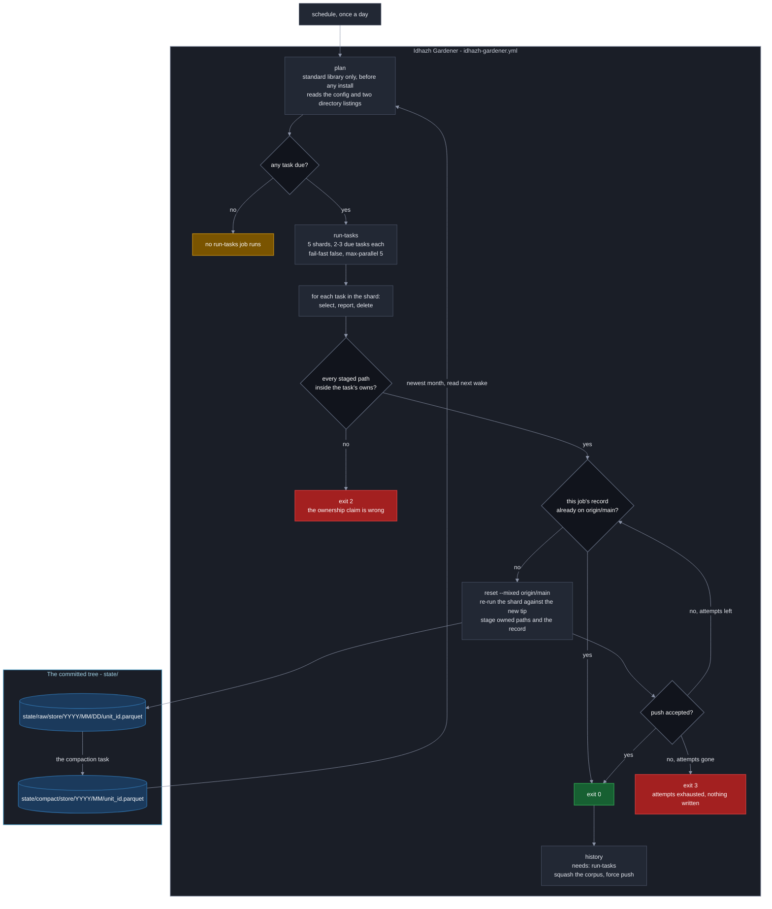

# Plan 50 - Idhazh Gardener: one utility tends every store

**Last Updated**: 2026-09-24

**Level**: 5 (CLAUDE.md section 6). It changes a persisted contract, the project's persistence format, and the one workflow that force-pushes `main`. The owner's rulings recorded in section 0 and in each row ARE the design consultation; the ESCALATE triggers name what still stops a worker.

**Chain** (CLAUDE.md section 0d). **Intent**: [docs/concepts/telemetry-intent.md](../docs/concepts/telemetry-intent.md) is the north star this plan serves; section 0's intent map says which of its eleven statements this plan delivers and which it only clears the way for. Locally: one utility tends every store; its config decides what happens and when; it runs the decision tree every day; nothing depends on anything else. **Contract**: section 5 below declares every persisted shape, path, key and exit code in full. **Code**: the seven rows.

Execute per docs/how-to/execute-a-plan.md: one owner carries the plan and delegates a row where delegation pays; keep parallel N = 1 - rows 3 to 7 all edit `backend/idhazh/gardener/tasks.py` and `config/idhazh_gardener.json`, so a wider pool buys merge conflicts rather than throughput; merge each pull request before dispatching the next; consult a persona only where two answers would lead to different code; AUTO-merge on green gates; honor the ESCALATE triggers in section 0. AUTHOR-AND-STOP until the user authorizes.

## 0. Operating contract

| Field | Value |
| --- | --- |
| Why this plan exists | Four programs delete things on four unrelated schedules, one `--dry-run` flag covers eleven independent decisions, every store writes its own format by hand, and two schedulers disagree about when a day is closed. This makes one utility with one verb per task, one config, one persistence door, one record and one safe way to commit. |
| Hard scope - in | - `backend/idhazh/store/` is the one door a payload takes to disk, parquet or JSON, with exactly one module importing the parquet engine.<br>- `state/raw/<store>/<shard>` is where a new writer files; `state/compact/<store>/<YYYY>/<MM>/settled.parquet` is what compaction leaves.<br>- `backend/idhazh/gardener/` holds the registry, the schedule, the record and the commit loop.<br>- All eleven passes in `backend/idhazh/stages/prune_state.py` become eleven tasks, each with its own window and its own `dry_run`.<br>- The corpus squash leaves inline shell for a tested Python module.<br>- `backend/utilities/prune_artifacts.py` gets a schedule for the first time.<br>- `.github/workflows/prune.yml` names no task: a standard-library `plan` job asks what is due, a sharded `run-tasks` job runs it, a `history` job rewrites the corpus last.<br>- `digest.yml`'s compaction step moves to the gardener, so one scheduler decides when a day is closed.<br>- One console panel reads parquet in the browser and is drawn in d3, so the charting plan starts from a house style instead of a blank page. |
| Hard scope - out | see the table below |
| ESCALATE triggers | 1. A task whose window would include today - stop; it can delete what a running job just wrote.<br>2. A second module importing the parquet engine - stop; the single-import rule is what makes it swappable and row 2's oracle enforces it.<br>3. Row 5's removal of the `pruned_date` alias - stop before the commit that removes it, not before the commit that adds it.<br>4. Any behaviour change to the tip-moved refusal in `backend/utilities/push_rewritten_history.py`, including its exit code.<br>5. Migrating an existing CSV tree to `state/raw/` or to parquet, **other than the two section 5.8 marks for row 2** - stop. Every other store moves in its own plan.<br>6. A measured figure that contradicts section 4 - stop and re-price rather than proceeding on the written number.<br>7. Any row that would add a tenth prerendered route, a charting library that is not d3, a new payload under `frontend/public/`, or a writer outside the two roots - stop. Each one moves a telemetry-intent statement further away, and no row needs it.<br>8. Row 8's question of how the browser reaches the bytes - stop. `state/` is not published today, N7 wants the console reading `state/` rather than a projection, and N8 wants no telemetry under `frontend/` in git. That is a Level 5 contract decision and row 8 does not settle it alone. |
| Chosen strategy | Register the two new roots, lay the persistence door, then move tasks in one PR per outcome, reader before writer, behaviour unchanged until the row that changes it. Ruled by Fowler (CLAUDE.md section 14). |
| Execution | autonomous orchestrator per docs/how-to/execute-a-plan.md. Parallel N = 1; rows 3-7 share `tasks.py` and the gardener config. |

### Hard scope - out

| What is out | What it costs to leave out | What would bring it in |
| --- | --- | --- |
| Migrating the rest of `state/` to `state/raw/` | Two layouts coexist: the gardener's own stores and the two row 2 takes sit under `state/raw/`, the rest stay where they are. Row 2 registers both roots so nothing reads them as strays. Section 5.8 lists what is left, with its producer and its consumer, so the later plan starts from a map rather than a survey | Its own plan. The owner's direction on 2026-09-24 is that `state/raw/` is where every writer lands **in future**; that is a rule for new writers, and moving committed data is a separate change with its own fixtures |
| Migrating the remaining CSV day trees to parquet | They stay CSV, and `backend/idhazh/day_shards.py` stays CSV-only and says so in one docstring line. Section 5.8 shows the write side is two functions and the read side is two more, so the later plan is bounded work rather than a store-by-store slog | Its own plan, now that the store door has two producers rather than none |
| The other nine console stores, and the other fifteen ECharts importers | One panel on `/console/machine` reads parquet and draws in d3; every other panel keeps its CSV reader and its ECharts option builder, and `echarts` stays installed. Two grammars coexist on one route until the charting plan closes it | The charting plan, which starts from row 8's house style rather than inventing one. **Row 8 exists to make that plan cheap, not to be it** |
| Switching the visuals deletion on | The published tree keeps SVGs no day page links to | Plan `20260905-13-switch-on-deletion-plan.md`, row titled "The fuse comes out, and one run is watched". Row 4 moves that row's subject from a CLI flag to `config/idhazh_gardener.json`'s `visual-prune.dry_run` |
| Evicting `corpus/corpus.jsonl` rows as a task | The row cap stays with the harvest | It is a count bound, not an age bound, and `corpus.roll()` at harvest time is its only reader |
| An `enabled` flag per task | A task is switched off with `dry_run`, which still reports | Nothing. Two off-switches means two places to look when a task did not run |
| A rollback for a deletion | A wrong deletion is recovered from git history | Nothing. `one_at_a_time.py` already refuses to carry one, on purpose |
| Applying this naming to what `digest.yml` commits | The one path pair that can still lose a race stays as it is: `corpus/corpus.jsonl` and `corpus/corpus.meta.json` have no merge driver, are in neither `paths.DERIVED` nor `paths.UNION_SAFE`, and carry no writer identity in their names - so where the rebase replay conflicts, `commit_and_push.py` cannot choose a side and the push fails | Its own plan. Everything else `digest.yml` commits is already safe - `state/` shards carry a per-writer name, nine collections take a union driver, and every path under `frontend/public/` is in `paths.DERIVED` and rebuilt against the tip before the rebase. **The published payloads can never take this naming**: a static site cannot list a directory, so something must answer at a known address, and moving the reader only moves that requirement up one level |

### The intent this plan serves

[docs/concepts/telemetry-intent.md](../docs/concepts/telemetry-intent.md) is the north star: eleven statements about what must be true of telemetry when the workstream is done. It sits above this plan (CLAUDE.md section 0d), so where the two disagree **this plan is what changes**. Not everything below ships here; this plan is a stepping stone and the map says which stones it lays.

| # | The intent, in short | What plan 50 does about it |
| --- | --- | --- |
| N1 | Parquet at rest, PyArrow writes it, CSV retired | **Stone laid.** Row 2 builds `backend/idhazh/store/` as the one door and takes two stores through it. Section 5.8 names every store still on CSV, its producer and its consumer |
| N2 | The browser parses the parquet itself | **Stone laid by row 8**, on one panel, with `hyparquet`. One module touches the reader, mirroring the backend's single-engine rule, so moving to `@duckdb/duckdb-wasm` when a surface wants SQL is that module's body and a dependency line |
| N3 | The browser fetches its own data at view time | **Stone laid by row 8**, on one panel. A prerendered page may hold a component that fetches after mount, which is what lets one panel prove this without moving a route |
| N4 | Prerendering is an anti-pattern; the prerendered routes come off it | **Not here.** Nine files under `frontend/src` carry `export const prerender` today, verified 2026-09-24, and row 8 leaves all nine |
| N5 | d3.js is the only charting library; ECharts is retired | **Stone laid by row 8.** `echarts@^5.6.0` is a direct dependency with sixteen importing files; `d3-array@3.2.4` and `d3-scale@4.0.2` are already installed, so d3 is present for scales and absent for rendering. Row 8 writes the d3 house style and moves one importer of the sixteen. Two of the sixteen, `waterfall.ts` and `donut.ts`, have no importer at all |
| N6 | One writer per path; bytes never change after the writer closes | **Stone laid.** Section 5.7 mints the name from the writer's identity, and row 2 retires a `merge=union` driver on each store it migrates |
| N7 | `state/` is the console's only source; no projection survives in `frontend/` | **Not here.** Nine payloads live under `frontend/public/` |
| N8 | `frontend/` holds UI code, not production artefacts | **Not here**, the same nine |
| N9 | A file is named `<uuid8>.parquet` | **Delivered** by section 5.7, for every file this plan writes |
| N10 | `state/` splits into `state/raw/` and `state/compact/` | **Delivered** by section 2 and section 5.4, as a refusal rather than a convention |
| N11 | One shard pattern for every tree, keyed on `covers_date` | **Delivered for what this plan writes**, mapped for the rest in section 5.8 |

**Five of the eleven are about the console, and row 8 takes one panel through four of them.** That is deliberate: the storage format settles first, then one panel proves the whole chain end to end - parquet at rest, parsed in the browser, fetched at view time, drawn in d3 - before any plan moves a route. Section 5.8 shows the console reads through four functions in one file, so the rest stays a single-file change however long it waits.

## 1. Status Reckoner

One row is one pull request. Fourteen rows were merged into seven because the merge cost is per pull request and six of the fourteen edited the same two files: splitting them bought fourteen merge cycles and six conflict chances, and bought the reviewer nothing.

| # | Row title | Depends-on | Parallel-group | Status | Worktree | PR | Subagent |
| --- | --- | --- | --- | --- | --- | --- | --- |
| 1 | The site-size instruments leave the prune module | - | A | PENDING | - | - | - |
| 2 | The payload store, the two roots, and two stores moved to parquet | - | A | PENDING | - | - | - |
| 3 | The gardener: registry, config, schedule, record, commit loop | 2 | B | PENDING | - | - | - |
| 4 | Eleven passes become eleven tasks | 1, 3 | C | PENDING | - | - | - |
| 5 | The corpus squash becomes Python | 3 | C | PENDING | - | - | - |
| 6 | `prune.yml` becomes `idhazh-gardener.yml`; the GitHub tasks get a schedule | 4, 5 | D | PENDING | - | - | - |
| 7 | The month compaction, and the diagram moves into the page | 6 | E | PENDING | - | - | - |
| 8 | One panel end to end: parquet at rest, parsed in the browser, drawn in d3 | 2 | B | PENDING | - | - | - |

Rows 1 and 2 are the only genuinely concurrent pair, and they still collide on `backend/tests/test_marks.py`. Everything from row 3 down is serial on `backend/idhazh/gardener/tasks.py` and `config/idhazh_gardener.json` - except row 8, which touches `frontend/` and one backend writer and shares no file with any of them. It is the one row that could run beside the others; whether to widen N past 1 for it is the owner's call at dispatch.

## 2. The layout this plan establishes

**This is telemetry-intent N10 and N11 made concrete, and it binds every writer added after this plan.** Everything under `state/` goes to one of two roots and nothing else: `state/raw/` for data as a writer left it, `state/compact/` for what a fold left behind. A third root is not a thing. The stores that sit directly under `state/` today predate the rule; row 2 moves two of them and section 5.8 maps the rest to their own plan (ESCALATE trigger 5). What this plan owes is that **nothing new is ever born outside the two roots**, and section 5.4 makes that a refusal rather than a convention.

```
state/raw/<store>/<YYYY>/<MM>/<DD>/<unit_id>.parquet
state/compact/<store>/<YYYY>/<MM>/<unit_id>.parquet
```

**There is one `state/` tree and there always was.** `raw` and `compact` are two directories inside it, not two trees and not a second checkout. "The two roots" in this plan always means those two directories; "the two stores" always means the two things row 2 migrates, `feed-retirements.csv` and `visual-prunes`.

Worked example - run 17482910337, first attempt, `run-tasks` shard 03, on 2026-09-24:

```
state/raw/gardener/2026/09/24/01a0d03c-2e00-8461-98e0-a67898e9a802.parquet
state/compact/gardener/2026/09/01a0d03c-6f10-8b22-91c4-3ea70d51bb9e.parquet
```

`<store>` is `gardener` or `visual-prune`; this plan creates no others. `<unit_id>` is section 5.7's identifier. Two writers cannot take one path because the identifier is a hash of the writer's identity.

**Every file under `state/` is sharded by date and written once. Nothing is overwritten and nothing sits flat at the root of a store.** That is not a convention, it is the whole model: a path with one writer cannot lose a push race, needs no merge driver, and makes "same path, different identity" a detectable defect. This plan adds no exception - section 5.3 says how the one question that seemed to need a mutable file is answered without one.

**Compaction is per store, at each store's own cadence.** Section 4 says why the grain is a month for the stores this plan creates.

## 3. The shape this plan builds

**This diagram is the plan's copy and it is expected to move.** It is drawn to the Mermaid contract in [docs/reference/documentation-structure.md](../docs/reference/documentation-structure.md) so it can be lifted unchanged; row 7 lifts it into the architecture page and this section becomes a link (Guardrail #4).



**`digest.yml` is not on the picture, and that is the point.** It runs five times a day and writes today; every gardener window is strictly in the past, so no task can touch what a running job just wrote. Section 5 turns that from an arrangement into a load-time refusal.

## 4. What was measured, 2026-09-24

Three readings drove a decision. Everything else was noise and is not kept. A figure that contradicts one of these is ESCALATE trigger 6.

**Parquet does not draw level with CSV until about 91 rows in a file.** The footer is a fixed cost of roughly 3,764 bytes and a row adds about 32. A gardener day holds fourteen rows at most. Two consequences, and neither is optional if the format is to cost less than the CSV it replaces: a job writes one file for all its tasks rather than one per task, and the fold is **month** grain, where a file holds about 420 rows and comes out roughly 3.3 times smaller than the same month as CSV. At day grain it is 4.2 times larger. Row 7 carries this.

**A constant column costs about 250 bytes flat, whatever the row count** - a page header, a dictionary page and statistics. That is what decides section 5.7's column-or-footer split: a column earns its 250 bytes only when a query filters on it, because row-group statistics then let a reader skip the whole file.

**pyarrow is the largest thing the gardener installs, so only the gardener installs it.** It is an optional extra, not a runtime dependency: `pip install -e .` appears at 18 call sites across 9 workflow files and `digest.yml` alone runs it 30 times a day. The installed size is re-taken on `ubuntu-latest` in row 2 before any sentence quotes it - the reading in hand is from Windows and the two platforms bundle different shared objects.

**Zero published bytes, in this plan only.** Neither store row 2 migrates is drawn by the console, so nothing here reaches a reader's browser. This is not a standing property of the project: telemetry-intent N3 has the browser fetching its own data at view time, so the plan that moves a console store pays a real download and prices it then.

## 5. The contracts

**A worker implements these and invents nothing.** Everything here is declared before any logic reads or writes it (Guardrail #3).

### 5.1 `CollectionPruneRow`, widened - there is no new record contract

`backend/idhazh/contracts/collection_prune.py`, stem `collection-prune-row`. Eight of the fields already exist with these meanings; nothing persists the shape today, so the widening owes a `version` stamp and one `changelog` line and no migration. Minting a second near-twin contract would be two shapes for one question (Guardrail #4).

| Field | Type | Meaning |
| --- | --- | --- |
| `version` | `DateStamp`, inherited from `Contract` | The shape's own date stamp |
| `date` | `DateStamp` | The day the pass ran |
| `task` | `Slug` | **Renamed from `collection`.** The task's name - the config key, the `--task` value and the registry entry. It named a GitHub collection when only two tasks wrote this row; every task writes it now, so the column is `task` and the rename ships with a `version` stamp and one `changelog` line |
| `run_id` | `str`, `RUN_ID_PATTERN` | **new.** The execution that produced the row, so a reader finds the job log after the path is gone |
| `attempt` | `int`, `ge=1` | **new.** The GitHub run attempt; says whether a retry happened |
| `job` | `ServerJob` | **new.** `run-tasks` or `history` |
| `shard` | `int`, `ge=0` | **new.** The matrix index, so a row maps to one job log when three tasks share a job |
| `cadence_unit` | `CadenceUnit` - `days` or `months` | **new.** The schedule the run believed it was on |
| `cadence_value` | `int`, `ge=1` | **new.** With `cadence_unit`, how often the task is meant to run |
| `since` | `DateStamp \| None` | Oldest day a member may carry and still qualify. Empty means no lower end |
| `until` | `DateStamp \| None` | Newest day a member may carry and still qualify, inclusive. Empty means no upper end |
| `max_deletes_per_run` | `int \| None`, `ge=0` | **widened to optional.** `null` is no ceiling; `0` keeps its meaning of a survey that reports the first qualifying member and takes nothing |
| `dry_run` | `bool` | True when the pass only reported. `selected` and `deleted` still say what it would have taken |
| `candidates_seen` | `int`, `ge=0` | Members the listing yielded before the pass stopped. Never the size of the collection |
| `selected` | `int`, `ge=0` | Of those, how many the window held |
| `deleted` | `int`, `ge=0` | How many it removed, or would have. A fold's written bytes are not netted against this |
| `bytes_freed` | `int`, `ge=0` | What those deletes freed, or would. `0` is honest where a member has no readable size |
| `stopped_because` | `StopReason` - `exhausted`, `ceiling` or `failed` | Why the pass ended. `failed` is how one task's failure reaches the record without taking its shard siblings down |
| `resume_from` | `MemberId \| None` | Where the next pass begins. Empty exactly when `stopped_because` is `exhausted` |
| `duration_ms` | `int`, `ge=0` | **new.** Wall clock for this task alone, never the job |

Cross-field validators, existing ones kept and one amended: `selected <= candidates_seen`; `deleted <= selected`; `deleted <= max_deletes_per_run` when it is neither null nor 0; `(stopped_because is exhausted) == (resume_from is None)`; `since <= until` when both are set.

### 5.2 `config/idhazh_gardener.json`

`GardenerConfig` in `backend/idhazh/contracts/knobs/gardener.py`.

**Hard constraint: dueness must be decidable from this file with `json`, `datetime` and `pathlib` alone**, because the `plan` job runs before any `pip install` - the discipline `backend/utilities/prune_due.py` already keeps and states.

```json
{
  "version": "2026-09-24",
  "attempts": 5,
  "shards": 5,
  "tasks": {
    "seen": {
      "cadence": { "unit": "days", "value": 1 },
      "window":  { "unit": "days", "value": 90 },
      "dry_run": false,
      "max_deletes_per_run": null,
      "owns": ["state/seen"]
    },
    "trials": {
      "cadence": { "unit": "days", "value": 1 },
      "window":  { "unit": "days", "value": 90 },
      "dry_run": false,
      "max_deletes_per_run": null,
      "owns_everything_else_under": ["state"]
    }
  }
}
```

| Key | Type | Meaning |
| --- | --- | --- |
| `version` | `DateStamp` | The config shape's date stamp |
| `attempts` | `int`, `ge=1` | How many times the commit loop re-fetches, recomputes and pushes before exit 3 |
| `shards` | `int`, `ge=1` | How many `run-tasks` jobs the `plan` job splits the due list into. A workflow test asserts `idhazh-gardener.yml`'s `max-parallel` is not below it |
| `tasks` | object keyed by task name (`Slug`) | One block per task. The registry and this object are a bijection, asserted both ways |
| `tasks.<name>.state` | `active`, `paused` or `retired`. **Required, no default** | The task's place in the garden. `active` runs when due. `paused` is registered and configured but never scheduled - different from `dry_run`, which runs and reports. `retired` means the module is gone but the block stays, so a reader of a committed record can still see the policy that produced it; deleting the block instead would orphan every record naming the task |
| `tasks.<name>.cadence` | `{unit: days\|months, value: int ge=1}` | Discriminated on `unit`. How often the task should run. `count` is not a member: the only count-bounded store is `corpus/corpus.jsonl` and `corpus.roll()` owns it at harvest time |
| `tasks.<name>.window` | the same union | What the task keeps. Two units so a store counted in months keeps a month window |
| `tasks.<name>.dry_run` | `bool`, **required, no default** | Run and report, change nothing |
| `tasks.<name>.max_deletes_per_run` | `int \| null`, `ge=0` | `null` no ceiling, `0` survey. Same meaning as the record column |
| `tasks.<name>.owns` | list of POSIX path prefixes, repository-relative | Every path this task may delete under. One declaration yields four things: the disjointness proof, the sparse-checkout cone, the permitted delete set and the staging list |
| `tasks.<name>.owns_everything_else_under` | list of POSIX path prefixes | The complement form, for the `trials` task only. The set is `under` minus every other task's `owns` minus the registered store names |

**Load-time refusals, each naming the offender:** an `active` or `paused` task in config with no registry entry, or a registry entry with no block; a `retired` task that still has a registry entry; a window that would include today; two tasks whose owned sets intersect or where one is a prefix of the other; more than one task using the complement form; `gardener.tasks.seen.window.value` shorter than `collect.seen_window_days`.

**Adding a task is a module and a block. Pausing one is a word. Retiring one is a word and a deletion.** The gardener is expected to carry a list that grows and occasionally shrinks, so the three states are in the contract from the first commit rather than bolted on when the first task needs retiring.

**Two knobs do not move into this file**: `collect.seen_window_days` and `lens_weights.window_days`. Both are read by the pipeline to produce a day, not only by a prune, and moving them would make the planner load the retention config. The cross-file refusal above is what keeps the two in step.

### 5.3 How dueness is known, without a mutable file

**There is no stamp store.** An earlier draft gave each task a small JSON file it overwrote on every run. That file was not sharded, it was not written once, and it sat flat at the root of a store - three violations of the rule in section 2, in the one place the rule was least affordable to break, because a path five jobs rewrite is exactly the lost-push-race the whole design exists to remove.

The question it answered splits three ways, and every answer reads a file that already exists.

| Task kind | Which tasks | How the `plan` job knows, with the standard library only |
| --- | --- | --- |
| **Windowed** | The eleven retention tasks, and both GitHub collection tasks | It does not need to know. They run **every day** - `cadence` is `days: 1` - and the window decides what qualifies. A day on which nothing is old enough is a listing that finds nothing and a record that says `deleted: 0`. No last-run state exists because none is needed |
| **Compaction** | `compact-gardener`, `compact-visual-prune` | The newest path under `state/compact/<store>/`: list the store for years and take the greatest, list that for months and take the greatest. **Two directory listings, no file opened, no parsing** - and constant cost whatever the archive holds, because it never descends past the newest |
| **History** | `squash-history` | `corpus/corpus.meta.json:last_run`, which the corpus already owns and which `backend/utilities/prune_due.py` already reads this way today |

**Why running the windowed tasks daily is the cheaper answer, not the lazier one.** A cadence for a windowed task is a second control over the same thing the window already controls, and two controls over one behaviour is how a store quietly stops being pruned when somebody widens one and forgets the other. Daily is also what makes a missed day cost a day: a task that failed or lost its push simply runs again at the next wake with no state to reconcile.

**The two that genuinely must not run daily say so in their cadence**, and it is load-bearing: `squash-history` force-pushes and rewrites history, and a compaction rewriting a month file every day would churn git for nothing.

### 5.4 The paths, and the refusal that keeps the two roots true

`backend/idhazh/store/paths.py` is the only module that builds these: `raw_path(store, date, unit_id)`, `compact_path(store, month, unit_id)`, and `newest_month(store)` for the compaction's dueness. Grammar in section 2. `.gitattributes` gains `*.parquet binary -merge` - no end-of-line conversion, no diff, no union driver.

**The door refuses a path whose second segment is neither `raw` nor `compact`, by name, at build time.** Not a lint, not a review habit - a `ValueError` naming the offending path and the rule. A test proves the refusal fires.

This needs no allow-list and no register of exceptions. The stores section 5.8 leaves on CSV do not call this door; they build paths through `ledger.day_shard_path`, which is untouched. A store migrates by moving to the door, and inherits the rule the moment it does. When the last one has moved, `ledger.day_shard_path` is deleted and the rule is the only way to build a state path.

`state/raw` and `state/compact` are subtracted from the trial-roots computation in the same commit that creates them. Without that, `retention._trial_roots` reads them as unknown directories and the gardener deletes its own records.

### 5.5 The task registry

`backend/idhazh/gardener/tasks.py` - a frozen tuple, a closed set, no dynamic import. The registry holds a name and a callable and nothing else, because config decides what happens and when.

```python
@dataclass(frozen=True, slots=True)
class Task:
    """One verb. Everything else about it is config."""

    name: Slug                          # equals the config key and the --task value
    run: Callable[[TaskContext], Pass]


@dataclass(frozen=True, slots=True)
class TaskContext:
    state_dir: Path
    repo_root: Path
    today: date
    policy: TaskPolicy                  # this task's validated config block
    run_id: str
    attempt: int
    job: ServerJob
    shard: int
```

`run` returns the `Pass` that `backend/idhazh/gardener/one_at_a_time.py` defines - moved there from `backend/idhazh/prune/` in row 3, because a module answering "how do I delete a collection's members one at a time" is the gardener's core and not a neighbour's - and `backend/idhazh/gardener/report.py` turns a `Pass` into the record row, filling the six new identity and cadence columns from the `TaskContext`.

**The invariant the runner asserts on every task before staging: the delete set is a subset of the read set, and every deleted path sits under that task's `owns`.** A violation is exit 2. This is what stops the telemetry fold deleting a derived path its own producer rebuilds.

### 5.6 The checkout, the commit loop and the exit codes

**The checkout is partial and sparse, and that is what keeps the job's cost flat as the repository grows** (Guardrail #12). A `run-tasks` runner never downloads historical parquet:

```yaml
- uses: actions/checkout@v6
  with:
    fetch-depth: 1
    filter: blob:none
    sparse-checkout: |
      config
      backend
      .github
```

`filter: blob:none` omits file contents until git needs one; `sparse-checkout` keeps the rest out of the working tree. The shard's owned paths are deliberately **outside** the cone, which is why every stage below passes `--sparse` - git supports adding a path outside the cone only when asked explicitly.

**Clone and fetch are not two ways to do this, and neither is written by hand.** `git clone` creates the repository; `git fetch` updates one that already exists, so a job that has checked nothing out has nothing to fetch into. The job needs both, at different moments - the clone once at the top, a fetch on each turn of the commit loop below - and that is exactly the shape above plus `git fetch origin main --depth=1` inside `publish`. The clone is not spelled out because `actions/checkout@v6` already does it and is the only step that writes the credential header the later `git push` needs; all thirty-eight checkout steps in this repository use it, and a hand-rolled `git clone` beside it buys a second clone or a push with no token. The action takes the same three switches as inputs, which is what makes the house pattern and the cost rule agree.

```python
def publish(shard: Shard, message: str, *, attempts: int) -> int:
    """Land the files this job already produced. The work is not done again."""
    for _ in range(attempts):
        git("fetch", "origin", "main", "--depth=1")

        if exists_on_remote(shard.record_path):
            if remote_blob(shard.record_path) == local_blob(shard.record_path):
                return EXIT_OK                          # an earlier push won
            return EXIT_INTEGRITY                       # two writers, one path

        git("reset", "--mixed", "origin/main")          # index moves, working tree does not
        for path in shard.owned_paths | {shard.record_path}:
            git("add", "--sparse", "--", path)          # outside the cone, so --sparse
        git("commit", "-m", message)

        if git_ok("push", "origin", "HEAD:refs/heads/main"):
            return EXIT_OK
    return EXIT_PUSH_KEPT_LOSING
```

**The work happens once, before the loop. The loop only stages and pushes.** That is what keeps a job's cost flat however many times it loses a race, and it is why nothing here has to be recomputed against the new tip: every path this job touches is one the registry proves no other task owns, so a moved tip cannot have changed them.

**Same path and same bytes is a successful retry. Same path and different bytes is a data-integrity error.** The invariant holds as written, with no second tier, because **the file is written once and its name is minted once**. A retry re-stages the same bytes; it does not re-produce them. Two different contents at one path would mean two writers minted one identifier, which the identifier's construction (section 5.7) makes impossible - so exit 2 is an assertion that should never fire, which is exactly what it is for.

**Every task is one kind: add its record, always; then delete its selected paths, possibly none, in one commit.** Three writer kinds were three ways to get this wrong - the worst being that a dry run selects nothing, so a "nothing left to delete" verdict would report success and publish no record at all.

| Code | Meaning | Retryable |
| --- | --- | --- |
| 0 | Every task in this job landed, or was already landed | - |
| 1 | A task failed. Its row carries `stopped_because: failed` and `resume_from`; its shard siblings still ran and still have rows | Yes, next wake |
| 2 | Either this job staged a path outside the declared `owns` of the task that produced it, or one record path holds two identities. The registry's ownership claim is wrong | **No** |
| 3 | The push kept losing after `attempts`. Nothing landed, so a windowed task simply runs again at the next wake and a periodic one is still due | Yes, next wake |

**Why reset-and-reapply rather than rebase, stated once.** The writer has exactly one local change - the files it just produced - so there is nothing to merge. Reset to the new tip, re-add the same artefacts, commit, push. **The amount of local work does not grow with the size of the repository**: no historical parquet is downloaded, nothing accumulated is rebased, no other directory is reconciled by hand. A rebase would also carry a real hazard: a deletion rebased onto an append to the same union-merged file keeps both sides and the deleted rows come back at exit zero.

`git reset --hard` stays banned (CLAUDE.md section 8); `--mixed` is not on that list and is what keeps the working tree while the index moves. `--force-with-lease` is not used - a lease names the commit a rejection has just made stale.

### 5.7 The unit identifier, and the envelope inside the file

**North star, and it binds every store added after this plan. A filename carries identity, never meaning. Everything a reader needs to know about a file is inside the file.** A filename that is parsed is an undeclared, unversioned, unvalidated schema, and renaming a file becomes a breaking change. With the envelope inside, a file can be renamed, moved or re-partitioned and every reader still knows what it holds - which is the thing a filename cannot survive when one query opens a hundred files at once.

This plan applies the rule to the stores it creates and to the two row 2 migrates. The trees section 5.8 leaves behind keep their parsed names until they migrate, because `ledger.SEGMENT_NAME` is a compiled pattern that `idhazh.paths` uses to answer whether a committed path has exactly one writer, and retiring that is the migration plan's work, not this one's.

#### The identifier

`backend/idhazh/store/naming.py`. A version-8 UUID: a 48-bit millisecond clock, then 74 bits derived from the writer's identity.

```python
NAMESPACE = uuid.uuid5(uuid.NAMESPACE_URL, "github.com/miztiik/yen-idhazh")

def unit_id(*, dataset: str, run_id: str, attempt: int, job: str, shard: int) -> uuid.UUID:
    """The name of one file. Minted once, when the file is written, and then kept."""
    seed = f"{NAMESPACE}|{dataset}|{run_id}|{attempt}|{job}|{shard}".encode()
    digest = hashlib.sha256(seed).digest()
    return _pack_v8(
        time.time_ns() // 1_000_000 & 0xFFFFFFFFFFFF,   # the clock, at this instant
        int.from_bytes(digest[0:2], "big") & 0xFFF,
        int.from_bytes(digest[2:10], "big") & ((1 << 62) - 1),
    )
```

Measured 2026-09-24 against `uuid.uuid8`: version 8, variant RFC 4122, files written in the same millisecond share the 13-character clock prefix, and sort order equals time order across milliseconds.

| # | Decision | Why |
| --- | --- | --- |
| 1 | **The name is minted once, when the file is written, and held in a variable.** A retry re-stages that same path; it never mints a second one | The caller keeps the file and the name across push attempts, exactly as the checkout recipe in section 5.6 does. Nothing has to recompute a name, so nothing has to be reproducible |
| 2 | The clock is the write instant | It makes the name sort by time, which is what a listing and any later object store both want |
| 3 | The other 74 bits are a hash of `dataset`, `run_id`, `attempt`, `job` and `shard` | Two writers in one millisecond cannot collide, because no two writers share all five. `attempt` is in there because GitHub keeps `run_id` stable across a re-run |
| 4 | `_pack_v8` is hand-written, about ten lines | `uuid.uuid8` arrived in Python 3.14 and `requires-python` is `>=3.12`. The RFC 9562 layout is fixed, so packing it ourselves costs less than raising the floor |
| 5 | Within one millisecond the order is arbitrary | The bits after the clock are a hash. Ordering is a property across time, not within an instant. Said plainly because a group of files from one run looks ordered and is not |
| 6 | What it costs: a person reading a git diff no longer sees the run, attempt, job and shard in the filename | The path still carries `<store>/<YYYY>/<MM>/<DD>`, the commit message names the run, and the envelope inside the file carries all four. A reader who needs more opens the file |

#### The envelope

Parquet file-level key-value metadata, written by `backend/idhazh/store/parquet.py`, declared as `FileEnvelope` in `backend/idhazh/contracts/file_envelope.py`. Parquet metadata is bytes to bytes, so every value is a UTF-8 string and any structure is JSON inside one.

**What goes in a column and what goes in the footer, with the measurement that decides it.** A constant column costs about **250 bytes flat, whatever the row count** - a page header, a dictionary page and statistics. Six identity columns are about 1,500 bytes: 30 percent of a 3-row raw file, 4.5 percent of a 420-row month file. The envelope costs about **1,920 bytes for 612 bytes of JSON**, because pyarrow stores schema metadata twice, once as parquet key-value and once base64-encoded inside `ARROW:schema`. `store_schema=False` saves 3,244 bytes and **deletes the envelope entirely**, so it cannot be used.

So the rule: **a field is a column when a query filters or groups on it**, because row-group statistics then let a reader skip a whole file without decompressing anything - measured, a constant column carries `min == max` and that is what a skip reads. **Everything else is footer only**, where it is provenance a person reads after the fact and costs nothing per row.

| # | Key | Value | Also a column? |
| --- | --- | --- | --- |
| 1 | `envelope_version` | `YYYY-MM-DD`. The envelope's own stamp, distinct from the row schema's, so the envelope can evolve | no |
| 2 | `schema_version` | `YYYY-MM-DD` of the row contract (CLAUDE.md section 11) | yes, as `version` - a reader selects rows of one shape |
| 3 | `tier` | `raw` or `compact`. A folded file says it is one | no - the path already says it, and this is the copy that survives a move |
| 4 | `dataset` | Which ledger: `gardener`, `visual-prune`, `item-health` | yes - the commonest filter |
| 5 | `covers_date` | The day the rows describe, **not** the day they were written | yes, as `date` - every time filter uses it |
| 6 | `partition` | The `state/raw/<store>/<YYYY>/<MM>/<DD>` it was written under, so a moved file still knows where it came from | no |
| 7 | `written_at_ms` | Arrival time, epoch milliseconds. **This is the clock that is in the name** | no - never filtered, and as a column it is 250 bytes for one value |
| 8 | `run_id`, `attempt`, `job`, `shard` | Which writer produced it | yes, all four - tracing a bad run is a filter on `run_id` |
| 9 | `unit_id` | The identifier in the filename. Deduplication is `GROUP BY unit_id`, never a filename convention | yes - you cannot group by a footer key |
| 10 | `content_sha256` | Over the row bytes. Tells two files apart after a rename and proves a copy is a copy | no |
| 11 | `git_sha` | The commit the producing run checked out. The one field tying a data file to the code that made it | no |
| 12 | `writer` | `idhazh.store.parquet`. The parquet footer's own `created_by` names pyarrow, not us | no |
| 13 | `writer_version` | The engine version, because a footer is not byte-stable across engine versions | no |
| 14 | `compression` | `snappy` or `zstd` | no |
| 15 | `name_strategy` | `uuid8-unit` today. It exists so a later strategy can arrive without a reader guessing which one made a name | no |
| 16 | `folded_from` | On a `compact` file only: how many raw files it read. Absent on a raw file | no |

**`row_count` is deliberately not a key.** The parquet footer already carries `num_rows`, free and authoritative, and the footer is written last so its presence already proves the file is complete. A second spelling is two answers to one question (Guardrail #4).

A worked envelope, and what it costs:

```python
{
  "envelope_version": "2026-09-24", "schema_version": "2026-09-24", "tier": "raw",
  "dataset": "gardener", "covers_date": "2026-09-24",
  "partition": "state/raw/gardener/2026/09/24",
  "written_at_ms": "1790200000431",
  "run_id": "17482910337", "attempt": "1", "job": "run-tasks", "shard": "03",
  "unit_id": "01a0d03c-2e00-8461-98e0-a67898e9a802",
  "content_sha256": "9f2c...", "git_sha": "0735031c2...",
  "writer": "idhazh.store.parquet", "writer_version": "25.0.1",
  "compression": "snappy", "name_strategy": "uuid8-unit",
}
```

Read back without touching a row: `pq.read_metadata(path).metadata[b"unit_id"]`, and `pq.read_metadata(path).num_rows`. Verified to round-trip intact, 2026-09-24.

**The oracle for this, in row 2:** every file the door writes carries a complete envelope, the envelope round-trips byte-identically, `unit_id` in the envelope equals the filename stem, and `unit_id` recomputed from the envelope's own identity fields equals both. That last clause is what makes the name checkable rather than merely unique.

### 5.8 Every store, its producer, its consumer, and what moves it

**The CSV-to-parquet migration of all of `state/` is bounded by four functions, not by twenty-nine stores.** That is why this section exists: it is the finding that makes telemetry-intent N1 and N11 affordable, and it is what a later plan starts from instead of re-deriving.

| Side | The chokepoint | What goes through it |
| --- | --- | --- |
| Write | `ledger.write_segment` and `extend_segment`, keyed by the `SegmentLedger` enum | Nine day-sharded stores: `item-health`, `host-fingerprint`, `span-rollup`, `scores`, `score-index`, `validation`, `feed-health`, `counterfactual-scores`, `day-validations` |
| Write | `ledger.extend_ledger_file` | Seven append-and-union stores: `feed-retirements.csv`, `visual-prunes`, `scored-pairs`, `fitted-thresholds`, `llm-council/shard-outcomes`, judge `metrics`, `merge-line-holdout-scores` |
| Read, backend | `backend/idhazh/day_shards.py` | Every day-sharded store the backend folds or settles |
| Read, console | `readCsv`, `readDayShards`, `dayShardFiles`, `settledDayShards` - all four exported from `frontend/src/lib/server/payload.ts` | Every store the console draws |

`backend/idhazh/store/` is the fifth door, and it is the one the other four eventually forward to. **That is what makes row 2 the load-bearing row of this plan**: it is not a utility the gardener happens to need, it is the door the other sixteen writers walk through later.

**The stores, producer and consumer verified by call site on 2026-09-24.** A store with a console route is a store whose migration waits on N2.

| Store under `state/` | Producer | Consumer | Console route | Moved by |
| --- | --- | --- | --- | --- |
| `feed-retirements.csv` | `stages/plan.py`, `stages/assemble.py` | those two, plus `telemetry/publish/source_health.py` | - | **Row 2** |
| `visual-prunes` | `stages/prune_state.py` | backend only | - | **Row 2** |
| `raw/gardener` | `gardener/report.py` | the gardener's own dueness check | - | **Row 3**, born parquet |
| `seen` | `stages/plan.py` | `stages/plan.py`, `discover.py` | - | a later plan |
| `published` | `stages/assemble.py` | `day_shards.py`, `month_partition.py` | - | a later plan |
| `digest-fragments` | `stages/assemble.py` | `assemble.py` | - | a later plan |
| `traces` | `telemetry/traces.py` | `telemetry/rollup.py` | - | a later plan |
| `counterfactual-scores` | `stages/plan.py` | backend only | - | a later plan |
| `score-index` | `evals/writer.py` | `evals/writer.py`, `stages/rebuild_score_index.py` | - | a later plan |
| `day-validations` | `stages/validate_days.py` | `retention.py` | - | a later plan |
| `validation` | `stages/decide.py`, `stages/qualify_decide.py` | backend only | - | a later plan |
| `llm-council/shard-outcomes` | `council/session.py` | backend only | - | a later plan |
| `content-similarity-judge/scored-pairs` | `stages/count_verdicts.py` | `similarity/counting.py` | - | a later plan |
| `content-similarity-judge/metrics` | `stages/count_verdicts.py` | backend only | - | a later plan |
| `pipeline-tests/**` | the pipeline-test workflow | backend only | - | a later plan |
| `content-similarity-judge/fitted-thresholds` | `stages/set_merge_line.py` | `lib/server/similarity-ledger.ts` | `/console/judgement` | a console plan |
| `content-similarity-judge/merge-line-holdout-scores` | `stages/score_merge_line_holdout.py` | `lib/server/similarity-holdout.ts` | `/console/judgement` | a console plan |
| `content-similarity-judge/score-distribution.json` | `stages/count_verdicts.py` | `lib/server/similarity-ledger.ts` | `/console/judgement` | a console plan |
| `content-similarity-judge/holdout-pairs.csv` | hand-labelled, read by `similarity/holdout.py` | `lib/server/similarity-holdout.ts` | `/console/judgement` | a console plan |
| `span-rollup` | `stages/work.py` | `lib/server/span-rollup.ts`, `run-timeline.ts` | `/console` | a console plan |
| `host-fingerprint` | `telemetry/silicon.py` | `lib/server/host-fingerprint.ts`, `machine-counters.ts` | `/console/machine` | a console plan |
| `day-metrics` | `stages/assemble.py` | `lib/server/payload.ts`, `model-work.ts` | `/console/model` | a console plan |
| `feed-health` | `stages/plan.py` | `lib/server/payload.ts`, `lib/feed-health.ts` | `/console/voices` | a console plan |
| `item-health` | `stages/assemble.py`, `stages/record.py` | `lib/server/payload.ts`, `machine-counters.ts` | four routes | a console plan |
| `scores` | `evals/writer.py` | `lib/server/payload.ts` | `/console/model` | a console plan |

**What `state/` weighs today, so no later plan re-measures it.** Twenty-nine leaf stores, 704 files, 51 MiB. Three of them hold two thirds: `traces` 11.6 MiB, `seen` 11.5 MiB, `scores` 10.5 MiB. The two row 2 takes are 11 KB and 0.1 KB together - deliberately, because row 2 proves a door rather than moves a corpus.

---

### Row #1 - The site-size instruments leave the prune module

- **Scope:** `backend/idhazh/retention.py` is 1,880 lines answering two questions; the half that measures the published site and deletes nothing moves to its own module, unchanged.
- **Files touched:**
  - `backend/idhazh/retention.py` (the site-size half leaves)
  - `backend/idhazh/site_weight.py` (new: `SiteSize`, `measure`, `count_published_items`, `heaviest_directories`, `over_budget`, `over_cap`, `headroom_mb`, `daily_growth_bytes`, `days_to_alarm`, `days_to_cap`, `budget_alarm`, `cap_breach`, `PAGES_HARD_CAP_MB`)
  - `backend/idhazh/cli.py` (the `site-weight` verb)
  - every caller the move breaks, found by `git grep -n 'retention\.\(SiteSize\|measure\|count_published_items\|heaviest_directories\|over_budget\|over_cap\|headroom_mb\|daily_growth_bytes\|days_to_alarm\|days_to_cap\|budget_alarm\|cap_breach\|PAGES_HARD_CAP_MB\)'`
  - `backend/tests/` (the covering module moves with them), `backend/tests/test_marks.py`
  - `docs/architecture/publishing/console-site-size.md`, `docs/architecture/publishing/retention.md`
- **Acceptance gates:** local `ruff check .` from the repository root, `mypy backend`, `pytest backend/tests -k "site_weight or site_size or retention"`. CI runs the full suite.
- **Oracle:** the moved function bodies are byte-identical - every line of the site half appears in the new file unchanged and `retention.py` loses exactly those lines. It cannot settle whether the seam is right; only that nothing changed while it moved.
- **Decisions:**

  | # | Decision | Authority |
  | --- | --- | --- |
  | 1 | Ships first and alone, because row 4 deletes from `retention.py` and a pure move underneath a semantic change is a merge nobody can review | Fowler |
  | 2 | Named for what it produces, matching the `idhazh site-weight` verb that prints it | CLAUDE.md section 1a |
  | 3 | No behaviour changes. Not a rename, not a signature, not a default | execute-a-plan.md |

- **Rejected alternatives:**

  | # | Option | Why rejected | What it would cost to take | Authority |
  | --- | --- | --- | --- | --- |
  | 1 | Leave `retention.py` whole | It keeps answering two questions, and every gardener row then edits the same 1,880-line file as every site-size row | Zero now; the cost lands as a conflict on every later row | CLAUDE.md section 1a |
  | 2 | Move the site half under `backend/idhazh/gardener/` | The gardener deletes; this half measures. It would make the package's first sentence false | Zero; costs the package a second question | Fowler |

---

### Row #2 - The payload store, the two roots, and two stores moved to parquet

- **Scope:** one call persists any contract payload as parquet or JSON; exactly one module imports the parquet engine; `state/raw/` and `state/compact/` exist and are registered; and **two** existing stores move end to end to parquet, producer and consumer, to prove the chain.

**`state/raw/` and `state/compact/` are pruned like everything else.** Each store inside them gets its own retention task with its own window and cadence - row 7 carries the two this plan creates. What this row registers them against is narrower: the `trials` task sweeps any directory under `state/` that no task claims, and without the registration it would read the two roots as strays and delete the gardener's own records. "Registered" means "not a stray", never "not pruned".

**The chain proof: two stores become parquet in this row, both ends.** Together they are 11 KB, which is the point - this row proves a door, it does not move a corpus (section 5.8).

`state/feed-retirements.csv` **proves the reader and the union retirement.** Two writers reach it - `stages/plan.py` retires an address that answered `410 Gone` on five separate runs, `stages/assemble.py` retires one that kept answering and stopped being worth reading - and each reaches `ledger.append_retirements` with its own rows and its own warning line. Three readers, those two plus `telemetry/publish/source_health.py`, all through `ledger.load_retirements`. Eight columns, three test files, no fixtures, one committed file of about 500 bytes, no console reader.

**The two writers collapse into one, and both stages call it.** Owner direction, 2026-09-24. `telemetry/source_health.py` grows `file_retirements(state, rows, identity)`: it drops what is already retired, persists through the row 2 door, and writes the one warning line. `ledger.append_retirements` goes. **The two stages keep their two causes** - `410 Gone` and low yield are different evidence about different failures, and merging them would lose why an address went - but neither owns the write any more. One module decides how a retirement is filed; two modules decide when one is deserved.

`state/visual-prunes/` **proves the layout, and it is in scope by owner direction, 2026-09-24.** Row 4 turns its pass into a gardener task; leaving the format for a later plan would mean the gardener's record and the gardener's own pass disagreed about how a store is written, in the same release. One writer (`stages/prune_state.py`), fifteen columns, eighteen committed files of 11 KB, no reader outside the backend. It moves from a flat `state/visual-prunes/<YYYY>/<MM>/<DD>.csv` that every run appends to, onto `state/raw/visual-prune/<YYYY>/<MM>/<DD>/<unit_id>.parquet`, one file per writer.

Both retire a `merge=union` driver and a `paths.UNION_SAFE` entry, which is part of the proof rather than a surprise: a per-writer parquet file has nothing for a union to settle.
- **Files touched:**
  - `backend/idhazh/store/__init__.py`, `persist.py`, `parquet.py` (**the only module that imports pyarrow**), `json_lines.py`, `arrow_schema.py`, `paths.py`, `naming.py`

**The one door every producer reuses, now and later:**

```python
def persist(
    rows: Sequence[Contract], *, dataset: str, covers_date: str,
    identity: WriterIdentity, tier: Tier = Tier.RAW, fmt: Format | None = None,
) -> Path:
    """Write these rows and return where they went. The caller names no path and no file."""
```

It mints the name from `naming.unit_id` (section 5.7), builds the path through `paths.raw_path` or `paths.compact_path`, assembles the envelope, writes through a temp file and renames. **A producer never builds a path, never invents a filename and never assembles an envelope** - which is what makes the next producer's migration a change of call site rather than a change of design.
  - `backend/idhazh/contracts/knobs/store.py` (`StoreConfig`: `format`, `compression`), `config/idhazh.json` (a `store` block, `parquet` and `snappy`)
  - `backend/idhazh/contracts/feed_retirement.py` and `visual_prune.py` (`version` stamp and one `changelog` line each for the store move)
  - `backend/idhazh/ledger.py` and `backend/idhazh/retention.py` (register `state/raw` and `state/compact` in the trial-roots subtraction; register `DAY_VALIDATIONS_DIRNAME`, absent today; `append_retirements` and `append_visual_prunes` forward to the door and their `extend_ledger_file` paths go)
  - `backend/idhazh/paths.py` (the `state/feed-retirements.csv` and `state/visual-prunes` union entries go), `.gitattributes` (the same two lines go, and `*.parquet binary -merge` arrives)
  - `backend/idhazh/day_shards.py` (one docstring line: this reader is CSV-only and parquet goes through `store/`)
  - `pyproject.toml` (`[project.optional-dependencies] parquet = ["pyarrow>=21"]`, and `dev` depends on it)
  - `.gitattributes` (`*.parquet binary -merge`)
  - `schemas/` (regenerated by `python -m idhazh.contracts.export`)
  - `backend/tests/store/test_persist.py`, `test_arrow_schema.py`, `test_single_engine_import.py`, `test_trial_roots.py`; `tests/fixtures/parquet/`; `backend/tests/test_marks.py`
  - `docs/architecture/contracts/persistence.md` (new: the door, the two formats, the swap procedure)
- **Acceptance gates:** local `ruff check .`, `mypy backend`, `pytest backend/tests/store backend/tests/retention -q`, `python -m idhazh.contracts.export` leaves the tree clean. CI runs the full suite including the schema drift gate.
  - **Named measurement before merge:** re-take pyarrow's installed size and install time on `ubuntu-latest` (throwaway workflow off `main`, n=3, installed bytes before and after, cold and warm cache), and correct section 4. The Windows figure is 96.9 MiB; the estimate is 120-135 MiB.
- **Oracle:** five checks. Round-trip parity - for every model this plan persists, `load(persist(rows))` returns rows equal to the input in both formats. Migration parity - every row in the committed `state/feed-retirements.csv` and `state/visual-prunes/` tree reads back from the parquet the migration wrote, field for field, with no row lost and none invented. The single-engine rule - `git grep -l pyarrow` over `backend/` and `frontend/` returns exactly one path. The two-root refusal - `raw_path` and `compact_path` raise by name on any path whose second segment is neither `raw` nor `compact`. The trial-roots check - over a tree holding only `raw/` and `compact/`, the trial-roots computation returns empty. It cannot settle whether the arrow type mapping is the best one, only that it round-trips.
- **Decisions:**

  | # | Decision | Authority |
  | --- | --- | --- |
  | 1 | Parquet is the persistence format the project moves to, `state/` first and published payloads after. This plan writes what it creates in parquet and lays the door the rest use | Owner, 2026-09-24. Not open to a later row |
  | 2 | The engine is pyarrow: the reference implementation, so everything else reads what it writes; its column API maps onto a contract model's fields; and it is the cheaper of the two that write native Python objects | Fowler and Carmack, on section 4 |
  | 3 | duckdb is the named swap candidate at 47.3 MiB and 11.6 s. Not the pick today because writing goes through SQL and it brings a query engine where a writer is wanted. The single-import rule makes taking it a one-file change | Carmack |
  | 4 | pyarrow is an **optional extra**, not a runtime dependency. `pip install -e .` appears at 18 call sites across 9 workflow files and `digest.yml` alone runs it 30 times a day; only the gardener's 5 jobs install `.[parquet]` | Carmack. Precedent: `digest.yml` already installs `.[faithfulness]` |
  | 5 | `compression` is a knob, `snappy` for `raw`, `zstd` for `compact`. Snappy is what every reader supports without a plugin and barely moves a raw shard's size; zstd is 2.2x smaller at a thousand rows, and a compacted file is read by this project alone | Guardrail #6, on section 4 |
  | 6 | A parquet footer records the writer version, so two runs on different pyarrow versions do not produce identical bytes. That breaks nothing: the commit loop compares path existence, not bytes | Fowler |
  | 7 | JSON stays first-class behind the same door. A payload a person reads in a pull request should not be binary | Owner, 2026-09-24 |
  | 8 | `state/raw` and `state/compact` are registered in the same commit that creates them. Without it `retention._trial_roots` reads them as unknown directories and the gardener deletes its own records | Fowler. `DAY_VALIDATIONS_DIRNAME` is registered here too - it is absent today, a live defect this row closes by consequence |
  | 9 | `day_shards.py` stays CSV-only. Teaching one reader two formats is how a tree ends up with two grammars; `store/` exists to avoid that | Fowler |
  | 10 | `state/visual-prunes/` migrates in this row, not a later one. Row 4 makes its pass a gardener task, and a release where the gardener's record is parquet and the gardener's own pass still appends CSV to a shared day file is a release that ships the defect it was written to remove | Owner, 2026-09-24 |
  | 11 | Two stores, not one. The second costs one more arrow mapping and one more migration test, and it buys the only two shapes that matter: a flat file with two writers, and a day-sharded tree with one. A door proved against one shape is a door proved against one shape | Fowler |
  | 12 | `telemetry/source_health.file_retirements` is the only writer of retirements after this row, and `ledger.append_retirements` is deleted rather than left forwarding. A second way in is how the first way stops being true | Owner, 2026-09-24 |

- **Rejected alternatives:**

  | # | Option | Why rejected | What it would cost to take | Authority |
  | --- | --- | --- | --- | --- |
  | 1 | polars | 186.7 MiB and 32.1 s for a dataframe surface this plan does not use | 90 MiB per job over pyarrow, measured | Carmack |
  | 2 | fastparquet | 123.2 s to install, seven times pyarrow, because it compiles against numpy and cramjam | About 106 s per job, measured | Carmack |
  | 3 | Let each writer import pyarrow | The engine stops being swappable the moment a second module imports it | Zero; costs the swap, which is why the door exists | Owner, 2026-09-24 |
  | 4 | Infer the arrow schema from the first row | A nullable column whose first row is null infers as null type and then refuses the second row | Zero; costs a class of failures that appear only on sparse data | Fowler |
  | 5 | Move every remaining store under `state/raw/` in this row | It changes where committed data lives across twenty-odd trees at once, which is a migration with its own fixtures, readers and merge drivers | Its own plan, from the map in section 5.8. The owner's rule is where a writer lands in future | ESCALATE trigger 5 |

---

### Row #3 - The gardener: registry, config, schedule, record, commit loop

- **Scope:** `idhazh gardener list-tasks | find-due | run-task | squash-history` answer from `config/idhazh_gardener.json`; a run writes one record per shard and lands it on `main`. `backend/idhazh/prune/` is absorbed. No retention pass has moved and nothing is deleted.

**`backend/idhazh/prune/` becomes `backend/idhazh/gardener/`.** That package is not a telemetry thing and never was: `one_at_a_time.py` answers "how do I delete a collection's members one at a time, safely, resumably, under a ceiling", which is the gardener's whole job; `report.py` turns a pass into the record row; `github_collections.py` is a task. All three move, `contracts/knobs/prune.py` folds into `contracts/knobs/gardener.py`, and the package is deleted rather than left as a second home. `telemetry/prune.py` keeps its verb and imports the core from its new place, which is the right direction of dependency - a task depending on the gardener, not the gardener on a task.

**The verbs are two words where one was doing too much work:**

| Verb | What it does |
| --- | --- |
| `idhazh gardener list-tasks` | Prints every registered task, its state, its cadence, its window and what it owns |
| `idhazh gardener find-due` | Answers which tasks are due today and emits the shard arrays. The standard-library twin under `backend/utilities/` is what the `plan` job runs |
| `idhazh gardener run-task NAME` or `--shard N` | Runs one task, or one shard's worth |
| `idhazh gardener squash-history` | The corpus history squash (row 5). Not a matrix task |

**The verb says nothing about the work, and that is deliberate.** The fourteen tasks do three different kinds of work - delete behind a window, fold raw into compact, rewrite history - so any verb naming the work would be wrong for some of them; the task's own name already says which kind it is. An earlier draft used `tend`, which was gardening vocabulary rather than a description, and made a reader hold the metaphor to know what the command did (CLAUDE.md section 0b). The workflow job is `run-tasks` for the same reason, and `ServerJob` takes that spelling.
- **Files touched:**
  - `backend/idhazh/gardener/__init__.py`, `cli.py` (the router - a copy of `backend/idhazh/telemetry/cli.py`'s shape), `tasks.py` (the registry, section 5.5), `schedule.py`, `runner.py` (the shard loop and the ownership assertion), `publish.py` (section 5.6)
  - `backend/utilities/gardener_due.py` (new: the standard-library-only dueness reader the `plan` job runs before any install)
  - `backend/idhazh/contracts/knobs/gardener.py` (section 5.2), `config/idhazh_gardener.json`, `backend/idhazh/config.py` (load, and every refusal in section 5.2)
  - `backend/idhazh/contracts/collection_prune.py` (widened per section 5.1, with its `version` stamp and one `changelog` line), `backend/idhazh/contracts/knobs/prune.py` (folds into `knobs/gardener.py`)
  - `backend/idhazh/prune/` (deleted: `one_at_a_time.py` and `report.py` move to `gardener/`, `github_collections.py` to `gardener/tasks/`), `backend/idhazh/telemetry/prune.py` and `backend/utilities/prune_artifacts.py` (their imports follow), `backend/tests/prune/` (moves with them)
  - `backend/idhazh/contracts/base.py` (`ServerJob` gains `RUN_TASKS` and `HISTORY`)
  - `backend/idhazh/cli.py` (the `gardener` verb joins the `choices` tuple)
  - `schemas/`, `backend/tests/gardener/`, `backend/tests/contracts/`, `backend/tests/test_marks.py`, `tests/fixtures/gardener/`
  - `docs/architecture/publishing/idhazh-gardener.md` (new - created here so rows 4-7 extend a page rather than each inventing one), `docs/concepts/config.md`, `docs/concepts/config/idhazh-gardener.md`, `docs/architecture/publishing/committing.md`
- **Acceptance gates:** local `ruff check .`, `mypy backend`, `pytest backend/tests/gardener backend/tests/contracts -q`, `python -m idhazh.contracts.export` leaves the tree clean, and `python backend/utilities/gardener_due.py` runs under a bare interpreter with no package installed. CI runs the full suite.
- **Oracle:** two checks. The bijection - every task name in `tasks.py` has exactly one block in the config and every block has exactly one task, asserted both ways; and for every pair, neither's owned set intersects the other's and neither is a prefix of the other, with the complement task's discovered set empty against the named set. And idempotence - `publish()` against a local bare repository standing in for `origin` leaves the same tree run twice as run once, and against a moved tip leaves both the mover's change and this job's. It cannot settle what a real GitHub rejection does; row 6's named observation is the first reading of that.
- **Decisions:**

  | # | Decision | Authority |
  | --- | --- | --- |
  | 1 | The config file is `config/idhazh_gardener.json`, not a block in the app config | Owner, 2026-09-24 |
  | 2 | The router copies `telemetry/cli.py` verbatim in shape, so consolidation introduces no new convention | Fowler |
  | 3 | The record contract is `CollectionPruneRow` widened, not a new twin. Eight fields already exist with these meanings and nothing persists the shape today | Fowler, section 5.1 |
  | 4 | **No last-run state is persisted anywhere.** A windowed task runs daily and its window decides; a compaction's dueness is the newest month under its own output, read with two directory listings; the history squash reads the key the corpus already owns. A mutable per-task file would have been the one unsharded, overwritten path under `state/`, which is the race the whole design removes | Section 5.3 |
  | 5 | The `plan` job's dueness reader is standard library only, so it runs before `pip install` exactly as `prune_due.py` does today. This is a hard constraint on the config shape | Carmack |
  | 6 | A task whose window would include today is refused at config load. That is what makes the gardener safe to run while `digest.yml` is live, and it turns an arrangement into a check | Fowler |
  | 7 | `ServerJob` gains `RUN_TASKS` and `HISTORY` here, before row 6 spells them in the workflow. Precedent: `DECIDE` was added for `validate.yml`'s gate job on the same ground | `backend/idhazh/contracts/base.py` |
  | 8 | No `enabled` flag. `dry_run` is the off-switch and it still reports | Fowler |

- **Rejected alternatives:**

  | # | Option | Why rejected | What it would cost to take | Authority |
  | --- | --- | --- | --- | --- |
  | 1 | Resolve the registry from config with `importlib` | Turns a config string into an import path and makes the set of tasks invisible in code | Zero; costs the closed-set property `SegmentLedger` and `ServerJob` both rely on | Fowler |
  | 2 | One flat `idhazh gardener-<task>` verb per task | Fourteen top-level verbs; the `choices` tuple stops being readable | Zero; costs the CLI its shape | Fowler |
  | 3 | Three writer kinds for `already_landed` | A dry run selects nothing, so a delete-only verdict reads as "already landed" and publishes no record - exactly the reading the dry run exists to produce | Zero; costs every dry run its output | Fowler |
  | 4 | Compare blobs to decide whether a record landed | `duration_ms` and the parquet footer are not byte-stable across a retry, so it fires the un-retryable code on the happy path | Zero; costs the loop its first iteration | Fowler |

---

### Row #4 - Eleven passes become eleven tasks

- **Scope:** every pass in `backend/idhazh/stages/prune_state.py` becomes a task with its own window in the gardener config and its own `dry_run`; the module is deleted; `digest.yml` stops calling it.
- **The eleven, named so none is missed:** `_prune_seen_shards`, `_prune_counterfactual_shards`, `_prune_trace_shards`, `_prune_feed_health_shards`, `_prune_host_fingerprint_shards`, `_prune_score_shards`, `_prune_day_validation_shards`, `_prune_trial_shards`, `_prune_digest_fragments`, `retention.prune_telemetry`, `_clean_the_visuals`.
- **Files touched:**
  - `backend/idhazh/gardener/tasks/` - one module per task: `seen.py`, `counterfactual_scores.py`, `traces.py`, `feed_health.py`, `host_fingerprint.py`, `scores.py`, `day_validations.py`, `trials.py`, `digest_fragments.py`, `telemetry_fold.py`, `visual_prune.py`
  - `backend/idhazh/gardener/tasks.py` (eleven entries), `config/idhazh_gardener.json` (eleven blocks, each carrying the window moved from `config/idhazh.json`)
  - `config/idhazh.json` (the moved windows leave `observability` and `retention`; `collect.seen_window_days` and `lens_weights.window_days` stay)
  - `backend/idhazh/contracts/knobs/observability.py`, `retention.py` (the emptied keys; `refuse_windows_shorter_than` becomes the cross-file check at `config.load()`)
  - `backend/idhazh/retention.py` (the eleven prune functions leave), `backend/idhazh/stages/prune_state.py` (deleted), `backend/idhazh/telemetry/prune.py` (the body leaves; the verb forwards)
  - `backend/idhazh/cli.py` (`prune-state` forwards and warns, with its removal condition on the declaring line)
  - `.github/workflows/digest.yml` (the prune step is removed; the commit step is untouched)
  - `frontend/src/lib/server/config.ts` and every console surface printing a retention window; the frontend field-set and vocabulary tests
  - `schemas/`, `backend/tests/gardener/tasks/`, `backend/tests/workflows/`, `frontend/tests/`, `backend/tests/test_marks.py`
  - `docs/architecture/publishing/idhazh-gardener.md`, `retention.md`, `telemetry-series.md`, `one-visual-one-file-and-the-race-between-two-runs.md`, `docs/concepts/adaptive-pruning.md`, `docs/concepts/config/retention-ages.md`
- **Acceptance gates:** local `ruff check .`, `mypy backend`, `pytest backend/tests/gardener backend/tests/workflows backend/tests/contracts -q`, `npm --prefix frontend run test:changed -- --list` then the selected checks, and the browser smoke on any console page that prints a retention window (CLAUDE.md section 12). `git grep -n 'prune-state\|prune_state'` returns only the alias and its removal condition. CI runs the full suite.
- **Commits inside this pull request:** one per task, then the window move, then the console follow, then the module deletion last. A reviewer reads eleven small diffs rather than one large one.
- **Oracle:** for each of the eleven, the old pass and the new task over the same fixture tree produce the identical removal set, asserted per task; and every window value is byte-identical before and after the move, compared key by key against a frozen fixture. It cannot settle whether a console page reads the right key; the browser smoke does that.
- **Decisions:**

  | # | Decision | Authority |
  | --- | --- | --- |
  | 1 | **`dry_run` is required with no default, and each task ships whatever that pass does today.** `digest.yml` passes `--dry-run` over the whole invocation, so `visual-prune` ships `true`; the rest ship what they currently do. Flipping a live deletion to `true` inside a move row is a behaviour change dressed as a refactor, and the tree would grow while everything read green | Fowler |
  | 2 | `_prune_digest_fragments` is a task. It was missing from the earlier draft entirely, and with the module deleted its store would have grown unbounded with no test going red | Verified against `stages/prune_state.py`, 2026-09-24 |
  | 3 | Each task's window moves in this row, with its task. A separate row would be a second pass over every file this row already touches, and the oracle works per task exactly as well as in bulk | Fowler |
  | 4 | `collect.seen_window_days` and `lens_weights.window_days` do not move. Both are read by the pipeline to produce a day; moving them would make the planner load the retention config. The cross-file refusal keeps the two in step | Fowler |
  | 5 | The `trials` task declares the **complement** - everything under `state` that no other task owns and no store name claims - not a prefix. A prefix would be a prefix of every other task's path and the disjointness oracle could never pass | Fowler |
  | 6 | Each task routes through `backend/idhazh/gardener/one_at_a_time.py`, which two of the four existing surfaces already use and the eleven biggest do not. That is the consolidation, not the router | Fowler |
  | 7 | `idhazh telemetry prune` survives as a verb and forwards. An operator's muscle memory is not a reason to move a body | Owner, 2026-09-24 |
  | 8 | The visuals task keeps `dry_run: true` and owns paths under `frontend/public/digest/`, which no other task owns. That ownership is what lets it stage its own deletions - the thing `digest.yml`'s commit step never staged, and the reason the deletion could not be switched on there | Plan `20260905-13`, row titled "The fuse comes out, and one run is watched" |
  | 9 | The visual-prune record's partition, format and merge policy all move in row 2, not here. Row 4 changes one thing about it: which program calls the writer. Three changes and a move in one row is how a refactor hides a data migration | Fowler. Owner direction on visual-prunes, 2026-09-24 |
  | 10 | The telemetry fold's delete set is bounded by the ownership invariant in section 5.5. A derived path its producer rebuilds is not an input to the fold and is not the fold's to delete | Fowler |

- **Rejected alternatives:**

  | # | Option | Why rejected | What it would cost to take | Authority |
  | --- | --- | --- | --- | --- |
  | 1 | Split the eleven across three or four pull requests | `main` carries a half-migrated `prune_state.py` for several merge cycles, and somebody writes a bridge letting a task read a window out of the app config and then deletes it again | Zero; costs three extra merge cycles and a throwaway bridge | Fowler |
  | 2 | Ship every task at `dry_run: true` | Nine live deletions silently stop; the tree grows and every check stays green | Zero; costs the retention the repository currently has | Fowler |
  | 3 | Keep one shared `--dry-run` | It is the defect this plan exists to remove | Zero; costs the ability to enable one deletion without enabling all | Owner, 2026-09-24 |
  | 4 | Keep `prune-state` in the assemble job and move only some passes | Every task then commits from two workflows, and the visuals deletion stays impossible | Zero; costs the deletion plan 13 waits on | Owner, 2026-09-24 |
  | 5 | Delete the `prune-state` verb immediately | A dispatch or script naming it breaks with no warning | Zero; costs an operator a silent failure | Guardrail #6 |

---

### Row #5 - The corpus squash becomes Python

- **Scope:** the forty lines of inline shell in `prune.yml` that do the squash become a tested module; `prune_due.py` folds into the gardener's schedule; `pruned_date` becomes `last_run`.
- **Files touched:**
  - `backend/idhazh/gardener/corpus_history.py` (new: resolve the boundary commit, the orphan-root squash, the rebase, the record, the push)
  - `backend/idhazh/gardener/cli.py` (the verb `idhazh gardener squash-history`), `config/idhazh_gardener.json` (its block)
  - `backend/utilities/prune_due.py` (deleted), `backend/utilities/push_rewritten_history.py` (the tip-moved refusal moves in, behaviour and exit code unchanged)
  - `backend/idhazh/corpus.py` (`stamp_prune()` becomes `record_run()`), `backend/idhazh/contracts/corpus.py` (`pruned_date` becomes `last_run` with a `model_validator(mode="before")` alias for one release, then `refuse_a_removed_knob`; precedent `models.route` to `models.visual_planner`, PR #1045). Section 11 applies: `version` stamped, one `changelog` line, read-side migration in the same commit
  - `backend/idhazh/cli.py` (`prune-stamp` retires), `corpus/corpus.meta.json`, `schemas/`
  - `backend/tests/gardener/test_corpus_history.py`, `backend/tests/contracts/test_corpus_meta.py`
  - `docs/how-to/fine-tune-a-model.md`, `docs/concepts/adaptive-pruning.md`, and the pages `git grep -n 'prune-stamp\|stamp_prune\|pruned_date'` names
- **Acceptance gates:** local `ruff check .`, `mypy backend`, `pytest backend/tests/gardener backend/tests/contracts -q` - the squash runs against a temporary repository the test builds, never against this one - and `python -m idhazh.contracts.export` leaves the tree clean. CI runs the full suite.
  - **Not a gate:** dispatching `idhazh-gardener.yml`. What it would prove is a force push onto `main`, which cannot be repeated, cannot run unattended and ends with somebody reverting history. **Named observation instead**, at the first scheduled run after row 6 merges: read the job log for the boundary commit it resolved and the count it collapsed, and confirm `corpus/corpus.meta.json:last_run` advanced. A refused push says the tip moved and writes no stamp, so it is due again at the next daily wake.
- **Oracle:** against a temporary repository with a known commit graph, the task collapses exactly the commits at or before the boundary date and leaves every later commit reachable with its tree intact, compared by `git rev-parse HEAD^{tree}` before and after. It cannot settle what a real force push does under a concurrent push; the tip-moved refusal handles that and is carried over unchanged.
- **Decisions:**

  | # | Decision | Authority |
  | --- | --- | --- |
  | 1 | The boundary is a **date**, from `finetune.prune_keep_days`. The commit count `prune.yml` computes is a "worth doing" check that skips when one commit or fewer is behind the cut, not a policy | Owner, 2026-09-24, correcting an earlier draft |
  | 2 | `corpus/corpus.jsonl`'s row cap does not move here. It is a count bound applied by `corpus.roll()` at harvest time | Owner, 2026-09-24 |
  | 3 | **The squash is not a matrix task.** It rewrites every commit, force-pushes, and needs a full clone with history - none of which works in a depth-1 sparse-checkout matrix runner. It gets its own verb, its own config block and its own job | Fowler |
  | 4 | The force push keeps `--force`, not `--force-with-lease`: the rebase rewrote every commit a lease would name | `backend/utilities/push_rewritten_history.py`, carried over |
  | 5 | The tip-moved refusal is carried over verbatim including its exit code. Changing it is ESCALATE trigger 4 | CLAUDE.md section 8 |
  | 6 | `corpus/corpus.jsonl` stays JSON lines. It is the file a trainer loads, and TRL, Unsloth, Axolotl and LLaMA-Factory all read that shape | `backend/tests/test_corpus_contract.py` |

- **Rejected alternatives:**

  | # | Option | Why rejected | What it would cost to take | Authority |
  | --- | --- | --- | --- | --- |
  | 1 | Leave the squash in inline shell | The largest piece of untested logic in the repository, and it force-pushes `main` | Zero; costs the only force push any coverage at all | Fowler |
  | 2 | Keep `pruned_date` and add `last_run` beside it | Two keys naming one fact | A one-release alias is what a rename costs; keeping both costs a permanent second spelling | Guardrail #4 |
  | 3 | Put the squash in the `run-tasks` matrix | Every sibling job's push would be invalidated mid-flight, and the checkout it needs is not the one a matrix runner takes | Zero to take; costs every other task its commit | Fowler |

---

### Row #6 - `prune.yml` becomes `idhazh-gardener.yml`; the GitHub tasks get a schedule

- **Scope:** the workflow is renamed for what it now does, asks what is due and runs it with no ordering between tasks; and the GitHub artifacts and runs pruners are scheduled for the first time.

**The rename is the point, not decoration.** `prune.yml` named one job; the file now runs every task the gardener tends, so it becomes `idhazh-gardener.yml`. Three places name it and move with it: `pages.yml`'s upstream-workflow list, `docs/reference/github-actions.md`, and the workflow harness tests. GitHub treats it as a new workflow, so the schedule restarts from the next cron and the old file's run history stays under its old name - stated because somebody will look for it.

**`workflow-artifacts` and `workflow-runs` are tasks, not a separate kind of thing.** The word "collection" survived from when only those two wrote the record; they are ordinary tasks with ordinary blocks, and the record column that used to be called `collection` is now `task` (section 5.1).
- **The shape:**
  - `plan` - depth-1 sparse checkout of `config/` and `backend/utilities/`, runs `python backend/utilities/gardener_due.py --json` **before any install**, emits `shards` arrays.
  - `run-tasks` - `needs: plan`, `strategy: {matrix: {shard: [...]}, fail-fast: false, max-parallel: 5}`. Each runner sparse-checks out the union of its shard's tasks' cones, installs `.[parquet]`, loops its 2-3 tasks, and publishes once with the row 3 loop.
  - `history` - `needs: run-tasks`, full clone with history, runs `idhazh gardener squash-history` and force-pushes with the tip-moved refusal.
- **Files touched:**
  - `.github/workflows/prune.yml` renamed to `.github/workflows/idhazh-gardener.yml` and rewritten
  - `backend/idhazh/gardener/tasks/github_collections.py` (new), `backend/idhazh/gardener/tasks.py` (two entries), `config/idhazh_gardener.json` (`workflow-artifacts` and `workflow-runs`, both `dry_run: true`), `config/idhazh.json` (the `prune.collections` block leaves)
  - `backend/tests/workflows/`, `backend/tests/gardener/tasks/test_github_collections.py` (driven from a recorded response, never the network - Guardrail #7), `backend/tests/test_marks.py`
  - `docs/reference/github-actions.md`, `docs/architecture/publishing/idhazh-gardener.md`, `docs/architecture/publishing/retention.md`
- **Acceptance gates:** local `pytest backend/tests/workflows backend/tests/gardener -q`, `ruff check .`, `mypy backend`, and the workflow file parses as YAML. CI runs the full suite.
  - **Not a gate:** dispatching the workflow. Split per author-a-plan.md - what is decidable from committed files is the harness test; what needs a live runner is the observation below.
  - **Named observation, first scheduled run after merge:** read each `run-tasks` job's log for the tasks it ran and the record path it wrote; confirm one file per shard under `state/raw/gardener/<YYYY>/<MM>/<DD>/` and nothing written outside `state/raw/` or `state/compact/`; confirm no job reports exit 2 or exit 3; confirm the two GitHub tasks report `dry_run` true, `candidates_seen` above zero and `deleted` zero. Exit 2 means two tasks claimed one path and the registry is wrong - stop and read the path it named. Exit 3 means the push rate is too high for `attempts`; raise `attempts` before lowering `max-parallel`.
- **Oracle:** the set of shards the matrix can produce is exactly a partition of the registry - every task appears in exactly one shard and no shard is empty - and every job id the workflow spells is a `ServerJob` member, asserted over the committed workflow and the committed registry. It cannot settle whether five runners pushing at once land; the named observation does that.
- **Decisions:**

  | # | Decision | Authority |
  | --- | --- | --- |
  | 1 | `max-parallel: 5`. Jobs beyond that queue, and a queue is fine | Owner, 2026-09-24. Settled |
  | 2 | **The matrix is five shards of 2-3 tasks, not one job per task.** One job per task means one record row per file, so the 3,764-byte parquet footer never amortises: fourteen files at 53.1 KiB a day where five hold the same rows in 19.3 KiB. Each task keeps its own verb, its own config block and its own `dry_run`; a shard is a container, not a task | Carmack, on section 4. `digest.yml`'s own header already makes this argument: a worker takes a shard of several items rather than one item per machine |
  | 3 | The runner catches per task, writes that task's row with `stopped_because: failed`, continues, and exits with the worst code. `fail-fast: false` protected twelve tasks from one failure when each had a job; sharding buys that back inside the job | Fowler |
  | 4 | `needs: run-tasks` on the history job is the only ordering, and it is not one task depending on another: it is everything else being pushed before history is rewritten | Owner, 2026-09-24 |
  | 5 | The workflow names no task. The matrix comes from the registry through the dueness reader, so adding a task is a module and a config block, never a workflow edit | Owner, 2026-09-24 |
  | 6 | **The header records that a `GITHUB_TOKEN` push triggers no workflow**, and a test asserts the `run-tasks` job uses the default token and sets no personal access token. Five pushes a day that triggered `ci.yml` would be five full CI runs a day; that recursion guard is the only thing between the two outcomes and it is invisible in the file that depends on it | Carmack |
  | 7 | The force-push window derivation in `docs/reference/github-actions.md` is restated in this row. The chain in front of the push grows by the plan job and the `run-tasks` wave; the derived 60 minutes becomes about 77, inside the 266-minute gap with roughly 94 minutes of margin each side | Carmack. Guardrail #4: the change that makes a sentence false is the change that fixes it |
  | 8 | The two collection tasks ship `dry_run: true`. This is the only new behaviour in the plan, and a first scheduled run of a program nothing has ever scheduled should not delete from a collection outside this repository | Guardrail #10 |
  | 9 | Two collection tasks, not one: `workflow-artifacts` and `workflow-runs` have different retention values today and no reason to run together | Owner, 2026-09-24 |

- **Rejected alternatives:**

  | # | Option | Why rejected | What it would cost to take | Authority |
  | --- | --- | --- | --- | --- |
  | 1 | One job per due task | The footer never amortises - 53.1 KiB a day against 19.3 KiB - and it costs 8 more job start-ups and two more waves in front of the force push | Measured, section 4 | Carmack |
  | 2 | One job running every due task in sequence | One failure takes the rest, and one long-held checkout races every push for its whole duration | Zero; costs the parallelism and the isolation | Owner, 2026-09-24 |
  | 3 | A repository-wide concurrency group over `run-tasks` | Serialises the matrix, which is what the matrix is for | Zero; costs the parallelism | Owner, 2026-09-24 |
  | 4 | Have the `plan` job run `idhazh gardener find-due` | It would need `pip install` to print a JSON array, where today the same question is answered by standard-library code before any install | Zero; costs the plan job an install it has never needed | Carmack |
  | 5 | Ship the collection tasks at `dry_run: false` | A first scheduled run deleting from a collection outside this repository, unrecoverably, if the selection is wrong | Zero; costs an unrecoverable deletion | Guardrail #10 |

---

### Row #7 - Compaction, one task per store, and the diagram moves into the page

- **Scope:** every compacted store gets **its own** compaction task with its own cadence; `digest.yml`'s own fold moves in, so one config decides when a day is closed; the architecture page takes the diagram.

**Compaction is not one blanket pass over `state/raw/`.** One module, many task instances: `compact-gardener` and `compact-visual-prune` are separate registry entries pointing at the same callable, each with its own block, its own `cadence`, its own `closed_after_days` and its own `window` over the compacted tree. The gardener runs each when it is due, exactly as it runs every other task. A store that wants a weekly fold and a store that wants a monthly one do not have to agree, and adding a store to the compaction is a registry line and a config block.
- **Files touched:**
  - `backend/idhazh/gardener/tasks/compaction.py` (new; absorbs `backend/idhazh/stages/compact.py`), `backend/idhazh/store/settle.py` (the read-side settlement over a raw day tree)
  - `backend/idhazh/gardener/tasks.py` (one entry), `config/idhazh_gardener.json` (its block: `cadence` 7 days, `window` for the compact tree, `closed_after_days` 7)
  - `config/idhazh.json` (`run.settled_fold_after_days` leaves), `backend/idhazh/contracts/knobs/run.py`
  - `backend/idhazh/cli.py` (the `compact` verb forwards with its removal condition), `.github/workflows/digest.yml` (the "Fold the days that can gain no more rows" step is removed)
  - `frontend/src/lib/server/payload.ts` (reads `state/compact/` then `state/raw/`, in that order)
  - `TODO/20260924-50-idhazh-gardener-plan.md` (section 3 becomes a link)
  - `docs/architecture/publishing/idhazh-gardener.md` (takes the diagram and the compaction), `docs/reference/github-actions.md`, `docs/concepts/adaptive-pruning.md`, `docs/architecture/publishing/retention.md`, `docs/concepts/glossary.md`
  - `backend/tests/gardener/tasks/test_compaction.py`, `backend/tests/store/test_settle.py`, `backend/tests/workflows/`, `frontend/tests/`
- **Acceptance gates:** local `ruff check .`, `mypy backend`, `pytest backend/tests/gardener backend/tests/store backend/tests/workflows -q`, `npm --prefix frontend run test:changed -- --list` then the selected checks, the browser smoke on a console page reading a compacted month, and `python backend/utilities/doc_load.py` before and after. The six diagram checks in [docs/reference/documentation-structure.md](../docs/reference/documentation-structure.md) are run by eye on a light page and a dark one. CI runs the full suite.
- **Oracle:** the fold changes no answer - `settle()` over a raw tree and `settle()` over the compacted file it produced return equal rows in equal order. That is what makes compaction safe to skip, safe to repeat and safe to run on only some months. Paired with the diagram passing all six merge checks. It cannot settle whether the size win holds at real volumes; the `bytes_freed` column the task writes is the reading, and section 4's figures are the prediction it tests.
- **Decisions:**

  | # | Decision | Authority |
  | --- | --- | --- |
  | 1 | **The output is one file per store per month**, `state/compact/<store>/<YYYY>/<MM>/settled.parquet`, not one per day. At day grain a folded file holds about 14 rows and costs 4,212 bytes against CSV's 1,141 - parquet 4.2 times larger. At month grain it holds about 420 rows and costs 8.9 KiB against CSV's 29.1 KiB - parquet 3.3 times smaller. Month grain is what makes the format pay | Carmack, on section 4 |
  | 2 | **Two knobs, not one.** `cadence` is how often the task runs - 7 days, so the open month is rewritten weekly and raw is never more than seven days deep. `closed_after_days` is how far behind today a day must be before it may be folded; it is `run.settled_fold_after_days` moved, it is still 7, and it is the one `Window.older_than` refuses below 1. They answer different questions and an earlier draft conflated them | Fowler |
  | 3 | **`digest.yml`'s fold moves here.** Two schedulers - one in config and one in a workflow step - is what the owner ruled against. `stages/compact.py` becomes this task's body and the assemble step is removed | Owner, 2026-09-24, overturning the earlier scope-out line. A scope boundary is a dated decision, not a law (CLAUDE.md section 0d) |
  | 4 | **The compaction carries the bound on its own stores.** It folds raw into the month file and drops month files past the window, in one pass. A second task windowing `state/compact/` would have to own a root this task already owns, which the disjointness rule forbids - and without it the gardener's own records would be the only unbounded store in the repository | Carmack |
  | 5 | It is the same writer kind as every other task: write the settled file and the record, delete the raw days it read, one commit | Fowler, section 5.6 |
  | 6 | The console reads `compact` before `raw`, so a month present in both is read once from the settled file | Fowler |
  | 7 | The plan keeps a link, not a copy of the diagram. Two pictures of one job graph disagree the first time the workflow changes | Guardrail #4 |

- **Rejected alternatives:**

  | # | Option | Why rejected | What it would cost to take | Authority |
  | --- | --- | --- | --- | --- |
  | 1 | Fold at day grain | Parquet is 4.2 times larger than the CSV it replaces, permanently, in a repository whose history is force-pushed | Measured, section 4 | Carmack |
  | 2 | Skip compaction and accept the footer | At one row per file parquet is seventeen times the CSV | Measured; costs the whole size argument for the format | Carmack |
  | 3 | Leave `idhazh compact` in `digest.yml` | Two schedulers, one of which the gardener config cannot see | Zero; costs the single-decision-tree property this plan exists for | Owner, 2026-09-24 |
  | 4 | Compact into `state/raw/` beside the files it read, as the CSV fold does today | A reader could not tell a folded tree from an unfolded one by path, and a prune over `raw` would have to know which files are outputs | Zero; costs the property that `raw` holds only writer files | Owner, 2026-09-24 |
  | 5 | Add the gardener page as a section of `retention.md` | That page answers what is deleted and for how long; the job graph, the commit loop and the record layout are a second question | Zero; costs the page its single question | `docs/reference/documentation-structure.md` |

---

### Row #8 - One panel end to end: parquet at rest, parsed in the browser, drawn in d3

- **Scope:** `state/host-fingerprint/` becomes parquet through row 2's door; the browser fetches and parses it; the Platform Mix panel on `/console/machine` is redrawn in d3; and the d3 house style every later chart follows is written here. Nothing else on the route changes.
- **Depends on:** row 2 only. It shares no file with rows 3 to 7.

**Why this triple and not another, from the shortlist in section 5.8.** The store has one producer (`telemetry/silicon.py`), one console reader (`frontend/src/lib/server/host-fingerprint.ts`) and 55 committed files at 72 KB. The chart module `frontend/src/lib/charts/fleet.ts` has exactly two importers, against four for the next candidate. And the panel already takes an `svg` prop, which is the server-side SVG renderer telemetry-intent N5 says exists only to serve ECharts - so this one panel is also the first evidence that renderer can go.

**What it proves, against the intent:** N1 parquet at rest, N2 a parquet parser in the browser, N3 the panel fetching its own bytes at view time, N5 d3 drawing it, and N6, N9, N10, N11 by going through row 2's door.

**What it deliberately does not do.** The route keeps `export const prerender = true` and its fourteen other panels keep their CSV readers and their ECharts builders, so N4, N7 and N8 are untouched and `echarts` stays installed. A prerendered page may hold a component that fetches after mount; that is what makes one panel provable without moving a route. **`frontend/public/machine/<YYYY-MM>.csv` also stays** - it is the `machine-shard-row` fold of this store joined to `item-health`, a projection N7 and N8 retire, and retiring it is the whole-route plan's work. **Two grammars coexist on `/console/machine` until the charting plan closes it**, and that is the cost of proving the chain on a small surface rather than a large one.

**The house style is the deliverable, not the panel.** `frontend/src/lib/charts/d3/` holds the scale, axis, colour, empty-state and reduced-motion rules, read from `config/appearance.json` like everything else (Guardrail #6). A second panel that reinvents a scale means this row bought nothing.

- **Files touched:**
  - `backend/idhazh/telemetry/silicon.py` (writes through the row 2 door), `backend/idhazh/contracts/host_fingerprint.py` (`version` stamp, one `changelog` line)
  - `backend/idhazh/ledger.py` (`SegmentLedger.HOST_FINGERPRINT` leaves `write_segment`), `backend/idhazh/paths.py`
  - whatever carries the bytes to the browser - **open, see ESCALATE below**
  - `frontend/package.json` (the parquet parser, plus `d3-selection`, `d3-shape`, `d3-axis`; `d3-array@3.2.4` and `d3-scale@4.0.2` are already installed)
  - `frontend/src/lib/data/parquet.ts` (new: **the only module that touches the parser**, mirroring row 2's single-engine rule so the swap stays one file)
  - `frontend/src/lib/charts/d3/` (new: the house style), `frontend/src/lib/charts/fleet.ts` (the ECharts option builder becomes a d3 draw)
  - `frontend/src/lib/console/machine/PlatformMixPanel.svelte`, `frontend/src/lib/server/host-fingerprint.ts`
  - `frontend/tests/` (the machine-route specs naming the panel), `docs/architecture/publishing/console-charts.md` (new: the house style, and which panels have moved)
- **Acceptance gates:** the browser smoke on `/console/machine` per CLAUDE.md section 12 - zero new `[error]`, zero new `404`, and **the panel still renders when its parquet file is absent or empty**. Local `npm --prefix frontend run test:changed -- --list` then the selected checks; `ruff check .`, `mypy backend`, `pytest backend/tests/telemetry -q`. CI runs the full suite.
  - **Named measurement before merge:** what a first view of `/console/machine` costs after this row against before it - transferred bytes and time to the panel drawing, cold cache, on a throttled connection. The parser is the whole of that number and it is the one figure the decision below turns on.
- **Oracle:** the d3 panel and the ECharts panel, given the same fixture day, draw the same series - same point count, same ordering, same labels, same colours - asserted off the DOM rather than off a screenshot. It cannot settle whether the d3 drawing is good enough to ship; Susan rules that (CLAUDE.md section 14).
- **Decisions:**

  | # | Decision | Authority |
  | --- | --- | --- |
  | 1 | d3 is the drawing library, and this row writes the house style rather than one chart | Owner, 2026-09-24, on N5 |
  | 2 | **`hyparquet` is the reader, and N2 was amended on 2026-09-24 to say so.** 0.3 MiB with zero dependencies, against `@duckdb/duckdb-wasm` at 151.7 MiB installed over 42 packages shipping a 34.2 MiB `duckdb-eh.wasm` to the reader. This panel's store is 72 KB: duckdb would be roughly 475 times the size of the data it parses, once, for one chart. **duckdb is not rejected, it is the reader for the surface that wants SQL across many shards** - nothing in this row does | Owner, 2026-09-24, priced by Carmack and Reader |
  | 2a | **The module's door hands back rows, never a query.** That is the whole of what keeps the swap cheap: a caller that passes SQL has bound the project to duckdb without anybody deciding to. `read(url, columns) -> Promise<Row[]>` and nothing wider | Fowler |
  | 3 | One panel, not the route. `/console/machine` draws **fifteen** panels and prerenders at `+page.server.ts` line 60; a row that moved it whole would carry `item-health` at 8.5 MB, fourteen more panels and the prerender decision, and would prove no more about d3 than one panel does | Fowler |
  | 4 | ECharts stays installed. This row moves one importer of sixteen; uninstalling is the last charting row's work, not the first | Fowler |
  | 5 | The d3 modules are the narrow ones (`d3-selection`, `d3-shape`, `d3-axis`), never the `d3` meta-package. Two of them are already here for scales | Carmack, Guardrail #8 |

- **Rejected alternatives:**

  | # | Option | Why rejected | What it would cost to take | Authority |
  | --- | --- | --- | --- | --- |
  | 1 | `RecordGates` on `/console/judgement`, with `targetbar.ts` | Simpler drawing, but `targetbar` has four importers against `fleet`'s two, so the blast radius is larger for a smaller proof | Its own row later, once the house style exists | Fowler |
  | 2 | Keep the build-time read and swap only the drawing | It proves N5 and leaves N2 and N3 where they were, so the same panel gets done twice | Zero now; costs a second pass over one panel | Owner, 2026-09-24 |
  | 3 | Swap the drawing for every ECharts panel in this row | Sixteen importers, five routes and the server-side SVG renderer in one pull request, before any house style has been reviewed | Its own plan | Fowler |
  | 4 | Delete `waterfall.ts` and `donut.ts` here | They are ECharts modules with no importer anywhere in `frontend/src`, found 2026-09-24 - real dead code and a free deletion, but not this row's question | A one-line change of its own | Fowler |

- **ESCALATE - how the browser reaches the bytes.** `state/` is not published today. N7 says the console reads `state/` rather than a projection of it; N8 says telemetry does not live under `frontend/` in git. A build step that copies one store into the published output satisfies both; committing a second copy under `frontend/public/` satisfies neither and is what N8 exists to end. **This is a Level 5 contract decision, it is not settled here, and the row stops until the owner rules.**

---

## Dependent plan

`TODO/20260905-13-switch-on-deletion-plan.md`, row titled "The fuse comes out, and one run is watched": its subject moves from the `--dry-run` flag on `digest.yml`'s assemble step to `config/idhazh_gardener.json`'s `visual-prune.dry_run`. That plan is updated after this one delivers, per the owner, 2026-09-24.
