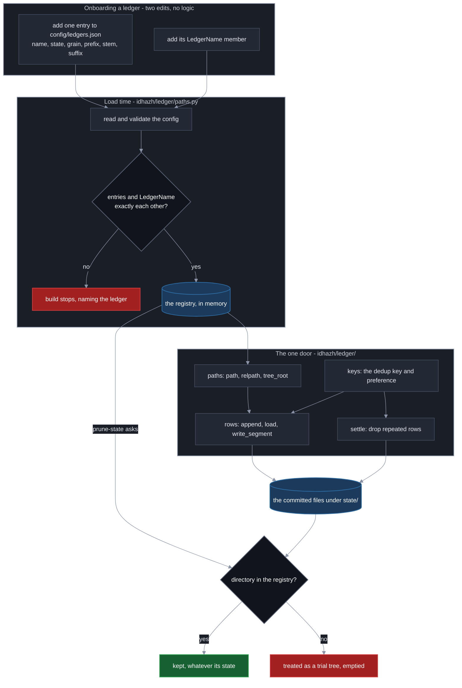

# Plan 53 - One door into `state/`

**Last Updated**: 2026-09-26

**Level**: 5 for the decision, 3 for every row (CLAUDE.md section 6). Level 5 because what is settled here binds every producer added after it: `backend/idhazh/ledger/` is the one door into `state/` and `backend/idhazh/store/` never exists. Level 3 per row because each crosses a subsystem boundary and none can break published data.

Execute per docs/how-to/execute-a-plan.md: one owner carries the plan and delegates a row where delegation pays; keep parallel N = 2 rows in flight, refilling a slot as soon as a worker returns and never waiting on a merge; consult a persona only where two answers would lead to different code; AUTO-merge on green gates; honor the ESCALATE triggers in section 0. AUTHOR-AND-STOP until the user authorizes.

## 0. Operating contract

**Chain** (CLAUDE.md section 0d). **Intent**: a producer should have one way to put a row into `state/` and one way to read it back (section "The intent this plan serves"). **Contract**: section 4 declares every type, table, signature and destination a worker must not invent. **Code**: the six rows.

| Field | Value |
| --- | --- |
| Why this plan exists | A producer has four ways to write `state/` and four to read it, and plan 50 was about to add a fifth in a second vocabulary. This makes `backend/idhazh/ledger/` the one door, splits the oversized `ledger.py` into modules that each answer one question, and retires the word `store` so one thing has one name. |
| Hard scope - in | see the bullets below |
| Hard scope - out | see the table below |
| ESCALATE triggers | see the enumerated list below |
| Chosen strategy | Retire the word, promote the file to a package behind a stable facade, mint the vocabulary, then move one concern per pull request - reader before writer, behaviour unchanged, no byte on disk moved. Ruled by Fowler (CLAUDE.md section 14). |
| Execution | autonomous orchestrator per docs/how-to/execute-a-plan.md. **Parallel N = 2.** The extraction is serial on `ledger/__init__.py`; the second slot exists for the one disjoint code row (row 4). Not 4, because there is one disjoint row to run beside the chain and no more. |
| Blocks | **Plan 50's row titled "The payload ledger, the two roots, and the arrow mapping" is unblocked once rows 2 and 3 merge** - it needs a package to live in and a `LedgerName` to type its first argument. It then edits `ledger/__init__.py` to export `persist`, so landing all six rows first is the recommendation: an open branch against a file the extraction rows are still moving is a branch that gets redone. |

### Hard scope - in

- `backend/idhazh/ledger.py`, one file answering many questions, becomes the package `backend/idhazh/ledger/`, each module answering one.
- The word `store` leaves the repository. Under `state/` it becomes **ledger**; under `frontend/public/` it becomes **collection** (glossary decision, 2026-09-26).
- `SegmentLedger` and the per-ledger `*_DIRNAME` constants collapse into one `LedgerName` `StrEnum` in `backend/idhazh/contracts/`, with a `DAY_TREES` subset for the day trees a writer files a segment into.
- The path functions and the per-ledger `*_DIRNAME` constants become one config registry - `config/ledgers.json`, validated by a contract - so a ledger's location and lifecycle state is one fact in one place (section 4.2).
- `backend/idhazh/paths.py` becomes `path_classes.py`, the name its own test already carries.

### Hard scope - out

| Not here | What it costs to leave out | What would bring it in |
| --- | --- | --- |
| Parquet, the envelope, the two tiers, compaction | `state/` stays CSV end to end; nothing about how a file is encoded changes | Plan 50's row titled "The payload ledger, the two roots, and the arrow mapping", which lands `persist.py` / `parquet.py` **inside** `ledger/` |
| Moving any committed byte | **This whole plan writes nothing to disk.** Every file under `state/` keeps its path, its name and its bytes | Plan 50's ledger-migration rows |
| Any change to `write_segment` / `extend_segment` behaviour | Both move verbatim to `ledger/rows.py` in row 6 - same signature, same `int` return, same routing of a row under the day its own `date` cell names. Plan 50's frozen `persist` stands on that behaviour | Plan 50, which is frozen from a design point of view; this plan does not touch it |
| `HEALTH_WINDOW_DAYS: Final = 31` | A hardcoded tunable survives among siblings that read their window from config | Its own one-line pull request. It is Guardrail #6, not this plan's question |
| The retention windows, the prune passes, the gardener | Untouched | Plan 50 |

### ESCALATE triggers

1. **A row cannot finish without a behaviour change.** Every row here is structural - no signature, default, return type or on-disk byte moves. A row that finds it cannot preserve behaviour has found a defect: stop, and give the defect its own pull request (CLAUDE.md section 5; do not interleave structural and behavioural change).
2. **`write_segment` or `extend_segment` cannot move with its body unchanged** (row 6). "Verbatim" means the body is byte-identical while its imports are rewired to the sibling modules (section 4.6); if the body itself must change to work, that is a behaviour change plan 50's frozen `persist` stands on - stop before the commit.
3. **`LedgerName` is about to enter a persisted `contracts/` payload before row 3 lands.** That makes row 3 Level 5 - pause for sign-off (CLAUDE.md section 6).
4. **The `store` ratchet would have to allow a word outside row 1's fenced block.** The sweep missed a real occurrence; surface it, do not widen the allow-list.

### The intent this plan serves

**A producer should have one way to put rows into `state/` and one way to get them back.** Today it has several, and plan 50 was about to build another.

The mismatch is visible in one signature comparison. `ledger.write_segment(state_dir, ledger, rows, *, run_id, attempt, job, shard, date=None)` and plan 50's drafted `persist(rows, *, dataset, covers, identity, tier, period, built_from, fmt)` carry **the same facts in two spellings**. Shipping the second beside the first would have meant every producer knowing which door it was, and a reader of `state/` needing both vocabularies to read one directory.

The second half of the intent is the file that made this invisible. `backend/idhazh/ledger.py` answers many questions at once: what the directories are called, what makes two rows the same record, where each ledger's file lives, how a CSV is read, how an old header is migrated, what a segment filename means, how each ledger is appended to and loaded, how duplicates are dropped, how a feed's reliability is computed, and what a month window is. CLAUDE.md section 1a says a source file answers one narrow question and that **if answering it needs a long file, the question is too broad**. This file is the standing counter-example, and every plan that has touched it has had to read all of it to change one thing.

**What a reader gets: one word for one thing, and a file whose first sentence tells them whether to keep reading.**

## 1. Status Reckoner

One row is one pull request. **Seven: six that change code, and one that distills and closes.** The extraction funnels through one facade file, so smaller rows add pull requests without buying parallelism - they were combined (Fowler, Carmack: the machine is one box, and a parallel edit to `ledger/__init__.py` costs an unreviewed merge, not wall-clock).

| # | Row title | Depends-on | Parallel-group | Status | Worktree | PR | Subagent |
| --- | --- | --- | --- | --- | --- | --- | --- |
| 1 | The retired word `store` leaves | - | A | PENDING | - | - | - |
| 2 | `ledger.py` becomes the package, and its docstring becomes a page | 1 | B | PENDING | - | - | - |
| 3 | One `LedgerName` for one ledger | 2 | C | PENDING | - | - | - |
| 4 | `paths.py` becomes `path_classes.py` | 2 | P | PENDING | - | - | - |
| 5 | The ledger registry moves to `config/ledgers.json` | 3, 4 | D | PENDING | - | - | - |
| 6 | The rest of the module splits, and the facade becomes provably empty | 5 | E | PENDING | - | - | - |
| 7 | The diagram and the vocabulary land in docs, and the plan-doc goes | 6 | F | PENDING | - | - | - |

**Every row wears one hat and it is the structural one.** No signature, default or return-type changes, and no byte on disk moves. A row that finds itself wanting a behaviour change has found a defect, and the defect gets its own pull request (ESCALATE trigger 1).

**The critical path is 1 -> 2 -> 3 -> 5 -> 6 -> 7.** Row 4 is the one disjoint code row and fills the second slot.

**Rows 3, 5 and 6 each edit `ledger/__init__.py`, so they are serial whatever their letters say** (execute-a-plan.md: rows that share one surface do not parallelise). That is why Parallel N is 2 and not 4.

**Row 4 shares exactly two test files with rows 3 and 6** - `backend/tests/workflows/test_worker_ledgers.py` and `backend/tests/workflows/test_daily_commit_steps.py`, which both name `idhazh.paths` and `SegmentLedger`. The pool holds row 4 while row 3 or row 6 is in flight and runs it in the gap; readiness is the file-disjointness test, never the letter. Everywhere else row 4 is disjoint - `ledger.py` never imports `idhazh.paths`, it only mentions it in one comment.

**The plan-doc is excluded from the disjointness diff.** Every row stamps its own Reckoner line in its own change (execute-a-plan.md), so the file is in every row's real set.

## 2. The facts the contracts stand on

No counts here - functionality is what the contracts must preserve, not a measurement. These are the load-bearing facts a worker relies on:

- **Callers reach the module by attribute access.** Almost every caller does `from idhazh import ledger` then `ledger.X`. The facade must bind every name they reach, public or private (section 4.7).
- **`day_shards` imports names back out of the ledger package at its own module top, and `ledger.py` imports `day_shards` only inside function bodies.** That asymmetry is the only thing keeping the two acyclic. The split must preserve it: `rows.py` keeps its `day_shards` import function-local (section 3).
- **`SegmentLedger` has readers across the pipeline, the utilities and the tests.** Row 3 rewires each `SegmentLedger.X` to `LedgerName.X` and each `for x in SegmentLedger` to `for x in DAY_TREES`; mypy names any it missed.
- **`ledger.py` does not import `idhazh.paths`** - it mentions it in one comment. So the `path_classes` rename (row 4) is disjoint from the extraction, and only `cli.py` and a few test files import `idhazh.paths`.
- **Some ledgers are addressed by filename, not a directory constant** - `feed-retirements.csv`, `holdout-pairs.csv`, `score-distribution.json` and its stamped `.json` archive. Membership is keyed on path functions so none falls through (section 4.1).
- **The eviction homes already exist**: `backend/idhazh/telemetry/source_health.py`, `backend/idhazh/month_partition.py`.

**A correction to this document's own prose.** An earlier `store`->`ledger` sweep over-applied to the sentences that *name* the retired word. Those are corrected throughout. Row 1's oracle exists to stop exactly this: the retired word survives only inside a fenced instruction block.

## 3. The shape this plan builds

```
config/
    ledgers.json              the registry: every ledger, its state, where it lives

backend/idhazh/
    contracts/
        ledger_name.py        LedgerName + DAY_TREES live HERE, not in the package
        ledgers.py            the registry schema: LedgerState, Grain, LedgerEntry
    ledger/
        __init__.py           imports and __all__, no definition of any kind
        paths.py              loads config/ledgers.json; the path builders live here
        keys.py               what makes two rows one record, and the day-tree shapes
        filenames.py          what one writer's file is called
        csv_file.py           how rows are read out of and written into a CSV
        headers.py            how a file under an older header is read
        rows.py               how a caller puts rows in and gets them back
        settle.py             which rows repeat a key, and what dropping them costs
        persist.py            <- plan 50, NOT built here
        parquet.py            <- plan 50, the only pyarrow importer; the facade never binds it
        json_lines.py         <- plan 50
        arrow_schema.py       <- plan 50
    path_classes.py           was paths.py; how git settles two runs on one path
```

**`LedgerName` is in `contracts/`, not in the package.** `FileEnvelope` (plan 50) is typed by it, and CLAUDE.md section 4 forbids `contracts/` from importing another `idhazh` subpackage. Contracts are the bottom of the graph, so the vocabulary lives there.

**Where a ledger lives is config, how its rows settle is code.** `config/ledgers.json` carries each ledger's lifecycle state and path shape (section 4.2); `keys.py` carries the key and preference (section 4.4), keyed by `LedgerName`, because a preference is a callable and a callable is not config. Keeping them apart is why `paths.py` never imports `keys.py`. Rejected: a single merged table (the `LedgerShape` an earlier draft drew) that re-coupled the two.

**The intra-package import graph is a DAG the worker follows exactly.** `contracts/` and the external sibling `day_partition` are the bottom and import nothing from the package. Then `csv_file`, `paths`, `keys` and `filenames` import only `contracts`; `headers` imports `csv_file`; `settle` imports `keys`, `csv_file`, `paths`, `contracts` and `day_partition`; `rows` imports `keys`, `filenames`, `csv_file`, `paths`, `contracts` and `day_partition`. Every external module-top import a moved body already had (`contracts`, `day_partition`) travels with it. `__init__` imports the submodules to build the facade, and **no submodule imports `__init__`** - importing the package runs `__init__`, so a submodule reaching back up would re-enter a half-built facade.

**One import stays inside a function body: `rows.py`'s `from idhazh import day_shards`.** `day_shards` imports names back out of the ledger package at its own module top, so a module-scope import in `rows.py` would close a load-time cycle: importing the package runs `__init__`, which imports `rows`, which re-enters the half-built package through `day_shards`. Keeping that import function-local, exactly as `ledger.py` has it today, is what breaks the cycle. Promoting it to module scope reads as harmless cleanup and is the single most likely way to break the package - so it is a named rule, and row 6 arms the oracle that proves it.

**The facade never binds the pyarrow module.** When plan 50 adds `parquet.py`, `__init__` must not import it at module scope at all - not even to re-export it - because importing a name executes its module regardless of `__all__`. A parquet caller reaches it directly with `from idhazh.ledger import parquet`, so `from idhazh import ledger` never loads pyarrow. "Left off `__all__`" is not a mechanism and is rejected; "the facade does not bind it" is. Row 6 arms the subprocess oracle that keeps it that way (Carmack).

## 4. The contracts a worker must not invent

Everything a worker needs to build is declared here. Where a shape is derived from the existing code, the derivation rule and the oracle that proves it are given rather than a hand-typed list that could drift; where a shape is new, it is written out in full.

### 4.1 `LedgerName` and `DAY_TREES` - `backend/idhazh/contracts/ledger_name.py`

One `StrEnum`, one member per ledger the module can address today, the value being the on-disk name exactly. It replaces three spellings of one vocabulary: `SegmentLedger`, `STORE_DIRNAMES` (renamed `LEDGER_DIRNAMES` in row 1), and the `*_DIRNAME` constants.

- **Membership is the union of two sets, so nothing falls through.** One set is the `*_path` / `*_relpath` functions in `ledger.py` at the base commit (a `*_path` and its `*_relpath` twin count once); this catches the filename-addressed ledgers a `*_DIRNAME`-keyed rule would miss - `feed-retirements.csv`, `holdout-pairs.csv`, `score-distribution.json` and its stamped archive. The other set is `DAY_TREES`: `day-validations` is a day tree with no path function of its own - it is written only through `day_shard_path` - so the function set alone would drop it. Every member of the union gets an entry in `config/ledgers.json` (section 4.2); `day-validations`'s entry is hand-written because no old function derives it. The config is the registry, and `LedgerName` is the typed handle it is validated against.
- **The oracle is the bijection, at load.** `LedgerName` and the `config/ledgers.json` entries are exactly each other (section 4.2), so a member with no entry, or an entry with no member, fails the build by name. That is the anti-footgun that replaces the old hand-coded `STORE_DIRNAMES`: a ledger left out is no longer a directory `prune-state` silently empties. `prune-state` derives its protected set from the config (row 5), so there is no `LEDGER_DIRNAMES` constant to keep in step.

```python
DAY_TREES: Final[frozenset[LedgerName]] = frozenset({...})   # the nine, no more
```

`DAY_TREES` is the subset a writer files a segment into - exactly the nine `SegmentLedger` had. It is what `write_segment`, `segment_contract` and the tree-shape table key on (section 4.4), and what every `for tree in SegmentLedger` loop becomes (`telemetry/prune.py`'s `WRITER_OWNED_LEDGERS`, `stages/compact.py`, and the tests). **Its coverage oracle**: `{m.value for m in DAY_TREES}` equals the old `SegmentLedger` value set, computed from git.

**`SegmentLedger` is deleted, not aliased.** A second enum whose members duplicate a `LedgerName` subset is the defect this plan removes. One enum, one typed subset, one coverage test each.

**Why one type and a subset, not two types.** `SegmentLedger` and `LedgerName` answered the same question and drew their strings from the same constants; the only difference was which members carried a settlement shape, and that is a subset, not a second type. Collapsing to one type widens the segment functions from a 9-member argument to a 21-member one, so they gain a **named runtime refusal**: `write_segment(state_dir, LedgerName.PUBLISHED, ...)` no longer fails to type-check, so it must raise at the call, quoting the ledger and its grain (section 4.3). A runtime refusal is the right trade for a build-time producer - a wrong call is a failed CI job, not a served error - but only paired with `DAY_TREES` and its coverage test (Fowler).

### 4.2 The ledger registry - `config/ledgers.json` and `backend/idhazh/ledger/paths.py`

The set of ledgers, each one's lifecycle state, and where each one lives is one fact, and it lives in one config file - `config/ledgers.json`. It is not a hand-coded set in Python (which the plan's own investigation found is a data-loss footgun: `stages/prune_state.py` empties every `state/` child directory not in the hand-coded set, so a ledger left out is silently wiped), and it is not discovered by a glob (nothing walks `state/`, so the cost never grows with the data - Guardrail #12). A ledger is added by adding an entry; it is retired or paused by changing one field. `config/idhazh.json` is not touched.

**The schema is a contract, validated at load.** `backend/idhazh/contracts/ledgers.py` declares it. `Grain` moves here from the package, because the config references it and `contracts/` cannot import the package (CLAUDE.md section 4):

```python
class LedgerState(StrEnum):
    LIVE = "live"        # the pipeline writes and reads it
    PAUSED = "paused"    # not written now, will resume; its data is kept and protected
    RETIRED = "retired"  # no longer written; its data is kept, never pruned as a stray


class Grain(StrEnum):
    """Where a ledger's files sit TODAY. A member is deleted by the migration that
    empties it; the enum goes when every entry is N11's one pattern."""
    FLAT = "flat"        # feed-retirements.csv - one file, no date in the path
    DAY_FILE = "day"     # seen/<YYYY>/<MM>/<DD>.csv - one file per day
    DAY_TREE = "tree"    # item-health/<YYYY>/<MM>/<DD>/ - a day directory writers file into
    MONTH_FILE = "month" # telemetry-aggregate/<YYYY-MM>.csv
    STAMPED = "stamp"    # content-similarity-judge/archive/<stamp>.json


class LedgerEntry(BaseModel):
    name: LedgerName          # the on-disk directory or file name
    state: LedgerState
    grain: Grain
    prefix: tuple[str, ...]   # the directory nest under state/
    stem: str | None = None   # the literal name for a FLAT file; None for a dated grain
    suffix: str | None = None # the extension (".csv", ".json"); None for DAY_TREE, a directory


class LedgersConfig(BaseModel):
    ledgers: list[LedgerEntry]
    # A load-time validator makes the entry names a bijection with LedgerName:
    # every member appears once, no extras, no duplicates. A ledger with no entry
    # or an entry with no member fails the build BY NAME (Guardrail #3). That
    # refusal is the anti-footgun - the old hand-coded set turned a missing name
    # into a silently pruned directory; this turns it into a build that will not
    # start.
```

**`paths.py` reads and validates `config/ledgers.json` once into `dict[LedgerName, LedgerEntry]`** and the builders operate on it. Config-driven, one sane file, no source edit to change a state (Guardrail #6).

**`Grain` is transitional and carries its removal condition on its declaring line** (Guardrail #6). The north star is [docs/concepts/telemetry-intent.md](../docs/concepts/telemetry-intent.md), and N11 is explicit: every tree under `state/` is sharded to **one** pattern with no exceptions - `state/raw/<ledger>/<YYYY>/<MM>/<DD>/<file_id>.parquet`, the date being `covers`, the name being N9's minted `<file_id>`. Five grains describes the mess N11 exists to remove, so writing it into a new contract as a permanent shape would codify the defect. It is recorded because this plan moves no bytes and every ledger really does sit in one of those five shapes today: the registry is the honest map of that, and it is the seam plan 50 edits one entry at a time as it migrates a ledger to the one pattern.

**Where this plan and the north star share a concept they share its name.** The builders take `covers` - N11's word for the day the rows describe, never the day the job woke (CLAUDE.md section 2) - and `LedgerName` is N11's `<ledger>`. So plan 50's migration is an edit to an entry rather than a translation between two vocabularies, which is the failure this whole plan exists to prevent.

**What this plan deliberately keeps out of the registry**: the `raw` / `compact` tier (N10) and the parquet format (N1). Both are plan 50's, that plan is frozen, and minting its fields here would be the second vocabulary again.

Three builders, driven by the entry's `grain`:

```python
def path(state_dir: Path, ledger: LedgerName, covers: str | None = None) -> Path
def relpath(ledger: LedgerName, covers: str | None = None) -> str
def tree_root(state_dir: Path, ledger: LedgerName) -> Path   # state_dir / Path(*prefix)
```

`covers` is the period - a `YYYY-MM-DD` day for `DAY_FILE`/`DAY_TREE`, a `YYYY-MM` month for `MONTH_FILE`, a stamp for `STAMPED`, `None` for `FLAT`. A dated grain handed `None` raises; a `FLAT` handed a `covers` raises - `path` never guesses. `tree_root` returns the whole-tree directory a reader hands to `day_shards.settled_rows` / `day_partition.day_files` (which walk every day under it); it is defined only for `DAY_FILE`/`DAY_TREE` and raises otherwise, and it is a separate builder rather than `path(covers=None)` so `path` keeps its fail-fast. Because `suffix` is data on the entry, the STAMPED archive's `.json` sits on its row and the builder is physically unable to emit `.csv`.

**Settlement stays in code, not in the config.** A dedup key is a tuple and a preference is a callable, and a callable is not JSON. So `keys.py` (section 4.4) holds the key, the preference and the tree-shape, keyed by `LedgerName`, for the `DAY_TREES` subset. The config carries where a ledger lives and its lifecycle; the code carries how its rows settle.

**Onboarding and offboarding, in full.** Add a ledger: one entry in `config/ledgers.json` at `state: live` (plus a `LedgerName` member for typing, which the bijection test binds, plus a `keys.py` row if it is a settled day tree). Pause it or retire it: change `state`. Nothing is discovered and nothing is a hand-list to forget - a missing pairing fails the build by name.

**Four oracles bind the registry.** Bijection: the config names are exactly the `LedgerName` members, at load and in a test. Path parity: for every entry and a fixed date, `path` and `relpath` equal the old function, extension included. Tree-root parity: for every `DAY_FILE`/`DAY_TREE` entry, `tree_root` equals the old inline `state_dir / X_DIRNAME`, the nested trees included. Known-set parity: the directories `prune-state` protects (the `prefix[0]` of every configured ledger, of any state, plus the four other-module trees) reproduce today's decision exactly - so replacing the hand-list changes no prune outcome, and any directory the config would newly protect (see row 5 on `day-validations`) is surfaced, never silently changed.

### 4.3 How a ledger is onboarded, and what the door offers

Drawn to the Mermaid contract in [docs/reference/documentation-structure.md](../docs/reference/documentation-structure.md) so row 5 can lift it into the docs page unchanged.



**Reading it in one line:** a ledger exists because an entry says so; the entry and the typed name must agree or the build stops; everything that touches `state/` goes through the door the registry feeds; and `prune-state` empties only what the registry does not claim - which is why a missing entry used to be silent data loss and is now a refusal.

**The three states, and what each one changes.** `live` is written and read. `paused` is not written now and will resume. `retired` is no longer written and is not coming back. All three are **claimed**, so all three are protected from the trial-tree sweep; the difference is what a writer may do, not whether the data survives. Deleting a ledger's data for good is a deletion somebody performs on purpose, never a side effect of changing a state.

### 4.4 The settlement structures - `backend/idhazh/ledger/keys.py`

What settles two rows is a separate question from where a file lives, so it is a separate module keyed on `LedgerName`. `keys.py` takes, with bodies unchanged, every name that answers it:

- The `*_KEY` tuples (`FEED_HEALTH_KEY` through `DAY_VALIDATION_KEY`), the `Preference` type alias, the three `_*_rule` functions and their `*_RULE` aliases, `_PREFERENCES`, and `preference_for`.
- The tree-shape table `_TREE_SHAPES` and `_TreeShape`, plus `segment_contract`, `segment_key`, `segment_carried`, and **all four** carried-sets they read: `ITEM_HEALTH_CARRIED`, `SCORES_CARRIED`, `FITTED_SIMILARITY_THRESHOLD_CARRIED`, `STORY_SIMILARITY_PAIR_CARRIED`.
- `DATE_CELL`, the column a day tree routes a row by, lands here beside the settlement it feeds; `rows.py`'s `_dated_rows` imports it.
- `DAY_TREES` is imported here from `contracts/ledger_name.py`; `_TREE_SHAPES` is re-keyed from `SegmentLedger` onto `LedgerName` and its keys must equal `DAY_TREES` (the coverage oracle). `segment_contract` / `segment_key` / `segment_carried` and the `write_segment` family (in `rows.py`) raise the named refusal of section 4.1 for a `LedgerName` not in `DAY_TREES`.

### 4.5 Who names a file under `state/`

**Every name under `state/` is minted and parsed inside `backend/idhazh/ledger/`, and nowhere else.** That is already true, and this plan's job is to keep it true while the module becomes a package - and to say it out loud, because the package split is exactly when a name-building f-string leaks into a caller.

**The code already states the rule.** `SEGMENT_NAME` - the pattern for a writer's `<run_id>-<attempt>-<job>-<shard>.csv` - carries a comment saying it is public precisely so `idhazh.paths` can ask it whether a committed path has one writer, **rather than carry a copy of it**. That asking module is the one row 4 renames to `path_classes.py`, so a worker doing that rename keeps it asking and never inlines the pattern.

`filenames.py` holds the CSV-era grammar, whole:

| What it names | Names |
| --- | --- |
| A writer's own file | `segment_name`, `parse_segment_name`, `SEGMENT_NAME`, `SEGMENT_SUFFIX` |
| An operator's one add | `repair_name`, `is_repair`, `REPAIR_NAME`, `REPAIR_STAMP` |
| Two legacy names, each already carrying its own removal condition | `BEFORE_PARTITION_NAME`, `PRE_IDENTITY_TRACE` |

**Plan 50's `naming.py` lands in this same package, and that is not a coincidence to be re-decided.** Plan 50 already places it under `backend/idhazh/ledger/` and mints `unit_id` and `file_id` there - N9's clock-first `uuid8`. So one package ends up holding both grammars: the CSV one this plan moves, and the parquet one plan 50 adds. The benefit is containment - when the CSV grammar is finally deleted, it is a diff inside one package rather than a hunt. **This plan does not rename plan 50's module; that plan is frozen.** What it fixes is the ownership statement, so neither plan leaves room for a third place that invents a name.

**The rule a worker follows: a producer never invents a filename.** It hands the ledger its rows and its writer identity, and the ledger decides what the file is called - the same words plan 50 uses for its own door. A caller that builds a name is a caller that will disagree with the parser the next time either changes.

**Oracle:** `SEGMENT_NAME`, `SEGMENT_SUFFIX`, `REPAIR_NAME` and `REPAIR_STAMP` have no importer outside `backend/idhazh/ledger/` except `path_classes.py`, which asks rather than copies; and no module outside the package builds a `state/` filename by joining a run id, attempt, job or shard.

### 4.6 The remaining modules - which name goes where

Each module takes the names below with bodies unchanged. **The oracle for every one is the same**: `pytest --collect-only -q` is byte-identical before and after, the moved-name set is recomputed from the source and destination files rather than hand-listed, and every moved module-level constant is asserted value-identical (a moved regex or tuple that changed is what `collect-only` cannot see).

| Module | Answers | Takes |
| --- | --- | --- |
| `ledger/paths.py` | where a ledger's file lives | loads and validates `config/ledgers.json` into `dict[LedgerName, LedgerEntry]`, the `path` / `relpath` / `tree_root` builders (section 4.2), plus `STATE_DIRNAME` |
| `ledger/filenames.py` | what one writer's file is called | `SegmentName`, `SEGMENT_NAME`, `SEGMENT_SUFFIX`, `BEFORE_PARTITION_NAME`, `PRE_IDENTITY_TRACE`, `REPAIR_NAME`, `REPAIR_STAMP`, `repair_name`, `is_repair`, `segment_name`, `parse_segment_name`. It imports only `contracts`, so the day-directory-plus-writer-name join does **not** live here |
| `ledger/csv_file.py` | how a CSV is read and written | `CsvRecord`, `CsvContract`, `read_header`, `require_matching_header`, `_csv_line`, `render_file`, `_read_rows`, `_stream_rows`, `extend_ledger_file` |
| `ledger/headers.py` | how a file under an older header is read | `refiler`, `_headings`, `_unplaceable`, `_refile`, `migrate_header` |
| `ledger/rows.py` | how a caller puts rows in and gets them back | every `append_*` / `load_*` / `recorded_*` verb, `write_telemetry_aggregate`, `write_segment`, `extend_segment`, `_dated_rows`, and `day_shard_path` / `day_shard_relpath` (they compose a day directory from `paths` with a writer name from `filenames`, so they sit at the one module that imports both) |
| `ledger/settle.py` | which rows repeat a key, and what dropping them costs | `KeyedLedger`, `keyed_paths`, `drop_repeated_rows`, `repeated_keys` |

**"Verbatim" means the body is unchanged, not the namespace.** `write_segment`, `extend_segment` and `_dated_rows` move with their bodies byte-for-byte, but their helpers now live in sibling modules, so `rows.py` imports them: `_TREE_SHAPES`, the carried-sets and `DATE_CELL` from `keys`; `render_file` and `_read_rows` from `csv_file`; `SegmentName` and `segment_name` from `filenames`; the `path` builders from `paths`; and `day_shards` function-local (section 3). Two of those imports are private (`_TREE_SHAPES`, `_read_rows`); a private import across siblings in one package is allowed and is what keeps the move behaviour-preserving. A worker who reads "verbatim" as "no new import lines" gets a `NameError` - so the rule is stated here and in ESCALATE trigger 2.

### 4.7 `ledger/__init__.py` - the facade, and what keeps it honest

Callers reach the ledger by attribute access - `from idhazh import ledger` then `ledger.X` - so the facade's one job is to bind every name the module exposes today. The split is for the maintainer, not the caller.

- **The facade re-exports every name a caller reaches, and the completeness check is the caller-demand walk alone.** Scan `backend/` for `ledger.<name>` attribute access and `from idhazh.ledger import <name>`, taken *after* row 5's deletions and row 6's repoints; every demanded name must be a bound attribute on the imported package. That is necessary and sufficient: a name with no remaining caller need not be bound, and a missed repoint or a surviving reader of a deleted or evicted name shows up as a demanded name that is not bound. There is no "old public surface is a subset" clause - it would fail by design, because row 5 deletes the path functions and row 6 evicts three functions, all once public. One caveat for when plan 50 lands: a demanded name that is itself a `.py` module under `ledger/` (like `parquet`) resolves by import, so the walk treats a submodule name as resolvable rather than a required facade attribute.
- **A private name reached from outside is repointed, not re-exported.** `ledger._stream_rows` (a test) and `ledger._TREE_SHAPES` (a utility) are the two; they move to `csv_file` and `keys`, and those two call sites are repointed to the owning module in row 6. Re-exporting a private through the facade makes a second binding a test monkeypatching the facade could not reach - it would pass while testing nothing.
- `__init__.py` holds imports, a single `__all__`, and a leading module docstring, and **nothing else** - no definition and no bound value. Row 6's AST walk asserts every top-level node is an `Import`/`ImportFrom`, the one `__all__` assignment, or the leading docstring; a stray top-level constant `Assign` - a second source of truth for a moved constant - fails it. A re-export is an import line, so a facade of pure re-exports passes.
- **The facade never binds the pyarrow module** (section 3). When plan 50 lands `parquet.py`, `__init__` does not import it - not at module scope, not to re-export it; a parquet caller does `from idhazh.ledger import parquet`. Row 6 arms a fresh-interpreter subprocess oracle: `from idhazh import ledger`, then assert neither `pyarrow` nor `idhazh.ledger.parquet` is loaded. Green now, load-bearing the moment plan 50 adds the submodule.

### 4.8 What leaves the package, and what must NOT

Two functions leave, every reader that reaches them is repointed to the new home, and the facade stops binding them. **`_run_n` and `load_health` stay** - `load_health` has many `ledger.load_health` callers and is not leaving, and `_run_n` is its private helper, so moving `_run_n` would break `load_health`.

| What | Where it goes |
| --- | --- |
| `feed_reliability`, `reliability` | `backend/idhazh/telemetry/source_health.py` |
| `shards_in_window` | `backend/idhazh/month_partition.py` |
| `HEALTH_WINDOW_DAYS` | Stays. Out of scope, its own pull request (Guardrail #6) |

**The repoint is a rule, not a hand-list.** Every `ledger.<name>` and `from idhazh.ledger import <name>` of an evicted name, across all of `backend/` - production, utilities and tests alike - is repointed to the new home, and a moved function's tests move with it. The evicted names have live callers in the test tree as well as in `stages/plan.py`, the source-health publisher, `retention.py` and `measure_day_window.py`, so a production-only list would leave the facade-surface walk unable to pass. Compute that walk *after* the repoints: a name with no caller left is a clean removal, not a drop. Re-exporting instead of repointing is rejected - `reliability`'s new home imports `ledger.load_health`, so a facade re-export would arm a facade-to-home-to-facade load cycle.

## 5. The naming collisions this plan settles

| # | Collision | Settled as |
| --- | --- | --- |
| 1 | `ledger/paths.py` beside the existing `backend/idhazh/paths.py` | The top-level one becomes `path_classes.py` (row 4). It answers "how does git settle two runs on one path", which is not a path question, and its own test is already `test_path_classes.py` |
| 2 | `ledger` under `frontend/public/` does not mean what it means under `state/` | `frontend/public/digest/<YYYY>/<MM>/<DD>/` is a published tree a reader opens, not a fact one run left for the next. **Under `state/` it is a ledger; under `frontend/public/` it is a collection.** The test is the reader, never the shape on disk. The north star for what `state/` becomes is [docs/concepts/telemetry-intent.md](../docs/concepts/telemetry-intent.md), which that page's own opening defers to; [docs/concepts/partitions.md](../docs/concepts/partitions.md) describes today and is read as today |
| 3 | The glossary rows for `ledger` and `segment` both link to `backend/idhazh/ledger.py` | Repointed in row 2 to `ledger/__init__.py` and `ledger/filenames.py`. The glossary's rule is that the link is the definition, so a broken link is a broken definition |

---

## Row #1 - The retired word `store` leaves

**This row is the one place in the repository allowed to spell the retired word, because it is the row that removes it.** The ratchet in the oracle allow-lists exactly this section and nothing else. Everywhere the old spelling is needed it sits inside a fenced block, so a later sweep cannot quietly flatten the instructions into `X -> X`.

- **Scope:** every occurrence across the repository. No file moves and no identifier outside the block below changes.
- **The rule, applied per occurrence:** under `state/` it becomes **ledger**; under `frontend/public/` it becomes **collection**; where the word is the ordinary English verb it is **left alone**.

```text
LEFT ALONE - the ordinary English verb, not the vocabulary
  restore  restores  restored  restoreAnchor  storedChoice  storedDates
  store_true  store_false
  test_the_row_stores_counts_and_leaves_every_rate_to_be_derived
  test_the_manifest_stores_the_publisher_map_it_froze

IDENTIFIERS THAT CHANGE
  STORE_DIRNAMES            -> LEDGER_DIRNAMES   (row 5 then deletes it, once the
                                                  config registry replaces it)
  WRITER_OWNED_STORES       -> WRITER_OWNED_LEDGERS
  STORES_NO_JOB_WRITES      -> LEDGERS_NO_JOB_WRITES
  STORES_NOTHING_FILLS_YET  -> LEDGERS_NOTHING_FILLS_YET
  STORES_NO_RUN_FILLS       -> LEDGERS_NO_RUN_FILLS
  COUNCIL_STORE             -> COUNCIL_LEDGER
  RETIRED_STORE_SWEEP       -> RETIRED_LEDGER_SWEEP
  RETIRED_STORE_PATH        -> RETIRED_LEDGER_PATH

FILES THAT RENAME
  backend/utilities/check_seeded_stores.py -> check_seeded_ledgers.py
      class Store        -> class Ledger
      seeded_stores()    -> seeded_ledgers()
  backend/tests/test_check_seeded_stores.py -> test_check_seeded_ledgers.py

THE DIAGRAM CLASS VOCABULARY
  docs/reference/documentation-structure.md defines `classDef store` for the
  cylinder that means "something persisted", and four pages use it. The class
  renames to `ledger` - the fill, stroke and meaning are unchanged, and one
  page already draws it that way. Both the classDef line and every `class X
  store;` line move:
      docs/reference/documentation-structure.md   (the definition and its table row)
      docs/architecture/publishing/autotune-content-similarity.md
      docs/architecture/publishing/visuals.md
      docs/how-to/evaluate-new-summarizer-model.md
      docs/reference/github-actions.md            (two diagrams)

SIGNATURES AND MEMBERS THAT CHANGE
  backend/utilities/empty_column_census.py
      class Store(NamedTuple) -> class Ledger(NamedTuple)
      STORES                  -> LEDGERS
      census(root, store)     -> census(root, ledger)
  backend/idhazh/telemetry/prune.py
      day_collection(state_root, store: str) -> (state_root, ledger: str)
      as_outcome(store: str, ...)            -> as_outcome(ledger: str, ...)

ABOUT THIRTY TEST FUNCTION NAMES carrying the word, listed by the sweep
```

- **Files touched:** every file that spells the retired word, plus `.github/` where the renamed utility is called, plus [docs/concepts/glossary.md](../docs/concepts/glossary.md) (already done, 2026-09-26) and the plan-docs under `TODO/` (their prose was swept 2026-09-26).
- **Acceptance gates:** `ruff check .`, `mypy backend`, the full `pytest backend/tests`, and the frontend selector. **A test function rename is zero-risk** - pytest discovers by prefix - so the suite is the check that nothing else moved.
- **Oracle:** a ratchet test. The retired word appears **zero** times outside this row and a third-party quotation, counted with `(?<![A-Za-z0-9_])[Ss]tores?(?![A-Za-z0-9_])` over `backend/`, `frontend/src/`, `frontend/tests/`, `config/`, `docs/`, `TODO/` and `.github/`. **Without the ratchet the word walks back in** - it was already swept out of the plans once and would return with the next draft.
- **Decisions:**

  | # | Decision | Authority |
  | --- | --- | --- |
  | 1 | `ledger` rather than `dataset`, `collection` or a new word. `ledger` already carries the glossary definition; `store` is defined nowhere. **Deleting a duplicate is cheaper than minting a fourth name** | Owner, 2026-09-26 |
  | 2 | The ratchet is a test and not a review habit. A review habit is what let three words coexist | Fowler |
  | 3 | This row ships before the package move, so row 2's rename carries no identifier changes - only the file move and its docstring | Fowler, Tidy First |

---

## Row #2 - `ledger.py` becomes the package, and its docstring becomes a page

- **Scope:** `git mv ledger.py -> ledger/__init__.py`, add `__all__`, move the 90-line state-layout docstring to a docs page, fix four string literals, repoint two glossary rows.
- **Files touched:**
  - `backend/idhazh/ledger.py` -> `backend/idhazh/ledger/__init__.py`
  - `backend/tests/pipeline/test_day_shards.py` lines 274 and 340, `backend/tests/workflows/test_ledger_staging.py` lines 766 and 773 - the four literals naming the old path
  - `docs/concepts/glossary.md` - the `ledger` and `segment` rows repoint to `ledger/__init__.py` and `ledger/filenames.py`
  - `docs/architecture/contracts/` - the new page carrying the module docstring
- **Acceptance gates:** `ruff check .`, `mypy backend`, the changed-file selector locally; full `pytest backend/tests` on CI.
- **Oracle:** `pytest --collect-only -q` is byte-identical before and after, AND `git` reports the move as a rename (the docstring is a small fraction of the file, well inside the rename threshold). The import-graph, facade-surface and cycle oracles live in row 6, where the submodules they check exist - at row 2 the package is one file and there is nothing for them to catch.
- **Decisions:**

  | # | Decision | Authority |
  | --- | --- | --- |
  | 1 | Zero call sites change. `from idhazh import ledger` resolves identically against `ledger/__init__.py` | Fowler, Branch by Abstraction: the facade is the stable seam while modules move underneath it |
  | 2 | **The 90-line docstring moves in this same row, not a later one.** It is the best explanation the project has of its own state directory - why `state/published` files by day, what a read costs on real hardware, why `visual-prunes` is the declared partition exception. It belongs in `docs/architecture/contracts/` (Guardrail #4), and folding it into the git-mv keeps the plan at minimal pull requests without breaking the rename signal. Row 2 is not done until the page exists | Owner, reconciling Fowler (keep the move clean) with the minimal-PR goal |
  | 3 | `__all__` is grouped by the module each name will end up in, one comment per group, so `__init__.py` reads as an index | Fowler |

---

## Row #3 - One `LedgerName` for one ledger

- **Scope:** mint `LedgerName` and `DAY_TREES` in `contracts/`, collapse `SegmentLedger` into them across its readers, and re-type the segment functions on `LedgerName` with the named refusal. The `*_DIRNAME` constants stay - their users are the path functions, which do not move until row 5. **This row unblocks plan 50.**
- **Files touched:**
  - `backend/idhazh/contracts/ledger_name.py` (new), `backend/idhazh/contracts/__init__.py`
  - `backend/idhazh/ledger/__init__.py` - re-type `write_segment`, `extend_segment`, `segment_contract`, `segment_key`, `segment_carried`, `day_shard_path`, `day_shard_relpath`, `_dated_rows` on `LedgerName`; re-key `_TREE_SHAPES`; add the `DAY_TREES` refusal; delete `SegmentLedger`
  - the production readers (`evals/writer.py`, `stages/{assemble,compact,decide,plan,qualify_decide,record,validate_days,work}.py`, `telemetry/{prune,silicon}.py`), the utilities (`build_canary_day.py`, `pipeline_test_ledgers.py`, `widen_ledger_header.py`), and every test that names `SegmentLedger` - each `ledger.SegmentLedger.X` becomes `LedgerName.X`, each `for x in SegmentLedger` becomes `for x in DAY_TREES`, and `WRITER_OWNED_LEDGERS` reads `DAY_TREES`
- **Acceptance gates:** `ruff check .`, `mypy backend`, the changed-file selector locally; full `pytest backend/tests` on CI.
- **Oracle:** `{m.value for m in DAY_TREES}` equals the old `SegmentLedger` value set, computed from git; `_TREE_SHAPES.keys()` equals `DAY_TREES` (coverage); `write_segment` with a `LedgerName` not in `DAY_TREES` raises, naming the ledger and the grain. **mypy is the completeness oracle for the rewire** - a deleted `SegmentLedger` with a live reader is a type error, not a silent default. Each reader is one mechanical substitution.
- **Decisions:**

  | # | Decision | Authority |
  | --- | --- | --- |
  | 1 | One type and a typed subset, not two types. `SegmentLedger` is deleted, not aliased; `DAY_TREES` is the nine it named | Fowler |
  | 2 | The widened segment functions gain a **named runtime refusal** for a non-day-tree member - the right trade for a build-time producer, paired with the `DAY_TREES` coverage test | Fowler |
  | 3 | `LedgerName` lives in `contracts/` because `FileEnvelope` (plan 50) is typed by it and CLAUDE.md section 4 forbids `contracts/` importing another subpackage | CLAUDE.md section 4 |
  | 4 | The `*_DIRNAME` constants are NOT deleted here - their users, the path functions, are still in `__init__.py` until row 5. Row 5 deletes them once the config registry replaces their users | Fowler, dependency order |
  | 5 | Two utilities build the vocabulary from a path string (`pipeline_test_ledgers.py`, `widen_ledger_header.py`). After the collapse `LedgerName("published")` succeeds where `SegmentLedger("published")` raised, so the fail-fast on a non-day-tree directory moves from construction to the segment refusal. Both only ever feed day-tree directory names, so the shift is inert - named so it is not discovered | Fowler |

- **Rejected alternatives:**

  | # | Option | Why rejected | What it would cost to take | Authority |
  | --- | --- | --- | --- | --- |
  | 1 | Mint `LedgerName` only, defer the `SegmentLedger` collapse | Leaves two enums naming the day-trees for several rows - the "two spellings live" state this plan ends | One extra pull request and a longer window of duplicate vocabulary | Fowler |
  | 2 | Keep `SegmentLedger` as a `LedgerName` subset alias | An alias whose members duplicate a subset is a second spelling by another name | Nothing saved; the defect persists under a new keyword | Fowler |

---

## Row #4 - `paths.py` becomes `path_classes.py`

- **Scope:** rename `backend/idhazh/paths.py` to `path_classes.py` and update its importers. The one code row disjoint from the extraction chain.
- **Files touched:**
  - `backend/idhazh/paths.py` -> `backend/idhazh/path_classes.py`
  - `backend/idhazh/cli.py` (the `refresh_paths` call site)
  - `backend/tests/contracts/test_derived_paths.py`, `backend/tests/contracts/test_path_classes.py`, and the other test files that `from idhazh import paths` (`retention/test_union_safe_repeats.py`, `workflows/_harness.py`, `workflows/test_daily_commit_steps.py`, `workflows/test_staged_paths.py`, `workflows/test_worker_ledgers.py`)
- **Acceptance gates:** `ruff check .`, `mypy backend`, the changed-file selector locally; full `pytest backend/tests` on CI.
- **Oracle:** `pytest --collect-only -q` byte-identical; mypy names any importer left on the old name. `ledger.py` is untouched - it never imports `idhazh.paths`.
- **Decisions:**

  | # | Decision | Authority |
  | --- | --- | --- |
  | 1 | It answers "how does git settle two runs on one path", which is not a path-building question; `path_classes` is the name its own test already carries | Fowler |
  | 2 | Depends on row 2 only, but the pool holds it while row 3 or row 6 is in flight, because it shares `test_worker_ledgers.py` and `test_daily_commit_steps.py` with them | execute-a-plan.md, file-disjointness |
  | 3 | The renamed module keeps **asking** the ledger for `SEGMENT_NAME` and never inlines a copy of the pattern. That is why the pattern is public, and the ledger owning every name under `state/` is the rule the rename must not quietly break (section 4.5) | Owner, 2026-09-26 |

---

## Row #5 - The ledger registry moves to `config/ledgers.json`

- **Scope:** create the registry (`backend/idhazh/contracts/ledgers.py` and `config/ledgers.json`, section 4.2), make `paths.py` load and validate it and build `path` / `relpath` / `tree_root` from it, make `prune-state` derive its protected set from it, and delete the hand-coded path functions, the per-ledger `*_DIRNAME` constants and `STORE_DIRNAMES`. `Grain` moves to `contracts/`. `config/idhazh.json` is not touched.
- **Files touched:**
  - `backend/idhazh/contracts/ledgers.py` (new: `LedgerState`, `Grain`, `LedgerEntry`, `LedgersConfig` with the bijection validator)
  - `config/ledgers.json` (new: one entry per ledger, its `state`, and its path shape - the states set to reproduce today's known-set exactly)
  - `backend/idhazh/ledger/paths.py` (new: loads and validates the config, the `path` / `relpath` / `tree_root` builders, `STATE_DIRNAME`)
  - `backend/idhazh/ledger/__init__.py` - delete the path functions, the per-ledger `*_DIRNAME` constants and `STORE_DIRNAMES`; migrate the inline `state_dir / X_DIRNAME` tree-root reads (`load_item_health`, `load_health`, `load_published`, `keyed_paths`) onto `tree_root`; re-export from `paths.py`; cut `__all__`
  - `backend/idhazh/stages/prune_state.py` - `_trial_roots` reads the config's known-set instead of `ledger.STORE_DIRNAMES`
  - `docs/architecture/contracts/` - the onboarding diagram and the three states, lifted from section 4.3 into the page row 2 created; row 7 re-checks it against what shipped
  - `backend/idhazh/stages/validate_days.py`, `backend/idhazh/retention.py`, and any test reading `state_dir / X_DIRNAME` - repointed onto `tree_root`
  - every other caller mypy names when the wrappers go
- **Acceptance gates:** `ruff check .`, `mypy backend`, the changed-file selector locally; full `pytest backend/tests` on CI.
- **Oracle:** four checks. **Bijection** - the `config/ledgers.json` names are exactly the `LedgerName` members, at load and in a test. **Path parity** - for every entry and a fixed date, `path` and `relpath` equal the old function, extension included; a dated grain handed `None` raises. **Tree-root parity** - for every `DAY_FILE` / `DAY_TREE` entry, `tree_root` equals the old inline `state_dir / X_DIRNAME`, the nested trees included. **Known-set parity** - the directories `_trial_roots` now protects (the `prefix[0]` of every configured ledger, of any state, plus the four other-module trees) reproduce today's `STORE_DIRNAMES`-based decision exactly. A census that every `state_dir / <literal>` site maps to a config prefix backs it.
- **Decisions:**

  | # | Decision | Authority |
  | --- | --- | --- |
  | 1 | The ledger set, each ledger's state, and its path shape live in `config/ledgers.json`, not a Python set and not a glob. A hand-coded set is the footgun this row removes; a glob grows with the data and makes a ledger that fails to write once vanish from discovery | Owner, 2026-09-26 |
  | 2 | States are `live` / `paused` / `retired`; all three are known to `prune-state` (protected), so retiring or pausing never exposes a ledger to trial-pruning. The write-side and cleanup meaning of the states is the gardener's to act on, not this structural row | Owner, 2026-09-26 |
  | 3 | Settlement (key, preference, tree-shape) stays in `keys.py` keyed by `LedgerName`, because a preference is a callable and a callable is not JSON. The config carries where a ledger lives and its lifecycle only | Owner, Fowler |
  | 4 | `prune_state.py` is edited here to read the config. Plan 50 refactors `prune_state.py` into gardener tasks and rebases onto this; its frozen design is untouched, and the config becomes the registry both read | Owner |
- **ESCALATE:** if the config's known-set does not reproduce today's `_trial_roots` decision, stop. The known case is `day-validations`, a real `state/` child absent from today's `STORE_DIRNAMES`. **The owner has ruled that `validate-days` and its `day-validations` ledger are wasteful and will be decommissioned in their own change** (2026-09-26), so this plan does not delete them and does not change what `prune-state` does to them: the entry is written to reproduce today's behaviour exactly, and the decom change deletes the entry and the `LedgerName` member. If the decom lands first, this row simply has one fewer entry. Any *other* directory whose treatment would change is a behaviour change needing sign-off, not a silent flip inside a structural row.
- **Rejected alternatives:**

  | # | Option | Why rejected | What it would cost to take | Authority |
  | --- | --- | --- | --- | --- |
  | 1 | A hand-coded `LEDGER_DIRNAMES` frozen set in Python | A ledger left out is silently emptied by `prune-state`; it fights natural growth and easy onboarding | Nothing saved; it is the defect this row removes | Owner |
  | 2 | Discover ledgers by walking `state/` (a glob) | Cost grows with the data (Guardrail #12), and a ledger that produced no file yet - or failed to write once - is invisible to a walk, so discovery cannot tell `retired` from `never ran` | The registry would be unreadable at a glance and could not carry a state | Owner |
  | 3 | The merged `LedgerShape` table (path plus settlement in one row) | Re-couples path and settlement, and settlement cannot be JSON | A god-table and a cross-module import | Fowler |

---

## Row #6 - The rest of the module splits, and the facade becomes provably empty

- **Scope:** extract `keys.py`, `filenames.py`, `csv_file.py`, `headers.py`, `rows.py`, `settle.py` and the `paths.py` state-root (sections 4.2-4.6); evict `feed_reliability`/`reliability` to `source_health.py` and `shards_in_window` to `month_partition.py`, repointing their readers (section 4.8); make `ledger/__init__.py` re-exports-and-`__all__` only, and never bind the pyarrow module.
- **Files touched:**
  - `backend/idhazh/ledger/keys.py`, `filenames.py`, `csv_file.py`, `headers.py`, `rows.py`, `settle.py` (all new)
  - `backend/idhazh/ledger/__init__.py` - re-exports and `__all__`, no definition
  - `backend/idhazh/telemetry/source_health.py`, `backend/idhazh/month_partition.py` - the evicted functions land here
  - `backend/idhazh/stages/plan.py`, the source-health publisher, `backend/idhazh/retention.py`, `backend/utilities/measure_day_window.py` - the evicted-name readers, repointed
  - `backend/tests/test_ledger.py`, `backend/utilities/widen_ledger_header.py` and `backend/tests/test_widen_ledger_header.py` - the two private-name accesses (`ledger._stream_rows`, `ledger._TREE_SHAPES`), repointed to `csv_file` / `keys`
  - `docs/concepts/glossary.md` - the `segment` row's link, if row 2 left it on `__init__.py`
- **Acceptance gates:** `ruff check .`, `mypy backend`, the changed-file selector locally; full `pytest backend/tests` on CI. May land as two commits in one pull request - the settlement/naming half, then the read/write half.
- **Oracle:** seven checks, each catching a failure the others cannot.
  1. `pytest --collect-only -q` byte-identical; the moved-name set recomputed from source and destination files; every moved module-level constant asserted value-identical against its base-commit value read from git (a moved regex or key tuple that changed is what collect-only cannot see).
  2. **Facade shape**: an AST walk asserts every top-level node in `__init__.py` is an `Import`/`ImportFrom`, the single `__all__` assignment, or the leading docstring - a stray top-level `Assign` or definition fails it.
  3. **Facade surface preserved**: the caller-demand walk (`ledger.<name>` and `from idhazh.ledger import <name>` across `backend/`, taken after the repoints) finds every demanded name bound on the package. There is no old-surface-subset clause - rows 5 and 6 delete and evict public names by design.
  4. **`day_shard_path` / `day_shard_relpath` parity**: for every `DAY_TREES` member at a fixed `(date, run_id, attempt, job, shard)`, the new composition `paths.path(...) / segment_name(...)` equals the old inline output. This is the one write-path body rewritten rather than moved, so no other oracle covers it.
  5. **No load-time cycle**: an AST assertion that no `ledger/*` submodule imports `day_shards` at module scope, PLUS two separate fresh interpreters - `subprocess.run([sys.executable, "-c", "import idhazh.ledger"])` and `subprocess.run([sys.executable, "-c", "import idhazh.day_shards"])`, each with `PYTHONPATH=backend` and each asserting return code zero (capture stderr so a failure is readable). The `day_shards`-first process is the load-bearing probe: it forces `day_shards`'s module-top import against a cold package. A same-process test is worthless - the suite has already imported both.
  6. **Facade does not load pyarrow**: a fresh interpreter with `PYTHONPATH=backend` runs `from idhazh import ledger` and, inside the `-c` string, `sys.exit(1)` if `pyarrow` or `idhazh.ledger.parquet` is in `sys.modules` - the parent cannot see the child's modules. Green now, load-bearing the day plan 50 adds an eager parquet import.
  7. **The ledger owns every name** (section 4.5): `SEGMENT_NAME`, `SEGMENT_SUFFIX`, `REPAIR_NAME` and `REPAIR_STAMP` have no importer outside `backend/idhazh/ledger/` except `path_classes.py`, and no module outside the package builds a `state/` filename by joining a run id, attempt, job or shard.
- **Decisions:**

  | # | Decision | Authority |
  | --- | --- | --- |
  | 1 | `write_segment`, `extend_segment` and `_dated_rows` move with their bodies unchanged; only their imports are rewired to the sibling modules (section 4.6). Same signature, same `int` return, same per-`date` routing. Plan 50's frozen `persist` stands on that behaviour (ESCALATE trigger 2) | Owner, CLAUDE.md section 0d |
  | 2 | The facade never binds the pyarrow module. A package `__getattr__` was rejected because it is a top-level definition the facade-shape oracle forbids; a parquet caller reaches the submodule directly | Carmack |
  | 3 | `reliability`/`feed_reliability`/`shards_in_window` leave and their readers are repointed, never re-exported - re-export would arm a facade-to-home-to-facade load cycle. `_run_n` and `load_health` stay, because `_run_n` is `load_health`'s helper and `load_health` is not leaving | Carmack |

---

## Row #7 - The diagram and the vocabulary land in docs, and the plan-doc goes

**The plan-doc is deleted at closure** ([docs/how-to/execute-a-plan.md](../docs/how-to/execute-a-plan.md)), so anything durable left only in `TODO/` is lost with it. This row is the check that nothing is, and the diagram is the thing most likely to be.

- **Scope:** distill and close per [docs/how-to/distill-a-plan.md](../docs/how-to/distill-a-plan.md). The Mermaid diagram (section 4.3), the three lifecycle states and the onboarding rule land on the `docs/architecture/contracts/` page row 2 created; the glossary points at the registry; the plan-doc is deleted.
- **Files touched:**
  - `docs/architecture/contracts/` - the page row 2 created gains the diagram, the three states, and how a ledger is onboarded and retired
  - `docs/concepts/glossary.md` - the `ledger` row points at `config/ledgers.json` as the registry
  - `TODO/20260926-53-one-door-into-state-plan.md` - deleted
- **Acceptance gates:** the documentation checks and CI. A documentation-only closure needs no local application suite (CLAUDE.md section 9). Run `python backend/utilities/doc_load.py` before and after, per AGENTS.md.
- **Oracle:** the diagram carries its own `theme: base` init line and uses only the seven-class vocabulary, so it is legible under both renderer settings ([docs/reference/documentation-structure.md](../docs/reference/documentation-structure.md)); the diagram matches what rows 5 and 6 actually shipped rather than what section 4.3 drew before they ran; and the Status Reckoner is fully resolved with no durable statement left only in the plan-doc.
- **Decisions:**

  | # | Decision | Authority |
  | --- | --- | --- |
  | 1 | The diagram is lifted in row 5, beside the registry it describes, and **re-checked here against the shipped code**. Rows 5 and 6 can move a detail the diagram draws, and a diagram that disagrees with the tree is worse than none | Owner, 2026-09-26 |
  | 2 | The diagram goes to the subsystem page, not the glossary. It is the current shape of one subsystem, which is that tier's question; the glossary row stays one line and a link | [docs/how-to/distill-a-plan.md](../docs/how-to/distill-a-plan.md) routing |
  | 3 | Distillation is a row with a pull request, not a ritual somebody remembers at the end. A closure pass that is not a row is a closure pass that gets skipped, and the diagram is exactly the artefact that would vanish | Owner, 2026-09-26 |

---

## Relationship to plan 50

Plan 50 is frozen from a design point of view; this plan does not change it. What this plan hands it:

- A package `backend/idhazh/ledger/` for `persist.py`, `parquet.py`, `json_lines.py` and `arrow_schema.py` to live in.
- A `LedgerName` enum in `contracts/` to type `FileEnvelope` and `persist`'s first argument.
- `write_segment` and `extend_segment` moved verbatim, so plan 50's `persist` stands on the behaviour it was designed against.

**The minimum that unblocks plan 50 is rows 2 and 3.** Landing all six first is the recommendation: plan 50's persist row edits `ledger/__init__.py`, and an open branch against a file the extraction rows are still moving is a branch that gets redone - measured once on this repository, on `app_config.py`, which collected 54 commits of divergence in a day.

## What this costs

| # | Cost | What softens it |
| --- | --- | --- |
| 1 | **The module docstring** - the best explanation the project has of its own state directory - has to move without being lost | Row 2 folds it into a `docs/architecture/contracts/` page in the same pull request, and row 2 is not done until the page exists |
| 2 | **A merge surface per module where there was one file.** Two branches that once conflicted visibly in one file can now auto-merge across modules, leaving a tree where a key moved and its path did not | Serial execution on `ledger/__init__.py` (Parallel N = 2), and row 6's value-identity oracle that a moved constant must equal its old self |
| 3 | A reader following `ledger.X` has one extra hop, because the facade hides which module holds it | `__all__` grouped by source module, one comment per group |
| 4 | `__init__.py` becomes the thing that can rot back into a body | The AST shape test in row 6; somebody has to not delete it |
| 5 | Row 3 touches many files | Each is one mechanical `SegmentLedger` -> `LedgerName` substitution, and mypy names any that was missed |

## See also

- [`20260924-50-idhazh-gardener-plan.md`](20260924-50-idhazh-gardener-plan.md) - the frozen plan this one unblocks.
- [`../docs/concepts/glossary.md`](../docs/concepts/glossary.md) - where the `store` -> `ledger` / `collection` decision is written down.
- [`../docs/how-to/execute-a-plan.md`](../docs/how-to/execute-a-plan.md) - the orchestrator contract this plan's Status Reckoner stamps.
- [`../docs/how-to/distill-a-plan.md`](../docs/how-to/distill-a-plan.md) - what row 7 runs before the plan-doc is deleted.
- [`../docs/concepts/telemetry-intent.md`](../docs/concepts/telemetry-intent.md) - the north star `Grain` is transitional against.
- [`../CLAUDE.md`](../CLAUDE.md) - section 1a for the one-question rule, section 4 for why `LedgerName` is in `contracts/`, section 6 for the correction level.
