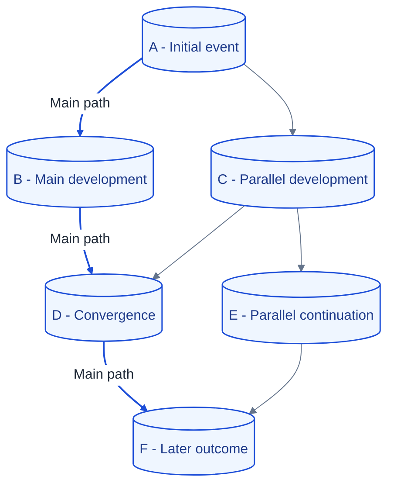

# Unsupervised topic detection and event clustering

**Last Updated**: 2026-10-05

Group reports of the same occurrence, connect distinct developments, and publish a short explanation without losing the underlying reports.

**Status:** Consolidated architecture, not implemented behavior. LanceDB, periodic batches, summary-based features, and Fastino GLiNER are selected. New Topic Domains are discovered automatically but require review before public promotion. Verified copies count as distribution, not new reporting. Ordinary active search uses a **configurable 15-day window**; activity decay does not declare an occurrence permanently dead.

The selected frame policy prefers a supported complete Fastino GLiNER result, with the existing LLM result as cross-check or fallback. Joining still requires the member checks. Uncertain copies have pending contributions and configurable visibility/processing. Supported relationships with unknown direction are retained outside the Story DAG **provisionally; further research is required**.

All tunable behavior belongs in configuration. The remaining thresholds require independent evidence, not copied values from a proposal. Runtime, throughput, memory estimates, and GLiNER model pins are omitted.

**Preservation rule:** Do not remove a section without the user's approval. Retain supplied formulas, schemas, metrics, examples, and alternatives beside the selected design. Mark a conflicting formula or value as a proposal rather than silently adopting or deleting it. The explicit exclusions above still apply.

## Contents

- [Glossary and identities](#glossary-and-identities)
- [Evidence production](#evidence-production)
- [Logical records and counting populations](#logical-records-and-counting-populations)
- [Field-level schemas and common types](#field-level-schemas-and-common-types)
- [Batch flow](#batch-flow)
- [Candidate retrieval and decisions](#candidate-retrieval-and-decisions)
- [Admission scoring formulas and their status](#admission-scoring-formulas-and-their-status)
- [Supplied numerical decision matrix](#supplied-numerical-decision-matrix)
- [Corrections, activity, and cold recovery](#corrections-activity-and-cold-recovery)
- [Snapshots and historical state](#snapshots-and-historical-state)
- [Reader views](#reader-views)
- [Topic view schema](#topic-view-schema)
- [Story graph view schema](#story-graph-view-schema)
- [Evaluation and control registry](#evaluation-and-control-registry)
- [Metric dictionary](#metric-dictionary)
- [Design rationale and rejected alternatives](#design-rationale-and-rejected-alternatives)
- [See also](#see-also)

## Glossary and identities

### Architectural terms

- **Raw Feed Item:** Untrusted external news content and its metadata, before extraction and sanitization.
- **Document Unit ($d$):** One frozen semantic representation of a source revision: a three-sentence summary, dense vector, sparse token counts, typed entities, predicate-linked frames, and time evidence.
- **Event Cluster ($C$):** State representing one real-world occurrence. Membership can evolve or be corrected; participants, place, and occurrence time remain evidence, not facts invented from proximity.
- **Topic Domain:** A persistent broad category that routes documents and organizes events. A candidate domain is not a public category until reviewed.
- **Event Joining:** Assigning a Document Unit to an Event Cluster because it describes the same occurrence.
- **Event Threading:** Connecting distinct events through a supported, directed Story Edge. It does not merge their reports into one occurrence.
- **Story DAG:** A directed acyclic graph of distinct events. It can branch and converge; a linear reading path is only a selected view.
- **Story Edge:** A typed, directed, evidence-backed relationship. Chronological, follow-up, thematic, and reported causal relationships have different meanings.
- **Unordered event association:** A supported related-event connection whose direction is unknown. It is stored separately from directed Story Edges, asserts neither chronology nor causation, and is excluded from directed reading paths. This is the provisional choice requiring further research.
- **Anchor Vector:** The founding Document Unit's immutable vector within its named representation. A changed display representative does not move it.
- **Active Centroid:** The normalized mean of the declared semantic contributors to one Event Cluster, not of all events linked in its Story DAG.
- **Verified copy:** A retained report established as substantially the same reporting contribution as another, through copy/origin evidence. Similar wording alone is only a candidate signal.
- **Reporting contribution:** One distinct contribution of reporting. Verified copies share a contribution; their separate publication and distribution records remain available.

Merging duplicate Event Clusters consolidates representations of the same event. A corrective split repairs mixed membership. Branching means one event has several subsequent developments; convergence means a later event has several supported predecessors.

### Identity and replay

**Table A - Stable record identities**

| ID | Record | Identity rule |
| --- | --- | --- |
| A1 | Document Unit | UUIDv5 from a fixed namespace and unambiguous encoding of `canonical_url`, source `text_sha`, and `representation_revision` |
| A2 | Event Cluster | ULID allocated once with its creation decision and reused on replay |
| A3 | Story DAG | ULID allocated at initialization; preserve aliases if stories converge |
| A4 | Topic Domain | Validated stable slug, such as `tech.ai.chips`; naming changes preserve references |
| A5 | Story Edge | UUIDv5 from a fixed namespace and encoded source Event Cluster ID, target ID, and relation type |

UUIDv5 uses SHA-1 internally; use the standard namespace/name algorithm, not a raw digest. ULID ordering reflects identifier creation, not event chronology, and does not establish a global order across independent writers.

`text_sha` identifies canonical sanitized source text. `representation_revision` identifies one frozen materialization, not merely a model name: fresh generations can differ under the same model. Replay reuses the stored materialization. Changed summary, frames, vectors, entities, or tokenization create a new representation revision. Reweighting BM25 from new corpus statistics does not.

An upsert with an existing Document Unit ID must not silently replace different semantic content. Active membership selects one representation per source revision; replacing it transfers its contribution instead of adding another vote or arrival. Public `item_id` values and report addresses remain separate and unchanged.

Changing an edge's endpoints or type creates a new edge identity with a recorded correction. All creation, copy, assignment, and correction decisions must be retry-safe. This requires idempotent effects, not deterministic fresh LLM output.

## Evidence production

### One summary and one owner of event meaning

The operator-controlled LLM produces the standardized three-sentence summary, a candidate predicate frame, and supported time evidence in one response. Fastino GLiNER proposes typed entities and complete predicate-linked frames from the frozen summary. One resolver selects a whole supported frame; downstream stages must not independently choose different extractors.

The same frozen summary feeds every matching feature. Source metadata and bounded evidence references support validation, copy provenance, time resolution, and numerical checks; they are not a second raw-text semantic retrieval path.

Three sentences do not guarantee adequate evidence or a valid encoder input. Check tokenizer length and the preservation of distinguishing facts without silent truncation. A missing summary or unresolved primary occurrence remains pending or insufficient for automatic Joining. A raw lead paragraph is not an equivalent fallback.

### Dense, entity, and sparse features

- **Dense meaning:** Sentence-Transformers `all-MiniLM-L6-v2`, producing 384-dimensional FP32 working vectors normalized to unit L2 length. Compatible normalized vectors can use a dot product for cosine similarity. Validate nonzero, finite vectors.
- **Entities and frame candidates:** Fastino GLiNER extracts PERSON, ORG, GPE, LOC, FACILITY, and REGULATION and is preferred for complete Agent/Action/Target records when the selected capability supports predicate-linked extraction. Direction-labelled entity lists alone do not establish that capability. Deployment details remain unpinned.
- **Lexical evidence:** spaCy tokenization and lemmatization, including the language components needed for correct lemmas, but not a second NER or predicate-extraction pipeline. Preserve negation, figures, units, proper names, and entity phrases.
- **Sparse retrieval:** Store unigram and bigram counts; derive BM25 scores from an inverted index with a shared analyzer, alias rules, vocabulary, document frequencies, and average document length. Its statistical population is one selected representation per distinct reporting contribution in the named corpus. Final entity-preserving counts wait for both lexical and entity results.

Do not lemmatize the text sent to MiniLM or Fastino GLiNER. There is no free-form LLM keyword step. Lexical output is repeatable for fixed summary bytes and versions; corpus statistics and representations can still change.

DATE, TIME, PERCENT, MONEY, QUANTITY, and CARDINAL are excluded from identity-entity selection only. Their values remain available for time, figure, and sparse evidence. Shared generic entities cannot justify Joining alone, but a universal exact place/ORG gate can wrongly exclude a real match. Resolve aliases rather than reward name length.

Each frame binds its predicate to its participants, assertion status, time, place, and evidence. Preserve active/passive equivalents, role reversal, denial, plans, reported speech, and background context. Independent lists of verbs and names cannot preserve those bindings.

### Frame selection and disagreement

GLiNER is primary by **selection policy**, not execution order: the summary is produced first. Reuse the LLM frame already produced with that summary; do not introduce another LLM call merely to arbitrate. LLM time evidence remains explicit, and must be bound to the same predicate before a candidate uses it.

Normalize known aliases and action forms while preserving direction, negation, modality, attribution, and the original supporting phrases. Validate candidate structure, evidence references, and predicate bindings. Passing those checks is not proof that the model interpreted the article correctly.

Align candidates to the same source-supported primary predicate before comparing them. Frames for different actions are not two competing answers to one question. Missing required qualifications fail the declared candidate check; genuinely unknown optional time stays unknown rather than becoming a contradiction.

The resolver's versioned comparison rule must establish equivalence of the required roles and assertion. Compatible but unequal optional information is not automatically a factual conflict. If occurrence alignment or the required equivalence cannot be established, keep the resolution unresolved with that reason; do not select the richer candidate or fill one candidate from the other.

The resolver applies one rule to each primary occurrence:

1. When normalized, supported candidates agree on the relevant facts, select the GLiNER frame and record the agreement.
2. When only the GLiNER candidate passes the declared checks, select that complete candidate.
3. When only the LLM candidate passes, select it as the fallback.
4. When supported candidates conflict, retain both and mark the resolution unresolved. Decisions that depend on the disputed roles must wait.
5. When neither candidate is adequate, record incomplete extraction. Do not invent an actor, target, or event.

Select a whole candidate, never GLiNER's agent combined with the LLM's action and target. Cosine agreement between candidate texts does not choose the true frame: role reversals and negation can remain close in vector space. Do not mix unrelated model confidence scales or add a third arbitration model.

Keep supporting role phrases even when they have no resolved identity entity. An entity link enriches a participant mention; it does not establish whether the participant acted in this predicate. Required roles that are genuinely unknown remain explicit rather than filled by inference.

GLiNER preference is not a claim of demonstrated superiority. Evaluate both producers and the resolver on the same source-supported cases, including missing names, multiple predicates, passive voice, reversals, negation, plans, and quoted speech. Agreement on a generated summary can repeat a shared summary error.

### Three clocks

- **`t_event`:** Supported occurrence point or interval, with precision, evidence, and resolved/unknown/ambiguous status.
- **`t_pub`:** Supported publication timestamp and provenance, normalized to UTC. It describes coverage freshness.
- **Coverage observation time:** The recorded observation of new reporting. It controls activity and ordinary active-search eligibility.

Identifier creation, processing time, and these clocks are not interchangeable. A representation refresh, verified copy, compaction, or new Story Edge does not become a new-reporting observation.

The temporal instruction is:

> Extract the time expression attached to the primary occurrence. Resolve relative dates against publication time only when that reference and the source calendar basis are supported. Return UTC points or bounds with precision and uncertainty. Do not invent a precise instant from a date-only expression. If event time is unresolved, retain that state and keep publication time separately as a labelled proxy.

An author may use a local calendar or quote an earlier statement. A UTC publication timestamp alone does not settle what "yesterday" meant. Day-level bounds express uncertainty within a day, not an occurrence at midnight.

A publication proxy may support labelled freshness estimates or candidate ordering. It cannot establish occurrence-time agreement, a temporal veto, Story Edge direction, or causation. Unknown time is neither a match nor a contradiction.

## Logical records and counting populations

### Keep the populations separate

- **Stored Document Units:** Every retained representation, including superseded records and copied reports.
- **Current membership:** Assigned source revisions, each pointing to its selected Document Unit.
- **Semantic contributors:** One selected representation per distinct reporting contribution after verified-copy suppression.
- **Activity observations:** New-reporting observations counted once under their recorded identities and times.
- **Distribution:** Where reporting appeared, including copies. Outlets, websites, and independent newsrooms are not interchangeable counts.
- **Retrieval, verification, and views:** Candidate events, required member comparisons, and displayed reports each have a separate population.

**Verified copies add distribution and provenance, but no extra centroid contribution and no reset of the 15-day clock.** Keep their articles and outlet references. If same-event membership is supported but copy status is uncertain, the report may stay assigned while its **extra reporting contribution is explicitly pending**.

A source revision containing genuinely new reporting can create a new reporting observation. A changed hash, model output, or formatting alone cannot. Keep copy decisions and their evidence so corrections can recalculate contributions and observation attribution.

Pending copy contributions add no extra semantic vector weight, independent BM25/entity-frequency vote, reporting activity, or clock reset. Keep their unresolved counts and evidence visible. Once resolved, attribute any valid contribution to its original observation time, not the time of the classification decision.

Verified copies and superseded representations likewise do not add independent statistics counts. Each comparison uses a named statistics snapshot; contribution corrections rebuild affected statistics and the derived search view under a new version. Neither uncertainty nor a verified copy may disappear from stored-report accounting.

### Configurable handling of uncertain copies

Use a single configuration policy, `uncertain_copy_handling`, with `show`, `hide`, and `drop` modes. This controls reader visibility and current processing, not whether uncertainty counts as new reporting.

- **Show:** preserve the agreed visible-report behavior while the extra contribution remains pending.
- **Hide:** retain the report and continue its permitted reassessment, but exclude it from newly generated public listings while uncertain.
- **Drop:** exclude it from the current processing/publication path while retaining saved content, identity, evidence, and the reason for later reconsideration.

Keep the visible behavior until configuration selects another mode. Drop is not deletion, and neither hide nor drop breaks an already published report address. Record the applied mode and classification reference; do not edit immutable Document Unit content to hide a report.

A later resolution uses the original observation identity and time. Reconsideration cadence is a separate configured process, not an implicit repeated retry that creates new arrivals.

### Record responsibilities

These are logical contracts, not promises that Arrow or LanceDB automatically enforces SQL keys or foreign keys.

**Table B - Records and their invariants**

| ID | Record | Required content and invariant |
| --- | --- | --- |
| B1 | Document Units | Identity, source revision, frozen summary/language, dense vector, token counts, typed entities, primary frames, time evidence, provenance, and processing versions |
| B2 | Assignments | Source revision, selected Document Unit, Event Cluster, status, decision evidence, and version; unresolved membership is explicit |
| B3 | Reporting contributions and copies | Contribution identity, member source reports, selected semantic representative, copy status/evidence, and revision; stored-report count is not contributor count |
| B4 | Observations and distribution | Unique observation identity, original observation time, publication time, contribution classification, and outlet/origin references; retries do not create arrivals |
| B5 | Event Clusters | Stable ID, founding Document Unit, compatible anchor/sum/centroid, contributor count, activity state, occurrence evidence, representatives, and observation/evaluation times |
| B6 | Topic Domains | Stable slug, proposed name, supporting events, candidate/reviewed/public status, routing version, and aliases; discovery does not publish a category |
| B7 | Story DAGs | Stable ID, roots and event membership, aliases, and version; a story ID references this record, not the edge table |
| B8 | Story Edges | Endpoints, relation type, evidence, status, verifier version, and correction references; validate direction, self-links, cycles, and missing endpoints |
| B9 | Decisions and snapshots | Input/base identity, participating shards, copy/membership/graph corrections, completeness, and affected record versions; publish a consistent result |
| B10 | View projections | Snapshot and scoring identity, selection window/budget, topic/event references, selected path/branches, diagnostics, and reachable report links |
| B11 | Frame resolution | Complete extractor candidates, supported participant phrases, validation outcomes, selected whole frame or unresolved status, and resolver version |
| B12 | Unordered event associations | Related endpoint set, supporting evidence, unknown direction, and version; separate from DAG edges and directed paths; provisional and requires further research |
| B13 | Evaluation case review | Original assessment references, one bounded whole-example review, supported reference grouping or unresolved result, and evaluation provenance |

Preserve predicate-linked evidence instead of accumulating unrelated actor, action, and target lists. Keep occurrence-time intervals separate from `first_seen_at` and `last_seen_at`, which refer to eligible new-reporting observations.

If two Story DAGs become connected, retain a canonical story identity with aliases and the valid roots from both. Use a stable recorded survivor rule; identifier order may break a storage tie, but cannot establish causation or event chronology. Individual events do not merge merely because their stories converge.

### Field-level schemas and common types

The declarations below restore the supplied Arrow schema detail. They are proposed contracts, not implemented tables. `?` means nullable; an empty list means known empty, not a failed extraction. Every persisted record carries a `version` date. Mutable logical state also names its revision; immutable Document Units and snapshots use their materialization/snapshot identities. A manifest identifies which records form one consistent state.

```text
DateStamp       = utf8 validated as YYYY-MM-DD
UUIDv5          = utf8 validated as a version-5 UUID
ULID            = utf8 validated as a ULID
TopicSlug       = utf8 validated by the Topic Domain naming rule
UtcInstant      = timestamp[us, tz=UTC]
Vector384       = fixed_size_list<float32, 384>
TokenCounts     = map<utf8, int32>
RecordRef       = struct<record_id: utf8, record_revision: utf8>
FrameRef        = struct<document_id: UUIDv5, frame_id: utf8>
EvidenceRef     = struct<
  document_id: UUIDv5,
  source_revision: utf8,
  text_kind: utf8,                 # summary or sanitized source
  start_offset: int32?,
  end_offset: int32?,
  evidence_kind: utf8
>
EntityRef       = struct<
  entity_id: utf8,
  text: utf8,
  identity_type: utf8,             # PERSON, ORG, GPE, LOC, FACILITY, REGULATION
  aliases: list<utf8>,
  evidence_refs: list<EvidenceRef>
>
ParticipantRef  = struct<
  participant_id: utf8,
  text: utf8,                     # source-supported role phrase
  normalized_value: utf8?,
  entity_id: utf8?,               # optional resolved EntityRef, not a role prerequisite
  evidence_refs: list<EvidenceRef>
>
EventTime       = struct<
  status: utf8,                    # resolved, unknown, ambiguous
  point_utc: UtcInstant?,
  start_utc: UtcInstant?,
  end_utc_exclusive: UtcInstant?,
  precision: utf8?,                # instant, day, month, interval
  reference_basis: utf8?,
  reference_calendar: utf8?,
  reason: utf8?,
  evidence_refs: list<EvidenceRef>
>
PredicateFrame  = struct<
  frame_id: utf8,
  action: utf8,
  participants: list<ParticipantRef>,
  agent_ids: list<utf8>,           # participant_ids bound to this predicate
  target_ids: list<utf8>,          # participant_ids bound to this predicate
  assertion_status: utf8,
  attributed_to_ids: list<utf8>,
  location_ids: list<utf8>,
  event_time: EventTime,
  quantity_evidence: list<EvidenceRef>,
  evidence_refs: list<EvidenceRef>
>
FrameCandidate  = struct<
  candidate_id: utf8,
  extractor_id: utf8,             # gliner or llm
  extractor_version: utf8,
  representation_revision: utf8,
  validation_rule_version: utf8,
  frame: PredicateFrame?,
  check_status: utf8,             # passed, failed, missing
  check_reasons: list<utf8>
>
FrameResolution = struct<
  resolver_version: utf8,
  gliner_candidate_id: utf8?,
  llm_candidate_id: utf8?,
  selected_candidate_id: utf8?,
  occurrence_alignment: utf8,     # aligned, unresolved
  comparison_status: utf8,        # equivalent, conflicting, not_comparable, single_candidate
  status: utf8,                   # resolved, unresolved, incomplete
  reason: utf8                    # agreement, only_gliner, llm_fallback, conflict, neither,
                                  # occurrence_unaligned, equivalence_unresolved
>
```

Resolved event time has a supported point or ordered interval, not both. Unknown time has no invented bounds. `reference_calendar` records the basis used to interpret source language; stored instants remain UTC. Agent, target, and attribution IDs resolve within the frame's supported participants; optional `entity_id` values resolve to typed identity evidence. Location IDs resolve to retained place evidence. Quantities excluded from identity NER remain in quantity evidence and lexical features.

Every candidate refers to the same frozen Document Unit representation. Keep model-specific confidence, if recorded, in its own declared meaning; it is not the selection weight. `FrameResolution.selected_candidate_id` names a whole passed candidate only when the resolution is resolved. An unresolved or incomplete resolution cannot supply a trusted primary frame to Joining.

Candidate and frame IDs are unique within the Document Unit. Each selected frame has exactly one resolution that points to its complete candidate. A `FrameRef` to that selected frame therefore identifies both its content and its selection provenance. Unaligned or not-comparable candidates cannot acquire a resolved status merely because no contradiction was detected.

### Topic Domain schema

The supplied `topics` table is retained with reviewed-promotion state and shared routing identity.

```text
topics {
  version: DateStamp
  record_revision: utf8
  topic_domain_id: TopicSlug
  topic_name: utf8
  definition: utf8?
  status: utf8                    # candidate, approved, public, retired
  dense_centroid: Vector384?
  supporting_cluster_ids: list<ULID>
  active_cluster_count: int32
  routing_version: utf8
  review_record: RecordRef?
  aliases: list<TopicSlug>
  t_created: UtcInstant
  t_last_updated: UtcInstant
}
```

Validate uniqueness of the canonical slug and its aliases in the snapshot. `active_cluster_count` is a derived count under the declared active scope. The topic centroid is broad routing evidence, not an Event Cluster's identity. Candidate status cannot silently become public.

Candidate indexes: exact slug lookup; scalar status and update-time indexes; optional vector index on the compatible topic representation. Index choice does not change the promotion rule.

### Event Cluster schema

```text
event_clusters {
  version: DateStamp
  record_revision: utf8
  cluster_id: ULID
  topic_domain_ids: list<TopicSlug>
  story_dag_id: ULID
  aliases: list<ULID>
  founding_document_id: UUIDv5
  representative_document_id: UUIDv5?
  feature_version: utf8
  sum_vector: Vector384?
  anchor_vector: Vector384?
  active_centroid: Vector384?
  member_count: int32
  semantic_contributor_count: int32
  reporting_contribution_count: int32
  pending_contribution_count: int32
  mean_cosine_dispersion: float32?
  admission_distance_mean: float32?
  centroid_motion_per_time: float32?
  centroid_motion_per_contribution: float32?
  activity_score: float64?
  activity_evaluated_at: UtcInstant?
  status: utf8                    # PROVISIONAL, HOT, WARM, COLD
  first_seen_at: UtcInstant?
  last_reporting_observed_at: UtcInstant?
  last_distribution_observed_at: UtcInstant?
  temporal_envelope: EventTime
  entity_registry: list<EntityRef>
  primary_frame_refs: list<FrameRef>
  incoming_edge_ids: list<UUIDv5>
  outgoing_edge_ids: list<UUIDv5>
  t_created: UtcInstant
  t_last_updated: UtcInstant
}
```

`member_count` includes assigned reports; `semantic_contributor_count` is the vector population `n_C`. Copies and pending contributions must not inflate the latter. Record `pending_contribution_count` separately. The activity clock uses `last_reporting_observed_at`, while copied distribution can change `last_distribution_observed_at`. An unresolved observation is not automatically attributed as confirmed reporting or copied distribution.

A provisional event with no eligible semantic contributor has no usable centroid; its pending report evidence remains available for verification. Its reporting timestamps stay null and it is not promoted to ordinary HOT/WARM search using a fabricated arrival. `t_created` records creation of the proposal, not reporting activity. Retain it through an explicitly bounded pending-work input.

When a genuine contribution is confirmed, fill reporting timestamps from its recorded original observation and assess current eligibility against the batch cutoff. Do not substitute a zero vector or the decision time. The two dispersion fields have different definitions below and must not be interchanged.

Application checks enforce references to `topics`, `story_dags`, Document Units, and edges. Candidate scalar indexes cover status, observation times, and supported event-time bounds. Anchor and centroid indexes may help candidate diagnostics or cold recovery; Document Units remain the primary hybrid-search objects.

### Document Unit schema

The supplied `documents` data is retained as immutable Document Units. Mutable event assignment and copy classification are separate records so a corrected event ID does not rewrite semantic content.

```text
document_units {
  version: DateStamp
  document_id: UUIDv5
  canonical_url: utf8
  source_revision: utf8
  text_sha: utf8
  representation_revision: utf8
  published_item_id: utf8?
  outlet_id: utf8?
  reporting_origin_ref: RecordRef?
  t_pub: UtcInstant?
  publication_evidence: list<EvidenceRef>
  t_event: EventTime
  publication_proxy: struct<at_utc: UtcInstant, basis: utf8>?
  summary: utf8
  summary_language: utf8
  dense_vector: Vector384?
  sparse_token_counts: TokenCounts
  entities: list<EntityRef>
  frame_candidates: list<FrameCandidate>
  frame_resolutions: list<FrameResolution>
  frames: list<PredicateFrame>
  primary_frame_id: utf8?
  feature_versions: map<utf8, utf8>
  evidence_refs: list<EvidenceRef>
  availability: utf8               # complete, partial, unavailable
  missing_evidence_reasons: list<utf8>
}
```

Dense search uses the selected compatible vector representation; full-text retrieval uses the declared lexical representation and shared statistics. An absent vector is not a zero vector. An empty token map is not an error fallback. A Document Unit that lacks required evidence cannot be presented as a fully verified assignment.

`frames` contains whole frames selected by resolved results. Candidate frames and unresolved reasons remain in their own fields for inspection; they are not combined into a synthetic frame. The primary frame is absent when its required roles remain disputed. A changed resolution that changes frozen semantic content uses a new representation revision.

The original `event_id`, `topic_id`, `story_id`, and `is_syndicated_dup` fields remain available through a current-document projection that joins this record to assignments and copy decisions. The original `gliner_entities` becomes typed `entities`. Predicate-linked GLiNER and LLM outputs remain complete frame candidates; the selected frame records its extractor and resolution provenance.

### Assignment, contribution, and observation schemas

```text
document_assignments {
  version: DateStamp
  assignment_revision: utf8
  source_revision: utf8
  document_id: UUIDv5
  cluster_id: ULID?
  status: utf8                    # assigned, unresolved, withdrawn
  reporting_contribution_id: utf8?
  contribution_state: utf8        # eligible, pending, suppressed_copy
  handling_ref: RecordRef?
  is_representative: bool
  composite_score: float32?
  member_check_refs: list<RecordRef>
  member_checks_complete: bool
  scoring_version: utf8
  assigned_at: UtcInstant
  decision_ref: RecordRef
  supersedes_assignment: RecordRef?
}

reporting_contributions {
  version: DateStamp
  record_revision: utf8
  contribution_id: utf8
  selected_document_id: UUIDv5?
  member_source_revisions: list<utf8>
  copy_status: utf8                # distinct, verified_copy_family, uncertain
  origin_evidence: list<EvidenceRef>
  classification_ref: RecordRef
}

coverage_observations {
  version: DateStamp
  record_revision: utf8
  observation_id: utf8
  source_revision: utf8
  document_id: UUIDv5
  contribution_id: utf8?
  observed_at: UtcInstant
  t_pub: UtcInstant?
  outlet_id: utf8?
  kind: utf8                       # new_reporting, copied_distribution, unresolved
  classification_ref: RecordRef
  supersedes_observation: RecordRef?
}

uncertain_copy_handling {
  version: DateStamp
  record_revision: utf8
  source_revision: utf8
  document_id: UUIDv5?
  copy_classification_ref: RecordRef
  mode: utf8                      # show, hide, drop
  reason: utf8
  effective_at: UtcInstant
  policy_version: utf8
  supersedes_handling: RecordRef?
}
```

Each source revision has one current assignment and selected representation. Contribution and observation keys are recorded once and reused on replay. A correction changes attribution through a new revision; it must not replace the original observation time with the correction time.

An observation correction retains `observation_id` and `observed_at`, allocates a new `record_revision`, and points `supersedes_observation` to the preceding revision of that same observation. Only the current eligible attribution contributes activity. The earlier unresolved revision remains addressable for audit rather than counting as another arrival.

The derived `is_syndicated_dup` is true for verified copies, false for established distinct reporting, and null when unresolved. It is not a substitute for copy evidence or contribution membership.

Supported membership and copy classification are separate: an assignment can be `assigned` with `contribution_state: pending`. The report has passed the required same-event checks but contributes no additional semantic/statistical weight or activity yet. If processing is dropped before those checks complete, membership stays unresolved.

The handling record controls presentation and work eligibility without deleting Document Unit content. Preserve already-published links. On later classification, replace the pending observation through its correction reference while retaining the original observation time.

`composite_score` records the candidate-level diagnostic. It cannot replace the completed member-check evidence required for `assigned` status. Copy-family representatives prevent repeated semantic votes, but any newly observed supported contradiction remains relevant.

### Story DAG and edge schemas

```text
story_dags {
  version: DateStamp
  record_revision: utf8
  story_dag_id: ULID
  root_cluster_ids: list<ULID>
  member_cluster_ids: list<ULID>
  topic_domain_ids: list<TopicSlug>
  aliases: list<ULID>
  title: utf8?
  t_created: UtcInstant
  t_last_updated: UtcInstant
}

story_edges {
  version: DateStamp
  record_revision: utf8
  edge_id: UUIDv5
  story_dag_id: ULID
  source_cluster_id: ULID
  target_cluster_id: ULID
  edge_type: utf8                  # FOLLOW_UP, CHRONOLOGICAL, THEMATIC, REPORTED_CAUSAL
  status: utf8                     # proposed, accepted, uncertain, retracted
  relation_score: float32?
  relation_scoring_version: utf8
  direction_basis: utf8?
  evidence_refs: list<EvidenceRef>
  t_created: UtcInstant
  supersedes_edge: RecordRef?
}
```

`story_dag_id` references `story_dags`, correcting the supplied reference to an edge table. `source_event_id` and `target_event_id` in a view resolve to these Event Cluster IDs. The supplied `MERGE/BRANCH` edge label is not an identity operation: branching and convergence are graph structures, while merging duplicate Event Clusters is a recorded correction.

`relation_score` is not the same-event Joining score and is not a calibrated probability unless its assessment establishes that interpretation. Preserve direct edge evidence even when an indirect path exists. Validate self-links, endpoint existence, direction, and cycles after all affected changes join.

### Supported relationships with unknown direction

**Provisional decision - requires further research:** retain a supported related-event association outside the directed Story DAG when its direction is unknown. This preserves the known connection without claiming chronology or causation.

```text
event_associations {
  version: DateStamp
  record_revision: utf8
  association_id: utf8
  event_ids: fixed_size_list<ULID, 2>
  relation_type: utf8              # RELATED; no chronological or causal assertion
  direction_status: utf8           # unknown
  status: utf8                     # supported, uncertain, retracted
  evidence_refs: list<EvidenceRef>
  verifier_version: utf8
  created_at: UtcInstant
  supersedes_association: RecordRef?
}
```

Both event IDs must be distinct and resolvable. Any canonical ordering used to identify or serialize their pair is not an event direction. Allocate the association identity once and reuse it on replay; final identity/promotion details remain part of the research.

Do not add these associations to directed path selection, causal displays, or DAG cycle calculations. They do not merge Event Clusters or Story DAG identities merely by existing. If direction is later established, write a supported directed-edge decision and link it to the association evidence.

A `THEMATIC` Story Edge still requires a defined directed meaning and supporting direction evidence. A common subject without that meaning belongs in an unordered association or remains uncertain, even when report publication times can be sorted.

### Snapshot and correction schemas

```text
state_snapshot {
  version: DateStamp
  snapshot_id: utf8
  base_snapshot_id: utf8?
  generated_at: UtcInstant
  active_search_days: int32
  evaluation_reference: UtcInstant
  feature_versions: map<utf8, utf8>
  statistics_version: utf8
  table_versions: map<utf8, utf8>
  input_shard_refs: list<RecordRef>
  missing_shards: list<utf8>
  correction_refs: list<RecordRef>
  manifest_paths: list<utf8>        # validated relative POSIX paths
  integrity: utf8                  # valid, invalid
  input_coverage: utf8             # complete, partial
  unresolved_decision_refs: list<RecordRef>
  status: utf8                     # derived: complete, partial, invalid
}

state_correction {
  version: DateStamp
  correction_id: utf8
  base_snapshot_id: utf8
  kind: utf8                       # reassign, copy_reclassify, split, merge, retract_edge
  affected_record_refs: list<RecordRef>
  replacement_record_refs: list<RecordRef>
  alias_updates: list<RecordRef>
  evidence_refs: list<EvidenceRef>
  decided_at: UtcInstant
  decision_version: utf8
}

pending_recovery {
  version: DateStamp
  recovery_id: utf8
  document_id: UUIDv5
  candidate_cluster_id: ULID
  base_snapshot_id: utf8
  archive_manifest_ref: utf8
  status: utf8                     # queued, fetching, verifying, resolved, unavailable
  requested_at: UtcInstant
  resolved_at: UtcInstant?
  verification_ref: RecordRef?
  reason: utf8?
}
```

The manifest separates **valid saved state** from **complete input coverage**. Cross-table integrity must be valid before publication. `status` is `invalid` whenever integrity fails; otherwise it is `partial` for partial input coverage and `complete` for complete coverage. Unresolved domain decisions are listed explicitly and do not by themselves imply corrupt state.

A valid snapshot can publish successful reports while naming missing work. Invalid references, contradictory cross-record state, or malformed contracts cannot be published as a successful partial or empty result. Keep the previous valid snapshot available during recovery; table-local atomicity does not establish this cross-table integrity.

### Mapping the supplied storage fields

This mapping preserves fields whose supplied names or meanings differ from the selected identities and immutability rules:

```text
topics.topic_id                 -> topics.topic_domain_id
event_clusters.event_id         -> event_clusters.cluster_id
event_clusters.topic_id         -> event_clusters.topic_domain_ids
event_clusters.story_id         -> story_dag_id, referencing story_dags
event_clusters.dispersion_radius -> admission_distance_mean for the source recurrence;
                                    mean_cosine_dispersion is a different metric
event_clusters.velocity         -> activity_score with its definition/evaluation time
event_clusters.member_count     -> retained member_count; n_C uses semantic_contributor_count
event_clusters.t_earliest        -> supported temporal_envelope lower bound
event_clusters.t_latest          -> supported temporal_envelope upper bound
documents.event_id              -> current document_assignments.cluster_id
documents.topic_id/story_id     -> current assignment/routing projection
documents.sparse_tokens         -> sparse_token_counts and derived BM25 representation
documents.gliner_entities       -> typed entities; predicate roles remain in frames
documents.is_syndicated_dup     -> copy-decision projection, nullable when unresolved
story_edges.source_event_id     -> source_cluster_id
story_edges.target_event_id     -> target_cluster_id
story_edges.edge_weight         -> relation_score internally; view weight is separate
story_edges.story_id            -> story_dag_id, referencing story_dags
```

These mappings are design choices, not permission to mutate an already-written payload without a versioned reader. The original fields' information is retained; their population, uncertainty, and ownership are made explicit.

## Batch flow

The stage order is **`work -> topic-event-cluster-reconcile -> assemble`**. Shards produce immutable evidence; reconciliation settles shared identity and graph decisions. No box requires a separate CI job.

```mermaid
%%{init: {"theme": "base", "themeVariables": {"fontFamily": "sans-serif", "primaryColor": "#f8fafc", "primaryTextColor": "#1f2937", "primaryBorderColor": "#64748b", "lineColor": "#64748b", "textColor": "#1f2937", "clusterBkg": "#f8fafc", "clusterBorder": "#94a3b8", "edgeLabelBackground": "#ffffff"}}}%%
flowchart TB
  PLAN["01 Plan a periodic batch"]
  BASE[("02 Pin committed state<br/>Feature and statistics versions")]

  subgraph WORK["03 work - independent shards"]
    direction TB
    RAW["Extract and sanitize<br/>Raw Feed Items"]
    LLM["LLM<br/>Summary, candidate frame<br/>and supported time evidence"]
    DENSE["MiniLM<br/>Dense summary vector"]
    ENTITIES["Fastino GLiNER<br/>Entities and linked frame candidates"]
    TOKENS["spaCy<br/>Tokens and lemmas"]
    SPARSE["Entity-preserving token counts<br/>Shared BM25 statistics"]
    FRAME["Resolve a whole frame<br/>GLiNER preference, LLM fallback<br/>Supported disagreement stays unresolved"]
    UNIT[("Frozen Document Units<br/>Source and observation references")]
  end

  subgraph RECONCILE["04 topic-event-cluster-reconcile"]
    direction TB
    GATHER["Gather completed outputs<br/>Record missing work"]
    CANDIDATES["Hybrid retrieval and copy candidates<br/>Across shards and prior state"]
    VERIFY["Required member and relation checks<br/>Use the decision table"]
    SETTLE["Settle assignments, copy policy<br/>relationships and corrections"]
    TOPICS["Record candidate Topic Domains<br/>Public promotion requires review"]
    MEASURE["Measure activity, distribution and trends<br/>Prepare bounded reading views"]
    RESULT[("Valid logical result<br/>Record missing input coverage")]
  end

  ASSEMBLE["05 assemble<br/>Static digest and view projections"]
  PUBLISH["06 Commit complete state to Git<br/>Publish; refresh S3 / R2 replica"]

  subgraph COUNCIL["LLM-COUNCIL - content-similarity judge"]
    direction TB
    AUDIT["07 Evaluate independent cases<br/>Review contradictions once<br/>Keep unresolved outcomes"]
    GATE{"08 Evidence supports<br/>a permitted change?"}
    FIT["09 Fit a bounded change"]
    HOLD["09 Hold and record why"]
    SETTINGS[("10 Versioned settings<br/>For later batches")]
  end

  NEXT["Next batch<br/>Do not wait for the nightly judge"]
  subgraph METRICS["Metrics"]
    subgraph AUTO["Autotuned Metric"]
      FLOOR["Joining floor (score)<br/>D6 and D24 govern adjustment"]
    end
  end

  PLAN --> BASE
  BASE --> RAW
  RAW --> LLM
  LLM -->|"Same summary"| DENSE
  LLM -->|"Same summary"| ENTITIES
  LLM -->|"Same summary"| TOKENS
  ENTITIES --> SPARSE
  TOKENS --> SPARSE
  DENSE --> UNIT
  SPARSE --> UNIT
  LLM -->|"Candidate frame and time evidence"| FRAME
  ENTITIES -->|"Candidate frame"| FRAME
  FRAME --> UNIT
  UNIT --> GATHER
  GATHER --> CANDIDATES
  CANDIDATES --> VERIFY
  VERIFY --> SETTLE
  SETTLE --> TOPICS
  TOPICS --> MEASURE
  MEASURE --> RESULT
  RESULT --> ASSEMBLE
  ASSEMBLE --> PUBLISH
  PUBLISH --> NEXT
  PUBLISH -->|"Evidence for a separate evaluation run"| AUDIT
  AUDIT --> GATE
  GATE -->|"Yes"| FIT
  GATE -->|"No"| HOLD
  FIT --> SETTINGS
  HOLD --> SETTINGS
  SETTINGS -. "Apply compatible approved settings later" .-> NEXT
  VERIFY --- METRICS

  classDef stage fill:#f8fafc,stroke:#64748b,stroke-width:1.5px,color:#1f2937;
  classDef decision fill:#ecfeff,stroke:#0e7490,stroke-width:1.5px,color:#164e63;
  classDef warn fill:#fffbeb,stroke:#92400e,stroke-width:1.5px,color:#78350f;
  classDef ledger fill:#eff6ff,stroke:#1d4ed8,stroke-width:1.5px,color:#1e3a8a;
  classDef ext fill:#faf5ff,stroke:#7e22ce,stroke-width:1.5px,stroke-dasharray:5 3,color:#581c87;
  classDef autotuned fill:#faf5ff,stroke:#8b5cf6,stroke-width:1.5px,color:#6b21a8;
  class PLAN,LLM,DENSE,ENTITIES,TOKENS,SPARSE,FRAME,GATHER,CANDIDATES,VERIFY,SETTLE,TOPICS,MEASURE,ASSEMBLE,PUBLISH,AUDIT,FIT,NEXT stage;
  class RAW ext;
  class BASE,UNIT,RESULT,SETTINGS ledger;
  class GATE decision;
  class HOLD warn;
  class FLOOR autotuned;
  linkStyle 25 stroke:#15803d,stroke-width:1.5px;
  linkStyle 26 stroke:#dc2626,stroke-width:1.5px;
```



Feature production can overlap within a configured executor. Sparse finalization waits for lexical and entity evidence; frame resolution selects a complete candidate under its own rule. Reconciliation joins completed shard outputs, not separately mutated database copies.

Required summaries or verification evidence may remain pending without blocking unrelated work. Record missing shards and incomplete decisions. Assemble can publish successfully processed reports under their visibility policy without inventing membership or edges. Cross-record integrity must still pass; infrastructure or contract failures are not relabelled as successful partial results.

## Candidate retrieval and decisions

### Search effort is not the number of clusters

The system does **not** choose a fixed number of Event Clusters. New occurrences form clusters when evidence warrants them.

`candidate_k` controls how much nearby evidence one retrieval asks for; it does not cap the number of events that can exist. The value is configurable and evaluated through candidate recall. If a bounded search cannot settle a case, record the limitation instead of claiming that no match exists.

Search eligible Document Units through dense and BM25 channels, combine rank positions through reciprocal rank fusion, then map assigned hits to distinct Event Clusters. Retain supporting member IDs and unassigned new-item candidates. Do not add raw BM25 and cosine scores, or let a dense-channel cutoff eliminate every sparse-only hit.

For established copy families, use the selected contribution representative in clustering retrieval. Copies remain reachable by their stored report references. Deduplicating Event Cluster hits after search is not a substitute for excluding repeated copies from the statistics used during search.

Include the combined current batch: two shards reporting a new event cannot discover each other in yesterday's snapshot. Topic Domain routing narrows candidate pools but must allow cross-domain matches. Local Document Unit-to-entity/term graphs can assist diagnostics; they are not a global keyword-retrieval layer or the Story DAG.

The earlier draft's dense-query example is retained as one channel, not the complete hybrid decision:

```python
dense_candidates = (
    searchable_documents.search(document_vector)
    .distance_type("cosine")
    .where(eligibility_filter)
    .limit(candidate_fetch_limit)
    .to_pandas()
)
```

`searchable_documents` is the compatible current-document projection; `eligibility_filter` comes from validated snapshot/configuration inputs, not article instructions. The limit is a configured fetch budget. Sparse retrieval, rank fusion, distinct-event deduplication, and required verification still follow.

### Verify the occurrence, not merely the score

Compare compatible vectors, specific normalized entities, and resolved predicate-linked frames. The cluster-level composite score shortlists and prioritizes candidate events; it does not by itself accept a report.

Before Joining, **every required member comparison must support the same-event decision**, with no supported contradiction. Absence of a detected contradiction is not sufficient positive evidence. Use one representative per verified reporting contribution for semantic comparisons; copies do not cast repeated votes. Preserve all report evidence that may reveal a contradiction.

Record the compared member set, each outcome, the rule version, and whether verification completed. Missing or uncertain required checks leave the proposed Join unresolved. Retrieval effort and its top-K limit never waive those comparisons. Pairwise acceptance must be calibrated for its comparison unit, not inherit a cluster-average threshold without justification.

Apply the same safeguards to Joining and duplicate-cluster mergers:

- Preserve participants' roles within each action, assertion status, negation, and reported speech.
- Compare supported primary-event time and place. Missing or coarse evidence is not an automatic conflict.
- Compare figures only when they describe the same quantity, units, observation time, and event stage. Updated figures need not mean a new occurrence.
- Keep the founding Anchor Vector and required member-to-member comparisons. Representative similarity cannot waive whole-group incompatibility.
- Use rarity-weighted, alias-resolved entities. Shared generic names are insufficient; a missing exact ORG/place overlap is not a universal rejection.

For example, the two different MIT stories must not join merely because Sports and Crime reports were separated correctly. Likewise, "police in New York arrested a robbery suspect" and "police in New York attended a protest" share entities but describe different occurrences.

#### Supplied entity-similarity example

```text
Pairwise Entity Similarity Matrix:
[[1.    0.418 0.    0.   ]
 [0.418 1.    0.    0.   ]
 [0.    0.    1.    0.   ]
 [0.    0.    0.    1.   ]]

Supplied cluster assignments: [0, 0, 1, 2]
```

The source describes documents 0 and 1 as different MIT stories, document 2 as Sports, and document 3 as Crime. Their grouping is a false-Joining example if the two MIT reports concern different events. A corresponding separated partition is `[0, 1, 2, 3]`; these labels are illustrative, not Event Cluster IDs.

The value 0.418 is entity similarity, not a cosine threshold. The matrix lacks the source texts, entity weights, and clustering rule needed to use it as calibration data.

The earlier police example gives matched people `["police"]`, matched place `["new york"]`, and a set-match score of 1.0. That full overlap still does not identify one event: arresting a robbery suspect and responding to a protest have different predicates and targets.

#### Temporal recurrence and drift examples

An Anthropic funding report from six months earlier and an IPO report today can have close semantic representations without describing the same occurrence. The initial supplied distance of 0.38 is an illustration, not a measured threshold for this design.

The original drift chain is retained:

```text
IPO filing -> existential risks -> congressional hearing on AI risks
           -> general election AI regulations
```

Those may be related developments, but continuously Joining them can erase event boundaries. Anchor, frame, and occurrence evidence constrain membership; supported Story Edges retain development across distinct events.

### Admission scoring formulas and their status

These formulas are retained from the earlier draft and attachment. **A retained formula is not automatically the selected rule.** The selected evidence policy above remains binding; alternative score definitions and their thresholds need separate versioned evaluation.

For compatible unit-normalized vectors, dense similarity is a dot product. A cosine-distance response can be converted back to similarity; the same conversion is not valid for L2 distance.

```math
s_{\cos}(d,i) = \vec{v}_d \cdot \vec{v}_i
\qquad
s_{\cos} = 1 - \text{cosine distance}
```

The retained anchor/centroid blend is:

```math
S_{\text{semantic}}(d,C)
= \alpha(\vec{v}_d \cdot \vec{c}_C)
+ (1-\alpha)(\vec{v}_d \cdot \vec{a}_C)
```

The supplied starting split is `alpha = 0.70`: centroid weight 0.70 and anchor weight 0.30. This is configurable, not a claim that every event evolves at one rate. An independent anchor constraint remains distinct from the weighted blend:

```math
\vec{v}_d \cdot \vec{a}_C \ge \theta_{\text{anchor}}
```

The source proposes `theta_anchor = 0.50`. Its role is a candidate admission constraint to evaluate, never permission to overrule a supported contradiction.

The weighted entity-overlap formula is retained:

```math
S_{\text{entity}}(d,C)
=
\frac{\sum_{e \in E_d \cap E_C} W(e)}
     {\sum_{e \in E_d \cup E_C} W(e)}
```

`E_C` must describe normalized, primary-event identity evidence, not an unrestricted union of incidental names. An empty denominator means no measurement. The selected direction uses shared rarity weights. The attachment's type-weight alternative assigns PERSON/ORG 1.0, FACILITY 0.8, and GPE/LOC 0.3; the earlier draft also proposed PRODUCT 0.7. These values are retained as alternatives, not the current identity vocabulary or calibrated rarity values. REGULATION and aliases need explicit treatment.

The supplied event-frame approximation is:

```math
S_{\text{frame,bag}}
= \beta\,\mathbb{I}(A_d \cap A_C \ne \emptyset)
+ (1-\beta)\,\mathcal{J}(T_d,T_C)
```

The source uses `beta = 0.50`; `A` denotes action lemmas and `T` target sets. The earlier draft calls targets `Objects`. This is a comparison baseline only: the selected frame scorer preserves predicate-to-participant bindings, negation, attribution, and time. Two independent matching bags cannot prove that the same actor performed the same action on the same target.

The source names this component `S_event`; this document uses `S_frame` when referring to the predicate-aware replacement. The two definitions need different scoring versions.

The content-score family is:

```math
\begin{aligned}
S_{\text{content}}
 &= w_s S_{\text{semantic}}
  + w_e S_{\text{entity}}
  + w_f S_{\text{frame}} \\
S_{\text{source-final}}
 &= S_{\text{content}} - P_{\text{temporal}}
\end{aligned}
```

The supplied weights are `w_s = 0.45`, `w_e = 0.30`, and `w_f = 0.25`. The current design keeps occurrence-time compatibility separate from a generic age penalty. The subtractive source variant is preserved below for comparison, not silently stacked onto the selected Joining policy. A threshold fitted for one version cannot be reused for the other without evidence.

### Retained temporal-distance alternatives

The earlier draft proposes linear distance penalization, while the attachment proposes a Gaussian penalty:

```math
\begin{aligned}
D_{\text{effective}}
 &= D_{\cos} + \lambda \Delta t_{\text{hours}} \\
G(\Delta t)
 &= \exp\left(-\frac{\Delta t^2}{2\sigma^2}\right) \\
P_{\text{temporal}}(\Delta t)
 &= 1-G(\Delta t)
\end{aligned}
```

The linear proposal uses `lambda = 0.005-0.01` per hour. Its daily penalty is therefore 0.12-0.24, not always 0.12. The Gaussian proposal uses `sigma = 36 hours`; sigma is a width parameter, not a half-life.

The two source time references are retained explicitly:

```math
\Delta t_{\text{earlier}} = t_d - t_{\text{last-updated},C}
\qquad
\Delta t_{\text{event}} =
\left|t_{\text{event},d} - t_{\text{latest-event},C}\right|
```

The first requires a definition of the timestamps; the second assumes supported event instants. Neither may turn uncertain intervals or publication proxies into invented points. The selected design uses occurrence evidence for identity, publication time for freshness, and observation time for activity.

At the supplied Gaussian width, the decay factors at 6, 24, and 72 hours are approximately 0.986, 0.801, and 0.135. At 12 hours the penalty is approximately 0.054; at 48 hours it is approximately 0.589. The attachment's rounded penalty bands are illustrative calculations, not calibrated event boundaries. Gaussian decay approaches zero; it does not become exactly zero after a named hour.

This matters when choosing a final threshold: a penalty near 0.589 leaves a maximum content-minus-penalty score near 0.411 when positive components sum to at most one. Raising entity agreement cannot make that score pass a higher threshold. The formulas remain available, but their consequences must not contradict promised late-report recovery.

### Operational decisions

**Table C - Evidence-led outcomes**

| ID | Outcome | Required evidence | State change |
| --- | --- | --- | --- |
| C1 | Verified copied reporting | Copy/origin evidence and compatible occurrence facts; SimHash or high cosine only proposes the check | Retain the report and its outlet links. Associate its reporting contribution; add distribution, not semantic weight or activity |
| C2 | Same-event Joining | Sufficient primary-event evidence, no applicable veto, and every required member check passed | Assign the report. Its extra contribution stays pending while copy status is uncertain; only confirmed eligible reporting updates semantic weight and activity |
| C3 | Distinct related event | Evidence of a different occurrence and a supported typed/directed relationship | Create the new event and Story Edge. A failed Join or intermediate score does not prove the edge |
| C4 | Branch or convergence | Separately supported edges from/to distinct events | Keep multiple developments or predecessors. Do not disguise identity consolidation as a causal edge |
| C5 | Distinct unlinked event | Sufficient evidence of a new occurrence, with no supported relation found | Create an event/root without forcing it onto the nearest story. Route to an approved or candidate Topic Domain |
| C6 | Candidate Topic Domain | Evidence of a coherent emerging subject beyond existing routing, not one low-similarity outlier | Record a candidate and supporting events. Review naming, overlap, and promotion before public navigation changes |
| C7 | Insufficient evidence | Missing primary occurrence, unresolved essential facts, incomplete verification, or uncertain relationship | Keep pending/unresolved status and its reason. Do not turn it into a negative label, forced edge, or raw-text shortcut |
| C8 | Correction or consolidation | Re-evaluation establishes mistaken membership, duplicate identity, or unsupported edges | Write a versioned correction, recompute affected state, and preserve resolvable old references |
| C9 | Supported relationship, direction unknown | The connection is supported but chronology or directed meaning is not | Record an unordered association outside the Story DAG. No directional or causal assertion, no path-selection edge; provisional, requires further research |
| C10 | Uncertain copy handling | Same-event evidence may be supported, but independent reporting versus copying is unresolved | Keep the extra contribution pending and apply configured show/hide/drop handling. Drop retains saved content and evidence; no clock reset |

Candidate generation, verification, and final settlement are separate. Required all-member verification pairs are not dropped by `candidate_k`. Unresolved extractor roles cannot supply an accepted member check that depends on those roles. Copy detection must not bypass figure or role contradictions.

### Supplied numerical decision matrix

The values below preserve the attachment's operational matrix and the earlier draft's different proposals. They are **configuration candidates, not measured defaults or approved shortcuts**. The later brief's cluster-score-only acceptance is not selected: these scores may prioritize checks, while the original draft's required member checks still decide Joining.

- **Retrieval:** the source proposes dense similarity at least 0.55 and up to 15 candidates; the earlier draft compares 3, 5, and 10 candidates. These concern retrieval effort, never the number of Event Clusters permitted to form. Sparse-only matches must not be erased by a dense cutoff.
- **Verified copy candidate, C1:** SimHash distance at most 3 or cosine at least 0.94. SimHash bit width and normalization must be declared before that distance is meaningful. Either signal proposes verification; neither proves copied reporting or permits skipping contradictions.
- **Same-event Joining candidate, C2:** source final score at least 0.78, anchor cosine at least 0.50, and at least one shared entity. The score thresholds remain test candidates. The universal shared-entity requirement conflicts with the selected alias/missing-evidence policy and is not adopted.
- **Event Threading candidate, C3:** source score from 0.60 inclusive to 0.78 exclusive, event gap at least 6 hours, and a shared entity. The earlier draft instead proposes centroid cosine at least 0.60, anchor cosine below 0.45, and a divergent action. These generate relation candidates, not proof of a follow-up.
- **Convergence, C4:** the source identifies a new event related to at least two predecessor clusters. Each edge needs its own evidence. This is convergence; branching is the corresponding multiple-successor structure. Neither is a duplicate-cluster merge.
- **New event in an existing topic, C5:** source event scores below 0.60 with topic similarity at least 0.52. A bounded candidate search does not prove that every historical event was checked. Keep the distinct-event decision and topic-routing decision separate.
- **New topic candidate, C6:** source topic similarities below 0.52. This can support discovery, but naming and public promotion require the reviewed process already selected. An isolated outlier does not establish a durable category.
- **Consolidation candidate, C8:** the attachment proposes centroid cosine at least 0.86, entity Jaccard at least 0.60, and a time gap no greater than 24 hours. The earlier draft proposes 0.85 centroid, 0.75 anchor, 0.50 entity agreement, and first-seen proximity within 72 hours. These different proposals must be evaluated on supported event evidence; first-seen proximity is not an identity fact or the active-retention clock.
- **Split candidate, C8:** the source proposes `r_C > 0.28` plus bimodal degree structure, followed by Leiden or a two-class spectral cut. The numerical trigger is not transferable between the two dispersion definitions below. A cut proposes a partition; evidence decides whether there are distinct events and how many.

The earlier HOT/WARM score proposals, 0.65/0.82 and the attachment's WARM value 0.83 with half-weight updates, are retained as rejected state-dependent identity alternatives. They are not the selected same-policy behavior across active and recovered events.

## Corrections, activity, and cold recovery

### Centroid and dispersion

Maintain `S_C`, the sum of compatible unit vectors from the declared semantic contributors, and `n_C`, the count of that same set. Copied reports and superseded representations do not add contributors.

```math
\vec{S}_C = \sum_{i \in I_C}\vec{v}_i
\qquad
n_C = |I_C|
```

`I_C` is the contributor set, not all retained documents. The first contributor establishes the founding anchor and sum. Incremental admission of a genuinely new contributor is:

```math
\vec{S}_C \leftarrow \vec{S}_C+\vec{v}_d
\qquad
n_C \leftarrow n_C+1
```

The source's initialization is retained explicitly:

```math
\vec{a}_C=\vec{v}_1,\quad
\vec{S}_C=\vec{v}_1,\quad
n_C=1,\quad
r_{\text{admit},1}=0,\quad
A_C(t_1)=1
```

This assumes one eligible reporting contribution with a valid unit vector. A copied report or replay does not repeat initialization. The unnormalized arithmetic mean is `S_C / n_C`; normalizing that mean produces the same direction as normalizing the sum.

A pending copy contribution does not enter `I_C`, `S_C`, `n_C`, or the statistics population. If a later decision establishes distinct reporting, apply the contribution once with the original observation time. If it establishes a copy, retain the report reference without a new vector vote or arrival.

```math
\vec{c}_C = \frac{\vec{S}_C}{\|\vec{S}_C\|_2}
```

For this unweighted unit-vector mean, current mean cosine dispersion can be computed as:

```math
\text{dispersion}_C = 1 - \frac{\|\vec{S}_C\|_2}{n_C}
```

This is mean dissimilarity to the current centroid, not variance or a maximum radius. An empty contributor set or zero-length sum has no valid normalized centroid. Record that condition instead of fabricating a vector.

The attachment's running distances to previous centroids measure something different and depend on insertion order. Do not put those readings in the same field. A geometric median, medoid, or trimmed estimator would also need its own definition and compatible diagnostics.

#### Dynamic dispersion radius proposal

The source calls the following quantity `r_C`, or a dynamic dispersion radius:

```math
r_{\text{admit},k}
= \frac{k-1}{k}r_{\text{admit},k-1}
+ \frac{1}{k}
  \left(1-\vec{v}_d\cdot\vec{c}_{C,k-1}\right)
```

Here it is stored as `admission_distance_mean`: a running mean of distances to the centroid that existed when each contributor arrived. It is not current variance, a maximum radius, or the current-centroid dispersion defined above. The first contributor initializes this diagnostic explicitly; no previous centroid exists for that first observation.

The attachment suggests ranges 0.08-0.14 for tight clusters, 0.15-0.24 for diffuse coverage, and a split-evaluation trigger above 0.28. These are retained hypotheses. They require a specified order, contributor population, representation, and independent labels; they are not universal measurements.

Dispersion and centroid movement can flag an affected group for investigation. They cannot prove that it contains multiple real events. A local Leiden or spectral partition may propose groups; verify their event evidence rather than force a two-way cut or split at an unvalidated radius.

#### Pairwise consolidation and state synthesis

The earlier full-pair comparison is retained as a reference calculation over normalized centroids:

```math
\mathbf{S}_{\text{inter}}
= \mathbf{C}_{\text{active}}\mathbf{C}_{\text{active}}^T
```

The selected path uses bounded candidates instead of requiring this complete matrix on each run. The matrix's entries remain useful for a bounded diagnostic; they are not relation truth.

For two disjoint contributor sets, the retained merge updates are:

```math
\begin{aligned}
\vec{S}_{\text{survivor}} &\leftarrow \vec{S}_A+\vec{S}_B \\
n_{\text{survivor}} &\leftarrow n_A+n_B \\
\vec{c}_{\text{survivor}}
 &\leftarrow \frac{\vec{S}_{\text{survivor}}}
                  {\|\vec{S}_{\text{survivor}}\|_2}
\end{aligned}
```

Overlapping contributions must be deduplicated before applying those sums. Keep the survivor's founding reference, move assignments through a recorded correction, and revalidate incident Story Edges.

The supplied activity synthesis `max(V_A, V_B) + 1.0` is also retained as a proposal, but is not selected: it discards one cluster's arrival history and creates a new observation from a maintenance operation. Combine deduplicated observation contributions instead.

### Order, late arrivals, and correction

Supported event-time ordering can make a batch easier to process, but it does not restore causality or eliminate leader-selection bias. Use stable tie-breaking for processing, never as evidence of event order.

A founding Document Unit must identify a defensible occurrence. A word-count threshold or a requirement that every kind of event have both an agent and target is not a substitute for that check. Keep inadequate founding evidence provisional.

The supplied founding gate uses fewer than 25 summary words or missing both agent and target as reasons to buffer a document. Retain those as candidate diagnostics, not universal rejection rules: short reports and events without an acting agent can still identify an occurrence.

After the batch settles, revisit affected or borderline assignments within a configurable correction scope. Newly available member evidence can repair fragmentation. Do not scan the whole archive or relabel a valid group solely because a geometric metric crossed a line.

The source proposes a 24-hour retrospective window and the borderline band `0.74 <= S_final < 0.78`. These are configurable candidates for targeted re-evaluation, not restrictions on correcting an explicitly identified older error. Supported-time sorting is retained as a processing aid; unknown times need explicit ordering rules and cannot be silently replaced by publication time.

For late reports, the source proposes an event-time lookup around `t_event +/- 36 hours`. That lookup is usable only with supported event time and declared interval handling. It is not the 15-day observation-based active-search window, and it does not authorize an in-place append into a sealed historical file.

Every merge, split, reassignment, or copy correction updates together:

- Membership, selected representations, and reporting contributions.
- Contributor sums/counts, representatives, and attributed observations.
- Affected Story Edge endpoints, evidence, identities, and aliases.
- Unordered association endpoints and supporting evidence, without inventing direction after a merge or split.
- The derived view or explicit correction needed for published references.

Preserve the surviving event's founding reference. A split creates justified new event identities and maps old references explicitly. Revalidate incident edges instead of copying every old link to every child. Recompute activity using the observations' original times; a correction is not fresh reporting.

### Natural decay and the active-search window

Use exponential decay over eligible new-reporting observations as the activity baseline:

```math
A_C(T) = \sum_{o \in O_C}
  \exp\left(-\frac{T - t_{\text{observed}}(o)}{\tau}\right)
```

`O_C` contains deduplicated eligible observations no later than UTC evaluation time `T`. `tau` is a positive configured time constant, not a half-life. This defines the quantity; implementation can maintain a compatible accumulator rather than rescan historical observations.

A new confirmed reporting contribution adds an eligible observation. An uncertain copy's extra contribution remains pending. Later confirmation uses its recorded original time, so a delayed classification does not fabricate current attention. A verified copy, retry, representation refresh, merge, Story Edge, or unordered association adds no reporting observation.

A no-arrival evaluation only decays activity. Keep the activity evaluation time separate from the last real observation.

#### Exponential and Gaussian update proposals

The equivalent exponential accumulator update is retained for an arriving observation:

```math
A_t = A_{t-1}\exp\left(-\frac{\Delta t_{\text{observed}}}{\tau}\right)+1
```

The increment is omitted when evaluating inactivity without a new observation. `tau` is a time constant; if a half-life is configured instead, its conversion must include `ln(2)` rather than merely rename the parameter.

The attachment's Gaussian recurrence is:

```math
V_t = V_{t-1}
      \exp\left(-\frac{\Delta t^2}{2\sigma^2}\right)+1
```

It is preserved for comparison, not selected as equivalent to the exponential definition. Applying it over separate time steps changes the result because the Gaussian factors do not compose over combined elapsed time. Its supplied event-time delta also differs from the reporting-observation clock.

The source's lifecycle proposal labels WARM after 24 quiet hours or score below 1.0, and sealed after 72 quiet hours with score below 0.10. Those original values are retained here as superseded proposals, not current deadlines. The user's selected rule is the configurable 15-day normal-search window below. Warm labels, archive packing, identity continuity, and deletion remain separate.
**HOT and WARM are activity labels in the active store.** They use the same event-identity policy. Low activity can move a label toward WARM without changing which occurrence the cluster represents.

**`active_search_days` defaults to 15 and is configurable, including longer windows.** It defines ordinary active-search eligibility since the last new-reporting observation. It is not a deletion deadline or a maximum duration for an event, Topic Domain, or Story DAG. The physical timing of archive packing is a separate configured maintenance policy.

Records outside normal active search remain discoverable through bounded cold lookup. An event can fade naturally, and a Topic Domain can lose prominence, without either being declared permanently dead. Reviewed Topic Domains do not vanish because one event becomes inactive.

### Cold recovery

Use a bounded cold-anchor index as a candidate path, not as the verification record. Retrieve the retained original vectors, frames, time precision, provenance, and referenced identities before deciding.

The supplied IVF-PQ cold-anchor proposal is retained as a possible compressed candidate index. It is approximate, not simultaneously an exact flat index. The candidate cosine boundary of 0.90 requires exact rescoring and the event/relation checks; it cannot by itself trigger a trusted restored edge. `pending_recovery` records the asynchronous fetch and verification against an identified base.

While a cold fetch or verification is pending, keep the new report pending for that decision and continue unrelated work. Do not publish an invented relationship, treat an approximate index hit as exact identity, or reset the old event's clock because a fetch occurred.

If it is the same occurrence, reuse the Event Cluster identity and record genuine new reporting once. If it is a distinct development, create an event and a supported Story Edge. Otherwise leave it unrelated or unresolved.

**Example:** a court case receives no new reporting during a recess and leaves ordinary search after the configured quiet period. A later resumed-hearing report can recover the relevant historical identity or thread a new hearing event to it. A website copying the earlier report adds distribution but does not restart the clock.

### Adaptive controls and adversarial-resilience proposals

These proposals remain in the document for evaluation. They are not removed merely because they conflict with a selected baseline.

#### Dynamic anchor weight and centroid trajectory

The source proposes replacing a fixed centroid/anchor split with `alpha(t)`. Its illustrative settings are 0.90 for fast-breaking events and 0.50 for structured legal coverage; neither is a calibrated default.

Time-based and contribution-based centroid-motion readings are different quantities:

```math
\begin{aligned}
v_C^{\text{time}}
 &= \frac{\|\vec{c}_C(T)-\vec{c}_C(T-\Delta t)\|_2}{\Delta t} \\
v_C^{\text{count}}
 &= \frac{\|\vec{c}_{C,k}-\vec{c}_{C,k-N}\|_2}{N}
\end{aligned}
```

The first is motion per declared time unit; the second is motion per contributor interval. They are scalar magnitudes, not interchangeable vector velocities. Comparisons require compatible representations and a record of membership corrections.

The source suggests high motion should trigger targeted local spectral evaluation rather than an immediate split. Retain that use. It also suggests making `alpha` an inverse function of motion; in the retained semantic formula, lowering `alpha` strengthens the Anchor Vector. That direction does not implement the alternative goal of allowing fast-changing coverage to follow the centroid more freely. Select the objective and response direction before fitting such a rule.

The source also proposes widening temporal admission as activity grows. Keep it as a testable adaptation idea, not an approved rule: a reporting burst does not relax the requirement that joined reports concern the same occurrence.

#### PID-controlled Joining threshold

The supplied proportional-integral-derivative proposal is:

```math
\begin{aligned}
e(t) &= \rho_{\text{target}}-\rho_{\text{giant}}(t) \\
\Delta\theta_{\text{join}}
 &= K_p e(t)+K_i\int e(t)\,dt+K_d\frac{de(t)}{dt}
\end{aligned}
```

The source discusses a fixed threshold of 0.75 and candidate clamp bounds `[0.65, 0.88]`. These numbers are retained as configuration experiments, not selected bounds.

For positive gains and the stated error sign, an excessive giant-cluster share produces a negative threshold change, which can make Joining easier. That is opposite to the stated corrective intent. Output clamping is also not sufficient anti-windup: the integral state needs an explicit rule.

A controller would need a defined target population, observed response, gain units, sampling interval, saturation, integral handling, and rollback. Unlabeled cluster size alone is not an event-identity error label. This remains an experimental control in the existing judge's evaluation, not an automatically enabled replacement for evidence-based fitting.

The source cites TCP Vegas and Kafka-style backpressure as grounding. Those analogies support studying control behavior, not assuming that a rate-control technique is already validated for semantic identity.

#### Bipartite pre-filtering proposal

The source references EventX when proposing a local document/entity graph before dense retrieval. Preserve that retrieval experiment separately from the selected hybrid index. Measure which valid events it excludes and whether aliases or absent location extraction break recall; it is not a universal exact-match gate.

Local term/entity graphs can also support split/merge diagnostics after retrieval. Their edge weights, vocabulary, and candidate population must be declared. A keyword co-occurrence edge does not become a typed Story Edge.

#### Robust centroid, medoid, and origin attestation

The source proposes alternatives to the arithmetic mean:

```math
\begin{aligned}
\vec{g}_C
 &= \arg\min_{\vec{z}}\sum_{i\in I_C}\|\vec{v}_i-\vec{z}\|_2 \\
\vec{m}_C
 &= \arg\min_{\vec{v}_j,\;j\in I_C}
       \sum_{i\in I_C}d(\vec{v}_i,\vec{v}_j) \\
\vec{c}_{\text{trim}}
 &= \operatorname{normalize}
       \left(\sum_{i\in I_{\text{kept}}}\vec{v}_i\right)
\end{aligned}
```

These define a geometric median, a member medoid, and a trimmed normalized centroid. A coordinate-wise median is another distinct estimator, not another name for the geometric median. A zero result needs explicit unavailable-state handling before normalization.

The source suggests excluding points more than two standard deviations from a principal semantic axis. Preserve it as a proposed outlier rule, with axis estimation, window, and exclusion count recorded. It can reject valid developments and does not defeat coordinated inliers by construction. The mean-dispersion identity does not transfer unchanged to these estimators.

C2PA/content credentials or other signed provenance can support an origin/history claim when verification succeeds. Store credential/evidence references and verification status; absence is unknown, not proof of deception. Neither signatures, aged domains, nor publisher entropy proves factual truth or editorial independence.

The source also references ADWIN and DDM as concept-drift detection precedents. They are candidate diagnostic methods, not proof that centroid movement identifies a new event. Their monitored quantity and false-alarm behavior would need a separate definition.

#### Failure cases retained from the supplied critique

- **Overload and delayed processing:** queue depth, oldest pending input, completion delay, and unresolved work are useful measurements. The proposed raw-lead/BM25 fallback changes the representation and is not selected; preserve pending inputs rather than silently mix differently produced features.
- **Cross-context bleed:** Paris and London strike coverage can be close in dense space. Sparse/entity evidence is useful, but a universal exact place/ORG condition is not adopted because generic names and missing extraction can fail in both directions.
- **Paused coverage:** holidays, market closures, and negotiations can outlast active search. Cold recovery preserves identity and evidence instead of declaring the story dead.
- **Fixed semantic balance:** both an overly rigid anchor and an overly mobile centroid can be wrong. Dynamic weighting is retained as an experiment with a defined direction and independent event labels.
- **Slow-drip centroid poisoning:** coordinated reports can move the mean while appearing diverse. Record source concentration, contributor influence, dispersion, and drift; compare robust estimators and provenance evidence without claiming guaranteed attack prevention.

## Snapshots and historical state

### Active and cold are storage roles

The active working database holds eligible HOT/WARM events, their searchable Document Units, topic routing, contributions, assignments, and graph records. Cold storage holds versioned historical records and evidence. WARM is not a second physical database.

Keep database directories, table directories, and logical record names distinct. Arrow types describe fields; application validation enforces unique identities, references, compatible vectors, complete frames, and graph invariants.

A manifest names the snapshot, table versions, feature/statistics versions, input shards, and exact date/ID slices. Cold storage can be packed into UTC monthly partitions based on recorded archival time; unknown occurrence time must not force a fabricated partition date. Temporal indexes can still support occurrence-based lookup.

The source instead proposes the earliest event-time month as the cold partition key. That alternative is retained, but requires supported event time and an explicit unknown-time route. The selected archival-time packing rule avoids inventing that date while retaining event-time indexes.

### Physical layout and index maintenance

The source's hot database plus monthly cold partitions is retained. The layout below is descriptive; directory names and maintenance cadence come from configuration rather than encoding a fixed window in a filename.

```text
configured_state_root/
  active/<snapshot_id>/
    manifest.json
    topics.lance/
    event_clusters.lance/
    document_units.lance/
    document_assignments.lance/
    reporting_contributions.lance/
    coverage_observations.lance/
    story_dags.lance/
    story_edges.lance/
  cold/<UTC-month>/<snapshot_id>/
    manifest.json
    named historical table fragments
  cold_anchor_index/<index_version>/
    manifest.json
    indexed anchors and event references
```

Indexing intentions from the attachment remain:

- Dense vector indexes for compatible Document Unit vectors and, where evaluated, topic/anchor/centroid representations.
- Inverted full-text/token indexes for BM25 and exact normalized identity lookups.
- Scalar indexes for status, canonical IDs, publication time, supported occurrence bounds, observation time, and snapshot membership.
- Application-enforced uniqueness, foreign references, status vocabularies, and complete-snapshot consistency. A field marked "Primary Key" in a design table does not mean Arrow enforces that key.

Maintenance selects explicit expired/repacked records, writes and validates a new cold manifest, then removes redundant active physical copies. It can compact fragments and update vector/full-text indexes. It must preserve unindexed-new-record search and every snapshot needed by an active reader or replay.

The supplied daily worker at `02:00:00 UTC` is a scheduling proposal, not the semantic cutoff. Configure maintenance cadence independently of the 15-day ordinary search window and natural activity decay.

The source compares cold recovery with RocksDB memtable/SSTable separation and Redis-style storage tiers. These are architectural analogies, not new selected dependencies or performance guarantees.

### Immutable versions, correctable history

A sealed snapshot version is immutable, not a prohibition on learning new facts. Late reports and corrections create new records and a new referenced version. Do not append into an old file while calling that file immutable.

This draft introduces **no deletion policy for archived logical history**. Archival packing and cold lookup are configurable; deleting historical identities or verification evidence is a separate decision. Cleanup of superseded physical versions must preserve the logical records, evidence, and references needed for recovery and retained views.

Pack archival data and validate its manifest before removing the active copy. Compaction may reorganize files and update indexes, but it changes no event identity, edge meaning, observation time, or published address. Protect snapshots still used by live runs and retained views.

Unindexed new records must remain searchable, either in the combined new-item pool or a supported search path. Choosing indexed-only retrieval to hide maintenance cost would lose the newest evidence.

### Complete publication and overlapping runs

Typed committed logical state is authoritative. Git records the complete logical result and its versioned LanceDB snapshot; S3/R2 replicas identify that committed version. Validate a restored replica and recover from the committed state when possible. A missing replica is not permission to start from an empty history.

Each shard and run writes its own evidence and decisions. Reconciliation uses one identified base, considers cross-shard candidates, and emits a consistent result before Assemble. LanceDB table transactions do not establish atomicity across membership, copies, edges, aliases, and published projections.

If another run advances the base, replay affected decisions against it without repeating completed summaries. Never merge independently edited LanceDB directories as text. Publish only a fully assembled, internally valid snapshot. It may cover incomplete input if it names missing work and unresolved decisions. Retain the previous valid snapshot when new state fails integrity; do not describe that failure as partial success.

Search, corrections, archival access, and view generation take explicit bounded manifests or slices. No routine operation discovers its inputs by walking accumulated history. Replica and maintenance failures remain visible even when logical publication succeeded.

## Reader views

### Topic prominence and event trendiness

Use the same records to answer different questions:

- **Topic prominence:** which reviewed categories have relevant recent reporting, multiple active events, and broad coverage?
- **Event trendiness:** which occurrences are receiving genuinely new reporting or increasing attention?
- **Distribution:** where has the same reporting spread, including copies?

Keep reporting volume, copied distribution, event breadth, publication freshness, activity change, and source distribution separate before combining them. Deduplicate contributions and event membership within the selected window, including topics with overlapping routes.

Publisher entropy is a distribution descriptor, not evidence of truth or independent reporting. It must not multiply an important single-source event to zero. Nor should the number of extracted entities automatically determine importance.

Changing-activity readings need a declared time unit and normalization before combination with other scores. The ranking policy is configured and judged against relevance and freshness labels. It is not the event Joining score and must not make identity thresholds more permissive.

Topic discovery creates internal candidates with evidence. Review determines whether to promote, rename, consolidate, or retire a public category. The batch can publish under established categories or explicit unclassified status while review is pending.

#### Topic Prominence Index and publisher entropy

The supplied Topic Prominence Index is retained:

```math
\mathcal{P}_T
= \log_{10}(N_T+1)
  \mathcal{H}(\mathcal{S}_T)
  \sum_{C \in T} V_C
```

Its inputs are topic document volume `N_T`, aggregate event activity, and publisher distribution. In this design, report count, distinct reporting contributions, copied distribution, and event breadth are separate fields; choose and record which population a score uses. Do not count a copied report repeatedly as new evidence or count one event twice merely because it has several topic routes.

Publisher Shannon entropy is:

```math
\mathcal{H}(\mathcal{S})
= -\sum_i p_i\log_2 p_i
\qquad
p_i = \frac{\text{declared contributions attributed to publisher }i}
            {\text{all contributions in the same population}}
```

Zero-share terms contribute zero. No observations produce an unavailable reading, not evidence of zero diversity. The publisher key and contribution attribution must be stable and declared, with shares summing to one. Unresolved origin is reported separately rather than assigned to several publishers at full weight. A count of website domains is not a count of independent newsrooms.

**Status:** entropy is a retained distribution metric. The raw multiplicative prominence recipe is a calibration candidate, not the selected ranking rule: it can erase every single-source event and count volume twice through `N_T` and aggregate activity. Keep its component readings and compare a normalized combination that preserves important single-source coverage.

#### Event Burstiness and entity salience

The attachment proposes:

```math
\begin{aligned}
\mathcal{B}_C
 &= V_C
    \left(1+\max\left(0,\frac{\Delta V_C}{\Delta t}\right)\right)
    \mathcal{H}(\mathcal{S}_C)
    \mathcal{A}_{\text{anchor}} \\
\mathcal{A}_{\text{anchor}}
 &= 1+0.2\min(5,|E_{\text{core}}|)
\end{aligned}
```

The source calls the change in `V_C` acceleration. Since `V_C` here is an activity score rather than an arrival rate, retain the field as `activity_change_per_time` unless an actual rate and its derivative are separately defined. A dimensional rate cannot be added to the dimensionless constant one without a declared time scale or normalization.

The entity multiplier's 0.2 increment and cap of five are supplied candidates, not established importance weights. The number of named actors does not prove importance. Retain `core_entity_count`, publisher distribution, activity level, and change separately; keep the resulting `burstiness_score` null until its scoring version has a defined rule.

#### Semantic relevance with recency

The previous draft's ranking formula also remains available:

```math
S_{\text{rank}}(q,d)
= \operatorname{CosineSimilarity}(\vec{q},\vec{v}_d)
  \exp\left[-\lambda_{\text{rank}}
    (t_{\text{reference}}-t_{\text{pub},d})\right]
```

This is a ranking alternative, not event identity. The reference instant is fixed in UTC for the generated view, and the decay rate declares its time unit. Missing publication time and negative similarities need explicit handling; multiplying a negative value toward zero can improve its numeric rank.

### Main paths and parallel developments

The Story DAG retains supported relationships; the reader sees a bounded projection. Select a coherent main path and meaningful parallel developments under the reading budget, not simply the longest or most popular sequence.

Check the actual consecutive transitions. A high average score must not hide one unsupported step. Relation confidence and importance are separate from same-event similarity, so edges do not inherit `S_final` as a truth probability.

Reduce visual clutter only in the projection. A direct evidenced edge may mean more than an indirect route through other events; reachability alone does not make it safe to delete. Keep quiet but important branches reachable, with an expandable list or alternate route rather than an arbitrary percentage cutoff.

A path is not automatically causal. Use the edge's supported relation type, direction, and uncertainty. Return disconnected fragments when no supported bridge exists instead of inventing a continuous story.

An accepted unordered association may be presented as related context with order unknown, never as an arrow or a step in the main path. Its display remains a provisional research choice. Keeping the association does not waive the existing reachability or evidence requirements.

#### Story backbone extraction formulas

The source's backbone proposal contains four distinct operations:

1. **Transitive reduction candidate:** if `u -> v` and `v -> w` exist, a direct `u -> w` edge may be visually redundant. This is a projection choice, not proof that the direct edge's evidence or relation type is redundant.
2. **Edge weighting:** combine relationship support and event salience.
3. **Path selection:** use dynamic programming over a topological order to find a highest-weight eligible path.
4. **Branch presentation:** collapse some secondary paths into expandable views without deleting their events or links.

The supplied weight and path objective are:

```math
\begin{aligned}
\mathcal{W}_{\text{source}}(u,v)
 &= S_{\text{final}}(u,v)
    (\mathcal{B}_u+\mathcal{B}_v) \\
P^*
 &= \arg\max_{P \in \mathcal{P}_{\text{eligible}}}
       \sum_{(u,v)\in P}\mathcal{W}(u,v)
\end{aligned}
```

The original source reuses the same-event `S_final` as an edge score. That is not selected: a strong link between distinct developments is not a claim they are one occurrence. Use a separately defined `relation_score` and `salience_score`, with their versions and evidence, if evaluating this weighting family.

The root, leaf, time scope, and reading budget must be declared. Maximizing a sum can prefer a long path with one weak transition, so record both total weight and the weakest supported transition, plus important branch coverage. A latest leaf is a selection preference, not a reason to invent missing links.

The supplied branch-collapse candidate is a branch score below 20 percent of the main-path score. Preserve it as a configurable presentation experiment, not a deletion threshold or a claim that the branch is unimportant.

The supplied graph shape and one possible selected route are retained below. Blue links mark the illustrative main path `A -> B -> D -> F`; C and E remain reachable. The letters are example event labels, not production IDs or assertions of causation.



### Static projection contracts

Publish named static JSON resources, not an implied runtime API. Each view identifies its source snapshot, generation reference, selection window, and scoring/selection version.

- **Topic projection:** reviewed topic IDs/names, reporting and distribution counts, active-event breadth, trend components, supported lead entities, and story references.
- **Event/story projection:** canonical story identity and aliases, selected event IDs, representative report references, occurrence-time precision, supported frame summaries, typed edges, main-path/branch membership, and retained report links.
- **Empty or partial projection:** explicit availability and missing-evidence state, not fabricated zero coverage or a successful empty graph after a processing failure.

The reader window, active-search window, and historical-context window are separate configuration choices. Preserve every published report address and the distinction between same-day outlet counts and earlier-day coverage links.

Representative selection and any correction of previously published display remain explicit publishing policies. These projections do not authorize generating unreviewed rolling summaries, changing `also_covered_by` from a count into an array, or removing non-representative reports.

#### Topic view schema

The source's logical operation `GET /v1/topics/trending` is retained as the topic-view contract. It can be served as a generated static JSON resource; it does not require a runtime backend.

```text
TopicView {
  version: DateStamp
  snapshot_id: utf8
  generated_at: UtcInstant
  window_start: UtcInstant
  window_end: UtcInstant
  window_days: int32
  scoring_version: utf8
  availability: utf8
  missing_evidence_reasons: list<utf8>
  topics: list<{
    topic_id: TopicSlug
    topic_name: utf8
    prominence_score: float64?
    metrics: {
      active_event_count: int32
      total_document_count: int32
      reporting_contribution_count: int32
      copied_distribution_count: int32
      publisher_count: int32
      source_entropy: float64?
      aggregate_activity: float64?
      activity_change_per_time: float64?
      velocity_trend: utf8?
    }
    lead_entities: list<{
      entity_id: utf8
      text: utf8
      label: utf8
    }>
    primary_story_ids: list<ULID>
  }>
}
```

`total_document_count` and `reporting_contribution_count` are deliberately both present. `source_entropy` names the same publisher population as its metric record. `velocity_trend` is a derived label such as accelerating, steady, or declining, with its classification rule in the scoring version. Only reviewed public Topic Domains appear in this projection.

The supplied lead-entity label `GOV` maps to the selected ORG vocabulary with a government/regulatory subtype if needed. It is not silently added as another identity type.

#### Story graph view schema

The source's `GET /v1/stories/{story_id}/graph` likewise names a logical static projection.

```text
StoryGraphView {
  version: DateStamp
  snapshot_id: utf8
  generated_at: UtcInstant
  story_id: ULID
  story_aliases: list<ULID>
  topic_ids: list<TopicSlug>
  story_title: utf8?
  time_boundary: EventTime
  selection_version: utf8
  availability: utf8
  missing_evidence_reasons: list<utf8>
  nodes: list<{
    event_id: ULID
    representative_document_id: UUIDv5?
    canonical_title: utf8?
    summary: utf8?
    t_event: EventTime
    burstiness_score: float64?
    document_count: int32
    reporting_contribution_count: int32
    copied_distribution_count: int32
    publisher_count: int32
    is_backbone_node: bool
    core_frame: {
      action: utf8
      agents: list<ParticipantRef>
      targets: list<ParticipantRef>
      assertion_status: utf8
      selected_extractor: utf8
      frame_resolution_ref: FrameRef # selected frame and its unique recorded resolution
      evidence_refs: list<EvidenceRef>
    }?
    report_links: list<{
      item_id: utf8
      published_day: DateStamp
      outlet_name: utf8?
    }>
  }>
  edges: list<{
    edge_id: UUIDv5
    source_event_id: ULID
    target_event_id: ULID
    edge_type: utf8
    relation_score: float32?
    weight: float64?
    weight_version: utf8?
    is_backbone_edge: bool
    evidence_refs: list<EvidenceRef>
  }>
  related_events_unordered: list<{
    association_id: utf8
    event_ids: fixed_size_list<ULID, 2>
    relation_type: utf8             # RELATED
    direction_status: utf8          # unknown
    evidence_refs: list<EvidenceRef>
  }>
}
```

The source's scalar `agent` and `target` display values are retained as participant lists so multi-party events do not lose role information. Its `weight` is a view-selection weight, distinct from relation support. `CAUSAL_PROGRESSION` requires explicit causal evidence and maps to a supported edge type; it is not inferred from event ordering.

`core_frame.frame_resolution_ref` resolves by `document_id` and the selected `frame_id`, then follows the unique resolution selecting that frame. `resolver_version` identifies the selection rules, not the identity of a result. A missing or non-unique reference prevents that trusted frame from being projected.

Unresolved primary-frame candidates are not projected as a trusted `core_frame`. The separately named unordered collection has no source/target direction, path weight, or backbone flag. It records the provisional related-event policy and must be excluded from directed traversal. The original source JSON examples below remain unchanged and illustrate the earlier narrower shape.

Report-link eligibility follows `uncertain_copy_handling` for new public lists. This cannot erase a previously published item address, saved source content, or evidence. Store the applied policy in view metadata or a referenced handling record so a missing entry has an explainable cause.

The source example describes semiconductor export-control coverage, with a topic containing lead entities such as ASML, the Dutch government, and China; two event nodes describe announced oversight and later licensing requirements. That is an illustrative supplied example, not verified news or an independently labeled graph. Its example prominence, burstiness, and edge values are not calibration results.

#### Supplied topic and graph examples

These source examples are retained in full so the concrete field usage is not lost. They are **illustrative source material**, not validated news, measured scores, or schema-valid production fixtures. Their abbreviated/prefixed IDs, scalar event times, and `GOV` label need the mappings above. The example's seven-day reader window is not the selected **15-day configurable active-search window**.

```json
{
  "window_days": 7,
  "generated_at": "2026-10-03T18:00:00Z",
  "topics": [
    {
      "topic_id": "tech.semiconductors.export_controls",
      "topic_name": "Global Semiconductor Export Controls & Trade Policy",
      "prominence_score": 84.6,
      "metrics": {
        "active_event_count": 12,
        "total_document_count": 184,
        "source_entropy": 3.42,
        "velocity_trend": "ACCELERATING"
      },
      "lead_entities": [
        {"text": "ASML", "label": "ORG"},
        {"text": "Dutch Government", "label": "GOV"},
        {"text": "China", "label": "GPE"}
      ],
      "primary_story_ids": ["story_01J9Y78A2BCDEF01234567"]
    }
  ]
}
```

```json
{
  "story_id": "story_01J9Y78A2BCDEF01234567",
  "topic_id": "tech.semiconductors.export_controls",
  "story_title": "Dutch Expansion of Advanced Lithography Export Restrictions",
  "time_boundary": {
    "start": "2026-09-28T09:00:00Z",
    "end": "2026-10-03T16:45:00Z"
  },
  "nodes": [
    {
      "event_id": "event_01J9W5... (ULID)",
      "canonical_title": "Dutch Government Signals Broadened Lithography Tool Oversight",
      "summary": "Officials from the Dutch Ministry of Foreign Affairs indicated that upcoming export adjustments would encompass certain deep ultraviolet (DUV) lithography units previously exempt.",
      "t_event": "2026-09-28T11:15:00Z",
      "burstiness_score": 62.4,
      "document_count": 48,
      "publisher_count": 14,
      "is_backbone_node": true,
      "core_frame": {
        "action": "broaden",
        "agent": "Dutch Ministry of Foreign Affairs",
        "target": "DUV lithography export rules"
      }
    },
    {
      "event_id": "event_01J9Y7... (ULID)",
      "canonical_title": "ASML Confirms Direct Dutch Licensing Requirements for NXT:1980 Systems",
      "summary": "ASML confirmed that export licenses for shipment of its Twinscan NXT:1980 systems to Chinese customers must now be approved directly by The Hague rather than European trade authorities.",
      "t_event": "2026-10-02T14:30:00Z",
      "burstiness_score": 91.8,
      "document_count": 86,
      "publisher_count": 27,
      "is_backbone_node": true,
      "core_frame": {
        "action": "require",
        "agent": "The Hague",
        "target": "Twinscan NXT:1980 export licenses"
      }
    }
  ],
  "edges": [
    {
      "source_event_id": "event_01J9W5...",
      "target_event_id": "event_01J9Y7...",
      "edge_type": "CAUSAL_PROGRESSION",
      "weight": 0.82,
      "is_backbone_edge": true
    }
  ]
}
```

#### Field mapping from the supplied projection

The source's `topic_id`, `story_id`, and `event_id` remain view fields and resolve to `topic_domain_id`, `story_dag_id`, and `cluster_id` in logical state. `t_event` is expanded from an unconditional instant to supported time evidence. `is_backbone_node` and `is_backbone_edge` remain view flags, not authoritative membership or relationship facts.

The supplied examples used prefixed and abbreviated IDs such as `story_...` and `event_...`. These are placeholders; valid serialized views use the identity formats in Table A. Selection windows are configured independently of the 15-day ordinary active-search window.

## Evaluation and control registry

### Extend the existing content-similarity judge

LLM-COUNCIL hosts the existing judge's prepare, shard, and settle work. Keep its same-event question blind to tested scores and algorithmic outcomes. Relation, extraction-fidelity, and reader-view assessments are distinct, versioned questions within that judge, not reinterpretations of the same YES/NO answer.

Assessments use the evidence needed for their question. Source-supported fidelity checks can detect a fact both summaries omitted. A relation assessment needs supported references and time evidence, not the algorithm's proposed edge as a hint. Algorithm-derived entities and publisher agreement are not independent truth labels.

Sample joined, copied, threaded, rejected, unresolved, and missed-candidate cases. Separate fitting stories from held-out assessment stories. Split by whole story rather than place near-duplicate pairs on opposite sides of the comparison.

Reuse existing judge-shard counts, disagreement, uncertainty, and decode records at their present grain. Keep line holdouts as line measurements, and add event-partition, relation, graph, and view records where their populations differ. Missing required judging evidence holds fitting without preventing publication of successful content.

New feature or score versions need compatible distributions and labels. A reference cosine floor or old sampling band is not automatically valid for summary/frame scores or relation assessments. The application flag is not enabled by this document.

### One review of contradictory evaluation judgments

Pair judgments can conflict even when each pair was stable under reversed presentation. For example, A and B are judged to describe one event, B and C one event, but A and C different events. Do not join the positive answers into a reference group that contradicts the negative answer.

Give the existing content-similarity judge **one bounded whole-example review** of the affected reports and source-supported evidence. Keep tested scores, production assignments, preferred outcomes, and extractor attribution out of the decision prompt. Retain the original judgments and link the new assessment to their IDs; this is a separate review record, not an overwrite of pair metrics.

The review may propose a consistent supported grouping. If it cannot settle the case, retain unresolved status and exclude the affected example from tuning and fully labeled partition metrics. Record excluded counts; never make an unresolved example look like a correct separation. This policy does not require a routine human queue or a second judge.

Agreement is not a truth guarantee. A resolved review result must still satisfy the evaluation's declared evidence and label-qualification requirements. A grouping known only for a reviewed subset is not a fully labeled reference for the entire dataset. Fitting and assessment stories remain separate.

The review's `task_version` declares the qualification rubric:

1. Name the frozen input set, evaluated source-report or contribution units, and evidence scope.
2. Assign every included unit exactly once to a proposed reference group, with source-supported membership and separation decisions.
3. Explicitly settle the conflicting assessments within that scope. If a required distinction remains unresolved, do not present the affected example as a qualified full partition.
4. Record excluded/unresolved units and evaluate predictions on exactly the qualified scope, not a larger dataset.
5. Preserve the original judgments, review result, evidence references, and eligibility reason so a later reader can distinguish a model assessment from independently established truth.

Structural consistency alone cannot set `label_qualification: eligible`. A reference-group review is a case-level reading. Reuse of its qualified decisions in pair-based fitting requires the declared task/population compatibility; it must not create a second independent observation of a pair already counted.

### One registry for settings and readings

**Table D - Controls, populations, and adjustment authority**

| ID | Quantity or control | Population and time basis | Status and use |
| --- | --- | --- | --- |
| D1 | Feature and statistics compatibility | Frozen summaries, processing versions, aliases, and statistics over one selected representation per distinct reporting contribution | Selected invariant. Copies and superseded representations add no independent word/entity-frequency or document-length counts |
| D2 | Ordinary active-search window | Last eligible new-reporting observation against a declared batch UTC reference | **15 days by default, configurable.** Search eligibility only; no automatic identity or Topic Domain deletion |
| D3 | Activity decay | Eligible observations counted once at evaluation time T | Exponential baseline; positive time constant configured and calibrated |
| D4 | HOT/WARM classification | Observation-derived activity, not occurrence age or similarity | Operational thresholds to calibrate; no separate identity rules by state |
| D5 | Candidate retrieval effort | Distinct Event Clusters after dense/sparse rank fusion, plus unassigned current-batch candidates | Configurable K and index effort, not a cap on the number of clusters; evaluate D13 |
| D6 | Joining score and acceptance | Candidate-level combined score plus the complete required member-comparison set | Combined score shortlists; all required member checks must pass before Joining. Unknown checks do not pass, and retrieval limits waive none of them |
| D7 | Copy classification | Source-report pairs and their content/origin evidence | Verified copies add no extra reporting contribution. Uncertain copy contributions stay pending; they are not treated as proven distinct or proven copied |
| D8 | Correction scope and triggers | Affected membership and incident edges in a configured window/slice | Dispersion, drift, and borderline decisions trigger review, not automatic truth or a forced two-way split |
| D9 | Cold lookup and archival packing | Explicit manifests, inactive identities, and compatible verification evidence | Lookup and packing are configurable. No archive-deletion policy is selected; physical cleanup preserves logically required records and references |
| D10 | Topic discovery and promotion | Candidate subject evidence across related events | Automatic discovery, reviewed public promotion. No new category from one low-similarity score alone |
| D11 | Prominence and trend policy | Reporting, distribution, event breadth, publication freshness, and activity change in named windows | Weights/normalization to calibrate; source entropy and entity count cannot independently establish importance |
| D12 | Reading-view selection | Supported graph slice, query/seed, eligible time range, and reading budget | Configurable path/branch selection; preserve access to omitted reports and meaningful quiet branches |
| D13 | Candidate recall | Independently labeled same-event and related-event cases, separately; exact-search reference for index loss | Compare dense, sparse, combined, new-item, and cold routes. Exact neighbors are not truth labels |
| D14 | Event-group quality | Bounded independently labeled article partition and same-event pairs | Keep false/missed Joining counts; use B-Cubed precision and recall as partition summaries, with ARI or AMI as distinct secondary readings |
| D15 | Relation quality | Independently assessed directed edges and unordered associations, with separate populations | Count supported, unsupported, missed, and direction-unknown relations distinctly. Do not use unordered links as positive direction labels |
| D16 | Assignment churn | Distinct source revisions whose semantic membership changed, over eligible assignments in the same correction scope | Exclude alias-only renames and representation refreshes. Report split/merge operation counts separately |
| D17 | Largest-cluster share | Largest semantic-contributor set divided by all contributors in the declared active population | Diagnostic, not proof of blobbing; a real major event can legitimately dominate |
| D18 | Singleton persistence | Clusters with one reporting contribution in an age-qualified cohort | Cohort age and denominator configured. Copies do not make a singleton multi-source reporting |
| D19 | Graph growth and structure | Nodes, typed edges, degree, cycles, and missing endpoints over consistent graph slices | Growth fits are descriptive, not a universal healthy exponent. Cycles and dangling references are explicit validity failures |
| D20 | Source distribution and provenance | Reporting origins, outlets, website distribution, copy families, and provenance status | Keep counts distinct. Signatures or entropy do not prove factual truth or newsroom independence |
| D21 | Cohesion and drift | Current contributor centroid/dispersion and comparable prior snapshots | Diagnose changes within one representation; independent event evidence determines any split |
| D22 | View usefulness | Important developments reached, weakest transitions, repetition, branch omissions, and reader tasks at a fixed reading budget | Judge explanations, not just the score used to construct them |
| D23 | Judge health and completeness | Pair/shard accounting, reversed-order agreement, whole-example reviews, and their separate denominators | One bounded review of contradictory examples; unresolved results are excluded from tuning and recorded. Consistency alone is not ground truth |
| D24 | Fit audit and authority | Previous/proposed/applied settings, evidence/version identity, hold/clamp reasons | Only individually authorized controls may move within declared bounds. No implicit PID driven by unlabeled graph size |
| D25 | Complete processing cost | Producer/evaluation stages, load and transfer, maintenance, and peak resource use for a named input | Measure with hardware and execution conditions. No numerical performance promise is adopted |
| D26 | Replay and identity integrity | Retried, replaced, copied, merged, split, and corrected records | Check duplicate contributions, fabricated arrivals, lost aliases, and unresolved public references |
| D27 | Detection cost | A specifically defined event-detection task with labeled misses/false alarms, prior, and error costs | Optional TDT comparison. State the normalization reference; the raw weighted error expression is not already normalized |
| D28 | Cold continuity | Late reports, recovered events, related new events, and unavailable historical evidence | Measure lost roots, false recovery, missing relationships, and unresolved work separately |
| D29 | Frame resolver | Complete GLiNER/LLM frame candidates, checks, normalization, selected extractor, and evidence | Prefer supported GLiNER; use the LLM fallback when it alone passes. Supported disagreement stays unresolved. No cosine voting or mixed-column frames |
| D30 | Uncertain-copy treatment | Copy classification, pending contribution, original observation time, and show/hide/drop policy | Configure presentation/current-work handling. Drop retains saved content and reasons. No extra statistics, vector weight, activity, or clock reset while pending |
| D31 | Unknown relationship direction | Supported event pairs with unresolved direction outside the Story DAG | Proceed with unordered associations provisionally; requires further research. Exclude them from chronology, causal claims, and directed paths |
| D32 | Snapshot publication eligibility | Cross-record integrity and input-coverage status | Valid state with partial input can publish successful content. Invalid state cannot publish as a partial or empty success |

Fragmenting one true event lowers completeness; combining unrelated events lowers homogeneity. V-measure combines those readings but does not replace separate error counts. B-Cubed requires a labeled partition and reports per-item grouping precision/recall. ARI and AMI are different chance-adjusted comparisons, not interchangeable names.

Unlabeled stability metrics can reveal a problem, but cannot certify correctness. A large event, a burst of corrections, or a quiet topic may be legitimate. Multi-outlet agreement and shared entities must not automatically become high-confidence "silver truth."

### Metric record schema

The registry above states purpose and authority. The following record shape and dictionary state what each reading contains. Proposed numerical thresholds remain in configuration; they do not turn a diagnostic into a truth label.

```text
MetricRecord {
  version: DateStamp
  metric_id: utf8                   # declared metric vocabulary below
  definition_version: utf8
  run_id: utf8
  snapshot_id: utf8
  scope_kind: utf8                  # pair, cluster, topic, graph, view, batch, judge_shard
  scope_ids: list<utf8>
  population_id: utf8
  evaluation_unit: utf8
  window_start: UtcInstant?
  window_end: UtcInstant?
  evaluated_at: UtcInstant
  feature_version: utf8?
  statistics_version: utf8?
  scoring_version: utf8?
  resolved_count: int64
  unresolved_count: int64
  numerator: float64?
  denominator: float64?
  value: float64?
  unit: utf8
  direction: utf8                   # higher, lower, diagnostic
  status: utf8                      # measured, insufficient_data, unavailable
  reason: utf8?
  evidence_refs: list<RecordRef>
}
```

Store the counts behind a rate. A missing denominator, unresolved label set, or failed calculation is not a measured zero. Do not combine report-level, contribution-level, event-level, and view-level readings just because each has a floating-point value.

### Metric dictionary

**Table E - Metric dictionary and retained calibration candidates**

| ID | Metric / output fields | Definition, population, and units | Candidate values and interpretation |
| --- | --- | --- | --- |
| E1 | B-Cubed `precision`, `recall`, `f1` | Per labeled evaluation unit, compare its predicted and reference event memberships; average the item readings, then compute their harmonic mean | Primary partition-summary candidate from the source. Preserve separate P/R and event-error counts; record whether units are source reports or deduplicated contributions |
| E2 | `adjusted_rand_index` | Chance-adjusted agreement of pairwise cluster co-membership on the same fully labeled population | Secondary comparison. Declare the library/definition and degenerate-case behavior; it does not evaluate Story Edges |
| E3 | `adjusted_mutual_information` | Mutual information adjusted for chance under the chosen normalization | Not another spelling of ARI. Record its averaging/normalization convention |
| E4 | `homogeneity`, `completeness`, `v_measure` | Cluster purity, preservation of each true event, and their harmonic combination | Retained diagnostics. Fragmentation harms completeness; a single balanced value can hide different error costs |
| E5 | `tdt_cost_raw`, `tdt_cost_normalized` | Detection misses and false alarms weighted by named error costs and target prior | Normalized value requires an explicit positive reference cost. No prior, cost ratio, or target is assumed |
| E6 | `candidate_event_recall`, `candidate_relation_recall`, `ann_recall_at_k` | Independent valid candidates reached, separately from exact-neighbor retrieval agreement | K controls retrieval effort. Exact neighbors are not labels, and event/relationship recall use different truth sets |
| E7 | `assignment_churn_rate` | Distinct eligible source revisions whose semantic event assignment changed divided by the reviewed eligible population | Source candidate: below 0.02. Do not silently use new-ingestion count as the denominator for historical corrections |
| E8 | `split_count`, `merge_count`, `operations_per_batch` | Distinct recorded operations; an average requires a named batch cohort | The source also calls splits/merges per batch "churn." Keep this separate from E7; a fractional operation target is not a count within one batch |
| E9 | `largest_cluster_share` | Largest contributor count divided by all semantic contributors in the same active scope | Source candidate: at most 0.04. Diagnostic only; a genuine major event can exceed it |
| E10 | `singleton_rate` / isolation rate | Eligible mature clusters with one reporting contribution divided by all clusters in that cohort | Source age candidate: 48 hours. Source reference range: 0.25-0.45; warning candidates above 0.60 or below 0.15. Recalibrate for the actual window and supply |
| E11 | `graph_growth_exponent`, node/edge counts | Fit log edge count against log node count across comparable positive, varying snapshots | Source reference range: 1.05-1.25; warning candidate above 1.8. No universal healthy exponent is established |
| E12 | `publisher_entropy`, publisher shares | Shannon entropy of a declared reporting or distribution population, in bits | Record the publisher key and population. Entropy is not authenticity, independence, or importance |
| E13 | `activity_score`, eligible observation count | Exponentially decayed new-reporting observations at a fixed UTC reference | The source's Gaussian and "half-life" alternatives remain documented, but are not interchangeable with this selected definition |
| E14 | `activity_change_per_time` | Difference in activity score divided by elapsed time between compatible evaluations | A score derivative, not necessarily arrival acceleration. Normalize before multiplying it into a dimensionless ranking score |
| E15 | `mean_cosine_dispersion`, `admission_distance_mean` | Current contributor dispersion versus historical admission-distance recurrence | Source bands 0.08-0.14 and 0.15-0.24, and split candidate above 0.28, belong to its proposed recurrence. They cannot silently transfer to the current-mean formula |
| E16 | `centroid_motion_per_time`, `centroid_motion_per_contribution` | Vector displacement divided by elapsed time or contributor interval | Preserve both units and membership/version history. Movement flags inspection, not automatic splitting |
| E17 | `topic_prominence_score` and components | Volume, reporting contributions, event breadth, publisher distribution, and aggregate activity over a named topic window | Retain the supplied log-volume/entropy/activity recipe as a test candidate; avoid zeroing single-source topics and double-counting volume |
| E18 | `event_burstiness_score`, `core_entity_count`, salience components | Activity, change, source distribution, and proposed entity salience | The supplied entity multiplier uses increment 0.2 and cap five. These are candidates, not a proof that more entities make an event important |
| E19 | `edge_selection_weight`, `path_weight_sum`, `weakest_relation_score` | Relation support and salience on a selected path; weakest score over its actual consecutive edges | Same-event `S_final` cannot become relation truth. A large total must not conceal one unsupported transition |
| E20 | `branch_coverage`, `branch_score_share`, `hidden_branch_count` | Important developments reached and the presentation state of eligible parallel branches | Source presentation candidate: collapse a branch below 20 percent of the main path, retaining access. Do not delete it from the authoritative graph |
| E21 | `source_concordance_candidate` | A declared report/outlet/entity cohort used to select audit cases | Source thresholds: at least five documents, three publisher domains, and two shared entities/roles. Retain as a sampling flag, never an automatic truth label |
| E22 | `judge_disagreement_rate`, `judge_unclear_rate`, pair-accounting counts | Reversed-order disagreement and unclear verdicts over their declared judge populations | Preserve the existing denominators and missing-work states. A source-concordant cohort is not a substitute for an independent verdict |
| E23 | `false_join_count`, `missed_join_count`, `false_edge_count`, `missed_edge_count` | Separately labeled event-identity and typed-relation outcomes | Keep never-retrieved, rejected, and unresolved cases visible rather than reporting one undifferentiated accuracy |
| E24 | `cold_recovery_count`, `false_recovery_count`, `recovery_pending_count` | Recovered identities, invalid recovered matches, and unfinished evidence retrieval | Source candidate anchor similarity: above or at 0.90, depending on the proposed comparator. Configure the exact boundary; verify before restoration |
| E25 | Processing duration, memory, queue, and transfer readings | Declared workload, hardware, execution conditions, and complete stage boundaries | Metric fields are retained; previously excluded numerical performance promises and model-size assumptions are not restored |
| E26 | `replay_duplicate_count`, `unresolved_reference_count`, fit audit | Duplicate effects, broken corrected references, and previous/proposed/applied settings with reasons | Integrity is not an unlabeled geometric threshold. Replays must not fabricate reports, distribution, or activity |
| E27 | `frame_agreement_count`, `gliner_selected_count`, `llm_fallback_count`, `frame_conflict_count` | Whole-candidate outcomes for the same occurrence and frozen input, plus source-supported error assessment | Selection frequency is not accuracy. Report unresolved or missing candidates; no comparison of uncalibrated confidence scales |
| E28 | `pending_contribution_count`, `uncertain_hidden_count`, `uncertain_dropped_count` | Current copy uncertainty and handling modes, recorded separately from known-copy distribution | The mode does not change pending accounting or permit stored-content deletion. Resolution uses the original observation time |
| E29 | `unordered_association_count`, `direction_unresolved_count` | Supported associations and direction uncertainty outside accepted directed edges | Separate relationship support from direction correctness; do not include these records in DAG growth or path scores |
| E30 | `evaluation_conflict_count`, `case_review_resolved_count`, `case_review_unresolved_count` | Initial contradictory examples and their single bounded whole-example reviews | Keep independent evidence qualification; unresolved cases are excluded, not silently labelled negative |
| E31 | `invalid_snapshot_count`, `partial_input_snapshot_count` | Invalid cross-record state versus valid snapshots missing some expected input | Distinct readings: only valid state may be published; successful partial processing is not corruption |

#### B-Cubed and labeled partition formulas

Let `P(i)` be the predicted group of evaluation unit `i`, and `L(i)` its independently labeled true event. The evaluation dataset declares its unit and must not count multiple representations of one source revision as different observations.

```math
\begin{aligned}
p_i &= \frac{|P(i)\cap L(i)|}{|P(i)|}
& r_i &= \frac{|P(i)\cap L(i)|}{|L(i)|} \\
P_{B^3} &= \frac{1}{n}\sum_i p_i
& R_{B^3} &= \frac{1}{n}\sum_i r_i \\
F_{B^3} &= \frac{2P_{B^3}R_{B^3}}{P_{B^3}+R_{B^3}}
\end{aligned}
```

Unresolved labels are counted separately, not guessed. Copy-heavy and contribution-deduplicated evaluations answer different questions; record the chosen population and report both when assessing copy amplification.

Use the reviewed reference grouping only for the examples and label scope it supports. Positive pair chains are not an automatic partition. Contradictory judgments follow the one-review policy; unresolved examples are outside the fully labeled metric population with their excluded count reported.

For a contingency table `n_ij` between predicted and reference groups, the adjusted Rand formula can be expressed using pair counts:

```math
\begin{aligned}
A &= \sum_{ij}\binom{n_{ij}}{2},
& B &= \sum_i\binom{a_i}{2},
& C &= \sum_j\binom{b_j}{2} \\
E &= \frac{BC}{\binom{n}{2}},
& \operatorname{ARI} &= \frac{A-E}{(B+C)/2-E}
\end{aligned}
```

`a_i` and `b_j` are contingency margins. Use a named standard implementation for degenerate partitions rather than dividing by an undefined denominator. AMI instead adjusts mutual information for its chance expectation; its normalization is not this pair-count formula.

Homogeneity and completeness describe opposite errors. V-measure combines them:

```math
V = \frac{2hc}{h+c}
```

The source's claim that fragmenting a true event raises completeness is incorrect. Pure singleton predictions may have high homogeneity while losing completeness. Retaining B-Cubed, ARI/AMI, and V-measure does not replace separately reported false and missed event decisions.

#### TDT detection cost

The supplied detection-cost expression is retained:

```math
C_{\text{det,raw}}
= C_{\text{Miss}}P_{\text{Miss}}P_{\text{target}}
+ C_{\text{FA}}P_{\text{FA}}(1-P_{\text{target}})
```

It is raw expected cost under the stated task, error costs, and prior. A normalized reading is `C_det_raw / C_reference` only after naming the reference, its derivation, and its nonzero value. Event detection, pair Joining, and Story Edge prediction must not share a cost reading without a matching task definition.

#### Churn, largest-cluster share, isolation, and graph growth

The attachment's churn numerator and new-ingestion denominator are retained as a source diagnostic, beside the selected assignment-change fraction:

```math
\begin{aligned}
\kappa_{\text{source}}
 &= \frac{\text{reassignment operations in }W_{\text{retro}}}
          {\text{new documents ingested}} \\
\kappa_{\text{assignment}}
 &= \frac{\text{distinct eligible source revisions with changed membership}}
          {\text{eligible source revisions reviewed in the same scope}} \\
\rho_{\text{giant}}
 &= \frac{\max_C n_C}{\sum_C n_C} \\
\iota
 &= \frac{\#\{C:\text{cohort eligible and reporting contributions}=1\}}
          {\#\{C:\text{cohort eligible}\}} \\
\log |E| &= b+\gamma\log |V|
\end{aligned}
```

Historical reassignments can outnumber newly ingested documents, so the two churn ratios are not interchangeable. Count split/merge operations separately. `n_C` uses the declared contributor population, and singleton eligibility uses a configured observation-age cohort.

Graph-growth fitting requires comparable snapshots with positive, varying node and edge counts. An unavailable slope is not zero growth. The source's threshold ranges in Table E are calibration hypotheses, not evidence that a large valid event or unusual graph shape is wrong.

### Silver-label probes and asynchronous audits

The source proposes an automatic high-confidence label when enough documents, publisher domains, and entity roles agree. Preserve the cohort and its thresholds in E21, but use it to select audit cases rather than manufacture truth. Copied distribution and correlated origins can satisfy that pattern without independent reporting.

The supplied relationship-audit prompt is retained as a proposal:

```text
Evaluate the relationship between Event A and Event B.
Event A: summary, entities, event-time evidence
Event B: summary, entities, event-time evidence
Classify: EXACT_SAME_EVENT | SEQUENTIAL_FOLLOW_UP | UNRELATED
```

The selected audit must also represent insufficient evidence. The existing same-event task remains blind to the tested score and algorithmic outcome. A separate relation task may use the source-supported evidence it needs, but extracted entities and proposed edges are not treated as ground truth. An intermediate score does not decide which label to ask the model to confirm.

For the provisional unordered-association policy, add a distinct outcome for supported relation with unknown direction. The source prompt's three labels above are retained for provenance; they are not an instruction to force every related pair into a chronological follow-up.

Sample joined, copied, threaded, rejected, and unresolved cases under configured budgets. Compare classifications with the algorithm only after obtaining the independent verdict. Keep reversed-order disagreement, uncertainty, and incomplete shards visible through the existing judge's metric records.

The attachment proposes a sample of 30 cluster pairs per day. Preserve this as an audit-sampling configuration candidate, not a throughput claim, an adequate sample-size guarantee, or a selected fixed budget.

### Judge, holdout, fit, and processing records

These fields from the previous draft remain concrete records, rather than being reduced to a generic "judge metrics" label. Additional populations use the metric envelope above; they must not silently change the meaning of existing columns.

```text
JudgeShardMetrics {
  version: DateStamp
  date: DateStamp
  run_id: utf8
  shard: int32
  judge_id: utf8
  judge_model: utf8?
  judge_config_stamp: utf8
  pairs_dealt: int64
  pairs_read: int64
  pairs_agreed: int64
  pairs_unreadable: int64
  pairs_refused: int64
  pairs_abandoned: int64
  disagreement_rate: float64?
  unclear_rate: float64?
  first_token_margin_median: float64?
  decode_seconds_total: float64?
  decode_seconds_max: float64?
}

MergeLineHoldoutScore {
  version: DateStamp
  date: DateStamp
  run_id: utf8
  applied_line: float64
  labeller: utf8
  scorer_model: utf8
  cosine_weight: float64
  merged_and_one_story: int64
  merged_and_two_stories: int64
  apart_and_one_story: int64
  apart_and_two_stories: int64
  pairs_unresolved: int64
  labelled_two_story_pairs: int64
}

FittedControlRecord {
  version: DateStamp
  date: DateStamp
  run_id: utf8
  control_id: utf8
  record_stamp: utf8
  scoring_version: utf8
  population_id: utf8
  previous: float64
  proposed: float64?
  after_damping: float64?
  applied: float64
  held_reason: utf8
  clamp_kind: utf8
  evidence_counts: map<utf8, int64>
  evidence_rates: map<utf8, float64>
}

EvaluationCaseReview {
  version: DateStamp
  review_id: utf8
  judge_id: utf8
  task_version: utf8
  input_snapshot_id: utf8
  population_id: utf8
  evaluation_unit: utf8            # source_report or reporting_contribution
  document_ids: list<UUIDv5>
  original_assessment_refs: list<RecordRef>
  reason: utf8                     # contradictory_event_judgments
  review_attempt: int32            # one bounded whole-example review
  evidence_refs: list<EvidenceRef>
  proposed_reference_groups: list<list<UUIDv5>>?
  included_document_ids: list<UUIDv5>
  excluded_document_ids: list<UUIDv5>
  unresolved_document_ids: list<UUIDv5>
  qualification_rubric_version: utf8
  status: utf8                     # resolved, unresolved
  result_reason: utf8
  label_qualification: utf8        # pending, eligible, ineligible
  eligibility_reason: utf8
  assessed_at: UtcInstant
}

ProcessingMetricRecord {
  version: DateStamp
  run_id: utf8
  shard: int32?
  stage: utf8
  snapshot_id: utf8?
  input_count: int64
  completed_count: int64
  pending_count: int64
  failed_count: int64
  started_at: UtcInstant
  completed_at: UtcInstant?
  elapsed_seconds: float64?
  queue_wait_seconds: float64?
  oldest_pending_age_seconds: float64?
  peak_resident_bytes: int64?
  worker_threads: int32?
  downloaded_bytes: int64?
  uploaded_bytes: int64?
  active_index_bytes: int64?
  unindexed_record_count: int64?
  hardware_reference: utf8
  execution_version: utf8
  status: utf8
}
```

The judge's accounting invariant is `pairs_dealt = pairs_read + pairs_refused + pairs_unreadable + pairs_abandoned`. Agreement is a subset of pairs read. Preserve the existing per-shard disagreement and uncertainty denominators; do not replace them with the size of a graph, a batch, or a concordant-source cohort.

Whole-example review calls are not additional pair observations. Their records refer back to the original pair judgments and have separate call/accounting populations. `review_attempt` is one for this policy; no automatic retry-until-agreement loop is implied. Unresolved or unqualified review output cannot silently populate a tuning histogram.

For contribution-level review, each listed Document Unit is the selected representative of one contribution in the named snapshot. Preserve that mapping with the population definition; a copied report or alternate materialization must not become another evaluated unit.

The holdout's four cells evaluate the numeric merge line against independent labels; they do not by themselves evaluate headline overrides, full group construction, a relation verifier, or an entire Story DAG. Those need their own named outcome records.

A fit record is written for changes and holds. New composite, role, temporal, or graph scores need compatible population/scoring stamps. The old scalar histogram and its score band cannot silently accept different metric families.

Processing fields restore the per-document/stage, memory, compute, queue, state-transfer, and index-maintenance measurements from the input without restoring previously excluded numerical performance promises. Model identities in records describe what ran; this document does not pin an unselected LLM or Fastino GLiNER deployment.

### Earlier judge-control reference values

The previous draft's non-performance control values are preserved below as a reference population, not as automatically adopted settings for the new score. Their exact meanings and evidence prerequisites remain part of the fit record.

```text
Reference pairwise floor:          0.94
Reference cosine weight:          1.0
Adaptive application enabled:     false
Reference score band:             0.88 to 1.00
Bin width:                        0.001
Minimum agreed-NO readings:        200
Minimum above-line readings:       30
Minimum evidence days:            10
Maximum disagreement share:       0.15
Maximum unclear share:            0.35
Agreed-NO discard share:          0.03
Fall damping weight:             0.50
Rise damping weight:             0.15
Maximum fall:                    10 bins per day
Maximum rise:                    3 bins per day
Dead zone:                       1 bin
Applied-line lookback:           7 days
Step-change guard enforced:      false
Step-change comparison:          14 rows
Step-change multiple:            5.0
Settled-proposal delta:          0.001
Settled-proposal window:         7 days
Earlier-day display lookup:      36 hours
```

These evidence, fitting, and display windows are not the **15-day active-search window**. They do not imply that the same thresholds fit normalized summaries, new entity/frame scores, or relation decisions. Selection budgets remain configurable without restoring workload or performance promises.

## Design rationale and rejected alternatives

The design separates event evidence from search approximations, reporting from distribution, and immutable versions from permanent closure. These distinctions let the system adapt without disguising uncertainty or losing reports.

The original draft's LLM-only frame ownership and the later brief's dual extraction are resolved by one GLiNER-preferred whole-frame selector. The original all-member Joining check is retained rather than replaced by the later cluster-average threshold. The research-backed unordered relationship is accepted provisionally with further research required. Earlier formulas, schemas, and source examples remain for comparison; they do not override these choices.

**Table F - Rejected or deferred alternatives**

| ID | Alternative and benefit sought | Why it is not selected |
| --- | --- | --- |
| F1 | High cosine or SimHash distance alone proves a copied report | Useful candidate signals, but can collapse different occurrences or factual contradictions; verify copy evidence first |
| F2 | Gaussian stepwise activity and time penalties on identity | Attractive early decay shape, but the supplied recurrence changes with update intervals and confuses event time with observation time; use exponential activity and explicit occurrence evidence |
| F3 | Stricter WARM Joining or age-damped member weights | Intended to limit drift, but changes event identity and contributor semantics because reporting is old; retain one policy |
| F4 | Universal exact place/ORG gate or a name-length bonus | Can narrow candidates, but aliases, missing extraction, and generic entities make it an unreliable admission rule |
| F5 | Raw-lead/BM25-only fast path when summarization is busy | Reduces waiting but changes the canonical representation and calibration; queue or record incomplete work rather than pretend equivalence |
| F6 | Fixed dispersion, degree shape, or a two-class spectral cut proves a split | Cheap diagnostics do not establish distinct real events; validate proposed partitions and keep the number of groups evidence-led |
| F7 | PID changes identity thresholds from large-cluster share | No demonstrated error/response relationship; even the proposed sign and anti-windup behavior are unsettled. Graph health alone is not an identity label |
| F8 | Source entropy or cryptographic credentials establish truth | Describe distribution or signed provenance, not editorial independence, factual accuracy, or newsroom independence. Keep provenance checks as supporting evidence |
| F9 | Robust centroid automatically defeats coordinated poisoning | Median/medoid/trimmed estimators may help, but can reject legitimate coverage and cannot authenticate coordinated inliers; compare as bounded experiments |
| F10 | Delete transitive edges or weak branches from the authoritative graph | Simplifies a picture but can erase typed evidence or important quiet developments; simplify only the bounded view |
| F11 | Permanent cold closure, or appending into an allegedly immutable file | Loses late evidence or contradicts immutability; preserve old versions and publish explicit updates/corrections |
| F12 | Automatic public Topic Domains from isolated low-similarity documents | Finds novelty but can destabilize categories; discover candidates automatically and review public promotion |
| F13 | Cosine-weighted voting between extractor outputs | Similar-looking frames can reverse roles or negation; use one evidence-aware whole-frame resolver, not score mixing or a third model |
| F14 | Counting uncertain copies as independent reporting by default | Temporarily inflates semantic/statistical votes and activity; keep the extra contribution pending with explicit configurable handling |
| F15 | Discarding a supported relationship because its direction is unknown | Loses useful evidence; retain an unordered association provisionally, outside directed paths |
| F16 | Forcing inconsistent pair judgments into reference clusters | Manufactures labels; allow one bounded whole-example review and exclude unresolved or unqualified results |

## See also

- [Content-similarity evaluation and fitting][similarity].
- [LLM-COUNCIL ownership][council].
- [Existing judge metric record][judge-metrics], [line holdout record][holdout], and [fitted-setting audit][fit].
- [LanceDB hybrid retrieval][hybrid] and [table versioning][versioning].
- [Fastino GLiNER][fastino] and [spaCy lemmatization][spacy].
- [Native Mermaid conventions][diagrams].

[similarity]: ../docs/architecture/publishing/autotune-content-similarity.md
[council]: ../docs/architecture/publishing/llm-council.md
[judge-metrics]: ../backend/idhazh/contracts/content_similarity_judge_metrics.py
[holdout]: ../backend/idhazh/contracts/merge_line_holdout_score.py
[fit]: ../backend/idhazh/contracts/fitted_similarity_threshold.py
[hybrid]: https://docs.lancedb.com/search/hybrid-search
[versioning]: https://docs.lancedb.com/tables/versioning
[fastino]: https://fastino.ai/
[spacy]: https://spacy.io/api/lemmatizer
[diagrams]: ../docs/reference/mermaid-diagrams.md
