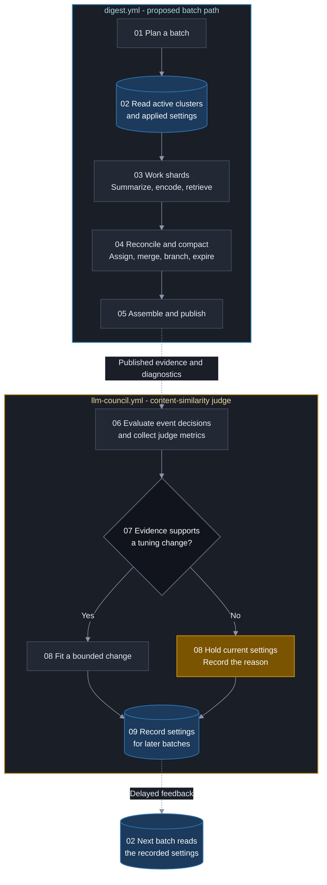

# Unsupervised topic detection and event clustering

**Last Updated**: 2026-10-04

This document develops a design for grouping articles about the same news event, keeping unrelated events separate, choosing what the reader sees, and closing stories when they stop developing.

**Status:** Working architecture. Periodic batches, LanceDB, and the scale in the [Operating scale](#operating-scale) section are selected. The remaining choices are proposals; this document does not change deployed code.

Open alternatives are numbered within their section. Performance claims remain unverified unless stated otherwise.

## Contents

- [Purpose and failure modes](#purpose-and-failure-modes)
- [Scale and processing model](#scale-and-processing-model)
- [End-to-end flow and responsibilities](#end-to-end-flow-and-responsibilities)
- [Cluster identity and representation](#cluster-identity-and-representation)
- [Finding candidate clusters](#finding-candidate-clusters)
- [Deciding whether an article belongs](#deciding-whether-an-article-belongs)
- [Time-aware matching](#time-aware-matching)
- [Activity and story lifecycle](#activity-and-story-lifecycle)
- [Cluster mergers and branches](#cluster-mergers-and-branches)
- [Choosing what the reader sees](#choosing-what-the-reader-sees)
- [Persisted data and retention](#persisted-data-and-retention)
- [Storage choice and runner performance](#storage-choice-and-runner-performance)
- [Metrics, thresholds, and tuning authority](#metrics-thresholds-and-tuning-authority)
- [See also](#see-also)

## Purpose and failure modes

### The intended outcome

A cluster is a group of articles covering one news event, not every article about the same company, person, or broad topic.

The proposed quality priority is precision: avoid merging unrelated events. The supplied architecture draft expresses this as **"zero false merges" over quantity**. That is a proposed goal, not an established guarantee. Story creation, continued admission, publication, decay, and closure are parts of the same design.

The supplied names for this problem are **Online Topic Detection and Tracking (TDT)** and **Streaming Spatiotemporal Clustering**. These names are retained from the earlier document title.

### Why similarity alone is not enough

The first source argues that standard static clustering methods, including K-Means and DBSCAN, fail for evolving news feeds because they do not address two problems on their own:

- **Different events can be semantically close.** An "Anthropic funding" article from six months ago may have a small semantic distance, such as 0.38, from today's "Anthropic IPO" article. That does not make them the same event.
- **A cluster can drift into another topic.** Continually moving its center can produce this chain: IPO filing -> existential risks -> congressional hearing on AI risks -> general election AI regulations. The source calls this "blobbing" or semantic drift.

The rest of the document therefore separates meaning, event identity, time, and activity. None should silently stand in for all the others.

## Scale and processing model

### Operating scale

**Scale:** 20,000-30,000 articles.

**Runner:** 4 vCPU, 16 GB RAM, no GPU.

### Periodic batches and compaction

Process each scheduled content-refresh batch through parallel worker shards, then reconcile the finished work before Assemble. Assignment does not require a continuously running service. The batch follows the digest workflow's schedule; a separate clustering schedule has not been selected.

The batch has two kinds of work:

- **Story reconciliation:** Decide cluster assignments, resolve duplicate clusters and branches, expire active clusters, and emit a complete set of decisions for Assemble.
- **LanceDB compaction and index maintenance:** Combine storage fragments, maintain indexes, and reclaim obsolete versions under a retention policy. These operations maintain the chosen store; they do not decide that two reports describe the same event.

Story reconciliation is repository Python code, not a running web service. LanceDB compaction maintains its files and indexes; see [table versioning][r10].

The recommended placement is `work -> reconcile -> assemble`. Reconciliation is a new logical stage, not a stage already present in the repository. It may start as an independently invocable step in the publishing job; making it a separate CI job adds a runner startup and artifact transfer. Either placement must preserve the existing ability to assemble successful items when a work shard fails.

## End-to-end flow and responsibilities

### Numbered control flow and feedback loop

Read top to bottom. Solid arrows carry the batch; dotted arrows carry evaluation and feedback. The repeated stage 02 at the bottom means **the next batch**, avoiding a return arrow across the whole diagram.



The [Metrics, thresholds, and tuning authority](#metrics-thresholds-and-tuning-authority) section extends the existing judge's measurements and fitting rules. Diagnostics are inputs to that evaluation, not truth labels or extra instructions in the model prompt.

### How the shards meet before Assemble

This expands stages **02-05** above. Every shard reads the same active-window snapshot and writes its own output. Final assignment waits until new articles from all completed shards can be compared.

```mermaid
%%{init: {"theme": "base", "themeVariables": {"background": "#0f1117", "primaryColor": "#222834", "primaryTextColor": "#e6e9f0", "primaryBorderColor": "#4b5468", "lineColor": "#8b93a7", "textColor": "#e6e9f0", "clusterBkg": "#1a1e27", "clusterBorder": "#3a4254", "titleColor": "#e6e9f0", "edgeLabelBackground": "#1a1e27", "fontSize": "14px"}}}%%
flowchart TB
  S02[("02 Shared active-state version<br/>Read-only copy in each shard")]
  A03["03a Work shard A<br/>Summary, vectors, candidates"]
  B03["03b Work shard B<br/>Summary, vectors, candidates"]
  N03["03n Further shards<br/>Independent outputs"]
  A04["04a Gather finished outputs<br/>Record missing shards"]
  B04{"04b Same event?<br/>Check across shards and current state"}
  C04["04c Join the cluster"]
  D04["04d New story or branch"]
  E04["04e Merge duplicates and expire<br/>Compact the working store"]
  S05["05 Assemble and publish"]
  S02 --> A03
  S02 --> B03
  S02 --> N03
  A03 --> A04
  B03 --> A04
  N03 --> A04
  A04 --> B04
  B04 -- "Yes" --> C04
  B04 -- "No" --> D04
  C04 --> E04
  D04 --> E04
  E04 --> S05
  classDef stage fill:#222834,stroke:#4b5468,stroke-width:1px,color:#e6e9f0;
  classDef decision fill:#11141c,stroke:#5b6477,stroke-width:1.5px,color:#ffffff;
  classDef ledger fill:#1b3a5c,stroke:#2d6ca3,stroke-width:1.5px,color:#ffffff;
  class S02 ledger;
  class B04 decision;
  class A03,B03,N03,A04,C04,D04,E04,S05 stage;
```



**What changes:** vectors are currently built in Assemble. Shard-side retrieval needs a declared evidence payload, while preserving the ONNX contract **F3-F4** and partial-run publication. Replicate the active window, not the archive; keep cross-genre matches reachable. See [the current stage][repo-assemble].

**What stays:** concurrent runs keep writer-owned outputs. If the committed base advances, replay reconciliation against that base without repeating summaries. Never merge independently edited LanceDB directories with Git. This moves the all-shard decision before Assemble and needs the corresponding contract change, not whole-run serialization. See [concurrent publication][repo-committing].

### What the existing autotune loop contributes

`LLM-COUNCIL` currently hosts the **content-similarity judge**: it asks whether two summaries describe one event, not whether a summary is well written. It judges both orders, counts compatible evidence, and fits or holds the same-story threshold. The application flag remains off.

The [Metrics, thresholds, and tuning authority](#metrics-thresholds-and-tuning-authority) section extends that judge's existing metrics and feedback loop. Keep the current figure veto, whole-group checks, item addresses, and cross-day link behavior until their stated alternatives are selected. The full current rule remains in [autotune-content-similarity.md][repo-autotune].

## Cluster identity and representation

### Three different roles

An embedding is a numerical vector representing an article's meaning. The proposals use article vectors in three roles:

- **Anchor:** A fixed reference to the original event.
- **Centroid:** A combined vector representing admitted coverage.
- **Canonical article:** The representative shown to the reader.

The anchor and the canonical article are not necessarily the same article forever. Whether they are allowed to diverge is an explicit choice below, not an assumption hidden in the schema.

### Incremental centroid

The first source describes a running average of all articles. The second proposes storing an unnormalized sum and deriving a unit-length centroid for cosine comparison.

For cluster $C$ containing $k$ articles:

```math
\vec{S}_C = \sum_{i=1}^{k} \vec{v}_i,
\qquad n_C = k
```

Derive the active centroid:

```math
\vec{c}_C = \frac{\vec{S}_C}{\|\vec{S}_C\|_2}
```

When article $N$, with vector $\vec{v}_N$, is admitted:

```math
\vec{S}_C \leftarrow \vec{S}_C + \vec{v}_N,
\qquad n_C \leftarrow n_C + 1
```

The supplied draft claims this representation guarantees deterministic, lossless incremental updates and prevents blobbing. That guarantee has not been established.

There is also a difference between the prose and the formula:

**Option 1 - All admitted coverage.** Follow the supplied cumulative sum. Every admitted article continues to contribute. This preserves the full cluster history but is not specifically a measure of recent developments.

**Option 2 - Recent developments.** Follow the prose describing a "recent centroid." This requires a recent window or a weighting rule that the sources have not supplied. It would give less influence to older coverage.

### Which article fixes the anchor

The anchor $\vec{a}_C$ is proposed as a unit-normalized vector that **never changes**. The sources alternatively describe its article as the first, highest-ranked, founding, or canonical article.

**Option 1 - First article.** Freeze the first breaking article as the anchor. Later representative changes do not move it. This keeps event identity stable but lets arrival order determine the reference.

**Option 2 - Highest-ranked article at anchor selection.** Use the highest `rank_score` when establishing the anchor, then freeze it. This is a reconciliation of "highest-ranked" with "never changes"; the selection window is not defined. It may require waiting for more than one article.

**Unresolved conflict:** The [Choosing what the reader sees](#choosing-what-the-reader-sees) section allows a higher-ranked article to become canonical later. An anchor that always follows the current canonical article would contradict the fixed-anchor rule. No proposal is discarded by treating those roles as a decision.

## Finding candidate clusters

### Eligibility for search

The first source searches **only active clusters within a time window, Delta t**. The second searches lifecycle states `HOT` and `WARM`.

**Option 1 - Lifecycle filter alone.** Search `HOT` and `WARM`, relying on lifecycle maintenance to remove ineligible stories. This is the supplied query shape but depends on lifecycle state being current.

**Option 2 - Lifecycle filter plus an explicit time predicate.** Also apply the first source's search window. This directly bounds eligible time but needs a timestamp and window that have not been selected.

The initial lifespan question includes a **sliding seven-day window**, alongside inactivity-based alternatives. A search window, an inactivity limit, and a maximum cluster age are different controls.

### Candidate retrieval and a useful cosine threshold

Use **E1** for candidate count and **E2** for the provisional retrieval floor. These are retrieval controls, not proof of event identity. The original larger candidate set and the new smaller set remain alternatives in the registry.

Illustrative LanceDB query, not implemented repository code:

```python
candidates = (
    tbl.search(new_vector)
    .distance_type("cosine")
    .where("status IN ('HOT', 'WARM')")
    .limit(retrieval_k)
    .to_pandas()
)
```

The index and query must use the same metric. For a cosine-distance result, calculate:

```math
\text{Cosine Similarity}
= 1 - \text{\_distance}
\ge \text{candidate floor}
```

Smaller distance means closer; larger similarity means closer. Do not apply this conversion to an L2 result. Exact cosine verification should use the retained vectors rather than assume a compressed approximate-index distance is the final admission score. See [LanceDB index metrics and refinement][r12].

**Research comment: There is no universal good cosine threshold.** The value depends on the encoder, text representation, quantization, dataset, and the question being judged. Sentence Transformers' evaluator chooses thresholds from labeled pairs. It finds different thresholds for overall accuracy and for balancing correct accepted matches against missed true matches. Its example is question duplication, not news-event identity. Those example values are not transferable news defaults. See [the evaluator implementation][r15].

**Repository-specific advice.** Keep the current pairwise same-story line **F1** as the comparison baseline, not as the automatic threshold for a new centroid, entity, or recency score. The owning document already reports different-story examples above that line and same-story examples below it. Raising or lowering cosine alone cannot separate overlapping populations.

For the new retriever, retain **E2** only as an unvalidated starting candidate, never a merge rule. Compare the candidate counts in **E1**, including an exact-search reference, and measure **G1**: how often a known same-event candidate survives retrieval. Choose the smallest set that retains the required coverage; a good verifier cannot recover a candidate the retriever never returned. No target recall percentage is invented here.

Use independently labeled news pairs, including the MIT and police examples in the [Deciding whether an article belongs](#deciding-whether-an-article-belongs) section. Report false merges and missed matches separately through **G2**. Do not optimize headline accuracy on a skewed sample or treat the current council's narrow sampling band as evidence for a much lower retrieval cutoff.

### Articles or cluster representatives

**Option 1 - Search cluster representatives.** Query the active centroid index, then verify the anchor and member evidence. This matches the existing draft and avoids returning several articles from one cluster as if they were several candidate events.

**Option 2 - Search articles, then map to clusters.** This preserves the new retrieve-then-verify proposal and may find a specific development that a centroid hides. It costs more indexed rows, needs unique cluster candidates after lookup, and can leave fewer distinct clusters than the requested article count.

Candidate count must state which object it counts. Changing that unit changes the meaning of retrieval recall and the cost of each verification.

## Deciding whether an article belongs

### Admission strategy

**Option 1 - Separate anchor and centroid checks.** The first source requires a new article to be close to both the running centroid and the immutable anchor. The centroid checks relevance to developing coverage; the anchor checks relevance to the original event. Separate thresholds are not supplied.

**Option 2 - Three-stage composite admission.** The second source requires candidate retrieval, hard vetoes, and a final weighted score. Its semantic component blends the centroid and anchor:

```math
S_{\text{semantic}}(N,C)
= \alpha \cdot (\vec{v}_N \cdot \vec{c}_C)
+ (1-\alpha) \cdot (\vec{v}_N \cdot \vec{a}_C)
```

The proposed centroid/anchor balance is **E4**. Its value came from the supplied source, not a repository calibration.

These rules are not interchangeable. After its separate retrieval and anchor floors pass, a blended score lets a stronger component offset a weaker one. Option 1 instead calls for independent closeness conditions.

### Hard vetoes in the composite proposal

Reject a candidate and consider another match or create a cluster when:

1. **Locations conflict.** The article and cluster contain mutually exclusive, non-empty locations. The supplied example is `GPE: ["Lebanon"]` versus `GPE: ["Gaza"]`. GPE means a geopolitical entity, such as a country or city.
2. **Actor roles conflict.** Entity overlap is strong, but subject/object roles are reversed. The example is `Apple sues Epic` versus `Epic sues Apple`.
3. **The anchor is too distant.** The proposed anchor similarity is below **E3**:

```math
\vec{v}_N \cdot \vec{a}_C < \text{anchor floor}
```

The location rule requires a definition of "mutually exclusive"; different location names alone do not define that test in the supplied material.

Rejection is not necessarily the end of classification. The [Branch detection and execution](#branch-detection-and-execution) section proposes creating a related child story when an article fails the anchor check but meets additional branch conditions.

### What makes entity evidence specific

The first source asks whether this is a limitation:

> Specific entities (high IDF) count; generic entities (low IDF) cannot be the sole reason to merge.

The architecture mentions IDF, but its actual overlap formula supplies weights by entity type. These are different measures.

**Option 1 - Rarity-based weighting.** Weight an entity by how uncommon it is across documents. This retains the high-IDF proposal but requires a document population, counting window, and formula that are not supplied.

**Option 2 - Entity-type weighting.** Use the supplied weights in **E6**. This is a concrete formula, but entity type alone does not distinguish a rare organization from one mentioned everywhere.

```math
S_{\text{entity}}
= \frac{
    \sum_{e \in E_N \cap E_C} \text{Weight}(e)
  }{
    \sum_{e \in E_N \cup E_C} \text{Weight}(e)
  }
```

**Option 3 - Combine rarity and entity type.** This is a reconciliation option, not a supplied complete formula. It retains both ideas but adds a weighting decision rather than resolving it by omission.

### Whether an entity match is mandatory

The original question refers to an existing `entities` array, with examples `["anthropic", "tesla"]`. That is a supplied premise, not a verified repository fact.

**Option 1 - Vector similarity only.** The original question explicitly offers this alternative. It avoids entity-extraction dependence but gives up entity evidence in admission.

**Option 2 - Require at least one shared primary entity.** This preserves the other alternative in that question. It adds a hard condition but needs a definition of "primary" and a policy for missing entities.

**Option 3 - Score entity overlap without a universal shared-entity gate.** This follows the composite formula. It uses entity evidence alongside meaning and event structure, but it does not by itself enforce the high-IDF rule.

These are admission-policy choices. They are separate from how an entity's weight is calculated.

### Event-frame agreement

An event frame identifies who did what to whom or what. The supplied parser operates on titles and summaries:

- **Actions:** Lemmatized root verbs.
- **Objects:** Direct or prepositional objects, using `dobj` and `pobj`.
- **Actors:** Subject lemmas, also needed by the actor-mismatch veto and proposed schema.

The proposed action/object balance is **E7**:

```math
S_{\text{event}}
= \beta \cdot \mathbb{I}(\text{Action}_N \cap \text{Action}_C \neq \emptyset)
+ (1-\beta) \cdot \text{Jaccard}(\text{Objects}_N,\text{Objects}_C)
```

The indicator $\mathbb{I}$ is 1 when the action sets overlap and 0 otherwise. Jaccard agreement is the size of the intersection divided by the size of the union. The source gives the two terms equal weight.

### Final composite score

After the vetoes pass:

```math
S_{\text{final}}
= w_1 S_{\text{semantic}}
+ w_2 S_{\text{entity}}
+ w_3 S_{\text{event}}
- P_{\text{temporal}}
```

The supplied weights are in **E5**. Time subtracts from the combined score.

The [Time-aware matching](#time-aware-matching) and [Activity and story lifecycle](#activity-and-story-lifecycle) sections define the proposed temporal penalty and state-dependent admission thresholds. Those values must be considered together, not as independent defaults.

### Retrieve, then verify the event

The supplied retrieve-then-verify pattern fits between stages 03 and 04:

1. Retrieve the top candidate articles or clusters using vector similarity. The source calls this "instant"; actual retrieval latency remains a measurement, **G6**, not a guarantee.
2. Use GLiNER and spaCy to extract and compare who, where, and actions.
3. If the event evidence agrees under the chosen admission policy, propose joining the cluster.
4. If it does not, consider the remaining candidates before creating an unlinked or parent-linked new cluster.

**Option 1 - Use entity agreement as the decision.** The source's short rule is "entities match -> join; entities do not match -> new cluster." It is cheap, but shared entities need not mean the same event, and missing extraction is not proof of a different event.

**Option 2 - Verify a coherent event frame.** Combine specific entity evidence, actor roles, actions, relevant places and times, and the applicable vetoes. This is the reconciliation option. It costs extraction and comparison work but addresses the generic-entity failure below.

[Retrieve and re-rank][r16] supports the general two-stage pattern: cheap candidate search followed by more expensive comparison. It does not establish that the proposed entity gate or candidate count is sufficient for news-event identity.

**Research comment.** GLiNER supplies model-based entity extraction, and some architectures also extract relations. spaCy supplies linguistic predictions such as dependencies and lemmas. Neither product establishes a same-event verdict merely because two extracted sets overlap. The exact models, labels, extraction-confidence policy, and missing-evidence handling belong to **E30**. Their load and CPU cost must be measured on the worker; adding two names to a diagram does not establish that both are needed. See [GLiNER][r17] and [spaCy linguistic features][r18].

### The generic-entity trap and the proposed specific-entity gate

The supplied counterexample is:

- **Article A, yesterday:** "Police in New York arrested a suspect in a subway robbery."
- **Article B, today:** "Police in New York responded to a protest outside City Hall."

The supplied extracted overlap is `["police"]` for people and `["new york"]` for location. A simple set matcher reports **1.0, or a complete match**, although arresting a robbery suspect and responding to a protest are different events. These labels are illustrative inputs, not verified output from either proposed extractor.

Term frequency-inverse document frequency, or TF-IDF, motivates rewarding distinctive evidence rather than common words. The new "Smart Entity Gate" proposes three changes:

1. **Stop-entity qualification filter, E27.** `police`, `court`, `hospital`, and country names such as `United States` must not be the sole qualifying entity. Keep useful place information for context and conflict checks; disqualifying it as the sole anchor is not the same as deleting it from all evidence.
2. **Combine vector and entity evidence.** Use the semantic score alongside specific-entity agreement, rather than let either generic overlap or a close vector force a merge. This fits **E5-E6** and the policy choice in the [Whether an entity match is mandatory](#whether-an-entity-match-is-mandatory) section.
3. **Multi-token bonus, E28.** Give a full name such as `Walter Torous` more weight than `Torous`. Preserve this proposal, but first resolve aliases so two spellings of one person do not count twice. A multi-word name is not automatically specific: `United States` is also multi-token.

IDF still needs a declared population and time window, **E29**. All shards must use the same version of those counts; shard-local frequency estimates would assign different weights to the same entity. Stop lists, IDF weighting, and a name-length bonus are proposed evidence rules, not independent permissions for automatic merging.

### Where the supplied entity matrix fits

Use it as a small **false-merge counterexample** for the entity gate, not as proof that clustering works across genres:

```text
Pairwise Entity Similarity Matrix:
[[1.    0.418 0.    0.   ]
 [0.418 1.    0.    0.   ]
 [0.    0.    1.    0.   ]
 [0.    0.    0.    1.   ]]

Supplied cluster assignments: [0, 0, 1, 2]
```

The supplied explanation puts the two different MIT stories, articles 0 and 1, in cluster 0; Sports goes to cluster 1 and Crime to cluster 2. Separating broad genres does not validate the merge of the MIT stories. If those two describe different events as stated, the desired relationship is separation, for example `[0, 1, 2, 3]`; the numeric cluster labels themselves do not matter.

The off-diagonal value **0.418** is supplied as entity similarity, not cosine similarity and not an acceptance threshold. The entity sets, weighting formula, article text, and clustering rule are not supplied, so this matrix cannot choose a production threshold. Retain the case in the independent evidence behind **G1-G2** once those inputs are available.

### Whole-group coherence versus representative checks

The repository currently requires every pair within a same-day group to pass, not only each article against its leader. This is the existing protection against A matching B and B matching C while A and C are different stories.

**Option 1 - Preserve that whole-group rule.** Use retrieval to reduce candidates, but keep the required member comparisons before a final merge. This preserves the reader-facing invariant and costs more work for large groups.

**Option 2 - Replace it with centroid, anchor, and event-frame checks.** This is the newer proposal, not an equivalent optimization. It can reduce comparisons but needs evidence that incompatible members do not enter the same cluster. The change must be explicit in the owning contract and measured through **G2** and **G10**.

## Time-aware matching

### Two proposed matching penalties

An article arriving three days later should, in the first source's proposal, need a closer match than one arriving two hours later.

**Option 1 - Linear penalty on cosine distance.**

```math
\text{Effective Distance}
= \text{Cosine Distance}
+ \lambda \times \Delta t_{\text{hours}}
```

The proposed $\lambda$ range is **E8**. The supplied worked example says each 24 hours adds roughly **0.12** to distance. That matches the lower endpoint; the upper endpoint adds **0.24**. These are examples, not separate settings.

**Option 2 - Gaussian penalty on the composite score.**

The second source calls its decay function both $D$ and $G$. They have the same supplied form:

```math
D(\Delta t) = G(\Delta t)
= \exp\left(-\frac{\Delta t^2}{2\sigma^2}\right)
```

```math
P_{\text{temporal}}(\Delta t) = 1.0 - G(\Delta t)
```

The proposed $\sigma$ is **E9**. These options act on different scores. The document does not assume they should both be applied.

### Why Gaussian decay was proposed

The second source argues that Gaussian decay is mathematically and behaviorally better for news than exponential decay, $e^{-\lambda t}$. It gives a Reuters article at hour 0 and a Bloomberg follow-up at hour 6 as an example of early coverage that should receive little penalty.

Its sketch describes a flat early plateau over **12-24 hours**, then a sharper decline, compared with exponential decay falling from the start. This is the source's characterization, not a measured comparison or a claim that the Gaussian curve is exactly flat.

For the supplied $\sigma$ in **E9**, the worked readings are:

- **6 hours:** $D(6) = \exp(-36 / 2592) = 0.986$, described as virtually no breaking-news penalty.
- **24 hours:** $D(24) = \exp(-576 / 2592) = 0.800$, described as a gentle decline.
- **72 hours, or three days:** $D(72) = \exp(-5184 / 2592) = 0.135$, described as an aggressive drop.
- **More than 96 hours:** $D \to 0$, described as a "dead zone."

The supplied penalty bands are:

- **0-12 hours:** `[0.00, 0.05]`, described as no barrier to breaking-news syndication.
- **24-48 hours:** `[0.20, 0.58]`, described as requiring stronger entity and event matches.
- **More than 72 hours:** Greater than 0.86, described as making admission virtually impossible and forcing a fresh cluster.

These rounded source figures are preserved, not silently replaced.

### Which elapsed time is measured

The composite proposal defines elapsed hours as:

```math
\Delta t = t_N - t_{\text{last\_updated}}
```

The earlier proposal does not fix the reference instant as precisely. The material also uses cluster creation time, latest-article time, and processing time for different lifecycle questions.

**Unresolved:** Specify whether an article's timestamp means publication or ingestion, what `last_updated` measures, and how late or out-of-order articles are handled. A cluster's total age is not the same as the gap since its latest article.

### Conflict between the penalty and acceptance thresholds

The supplied interpretation says stronger matches can overcome the penalty at 24-48 hours. But the supplied positive weights total 1.0. A penalty of **0.58** leaves a maximum final score of **0.42**, even with perfect positive components. That cannot pass either the HOT threshold **E12** or the WARM threshold **E13**.

**Option 1 - Keep the numeric rules.** Accept that some gaps prevent a merge regardless of match strength. This favors separation but splits follow-ups before the stated inactivity limit.

**Option 2 - Keep the intended follow-up behavior.** Revisit the penalty strength, scale, or acceptance thresholds. This preserves the possibility of later direct follow-ups but requires new values and evidence. No replacement values are selected here.

This is a conflict to resolve, not a reason to delete either the formula or the stated intent.

### Semantic similarity plus recency for ranking

The new input calls this **Pattern C: a soft moving window**. It fits as a ranking proposal for already-eligible results, not automatically as a test that two articles describe the same event.

```math
S_{\text{rank}}(q,d)
= \text{CosineSimilarity}(\vec{q},\vec{v}_d)
\times e^{-\lambda_{\text{rank}}(t_{\text{now}}-t_{\text{published},d})}
```

Here $q$ is the search query or other declared ranking reference, $d$ is an article, and article age is measured in UTC using the unit declared with **E11**. The source writes this as "Final Score"; it is named $S_{\text{rank}}$ here to distinguish it from the additive cluster-admission score.

A highly relevant article from three days ago can outrank a marginally relevant article from two hours ago, depending on the chosen decay rate. Older articles gradually lose ranking weight rather than disappear at one cutoff. A Gaussian factor is also proposed; its width is a separate ranking choice, not automatically the cluster-gap width **E9**.

**Option 1 - Apply recency to ranking only.** Use it to order relevant search results or candidates after event verification. This preserves the distinction between "same event" and "worth showing now," but ranking quality needs its own evidence, **G11**.

**Option 2 - Use multiplicative decay for admission too.** Retain the formula as an alternative to the additive penalties. This changes the score scale and time reference, so it requires a newly calibrated admission threshold and scoring version. Do not apply it on top of another time penalty by accident.

Article age relative to now is different from the gap between an article and a cluster's last update. A soft ranking window also does not bound storage or search work: retain an explicit active-history policy. Declare handling for future or missing publication times and for negative cosine scores; multiplying a negative score toward zero can improve its numeric rank instead of penalizing it.

If used for the published digest, compute the ranking at a declared build-time reference shared by every reader. It does not authorize reader-specific ordering or silent revisions to already-published items. The existing `rank_score` and representative choice remain unchanged until that separate design is selected.

## Activity and story lifecycle

### Activity is separate from match quality

The first source tracks `last_updated_at`, the timestamp of the latest article added, and `velocity`, a decaying activity score. The proposed arrival contribution is **E18**.

**Option 1 - Exponential activity decay.**

```math
\text{Score}_t
= \text{Score}_{t-1} \times e^{-\frac{\Delta t}{\tau}} + 1
```

The source says activity tends toward zero with no articles and gives **E10** as an example for $\tau$.

**Option 2 - Gaussian activity decay.**

```math
V_t = V_{t-1} \cdot G(\Delta t) + 1.0
```

Here $G$ is the Gaussian function from the [Time-aware matching](#time-aware-matching) section. The source says inactivity automatically lowers velocity toward zero and triggers eviction.

**Unresolved:** Neither proposal supplies the full no-arrival update procedure. The +1 in these recurrences belongs to an article arrival, not a periodic check. Repeated Gaussian decay also requires a clear time reference: multiplying decay factors over separate intervals does not equal applying one Gaussian factor over the total interval.

The third source also adds activity for merging clusters and creating a branch. The [Activity meaning after reconciliation](#activity-meaning-after-reconciliation) section keeps that alternative meaning separate from article-arrival activity.

### Conflict in the meaning of half-life

The first source calls $\tau$ a **half-life**. In its written equation, $\tau$ instead sets the interval over which the old score falls to $1/e$ of its value.

**Option 1 - Keep the equation.** Describe $\tau$ as the decay time constant. This preserves the supplied recurrence but changes the supplied terminology.

**Option 2 - Keep the half-life meaning.** Use a factor such as $e^{-\ln(2)\Delta t/\tau}$. This is a reconciliation option: it preserves the intended meaning of half-life but changes the written recurrence.

Neither interpretation has been selected.

### Two lifecycle structures

**Option 1 - Active and closed.** The first source periodically closes or removes a cluster from active search when inactivity, maximum lifespan, or low activity qualifies it.

- **Inactivity:** `now - last_updated_at > X_days`, using the alternatives retained in **E16**.
- **Maximum lifespan:** `now - created_at > MAX_LIFESPAN`, using **E15**. Long-running stories would start fresh sub-chapters.
- **Low activity:** `Score_t < MIN_THRESHOLD` while other stories continue to receive articles; see **E17**.

The original reaper diagram uses the related expressions `now - last_article_time > X days` and `arrival_velocity < min_rate`. Their naming differences are retained for reconciliation in the [Persisted data and retention](#persisted-data-and-retention) section.

This structure has fewer states, but it does not provide the second proposal's progressively stricter admission policy.

**Option 2 - HOT, WARM, and DEAD.** The second source proposes the following progression:

```text
INCEPTION
  A new, unmerged article arrives
        |
        v
HOT
  Age boundary: E14
  Admission: S_final >= HOT floor (E12)
  Accepts broad syndication and early breaking updates
        |
        | Age exceeds E14 OR velocity falls below E17
        v
WARM
  Age: after E14, before maximum lifespan E15
  Admission: S_final >= WARM floor (E13)
  Accepts only direct follow-ups
        |
        | Age exceeds E15 OR inactivity exceeds E16
        v
DEAD
  Evicted from the LanceDB active table
  Canonical item remains in published digests
  Secondary links are stored as also_covered_by
```

This structure supplies explicit state-dependent thresholds but adds transitions whose precedence and startup behavior must be defined.

### Conflict at cluster startup

If a new cluster starts from zero activity and receives one article, **E18** gives it a score of **1**. That is already below the proposed HOT-to-WARM threshold **E17**.

**Option 1 - Apply the velocity transition immediately.** A single-article cluster can become WARM before the age boundary **E14**. This follows the transition expression but does not match the age-only description of HOT and WARM.

**Option 2 - Protect an initial HOT period.** Define a startup or transition rule before velocity may demote a new cluster. This is a reconciliation option, not a supplied complete policy; it adds a rule that still needs a duration or condition.

The initial activity value and evaluation timing remain unspecified, so the document does not assume either behavior. The same question applies to the independently HOT child clusters proposed in the [Cluster mergers and branches](#cluster-mergers-and-branches) section.

## Cluster mergers and branches

### Why individual article admission is not enough

The third source proposes a reconciliation pass at the end of every compaction cycle for two cases:

- **Late convergence:** Two worker shards, meaning independently processed portions of the input, create separate clusters before enough details show that both cover the same event.
- **Topic forking:** A related but distinct event develops. The supplied example is "Anthropic IPO Filing" followed by "US Regulators Open Antitrust Inquiry into Anthropic IPO."

Merging removes duplicate representations of one event. Forking creates a linked but independent story without adding its article to the original centroid.

The source calls this a "Cluster Split & Merger Protocol." Its split procedure creates a child from an incoming article; it does not yet redistribute articles already assigned to a mixed cluster. A retrospective split remains unspecified, not discarded.

### Cluster-to-cluster matching

After ingesting all new articles, the proposal compares all active centroids:

```math
\mathbf{S}_{\text{inter}}
= \mathbf{C}_{\text{active}} \times \mathbf{C}_{\text{active}}^T
```

Each row of $\mathbf{C}_{\text{active}}$ is a normalized active centroid. The source describes an **$O(M^2)$ pairwise scan for at most 1,500 active clusters**, with an unverified claim of **about 5 milliseconds on CPU**. The [Pairwise comparison](#pairwise-comparison) section compares the search strategies.

Merge clusters $C_A$ and $C_B$ **if and only if all four supplied conditions hold**:

1. **Centroid proximity:** Cosine between $\vec{c}_A$ and $\vec{c}_B$ is at least **E21**.
2. **Anchor proximity:** Cosine between $\vec{a}_A$ and $\vec{a}_B$ is at least **E22**.
3. **Temporal overlap:** $|C_A.\text{first\_seen\_at} - C_B.\text{first\_seen\_at}|$ is at most **E23**.
4. **Entity agreement:** Jaccard agreement between the entity sets is at least **E24**.

The phrase "temporal overlap" here means proximity of the first-seen timestamps. The written condition does not test overlap of the clusters' full activity intervals.

### Supplied merge execution

**Survivor selection.** Keep the cluster with the earlier `first_seen_at`. If the timestamps are equal, keep the one whose articles have the higher maximum `rank_score`.

**State synthesis.** Combine sums and counts, normalize the resulting centroid, and update velocity:

```math
\vec{S}_{\text{survivor}} \leftarrow \vec{S}_A + \vec{S}_B
```

```math
n_{\text{survivor}} \leftarrow n_A + n_B
```

```math
\vec{c}_{\text{survivor}}
\leftarrow \frac{\vec{S}_{\text{survivor}}}{\|\vec{S}_{\text{survivor}}\|_2}
```

```math
\text{Velocity}_{\text{survivor}}
\leftarrow \max(\text{Velocity}_A,\text{Velocity}_B) + 1.0
```

**Metadata fusion.** Union the entity, actor, action, and object sets.

The additive merger activity term is **E19**. The formula is retained from the source; its meaning is still a choice in the [Activity meaning after reconciliation](#activity-meaning-after-reconciliation) section.

**Assignment migration.** Atomically update `article_assignments` so every article assigned to $C_{\text{absorbed}}$ points to $C_{\text{survivor}}$.

**Purge.** Delete the absorbed cluster from `active_clusters`.

**Details still needed.** Equal timestamps and equal maximum scores leave survivor selection tied. The source also leaves pair-processing order, rechecking after a centroid changes, `last_seen_at`, lifecycle status, location-set fusion, and canonical-flag updates unspecified. The earlier immutable-anchor proposal would retain the survivor's anchor; the treatment of the absorbed anchor is not defined.

Adding sums and counts assumes the article sets are disjoint. A retry must not add an absorbed cluster twice. Updating one assignment table atomically does not make this entire multi-table sequence atomic; the [Multi-table changes and recovery](#multi-table-changes-and-recovery) section records that distinction and recovery options.

### Branch detection and execution

An incoming article $N$ is proposed to create a branch from active cluster $C$ when **all three conditions hold**:

1. **Centroid match:** Cosine between $\vec{v}_N$ and $\vec{c}_C$ is at least **E25**.
2. **Anchor deviation:** Cosine between $\vec{v}_N$ and $\vec{a}_C$ is below **E26**.
3. **Action-frame conflict:** The article introduces an adversarial or divergent root action not present in the cluster.

The supplied action example contrasts `C.actions = {"file", "prepare", "value"}` with `N.actions = {"sue", "block", "investigate"}`.

Do **not** admit $N$ into $C$. Instead, create $C_{\text{child}}$ with:

- `cluster_id = cl_YYYYMMDD_XXXX_branch_01`.
- `parent_cluster_id = C.cluster_id`.
- `anchor_vector = v_N`.
- An independent `HOT` lifecycle.

The parent receives the activity boost **E20**. The article belongs to the child, so it does not change the parent's centroid.

The ID is a supplied example, not a complete uniqueness rule across worker shards or retries. The action examples also do not define a complete classifier for adversarial or divergent actions.

### Conflicts with the admission rules

#### Cluster merging versus article vetoes

The four merger conditions use unweighted entity Jaccard agreement and no explicit action-role or location veto. They can therefore permit a merge that the article-level rules would reject.

**Option 1 - Keep a separate four-condition merger.** Preserve the supplied "if and only if" rule. This needs less additional checking but can bypass the event-specific safeguards in the [Deciding whether an article belongs](#deciding-whether-an-article-belongs) section.

**Option 2 - Apply the relevant admission safeguards to mergers too.** This is a reconciliation option. It protects the same event distinctions but adds checks and can leave more duplicate clusters unmerged.

#### The two anchor thresholds

Article admission rejects similarity below **E3**, while branch detection requires similarity below **E26**.

**Option 1 - Keep the gap.** Similarities at least **E26** but below **E3** fail admission without meeting this branch condition. This creates an uncertainty range but leaves those articles to another candidate or an unlinked new cluster.

**Option 2 - Align the thresholds.** This is a reconciliation option. It removes that gap but broadens branch assignment or admission, depending on which threshold moves. No replacement threshold is selected.

### Activity meaning after reconciliation

The merger's `max(V_A, V_B)` plus **E19**, and the parent's branch boost **E20**, add activity without admitting a new article to the surviving or parent cluster.

**Option 1 - Use activity to mean article arrivals.** Keep the [Activity and story lifecycle](#activity-and-story-lifecycle) section's meaning and derive merged activity from the chosen arrival-decay model. This needs a merge rule not yet supplied and gives up the proposed reconciliation boosts.

**Option 2 - Include reconciliation and related-story activity.** Keep the new formulas, but describe velocity as a broader activity score. This preserves the boosts but can keep a story active without direct new coverage, so lifecycle thresholds need to use that meaning.

Both scores must be evaluated at a common time before they are compared. Neither the merger nor branch proposal says whether its boost also changes `last_seen_at`; that must not silently become a fictitious article arrival.

### When branching happens

The source says reconciliation handles both cases at the end of the cycle, but describes branch detection on an incoming article.

**Option 1 - Create the branch during admission.** This keeps the parent centroid untouched and makes the child available to later articles in the batch. Only duplicate-cluster merging waits until the end.

**Option 2 - Defer branch creation to reconciliation.** Record the rejected article and proposed parent until batch completion. This follows the end-of-cycle wording but needs pending state and must still keep the article out of the parent centroid.

The material does not choose how to rank multiple potential parents, whether an accepted match elsewhere takes priority, or whether parent and child clusters are excluded from later re-merging.

## Choosing what the reader sees

### Representative title and summary

The original material leaves three alternatives open:

**Option 1 - Highest-ranked article.** Use the article with the highest `rank_score`. This is the second source's detailed proposal. It can improve the representative as coverage arrives, but the visible leader can change.

**Option 2 - Earliest article.** Keep the breaking-news article as the representative. This preserves a stable original account but may omit later improvements from the primary title or summary.

**Option 3 - Generated rolling title and summary.** Use a large language model (LLM) to summarize the cluster as it develops. This can represent several reports, but requires a generation and quality-control design not yet supplied.

These display choices do not decide which article should remain the immutable anchor.

### Supplied rank-based promotion

Under the highest-ranked option:

1. When article $N$ joins cluster $C$, compare `N.rank_score` with `C.canonical.rank_score`.
2. If the new score is higher, promote $N$ to `canonical_item_id`.
3. Demote the former canonical article into the cluster's reference list.

The material does not define tie-breaking or what happens to a representative already published on an earlier day.

### Primary cards and related coverage

The supplied proposal publishes only assignments with `is_canonical == True` as primary cards. Secondary articles populate an array called `also_covered_by`. This is **not the current repository contract**.

The supplied JSON fragment is:

```json
"also_covered_by": [
  {"item_id": "world-qtb9nctm4j986nf8", "source_url": "https://euronews.com/..."},
  {"item_id": "ai-rbgxj4jcqjdthpdv", "source_url": "https://theguardian.com/..."}
]
```

The lifecycle proposal keeps published canonical items and these secondary links after the active cluster is evicted. It does not yet specify whether publication creates a frozen daily record or later revises earlier records.

Cluster mergers add a related question: which published references should follow the surviving cluster, and which must retain their original identity? A stored parent-child relationship also does not, by itself, specify a reader-facing branch display.

**Current contract.** `also_covered_by` is a count of other outlets on the same day. `covered_by` holds derived outlet links, `same_story_as` names a same-day representative, and `also_ran_earlier` holds earlier-day links. Grouped items remain published and addressable. See [the similarity owner][repo-autotune].

**Option 1 - Preserve those published meanings.** Map new internal assignments to the existing count and link fields. Keep all item addresses and cross-day references. This avoids breaking old days but requires separating long-lived internal clusters from daily card grouping.

**Option 2 - Adopt the supplied array and canonical-only publication.** This retains the source proposal but changes a persisted field's type and can change item reachability. It requires an explicit schema migration and a reader-access design; it is not selected by introducing an internal cluster store.

## Persisted data and retention

### Proposed active-cluster schema

The supplied local storage path is `./lancedb_storage/active_clusters.lance`. The vector dimensions and types below are proposals, not approved contracts.

**Table B - Proposed active-cluster fields**

| ID | Column | Type | Description |
| --- | --- | --- | --- |
| B1 | `cluster_id` | `string` | Unique identifier, such as `cl_20260930_0042` |
| B2 | `status` | `string` | `HOT` or `WARM` |
| B3 | `canonical_item_id` | `string` | Current leader article's `item_id` |
| B4 | `first_seen_at` | `timestamp` | Birth timestamp, UTC |
| B5 | `last_seen_at` | `timestamp` | Timestamp of the latest admitted article, UTC |
| B6 | `article_count` | `int32` | Total number of merged articles |
| B7 | `velocity` | `float32` | Decayed activity score |
| B8 | `anchor_vector` | `vector[384, float32]` | Immutable founding vector |
| B9 | `vector` | `vector[384, float32]` | Active normalized centroid used for the ANN index |
| B10 | `embedding_sum` | `list<float32>[384]` | Unnormalized sum vector |
| B11 | `entities` | `list<string>` | Accumulated recognized entities |
| B12 | `actors` | `list<string>` | Accumulated subject lemmas |
| B13 | `actions` | `list<string>` | Accumulated verb lemmas |
| B14 | `objects` | `list<string>` | Accumulated object lemmas |
| B15 | `locations` | `list<string>` | Accumulated location lemmas |
| B16 | `parent_cluster_id` | Not yet declared | Parent link introduced by the branching proposal; roots and absent parents need a representation |

The original 15 fields remain intact. The third source introduces `parent_cluster_id` but gives no type, nullability, migration rule, or policy when the parent merges or expires.

### Proposed article-assignment schema

The supplied local storage path is `./lancedb_storage/article_assignments.lance`.

**Table C - Proposed article-assignment fields**

| ID | Column | Type | Description |
| --- | --- | --- | --- |
| C1 | `item_id` | `string` | Article identifier |
| C2 | `cluster_id` | `string` | Target cluster identifier |
| C3 | `assigned_at` | `timestamp` | Timestamp of the merge, UTC |
| C4 | `composite_score` | `float32` | Admission score |
| C5 | `is_canonical` | `boolean` | True if selected as the canonical leader |

UTC is explicit throughout these descriptions to follow the project's time convention. The supplied schema explicitly marked only `first_seen_at` as UTC.

### Field meanings still to reconcile

**Option 1 - Keep the mechanics' names.** Use `created_at` and `last_updated_at`, with the first diagram's `last_article_time` reconciled to a declared meaning. This preserves the early formulas' vocabulary but changes the later schema.

**Option 2 - Keep the proposed schema's names.** Use `first_seen_at` and `last_seen_at`, then map all age and inactivity formulas to those meanings. This preserves the schema vocabulary but requires deciding which article times the fields contain.

Similarly, `arrival_velocity`, `Score_t`, and `velocity` are not yet declared to be one measure: the text refers both to a minimum arrival rate and to decaying activity scores.

Other undeclared details include how entity types are encoded in `list<string>`, how actor/action/object relationships survive accumulation, and how scores handle empty entity or object sets. These are open details, not implicit defaults.

Merger survivor selection also needs the maximum article `rank_score`, which is not a field in either proposed table. It must come from a declared article lookup or an additional declared value. Absorbed IDs and parent links need a consistent rewrite or retained-reference policy.

### What removing a cluster means

**Option 1 - Delete it entirely from LanceDB.** This preserves the first source's explicit deletion alternative. It releases stored state but gives up database-backed historical cluster search.

**Option 2 - Retain an inactive archive.** Mark the cluster `is_active = False`, exclude it from new matching, and retain it for historical search and digests. This preserves the first source's archive alternative, but its flag and inactive rows are not present in the proposed HOT/WARM-only schema.

**Option 3 - Evict active state but keep published coverage.** This follows the second source: remove the cluster from the active table, retain canonical digest items and `also_covered_by` links. This bounds active search but does not yet settle retention of `article_assignments` or other historical cluster state.

Closing, archiving, and deleting therefore remain different operations.

### Conflict in the deletion example

The source's row-deletion example is:

```python
tbl.delete("status = 'DEAD'")
```

The active table is also described as containing **only HOT and WARM**.

**Option 1 - Permit a transient DEAD row.** Mark the row DEAD before deleting it. This gives the supplied predicate something to match but requires that transitional state to be allowed.

**Option 2 - Delete selected active rows directly.** Select expired cluster identifiers and remove those rows without storing DEAD. This reconciliation option preserves the two-state table but changes the deletion procedure.

Neither storage sequence is specified by the supplied diagram alone.

### Multi-table changes and recovery

The merger changes cluster state, assignments, and possibly parent links and published references. **Atomic** means readers see the change completely or not at all.

**Research comment (2026-09-30 UTC): Do not infer whole-merge atomicity from table operations.** LanceDB documents versions and snapshot restoration for individual tables. The reviewed documentation does not establish one transaction spanning this entire procedure. An atomic update inside `article_assignments` is narrower than an atomic update of both tables. See [LanceDB versioning][r10].

**Option 1 - Publish a complete run snapshot.** Work on an isolated local copy, finish and check both tables, then publish one complete snapshot through a declared commit mechanism. Readers retain the preceding complete snapshot until the new one is ready. This reconciliation option needs snapshot storage and publication rules but avoids exposing intermediate cross-table state.

**Option 2 - Record and resume each merge.** Add a persisted operation record and retry-safe updates, with readers protected from incomplete changes. This reconciliation option retains finer-grained progress but adds a contract, recovery steps, and read-side complexity.

Neither option is implemented or selected. Cache upload is not the missing transaction.

For the recommended replica model in the [How the shards meet before Assemble](#how-the-shards-meet-before-assemble) section, a snapshot must identify the source state, model/scoring version, and included shard outputs. Each shard writes its own payload rather than mutating that base. If another run commits first, re-evaluate the affected decisions against the new logical base; do not overwrite a newer database snapshot with a stale copy.

## Storage choice and runner performance

### Selected store

LanceDB is selected. Measure retrieval, maintenance, and snapshot distribution through **G6-G8** rather than reopen the storage choice with unverified timings.

### Supplied capacity and timing figures

The following figures came from the earlier supplied draft. They are not measurements taken in this session, current scale limits, or predictions for the revised 30,000-article envelope.

**Table D - Earlier supplied scale and runtime figures**

| ID | Metric | 5,000 articles | 20,000 articles | Claimed impact on a 4 vCPU, 16 GB RAM runner |
| --- | --- | --- | --- | --- |
| D1 | Active clusters in a seven-day window | About 400-800 | About 1,500-3,500 | Less than 25 MB RAM; described as negligible |
| D2 | Embedding computation with MiniLM | About 15 seconds per batch | About 45 seconds per batch | Bound by PyTorch CPU threads; example: `torch.set_num_threads(4)` |
| D3 | LanceDB disk footprint | About 12 MB | About 48 MB | Described as trivial against a stated typical runner disk limit of 14 GB |
| D4 | Candidate vector search | Less than 1 millisecond | Less than 4 milliseconds | Flat scan or a small IVF index through `mmap` |
| D5 | Compaction run duration | About 25 seconds | About 75 seconds | Described as within typical GitHub Actions step timeouts |

### Pairwise comparison

#### Comparison strategy

**Option 1 - Compare every active pair.** Complete coverage, with quadratic work. Measure the real active set rather than silently cut it at 1,500.

**Option 2 - Retrieve candidates, then verify.** Fewer comparisons, but possibly missed duplicate clusters. Measure that loss through **G1-G2**.

## Metrics, thresholds, and tuning authority

Extend the existing **content-similarity judge** with these controls and measurements. They belong to its evaluation and future feedback loop, not a new judge or a parallel metrics system. Other sections refer to these row IDs.

**E:** proposed controls. **F:** current baseline. **G:** existing measurements to reuse and new ones to add. This is the design of that extension, not its implementation.

### Proposed retrieval, scoring, and lifecycle settings

**Table E - Proposed controls and unresolved alternatives**

| ID | Setting | Supplied value or alternatives | Meaning and evidence still needed |
| --- | --- | --- | --- |
| E1 | Retrieval candidate count, `retrieval_k` | Earlier: 10. New input: 3-5. Initial comparison: 3, 5, and 10. | Count articles or distinct clusters explicitly. Choose with candidate recall G1 and cost G6, not by assuming nearest neighbors are true matches. |
| E2 | Candidate cosine floor | 0.55 | Unvalidated retrieval starting point, never an admission guarantee. Recalibrate for the actual encoder and index. |
| E3 | Article-to-anchor admission floor | 0.50 | Hard rejection in the supplied composite proposal. Distinct from current repository line F1. |
| E4 | Centroid share, `alpha` | 0.70; anchor share 0.30 | Weights the two semantic comparisons. Not a substitute for independent floors. |
| E5 | Composite semantic/entity/event weights | 0.45 / 0.30 / 0.25 | Positive weights total 1.0 before the temporal penalty. Requires a new scoring version and labels. |
| E6 | Entity-type weights | PERSON 1.0; ORG 1.0; GPE/LOC 0.3; PRODUCT 0.7 | Type is not rarity. Entity encoding and the relationship to IDF remain open. |
| E7 | Event action share, `beta` | 0.50; object share 0.50 | Action-overlap indicator plus object Jaccard agreement. Empty evidence needs a declared policy. |
| E8 | Linear distance penalty, `lambda` | 0.005-0.01 per elapsed hour | Adds distance, rather than multiplying rank relevance. Time reference must be fixed. |
| E9 | Gaussian cluster-gap width, `sigma` | 36 hours | Used by the supplied admission/activity proposals; not automatically a ranking-decay width. |
| E10 | Exponential activity interval, `tau` | 24 hours as supplied | Source calls it half-life, but its equation uses a time constant. Resolve the [Conflict in the meaning of half-life](#conflict-in-the-meaning-of-half-life) section first. |
| E11 | Ranking recency rate, `lambda_rank` | Not selected; inverse units of the declared article age | Multiplies ranking similarity. Exponential versus Gaussian ranking decay is also unselected. |
| E12 | HOT composite admission floor | 0.65 | Proposed value after the chosen temporal penalty. Check the unreachable-score conflict in the [Conflict between the penalty and acceptance thresholds](#conflict-between-the-penalty-and-acceptance-thresholds) section. |
| E13 | WARM composite admission floor | 0.82 | Stricter proposed admission, not a second cosine cutoff. |
| E14 | HOT age boundary | 72 hours | Proposed HOT-to-WARM age transition, separate from activity-based demotion. |
| E15 | Maximum cluster lifespan | Detailed proposal: 168 hours, or 7 days. Earlier alternative: 7-14 days. | Forces a new chapter; policy is not selected. |
| E16 | Inactivity closure | Detailed proposal: more than 48 hours. Earlier alternatives: 24 or 72 hours. | Measures absence of admitted articles, not total cluster age or a cron interval. |
| E17 | Low-activity transition | HOT-to-WARM below 1.5. Earlier generic `MIN_THRESHOLD`/`min_rate` unspecified. | Arrival rate and decaying score must not be conflated. Startup behavior remains open. |
| E18 | New-article activity contribution | +1.0 | Added once per newly admitted article, not once per periodic check or retry. |
| E19 | Merger activity contribution | +1.0 after `max(V_A, V_B)` | Broader activity interpretation; not yet reconciled with an arrival-derived score. |
| E20 | Parent activity after a fork | +0.2 | Does not imply that the parent admitted the child's article or received a new article timestamp. |
| E21 | Cluster-merger centroid floor | 0.85 | One of four supplied merger conditions, not proof of whole-group coherence. |
| E22 | Cluster-merger anchor floor | 0.75 | Compare fixed original-event references. |
| E23 | Cluster-merger first-seen gap | At most 72 hours | First-seen proximity, not overlap of complete activity intervals. |
| E24 | Cluster-merger entity Jaccard floor | 0.50 | Unweighted in the supplied merger rule; conflicts with a specificity-aware article gate. |
| E25 | Fork centroid floor | 0.60 | Related topic evidence; all other fork conditions must also hold. |
| E26 | Fork anchor-deviation ceiling | Strictly below 0.45 | Leaves a gap below E3; keep or align it explicitly. |
| E27 | Stop entities for sole qualification | Examples: police, court, hospital, United States | Complete list and rule are not supplied. Preserve location context while preventing generic-only qualification. |
| E28 | Multi-token entity bonus | No magnitude supplied | Full names versus shortened aliases. Normalize identity before counting or adding a bonus. |
| E29 | IDF population, window, and formula | Not supplied | One versioned document-frequency basis shared by every shard. |
| E30 | Entity/event extraction model and confidence policy | GLiNER plus spaCy proposed; exact models, labels, and confidence floors unselected | Measure extraction coverage and incremental event accuracy before adopting both dependencies. |
| E31 | Approximate-index search effort | `ef`, `nprobes`, refinement: not selected | Backend-specific controls. Compare against exact retrieval through G1 and G6. |
| E32 | Active retrieval history | Explicit window required; earlier sliding seven-day example retained | Different from lifespan E15 and existing cross-day display window F5. Bound the read without silently dropping eligible stories. |
| E33 | Storage compaction/version retention | Not selected | Reclaim obsolete storage without deleting a snapshot a run still needs. Not an event-decay threshold. |

None of E1-E33 is automatically adjustable by the current nightly fitter. An extension needs a declared objective, stable evidence population, scoring-version handling, bounds, and a rollback path.

### Existing judge and tuning controls

The configured council registers `content-similarity-judge`. It decides **same event or different event**, not summary-writing quality. `LLM-COUNCIL` hosts that judge's prepare, shard, and settle work; it does not define the verdict itself. See [the council][repo-council].

Reuse its existing pair records, judge metrics, holdout comparisons, and fitted-threshold records. Table F is the current baseline from [configuration][repo-config] and [the encoder][repo-embed], read on **2026-09-30 UTC**.

**Table F - Current settings, not new design defaults**

| ID | Existing setting or contract | Current value | Meaning and change authority |
| --- | --- | --- | --- |
| F1 | `assemble.same_story.floor_min` | 0.94 | Current pairwise score baseline. The existing fitter may supply a replacement only when enabled and eligible. |
| F2 | `assemble.same_story.cosine_weight` | 1.0 | Current score is cosine alone; the contract permits only this weight. The proposed composite is a contract change. |
| F3 | Published encoder and vector representation | `all-minilm-l6-v2-quantized/2026-08-22`; ONNX; 384 dimensions; stored int8; title plus summary input | Shared runner/browser weights and scoring identity. Do not mix a new embedding representation into old fitted counts. |
| F4 | Encoder execution | One intra-operation thread, one inter-operation thread, sequential execution, one unpadded sequence per forward pass | Reproducibility contract, not an autotune speed knob. Parallelize independent work without silently changing vector arithmetic. |
| F5 | `assemble.same_story_window_hours` | 36 hours | Existing cross-day coverage lookup. Same-day grouping and earlier-day link display are distinct. |
| F6 | `adaptive_dedup_threshold.enabled` | false | Fitted lines are not applied by the current committed configuration. This document does not enable them. |
| F7 | Fitter score band and slot width | `band_low=0.88`, `band_high=1.00`, `bin_width=0.001` | Fixed sampling/counting range. It does not follow the currently applied line. A new score needs compatible evidence and a declared band. |
| F8 | Nightly pair budget | `pair_budget=200` | Bounded selected pairs, read in both summary orders. Not the number of all possible day pairs. |
| F9 | Minimum evidence | 200 agreed-NO readings; 30 above-line readings; 10 days | `minimum_negatives`, `minimum_above_line`, and `minimum_days`; insufficient evidence holds the line. |
| F10 | Judge-health limits | `disagreement_max=0.15`; `unclear_max=0.35` | Excess order disagreement or uncertainty holds the fit. Always report their actual denominators. |
| F11 | Agreed-NO readings set aside | `discard_share=0.03` | A share of agreed-NO readings, not all judged pairs and not a false-merge allowance. |
| F12 | Directional movement | Fall: weight 0.50, at most 10 slots/day. Rise: weight 0.15, at most 3 slots/day. | Existing down-fast/up-slow policy; both directions are damped and capped. |
| F13 | Dead zone | `dead_zone_bins=1` | A sub-slot proposal is held rather than treated as useful movement. |
| F14 | Applied-line lookback | `applied_lookback_days=7` | Select an eligible fitted row within the configured lookback, otherwise use the committed line. |
| F15 | Step-change diagnostic | Guard enforcement false; 14-row comparison; multiple 5.0 | Report the unusual shift; the additional guard is not currently enforced. |
| F16 | Settled-evidence diagnostic | `settled_delta=0.001`; `settled_window_days=7` | Compare fitted proposals over time, not merely a damped output that was designed to move slowly. |

The judge sees summaries as untrusted data in an operator-controlled model process. The dotted loop does not permit article text to change instructions, destinations, or execution.

### Extend the judge's existing metrics

The judge already records its per-shard pair counts, disagreement, uncertainty, and decode costs in [ContentSimilarityJudgeMetrics][repo-judge-metrics]. [Holdout comparisons][repo-holdout] measure decision errors; [fitted-threshold records][repo-fit] explain changes and holds. Extend these where the meaning and unit match. Keep batch-, cluster-, and pair-level readings distinct.

**Table G - Integration into the content-similarity judge**

| ID | Measurement | Reuse or extension | Use in the feedback loop |
| --- | --- | --- | --- |
| G1 | Same-event candidate recall at K | Add labeled-case retrieval checks and an exact-search comparison. | Fit E1, E2, and E31 without hiding candidates the current retriever misses. |
| G2 | False and missed merges | Extend the existing holdout's four decision counts for the new scoring path. Preserve labels and denominators. | Compare admission and merger errors; the current holdout measures the line, not the model judge. |
| G3 | Reachability and coverage correctness | Feed publication checks into the judge's evaluation: missing addresses, wrong outlet counts, invalid cross-day folds. | Prevent a quality improvement from breaking reader access. |
| G4 | Order disagreement and uncertainty | Reuse `disagreement_rate`, `unclear_rate`, and their pair counts. Keep current per-shard and per-day meanings distinct. | Preserve the existing judge-health gates F10. |
| G5 | Evidence completeness | Reuse `pairs_dealt`, `pairs_read`, `pairs_refused`, `pairs_unreadable`, and `pairs_abandoned`; link work-shard completeness separately. | Hold a fit on missing required judging evidence without preventing partial content publication. |
| G6 | Retrieval and verification latency | Add timed query/pair measurements, including median and 95th percentile. | Compare candidate and verification policies at a named workload. |
| G7 | Cost per refresh | Reuse decode totals/maxima; link producer timings for loading, extraction, reconciliation, compaction, and transfer. | Determine affordable articles per run without confusing model time with whole-run time. |
| G8 | Active-state replication cost | Add snapshot bytes, active rows, peak shard memory, and total transferred bytes. | Evaluate the cost of distributing the active state as shard count grows. |
| G9 | Missing evidence | Preserve grammar/unreadable counters; add distinct vector, entity, alias, and timestamp failures. | Keep unknown evidence separate from a different-event verdict. |
| G10 | Group and branch coherence | Add cluster/branch outcomes to same-event evaluation. | Detect incompatible members, false or missed branches, and parent/child re-merges. |
| G11 | Recency-ranking quality | Add relevance/freshness evaluation owned by this judge's pipeline. | Evaluate E11 separately; existing same-event YES/NO labels do not grade ranking or prose. |
| G12 | Fit audit and scoring compatibility | Reuse `previous`, `proposed`, `applied`, `held_reason`, `clamp_kind`, and scoring stamps. | Explain each move or hold and reject mixed scoring versions. |

The council will collect these measurements for the existing judge. That does **not** mean placing the measurements in the LLM prompt: the event verdict must remain blind to the score it helps calibrate. No-observation rates remain absent, and replay inputs remain bounded.

## See also

Research sources are linked beside their claims. Repository owners:

- [Content-similarity rules and autotuning][repo-autotune].
- [LLM-COUNCIL and its registered judges][repo-council].
- [Concurrent publication][repo-committing].
- [Project diagram conventions][repo-diagrams].

[r10]: https://docs.lancedb.com/tables/versioning
[r12]: https://docs.lancedb.com/indexing/vector-index
[r15]: https://raw.githubusercontent.com/huggingface/sentence-transformers/main/sentence_transformers/sentence_transformer/evaluation/binary_classification.py
[r16]: https://sbert.net/examples/sentence_transformer/applications/retrieve_rerank/README.html
[r17]: https://raw.githubusercontent.com/urchade/GLiNER/main/README.md
[r18]: https://spacy.io/usage/linguistic-features
[repo-autotune]: ../docs/architecture/publishing/autotune-content-similarity.md
[repo-committing]: ../docs/architecture/publishing/committing.md
[repo-assemble]: ../backend/idhazh/stages/assemble.py
[repo-embed]: ../backend/idhazh/embed.py
[repo-config]: ../config/idhazh.json
[repo-council]: ../docs/architecture/publishing/llm-council.md
[repo-judge-metrics]: ../backend/idhazh/contracts/content_similarity_judge_metrics.py
[repo-holdout]: ../backend/idhazh/contracts/merge_line_holdout_score.py
[repo-fit]: ../backend/idhazh/contracts/fitted_similarity_threshold.py
[repo-diagrams]: ../docs/reference/documentation-structure.md#diagrams
