# Unsupervised topic detection and event clustering

**Last Updated**: 2026-10-04

Group reports of the same occurrence, connect distinct developments, and publish a short explanation without losing the underlying reports.

**Status:** Consolidated architecture, not implemented behavior. LanceDB, periodic batches, summary-based features, and Fastino GLiNER are selected. New Topic Domains are discovered automatically but require review before public promotion. Verified copies count as distribution, not new reporting. Ordinary active search uses a **configurable 15-day window**; activity decay does not declare an occurrence permanently dead.

All tunable behavior belongs in configuration. The remaining thresholds require independent evidence, not copied values from a proposal. Runtime, throughput, memory estimates, and GLiNER model pins are omitted.

## Contents

- [Glossary and identities](#glossary-and-identities)
- [Evidence production](#evidence-production)
- [Logical records and counting populations](#logical-records-and-counting-populations)
- [Batch flow](#batch-flow)
- [Candidate retrieval and decisions](#candidate-retrieval-and-decisions)
- [Corrections, activity, and cold recovery](#corrections-activity-and-cold-recovery)
- [Snapshots and historical state](#snapshots-and-historical-state)
- [Reader views](#reader-views)
- [Evaluation and control registry](#evaluation-and-control-registry)
- [Design rationale and rejected alternatives](#design-rationale-and-rejected-alternatives)
- [See also](#see-also)

## Glossary and identities

### Architectural terms

- **Raw Feed Item:** Untrusted external news content and its metadata, before extraction and sanitization.
- **Document Unit ($d$):** One frozen semantic representation of a source revision: a three-sentence summary, dense vector, sparse token counts, typed entities, predicate-linked frames, and time evidence.
- **Event Cluster ($C$):** State representing one real-world occurrence. Membership can evolve or be corrected; participants, place, and occurrence time remain evidence, not facts invented from proximity.
- **Topic Domain:** A persistent broad category that routes documents and organizes events. A candidate domain is not a public category until reviewed.
- **Event Joining:** Assigning a Document Unit to an Event Cluster because it describes the same occurrence.
- **Event Threading:** Connecting distinct events through a supported, directed Story Edge. It does not merge their reports into one occurrence.
- **Story DAG:** A directed acyclic graph of distinct events. It can branch and converge; a linear reading path is only a selected view.
- **Story Edge:** A typed, directed, evidence-backed relationship. Chronological, follow-up, thematic, and reported causal relationships have different meanings.
- **Anchor Vector:** The founding Document Unit's immutable vector within its named representation. A changed display representative does not move it.
- **Active Centroid:** The normalized mean of the declared semantic contributors to one Event Cluster, not of all events linked in its Story DAG.
- **Verified copy:** A retained report established as substantially the same reporting contribution as another, through copy/origin evidence. Similar wording alone is only a candidate signal.
- **Reporting contribution:** One distinct contribution of reporting. Verified copies share a contribution; their separate publication and distribution records remain available.

Merging duplicate Event Clusters consolidates representations of the same event. A corrective split repairs mixed membership. Branching means one event has several subsequent developments; convergence means a later event has several supported predecessors.

### Identity and replay

**Table A - Stable record identities**

| ID | Record | Identity rule |
| --- | --- | --- |
| A1 | Document Unit | UUIDv5 from a fixed namespace and unambiguous encoding of `canonical_url`, source `text_sha`, and `representation_revision` |
| A2 | Event Cluster | ULID allocated once with its creation decision and reused on replay |
| A3 | Story DAG | ULID allocated at initialization; preserve aliases if stories converge |
| A4 | Topic Domain | Validated stable slug, such as `tech.ai.chips`; naming changes preserve references |
| A5 | Story Edge | UUIDv5 from a fixed namespace and encoded source Event Cluster ID, target ID, and relation type |

UUIDv5 uses SHA-1 internally; use the standard namespace/name algorithm, not a raw digest. ULID ordering reflects identifier creation, not event chronology, and does not establish a global order across independent writers.

`text_sha` identifies canonical sanitized source text. `representation_revision` identifies one frozen materialization, not merely a model name: fresh generations can differ under the same model. Replay reuses the stored materialization. Changed summary, frames, vectors, entities, or tokenization create a new representation revision. Reweighting BM25 from new corpus statistics does not.

An upsert with an existing Document Unit ID must not silently replace different semantic content. Active membership selects one representation per source revision; replacing it transfers its contribution instead of adding another vote or arrival. Public `item_id` values and report addresses remain separate and unchanged.

Changing an edge's endpoints or type creates a new edge identity with a recorded correction. All creation, copy, assignment, and correction decisions must be retry-safe. This requires idempotent effects, not deterministic fresh LLM output.

## Evidence production

### One summary and one owner of event meaning

The operator-controlled LLM produces the standardized three-sentence summary, primary predicate frame, and supported time evidence in one response. Preserve the participants, action, negation, place, time, and material figures needed to distinguish the occurrence.

The same frozen summary feeds every matching feature. Source metadata and bounded evidence references support validation, copy provenance, time resolution, and numerical checks; they are not a second raw-text semantic retrieval path.

Three sentences do not guarantee adequate evidence or a valid encoder input. Check tokenizer length and the preservation of distinguishing facts without silent truncation. A missing summary or unresolved primary occurrence remains pending or insufficient for automatic Joining. A raw lead paragraph is not an equivalent fallback.

### Dense, entity, and sparse features

- **Dense meaning:** Sentence-Transformers `all-MiniLM-L6-v2`, producing 384-dimensional FP32 working vectors normalized to unit L2 length. Compatible normalized vectors can use a dot product for cosine similarity. Validate nonzero, finite vectors.
- **Typed entities:** Fastino GLiNER extracts PERSON, ORG, GPE, LOC, FACILITY, and REGULATION. It does not compete with the LLM for Action/Agents/Targets ownership. Deployment details are not specified here.
- **Lexical evidence:** spaCy tokenization and lemmatization, including the language components needed for correct lemmas, but not a second NER or predicate-extraction pipeline. Preserve negation, figures, units, proper names, and entity phrases.
- **Sparse retrieval:** Store unigram and bigram counts; derive BM25 scores from an inverted index with a shared analyzer, alias rules, vocabulary, document frequencies, and average document length. Its statistical population is one selected representation per distinct reporting contribution in the named corpus. Final entity-preserving counts wait for both lexical and entity results.

Do not lemmatize the text sent to MiniLM or Fastino GLiNER. There is no free-form LLM keyword step. Lexical output is repeatable for fixed summary bytes and versions; corpus statistics and representations can still change.

DATE, TIME, PERCENT, MONEY, QUANTITY, and CARDINAL are excluded from identity-entity selection only. Their values remain available for time, figure, and sparse evidence. Shared generic entities cannot justify Joining alone, but a universal exact place/ORG gate can wrongly exclude a real match. Resolve aliases rather than reward name length.

Each frame binds its predicate to its participants, assertion status, time, place, and evidence. Preserve active/passive equivalents, role reversal, denial, plans, reported speech, and background context. Independent lists of verbs and names cannot preserve those bindings.

### Three clocks

- **`t_event`:** Supported occurrence point or interval, with precision, evidence, and resolved/unknown/ambiguous status.
- **`t_pub`:** Supported publication timestamp and provenance, normalized to UTC. It describes coverage freshness.
- **Coverage observation time:** The recorded observation of new reporting. It controls activity and ordinary active-search eligibility.

Identifier creation, processing time, and these clocks are not interchangeable. A representation refresh, verified copy, compaction, or new Story Edge does not become a new-reporting observation.

The temporal instruction is:

> Extract the time expression attached to the primary occurrence. Resolve relative dates against publication time only when that reference and the source calendar basis are supported. Return UTC points or bounds with precision and uncertainty. Do not invent a precise instant from a date-only expression. If event time is unresolved, retain that state and keep publication time separately as a labelled proxy.

An author may use a local calendar or quote an earlier statement. A UTC publication timestamp alone does not settle what "yesterday" meant. Day-level bounds express uncertainty within a day, not an occurrence at midnight.

A publication proxy may support labelled freshness estimates or candidate ordering. It cannot establish occurrence-time agreement, a temporal veto, Story Edge direction, or causation. Unknown time is neither a match nor a contradiction.

## Logical records and counting populations

### Keep the populations separate

- **Stored Document Units:** Every retained representation, including superseded records and copied reports.
- **Current membership:** Assigned source revisions, each pointing to its selected Document Unit.
- **Semantic contributors:** One selected representation per distinct reporting contribution after verified-copy suppression.
- **Activity observations:** New-reporting observations counted once under their recorded identities and times.
- **Distribution:** Where reporting appeared, including copies. Outlets, websites, and independent newsrooms are not interchangeable counts.
- **Retrieval, verification, and views:** Candidate events, required member comparisons, and displayed reports each have a separate population.

**Verified copies add distribution and provenance, but no extra centroid contribution and no reset of the 15-day clock.** Keep their articles and outlet references. A copy classification that is uncertain must not silently suppress a potentially distinct report or label it as proven independent.

A source revision containing genuinely new reporting can create a new reporting observation. A changed hash, model output, or formatting alone cannot. Keep copy decisions and their evidence so corrections can recalculate contributions and observation attribution.

Verified copies and superseded representations do not add independent BM25 or entity-frequency counts. Retain them for report access and provenance, not repeated statistical votes. Each comparison uses a named statistics snapshot; contribution corrections rebuild the affected statistics and derived search view under a new version.

### Record responsibilities

These are logical contracts, not promises that Arrow or LanceDB automatically enforces SQL keys or foreign keys.

**Table B - Records and their invariants**

| ID | Record | Required content and invariant |
| --- | --- | --- |
| B1 | Document Units | Identity, source revision, frozen summary/language, dense vector, token counts, typed entities, primary frames, time evidence, provenance, and processing versions |
| B2 | Assignments | Source revision, selected Document Unit, Event Cluster, status, decision evidence, and version; unresolved membership is explicit |
| B3 | Reporting contributions and copies | Contribution identity, member source reports, selected semantic representative, copy status/evidence, and revision; stored-report count is not contributor count |
| B4 | Observations and distribution | Unique observation identity, original observation time, publication time, contribution classification, and outlet/origin references; retries do not create arrivals |
| B5 | Event Clusters | Stable ID, founding Document Unit, compatible anchor/sum/centroid, contributor count, activity state, occurrence evidence, representatives, and observation/evaluation times |
| B6 | Topic Domains | Stable slug, proposed name, supporting events, candidate/reviewed/public status, routing version, and aliases; discovery does not publish a category |
| B7 | Story DAGs | Stable ID, roots and event membership, aliases, and version; a story ID references this record, not the edge table |
| B8 | Story Edges | Endpoints, relation type, evidence, status, verifier version, and correction references; validate direction, self-links, cycles, and missing endpoints |
| B9 | Decisions and snapshots | Input/base identity, participating shards, copy/membership/graph corrections, completeness, and affected record versions; publish a consistent result |
| B10 | View projections | Snapshot and scoring identity, selection window/budget, topic/event references, selected path/branches, diagnostics, and reachable report links |

Preserve predicate-linked evidence instead of accumulating unrelated actor, action, and target lists. Keep occurrence-time intervals separate from `first_seen_at` and `last_seen_at`, which refer to eligible new-reporting observations.

If two Story DAGs become connected, retain a canonical story identity with aliases and the valid roots from both. Use a stable recorded survivor rule; identifier order may break a storage tie, but cannot establish causation or event chronology. Individual events do not merge merely because their stories converge.

## Batch flow

The stage order is **`work -> topic-event-cluster-reconcile -> assemble`**. Shards produce immutable evidence; reconciliation settles shared identity and graph decisions. No box requires a separate CI job.

```mermaid
%%{init: {"theme": "base", "themeVariables": {"fontFamily": "sans-serif", "primaryColor": "#f8fafc", "primaryTextColor": "#1f2937", "primaryBorderColor": "#64748b", "lineColor": "#64748b", "textColor": "#1f2937", "clusterBkg": "#f8fafc", "clusterBorder": "#94a3b8", "edgeLabelBackground": "#ffffff"}}}%%
flowchart TB
  PLAN["01 Plan a periodic batch"]
  BASE[("02 Pin committed state<br/>Feature and statistics versions")]

  subgraph WORK["03 work - independent shards"]
    direction TB
    RAW["Extract and sanitize<br/>Raw Feed Items"]
    LLM["LLM<br/>Three-sentence summary<br/>Bound frames and time evidence"]
    DENSE["MiniLM<br/>Dense summary vector"]
    ENTITIES["Fastino GLiNER<br/>Typed entity spans"]
    TOKENS["spaCy<br/>Tokens and lemmas"]
    SPARSE["Entity-preserving token counts<br/>Shared BM25 statistics"]
    UNIT[("Frozen Document Units<br/>Source and observation references")]
  end

  subgraph RECONCILE["04 topic-event-cluster-reconcile"]
    direction TB
    GATHER["Gather completed outputs<br/>Record missing work"]
    CANDIDATES["Hybrid retrieval and copy candidates<br/>Across shards and prior state"]
    VERIFY["Verify membership and relations<br/>Use the decision table"]
    SETTLE["Settle assignments and corrections<br/>Rebuild affected graph and counts"]
    TOPICS["Record candidate Topic Domains<br/>Public promotion requires review"]
    MEASURE["Measure activity, distribution and trends<br/>Prepare bounded reading views"]
    RESULT[("Complete logical result<br/>Versioned LanceDB snapshot")]
  end

  ASSEMBLE["05 assemble<br/>Static digest and view projections"]
  PUBLISH["06 Commit complete state to Git<br/>Publish; refresh S3 / R2 replica"]

  subgraph COUNCIL["LLM-COUNCIL - content-similarity judge"]
    direction TB
    AUDIT["07 Evaluate independent cases<br/>Reuse judge records at their grain"]
    GATE{"08 Evidence supports<br/>a permitted change?"}
    FIT["09 Fit a bounded change"]
    HOLD["09 Hold and record why"]
    SETTINGS[("10 Versioned settings<br/>For later batches")]
  end

  NEXT["Next batch<br/>Do not wait for the nightly judge"]
  subgraph METRICS["Metrics"]
    subgraph AUTO["Autotuned Metric"]
      FLOOR["Joining floor (score)<br/>D6 and D24 govern adjustment"]
    end
  end

  PLAN --> BASE
  BASE --> RAW
  RAW --> LLM
  LLM -->|"Same summary"| DENSE
  LLM -->|"Same summary"| ENTITIES
  LLM -->|"Same summary"| TOKENS
  ENTITIES --> SPARSE
  TOKENS --> SPARSE
  DENSE --> UNIT
  SPARSE --> UNIT
  LLM -->|"Frames and time evidence"| UNIT
  UNIT --> GATHER
  GATHER --> CANDIDATES
  CANDIDATES --> VERIFY
  VERIFY --> SETTLE
  SETTLE --> TOPICS
  TOPICS --> MEASURE
  MEASURE --> RESULT
  RESULT --> ASSEMBLE
  ASSEMBLE --> PUBLISH
  PUBLISH --> NEXT
  PUBLISH -->|"Evidence for a separate evaluation run"| AUDIT
  AUDIT --> GATE
  GATE -->|"Yes"| FIT
  GATE -->|"No"| HOLD
  FIT --> SETTINGS
  HOLD --> SETTINGS
  SETTINGS -. "Apply compatible approved settings later" .-> NEXT
  VERIFY --- METRICS

  classDef stage fill:#f8fafc,stroke:#64748b,stroke-width:1.5px,color:#1f2937;
  classDef decision fill:#ecfeff,stroke:#0e7490,stroke-width:1.5px,color:#164e63;
  classDef warn fill:#fffbeb,stroke:#92400e,stroke-width:1.5px,color:#78350f;
  classDef ledger fill:#eff6ff,stroke:#1d4ed8,stroke-width:1.5px,color:#1e3a8a;
  classDef ext fill:#faf5ff,stroke:#7e22ce,stroke-width:1.5px,stroke-dasharray:5 3,color:#581c87;
  classDef autotuned fill:#faf5ff,stroke:#8b5cf6,stroke-width:1.5px,color:#6b21a8;
  class PLAN,LLM,DENSE,ENTITIES,TOKENS,SPARSE,GATHER,CANDIDATES,VERIFY,SETTLE,TOPICS,MEASURE,ASSEMBLE,PUBLISH,AUDIT,FIT,NEXT stage;
  class RAW ext;
  class BASE,UNIT,RESULT,SETTINGS ledger;
  class GATE decision;
  class HOLD warn;
  class FLOOR autotuned;
  linkStyle 23 stroke:#15803d,stroke-width:1.5px;
  linkStyle 24 stroke:#dc2626,stroke-width:1.5px;
```



Feature production can overlap within a configured executor. Sparse finalization waits for lexical and entity evidence. Reconciliation joins completed shard outputs, not separately mutated database copies.

Required summaries or verification evidence may remain pending without blocking unrelated work. Record missing shards and incomplete decisions. Assemble can publish successfully processed reports without inventing group membership or graph edges. Infrastructure or contract failures are reported explicitly, not relabelled as successful empty results.

## Candidate retrieval and decisions

### Search effort is not the number of clusters

The system does **not** choose a fixed number of Event Clusters. New occurrences form clusters when evidence warrants them.

`candidate_k` controls how much nearby evidence one retrieval asks for; it does not cap the number of events that can exist. The value is configurable and evaluated through candidate recall. If a bounded search cannot settle a case, record the limitation instead of claiming that no match exists.

Search eligible Document Units through dense and BM25 channels, combine rank positions through reciprocal rank fusion, then map assigned hits to distinct Event Clusters. Retain supporting member IDs and unassigned new-item candidates. Do not add raw BM25 and cosine scores, or let a dense-channel cutoff eliminate every sparse-only hit.

For established copy families, use the selected contribution representative in clustering retrieval. Copies remain reachable by their stored report references. Deduplicating Event Cluster hits after search is not a substitute for excluding repeated copies from the statistics used during search.

Include the combined current batch: two shards reporting a new event cannot discover each other in yesterday's snapshot. Topic Domain routing narrows candidate pools but must allow cross-domain matches. Local Document Unit-to-entity/term graphs can assist diagnostics; they are not a global keyword-retrieval layer or the Story DAG.

### Verify the occurrence, not merely the score

Compare compatible vectors, specific normalized entities, and predicate-linked event evidence. The composite content score may blend those components with configured, calibrated weights. It cannot overturn a supported contradiction.

Apply the same safeguards to Joining and duplicate-cluster mergers:

- Preserve participants' roles within each action, assertion status, negation, and reported speech.
- Compare supported primary-event time and place. Missing or coarse evidence is not an automatic conflict.
- Compare figures only when they describe the same quantity, units, observation time, and event stage. Updated figures need not mean a new occurrence.
- Keep the founding Anchor Vector and required member-to-member comparisons. Representative similarity cannot waive whole-group incompatibility.
- Use rarity-weighted, alias-resolved entities. Shared generic names are insufficient; a missing exact ORG/place overlap is not a universal rejection.

For example, the two different MIT stories must not join merely because Sports and Crime reports were separated correctly. Likewise, "police in New York arrested a robbery suspect" and "police in New York attended a protest" share entities but describe different occurrences.

### Operational decisions

**Table C - Evidence-led outcomes**

| ID | Outcome | Required evidence | State change |
| --- | --- | --- | --- |
| C1 | Verified copied reporting | Copy/origin evidence and compatible occurrence facts; SimHash or high cosine only proposes the check | Retain the report and its outlet links. Associate its reporting contribution; add distribution, not semantic weight or activity |
| C2 | Same-event Joining | Sufficient primary-event evidence, no applicable veto, calibrated acceptance, and required member compatibility | Assign the report; update its distinct contribution and eligible observation once |
| C3 | Distinct related event | Evidence of a different occurrence and a supported typed/directed relationship | Create the new event and Story Edge. A failed Join or intermediate score does not prove the edge |
| C4 | Branch or convergence | Separately supported edges from/to distinct events | Keep multiple developments or predecessors. Do not disguise identity consolidation as a causal edge |
| C5 | Distinct unlinked event | Sufficient evidence of a new occurrence, with no supported relation found | Create an event/root without forcing it onto the nearest story. Route to an approved or candidate Topic Domain |
| C6 | Candidate Topic Domain | Evidence of a coherent emerging subject beyond existing routing, not one low-similarity outlier | Record a candidate and supporting events. Review naming, overlap, and promotion before public navigation changes |
| C7 | Insufficient evidence | Missing primary occurrence, unresolved essential facts, incomplete verification, or uncertain relationship | Keep pending/unresolved status and its reason. Do not turn it into a negative label, forced edge, or raw-text shortcut |
| C8 | Correction or consolidation | Re-evaluation establishes mistaken membership, duplicate identity, or unsupported edges | Write a versioned correction, recompute affected state, and preserve resolvable old references |

Candidate generation, verification, and final settlement are separate. Required all-member verification pairs are not dropped by `candidate_k`. Copy detection must not bypass figure or role contradictions.

## Corrections, activity, and cold recovery

### Centroid and dispersion

Maintain `S_C`, the sum of compatible unit vectors from the declared semantic contributors, and `n_C`, the count of that same set. Copied reports and superseded representations do not add contributors.

```math
\vec{c}_C = \frac{\vec{S}_C}{\|\vec{S}_C\|_2}
```

For this unweighted unit-vector mean, current mean cosine dispersion can be computed as:

```math
\text{dispersion}_C = 1 - \frac{\|\vec{S}_C\|_2}{n_C}
```

This is mean dissimilarity to the current centroid, not variance or a maximum radius. An empty contributor set or zero-length sum has no valid normalized centroid. Record that condition instead of fabricating a vector.

The attachment's running distances to previous centroids measure something different and depend on insertion order. Do not put those readings in the same field. A geometric median, medoid, or trimmed estimator would also need its own definition and compatible diagnostics.

Dispersion and centroid movement can flag an affected group for investigation. They cannot prove that it contains multiple real events. A local Leiden or spectral partition may propose groups; verify their event evidence rather than force a two-way cut or split at an unvalidated radius.

### Order, late arrivals, and correction

Supported event-time ordering can make a batch easier to process, but it does not restore causality or eliminate leader-selection bias. Use stable tie-breaking for processing, never as evidence of event order.

A founding Document Unit must identify a defensible occurrence. A word-count threshold or a requirement that every kind of event have both an agent and target is not a substitute for that check. Keep inadequate founding evidence provisional.

After the batch settles, revisit affected or borderline assignments within a configurable correction scope. Newly available member evidence can repair fragmentation. Do not scan the whole archive or relabel a valid group solely because a geometric metric crossed a line.

Every merge, split, reassignment, or copy correction updates together:

- Membership, selected representations, and reporting contributions.
- Contributor sums/counts, representatives, and attributed observations.
- Affected Story Edge endpoints, evidence, identities, and aliases.
- The derived view or explicit correction needed for published references.

Preserve the surviving event's founding reference. A split creates justified new event identities and maps old references explicitly. Revalidate incident edges instead of copying every old link to every child. Recompute activity using the observations' original times; a correction is not fresh reporting.

### Natural decay and the active-search window

Use exponential decay over eligible new-reporting observations as the activity baseline:

```math
A_C(T) = \sum_{o \in O_C}
  \exp\left(-\frac{T - t_{\text{observed}}(o)}{\tau}\right)
```

`O_C` contains deduplicated eligible observations no later than UTC evaluation time `T`. `tau` is a positive configured time constant, not a half-life. This defines the quantity; implementation can maintain a compatible accumulator rather than rescan historical observations.

A new reporting contribution adds an observation. A verified copy, retry, representation refresh, merge, or Story Edge does not. A no-arrival evaluation only decays activity. Keep the activity evaluation time separate from the last real observation.

**HOT and WARM are activity labels in the active store.** They use the same event-identity policy. Low activity can move a label toward WARM without changing which occurrence the cluster represents.

**`active_search_days` defaults to 15 and is configurable, including longer windows.** It defines ordinary active-search eligibility since the last new-reporting observation. It is not a deletion deadline or a maximum duration for an event, Topic Domain, or Story DAG. The physical timing of archive packing is a separate configured maintenance policy.

Records outside normal active search remain discoverable through bounded cold lookup. An event can fade naturally, and a Topic Domain can lose prominence, without either being declared permanently dead. Reviewed Topic Domains do not vanish because one event becomes inactive.

### Cold recovery

Use a bounded cold-anchor index as a candidate path, not as the verification record. Retrieve the retained original vectors, frames, time precision, provenance, and referenced identities before deciding.

While a cold fetch or verification is pending, keep the new report pending for that decision and continue unrelated work. Do not publish an invented relationship, treat an approximate index hit as exact identity, or reset the old event's clock because a fetch occurred.

If it is the same occurrence, reuse the Event Cluster identity and record genuine new reporting once. If it is a distinct development, create an event and a supported Story Edge. Otherwise leave it unrelated or unresolved.

**Example:** a court case receives no new reporting during a recess and leaves ordinary search after the configured quiet period. A later resumed-hearing report can recover the relevant historical identity or thread a new hearing event to it. A website copying the earlier report adds distribution but does not restart the clock.

## Snapshots and historical state

### Active and cold are storage roles

The active working database holds eligible HOT/WARM events, their searchable Document Units, topic routing, contributions, assignments, and graph records. Cold storage holds versioned historical records and evidence. WARM is not a second physical database.

Keep database directories, table directories, and logical record names distinct. Arrow types describe fields; application validation enforces unique identities, references, compatible vectors, complete frames, and graph invariants.

A manifest names the snapshot, table versions, feature/statistics versions, input shards, and exact date/ID slices. Cold storage can be packed into UTC monthly partitions based on recorded archival time; unknown occurrence time must not force a fabricated partition date. Temporal indexes can still support occurrence-based lookup.

### Immutable versions, correctable history

A sealed snapshot version is immutable, not a prohibition on learning new facts. Late reports and corrections create new records and a new referenced version. Do not append into an old file while calling that file immutable.

This draft introduces **no deletion policy for archived logical history**. Archival packing and cold lookup are configurable; deleting historical identities or verification evidence is a separate decision. Cleanup of superseded physical versions must preserve the logical records, evidence, and references needed for recovery and retained views.

Pack archival data and validate its manifest before removing the active copy. Compaction may reorganize files and update indexes, but it changes no event identity, edge meaning, observation time, or published address. Protect snapshots still used by live runs and retained views.

Unindexed new records must remain searchable, either in the combined new-item pool or a supported search path. Choosing indexed-only retrieval to hide maintenance cost would lose the newest evidence.

### Complete publication and overlapping runs

Typed committed logical state is authoritative. Git records the complete logical result and its versioned LanceDB snapshot; S3/R2 replicas identify that committed version. Validate a restored replica and recover from the committed state when possible. A missing replica is not permission to start from an empty history.

Each shard and run writes its own evidence and decisions. Reconciliation uses one identified base, considers cross-shard candidates, and emits a consistent result before Assemble. LanceDB table transactions do not establish atomicity across membership, copies, edges, aliases, and published projections.

If another run advances the base, replay affected decisions against it without repeating completed summaries. Never merge independently edited LanceDB directories as text. Publish only a validated complete snapshot; keep the previous complete one available during recovery.

Search, corrections, archival access, and view generation take explicit bounded manifests or slices. No routine operation discovers its inputs by walking accumulated history. Replica and maintenance failures remain visible even when logical publication succeeded.

## Reader views

### Topic prominence and event trendiness

Use the same records to answer different questions:

- **Topic prominence:** which reviewed categories have relevant recent reporting, multiple active events, and broad coverage?
- **Event trendiness:** which occurrences are receiving genuinely new reporting or increasing attention?
- **Distribution:** where has the same reporting spread, including copies?

Keep reporting volume, copied distribution, event breadth, publication freshness, activity change, and source distribution separate before combining them. Deduplicate contributions and event membership within the selected window, including topics with overlapping routes.

Publisher entropy is a distribution descriptor, not evidence of truth or independent reporting. It must not multiply an important single-source event to zero. Nor should the number of extracted entities automatically determine importance.

Changing-activity readings need a declared time unit and normalization before combination with other scores. The ranking policy is configured and judged against relevance and freshness labels. It is not the event Joining score and must not make identity thresholds more permissive.

Topic discovery creates internal candidates with evidence. Review determines whether to promote, rename, consolidate, or retire a public category. The batch can publish under established categories or explicit unclassified status while review is pending.

### Main paths and parallel developments

The Story DAG retains supported relationships; the reader sees a bounded projection. Select a coherent main path and meaningful parallel developments under the reading budget, not simply the longest or most popular sequence.

Check the actual consecutive transitions. A high average score must not hide one unsupported step. Relation confidence and importance are separate from same-event similarity, so edges do not inherit `S_final` as a truth probability.

Reduce visual clutter only in the projection. A direct evidenced edge may mean more than an indirect route through other events; reachability alone does not make it safe to delete. Keep quiet but important branches reachable, with an expandable list or alternate route rather than an arbitrary percentage cutoff.

A path is not automatically causal. Use the edge's supported relation type, direction, and uncertainty. Return disconnected fragments when no supported bridge exists instead of inventing a continuous story.

### Static projection contracts

Publish named static JSON resources, not an implied runtime API. Each view identifies its source snapshot, generation reference, selection window, and scoring/selection version.

- **Topic projection:** reviewed topic IDs/names, reporting and distribution counts, active-event breadth, trend components, supported lead entities, and story references.
- **Event/story projection:** canonical story identity and aliases, selected event IDs, representative report references, occurrence-time precision, supported frame summaries, typed edges, main-path/branch membership, and retained report links.
- **Empty or partial projection:** explicit availability and missing-evidence state, not fabricated zero coverage or a successful empty graph after a processing failure.

The reader window, active-search window, and historical-context window are separate configuration choices. Preserve every published report address and the distinction between same-day outlet counts and earlier-day coverage links.

Representative selection and any correction of previously published display remain explicit publishing policies. These projections do not authorize generating unreviewed rolling summaries, changing `also_covered_by` from a count into an array, or removing non-representative reports.

## Evaluation and control registry

### Extend the existing content-similarity judge

LLM-COUNCIL hosts the existing judge's prepare, shard, and settle work. Keep its same-event question blind to tested scores and algorithmic outcomes. Relation, extraction-fidelity, and reader-view assessments are distinct, versioned questions within that judge, not reinterpretations of the same YES/NO answer.

Assessments use the evidence needed for their question. Source-supported fidelity checks can detect a fact both summaries omitted. A relation assessment needs supported references and time evidence, not the algorithm's proposed edge as a hint. Algorithm-derived entities and publisher agreement are not independent truth labels.

Sample joined, copied, threaded, rejected, unresolved, and missed-candidate cases. Separate fitting stories from held-out assessment stories. Split by whole story rather than place near-duplicate pairs on opposite sides of the comparison.

Reuse existing judge-shard counts, disagreement, uncertainty, and decode records at their present grain. Keep line holdouts as line measurements, and add event-partition, relation, graph, and view records where their populations differ. Missing required judging evidence holds fitting without preventing publication of successful content.

New feature or score versions need compatible distributions and labels. A reference cosine floor or old sampling band is not automatically valid for summary/frame scores or relation assessments. The application flag is not enabled by this document.

### One registry for settings and readings

**Table D - Controls, populations, and adjustment authority**

| ID | Quantity or control | Population and time basis | Status and use |
| --- | --- | --- | --- |
| D1 | Feature and statistics compatibility | Frozen summaries, processing versions, aliases, and statistics over one selected representation per distinct reporting contribution | Selected invariant. Copies and superseded representations add no independent word/entity-frequency or document-length counts |
| D2 | Ordinary active-search window | Last eligible new-reporting observation against a declared batch UTC reference | **15 days by default, configurable.** Search eligibility only; no automatic identity or Topic Domain deletion |
| D3 | Activity decay | Eligible observations counted once at evaluation time T | Exponential baseline; positive time constant configured and calibrated |
| D4 | HOT/WARM classification | Observation-derived activity, not occurrence age or similarity | Operational thresholds to calibrate; no separate identity rules by state |
| D5 | Candidate retrieval effort | Distinct Event Clusters after dense/sparse rank fusion, plus unassigned current-batch candidates | Configurable K and index effort, not a cap on the number of clusters; evaluate D13 |
| D6 | Joining score and acceptance | Compatible dense, specific-entity, and predicate-frame evidence after vetoes | Weights, anchor/centroid balance, and acceptance threshold require calibration; no publication-age subtraction |
| D7 | Copy classification | Source-report pairs and their content/origin evidence | Hash/SimHash/vector signals propose checks. Only verified copies suppress a reporting contribution |
| D8 | Correction scope and triggers | Affected membership and incident edges in a configured window/slice | Dispersion, drift, and borderline decisions trigger review, not automatic truth or a forced two-way split |
| D9 | Cold lookup and archival packing | Explicit manifests, inactive identities, and compatible verification evidence | Lookup and packing are configurable. No archive-deletion policy is selected; physical cleanup preserves logically required records and references |
| D10 | Topic discovery and promotion | Candidate subject evidence across related events | Automatic discovery, reviewed public promotion. No new category from one low-similarity score alone |
| D11 | Prominence and trend policy | Reporting, distribution, event breadth, publication freshness, and activity change in named windows | Weights/normalization to calibrate; source entropy and entity count cannot independently establish importance |
| D12 | Reading-view selection | Supported graph slice, query/seed, eligible time range, and reading budget | Configurable path/branch selection; preserve access to omitted reports and meaningful quiet branches |
| D13 | Candidate recall | Independently labeled same-event and related-event cases, separately; exact-search reference for index loss | Compare dense, sparse, combined, new-item, and cold routes. Exact neighbors are not truth labels |
| D14 | Event-group quality | Bounded independently labeled article partition and same-event pairs | Keep false/missed Joining counts; use B-Cubed precision and recall as partition summaries, with ARI or AMI as distinct secondary readings |
| D15 | Relation quality | Independently assessed typed/directed event pairs | Count supported accepted, unsupported accepted, and missed valid edges; distinguish never-retrieved from rejected |
| D16 | Assignment churn | Distinct source revisions whose semantic membership changed, over eligible assignments in the same correction scope | Exclude alias-only renames and representation refreshes. Report split/merge operation counts separately |
| D17 | Largest-cluster share | Largest semantic-contributor set divided by all contributors in the declared active population | Diagnostic, not proof of blobbing; a real major event can legitimately dominate |
| D18 | Singleton persistence | Clusters with one reporting contribution in an age-qualified cohort | Cohort age and denominator configured. Copies do not make a singleton multi-source reporting |
| D19 | Graph growth and structure | Nodes, typed edges, degree, cycles, and missing endpoints over consistent graph slices | Growth fits are descriptive, not a universal healthy exponent. Cycles and dangling references are explicit validity failures |
| D20 | Source distribution and provenance | Reporting origins, outlets, website distribution, copy families, and provenance status | Keep counts distinct. Signatures or entropy do not prove factual truth or newsroom independence |
| D21 | Cohesion and drift | Current contributor centroid/dispersion and comparable prior snapshots | Diagnose changes within one representation; independent event evidence determines any split |
| D22 | View usefulness | Important developments reached, weakest transitions, repetition, branch omissions, and reader tasks at a fixed reading budget | Judge explanations, not just the score used to construct them |
| D23 | Judge health and completeness | Pair/shard accounting, reversed-order agreement, uncertainty, and exact denominators | Reuse declared metrics. Missing evidence or incompatible scoring stamps holds fitting; an empty population is not a zero error rate |
| D24 | Fit audit and authority | Previous/proposed/applied settings, evidence/version identity, hold/clamp reasons | Only individually authorized controls may move within declared bounds. No implicit PID driven by unlabeled graph size |
| D25 | Complete processing cost | Producer/evaluation stages, load and transfer, maintenance, and peak resource use for a named input | Measure with hardware and execution conditions. No numerical performance promise is adopted |
| D26 | Replay and identity integrity | Retried, replaced, copied, merged, split, and corrected records | Check duplicate contributions, fabricated arrivals, lost aliases, and unresolved public references |
| D27 | Detection cost | A specifically defined event-detection task with labeled misses/false alarms, prior, and error costs | Optional TDT comparison. State the normalization reference; the raw weighted error expression is not already normalized |
| D28 | Cold continuity | Late reports, recovered events, related new events, and unavailable historical evidence | Measure lost roots, false recovery, missing relationships, and unresolved work separately |

Fragmenting one true event lowers completeness; combining unrelated events lowers homogeneity. V-measure combines those readings but does not replace separate error counts. B-Cubed requires a labeled partition and reports per-item grouping precision/recall. ARI and AMI are different chance-adjusted comparisons, not interchangeable names.

Unlabeled stability metrics can reveal a problem, but cannot certify correctness. A large event, a burst of corrections, or a quiet topic may be legitimate. Multi-outlet agreement and shared entities must not automatically become high-confidence "silver truth."

## Design rationale and rejected alternatives

The design separates event evidence from search approximations, reporting from distribution, and immutable versions from permanent closure. These distinctions let the system adapt without disguising uncertainty or losing reports.

**Table E - Rejected or deferred alternatives**

| ID | Alternative and benefit sought | Why it is not selected |
| --- | --- | --- |
| E1 | High cosine or SimHash distance alone proves a copied report | Useful candidate signals, but can collapse different occurrences or factual contradictions; verify copy evidence first |
| E2 | Gaussian stepwise activity and time penalties on identity | Attractive early decay shape, but the supplied recurrence changes with update intervals and confuses event time with observation time; use exponential activity and explicit occurrence evidence |
| E3 | Stricter WARM Joining or age-damped member weights | Intended to limit drift, but changes event identity and contributor semantics because reporting is old; retain one policy |
| E4 | Universal exact place/ORG gate or a name-length bonus | Can narrow candidates, but aliases, missing extraction, and generic entities make it an unreliable admission rule |
| E5 | Raw-lead/BM25-only fast path when summarization is busy | Reduces waiting but changes the canonical representation and calibration; queue or record incomplete work rather than pretend equivalence |
| E6 | Fixed dispersion, degree shape, or a two-class spectral cut proves a split | Cheap diagnostics do not establish distinct real events; validate proposed partitions and keep the number of groups evidence-led |
| E7 | PID changes identity thresholds from large-cluster share | No demonstrated error/response relationship; even the proposed sign and anti-windup behavior are unsettled. Graph health alone is not an identity label |
| E8 | Source entropy or cryptographic credentials establish truth | Describe distribution or signed provenance, not editorial independence or factual accuracy. Keep provenance checks as supporting evidence |
| E9 | Robust centroid automatically defeats coordinated poisoning | Median/medoid/trimmed estimators may help, but can reject legitimate coverage and cannot authenticate coordinated inliers; compare as bounded experiments |
| E10 | Delete transitive edges or weak branches from the authoritative graph | Simplifies a picture but can erase typed evidence or important quiet developments; simplify only the bounded view |
| E11 | Permanent cold closure, or appending into an allegedly immutable file | Loses late evidence or contradicts immutability; preserve old versions and publish explicit updates/corrections |
| E12 | Automatic public Topic Domains from isolated low-similarity documents | Finds novelty but can destabilize categories; discover candidates automatically and review public promotion |

## See also

- [Content-similarity evaluation and fitting][similarity].
- [LLM-COUNCIL ownership][council].
- [Existing judge metric record][judge-metrics], [line holdout record][holdout], and [fitted-setting audit][fit].
- [LanceDB hybrid retrieval][hybrid] and [table versioning][versioning].
- [Fastino GLiNER][fastino] and [spaCy lemmatization][spacy].
- [Native Mermaid conventions][diagrams].

[similarity]: ../docs/architecture/publishing/autotune-content-similarity.md
[council]: ../docs/architecture/publishing/llm-council.md
[judge-metrics]: ../backend/idhazh/contracts/content_similarity_judge_metrics.py
[holdout]: ../backend/idhazh/contracts/merge_line_holdout_score.py
[fit]: ../backend/idhazh/contracts/fitted_similarity_threshold.py
[hybrid]: https://docs.lancedb.com/search/hybrid-search
[versioning]: https://docs.lancedb.com/tables/versioning
[fastino]: https://fastino.ai/
[spacy]: https://spacy.io/api/lemmatizer
[diagrams]: ../docs/reference/mermaid-diagrams.md
