# Unsupervised topic detection and event clustering

**Last Updated**: 2026-10-04

This document develops a design for joining Document Units into Event Clusters and connecting distinct events through a Story DAG.

**Status:** Working architecture. Periodic batches, LanceDB, the operating scale, and the glossary and identity strategy below are selected for this design. The remaining choices are proposals; this document does not change deployed code or existing published IDs.

Open alternatives are numbered within their section. Performance claims remain unverified unless stated otherwise.

## Contents

- [Glossary and identity contracts](#glossary-and-identity-contracts)
- [Why similarity alone is not enough](#why-similarity-alone-is-not-enough)
- [Scale and processing model](#scale-and-processing-model)
- [End-to-end flow and responsibilities](#end-to-end-flow-and-responsibilities)
- [Event Cluster representation](#event-cluster-representation)
- [Finding candidate Event Clusters](#finding-candidate-event-clusters)
- [Event Deduplication and Joining](#event-deduplication-and-joining)
- [Time-aware matching](#time-aware-matching)
- [Event Cluster lifecycle](#event-cluster-lifecycle)
- [Event Cluster mergers and Event Threading](#event-cluster-mergers-and-event-threading)
- [Choosing what the reader sees](#choosing-what-the-reader-sees)
- [Persisted data and retention](#persisted-data-and-retention)
- [Storage choice and runner performance](#storage-choice-and-runner-performance)
- [Metrics, thresholds, and tuning authority](#metrics-thresholds-and-tuning-authority)
- [See also](#see-also)

## Glossary and identity contracts

### Architectural glossary

- **Raw Feed Item:** The unstructured external news payload: HTML or plaintext, an RSS enclosure, or a scraper artifact. It remains untrusted input.
- **Document Unit ($d$):** The canonical, immutable semantic representation of one article revision: an LLM summary, a dense embedding, a sparse token bag, and extracted semantic frames. The token bag stores tokens with counts or weights; frames describe participants, actions, places, and times.
- **Event Cluster ($C$):** An adaptive, stochastic state representing one distinct real-world occurrence, bounded by an entity core, a spatial coordinate, and a temporal envelope. These capture the central participants, where it happened, and when. Probabilistic or uncertain membership does not permit invented places or times; missing evidence stays explicit.
- **Story DAG:** A directed acyclic graph of dependencies across distinct Event Clusters. A Story Edge states whether a dependency is causal, chronological, or thematic. Direction and causality require supporting evidence; similarity or creation order alone establishes neither.
- **Topic Domain:** A persistent, broad categorical subspace, such as Macroeconomics or Geopolitics, that routes Document Units to active Event Cluster pools. It is not an Event Cluster or proof that two reports concern the same event.
- **Event Deduplication / Joining:** Admitting an incoming Document Unit into an existing Event Cluster because it reports the identical event.
- **Event Threading:** Recognizing a distinct subsequent event and connecting its Event Cluster to an earlier one with a Story Edge, $C_{\text{prev}} \to C_{\text{new}}$. It does not add the new Document Unit to the earlier Event Cluster.
- **Anchor Vector ($\vec{a}_C$):** The immutable semantic vector of the founding Document Unit of $C$, used as a permanent anti-drift constraint.
- **Active Centroid ($\vec{c}_C$):** The dynamically recalculated, normalized center of mass representing the current semantic state of $C$. Its contributing Document Units belong to that Event Cluster, not to linked distinct events.
- **Story Edge:** A typed, directed relationship between two distinct Event Clusters, with supporting evidence and its own identity.

A representative Document Unit is the member selected for display; changing it does not move the Anchor Vector. Merging duplicate Event Clusters consolidates two representations of the same event. Event Threading connects different events. A corrective split of a mixed Event Cluster is a separate operation.

### Identity generation

**Table A - Identity contracts for the proposed records**

| ID | Record | Identifier | Derivation or creation rule |
| --- | --- | --- | --- |
| A1 | Document Unit | `document_id`: UUIDv5 | `uuid5(NAMESPACE_ARTICLE, encode(canonical_url, text_sha))` |
| A2 | Event Cluster | `cluster_id`: ULID | UTC creation time in milliseconds plus 80 bits of entropy; allocated once per creation decision |
| A3 | Story DAG | `story_dag_id`: ULID | Root-event initialization time plus entropy; retained as the DAG evolves |
| A4 | Topic Domain | `topic_domain_id`: string slug | Normalized categorical slug, such as `tech.ai.chips` |
| A5 | Story Edge | `edge_id`: UUIDv5 | `uuid5(NAMESPACE_EDGE, encode(src_ulid, dst_ulid, type))` |

UUIDv5 is the standard namespace-and-name identifier using SHA-1 internally, not a raw SHA-1 digest. The namespaces are fixed UUIDs. `encode(...)` means one unambiguous, versioned encoding of the listed parts, rather than ambiguous raw concatenation.

ULIDs contain a 48-bit millisecond timestamp and 80-bit entropy field. They are sortable by identifier creation time; a monotonic generator can order its own same-millisecond allocations. Independent shards and clock skew do not provide one global monotonic order. Store the event's actual temporal envelope separately: ULID order is not event chronology.

### Replay, immutability, and evolution

**Take inexpensive determinism, not determinism at any cost.** UUIDv5 gives the same ID for the same namespace and canonical input. The design does not require model output or adaptive clustering to reproduce itself from scratch.

- **Document Units:** Repeated input keys can use `UPSERT` to avoid duplicate records. Equal IDs must have equal immutable semantic payloads; an upsert must not silently replace a summary, embedding, token bag, or frame set. Define exactly which text `text_sha` hashes and how a changed representation becomes a new revision before implementing the writer.
- **Event Clusters and Story DAGs:** Persist allocated ULIDs with the creation decision and reuse them on replay. Generating a fresh ULID on every retry would create duplicates. Splits allocate new Event Cluster IDs; mergers retain a survivor and preserve references to absorbed IDs.
- **Story Edges:** Repeating the same endpoints and relation type yields the same edge ID. A changed endpoint or type creates a new edge identity; retain the correction rather than overwrite the meaning of the old edge. Duplicate edge writes must not duplicate evidence or activity contributions.

These IDs are internal to this design. Keep the mapping from `document_id` to the repository's existing `item_id` and source identity. No existing article address or committed digest ID changes merely because this glossary is adopted. The current encoder behavior in **G3-G4** is a recorded baseline, not a new requirement that every future model decision be deterministic.

## Why similarity alone is not enough

Event Joining identifies one occurrence; Event Threading connects distinct developments. Similarity retrieves candidates, but does not prove event identity, continuity, or source independence.

**Table B - Problems, examples, and candidate responses**

| ID | Term / problem | Definition and example | Proposed response and limits |
| --- | --- | --- | --- |
| B1 | Temporal ambiguity | Similar reporting can concern different occurrences: an old Anthropic funding round and today's IPO coverage may be close in vector space. | Compare event evidence and distinguish `t_event` from `t_pub`. Do not let a high score erase the time distinction. |
| B2 | Dense-only collisions / semantic bleed | Shared vocabulary can hide different places or actors: pension strikes in Paris versus transit strikes in London. This is not a defect proved by the embedding having 384 dimensions. | Consider an exact normalized place or ORG match before **final admission scoring**, F40. HNSW retrieval already uses vector distances. Resolve LOC/GPE labels and aliases; missing entities can reject a valid match, while a generic shared ORG can admit a false one. |
| B3 | Semantic drift | Incremental joins can move an Event Cluster from an IPO filing to AI-risk hearings and then election regulations. Related topics become one false "super-event." | Keep the founding Anchor Vector, verify event membership, and use Story Edges for distinct developments. An Active Centroid is a search/score representation, not the identity of the event. |
| B4 | Narrative shattering at seven-day eviction | Coverage pauses during a court recess or negotiation. If eviction loses the earlier event's identity and links, a report on day eight becomes an isolated root. Inactivity alone does not mean the story has ended. | Consider a bounded **Cold-Anchor Cache**, F41: retrieve inactive Anchor Vectors, rescore retained vectors, verify the event or relation, then restore asynchronously. The supplied 0.90 cosine floor is provisional, not an exact match. IVF-PQ is approximate, not an exact flat index. Preserve the old node and record pending recovery rather than invent a completed link. |
| B5 | Fixed centroid/anchor balance | The proposed 70/30 blend may fit some reporting better than others: rapidly changing earthquake coverage versus a ruling followed by commentary. Neither case justifies merging a genuinely different event. | Test volatility-aware `alpha`, F42, through the existing judge. An inverse relationship to drift **reduces centroid weight and strengthens the anchor**; it does not loosen fast-moving coverage. A PID controller, which reacts to current, accumulated, and changing error, is not yet defined in this design. |
| B6 | Coordinated centroid poisoning | Correlated, slowly shifting reports from apparently diverse outlets can pull an unweighted mean toward an unrelated narrative. Hostname diversity or Shannon entropy does not prove independent reporting or authenticity. | Compare an online geometric median or trimmed Active Centroid with source-provenance checks, F43. Robust geometry alone cannot authenticate content or reject coordinated inliers; trimming can also remove legitimate developments. The supplied dispersion value $R_c=0.28$ and spectral split are undeclared proposals, not existing protection. |

## Scale and processing model

### Operating scale

**Scale:** 20,000-30,000 Document Units.

**Runner:** 4 vCPU, 16 GB RAM, no GPU.

### Periodic batches and compaction

Process each scheduled content-refresh batch through parallel worker shards, then reconcile the finished work before Assemble. Assignment does not require a continuously running service. The batch follows the digest workflow's schedule; a separate clustering schedule has not been selected.

The batch has two kinds of work:

- **Story reconciliation:** Perform Event Joining, merge duplicate Event Clusters, perform Event Threading, expire active Event Clusters, and emit consistent assignments and Story Edges for Assemble.
- **LanceDB compaction and index maintenance:** Combine storage fragments, maintain indexes, and reclaim obsolete versions under a retention policy. These operations maintain the chosen store; they do not decide that two reports describe the same event.

Story reconciliation is repository Python code, not a running web service. LanceDB compaction maintains its files and indexes; see [table versioning][r10].

The stage order is `work -> topic-event-cluster-reconcile -> assemble`. The new stage owns cluster admission, Story DAG consolidation, activity decay, trending metrics, and the consistent state handed to Assemble. This is the proposed architecture, not an existing workflow change; successful worker output must remain publishable when a sibling fails.

## End-to-end flow and responsibilities

### Batch control flow and feedback

Each shard processes Raw Feed Items sequentially. The feature branches show independent outputs scheduled within a shared four-thread CPU budget, not three four-thread processes running together. Runtime choices are proposed; the current deployed encoder remains documented in **G3-G4**.

```mermaid
%%{init: {"theme": "base", "themeVariables": {"fontFamily": "sans-serif", "primaryColor": "#f8fafc", "primaryTextColor": "#1f2937", "primaryBorderColor": "#64748b", "lineColor": "#64748b", "textColor": "#1f2937", "clusterBkg": "#f8fafc", "clusterBorder": "#94a3b8", "edgeLabelBackground": "#ffffff"}}}%%
flowchart TB
  WAKE["01 GitHub Actions batch<br/>Every N hours from config"]
  SYNC["02 Sync seven-day active state<br/>S3 / R2 copy pinned to Git<br/>Validate; recover from Git if needed"]

  subgraph WORK["03 work - N independent shards"]
    direction TB
    RAW["Raw Feed Item<br/>Extract and sanitize"]
    LLM["Operator-controlled LLM<br/>Standardized summary<br/>t_event versus t_pub<br/>Frame: Action, Agents, Targets"]
    DENSE["MiniLM-L6-v2 on CPU<br/>Sentence-Transformers<br/>384-d FP32; L2-normalized"]
    ENTITIES["GLiNER-Base INT8<br/>ONNX entity extraction"]
    LABELS["Entity-label filter only<br/>Keep PERSON, ORG, GPE, FACILITY<br/>Drop DATE, MONEY, CARDINAL"]
    SPARSE["BM25 engine<br/>Sparse unigrams and bigrams<br/>Bounded vocabulary"]
    UNIT[("Canonical Document Unit d<br/>Summary, event time, frame<br/>Dense, entity and sparse evidence")]
  end

  subgraph RECONCILE["04 topic-event-cluster-reconcile"]
    direction TB
    GATHER["Gather completed shard outputs<br/>Record missing work<br/>Combine new-item candidates"]
    RETRIEVE["LanceDB candidate retrieval<br/>Active state plus this batch<br/>Dense and sparse evidence"]
    VETO{"Passes hard vetoes<br/>with sufficient evidence?"}
    SEPARATE["No Joining<br/>Keep separate or unresolved"]
    SCORE["Score and verify<br/>Record Joining or Threading"]
    GRAPH["Consolidate Story DAG<br/>Split, merge, decay, delete"]
    TREND["Compute trending<br/>Topic Domains and events"]
    SNAPSHOT[("Complete LanceDB snapshot<br/>Assignments and Story Edges")]
  end

  ASSEMBLE["05 assemble<br/>Digest and coverage projection"]
  COMMIT["06 Commit complete state to Git<br/>LanceDB snapshot, logical records<br/>and publishable digest"]
  REPLICA["07 Refresh S3 / R2 replica<br/>Only the committed snapshot"]

  subgraph COUNCIL["LLM-COUNCIL - content-similarity judge"]
    direction TB
    JUDGE["08 Nightly independent evaluation<br/>Evidence and producer metrics<br/>Fit permitted changes or hold"]
    SETTINGS[("09 Compatible approved settings<br/>For subsequent batches")]
  end

  NEXT["Next periodic batch<br/>Use latest compatible settings<br/>Do not wait for the nightly judge"]

  subgraph METRICS["Metrics"]
    subgraph AUTO["Autotuned Metric"]
      FLOOR["Joining floor (score)<br/>Applied only when enabled<br/>Owner: G1 and G6-G14"]
    end
  end

  WAKE --> SYNC
  SYNC --> RAW
  RAW --> LLM
  LLM --> DENSE
  LLM --> ENTITIES
  LLM --> SPARSE
  ENTITIES --> LABELS
  DENSE --> UNIT
  LABELS --> UNIT
  SPARSE --> UNIT
  UNIT --> GATHER
  GATHER --> RETRIEVE
  RETRIEVE --> VETO
  VETO -->|"Yes"| SCORE
  VETO -->|"No"| SEPARATE
  SCORE --> GRAPH
  SEPARATE --> GRAPH
  GRAPH --> TREND
  TREND --> SNAPSHOT
  SNAPSHOT --> ASSEMBLE
  ASSEMBLE --> COMMIT
  COMMIT --> REPLICA
  COMMIT -->|"Evidence for the separate nightly run"| JUDGE
  JUDGE --> SETTINGS
  REPLICA --> NEXT
  SETTINGS -. "Apply approved updates next batch" .-> NEXT
  SCORE --- METRICS

  classDef stage fill:#f8fafc,stroke:#64748b,stroke-width:1.5px,color:#1f2937;
  classDef decision fill:#ecfeff,stroke:#0e7490,stroke-width:1.5px,color:#164e63;
  classDef warn fill:#fffbeb,stroke:#92400e,stroke-width:1.5px,color:#78350f;
  classDef ledger fill:#eff6ff,stroke:#1d4ed8,stroke-width:1.5px,color:#1e3a8a;
  classDef ext fill:#faf5ff,stroke:#7e22ce,stroke-width:1.5px,stroke-dasharray:5 3,color:#581c87;
  classDef autotuned fill:#faf5ff,stroke:#8b5cf6,stroke-width:1.5px,color:#6b21a8;
  class WAKE,SYNC,LLM,DENSE,ENTITIES,LABELS,SPARSE,GATHER,RETRIEVE,SCORE,GRAPH,TREND,ASSEMBLE,COMMIT,JUDGE,NEXT stage;
  class RAW,REPLICA ext;
  class VETO decision;
  class SEPARATE warn;
  class UNIT,SNAPSHOT,SETTINGS ledger;
  class FLOOR autotuned;
  linkStyle 13 stroke:#15803d,stroke-width:1.5px;
  linkStyle 14 stroke:#dc2626,stroke-width:1.5px;
```



### What the existing autotune loop contributes

`LLM-COUNCIL` currently hosts the **content-similarity judge**: it asks whether two summaries describe one event, not whether a summary is well written. It judges both orders, counts compatible evidence, and fits or holds the same-story threshold. The application flag remains off.

The [Metrics, thresholds, and tuning authority](#metrics-thresholds-and-tuning-authority) section extends that judge's existing metrics and feedback loop. Keep the current figure veto, whole-group checks, item addresses, and cross-day link behavior until their stated alternatives are selected. The full current rule remains in [autotune-content-similarity.md][repo-autotune].

## Event Cluster representation

### Anchor Vector, Active Centroid, and representative

The [glossary](#architectural-glossary) fixes the roles. The Anchor Vector remains the founding Document Unit's vector. The Active Centroid changes with admitted coverage. The representative Document Unit may change for display without redefining either event identity or the Anchor Vector.

### Updating the Active Centroid

The first source describes a running average of all Document Units. The second proposes storing an unnormalized sum and deriving a unit-length Active Centroid for cosine comparison.

For Event Cluster $C$ containing $k$ Document Units:

```math
\vec{S}_C = \sum_{i=1}^{k} \vec{v}_i,
\qquad n_C = k
```

Derive the Active Centroid:

```math
\vec{c}_C = \frac{\vec{S}_C}{\|\vec{S}_C\|_2}
```

When Document Unit $d$, with vector $\vec{v}_d$, is admitted:

```math
\vec{S}_C \leftarrow \vec{S}_C + \vec{v}_d,
\qquad n_C \leftarrow n_C + 1
```

A stored sum avoids re-reading every vector for each addition. Floating-point addition is not lossless or independent of accumulation order, and the sum alone does not prevent drift. Replay reuses recorded membership and counts; it must not add the same Document Unit twice.

There is also a difference between the prose and the formula:

**Option 1 - All admitted coverage.** Follow the supplied cumulative sum. Every admitted Document Unit continues to contribute. This preserves the full Event Cluster history but is not specifically a measure of recent developments.

**Option 2 - Recent developments.** Follow the prose describing a "recent Active Centroid." This requires a recent window or a weighting rule that the sources have not supplied. It would give less influence to older coverage.

### Keeping the founding Anchor Vector

Record the founding `document_id` when the Event Cluster's ULID is allocated, and freeze its normalized vector as $\vec{a}_C$. A later higher-ranked representative does not replace it. A corrected split creates new Event Clusters with their own founding Document Units rather than silently moving the old Anchor Vector.

## Finding candidate Event Clusters

### Eligibility for search

Topic Domains route a Document Unit to relevant active pools. They narrow candidate retrieval, not the definition of event identity. Use a shared routing version across shards and allow cross-domain candidates where the event evidence requires them. A domain such as `tech.ai.chips` must not isolate reports of the same event on another desk.

The first source searches **only active Event Clusters within a time window, Delta t**. The second searches lifecycle states `HOT` and `WARM`.

**Option 1 - Lifecycle filter alone.** Search `HOT` and `WARM`, relying on lifecycle maintenance to remove ineligible stories. This is the supplied query shape but depends on lifecycle state being current.

**Option 2 - Lifecycle filter plus an explicit time predicate.** Also apply the first source's search window. This directly bounds eligible time but needs a timestamp and window that have not been selected.

The initial lifespan question includes a **sliding seven-day window**, alongside inactivity-based alternatives. A search window, an inactivity limit, and a maximum Event Cluster age are different controls.

### Candidate retrieval and a useful cosine threshold

Use **F1** for candidate count and **F2** for the provisional retrieval floor. These are retrieval controls, not proof of event identity. The original larger candidate set and the new smaller set remain alternatives in the registry.

Illustrative LanceDB query, not implemented repository code:

```python
candidates = (
    tbl.search(new_vector)
    .distance_type("cosine")
    .where("status IN ('HOT', 'WARM')")
    .limit(retrieval_k)
    .to_pandas()
)
```

The index and query must use the same metric. For a cosine-distance result, calculate:

```math
\text{Cosine Similarity}
= 1 - \text{\_distance}
\ge \text{candidate floor}
```

Smaller distance means closer; larger similarity means closer. Do not apply this conversion to an L2 result. Exact cosine verification should use the retained vectors rather than assume a compressed approximate-index distance is the final admission score. See [LanceDB index metrics and refinement][r12].

**Research comment: There is no universal good cosine threshold.** The value depends on the encoder, text representation, quantization, dataset, and the question being judged. Sentence Transformers' evaluator chooses thresholds from labeled pairs. It finds different thresholds for overall accuracy and for balancing correct accepted matches against missed true matches. Its example is question duplication, not news-event identity. Those example values are not transferable news defaults. See [the evaluator implementation][r15].

**Repository-specific advice.** Keep the current pairwise same-story line **G1** as the comparison baseline, not as the automatic threshold for a new Active Centroid, entity, or recency score. The owning document already reports different-story examples above that line and same-story examples below it. Raising or lowering cosine alone cannot separate overlapping populations.

For the new retriever, retain **F2** only as an unvalidated starting candidate, never a merge rule. Compare the candidate counts in **F1**, including an exact-search reference, and measure **H1**: how often a known same-event candidate survives retrieval. Choose the smallest set that retains the required coverage; a good verifier cannot recover a candidate the retriever never returned. No target recall percentage is invented here.

Use independently labeled news pairs, including the MIT and police examples in the [Event Deduplication and Joining](#event-deduplication-and-joining) section. Report false merges and missed matches separately through **H2**. Do not optimize headline accuracy on a skewed sample or treat the current council's narrow sampling band as evidence for a much lower retrieval cutoff.

### Document Units or Event Cluster representatives

**Option 1 - Search Event Cluster representatives.** Query the Active Centroid index, then verify the Anchor Vector and admitted Document Unit evidence. This avoids returning several members of one Event Cluster as if they were distinct candidate events.

**Option 2 - Search Document Units, then map to Event Clusters.** This preserves the new retrieve-then-verify proposal and may find a specific development that an Active Centroid hides. It costs more indexed rows, needs unique Event Cluster candidates after lookup, and can leave fewer distinct Event Clusters than the requested Document Unit count.

Candidate count must state which object it counts. Changing that unit changes the meaning of retrieval recall and the cost of each verification.

## Event Deduplication and Joining

### Joining strategy

**Option 1 - Separate Anchor Vector and Active Centroid checks.** A Document Unit must be close to both. The Active Centroid represents admitted coverage; the Anchor Vector constrains drift from the founding event. Separate thresholds are not supplied.

**Option 2 - Three-stage composite Joining.** Apply candidate retrieval, hard vetoes, and a final weighted score. Its semantic component blends the Active Centroid and Anchor Vector:

```math
S_{\text{semantic}}(d,C)
= \alpha \cdot (\vec{v}_d \cdot \vec{c}_C)
+ (1-\alpha) \cdot (\vec{v}_d \cdot \vec{a}_C)
```

The proposed Active Centroid/Anchor Vector balance is **F4**. Its value came from the supplied source, not a repository calibration. Normalize the Document Unit vector when using its dot product as cosine similarity.

These rules are not interchangeable. After retrieval and Anchor Vector floors pass, a blended score lets a stronger component offset a weaker one. Option 1 instead requires independent closeness conditions.

### Hard vetoes in the composite proposal

Reject a candidate and consider another match or create an Event Cluster when:

1. **Locations conflict.** The Document Unit and Event Cluster contain mutually exclusive, non-empty locations. The supplied example is `GPE: ["Lebanon"]` versus `GPE: ["Gaza"]`. GPE means a geopolitical entity, such as a country or city.
2. **Actor roles conflict.** Entity overlap is strong, but subject/object roles are reversed. The example is `Apple sues Epic` versus `Epic sues Apple`.
3. **Anchor Vector mismatch:** The Document Unit's similarity to the Anchor Vector is below **F3**:

```math
\vec{v}_d \cdot \vec{a}_C < \text{Anchor Vector floor}
```

The location rule requires a definition of "mutually exclusive"; different location names alone do not define that test in the supplied material.

Rejection from Event Joining does not end classification. The [Event Threading detection and execution](#event-threading-detection-and-execution) section considers a distinct subsequent Event Cluster and its supported Story Edge.

### What makes entity evidence specific

The first source asks whether this is a limitation:

> Specific entities (high IDF) count; generic entities (low IDF) cannot be the sole reason to merge.

The architecture mentions IDF, but its actual overlap formula supplies weights by entity type. These are different measures.

**Option 1 - Rarity-based weighting.** Weight an entity by how uncommon it is across documents. This retains the high-IDF proposal but requires a document population, counting window, and formula that are not supplied.

**Option 2 - Entity-type weighting.** Use the supplied weights in **F6**. This is a concrete formula, but entity type alone does not distinguish a rare organization from one mentioned everywhere.

```math
S_{\text{entity}}
= \frac{
    \sum_{e \in E_d \cap E_C} \text{Weight}(e)
  }{
    \sum_{e \in E_d \cup E_C} \text{Weight}(e)
  }
```

**Option 3 - Combine rarity and entity type.** This is a reconciliation option, not a supplied complete formula. It retains both ideas but adds a weighting decision rather than resolving it by omission.

### Whether an entity match is mandatory

The original question refers to an existing `entities` array, with examples `["anthropic", "tesla"]`. That is a supplied premise, not a verified repository fact.

**Option 1 - Vector similarity only.** The original question explicitly offers this alternative. It avoids entity-extraction dependence but gives up entity evidence in admission.

**Option 2 - Require at least one shared primary entity.** This preserves the other alternative in that question. It adds a hard condition but needs a definition of "primary" and a policy for missing entities.

**Option 3 - Score entity overlap without a universal shared-entity gate.** This follows the composite formula. It uses entity evidence alongside meaning and event structure, but it does not by itself enforce the high-IDF rule.

These are admission-policy choices. They are separate from how an entity's weight is calculated.

### Event-frame agreement

The LLM emits a syntactic predicate frame alongside the standardized summary: **Action, Agents, Targets**. GLiNER extracts entity spans that can be aligned with that frame; entity recognition alone does not assign the Agent or Target role.

The existing draft's `actions`, `actors`, and `objects` fields correspond to Action, Agents, and Targets respectively. Their normalization and evidence rules still need a declared shape. The earlier spaCy dependency-parser option is not part of the combined flow.

The proposed action/object balance is **F7**:

```math
S_{\text{event}}
= \beta \cdot \mathbb{I}(\text{Action}_d \cap \text{Action}_C \neq \emptyset)
+ (1-\beta) \cdot \text{Jaccard}(\text{Objects}_d,\text{Objects}_C)
```

The indicator $\mathbb{I}$ is 1 when the action sets overlap and 0 otherwise. Jaccard agreement is the size of the intersection divided by the size of the union. The source gives the two terms equal weight.

### Final composite score

After the vetoes pass:

```math
S_{\text{final}}
= w_1 S_{\text{semantic}}
+ w_2 S_{\text{entity}}
+ w_3 S_{\text{event}}
- P_{\text{temporal}}
```

The supplied weights are in **F5**. Time subtracts from the combined score.

The [Time-aware matching](#time-aware-matching) and [Event Cluster lifecycle](#event-cluster-lifecycle) sections define the proposed temporal penalty and state-dependent admission thresholds. Those values must be considered together, not as independent defaults.

### Retrieve, then verify the event

The supplied retrieve-then-verify pattern fits between stages 03 and 04:

1. Retrieve candidate Document Units or Event Clusters using the dense and sparse evidence. BM25 uses a shared vocabulary and corpus-statistics version; its score is not implicitly another term in the composite formula.
2. Apply hard vetoes, then compare LLM predicate frames and the GLiNER entity evidence. Retrieval latency remains **H6**, not an "instant" guarantee.
3. If the evidence identifies the same event, propose Event Joining.
4. Otherwise, consider the remaining candidates. A distinct event creates a new Event Cluster; supported subsequent-event evidence permits Event Threading in the Story DAG.

**Option 1 - Use entity agreement as the decision.** The source's short rule is "entities match -> join; entities do not match -> new Event Cluster." It is cheap, but shared entities need not mean the same event, and missing extraction is not proof of a different event.

**Option 2 - Verify a coherent event frame.** Combine specific entity evidence, actor roles, actions, relevant places and times, and the applicable vetoes. This is the reconciliation option. It costs extraction and comparison work but addresses the generic-entity failure below.

[Retrieve and re-rank][r16] supports the general two-stage pattern: cheap candidate search followed by more expensive comparison. It does not establish that the proposed entity gate or candidate count is sufficient for news-event identity.

**Extraction boundary.** The proposed GLiNER-Base INT8 ONNX path keeps PERSON, ORG, GPE, and FACILITY spans and drops DATE, MONEY, and CARDINAL spans from entity evidence. This does not erase time resolution or the numerical facts needed by hard vetoes. Exact model/export compatibility and confidence handling remain **F30**; the name alone does not establish an available validated artifact. See [GLiNER][r17].

### The generic-entity trap and the proposed specific-entity gate

The supplied counterexample is:

- **Document Unit A, yesterday:** "Police in New York arrested a suspect in a subway robbery."
- **Document Unit B, today:** "Police in New York responded to a protest outside City Hall."

The supplied extracted overlap is `["police"]` for people and `["new york"]` for location. A simple set matcher reports **1.0, or a complete match**, although arresting a robbery suspect and responding to a protest are different events. These labels are illustrative inputs, not verified output from either proposed extractor.

Term frequency-inverse document frequency, or TF-IDF, motivates rewarding distinctive evidence rather than common words. The new "Smart Entity Gate" proposes three changes:

1. **Stop-entity qualification filter, F27.** `police`, `court`, `hospital`, and country names such as `United States` must not be the sole qualifying entity. Keep useful place information for context and conflict checks; disqualifying it as the sole event-identity signal does not delete it from all evidence.
2. **Combine vector and entity evidence.** Use the semantic score alongside specific-entity agreement, rather than let either generic overlap or a close vector force a merge. This fits **F5-F6** and the policy choice in the [Whether an entity match is mandatory](#whether-an-entity-match-is-mandatory) section.
3. **Multi-token bonus, F28.** Give a full name such as `Walter Torous` more weight than `Torous`. Preserve this proposal, but first resolve aliases so two spellings of one person do not count twice. A multi-word name is not automatically specific: `United States` is also multi-token.

IDF still needs a declared population and time window, **F29**. All shards must use the same version of those counts; shard-local frequency estimates would assign different weights to the same entity. Stop lists, IDF weighting, and a name-length bonus are proposed evidence rules, not independent permissions for automatic merging.

### Where the supplied entity matrix fits

Use it as a small **false-Joining counterexample**, not as proof that separation by Topic Domain identifies events:

```text
Pairwise Entity Similarity Matrix:
[[1.    0.418 0.    0.   ]
 [0.418 1.    0.    0.   ]
 [0.    0.    1.    0.   ]
 [0.    0.    0.    1.   ]]

Supplied Event Cluster assignments: [0, 0, 1, 2]
```

The supplied explanation puts the two different MIT stories, Document Units 0 and 1, in Event Cluster 0; Sports goes to Event Cluster 1 and Crime to Event Cluster 2. Broad Topic Domain separation does not validate Joining the MIT reports. If they describe different events, the desired partition is `[0, 1, 2, 3]`. These numbers are diagnostic labels, not production Event Cluster ULIDs.

The off-diagonal value **0.418** is supplied as entity similarity, not cosine similarity and not an acceptance threshold. The entity sets, weighting formula, Document Unit text, and clustering rule are not supplied, so this matrix cannot choose a production threshold. Retain the case in the independent evidence behind **H1-H2** once those inputs are available.

### Whole-group coherence versus representative checks

The repository currently requires every pair within a same-day group to pass, not only each Document Unit against its leader. This is the existing protection against A matching B and B matching C while A and C are different stories.

**Option 1 - Preserve that whole-group rule.** Use retrieval to reduce candidates, but keep the required member comparisons before a final merge. This preserves the reader-facing invariant and costs more work for large groups.

**Option 2 - Replace it with Active Centroid, Anchor Vector, and semantic-frame checks.** This is not an equivalent optimization. It can reduce comparisons but needs evidence that incompatible Document Units do not enter the same Event Cluster. The change must be explicit in the owning contract and measured through **H2** and **H10**.

## Time-aware matching

### Two proposed matching penalties

A Document Unit arriving three days later should, in the first source's proposal, need a closer match than one arriving two hours later.

**Option 1 - Linear penalty on cosine distance.**

```math
\text{Effective Distance}
= \text{Cosine Distance}
+ \lambda \times \Delta t_{\text{hours}}
```

The proposed $\lambda$ range is **F8**. The supplied worked example says each 24 hours adds roughly **0.12** to distance. That matches the lower endpoint; the upper endpoint adds **0.24**. These are examples, not separate settings.

**Option 2 - Gaussian penalty on the composite score.**

The second source calls its decay function both $D$ and $G$. They have the same supplied form:

```math
D(\Delta t) = G(\Delta t)
= \exp\left(-\frac{\Delta t^2}{2\sigma^2}\right)
```

```math
P_{\text{temporal}}(\Delta t) = 1.0 - G(\Delta t)
```

The proposed $\sigma$ is **F9**. These options act on different scores. The document does not assume they should both be applied.

### Why Gaussian decay was proposed

The second source argues that Gaussian decay is mathematically and behaviorally better for news than exponential decay, $e^{-\lambda t}$. It gives a Reuters Document Unit at hour 0 and a Bloomberg follow-up at hour 6 as an example of early coverage that should receive little penalty.

Its sketch describes a flat early plateau over **12-24 hours**, then a sharper decline, compared with exponential decay falling from the start. This is the source's characterization, not a measured comparison or a claim that the Gaussian curve is exactly flat.

For the supplied $\sigma$ in **F9**, the worked readings are:

- **6 hours:** $D(6) = \exp(-36 / 2592) = 0.986$, described as virtually no breaking-news penalty.
- **24 hours:** $D(24) = \exp(-576 / 2592) = 0.800$, described as a gentle decline.
- **72 hours, or three days:** $D(72) = \exp(-5184 / 2592) = 0.135$, described as an aggressive drop.
- **More than 96 hours:** $D \to 0$, described as a "dead zone."

The supplied penalty bands are:

- **0-12 hours:** `[0.00, 0.05]`, described as no barrier to breaking-news syndication.
- **24-48 hours:** `[0.20, 0.58]`, described as requiring stronger entity and event matches.
- **More than 72 hours:** Greater than 0.86, described as making admission virtually impossible and forcing a fresh Event Cluster.

These rounded source figures are preserved, not silently replaced.

### Which elapsed time is measured

The composite proposal defines elapsed hours as:

```math
\Delta t = t_d - t_{\text{last\_updated}}
```

The Document Unit keeps **`t_pub`**, the supported publication timestamp, separate from **`t_event`**, the event time resolved by the LLM with its evidence and uncertainty. The LLM must not replace missing publication metadata with an invented instant. Ingestion and identifier-creation times remain separate.

The time used for a particular admission, Threading, ranking, or expiry calculation must be named under **F38**. Event time is not automatically the right clock for source freshness, and publication delay is not proof of a new event. Missing or ambiguous event time remains explicit.

### Conflict between the penalty and acceptance thresholds

The supplied interpretation says stronger matches can overcome the penalty at 24-48 hours. But the supplied positive weights total 1.0. A penalty of **0.58** leaves a maximum final score of **0.42**, even with perfect positive components. That cannot pass either the HOT threshold **F12** or the WARM threshold **F13**.

**Option 1 - Keep the numeric rules.** Accept that some gaps prevent a merge regardless of match strength. This favors separation but splits follow-ups before the stated inactivity limit.

**Option 2 - Keep the intended follow-up behavior.** Revisit the penalty strength, scale, or acceptance thresholds. This preserves the possibility of later direct follow-ups but requires new values and evidence. No replacement values are selected here.

This is a conflict to resolve, not a reason to delete either the formula or the stated intent.

### Semantic similarity plus recency for ranking

The new input calls this **Pattern C: a soft moving window**. It fits as a ranking proposal for already-eligible results, not automatically as a test that two Document Units describe the same event.

```math
S_{\text{rank}}(q,d)
= \text{CosineSimilarity}(\vec{q},\vec{v}_d)
\times e^{-\lambda_{\text{rank}}(t_{\text{now}}-t_{\text{published},d})}
```

Here $q$ is the search query or other declared ranking reference, $d$ is a Document Unit, and Document Unit age is measured in UTC using the unit declared with **F11**. The source writes this as "Final Score"; it is named $S_{\text{rank}}$ here to distinguish it from the additive Event Cluster-admission score.

A highly relevant Document Unit from three days ago can outrank a marginally relevant Document Unit from two hours ago, depending on the chosen decay rate. Older Document Units gradually lose ranking weight rather than disappear at one cutoff. A Gaussian factor is also proposed; its width is a separate ranking choice, not automatically the Event Cluster-gap width **F9**.

**Option 1 - Apply recency to ranking only.** Use it to order relevant search results or candidates after event verification. This preserves the distinction between "same event" and "worth showing now," but ranking quality needs its own evidence, **H11**.

**Option 2 - Use multiplicative decay for admission too.** Retain the formula as an alternative to the additive penalties. This changes the score scale and time reference, so it requires a newly calibrated admission threshold and scoring version. Do not apply it on top of another time penalty by accident.

Document Unit age relative to now is different from the gap between a Document Unit and an Event Cluster's last update. A soft ranking window also does not bound storage or search work: retain an explicit active-history policy. Declare handling for future or missing publication times and for negative cosine scores; multiplying a negative score toward zero can improve its numeric rank instead of penalizing it.

If used for the published digest, compute the ranking at a declared build-time reference shared by every reader. It does not authorize reader-specific ordering or silent revisions to already-published items. The existing `rank_score` and representative choice remain unchanged until that separate design is selected.

## Event Cluster lifecycle

### Activity is separate from match quality

The first source tracks `last_updated_at`, the timestamp of the latest Document Unit added, and `velocity`, a decaying activity score. The proposed arrival contribution is **F18**.

**Option 1 - Exponential activity decay.**

```math
\text{Score}_t
= \text{Score}_{t-1} \times e^{-\frac{\Delta t}{\tau}} + 1
```

The source says activity tends toward zero with no Document Units and gives **F10** as an example for $\tau$.

**Option 2 - Gaussian activity decay.**

```math
V_t = V_{t-1} \cdot G(\Delta t) + 1.0
```

Here $G$ is the Gaussian function from the [Time-aware matching](#time-aware-matching) section. The source says inactivity automatically lowers velocity toward zero and triggers eviction.

**Unresolved:** Neither proposal supplies the full no-arrival update procedure. The +1 in these recurrences belongs to a Document Unit arrival, not a periodic check. Repeated Gaussian decay also requires a clear time reference: multiplying decay factors over separate intervals does not equal applying one Gaussian factor over the total interval.

The proposed merger and Event Threading boosts count more than Document Unit arrivals. The [Activity meaning after reconciliation](#activity-meaning-after-reconciliation) section keeps those activity meanings separate.

### Conflict in the meaning of half-life

The first source calls $\tau$ a **half-life**. In its written equation, $\tau$ instead sets the interval over which the old score falls to $1/e$ of its value.

**Option 1 - Keep the equation.** Describe $\tau$ as the decay time constant. This preserves the supplied recurrence but changes the supplied terminology.

**Option 2 - Keep the half-life meaning.** Use a factor such as $e^{-\ln(2)\Delta t/\tau}$. This is a reconciliation option: it preserves the intended meaning of half-life but changes the written recurrence.

Neither interpretation has been selected.

### Two lifecycle structures

**Option 1 - Active and closed.** The first source periodically closes or removes an Event Cluster from active search when inactivity, maximum lifespan, or low activity qualifies it.

- **Inactivity:** `now - last_updated_at > X_days`, using the alternatives retained in **F16**.
- **Maximum lifespan:** `now - created_at > MAX_LIFESPAN`, using **F15**. Long-running stories would start fresh sub-chapters.
- **Low activity:** `Score_t < MIN_THRESHOLD` while other stories continue to receive Document Units; see **F17**.

The original reaper diagram uses the related expressions `now - last_article_time > X days` and `arrival_velocity < min_rate`. Their naming differences are retained for reconciliation in the [Persisted data and retention](#persisted-data-and-retention) section.

This structure has fewer states, but it does not provide the second proposal's progressively stricter admission policy.

**Option 2 - HOT, WARM, and DEAD.** The second source proposes the following progression:

```text
INCEPTION
  A Document Unit founds an Event Cluster
        |
        v
HOT
  Age boundary: F14
  Admission: S_final >= HOT floor (F12)
  Joins same-event reporting
        |
        | Age exceeds F14 OR velocity falls below F17
        v
WARM
  Age: after F14, before maximum lifespan F15
  Admission: S_final >= WARM floor (F13)
  Joins later reports of the same occurrence
        |
        | Age exceeds F15 OR inactivity exceeds F16
        v
DEAD
  Evicted from the LanceDB active table
  Published item addresses remain available
  Referenced Story DAG identities remain resolvable
```

This structure supplies explicit state-dependent thresholds but adds transitions whose precedence and startup behavior must be defined.

Neither HOT nor WARM permits Joining a different occurrence. A distinct subsequent event uses Event Threading regardless of how active the earlier Event Cluster is.

### Conflict at Event Cluster startup

If a new Event Cluster starts from zero activity and receives one Document Unit, **F18** gives it a score of **1**. That is already below the proposed HOT-to-WARM threshold **F17**.

**Option 1 - Apply the velocity transition immediately.** A single-Document Unit Event Cluster can become WARM before the age boundary **F14**. This follows the transition expression but does not match the age-only description of HOT and WARM.

**Option 2 - Protect an initial HOT period.** Define a startup or transition rule before velocity may demote a new Event Cluster. This is a reconciliation option, not a supplied complete policy; it adds a rule that still needs a duration or condition.

The initial activity value and evaluation timing remain unspecified, so the document does not assume either behavior. The same question applies to the independently HOT child Event Clusters proposed in the [Event Cluster mergers and Event Threading](#event-cluster-mergers-and-event-threading) section.

## Event Cluster mergers and Event Threading

### Same-event merger or distinct-event thread

The third source proposes a reconciliation pass at the end of every compaction cycle for two cases:

- **Late convergence:** Two worker shards, meaning independently processed portions of the input, create separate Event Clusters before enough details show that both cover the same event.
- **Topic forking:** A related but distinct event develops. The supplied example is "Anthropic IPO Filing" followed by "US Regulators Open Antitrust Inquiry into Anthropic IPO."

An Event Cluster merger consolidates duplicate representations of one occurrence. Event Threading creates a Story Edge to a distinct subsequent Event Cluster; it never adds that new event's Document Unit to the earlier Active Centroid.

The earlier "fork" proposal is an Event Threading case. A corrective split reassigns Document Units that were wrongly joined; it remains a separate procedure to define.

### Matching Event Clusters for a merger

After ingesting all new Document Units, the proposal compares all Active Centroids:

```math
\mathbf{S}_{\text{inter}}
= \mathbf{C}_{\text{active}} \times \mathbf{C}_{\text{active}}^T
```

Each row of $\mathbf{C}_{\text{active}}$ is a normalized Active Centroid. The source describes an **$O(M^2)$ pairwise scan for at most 1,500 active Event Clusters**, with an unverified claim of **about 5 milliseconds on CPU**. The [Pairwise comparison](#pairwise-comparison) section compares the search strategies.

Merge Event Clusters $C_A$ and $C_B$ **if and only if all four supplied conditions hold**:

1. **Active Centroid proximity:** Cosine between $\vec{c}_A$ and $\vec{c}_B$ is at least **F21**.
2. **Anchor Vector proximity:** Cosine between $\vec{a}_A$ and $\vec{a}_B$ is at least **F22**.
3. **Temporal overlap:** $|C_A.\text{first\_seen\_at} - C_B.\text{first\_seen\_at}|$ is at most **F23**.
4. **Entity agreement:** Jaccard agreement between the entity sets is at least **F24**.

The phrase "temporal overlap" here means proximity of the first-seen timestamps. The written condition does not test overlap of the Event Clusters' full activity intervals.

### Supplied merge execution

**Survivor selection.** Keep the Event Cluster with the earlier `first_seen_at`. If the timestamps are equal, keep the one whose Document Units have the higher maximum `rank_score`.

**State synthesis.** Combine sums and counts, normalize the resulting Active Centroid, and update velocity:

```math
\vec{S}_{\text{survivor}} \leftarrow \vec{S}_A + \vec{S}_B
```

```math
n_{\text{survivor}} \leftarrow n_A + n_B
```

```math
\vec{c}_{\text{survivor}}
\leftarrow \frac{\vec{S}_{\text{survivor}}}{\|\vec{S}_{\text{survivor}}\|_2}
```

```math
\text{Velocity}_{\text{survivor}}
\leftarrow \max(\text{Velocity}_A,\text{Velocity}_B) + 1.0
```

**Metadata fusion.** Union the entity, actor, action, and object sets.

The additive merger activity term is **F19**. The formula is retained from the source; its meaning is still a choice in the [Activity meaning after reconciliation](#activity-meaning-after-reconciliation) section.

**Assignment migration.** Update `document_assignments` so every admitted `document_id` assigned to $C_{\text{absorbed}}$ points to the surviving Event Cluster ULID.

**Story DAG update.** Resolve affected Story Edge endpoints to the survivor, regenerate edge UUIDv5 values when their endpoint tuple changes, and retain the correction from the old identity. Consolidate duplicate evidence and reject self-links or cycles.

**Purge.** Remove the absorbed Event Cluster from active search while preserving its identity mapping and referenced Document Units. Keep the survivor's founding Anchor Vector unchanged.

**Details still needed.** Equal timestamps and maximum scores leave survivor selection tied. Pair-processing order, rechecking after an Active Centroid changes, temporal-envelope reconciliation, lifecycle status, and representative updates still need declared rules.

Adding sums and counts assumes the Document Unit sets are disjoint. A retry must not add an absorbed Event Cluster twice. Updating one assignment table atomically does not make this entire multi-table sequence atomic; the [Multi-table changes and recovery](#multi-table-changes-and-recovery) section records that distinction and recovery options.

### Event Threading detection and execution

A Document Unit $d$ is an Event Threading candidate relative to active Event Cluster $C$ when **all three supplied conditions hold**:

1. **Active Centroid match:** Cosine between $\vec{v}_d$ and $\vec{c}_C$ is at least **F25**.
2. **Anchor Vector deviation:** Cosine between $\vec{v}_d$ and $\vec{a}_C$ is below **F26**.
3. **Action-frame conflict:** The Document Unit introduces an adversarial or divergent root action not present in the Event Cluster.

The supplied action example contrasts `C.actions = {"file", "prepare", "value"}` with `d.actions = {"sue", "block", "investigate"}`.

Do **not** join $d$ to $C$. For a confirmed distinct event, create $C_{\text{new}}$ with:

- `cluster_id`: a newly allocated ULID, recorded for replay.
- `founding_document_id`: `d.document_id`.
- `anchor_vector`: $\vec{v}_d$.
- An independent `HOT` lifecycle.

If evidence supports a subsequent-event relationship, add a typed Story Edge from $C$ to $C_{\text{new}}$ using **A5**. Reuse the relevant Story DAG identity; initialize a new Story DAG ULID when a new root begins one. Multiple predecessors are represented by separate Story Edges, not a single `parent_cluster_id`.

The vector and action thresholds do not themselves prove chronological, thematic, or causal dependency. Unsupported relations stay unresolved, and the new Event Cluster may remain unlinked. Accepted edges must keep the Story DAG acyclic.

The proposed predecessor activity boost is **F20**, applied once to a recorded Threading decision. The Document Unit belongs only to $C_{\text{new}}$; it does not change the predecessor's Active Centroid. The action examples still need a complete divergence rule.

### Conflicts with the admission rules

#### Event Cluster merging versus Document Unit vetoes

The four merger conditions use unweighted entity Jaccard agreement and no explicit action-role or location veto. They can therefore permit a merge that the Document Unit-level rules would reject.

**Option 1 - Keep a separate four-condition merger.** Preserve the supplied "if and only if" rule. This needs less additional checking but can bypass the event-specific safeguards in the [Event Deduplication and Joining](#event-deduplication-and-joining) section.

**Option 2 - Apply the relevant admission safeguards to mergers too.** This is a reconciliation option. It protects the same event distinctions but adds checks and can leave more duplicate Event Clusters unmerged.

#### The two Anchor Vector thresholds

Event Joining rejects similarity below **F3**, while the Event Threading candidate rule requires similarity below **F26**.

**Option 1 - Keep the gap.** Similarities at least **F26** but below **F3** fail Joining without meeting this Threading condition. They may match another candidate or found an unlinked Event Cluster.

**Option 2 - Align the thresholds.** This removes the gap but broadens Event Joining or Threading candidacy, depending on which threshold moves. No replacement threshold is selected.

### Activity meaning after reconciliation

The merger's `max(V_A, V_B)` plus **F19**, and the predecessor's Threading boost **F20**, add activity without admitting a new Document Unit to that Event Cluster.

**Option 1 - Use activity to mean Document Unit arrivals.** Keep the [Event Cluster lifecycle](#event-cluster-lifecycle) section's meaning and derive merged activity from the chosen arrival-decay model. This needs a merge rule not yet supplied and gives up the proposed reconciliation boosts.

**Option 2 - Include reconciliation and related-story activity.** Keep the new formulas, but describe velocity as a broader activity score. This preserves the boosts but can keep a story active without direct new coverage, so lifecycle thresholds need to use that meaning.

Evaluate both scores at a common time before comparing them. Neither a merger nor a Story Edge may silently turn its activity boost into a fictitious Document Unit arrival in `last_seen_at`.

### When Event Threading happens

Event Threading may be proposed as a Document Unit arrives or completed after the batch joins.

**Option 1 - Propose Event Threading during Joining evaluation.** Keep the predecessor's Active Centroid untouched and make the new Event Cluster available locally. Reconciliation still resolves cross-shard duplicate creations and Story Edge conflicts.

**Option 2 - Complete Event Threading in reconciliation.** Keep the Document Unit and proposed predecessor as pending evidence until batch completion. This needs a pending result, not premature membership in the predecessor.

The material does not choose how to rank multiple potential predecessor Event Clusters, whether an accepted same-event match elsewhere takes priority, or how to prevent supported distinct developments from later being merged as duplicates.

## Choosing what the reader sees

### Representative title and summary

The original material leaves three alternatives open:

**Option 1 - Highest-ranked Document Unit.** Use the Document Unit with the highest `rank_score`. This is the second source's detailed proposal. It can improve the representative as coverage arrives, but the visible leader can change.

**Option 2 - Earliest Document Unit.** Keep the breaking-news Document Unit as the representative. This preserves a stable original account but may omit later improvements from the primary title or summary.

**Option 3 - Generated rolling title and summary.** Use a large language model (LLM) to summarize the Event Cluster as it develops. This can represent several reports, but requires a generation and quality-control design not yet supplied.

None of these display choices replaces the founding Anchor Vector.

### Supplied rank-based promotion

Under the highest-ranked option:

1. After Event Joining, compare the ranking metadata for $d$ with the current representative.
2. If the new score is higher, set `representative_document_id` to `d.document_id`.
3. Keep the former representative as an admitted Document Unit. Neither semantic payload changes, and the founding Anchor Vector stays fixed.

The material does not define tie-breaking or what happens to a representative already published on an earlier day.

### Primary cards and related coverage

The supplied representative-only proposal would draw primary cards only for assignments with `is_representative == True`. Secondary Document Units populate an array called `also_covered_by`. This is **not the current repository contract**; its `item_id` values are published addresses, not the new `document_id` values.

The supplied JSON fragment is:

```json
"also_covered_by": [
  {"item_id": "world-qtb9nctm4j986nf8", "source_url": "https://euronews.com/..."},
  {"item_id": "ai-rbgxj4jcqjdthpdv", "source_url": "https://theguardian.com/..."}
]
```

The lifecycle proposal keeps published representatives and secondary links after an Event Cluster leaves active search. It still needs a policy for frozen daily records versus later display corrections.

Event Cluster mergers must preserve published references. A Story DAG with valid Story Edges also needs a separate reader-facing view; storing a relationship does not decide how it is displayed.

**Current contract.** `also_covered_by` is a count of other outlets on the same day. `covered_by` holds derived outlet links, `same_story_as` names a same-day representative, and `also_ran_earlier` holds earlier-day links. Grouped items remain published and addressable. See [the similarity owner][repo-autotune].

**Option 1 - Preserve those published meanings.** Map new internal assignments to the existing count and link fields. Keep all item addresses and cross-day references. This avoids breaking old days but requires separating long-lived internal Event Clusters from daily card grouping.

**Option 2 - Adopt the supplied array and representative-only publication.** This changes a persisted field's type and can change item reachability. It requires an explicit schema migration and reader-access design; internal Document Unit, Event Cluster, and Story DAG identities do not authorize it.

## Persisted data and retention

### Document Unit record

`document_units` stores the immutable representation defined in the glossary. Its record needs `document_id`, `canonical_url`, `text_sha`, the summary, dense embedding, sparse token bag, semantic frames, and their representation-version stamp. The source URL follows the existing trusted URL-identity path, never model-generated text.

Keep the source-to-published `item_id` mapping separate from this new semantic identity. Exact tokenization, frame shapes, hash input, namespace values, and incomplete-extraction handling must be declared before a writer is implemented. A replay may reuse a complete Document Unit; it must not replace it silently under the same UUID.

### Proposed active Event Cluster schema

The supplied local storage path is `./lancedb_storage/active_clusters.lance`. The vector dimensions and types below are proposals, not approved contracts.

**Table C - Proposed active-Event Cluster fields**

| ID | Column | Type | Description |
| --- | --- | --- | --- |
| C1 | `cluster_id` | `ULID string` | Event Cluster identity allocated under A2 |
| C2 | `status` | `string` | `HOT` or `WARM` |
| C3 | `representative_document_id` | `UUIDv5 string` | Admitted Document Unit chosen for display |
| C4 | `first_seen_at` | `timestamp` | Birth timestamp, UTC |
| C5 | `last_seen_at` | `timestamp` | Timestamp of the latest admitted Document Unit, UTC |
| C6 | `document_count` | `int32` | Count of distinct admitted `document_id` values |
| C7 | `velocity` | `float32` | Decayed activity score |
| C8 | `anchor_vector` | `vector[384, float32]` | Immutable Anchor Vector of the founding Document Unit |
| C9 | `vector` | `vector[384, float32]` | Active Centroid used for candidate retrieval |
| C10 | `embedding_sum` | `list<float32>[384]` | Unnormalized sum vector |
| C11 | `entities` | `list<string>` | Accumulated recognized entities |
| C12 | `actors` | `list<string>` | Accumulated subject lemmas |
| C13 | `actions` | `list<string>` | Accumulated verb lemmas |
| C14 | `objects` | `list<string>` | Accumulated object lemmas |
| C15 | `locations` | `list<string>` | Accumulated location lemmas |
| C16 | `founding_document_id` | `UUIDv5 string` | Document Unit that established the Anchor Vector |
| C17 | `entity_core` | Not yet declared | Identity-bearing participants, distinct from every entity ever mentioned |
| C18 | `spatial_coordinate` | Not yet declared | Supported occurrence location and explicit uncertainty or absence |
| C19 | `temporal_envelope` | Not yet declared | Supported UTC event-time bounds, not ULID creation time |

Topic Domain routing records determine active-pool membership. Their cardinality and reassignment rules remain open. Story DAG membership and predecessor relationships are represented separately, not inferred from `cluster_id` ordering.

### Proposed Document Unit assignments

The proposed local storage path is `./lancedb_storage/document_assignments.lance`.

**Table D - Proposed Document Unit-assignment fields**

| ID | Column | Type | Description |
| --- | --- | --- | --- |
| D1 | `document_id` | `UUIDv5 string` | Immutable Document Unit identity from A1 |
| D2 | `cluster_id` | `ULID string` | Target Event Cluster identity from A2 |
| D3 | `assigned_at` | `timestamp` | Timestamp of Event Joining, UTC |
| D4 | `composite_score` | `float32` | Admission score |
| D5 | `is_representative` | `boolean` | True if selected as the representative Document Unit |
| D6 | `item_id` | `string` | Existing published item reference; not regenerated as a UUID or ULID |

UTC is explicit throughout these descriptions to follow the project's time convention. The supplied schema explicitly marked only `first_seen_at` as UTC.

### Story DAG and Story Edge records

The Story DAG record carries its ULID, root initialization, and member Event Cluster identities. The Story Edge record carries its UUIDv5, source and destination Event Cluster ULIDs, relation type, supporting Document Unit references, decision status, and evidence/scoring version.

The allowed relation vocabulary and direction rules must distinguish causal, chronological, and thematic dependencies. A thematic connection is not automatically a causal claim. Validate the combined edges for cycles after concurrent proposals join; individually valid edges can form a cycle together.

When an Event Cluster merges or splits, update affected edge identities through recorded corrections. Expiry removes active search eligibility, not the identity of a node still referenced by a Story DAG or published item.

### Field meanings still to reconcile

**Option 1 - Keep the mechanics' names.** Use `created_at` and `last_updated_at`, with the first diagram's `last_article_time` reconciled to a declared meaning. This preserves the early formulas' vocabulary but changes the later schema.

**Option 2 - Keep the proposed schema's names.** Use `first_seen_at` and `last_seen_at`, then map all age and inactivity formulas to those meanings. This preserves the schema vocabulary but requires deciding which Document Unit times the fields contain.

Similarly, `arrival_velocity`, `Score_t`, and `velocity` are not yet declared to be one measure: the text refers both to a minimum arrival rate and to decaying activity scores.

Other undeclared details include how entity types are encoded in `list<string>`, how actor/action/object relationships survive accumulation, and how scores handle empty entity or object sets. These are open details, not implicit defaults.

Merger survivor selection also needs ranking metadata, which is not part of the immutable semantic definition alone. Keep its lookup explicit. Absorbed Event Cluster IDs and Story Edge corrections need resolvable mappings across later runs.

### What removing an Event Cluster means

**Option 1 - Delete it entirely from LanceDB.** This preserves the first source's explicit deletion alternative. It releases stored state but gives up database-backed historical Event Cluster search.

**Option 2 - Retain an inactive archive.** Mark the Event Cluster `is_active = False`, exclude it from new matching, and retain it for historical search and digests. This preserves the first source's archive alternative, but its flag and inactive rows are not present in the proposed HOT/WARM-only schema.

**Option 3 - Evict active state but keep published coverage.** Remove the Event Cluster from the active table while retaining published representatives and coverage links. This bounds active search but still needs retention rules for Document Unit assignments, Story Edges, and referenced historical Event Clusters.

Closing, archiving, and deleting therefore remain different operations.

### Conflict in the deletion example

The source's row-deletion example is:

```python
tbl.delete("status = 'DEAD'")
```

The active table is also described as containing **only HOT and WARM**.

**Option 1 - Permit a transient DEAD row.** Mark the row DEAD before deleting it. This gives the supplied predicate something to match but requires that transitional state to be allowed.

**Option 2 - Delete selected active rows directly.** Select expired Event Cluster identifiers and remove those rows without storing DEAD. This reconciliation option preserves the two-state table but changes the deletion procedure.

Neither storage sequence is specified by the supplied diagram alone.

### Multi-table changes and recovery

The merger changes Event Cluster state, Document Unit assignments, Story Edges, and possibly published references. **Atomic** means readers see the change completely or not at all.

**Research comment (2026-09-30 UTC): Do not infer whole-merge atomicity from table operations.** LanceDB documents versions and snapshot restoration for individual tables. An atomic update inside `document_assignments` is narrower than an atomic update of Event Clusters, assignments, and Story DAG records together. See [LanceDB versioning][r10].

**Option 1 - Publish a complete run snapshot.** Work on an isolated local copy, finish and check the related records, then publish one complete snapshot through a declared commit mechanism. Readers retain the preceding complete snapshot until the new one is ready. This needs snapshot storage and publication rules but avoids exposing intermediate cross-table state.

**Option 2 - Record and resume each merge.** Add a persisted operation record and retry-safe updates, with readers protected from incomplete changes. This reconciliation option retains finer-grained progress but adds a contract, recovery steps, and read-side complexity.

Neither option is implemented or selected. Cache upload is not the missing transaction.

The [combined batch flow](#batch-control-flow-and-feedback) pins each shard to a committed state version. Shards write their own Document Units; `topic-event-cluster-reconcile` settles all completed outputs before Assemble. It must compare new Document Units across shards as well as against the restored pools.

Git retains the complete versioned LanceDB snapshot and declared logical records. S3 or R2 holds a replica of that committed snapshot for the next run; it is not a competing latest-state authority. Validate the replica's identity and format before use. Recover a missing replica from the Git snapshot, or report a state failure rather than substitute empty state. Record mirror failures even when the Git commit succeeded.

Each run owns its snapshot path and logical records. If another run commits first, replay affected decisions against the advanced base without repeating summaries. Never text-merge independently edited LanceDB directories. Keep database snapshots out of the published site and account for their retained bytes and transfer cost.

## Storage choice and runner performance

### Selected store

LanceDB is selected. Measure retrieval, maintenance, and snapshot distribution through **H6-H8** rather than reopen the storage choice with unverified timings.

### Supplied capacity and timing figures

The following figures came from the earlier supplied draft. They are not measurements taken in this session, current scale limits, or predictions for the revised 30,000-Document Unit envelope.

**Table E - Earlier supplied scale and runtime figures**

| ID | Metric | 5,000 Document Units | 20,000 Document Units | Claimed impact on a 4 vCPU, 16 GB RAM runner |
| --- | --- | --- | --- | --- |
| E1 | Active Event Clusters in a seven-day window | About 400-800 | About 1,500-3,500 | Less than 25 MB RAM; described as negligible |
| E2 | Embedding computation with MiniLM | About 15 seconds per batch | About 45 seconds per batch | Bound by PyTorch CPU threads; example: `torch.set_num_threads(4)` |
| E3 | LanceDB disk footprint | About 12 MB | About 48 MB | Described as trivial against a stated typical runner disk limit of 14 GB |
| E4 | Candidate vector search | Less than 1 millisecond | Less than 4 milliseconds | Flat scan or a small IVF index through `mmap` |
| E5 | Compaction run duration | About 25 seconds | About 75 seconds | Described as within typical GitHub Actions step timeouts |

### Pairwise comparison

#### Comparison strategy

**Option 1 - Compare every active pair.** Complete coverage, with quadratic work. Measure the real active set rather than silently cut it at 1,500.

**Option 2 - Retrieve candidates, then verify.** Fewer comparisons, but possibly missed duplicate Event Clusters. Measure that loss through **H1-H2**.

## Metrics, thresholds, and tuning authority

Extend the existing **content-similarity judge** with these controls and measurements. They belong to its evaluation and future feedback loop, not a new judge or a parallel metrics system. Other sections refer to these row IDs.

**F:** proposed controls. **G:** current baseline. **H:** existing measurements to reuse and new ones to add. This is the design of that extension, not its implementation.

### Proposed retrieval, scoring, and lifecycle settings

**Table F - Proposed controls and unresolved alternatives**

| ID | Setting | Supplied value or alternatives | Meaning and evidence still needed |
| --- | --- | --- | --- |
| F1 | Retrieval candidate count, `retrieval_k` | Earlier: 10. New input: 3-5. Initial comparison: 3, 5, and 10. | Count Document Units or distinct Event Clusters explicitly. Choose with candidate recall H1 and cost H6, not by assuming nearest neighbors are true matches. |
| F2 | Candidate cosine floor | 0.55 | Unvalidated retrieval starting point, never an admission guarantee. Recalibrate for the actual encoder and index. |
| F3 | Document Unit-to-Anchor Vector Joining floor | 0.50 | Hard rejection in the supplied composite proposal. Distinct from current repository line G1. |
| F4 | Active Centroid share, `alpha` | 0.70; Anchor Vector share 0.30 | Weights the two semantic comparisons. Not a substitute for independent floors. |
| F5 | Composite semantic/entity/event weights | 0.45 / 0.30 / 0.25 | Positive weights total 1.0 before the temporal penalty. Requires a new scoring version and labels. |
| F6 | Entity-type weights | PERSON 1.0; ORG 1.0; GPE/LOC 0.3; PRODUCT 0.7 | Type is not rarity. Entity encoding and the relationship to IDF remain open. |
| F7 | Event action share, `beta` | 0.50; object share 0.50 | Action-overlap indicator plus object Jaccard agreement. Empty evidence needs a declared policy. |
| F8 | Linear distance penalty, `lambda` | 0.005-0.01 per elapsed hour | Adds distance, rather than multiplying rank relevance. Time reference must be fixed. |
| F9 | Gaussian Event Cluster-gap width, `sigma` | 36 hours | Used by the supplied admission/activity proposals; not automatically a ranking-decay width. |
| F10 | Exponential activity interval, `tau` | 24 hours as supplied | Source calls it half-life, but its equation uses a time constant. Resolve the [Conflict in the meaning of half-life](#conflict-in-the-meaning-of-half-life) section first. |
| F11 | Ranking recency rate, `lambda_rank` | Not selected; inverse units of the declared Document Unit age | Multiplies ranking similarity. Exponential versus Gaussian ranking decay is also unselected. |
| F12 | HOT composite admission floor | 0.65 | Proposed value after the chosen temporal penalty. Check the unreachable-score conflict in the [Conflict between the penalty and acceptance thresholds](#conflict-between-the-penalty-and-acceptance-thresholds) section. |
| F13 | WARM composite admission floor | 0.82 | Stricter proposed admission, not a second cosine cutoff. |
| F14 | HOT age boundary | 72 hours | Proposed HOT-to-WARM age transition, separate from activity-based demotion. |
| F15 | Maximum Event Cluster lifespan | Detailed proposal: 168 hours, or 7 days. Earlier alternative: 7-14 days. | Forces a new chapter; policy is not selected. |
| F16 | Inactivity closure | Detailed proposal: more than 48 hours. Earlier alternatives: 24 or 72 hours. | Measures absence of admitted Document Units, not total Event Cluster age or a cron interval. |
| F17 | Low-activity transition | HOT-to-WARM below 1.5. Earlier generic `MIN_THRESHOLD`/`min_rate` unspecified. | Arrival rate and decaying score must not be conflated. Startup behavior remains open. |
| F18 | New-Document Unit activity contribution | +1.0 | Added once per newly admitted Document Unit, not once per periodic check or retry. |
| F19 | Merger activity contribution | +1.0 after `max(V_A, V_B)` | Broader activity interpretation; not yet reconciled with an arrival-derived score. |
| F20 | Predecessor activity after Event Threading | +0.2 | Does not imply that the predecessor admitted the new event's Document Unit. Apply once per recorded Threading decision. |
| F21 | Event Cluster-merger Active Centroid floor | 0.85 | One of four supplied merger conditions, not proof of whole-group coherence. |
| F22 | Event Cluster-merger Anchor Vector floor | 0.75 | Compare the immutable founding references. |
| F23 | Event Cluster-merger first-seen gap | At most 72 hours | First-seen proximity, not overlap of complete activity intervals. |
| F24 | Event Cluster-merger entity Jaccard floor | 0.50 | Unweighted in the supplied merger rule; conflicts with a specificity-aware Document Unit gate. |
| F25 | Event Threading Active Centroid floor | 0.60 | Candidate evidence only; distinct-event and Story Edge evidence are still required. |
| F26 | Event Threading Anchor Vector ceiling | Strictly below 0.45 | Leaves a gap below F3; keep or align it explicitly. |
| F27 | Stop entities for sole qualification | Examples: police, court, hospital, United States | Complete list and rule are not supplied. Preserve location context while preventing generic-only qualification. |
| F28 | Multi-token entity bonus | No magnitude supplied | Full names versus shortened aliases. Normalize identity before counting or adding a bonus. |
| F29 | IDF population, window, and formula | Not supplied | One versioned document-frequency basis shared by every shard. |
| F30 | Summary, event time, frame, and entity extraction | LLM: summary, `t_event`/`t_pub`, Action/Agents/Targets. GLiNER-Base INT8 ONNX: PERSON, ORG, GPE, FACILITY; omit DATE, MONEY, CARDINAL entity labels. | LLM frames supply roles; GLiNER supplies entity evidence. Pin validated model/export artifacts and confidence handling. Preserve time and figure evidence outside the entity filter. |
| F31 | Approximate-index search effort | `ef`, `nprobes`, refinement: not selected | Backend-specific controls. Compare against exact retrieval through H1 and H6. |
| F32 | Active retrieval history | Seven-day working snapshot proposed | Define the cutoff clock under F38. Preserve referenced historical identities outside active search; this is not the lifetime of every Story DAG node. |
| F33 | Storage compaction/version retention | Not selected | Reclaim obsolete storage without deleting a snapshot a run still needs. Not an event-decay threshold. |
| F34 | Topic Domain routing and cross-domain search | Pool membership and fanout not selected | Shared routing decisions narrow candidates without making category agreement an Event Joining rule. |
| F35 | BM25 sparse representation | Tokenized unigrams and bigrams; bounded vocabulary | Document Units retain token counts. Retrieval derives BM25 weights from a shared corpus-statistics version. Vocabulary size and retrieval combination remain configurable and unselected. |
| F36 | CPU allocation within a shard | Four-thread budget; sequential Raw Feed Items | Schedule LLM and feature stages within the runner's shared CPU/memory budget. Independent data branches do not authorize three simultaneous four-thread engines. |
| F37 | Proposed dense embedding path | Sentence-Transformers MiniLM-L6-v2, CPU; 384-dimensional L2-normalized FP32 working vectors | G3-G4 record the existing ONNX/int8 path. A runtime or precision change needs a new representation stamp and compatibility evidence; the chart does not install it. |
| F38 | Event and publication time policy | Separate `t_event`, `t_pub`, ingestion time, and identifier creation time | Preserve provenance and uncertainty. Name which clock each temporal rule uses rather than silently substituting one for another. |
| F39 | Batch cadence and shard count | Configured interval in hours and independent shard-count setting | More shards increase total snapshot transfer and model loading. These are separate controls, not one shared N value. |
| F40 | Place/organization pre-filter | Proposed: at least one exact normalized LOC/GPE or ORG overlap | Apply before final Joining scoring, not before all HNSW distance calculations. Label mapping, aliases, missing entities, and generic organizations need independent recall/error checks. |
| F41 | Cold-Anchor Cache and recovery | Provisional cold-candidate cosine floor: 0.90. History, capacity, and storage policy unselected. | A bounded inactive-anchor index proposes candidates; IVF-PQ results need exact rescoring and event/relation verification. Restore the existing identity asynchronously, recording pending work. Distinguish Joining the old event from Threading a new event to it. |
| F42 | Volatility-aware centroid/anchor balance | Drift-rate mapping or PID alternative proposed; neither is selected | Define drift per time unit, the target error, bounds, and update cadence. Lower alpha increases Anchor Vector weight. The existing fixed blend remains the comparison baseline, not proof that one policy fits every event. |
| F43 | Robust Active Centroid and origin evidence | Online geometric median or trimmed centroid proposed; estimator/window unselected | A geometric median minimizes total distance; a trimmed centroid omits declared outliers. Preserve Document Units and count excluded contributions. Origin attestation requires a named trust source; geometry and hostname entropy do not establish authenticity. |

None of F1-F43 is automatically adjustable by the current nightly fitter. An extension needs a declared objective, stable evidence population, scoring-version handling, bounds, and a rollback path. Identity algorithms and namespace values in Table A are contracts, not tunable similarity thresholds.

### Existing judge and tuning controls

The configured council registers `content-similarity-judge`. It decides **same event or different event**, not summary-writing quality. `LLM-COUNCIL` hosts that judge's prepare, shard, and settle work; it does not define the verdict itself. See [the council][repo-council].

Reuse its existing pair records, judge metrics, holdout comparisons, and fitted-threshold records. Table G is the current baseline from [configuration][repo-config] and [the encoder][repo-embed], read on **2026-09-30 UTC**.

**Table G - Current settings, not new design defaults**

| ID | Existing setting or contract | Current value | Meaning and change authority |
| --- | --- | --- | --- |
| G1 | `assemble.same_story.floor_min` | 0.94 | Current pairwise score baseline. The existing fitter may supply a replacement only when enabled and eligible. |
| G2 | `assemble.same_story.cosine_weight` | 1.0 | Current score is cosine alone; the contract permits only this weight. The proposed composite is a contract change. |
| G3 | Published encoder and vector representation | `all-minilm-l6-v2-quantized/2026-08-22`; ONNX; 384 dimensions; stored int8; title plus summary input | Currently generated in [Assemble][repo-assemble], with shared runner/browser weights. F37 is a proposed change; do not mix its readings with the old fitted counts. |
| G4 | Encoder execution | One intra-operation thread, one inter-operation thread, sequential execution, one unpadded sequence per forward pass | Reproducibility contract, not an autotune speed knob. Parallelize independent work without silently changing vector arithmetic. |
| G5 | `assemble.same_story_window_hours` | 36 hours | Existing cross-day coverage lookup. Same-day grouping and earlier-day link display are distinct. |
| G6 | `adaptive_dedup_threshold.enabled` | false | Fitted lines are not applied by the current committed configuration. This document does not enable them. |
| G7 | Fitter score band and slot width | `band_low=0.88`, `band_high=1.00`, `bin_width=0.001` | Fixed sampling/counting range. It does not follow the currently applied line. A new score needs compatible evidence and a declared band. |
| G8 | Nightly pair budget | `pair_budget=200` | Bounded selected pairs, read in both summary orders. Not the number of all possible day pairs. |
| G9 | Minimum evidence | 200 agreed-NO readings; 30 above-line readings; 10 days | `minimum_negatives`, `minimum_above_line`, and `minimum_days`; insufficient evidence holds the line. |
| G10 | Judge-health limits | `disagreement_max=0.15`; `unclear_max=0.35` | Excess order disagreement or uncertainty holds the fit. Always report their actual denominators. |
| G11 | Agreed-NO readings set aside | `discard_share=0.03` | A share of agreed-NO readings, not all judged pairs and not a false-merge allowance. |
| G12 | Directional movement | Fall: weight 0.50, at most 10 slots/day. Rise: weight 0.15, at most 3 slots/day. | Existing down-fast/up-slow policy; both directions are damped and capped. |
| G13 | Dead zone | `dead_zone_bins=1` | A sub-slot proposal is held rather than treated as useful movement. |
| G14 | Applied-line lookback | `applied_lookback_days=7` | Select an eligible fitted row within the configured lookback, otherwise use the committed line. |
| G15 | Step-change diagnostic | Guard enforcement false; 14-row comparison; multiple 5.0 | Report the unusual shift; the additional guard is not currently enforced. |
| G16 | Settled-evidence diagnostic | `settled_delta=0.001`; `settled_window_days=7` | Compare fitted proposals over time, not merely a damped output that was designed to move slowly. |

The judge sees summaries as untrusted data in an operator-controlled model process. The dotted loop does not permit Document Unit text to change instructions, destinations, or execution.

### Extend the judge's existing metrics

The judge already records its per-shard pair counts, disagreement, uncertainty, and decode costs in [ContentSimilarityJudgeMetrics][repo-judge-metrics]. [Holdout comparisons][repo-holdout] measure decision errors; [fitted-threshold records][repo-fit] explain changes and holds. Extend these where the meaning and unit match. Keep batch-, Event Cluster-, and pair-level readings distinct.

**Table H - Integration into the content-similarity judge**

| ID | Measurement | Reuse or extension | Use in the feedback loop |
| --- | --- | --- | --- |
| H1 | Same-event candidate recall at K | Add labeled-case retrieval checks and an exact-search comparison. | Fit F1, F2, and F31 without hiding candidates the current retriever misses. |
| H2 | False and missed Event Joining | Extend the existing holdout's four decision counts for the new scoring path. Preserve labels and denominators. | Compare Document Unit membership and same-event merger errors; the current holdout measures the line, not the model judge. |
| H3 | Reachability and coverage correctness | Feed publication checks into the judge's evaluation: missing addresses, wrong outlet counts, invalid cross-day folds. | Prevent a quality improvement from breaking reader access. |
| H4 | Order disagreement and uncertainty | Reuse `disagreement_rate`, `unclear_rate`, and their pair counts. Keep current per-shard and per-day meanings distinct. | Preserve the existing judge-health gates G10. |
| H5 | Evidence completeness | Reuse `pairs_dealt`, `pairs_read`, `pairs_refused`, `pairs_unreadable`, and `pairs_abandoned`; link work-shard completeness separately. | Hold a fit on missing required judging evidence without preventing partial content publication. |
| H6 | Retrieval and verification latency | Add timed query/pair measurements, including median and 95th percentile. | Compare candidate and verification policies at a named workload. |
| H7 | Cost per refresh | Reuse decode totals/maxima; link producer timings for loading, extraction, reconciliation, compaction, and transfer. | Determine affordable Document Units per run without confusing model time with whole-run time. |
| H8 | Active-state replication cost | Add snapshot bytes, active rows, peak shard memory, and total transferred bytes. | Evaluate the cost of distributing the active state as shard count grows. |
| H9 | Missing Document Unit and event evidence | Preserve grammar/unreadable counters; distinguish missing embeddings, token bags, frames, aliases, and event-time/place evidence. | Keep unknown evidence separate from a different-event verdict. |
| H10 | Event Cluster and Story DAG coherence | Evaluate membership separately from Story Edge type, direction, support, and acyclicity. | Detect incompatible members and false or missed Event Threading. Same-event NO is not evidence for a causal or thematic edge. |
| H11 | Recency-ranking quality | Add relevance/freshness evaluation owned by this judge's pipeline. | Evaluate F11 separately; existing same-event YES/NO labels do not grade ranking or prose. |
| H12 | Fit audit and scoring compatibility | Reuse `previous`, `proposed`, `applied`, `held_reason`, `clamp_kind`, and scoring stamps. | Explain each move or hold and reject mixed scoring versions. |
| H13 | Identity and replay integrity | Count conflicting immutable Document Units, duplicate Joining effects, regenerated creation IDs, duplicate Story Edges, and unresolved corrected references. | Verify idempotent effects without demanding identical fresh model output. Identity errors are not a threshold to tune away. |
| H14 | Trending Topic Domains and events | Producer measurements of new admitted Document Units, distinct outlets, and activity change over a declared UTC window. | Reconciliation emits trend indicators for Assemble and judge evaluation. The ranking formula and thresholds still need definition; popularity does not establish same-event identity. |
| H15 | Drift and robust-estimator effects | Measure Active Centroid movement per declared time interval, excluded vector contributions, source concentration, and independent false/missed Joining outcomes. | Compare F42-F43 without treating low dispersion or high source entropy as proof of trustworthy content. |

The council will collect these measurements for the existing judge. That does **not** mean placing the measurements in the LLM prompt: the event verdict must remain blind to the score it helps calibrate. No-observation rates remain absent, and replay inputs remain bounded.

## See also

Research sources are linked beside their claims. Repository owners:

- [Content-similarity rules and autotuning][repo-autotune].
- [LLM-COUNCIL and its registered judges][repo-council].
- [Concurrent publication][repo-committing].
- [Project diagram conventions][repo-diagrams].

[r10]: https://docs.lancedb.com/tables/versioning
[r12]: https://docs.lancedb.com/indexing/vector-index
[r15]: https://raw.githubusercontent.com/huggingface/sentence-transformers/main/sentence_transformers/sentence_transformer/evaluation/binary_classification.py
[r16]: https://sbert.net/examples/sentence_transformer/applications/retrieve_rerank/README.html
[r17]: https://raw.githubusercontent.com/urchade/GLiNER/main/README.md
[repo-autotune]: ../docs/architecture/publishing/autotune-content-similarity.md
[repo-committing]: ../docs/architecture/publishing/committing.md
[repo-assemble]: ../backend/idhazh/stages/assemble.py
[repo-embed]: ../backend/idhazh/embed.py
[repo-config]: ../config/idhazh.json
[repo-council]: ../docs/architecture/publishing/llm-council.md
[repo-judge-metrics]: ../backend/idhazh/contracts/content_similarity_judge_metrics.py
[repo-holdout]: ../backend/idhazh/contracts/merge_line_holdout_score.py
[repo-fit]: ../backend/idhazh/contracts/fitted_similarity_threshold.py
[repo-diagrams]: ../docs/reference/mermaid-diagrams.md
