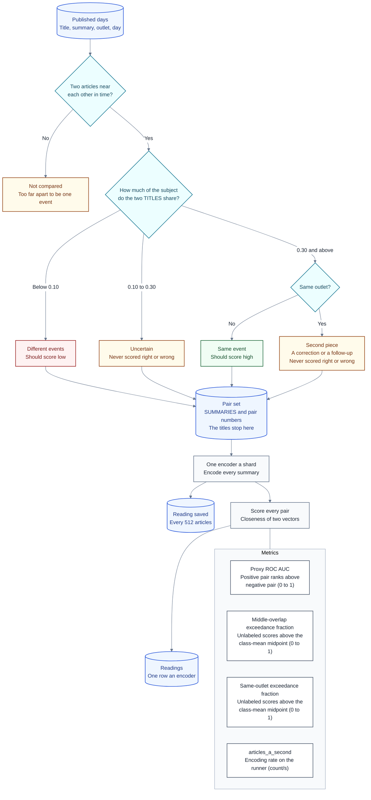
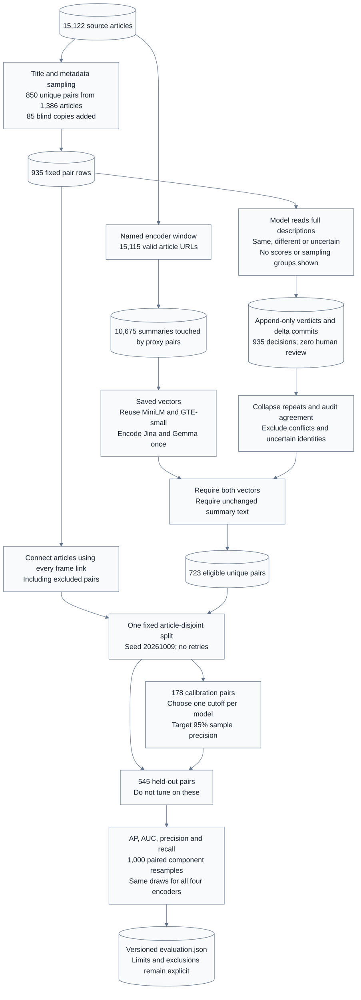

# Encoder comparison 1

**Built**: 2026-10-08. **Judged comparison updated**: 2026-10-09 UTC.

A measurement, not a dataset. It answers one question for plan 63: of the
encoders that could run on this project's hardware, which one best tells two
summaries of the same event from two summaries of different events.

The current model-judged answer is
[`judgments/evaluation.json`](judgments/evaluation.json), summarized below.
`readings/encoders.md` retains the title-derived proxy and the encoding costs.
The proxy is a screen, not selection proof.

## Plain-English summary

Both Jina and EmbeddingGemma-2 finished encoding the same 10,675 summaries.
MiniLM and GTE-small reused their saved vectors. Each article was encoded once,
not once for every pair in which it appears.

All 935 pair rows are labeled: 365 same event, 547 different events and 23
uncertain. These are model-written decisions, not human-reviewed article labels.
The 935 rows involve 1,386 distinct articles; we did not label all 15,122 articles.

After removing repeated copies, conflicting decisions, uncertain pairs and
unavailable inputs, 723 distinct pairs remain. We used 178 to choose each
encoder's cutoff and kept 545 separate to measure the result. No article appears
in both sets.

GTE-small has the highest observed ranking score and the shortest recorded
encoding time. Gemma is close on ranking, but this test does not establish a
GTE/Gemma quality winner. Jina and Gemma have not shown a clear practical gain
over the owner's existing GTE-small and MiniLM candidates.

### What the numbers mean

- **Precision:** Of the pairs called "same event", how many really have that
  label? GTE-small found 86 matches; 81 were labeled same and five different:
  precision is 81 / 86 = 94.19%.
- **Recall:** Of all pairs labeled same, how many were found? GTE-small found
  81 of the 261 same-event pairs in the separate test set: recall is 31.03%.
- **Average precision (AP):** A summary of how clean the predicted matches stay
  as the cutoff is loosened to find more of them. Higher means a better ordering
  of same-event versus different-event pairs. AP 0.8954 is not 89.54% accuracy.
- **ROC AUC:** The chance a randomly chosen same-event pair gets a higher score
  than a randomly chosen different-event pair. 0.5 is chance-level; 1 is perfect
  ordering. It is not the fraction of correct decisions at one cutoff.

The precision and recall table uses a different cutoff for each encoder, chosen
only on the cutoff-setting set. The target was 95% precision there, not a promise
of 95% on the separate test or in production. Gemma's observed 100% precision
means zero wrong matches among just 23 predicted matches; it still missed 238
same-event pairs. Recorded times came from separate runner hosts.

## Why this exists

The pipeline decides two articles report one story when their summaries sit at
cosine 0.94 or above inside 36 hours. Over the 45 published days that grouped
212 articles out of 15,122, which is **1.4 percent**. Everything downstream of
that decision depends on the numbers an encoder produces, and nobody had
measured which encoder produces the best ones for this job.

**This is not the search encoder.** `backend/idhazh/embed.py` runs a quantized
`all-MiniLM-L6-v2` whose vectors a reader's browser compares against a query it
embeds in the tab. That encoder is sized by what a visitor downloads - 23 MB -
and the runner and the browser deliberately load the same file so the two
agree. The grouping encoder never reaches a browser, so its size is free and
its choice is open. Changing one does not change the other.

## What it is

| | |
| --- | --- |
| Measured by | `backend/utilities/compare_summary_encoders.py`, run by `.github/workflows/encoder-comparison.yml` |
| Hardware | A GitHub `ubuntu-latest` runner: 4 processor threads, 16 GB, no graphics card |
| Read from | the committed digest archive, `frontend/public/digest/` |
| Encoders asked | `config/encoder-comparison.json` |
| The answer | `readings/encoders.md` for a person, `readings/encoders.json` for a program |
| What ran | `manifest.json` - commit, run, runner, input counts, which encoders reported |
| The input | `pairs.json` - the pair set every encoder scored |
| What each shard printed | `logs/` |

## How the comparison runs

A selected run passes `selected_encoders` as comma-separated config slugs and
sets `reuse_pairs` to true. It reads the committed `pairs.json` without rebuilding
it. Only the selected encoders run; the collector retains the other saved rows.
Thus a new candidate does not spend runner time re-encoding the controls.

The October 2026 candidates are text-only `google/embeddinggemma-2` with the
sentence-similarity instruction, and the official merged text-matching weights
for Jina v5 nano. Both inputs to a pair have the same role. Revisions, constructor
options, prompts and the input hash are saved with each new reading. The runtime
package versions are uploaded with the shard log. Vectors are retained for 90
days, not three. The Jina weights are CC-BY-NC-4.0; this comparison is not approval
for commercial deployment.

The text-only load still constructs a vision-aware processor. The comparison
runtime therefore installs the supported image extra, including Pillow. Torch
and Torchvision come from the same CPU wheel index; mixing a CPU tensor runtime
with a CUDA vision wheel would fail before any summaries are encoded. Processor
imports are checked before the shard downloads model weights.



**The encoders read summaries. They never read a title.** A title decides which
bucket a pair goes in and is then set aside. Letting an encoder see the same
signal that built the answer key would flatter every one of them equally.

**Only the first two buckets make a proxy ROC AUC.** The other two are
scored on the same vectors and reported on their own, because neither has an
answer anybody knows. Folding them in would leave one number answering three
questions and none of them clearly.

An article is encoded once however many pairs it appears in: 10,675 articles
carry 15,522 pair comparisons, and comparing two vectors is nearly free next to
producing one.

### The same-outlet bucket

One outlet publishing twice about one subject on one day is usually a
correction, an update, or a follow-up - *"Tencent leases 100,000 chips"*
followed by *"What the Tencent chip lease means for Oracle"*. Whether those are
one event or two is a real question with a real answer, and a title-overlap
rule cannot give it: the two titles share their subject words either way.

Counted over the 44 named UTC days: **488 high-overlap pairs come from one
outlet, against 5,517 from two.**

They are their own unlabeled group, scored on the same vectors and reported
beside the rest. They are not folded into proxy ROC AUC because their event
identity has not been judged in this proxy.

The mean cosine and fraction above the class-mean midpoint describe this
group's scores. A fraction near one does not prove an error: some of these
pairs may really report one event. No precision, recall or over-merging claim
can be made without labels. The separate model-judged set answers event
identity for its selected pairs; it does not label all 488 proxy candidates.

## Who wrote the labels

The original comparison buckets below remain title-derived. The separate
`judgments/pairs.json` contains the recovered 935-pair reading sheet, and
`judgments/verdicts.jsonl` contains append-only decisions. These are model-written
labels, not human ground truth. No original author model was recorded for the
first 54 recovered verdicts; their notes are preserved without inventing that
provenance. New decisions name their model, confidence and reason. A person's
review has a separate `human_verdict` field.

Each judgment carries hashes of both the sheet and the article content. A
changed sheet cannot silently reuse an old answer. Corrections append a new
history row; they do not overwrite the prior decision. Every finished batch is
committed as a delta. Conversation memory is not the label store.

### Which articles and pairs were selected

There are two inputs, not one. The original sampling export contains **15,122
distinct articles**, from 45 published UTC days between 2026-08-21 and
2026-10-05. Its SHA-256 is
`726ef4918640c9c8e18e633e1bc04aaf0fbece7b27ee29957a124f9eb96fa48d`.
The selected sheet uses **1,386 distinct articles** from that export.

The encoder comparison reads the narrower 2026-08-23 to 2026-10-05 window:
44 named days, one without a digest, and **15,115 valid distinct article URLs**.
Seven sampling-export URLs are absent from this window. Five articles first
published before it reappear inside it, so filtering only `first_day` would not
reproduce the encoder pool.

The proxy pair builder requires a URL, title and summary, keeps the first
appearance of each URL in the named window, and compares nearby days. It keeps
5,517 likely matches, 5,517 likely mismatches, 4,000 middle-overlap pairs and
488 same-outlet follow-ups. Only the **10,675 distinct summaries touched by those
15,522 comparisons** are encoded. That is why not every judged article has a
cached vector.

The separate judging sampler is `backend/utilities/choose_pairs_to_judge.py`.
It considers same-day or next-day pairs whose titles each have at least three
content words. Title overlap is shared content words divided by all content
words in the two titles; common English filler words are removed.

No encoder vectors were supplied to that sampler. Its rules, in priority order,
are: missing usable timestamps with overlap at least 0.15; same-outlet pairs
with overlap at least 0.30; same-day, different-outlet pairs with overlap at
least 0.55; unrelated titles with overlap below 0.05; and middle overlap from
0.15 up to 0.45. In this recovered frame, the legacy name `encoders_differ`
means that last title-overlap group, **not measured disagreement between models**.

Sampling targeted 1,000 unique pairs with quotas of 100 obvious matches,
100 obvious mismatches, 350 middle cases, 200 same-outlet follow-ups, 150
low-overlap/high-vector-similarity matches and 100 missing-time cases. The
vector-dependent quota was empty, leaving **850 unique pairs**. The sampler
shuffled within each group with seed `20261008`, added 85 blind repeat copies
and shuffled the sheet again: **935 rows**. The missing quota was not filled
with easier pairs.

The corpus did **not** form only 935 pairs. The sampler considered **9,101,758
same-day or next-day candidate pairs** before choosing 850 identities. The
1,000 target was a bounded judgment budget, not a count of all events or a
statistical power calculation. Reusing articles and inserting blind copies
means 935 rows touch 1,386 articles, not 1,870. The current uncertainty ranges
describe this enriched sample; they do not establish archive-wide accuracy.

Expanding the sample should add the missing low-word-overlap same-event cases,
hard different-event neighbors, and representative randomly selected candidate
pairs, rather than merely more easy mismatches. More article-independent,
reviewed examples would improve coverage and the label evidence.

The original export and these arguments reproduced every row and selection
field of the committed sheet exactly:

```powershell
python backend\utilities\choose_pairs_to_judge.py `
  --items $ItemsExport --out $RebuiltSheet `
  --total 1000 --duplicate-share 0.10 --seed 20261008 --reach-days 1
```

The export is retained locally, not in Git. The committed 935-row sheet contains
the complete article text needed to judge it; the cached encoder input and
report preserve the scoring inputs and their hashes.

### How the model judgments were made

The judging view shows both complete summaries, titles, outlets and published
days, but hides the sampling group and encoder scores. Each decision compares
the specific actors, action and occasion, not merely shared subject words.

Two descriptions of one occurrence are `same`. A separate announcement,
decision, competition stage or independently newsworthy follow-up is
`different`, even if its actors match. A corrected number or currency unit alone
does not create another event. If the summaries do not settle identity, the
verdict is `cannot_tell`; a first-published day is not proof of occurrence time.

Every finished batch records reasons, available confidence, author-model
provenance and input hashes in append-only JSONL, then gets its own Git commit.
The recovered first 54 decisions have no recorded author model or confidence;
that information is not invented. The other 881 name `gpt-6.1-sol`.

### Judging, audit and fixed-split flow

The earlier diagram describes the title-derived proxy. This one describes the
completed model-judged evaluation.



## Complete model-judged comparison

This reading replaces the partial 140-row result. It uses all **935 initial
model judgments**, committed at `1cd139a51ca5528184e6db156e0ee5dc28ad2a84`.
There are 365 `same`, 547 `different` and 23 `cannot_tell` decisions, with
**zero human review**. The first 54 have an unrecorded author model; the other
881 name `gpt-6.1-sol`. No verdict was changed or decided by a majority vote.
All four encoders score exactly the same eligible unique pairs.

An unordered pair of article URLs is one identity. The 935 rows contain **850
unique identities and 85 repeat groups**, each seen twice. Of the repeat groups,
83 agree and two disagree: `p0158` says `different` while `p0467` says `same`;
`p0402` says `same` while `p0540` says `different`. Both conflicting identities
are excluded in full. There are no reversed repeats in this frame; the utility
handles them. The report lists every repeat's IDs and verdicts, not just these
two disagreements.

Saved inputs cover 817 rows by URL and by exact summary text. **118 rows lack
vectors; zero rows have changed summaries.** These are overlapping row-level
audits, not unique-pair exclusion counts. At unique-pair level the exclusions,
in order, are two conflicts, 23 uncertain decisions and 102 missing-vector
identities. This leaves **723 eligible unique pairs: 325 same and 398 different**
(44.95 percent same). Another 71 agreeing copies of eligible pairs are removed.
All excluded IDs remain in the report. Missing inputs are not re-encoded.

**118 rows versus 102 pairs:** A row is one appearance on the judging sheet,
including blind copies. The 118 appearances without both vectors represent
106 distinct identities: 12 appearances are repeats. Four of those identities
are already excluded as uncertain (`p0453`, `p0568`, `p0693`, `p0717`).
That leaves 102 otherwise eligible distinct pairs excluded for missing vectors:
**118 - 12 - 4 = 102**. These are missing encoded inputs, not missing judgments,
and they are never treated as zero similarity or a wrong model answer.

Table A. Selection strata, before exclusions and after unique-pair audit.

| ID | Selection group | Available metadata pairs | Unique pairs chosen | Judged rows including repeats | Eligible unique pairs |
| --- | --- | ---: | ---: | ---: | ---: |
| A1 | Middle title overlap (`encoders_differ`) | 14,649 | 350 | 384 | 301 |
| A2 | Same-outlet follow-ups (`hard_mismatch`) | 361 | 200 | 220 | 196 |
| A3 | Missing usable time (`no_publication_time`) | 4,857 | 100 | 109 | 86 |
| A4 | Obvious title match (`settled_match`) | 646 | 100 | 107 | 98 |
| A5 | Obvious title mismatch (`settled_mismatch`) | 8,743,516 | 100 | 115 | 42 |
| A6 | Low title overlap, high vector similarity (`hard_match`) | 0 | 0 | 0 | 0 |

There is **no `hard_match` group**. Titles and metadata enriched this frame.
Its event prevalence is not the production prevalence, and its precision is
not an estimate of deployed precision.

### Calibration and held-out results

The split is fixed before vectors are opened. A connected component is a set
of articles joined by any pair in the full reading sheet. This includes
uncertain, conflicting and uncovered pairs, so known event links are not lost
when metrics exclude a row. SciPy finds 558 components across 1,386 articles;
456 components have eligible pairs, and 102 are excluded-only.

Seed `20261009` assigns 137 of the 456 active components to calibration
(30.04 percent) and 319 to evaluation. Components have different sizes:
calibration therefore receives 24.62 percent of eligible pairs, not 30 percent.
There are **zero shared articles** between the two partitions. No split or seed
was retried. Events without a shared article or known link can still cross it.

Table B. The fixed article-disjoint partitions. Component article counts include
articles used only by excluded links.

| ID | Partition | Components | Articles (eligible articles) | Pairs | Same | Different | Same prevalence |
| --- | --- | ---: | ---: | ---: | ---: | ---: | ---: |
| B1 | Calibration | 137 | 318 (314) | 178 | 64 | 114 | 35.96% |
| B2 | Held-out | 319 | 862 (849) | 545 | 261 | 284 | 47.89% |

Each encoder gets its own threshold from **calibration only**, at the configured
95 percent precision target. Scikit-learn's precision-recall curve keeps tied
scores in complete blocks. The utility chooses the greatest recall meeting the
target, and then the lowest qualifying threshold. It never adjusts a threshold
on held-out results. An unattainable target produces null operating metrics with
a reason; no predicted positives produces null precision, not a success claim.

Average precision (AP) is the primary ranking measure; ROC AUC measures how
often a same-event pair outscores a different-event pair. Cosines are computed
in float64 from the cached float32 vectors, without loading an encoder.
The 95 percent AP intervals below resample whole held-out components 1,000
times with seed `20261010`. Every encoder and the GTE-small reference use the
**same draws**. All 1,000 draws contain both classes; none are discarded.

Table C. Held-out ranking and paired differences from GTE-small.

| ID | Encoder | AP (95% component interval) | ROC AUC | AP minus GTE (95% paired interval) |
| --- | --- | --- | ---: | --- |
| C1 | MiniLM-L6 | 0.8453 (0.7887 to 0.9046) | 0.8639 | -0.0500 (-0.0722 to -0.0275) |
| C2 | GTE-small | 0.8954 (0.8519 to 0.9396) | 0.9053 | 0.0000 (reference) |
| C3 | Jina v5 nano text-matching | 0.8639 (0.8106 to 0.9123) | 0.8752 | -0.0315 (-0.0598 to -0.0015) |
| C4 | EmbeddingGemma-2 text-only | 0.8911 (0.8435 to 0.9357) | 0.8979 | -0.0043 (-0.0249 to 0.0170) |

Table D. The frozen calibrated operating points. Precision is the share of
predicted matches that are model-labeled same; recall is the share of
model-labeled same pairs found.

| ID | Encoder | Threshold | Calibration precision / recall | Held-out precision / recall | Held-out TP / FP / FN / TN |
| --- | --- | ---: | --- | --- | --- |
| D1 | MiniLM-L6 | 0.910011 | 100.00% / 18.75% | 97.44% / 14.56% | 38 / 1 / 223 / 283 |
| D2 | GTE-small | 0.965687 | 96.30% / 40.63% | 94.19% / 31.03% | 81 / 5 / 180 / 279 |
| D3 | Jina v5 nano text-matching | 0.946977 | 95.45% / 32.81% | 98.28% / 21.84% | 57 / 1 / 204 / 283 |
| D4 | EmbeddingGemma-2 text-only | 0.971336 | 100.00% / 7.81% | 100.00% / 8.81% | 23 / 0 / 238 / 284 |

The report retains full-precision thresholds; the table rounds them for reading.
GTE-small's held-out precision is **below 95 percent**, despite reaching the
calibration target. Gemma's perfect observed precision comes with only 23
predicted matches and low recall, not a guarantee.

Whole-data AP on all 723 eligible unique pairs is **descriptive only**:
MiniLM 0.8423, GTE-small 0.8840, Jina 0.8516, Gemma 0.8772. It is not held-out
evidence and was not used to pick a split or threshold.

### Cost and conclusion

Table E. Saved encoding costs for 1,000 articles on separate GitHub
4-vCPU, 16-GB, no-GPU runs, with whole-process peak memory.

| ID | Encoder | Minutes / 1,000 | Peak GiB | Vector run |
| --- | --- | ---: | ---: | --- |
| E1 | MiniLM-L6 | 0.58 | 0.87 | `37850950040` |
| E2 | GTE-small | 0.18 | 1.14 | `37850950040` |
| E3 | Jina v5 nano text-matching | 4.80 | 1.91 | `37895396586` |
| E4 | EmbeddingGemma-2 text-only | 5.64 | 3.30 | `37909985697` |

These are not controlled same-silicon trials. One timing per encoder gives no
confidence estimate, and parameter count alone does not explain speed.
Jina's merged weights contain about 212M parameters; the advertised 239M is the
multi-adapter family. Its CC-BY-NC-4.0 license is not commercial-adoption
approval. Gemma is text-only 270M with vision/audio disabled and Apache-2.0.
Model IDs, prefixes, recorded revisions, options, vector hashes, run/artifact
names and saved cost readings are in the report. Baseline revisions were not
recorded; none are invented.

GTE-small has the highest held-out AP and greatest recall at its frozen cut.
Its paired AP differences from MiniLM and Jina exclude zero in this conditional,
unadjusted comparison. **GTE-small and Gemma are not separated by this test**:
their difference interval includes zero. The intervals measure sampling of
held-out components, not model-label errors, threshold-estimation error or
multiple-comparison-adjusted significance.

This frame can compare the four candidates against these model-written event
decisions. It cannot establish human-validated quality, production precision,
coverage of missing inputs, or a statistically demonstrated GTE/Gemma winner.
GTE-small and MiniLM remain the owner's candidates. No production configuration
changes. A representative sample and human review of label disagreements would
test the remaining deployment assumptions; neither is claimed here.

### Settings and fine-tuning worth investigating

The official [EmbeddingGemma-2 model card](https://huggingface.co/google/embeddinggemma-2)
documents symmetric task prefixes, mean pooling, 768-dimensional output and
float32 or bfloat16 inference. The measured run already used mean pooling,
full 768 dimensions, float32 and
`task: sentence similarity | query: ` on both inputs. There was no missing
similarity instruction to repair. Vision and audio were disabled for memory
and CPU cost; enabling them does not enrich text-only inputs.

**A lower cosine cutoff increases recall but can lower precision.** On the
178 calibration pairs only, Gemma's 95% precision constraint selected a
0.971336 cutoff, finding five of 64 same-event pairs (7.81% recall, 100%
observed precision). Relaxing the constraint to 90% selected 0.951614 and found
18 of 64 (28.13% recall, 18 correct / 20 predicted matches). This is
calibration-only exploration, not a new held-out result or a proposed
production setting. Changing the cutoff does not improve AP, which measures
the whole ranking.

The comparison caps every input at **256 tokens**; Gemma supports 8,192.
A tokenizer-only audit at the recorded model revision, including the same
prefix and special tokens, found 25 of 10,675 encoded inputs above the cap
(maximum 332 tokens). Four of 1,163 distinct eligible articles exceed it,
affecting four of the 545 held-out pairs: `p0132`, `p0317`, `p0577`, `p0592`.
The tokenizer JSON hash is
`4d777ef5bdc1aa36227abdfb77c3e49e7b9c892d16e1b6bda41c393504828be4`.
Testing 512 tokens would cover all recorded inputs for this tokenizer. The
audit does not establish that missing text changed those four labels or scores,
or that a larger context would solve the recall problem.

A `Clustering` prefix is another documented Gemma task setting to test on
development data, not a demonstrated improvement. Broad topical clustering
may be less suitable than similarity for distinguishing separate events about
the same company. Matryoshka truncation to 512 or 256 dimensions can be
evaluated from saved full vectors after re-normalization: it saves vector
storage and scoring cost, not the main encoder forward pass, and is not a
promised recall boost. Batch size, thread count and supported numerical
precision primarily affect runtime and memory.

GTE-small's [official card](https://huggingface.co/thenlper/gte-small) identifies
**Alibaba DAMO Academy** as its training group. Its uploader name is not its
research pedigree. Google's resources, a model's age and published general
benchmarks do not establish superiority on this particular event-identity
task. GTE-small remains the provisional quality/cost choice, with MiniLM as
the retained control, not a deployment decision.

**GTE-small can be fine-tuned** with Sentence Transformers. Binary
same/different pairs fit a supervised contrastive objective; difficult
different-event examples teach the model not to join separate occurrences.
The [training guide](https://sbert.net/docs/sentence_transformer/training_overview.html)
and [loss guide](https://sbert.net/docs/sentence_transformer/loss_overview.html)
describe domain adaptation and matching a loss to label format. Same-event
positive pairs can also support ranking losses, but indiscriminate in-batch
negatives may incorrectly separate different articles about one real event.

Fine-tuning is a hypothesis, not a free upgrade. There are only 723 unique
covered binary pairs, and the existing non-held-out partition has just 178
pairs (64 same, 114 different). Review inconsistent or ambiguous labels and
collect additional train/development data. Keep connected articles together,
keep the 545 held-out pairs out of training and hyperparameter selection, and
reserve a fresh confirmation set after repeated model comparisons. Training
on all 935 and measuring on those same pairs would be memorization, not
evidence of improvement. No fine-tuning or additional encoding has run here.

### Faster evaluation of additional encoders

A new encoder need not encode the archive. The **entire fixed judging sheet**
needs at most **1,386 unique summaries encoded once**, not 935 times two and
not 15,000 articles. That is about one eighth of the earlier 10,675-summary
encoding work, assuming similar lengths and batch efficiency; actual wall
time still needs measurement.

All four current encoders already cover 1,269 of those articles; 117 distinct
article inputs are absent from their caches. The earlier 118 missing rows and
102 excluded identities count pair appearances and pair identities, not
articles. Filling those missing inputs would require additional encoding and
versioned provenance for every baseline included in a larger comparison.

For an exact like-for-like comparison on the **existing 723-pair evaluation**,
a new encoder needs only its **1,163 distinct eligible summaries**. It can
reuse the fixed pair IDs, article partitions and model judgments; encode
those texts once, then calculate cosine scores. Saved models require no
encoding to test other cutoffs or compute additional metrics.

The current `encoder-comparison.yml` still reads the 10,675-summary proxy input,
and the evaluator refuses vectors in a different article order. A compact
judged-input runner and matching order/hash are the next wiring change; neither
has been silently substituted for the completed run. A prompt/context or
weight change needs new vectors for that changed variant, but only for its
selected inputs. A learned cutoff or representation must be chosen without
tuning on the final held-out sample.

### Reproduce without encoding

The instrument is `backend/utilities/evaluate_encoder_judgments.py`, with report
shape `backend/idhazh/contracts/encoder_evaluation.py`. Its code/config commit is
`f1ace961b2b8ef57e2bca3b60b5f7d7756aae180`. Config holds the seeds, split fraction,
precision target, bootstrap rounds and reference. `judgment_vectors` names four
relative files beneath a local saved-vector root; set `$VectorRoot` to that root
before running this PowerShell command from the checkout:

```powershell
$env:PYTHONPATH = "$PWD\backend"
python backend\utilities\evaluate_encoder_judgments.py `
  --config config\encoder-comparison.json `
  --corpus corpus\encoder-comparison-1 `
  --vector-root $VectorRoot `
  --out corpus\encoder-comparison-1\judgments\evaluation.json
```

Use an interpreter with the project's development dependencies (scikit-learn,
SciPy, NumPy and Pydantic). The recorded run used Python 3.14.2, NumPy 2.4.1,
SciPy 1.17.0 and scikit-learn 1.8.0; the report records all runtime versions.
The input frame hash is
`7f0d931c697217431fed88ea84c96cd4fee05b6602e617718661b13fe2066feb`.
The utility refuses incomplete judgments, changed label provenance, invalid
vectors, mismatched input hashes and a split without both classes. It requires
committed, unchanged instrument sources and config. The report is one current
file; Git retains its history. The saved vectors are local artifacts, not
committed weights. The model judgments, report and instrument are Git-versioned
artifacts. Publishing them does not convert model-written labels into human
validation or adopt an encoder in production.

If this branch is squash-merged into `main`, retain the source branch
`feat/encoder-selected-checkpoints`. It keeps the individual label delta commits
and the report's original code and label commit references reachable. The merged
snapshot contains the full labels, report, instrument and documentation.

## How title-derived proxy labels work

**No human wrote or reviewed these labels.** The original proxy buckets below
are also not human ground truth.

The run needs to know which pairs of articles report one event. It has no such
list, so it builds a stand-in from a signal the encoders never see - the
generated title. A title in this pipeline is actor plus action with the hype
removed, so the words two titles share carry a real signal about whether they
cover one story.

### Four buckets, not two

A comparison that asks only "can you tell an obvious match from an obvious
mismatch" is one every encoder passes. It would also repeat a fault this project
has already found in its own duplicate judge: that judge is only ever shown
pairs scoring 0.88 or above, so it never sees the error that matters - two
reports of one event written so differently that nothing flags them.

So every pair is sorted by how much of their subject two titles share, and the
middle band is kept.

| Bucket | Rule | Treated as |
| --- | --- | --- |
| Same event | Two outlets, titles share **0.30 or more** of their subject words | A match the encoder should score high |
| Second piece | **One outlet**, titles share 0.30 or more | Neither. A correction or a follow-up |
| Uncertain | Two outlets, titles share **0.10 up to 0.30** | Neither |
| Different events | Two outlets, titles share **less than 0.10** | A mismatch the encoder should score low |

Every pair is published the same day or a day apart. Only the first and last
bucket make a proxy ROC AUC; the middle two are scored on the same vectors
and reported on their own.

### Where the thresholds came from

The lower bound is the one that matters, and it was chosen by counting. Over the
44 published days, at a floor of 0.34 the archive yields 3,762 matching pairs;
at 0.30 it yields more than 8,000. The project asked for at least 5,000, so the
floor sits at **0.30** and the caps in `config/encoder-comparison.json` decide
how many of them are used - not the floor, which would otherwise quietly set the
count.

The 0.10 line is where a shared word stops meaning anything: below it, two
titles usually share only a country or a company name that half the corpus
mentions.

### What the unlabeled score distributions report

The middle-overlap and same-outlet groups have no event labels in this proxy.
Each group has a mean cosine and a descriptive exceedance fraction: the share
of scores strictly above `(positive mean + negative mean) / 2`. The midpoint is
encoder-specific and is not a calibrated or production threshold.

Higher or lower fractions describe scores, not correct or incorrect decisions.
Neither an over-merging rate nor recall can be inferred from them. The generated
[`readings/encoders.md`](readings/encoders.md) spells out the formulas and maps
the historical JSON names to these descriptions.

### What the title-derived proxy cannot tell you

Both outer buckets contain mistakes. Two outlets can write near-identical titles
about genuinely different events, and one event can draw two titles with no
words in common. **So no number here is an accuracy.**

Every encoder scores identical proxy pairs, but scores near one on easy,
title-derived cases cannot establish a ranking on actual event identity. The
completed model-judged evaluation is the harder selector. It is explicitly
model-written, not the future human-reviewed evidence this project still lacks.

## If a shard runs out of time

The reading is written before the first article is encoded and rewritten every
512 articles, each time to a temporary file that is then renamed - so a reader
only ever sees a whole file, and a shard killed at the six-hour limit leaves
behind how far it got and how fast it was going.

`state` says which happened:

| State | What it means |
| --- | --- |
| `loading` | Weights were still downloading. Nothing encoded |
| `encoding` | Stopped partway. `articles_done` and `articles_a_second` are real |
| `measured` | Finished. Every number is there |
| `unavailable` | The model would not load. `reason` carries what the runtime said |
| `stopped` | The encode raised. `reason` carries it |

An encoder that cannot finish inside six hours has answered the cost question
even though it never answered the quality one, and the table says so rather than
leaving the row blank.

## What the numbers mean

**ROC AUC** is the standard name of the statistic historically stored as
`separation`. On the proxy, it compares likely-positive with likely-negative
pairs, not verified event labels. One is perfect ordering, 0.5 is chance-level,
and ties receive half credit.

It is used instead of the gap between two averages, because encoders put their
scores on different scales. An earlier attempt at this comparison, run on a
laptop, reported `all-MiniLM-L6-v2` ahead of `bge-base-en-v1.5` on a gap of
0.720 against 0.431 - but bge places unrelated pairs at 0.456 where MiniLM
places them at 0.105, so the gap was measuring the scale and not the skill. A
rank cannot be fooled that way.

**Mean cosine difference** is the standard descriptive quantity stored as
`spread`: positive mean minus negative mean. It is not variance, standard
deviation, Cohen's d or a scale-free quality measure. A larger gap does not
establish easier calibration or more stable production behavior; separate
encoders have different similarity distributions.

**Throughput** is encoded summaries divided by encoding seconds, on the
recorded host. It informs runtime cost, not embedding quality or the chance
of meeting every future job deadline. The time projections assume that rate
continues for the configured number of articles.

The figure is kept for two narrower purposes: deciding how long a comparison
like this one takes to run, and pricing the one-time cost of re-encoding the
whole archive if the encoder ever changes.

**Treat the figure as the machine's, not the model's.** Two runs of
`gte-base` - same code, same pairs, same kind of runner - returned 8.4 articles
a second and then 0.8, while three other encoders repeated to within one
percent. In the same run a 335-million parameter model finished in 2h 13m and a
109-million one took 3h 34m. A hosted runner is whatever silicon it drew, and
cache size and memory bandwidth differ between them. Each shard now records the
processor it ran on, so a figure can be read against its machine instead of
being read as the model's.

**Peak resident memory** is the whole process, reported in GiB, against the
runner's advertised 16 GB. This one does
bite: the batch also runs the summariser, and a large encoder plus a loaded
language model is where the limit is reached.

The [generated metric glossary](readings/encoders.md#metric-glossary) defines
cosine, ROC AUC, AP, precision, recall, confusion counts, diagnostic midpoint
fractions, throughput, memory and confidence intervals. The historical JSON
keys are retained so the original numeric measurements and report provenance
remain intact. Refresh the readable table without encoding or changing a
manifest:

```powershell
python backend\utilities\compare_summary_encoders.py render `
  --readings corpus\encoder-comparison-1\readings\encoders.json `
  --out corpus\encoder-comparison-1\readings\encoders.md
```

## What was removed

Nothing. Every article in the named range that has a title, a summary and an
address is eligible. An article the pair builder never paired is simply not
encoded, because encoding an article no pair touches would cost time and answer
nothing.

## How to read a shard that did not report

A model that will not load is recorded as `unavailable` with its reason, and the
run continues. A gated model, a renamed one, or one needing a library version
the runner does not have all land there. That is a finding about the model's
availability, not about its quality, and the row says so rather than going
missing.
