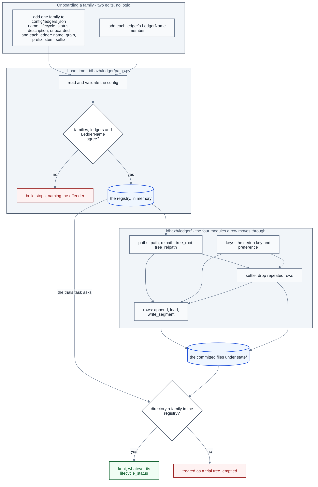

# The ledger registry

**Last Updated**: 2026-10-02

A ledger is a committed file or folder under `state/` that one run writes so that a later run can read it. A ledger exists in code only when it is registered, and registering it takes two edits. The first is one member of `LedgerName`, the ledger's one name in code. The second is one entry in `config/ledgers.json`, which puts the ledger in a family - one top-level folder under `state/` - and says where its files sit. When the code loads, it checks that the two edits agree, and the build stops if they do not.

This page says what each edit holds, what that check refuses, how a family is added, paused or retired, and which module of `backend/idhazh/ledger/` answers which question. What each ledger answers, and why it files at the grain it does, is [state-ledgers.md](state-ledgers.md). The shape of a row is [schemas.md](schemas.md). How a contract payload reaches disk under `state/raw/` and `state/compact/` is [persistence.md](persistence.md).

## One typed name for one ledger

Every ledger here has exactly one name in code: a member of `LedgerName` in `backend/idhazh/contracts/ledger_name.py`. The value is the ledger's own name - the directory for a ledger that is a directory, the stem with no extension for a ledger that is a single file - so the directory a writer fills, the directory a reader walks and the word an operator types are one string rather than three. Two members may not share a value: an enum takes a repeat as an alias and says nothing, so the repeat is refused when the module loads.

**The Python name is spelled from the value and the family, and from nothing else.** A ledger that is its own family is its value in upper snake case: `feed-health` is `FEED_HEALTH`. A ledger inside a family puts the family first: `metrics` under `content-similarity-judge` is `CONTENT_SIMILARITY_JUDGE_METRICS`. The registry refuses a member that breaks the rule when it loads, so a reader who knows the folder knows the name.

**The value says what the ledger holds, never the kind of thing it is.** Owner decision, 2026-09-27. `validation` held verdicts on candidate models, so it is `candidate-models`. `telemetry-aggregate` held what is left of an item-health month, so it is `item-health-summary`. A name for a kind of thing claims every ledger of that kind: a reader cannot tell from the folder which one it holds, and the next ledger of that kind has no name left. Both were renamed while they held no files, so nothing moved.

It sits at the bottom of the contract graph rather than inside `backend/idhazh/ledger/`, because a contract may not import another part of `idhazh` (CLAUDE.md section 4) and a persisted shape is typed by it.

`DAY_TREES` is the subset a writer files its own segment into, one file per writer under `<ledger>/<YYYY>/<MM>/<DD>/`. Only those carry a settlement rule - what makes two of their rows one record - so `write_segment` and its siblings refuse any other ledger by name. The refusal is load-bearing rather than belt-and-braces: the argument type admits every ledger under `state/`, so without it `state/content-similarity-judge/fitted-thresholds/` would take a directory where that ledger keeps a file.

## Families and ledgers

`config/ledgers.json` says which families and ledgers exist, what lifecycle status each family is in, and where each ledger sits. `backend/idhazh/contracts/ledgers.py` is its shape and `backend/idhazh/ledger/paths.py` loads it once, when the module loads. `python backend/utilities/ledger_families.py` prints it, family by family, with the number of files each ledger holds.

A **family** is one top-level folder under `state/`. `content-similarity-judge` is one family holding seven ledgers; most families hold one ledger of the same name. A family carries what is decided for the folder as a whole: its `name`, its `lifecycle_status`, a one-line `description` of what it holds, the UTC day it was `onboarded`, and its `ledgers`.

A **ledger** is one row shape, filed one way, at one address. Each carries five things: its `name`, its `grain`, the `prefix` of directories it sits under inside `state/`, and - for a ledger that is a single file - the `stem` and `suffix` that name it. A dated ledger carries no stem, because its period names it. A day directory carries no suffix, because it is a directory. The prefix keeps the whole nest, the family's folder included, so an address is read off the ledger alone. A ledger that goes through the door carries neither stem nor suffix, and its prefix is the path inside each root ([A ledger under the two roots](#a-ledger-under-the-two-roots)).

Four builders read the registry, in two pairs, and nothing else builds a path under `state/`:

| Builder | Answers |
| --- | --- |
| `path(state_dir, ledger, covers)` | where the rows covering this period go, as a `Path` |
| `relpath(ledger, covers)` | the same address, POSIX and relative, for a log line or a manifest |
| `tree_root(state_dir, ledger)` | the folder that holds every file of this ledger and nothing else - what a reader walks, whether the ledger files by day, by month or by stamp |
| `tree_relpath(ledger)` | the same folder, POSIX and relative, for a log line or a manifest |

`covers` is the period the rows describe and never the day the job woke (CLAUDE.md section 2). A dated ledger handed nothing raises, and a flat one handed a period raises - `path` does not guess, because a guessed period files a row where nobody will look for it. `tree_root` is a builder of its own rather than `path` with no period, so `path` keeps that refusal.

A flat file has no folder of its own: `holdout-pairs.csv` sits beside the similarity judge's other ledgers, so a walk handed that folder would read files that are not the ledger's. `tree_root` and `tree_relpath` refuse a flat ledger by name, and a caller asks `path` for the file. Every ledger has a prefix, a flat file included, so nothing sits loose at the top of `state/`.

Because the extension is data on the entry, a builder cannot emit the wrong one.

## A ledger under the two roots

A ledger that goes through the ledger door files under two roots rather than one: what a writer wrote under `state/raw/`, and what compaction left under `state/compact/` ([persistence.md](persistence.md)). Its grain is `raw-and-compact`, the sixth. `gardener` is the first ledger born at it, `feed-retirements` and `visual-prunes` moved to it on 2026-09-28, `item-health`, `summary-quality-evals` and `host-fingerprint` followed through a one-time migration ([persistence.md](persistence.md#moving-a-ledger-onto-the-door)), and `counterfactual-scores` and `candidate-models` moved after them, then `seen` and `published`.

**For this grain the `prefix` is the path inside each of the two roots.** Everywhere else it is the path from `state/`, but `["gardener"]` means `state/raw/gardener/` and `state/compact/gardener/`. The family check still passes, because the prefix still opens on the family's name, and the registry refuses any other prefix, because the root builders file the ledger under its own name.

**The four builders above refuse the grain by name.** `path`, `relpath`, `tree_root` and `tree_relpath` each answer with an error that names the ledger and points at the ones that build its addresses: `raw_path`, `raw_index_path`, `compact_path`, `compact_index_path` and `watermark_path`, with `raw_root` for the folder a reader walks. So nothing reads or writes a moved ledger at its old CSV address by accident. `ledger_families.py` counts its files under each root on a line of its own.

**Moving a ledger is one switch: its entry's grain.** The door table in `ledger/keys.py` holds a ledger's key and row contract before the ledger moves - `feed-health` has its own - and nothing asks the door about a ledger the registry does not file under the two roots, so the change that moves one edits its entry and writes no key. Every rule that depends on a move reads that grain. `backend/tests/contracts/test_door_ledgers_keep_no_csv_path.py` holds each ledger filed under the two roots to no CSV path: no CSV settlement shape or day tree, no union merge driver, no CSV prune target, a compaction of its own, and no declaration owning a folder the registry does not build. Where a moved ledger's CSV sat is not written here, because the registry says what a ledger is now: the migrator's table records it, and is deleted with the migrator ([persistence.md](persistence.md#moving-a-ledger-onto-the-door)).

## The ledgers still on CSV

[Telemetry intent](../../concepts/telemetry-intent.md) N1 and N11 still have these ledgers to move, because each still writes CSV, and N6 still has the `merge=union` driver on five of them to retire.

| Ledger under `state/` | Writer, under `backend/idhazh/` | What reads its rows, besides upkeep: backend under `backend/idhazh/`, console under `frontend/src/lib/server/` | Two writers on one file |
| --- | --- | --- | --- |
| `feed-health` | `stages/plan.py` | `stages/plan.py`, `telemetry/source_health.py`, `telemetry/publish/source_health.py`, `telemetry/publish/console_band.py`, `payload.ts` | cannot happen: one file per writer |
| `summary-quality-evals-index` | `evals/writer.py` | `evals/writer.py` | cannot happen: one file per writer |
| `item-health-summary` | `gardener/tasks/telemetry_aggregate.py` | nothing yet | cannot happen: one writer rewrites a month whole |
| `content-similarity-judge/scored-pairs` | `stages/count_verdicts.py` | `stages/set_merge_line.py` | the union driver keeps both |
| `content-similarity-judge/fitted-thresholds` | `stages/set_merge_line.py` | `stages/set_merge_line.py`, `similarity/applied.py`, `similarity-ledger.ts` | the union driver keeps both |
| `content-similarity-judge/metrics` | `stages/count_verdicts.py` | nothing yet | the union driver keeps both |
| `content-similarity-judge/merge-line-holdout-scores` | `stages/score_merge_line_holdout.py` | `similarity-holdout.ts` | the union driver keeps both |
| `content-similarity-judge/holdout-pairs.csv` | a person, by hand | `similarity/holdout.py`, `similarity-holdout.ts` | `merge=text` stops the push for a person |
| `llm-council/shard-outcomes` | `council/session.py` | nothing yet | the union driver keeps both |

`corpus/corpus.jsonl` and `corpus/corpus.meta.json` are not ledgers, have no merge driver of their own and carry no writer in their names, so a push race that conflicts on them stops the push: `backend/utilities/commit_and_push.py` keeps a conflicted file only when its name carries the job's own identity.

## What the registry refuses when it loads

The check runs when the config loads, so each of these stops the build with the offender's name in the message:

| The registry | Why it is refused |
| --- | --- |
| leaves a `LedgerName` member out of every family | the gardener's `trials` task empties every directory under `state/` that no task owns and the registry does not claim, so a missing ledger is a production folder the trial sweep would empty |
| lists one ledger twice in a family, or in two families | two entries are two answers about one ledger, and two families are two statuses for it |
| lists one family twice | one folder with two lists would have two statuses |
| lists a ledger whose prefix does not start with its family's name | the ledger would sit in one folder and take another folder's status |
| gives any ledger, a flat file included, no prefix at all | its files would sit loose at the top of `state/`, in no family's folder. `feed-retirements.csv` was the one exception, named for its stem, until it moved under `state/raw/` |
| holds a member whose Python name is not spelled from its family and its value | a Python name that says something the value does not is a second name a reader has to learn - the rule is in the section on typed names above |
| gives a `raw-and-compact` ledger a prefix other than its own name | the root builders file it under its own name, so any other prefix names a folder nothing writes |

The first row is what the registry is for. The claim used to be a hand-written Python set, and a ledger somebody forgot to add to it was a production directory the trial sweep quietly emptied. It is now a build that will not start.

## The three lifecycle statuses, and what each one changes

`active` is written and read. `paused` is not written now and will resume. `retired` is no longer written and is not coming back.

**All three are claimed, so all three are protected.** The status says what a writer may do, never whether the rows survive. Deleting a family's data for good is something a person does on purpose, never a side effect of a status change.

**The write path reads the status on every write.** One function decides: `accepts_new_rows` in `backend/idhazh/ledger/lifecycle.py`, which reads the family's status from the registry each time it is called. Every route that writes new rows asks it before it writes - `write_segment` and `extend_segment`, each `append_*` helper, the similarity judge's record, archive and holdout score, the council's collecting write, the day record, the digest fragment, the trace sink once per shard, and the ledger door ([persistence.md](persistence.md)) for a raw write from a pipeline job. Two rules hold, and both are the owner's:

- A write into a paused or retired family is skipped with one warning naming the ledger, its family, the status and the rows not written, and the run carries on. A status is a decision about one folder, and a run that stopped on it would cost every other family its rows.
- The passes that compact closed days and age out old rows keep running over a paused or retired family. To freeze its old rows as well, pause the pass that deletes them: a status says whether new rows are written, never how long old ones are kept. Those passes never ask, and the ledger door exempts a compact-tier write and any write from `migrate`, `run-tasks` or `history`, because each of those files rows again that were already recorded - skipping one after its source was deleted would lose rows while the run reported success.

**The check sits at the write, never in the path builders.** `path`, `tree_root` and `relpath` also serve readers, and a paused family is still read.

**What pausing a family costs, beyond its own rows.** CI builds its canary day through the same writers, so pausing a family thins that fixture too. A paused `content-similarity-judge` re-judges the same nights at every council run until they leave the window, because what counts a night as outstanding reads the record the skip stops writing. And a paused `digest-fragments` stops the first run of a new day from publishing it at all: the day is assembled from the fragments on disk, and a day with none is refused. A paused `visual-prunes` stops the cleanup record while the cleanup itself still runs, because the record goes through the ledger door from the assemble job, which is not one of the maintenance jobs; nothing reads those rows yet, and the cleanup deletes nothing today.

## Onboarding and offboarding

**Add a family.** Two edits and no logic. One family in `config/ledgers.json` at `lifecycle_status: active`, with a one-line description, today's UTC date as `onboarded`, and one ledger; and that ledger's `LedgerName` member, spelled from its value. A settled day tree needs a third edit - its key and preference, which stay in code because a preference is a callable and a callable is not JSON.

**Add a ledger to a family.** One more entry in that family's `ledgers`, with a prefix that opens on the family's name, and its member, spelled with the family's name in front. The family's status covers it from its first row.

**Pause or retire a family.** Change its `lifecycle_status`, and nothing else. Nothing is discovered, and nothing is a hand-list somebody can forget. The next write of new rows into it is skipped with one warning, and its old rows are read and aged as before.

In one line: a ledger exists because a family lists it; the families, the ledgers and the typed names must agree or the build stops; everything that touches `state/` goes through the door the registry feeds; and the gardener's `trials` task empties only what no task owns and the registry does not claim.

The four drawn are the ones a CSV row moves through. The rest are read and written by those four or serve the ledger door, and reach neither the registry nor `state/` on their own; the table below lists them all.

## The modules behind the door

`backend/idhazh/ledger/__init__.py` is the door itself, and every caller reaches the ledger through it - `from idhazh import ledger`, then `ledger.X`. It holds imports and one `__all__` and nothing else, so a name can move between the modules below without a caller changing. The split is for whoever maintains the ledger; a caller never sees it.

| Module | The one question it answers |
| --- | --- |
| `__init__.py` | which module holds the name a caller asked for |
| `paths.py` | where a ledger's file lives: read from `config/ledgers.json`, or built under `state/raw/` and `state/compact/` |
| `keys.py` | what makes two rows of one ledger the same record |
| `filenames.py` | what one writer's file is called, and how that name reads back |
| `csv_file.py` | how rows are read out of a CSV file and written back into it |
| `headers.py` | how a file written under an older header is read |
| `rows.py` | how a caller puts rows into a ledger and gets them back out |
| `settle.py` | which rows of a committed file repeat a key, and what dropping them costs |
| `lifecycle.py` | whether a ledger takes new rows now |
| `persist.py` | the one door a contract payload takes to disk as parquet or JSON lines, and back |
| `raw_files.py` | which raw files hold a ledger's current rows - the highest attempt at each work unit, oldest first - and what those rows are |
| `arrow_schema.py` | which column type each field of a contract becomes |
| `parquet.py` | how rows become a parquet file and back - the only module that imports pyarrow |
| `json_lines.py` | how rows become a JSON-lines file and back |

**`ledger.persist` is the function, never the module.** The door re-exports the function under its module's own name, so `from idhazh.ledger import persist` hands back the function and the module's other names are out of reach through it. A module inside the package that needs `read_envelope` or `load` imports them from `idhazh.ledger.persist` directly, as `raw_files.py` does.

Two edges in that graph carry a reason rather than a preference. **`paths.py` imports nothing from `keys.py`**: where a ledger lives and how its rows settle are two questions that change for different reasons, and one module holding both is how a path edit starts moving a settlement rule. **`rows.py` imports `day_shards` inside the function bodies that need it, never at the top of the file**: `day_shards` imports names back out of this package at its own module top, so a module-scope import in `rows.py` would close a load-time cycle - importing the package runs `__init__`, which imports `rows`, which re-enters a package that is still being built.

A fresh interpreter importing either module is not what proves the second one. Measured 2026-09-27 by promoting that import on purpose: both orders still loaded, because the door happens to bind `csv_file` before `rows`, so the name is already there by the time `day_shards` asks for it. Reorder the door and the same promotion raises. What holds the rule is the check that reads the import statements themselves, and a green load says only that the package loads.

## Nothing outside the package names a file under state/

A producer hands the ledger its rows and the identity of the writer, and the ledger decides what the file is called. A caller that builds its own name is a caller that will disagree with the parser the next time either of them changes, and the two are a day apart in the same package.

One module outside may ask, and none may carry a copy. `backend/idhazh/path_classes.py` answers whether a committed path was written by exactly one writer, which it can only do by reading the pattern that minted the name - so that pattern is public for it, and inlining a second copy of it is the thing being refused.

## Design rationale

**The set of ledgers is a config file, not a Python set and not a glob.** Owner decision, 2026-09-26.

A frozen set in Python was what this replaced, and it is the defect rather than the alternative. The state cleanup of the day subtracted the set from the children of `state/` and treated the remainder as a trial run's tree, so a ledger left out of the set was a production directory it emptied. One ledger was exactly that: a real ledger, written by a stage, absent from the set - and its 90-day trial sweep emptied it well before the 14-month window its own retention knob promised. Nothing in the old design could catch it, because a missing name reads as a name that was never meant to be there.

A glob over `state/` was the other candidate and it fails twice. Its cost rises with the data (CLAUDE.md Guardrail #12), and it cannot tell a retired ledger from one that has never run - a ledger whose first write failed is simply invisible to a walk, which is the opposite of what a protected set needs.

The config carries where each ledger lives and each family's lifecycle status. It does not carry how the ledger's rows settle: a dedup key is a tuple and a preference is a callable, and a callable is not JSON. Merging the two into one table was considered and rejected - it re-couples two questions that change for different reasons, which is why `paths.py` imports nothing that answers the second one.

**A lifecycle status belongs to a family, and an address to a ledger.** Owner decision, 2026-09-27. A status is a decision about a whole folder: pausing the similarity judge means none of its seven ledgers is written, and a status stored on each ledger made that seven edits that could disagree with each other. An address is a fact about one row shape - which folder, which grain, which file name - and two ledgers in one family still file differently. So the status is written once per folder, and the prefix keeps the whole nest so no builder has to ask the family anything.

**The last three folders joined the registry rather than keep their own names.** `traces`, `day-metrics` and `digest-fragments` were built by their owning modules from directory constants, and the state cleanup of the day protected them from a list typed into the sweep beside the registry. That list was a second place to forget a folder, and each constant was a second spelling of where a ledger lives - the two defects the registry exists to remove. Each is now a one-ledger family, its owner composes its paths from the registry, and the one file name an owner minted, a digest fragment's, is minted inside the package like every other name under `state/`. None of them moved: each builder lands on the bytes it built before, and a test holds it.

**No module outside the package joins a ledger's name onto a root.** A hand-joined folder is right only until the registry moves the ledger, and then it reads a folder that no longer holds anything - which reads as a ledger with no history rather than as a fault. So every folder comes from `tree_root` or `tree_relpath`. `backend/tests/contracts/test_ledger_package.py` refuses a join of a `LedgerName` member anywhere else under `backend/`, and a typed `state/<family>` string in any module that is not a test.

**Retention stays with the pass that deletes.** A family's status says whether new rows are written. How long old rows are kept is answered by the retention passes, each from its own knob, and a window written here would be a second place to set it. So pausing a family does not freeze its old rows; pausing the pass that deletes them does.

**The field is `lifecycle_status`, not `state`.** `state` is already the name of the folder every ledger sits in, so `state: paused` in a file that describes `state/` reads as a claim about the folder. `lifecycle_status` says what it is - where in its life the family is - and no key in the file is named `state`. The Python enum is `LedgerLifecycleStatus`, so it cannot be mistaken for the `LifecycleStatus` that `contracts/taxonomy.py` uses for desks, lenses and feeds.

**The eval ledger is `summary-quality-evals`, and its ID folder `summary-quality-evals-index`.** The ledger was `scores`, one of seven ledger names with "score" in them, and the name said neither what was scored nor that each row is a measurement. Each row is an evaluation of how good one summary is, so the name says that. `summary-quality` alone stays free for the fitted quality thresholds, which are a different ledger. The ID folder holds the identity of every measurement the ledger holds, so it takes the ledger's name and `-index`; a task's declaration is paired with its module by name, so its retention task, the rebuild stage and the rebuild command take the folder's name too. **The old name has no alias.** A ledger file names its ledger in its envelope and in every row, and a day listing, a compact index and a watermark name it too, so an alias would be a second registry entry that nothing ever rewrites. Every committed file was rewritten under the new name instead, each keeping its `unit_id`, `file_id`, `written_at_ms` and every row's identity cells, because a reader settles by them. The one-shot migration proved every row read back before it deleted an old file; its utility and tests were removed after the move completed.

**A family carries no owner field.** Owner decision, 2026-09-27. An owner would say who answers for a family. One identity commits to this repository (CLAUDE.md section 8), so the field would hold the same value on every family and tell a reader nothing. The code that answers for a family is found by a search for its `LedgerName` members, because a module that reads or writes a ledger names it by its member and by nothing else.

**A root that tells one copy of a ledger from another is an argument to a builder, never a field on an entry.** The registry is one entry per name and the check above refuses a second, so a ledger that ends up sitting under two roots at once cannot express that as two entries - it would break the check on the first load. `prefix` is the nest a ledger sits in, and a builder that has to choose between two roots takes the choice from its caller and composes it with the same entry.

CLAUDE.md section 11 does not apply to this file. It is a config file this project authors, nothing but this repository reads it, and a file a person edits in place has no older copy for a later build to read - so it carries no `version` and no `changelog`.

**`Grain` is transitional and its declaring line says so.** [../../concepts/telemetry-intent.md](../../concepts/telemetry-intent.md) requires every tree under `state/` to reach one pattern, and `raw-and-compact` is that pattern, so the other five grains describe the mess that page exists to remove. They are recorded because all five really are on disk: the registry is an honest map of today, and it is the seam a migration edits one entry at a time.

`test_every_ledger_the_door_may_query_is_a_ledger` holds `LEDGER_NAMES` in `frontend/src/lib/data/slice-shapes.ts` equal to this registry, so a new registry member joins the browser door vocabulary in the same change.

## See also

- [state-ledgers.md](state-ledgers.md) - what each ledger answers, and why it files at the grain it does.
- [persistence.md](persistence.md) - the ledger door: parquet and JSON lines under `state/raw/` and `state/compact/`, and how the engine is swapped.
- [schemas.md](schemas.md) - the shape of a row, and the rule that decides whether a ledger partitions.
- [../publishing/retention.md](../publishing/retention.md) - the passes that age old rows out, whatever a family's lifecycle status.
- [../../concepts/telemetry-intent.md](../../concepts/telemetry-intent.md) - the one pattern every tree under `state/` is moving to, and why `Grain` is transitional.
- [../../concepts/growing-reads.md](../../concepts/growing-reads.md) - what a read over a growing collection costs, which is why no walk over `state/` decides which ledgers exist.
- [../../concepts/glossary.md](../../concepts/glossary.md) - family and ledger, each in one line.
- [../../../CLAUDE.md](../../../CLAUDE.md) - Guardrail #12, sections 2, 4, 8 and 11.
