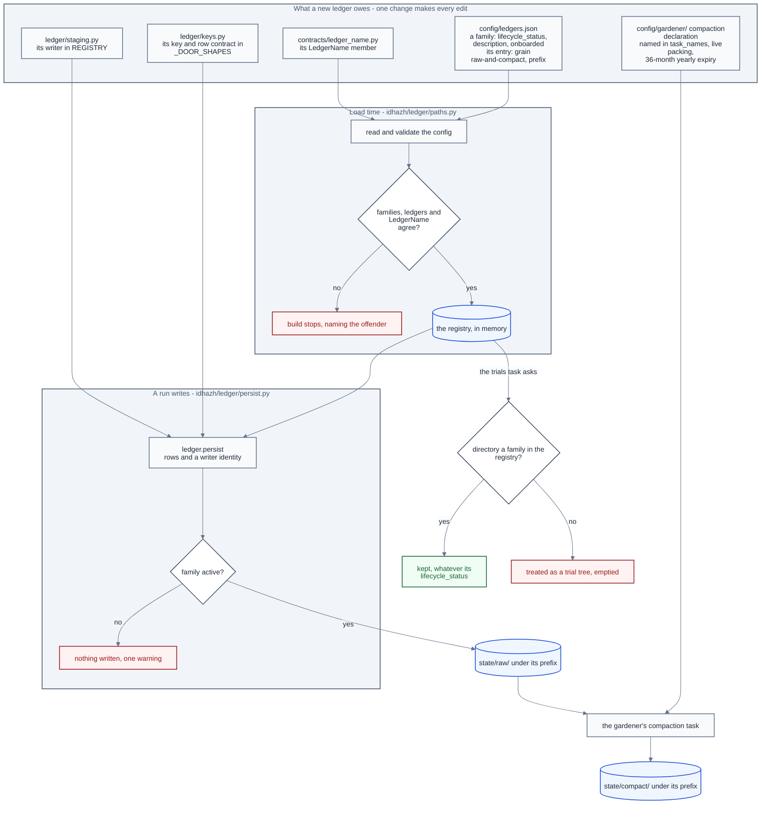

# The ledger registry

**Last Updated**: 2026-10-09

A ledger is a committed file or folder under `state/` that one run writes so that a later run can read it. A ledger exists in code only when it is registered, and registering it takes two edits. The first is one member of `LedgerName`, the ledger's one name in code. The second is one entry in `config/ledgers.json`, which puts the ledger in a family - one top-level folder under `state/` - and says where its files sit. When the code loads, it checks that the two edits agree, and the build stops if they do not.

This page says what each edit holds, what that check refuses, what a new ledger owes before its first row, how a family is paused or retired, and which module of `backend/idhazh/ledger/` answers which question. What each ledger answers, and why it files at the grain it does, is [state-ledgers.md](state-ledgers.md). The shape of a row is [schemas.md](schemas.md). How a contract payload reaches disk under `state/raw/` and `state/compact/` is [persistence.md](persistence.md).

## One typed name for one ledger

Every ledger here has exactly one name in code: a member of `LedgerName` in `backend/idhazh/contracts/ledger_name.py`. The value is the ledger's own name - the directory for a ledger that is a directory, the stem with no extension for a ledger that is a single file - so the directory a writer fills, the directory a reader walks and the word an operator types are one string rather than three. Two members may not share a value: an enum takes a repeat as an alias and says nothing, so the repeat is refused when the module loads.

**The Python name is spelled from the value and the family, and from nothing else.** A ledger that is its own family is its value in upper snake case: `feed-health` is `FEED_HEALTH`. A ledger inside a family puts the family first: `metrics` under `content-similarity-judge` is `CONTENT_SIMILARITY_JUDGE_METRICS`. The registry refuses a member that breaks the rule when it loads, so a reader who knows the folder knows the name.

**The value says what the ledger holds, never the kind of thing it is.** Owner decision, 2026-09-27. `validation` held verdicts on candidate models, so it is `candidate-models`. `telemetry-aggregate` held what is left of an item-health month, so it is `item-health-summary`. A name for a kind of thing claims every ledger of that kind: a reader cannot tell from the folder which one it holds, and the next ledger of that kind has no name left. Both were renamed while they held no files, so nothing moved.

It sits at the bottom of the contract graph rather than inside `backend/idhazh/ledger/`, because a contract may not import another part of `idhazh` (CLAUDE.md section 4) and a persisted shape is typed by it.

## Families and ledgers

`config/ledgers.json` says which families and ledgers exist, what lifecycle status each family is in, and where each ledger sits. `backend/idhazh/contracts/ledgers.py` is its shape and `backend/idhazh/ledger/paths.py` loads it once, when the module loads. `python backend/utilities/ledger_families.py --file <path>` prints it, family by family, and counts only the named files. Repeat `--file` for more paths relative to `state/`. It never counts every file in a ledger.

A **family** is one top-level folder under `state/`. `content-similarity-judge` is one family holding seven ledgers; most families hold one ledger of the same name. A family carries what is decided for the folder as a whole: its `name`, its `lifecycle_status`, a one-line `description` of what it holds, the UTC day it was `onboarded`, and its `ledgers`.

A **ledger entry** names one registered storage address. Each carries five things: its `name`, its `grain`, the `prefix` of directories it sits under inside `state/`, and - for a ledger that is a single file - the `stem` and `suffix` that name it. A dated ledger carries no stem, because its period names it. A day directory carries no suffix, because it is a directory. The prefix keeps the whole nest, the family's folder included, so an address is read off the ledger alone. A ledger that goes through the door carries neither stem nor suffix, and its prefix is the path inside each root ([A ledger under the two roots](#a-ledger-under-the-two-roots)).

Four builders locate the files of a ledger the door does not file - one JSON file, JSON files named by a stamp, one JSON file a day, or one folder a day - in two pairs:

| Builder | Answers |
| --- | --- |
| `path(state_dir, ledger, covers)` | where the rows covering this period go, as a `Path` |
| `relpath(ledger, covers)` | the same address, POSIX and relative, for a log line or a manifest |
| `tree_root(state_dir, ledger)` | the folder that holds every file of this ledger and nothing else - what a reader walks, whether the ledger files by day or by stamp |
| `tree_relpath(ledger)` | the same folder, POSIX and relative, for a log line or a manifest |

`covers` is the period the rows describe and never the day the job woke (CLAUDE.md section 2). A dated ledger handed nothing raises, and a flat one handed a period raises - `path` does not guess, because a guessed period files a row where nobody will look for it. `tree_root` is a builder of its own rather than `path` with no period, so `path` keeps that refusal.

A flat file has no folder of its own: `score-distribution.json` sits beside the similarity judge's other ledgers, so a walk handed that folder would read files that are not the ledger's. `tree_root` and `tree_relpath` refuse a flat ledger by name, and a caller asks `path` for the file. Every ledger has a prefix, a flat file included, so nothing sits loose at the top of `state/`.

Because the extension is data on the entry, a builder cannot emit the wrong one.

## A ledger under the two roots

A ledger that goes through the ledger door files under two roots rather than one: what a writer wrote under `state/raw/`, and what compaction left under `state/compact/` ([persistence.md](persistence.md)). Its grain is `raw-and-compact`, and a new ledger is born at it ([Onboarding and offboarding](#onboarding-and-offboarding)). Most door ledgers are a family of their own, such as `gardener`, `seen` or `item-health`. The similarity judge's five door ledgers file inside their family's folder, at `content-similarity-judge/<ledger>`: `scored-pairs`, `metrics`, `merge-line-holdout-scores`, `fitted-thresholds`, and `holdout-pairs`, the hand marks a person harvests.

**For this grain the `prefix` is the path inside each of the two roots.** Everywhere else it is the path from `state/`, but `["gardener"]` means `state/raw/gardener/` and `state/compact/gardener/`. The prefix starts with the family name and ends with the ledger's own value. A ledger that is its own family keeps `[<value>]`; a ledger inside a family may have any number of folders between the family and the value. The registry refuses a door ledger whose folder sits inside another door ledger's folder, because a walk of the outer ledger's raw days would read the inner ledger's files.

**The four builders above refuse the grain by name.** `path`, `relpath`, `tree_root` and `tree_relpath` each answer with an error that names the ledger and points at the ones that build its addresses: `raw_path`, `compact_path` and `compact_index_path`, with `raw_root` and `compact_root` for the folders a reader walks. So nothing builds a single-file address for a door ledger by accident. `ledger_families.py` counts the named files under each root on a line of its own.

**No ledger files CSV.** `backend/tests/contracts/test_no_csv_ledger_is_left.py` holds three facts: no registry entry carries the `.csv` suffix, and only the three JSON day ledgers it names file outside the door; `.gitattributes` names no union merge driver; and `git ls-files` finds no CSV file under `state/`. `backend/tests/contracts/test_door_ledgers_keep_no_csv_path.py` holds each door ledger to a compaction of its own, and every declaration to folders the registry builds.

This rule concerns committed row storage. Scratch CSV passed between jobs of one workflow and derived browser CSV under `frontend/public/` are not ledger storage. Their `csv_row` and `from_csv_row` codecs and browser readers still have callers.

**The local faithfulness label file is not a registered ledger.** `evals/labels.py` and `utilities/label_queue.py` can append to `state/labels.csv`, but no instance is committed. [Its retention rule](../../concepts/adaptive-pruning.md) keeps it forever. Before registering or committing it, obtain a retention decision: a new door ledger's yearly expiry would shorten that rule, and the no-CSV test refuses a committed CSV instance.

### The rule a judge ledger follows

A judge ledger is one the council or the similarity judge's code writes: the council's own record of each step of its night, and four of the `content-similarity-judge` ledgers - `scored-pairs`, `metrics`, `merge-line-holdout-scores` and `fitted-thresholds`. All five follow the rule below, so a reader who joins two of them meets one vocabulary.

`holdout-pairs`, the hand marks `merge-line-holdout-scores` counts, sits in the same folder and files through the door too, but a person writes it with `backend/utilities/sample_sheet.py --harvest`, so only the first two lines of the rule reach it: its row declares none of the door's names, and it has no `shard` field. Its key is the pair, `left_url` and `right_url`, never a run, because a pair marked again is still one pair, read with its newest mark ([persistence.md](persistence.md#reading-a-whole-ledger)). It files under the day the marks were made.

The council's own record has its door row contract: `CouncilRunRecord` in `backend/idhazh/contracts/council_run_record.py`. It names a step and a part. Its rows cross from one council job to the next in a scratch CSV file, which reads only this current shape; a row already filed keeps the schema stamp it was written under. `council.session._collect` files each judged date through `ledger.persist` in the `save_council_results` job.

The similarity judge's scored pairs and its metrics have their door row contracts too: `StorySimilarityPair` and `ContentSimilarityJudgeMetrics`. Each names its part `work_part_index`, and a row that carries the older `shard` cell reads it as that part. `council.session.settle` builds one writer identity for the night and hands it to each tenant's `Tenant.settle`; the similarity judge's `count_verdicts` files both ledgers with it through `ledger.persist`, naming itself `stages.count_verdicts` as the producer.

The fitted merge line's row contract is `FittedSimilarityThreshold`, whose `run_id` is the council run and takes the place of the door's cell. `stages.set_merge_line` files the night's line through `ledger.persist` under the same writer identity, naming itself `stages.set_merge_line` as the producer. It reads earlier nights' lines back through `ledger.load_fitted_thresholds`, and a build's `similarity.applied.applied_line` reads them through the same helper over `applied_lookback_days`; both read a day the gardener has not packed yet from its raw files. The console's `similarity-ledger.ts` reads packed days only, through `sliceFromDisk`.

| Rule | What it requires |
| --- | --- |
| The row declares none of the door's names, and `run_id` only as the council run | The door writes `ledger`, `covers`, `run_id`, `attempt`, `job`, `shard` and `unit_id` on every row it files ([persistence.md](persistence.md#the-door)), and a row field with one of those names takes that cell's place. The council run is also the run that files a judge row, so the two agree on `run_id`. `merge-line-holdout-scores` is the one exception: a person files it with their own `score-merge-line-holdout --run-id` run, so its `run_id` is that run, which is also the door's column. |
| A row about one part of the split names the part `work_part_index` | A row that needs the count names it `work_part_count`. `metrics` and `scored-pairs` name their part this way; `fitted-thresholds` and `merge-line-holdout-scores` describe a whole run and name no part. |
| The key includes `run_id`, and `work_part_index` on a row about one part | Two runs, or two parts of one run, never settle into one record. |
| The job that saves the council's results files the rows, through `ledger.persist` | `council.session._collect` files `council-run-records` in `save_council_results`, and `Tenant.settle` takes the same writer identity: `run_id` the council run, `job` `save_council_results`, `shard` 0, the run's attempt and the `--commit` the job checked out. A tenant names its own producer. A person files `merge-line-holdout-scores`, so this rule does not reach it. |
| Rows are filed under the judged date | The `date` cell decides the file, never the day the council ran. |

## What the registry refuses when it loads

The check runs when the config loads, so each of these stops the build with the offender's name in the message:

| The registry | Why it is refused |
| --- | --- |
| leaves a `LedgerName` member out of every family | the gardener's `trials` task empties every directory under `state/` that no task owns and the registry does not claim, so a missing ledger is a production folder the trial sweep would empty |
| lists one ledger twice in a family, or in two families | two entries are two answers about one ledger, and two families are two statuses for it |
| lists one family twice | one folder with two lists would have two statuses |
| lists a ledger whose prefix does not start with its family's name | the ledger would sit in one folder and take another folder's status |
| gives any ledger, a flat file included, no prefix at all | its files would sit loose at the top of `state/`, in no family's folder |
| holds a member whose Python name is not spelled from its family and its value | a Python name that says something the value does not is a second name a reader has to learn - the rule is in the section on typed names above |
| gives a `raw-and-compact` ledger a prefix that does not start with its family and end with its value | the door writes under the prefix but the envelope still carries the ledger value, so both ends are load-bearing |
| gives a `raw-and-compact` ledger that is its own family any prefix other than `[<value>]` | a self-family ledger has no folder between the family and the value |
| gives a `raw-and-compact` ledger a prefix inside another door ledger's prefix | the outer ledger's raw-day walk would read the inner ledger's files |

The first row is what the registry is for. The claim used to be a hand-written Python set, and a ledger somebody forgot to add to it was a production directory the trial sweep quietly emptied. It is now a build that will not start.

## The three lifecycle statuses, and what each one changes

`active` is written and read. `paused` is not written now and will resume. `retired` is no longer written and is not coming back. What a ledger's indexes record while its family is paused or retired, and at every other stage of its life, is [ledger-lifecycle.md](ledger-lifecycle.md).

**All three are claimed, so all three are protected.** The status says what a writer may do, never whether the rows survive. Deleting a family's data for good is something a person does on purpose, never a side effect of a status change.

**The write path reads the status on every write.** One function decides: `accepts_new_rows` in `backend/idhazh/ledger/lifecycle.py`, which reads the family's status from the registry each time it is called. Every route that writes new rows asks it before it writes: the ledger door ([persistence.md](persistence.md)) for every raw write from a pipeline job, and the writers of the ledgers outside the door - the day record, the digest fragment, the trace sink once per shard, and the similarity judge's score distribution and archive. Two rules hold, and both are the owner's:

- A write into a paused or retired family is skipped with one warning naming the ledger, its family, the status and the rows not written, and the run carries on. A status is a decision about one folder, and a run that stopped on it would cost every other family its rows.
- The passes that compact closed days and age out old rows keep running over a paused or retired family. To freeze its old rows as well, pause the pass that deletes them: a status says whether new rows are written, never how long old ones are kept. Those passes never ask, and the ledger door exempts a compact-tier write and any write from `migrate`, `run-tasks` or `history`, because each of those files rows again that were already recorded - skipping one after its source was deleted would lose rows while the run reported success.

**The check sits at the write, never in the path builders.** `path`, `tree_root` and `relpath` also serve readers, and a paused family is still read.

**What pausing a family costs, beyond its own rows.** CI builds its canary day through the same writers, so pausing a family thins that fixture too. A paused `content-similarity-judge` re-judges the same nights at every council run until they leave the window, because what counts a night as outstanding reads the record the skip stops writing. And a paused `digest-fragments` stops the first run of a new day from publishing it at all: the day is assembled from the fragments on disk, and a day with none is refused. A paused `visual-prunes` stops the cleanup record while the cleanup itself still runs, because the record goes through the ledger door from the assemble job, which is not one of the maintenance jobs; nothing reads those rows yet, and the cleanup deletes nothing today.

## Onboarding and offboarding

**What a new ledger owes.** A new ledger files through the ledger door from its first row. It owes every edit below, each in the file named beside it, and the change that adds the ledger makes all of them. The check at load time, or the test named beside an edit, refuses the change while one is missing.

- **Lifecycle.**
  - A family in `config/ledgers.json` with `lifecycle_status` `active`, a one-line `description` and the UTC day it is `onboarded`, holding the ledger's entry: grain `raw-and-compact`, and the `prefix` it files under inside `state/raw/` and `state/compact/`, which starts with the family's name and ends with the ledger's own value. A ledger that joins a family adds only its entry to that family's `ledgers`, and the family's status covers it from its first row.
  - Its `LedgerName` member in `backend/idhazh/contracts/ledger_name.py`, spelled from its value and its family ([One typed name for one ledger](#one-typed-name-for-one-ledger)).
  - Its value in `LEDGER_NAMES` in `frontend/src/lib/data/slice-shapes.ts`, which `test_every_ledger_the_door_may_query_is_a_ledger` holds equal to the registry. A ledger whose prefix nests it inside its family's folder also adds that folder to `LEDGER_FOLDERS` in the same file, which `backend/tests/contracts/test_frontend_vocabularies.py` holds equal to the nested prefixes.
- **Write and read.**
  - Its key and row contract in `_DOOR_SHAPES` in `backend/idhazh/ledger/keys.py`, and a preference in `_PREFERENCES` where two of its repeated rows can disagree. A preference stays in code because it is a callable, and a callable is not JSON. A row contract the council's verbs would otherwise import - a judge's - goes in `_JUDGE_DOOR_SHAPES` in the same file instead, which imports it only when its ledger is first asked about. So the council's import closure does not grow, and a judge deleted from the tree leaves every council verb running.
  - A writer that files its rows through `ledger.persist` and hands it a `WriterIdentity` (`backend/idhazh/contracts/file_envelope.py`): the run, attempt, job, shard, producer and commit. The ledger names every file from that identity ([persistence.md](persistence.md#the-door)), so a writer never builds a file name.
  - Its row in `REGISTRY` in `backend/idhazh/ledger/staging.py`: what writes it, and which `digest.yml` commit job stages its files.
- **Retention and gardener.**
  - A compaction declaration, `config/gardener/compact-<folder>.json`, where `<folder>` is its prefix with each `/` written `-`. `compaction_task` in `backend/idhazh/config.py` builds that name, and `test_a_compaction_and_a_door_ledger_come_together` refuses a door ledger without one.
  - That task's name in `task_names` of `config/idhazh_gardener.json`. The gardener loads only the declarations named there.
  - The owner-approved retention in that declaration: live packing (`dry_run` false, `compact_after_days` 1), `daily_keep_days` 45, `monthly_keep_days` 93, a `monthly_window` of `forever`, and yearly expiry after 36 calendar months (`yearly_keep_months` 36, `yearly_prune_enable` true). `test_every_ledger_uses_the_approved_live_retention_chain` holds every compaction to it.
  - Its entry in the named-decision tables of `backend/tests/contracts/test_gardener_config.py` - the ledger in `RETENTION_LEDGERS`, or its task in `MOVED_LEDGER_TASKS` - so `LIVE_BY_DECISION` names the owner's decision beside each switch that runs live. A switch ships in dry run unless a named decision put it live, so a declaration missing from both tables is refused.

**Pause or retire a family.** Change its `lifecycle_status`, and nothing else. Nothing is discovered, and nothing is a hand-list somebody can forget. The next write of new rows into it is skipped with one warning, and its old rows are read and aged as before: its compaction keeps packing them, and its yearly expiry keeps deleting what is older than its window.

**Remove a family's rows for good.** Retire the family first, so no run writes it again. Deleting what it holds is then a person's decision, made on purpose and never by a status change ([The three lifecycle statuses](#the-three-lifecycle-statuses-and-what-each-one-changes)).

In one line: a ledger exists because a family lists it; the families, the ledgers and the typed names must agree or the build stops; a writer reaches `state/raw/` only through the door, and only while its family is active; the gardener's compaction moves what the writers left into `state/compact/`; and the gardener's `trials` task empties only what no task owns and the registry does not claim.

The diagram draws the edits and the one write. The table below names the module behind each step.

## The modules behind the door

`backend/idhazh/ledger/__init__.py` is the door itself, and every caller reaches the ledger through it - `from idhazh import ledger`, then `ledger.X`. It holds imports and one `__all__` and nothing else, so a name can move between the modules below without a caller changing. The split is for whoever maintains the ledger; a caller never sees it.

| Module | The one question it answers |
| --- | --- |
| `__init__.py` | which module holds the name a caller asked for |
| `paths.py` | where a ledger's file lives: read from `config/ledgers.json`, or built under `state/raw/` and `state/compact/` |
| `keys.py` | what makes two rows of one ledger the same record |
| `filenames.py` | what one writer's file is called, and how that name reads back |
| `csv_file.py` | how a contract writes its rows as one CSV document - a scratch file one job hands the next, or the label file a person appends to - and how such a file's header is checked |
| `rows.py` | how a caller puts rows into a ledger and gets them back out |
| `lifecycle.py` | whether a ledger takes new rows now |
| `staging.py` | who writes each ledger, and which commit label's job stages it |
| `persist.py` | the one door a contract payload takes to disk as parquet or JSON lines, and back |
| `raw_files.py` | which raw files hold a ledger's current rows - the highest attempt at each work unit, oldest first - and what those rows are |
| `ledger_files.py` | which files - yearly, monthly, daily or raw - hold one ledger's current rows, and what they are |
| `day_removal.py` | which door files hold a range of days, and each one rebuilt without them |
| `stored_output.py` | whether named raw and compact files agree with their stored identities and compact indexes |
| `published_columns.py` | whether the ledger files the site publishes carry the columns their row contracts declare |
| `arrow_schema.py` | which column type each field of a contract becomes |
| `parquet.py` | how rows become a parquet file and back - the only module that imports pyarrow |
| `json_lines.py` | how rows become a JSON-lines file and back |

**`ledger.persist` is the function, never the module.** The door re-exports the function under its module's own name, so `from idhazh.ledger import persist` hands back the function and the module's other names are out of reach through it. A module inside the package that needs `read_envelope` or `load` imports them from `idhazh.ledger.persist` directly, as `raw_files.py` does.

One edge in that graph carries a reason rather than a preference. **`paths.py` imports nothing from `keys.py`**: where a ledger lives and how its rows settle are two questions that change for different reasons, and one module holding both is how a path edit starts moving a settlement rule.

## Row files are named by the ledger package

A producer hands the ledger its rows and the identity of the writer, and the ledger decides what the file is called. A caller that builds its own name is a caller that will disagree with the parser the next time either of them changes, and the two are a day apart in the same package.

One module outside may ask, and none may carry a copy. `backend/idhazh/path_classes.py` answers whether a committed path was written by exactly one writer, which it can only do by reading the pattern that minted the name - so that pattern is public for it, and inlining a second copy of it is the thing being refused.

## Design rationale

**The set of ledgers is a config file, not a Python set and not a glob.** Owner decision, 2026-09-26.

A frozen set in Python was what this replaced, and it is the defect rather than the alternative. The state cleanup of the day subtracted the set from the children of `state/` and treated the remainder as a trial run's tree, so a ledger left out of the set was a production directory it emptied. One ledger was exactly that: a real ledger, written by a stage, absent from the set - and its 90-day trial sweep emptied it well before the 14-month window its own retention knob promised. Nothing in the old design could catch it, because a missing name reads as a name that was never meant to be there.

A glob over `state/` was the other candidate and it fails twice. Its cost rises with the data (CLAUDE.md Guardrail #12), and it cannot tell a retired ledger from one that has never run - a ledger whose first write failed is simply invisible to a walk, which is the opposite of what a protected set needs.

The config carries where each ledger lives and each family's lifecycle status. It does not carry how the ledger's rows settle: a dedup key is a tuple and a preference is a callable, and a callable is not JSON. Merging the two into one table was considered and rejected - it re-couples two questions that change for different reasons, which is why `paths.py` imports nothing that answers the second one.

**A lifecycle status belongs to a family, and an address to a ledger.** Owner decision, 2026-09-27. A status is a decision about a whole folder: pausing the similarity judge means none of its seven ledgers is written, and a status stored on each ledger made that seven edits that could disagree with each other. An address is a fact about one row shape - which folder, which grain, which file name - and two ledgers in one family still file differently. So the status is written once per folder, and the prefix keeps the whole nest so no builder has to ask the family anything.

**The last three folders joined the registry rather than keep their own names.** `traces`, `day-metrics` and `digest-fragments` were built by their owning modules from directory constants, and the state cleanup of the day protected them from a list typed into the sweep beside the registry. That list was a second place to forget a folder, and each constant was a second spelling of where a ledger lives - the two defects the registry exists to remove. Each is now a one-ledger family, its owner composes its paths from the registry, and the one file name an owner minted, a digest fragment's, is minted inside the package like every other name under `state/`. None of them moved: each builder lands on the bytes it built before, and a test holds it.

**No module outside the package joins a ledger's name onto a root.** A hand-joined folder is right only until the registry moves the ledger, and then it reads a folder that no longer holds anything - which reads as a ledger with no history rather than as a fault. So every folder comes from `tree_root` or `tree_relpath`. `backend/tests/contracts/test_ledger_package.py` refuses a join of a `LedgerName` member anywhere else under `backend/`, and a typed `state/<family>` string in any module that is not a test.

**Retention stays with the pass that deletes.** A family's status says whether new rows are written. How long old rows are kept is answered by the retention passes, each from its own knob, and a window written here would be a second place to set it. So pausing a family does not freeze its old rows; pausing the pass that deletes them does.

**The field is `lifecycle_status`, not `state`.** `state` is already the name of the folder every ledger sits in, so `state: paused` in a file that describes `state/` reads as a claim about the folder. `lifecycle_status` says what it is - where in its life the family is - and no key in the file is named `state`. The Python enum is `LedgerLifecycleStatus`, so it cannot be mistaken for the `LifecycleStatus` that `contracts/taxonomy.py` uses for desks, lenses and feeds.

**The eval ledger is `summary-quality-evals`.** Each row measures one summary's quality; `summary-quality` stays free for fitted quality thresholds. Its ID folder, `summary-quality-evals-index`, was deleted on 2026-10-04 with the lookup it held; the [evaluation design rationale](../../concepts/evaluation.md#design-rationale) says why.

**A family carries no owner field.** Owner decision, 2026-09-27. An owner would say who answers for a family. One identity commits to this repository (CLAUDE.md section 8), so the field would hold the same value on every family and tell a reader nothing. The code that answers for a family is found by a search for its `LedgerName` members, because a module that reads or writes a ledger names it by its member and by nothing else.

**A root that tells one copy of a ledger from another is an argument to a builder, never a field on an entry.** The registry is one entry per name and the check above refuses a second, so a ledger that ends up sitting under two roots at once cannot express that as two entries - it would break the check on the first load. `prefix` is the nest a ledger sits in, and a builder that has to choose between two roots takes the choice from its caller and composes it with the same entry.

CLAUDE.md section 11 does not apply to this file. It is a config file this project authors, nothing but this repository reads it, and a file a person edits in place has no older copy for a later build to read - so it carries no `version` and no `changelog`.

**`Grain` is transitional and its declaring line says so.** [../../concepts/telemetry-intent.md](../../concepts/telemetry-intent.md) requires every tree under `state/` to reach one pattern, and `raw-and-compact` is that pattern. The other four grains are what that page has not yet removed: one JSON file (`flat`), JSON files named by a stamp (`stamp`), one JSON file a day (`day`) and one folder a day (`tree`). None of them holds CSV. They are recorded because all four really are on disk: the registry is an honest map of today.

`test_every_ledger_the_door_may_query_is_a_ledger` holds `LEDGER_NAMES` in `frontend/src/lib/data/slice-shapes.ts` equal to this registry, so a new registry member joins the browser door vocabulary in the same change.

## See also

- [state-ledgers.md](state-ledgers.md) - what each ledger answers, and why it files at the grain it does.
- [persistence.md](persistence.md) - the ledger door: parquet and JSON lines under `state/raw/` and `state/compact/`, and how the engine is swapped.
- [ledger-lifecycle.md](ledger-lifecycle.md) - what a ledger's indexes record at each stage of its life, a paused or retired family's included.
- [schemas.md](schemas.md) - the shape of a row, and the rule that decides whether a ledger partitions.
- [../publishing/retention.md](../publishing/retention.md) - the passes that age old rows out, whatever a family's lifecycle status.
- [../publishing/ledger-compaction.md](../publishing/ledger-compaction.md) - what a compaction declaration packs, keeps and expires.
- [../publishing/llm-council.md](../publishing/llm-council.md) - the council's night, its steps, and the record it keeps of each.
- [../../concepts/telemetry-intent.md](../../concepts/telemetry-intent.md) - the one pattern every tree under `state/` is moving to, and why `Grain` is transitional.
- [../../../CLAUDE.md](../../../CLAUDE.md) Guardrail #12 - every read must have a fixed-size input, so no walk over `state/` decides which ledgers exist.
- [../../concepts/glossary.md](../../concepts/glossary.md) - family and ledger, each in one line.
- [../../../CLAUDE.md](../../../CLAUDE.md) - Guardrail #12, sections 2, 4, 8 and 11.
