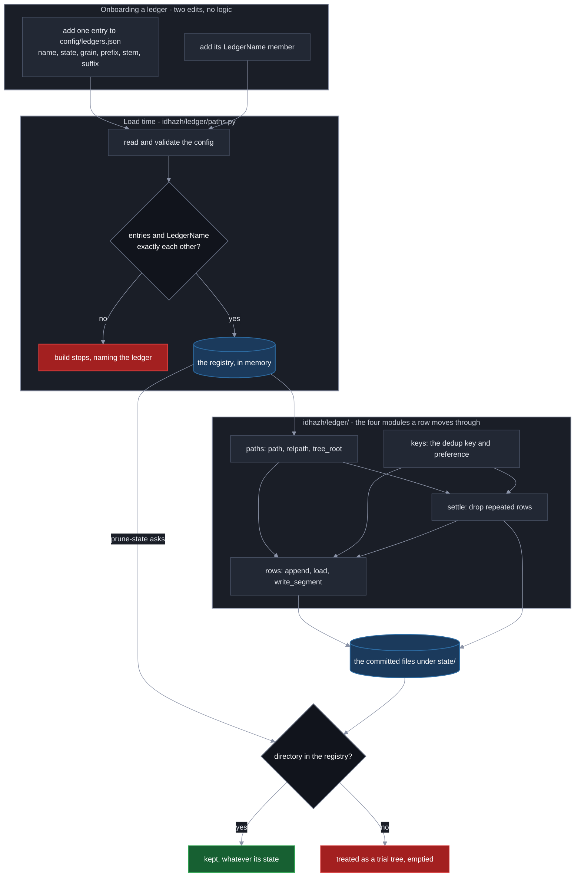

# The ledgers under state/

**Last Updated**: 2026-09-27

`state/` is the only memory this pipeline has. Every run starts on a fresh machine with a fresh checkout, so anything one run needs to tell the next is committed (CLAUDE.md Guardrail #1). This page says what each committed ledger answers and why it files at the grain it does.

Two neighbours own the other halves of the question. [schemas.md](schemas.md) owns the shape of a row and the rule that decides a grain. [../../concepts/partitions.md](../../concepts/partitions.md) owns what counts as a day file and a month name. This page is the per-ledger answer: this ledger, this grain, this reason.

Every ledger here is append-only except `state/item-health-summary/`, which is rewritten. The section on it says why.

## A ledger partitions only when its read carries a time window

A window lets the reader name the files it wants and skip the rest. Without one every file is opened anyway, and splitting the ledger buys no read time at all. The rule is [schemas.md](schemas.md); `state/visual-prunes/` is the one declared exception, and it is named below with what it bought instead.

**The day grain buys the same two things everywhere it appears.** A run writes one day, so two runs collide on a file only when they are the same day. And taking a day back off the record is one `rm` rather than an edit inside a shared file, which an append-only ledger cannot express.

## One typed name for one ledger

Every ledger here has exactly one name in code: a member of `LedgerName` in `backend/idhazh/contracts/ledger_name.py`. The value is the ledger's own name - the directory for a ledger that is a directory, the stem with no extension for a ledger that is a single file - so the directory a writer fills, the directory a reader walks and the word an operator types are one string rather than three. Two members may not share a value: an enum takes a repeat as an alias and says nothing, so the repeat is refused when the module loads.

It sits at the bottom of the contract graph rather than inside `backend/idhazh/ledger/`, because a contract may not import another part of `idhazh` (CLAUDE.md section 4) and a persisted shape is typed by it.

`DAY_TREES` is the subset a writer files its own segment into, one file per writer under `<ledger>/<YYYY>/<MM>/<DD>/`. Only those carry a settlement rule - what makes two of their rows one record - so `write_segment` and its siblings refuse any other ledger by name. The refusal is load-bearing rather than belt-and-braces: the argument type admits every ledger under `state/`, so without it `state/seen/` would take a directory where that ledger keeps a file.

## What each ledger answers

| Ledger | Answers | Grain | Read window |
| --- | --- | --- | --- |
| `state/seen/<YYYY>/<MM>/<DD>.csv` | How old is this? - for an article whose feed carried no date | day file | `collect.seen_window_days` |
| `state/published/<YYYY>/<MM>/<DD>.csv` | Have we already run this? | day file | `collect.published_window_days` |
| `state/feed-health/<YYYY>/<MM>/<DD>.csv` | Is this source still working? One row per feed per run | day file | `HEALTH_WINDOW_DAYS` |
| `state/item-health/<YYYY>/<MM>/<DD>.csv` | What did every planned item do? One row per planned item per run | day file | the published projection, a month at a time |
| `state/item-health-summary/<YYYY-MM>.csv` | What is left of an item-health month | month file | the whole file |
| `state/feed-retirements.csv` | Is this address gone for good? | one file | the whole file |
| `state/visual-prunes/<YYYY>/<MM>/<DD>.csv` | Is the picture backlog shrinking? | day file | the whole tree |

`state/seen/` has no published mirror at all, so unlike the two health ledgers there is no second grain anywhere near it.

`state/feed-health/` is read by the console directly at build time. There is no published mirror; the one that existed until 2026-09-16 was never fetched.

`state/item-health/` is the fastest-growing of the four day-filed ledgers. The console reads it a month at a time through the published projection, which stays monthly: `public_telemetry.publish` folds a month from that month's day files.

`state/feed-retirements.csv` is read whole because a retirement has no time bound, so it is one file. It is also the smallest: a row is written only when a server has reported one address permanently gone on five distinct runs.

## The published ledger sizes from the ceiling, not from today

`state/published/` is the grain the published tree itself uses, and a run appends to the day its own rows name and to nothing else.

Its read carries `collect.published_window_days`, and the committed config sets that to `-1`. So today every day file is opened and the answer is every address ever published. **The day grain is what makes a finite cover possible at all**: it names the days in range and opens those files and no others. Until a window is set, the grain buys a small merge surface and a removal that is one `rm`, and not a faster read.

Size it from the ceiling. A run plans at most `run.safety_ceiling_per_run` items, which the committed config sets to 80, and the schedule fires five times a day - so a day writes at most 400 rows and a year at most about 146,000.

Measured 2026-09-08 on an Intel Core i7-1265U over the 7,600 committed rows, header included:

| Quantity | Reading |
| --- | --- |
| A row on disk | 106.9 B |
| A year at the ceiling | 15.6 MB |
| Reading the whole file | median 32.7 ms over fifteen consecutive runs, best 30.1, worst 37.5 |
| The same read with other jobs on the box | as slow as 68.6 ms |

That last row is the number to remember before reading any wall clock here as a property of the file. The 16 committed days average 475 rows a day, which is above the ceiling arithmetic because they were written under three different ceilings - 200 until 2026-08-26, 160 until 2026-09-07, 80 since - and the newest full day wrote 357. See [../../reference/pipeline-cost.md](../../reference/pipeline-cost.md).

## The aggregate files by month because it summarises a month

`state/item-health-summary/<YYYY-MM>.csv` is what is left of an item-health month once `observability.item_health_full_grain_months` has passed: one row per date and stage, folded by `retention.compact_month`.

A day file of a month's totals is a shape nothing consumes, so it files by month. It is also the one ledger here that is rewritten rather than appended, because every row in it is derived from the days it summarises.

## Why visual-prunes files by day anyway

`state/visual-prunes/` is the declared exception to the partition rule. Its read will never carry a window, so the layout buys it no read time at all.

What it buys is the two things the day grain buys `state/published/`: two runs collide on a file only when they are the same day, and taking a day back off the record is one `rm`. Five rows a day for ever is a collection that grows, and a collection that grows here takes the layout every other growing one has.

A row is written on every run, including the runs where the policy is switched off and there is nothing to clean. A report of "nothing to do" is what makes the day the policy starts working visible.

## A missing file is an answer, not a failure

No reader fails on a missing file. A fresh clone has no history, and a run with no history is a run where nothing was seen, nothing was published and no feed has a record yet - which is exactly what an empty result says.

Callers pass the state directory and never the file name. The layout is one fact, and it lives in `config/ledgers.json`.

## The registry: one entry per ledger, and a build that stops without it

`config/ledgers.json` says which ledgers exist, what state each one is in, and where each one sits. `backend/idhazh/contracts/ledgers.py` is its shape and `backend/idhazh/ledger/paths.py` loads it once, when the module loads.

Each entry carries five things: the ledger's `name`, its `state`, its `grain`, the `prefix` of directories it sits under inside `state/`, and - for a ledger that is a single file - the `stem` and `suffix` that name it. A dated ledger carries no stem, because its period names it. A day directory carries no suffix, because it is a directory.

Three builders read the registry and nothing else builds a path under `state/`:

| Builder | Answers |
| --- | --- |
| `path(state_dir, ledger, covers)` | where the rows covering this period go, as a `Path` |
| `relpath(ledger, covers)` | the same address, POSIX and relative, for a log line or a manifest |
| `tree_root(state_dir, ledger)` | the whole-tree directory a reader walks, for a ledger that files by day |

`covers` is the period the rows describe and never the day the job woke (CLAUDE.md section 2). A dated ledger handed nothing raises, and a flat one handed a period raises - `path` does not guess, because a guessed period files a row where nobody will look for it. `tree_root` is a builder of its own rather than `path` with no period, so `path` keeps that refusal.

Because the extension is data on the entry, a builder cannot emit the wrong one.

### The entries and the typed names are exactly each other

Every `LedgerName` member has one entry and every entry names one member. The check runs when the config loads, so a ledger with no entry - or an entry naming a member twice - stops the build with the ledger's name in the message.

That refusal is what the registry is for. `prune-state` empties every directory under `state/` the registry does not claim, and the claim used to be a hand-written Python set. A ledger somebody forgot to add to that set was a production directory the trial sweep quietly emptied. It is now a build that will not start.

### The three states, and what each one changes

`live` is written and read. `paused` is not written now and will resume. `retired` is no longer written and is not coming back.

**All three are claimed, so all three are protected.** The state says what a writer may do, never whether the rows survive. Deleting a ledger's data for good is something a person does on purpose, never a side effect of changing a state.

### Onboarding a ledger, and retiring one

Adding one is two edits and no logic: one entry in `config/ledgers.json` at `state: live`, and its `LedgerName` member. A settled day tree needs a third - its key and preference, which stay in code because a preference is a callable and a callable is not JSON.

Pausing or retiring one is a single field. Nothing is discovered, and nothing is a hand-list somebody can forget.

In one line: a ledger exists because an entry says so; the entry and the typed name must agree or the build stops; everything that touches `state/` goes through the door the registry feeds; and `prune-state` empties only what the registry does not claim.

The four drawn are the ones a row moves through. The other three - `csv_file`, `filenames` and `headers` - are read and written by those four and reach neither the registry nor `state/` on their own; the table below lists all eight.

### The seven modules behind the door

`backend/idhazh/ledger/__init__.py` is the door itself, and every caller reaches the ledger through it - `from idhazh import ledger`, then `ledger.X`. It holds imports and one `__all__` and nothing else, so a name can move between the modules below without a caller changing. The split is for whoever maintains the ledger; a caller never sees it.

| Module | The one question it answers |
| --- | --- |
| `__init__.py` | which module holds the name a caller asked for |
| `paths.py` | where a ledger's file lives, read from `config/ledgers.json` |
| `keys.py` | what makes two rows of one ledger the same record |
| `filenames.py` | what one writer's file is called, and how that name reads back |
| `csv_file.py` | how rows are read out of a CSV file and written back into it |
| `headers.py` | how a file written under an older header is read |
| `rows.py` | how a caller puts rows into a ledger and gets them back out |
| `settle.py` | which rows of a committed file repeat a key, and what dropping them costs |

Two edges in that graph carry a reason rather than a preference. **`paths.py` imports nothing from `keys.py`**: where a ledger lives and how its rows settle are two questions that change for different reasons, and one module holding both is how a path edit starts moving a settlement rule. **`rows.py` imports `day_shards` inside the function bodies that need it, never at the top of the file**: `day_shards` imports names back out of this package at its own module top, so a module-scope import in `rows.py` would close a load-time cycle - importing the package runs `__init__`, which imports `rows`, which re-enters a package that is still being built.

A fresh interpreter importing either module is not what proves the second one. Measured 2026-09-27 by promoting that import on purpose: both orders still loaded, because the door happens to bind `csv_file` before `rows`, so the name is already there by the time `day_shards` asks for it. Reorder the door and the same promotion raises. What holds the rule is the check that reads the import statements themselves, and a green load says only that the package loads.

### Nothing outside the package names a file under state/

A producer hands the ledger its rows and the identity of the writer, and the ledger decides what the file is called. A caller that builds its own name is a caller that will disagree with the parser the next time either of them changes, and the two are a day apart in the same package.

One module outside may ask, and none may carry a copy. `backend/idhazh/path_classes.py` answers whether a committed path was written by exactly one writer, which it can only do by reading the pattern that minted the name - so that pattern is public for it, and inlining a second copy of it is the thing being refused.

### Design rationale

**The set of ledgers is a config file, not a Python set and not a glob.** Owner decision, 2026-09-26.

A frozen set in Python was what this replaced, and it is the defect rather than the alternative. `prune-state` subtracts the set from the children of `state/` and treats the remainder as a trial run's tree, so a ledger left out of the set is a production directory it empties. One ledger was exactly that: a real ledger, written by a stage, absent from the set - and its 90-day trial sweep emptied it well before the 14-month window its own retention knob promised. Nothing in the old design could catch it, because a missing name reads as a name that was never meant to be there.

A glob over `state/` was the other candidate and it fails twice. Its cost rises with the data (CLAUDE.md Guardrail #12), and it cannot tell a retired ledger from one that has never run - a ledger whose first write failed is simply invisible to a walk, which is the opposite of what a protected set needs.

The config carries where a ledger lives and its lifecycle. It does not carry how the ledger's rows settle: a dedup key is a tuple and a preference is a callable, and a callable is not JSON. Merging the two into one table was considered and rejected - it re-couples two questions that change for different reasons, which is why `paths.py` imports nothing that answers the second one.

**A root that tells one copy of a ledger from another is an argument to a builder, never a field on an entry.** The registry is one entry per name and the check above refuses a second, so a ledger that ends up sitting under two roots at once cannot express that as two entries - it would break the check on the first load. `prefix` is the nest a ledger sits in, and a builder that has to choose between two roots takes the choice from its caller and composes it with the same entry.

CLAUDE.md section 11 does not apply to this file. It is a config file this project authors, nothing but this repository reads it, and a file a person edits in place has no older copy for a later build to read - so it carries no `version` and no `changelog`.

**`Grain` is transitional and its declaring line says so.** [../../concepts/telemetry-intent.md](../../concepts/telemetry-intent.md) requires every tree under `state/` to reach one pattern, so five grains describes the mess that page exists to remove. It is recorded because all five really are on disk: the registry is an honest map of today, and it is the seam a migration edits one entry at a time.

## See also

- [schemas.md](schemas.md) - the shape of a row, and the rule that decides whether a ledger partitions.
- [../../concepts/partitions.md](../../concepts/partitions.md) - what counts as a day file and a month name, and how a collection changes grain.
- [../../concepts/adaptive-pruning.md](../../concepts/adaptive-pruning.md) - what happens to these rows as they age.
- [../../concepts/growing-reads.md](../../concepts/growing-reads.md) - what a read over one of these ledgers costs as it grows.
- [../publishing/retention.md](../publishing/retention.md) - the windows that empty them again.
- [../../reference/pipeline-cost.md](../../reference/pipeline-cost.md) - where a measured number carries its hardware and date.
- [../../../CLAUDE.md](../../../CLAUDE.md) - Guardrail #1, Guardrail #12, section 2.
