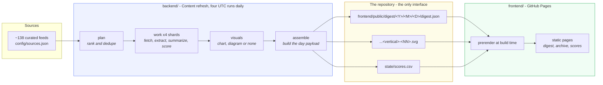
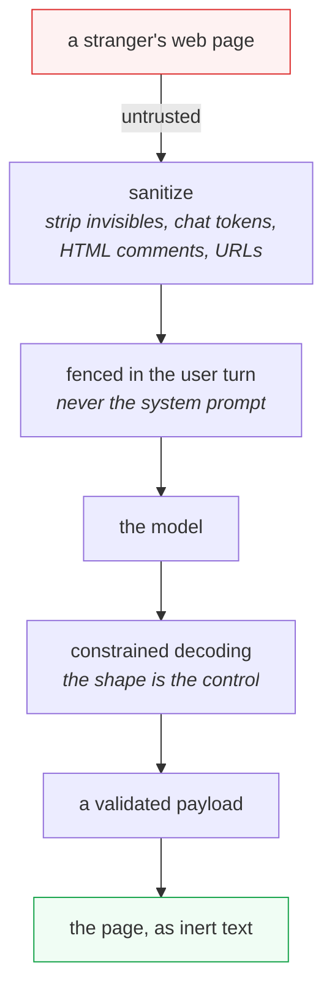
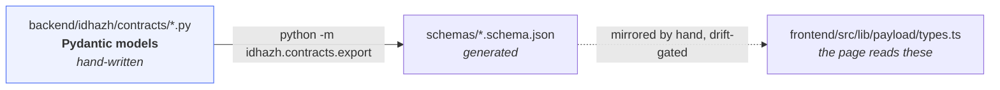

# Architecture overview

**Last Updated**: 2026-08-30

How the whole system fits together, in one page. Every box here has a deeper
document behind it; this page exists so you can find the right one.

## The shape

Two halves that never call each other. They meet only through committed files.

**`backend/` never runs at read time. `frontend/` never calls `backend/`.** The
repository is the interface. That is what makes the published site plain files
and the pipeline replayable.

## What each stage owns

| Stage | Input | Output | Owns |
| --- | --- | --- | --- |
| `plan` | feed list | `run-plan.json` | Which URLs get worked today, and their order. Loads no model. |
| `work` | one shard of the plan | `*.article.json`, `*.summary.json`, `*.eval.json` | Fetching, sanitising, summarizing, scoring. |
| `visuals` | article + summary | `*.visual.json` + an SVG | Whether an item gets a picture, and drawing it. |
| `assemble` | everything above | `digest.json`, `run.json`, ledger rows | The published day. |

Every stage is invocable on its own with a file in and a file out. A stage that
could only run inside the whole pipeline could not be tested.

## The trust boundary

Text fetched from the open web is **data, never instruction**. It crosses the
boundary once, at extraction, and is sanitised there. The controls are the
sanitizer, the fence and the pinned output shape - not a prompt asking a model to
behave. Eight injection canaries assert this on every build, five at the pipeline
and three on the published page.

See [`sources/trust-boundary.md`](sources/trust-boundary.md).

## Contracts before logic

Every persisted shape is a Pydantic model first. The JSON Schema is generated
from it and never hand-edited; a test regenerates and fails on any diff. Change
the model, run the export, commit both.

Each schema carries a date-stamped `version` and a `changelog` explaining every
change. A payload written by yesterday's run that today's build cannot read is a
release blocker.

See [`contracts/schemas.md`](contracts/schemas.md).

## Where a number comes from

Nothing in this project may cite a throughput, cost or quality figure without
saying what measured it and when. One exception, added 2026-08-30: the operator
console prints a counterfactual cost in currency, from measured token counts and
a rate the operator sets, labelled a counterfactual and never a bill
([../../CLAUDE.md](../../CLAUDE.md) Rule #10). The numbers that currently shape
the design:

| Measured | Value | Where |
| --- | --- | --- |
| Qwen3.5-9B decode, 4 threads (**the configured summarizer**) | 6.01 tok/s | `ubuntu-latest`, 2026-08-23 |
| Qwen3-8B decode, 4 threads (retired incumbent, historical record) | 7.28 tok/s | `ubuntu-latest`, 2026-08-22 |
| Qwen3-4B decode, 4 threads | 13.00 tok/s | same |
| Blended seconds per article, retired incumbent (historical record) | 229 s | derived from the above |
| Article length, p50 / p90 | 978 / 2769 words | 20 live articles, 2026-08-22 |
| On-device search download | 43 MB | encoder + tokenizer + WASM |
| `visuals` per item, 4B | 21.0 s | `ubuntu-latest`, 2026-08-24, n=148 |
| One 512px CPU image, Z-Image-Turbo | ~79 min | `ubuntu-latest`, 2026-08-23 |

There is no blended seconds-per-article figure for the configured summarizer.
Deriving one needs its own tokenizer's prompt count, which nobody has measured,
so the row is absent rather than filled with the retired model's arithmetic
(Rule #10).

**The configured summarizer did not pass qualification.** It was adopted on
2026-08-27 by owner decision ([`../../CLAUDE.md`](../../CLAUDE.md) section 0)
over two failing hard gates, and no comparison against the retired model was
ever run. What passed, what failed and what is still open are in
[`../concepts/evaluation.md`](../concepts/evaluation.md).

The full ledger, including what is still unmeasured, is
[`../reference/measurements.md`](../reference/measurements.md).

## Two features the measurements ruled out

Both were planned, both were escalated on a measured fact, and both are recorded
here rather than left as an unexplained gap in the roadmap.

**Generated images.** `Tongyi-MAI/Z-Image-Turbo` at bfloat16 needs 527 s per
denoising step and 9.2 GB resident on a 4 vCPU runner, so one 512x512 image costs
about 79 minutes - longer than the entire `visuals` job's budget. The second
candidate, `alpha-vllm/Anima-2.9B`, does not exist on the Hub. No step count or
resolution reaches a usable number from 527 s per step. Narrative items publish
with no visual, which is already the common answer
([`publishing/visuals.md`](publishing/visuals.md)).

**A chat model in the reader's browser.** Every candidate's smallest single
weight file is over GitHub's 100 MB hard limit: 347.7 MB for SmolLM2-360M, 470.9
MB for Qwen1.5-0.5B, 488.4 MB for Qwen2.5-0.5B, 1179.4 MB for Llama-3.2-1B
(measured against the Hugging Face API, 2026-08-22). Splitting a file to slip
under the limit evades it rather than meeting it, and fetching weights from
somebody else's origin makes a stranger's server part of the reading experience.
The reader already pays 43 MB for search; the smallest chat model would take that
past 390 MB before answering one question. On-device **search** ships and stays.

## Degrade, do not fail

A missing visual, a failed extraction, an unreachable source or a scorer that
will not load degrades **that item** and records why. None of them takes down the
run. A day with failures still publishes, and says it was partial.

The one thing that is not allowed to fail quietly: an empty day. A model server
that never started used to publish zero items, which reads exactly like a quiet
news day. That now fails the build loudly.

## See also

- [`../concepts/vision.md`](../concepts/vision.md) - what this is and is not.
- [`../concepts/pipeline-loop.md`](../concepts/pipeline-loop.md) - the stages in detail.
- [`../concepts/evaluation.md`](../concepts/evaluation.md) - how a summary is scored.
- [`../reference/github-actions.md`](../reference/github-actions.md) - workflow names and trigger classes.
- [`sources/discovery.md`](sources/discovery.md) - where stories come from.
- [`summarize/prompt.md`](summarize/prompt.md) - what the summarizer asks a model for, and where every number in that ask comes from.
- [`publishing/visuals.md`](publishing/visuals.md) - why a story gets a chart or nothing.
- [`../../CLAUDE.md`](../../CLAUDE.md) - the engineering contract.
