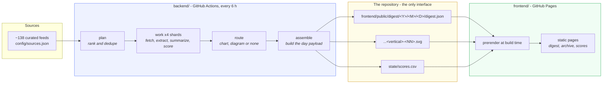
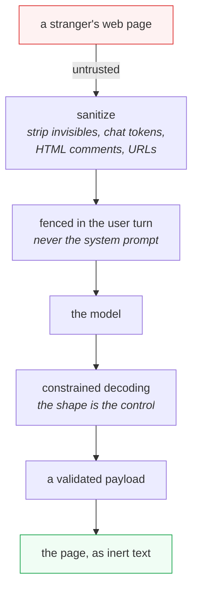
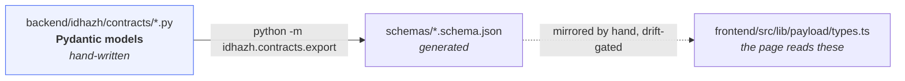

# Architecture overview

**Last Updated**: 2026-08-22

How the whole system fits together, in one page. Every box here has a deeper
document behind it; this page exists so you can find the right one.

## The shape

Two halves that never call each other. They meet only through committed files.

**`backend/` never runs at read time. `frontend/` never calls `backend/`.** The
repository is the interface. That is what makes the published site plain files
and the pipeline replayable.

## What each stage owns

| Stage | Input | Output | Owns |
| --- | --- | --- | --- |
| `plan` | feed list | `run-plan.json` | Which URLs get worked today, and their order. Loads no model. |
| `work` | one shard of the plan | `*.article.json`, `*.summary.json`, `*.eval.json` | Fetching, sanitising, summarizing, scoring. |
| `route` | article + summary | `*.route.json` + an SVG | Whether an item gets a picture, and drawing it. |
| `assemble` | everything above | `digest.json`, `run.json`, ledger rows | The published day. |

Every stage is invocable on its own with a file in and a file out. A stage that
could only run inside the whole pipeline could not be tested.

## The trust boundary

Text fetched from the open web is **data, never instruction**. It crosses the
boundary once, at extraction, and is sanitised there. The controls are the
sanitizer, the fence and the pinned output shape - not a prompt asking a model to
behave. Eight injection canaries assert this on every build, five at the pipeline
and three on the published page.

See [`sources/trust-boundary.md`](sources/trust-boundary.md).

## Contracts before logic

Every persisted shape is a Pydantic model first. The JSON Schema is generated
from it and never hand-edited; a test regenerates and fails on any diff. Change
the model, run the export, commit both.

Each schema carries a date-stamped `version` and a `changelog` explaining every
change. A payload written by yesterday's run that today's build cannot read is a
release blocker.

See [`contracts/schemas.md`](contracts/schemas.md).

## Where a number comes from

Nothing in this project may cite a throughput, cost or quality figure without
saying what measured it and when. The numbers that currently shape the design:

| Measured | Value | Where |
| --- | --- | --- |
| Qwen3-8B decode, 4 threads | 7.28 tok/s | `ubuntu-latest`, 2026-08-22 |
| Qwen3-4B decode, 4 threads | 13.00 tok/s | same |
| Blended seconds per article, 8B | 196 s | derived from the above |
| Article length, p50 / p90 | 978 / 2769 words | 20 live articles, 2026-08-22 |
| On-device search download | 43 MB | encoder + tokenizer + WASM |

The full ledger, including what is still unmeasured, is
[`../reference/measurements.md`](../reference/measurements.md).

## Degrade, do not fail

A missing visual, a failed extraction, an unreachable source or a scorer that
will not load degrades **that item** and records why. None of them takes down the
run. A day with failures still publishes, and says it was partial.

The one thing that is not allowed to fail quietly: an empty day. A model server
that never started used to publish zero items, which reads exactly like a quiet
news day. That now fails the build loudly.

## See also

- [`../concepts/vision.md`](../concepts/vision.md) - what this is and is not.
- [`../concepts/pipeline-loop.md`](../concepts/pipeline-loop.md) - the stages in detail.
- [`../concepts/evaluation.md`](../concepts/evaluation.md) - how a summary is scored.
- [`sources/discovery.md`](sources/discovery.md) - where stories come from.
- [`summarize/prompt.md`](summarize/prompt.md) - what the summarizer asks a model for, and where every number in that ask comes from.
- [`publishing/visuals.md`](publishing/visuals.md) - why a story gets a chart or nothing.
- [`../../CLAUDE.md`](../../CLAUDE.md) - the engineering contract.
