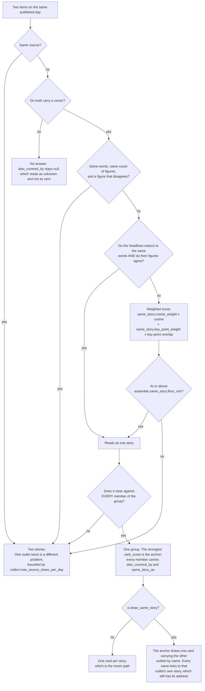
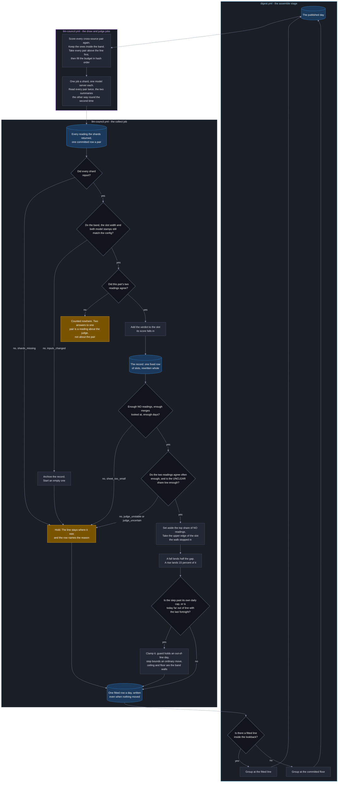
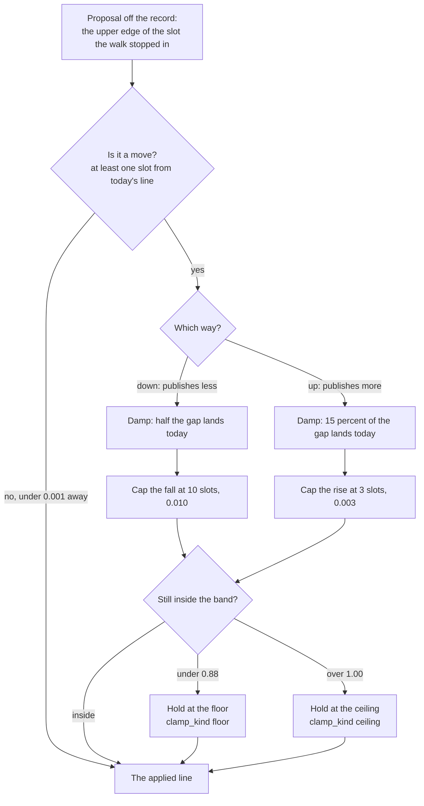

# Autotuning the similarity line that groups one story

**Last Updated**: 2026-09-21

A day runs the same story from more than one of our feeds. This page owns the
line that decides when two items are one story, how that line fits itself once a
night instead of being set by hand, and what every knob in it costs.

The shape the decision is written into, and the addresses a reader gets, are in
[layout.md](layout.md).

A day runs the same story from more than one of our feeds, and until 2026-09-01 nothing on the page said so. The published item now carries two more fields, and both are computed at build time from what the payload already holds - the day's vector block and the day's own titles. The browser never computes this and no encoder is loaded to do it.

| Field | What it says | What it is not |
| --- | --- | --- |
| `also_covered_by` | How many **other outlets** carried the same story today. | Not `carried_by`, which counts syndication of one address and reads 1 when two outlets write their own piece. Not a count across days - an earlier telling is a name, never a number here. |
| `same_story_as` | The item the page draws for this story. | Not a deletion. The story keeps its address, its archive entry and its month search entry. **Not a link to another day**: a fold onto a card this page does not hold is a fold onto nothing. |
| `covered_by` | Which other outlets ran it, **by name**, strongest first, capped at three. | Not on the committed day. The projector derives it, so a day published before the names existed still serves them. |
| `also_ran_earlier` | Which outlets ran the same story on an **earlier published day**, with the day and the address. | Not derived and not a fold. It is on the committed item, because a projector sees one day and could not look the name up. |

**Two items become one story down this path, and nowhere else.** `collapse_same_story` in [../../../backend/idhazh/assemble.py](../../../backend/idhazh/assemble.py) is the only thing that writes either field. Every rule below the diagram is one of its boxes.

Three things the diagram is deliberate about. **The veto is first and nothing below it can overturn it** - a pair of headlines one digit apart is where the score is highest, so a rule that had to outvote the score would lose the case it exists for. **The headline branch sits above the score rather than beside it**: it joins outright, and every other pair is scored. And **every term in the score runs 0 to 1 and the weights sum to 1.0**, so the floor is a number on the terms' own scale and a reader of `config/idhazh.json` can compare the two without arithmetic. Nothing on the diagram deletes: every item keeps its place, its address and its search entry whichever way it exits.

**`also_covered_by` is what a reader sees where no name can be linked.** The item's footer, under the summary, reads `Also covered by N other sources today.` It is a fact about our feed set and never a claim about the world - we know who we read, not who else covered a story. Null prints nothing at all, which is what every day published before 2026-09-01 does. Where the page has names - a folding card on a reading route - the stack prints instead and this sentence does not, because the names are the more useful answer and printing both would say one thing twice.

**Zero prints nothing either, since 2026-09-14, and that is a ruling rather than an oversight.** It used to read `Only one of our sources carried this.` Over the committed days that sentence printed **5,299 times** against 93 for the positive form. The Editor read 2026-09-12 by hand and counted about **95 of 356 items - 27 percent - in a cross-source cluster**, where the pass had found 8; so roughly a quarter of the items carrying the sentence were on the page more than once and the sentence was false. On 2026-09-03 five cards printed it about an acquisition that ran thirteen times on the same page, while three other cards on that page said the story was covered twice. **What the reader loses is the genuine signal that a story is an exclusive.** That is a real loss and it is accepted: a signal wrong a quarter of the time is not a signal, and silence is always available. It returns when recall is measured ([../../../TODO/20260914-29-found-once-plan.md](../../../TODO/20260914-29-found-once-plan.md)).

**`same_story_as` has been drawn since 2026-09-16, and this is the reachability answer that pulled it the first time.** Collapsing a group in `DigestList` was built and then taken out again on the evidence of its own smoke: the reading routes reach a story by paging, so a story filtered out of the list is not merely undrawn on the first screen - it becomes unreachable through every reading route while its address still exists. Three things close that, and the fold does not ship without all three.

- **The anchor's card names the other newsrooms, and every name is a link.** `covered_by` carries the outlet and that outlet's own item id, so a reader who has no link still has a way in. It links to OUR page for that piece - our summary of it, with its own `Read the original` under it - rather than straight out to the publisher: a reader who wanted the publisher's version is one more click away, and a reader who wanted ours has not lost it.
- **A story the reader's own address names is never folded.** `foldedMembers` takes the fragment as an argument and excludes it, so `/<date>/#<item id>` draws that story, pages the stream down to it and focuses it. A publisher name is one of those addresses, which is why pressing one works at all.
- **A story whose anchor is not on this page is never folded either.** A group can straddle two desks, so on a topic route one half of it can be on another page; folding behind a card this page does not draw would take the story off the page with nothing to find it by.

**What the reader loses, stated.** On a false merge a story is one click away instead of on the page. That is a real loss and it is the trade the owner took on 2026-09-14, on the reasoning under `Editor's asymmetry` below. `ui.draw_same_story` is the revert: default true, and false restores one card per story with no other change. It is removed when the grouping's false-merge rate has been measured on a published day and the Editor has accepted it.

**The card prints names where it has them and a count where it does not**, because the two answer different questions. `covered_by` is capped at three and drops a name this page cannot reach, so it is never the whole of the count; `also_covered_by` is whole, and the card prints the difference as `and N more`. A card that named two newsrooms on a story five outlets ran would be a wrong number, which is the one thing this block exists to avoid.

**The names are derived at read time rather than written onto the committed day**, and that is the reason they work at all. Every committed day already carries `same_story_as` and none of them carries a name list; a new field on `DigestDay` would be empty on every one of them until the day was rebuilt, which never happens. Two readers derive them and both run on every build, so the names are recomputed for every day the site serves: the projector that writes the served copy a browser fetches, and `loadDay`, which reads the committed tree for the stories a prerendered document carries. **Both, or neither** - a document seeded without them would fold a group behind a card with no way out of it until the fetch landed, and `frontend/tests/day-seam.spec.ts` is what holds the two halves to one shape. `coverage_names` in [../../../backend/idhazh/contracts/digest_view.py](../../../backend/idhazh/contracts/digest_view.py) and `coverageOf` in [../../../frontend/src/lib/payload/project.ts](../../../frontend/src/lib/payload/project.ts) are the two implementations, and the same cases are asserted against both so one cannot move without the other going red.

**One entry per outlet, never one per piece.** A group can hold two pieces from one masthead, and `also_covered_by` counts mastheads - so a list counting pieces would print a longer stack than the sentence beside it admits to. The outlet's strongest piece is the one linked. The order is `rank_score`, strongest first, with an unscored piece last and the item id breaking every tie: a total order, so two builds of one day agree and so do two languages.

**The two names cost 1.92 gzipped bytes a story, which is 0.4 percent of what a served story already weighs.** Measured 2026-09-16 on a developer machine / Python 3.14.2 over the 26 committed days and 9,554 stories: `gzip -9` over the staged projection reads 458.56 bytes a story with the two keys and 456.64 without them. Arithmetic over committed payloads, so the spread is zero by construction. It is the same order as `desk` at +1.16, and it is cheap for the reason the fold is worth having: almost every story carries a null and an empty list, because almost no story is in a group.

**The pager's floor comes off when anything is folded.** `Show N more` counts against the day's own published total rather than the list in hand, because on a reading route the list in hand can be a seed. A fold takes cards off the page that the day's total still counts, so leaving the floor alone would offer a reader stories the pager can never draw. A filter and a hide already had the same rule: a list narrowed on purpose IS the promise.

**Nothing is unpublished.** A grouped item keeps its place in the published order, its address, and its entry in the month search index. Measured on the committed 2026-08-30 day, 2026-09-01: **431 items in, 431 items out**, 5 of them marked as the same story as another.

**A group is always across outlets**, and that is a rule rather than an observation. The sentence a reader gets is about sources, so a group of one source has nothing to say - the survivor's line is the one it already had, and forming it would still cost a story. It is also where the encoder is least trustworthy: two press releases off one desk share their boilerplate and differ only in a date, so the Federal Reserve's June minutes and its July minutes score **0.9867** against each other on the committed 2026-08-25 day and are two different documents. One outlet publishing twice is bounded by `collect.max_source_share_per_day` instead.

**The unit is the masthead, not the feed, and that is a defect repair.** The rule compared `source_id` until 2026-09-14, and `source_id` is a feed: four of our feeds are CGTN and two are The Straits Times. Measured 2026-09-15 over the twenty-six committed days, **3 of the 43 groups ever formed were one outlet grouped with itself**, each printing a corroboration the reader did not have. `outlet_of` returns `source_name`, which is the masthead and separates 143 of our 160 feeds. It deliberately stops there: The Hindu and The Hindu BusinessLine are different papers with different desks, so a reader who sees both has two newsrooms rather than one, and folding them would cost a group that is genuinely corroborated.

**Every pair inside a group clears the bar**, not only each item against the one it joined. Single-link grouping chains: A is the same story as B and B as C while A and C are two different stories, and the chain quietly loses one of them. Since 2026-09-14 there are two ways to clear the bar rather than one, which makes this rule matter more rather than less (below).

**The keeper is the strongest by `rank_score`**, and where two items tie the earlier run wins - a returning reader keeps the item they already saw rather than watching the day swap it for a copy. An item published before `rank_score` existed has none, so it ranks below any scored item.

## One score, not one number

**The bar is a weighted sum of terms rather than a single cosine**, and it lives in `assemble.same_story`. Every term runs 0 to 1, the weights sum to 1.0 - refused by a validator if they do not - and `floor_min` is on that same scale. The sum-to-one rule is what keeps the floor meaning something: let the weights add up to 1.3 and the floor gets easier to clear every time a weight moves, silently, and the day publishes a merge nobody chose.

| Knob | Ships at | What it scores |
| --- | ---: | --- |
| `same_story.cosine_weight` | 1.0 | Cosine between the two stored int8 vectors. |
| `same_story.key_point_weight` | 0.0 | Shared words over the words the two items' key points have between them, reduced exactly the way a headline is. |
| `same_story.floor_min` | 0.94 | What the weighted score has to reach, for **every** pair inside a group. |

**It shipped changing nothing, and that is measured rather than asserted.** All the weight is on the cosine, so the score is arithmetically what the single floor was. Replayed through `collapse_same_story` over every committed day, before and after, on one box: **26 days, 9,552 items carrying a vector, 99 of them in a group - and not one item's `also_covered_by` or `same_story_as` differs.** Measured 2026-09-16 on a developer machine / Python 3.14.2; the pass is deterministic and the counts have no spread. The weights move against hand labels in a later change, so a retune can be read on its own and not as part of a rewrite.

**The second term is the only other one measured that separates the two populations.** Key-point overlap has a different-story 99th percentile of 0.0962 against a same-story median of 0.2419, so the two barely touch. It ships computed, logged and weighted zero: the row that fits the weights is what turns it on.

**A clash of figures is a veto rather than a negative weight.** Two headlines that reduce to the same words, carry the same count of figures, and disagree about one of them are two stories - `Budget 2025` against `Budget 2026`, `25 percent` against `50 percent` - and no similarity anywhere else makes them one. Written as a weight it would sit in a sum, where a high enough score outvotes it, and a pair of headlines differing in one digit is exactly where the score is highest. Over the twenty-six committed days it fires on **1** of 2,317,545 cross-outlet pairs, and that pair scored below the floor anyway, which is why the replay above is identical.

**One headline carrying a figure the other leaves out is not a clash.** That is two desks choosing differently about a headline, not two desks reporting different facts. On 2026-09-06 the BBC ran `Anak Krakatau eruption suspends flights at Jakarta airport` and Mint ran the same words with `300 flights` in them; a veto on any unmatched figure refuses that pair, and it is one story. It is the only group over the committed days that the broader rule breaks - 3 such pairs exist and 1 of them clears the floor - so the veto asks for a matching count of figures first. The pair still cannot join at 1.0, because `story_key` refuses an unmatched figure before any value is compared; it is scored like any other pair, which is what it was before the veto existed.

**The veto is read off the same reduced headline the joiner is**, so turning `assemble.group_identical_titles` off takes the veto with it and restores the score-only rule exactly. A revert path that quietly keeps half of what it reverts would be worse than none, so a test asserts both halves.

## What chose 0.94, measured on the cosine alone

`assemble.same_story.floor_min` is set by hand labels, not by taste. Every group the pass forms over the eleven committed days was read from the published titles and summaries and marked same-story or not. The shipped weights put the whole score on the cosine, so this is a measurement of the floor as it is applied today. Measured 2026-09-01 on a developer machine / / Python 3.14.2, 3,978 items:

| Threshold | Groups | Items grouped | Largest group | False merges |
| ---: | ---: | ---: | ---: | ---: |
| 0.93 | 30 | 37, 0.93 percent | 4 | **1** |
| 0.94 | 22 | 24, 0.60 percent | 3 | **0** |
| 0.95 | 14 | 14, 0.35 percent | 2 | 0 |
| 0.96 | 11 | 11, 0.28 percent | 2 | 0 |

The one false merge at 0.93 is on 2026-08-30: Ontario's pushback against the lake renaming, folded into Google carrying the renaming out, at a cosine of **0.9317**. Those are two stories, and merging them means the pushback never ran.

**The rule is the first round hundredth above the highest-scoring pair a person marked as two stories.** That is how 0.94 was chosen, over the 11 committed days this table covers and the one marked-apart pair they held.

**The margin is negative as of 2026-09-19, and the console now draws it.** `state/content-similarity-judge/holdout-pairs.csv` holds 200 marked pairs, 4 of them marked as two different stories. Recomputed from the committed day payloads at the shipped weights - the whole score on the cosine - those four score **0.9407, 0.9374, 0.9352 and 0.9343**. The highest sits **0.0007 above** the 0.94 floor, so the line as committed would merge two stories somebody read as two. One pair of the four is on the wrong side; the other three clear it. The 0.0083 that was measured on 2026-09-01 was the margin over the evidence that existed then, and this replaces it.

**The way to widen it is more labels, not a higher number**, and that has not changed: 0.95 would clear all four marks and lose ten groups a person read as one story each.

**The line already costs the reader on the other side, and the console draws that too.** The same file holds 196 pairs marked as ONE story. Recomputed the same way, **117 of them score below 0.94**, so the vector rule alone leaves those stories on the page twice; the identical-headline joiner catches whichever of them share a headline, and nothing catches the rest. That is not an argument for a lower line - it is the second cost of any line, and a panel reporting only the false merges reports half of what the number does. Measured 2026-09-19 on a developer machine / Node 24.12.0, over the committed day payloads at the shipped weights; deterministic, so no spread.

**The two errors are not equal, which is why the number leans high.** A missed group costs a reader the same story twice, on a page they can see. A false merge costs them a story that never ran, and they cannot see what is not there ([../../../.github/agents/editor.agent.md](../../../.github/agents/editor.agent.md)).

**`assemble.same_story.floor_min` is not comparable to `assist.similarity_floor`.** That one scores a reader's query against an item and this one scores two items against each other; the two distributions are different shapes, and reading one number against the other is how a threshold gets set from the wrong evidence.

**The missing margin is why `assemble.same_story.adaptive_dedup_threshold` exists, and the block ships off.** The floor above was read once, over eleven days, and nothing re-reads it as the corpus changes - which is exactly how it went stale. That block holds the knobs for a line that fits itself: the band worth judging, how the record slices it, the steps that move the line and the three gates it has to clear first. `enabled` is false, so the pass still compares against `floor_min` and publishes exactly the groups it published before the block existed. How the line moves once the flag is on is below. The shapes the fit reads and writes - the scored pair, the score record, the fitted row and the hand-marked holdout - are in [../contracts/schemas.md](../contracts/schemas.md).

**The floor on the diagram is a number the run chooses, since 2026-09-18.** With the flag off - which is how it ships - it is `assemble.same_story.floor_min` and the diagram reads exactly as it always has. With it on, `similarity.applied.effective_same_story` replaces that one field with the newest line a fit applied inside `applied_lookback_days`, and the rest of the block is untouched: same weights, same figure veto, same all-pairs rule. Four things each mean the committed floor rather than a fitted one, and each is an ordinary day: the flag is off, the tree is absent, every row inside the lookback was held, or the newest row carries no line.

**The run writes down which number grouped it.** `same_story_floor_applied` on the run record, because without it a reader of a committed `run.json` cannot tell a day grouped at 0.94 from a day grouped at 0.937 - and the grouping is the thing this whole block moves. A run that published before the column existed carries no value, which is every run before that date.

## The line fits itself, once a night

**A second workflow reads yesterday's published day and asks a model where the
line should have been.** `LLM-COUNCIL`, in
[../../../.github/workflows/llm-council.yml](../../../.github/workflows/llm-council.yml),
runs on its own clock hours after the last digest slot. It is deliberately not
part of `digest.yml`: at the cap the block permits, the model time alone would
push the job past the 6 h ceiling GitHub kills a job at, and a shape that only
fits on a median day is a shape that finds out on a busy one.

**The name is about where this goes rather than where it is** - owner ruling,
2026-09-18. The shards split a list today and never confer, so `judges` would be
the more literal word for what is on disk. What is coming is not one question:
this loop argues a case, and a case needs something to adjudicate it - a judge,
a jury or a plain heuristic - and some of those paths put a person in the loop.
One roof for all of them, named for the room rather than for the one job being
done in it this month.

**No green and no red anywhere on it, and that is a choice.** Those two colours
mean an outcome passed or failed, and no arm of this loop does either - a held
day is an ordinary day, a dropped pair costs nothing, and every other box does
work. Spending the two colours decoratively here would spend them for the pair
diagram above, which needs them.

**The judge is handed the two summaries and nothing else.** Not the similarity
score, which would hand it the number this whole loop exists to set. Not the
source names, which invite a verdict about publishers rather than about events.
Not the publication times, which answer the question by proxy. `user_turn` in
[../../../backend/idhazh/similarity/prompt.py](../../../backend/idhazh/similarity/prompt.py)
is the only thing that builds the ask, and the two summaries go in fenced as
untrusted data like every other piece of text that came off the open web
([../sources/trust-boundary.md](../sources/trust-boundary.md)).

**Every pair is read twice and a pair the two readings disagree about is counted
nowhere.** The second read puts the summaries the other way round. A model that
answers one way on the pair and the other way on the same pair reversed has told
us about itself rather than about the pair. The row is still committed, so the
disagreement is a fact somebody can count rather than a row that vanished, and
the day's disagreement rate is what `disagreement_max` gates on.

**The record is a fixed row of slots, rewritten whole and never appended to.**
It covers `band_low` up to `band_high` in slices `bin_width` wide, which on the
committed block is 120 slots. That record is the whole input to the fit, so the
fit costs the same on the thousandth day as on the tenth, and a reader who takes
the walk to mean "sort every pair ever judged" has put back the growing read this
shape exists to avoid ([../../concepts/growing-reads.md](../../concepts/growing-reads.md)).
A date goes in once: a date already on the record is refused a second time, which
is what makes re-running a day free rather than damaging.

**Five reasons hold the line, and a held day is an ordinary day.** The row is
still written, it carries yesterday's line, and it names what stopped the fit.
Three of them are the gates the fit asks of the record and of the judge; the
other two are the collecting job's own refusal, handed up.
`gates` in [../../../backend/idhazh/similarity/fit.py](../../../backend/idhazh/similarity/fit.py)
asks all five in one fixed order, so two runs over one held day name the same
reason and an operator comparing two rows is comparing one answer. `none` is the
sixth value the column can carry and it is not a hold: it says a fit ran.

| Reason | What it says |
| --- | --- |
| `inputs_changed` | The encoder, a scoring weight, a band edge or the slot width no longer matches what the counts were filed under. The old record is archived, an empty one starts, and the line freezes until that one fills. A config edit is a person acting on purpose, so the run records it rather than vetoing it. |
| `shards_missing` | A judging shard returned nothing. Its siblings' rows are still committed, but the day is not counted into the record at all, because the record counts a date once and a partial day would put the missing shard's verdicts out of reach for ever. A re-dispatch of that date counts it cleanly. |
| `sheet_too_small` | Too few NO readings, too few merges looked at, or too few days. `minimum_negatives`, `minimum_above_line` and `minimum_days` are the three, and this reason comes before the judge's own health because on a young record every later gate is being asked of a sample too small to answer it. |
| `judge_unstable` | Too many pairs came back with two different answers in the two orders. `disagreement_max` is the bar. |
| `judge_uncertain` | Too large a share of the usable verdicts read UNCLEAR. `unclear_max` is the bar. |
| `none` | A fit ran. |

**A clamp is not a gate.** A gate refuses the move and writes a reason; a clamp
lets the move through and shapes it, so the row carries `held_reason = none` and
says which clamp bit. `step` is the daily cap and each direction has its own; how
far the line may move, and why down is the fast way, is the next section.
`ceiling` and `floor` are the two band walls. `guard` is the step-change hold: a
day whose own evidence moved the answer far further than the last fortnight of
days did keeps the line exactly where it was, because a day that looks nothing
like the fortnight before it is a signal that something upstream changed rather
than evidence about the line. The guard is asked first and it ships recorded
rather than enforced - `step_change_guard_enforced` is off, so the row carries
`daily_shift` and `typical_shift` for a person to read while nobody has yet
measured what a normal day looks like.

**Nothing has been judged yet.** The committed record carries no counted dates and
`enabled` is false, so every published day is still grouped at `floor_min` and
every number above describes a mechanism rather than a history. The operator
console is where the loop is watched once it starts
([console.md](console.md)).

**What each committed store answers.**

| Store | The one question it answers |
| --- | --- |
| `state/content-similarity-judge/scored-pairs/` | What did the judge say about this pair, in both orders, and under which models? |
| `state/content-similarity-judge/score-distribution.json` | Across everything judged so far, how many YES, NO and UNCLEAR readings sit in each slice of the band? |
| `state/content-similarity-judge/fitted-thresholds/` | On this day, what did the record propose, what shaped it, and what did the run apply? |
| `state/content-similarity-judge/holdout-pairs.csv` | Which pairs did a person mark, and which way? |
| `state/content-similarity-judge/metrics/` | Over one unit of one night, how did this judge's own instrument behave - what was it dealt, what did it read, and what did that cost? |

The fields, the types and the bounds are in
[../contracts/schemas.md](../contracts/schemas.md). How each store is partitioned,
and why, is in [../../concepts/partitions.md](../../concepts/partitions.md).

### This judge is a tenant, and the venue knows nothing about it

The council hosts judges and depends on none of them
([llm-council.md](llm-council.md#the-venue-and-its-tenants-are-separate-things)).
This judge registers by putting its slug in `council.tenants` and declaring
itself in
[../../../backend/idhazh/similarity/tenant.py](../../../backend/idhazh/similarity/tenant.py),
which binds the venue's three units of work to the four stages above: pick the
work, judge one unit of it, then count and fit. That module imports the venue;
nothing in the venue imports it.

**The funnel closes, and the contract is what holds it closed.** Every pair a
unit was dealt ends exactly one of four ways - read, refused by the grammar,
unreachable because the day either item ran on has aged out, or never reached
because the unit stopped on its own clock. The four added together are what the
unit was dealt, and a row where they do not is refused before it is written. The
abandoned term is why: without it the identity would go red on exactly the unit
the deadline exists to let report at all.

**A rate over no rows is empty rather than zero.** A unit that read nothing
measured nothing; a zero would say it measured everything and found nothing
wrong.

**A unit ships its row as it finishes and commits nothing.** The row goes out as
an artifact, the collecting job appends it to the store above, and the trip
belongs to the venue - so a unit the platform killed has still handed over every
reading it took.

## How the line moves: down fast, up slow

The line is allowed to move a little each day, and it is allowed to move further down than up. **Lowering the line publishes less.** Two feeds giving near-identical coverage is the feed's fault, and folding them is the answer, so the move that folds more arrives quickly and the move that folds fewer arrives over a month.

Every number below is a knob in `config/idhazh.json` under `assemble.same_story.adaptive_dedup_threshold`. **The two daily caps and the dead zone are counted in slots of `bin_width`, not written as decimals**, because `10 slots down` is a count somebody can check against the record the line was fitted from and `one percent of the scale` is not.

| What it is | Knob | Ships at | What that means |
| --- | --- | ---: | --- |
| Hard floor | `band_low` | 0.88 | The line can never go below this. The record holds no slot under it, so a line there is one no later fit could read back. |
| Hard ceiling | `band_high` | 1.00 | The line can never go above this. A cosine goes no higher. |
| Start | `same_story.floor_min` | 0.94 | Where the line sits before any fit has moved it, and where it returns to if the fit is switched off. |
| Slot width | `bin_width` | 0.001 | How finely the record slices the band, and so the finest move the line can make. |
| Fall cap | `max_down_bins` | 10 slots | 0.010 a day. From 0.94 that is six days of falling to reach the floor, if the record kept asking for it. |
| Rise cap | `max_up_bins` | 3 slots | 0.003 a day, under a third of the fall cap. That one ratio is the whole asymmetry. |
| Dead zone | `dead_zone_bins` | 1 slot | A proposal within 0.001 of today's line is not a move at all. |
| Fall damping | `fall_weight` | 0.50 | Half the remaining gap lands today, before the cap is applied. |
| Rise damping | `rise_weight` | 0.15 | Fifteen percent of the remaining gap lands today, before the cap. |

**End to end that is about ten days down and about thirty-three days up.** Driven from a record that keeps proposing the far end: 0.94 falls to within one slot of 0.88 on the tenth day, and 0.88 climbs back to within one slot of 0.94 on the thirty-third. Computed from the arithmetic below at the committed knobs, not measured on a run - no run has fitted a line yet, because the block ships off.

**Both directions are damped and both are capped.** The damping filters a one-day spike and the cap bounds a run of them, and they are not the same control: a cap alone lets a spike persist at cap speed for as many days as the spike lasts. `step_change_guard_enforced` ships false, so these two are the whole brake.

**The dead zone is a defect fix rather than a preference.** The line is a slot's upper edge, so a step of less than one slot lands on no edge a later walk can produce. Without the dead zone the damping leaves a geometric tail whose steps shrink below one slot for ever, and the applied line never formally arrives at its proposal. The zone deletes that tail and says so on the row: `after_damping` equals `previous` on a day the proposal was inside it.

**A line resting on a band wall is a reported state, not silence.** A line at `band_high` folds nothing at all, which from the outside looks like the feature is switched off rather than pinned; a line at `band_low` folds everything in the band. Both get their own `clamp_kind` - `ceiling` and `floor` - and they are reported whether or not the wall moved the line that day, because resting there is the state worth knowing. `none` means the damped proposal stood as it was.

**The draw is sampled against the config band and never against the applied line.** `similarity.draw.in_band` is handed `band_low` and `band_high` off the config file, and no fitted value reaches it. A band that opened at the applied line would narrow every time the line rose, and the next fit would then be reading a record it had shaped itself. A test holds that open.

## Design rationale: the console scores the hand marks, and what it leaves out

`/console/judgement/` draws the margin above, and to draw it the route's build-time `load` scores every hand-marked pair itself. Nothing else in the console scores anything, and the reason is narrow: **no run has ever scored these pairs**. They are a person's marks rather than judged pairs, and nothing writes a score for them anywhere, so this is the first derivation and not a second opinion about one. A judged pair is the opposite case - its score is already on its row, and recomputing that in a page would be two verdicts about one number.

**Two terms are reproduced and two overrides are not.** The panel computes `cosine_weight * cosine + key_point_weight * key_point_overlap`, which is exactly what the floor is applied to. It does not reproduce the two overrides in `_pair_terms`: a matching reduced headline joining at 1.0, and a clash of figures refusing outright. Neither is a function of the line - they fire or they do not whatever the floor is set to - so neither can move the margin the panel measures.

**What that costs the reader, stated.** A pair somebody marked apart whose headlines reduce identically would be merged at 1.0 whatever the line is, and the panel would show it sitting harmlessly below the rule. None of the four marked-apart pairs is such a pair today: all four score below 1.0 on their words, and none of them clashes on a figure either. That is a reading of today's file and not a property of the design, so it is the thing to re-check when a mark is added.

**The word reduction is a second spelling of one rule, and it was measured rather than asserted.** `key_point_overlap` needs the key points reduced to words, and `assemble._reduce` is a Python string function that no contract can be generated from - so `$lib/console/holdout.ts` carries a TypeScript copy. Measured 2026-09-19 on a developer machine / Node 24.12.0 / Python 3.14.2, over every key-point block in the 29 committed days: **10,328 of 10,328 reduce to the same word set**. The first attempt kept combining marks and disagreed on 3 of them, all Devanagari - Python's `\w` is alphanumeric plus the underscore and a matra is neither, so a matra is a separator there and now here too. The reading is cheap to retake and is the check to run when either side moves.

**The key-point term is weighted zero today, which bounds what the copy can cost.** A drift in the reduction changes a printed score by `key_point_weight` times the difference, and `key_point_weight` is 0.0 in `config/idhazh.json`. That is why a second spelling was acceptable at all; raise the weight and the measurement above becomes load-bearing rather than reassuring.

## One headline, two outlets, and why 0.94 was not what changed

The vector pass alone left the same story on the page several times. `dolly parton, country music icon, dies at 80` published five times on 2026-08-25 from five different feeds. On 2026-09-03 one acquisition ran five times under two spellings of its price.

**The cause is what the vector is built over, not the number it is compared against.** `embed.text_for` encodes `f"{title}. {summary}"`, and the summary is our own model's prose about one article. Measured 2026-09-14 with the committed tokenizer over 75 items of the 2026-09-13 day: the headline is a median **16 tokens** and the whole string a median **121**, so the summary is **87 percent of what the encoder reads** and the headline is about one part in eight. The encoder mean-pools over every token, so the event contributes roughly an eighth of the vector. Two outlets writing the same story produce two different articles, so our summariser produces two different summaries, so the comparison is dominated by the one part guaranteed to differ. Coverage is not the problem either: 9,351 of the 9,353 committed items carry a vector.

**No threshold fixes it, and that is measured rather than argued.** Over the 53 cross-source pairs on the committed days whose headlines match once case and spacing are set aside, the stored vectors score: min **0.7298**, median **0.9177**, max **1.0000**. The floor of 0.94 catches 19 of the 53. Dropping the floor to 0.88 would catch 39 of them and admit 730 other-story pairs, and the highest pair marked as two stories sits at **0.9407** - above both that median and the floor itself. The two populations overlap, so the number is not the lever. Measured 2026-09-14 on a developer machine / Python 3.14.2, 25 committed days, 9,353 items, 2,300,847 cross-source pairs scored; the counts are deterministic and have no spread.

**So a second joiner runs beside the vector one: two items are the same story when their reduced headlines are identical.** It has no threshold, because a string is equal or it is not. It sits under `assemble.group_identical_titles`, default on, and turning it off restores the vector-only rule exactly.

**The reduction is a source constant and deliberately not a config value.** It defines the key rather than tunes it, and a key rule a config can change would break `build_day`'s promise that rebuilding a day reaches the same groups. `story_key` applies NFKC, case-folds, turns every non-word character into a space and collapses runs of spaces. It does **not** strip accents and does not restrict itself to Latin letters: `[a-z0-9]+` over a lower-cased string - which is what `tag.normalise` does for its own, different job - reduces two unrelated Devanagari headlines to the same empty string and would join them, and an accent-blind reduction finds the same 57 cross-source pairs over the committed days and not one more, so the risk buys nothing. A headline that reduces to nothing, and the `Untitled item` fallback, both refuse to key at all.

**Numbers come out of the words and are compared separately**, because the two need different rules. The words have to match exactly. A number only has to agree to the coarser of the two precisions it was written with, and a scale word is read into the value rather than left among the words. A desk that writes `2 million` is not claiming to know the next six digits; a desk that writes `2,000,035` is. So `$12.9 billion`, `$12.93 billion` and `$13 billion` are one acquisition, and `$12.9bn` is the same headline as `$12.9 billion`. What it refuses is the pair written to the same precision and different inside it: `25 percent` against `50 percent`, `Budget 2025` against `Budget 2026`, `7 dead` against `70 dead`, and `100` against `104` - because a trailing zero is a written digit, so `100` claims three of them.

**That rule is bounded by the words around it, which is why it is safe.** A number is only ever compared against a headline that is otherwise identical word for word, so the question is never "are these two numbers close" - it is "did two desks write one sentence and round one figure differently". Measured 2026-09-14 over the twenty-five committed days, it admits **12 cross-source pairs** the exact-digit rule refused and **every one of them is the same Nvidia acquisition**. No false merge, and the 42 groups the exact rule already found are unchanged. Owner ruling, 2026-09-14, over Andre's narrower stop-at-punctuation: two decimal places are not a reason to print one story twice, and the corroboration claim survives because a genuine disagreement - a different figure at the same precision - still refuses.

**A matching headline does not lift the vector gate.** It decides that two items are the same story; it does not decide that an item with no vector may be grouped. That item stays out, as it always did.

**The headline rule and the score are combined all-pairs, and that is load-bearing.** Equality is transitive on its own and a score is not, so their union is not either. Scoring each candidate only against the item it joined would chain a group through whichever of the two happened to fire - A and B share a headline, B and C clear the floor, A and C share neither, and single-link would publish all three as one story. Every pair inside a group clears one of the two against every other pair, and one vetoed pair refuses the whole group for the same reason.

**Two classes of headline would break this, and neither fires on today's evidence.** The first is a headline that names no event - a round-up, a live blog, a branded column - where two outlets can share a title and carry different stories. All 42 cross-source same-headline groups on the committed days were read by hand and every one is a genuine same story; the shortest headline that groups is seven words. The second is a headline that repeats on a schedule. Of 9,333 distinct source-and-headline pairs, **12** repeat across days, and none of them is an editorial slot: they are extraction failures such as `article fails to load due to technical issues`, all within one source, which the across-sources rule already refuses, and empty titles, which the reduction already refuses. Both counts are of the archive as it stood on 2026-09-14 and are re-measurable rather than permanent.

**What is still unmeasured is recall.** Every number above starts from pairs found *by* matching headlines, so it says nothing about same-story pairs whose headlines differ. The measurement that would settle it is a blind hand-label of same-day cross-source pairs drawn without consulting titles; if a large share of true pairs turn out to have different headlines, a title-only encoder returns as a third rule.

**What it changed, replayed through the shipped pass over every committed day.** Both cases call `collapse_same_story`; the only difference between them is the flag, so this is a measurement of the code rather than of a description of it. The unit here is a group, not a pair - a group of five is ten pairs - so these counts are not the 53 above. Measured 2026-09-14 on a developer machine / Python 3.14.2, 25 days, 9,353 items, floor 0.94; the pass is deterministic and the counts have no spread.

| | One-headline cross-source groups | Of those, still apart | Groups formed | Items in a group | Largest group |
| --- | ---: | ---: | ---: | ---: | ---: |
| Vectors only | 42 | **27** | 65 | 138 | 4 |
| With the headline rule | 42 | **1** | 84 | 183 | 6 |

Nineteen more groups form and 45 more items sit in one. Dolly Parton's death, which ran five times on 2026-08-25 from five feeds, is now one group of five. The largest group the pass has ever formed is the Nvidia acquisition at six, and it only reaches six because the rounding rule folds three spellings of its price.

**The one that stays apart is the all-pairs rule refusing, not the headline rule failing**, and it was read. On 2026-08-31 two outlets share a headline about the lake renaming, but one of them had already joined a third item on its vector, and the newcomer does not clear the bar against that third item. The group that exists is correct and the item left out is a story the reader still gets; joining it would mean dropping complete-link, which is the trade `Every pair inside a group clears the bar` above already refused.

**Editor's asymmetry came due on 2026-09-16, and the trade is named rather than reversed.** The headline rule leans the *other* way from `What chose 0.94` - it adds groups rather than withholding them - and that was allowed while `same_story_as` was recorded and not drawn, because a false merge then printed one wrong count on a card that still ran. The collapse is drawn now, so a false merge costs a reader a story they cannot see is missing. Three things pay for it. The names are one: a folded story is behind a pill rather than behind nothing, so the cost is one click and not the story. `ui.draw_same_story` is the second: the revert is a config edit. The third is that the measurement is still owed - the recall of this pass on a published day - and until it is taken this paragraph is the standing statement of what is being risked rather than a claim that it is small.

## What it costs the runner

The pass is one pass over the day's vectors and it is quadratic in the day's item count. Measured 2026-09-01 on a developer machine / / Python 3.14.2, over each committed day at 0.94: **10.5 s on the largest day ever published** (2026-08-24, 731 items), 3.6 s on 2026-08-30 (431 items) and 0.5 s on 2026-08-23 (147). The assemble job's timeout is 20 minutes and the month index rebuild beside it takes 88 to 122 milliseconds, so this is now the stage's largest single cost and still under one percent of its budget.

It compares int8 vectors directly rather than decoding them. `embed.dequantise` divides by the quantisation scale and then normalises, so the scale cancels and the angle between two stored vectors is the angle between the unit vectors they decode to - a test asserts that rather than leaving it as a claim.

**The headline rule added 0.5 percent and the readings above stand.** It costs one reduction per item before the pass, which is linear, and inside the pass it is a dictionary lookup and a string comparison that runs *instead of* the cosine whenever it matches. Measured 2026-09-14 on a developer machine / Python 3.14.2 as seven alternating rounds inside one process on 2026-08-24, the largest day: **11.601 s with the vector rule alone, 11.664 s with both, a difference of 0.064 s**. Alternating the cases is what makes that number readable - this box's own run-to-run spread on the same day is 10.8 to 17.5 s, so a between-run comparison could not have seen a difference this size, and an A-against-B inside one process cancels the box instead.

**The composite added 1.7 s on the largest day, which is 18 percent, and it was accepted.** The second term is one set intersection per pair, over the few million pairs a 731-item day asks about; the union is counted as `left + right - shared` rather than built, which took the cost from 4.1 s to 1.7 s before it landed. Measured 2026-09-16 on a developer machine / Python 3.14.2, five rounds each on the 2026-08-24 day, median of five: **9.38 s before, 11.09 s after**. The assemble job's timeout is 20 minutes and the stage runs five times a day, so 1.7 s a run is under one percent of the budget it spends; the term it buys is what the weights are fitted on. The alternative - skipping the term whenever its weight is zero - was refused because it makes the log line stop reporting a term a person is about to weight.

**The 36-hour window added 8.1 s on the largest day, which is 55 percent, and the row's own arithmetic had said fourfold.** Measured 2026-09-16 on a developer machine / Python 3.14.2, five alternating rounds inside one process on 2026-08-24 - 731 items, plus the 147 of 2026-08-23: **median 14.8 s closed against 22.9 s open**, the closed case spanning 12.7 to 18.0 s and the open case 22.4 to 34.2 s. Alternating the two cases is what makes that readable: this box's own run-to-run spread on one day is wider than the difference, so a between-run comparison could not have seen it. The prediction of four times the pairs read the window as squaring the whole population; what it actually adds is today's items times the earlier day's, and the earlier day was a fifth the size. The assemble job's timeout is 20 minutes, so 23 s is **1.9 percent of the budget the stage spends**, and the number to watch is a pair of large days back to back rather than this one.

## The window past midnight

A story that breaks at 23:00 and is picked up at 07:00 is one story, and a day boundary is an accident of the calendar. `assemble.same_story_window_hours`, committed at 36, is how far apart two stories may have appeared and still be one.

| What the window does | What it does not do |
| --- | --- |
| Lets a story on this day pair with one on an earlier published day, on the hours between the two stories' own times. | Group two earlier days with each other. A published day is finished; the pass reads it and never re-decides it. |
| Bound the read. `stages.assemble._earlier_days` opens `ceil(hours / 24)` days by date arithmetic - one at 36 - so the cost is the same on the thousandth day as the third ([growing-reads.md](../../concepts/growing-reads.md)). | Bind a pair inside one published day. Those are scored exactly as they were, which is what makes `0` an exact revert rather than an approximate one. |
| Record the match on the NEWER story, as `also_ran_earlier`. | Fold anything. Today's story keeps its card, its place in the order and its anchor. |

**A cross-day match is a name in the stack and never a fold.** `same_story_as` still means this day's own anchor, because folding today's page onto a card it does not hold would leave the reader with nothing to open. What today's story gains is `also_ran_earlier` - up to `EARLIER_OUTLETS_MAX` mastheads, each with the day it ran and the address on that day - and the card prints them as more names in the same `Also covered by` stack, each saying which day and linking to that day's page.

**The masthead is carried on the item rather than looked up.** `covered_by` is derived at projection time because a day's own grouping is in its own payload; an earlier day's is not, and a projector that can see one day would silently drop a name it had to fetch from another. So the three fields a pill needs - the day, the address and the masthead - are on the committed item.

**`also_covered_by` still counts this day's outlets and nothing else.** It is what the card's `and N more` remainder is worked out from, so a count that grew across days would make the remainder lie. The earlier outlet is a name, not a number.

## The grouping runs before the lead block, and that order is fixed

Two passes read the finished day inside `assemble.build_day`, and both were written in the same week by different rows. The grouping runs first; the leading stories ([../sources/discovery.md](../sources/discovery.md#a-second-order-over-the-same-day-the-leading-stories)) are chosen over what it produced. The reason is that the grouping decides which item of a group a reading surface would draw, so the block is picked over the day as the reader will see it rather than over one that is annotated a line later.

**The order changes nothing today, and that is measured rather than assumed.** The two passes touch different fields: the grouping writes `also_covered_by` and `same_story_as` and nothing else, and lead selection reads neither. Rebuilding both passes in each order over the eleven committed days - 4,086 items, 2026-09-01, a developer machine / / Python 3.14.2 - gives the identical block on every day. Ten of the eleven produce no block at all, because a lead may only run on the feed's own clock and `time_source` landed on 2026-08-31; the one day that does produce a block holds five leads over eight groups, and **none of the five is a collapsed item and no group holds two of them**.

**What is still not a rule.** Nothing forbids a lead being a story the grouping folded, or two members of one group both leading - the source cap does not catch that, because a group is always across outlets. The first no longer leaves a dead link: the block is resolved against the list the page holds, which is the list after the fold, so a folded lead is not in the block at all. The block is one entry shorter and the story is still behind the anchor's pill, which is the trade the fold makes everywhere else. The second would print one story twice at the top of the page, which is what the block exists to avoid, and it has never fired on a committed day. Both are rules to write when the first day produces one.

## Design rationale

**The line falls fast and rises slow, and the next reader must not reverse it.**
The house rule is to err on the side of publishing less: if two feeds give
near-identical coverage that is the feed's fault, and one of them is dropped
without apology. Lowering the line folds more stories together and publishes
fewer of them separately, so lowering is the safe move and arrives in about ten
days; raising it publishes more and arrives in about thirty-three. Until
2026-09-19 the code encoded the opposite - a rise landed whole and immediately, a
fall was damped to 15 percent of the gap and capped at 0.005, so a fall of 0.06
took about a month and the rise back took one day. The shape reads backwards to
anyone who has not been told the rule, so `SimilarityThresholdConfig` refuses a
config where the rise weight or the rise cap reaches the fall's.

**Damping stays on the fast direction, and a straight inversion was refused.**
The failure mode is a correlated bad night. In the 200 labelled pairs of
2026-09-19 all four two-story marks came from ONE news cluster, which produced 29
of the 200 pairs: a judge that misreads a cluster produces a block of adjacent
wrong verdicts on one night, not independent ones. Undamped, the line takes that
whole block at once. Three things make the damping load-bearing rather than
decorative. `step_change_guard_enforced` ships false, so the damping and the caps
are the only brake. `typical_shift` takes a median over 14 rows and `settled`
compares a week apart, and both assume a smoothed series - on a series that jumps
they measure nothing. And a damped series filters a one-day spike where a bare
cap only slows it, letting the spike persist at cap speed until the evidence
turns. So both mechanisms stay and both are directional.

**The caps are slot counts because a decimal cannot be checked.** `10 slots down,
3 up` is a count against the same grid the record counts on, so a reader can
hold the cap and the line in the same unit. `0.010` reads as a precision the fit
does not have, and `four percent of the range` reads as an answer nobody can
verify.

**The walk sets a share aside rather than stopping at the single highest NO
reading.** Stopping at the maximum lets one wrong verdict on a genuine pair set
the line for good, because the line is the stopped slot's upper edge and the slot
is `bin_width` wide. `discard_share` is what makes a single bad verdict unable to
decide the number, and `minimum_negatives` is sized so the record holds enough
NO readings for that share to set even one aside.

**The set-aside is a share of agreed-NO verdicts, and 0.01 did not survive one
bad night.** `fit.fit_line` takes the share over `negatives_on(record)`, not over
judged pairs. At `minimum_negatives` of 200, 0.01 sets two verdicts aside and
0.03 sets six. The question the share answers is how many wrong NO verdicts one
news cluster can produce before it sets the line, and the benchmark cluster
produced four. Two does not survive that; six does. Moved to 0.03 on 2026-09-19.

**The margin the old cap guarded was withdrawn on 2026-09-19, and no line
replaces it.** `state/content-similarity-judge/holdout-pairs.csv` now holds 200 pairs
labelled by `claude-opus-4.6` reading each pair's title and summary: 196 one
story, 4 two stories. The four score 0.9407, 0.9374, 0.9352 and 0.9343,
recomputed from the committed day vectors as 0.940676, 0.937400, 0.935201 and
0.934337. The highest sits **above** the 0.94 line, so the gap the fall cap was
once sized against is -0.0007 rather than +0.0083. What bounds a step now is the
band it is fitted inside, and the cap is a damping knob rather than a safety one.

**Raising the line does not restore the margin, and that is measured.** On the
same 200 pairs the line would have to reach 0.941 to clear every two-story mark,
and that costs 9 more refused one-story pairs on this sample (96 refused at 0.94,
105 at 0.941). 0.95 refuses 146. The reason no line works is that the labels
interleave: a pair at 0.9406 is marked one story, the pair at 0.9407 is marked
two, and a pair at 0.9409 is marked one again. Three adjacent slots hold both
marks.

**Two cautions on the reading itself.** All four two-story marks come from one
news cluster - a lake being renamed, reported by two different companies - so the
floor rests on one story rather than on a spread of news. And the sheet is
band-stratified by construction (50 well-below, 49 just-below, 51 just-above, 50
well-above), so `1 of the 101 pairs at or above the line is two stories` is a rate
over the sample and not over a day's pairs.

**What still protects the reader today.** `adaptive_dedup_threshold.enabled` is
false, so nothing reads any of these knobs and the pass compares against
`floor_min` exactly as it always did. The 36-hour window is the other gate: three
of the four two-story pairs sit two published days apart and could not fold at
any line. The fourth, at 0.9343, is same-day and sits below the floor.

**What is not decided.** Whether the holdout file should become a live floor the
fit reads on every day - refusing to apply a line at or below the highest
two-story mark - rather than a number copied into source. That is the structural
fix for the class of defect this page just recorded, and it is an owner decision.

**The record is fixed-size and the fit never reads the judged pairs back.** The
alternative - sort every pair ever judged - answers the same question and costs
more every day the archive grows, which is the cost Guardrail #12 exists to
catch. The record is the whole input, so the fit's cost is set by the band and
the slot width and by nothing that accumulates.

**The shards are CI jobs, not processes on one runner.** The runner is 2 physical
cores behind 4 logical CPUs, and one `llama-server` on the configured weights
peaks near the runner's whole memory
([../../reference/models/qwen3.5-9b-q4km.md](../../reference/models/qwen3.5-9b-q4km.md)).
A second server on one runner does not fit at all, never mind four. The shards also
commit nothing: one job downloads every shard's verdicts and makes one push, so
there is no merge driver to trust, no union stacking to census afterwards, and no
shard that can die having pushed half its rows.

**The confidence column is a gap between verdicts, and it was a gap between
tokens until 2026-09-21.** The judge asks the decoder what else it could have
written at the position the verdict opens at, and the old rule subtracted the top
two entries of that list. A list holds tokens, and a token is the opening of a
legal reply rather than a legal reply - so `NO` and ` NO` are one verdict said
twice, and subtracting them reported a near-zero gap on a reply the model was
certain about. The rule now sums each returned token into the verdict its text
opens, drops a token that opens more than one as naming none of them, and divides
by the legal mass. The window widened with it, from the three verdict words to
the twenty-five non-empty prefixes the grammar admits, **because the two are one
change**: at three tokens the list is usually one verdict spelled twice and the
new rule has nothing to compare - measured, and the reading is in
[../../reference/benchmarks/what-the-margin-rule-changes.md](../../reference/benchmarks/what-the-margin-rule-changes.md).

**A reply the grammar could not have written is recorded on the row rather than
thrown - 2026-09-21.** It used to end the shard, and every pair behind it then
went missing. Absence on this store already means the draw never took the pair,
so the two states an operator most needs to tell apart - a decoder that came
loose, and a day nothing judged - wrote the same thing to disk. The pair is now
read in both orders, written with `grammar_applied` false and no verdict at all,
and the shard reads the next pair. Nothing counts it: both verdict cells are
empty, `usable` is false, and the night's count skips it exactly as it skips two
readings that disagreed. The reason - prose where a verdict was due, or a first
token that did not open the word that arrived - reaches the run's log, because
the row records that the decode came loose and not which check caught it.

**It is a change rather than a repair, and the record pays for it once.** The 82
rows written before 2026-09-21 carry the old quantity in the same column, and
the only thing that tells a reader which is which is the empty `decode_digest`
cell on the older rows. The record's own stamp widened at the same time - it now
carries the sampler temperature, the decode digest and whether a reasoning span
ran - so every count in it archives and starts again once, by construction rather
than because a judge changed. That is the price of the two populations the record
used to merge in silence: a run judging behind a reasoning span and a run judging
cold produce different numbers in one column, and before the widening nothing
could separate them afterwards.

**The judge may take a model entry of its own, and no committed file gives it
one.** The one thing this judge wants from a second entry is a reasoning span in
front of the verdict, and the committed entry that offers one also moves the
summariser's answer budget, its cache types and its batch size - which is an
uninstrumented change to the words a reader gets. So `models.judge` is optional,
it is null everywhere, and a second entry is refused unless it names the weights
`models.summarize` already holds: no server is started for it, so it decodes on
whatever the running one has open. What it may move is the decode. It is filled
the day a replay says a reasoned verdict is a better verdict, and that replay is
priced and unrun.

## Rejected alternatives

**A precision target of 98 percent or better.** About four pairs a day clear the
line, so the precision on one day can only be 0, 25, 50, 75 or 100 percent -
there is nothing between 75 and 100, and "at least 98" is the same instruction as
"exactly zero wrong merges" with a number painted on it. Over a filled record it
is worse than the rule that shipped: it licenses wrong merges where the walk
delivers none.

**A seven-day variance test to decide the line has settled.** A damped series
carries most of yesterday into today, so a week of it is worth about half of one
independent observation. The test fires on a quiet week that means nothing, and
it is circular: the damping exists to stop the line moving, and the test then
asks whether the line stopped moving. The shipped test compares what the record
proposed a week ago against what it proposes today - the evidence rather than the
output.

**One damping weight for both directions.** The two moves are not equally risky -
a fall folds more stories together and a rise publishes more of them separately -
so a single weight either delays the safe move or rushes the risky one. Both
directions are damped, at `fall_weight` and `rise_weight`, and a validator
refuses a config where the rise reaches the fall.

**A hard floor the line may never go below.** Most of the world's coverage is
regurgitated, so more merging is the goal rather than less, and a floor set by
hand is the same number read once by one person that this loop exists to replace.
Three things carry its job instead: the discarded share puts the line above
almost every judged NO pair by construction, the daily clamp stops any one day
making a large move down, and the hand-marked holdout is reported against every
day so a day that merged a marked pair is recorded loudly.

**Asking the model to grade a published summary.** The judge answers one closed
question about two summaries, in one of three words, under a grammar. It is never
asked whether a summary is good. A quality verdict has no slot to fall into - the
record files a verdict by the pair's similarity score, and a judgement about
prose is not on that scale - and mixing the two would put one model's opinion
about writing inside the number that decides what a reader can see. How a
published summary is judged is a different loop with a different ledger
([../../concepts/evaluation.md](../../concepts/evaluation.md)).

## See also

- [layout.md](layout.md) - the published shape this decision is written into, and the addresses a reader gets.
- [../../how-to/label-the-similarity-holdout.md](../../how-to/label-the-similarity-holdout.md) - how a holdout mark is drawn, read and harvested, and why it is read off the summaries rather than the headlines.
- [../../concepts/placement.md](../../concepts/placement.md) - the one order a day publishes, and the frame a person set over its head.
- [../../concepts/digest.md](../../concepts/digest.md) - what a reader is told about a folded story.
- [../sources/freshness.md](../sources/freshness.md) - where an item's id comes from, which is what lets a later run recognise what an earlier one published.
- [../contracts/schemas.md](../contracts/schemas.md) - the shapes the adaptive block reads and writes.
- [../../concepts/evaluation.md](../../concepts/evaluation.md) - how a published summary is judged, which is a different loop with a different ledger.
- [../../../.github/workflows/llm-council.yml](../../../.github/workflows/llm-council.yml) - the workflow that draws the pairs, judges them and fits the line.
- [../../../CLAUDE.md](../../../CLAUDE.md) - Guardrail #10, which is why every number here carries its conditions.
