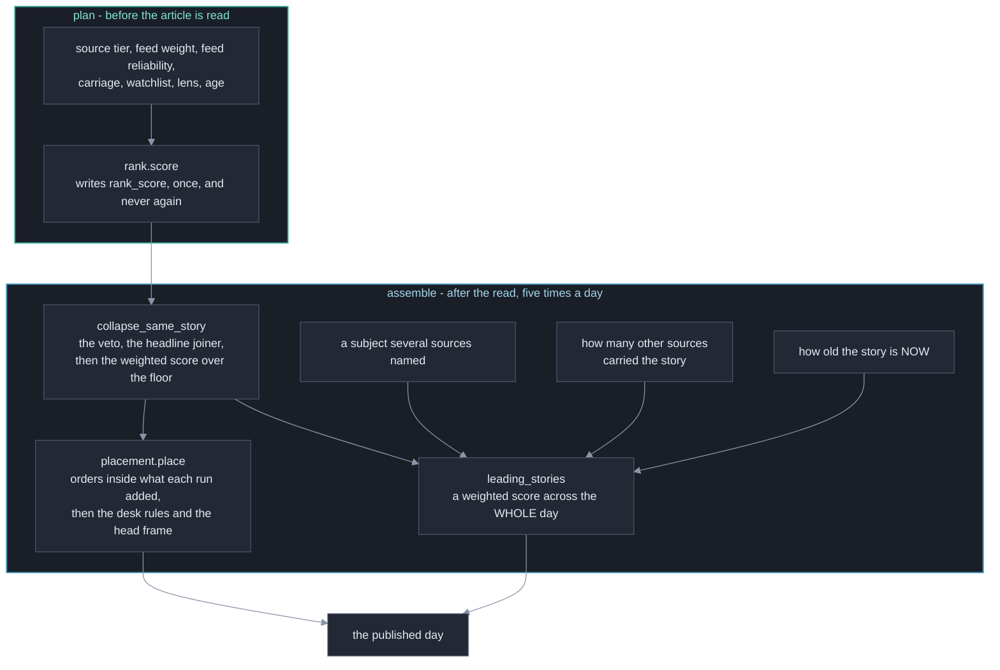

# How a day is ordered, and what each desk published

**Last Updated**: 2026-09-23

Two orders run over one day and they answer different questions: the stream is
every story in the order each run added it, and the leading block is the day's
best few chosen across the whole day. Neither removes anything. This page holds
both, the weighted score behind the block, and the three fields each desk
carries saying why it ran what it ran. What one story says about itself is
[what-a-published-item-says-about-itself.md](what-a-published-item-says-about-itself.md).

## Where the page order comes from

Two orders run over one day and they answer different questions. The stream is
every story the day carries, in the order each run added them. The leading block
is the day's best few, chosen across the whole day and drawn above the stream.
**Neither removes anything**: every story is in the stream whether or not it
leads and whether or not a group folded it.

**Three things the picture is deliberate about.** The fold runs before both
orders, because it decides which story of a group a reader meets at all. The
stream reads no clock - the same day placed again at a later hour would
re-order a block somebody has already read. And the block reads one, because it
is the only order taken across the whole day and so the only place a story found
at 02:20 is ever weighed against one found at 18:20.

### The weighted score that chooses the leading block

`assemble.LeadCandidate.score` is the whole of it: a weighted sum of what the
story is worth, multiplied by what its age has done to that.

| Term | Knob | Ships at | What it is |
| --- | --- | ---: | --- |
| Plan-time score | `ui.lead_rank_weight` | 1.0 | `rank_score`, the number every story in the day carries |
| A shared subject | `ui.lead_shared_subject_weight` | 0.2 | A flat step where `ui.lead_cluster_floor` sources named one entity in their published titles |
| Other sources carrying it | `ui.lead_also_covered_weight` | 0.0 | `also_covered_by`, per other source. Null scores 0 |
| Age, at the hour it was chosen | `placement.freshness_offset_hours`, `placement.freshness_scale_hours`, `placement.freshness_decay_at_scale` | 6.0, 24.0, 0.5 | A multiplier from 1.0 down. [placement.md](../../concepts/placement.md) owns the curve |

**The weights do not have to sum to anything, unlike `same_story`'s.** That
score is compared against a floor, so its scale has to be protected. This one is
only ever compared against another candidate's, so a sum rule would be
ceremony.

**Age multiplies and is never one more term in the sum.** Written as a weighted
term, a fresh but worthless story would outrank a strong one at some age, which
is the single failure this ordering exists to refuse. As a multiplier it keeps
the shape of how good a story is and moves only where that sits in time.

**`ui.lead_also_covered_weight` ships at zero, and that is the honest reading of
what the pass can support.** At today's recall the count is 0 on most genuinely
multi-source stories, so a weight on it would reward the pass for having found a
group rather than the story for having been carried. The term is computed and
logged from the day it lands; what turns it on is a measured recall for the
same-story pass that the owner accepts, and that measurement is the labelling
study. Until then there is no number here a person could defend.

**It landed changing no published block, and that is what the shipped weights
are for.** All the weight is on `rank_score` and the shared-subject step keeps
the value it already had, so the sum is arithmetically what the block scored
before it was a sum. A test sets the two new weights to zero and asserts the
order is the plan-time order.

## A topic says why it ran what it ran

Each entry of `verticals` on the committed day carries three more fields since
2026-09-02. The planning step already computed all three, wrote them into the
run plan and published none of them, so the reading page could not say why a
topic was thin.

| Field | What it says | What it is not |
| --- | --- | --- |
| `considered` | Distinct addresses our feeds offered that vertical, less what the day had already published or already failed on. | **Not an upper bound on `count`.** Each run counts its own pool and the day's stories accumulate across runs, so a five-run day can publish more than any one run considered. |
| `too_old` | How many of those were past `collect.max_age_hours`. | Not a failure. The age gate working is what this counts. |
| `below_feed_floor` | Some run today found fewer feeds it was allowed to ask than the vertical's floor, so that run planned nothing for it. | Not a reader-facing fact. It is published for the operator surfaces and no reading page draws a sentence from it. |

**The three arrive together or not at all**, and the contract refuses an entry
holding two of them. A day published before 2026-09-02 carries none, and absent
reads as unknown rather than zero - a `0` for `considered` would say the feeds
offered a topic nothing on a day that published 216 stories from it.

**Each field is the strongest any run of the day recorded, never the sum.**
`assemble.desk_ref` owns that rule. A later run drops what the day has already
published before it counts anything, so it sees a smaller pool of the same
back-catalogue stories - and adding the runs would print a number the feeds
never offered. A vertical this run did not plan keeps what an earlier run said
about it, which is how one retired from `config/taxonomy.json` mid-day keeps the
explanation under stories it already published.

**All three are vertical facts, and that is why they sit beside `count`.**
Collection is per feed and a feed declares a vertical, so the only number they
can honestly be weighed against is the vertical's own.

### Two words, and a count for each

Since 2026-09-12 the payload separates where a story came from and where it is
read. `DigestItem.vertical` is the word the carrying feed declares about itself
and is what `item_id` is addressed from; `DigestItem.desk` is where the day
published the story. Both take an id out of the same `verticals` list in
`config/taxonomy.json`, and `desk` is null until something reads the article - a
page falls back to the vertical, and a null is never read as a desk of its own.
Nothing fills it today.

| Number | Counts | Read it when |
| --- | --- | --- |
| `count` | Stories whose carrying feed declares this vertical. | Weighing against another vertical fact - `considered` or `too_old`. |
| `desk_count` | Stories the day publishes under this name. | Anything a reader sees: a pill, a heading, a total, whether the topic route is here at all. |

`frontend/src/lib/day-shape.ts` holds the one reader for each - `deskOf(item)`
and `deskCount(ref)` - so the filter, the heading and the pill cannot come to
disagree. Every day published before 2026-09-12 carries neither field, which is
exactly the fallback case: 22 days, 106 topic entries and 8,922 items, measured
2026-09-12.

**A day lists every name either word uses.** A relabelled story owes two
entries: the vertical needs one because `count` is a statement about its feeds,
and the desk needs one because the page draws a heading, a pill and a route from
it. The entry a reader draws nothing under carries `desk_count` of 0, and
`DigestList.svelte` does not draw a pill for it - a pill is a way in, and one
leading to an empty room is a dead end.

**Both counts include a story the duplicate pass grouped behind another** - that
pass unpublishes nothing, so neither number is what the default view happens to
draw.

**A story is never moved onto a topic that will not render.** A vertical below
its feed floor plans nothing, so `rank.desk_of` sends a story relabelled onto
that name back to the word its feed declared. Without it the page would draw a
heading the same day's payload flags as having planned nothing.

**The sentence lives under the topic panel and outside it.** `FilterBar.svelte`
draws it, for the active topic only, as a sibling of the panel rather than a
third child. At 1024px and up that panel is one nowrap band so it is cheap
enough to stick; a third child would be squeezed in beside the pills. It belongs
under the panel anyway - a fact about the topic rather than a control, read once
and then scrolled away. The rule that decides whether it draws at all is
`deskShortfall` in `frontend/src/lib/day-shape.ts`, which is pure and is tested
in Node, because the canary day has one busy topic and a rule about a healthy
one needs a second.

The copy, its three clauses and where the threshold lives are in
[../../concepts/digest.md](../../concepts/digest.md#a-thin-desk-says-what-did-not-run).

## Rejected alternatives

| Option | Why rejected |
| --- | --- |
| Re-ranking a day on a later run | Contradicts the memory of a reader who already read it. A day is published five times and run 4 can score higher than anything run 1 found, so one sort over the combined day moves a story a reader read at breakfast down the page at lunchtime. |
| Reading a clock in the stream's own order | The same day placed again at a later hour would re-order a block somebody has already read. Only the leading block reads one, because it is the only order taken across the whole day. |
| Age as one more weighted term in the leading score | A fresh but worthless story would outrank a strong one at some age, which is the single failure this ordering exists to refuse. As a multiplier it keeps the shape of how good a story is and moves only where that sits in time. |
| A sum rule over the leading block's weights | That score is only ever compared against another candidate's, never against a floor, so a sum rule would be ceremony. `same_story`'s weights need one because its score meets a floor. |
| Turning on `ui.lead_also_covered_weight` today | At today's recall the count is 0 on most genuinely multi-source stories, so a weight on it would reward the pass for having found a group rather than the story for having been carried. |
| Adding a day's runs together for `considered`, `too_old` or `below_feed_floor` | A later run drops what the day has already published before it counts anything, so it sees a smaller pool of the same stories - and adding the runs would print a number the feeds never offered. |
| A pill for a desk with a `desk_count` of 0 | A pill is a way in, and one leading to an empty room is a dead end. |

## See also

- [layout.md](layout.md) - where the payload sits, and what a reader's address looks like.
- [what-a-published-item-says-about-itself.md](what-a-published-item-says-about-itself.md) - `rank_score` and the four fields beside it.
- [autotune-content-similarity.md](autotune-content-similarity.md) - the fold that runs before both orders.
- [autotune-story-prominence.md](autotune-story-prominence.md) - **every weight in the leading block above is a number a person chose, and nothing re-reads it.** That page is where a fitted version would be argued; it is a stub today.
- [../../concepts/placement.md](../../concepts/placement.md) - the one order this payload carries, and the freshness curve the multiplier comes off.
- [../../concepts/digest.md](../../concepts/digest.md#a-thin-desk-says-what-did-not-run) - what the thin-desk sentence says.
- [../sources/discovery.md](../sources/discovery.md) - where `rank_score` is computed.
- [how-a-day-page-is-arranged.md](how-a-day-page-is-arranged.md) - where the block and the stream are drawn.
