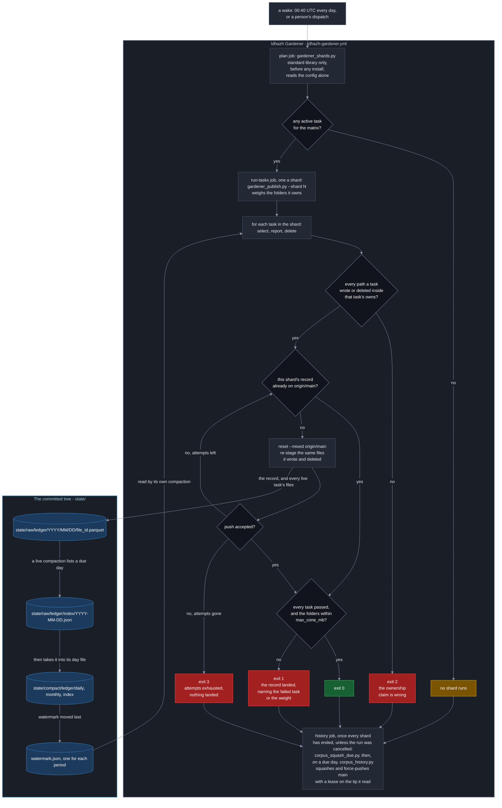
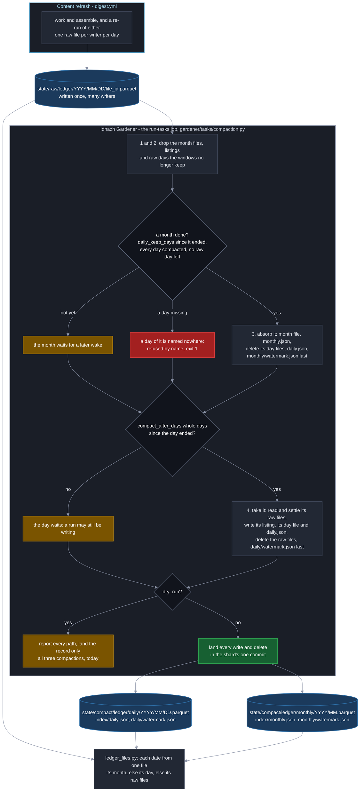

# The gardener

**Last Updated**: 2026-09-29

How the one program that deletes and rewrites what this repository keeps is put
together: where its tasks come from, how a wake is split into shards, what a
shard checks before and after its tasks run, how its one record lands on
`main` however many shards race it, how its compaction task moves a ledger's
rows from raw files into day and month files, and how a retention task folds
the closed days of a CSV day tree into one file each. What each knob means is
[../../concepts/config/idhazh-gardener.md](../../concepts/config/idhazh-gardener.md);
the workflow that wakes it is `.github/workflows/idhazh-gardener.yml`, once a
day at 00:40 UTC or when a person dispatches it.

## What runs

The gardener runs **tasks**. A task is two things that land together:

- **a declaration**, one file under `config/gardener/`, named for the task. It
  says what the task owns, how far back it keeps, whether it may delete at all
  (`dry_run`), and which kind it is;
- **a module** under `backend/idhazh/gardener/tasks/`, holding exactly two
  names: `KIND`, the kind it serves, and `run`, which takes a `TaskContext` and
  returns a `Pass`.

There is no list of tasks anywhere. `registry.discover()` imports every module
in `tasks/`, and `registry.bind()` finds the module that runs one declaration in
two lookups: the module named for the task (hyphens become underscores), else
the module named for its kind. A config value never names a module, so text in
a file cannot choose which code runs (Guardrail #11).

**The folder is the only count.** `config/gardener/` says how many tasks there
are, and nothing else does: a task joins when its declaration and its module
land together, and the pre-flight below refuses either one arriving alone.

## A wake, in order

| Step | Job | Who | What it does |
| --- | --- | --- | --- |
| 1 | `plan` | `backend/utilities/gardener_shards.py` | Splits the active tasks into shards and prints the plan. Standard library only, reads `config/` alone |
| 2 | `run-tasks`, one job a shard | `backend/utilities/gardener_publish.py --shard N` | Reads the commit the checkout is at, weighs the folders the shard owns at that commit, loads the declarations through the typed loader, finds the modules, and runs the pre-flight |
| 3 | `run-tasks` | the runner | Runs every task of the shard, one after another, timing each |
| 4 | `run-tasks` | the runner | Holds every path each task touched to what that task owns |
| 5 | `run-tasks` | the runner | Writes the shard's one record through `ledger.persist`, and hands back what to land |
| 6 | `run-tasks` | `gardener_publish.publish` | Stages exactly what the shard wrote and deleted, commits, pushes, and tries again on a newer tip if it lost |
| 7 | `history` | `backend/utilities/corpus_squash_due.py`, then `backend/utilities/corpus_history.py` | Once every shard has ended, unless the run was cancelled: reads whether the corpus squash is due and, on a due day, squashes the old history and force-pushes `main` with a lease on the tip it read, squashing again on a new tip when the push is refused |

**The split is round-robin over sorted names.** Every task the matrix runs - an
active one whose kind is not `history`, which has a job of its own - is sorted by
name and dealt to shard `position % shard_count`, where `shard_count` is the
smaller of `shards` and the number of tasks. The same declarations always give
the same shards, no shard is empty, and every task is in exactly one. How much
work a task holds is not read: one owned folder can hold one file or ten
thousand, so counting folders would balance nothing.

**A shard checks out the folders its tasks own**, joined into one
newline-separated string (`cone`) because that is what a sparse checkout reads.
A task that owns everything else under a root adds no folder to the plan's cone,
because only the commit can say what that is: `gardener_publish.py` reads those
folders off the commit and adds them to a sparse checkout, in one download,
before any task runs. A folder a declaration names is never added that way: one
the checkout lacks means the plan was wrong, and its task fails.

**A task is handed the folders it walks, and never lists `state/` itself.**
`gardener_publish.py` reads, in one `git ls-tree` with no recursion, which of
the shard's owned folders the commit holds and every folder directly under
`state/`, and the runner turns that into `TaskContext.owned_folders` before any
task runs. A folder the commit holds and the checkout lacks fails its task,
because a wrong checkout would otherwise report a silent zero. A declared folder
the commit does not hold yet - `state/score-archive/` before the first month is
archived - is left out and logged, and the task's first write makes it. A
complement task's folders come from the commit alone, so a folder somebody left
in the checkout and never committed is not the sweep's to take, and
`idhazh gardener run-task`, which starts no process and so reads no commit,
refuses one by name.

**The plan is written twice.** The plan job runs before anything of ours is
installed, so `gardener_shards.py` cannot import the typed planner in
`idhazh.gardener.shards`. The two emit one payload for one config, byte for byte,
and `backend/tests/contracts/test_gardener_plan.py` holds them to it and to the
`GardenerPlan` model. With no task for the matrix the payload is the empty
shape, on one line:
`{"any_active_task":false,"matrix":{"include":[]},"shard_count":0,"shards":[]}`.
The workflow reads three of those keys - `any_active_task`, `shard_count` and
`matrix` - and `backend/tests/contracts/test_gardener_plan_matrix.py` fails if
it reads a key the model does not declare.

**The job graph.** Three jobs, in order. `plan` prints the shards, one
`run-tasks` job runs each shard - all of them at once - and `history` runs the
corpus squash after them. The squash is not in the matrix: it rewrites `main`,
so it runs alone, once every shard has ended. Every task in the matrix only
reports today; the squash is the one task that changes anything.

**The squash runs unless the run was cancelled.** The history job waits for
every `run-tasks` shard to end, so history is still rewritten last, and then runs
on `if: ${{ !cancelled() }}`. A red shard does not hold it off: that shard's push
has already ended, and its work is tried again at the next wake either way. A
failed `plan` job, which skips every shard, does not hold it off either, and a
person's cancel still stops it. The person's ruling, 2026-09-29. It replaced
`always() && (needs.run-tasks.result == 'success' || needs.run-tasks.result == 'skipped')`,
under which a task that failed at every wake - a compaction that meets a hole, a
shard over `max_cone_mb` - held off every squash until a person acted.

**The push carries a lease, and a refused push squashes again.**
`corpus_history.py` pushes with `--force-with-lease=refs/heads/main:<tip>`,
naming the tip it read before it rewrote anything, so git refuses the push if
another run landed a commit meanwhile. The program then waits
`push_retry_delay_seconds`, fetches `main`, and runs the whole squash again on
the new tip, which replays the other run's commits with the rest. It never
pushes the refused rewrite again. After `push_attempts` pushes in all it stops,
unstamped, and the squash is due again at the next wake. The person's ruling,
2026-09-29.

**`digest.yml` is not on this picture, and that is the point.** It writes
today's rows, and every day the gardener acts on ended at least a whole day
before, so a digest run and a gardener wake never want one file. A re-run is the
one writer into an older day, and a compaction takes its file at the next wake
([below](#a-day)).

## What stops a shard

| Exit | What it means | Retried |
| --- | --- | --- |
| 0 | every task ran and the record landed, or had already landed | - |
| 1 | a task failed - its row says `failed` and its siblings still ran - or the folders the shard owns weigh more than `max_cone_mb`. Either way the record still landed | at the next wake; the weight goes on failing until a person acts |
| 2 | ownership or integrity: a module that cannot serve, a history task handed to the runner, a path outside what a task owns, a record outside the gardener's ledger, or one record path with two sets of bytes | never; a person fixes it |
| 3 | the push kept losing for every attempt | at the next wake |

A shard reports the worst code it earned, in the order 2, 3, 1, 0.

**The pre-flight is the two refusals that need the modules.** A declaration no
module serves, and a module no active or paused declaration uses, are both exit 2
before any task runs. A module whose `KIND` disagrees with the declaration it
would serve is refused the same way, because it would be handed a declaration it
cannot read. So is a module that raises while it is imported, a module that
declares no task, and two modules that would serve one name (`old-days.py` beside
`old_days.py`). None of these is caught and skipped: a skipped task is a task
that silently stopped deleting.

**A history task handed to the runner is refused before anything runs.** The
only program that runs one is `backend/utilities/corpus_history.py`, which binds
the task itself and runs its git in the history job. A history task run through
`idhazh gardener run-task`, or put in a shard, would record the squash as done -
stamping `last_run` - without squashing anything, and put the next real squash
off by a whole `every_days`. So the runner exits 2 and names that program, and
nothing runs. `lifecycle_status: paused` is how a person holds the squash back.

**Every path a task touched must sit inside what it owns.** What it took and
what it wrote are both checked, on a dry run too, because the check reads the
selection rather than what was deleted. The complement form owns every folder
under its roots that no other task owns, whatever that task's status, and that
no ledger family or ledger root claims. A collection task is checked on what it
wrote alone: what it takes lives on GitHub. The record the shard writes is the
one write no task owns.

**A report a task files is held to the ledger it appends to, not to what it
owns.** A declaration's `appends_to` names the ledgers a task may file a report
of its own into, through the ledger door: `visual-prune` files one
`visual-prunes` row a pass, whatever it found. Each report must be a fresh raw
file of one of those ledgers under the wake's day, or the shard stops before
anything is staged, the way it stops for a path outside what a task owns. A
report lands on a dry run too, because what a dry run found is the thing it
exists to report; every deletion it named is still held back.

## What a shard's folders weigh

**Every shard weighs the folders it owns, at the commit it checked out, before
any task runs.** `gardener_publish.py` adds up the sizes `git ls-tree -r -l`
lists under each owned folder. It reads them off the commit, with
`GIT_NO_LAZY_FETCH=1`, so a checkout that holds only its own folders downloads
nothing to answer, and a folder outside the checkout fails rather than
downloads. Every row the shard writes carries the total as `cone_bytes`. The
code folders every shard also checks out - `config/`, `backend/` and
`.github/` - are not counted: they are the same in every shard, and they grow
with code rather than with what the pipeline keeps.

**Over `max_cone_mb` the shard still runs its tasks and lands its record, then
exits 1.** The number is an alarm, not a stop. Stopping before the tasks would
stop the one thing that makes the folders lighter - a live task's deletes - and
the dry-run rows a person reads before turning a task live; the checkout has
already paid for the bytes by then, so stopping saves nothing. The message names
the three heaviest owned folders. `idhazh gardener run-task` starts no git
process, so a hand run records `cone_bytes` as empty and is never over.

**768 MB is the committed ceiling, and it is an estimate.** A megabyte here is
1024 x 1024 bytes. Read on 2026-09-28, the heaviest shard - the digest pages,
the score files, the score index and archive, and the visual-prunes ledger -
owned 46.3 MB and grew about 1.4 MB a day. Its windows are 390 days and 14
months, so it keeps growing for about a year whether its tasks are live or not;
at the rates of 2026-09-20 to 27 those windows fill at about 550 to 600 MB, and
768 leaves about 30 percent for the rate to rise. A ceiling near today's weight
would go red within two weeks on growth the windows allow, and stay red. The
first wake's checkout time says whether that weight still fits the 20-minute
job, and any wake's record gives the reading again.

## The record

One record per shard, always. Every task adds its row - a
[`CollectionPruneRow`](../contracts/state-ledgers.md#the-gardener) - a dry run
included, so a shard of nothing but dry runs still writes one file and still
pushes it. The record goes through the ledger door into the gardener's own ledger,
`state/raw/gardener/<YYYY>/<MM>/<DD>/<file_id>.parquet`, and the runner refuses
it with exit 2 if it went anywhere else.

Each row names the run that wrote it: `run_id`, `attempt`, `job` and `shard`, the
task's own `duration_ms`, and `work_ended_at`, the instant the shard finished
working and began to publish. A slow push is therefore never read as a slow task.
Each row also carries `cone_bytes`, what the shard's owned folders weighed
([above](#what-a-shards-folders-weigh)).

## Landing the commit

`backend/utilities/gardener_publish.py` is the only code that pushes. It is the
entry point a shard runs: it reads the commit the checkout is at, calls the
runner, and lands the `Shard` the runner hands back - the record, every path the
shard's live tasks and live folds wrote and deleted, every report any of its
tasks filed, and the commit message. Each attempt
fetches `main`, resets the index to it with `--mixed`, stages exactly those
writes and deletions, checks what it staged, commits as
`miztiik <miztiik@users.noreply.github.com>` and pushes. A lost push waits a
random time - up to 1, 2, 4, 8 and then 8 seconds - and tries again on the new
tip. No wait follows the last attempt.

**The record decides whether the shard already landed.** Its bytes are unique to
the shard, so `main` holding that path with those bytes means an earlier attempt
landed and this one stops with 0; the same path with other bytes is exit 2.

**Three checks run over what was staged, before every commit.** Nothing outside
the shard's writes and deletions is staged. Every write is staged, unless its
bytes already equal `main`'s, which is a write that already landed. And a
deletion that staged nothing is an error only while `main` still holds the
path, because a path already gone is a deletion somebody finished. A deletion
that names a folder is refused before anything stages.

**`idhazh gardener run-task` never pushes.** It runs the same tasks and writes
the same record into the checkout, and stops there, so running a task on a
developer's machine cannot reset their branch or push to main. It takes the
commit as `--git-sha`, because the package does not start git to read it. The
utility takes the same line without that flag, and both are built from one
parser in `idhazh.gardener.cli`.

## The collection tasks

**Two tasks delete what GitHub keeps for this repository rather than what it
commits**: `workflow-artifacts` and `workflow-runs`, one declaration each, both
served by `backend/idhazh/gardener/tasks/collection.py` through their kind. A
declaration names its collection in `collection`, and the loader refuses one
whose file is not named for it, so two declarations cannot take from one
collection. The task lists its collection through
`backend/idhazh/gardener/github_collections.py` and deletes one member at a
time, oldest first, up to `max_deletes_per_run`, through the same core every
ledger prune uses ([../../concepts/atomic-deletes.md](../../concepts/atomic-deletes.md)).

**It owns no folder and writes nothing but its row.** `owns` is empty, so it
adds nothing to its shard's checkout. The repository comes from
`GITHUB_REPOSITORY` and the token from `GITHUB_TOKEN`, both set by Actions; a
missing one fails that task by name, and its siblings still run. The
`run-tasks` job holds `actions: write` for these two, so turning one live is a
config change. Both ship `dry_run: true`: a wake lists what the window selects
and deletes nothing. How to read the list and turn one live is
[../../how-to/prune-a-collection.md](../../how-to/prune-a-collection.md).

## The compaction

**A compaction moves one ledger's rows out of the many small raw files its
writers leave, into one file a day and then one file a month, and deletes what
it moved.** A raw file holds one writer's rows for one day, so a ledger gains a
file on every run, and at a few rows a file a parquet file is mostly its footer.
One task a ledger does the move: `config/gardener/compact-<ledger>.json`, served
by `backend/idhazh/gardener/tasks/compaction.py` through its kind, so a fourth
ledger is one declaration and no Python. Three ship - for `gardener`,
`visual-prunes` and `feed-retirements` - and all three only report. The files it
writes are laid out in
[../contracts/persistence.md](../contracts/persistence.md#the-two-roots), and
its knobs are in
[../../concepts/config/idhazh-gardener.md](../../concepts/config/idhazh-gardener.md#the-compaction-declarations-that-ship).

**The CSV day trees are not on this path.** A compaction never reads or writes
them; their closed days are folded in place by the retention task that owns each
tree, in [the closed-day fold](#the-closed-day-fold) below.

### One pass, in order

| Step | What it does |
| --- | --- |
| 1 | Drops each month file the monthly window no longer keeps, and its entry in `index/monthly.json` |
| 2 | Drops each raw listing older than `raw_index_keep_days` whose day is compacted and whose raw folder is empty, and every raw day in a month the window no longer keeps |
| 3 | Absorbs every month that is done into its month file |
| 4 | Takes every raw day that is due into its day file |

**Drops first and days last, because no pass may write a path it deletes.** A
shard refuses a path it both wrote and deleted, so a pass that did either would
stall every wake after it. In this order a month absorbs day files
an earlier wake wrote, never one this pass wrote, and a month whose last days
this pass takes is absorbed at the next wake.

**Every rule counts whole UTC days after a period's own end.** The pass measures
from 00:00 UTC on the wake's own day, so every wake of one UTC day gets the same
answer, and moving a cron changes nothing ([CLAUDE.md](../../../CLAUDE.md)
section 2).

### A day

**A day is due once `compact_after_days` whole days have passed since it
ended.** At the default of one, a wake on the 25th takes the days up to the 23rd.
Days go in order, each on its own, at most `max_periods_per_run` a pass. For each
one the pass reads every raw file of the day and settles the rows: one file's
rows per work unit - the last file of its highest attempt - then the first row
of each key. It writes the day's listing,
`state/raw/<ledger>/index/<YYYY-MM-DD>.json`, then its day file, then
`index/daily.json`; it deletes the raw files; and it moves `daily/watermark.json`
last. A pass that stops part way leaves the watermark behind the truth, so the
next wake takes that one day again and loses nothing.

**A quiet day still gets a file.** A day with no raw files gets a day file with
no rows and an index entry. So the newest day `index/daily.json` names is always
the watermark's day, and a reader can tell a quiet day from a missing one
without opening the watermark.

**A day that cannot be read whole is not taken.** A file that is not a ledger
file, or that this build cannot read, stops its day, and so does a day holding
more than `max_raw_files_per_period` files. Nothing of that day is deleted, the
watermark stays before it, and the pass ends `failed` naming it, so the task
exits 1. Every step the pass took before that day still lands.

**A re-run that lands after its day was compacted replaces its first attempt.**
GitHub lets a failed job run again for 30 days, and the re-run writes into the
day its run first wrote. A day at or below the watermark that has raw files
again is taken again, and before the new days: its day file is rebuilt from its
own rows and the new raw files, settled once. A compact row keeps the identity
its raw file gave it, which is what lets attempt 2 replace attempt 1 even when it
filed fewer rows. The watermark does not move back.

**The first pass starts on the first of a month**: the month of the older of the
oldest raw day and the newest due day, or the oldest month the monthly window
keeps if that is later. So every month the daily index holds is whole, and the
check a month makes for a missing day is exact.

### A month

**A month is absorbed whole or not at all, and only when four things are
true**: `daily_keep_days` whole days have passed since it ended; the daily
watermark is past its last day; `index/daily.json` names every one of its days;
and none of its raw days still holds files. The first two say the month is done,
the third that nothing of it is missing, and the fourth that no re-run is still
waiting in it. A month that fails the first, second or fourth waits for a later
wake. **A month whose days the daily index does not all name is a hole**: it is
refused by name, the watermark stays, and the task exits 1, because absorbing it
would put the missing day in no file.

Absorbing is five steps in this order: the month file, `index/monthly.json`, the
deletion of its day files, `index/daily.json`, and `monthly/watermark.json` last.
The day files are joined as they are and never settled across days: a key with
no date in it may repeat on two days, and both rows are facts.

**A month file lives exactly `monthly_window` after its month is absorbed.**
Month M goes on the day month M plus the window becomes absorbable, so the
monthly period holds exactly `monthly_window` month files on every day, and the
ledger reaches back `daily_keep_days` further than that. At the defaults - 13
months and 45 days - January 2026 goes on 15 April 2027, the day February 2027 is
absorbed.

**Raw files that land in a month already absorbed are refused and kept.**
`daily_keep_days` is at least 31, one day more than GitHub's 30-day re-run
window, so no re-run can land there; a file that does is for a person to read.
The rest of the pass still runs.

### What a dry run does, and what the record says

**A dry run does all of the work and changes nothing.** It reads every file,
settles the rows, builds every file in memory, and reports every path a live
pass would write and delete. So the list a person reads before turning a
compaction live is the list the live pass carries out.

**The record row says what the pass did, or would have.** `deleted` and
`bytes_freed` count the files it deleted. `bytes_freed` is never netted against
the files it wrote: the net is `bytes_freed` minus the `bytes` of the index
entries it wrote. `candidates_seen` counts every raw day folder it listed and
every file it read or weighed, so a listing that grows while a compaction only
reports shows in every row. `until` is the newest day that was due. A pass that
used its budget stops `ceiling`, with `resume_from` naming the day or month the
next pass starts at; one that refused a period stops `failed`, naming it.

## The closed-day fold

**A CSV day tree files one file per writer, and a closed day folds into one.**
`state/<tree>/<YYYY>/<MM>/<DD>/` holds one CSV per writer -
`<run_id>-<attempt>-<job>-<shard>.csv` - which is what lets two jobs push at
once, and it leaves about a hundred small files in a busy day. Once the day is
closed, `backend/idhazh/gardener/closed_day_fold.py` reads it through the
settlement every reader uses, writes the answer as `settled.csv`, and deletes
the files it read. It changes no answer a reader gets
([../../concepts/partitions.md](../../concepts/partitions.md)).

**The retention task that owns each tree folds it**, when its declaration
carries a `fold` block: `feed-health`, `host-fingerprint`,
`counterfactual-scores`, `scores` (with `score-index`), `telemetry-aggregate`
(`item-health`) and `span-rollup`, whose window is `forever` so the fold is its
only live action. Which trees a task folds is read off the folders it walks, so
one job writes each tree a wake and no tree is checked out twice. No
`candidate-models` tree is committed under `state/`, so nothing folds one.

| Step | What happens |
| --- | --- |
| 1 | The task's window runs first, dry or live, and returns what it took |
| 2 | The runner calls the fold, unless the window failed - then the fold waits a wake, and the row's fold cells stay empty |
| 3 | The fold lists every day of each tree the task walks and takes each day that is closed - `fold.after_days` whole days after it ended, default 1, the rule `compact_after_days` reads - and still holds a writer file |
| 4 | It skips a day folder the window took, or would take on a dry run: a shard refuses a path it both writes and deletes |
| 5 | It settles the day, writes `settled.csv` and deletes the rest - or, on a dry run, reads and settles the day and changes nothing |

**The fold lands on its own switch.** `fold.dry_run` is the fold's, apart from
the window's `dry_run`, and the runner lands the fold's writes and deletions
whenever the fold is live - a live fold inside a dry task would otherwise change
the disk and stage nothing. Every path the fold touches is held to what the task
owns, like every other. All six folds ship live, because they copy the fold
`digest.yml` ran after each day's commit until the gardener took it over; every
window beside them still only reports.

**The row says what the fold did.** `fold_dry_run`, `folded_days` and
`folded_files` sit on the task's own row beside the window's `dry_run`, `deleted`
and `bytes_freed`, and are empty when the fold did not run. A fold that stops
part way - a row that will not read, a stray file - keeps the days it settled,
turns the row's `stopped_because` to `failed`, and the task exits 1.

**A re-run that lands after a fold is folded in at the next wake.** Its writer
file sits beside the day's `settled.csv`, and the next fold reads both. One that
lands while the fold's push is still trying survives too: each try stages the
fold's own paths on the new tip, and the re-run's file is not one of them.
Staging names a deleted file as deleted even where git would call the pair a
rename - a day of one writer file settles to nearly the same bytes, and a
deletion read as a move would look unstaged and stop the shard.

## Design rationale

**2026-09-27: `attempts` must be above `shards`.** Every shard of one wake pushes
to one branch at once, so the shard that lands last has lost a race to every
other shard first. `attempts - shards` is how many pushes from outside the wake,
or failed pushes, one wave can absorb. The committed pair is 6 and 5; the
longest a shard can wait is about 23 seconds of backoff, about 40 seconds in all,
an estimate (Fowler and Carmack).

**2026-09-27: the split is round-robin, and history is not in the matrix.** The
plan job reads `lifecycle_status`, `kind` and `owns` and nothing else. A key
that placed one task after another was considered and dropped: nothing else in
the design orders tasks, and it would make the split depend on something other
than the names (Fowler and Carmack).

**2026-09-27: the hand-run collection utility writes no record.**
`backend/utilities/prune_artifacts.py --record` wrote one pass to a file nothing
read. A record now names the run, attempt, job and shard that made it, and a pass
a person runs by hand is none of those, so the flag went rather than invent an
identity (Fowler and Carmack). On 2026-09-28 the utility went too: both
collections are gardener tasks, and a hand run is `idhazh gardener run-task`.

**2026-09-27: the commit loop lives outside the package.** The loop runs git,
and `backend/tests/test_canaries.py` refuses `subprocess` anywhere under
`backend/idhazh/`: the package that reads the open web holds none of the
machinery an injected instruction would need to act (CLAUDE.md Guardrail #11).
Every other git call in this repository already lives under `backend/utilities/`
for the same reason. So the runner writes the record and hands back the paths,
and `gardener_publish.py` reads the commit, calls it and lands them. A task that
must run git itself has the same limit, and the corpus rewrite is the one that
does: `backend/utilities/corpus_history.py` runs its git - the boundary, the new
root, the replay and the push - in the history job, and binds the
`corpus-squash` task through the registry only for the step that needs none,
recording the run. It never lands through `gardener_publish.py`, whose reset to
`origin/main` would throw the rewrite away.

**2026-09-28: a compaction pass drops, then absorbs months, then takes days.**
The first design took the days and then the months. A shard refuses a path it
both wrote and deleted, and in that order a catch-up pass takes a day and
then absorbs the month that holds it - writing a day file and deleting it in one
pass - which would stall every later wake. The order costs a month one more wake
after its last day is taken (Carmack).

**2026-09-28: a day's listing is written when the day is taken, not at every
wake.** A listing of a day not yet taken would be rewritten on the day it is.
A pass lists the raw day folders once, by name, and opens only the days it
takes, so what one pass reads is bounded by its budget rather than by the
backlog (Carmack).

**2026-09-28: the monthly window counts from the month's absorption.** A month
file goes when the month `monthly_window` later is absorbed, so the period holds
exactly `monthly_window` files on every day. Counted from the month's own end, a
window shorter than `daily_keep_days` plus a month would drop a month before it
was absorbed, and the loader carried a rule to refuse that pair. Counted this
way no such gap can open, so the rule went (Fowler and Carmack).

**2026-09-28: `daily_keep_days` is at least 31.** GitHub lets a failed run be
re-run for 30 days, and the re-run writes into its first day, so a month absorbed
sooner could still be reached by one. The 30 is declared once, as
`GITHUB_RERUN_DAYS` in `backend/idhazh/contracts/knobs/gardener.py`, and the
floor is derived from it. A raw file that lands in an absorbed month anyway is
refused and kept for a person (Carmack and Fowler).

**2026-09-28: a first pass starts on the first of a month.** Starting at the
oldest raw day would leave the daily index holding part of a month, and that
month's check would call the days before it holes. The start asks the same
function the window drops months by, `first_kept_month`, so a first pass never
takes a day the same pass would drop (Carmack and Fowler).

**2026-09-28: the weight ceiling is an alarm, and it is 768 MB.** Over it, a
shard still runs its tasks and lands its record, then exits 1. Stopping first
would stop the deletes that make the folders lighter, and the checkout has
already paid for the bytes. The first figure proposed was 64 MB, a point for a
person to decide at. The heaviest shard passes it within two weeks on growth
its own windows allow, and while a red shard skipped the squash, as it did until
2026-09-29, a ceiling that stayed red stopped the squash with it. 768 goes red
only on growth past what the windows can hold (Carmack on the figure; Fowler
agreed while the history job's condition stood).

**2026-09-28: the weight is `cone_bytes`, in whole bytes, and empty when nobody
weighed it.** `bytes_freed` in the same row is bytes, a byte count is exact, and
0 is a real reading, so "not measured" is empty rather than 0 (Fowler and
Carmack).

**2026-09-28: a collection declaration names its collection.** A typed
`collection` key, checked against the file name at load, is the shape a
compaction's `ledger` key already has, so the task never parses its own name and
`TaskContext` gains no field for one kind. The window counts whole days, because
that is what the core counts (Fowler and Carmack).

**2026-09-28: the runner refuses a history task.** Run anywhere but
`corpus_history.py`, it stamps `last_run` without squashing and puts the next
squash off a whole cadence. Nothing is lost: `lifecycle_status: paused` holds the
squash back, and `dry_run: true` rehearses it (Fowler and Carmack).

**2026-09-28: each job holds only the permissions its own steps use.** `plan`
reads; `run-tasks` writes contents and Actions, for its record and the two
collection tasks; `history` writes contents and never calls the Actions API. A
job's `permissions` replace the workflow's, so each job lists its whole set, and
`backend/tests/workflows/test_gardener_workflow.py` pins all three (Fowler and
Carmack).

**2026-09-28: the history job checks out `main`, both times.** A checkout takes
the commit the run was created at unless told otherwise, and the shards push
after that. `corpus_history.py` pushes with a lease on the tip its checkout
holds, so without `ref: main` the first push of every due wake would be
refused and the squash done a second time (Carmack).

**2026-09-28: the shard adds the complement's folders to its own checkout.** The
plan job reads config alone and cannot name the folders the complement sweeps:
they are what the commit holds under `state/` that no declaration and no ledger
claims, and that rule lives in the installed package. The runner fails a task
whose folder the commit holds and the checkout lacks, so with an empty cone the
complement failed at every wake, and a red shard then skipped the squash. The shard
adds those folders - 952 bytes on 2026-09-28 - then weighs them with the rest.
Copying the ledger rule into the plan job would give one rule two writers
(Fowler and Carmack).

**2026-09-28: the task that owns each CSV day tree folds it, on a switch of its
own.** A fifth task kind was considered and dropped: it would put five of six
folds in a different shard from the tree they fold, so a tree would be checked
out twice. One switch for window and fold was dropped too: the fold runs live
and every window reports, so one `dry_run` would record a deletion as a dry run.
The runner calls the fold rather than each task module, so a module cannot
forget a fold its declaration asks for, and a failed window stops that wake's
fold, because what it took is then a list nothing has checked (Fowler and
Carmack). A day is closed one whole day after it ends, the compaction's rule: of
755 writer files filed from 2026-09-22 to 28, the latest landed 0.9 hours after
its day ended (Carmack's reading).

## See also

- [../../concepts/config/idhazh-gardener.md](../../concepts/config/idhazh-gardener.md) - every knob, and every refusal the loader makes.
- [committing.md](committing.md) - how every other job commits, and why the gardener stages its own files.
- [../contracts/state-ledgers.md](../contracts/state-ledgers.md) - the gardener's ledger, and what one of its rows holds.
- [../contracts/ledger-registry.md](../contracts/ledger-registry.md) - the grain that ledger files at, and the builders that refuse it.
- [../contracts/persistence.md](../contracts/persistence.md) - the two roots a compaction writes under, and how a ledger is read back from all three kinds of file.
- [../../concepts/atomic-deletes.md](../../concepts/atomic-deletes.md) - what one delete at a time buys.
