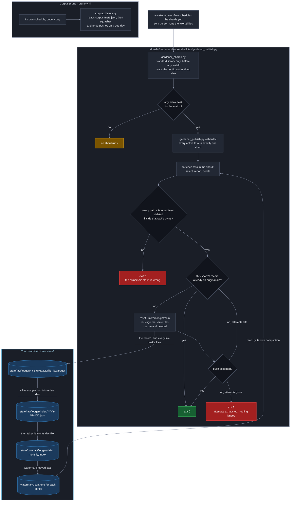
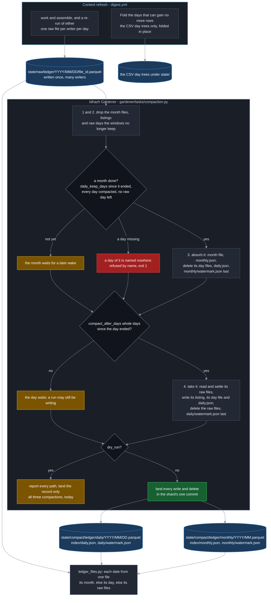

# The gardener

**Last Updated**: 2026-09-28

How the one program that deletes and rewrites what this repository keeps is put
together: where its tasks come from, how a wake is split into shards, what a
shard checks before and after its tasks run, how its one record lands on
`main` however many shards race it, and how its compaction task moves a
ledger's rows from raw files into day and month files. What each knob means is
[../../concepts/config/idhazh-gardener.md](../../concepts/config/idhazh-gardener.md);
the workflow that wakes it is not written yet.

## What runs

The gardener runs **tasks**. A task is two things that land together:

- **a declaration**, one file under `config/gardener/`, named for the task. It
  says what the task owns, how far back it keeps, whether it may delete at all
  (`dry_run`), and which kind it is;
- **a module** under `backend/idhazh/gardener/tasks/`, holding exactly two
  names: `KIND`, the kind it serves, and `run`, which takes a `TaskContext` and
  returns a `Pass`.

There is no list of tasks anywhere. `registry.discover()` imports every module
in `tasks/`, and `registry.bind()` finds the module that runs one declaration in
two lookups: the module named for the task (hyphens become underscores), else
the module named for its kind. A config value never names a module, so text in
a file cannot choose which code runs (Guardrail #11).

**The folder is the only count.** `config/gardener/` says how many tasks there
are, and nothing else does: a task joins when its declaration and its module
land together, and the pre-flight below refuses either one arriving alone.

## A wake, in order

| Step | Who | What it does |
| --- | --- | --- |
| 1 | `backend/utilities/gardener_shards.py` | Splits the active tasks into shards and prints the plan. Standard library only, reads `config/` alone |
| 2 | `backend/utilities/gardener_publish.py --shard N` | Reads the commit the checkout is at, loads the declarations through the typed loader, finds the modules, and runs the pre-flight |
| 3 | the runner | Runs every task of the shard, one after another, timing each |
| 4 | the runner | Holds every path each task touched to what that task owns |
| 5 | the runner | Writes the shard's one record through `ledger.persist`, and hands back what to land |
| 6 | `gardener_publish.publish` | Stages exactly what the shard wrote and deleted, commits, pushes, and tries again on a newer tip if it lost |

**The split is round-robin over sorted names.** Every task the matrix runs - an
active one whose kind is not `history`, which has a job of its own - is sorted by
name and dealt to shard `position % shard_count`, where `shard_count` is the
smaller of `shards` and the number of tasks. The same declarations always give
the same shards, no shard is empty, and every task is in exactly one. How much
work a task holds is not read: one owned folder can hold one file or ten
thousand, so counting folders would balance nothing.

**A shard checks out the folders its tasks own**, joined into one
newline-separated string (`cone`) because that is what a sparse checkout reads.
A task that owns everything else under a root adds no folder: it reads what it
needs from git.

**A task is handed the folders it walks, and never lists `state/` itself.**
`gardener_publish.py` reads, in one `git ls-tree` with no recursion, which of
the shard's owned folders the commit holds and every folder directly under
`state/`, and the runner turns that into `TaskContext.owned_folders` before any
task runs. A folder the commit holds and the checkout lacks fails its task,
because a wrong checkout would otherwise report a silent zero. A declared folder
the commit does not hold yet - `state/score-archive/` before the first month is
archived - is left out and logged, and the task's first write makes it. A
complement task's folders come from the commit alone, so a folder somebody left
in the checkout and never committed is not the sweep's to take, and
`idhazh gardener run-task`, which starts no process and so reads no commit,
refuses one by name.

**The plan is written twice.** The plan job runs before anything of ours is
installed, so `gardener_shards.py` cannot import the typed planner in
`idhazh.gardener.shards`. The two emit one payload for one config, byte for byte,
and `backend/tests/contracts/test_gardener_plan.py` holds them to it and to the
`GardenerPlan` model. With no task for the matrix the payload is the empty
shape, on one line:
`{"any_active_task":false,"matrix":{"include":[]},"shard_count":0,"shards":[]}`.

**The job graph, as it stands.** No workflow schedules the shards yet, so a wake
is a person running the two utilities. The corpus squash is not in the matrix:
`prune.yml` runs it on a daily wake of its own.

**`digest.yml` is not on this picture, and that is the point.** It writes
today's rows, and every day the gardener acts on ended at least a whole day
before, so a digest run and a gardener wake never want one file. A re-run is the
one writer into an older day, and a compaction takes its file at the next wake
([below](#a-day)).

## What stops a shard

| Exit | What it means | Retried |
| --- | --- | --- |
| 0 | every task ran and the record landed, or had already landed | - |
| 1 | a task failed. Its row says `failed`, its siblings still ran, and the record still landed | at the next wake |
| 2 | ownership or integrity: a module that cannot serve, a path outside what a task owns, a record outside the gardener's ledger, or one record path with two sets of bytes | never; a person fixes it |
| 3 | the push kept losing for every attempt | at the next wake |

A shard reports the worst code it earned, in the order 2, 3, 1, 0.

**The pre-flight is the two refusals that need the modules.** A declaration no
module serves, and a module no active or paused declaration uses, are both exit 2
before any task runs. A module whose `KIND` disagrees with the declaration it
would serve is refused the same way, because it would be handed a declaration it
cannot read. So is a module that raises while it is imported, a module that
declares no task, and two modules that would serve one name (`old-days.py` beside
`old_days.py`). None of these is caught and skipped: a skipped task is a task
that silently stopped deleting.

**Every path a task touched must sit inside what it owns.** What it took and
what it wrote are both checked, on a dry run too, because the check reads the
selection rather than what was deleted. The complement form owns every folder
under its roots that no other task owns, whatever that task's status, and that
no ledger family or ledger root claims. A collection task is checked on what it
wrote alone: what it takes lives on GitHub. The record the shard writes is the
one write no task owns.

**A report a task files is held to the ledger it appends to, not to what it
owns.** A declaration's `appends_to` names the ledgers a task may file a report
of its own into, through the ledger door: `visual-prune` files one
`visual-prunes` row a pass, whatever it found. Each report must be a fresh raw
file of one of those ledgers under the wake's day, or the shard stops before
anything is staged, the way it stops for a path outside what a task owns. A
report lands on a dry run too, because what a dry run found is the thing it
exists to report; every deletion it named is still held back.

## The record

One record per shard, always. Every task adds its row - a
[`CollectionPruneRow`](../contracts/state-ledgers.md#the-gardener) - a dry run
included, so a shard of nothing but dry runs still writes one file and still
pushes it. The record goes through the ledger door into the gardener's own ledger,
`state/raw/gardener/<YYYY>/<MM>/<DD>/<file_id>.parquet`, and the runner refuses
it with exit 2 if it went anywhere else.

Each row names the run that wrote it: `run_id`, `attempt`, `job` and `shard`, the
task's own `duration_ms`, and `work_ended_at`, the instant the shard finished
working and began to publish. A slow push is therefore never read as a slow task.

## Landing the commit

`backend/utilities/gardener_publish.py` is the only code that pushes. It is the
entry point a shard runs: it reads the commit the checkout is at, calls the
runner, and lands the `Shard` the runner hands back - the record, every path the
shard's live tasks wrote and deleted, every report any of its tasks filed, and
the commit message. Each attempt
fetches `main`, resets the index to it with `--mixed`, stages exactly those
writes and deletions, checks what it staged, commits as
`miztiik <miztiik@users.noreply.github.com>` and pushes. A lost push waits a
random time - up to 1, 2, 4, 8 and then 8 seconds - and tries again on the new
tip. No wait follows the last attempt.

**The record decides whether the shard already landed.** Its bytes are unique to
the shard, so `main` holding that path with those bytes means an earlier attempt
landed and this one stops with 0; the same path with other bytes is exit 2.

**Three checks run over what was staged, before every commit.** Nothing outside
the shard's writes and deletions is staged. Every write is staged, unless its
bytes already equal `main`'s, which is a write that already landed. And a
deletion that staged nothing is an error only while `main` still holds the
path, because a path already gone is a deletion somebody finished. A deletion
that names a folder is refused before anything stages.

**`idhazh gardener run-task` never pushes.** It runs the same tasks and writes
the same record into the checkout, and stops there, so running a task on a
developer's machine cannot reset their branch or push to main. It takes the
commit as `--git-sha`, because the package does not start git to read it. The
utility takes the same line without that flag, and both are built from one
parser in `idhazh.gardener.cli`.

## The compaction

**A compaction moves one ledger's rows out of the many small raw files its
writers leave, into one file a day and then one file a month, and deletes what
it moved.** A raw file holds one writer's rows for one day, so a ledger gains a
file on every run, and at a few rows a file a parquet file is mostly its footer.
One task a ledger does the move: `config/gardener/compact-<ledger>.json`, served
by `backend/idhazh/gardener/tasks/compaction.py` through its kind, so a fourth
ledger is one declaration and no Python. Three ship - for `gardener`,
`visual-prunes` and `feed-retirements` - and all three only report. The files it
writes are laid out in
[../contracts/persistence.md](../contracts/persistence.md#the-two-roots), and
its knobs are in
[../../concepts/config/idhazh-gardener.md](../../concepts/config/idhazh-gardener.md#the-compaction-declarations-that-ship).

**The CSV day trees are not on this path.** `digest.yml` still folds a closed
CSV day in place, in its step named `Fold the days that can gain no more rows`,
and nothing here reads or writes those trees.

### One pass, in order

| Step | What it does |
| --- | --- |
| 1 | Drops each month file the monthly window no longer keeps, and its entry in `index/monthly.json` |
| 2 | Drops each raw listing older than `raw_index_keep_days` whose day is compacted and whose raw folder is empty, and every raw day in a month the window no longer keeps |
| 3 | Absorbs every month that is done into its month file |
| 4 | Takes every raw day that is due into its day file |

**Drops first and days last, because no pass may write a path it deletes.** A
shard refuses a path it both wrote and deleted, so a pass that did either would
stall every wake after it. In this order a month absorbs day files
an earlier wake wrote, never one this pass wrote, and a month whose last days
this pass takes is absorbed at the next wake.

**Every rule counts whole UTC days after a period's own end.** The pass measures
from 00:00 UTC on the wake's own day, so every wake of one UTC day gets the same
answer, and moving a cron changes nothing ([CLAUDE.md](../../../CLAUDE.md)
section 2).

### A day

**A day is due once `compact_after_days` whole days have passed since it
ended.** At the default of one, a wake on the 25th takes the days up to the 23rd.
Days go in order, each on its own, at most `max_periods_per_run` a pass. For each
one the pass reads every raw file of the day and settles the rows: one file's
rows per work unit - the last file of its highest attempt - then the first row
of each key. It writes the day's listing,
`state/raw/<ledger>/index/<YYYY-MM-DD>.json`, then its day file, then
`index/daily.json`; it deletes the raw files; and it moves `daily/watermark.json`
last. A pass that stops part way leaves the watermark behind the truth, so the
next wake takes that one day again and loses nothing.

**A quiet day still gets a file.** A day with no raw files gets a day file with
no rows and an index entry. So the newest day `index/daily.json` names is always
the watermark's day, and a reader can tell a quiet day from a missing one
without opening the watermark.

**A day that cannot be read whole is not taken.** A file that is not a ledger
file, or that this build cannot read, stops its day, and so does a day holding
more than `max_raw_files_per_period` files. Nothing of that day is deleted, the
watermark stays before it, and the pass ends `failed` naming it, so the task
exits 1. Every step the pass took before that day still lands.

**A re-run that lands after its day was compacted replaces its first attempt.**
GitHub lets a failed job run again for 30 days, and the re-run writes into the
day its run first wrote. A day at or below the watermark that has raw files
again is taken again, and before the new days: its day file is rebuilt from its
own rows and the new raw files, settled once. A compact row keeps the identity
its raw file gave it, which is what lets attempt 2 replace attempt 1 even when it
filed fewer rows. The watermark does not move back.

**The first pass starts on the first of a month**: the month of the older of the
oldest raw day and the newest due day, or the oldest month the monthly window
keeps if that is later. So every month the daily index holds is whole, and the
check a month makes for a missing day is exact.

### A month

**A month is absorbed whole or not at all, and only when four things are
true**: `daily_keep_days` whole days have passed since it ended; the daily
watermark is past its last day; `index/daily.json` names every one of its days;
and none of its raw days still holds files. The first two say the month is done,
the third that nothing of it is missing, and the fourth that no re-run is still
waiting in it. A month that fails the first, second or fourth waits for a later
wake. **A month whose days the daily index does not all name is a hole**: it is
refused by name, the watermark stays, and the task exits 1, because absorbing it
would put the missing day in no file.

Absorbing is five steps in this order: the month file, `index/monthly.json`, the
deletion of its day files, `index/daily.json`, and `monthly/watermark.json` last.
The day files are joined as they are and never settled across days: a key with
no date in it may repeat on two days, and both rows are facts.

**A month file lives exactly `monthly_window` after its month is absorbed.**
Month M goes on the day month M plus the window becomes absorbable, so the
monthly period holds exactly `monthly_window` month files on every day, and the
ledger reaches back `daily_keep_days` further than that. At the defaults - 13
months and 45 days - January 2026 goes on 15 April 2027, the day February 2027 is
absorbed.

**Raw files that land in a month already absorbed are refused and kept.**
`daily_keep_days` is at least 31, one day more than GitHub's 30-day re-run
window, so no re-run can land there; a file that does is for a person to read.
The rest of the pass still runs.

### What a dry run does, and what the record says

**A dry run does all of the work and changes nothing.** It reads every file,
settles the rows, builds every file in memory, and reports every path a live
pass would write and delete. So the list a person reads before turning a
compaction live is the list the live pass carries out.

**The record row says what the pass did, or would have.** `deleted` and
`bytes_freed` count the files it deleted. `bytes_freed` is never netted against
the files it wrote: the net is `bytes_freed` minus the `bytes` of the index
entries it wrote. `candidates_seen` counts every raw day folder it listed and
every file it read or weighed, so a listing that grows while a compaction only
reports shows in every row. `until` is the newest day that was due. A pass that
used its budget stops `ceiling`, with `resume_from` naming the day or month the
next pass starts at; one that refused a period stops `failed`, naming it.

## Design rationale

**2026-09-27: `attempts` must be above `shards`.** Every shard of one wake pushes
to one branch at once, so the shard that lands last has lost a race to every
other shard first. `attempts - shards` is how many pushes from outside the wake,
or failed pushes, one wave can absorb. The committed pair is 6 and 5; the
longest a shard can wait is about 23 seconds of backoff, about 40 seconds in all,
an estimate (Fowler and Carmack).

**2026-09-27: the split is round-robin, and history is not in the matrix.** The
plan job reads `lifecycle_status`, `kind` and `owns` and nothing else. A key
that placed one task after another was considered and dropped: nothing else in
the design orders tasks, and it would make the split depend on something other
than the names (Fowler and Carmack).

**2026-09-27: the hand-run collection utility writes no record.**
`backend/utilities/prune_artifacts.py --record` wrote one pass to a file nothing
read. A record now names the run, attempt, job and shard that made it, and a pass
a person runs by hand is none of those, so the flag went rather than invent an
identity (Fowler and Carmack).

**2026-09-27: the commit loop lives outside the package.** The loop runs git,
and `backend/tests/test_canaries.py` refuses `subprocess` anywhere under
`backend/idhazh/`: the package that reads the open web holds none of the
machinery an injected instruction would need to act (CLAUDE.md Guardrail #11).
Every other git call in this repository already lives under `backend/utilities/`
for the same reason. So the runner writes the record and hands back the paths,
and `gardener_publish.py` reads the commit, calls it and lands them. A task that
must run git itself has the same limit, and the corpus rewrite is the one that
does: `backend/utilities/corpus_history.py` runs its git - the boundary, the new
root, the replay and the push - in the history job, and binds the
`corpus-squash` task through the registry only for the step that needs none,
recording the run. It never lands through `gardener_publish.py`, whose reset to
`origin/main` would throw the rewrite away.

**2026-09-28: a compaction pass drops, then absorbs months, then takes days.**
The first design took the days and then the months. A shard refuses a path it
both wrote and deleted, and in that order a catch-up pass takes a day and
then absorbs the month that holds it - writing a day file and deleting it in one
pass - which would stall every later wake. The order costs a month one more wake
after its last day is taken (Carmack).

**2026-09-28: a day's listing is written when the day is taken, not at every
wake.** A listing of a day not yet taken would be rewritten on the day it is.
A pass lists the raw day folders once, by name, and opens only the days it
takes, so what one pass reads is bounded by its budget rather than by the
backlog (Carmack).

**2026-09-28: the monthly window counts from the month's absorption.** A month
file goes when the month `monthly_window` later is absorbed, so the period holds
exactly `monthly_window` files on every day. Counted from the month's own end, a
window shorter than `daily_keep_days` plus a month would drop a month before it
was absorbed, and the loader carried a rule to refuse that pair. Counted this
way no such gap can open, so the rule went (Fowler and Carmack).

**2026-09-28: `daily_keep_days` is at least 31.** GitHub lets a failed run be
re-run for 30 days, and the re-run writes into its first day, so a month absorbed
sooner could still be reached by one. The 30 is declared once, as
`GITHUB_RERUN_DAYS` in `backend/idhazh/contracts/knobs/gardener.py`, and the
floor is derived from it. A raw file that lands in an absorbed month anyway is
refused and kept for a person (Carmack and Fowler).

**2026-09-28: a first pass starts on the first of a month.** Starting at the
oldest raw day would leave the daily index holding part of a month, and that
month's check would call the days before it holes. The start asks the same
function the window drops months by, `first_kept_month`, so a first pass never
takes a day the same pass would drop (Carmack and Fowler).

## See also

- [../../concepts/config/idhazh-gardener.md](../../concepts/config/idhazh-gardener.md) - every knob, and every refusal the loader makes.
- [committing.md](committing.md) - how every other job commits, and why the gardener stages its own files.
- [../contracts/state-ledgers.md](../contracts/state-ledgers.md) - the gardener's ledger, and what one of its rows holds.
- [../contracts/ledger-registry.md](../contracts/ledger-registry.md) - the grain that ledger files at, and the builders that refuse it.
- [../contracts/persistence.md](../contracts/persistence.md) - the two roots a compaction writes under, and how a ledger is read back from all three kinds of file.
- [../../concepts/atomic-deletes.md](../../concepts/atomic-deletes.md) - what one delete at a time buys.
