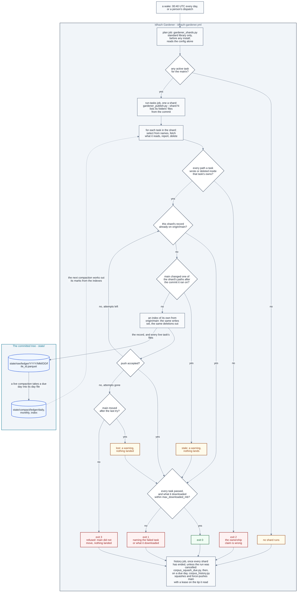

# The gardener

**Last Updated**: 2026-10-09

How the one program that deletes and rewrites what this repository keeps is put
together: where its tasks come from, how a wake is split into shards, what a
shard checks before and after its tasks run, what each line of its log says and
what its job page says, and how its one record lands on `main` however many
shards race it. What each knob means is
[../../concepts/config/idhazh-gardener.md](../../concepts/config/idhazh-gardener.md);
the workflow that wakes it is `.github/workflows/idhazh-gardener.yml`, once a
day at 00:40 UTC or when a person dispatches it.

## What runs

The gardener runs **tasks**. A task is two things that land together:

- **a declaration**, one file under `config/gardener/`, named for the task. It
  says what the task owns, how far back it keeps, whether it may delete at all
  (`dry_run`), and which kind it is;
- **a module** under `backend/idhazh/gardener/tasks/`, holding exactly two
  names: `KIND`, the kind it serves, and `run`, which takes a `TaskContext` and
  returns a `Pass`.

`config/idhazh_gardener.json` names the complete task list. For each listed
task, `registry.discover()` imports only its named module and the shared module
for its kind as a fallback. `registry.bind()` selects the named module first.
A config value never names a module, so text in a file cannot choose which
code runs (Guardrail #11).

**The named list is the task set.** The loader opens only the declaration files
named in `config/idhazh_gardener.json`. An unrelated file in `config/gardener/`
cannot change which tasks a wake plans.

## A wake, in order

| Step | Job | Who | What it does |
| --- | --- | --- | --- |
| 1 | `plan` | `backend/utilities/gardener_shards.py` | Splits the active tasks into shards and prints the plan. Standard library only, reads `config/` alone |
| 2 | `run-tasks`, one job a shard | `backend/utilities/gardener_publish.py --shard N` | Loads the named declarations, selects each retention task's fixed UTC period window and each compaction's ledger indexes, and lists the name and size of files only at those named paths in the commit; it then finds the modules and runs the pre-flight |
| 3 | `run-tasks` | the runner | Runs every task of the shard, one after another, timing each. A task fetches the day or month folders it reads before it opens them |
| 4 | `run-tasks` | the runner | Holds every path each task touched to what that task owns |
| 5 | `run-tasks` | the runner | Writes the shard's one record through `ledger.persist`, and hands back what to land |
| 6 | `run-tasks` | `gardener_publish.publish` | Builds one commit of exactly what the shard wrote and deleted, pushes it, and tries again on a newer tip if the push failed. Lands nothing when `main` changed one of those paths after the commit the shard ran on |
| 7 | `history` | `backend/utilities/corpus_squash_due.py`, then `backend/utilities/corpus_history.py` | Once every shard has ended, unless the run was cancelled: reads whether the corpus squash is due and, on a due day, squashes the old history and force-pushes `main` with a lease on the tip it read, squashing again on a new tip when the push is refused |

**The split is round-robin over sorted names.** Every task the matrix runs - an
active one whose kind is not `history`, which has a job of its own - is sorted by
name and dealt to shard `position % shard_count`, where `shard_count` is the
smaller of `shards` and the number of tasks. The same declarations always give
the same shards, no shard is empty, and every task is in exactly one. How much
work a task holds is not read: one owned folder can hold one file or ten
thousand, so counting folders would balance nothing.

**A shard checks out only its code and config, and lists the rest from the
commit.** `gardener_publish.py` reads, in one `git ls-tree -r -l` over the commit
with lazy fetching off, the name and size of every file under the folders the
shard's tasks own or read - and under the folders the complement task sweeps,
which only the commit can name - and downloads none of them. A file's size is
git's where the clone holds the file. For one it never downloaded git prints no
size, so GitHub's trees API is asked once for each listed folder, and its sizes
are matched to git's names by blob id; a name left with no size is refused, and
no task runs. So what a shard's listing costs grows with the number of names,
not with what the files weigh.

**A task decides from those names and fetches only what it reads.** A task that
decides from the date in a path downloads nothing, and its deletions land from
the names alone. A task that reads a file's content - a compaction packing a
day, the census summary reading a month - first widens the checkout by exactly
the day or month folders that step reads, in one `git sparse-checkout add
--stdin`, which a partial clone serves with one download. A file the commit
holds is on disk after that or the task fails: it is never taken for a member
that is not there. After each task the listing takes in what that task deleted
and wrote, so a later task of the shard that reads the same folder sees the
tree the shard will commit, and never fetches a file an earlier task deleted.

**A task is handed the folders it walks, and never lists `state/` itself.**
`gardener_publish.py` reads, in one `git ls-tree` with no recursion, which of
the folders the shard's tasks own or read the commit holds, and every folder
directly under `state/`, and the runner turns that into
`TaskContext.owned_folders` before any task runs. A folder the commit holds is
walked whether the checkout holds it or not, because its names come from the
commit. A declared folder the commit does not hold yet - a ledger's
`state/compact/` folder before its first day is packed - is left out and named
in the task's `task-planned` event, and the task's first write makes it. A complement task's folders come
from the commit alone, so a folder somebody left in the checkout and never
committed is not the sweep's to take, and `idhazh gardener run-task`, which
starts no process and so reads no commit, refuses one by name. A folder a task
reads and does not own is declared under `reads`; asking about a folder it
neither owns nor reads is refused rather than answered empty, and so is asking
for every file under a folder no step named, nor a folder above it, rather than
answered with the named periods inside it. A step that chooses its periods as
it runs - every step of a compaction - names them first, and the shard lists
them from the same commit then.

**The plan is written twice.** The plan job runs before anything of ours is
installed, so `gardener_shards.py` cannot import the typed planner in
`idhazh.gardener.shards`. The two emit one payload for one config, byte for byte,
and `backend/tests/contracts/test_gardener_plan.py` holds them to it and to the
`GardenerPlan` model. With no task for the matrix the payload is the empty
shape, on one line:
`{"any_active_task":false,"matrix":{"include":[]},"shard_count":0,"shards":[]}`.
The workflow reads three of those keys - `any_active_task`, `shard_count` and
`matrix` - and `backend/tests/contracts/test_gardener_plan_matrix.py` fails if
it reads a key the model does not declare. Each leg of `matrix` carries its
shard's number and task names, and the `run-tasks` job's name lists them, for
example `shard 0: compact-feed-health, traces`, so a run's page shows what every
shard ran without opening a job; the workflow holds that format and never a
list of tasks.

**The job graph.** Three jobs, in order. `plan` prints the shards, one
`run-tasks` job runs each shard - all of them at once - and `history` runs the
corpus squash after them. The squash is not in the matrix: it rewrites `main`,
so it runs alone, once every shard has ended. Every task in the matrix only
reports today; the squash is the one task that changes anything.



**The squash runs unless the run was cancelled.** The history job waits for
every `run-tasks` shard to end, so history is still rewritten last, and then runs
on `if: ${{ !cancelled() }}`. A red shard does not hold it off: that shard's push
has already ended, and its work is tried again at the next wake either way. A
failed `plan` job, which skips every shard, does not hold it off either, and a
person's cancel still stops it. The person's ruling, 2026-09-29. It replaced
`always() && (needs.run-tasks.result == 'success' || needs.run-tasks.result == 'skipped')`,
under which a task that failed at every wake - a compaction that meets a hole, a
shard over its ceiling - held off every squash until a person acted.

**The history job writes its record with the plan job's run id**, so every
record of one run carries one id even when the run crosses 00:00 UTC, and the
job makes an id from its own UTC day only when a failed `plan` job left none.

**The push carries a lease, and a refused push squashes again.**
`corpus_history.py` pushes with `--force-with-lease=refs/heads/main:<tip>`,
naming the tip it read before it rewrote anything, so git refuses the push if
another run landed a commit meanwhile. The program then waits
`push_retry_delay_seconds`, fetches `main`, and runs the whole squash again on
the new tip, which replays the other run's commits with the rest. It never
pushes the refused rewrite again. After `push_attempts` pushes in all it stops,
unstamped, and the squash is due again at the next wake. The person's ruling,
2026-09-29.

**The first squash that rewrites history is due about 2026-10-29, and a person
reads two things in its log.** No squash has collapsed a commit yet, so neither
has been seen on a runner. The replay is a rebase, and a rebase flattens merge
commits; the history it replays holds merge commits, six from September 2026.
If one carried a change of its own, the replayed tree differs from the tip and
the program stops with exit 2 before any push, for a person to decide; a replay
that stops on a conflict ends the same way. And nobody has timed one replay on
`ubuntu-latest`: on the Windows development machine 1,001 commits took 824 s,
and the first squash replays about 4,800, so at that rate one replay alone would
outlast the job (an estimate). Read the replay's time in the history job's log -
a job stopped at its limit means one replay did not fit - and if one replay takes
more than about a third of the job's 30 minutes, about 8 minutes once the clone,
the install and the waits are paid
([the budget](../../concepts/config/idhazh-gardener.md#the-history-declaration-corpus-squash)),
lower `push_attempts` or raise the job's `timeout-minutes`.

**`digest.yml` is not on this picture, and that is the point.** It writes
today's rows, and every day the gardener acts on ended at least a whole day
before, so a digest run and a gardener wake never want one file. A re-run is the
one writer into an older day, and a compaction takes its file at the next wake
([A day](ledger-compaction.md#a-day)).

## What stops a shard

| Exit | What it means | Retried |
| --- | --- | --- |
| 0 | every task ran and the record landed, or had already landed. A task whose row says `deferred` - GitHub's API did not answer, or a period waits for a range that starts earlier or for a person - is in this code too: it is no code defect, and its row names why. Also 0, with a warning, when nothing landed because the shard's work is out of date: `main` changed one of its paths after the commit it ran on (`stale`), or every try failed and `main` moved after the last one (`lost`) | a `stale` or `lost` shard's work is done again at the next wake, and so is a deferred task's |
| 1 | a task failed for a code defect - its row says `failed`, with the fault `raised`, and its siblings still ran - or the shard's tasks downloaded more than `max_downloaded_mb`, which a task that chooses its periods by the budget never does, so that is a code defect too; either way the record still landed. Or the files under the shard's folders could not be listed, and then no task ran and nothing landed | at the next wake; a download over the ceiling goes on failing until a person fixes the task that passed it |
| 2 | ownership or integrity: a module that cannot serve, a history task handed to the runner, a path outside what a task owns, a record outside the gardener's ledger, one record path with two sets of bytes, or a deletion of a file the commit did not list | never; a person fixes it |
| 3 | `main` refused the push: every try failed, and `main` did not move after the last one (`refused`) | at the next wake |

A shard reports the worst code it earned, in the order 2, 3, 1, 0.

**The pre-flight is the two refusals that need the modules.** A declaration no
module serves, and a module no active or paused declaration uses, are both exit 2
before any task runs. A module whose `KIND` disagrees with the declaration it
would serve is refused the same way, because it would be handed a declaration it
cannot read. So is a module that raises while it is imported, a module that
declares no task, and two modules that would serve one name (`old-days.py` beside
`old_days.py`). None of these is caught and skipped: a skipped task is a task
that silently stopped deleting.

**A history task handed to the runner is refused before anything runs.** The
only program that runs one is `backend/utilities/corpus_history.py`, which binds
the task itself and runs its git in the history job. A history task run through
`idhazh gardener run-task`, or put in a shard, would record the squash as done -
stamping `last_run` - without squashing anything, and put the next real squash
off by a whole `every_days`. So the runner exits 2 and names that program, and
nothing runs. `lifecycle_status: paused` is how a person holds the squash back.

**Every path a task touched must sit inside what it owns.** What it took and
what it wrote are both checked, on a dry run too, because the check reads the
selection rather than what was deleted. The complement form owns every folder
under its roots that no other task owns, whatever that task's status, and that
no ledger family or ledger root claims. A collection task is checked on what it
wrote alone: what it takes lives on GitHub. The record the shard writes is the
one write no task owns.

**A report a task files is held to the ledger it appends to, not to what it
owns.** A declaration's `appends_to` names the ledgers a task may file a report
of its own into, through the ledger door: `visual-prune` files one
`visual-prunes` row a pass, whatever it found. Each report must be a fresh raw
file of one of those ledgers under the wake's day, or the shard stops before
anything is staged, the way it stops for a path outside what a task owns. A
report lands on a dry run too, because what a dry run found is the thing it
exists to report; every deletion it named is still held back.

## What a shard downloads

**Every row carries two weights.** `cone_bytes` is what the folders the shard's
tasks own weighed at the commit it checked out - the listing's sizes added up -
whether or not a task downloaded any of it. `downloaded_bytes` is what the
shard's tasks downloaded to read: the content of every file a widening brought.
The code folders every shard checks out - `config/`, `backend/` and `.github/` -
are in neither: they are the same in every shard, and they grow with code rather
than with what the pipeline keeps.

**A compaction takes only what fits what is left of `max_downloaded_mb`.**
Each step reads its periods' sizes off the listing before anything is
downloaded and stops at the first period that does not fit, at `ceiling` for a
later wake, or `failed` by name when that period alone is larger than the
whole budget ([ledger-compaction.md](ledger-compaction.md#one-pass-in-order)).
The shard's other tasks that download do not choose by the budget yet, so the
check after its tasks stays: over `max_downloaded_mb` the shard still runs its
tasks and lands its record, then exits 1, and the message calls it what it is,
a code defect - a task downloaded without choosing by the budget. Stopping then
would not save the downloads, which are paid for by the time the number is
known, and would only stop the passes that make the tree lighter. The message
names the three folders the shard downloaded most under. `idhazh gardener
run-task` starts no git process, so a hand run records both weights as empty
and is never over.

**128 MB is the committed ceiling, and it is an estimate.** A megabyte here is
1024 x 1024 bytes. A shard downloads only what its tasks read: the days and
months a compaction packs, the months the census summary summarises. Measured
on the development machine on 2026-09-30, a month of the eval ledger is 31
files and 3.5 MB, so 128 leaves room for a compaction that catches up on
several months at once. Move it from what the wakes that did not stop at it
downloaded: a compaction that stopped at `ceiling` because of the budget
records the budget, not what it needed, so doubling the largest
`downloaded_bytes` would raise the ceiling on every reset. A month file sits in
its year folder, so a step that reads one month file fetches every month file
of that year beside it, up to twelve: a later row can move the month files into
folders of their own if the readings show that cost.

## The record

One record per shard, always. Every task adds its row - a
[`CollectionPruneRow`](../contracts/state-ledgers.md#the-gardener) - a dry run
included, so a shard of nothing but dry runs still writes one file and still
pushes it. The record goes through the ledger door into the gardener's own ledger,
`state/raw/gardener/<YYYY>/<MM>/<DD>/<file_id>.parquet`, and the runner refuses
it with exit 2 if it went anywhere else.

Each row names the run that wrote it: `run_id`, `attempt`, `job` and `shard`, the
task's own `duration_ms`, and `work_ended_at`, the instant the shard finished
working and began to publish. A slow push is therefore never read as a slow task.
Each row also carries `cone_bytes`, what the shard's owned folders weighed, and
`downloaded_bytes`, what its tasks downloaded ([above](#what-a-shard-downloads)).

**A row says why its pass stopped, and what it recovered instead of stopping.**
Every error a task meets is read once for what it means, from its type and its
status code and never its text (`backend/idhazh/gardener/error_cause.py`). A
pass that stopped names the cause in `fault`, one closed word declared in
`backend/idhazh/contracts/gardener_fault.py`, beside `stopped_because` and
`resume_from`:

| # | `fault` | `stopped_because` | What stopped the pass | What happens next |
| --- | --- | --- | --- | --- |
| 1 | `raised` | `failed` | A code defect: any error no other word names, including an answer from GitHub that refuses the request itself, and a period larger than the shard's whole download budget | The shard exits 1, and a person reads the log |
| 2 | `api-unavailable` | `deferred` | GitHub's API answered 429 or 5xx, or a connection failed or timed out | The next wake asks again; nothing inside a wake does |
| 3 | `range-starts-late` | `deferred` | A range a person named starts after a period that is ready before it | The person widens the range |
| 4 | `no-month-to-reopen` | `deferred` | A raw day sits in a month the monthly mark is past that no monthly entry names | Its files wait for a person ([ledger-compaction.md](ledger-compaction.md#a-late-file)) |
| 5 | `packed-file-unreadable` | `deferred` | A packed day or month file a re-run or a late file would be settled into cannot be read, or is not there | A person restores the file from git history |

`recovered` lists every fault the pass recorded instead of stopping, one note for
each period or member it took or adopted, in the order it met them:
`repacked-from-raw`, `recorded-lost`, `reopened-month`, `set-aside`,
`carried-over` and `index-rebuilt` from a compaction
([ledger-compaction.md](ledger-compaction.md#a-file-that-cannot-be-read)), and
`not-deletable` from a collection task ([below](#the-collection-tasks)). A
recovered pass still ends `exhausted` or at its ceiling. Neither cell holds text
the pass read, and the sentence a person reads for each word is written in
`backend/idhazh/gardener/report.py` when the pass is read, never stored, so the
wording can change with no migration. A row written before 2026-10-07 has no
`fault` and no `recovered`, and reads as one that named none; on such a row
`failed` means any stop for an error.

**The record is published.** `gardener` is in `ledger.published` in
`config/idhazh.json`, so the site holds its packed indexes, the files they name
and the raw days not packed yet, and the console's Data explorer can ask it why
a ledger is behind and what a pass recovered
([what the site holds](how-the-query-door-answers-a-panel.md#what-the-site-holds-for-the-door)).
Every cell can be published as it is: a closed word, a count, a flag, a UTC day
or instant, the identity of the run that wrote the row, a task's name from
`config/gardener/`, or a member. A member is a UTC period, a path under `state/`
that this project named, or the number GitHub gives a workflow run or an
artifact; the name GitHub gives one never reaches the row, and
`MEMBER_ID_PATTERN` refuses a space, a colon and a query string, so no member
can be a web address. The explorer shows the words; the sentence a person reads
for each is written by `report.py` and is not on the site.

## What a shard logs

**Every line a task logs is one event: one line of JSON on stderr.** Each event
is a model in `backend/idhazh/contracts/gardener_events.py`, and
`backend/idhazh/gardener/event_log.py` writes it. `idhazh gardener` and
`gardener_publish.py` install that module's one handler, at the level
`config/idhazh.json` names. A line starts with three keys: `event`, the event's
name; `at`, the UTC instant the line was made, to the millisecond, with a `Z`;
and `level`. The event's own fields follow, in the order it declares them, and a
field with no value is left out. JSON escapes every character outside ASCII and
every line break, so one event is always one line, and no text inside it can
start a line that GitHub reads as a workflow command. A test reads the event off
the log record (`event_log.payload`), never its text.

| # | Event | When | What it says |
| --- | --- | --- | --- |
| 1 | `task-planned` | Before each task runs | The task, its kind, shard, run and attempt, the wake's day, a range a person named, every knob of its declaration, and the declared folders the commit does not hold yet |
| 2 | `window-chosen` | Before a pass that deletes one member at a time lists one | The window it holds members to, its ceiling, whether it is a dry run, and the mark it walks after |
| 3 | `member-out-of-order`, `page-out-of-order`, `page-count-changed`, `list-end-missing` | When a walk's check fails ([below](#the-collection-tasks)) | What the check saw; the mark stays where it was |
| 4 | `expired-years-chosen` | Before a compaction's yearly expiry deletes anything, when its declaration sets `yearly_prune_enable` and `yearly_keep_months` | The ledger, and the expired UTC years the pass takes, oldest first, or none ([ledger-compaction.md](ledger-compaction.md#yearly-expiry)) |
| 5 | `periods-chosen` | Before a compaction's steps run | Which periods each step may take, and why they start where they do ([ledger-compaction.md](ledger-compaction.md#one-pass-in-order)) |
| 6 | `period-refused`, `download-over-budget`, `ledger-fault-met`, `raw-file-skipped` | When a compaction step refuses a period, stops at the download budget, passes a month file already gone, or meets a raw file outside a day folder | The ledger, the step, the period or path, and the words that say why |
| 7 | `task-finished` | The moment each task returns | How it ended in one word, what it took and wrote, why it stopped, what it recovered, what happens next, how long it ran, and what a compaction did period by period |
| 8 | `logged-text` | When a module outside the gardener logs text while a task runs | The logger and the message as it was said |
| 9 | `shard-published` | Once a shard, when it ends, whatever ended it | The tasks it ran and the ones that failed, how its commit came to rest on main or why it never did, the try, the record, the downloads against their budget, the exit code and what it means, and the type and place of an exception that stopped it |

**How a task ended is one word.** `report.classify` takes the first that holds:
`failed`, `deferred`, `dry-run`, `ceiling`, `done`, and otherwise the pass's
own idle word - `outside-range` when a person named a range, `empty` when the
ledger holds nothing for any step to start from, and `not-due` for everything
else. A pass found work when its window held a member, or it wrote or would
write a file. A pass that found work and
carried none of it out ends `dry-run`, so a live compaction whose only work is
the months a report-only monthly window names ends `dry-run` too. A report a
task files on every pass is not work. `next` is one fixed sentence for the word, or the
fault's own sentence when a fault stopped the task; no sentence says a member
is gone. A `failed` task's event is an error, a `deferred` task's event is a
warning, and every other ending is information. A period refused for a cause a
person settles is a warning too, so an error from a task always means a code
defect.

**An exception is named by its type and where it was raised, never by its
text.** `error` is the type, such as `ValueError`. `where` is the deepest line
of this package's own code that the exception passed through, as
`module:line`. The text of an exception can carry a ledger row, and a row can
hold text fetched from the open web (Guardrail #11), so no event field holds
it. A line that another module logged with an exception keeps its message and
names the exception the same way.

**The shard says how it ended once, in `shard-published`.** The publisher logs
it whatever ended the shard: how its commit came to rest on main, as a landing
word, or why it never did, as one of `listing-failed`, `check-refused` and
`crashed`; the try, the record, what the tasks downloaded against
`max_downloaded_mb`, the exit code, and one fixed sentence for what that code
means. An exception that escapes the publisher is said the same way, by its
type and place, before it goes on, so Python still exits 1 and prints the
crash's trace (below). The event is an error exactly when the shard exits other
than 0 and its job turns red, a warning when nothing landed because main moved
on, and information otherwise. The publisher prints nothing about a push that
worked or failed: the event says it once.

**A crash prints where it broke, never what it said.** When an exception ends
a program the gardener's workflow runs - the plan, a shard, the due check or the
squash - or a command a person runs on gardener code - `idhazh gardener
list-tasks`, `plan-shards` or `run-task`, `idhazh telemetry prune`, or the
ledger migrator, `backend/utilities/migrate_to_parquet.py` - the trace names the
exception and each exception chained to it by its type, and each frame by its
module and line, such as `idhazh.config:310`, in Python's own layout. It never
prints a message, an argument or a local, because a message can quote a ledger
row or what GitHub's API or a file returned (Guardrail #11). `__main__` in a
frame is the program the step ran, or the command's own entry. The exit code is
still Python's own, 1, and the squash prints the same trace when a run cannot be
recorded, then exits 2. The printer is `backend/idhazh/crash_trace.py`. The four
programs and the migrator install it before they call their `main`, `idhazh
gardener` installs it as its `main` starts, and `idhazh telemetry` only for
`prune`: its other four subcommands, like every other `idhazh` verb, still print
Python's own trace. An exception raised while a program or command imports its
own modules, before it installs the printer, prints Python's own trace too;
nothing those imports run reads fetched text, and the only file other than code
the commands' imports read is `config/ledgers.json`. A refusal a program or
command ends on with a sentence of its own keeps its words: the due check's, the
config refusal `idhazh gardener` prints, and the refusals `idhazh telemetry
prune` and the migrator print.

**What stays printed text.** A check that refuses the shard, before its tasks
run or after, a download over the budget, which names the three heaviest
folders, a listing that could not be read, `run-task`'s closing line, and a job
summary that could not be written are command output on stdout, not events.
None of them prints an exception's text: the listing's line names the
exception's type and place, as an event does.

**On GitHub, each task's lines fold into one group.** `gardener_publish.py`
reads whether it runs as a step on GitHub (`GITHUB_ACTIONS`) and tells the
handler, which then writes GitHub's workflow commands on the event's own stream,
around the event's line (`backend/idhazh/gardener/workflow_commands.py`):

| # | Command | Where | Why |
| --- | --- | --- | --- |
| 1 | `::group::<task> (<kind>)` | Before `task-planned` | Every line a task logs folds into one group named for it |
| 2 | `::endgroup::` | After `task-finished` | The group closes when the task does |
| 3 | `::error title=<task>::<fault> while it worked on <period or member> (<error> at <where>): <next>` | After the group, for a task that `failed` | GitHub lists it on the run's page, and it shows while the group is folded |
| 4 | `::warning title=shard <n>::...` | After `shard-published`, when the landing is `stale` or `lost` | Nothing landed because main moved on, and the job stays green |

Each value is escaped the way GitHub's own toolkit escapes it: `%`, CR and LF
in a message, and `:` and `,` as well in a property, so nothing inside a command
can end its line and start another. The error line is built from the event's
own words and never an exception's text; a part with no value is left out. At a
level above `info` no `task-planned` is written, so no group opens. Run anywhere
else, the handler writes the JSON lines alone.

## What a person reads on the job page

**Each shard adds a summary to its job's page, whether it passes or fails.**
GitHub names the page in the step's environment (`GITHUB_STEP_SUMMARY`), and
`gardener_publish.py` appends one Markdown summary to it
(`backend/idhazh/gardener/run_summary.py`) after it logs `shard-published`. The
summary is rendered from that event and the `task-finished` of each task that
ran and nothing else, so it cannot say what the log does not. Top to bottom:

- one heading: what the exit code means, the tasks a code defect stopped, the
  tasks deferred, then the exit code, such as "No task failed; deferred:
  `workflow-runs` (exit 0)";
- where the record went, or why nothing landed: one sentence for each landing
  word and each word for a stop;
- what the tasks downloaded against `max_downloaded_mb`, and, past it, that a
  task did not fit its work to the budget;
- one row a task, in the order the tasks ran: how it ended, with `failed` in
  bold and the fault that stopped it, and what it did, naming what it took -
  files, runs or artifacts, or a compaction's expired years and the days,
  months and years it packed - and the exception's type and place that stopped
  it;
- what each word in the table means and what happens next, once a word: the
  event's own `next`, keyed by the fault when a fault stopped the task;
- what the tasks handled without stopping: one line for each task and note,
  with the first period or member the note names and how many more.

A compaction's old months and raw days are said as found past the keep line,
because its record lists them whether its monthly window deleted them or only
reported them. Its expired years are said as deleted, first in its row, such as
"deleted 1 expired year", or "would delete 1 expired year" on a dry run: the
yearly expiry has no switch that only reports, and no later wake can undo it
([ledger-compaction.md](ledger-compaction.md#yearly-expiry)).
A summary holds closed words, counts, periods, member ids, paths
the gardener named, an exception's type and place, and fixed sentences, never
an exception's text or a row's value, and every sentence is escaped for
Markdown. A page that will not take the summary costs the summary and never the
exit code: the shard prints one line naming the error's type. A shard whose
declarations cannot load writes no summary, because it stops before it knows
its tasks, and its printed refusal says why. `idhazh gardener run-task` writes
none: it never runs as a step on GitHub.

## Landing the commit

`backend/utilities/gardener_publish.py` is the only code that pushes. It is the
entry point a shard runs: it reads the commit the checkout is at, calls the
runner, and lands the `Shard` the runner hands back - the record, every path the
shard's live tasks wrote and deleted, every report any of its
tasks filed, and the commit message. Each attempt fetches `main` and builds the
commit in an index file of its own: `main`'s tree read in, each write's new
content set, each deletion taken out by its name. So a file the checkout never
downloaded is deleted as easily as one it holds, and the checkout's own index is
never expanded. It checks what it staged, writes the tree and a commit on top of
`main` as `miztiik <miztiik@users.noreply.github.com>`, and pushes that commit as
whole objects: a delta against a file the clone lacks could only be computed by
downloading the file, and with lazy fetching off the push would fail instead.
Every git call but the one that widens the checkout runs with lazy fetching
off, so a call that would download a file fails rather than pays for it
quietly. A failed push waits a random time - up to 1, 2, 4, 8 and then 8 seconds -
and tries again on the new tip. No wait follows the last attempt. A deletion of
a file the commit did not list lands nothing, and the shard exits 2: a task
decided it from something other than the commit.

**The record decides whether the shard already landed.** Its bytes are unique to
the shard, so `main` holding that path with those bytes means an earlier attempt
landed and this one stops with 0; the same path with other bytes is exit 2.

**A shard whose paths `main` changed lands nothing.** After each fetch the
publisher compares the commit the shard ran on with `main`, over every path the
shard writes or deletes but its record, with `git diff-tree -r --no-renames
--name-only`, in groups below Windows' command-line limit. A path it lists is one
`main` changed after the shard's commit, so the shard's version of it is older
than `main`'s. A re-run is the usual cause: it checks out its run's commit again,
after later runs have landed, and it names its record afresh, so the record check
above cannot catch it. Nothing lands, not even the record. The shard's
`shard-published` lists those paths, a warning on GitHub names the first, and
the shard exits 0; the next wake does the work again on the new `main`. The
comparison reads trees only, so the clone downloads no file for it.

**When every try failed, `main`'s tip says why.** The publisher fetches `main`
once more after the last try. If `main` moved after the last try's base, other
writers are landing: the shard warns on GitHub and exits 0, and the next wake
does the work again. If it did not move, `main` refused this push, and the shard
exits 3 and its job is red. The publisher never reads the push's error text,
because git's words change with versions and languages. A GitHub outage through
every try reads as a refusal, so it costs one red job.

**Each way a shard comes to rest has one word.** Its `shard-published` event
names it: `landed`, `already-on-main`, `stale`, `lost` or `refused`. The words
live in `backend/idhazh/contracts/shard_landing.py`. They are not persisted: the
record lands inside the commit, so it cannot say how that commit landed.

**Three checks run over what was staged, before every commit.** Nothing outside
the shard's writes and deletions is staged. Every write is staged, unless its
bytes already equal `main`'s, which is a write that already landed. And a
deletion that staged nothing is an error only while `main` still holds the
path, because a path already gone is a deletion somebody finished. A write or a
deletion that names a folder is refused before anything stages. A write a
`.gitignore` pattern matches is not staged unless `main` already holds it - the
rule `git add` keeps - so the second check names it.

**A result confirms a change; it does not grant permission.** The runner also
hands the publisher the independently declared owned folders. Ledger tasks
declare `OWNED_LEDGERS` beside their module; a compaction already declares its
`ledger` in config. Their paths come from the existing ledger registry, and
config's `owns` must fit those paths. Collection folders and non-ledger
retention folders remain declared by config. No task may claim `state/`,
`state/raw/` or `state/compact/` outright. The runner declares its own
`GARDENER` and `HOST_FINGERPRINT` venue ledgers beside itself, and reports use
the task's declared `appends_to`. Before fetching or staging, the publisher
refuses any exact write or deletion outside these claims. A task's returned
path cannot widen them.

**`idhazh gardener run-task` never pushes.** It runs the same tasks and writes
the same record into the checkout, and stops there, so running a task on a
developer's machine cannot reset their branch or push to main. It takes the
commit as `--git-sha`, because the package does not start git to read it. The
utility takes the same line without that flag, and both are built from one
parser in `idhazh.gardener.cli`.

Scheduled retention tasks inspect the period that just expired plus the
configured earlier periods, using UTC dates. Their counts describe only those
named periods. To drain an older backlog, run one task with an inclusive range:

```text
idhazh gardener run-task NAME --from YYYY-MM-DD --to YYYY-MM-DD ...
idhazh gardener run-task NAME --from YYYY-MM --to YYYY-MM ...
```

The task's window decides whether the endpoints must be dates or months. The
range is accepted only for one named task, never a scheduled shard. Run the
operator pass once for each backlog range. If an older backlog exists when a
fixed window is introduced, drain it once with a known inclusive range; the
scheduled task does not scan the archive to discover it. The next scheduled
wake returns to its fixed window.

## The collection tasks

**Two tasks delete what GitHub keeps for this repository rather than what it
commits**: `workflow-artifacts` and `workflow-runs`, one declaration each, both
served by `backend/idhazh/gardener/tasks/collection.py` through their kind. A
declaration names its collection in `collection`, and the loader refuses one
whose file is not named for it, so two declarations cannot take from one
collection. The task lists its collection through
`backend/idhazh/gardener/github_collections.py` and deletes one member at a
time, oldest first, up to `max_deletes_per_run`, through the same core every
ledger prune uses ([../../concepts/atomic-deletes.md](../../concepts/atomic-deletes.md)).

**It owns no folder and writes nothing but its row.** `owns` is empty, so it
adds nothing to its shard's checkout. The repository comes from
`GITHUB_REPOSITORY` and the token from `GITHUB_TOKEN`, both set by Actions; a
missing one fails that task by name, and its siblings still run. The
`run-tasks` job holds `actions: write` for these two, so turning one live is a
config change. Both ship `dry_run: true`: a wake lists what the window selects
and deletes nothing. How to read the list and turn one live is
[../../how-to/prune-a-collection.md](../../how-to/prune-a-collection.md).
GitHub keeps a run's logs and artifacts for 90 days, this repository's setting
and the most a public repository allows (read 2026-10-05). So a run past the
90-day line of `workflow-runs` has already lost its logs, and deleting it removes
only the run itself from the Actions history.

**Each task reads only the members past its line that no earlier pass
handled.** Its row in each record carries `handled_through`: the newest UTC day
on or before which every member was handled - deleted, recorded as not
deletable, or on a dry run reported or counted. The next pass reads that day
back from the gardener's own ledger, over the last `mark_lookback_days` UTC
days, today included, and starts the day after. Only a row from a pass with the
same `dry_run` counts, because a day a dry run reported is a day nothing
deleted. A row with no mark is passed over, and of the rest the latest day wins.
Both declarations name `state/raw/gardener` and `state/compact/gardener` under
`reads`, and the task names the days it reads before it fetches them, so the
read is those days and no more - about 35 record files a week, 10 KB each.

**The mark moves a whole day at a time.** A live pass that its ceiling stops
inside a day leaves the mark on the day before, and the next pass reads that day
again for what is left. A dry run deletes nothing, so stopping inside a day would
report the same members at every wake: past its ceiling it counts the rest of
that day without listing them, and its mark moves to that day. A member that
arrives from an earlier day than one before it means the order failed: the pass
goes on, says so in one `member-out-of-order` event, and its mark stays where
it started.

**GitHub's answer to a delete is read for what it means, and one refused member
stops nothing.** `error_cause.py` reads the status code alone. A 404 or 410 says
the member is already gone, and it counts as deleted. A 409 or 422 says GitHub
will not delete it: the row records its id as a `not-deletable` note, it counts
against `max_deletes_per_run` as a delete would, and the pass goes on, so its
day is handled and the mark may pass it. Stopping there instead would stop
every later pass at the same member, and nothing behind it would ever be
deleted. That 409 and 422 mean
this is a reading of GitHub's documentation, not a measurement: the first time
a pass meets one, its answer is recorded as a test fixture. A 429, a 5xx, or a
connection that fails or times out ends the pass `deferred` with the fault
`api-unavailable`: the mark never passes the member it stopped at, the job stays
green, and the next wake asks again. Any other answer, a 403 included, is a
defect and ends the pass `failed`.

**The runs: one search a UTC day, from 00:00:00Z to 23:59:59Z, oldest day
first.** Both ends carry `Z`, so GitHub never chooses which day is meant. One
search returns at most 1,000 runs, so a day GitHub counts over that is searched
again an hour at a time; an hour over it stops the pass, and its mark stays on
the day before. GitHub's count for a search by date stops at 2,500: on
2026-10-05 the runs created on or before 2026-09-20 counted 2,500, where their
days add up to 4,404. The walk compares a count only with 0 and with 1,000, so
that stop changes nothing it decides. Each search is read from its last page
back. GitHub lists the newest run first, and a run deleted from a page moves
every later run up one place, so a pass that read front to back while deleting
would step over runs it never read. Every run is still held to the line before
it is taken, so GitHub's own filter is never what keeps a delete safe.

**With no mark in reach, GitHub's answers say where the first walk of the runs
starts.** No run is older than the repository, so a line before the day it was
created leaves nothing to walk: the mark is the line, and no page of runs is
read. On 2026-10-04 the line was 2026-07-06, before the repository was created
on 2026-08-20. Its oldest run is from 2026-08-22, so the first run reaches the
line on 2026-11-20. Once one does, the oldest day with a run is found by halving
the days from the repository's first day to the line, one count of the runs
created on or before a day a step - about 9 counts for a year of days - and the
walk starts on that day.

**The artifacts: from the oldest end, a page at a time.** GitHub lists them by
id, newest first, 100 to a page, and offers no search by day. So the first page
is read only for its count, which names the last page, and the walk reads from
the last page back: a delete then moves only artifacts already read. It stops
at the first artifact created after the line. On 2026-10-05 GitHub held 1,613
artifacts on 17 pages and the line fell inside the last one, so a pass read 3
pages - the first, the last and the one before it - where reading every page
took 17. A dry run deletes nothing, so as its mark moves on it reads from the
last page up to its line. With no mark in reach, the first walk starts after
the day before the repository was created: no artifact is older than that.

**Each page is checked before any of its artifacts is taken.** The walk reads
the next page before it hands on the one in hand, so a pass that ends inside a
page never ends past a boundary nobody checked. It sorts each page by the
instant its artifacts were created, and checks three things.

- **Day order.** The oldest day on a page must be at or after the newest day on
  every page read before it. When it is not, the walk says so in one
  `page-out-of-order` event, reads every page, each once and still from the
  last back, and the mark stays where it was.
- **The count.** Each page's `total_count` must equal the first page's, less
  the artifacts this pass deleted. An artifact made during the walk moves every
  older one a place on, so one can slip onto a page already read while the order
  still holds. When the count differs, the walk says so in one
  `page-count-changed` event, the pass handles what it reads, and the mark stays
  where it was.
- **Where the list ends.** The last page must hold what is left of the first
  page's count, and when it is full, the page after it is read and must be
  empty; its artifacts are never handed on. GitHub's count for a search by date
  stops at 2,500. The artifacts list is not a search, and its count was exact on
  2026-10-05 - 17 pages held the 1,613 artifacts it named - but a count that
  stopped short would start the walk in the middle of the list. When the list
  does not end there, the walk says so in one `list-end-missing` event, the
  pass handles what it reads, and the mark stays where it was.

Every artifact is still held to the line before it is taken, so a failed check
costs completeness and never safety. Neither check sees an artifact made and
another gone between two reads, which leave the count as it was. GitHub's own
retention - 90 days in this repository, read on 2026-10-05 - deletes an
artifact missed that way at most 60 days after the 30-day line.

## The compaction

How a ledger's daily, monthly and yearly files are packed and dropped, by one
compaction task a ledger, is [ledger-compaction.md](ledger-compaction.md).

`CompactionPolicy.state_roots` defaults to `state`. A trial declaration names
only the trial roots it owns, with exactly that ledger's raw and compact folders
under each root. The runner calls the existing one-root pass in declaration
order, stops at the first root that needs another wake, and writes one record
row for the task. Production compactions keep their existing single-root path
and remain the authority for production retention and prune refusals.

## Design rationale

**2026-09-27: `attempts` must be above `shards`.** Every shard of one wake pushes
to one branch at once, so the shard that lands last has lost a race to every
other shard first. `attempts - shards` is how many pushes from outside the wake,
or failed pushes, one wave can absorb. The committed pair is 6 and 5; the
longest a shard can wait is about 23 seconds of backoff, about 40 seconds in all,
an estimate (Fowler and Carmack).

**2026-09-27: the split is round-robin, and history is not in the matrix.** The
plan job reads `lifecycle_status`, `kind` and `owns` and nothing else. A key
that placed one task after another was considered and dropped: nothing else in
the design orders tasks, and it would make the split depend on something other
than the names (Fowler and Carmack).

**2026-09-27: the hand-run collection utility writes no record.**
`backend/utilities/prune_artifacts.py --record` wrote one pass to a file nothing
read. A record now names the run, attempt, job and shard that made it, and a pass
a person runs by hand is none of those, so the flag went rather than invent an
identity (Fowler and Carmack). On 2026-09-28 the utility went too: both
collections are gardener tasks, and a hand run is `idhazh gardener run-task`.

**2026-09-27: the commit loop lives outside the package.** The loop runs git,
and `backend/tests/test_canaries.py` refuses `subprocess` anywhere under
`backend/idhazh/`: the package that reads the open web holds none of the
machinery an injected instruction would need to act (CLAUDE.md Guardrail #11).
Every other git call in this repository already lives under `backend/utilities/`
for the same reason. So the runner writes the record and hands back the paths,
and `gardener_publish.py` reads the commit, calls it and lands them. A task that
must run git itself has the same limit, and the corpus rewrite is the one that
does: `backend/utilities/corpus_history.py` runs its git - the boundary, the new
root, the replay and the push - in the history job, and binds the
`corpus-squash` task through the registry only for the step that needs none,
recording the run. It never lands through `gardener_publish.py`, whose reset to
`origin/main` would throw the rewrite away.

**2026-09-30: the alarm is on what a shard downloads, and it is 128 MB.** Over
it, a shard still runs its tasks and lands its record, then exits 1: stopping
first would stop the deletes that make the tree lighter, and the downloads are
paid for by then. Until 2026-09-30 the alarm was on what a shard's owned folders
weighed, `max_cone_mb` at 768, because a shard checked those folders out whole.
A shard now checks out only its code, so that weight costs no download and
cannot be the alarm; it stays on every row as `cone_bytes`, and what the shard
paid is `downloaded_bytes`. 128 is an estimate, to move to about twice the
largest reading of the first thirty wakes (Carmack on the figure; Fowler on the
record's shape).

**2026-09-28: the weight is `cone_bytes`, in whole bytes, and empty when nobody
weighed it.** `bytes_freed` in the same row is bytes, a byte count is exact, and
0 is a real reading, so "not measured" is empty rather than 0 (Fowler and
Carmack). `downloaded_bytes` follows the same rule.

**2026-09-28: a collection declaration names its collection.** A typed
`collection` key, checked against the file name at load, is the shape a
compaction's `ledger` key already has, so the task never parses its own name and
`TaskContext` gains no field for one kind. The window counts whole days, because
that is what the core counts (Fowler and Carmack).

**2026-09-28: the runner refuses a history task.** Run anywhere but
`corpus_history.py`, it stamps `last_run` without squashing and puts the next
squash off a whole cadence. Nothing is lost: `lifecycle_status: paused` holds the
squash back, and `dry_run: true` rehearses it (Fowler and Carmack).

**2026-09-28: each job holds only the permissions its own steps use.** `plan`
reads; `run-tasks` writes contents and Actions, for its record and the two
collection tasks; `history` writes contents and never calls the Actions API. A
job's `permissions` replace the workflow's, so each job lists its whole set, and
`backend/tests/workflows/test_gardener_workflow.py` pins all three (Fowler and
Carmack).

**2026-09-28: the history job checks out `main`, both times.** A checkout takes
the commit the run was created at unless told otherwise, and the shards push
after that. `corpus_history.py` pushes with a lease on the tip its checkout
holds, so without `ref: main` the first push of every due wake would be
refused and the squash done a second time (Carmack).

**2026-09-30: a shard checks out only its code, and lists the rest from the
commit.** A shard used to check out every folder its tasks owned, and most of it
was never read: 33 MB of the heaviest shard's 48 MB was `frontend/public/digest`,
which its task decides on from the dates in the paths. Names now come from one
`git ls-tree -r -l` over the commit; sizes from git where the clone holds the
file, and from GitHub's trees API, matched by blob id, where it does not; and a
task fetches the day or month folders it reads before it reads them. Content
arrives by whole folder, one widening a step, because every reader opens a
path: reading blobs one at a time through `git cat-file` was rejected. The
folders the complement task sweeps come from the commit the same way, so no
folder is added to the checkout for it (the person's answer; Fowler and
Carmack).

**2026-09-30: the commit is built in an index of its own, and pushed whole.**
`git reset --mixed origin/main` reads the files whose entries it changes: with
lazy fetching off it fails once `main` has moved, and with it on it downloads
them. So each try reads `origin/main`'s tree into a separate index, sets the
writes and takes the deletions out in one `git update-index --index-info` call,
writes the tree with `--missing-ok`, and pushes the commit with `--no-thin`: a
thin push under the flag was refused by the remote, because its deltas point at
files the clone lacks. Every command on that index runs with the checkout's
sparse patterns off, because git applies them to any index it reads, and that
reads files the clone never downloaded (Carmack).

**2026-10-04: `workflow-runs` keeps its mark on its own record row.** A mark
file of its own under `state/raw/gardener/` would sit in a folder
`compact-gardener` owns, and the loader refuses two owners of one folder; a new
folder outside `state/raw/` was not where the owner asked for it. The record
lands at every wake anyway, so the mark costs one cell, `handled_through`. A
date filter with no mark was rejected: in a dry run, or with a backlog, it reads
the same runs again at every wake (the owner, decisions O1 and O2).

**2026-10-04: the first walk of the runs starts from days, never from a count.**
`total_count` says how many runs there are and nothing of the day the oldest one
was made, so it cannot say where a walk starts. The repository's own creation
day and a halving of counts by day can. The latest day on any matching row is
the mark rather than the newest row's, because a day stays true once a pass has
written it (Fowler).

**2026-10-04: a search of the runs is read from its last page back.** A live
pass that read front to back while deleting would move each next page past runs
it never read, and once the mark passed their day nobody would read them again.
Read from the end, a delete moves only runs already read (Fowler).

**2026-10-05: the artifacts are read from the oldest end, and their order is
checked by UTC day.** Reading every page front to back took 17 requests on
2026-10-05, and a live pass that deleted while it read would step over
artifacts it never read. Reading from the last page back, with a mark on the
record as `workflow-runs` keeps one, read 3 pages that day (the owner,
2026-10-04). The order was first to be checked by the instant each artifact was
created. GitHub orders by id, and across the 1,613 artifacts it listed on
2026-10-05 an id and its instant disagreed by up to 76 minutes: that check
failed at 9 of the 16 page boundaries, so the walk would have read every page
and kept its mark on about half of all wakes. Compared by UTC day, each page
sorted by instant, all 16 held. The mark and the line are days, so the day is
the order the walk relies on. A walk by id was rejected: 19 artifacts came after
one from a later day, all in the half hour before one of 4 midnights, and each
would have held the mark. A listing that may have missed a member says so
through `listing_intact`, so the one rule that holds a mark stays in
`one_at_a_time.take`, beside the check it already made on day order (Fowler).

**2026-10-04: a stale shard lands nothing, and `main`'s tip tells a lost push
from a refused one.** The publisher used to check only whether `main` held the
shard's record. A re-run checks out its run's old commit and names its record
afresh, so it landed its old indexes over newer ones, and the next wake read a
ledger that had forgotten work. Now a shard whose paths `main` changed after its
commit lands nothing, not even its record, and the next wake does the work again
on the new `main`. Two other answers were rejected. Refusing every re-run of an
earlier day's run misses a stale re-run on the same day, and refuses a good one
whose paths nobody touched. Running the tasks again inside the push loop repeats
minutes of work, and the downloads, on every lost try. When every try fails,
whether `main` moved decides between a warning and a red job. Reading git's
error text instead was rejected: it is not a contract, it changes with versions
and languages, and a misread is silent (Fowler).

**2026-09-30: a task names the folders it only reads.** The census summary finds
its due months in the item-health census, which the census compaction owns, and
from another shard it saw no census, found no month due and reported success.
`reads` lists those folders for it in any shard; a folder a task neither owns
nor reads is refused when it asks; and the runner still refuses any write or
deletion outside what a task owns. The summary reads both item-health folders,
the raw days and the compact files, because a month may sit in either (Fowler).

**2026-09-30: a later task of a shard sees what an earlier one changed.** Two
tasks of one shard can share a folder now, one owning it and one reading it. A
listing read once would hand the reader files the owner had already deleted, and
the reader would fetch them and fail. So the listing takes in each task's writes
and deletions, and a fetch widens the checkout only by the folders that bring a
file it lacks.

**2026-10-08: the closed-day fold is gone, and so is the `fold` block of a
retention declaration.** No ledger has filed a writer's CSV file into a day
folder since feed health moved to the ledger door, and no declaration asked
for a fold, so the fold, its switch and its event were deleted rather than
kept for a tree that no writer fills. A declaration that still carries `fold`
is refused by name when it loads. The gardener's row keeps its four fold
cells, because rows written while a fold ran still carry them, and removing a
persisted field needs a migration that buys nothing here (Fowler).

**2026-10-07: only a code defect turns a run red, and every stop says why in one
word.** A stop for a cause outside the code - GitHub's API not answering, a
person's range that starts late, a period that waits for a person - ends
`deferred` and leaves the shard's exit code alone; only `failed`, whose fault is
always `raised`, asks a person for work through a red job. The word is closed,
and the sentence a person reads is rendered from it, because a stored free-text
reason could carry fetched text into the record and no reader can act on prose
(the owner, decision S2 and the recovery theme, 2026-10-04). Exception text is
never stored for the same reason (Fowler, 2026-10-04). There is no word for an
interruption: both wrappers caught every error, so a code defect would have
been recorded as one, ended `deferred`, and left the job green (Fowler review,
2026-10-04). Nothing inside a wake asks GitHub again, because the next wake
already does and nothing yet says how often its API is unavailable; how often
`deferred` appears on the record is what would price a retry library (Fowler
review, 2026-10-04). One function, `error_cause.classify`, reads every error a
pass meets, in a module of its own rather than the GitHub driver, because the
walk, the runner, the ledger prune and the compaction's download
budget all ask it, and the walk could not import the driver that imports it
(Fowler, 2026-10-07). A missing packed file a re-run or a late file would be
settled into takes the word an unreadable one does, `packed-file-unreadable`,
because a packed file its index names and the tree lacks is already treated as
unreadable when its month or year closes, and a person fixes both the same way
(Fowler, 2026-10-07).

**2026-10-07: every line a task logs is one event, and nothing beside it says
the same thing in prose.** JSON lines, so a program and a person read one line
the same way (the owner, decision T2, 2026-10-04). A readable line beside each
event was rejected as a second rendering to keep in step by hand (Fowler,
2026-10-04), and the per-task report the runner printed was exactly that, so it
went: `task-finished` carries its list of members, why the pass stopped, and
what happens next. A pass says its window before it lists a member, so a walk
that fails part way has already said what it held members to; how many pages
the walk read is only known at its end, so it is on `task-finished`, not on
`window-chosen`. A refusal is an event of its own, at the moment it happens and
at its own level, rather than a list inside `task-finished`, which a task that
crashed later would never reach. Its two words are kept apart: `fault` is the
word the record carries, and `ledger_fault` is the ledger's own word for a
missing file, which the ledger reader and the query door print too. An event
names an exception's type and place only, so a line can never carry a ledger
row's text (Fowler, 2026-10-07).

**2026-10-07: a shard says how it ended once, whatever ended it, and its
summary reads nothing else.** The publisher printed a line for every try and
every landing, and a summary written beside them would have told the same push
a third time. So `publish` hands back its landing, the try and the paths main
changed, and `shard-published` says them once: after the push loop, or where the
shard stopped short of one, a crash included. The summary then has one input
and cannot disagree with the log. The words for a shard that never came to
rest sit beside that event, not with the landing words, which answer where a
commit came to rest. The exit codes' sentences live beside the codes, and only
the code that builds the event reads them. Which commands GitHub reads beside an
event is a module of its own, apart from how an event becomes a line, and only
the landing utility reads the environment that says the run is on GitHub. An
`::error` for a shard over its budget or a refused push, and a `::warning` for a
deferred task, were left out: the summary and the job's own colour say them
already (Fowler, 2026-10-07).

**2026-10-07: the shard summary is GitHub's page.** GitHub draws a job summary
from Markdown, and we cannot set a plot, panel, drawing or colour on it, so
sufficiency gates 1, 2 and 5 to 10 have nothing to measure
([../../concepts/design-system.md](../../concepts/design-system.md#sufficiency-is-a-gate-not-a-taste)).
Gates 3 and 4 hold: one heading leads, a test holds the page to exactly one, and
the downloads are read against their budget. The cost: that one comparison is a
sentence, not a bar. It stays a sentence because the job page belongs to GitHub;
a drawn view of these rows belongs on the operator console. Words carry every
state and only `failed` is bold, because GitHub draws no emoji shortcode in a
summary and a picture would break the repository's ASCII rule (Susan,
2026-10-07). The heading names a deferred task, because a deferral that waits
for a person exits 0 behind a green tick (Reader, 2026-10-07).

**2026-10-07: a crash keeps its stack and drops its text.** An exception that
gets past every task's own handling is a fault in the runner, a program or a
command, and the frames are what a person needs to find it, so the trace stays.
Its messages go, because one can quote a ledger row or what GitHub's API or a
file returned. A frame is `module:line`, the form an event's `where` takes, and no
function name is added: a module and a line at the commit the job checked out
point to exactly one line. The printer reads each name only when it is a plain
string, because a printer that raised would make Python print its own trace,
text included. It sits in the package, as `backend/idhazh/crash_trace.py`,
because the `idhazh` commands that run gardener code install it too, and the
package imports nothing from `backend/utilities/`. It and the package's
`__init__.py` are the standard library alone, because the planner imports them
with nothing installed, which is why the plan job checks out `backend/idhazh`
beside `config` and `backend/utilities`. A module directly in `backend/` was
rejected: the package would import a file its wheel does not hold, and the plan
job would get that file only through git's rule that a sparse checkout also
writes the files directly inside each listed folder's parent folders. Each
program imports the printer inside its `__main__` block, so the three programs
held to standard-library imports at the top of the file stay that way. Each
command installs it in its own `main`, so the console script and
`python -m idhazh` print a crash the same way, and `idhazh telemetry` installs
it for `prune` alone, the one of its five subcommands that runs gardener code
(Fowler, 2026-10-07 and 2026-10-08, on the owner's ruling of 2026-10-07).

**2026-10-08: an expired year is said as deleted, first in its task's row.**
The summary counts only what a compaction's finished event lists, and the event
listed no expired year, so a pass whose only work was to delete one said
"nothing". The event now lists them in `years_expired`, from the expiry's own
list, because a year that leaves the index leaves no entry to compare. "Expired
1 year" was rejected: it reads as "a year went by" and hides the delete. The row
says "deleted", as it does wherever something is gone for good, and "expired"
says why; an empty year counts too, because the noun is the year, not its file.
The part comes first because no later wake can undo it, and on a dry run
"would" then sits beside "delete" (Reader, 2026-10-08).

## See also

- [../../concepts/config/idhazh-gardener.md](../../concepts/config/idhazh-gardener.md) - every knob, and every refusal the loader makes.
- [ledger-compaction.md](ledger-compaction.md) - how a ledger's daily, monthly and yearly files are packed and dropped.
- [committing.md](committing.md) - how every other job commits, and why the gardener stages its own files.
- [../contracts/state-ledgers.md](../contracts/state-ledgers.md) - the gardener's ledger, and what one of its rows holds.
- [../contracts/ledger-registry.md](../contracts/ledger-registry.md) - the grain that ledger files at, and the builders that refuse it.
- [../contracts/persistence.md](../contracts/persistence.md) - the two roots a compaction writes under, and how a ledger is read back from every kind of file.
- [../../concepts/atomic-deletes.md](../../concepts/atomic-deletes.md) - what one delete at a time buys.
