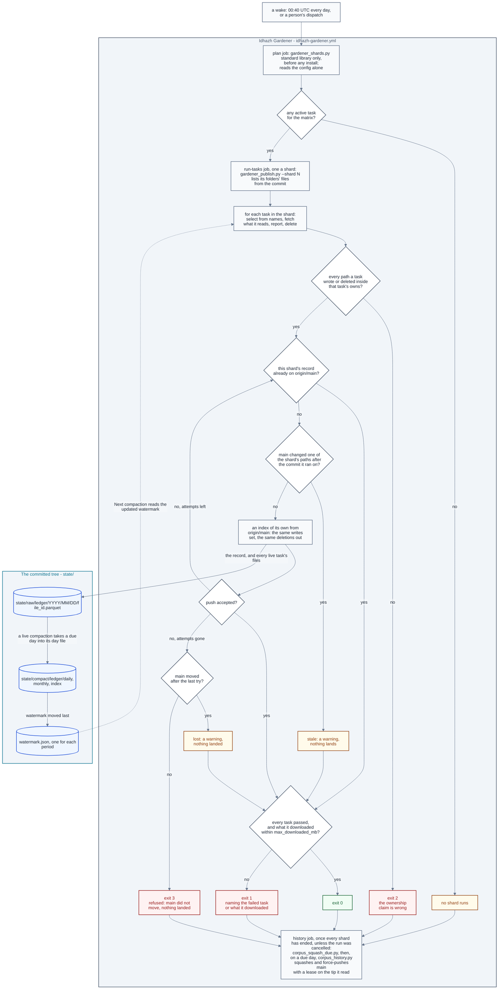

# The gardener

**Last Updated**: 2026-10-04

How the one program that deletes and rewrites what this repository keeps is put
together: where its tasks come from, how a wake is split into shards, what a
shard checks before and after its tasks run, how its one record lands on
`main` however many shards race it, and how a retention task folds the closed
days of a CSV day tree into one file each. What each knob means is
[../../concepts/config/idhazh-gardener.md](../../concepts/config/idhazh-gardener.md);
the workflow that wakes it is `.github/workflows/idhazh-gardener.yml`, once a
day at 00:40 UTC or when a person dispatches it.

## What runs

The gardener runs **tasks**. A task is two things that land together:

- **a declaration**, one file under `config/gardener/`, named for the task. It
  says what the task owns, how far back it keeps, whether it may delete at all
  (`dry_run`), and which kind it is;
- **a module** under `backend/idhazh/gardener/tasks/`, holding exactly two
  names: `KIND`, the kind it serves, and `run`, which takes a `TaskContext` and
  returns a `Pass`.

`config/idhazh_gardener.json` names the complete task list. For each listed
task, `registry.discover()` imports only its named module and the shared module
for its kind as a fallback. `registry.bind()` selects the named module first.
A config value never names a module, so text in a file cannot choose which
code runs (Guardrail #11).

**The named list is the task set.** The loader opens only the declaration files
named in `config/idhazh_gardener.json`. An unrelated file in `config/gardener/`
cannot change which tasks a wake plans.

## A wake, in order

| Step | Job | Who | What it does |
| --- | --- | --- | --- |
| 1 | `plan` | `backend/utilities/gardener_shards.py` | Splits the active tasks into shards and prints the plan. Standard library only, reads `config/` alone |
| 2 | `run-tasks`, one job a shard | `backend/utilities/gardener_publish.py --shard N` | Loads the named declarations, selects each task's fixed UTC period window, and lists the name and size of files only at those named paths in the commit; it then finds the modules and runs the pre-flight |
| 3 | `run-tasks` | the runner | Runs every task of the shard, one after another, timing each. A task fetches the day or month folders it reads before it opens them |
| 4 | `run-tasks` | the runner | Holds every path each task touched to what that task owns |
| 5 | `run-tasks` | the runner | Writes the shard's one record through `ledger.persist`, and hands back what to land |
| 6 | `run-tasks` | `gardener_publish.publish` | Builds one commit of exactly what the shard wrote and deleted, pushes it, and tries again on a newer tip if the push failed. Lands nothing when `main` changed one of those paths after the commit the shard ran on |
| 7 | `history` | `backend/utilities/corpus_squash_due.py`, then `backend/utilities/corpus_history.py` | Once every shard has ended, unless the run was cancelled: reads whether the corpus squash is due and, on a due day, squashes the old history and force-pushes `main` with a lease on the tip it read, squashing again on a new tip when the push is refused |

**The split is round-robin over sorted names.** Every task the matrix runs - an
active one whose kind is not `history`, which has a job of its own - is sorted by
name and dealt to shard `position % shard_count`, where `shard_count` is the
smaller of `shards` and the number of tasks. The same declarations always give
the same shards, no shard is empty, and every task is in exactly one. How much
work a task holds is not read: one owned folder can hold one file or ten
thousand, so counting folders would balance nothing.

**A shard checks out only its code and config, and lists the rest from the
commit.** `gardener_publish.py` reads, in one `git ls-tree -r -l` over the commit
with lazy fetching off, the name and size of every file under the folders the
shard's tasks own or read - and under the folders the complement task sweeps,
which only the commit can name - and downloads none of them. A file's size is
git's where the clone holds the file. For one it never downloaded git prints no
size, so GitHub's trees API is asked once for each listed folder, and its sizes
are matched to git's names by blob id; a name left with no size is refused, and
no task runs. So what a shard's listing costs grows with the number of names,
not with what the files weigh.

**A task decides from those names and fetches only what it reads.** A task that
decides from the date in a path downloads nothing, and its deletions land from
the names alone. A task that reads a file's content - a compaction packing a
day, the census summary reading a month - first widens the checkout by exactly
the day or month folders that step reads, in one `git sparse-checkout add
--stdin`, which a partial clone serves with one download. A file the commit
holds is on disk after that or the task fails: it is never taken for a member
that is not there. After each task the listing takes in what that task deleted
and wrote, so a later task of the shard that reads the same folder sees the
tree the shard will commit, and never fetches a file an earlier task deleted.

**A task is handed the folders it walks, and never lists `state/` itself.**
`gardener_publish.py` reads, in one `git ls-tree` with no recursion, which of
the folders the shard's tasks own or read the commit holds, and every folder
directly under `state/`, and the runner turns that into
`TaskContext.owned_folders` before any task runs. A folder the commit holds is
walked whether the checkout holds it or not, because its names come from the
commit. A declared folder the commit does not hold yet - a ledger's
`state/compact/` folder before its first day is packed - is left out and
logged, and the task's first write makes it. A complement task's folders come
from the commit alone, so a folder somebody left in the checkout and never
committed is not the sweep's to take, and `idhazh gardener run-task`, which
starts no process and so reads no commit, refuses one by name. A folder a task
reads and does not own is declared under `reads`; asking about a folder it
neither owns nor reads is refused rather than answered empty, and so is asking
for every file under a folder no step named, nor a folder above it, rather than
answered with the named periods inside it. A step that chooses its periods as
it runs - the compaction's month step - names them first, and the shard lists
them from the same commit then.

**The plan is written twice.** The plan job runs before anything of ours is
installed, so `gardener_shards.py` cannot import the typed planner in
`idhazh.gardener.shards`. The two emit one payload for one config, byte for byte,
and `backend/tests/contracts/test_gardener_plan.py` holds them to it and to the
`GardenerPlan` model. With no task for the matrix the payload is the empty
shape, on one line:
`{"any_active_task":false,"matrix":{"include":[]},"shard_count":0,"shards":[]}`.
The workflow reads three of those keys - `any_active_task`, `shard_count` and
`matrix` - and `backend/tests/contracts/test_gardener_plan_matrix.py` fails if
it reads a key the model does not declare. Each leg of `matrix` carries its
shard's number and task names, and the `run-tasks` job's name lists them, for
example `shard 0: compact-feed-health, traces`, so a run's page shows what every
shard ran without opening a job; the workflow holds that format and never a
list of tasks.

**The job graph.** Three jobs, in order. `plan` prints the shards, one
`run-tasks` job runs each shard - all of them at once - and `history` runs the
corpus squash after them. The squash is not in the matrix: it rewrites `main`,
so it runs alone, once every shard has ended. Every task in the matrix only
reports today; the squash is the one task that changes anything.



**The squash runs unless the run was cancelled.** The history job waits for
every `run-tasks` shard to end, so history is still rewritten last, and then runs
on `if: ${{ !cancelled() }}`. A red shard does not hold it off: that shard's push
has already ended, and its work is tried again at the next wake either way. A
failed `plan` job, which skips every shard, does not hold it off either, and a
person's cancel still stops it. The person's ruling, 2026-09-29. It replaced
`always() && (needs.run-tasks.result == 'success' || needs.run-tasks.result == 'skipped')`,
under which a task that failed at every wake - a compaction that meets a hole, a
shard over its ceiling - held off every squash until a person acted.

**The history job writes its record with the plan job's run id**, so every
record of one run carries one id even when the run crosses 00:00 UTC, and the
job makes an id from its own UTC day only when a failed `plan` job left none.

**The push carries a lease, and a refused push squashes again.**
`corpus_history.py` pushes with `--force-with-lease=refs/heads/main:<tip>`,
naming the tip it read before it rewrote anything, so git refuses the push if
another run landed a commit meanwhile. The program then waits
`push_retry_delay_seconds`, fetches `main`, and runs the whole squash again on
the new tip, which replays the other run's commits with the rest. It never
pushes the refused rewrite again. After `push_attempts` pushes in all it stops,
unstamped, and the squash is due again at the next wake. The person's ruling,
2026-09-29.

**The first squash that rewrites history is due about 2026-10-29, and a person
reads two things in its log.** No squash has collapsed a commit yet, so neither
has been seen on a runner. The replay is a rebase, and a rebase flattens merge
commits; the history it replays holds merge commits, six from September 2026.
If one carried a change of its own, the replayed tree differs from the tip and
the program stops with exit 2 before any push, for a person to decide; a replay
that stops on a conflict ends the same way. And nobody has timed one replay on
`ubuntu-latest`: on the Windows development machine 1,001 commits took 824 s,
and the first squash replays about 4,800, so at that rate one replay alone would
outlast the job (an estimate). Read the replay's time in the history job's log -
a job stopped at its limit means one replay did not fit - and if one replay takes
more than about a third of the job's 30 minutes, about 8 minutes once the clone,
the install and the waits are paid
([the budget](../../concepts/config/idhazh-gardener.md#the-history-declaration-corpus-squash)),
lower `push_attempts` or raise the job's `timeout-minutes`.

**`digest.yml` is not on this picture, and that is the point.** It writes
today's rows, and every day the gardener acts on ended at least a whole day
before, so a digest run and a gardener wake never want one file. A re-run is the
one writer into an older day, and a compaction takes its file at the next wake
([A day](ledger-compaction.md#a-day)).

## What stops a shard

| Exit | What it means | Retried |
| --- | --- | --- |
| 0 | every task ran and the record landed, or had already landed. Also 0, with a warning, when nothing landed because the shard's work is out of date: `main` changed one of its paths after the commit it ran on (`stale`), or every try failed and `main` moved after the last one (`lost`) | a `stale` or `lost` shard's work is done again at the next wake |
| 1 | a task failed - its row says `failed` and its siblings still ran - or the shard's tasks downloaded more than `max_downloaded_mb`, and either way the record still landed; or the files under the shard's folders could not be listed, and then no task ran and nothing landed | at the next wake; a download over the ceiling goes on failing until a person acts |
| 2 | ownership or integrity: a module that cannot serve, a history task handed to the runner, a path outside what a task owns, a record outside the gardener's ledger, one record path with two sets of bytes, or a deletion of a file the commit did not list | never; a person fixes it |
| 3 | `main` refused the push: every try failed, and `main` did not move after the last one (`refused`) | at the next wake |

A shard reports the worst code it earned, in the order 2, 3, 1, 0.

**The pre-flight is the two refusals that need the modules.** A declaration no
module serves, and a module no active or paused declaration uses, are both exit 2
before any task runs. A module whose `KIND` disagrees with the declaration it
would serve is refused the same way, because it would be handed a declaration it
cannot read. So is a module that raises while it is imported, a module that
declares no task, and two modules that would serve one name (`old-days.py` beside
`old_days.py`). None of these is caught and skipped: a skipped task is a task
that silently stopped deleting.

**A history task handed to the runner is refused before anything runs.** The
only program that runs one is `backend/utilities/corpus_history.py`, which binds
the task itself and runs its git in the history job. A history task run through
`idhazh gardener run-task`, or put in a shard, would record the squash as done -
stamping `last_run` - without squashing anything, and put the next real squash
off by a whole `every_days`. So the runner exits 2 and names that program, and
nothing runs. `lifecycle_status: paused` is how a person holds the squash back.

**Every path a task touched must sit inside what it owns.** What it took and
what it wrote are both checked, on a dry run too, because the check reads the
selection rather than what was deleted. The complement form owns every folder
under its roots that no other task owns, whatever that task's status, and that
no ledger family or ledger root claims. A collection task is checked on what it
wrote alone: what it takes lives on GitHub. The record the shard writes is the
one write no task owns.

**A report a task files is held to the ledger it appends to, not to what it
owns.** A declaration's `appends_to` names the ledgers a task may file a report
of its own into, through the ledger door: `visual-prune` files one
`visual-prunes` row a pass, whatever it found. Each report must be a fresh raw
file of one of those ledgers under the wake's day, or the shard stops before
anything is staged, the way it stops for a path outside what a task owns. A
report lands on a dry run too, because what a dry run found is the thing it
exists to report; every deletion it named is still held back.

## What a shard downloads

**Every row carries two weights.** `cone_bytes` is what the folders the shard's
tasks own weighed at the commit it checked out - the listing's sizes added up -
whether or not a task downloaded any of it. `downloaded_bytes` is what the
shard's tasks downloaded to read: the content of every file a widening brought.
The code folders every shard checks out - `config/`, `backend/` and `.github/` -
are in neither: they are the same in every shard, and they grow with code rather
than with what the pipeline keeps.

**Over `max_downloaded_mb` the shard still runs its tasks and lands its record,
then exits 1.** The number is an alarm, not a stop: the downloads are paid for
by the time the number is known, and stopping would only stop the passes that
make the tree lighter - a live task's deletes - and the dry-run rows a person
reads before turning a task live. The message names the three folders the
shard downloaded most under. `idhazh gardener run-task` starts no git process,
so a hand run records both weights as empty and is never over.

**128 MB is the committed ceiling, and it is an estimate.** A megabyte here is
1024 x 1024 bytes. A shard downloads only what its tasks read: the days and
months a compaction packs, the months the census summary summarises. Measured
on the development machine on 2026-09-30, a month of the eval ledger is 31
files and 3.5 MB, so 128 leaves room for a compaction that catches up on
several months at once. Move it to about twice the largest `downloaded_bytes`
of the first thirty scheduled wakes. A month file sits in its year folder, so a
step that reads one month file fetches every month file of that year beside it,
up to twelve: a later row can move the month files into folders of their own if
the readings show that cost.

## The record

One record per shard, always. Every task adds its row - a
[`CollectionPruneRow`](../contracts/state-ledgers.md#the-gardener) - a dry run
included, so a shard of nothing but dry runs still writes one file and still
pushes it. The record goes through the ledger door into the gardener's own ledger,
`state/raw/gardener/<YYYY>/<MM>/<DD>/<file_id>.parquet`, and the runner refuses
it with exit 2 if it went anywhere else.

Each row names the run that wrote it: `run_id`, `attempt`, `job` and `shard`, the
task's own `duration_ms`, and `work_ended_at`, the instant the shard finished
working and began to publish. A slow push is therefore never read as a slow task.
Each row also carries `cone_bytes`, what the shard's owned folders weighed, and
`downloaded_bytes`, what its tasks downloaded ([above](#what-a-shard-downloads)).

## Landing the commit

`backend/utilities/gardener_publish.py` is the only code that pushes. It is the
entry point a shard runs: it reads the commit the checkout is at, calls the
runner, and lands the `Shard` the runner hands back - the record, every path the
shard's live tasks and live folds wrote and deleted, every report any of its
tasks filed, and the commit message. Each attempt fetches `main` and builds the
commit in an index file of its own: `main`'s tree read in, each write's new
content set, each deletion taken out by its name. So a file the checkout never
downloaded is deleted as easily as one it holds, and the checkout's own index is
never expanded. It checks what it staged, writes the tree and a commit on top of
`main` as `miztiik <miztiik@users.noreply.github.com>`, and pushes that commit as
whole objects: a delta against a file the clone lacks could only be computed by
downloading the file, and with lazy fetching off the push would fail instead.
Every git call but the one that widens the checkout runs with lazy fetching
off, so a call that would download a file fails rather than pays for it
quietly. A failed push waits a random time - up to 1, 2, 4, 8 and then 8 seconds -
and tries again on the new tip. No wait follows the last attempt. A deletion of
a file the commit did not list lands nothing, and the shard exits 2: a task
decided it from something other than the commit.

**The record decides whether the shard already landed.** Its bytes are unique to
the shard, so `main` holding that path with those bytes means an earlier attempt
landed and this one stops with 0; the same path with other bytes is exit 2.

**A shard whose paths `main` changed lands nothing.** After each fetch the
publisher compares the commit the shard ran on with `main`, over every path the
shard writes or deletes but its record, with `git diff-tree -r --no-renames
--name-only`, in groups below Windows' command-line limit. A path it lists is one
`main` changed after the shard's commit, so the shard's version of it is older
than `main`'s. A re-run is the usual cause: it checks out its run's commit again,
after later runs have landed, and it names its record afresh, so the record check
above cannot catch it. Nothing lands, not even the record. The shard writes a
warning naming the first such path and exits 0, and the next wake does the work
again on the new `main`. The comparison reads trees only, so the clone downloads
no file for it.

**When every try failed, `main`'s tip says why.** The publisher fetches `main`
once more after the last try. If `main` moved after the last try's base, other
writers are landing: the shard writes a warning and exits 0, and the next wake
does the work again. If it did not move, `main` refused this push, and the shard
exits 3 and its job is red. The publisher never reads the push's error text,
because git's words change with versions and languages. A GitHub outage through
every try reads as a refusal, so it costs one red job.

**Each way a shard comes to rest has one word.** Its log line names it:
`landed`, `already-on-main`, `stale`, `lost` or `refused`. The words live in
`backend/idhazh/contracts/shard_landing.py`. They are not persisted: the record
lands inside the commit, so it cannot say how that commit landed.

**Three checks run over what was staged, before every commit.** Nothing outside
the shard's writes and deletions is staged. Every write is staged, unless its
bytes already equal `main`'s, which is a write that already landed. And a
deletion that staged nothing is an error only while `main` still holds the
path, because a path already gone is a deletion somebody finished. A write or a
deletion that names a folder is refused before anything stages. A write a
`.gitignore` pattern matches is not staged unless `main` already holds it - the
rule `git add` keeps - so the second check names it.

**`idhazh gardener run-task` never pushes.** It runs the same tasks and writes
the same record into the checkout, and stops there, so running a task on a
developer's machine cannot reset their branch or push to main. It takes the
commit as `--git-sha`, because the package does not start git to read it. The
utility takes the same line without that flag, and both are built from one
parser in `idhazh.gardener.cli`.

Scheduled retention tasks inspect the period that just expired plus the
configured earlier periods, using UTC dates. Their counts describe only those
named periods. To drain an older backlog, run one task with an inclusive range:

```text
idhazh gardener run-task NAME --from YYYY-MM-DD --to YYYY-MM-DD ...
idhazh gardener run-task NAME --from YYYY-MM --to YYYY-MM ...
```

The task's window decides whether the endpoints must be dates or months. The
range is accepted only for one named task, never a scheduled shard. Run the
operator pass once for each backlog range. If an older backlog exists when a
fixed window is introduced, drain it once with a known inclusive range; the
scheduled task does not scan the archive to discover it. The next scheduled
wake returns to its fixed window.

## The collection tasks

**Two tasks delete what GitHub keeps for this repository rather than what it
commits**: `workflow-artifacts` and `workflow-runs`, one declaration each, both
served by `backend/idhazh/gardener/tasks/collection.py` through their kind. A
declaration names its collection in `collection`, and the loader refuses one
whose file is not named for it, so two declarations cannot take from one
collection. The task lists its collection through
`backend/idhazh/gardener/github_collections.py` and deletes one member at a
time, oldest first, up to `max_deletes_per_run`, through the same core every
ledger prune uses ([../../concepts/atomic-deletes.md](../../concepts/atomic-deletes.md)).

**It owns no folder and writes nothing but its row.** `owns` is empty, so it
adds nothing to its shard's checkout. The repository comes from
`GITHUB_REPOSITORY` and the token from `GITHUB_TOKEN`, both set by Actions; a
missing one fails that task by name, and its siblings still run. The
`run-tasks` job holds `actions: write` for these two, so turning one live is a
config change. Both ship `dry_run: true`: a wake lists what the window selects
and deletes nothing. How to read the list and turn one live is
[../../how-to/prune-a-collection.md](../../how-to/prune-a-collection.md).

## The compaction

How a ledger's daily, monthly and yearly files are packed and dropped, by one
compaction task a ledger, is [ledger-compaction.md](ledger-compaction.md).

## The closed-day fold

**A CSV day tree files one file per writer, and a closed day folds into one.**
`state/<tree>/<YYYY>/<MM>/<DD>/` holds one CSV per writer -
`<run_id>-<attempt>-<job>-<shard>.csv` - which is what lets two jobs push at
once, and it leaves about a hundred small files in a busy day. Once the day is
closed, `backend/idhazh/gardener/closed_day_fold.py` reads it through the
settlement every reader uses, writes the answer as `settled.csv`, and deletes
the files it read. It changes no answer a reader gets
([../../concepts/partitions.md](../../concepts/partitions.md)).

**The retention task that owns each tree folds it**, when its declaration
carries a `fold` block. No current task carries one: feed-health now uses the
ledger door, so it is not a CSV day tree. A future fold can run only for
a ledger registered in `DAY_TREES`, and the task that owns that tree must own
its folder. Which trees a task folds is read from the folders it walks, so one
job writes each tree a wake and no tree is checked out twice. Other ledgers
under `state/raw/` are packed by their own compaction tasks.

**A task may settle a closed month whole.** With `fold.settles_months`, once a
month's last day is closed - `fold.after_days` whole days after the month ends -
the fold settles every file of that month, each day's writer files and settled
files alike, into one `settled.csv` in the month's own folder,
`state/<tree>/<YYYY>/<MM>/settled.csv`, and deletes what it read. A day of a
closed month is the month's from then on, and a file a re-run adds to it later
is settled in at the next wake. No current task enables this option.
A month's rows name no day, so the loader refuses the switch beside a window of
days, which would take the month's file whole once its first day aged out.

| Step | What happens |
| --- | --- |
| 1 | The task's window runs first, dry or live, and returns what it took |
| 2 | The runner calls the fold, unless the window failed - then the fold waits a wake, and the row's fold cells stay empty |
| 3 | The fold lists only its fixed day and month windows, then takes each closed period that still holds a writer file. `fold.after_days` sets when a period closes; `fold.settles_months` settles a closed month whole and leaves its days to it |
| 4 | It skips a day folder the window took, or would take on a dry run, and a month holding one: a shard refuses a path it both writes and deletes |
| 5 | It settles each month, then each day, writes `settled.csv` in its folder and deletes the rest - or, on a dry run, reads and settles each one and changes nothing |

**The fold lands on its own switch.** `fold.dry_run` is the fold's, apart from
the window's `dry_run`, and the runner lands the fold's writes and deletions
whenever the fold is live - a live fold inside a dry task would otherwise change
the disk and stage nothing. Every path the fold touches is held to what the task
owns, like every other. The feed-health fold runs live while its age-deletion
window only reports.

**The row says what the fold did.** `fold_dry_run`, `folded_days`,
`folded_months` and `folded_files` sit on the task's own row beside the window's
`dry_run`, `deleted` and `bytes_freed`, and are empty when the fold did not run.
`folded_months` counts the closed months settled whole, 0 where none was, and
`folded_files` counts every file a month or a day replaced. A fold that stops
part way - a row that will not read, a stray file - keeps the months and days it
settled, turns the row's `stopped_because` to `failed`, and the task exits 1.

**A re-run that lands after a fold is folded in at the next wake.** Its writer
file sits beside the day's `settled.csv`, or in a day of a settled month, and the
next fold reads it with the settled file it joins. One that
lands while the fold's push is still trying survives too: each try stages the
fold's own paths on the new tip, and the re-run's file is not one of them.
Staging names a deleted file as deleted even where git would call the pair a
rename - a day of one writer file settles to nearly the same bytes, and a
deletion read as a move would look unstaged and stop the shard.

## Design rationale

**2026-09-27: `attempts` must be above `shards`.** Every shard of one wake pushes
to one branch at once, so the shard that lands last has lost a race to every
other shard first. `attempts - shards` is how many pushes from outside the wake,
or failed pushes, one wave can absorb. The committed pair is 6 and 5; the
longest a shard can wait is about 23 seconds of backoff, about 40 seconds in all,
an estimate (Fowler and Carmack).

**2026-09-27: the split is round-robin, and history is not in the matrix.** The
plan job reads `lifecycle_status`, `kind` and `owns` and nothing else. A key
that placed one task after another was considered and dropped: nothing else in
the design orders tasks, and it would make the split depend on something other
than the names (Fowler and Carmack).

**2026-09-27: the hand-run collection utility writes no record.**
`backend/utilities/prune_artifacts.py --record` wrote one pass to a file nothing
read. A record now names the run, attempt, job and shard that made it, and a pass
a person runs by hand is none of those, so the flag went rather than invent an
identity (Fowler and Carmack). On 2026-09-28 the utility went too: both
collections are gardener tasks, and a hand run is `idhazh gardener run-task`.

**2026-09-27: the commit loop lives outside the package.** The loop runs git,
and `backend/tests/test_canaries.py` refuses `subprocess` anywhere under
`backend/idhazh/`: the package that reads the open web holds none of the
machinery an injected instruction would need to act (CLAUDE.md Guardrail #11).
Every other git call in this repository already lives under `backend/utilities/`
for the same reason. So the runner writes the record and hands back the paths,
and `gardener_publish.py` reads the commit, calls it and lands them. A task that
must run git itself has the same limit, and the corpus rewrite is the one that
does: `backend/utilities/corpus_history.py` runs its git - the boundary, the new
root, the replay and the push - in the history job, and binds the
`corpus-squash` task through the registry only for the step that needs none,
recording the run. It never lands through `gardener_publish.py`, whose reset to
`origin/main` would throw the rewrite away.

**2026-09-30: the alarm is on what a shard downloads, and it is 128 MB.** Over
it, a shard still runs its tasks and lands its record, then exits 1: stopping
first would stop the deletes that make the tree lighter, and the downloads are
paid for by then. Until 2026-09-30 the alarm was on what a shard's owned folders
weighed, `max_cone_mb` at 768, because a shard checked those folders out whole.
A shard now checks out only its code, so that weight costs no download and
cannot be the alarm; it stays on every row as `cone_bytes`, and what the shard
paid is `downloaded_bytes`. 128 is an estimate, to move to about twice the
largest reading of the first thirty wakes (Carmack on the figure; Fowler on the
record's shape).

**2026-09-28: the weight is `cone_bytes`, in whole bytes, and empty when nobody
weighed it.** `bytes_freed` in the same row is bytes, a byte count is exact, and
0 is a real reading, so "not measured" is empty rather than 0 (Fowler and
Carmack). `downloaded_bytes` follows the same rule.

**2026-09-28: a collection declaration names its collection.** A typed
`collection` key, checked against the file name at load, is the shape a
compaction's `ledger` key already has, so the task never parses its own name and
`TaskContext` gains no field for one kind. The window counts whole days, because
that is what the core counts (Fowler and Carmack).

**2026-09-28: the runner refuses a history task.** Run anywhere but
`corpus_history.py`, it stamps `last_run` without squashing and puts the next
squash off a whole cadence. Nothing is lost: `lifecycle_status: paused` holds the
squash back, and `dry_run: true` rehearses it (Fowler and Carmack).

**2026-09-28: each job holds only the permissions its own steps use.** `plan`
reads; `run-tasks` writes contents and Actions, for its record and the two
collection tasks; `history` writes contents and never calls the Actions API. A
job's `permissions` replace the workflow's, so each job lists its whole set, and
`backend/tests/workflows/test_gardener_workflow.py` pins all three (Fowler and
Carmack).

**2026-09-28: the history job checks out `main`, both times.** A checkout takes
the commit the run was created at unless told otherwise, and the shards push
after that. `corpus_history.py` pushes with a lease on the tip its checkout
holds, so without `ref: main` the first push of every due wake would be
refused and the squash done a second time (Carmack).

**2026-09-30: a shard checks out only its code, and lists the rest from the
commit.** A shard used to check out every folder its tasks owned, and most of it
was never read: 33 MB of the heaviest shard's 48 MB was `frontend/public/digest`,
which its task decides on from the dates in the paths. Names now come from one
`git ls-tree -r -l` over the commit; sizes from git where the clone holds the
file, and from GitHub's trees API, matched by blob id, where it does not; and a
task fetches the day or month folders it reads before it reads them. Content
arrives by whole folder, one widening a step, because every reader opens a
path: reading blobs one at a time through `git cat-file` was rejected. The
folders the complement task sweeps come from the commit the same way, so no
folder is added to the checkout for it (the person's answer; Fowler and
Carmack).

**2026-09-30: the commit is built in an index of its own, and pushed whole.**
`git reset --mixed origin/main` reads the files whose entries it changes: with
lazy fetching off it fails once `main` has moved, and with it on it downloads
them. So each try reads `origin/main`'s tree into a separate index, sets the
writes and takes the deletions out in one `git update-index --index-info` call,
writes the tree with `--missing-ok`, and pushes the commit with `--no-thin`: a
thin push under the flag was refused by the remote, because its deltas point at
files the clone lacks. Every command on that index runs with the checkout's
sparse patterns off, because git applies them to any index it reads, and that
reads files the clone never downloaded (Carmack).

**2026-10-04: a stale shard lands nothing, and `main`'s tip tells a lost push
from a refused one.** The publisher used to check only whether `main` held the
shard's record. A re-run checks out its run's old commit and names its record
afresh, so it landed its old indexes over newer ones, and the next wake read a
ledger that had forgotten work. Now a shard whose paths `main` changed after its
commit lands nothing, not even its record, and the next wake does the work again
on the new `main`. Two other answers were rejected. Refusing every re-run of an
earlier day's run misses a stale re-run on the same day, and refuses a good one
whose paths nobody touched. Running the tasks again inside the push loop repeats
minutes of work, and the downloads, on every lost try. When every try fails,
whether `main` moved decides between a warning and a red job. Reading git's
error text instead was rejected: it is not a contract, it changes with versions
and languages, and a misread is silent (Fowler).

**2026-09-30: a task names the folders it only reads.** The census summary finds
its due months in the item-health census, which the census compaction owns, and
from another shard it saw no census, found no month due and reported success.
`reads` lists those folders for it in any shard; a folder a task neither owns
nor reads is refused when it asks; and the runner still refuses any write or
deletion outside what a task owns. The summary reads both item-health folders,
the raw days and the compact files, because a month may sit in either (Fowler).

**2026-09-30: a later task of a shard sees what an earlier one changed.** Two
tasks of one shard can share a folder now, one owning it and one reading it. A
listing read once would hand the reader files the owner had already deleted, and
the reader would fetch them and fail. So the listing takes in each task's writes
and deletions, and a fetch widens the checkout only by the folders that bring a
file it lacks.

**2026-09-28: the task that owns each CSV day tree folds it, on a switch of its
own.** A fifth task kind was considered and dropped: it would put five of six
folds in a different shard from the tree they fold, so a tree would be checked
out twice. One switch for window and fold was dropped too: the fold runs live
and every window reports, so one `dry_run` would record a deletion as a dry run.
The runner calls the fold rather than each task module, so a module cannot
forget a fold its declaration asks for, and a failed window stops that wake's
fold, because what it took is then a list nothing has checked (Fowler and
Carmack). A day is closed one whole day after it ends, the compaction's rule: of
755 writer files filed from 2026-09-22 to 28, the latest landed 0.9 hours after
its day ended (Carmack's reading).

## See also

- [../../concepts/config/idhazh-gardener.md](../../concepts/config/idhazh-gardener.md) - every knob, and every refusal the loader makes.
- [ledger-compaction.md](ledger-compaction.md) - how a ledger's daily, monthly and yearly files are packed and dropped.
- [committing.md](committing.md) - how every other job commits, and why the gardener stages its own files.
- [../contracts/state-ledgers.md](../contracts/state-ledgers.md) - the gardener's ledger, and what one of its rows holds.
- [../contracts/ledger-registry.md](../contracts/ledger-registry.md) - the grain that ledger files at, and the builders that refuse it.
- [../contracts/persistence.md](../contracts/persistence.md) - the two roots a compaction writes under, and how a ledger is read back from every kind of file.
- [../../concepts/atomic-deletes.md](../../concepts/atomic-deletes.md) - what one delete at a time buys.
