# Ledger compaction

**Last Updated**: 2026-10-05

How a ledger's daily, monthly and yearly files are packed and dropped. The
gardener runs a compaction like any other task; how a wake runs its tasks and
lands what they wrote is [idhazh-gardener.md](idhazh-gardener.md).

**A compaction moves one ledger's rows out of the many small raw files its
writers leave, into one file a day and then one file a month, and deletes what
it moved.** Where its declaration asks, it then packs each finished year's month
files into one file a year. A raw file holds one writer's rows for one day, so a
ledger gains a file on every run, and at a few rows a file a parquet file is
mostly its footer.
One task a ledger does the move: `config/gardener/compact-<ledger>.json`, served
by `backend/idhazh/gardener/tasks/compaction.py` through its kind, so another
ledger is one declaration and no Python. The declarations that ship are in
[../../concepts/config/idhazh-gardener.md](../../concepts/config/idhazh-gardener.md#the-compaction-declarations-that-ship).
**Every ledger the console reads packs live.** The console reads packed files
and nothing newer, so a finished day reaches it within about 48 hours while
the daily wakes succeed. `item-health` and `host-fingerprint` pack a month
31 days after it ends; `summary-quality-evals` and `feed-health` wait 45 days.
Report-only packing cannot refresh a packed-only reader.
**`summary-quality-evals` keeps every month: its `monthly_window` is `forever`, so it may pack
the eval rows and never drops a month** ([below](#design-rationale)). It packs
each finished year into one year file, as every ledger whose declaration sets
`monthly_keep_days` does ([A year](#a-year)). The files it
writes are laid out in
[../contracts/persistence.md](../contracts/persistence.md#the-two-roots), and
its knobs are in
[../../concepts/config/idhazh-gardener.md](../../concepts/config/idhazh-gardener.md#the-compaction-declarations-that-ship).

```mermaid
%%{init: {"theme": "base", "htmlLabels": false, "themeVariables": {"background": "#ffffff", "primaryColor": "#f8fafc", "primaryTextColor": "#1f2937", "primaryBorderColor": "#64748b", "lineColor": "#64748b", "textColor": "#1f2937", "clusterBkg": "#f1f5f9", "clusterBorder": "#64748b", "titleColor": "#1f2937", "edgeLabelBackground": "#f8fafc", "fontSize": "14px"}}}%%
flowchart TB
  subgraph REFRESH["Content refresh - digest.yml"]
    W["work and assemble, and a re-run of either<br/>one raw file per writer per day"]
  end

  RAWF[("state/raw/ledger/YYYY/MM/DD/file_id.parquet<br/>written once, many writers")]

  subgraph GARDEN["Idhazh Gardener - the run-tasks job, gardener/tasks/compaction.py"]
    DROP["1 and 2. drop the oldest months past the keep line,<br/>at most max_periods_per_run, with their raw days,<br/>or only name those while month_deletes_dry_run is true"]
    YDONE{"a year chosen for this wake?<br/>after the yearly mark, monthly_keep_days<br/>since it ended, its next January closed"}
    YWAIT["the year waits for a later wake,<br/>or the declaration packs no year"]
    YHOLE["a month of it is named nowhere:<br/>refused by name, exit 1"]
    PACK["3. plan year files, one row group a month,<br/>or an empty entry:<br/>indexes and deletes wait for the end of the pass"]
    MDONE{"a month chosen for this wake?<br/>after the monthly mark, daily_keep_days<br/>since it ended, its last day packed"}
    MWAIT["not yet, or a raw day still waits in it:<br/>the month waits for a later wake"]
    MREC["each day from the ledger's first:<br/>a day no index names is adopted<br/>from its own file, or listed lost"]
    ABSORB["4. plan month files, or an empty entry:<br/>indexes and deletes wait for the end of the pass"]
    DDUE{"a day chosen for this wake?<br/>after the daily mark, compact_after_days<br/>since it ended, at most max_periods_per_run"}
    DHOLD["the day waits for a later wake:<br/>a run may still be writing, or the cap is used"]
    TAKE["5. plan day files, or an empty entry,<br/>after each packed day a re-run wrote into:<br/>indexes and deletes wait for the end of the pass"]
    DRY{"dry_run?"}
    REPORT["report every path, land the record only<br/>the three report-only compactions"]
    LAND["land every write and delete<br/>in the shard's one commit"]
  end

  DAILY[("state/compact/ledger/daily/YYYY/MM/DD.parquet<br/>index/daily.json, daily/watermark.json")]
  MONTHLY[("state/compact/ledger/monthly/YYYY/MM.parquet<br/>index/monthly.json, monthly/watermark.json")]
  YEARLY[("state/compact/ledger/yearly/YYYY.parquet<br/>index/yearly.json, yearly/watermark.json")]
  READER["ledger_files.py: each date from one file<br/>its year, else its month, else its day,<br/>else its raw files"]

  W --> RAWF
  RAWF --> DROP
  DROP --> YDONE
  YDONE -->|"not yet, or not asked"| YWAIT
  YDONE -->|"a month missing"| YHOLE
  YDONE -->|"yes"| PACK
  YWAIT --> MDONE
  YHOLE --> MDONE
  PACK --> MDONE
  MDONE -->|"not yet"| MWAIT
  MDONE -->|"yes"| MREC
  MREC --> ABSORB
  MWAIT --> DDUE
  ABSORB --> DDUE
  DDUE -->|"no"| DHOLD
  DDUE -->|"yes"| TAKE
  DHOLD --> DRY
  TAKE --> DRY
  DRY -->|"yes"| REPORT
  DRY -->|"no"| LAND
  LAND --> DAILY
  LAND --> MONTHLY
  LAND --> YEARLY
  RAWF --> READER
  DAILY --> READER
  MONTHLY --> READER
  YEARLY --> READER

  classDef stage fill:#f8fafc,stroke:#64748b,stroke-width:1.5px,color:#1f2937;
  classDef decision fill:#ffffff,stroke:#475569,stroke-width:1.5px,color:#1f2937;
  classDef yes fill:#f0fdf4,stroke:#166534,stroke-width:1.5px,color:#166534;
  classDef no fill:#fef2f2,stroke:#991b1b,stroke-width:1.5px,color:#991b1b;
  classDef warn fill:#fffbeb,stroke:#92400e,stroke-width:1.5px,color:#92400e;
  classDef ledger fill:#eff6ff,stroke:#1d4ed8,stroke-width:1.5px,color:#1f2937;
  classDef sysOps fill:#f1f5f9,stroke:#475569,stroke-width:1.5px,color:#475569;
  classDef sysPublish fill:#f1f5f9,stroke:#0e7490,stroke-width:1.5px,color:#0e7490;

  class W,DROP,PACK,ABSORB,TAKE,READER stage;
  class YDONE,MDONE,DDUE,DRY decision;
  class LAND yes;
  class YHOLE no;
  class YWAIT,MWAIT,MREC,DHOLD,REPORT warn;
  class RAWF,DAILY,MONTHLY,YEARLY ledger;
  class REFRESH sysPublish;
  class GARDEN sysOps;
```

**The CSV day trees are not on this path.** A compaction never reads or writes
them; their closed days are folded in place by the retention task that owns each
tree, in [the closed-day fold](idhazh-gardener.md#the-closed-day-fold).

## One pass, in order

| Step | What it does |
| --- | --- |
| 1 | Drops the oldest months past the keep line, at most `max_periods_per_run` of them: every file at each month's paths, then its entry in `index/monthly.json`. While the window only reports, names them and keeps them |
| 2 | Drops, by their listed paths and unread, the raw days past the keep line in the months step 1 drops and in those a first day run looked back over. While the window only reports, names them and keeps them |
| 3 | Packs every year chosen for this wake into its year file, or into an entry with no file, where the declaration sets `monthly_keep_days` |
| 4 | Closes every month chosen for this wake into its month file, or into an entry with no file |
| 5 | Packs every day chosen for this wake into its day file, or into an entry with no file, after each packed day that holds raw files again |

**Every step chooses its own periods.** Before any step runs, the pass chooses
the months step 1 may drop, the years step 3 may pack, the months step 4 may
close and the days step 5 may pack, from the ledger's own indexes and marks and
the wake's UTC day, and logs the choice once as one `periods chosen` line, the
JSON of `PeriodsChosen` (`backend/idhazh/contracts/gardener_events.py`). Step 2
takes the raw days of the months step 1 chose, and of those a first day run
looks back over ([A month past the window](#a-month-past-the-window)). The
listing a wake hands the pass names only the ledger's indexes and watermarks,
so a step reads only the periods it names itself
([idhazh-gardener.md](idhazh-gardener.md#a-wake-in-order)).

**Drops first and days last, because no pass may write a path it deletes.** A
shard refuses a path it both wrote and deleted, so a pass that did either would
stall every wake after it. In this order a year packs month files and a month
absorbs day files that an earlier wake wrote, never one this pass wrote, and a
period whose last part this pass writes is taken at the next wake.

**Every rule counts whole UTC days after a period's own end.** The pass measures
from 00:00 UTC on the wake's own day, so every wake of one UTC day gets the same
answer, and moving a cron changes nothing ([CLAUDE.md](../../../CLAUDE.md)
section 2).

## A day

**A day is due once `compact_after_days` whole days have passed since it
ended.** At one, a wake on the 25th takes the days up to the 23rd, so the 23rd
is the newest due day.

**The day step chooses which days it packs.** It starts at the day after the
daily mark and takes the days up to the earlier of the mark plus
`max_periods_per_run` and the newest due day. With a mark of 16 September, a
cap of 8 and a wake on 4 October, that is 17 to 24 September, and the next wake
starts at the 25th. An operator range limits the days the way it limits the
months ([A month](#a-month)). The step names what it reads of its days - each
day's raw folder and its day file - and the shard lists them from its commit
then ([idhazh-gardener.md](idhazh-gardener.md#a-wake-in-order)).

Days go in order, each on its own. For each one the pass reads every raw file of
the day and settles the rows: one file's rows per work unit - the last file of
its highest attempt - then the first row of each key. It writes the day's day
file and no raw listing.
After all stages decide their files, the pass writes each final index once,
in yearly, monthly, daily order; deletes source files; then writes each changed
watermark once, last. Monthly absorption and new days share one final daily
index. Index bytes grow linearly with the final entry count, not with that count
times the number of days taken. Before the indexes land, source files survive.
After they land, an interrupted pass resumes from the indexed compact files
and any source files left, with no row lost.
The bounded fixture measurement is
[what-a-compaction-pass-costs.md](../../reference/benchmarks/what-a-compaction-pass-costs.md).

**A watermark records what the data covers, never when a job ran.** It names
the newest day taken, so a lost watermark write costs repeated work and never a
skipped day: the next wake finds the mark behind, keeps each day the index
already names that no raw file holds, moves the mark past it, and takes again a
day whose raw files are still there.

**A day with no row is an entry with no file.** A day with no raw files gets an
`empty` entry in `index/daily.json` and no day file. So the newest day the index
names is still the watermark's day, and a reader tells a quiet day from a
missing one without opening anything. Before a day is recorded with no file, its
own day file at its path is adopted, as a month adopts one
([A month](#a-month)): an index restored from an older commit can lose a day
whose file is still there, and recording it empty would lose its rows.

**A day that cannot be read whole is not taken.** A file that is not a ledger
file, or that this build cannot read, stops its day, and so does a day holding
more than `max_raw_files_per_period` files. Nothing of that day is deleted, the
watermark stays before it, and the pass ends `failed` naming it, so the task
exits 1. Every step the pass took before that day still lands.

**A re-run that lands after its day was compacted replaces its first attempt.**
GitHub lets a failed job run again for 30 days, and the re-run writes into the
day its run first wrote. So the day step also names the raw folders of each
packed day from 30 days before the wake to the mark. A packed day that has raw
files again is taken again, before the new days and against the same cap: its
day file is rebuilt from its own rows and the new raw files, settled once. A day
recorded `empty` or `lost` has no file, so it is rebuilt from its raw files
alone. A compact row keeps the identity its raw file gave it, which is what lets
attempt 2 replace attempt 1 even when it filed fewer rows. The watermark does
not move back. **A raw day at or below the mark is taken again however old it
is**, in any month not yet closed: the month step holds such a month until the
day is packed ([A month](#a-month)), so leaving it would hold the month for
ever.

**A first pass starts at the oldest raw day, never on the 1st of its month.** It
looks for that day in the raw folders of the month that holds the newest due
day and the `lookback` months before it, or in an operator range's months.
While month deletes are live it starts no earlier than the keep line, the
oldest month the monthly window keeps. With no raw day there, it packs nothing
and writes nothing. A daily index with no watermark beside it, which a pass cut
before its watermark landed leaves, starts it at the index's oldest day when
that is older. A month the ledger began inside is counted from the ledger's
first day ([A month](#a-month)), so no day before the first is called missing.

## A month

**The month step chooses which months may close.** It starts at the month
after the monthly mark; with no mark, at the oldest month an index names; with
nothing indexed, it takes nothing. It takes consecutive months, each at least
`daily_keep_days` whole days past its end and each one whose last day the daily
mark has reached, at most `max_periods_per_run` of them, and the month after
the last one is where the next wake starts. It reads nothing the planner named
for the other steps, so it is never offered a month from before its ledger
began. An operator range (`--from` and `--to` on one named task, or the months a
migration names) limits the choice, and never makes the step skip a month: a
range that starts after a month ready to close is refused at that month, so the
person widens the range. The step names what it reads of its months - each
month's daily folder, raw folder and month file - and the shard lists them from
its commit then ([idhazh-gardener.md](idhazh-gardener.md#a-wake-in-order)).

**A month is closed whole or not at all, and a missing day no longer stops
it.** A month that a raw day still waits in is held: the day step packs that day
on the same wake, and the month closes at the next. A month accounts for every
day from its 1st, or from the ledger's first day when the ledger began inside
it, so a day before a ledger began is never called missing. A day with a
`packed` entry gives its file's rows; an `empty` day gives none; a `lost` day
is listed in the month's `lost_days`. A day no index names is a hole, and the
pass recovers it instead of stopping:

| # | The hole | What the pass does | Logged as |
| --- | --- | --- | --- |
| 1 | Its own packed file is at its named path | Adopts the file: its bytes from the listing, its rows and envelope from its footer. A file whose envelope names another period is refused by name | `note=index-rebuilt` |
| 2 | Its raw files are still there | Holds the month; the day step packs the day from them, and from its own file when row 1 adopted one first | - |
| 3 | Neither | Lists the day in the month's `lost_days` | `note=recorded-lost` |

A month whose days give no row is an `empty` entry with no file. Only a day is
ever `lost`; a month or a year lists its lost days. Each recovery is one log
line naming its note and its period, and the note words are declared in
`backend/idhazh/contracts/gardener_fault.py`.

**A month's own file is never written over.** A month file at its path that no
monthly entry names is the month's record when its days give no row, and the
month takes its rows and no lost day. It is kept when it holds exactly the rows
its days hold, which is what a pass that stopped before its indexes leaves. When
the two differ, the month is refused by name and waits for a person. A day whose
entry says `packed` while its file is not there is refused as `file-missing`,
and the month waits.

Month files follow the pass-wide write order described above. A pass that stops
before the monthly index lands keeps all daily sources. Once that index names
the month, the next pass keeps its file and removes any remaining daily files
by their calendar dates, even if the daily index already excludes them.
The monthly watermark advances last. A live pass lands all changes in one commit, so no commit on `main`
holds one of the month's dates in both periods, or in neither.
The day files are joined as they are and never settled across days: a key with
no date in it may repeat on two days, and both rows are facts.

**A month file lives exactly `monthly_window` after its month is absorbed.**
Month M goes on the day month M plus the window becomes absorbable, so the
monthly period holds exactly `monthly_window` month files on every day, and the
ledger reaches back `daily_keep_days` further than that. At 13 months and 45
days, January 2026 goes on 15 April 2027, the day February 2027 is absorbed.
When more than `max_periods_per_run` months are past the line at once, the
oldest go first and the rest at the next wakes
([A month past the window](#a-month-past-the-window)).

**Raw files that land in a month already absorbed are refused and kept.**
`daily_keep_days` is at least 31, one day more than GitHub's 30-day re-run
window, so no re-run can land there; a file that does is for a person to read.
The rest of the pass still runs.

## A year

**A year is packed only where its declaration sets `monthly_keep_days`**, how
many whole days after a year ends the ledger waits to pack it. Which
declarations set it is in
[../../concepts/config/idhazh-gardener.md](../../concepts/config/idhazh-gardener.md#the-compaction-declarations-that-ship).
Every other ledger keeps its month files exactly as `monthly_window` says. A
ledger that packs years keeps `monthly_window` forever, because a window would
delete a month file before its year took it, and its year files are kept for
ever. **Each ledger's own declaration sets its wait, a ledger the site publishes
included**: the browser reads a year file by byte range, at an address no
earlier read used
([how-the-query-door-answers-a-panel.md](how-the-query-door-answers-a-panel.md#how-a-year-file-is-read-by-byte-range)),
so no wait has to keep the console's reads away from year files.

**The year step chooses which years it packs.** It starts at the year after the
yearly mark; with no mark, at the oldest year an index names. It takes
consecutive years, each at least `monthly_keep_days` whole days past its end, at
00:00 UTC on 1 January, and each whose December the monthly mark is strictly
past, so its next January is closed too, at most `max_periods_per_run` of them.
A year that is not ready waits for a later wake. An operator range limits the
step to the whole years it holds, January to December, so a ranged pass reads
no month outside the range, and a range that holds no whole year takes no year.
The step names what it reads of its years - each year's month files and its own
file - and the shard lists them from its commit then
([idhazh-gardener.md](idhazh-gardener.md#a-wake-in-order)).

**A year is packed whole or not at all, and a month with no row does not stop
it.** A year accounts for every month from January, or from the ledger's first
month when the ledger began inside that year, so a month before a ledger began
is never called missing. A month with a `packed` entry gives its file's rows,
an `empty` month gives none, and every month's `lost_days` carry into the year's
entry. A year whose months give no row is an `empty` entry with no file, unless
its own file is at its path while no entry names it: that file is adopted
(`note=index-rebuilt`), as a month adopts one ([A month](#a-month)). A month no
index names is refused by name, the yearly watermark stays, and the task exits
1. A year's file covers the whole year, so a reach that counts from the yearly
index starts on its 1 January even when its first rows came later.

**The earliest a year can go is `daily_keep_days` plus 32 days after it ends.**
Its next January is absorbed `daily_keep_days` after that January ends, 31 days
into the new year, and the pass packs years before it absorbs months, so the
year goes one wake later. A smaller `monthly_keep_days` would change nothing, so
the loader refuses one. At a `daily_keep_days` of 45, 2026 is packed on 19 March
2027 at the earliest.

Year files follow the pass-wide write order described above.
The month files are joined as they are and never settled, and the monthly
watermark stays where it is. A pass that stopped before the yearly index leaves
every month file, so the next wake packs that year again. A pass that stopped
after it leaves a year the yearly index already names, so the next wake deletes
the month files still there by calendar month, even if the monthly index no
longer names them, rewrites the monthly index and moves the
watermark, and builds nothing; an `empty` year has no file of its own to look
for. Either way a reader in between reads each month
once: a month both indexes name is read from its year.

**A year file is built one month at a time, one row group a month.** The pass
holds one month's rows at a time rather than the year's, and a reader that
filters on a date can skip the row groups of the other months. A year file over
50 MiB, the size at which GitHub warns about a pushed file, is refused by name
and its month files are kept: GitHub refuses a push that holds a file over
100 MiB, and one that did would stall every later wake.

## A month past the window

**Each month past the window is dropped once, and the monthly index says which
are left.** The keep line is the oldest month `monthly_window` keeps
([A month](#a-month)). The drop step starts at the oldest monthly entry and
takes the entries older than the line, oldest first, at most
`max_periods_per_run` of them, and the next wake starts at the entry after the
last one it took. A month it drops leaves the index, so no later pass looks at
it again, and a month that went past the line while no pass ran is still in the
index for the next one. An operator range only narrows the choice and refuses
nothing, because a month it leaves out stays in the index. The step names each
month's file and raw folder, and the shard lists them from its commit then
([idhazh-gardener.md](idhazh-gardener.md#a-wake-in-order)).

**A month goes whole and by its names, and nothing of it is opened.** The step
deletes every file at the month's paths, in either format and whatever its entry
says, and then the entry. A `packed` entry with no file left is logged as
`fault=file-missing`; an `empty` entry has no file to miss. Then each raw day
past the line goes with every file the listing holds in its folder: the raw days
in the months the step drops, and those in the months a first day run looked
back over and did not take, because it starts no earlier than the line
([A day](#a-day)). A raw file that cannot be read goes with the rest of its
day, so no such file can stop a drop.

## The three indexes, and a file that is missing

**A ledger's three indexes exist together.** Whatever writes one of
`index/daily.json`, `index/monthly.json` and `index/yearly.json` also writes
each of the others the ledger does not have, with no entries, and no pass
deletes one. An empty index truthfully says no period of its kind is packed yet;
a missing one says nothing, so a reader could not tell a lost list from a period
never packed, and would have to ask the site for a file that is not there. A
ledger that holds `daily.json` alone gains the other two, empty, at its next pass
that writes a day. A ledger whose declaration packs no year still has an empty
`yearly.json`, because the console reads all three together
([how-the-query-door-answers-a-panel.md](how-the-query-door-answers-a-panel.md#how-far-a-ledger-reaches)).

**An index its watermark says was packed, and that is not there, stops the
pass by name.** A pass that read it as empty would rewrite it naming only what
this pass packs, and every period packed before would drop out of sight. The task
fails that wake, and a person restores the file from git history.

**A missing file has one of four names**, declared once as `LEDGER_FAULTS` in
`frontend/src/lib/data/slice-shapes.ts`. The backend's copy is `LedgerFault` in
`backend/idhazh/contracts/ledger_fault.py`, and
`backend/tests/contracts/test_frontend_index_shapes.py` holds the two to one list.
The query door carries the name on its answer
([how-the-query-door-answers-a-panel.md](how-the-query-door-answers-a-panel.md#when-a-file-is-missing)),
and the gardener's logs and the backend's own ledger reader print it as
`fault=<name>`, so one search finds a fault on both sides.

| # | Name | What is missing | What the gardener does |
| --- | --- | --- | --- |
| 1 | `not-packed` | `index/daily.json`: no day of the ledger is packed | A first pass writes all three indexes |
| 2 | `index-missing` | `index/monthly.json` or `index/yearly.json`, while `index/daily.json` is there | Writes an empty one when no period of its kind was ever packed; stops the pass by name when that period's watermark says one was |
| 3 | `file-missing` | A file an index names | Refuses the year it would pack, the month it would absorb, or the day it would take again, and keeps every file it would have read; a person restores the file from git history. An `empty` or `lost` entry names no file, so nothing is missing |
| 4 | `day-missing` | A day between the first and the newest packed day that no index names | A month adopts the day's own file or lists the day lost ([A month](#a-month)); a year that would pack a month no index names refuses it |

**Four gaps are expected, and none of them is a fault**: a day newer than the
newest packed day, an entry with `rows: 0`, an entry `empty` or `lost`, and an
index with no entries. None of them makes a reader ask for a file that is not
there.

## What a dry run does, and what the record says

**A dry run does all of the work and changes nothing.** It reads every file,
settles the rows, builds every file in memory, and reports every path a live
pass would write and delete. So the list a person reads before turning a
compaction live is the list the live pass carries out.

**The monthly window has a switch of its own, `month_deletes_dry_run`.** With
it `true`, steps 1 and 2 name every file a live pass would drop at that wake -
the month files and raw days of the months the drop step chose - and keep them,
so the next wake names the same months again; steps 3 to 5 then pack those days
and months like any other, as if the window kept every month, so a first pass
may start before the keep line. `dry_run` still
decides whether anything lands, so a dry run with the window reporting names
what that live pass would do. With it `false`, a pass drops what the window no
longer keeps, as above.

**The record row says what the pass did, or would have.** `deleted` and
`bytes_freed` count the files it deleted. `selected` counts the same files and
every file the monthly window would have deleted that the pass kept because the
window only reports, so `selected` minus `deleted` is what turning the window
live would take at that wake. A raw file the pass packed is deleted either way,
and is counted once. `bytes_freed` is never netted against the files it wrote:
the net is `bytes_freed` minus the `bytes` of the index entries it wrote.
`candidates_seen` counts every raw day folder it listed and every file it read,
weighed or named, so a listing that grows while a compaction only reports shows
in every row. `until` is the newest day that was due. A pass that used its
budget stops `ceiling`, with `resume_from` naming the day, month or year the
next pass starts at; one that refused a period stops `failed`, naming it.

## Design rationale

**2026-09-28: a compaction pass drops, then absorbs months, then takes days.**
The first design took the days and then the months. A shard refuses a path it
both wrote and deleted, and in that order a catch-up pass takes a day and
then absorbs the month that holds it - writing a day file and deleting it in one
pass - which would stall every later wake. The order costs a month one more wake
after its last day is taken (Carmack).

**2026-10-03: the compaction writes no raw listing.** It used to write
`state/raw/<ledger>/index/<YYYY-MM-DD>.json` for each day it took and keep it
90 days. Nothing read it: a browser reads the daily index for a packed day, and
the site build stages its own listing, with sizes, for a day not packed yet. A
re-run is rebuilt from the day file and the new raw files, never the listing.
So the setting that kept them
is gone. A pass lists the raw day folders once, by name, and opens only the
days it takes, so what one pass reads is bounded by its budget rather than by
the backlog (Fowler, Carmack).

**2026-10-04: the leftover listings were deleted in one commit, and the code
meant to delete them is gone.** The 2026-10-03 change made each pass delete
every listing it found. That step never ran: a pass sees only the files its
scheduled window names, and no window names `index/`. So the 325 listings left
in seven ledgers were deleted from `state/` by hand. The code that found, read
or deleted a listing in `state/` was deleted with them. No check refuses a new
one: no code writes a listing there, and nothing reads one. The person's
ruling, 2026-10-04.

**2026-09-28: the monthly window counts from the month's absorption.** A month
file goes when the month `monthly_window` later is absorbed, so the period holds
exactly `monthly_window` files on every day. Counted from the month's own end, a
window shorter than `daily_keep_days` plus a month would drop a month before it
was absorbed, and the loader carried a rule to refuse that pair. Counted this
way no such gap can open, so the rule went (Fowler and Carmack).

**2026-09-28: `daily_keep_days` is at least 31.** GitHub lets a failed run be
re-run for 30 days, and the re-run writes into its first day, so a month absorbed
sooner could still be reached by one. The 30 is declared once, as
`GITHUB_RERUN_DAYS` in `backend/idhazh/contracts/knobs/gardener.py`, and the
floor is derived from it. A raw file that lands in an absorbed month anyway is
refused and kept for a person (Carmack and Fowler).

**The two ledgers packed live wait 31 days, not 45.** 31 is the
shortest wait that still catches every re-run GitHub allows, and nothing needs
the 14 days more that 45 waits. A shorter wait, such as 15 days, would need a
month file rebuilt when a late re-run lands, which the packing refuses. The two
declarations set 31, and the four that only report set 45.

**A compaction's monthly window has a switch of its own.** Packing deletes only
files whose rows it has just written into a coarser file; the monthly window
deletes rows. With one `dry_run` for both, a ledger could not pack live while its
window only reported, so `month_deletes_dry_run` reports the window's drops
while the rest of the pass runs live. A window of forever where the window
should only report would have taken the retention number out of the file a
person reads. A second task for the window's drops would have had two tasks
writing one ledger's periods in one wake, and the shard refuses a path one task
writes and another deletes. The record keeps its fields and their meaning:
`selected` counts what the window would also take, so a person reads it before
turning the window live, and no reader of the record changes.

**A missing file has a name, and a ledger's three indexes always exist.** Large
table formats handle a missing file the same way, and this design copies them:

| # | Platform | What it does |
| --- | --- | --- |
| 1 | Delta Lake | The first version of a table must hold its `metaData` action, so the log exists before any data file does, and readers take the files to read from the log rather than from a listing ([protocol](https://github.com/delta-io/delta/blob/master/PROTOCOL.md)). Its errors have fixed names, such as `DELTA_PATH_DOES_NOT_EXIST`, `DELTA_FILE_NOT_FOUND` and `DELTA_VERSIONS_NOT_CONTIGUOUS` for a gap in the log ([error classes](https://raw.githubusercontent.com/delta-io/delta/master/spark/src/main/resources/error/delta-error-classes.json)) |
| 2 | Apache Iceberg | The table tracks individual data files rather than directories, and a scan is planned by reading the manifests of the current snapshot ([spec](https://iceberg.apache.org/spec/)) |
| 3 | Apache Spark | A file a table names that is gone is `FAILED_READ_FILE.FILE_NOT_EXIST`, and the message names the fix, `REFRESH TABLE` ([error conditions](https://spark.apache.org/docs/latest/sql-error-conditions.html)). Skipping such files instead, `ignoreMissingFiles`, is an option a reader has to switch on ([file source options](https://spark.apache.org/docs/latest/sql-data-sources-generic-options.html)) |
| 4 | Apache Hudi | The table keeps its own file listings, so a reader or writer need not ask storage whether a file exists ([metadata](https://hudi.apache.org/docs/metadata)) |

Three rules follow. **An empty index is right, and an empty data file never
is**: an empty `monthly.json` or `yearly.json` truthfully says no month or year
is packed, while an empty
day file standing in for a lost one would draw a lost day as a quiet one. **No
list of allowed 404s**: it would be Spark's `ignoreMissingFiles` under another
name, and a lost index would then look exactly like one never written. So a
ledger that packs no year still carries an empty `yearly.json`. **No
field in `daily.json` names the other indexes**: it would change a stored shape
to say what an empty file already says.

**2026-10-04: the month step chooses its own months, and recovers a missing day
instead of stopping.** Every compaction step used to read one window, built for
the step that drops old months, so the month step offered months from before
each ledger began: on 2026-10-04 seven of eleven compactions ended `failed`
with `day-missing`. Now the month step chooses from its ledger's own marks,
counts a month's days from the ledger's first day, and recovers a hole: its own
file is adopted, its raw files hold the month for the day step, or it is listed
lost. The person's ruling, 2026-10-04 (recovery theme), on Fowler's design.

| # | Option | Why rejected | What it would cost to take |
| --- | --- | --- | --- |
| 1 | Fill a ledger's first month from the 1st with zero-row days | Files that say nothing, which the owner ruled waste | Up to 30 files a ledger, once |
| 2 | Keep failing with `day-missing` and ask a person to restore the day | A red run and manual work for a gap the gardener can record | Nothing to build; a red run per hole |
| 3 | The planner reads the marks and names every path a step will read | The step rules in two places, and one ledger's fault fails the whole shard | A second pass over the marks |

**2026-10-04: the day step chooses its own days, a first pass starts at its
oldest raw day, and a day with no row has no file.** The day step read the same
window, so on a ledger whose window keeps a year or more it was offered only
months long past and packed no new day. Now it starts after its own mark, up to
the cap or the newest due day, and names the raw folders it reads. A first
pass started on the 1st of its month so that every month the daily index held
was whole; a month now counts its days from the ledger's first day, so that
fill bought only files that say nothing. The re-run span is 30 days because
GitHub allows a re-run for 30 days (`GITHUB_RERUN_DAYS`), and `lookback` now
means how many months a first pass looks back for its oldest raw day. A first
pass still starts no earlier than the keep line while month deletes are live,
asking the same `first_kept_month` the drops ask, so it never takes a day the
same pass would drop. A daily index with no watermark starts a first pass at
its oldest day, and an indexed day no raw file holds keeps its entry while the
mark moves past it: re-packing it would turn a lost day into an empty one, a
false claim. The person's rulings, 2026-10-04, on Fowler's design.

| # | Option | Why rejected | What it would cost to take |
| --- | --- | --- | --- |
| 1 | New days limited to the months of the planner's window | It stopped every compaction from packing new days | Nothing to build; no new day packed |
| 2 | A zero-row day file for each quiet day | Files that say nothing, which the owner ruled waste | About 5 KB a day |
| 3 | Take again only the days inside the 30-day re-run span | A month held for an older day's raw files would never close | Nothing to build; a month that waits for ever |

**2026-10-04: a range never makes the month step skip a month, and a month's
own file is never written over.** An operator range that starts after a month
ready to close is refused at that month rather than taking nothing quietly,
because a month closes only in order. A month file no entry names is adopted,
kept, or refused, never rebuilt over: rebuilding it from its days would lose any
row the days no longer hold. Fowler's ruling, 2026-10-04; the case where the
file holds exactly its days' rows was found during execution, because a pass
that stopped before its indexes leaves exactly that, and the next pass must
finish it.

**A finished year's month files may be packed into one year file.** A ledger
may pack each finished year into one file, kept for ever, rather than delete its
month files once they pass `monthly_window`. The packing is written once and
turned on in each ledger's own declaration. The switch is one field,
`monthly_keep_days`, whose null packs nothing, so no ledger's behaviour changes
until its declaration says so. A pass packs years before it absorbs months,
which keeps it from deleting a file it wrote. A year waits for its next January,
and a smaller wait is refused rather than silently lengthened. The year is built
one month at a time: for the eval ledger at September 2026's rate, that holds
about a quarter of the memory a whole-year build holds, 0.33 GB against 1.41 GB,
measured once on a laptop. The first live pass times it on a runner. A year file
sits in a folder of its own, `yearly/<YYYY>/<YYYY>.parquet`, because a shard
fetches a watermark together with every file beside it: a year file beside the
year watermark would be downloaded on every wake, one more file every year.

**2026-10-05: the year step chooses its own years, and each yearly index grows
by one entry a year.** The year step read the planner's window, which for every
shipped declaration that packs years names the newest three months, and it
packed a year only when all twelve of its months were inside that window, so no
scheduled wake would ever have packed one. Now it chooses from its own marks,
as the month and day steps do, with one readiness test in every case: the
monthly mark strictly past the year's December. A month closed with no row is
an `empty` entry, so the year reads it as a month with no rows, never as a
missing file. An operator range limits the step to the whole years it holds,
because a year is packed whole and a range promises that nothing outside its
months changes. A year whose months hold no row adopts its own file before it
is recorded `empty`, because an index restored from an older commit can leave a
year's months giving no row while the year's own file still holds them, and an
`empty` entry would hide those rows from every reader. The `periods chosen`
line carries no year choice at all for a ledger whose declaration packs no
year, rather than a choice that starts nowhere, which would be false for a
ledger whose months are all indexed. Fowler's rulings, 2026-10-04 and
2026-10-05.

A yearly index gains one entry each year and loses none, so its read grows with
time. That is a named exception to Guardrail #12 in
[CLAUDE.md](../../../CLAUDE.md) section 1, which asks every read to have a
fixed-size input. An entry is about 14 bytes after gzip, so the index reaches
the bundle gate's line of 2,200 gzipped bytes for a file under
`state/compact/<ledger>/index/` in about 150 years (measured 2026-10-05: the
155th entry crosses it). The bundle gate is the alarm: it fails the build when
an index file crosses that line. It covers only a ledger the site publishes.
`compact-run-plan` also packs years and is not published, so its yearly index
has no alarm yet. Fowler review, 2026-10-04; owner to confirm.

| # | Option | Why rejected | What it would cost to take |
| --- | --- | --- | --- |
| 1 | A keep line for years | `published` and `summary-quality-evals` refuse deletion in `prune_refusal` | A knob, and deleting a whole year of rows from the ledgers that allow it |
| 2 | Pack years into decades | The index still grows, one level up | A fourth period kind across the contracts and the site |
| 3 | Keep only a first and a last year in the index | It changes every reader of an index to save about 14 gzipped bytes a year | The site's reader and the binding tests change |

**2026-10-05: each month past the window is dropped once, and the monthly index
says which are left.** The drop steps read only the planner's window, three
months by default, so a month that had slid past those three was never dropped.
They also opened every raw day past the line, so one file that could not be read
kept its day and failed the pass. Now the drop step chooses from the monthly
index, the oldest months first, at most `max_periods_per_run` a wake, and a
dropped month leaves the index. The raw days go by the names the listing holds,
unread, and only in the months the step drops and those a first day run looked
back over, so what goes does not depend on how much the listing names. A month
with no row has no file to miss, so only a `packed` month without its file is
logged as missing. The person's ruling, 2026-10-04, that the index is the record
of what is left to drop; Fowler's rulings, 2026-10-04 and 2026-10-05.

| # | Option | Why rejected | What it would cost to take |
| --- | --- | --- | --- |
| 1 | A separate file saying how far the drops have reached | A second record that can disagree with the index | A new persisted shape |
| 2 | Keep looking at the three months just past the line | A month that slides past those three is never dropped | Nothing to build |
| 3 | Drop every raw day past the line that the listing names | What goes would depend on how much the listing names, so a test over a whole folder would prove drops a scheduled wake never makes | Nothing to build |

**The `compact-summary-quality-evals` compaction packs the eval rows and never drops a month.** Every
eval row is kept for ever and nothing summarises a month: the
rows are the evidence behind every quality claim, and a chart that wants a
monthly figure computes it from them when it draws. So the `monthly_window` of
`config/gardener/compact-summary-quality-evals.json` is `forever`, and a live pass may make one
file a day and one a month without taking a row. Its `monthly_keep_days` packs a
finished year's month files into one year file, kept for ever, so the month files
stop adding up and no row goes.

## See also

- [idhazh-gardener.md](idhazh-gardener.md) - the program that runs every compaction task, and how a shard lands what one wrote and deleted.
- [../../concepts/config/idhazh-gardener.md](../../concepts/config/idhazh-gardener.md#the-compaction-declarations-that-ship) - every compaction declaration that ships, what each one keeps, and what each key means.
- [../contracts/persistence.md](../contracts/persistence.md) - the two roots a compaction writes under, and how a ledger is read back from every kind of file.
- [how-the-query-door-answers-a-panel.md](how-the-query-door-answers-a-panel.md) - how a browser reads the files a compaction writes.
- [../../reference/benchmarks/what-a-compaction-pass-costs.md](../../reference/benchmarks/what-a-compaction-pass-costs.md) - what one pass costs on a bounded fixture.
