# Ledger compaction

**Last Updated**: 2026-10-08

How a ledger's daily, monthly and yearly files are packed and dropped. The
gardener runs a compaction like any other task; how a wake runs its tasks and
lands what they wrote is [idhazh-gardener.md](idhazh-gardener.md).

**A compaction moves one ledger's rows out of the many small raw files its
writers leave, into one file a day and then one file a month, and deletes what
it moved.** Where its declaration asks, it then packs each finished year's month
files into one file a year. A raw file holds one writer's rows for one day, so a
ledger gains a file on every run, and at a few rows a file a parquet file is
mostly its footer.
One task a ledger does the move: `config/gardener/compact-<folder>.json`, where
`<folder>` is its door folder with `/` written `-`. It is served by
`backend/idhazh/gardener/tasks/compaction.py` through its kind, so another
ledger is one declaration and no Python. The declarations that ship are in
[../../concepts/config/idhazh-gardener.md](../../concepts/config/idhazh-gardener.md#the-compaction-declarations-that-ship).
**Every ledger the console reads packs live.** The console reads packed files
and nothing newer, so a finished day reaches it within about 48 hours while
the daily wakes succeed. `item-health` and `host-fingerprint` pack a month
45 days after it ends, as `summary-quality-evals` and `feed-health` do.
Report-only packing cannot refresh a packed-only reader.
**All eighteen ledgers pack live and use the same retention chain:** days
become months 45 whole days after the month ends; months become years 93 whole
days after the year ends; indexed years expire 36 calendar months after their
UTC end.
`yearly_prune_enable` can disable expiry for one ledger. Each ledger packs
each finished year into one year file, as every ledger whose declaration sets
`monthly_keep_days` does ([A year](#a-year)). The files it
writes are laid out in
[../contracts/persistence.md](../contracts/persistence.md#the-two-roots), and
its knobs are in
[../../concepts/config/idhazh-gardener.md](../../concepts/config/idhazh-gardener.md#the-compaction-declarations-that-ship).

```mermaid
%%{init: {"theme": "base", "htmlLabels": false, "themeVariables": {"background": "#ffffff", "primaryColor": "#f8fafc", "primaryTextColor": "#1f2937", "primaryBorderColor": "#64748b", "lineColor": "#64748b", "textColor": "#1f2937", "clusterBkg": "#f1f5f9", "clusterBorder": "#64748b", "titleColor": "#1f2937", "edgeLabelBackground": "#f8fafc", "fontSize": "14px"}}}%%
flowchart TB
  subgraph REFRESH["Content refresh - digest.yml"]
    W["work and assemble, and a re-run of either<br/>one raw file per writer per day"]
  end

  RAWF[("state/raw/ledger/YYYY/MM/DD/file_id.parquet<br/>written once, many writers")]

  subgraph GARDEN["Idhazh Gardener - the run-tasks job, gardener/tasks/compaction.py"]
    DROP["1 and 2. drop the oldest months past the keep line,<br/>at most max_periods_per_run, with their raw days,<br/>or only name those while month_deletes_dry_run is true"]
    YDONE{"a year chosen for this wake?<br/>after the yearly mark, monthly_keep_days<br/>since it ended, its next January closed"}
    YWAIT["the year waits for a later wake,<br/>or the declaration packs no year"]
    YHOLE["a month no entry names whose days are still there:<br/>refused by name, exit 1"]
    PACK["3. plan year files, one row group a month,<br/>or an empty entry:<br/>indexes and deletes wait for the end of the pass"]
    MDONE{"a month chosen for this wake?<br/>after the monthly mark, daily_keep_days<br/>since it ended, its last day packed"}
    MWAIT["not yet, or a raw day still waits in it:<br/>the month waits for a later wake"]
    MREC["each day from the ledger's first:<br/>a day no index names is adopted<br/>from its own file, or listed lost"]
    ABSORB["4. plan month files, or an empty entry:<br/>indexes and deletes wait for the end of the pass"]
    DDUE{"a day chosen for this wake?<br/>after the daily mark, compact_after_days<br/>since it ended, at most max_periods_per_run"}
    DHOLD["the day waits for a later wake:<br/>a run may still be writing, or the cap or the budget is used"]
    TAKE["5. re-open each closed month a re-run wrote into,<br/>then plan day files, or an empty entry,<br/>after each packed day a re-run wrote into:<br/>indexes and deletes wait for the end of the pass"]
    DRY{"dry_run?"}
    REPORT["report every path, land the record only<br/>no committed compaction is a dry run"]
    LAND["land every write and delete<br/>in the shard's one commit"]
  end

  DAILY[("state/compact/ledger/daily/YYYY/MM/DD.parquet<br/>index/daily.json")]
  MONTHLY[("state/compact/ledger/monthly/YYYY/MM.parquet<br/>index/monthly.json")]
  YEARLY[("state/compact/ledger/yearly/YYYY.parquet<br/>index/yearly.json")]
  READER["ledger_files.py: each date from one file<br/>its year, else its month, else its day,<br/>else its raw files"]

  W --> RAWF
  RAWF --> DROP
  DROP --> YDONE
  YDONE -->|"not yet, or not asked"| YWAIT
  YDONE -->|"a month missing"| YHOLE
  YDONE -->|"yes"| PACK
  YWAIT --> MDONE
  YHOLE --> MDONE
  PACK --> MDONE
  MDONE -->|"not yet"| MWAIT
  MDONE -->|"yes"| MREC
  MREC --> ABSORB
  MWAIT --> DDUE
  ABSORB --> DDUE
  DDUE -->|"no"| DHOLD
  DDUE -->|"yes"| TAKE
  DHOLD --> DRY
  TAKE --> DRY
  DRY -->|"yes"| REPORT
  DRY -->|"no"| LAND
  LAND --> DAILY
  LAND --> MONTHLY
  LAND --> YEARLY
  RAWF --> READER
  DAILY --> READER
  MONTHLY --> READER
  YEARLY --> READER

  classDef stage fill:#f8fafc,stroke:#64748b,stroke-width:1.5px,color:#1f2937;
  classDef decision fill:#ffffff,stroke:#475569,stroke-width:1.5px,color:#1f2937;
  classDef yes fill:#f0fdf4,stroke:#166534,stroke-width:1.5px,color:#166534;
  classDef no fill:#fef2f2,stroke:#991b1b,stroke-width:1.5px,color:#991b1b;
  classDef warn fill:#fffbeb,stroke:#92400e,stroke-width:1.5px,color:#92400e;
  classDef ledger fill:#eff6ff,stroke:#1d4ed8,stroke-width:1.5px,color:#1f2937;
  classDef sysOps fill:#f1f5f9,stroke:#475569,stroke-width:1.5px,color:#475569;
  classDef sysPublish fill:#f1f5f9,stroke:#0e7490,stroke-width:1.5px,color:#0e7490;

  class W,DROP,PACK,ABSORB,TAKE,READER stage;
  class YDONE,MDONE,DDUE,DRY decision;
  class LAND yes;
  class YHOLE no;
  class YWAIT,MWAIT,MREC,DHOLD,REPORT warn;
  class RAWF,DAILY,MONTHLY,YEARLY ledger;
  class REFRESH sysPublish;
  class GARDEN sysOps;
```

**The CSV day trees are not on this path.** A compaction never reads or writes
them.

## One pass, in order

| Step | What it does |
| --- | --- |
| 0 | Drops at most `max_periods_per_run` expired indexed years, oldest first, and records `expired_through` in the yearly index |
| 1 | Drops the oldest months past the keep line, at most `max_periods_per_run` of them: every file at each month's paths, then its entry in `index/monthly.json`. While the window only reports, names them and keeps them |
| 2 | Drops, by their listed paths and unread, the raw days past the keep line in the months step 1 drops and in those a first day run looked back over. While the window only reports, names them and keeps them |
| 3 | Packs every year chosen for this wake into its year file, or into an entry with no file, where the declaration sets `monthly_keep_days` |
| 4 | Closes every month chosen for this wake into its month file, or into an entry with no file |
| 5 | Re-opens each closed month that raw files landed in ([A late file](#a-late-file)), then packs every day chosen for this wake into its day file, or into an entry with no file, after each packed day that holds raw files again |

**Every step chooses its own periods.** Before any step runs, the pass chooses
the months step 1 may drop, the years step 3 may pack, the months step 4 may
close and the days step 5 may pack, from the ledger's own indexes and marks and
the wake's UTC day, and logs the choice once, as one `periods-chosen` event
(`PeriodsChosen` in `backend/idhazh/contracts/gardener_events.py`). Step 2
takes the raw days of the months step 1 chose, and of those a first day run
looks back over ([A month past the window](#a-month-past-the-window)). The
listing a wake hands the pass names only the ledger's three indexes, so a step
reads only the periods it names itself
([idhazh-gardener.md](idhazh-gardener.md#a-wake-in-order)).

**A mark is worked out from the indexes, and recorded nowhere else.** Every
period a step has looked at leaves an entry, an `empty` one included, so the
indexes say how far each step got. The yearly mark is the newer of the newest year the
yearly index names and its `expired_through` value. The monthly mark is the newer of the newest month the
monthly index names and the December of the yearly mark. The daily mark is the
newer of the newest day the daily index names and the last day of the monthly
mark. One function works them out, `work_out_marks` in
`backend/idhazh/gardener/ledger_marks.py`, when the pass reads the indexes;
after that each step moves its own mark forward as it finishes a period, and
nothing moves one back, so the drop step taking months out of the index never
sends the month step back to a month it took. A mark records what the data
covers, never when a job ran.

**Drops first and days last, because no pass may write a path it deletes.** A
shard refuses a path it both wrote and deleted, so a pass that did either would
stall every wake after it. In this order a year packs month files and a month
absorbs day files that an earlier wake wrote, never one this pass wrote, and a
period whose last part this pass writes is taken at the next wake.

**A step takes only what fits the shard's download budget.** A shard may
download at most `max_downloaded_mb` for all its tasks
([idhazh-gardener.md](idhazh-gardener.md#what-a-shard-downloads)). Once a step
has named its periods, it reads their files' sizes off the listing, takes the
longest run, oldest first, whose download fits what is left, and stops at the
first period that does not fit: `ceiling`, for a later wake with room, or
`failed` by name, with the fault `raised`, when that period alone is larger
than the whole budget, because no wake could ever take it. Either way one
`download-over-budget` event names the period, its bytes, the room left and
`max_downloaded_mb`. `error_cause.classify` decides both by one
rule, more than the whole budget is a defect, and the runner's check after the
tasks asks it too. Adopting a file no entry names counts against the budget
too, and so do the marks and the files an absent index is rebuilt from: a pass
whose marks, or those files, do not fit takes nothing and ends `ceiling` at its
index folder. A correct pass never passes the budget, so a shard over it is a
code defect.

**Every rule counts whole UTC days after a period's own end.** The pass measures
from 00:00 UTC on the wake's own day, so every wake of one UTC day gets the same
answer, and moving a cron changes nothing ([CLAUDE.md](../../../CLAUDE.md)
section 2).

## A day

**A day is due once `compact_after_days` whole days have passed since it
ended.** At one, a wake on the 25th takes the days up to the 23rd, so the 23rd
is the newest due day.

**The day step chooses which days it packs.** It starts at the day after the
daily mark and takes the days up to the earlier of the mark plus
`max_periods_per_run` and the newest due day. With a mark of 16 September, a
cap of 8 and a wake on 4 October, that is 17 to 24 September, and the next wake
starts at the 25th. An operator range limits the days the way it limits the
months ([A month](#a-month)). The step names what it reads of its days - each
day's raw folder and its day file - and the shard lists them from its commit
then ([idhazh-gardener.md](idhazh-gardener.md#a-wake-in-order)).

Days go in order, each on its own. For each one the pass reads every raw file of
the day and settles the rows: one file's rows per work unit - the last file of
its highest attempt - then the first row of each key. It writes the day's day
file and no raw listing.
After all stages decide their files, the pass writes each final index once,
in yearly, monthly, daily order, then deletes source files. Monthly absorption
and new days share one final daily index. Index bytes grow linearly with the
final entry count, not with that count times the number of days taken. Before
the indexes land, source files survive, and the next pass adopts any period
file this one wrote. A runner lands a whole pass in one commit, so `main` never
holds part of one. A pass on a person's machine that stops after its indexes
landed has moved its marks, and no later pass comes back for the source files
it left: restore the ledger's `state/compact/` and `state/raw/` folders from
git, then run it again. A raw file left that way is the one exception, because
its day is at or below the daily mark and is taken again (below).
The bounded fixture measurement is
[what-a-compaction-pass-costs.md](../../reference/benchmarks/what-a-compaction-pass-costs.md).

**A day with no row is an entry with no file.** A day with no raw files gets an
`empty` entry in `index/daily.json` and no day file. So the newest day the index
names is still the daily mark, and a reader tells a quiet day from a
missing one without opening anything. Before a day is recorded with no file, its
own day file at its path is adopted, as a month adopts one
([A month](#a-month)): an index restored from an older commit can lose a day
whose file is still there, and recording it empty would lose its rows.

**A raw file that cannot be read is moved aside, and the rest of its day
packs.** A file that is not a ledger file, or whose envelope or rows this build
refuses, moves to the ledger's set-aside folder
([A file that cannot be read](#a-file-that-cannot-be-read)), the day's entry
counts it in `set_aside`, and the pass notes `set-aside` with the day. A day
taken again keeps the count its entry had and adds to it. **A day holding more
than `max_raw_files_per_period` readable files packs its oldest that many**, the
order settling relies on. The rest stay in its folder, the mark moves past the
day, the pass ends `ceiling` at it with the note `carried-over`, and the next
wake takes them in as it takes a re-run (below). A day the step refuses keeps
every file, and every step the pass took before that day still lands.

**A re-run that lands after its day was compacted replaces its first attempt.**
GitHub lets a failed job run again for 30 days, and the re-run writes into the
day its run first wrote. So the day step also names the raw folders of each
packed day from 30 days before the wake to the mark. A packed day that has raw
files again is taken again, before the new days and against the same cap: its
day file is rebuilt from its own rows and the new raw files, settled once. A day
recorded `empty` or `lost` has no file, so it is rebuilt from its raw files
alone. A compact row keeps the identity its raw file gave it, which is what lets
attempt 2 replace attempt 1 even when it filed fewer rows. The daily mark does
not move back. **A raw day at or below the mark is taken again however old it
is**, in any month not yet closed: the month step holds such a month until the
day is packed ([A month](#a-month)), so leaving it would hold the month for
ever. Such a day that no index names, with no file of its own to adopt, is a
hole in the ledger's history, and packing it from its raw files is noted
`repacked-from-raw` with the day. A packed day whose file is not there, or
cannot be read, is refused and keeps its raw files, and the pass ends
`deferred` with the fault `packed-file-unreadable`: rebuilt from the re-run
alone, the day would hold only the shards that ran again, so a person restores
the file from git history. A raw day in a month already closed re-opens that
month instead ([A late file](#a-late-file)).

**A first pass starts at the oldest raw day, never on the 1st of its month.** It
looks for that day in the raw folders of the month that holds the newest due
day and the `lookback` months before it, or in an operator range's months.
While month deletes are live it starts no earlier than the keep line, the
oldest month the monthly window keeps. With no raw day there, it packs nothing
and writes nothing. A pass is a first pass only when no index names a day, a
month or a year. A month the ledger began inside is counted from the ledger's
first day ([A month](#a-month)), so no day before the first is called missing.

## A month

**The month step chooses which months may close.** It starts at the month
after the monthly mark; with no mark, at the oldest month the daily index
names; with nothing indexed, it takes nothing. It takes consecutive months, each at least
`daily_keep_days` whole days past its end and each one whose last day the daily
mark has reached, at most `max_periods_per_run` of them, and the month after
the last one is where the next wake starts. It reads nothing the planner named
for the other steps, so it is never offered a month from before its ledger
began. An operator range (`--from` and `--to` on one named task, or the months a
migration names) limits the choice, and never makes the step skip a month: a
range that starts after a month ready to close is refused at that month, and the
pass ends `deferred` with the fault `range-starts-late`, so the person widens
the range. The step names what it reads of its months - each
month's daily folder, raw folder and month file - and the shard lists them from
its commit then ([idhazh-gardener.md](idhazh-gardener.md#a-wake-in-order)).

**A month is closed whole or not at all, and a missing day no longer stops
it.** A month that a raw day still waits in is held: the day step packs that day
on the same wake, and the month closes at the next. A month accounts for every
day from its 1st, or from the ledger's first day when the ledger began inside
it, so a day before a ledger began is never called missing. A day with a
`packed` entry gives its file's rows; an `empty` day gives none; a `lost` day
is listed in the month's `lost_days`. A day no index names is a hole, and the
pass recovers it instead of stopping:

| # | The hole | What the pass does | Noted as |
| --- | --- | --- | --- |
| 1 | Its own packed file is at its named path | Adopts the file: its bytes from the listing, its rows and envelope from its footer. A file whose envelope names another period is refused by name | `index-rebuilt` |
| 2 | Its raw files are still there | Holds the month; the day step packs the day from them, and from its own file when row 1 adopted one first | `repacked-from-raw` when the day step packs it from its raw files alone |
| 3 | Neither | Lists the day in the month's `lost_days` | `recorded-lost` |

A month whose days give no row is an `empty` entry with no file. Only a day is
ever `lost`; a month or a year lists its lost days. Each recovery is one note on
the pass's record row, its word and the period it is about
([idhazh-gardener.md](idhazh-gardener.md#the-record)), and the same note in its
task's `task-finished` event; the words are declared in
`backend/idhazh/contracts/gardener_fault.py`.

**A month's own file is looked for first, and never written over.** A month
file at its path that no monthly entry names is the month's record when its
days give no row, and the month takes its rows and no lost day: a day file
missing beside it is not lost, because its rows are in that file. It is kept
when it holds exactly the rows its days hold, which is what a pass that stopped
before its indexes leaves. When the two differ, the month is refused by name and
waits for a person, and the pass ends `failed`.

**With no such file, a day file the month cannot read, or that its entry names
and the tree lacks, costs that day and not the month.** One that cannot be read
is moved aside (`set-aside`), and one that is not there has nothing to move;
either way its day goes into `lost_days` (`recorded-lost`), and the month
closes from the rest. A month's entry counts in `set_aside` every file
its days moved aside and every file it moved itself, so the count survives the
days leaving the daily index.

Month files follow the pass-wide write order described above. A pass that stops
before the monthly index lands keeps all daily sources, and the next pass adopts
the month file it finds at its path. Once that index names the month, the
monthly mark is past it and no later pass comes back to it, so a pass on a
person's machine that stopped there needs the ledger restored from git
([A day](#a-day)). A live pass lands all changes in one commit, so no commit on
`main` holds one of the month's dates in both periods, or in neither.
The day files are joined as they are and never settled across days: a key with
no date in it may repeat on two days, and both rows are facts.

**A month file lives exactly `monthly_window` after its month is absorbed.**
Month M goes on the day month M plus the window becomes absorbable, so the
monthly period holds exactly `monthly_window` month files on every day, and the
ledger reaches back `daily_keep_days` further than that. At 13 months and 45
days, January 2026 goes on 15 April 2027, the day February 2027 is absorbed.
When more than `max_periods_per_run` months are past the line at once, the
oldest go first and the rest at the next wakes
([A month past the window](#a-month-past-the-window)).

## A late file

**A raw file that lands in a month already closed re-opens that month.** A
GitHub re-run writes into the day its run first wrote, up to 30 days later,
and a month closes `daily_keep_days` after it ends. The day step meets the late
day among the raw days it names and re-opens its month before it takes any
day. A re-opened month counts once against `max_periods_per_run`, as a day
does. The step names the month's file and raw folder first, so every late day
of the month is taken in, and the month is written once.

**The re-opened month holds what packing the late day first would have held.**
Every row of a month file keeps the day its raw file covered, so the month's
rows are split back into days. Each late day is settled as a day taken again is
([A day](#a-day)): the month's rows of that day first, then the day's raw files
oldest first, one file's rows per work unit and then one row per key, by the
ledger's own key and preference in `backend/idhazh/ledger/keys.py`. The other
days' rows do not change, and the month is joined again day by day in date
order. The month file and its entry are written again, the late raw files are
deleted, and the pass notes `reopened-month` with the month. A late day
leaves the month's `lost_days`, because it now has a record. No mark moves. An
`empty` month has no file, so its rows are the late rows alone. The re-open is
`backend/idhazh/gardener/tasks/_reopened_month.py`.

An online CSV import can write raw rows without starting compaction by using
`--write --raw-only`. The migrator files only rows from that CSV and earlier
rows written by the same migration work unit. It does not copy native writer
rows into the migration identity. A native retry therefore keeps its own work
unit and attempt, which the reader settles before it applies the ledger key.
Raw-only success leaves CSV and compact files unchanged; packing and parity
proof remain outstanding. If a compact index already covers the day, the
normal reader may continue to serve the compact file until a later compaction
includes the raw arrival.

An explicit `--from` and `--to` month range includes historical raw arrivals
behind the daily mark, even when they are outside the normal 30-day rerun
window. Scheduled wakes keep that window unchanged. The explicit pass still
uses the existing period cap, download budget and guarded gardener publication.
If another writer changes an output path, the stale pass lands nothing; run
the named pass again on current main. A distinct raw file that arrives after
the pass read its inputs survives and needs a subsequent packing pass.

Guarded publication preserves the checkout's existing history depth when it
fetches main. Forcing a new depth-one boundary would hide the ancestors a
local privacy hook must check before a push. An initially shallow workflow
checkout stays shallow and fetches only commits added after its existing
boundary, not the full history. The two real Git fixtures in
`backend/tests/gardener/test_publish.py` check both cases.

**A re-open that cannot finish keeps every file, and the pass stops at the
month.** A `packed` entry whose month file is not there, named `file-missing`
in its `period-refused` event, and a month file that cannot be read are both
refused:
rebuilt from the late files alone, the month would hold only the days that ran
again. A person restores the file from git history, so the pass ends `deferred`
with the fault `packed-file-unreadable` rather than turning the job red;
anything else that stops a re-open is a defect, and the pass ends `failed`. The
rest of the pass still runs. **A late raw file that cannot be read is moved
aside**, as a day moves one, and the month's entry counts it; a late day whose
files were all moved aside gives no record, so it stays in `lost_days`. A late
day holding more raw files than `max_raw_files_per_period` gives its oldest,
and the month re-opens again at the next wake for the rest, this pass ending
`ceiling` at the month.

| # | Where a raw day at or below the daily mark is | What the day step does |
| --- | --- | --- |
| 1 | A month the monthly index names, which the monthly window keeps | Re-opens the month, as above |
| 2 | A month the monthly index names, past the keep line | Nothing. The drop steps own it: a live window deletes it unread with its month, and a window that only reports names it and keeps it ([A month past the window](#a-month-past-the-window)) |
| 3 | A month the monthly mark is past that no monthly entry names | Refuses the day by name and keeps its files, for a person: the month never closed, was dropped, or sits in a packed year, so there is no month to re-open. The pass ends `deferred` with the fault `no-month-to-reopen` |
| 4 | A month not yet closed | Takes the day again ([A day](#a-day)) |

**A month inside a packed year never re-opens.** A year packs no earlier than
`daily_keep_days` plus 32 days after its December ([A year](#a-year)), and a
re-run lands within 30 days, so no re-run reaches one. A raw day there is row
3 above.

## A year

**A year is packed only where its declaration sets `monthly_keep_days`**, how
many whole days after a year ends the ledger waits to pack it. Which
declarations set it is in
[../../concepts/config/idhazh-gardener.md](../../concepts/config/idhazh-gardener.md#the-compaction-declarations-that-ship).
Every other ledger keeps its month files exactly as `monthly_window` says. A
ledger that packs years keeps `monthly_window` forever, because a window would
delete a month file before its year took it. `yearly_keep_months` sets how long
year files survive after their UTC year-end instant. **Each ledger's own declaration sets its wait, a ledger the site publishes
included**: the browser reads a year file by byte range, at an address no
earlier read used
([how-the-query-door-answers-a-panel.md](how-the-query-door-answers-a-panel.md#how-a-year-file-is-read-by-byte-range)),
so no wait has to keep the console's reads away from year files.

**The year step chooses which years it packs.** It starts at the year after the
yearly mark; with no mark, at the oldest year an index names. It takes
consecutive years, each at least `monthly_keep_days` whole days past its end, at
00:00 UTC on 1 January, and each whose December the monthly mark is strictly
past, so its next January is closed too, at most `max_periods_per_run` of them.
A year that is not ready waits for a later wake. An operator range limits the
step to the whole years it holds, January to December, so a ranged pass reads
no month outside the range, and a range that holds no whole year takes no year.
The step names what it reads of its years - each year's month files and its own
file - and the shard lists them from its commit then
([idhazh-gardener.md](idhazh-gardener.md#a-wake-in-order)).

**A year's own file is looked for first.** A year file at its path that no
yearly entry names is adopted as the year (`index-rebuilt`): a shard lands
a year file only in the commit that also indexes it and deletes its months, and
a month inside a packed year never changes again, so the file holds exactly its
months' rows. Its months' lost days and set-aside counts carry onto its entry,
and their files go by their names, unread and never downloaded.

**Otherwise a year is packed whole from its months, and a month with no row
does not stop it.** A year accounts for every month from January, or from the
ledger's first month when the ledger began inside that year, so a month before
a ledger began is never called missing. A month with a `packed` entry gives its
file's rows, an `empty` month gives none, and every month's `lost_days` and
`set_aside` carry into the year's entry. A year whose months give no row is an
`empty` entry with no file. A month file that cannot be read is moved aside
(`set-aside`), and one its entry names that the tree lacks has nothing to
move; either way every day of that month goes into the year's `lost_days`
(`recorded-lost` with the month), because nothing else says which of its
days held rows. A month no entry names adopts its own file when one is at its
path. With none, when nothing of the month is left - no day file, no raw file,
no daily entry - its days are recorded lost; while something is left, the month
never closed, so the year is refused by name as `day-missing`, the yearly
mark stays, and the task exits 1. A year's file covers the whole year, so
a reach that counts from the yearly index starts on its 1 January even when its
first rows came later.

**The earliest a year can go is `daily_keep_days` plus 32 days after it ends.**
Its next January is absorbed `daily_keep_days` after that January ends, 31 days
into the new year, and the pass packs years before it absorbs months, so the
year goes one wake later. A smaller `monthly_keep_days` would change nothing, so
the loader refuses one. At a `daily_keep_days` of 45, 2026 is packed on 19 March
2027 at the earliest.

Year files follow the pass-wide write order described above.
The month files are joined as they are and never settled, and the monthly
mark stays where it is. A pass that stopped before the yearly index leaves
every month file, so the next wake adopts the year file it finds at its path,
or packs the year again when none is there. Once the yearly index names the
year, the yearly mark is past it and no later pass comes back to it, so a pass
on a person's machine that stopped there needs the ledger restored from git
([A day](#a-day)). A reader in between reads each month once: a month both
indexes name is read from its year.

**A year file is built one month at a time, one row group a month.** The pass
holds one month's rows at a time rather than the year's, and a reader that
filters on a date can skip the row groups of the other months. A year file over
50 MiB, the size at which GitHub warns about a pushed file, is refused by name
and its month files are kept: GitHub refuses a push that holds a file over
100 MiB, and one that did would stall every later wake.

## Yearly expiry

The expiry step reads the yearly index, not the history tree. It selects due
entries oldest first, at most `max_periods_per_run`, and lists each year's exact
file path in every supported format. It deletes by those names without reading
rows. An empty entry expires too. The yearly index stays on disk even when no
entries remain. Before it deletes anything, it says what it chose once, as one
`expired-years-chosen` event: the ledger and the expired years it takes, oldest
first, or none when no year is due.

Expiry counts calendar months from 00:00 UTC on the January after the year.
With `yearly_keep_months: 36`, 2026 expires on 2030-01-01 at 00:00 UTC, not
on the last day of 2029 and not 36 months after packing ran.
`yearly_prune_enable: false` retains years. `dry_run: true` reports the same
paths and changes nothing, regardless of the expiry switch.

`expired_through` records the newest year deleted. It is nullable and belongs
only to the yearly index. Writers omit it when no year has expired; absent
fields and explicit null both read as null. Entries at or before
it are invalid. The packing marks include this value, so deleting the last
year cannot reset progress. Recovery of a monthly or daily index starts after
this mark and cannot adopt, or pack again, an expired year.

The 45-day daily window can hold 76 entries before a whole month closes.
The published ceilings stay at 2200 bytes: the bundle gate's Node gzip
implementation confirms that they cover twice each generated index's size.
Omitting an absent expiry mark avoids charging daily and monthly indexes for
metadata they never use. Windows Python's different gzip implementation can
report a larger size; that known tool difference is not a reason to raise the
production ceiling ([gate notes](../../reference/agent-notes/gates-and-builds.md)).

An established compact tree with yearly pruning enabled must have
`index/yearly.json`. If it is missing, the pass refuses it by name. Restore
the index from git before retrying: surviving files cannot reconstruct which
years were deliberately deleted. With yearly pruning enabled, a new ledger
with no compact tree initializes all three indexes, even when it has no rows.
A live pass that writes these indexes ends `done`, not `empty`: initialization
is completed work. Idle-outcome tests disable yearly pruning so they test
the idle reason without also initializing expiry metadata.
A corrupt index stops the pass, never reads as empty.
Indexes and deletions land together in the shard's one commit.

For a legacy tree that never used yearly expiry, first verify its complete
files and indexes against an authoritative pre-expiry git revision. Explicitly
disable `yearly_prune_enable`, run compaction to rebuild the missing index,
validate the rebuilt entries, and only then enable pruning. Old sibling index
versions alone are not proof: expiry may have updated only the yearly index.
Do not use this onboarding path after expiry ran; restore that yearly index
instead. The canary builder reports only folders that actually exist, so new
fixture ledgers initialize normally without bypassing the established-tree
refusal.

CSV migration uses the same existing-folder check as the runner and the
canary builder. It does not relax retention checks: a current finite policy
cannot perform a lossless migration from a forever CSV reader. Historical
migration tests use the recorded pre-expiry config, not the current policy,
with retired ledger families removed from the fixture registry. Its old
retention declarations stay unchanged. A separate test proves that the current
policy refuses that reader.

An operator range may expire only whole years and cannot skip an older indexed
year. Otherwise its progress mark could hide retained entries. A range that
would skip one is refused at the oldest indexed year, in one `period-refused`
event with the step `expire-years` and the fault `range-starts-late`: the step
takes nothing, and the pass ends `deferred` at that year. A person's range is
not a code defect, so the job stays green, and the person widens the range.

Finite retention must cover every reader's window. For a day-count window the loader uses a
conservative lower bound of 28 days per retained calendar month: 36 months
guarantee at least 1008 days. The published-address reader asks for 730 days,
or two years, and the 90-day and 366-day readers fit. A forever reader is
refused while yearly pruning is enabled. A calendar-month window is compared
in calendar months, so a 36-month source covers a 36-month series.

## A month past the window

**Each month past the window is dropped once, and the monthly index says which
are left.** The keep line is the oldest month `monthly_window` keeps
([A month](#a-month)). The drop step starts at the oldest monthly entry and
takes the entries older than the line, oldest first, at most
`max_periods_per_run` of them, and the next wake starts at the entry after the
last one it took. A month it drops leaves the index, so no later pass looks at
it again, and a month that went past the line while no pass ran is still in the
index for the next one. An operator range only narrows the choice and refuses
nothing, because a month it leaves out stays in the index. The step names each
month's file and raw folder, and the shard lists them from its commit then
([idhazh-gardener.md](idhazh-gardener.md#a-wake-in-order)).

**A month goes whole and by its names, and nothing of it is opened.** The step
deletes every file at the month's paths, in either format and whatever its entry
says, and then the entry. A `packed` entry with no file left is named
`file-missing` in one `ledger-fault-met` event; an `empty` entry has no file to
miss. Then each raw day
past the line goes with every file the listing holds in its folder: the raw days
in the months the step drops, and those in the months a first day run looked
back over and did not take, because it starts no earlier than the line
([A day](#a-day)). A raw file that cannot be read goes with the rest of its
day, so no such file can stop a drop.

## A file that cannot be read

**A file a pass cannot read is moved aside, never deleted, and its period is
packed from the rest.** It moves to `state/raw/<ledger>/set-aside/`, under its
path below `state/`: a raw file to
`state/raw/<ledger>/set-aside/raw/<ledger>/YYYY/MM/DD/<file>`, a day file to
`state/raw/<ledger>/set-aside/compact/<ledger>/daily/YYYY/MM/DD.parquet`. The
site copies only `state/compact/`, no step names the folder and the gardener
never deletes from it, so a file there waits for a person, whom the console
points at it when a period's `set_aside` is not 0
([how-the-query-door-answers-a-panel.md](how-the-query-door-answers-a-panel.md#when-a-file-is-missing)).
The move writes the file's bytes at the new path and deletes the old one in the
shard's one commit. Left in its day folder instead, the file would be read again
on every wake for the 30 days a re-run may still write there.

| # | What cannot be read | Met when | What the period records | Noted as |
| --- | --- | --- | --- | --- |
| 1 | A raw file | its day is packed or taken again, or a late file re-opens its month | the day's `set_aside`, or the month's on a re-open; the rest of the day packs | `set-aside` with the day |
| 2 | A day file | its month closes | its day in the month's `lost_days`, and the file in the month's `set_aside` | `set-aside` and `recorded-lost` with the day |
| 3 | A month file | its year packs | every day of its month in the year's `lost_days`, and the file in the year's `set_aside` | `set-aside` and `recorded-lost` with the month |

A packed file that its index names and the tree lacks is met the same way when
its month or year closes, with nothing to move. Every month and year entry
counts in `set_aside` the files its days or months set aside, so no count is
lost when a period closes. **Nothing is set aside for its size**: a file too
large for what is left of the shard's download budget waits for a wake with
room ([One pass, in order](#one-pass-in-order)), because moving it would need
its bytes. A day file that cannot be read when a re-run is taken into it, and a
month file that cannot be read when a late file re-opens it, refuse their
period by name and keep every file, as a packed file the tree lacks does then:
the pass ends `deferred` with the fault `packed-file-unreadable`, and a person
restores the file from git history. Setting it aside instead would leave an
entry that calls the period whole while it holds only the rows that ran again.

## The three indexes, and a file that is missing

**A ledger's three indexes exist together.** Whatever writes one of
`index/daily.json`, `index/monthly.json` and `index/yearly.json` also writes
each of the others the ledger does not have, with no entries, and no pass
deletes one. An empty index truthfully says no period of its kind is packed yet;
a missing one says nothing, so a reader could not tell a lost list from a period
never packed, and would have to ask the site for a file that is not there. A
ledger that holds `daily.json` alone gains the other two, empty, at its next pass
that writes a day. A ledger whose declaration packs no year still has an empty
`yearly.json`, because the console reads all three together
([how-the-query-door-answers-a-panel.md](how-the-query-door-answers-a-panel.md#how-far-a-ledger-reaches)).

**An index that is not there is rebuilt from the files of its periods before
any step runs, except a yearly index under enabled finite pruning.** That index
must be restored as described in [Yearly expiry](#yearly-expiry). Read as empty, it would be written again naming only what this
pass packs, and every period packed before would drop out of sight. So the pass
rebuilds each absent index, coarsest first, from the files of a bounded list of
periods, and adopts each file it finds as a step adopts its own file: a
`packed` entry, its bytes from the listing and its rows from the file's footer,
noted `index-rebuilt` with the period
(`backend/idhazh/gardener/tasks/_absent_indexes.py`). A period with no file adds
nothing. The marks are worked out again after each index, because the next
one's periods start where the coarser rebuild left them.

| # | Absent index | Where the pass looks |
| --- | --- | --- |
| 1 | `yearly.json` | Each year from `first_ledger_year` in `config/idhazh_gardener.json` to the newest year old enough to pack; nowhere when the declaration packs no year |
| 2 | `monthly.json` | Each month old enough to close, from the keep line when the monthly window's deletes are live; from January after the yearly mark, including `expired_through`, or January of `first_ledger_year` when no mark exists, when the window keeps every month or its deletes only report, or the whole task is a dry run |
| 3 | `daily.json` | Each due day from the month after the monthly mark; with no monthly mark, from the month a first pass looks back to, or the first month of an operator range when that is earlier |

**The pass names one folder a year, not each period's file.** For each index
it rebuilds, it names `daily/<YYYY>`, `monthly/<YYYY>` or `yearly/<YYYY>`
under the ledger's compact folder, once for each year the periods in the table
fall in, and git lists every file inside: at most 366 day files, 12 month files
or one year file a year in each format. The pass adopts only the files of the
periods in the table. So a rebuild names at most one more folder each year
(CLAUDE.md Guardrail #12). A window that keeps every month downloads up to
twelve more month files each year, the same rows one packed year file holds.

**A ledger with no compact folder is not searched.** Before any task runs, the
runner reads which of a task's declared folders the commit holds. When it does
not hold `state/compact/<ledger>`, no file was ever packed there, so the pass
reads nothing for an absent index, and the first live pass that packs a day
writes all three.

**An operator range never narrows where the rebuild looks**, because a rebuilt
index is written whole and no later pass looks again once it exists. Each
index's files are fetched in one call inside what is left of the shard's
download budget, so a rebuild that does not fit takes nothing and ends
`ceiling` at the index folder, or `failed` there when it alone is larger than
the whole budget. A file at a period's path whose envelope names another ledger
or period stops the pass by name: adopting it would put another period's rows
under this one.

**What a rebuild cannot see.** A quiet day, month or year has no file, so a
rebuilt index cannot name it; a quiet day then reads as a hole, and its month
records it lost when it closes, because nothing says any more that it held no
row. A day file older than the days in the table stays out of the rebuilt
index, as does a month file before the keep line of a window whose deletes are
live. Looking further back would grow the read with time (CLAUDE.md Guardrail
#12). A pass reads these folders only when it finds an index absent.

**A missing file has one of four names**, declared once as `LEDGER_FAULTS` in
`frontend/src/lib/data/slice-shapes.ts`. The backend's copy is `LedgerFault` in
`backend/idhazh/contracts/ledger_fault.py`, and
`backend/tests/contracts/test_frontend_index_shapes.py` holds the two to one list.
The query door carries the name on its answer
([how-the-query-door-answers-a-panel.md](how-the-query-door-answers-a-panel.md#when-a-file-is-missing)),
and the gardener's events carry it under `ledger_fault` while the backend's own
ledger reader prints it as `fault=<name>`, so a search for the bare word finds a
fault on both sides.

| # | Name | What is missing | What the gardener does |
| --- | --- | --- | --- |
| 1 | `not-packed` | `index/daily.json`: no day of the ledger is packed | Rebuilds it from the day files of its periods, before any step runs ([above](#the-three-indexes-and-a-file-that-is-missing)). A first pass, which finds none, writes the three indexes only when it packs a day, so a pass with no raw day writes nothing, not even empty indexes (`test_a_ledger_whose_writer_never_filed_a_row_gets_no_compact_folder_at_any_wake` in `backend/tests/gardener/tasks/test_compaction_lifecycle.py`) |
| 2 | `index-missing` | `index/monthly.json` or `index/yearly.json`, while `index/daily.json` is there | Rebuilds it from the files of its periods before any step runs, and writes it with the others, empty when no file was there |
| 3 | `file-missing` | A file an index names | When a month or year closes, lists the missing file's days lost and closes the period ([A file that cannot be read](#a-file-that-cannot-be-read)). Refuses the day it would take again, or the month a late file would re-open, and keeps every file it would have read: the pass ends `deferred` with the fault `packed-file-unreadable`, and a person restores the file from git history. An `empty` or `lost` entry names no file, so nothing is missing |
| 4 | `day-missing` | A day between the first and the newest packed day that no index names | A month adopts the day's own file or lists the day lost ([A month](#a-month)). A year adopts a month's own file, or lists the month's days lost when nothing of it is left, and refuses the month while its days are still there ([A year](#a-year)) |

**Four gaps are expected, and none of them is a fault**: a day newer than the
newest packed day, an entry with `rows: 0`, an entry `empty` or `lost`, and an
index with no entries. None of them makes a reader ask for a file that is not
there.

## What a dry run does, and what the record says

**A dry run does all of the work and changes nothing.** It reads every file,
settles the rows, builds every file in memory, and reports every path a live
pass would write and delete. So the list a person reads before turning a
compaction live is the list the live pass carries out.

**The monthly window has a switch of its own, `month_deletes_dry_run`.** With
it `true`, steps 1 and 2 name every file a live pass would drop at that wake -
the month files and raw days of the months the drop step chose - and keep them,
so the next wake names the same months again; steps 3 to 5 then pack every
other period as if the window kept every month, so a first pass may start
before the keep line, and a raw day left in a closed month past the line stays
where it is ([A late file](#a-late-file)). `dry_run` still
decides whether anything lands, so a dry run with the window reporting names
what that live pass would do. With it `false`, a pass drops what the window no
longer keeps, as above.

**The record row says what the pass did, or would have.** `deleted` and
`bytes_freed` count the files it deleted. `selected` counts the same files and
every file the monthly window would have deleted that the pass kept because the
window only reports, so `selected` minus `deleted` is what turning the window
live would take at that wake. A raw file the pass packed is deleted either way,
and is counted once. A file moved aside is deleted at its old path and written
at its new one, so it is in `taken` and frees nothing in `bytes_freed`: its
bytes stay in git. `bytes_freed` is never netted against the files it wrote:
the net is `bytes_freed` minus the `bytes` of the index entries it wrote.
`candidates_seen` counts every raw day folder it listed and every file it read,
weighed or named, so a listing that grows while a compaction only reports shows
in every row. `until` is the newest day that was due. A pass that used its
budget - the cap, a day's most raw files, or what is left of the shard's
download budget - stops `ceiling`, with `resume_from` naming the day, month or
year the next pass starts at. One that refused a period stops at it, naming it,
and `fault` says why: `failed` with the fault `raised` for a defect, which turns
the job red, or `deferred` with `range-starts-late`, `no-month-to-reopen` or
`packed-file-unreadable` for a period a person settles
([idhazh-gardener.md](idhazh-gardener.md#the-record)). `recovered` lists every
note the pass made instead of stopping, one a period, in the order it met them.

## Design rationale

**Council CSV retirement while current writers continue.** CSV retirement needs
a fresh source-cell proof through the normal reader, not only successful
packing. An owner may explicitly accept the risk of an obsolete writer
returning; this does not authorize cancelling runs or disabling workflows.
On 2026-10-07, owner @kumarsnaveen_microsoft ruled that the legacy council run
would not be rerun ("it wont be run just do your job deliver") and waived the
rerun-window wait for council CSV retirement. Old branch and open-PR writers
are information, not blockers under that ruling. The council converter and CSV
family are removed; historical schema stamps and native writer identities
remain readable. The command sequence is
[the migration runbook](../../how-to/move-a-ledger-to-parquet.md#retire-csv-after-the-old-writer-is-retired).

**2026-09-28: a compaction pass drops, then absorbs months, then takes days.**
The first design took the days and then the months. A shard refuses a path it
both wrote and deleted, and in that order a catch-up pass takes a day and
then absorbs the month that holds it - writing a day file and deleting it in one
pass - which would stall every later wake. The order costs a month one more wake
after its last day is taken (Carmack).

**2026-10-03: the compaction writes no raw listing.** It used to write
`state/raw/<ledger>/index/<YYYY-MM-DD>.json` for each day it took and keep it
90 days. Nothing read it: a browser reads the daily index for a packed day, and
the site build stages its own listing, with sizes, for a day not packed yet. A
re-run is rebuilt from the day file and the new raw files, never the listing.
So the setting that kept them
is gone. A pass lists the raw day folders once, by name, and opens only the
days it takes, so what one pass reads is bounded by its budget rather than by
the backlog (Fowler, Carmack).

**2026-10-04: the leftover listings were deleted in one commit, and the code
meant to delete them is gone.** The 2026-10-03 change made each pass delete
every listing it found. That step never ran: a pass sees only the files its
scheduled window names, and no window names `index/`. So the 325 listings left
in seven ledgers were deleted from `state/` by hand. The code that found, read
or deleted a listing in `state/` was deleted with them. No check refuses a new
one: no code writes a listing there, and nothing reads one. The person's
ruling, 2026-10-04.

**2026-09-28: the monthly window counts from the month's absorption.** A month
file goes when the month `monthly_window` later is absorbed, so the period holds
exactly `monthly_window` files on every day. Counted from the month's own end, a
window shorter than `daily_keep_days` plus a month would drop a month before it
was absorbed, and the loader carried a rule to refuse that pair. Counted this
way no such gap can open, so the rule went (Fowler and Carmack).

**2026-09-28: `daily_keep_days` is at least 31.** GitHub lets a failed run be
re-run for 30 days, and the re-run writes into its first day, so a month absorbed
sooner could still be reached by one. The 30 is declared once, as
`GITHUB_RERUN_DAYS` in `backend/idhazh/contracts/knobs/gardener.py`, and the
floor is derived from it (Carmack and Fowler). A raw file that lands in an
absorbed month anyway re-opens that month ([A late file](#a-late-file)).

**The two ledgers packed live wait 31 days, not 45.** 31 is the
shortest wait that still catches every re-run GitHub allows, and nothing needs
the 14 days more that 45 waits. A shorter wait, such as 15 days, would need a
month file rebuilt when a late re-run lands, which the packing could not do
when this was decided; a late file now re-opens its month
([A late file](#a-late-file)). The two
declarations set 31, and the four that only report set 45.

**A compaction's monthly window has a switch of its own.** Packing deletes only
files whose rows it has just written into a coarser file; the monthly window
deletes rows. With one `dry_run` for both, a ledger could not pack live while its
window only reported, so `month_deletes_dry_run` reports the window's drops
while the rest of the pass runs live. A window of forever where the window
should only report would have taken the retention number out of the file a
person reads. A second task for the window's drops would have had two tasks
writing one ledger's periods in one wake, and the shard refuses a path one task
writes and another deletes. The record keeps its fields and their meaning:
`selected` counts what the window would also take, so a person reads it before
turning the window live, and no reader of the record changes.

**A missing file has a name, and a ledger's three indexes always exist.** Large
table formats handle a missing file the same way, and this design copies them:

| # | Platform | What it does |
| --- | --- | --- |
| 1 | Delta Lake | The first version of a table must hold its `metaData` action, so the log exists before any data file does, and readers take the files to read from the log rather than from a listing ([protocol](https://github.com/delta-io/delta/blob/master/PROTOCOL.md)). Its errors have fixed names, such as `DELTA_PATH_DOES_NOT_EXIST`, `DELTA_FILE_NOT_FOUND` and `DELTA_VERSIONS_NOT_CONTIGUOUS` for a gap in the log ([error classes](https://raw.githubusercontent.com/delta-io/delta/master/spark/src/main/resources/error/delta-error-classes.json)) |
| 2 | Apache Iceberg | The table tracks individual data files rather than directories, and a scan is planned by reading the manifests of the current snapshot ([spec](https://iceberg.apache.org/spec/)) |
| 3 | Apache Spark | A file a table names that is gone is `FAILED_READ_FILE.FILE_NOT_EXIST`, and the message names the fix, `REFRESH TABLE` ([error conditions](https://spark.apache.org/docs/latest/sql-error-conditions.html)). Skipping such files instead, `ignoreMissingFiles`, is an option a reader has to switch on ([file source options](https://spark.apache.org/docs/latest/sql-data-sources-generic-options.html)) |
| 4 | Apache Hudi | The table keeps its own file listings, so a reader or writer need not ask storage whether a file exists ([metadata](https://hudi.apache.org/docs/metadata)) |

Three rules follow. **An empty index is right, and an empty data file never
is**: an empty `monthly.json` or `yearly.json` truthfully says no month or year
is packed, while an empty
day file standing in for a lost one would draw a lost day as a quiet one. **No
list of allowed 404s**: it would be Spark's `ignoreMissingFiles` under another
name, and a lost index would then look exactly like one never written. So a
ledger that packs no year still carries an empty `yearly.json`. **No
field in `daily.json` names the other indexes**: it would change a stored shape
to say what an empty file already says.

**2026-10-04: the month step chooses its own months, and recovers a missing day
instead of stopping.** Every compaction step used to read one window, built for
the step that drops old months, so the month step offered months from before
each ledger began: on 2026-10-04 seven of eleven compactions ended `failed`
with `day-missing`. Now the month step chooses from its ledger's own marks,
counts a month's days from the ledger's first day, and recovers a hole: its own
file is adopted, its raw files hold the month for the day step, or it is listed
lost. The person's ruling, 2026-10-04 (recovery theme), on Fowler's design.

| # | Option | Why rejected | What it would cost to take |
| --- | --- | --- | --- |
| 1 | Fill a ledger's first month from the 1st with zero-row days | Files that say nothing, which the owner ruled waste | Up to 30 files a ledger, once |
| 2 | Keep failing with `day-missing` and ask a person to restore the day | A red run and manual work for a gap the gardener can record | Nothing to build; a red run per hole |
| 3 | The planner reads the marks and names every path a step will read | The step rules in two places, and one ledger's fault fails the whole shard | A second pass over the marks |

**2026-10-04: the day step chooses its own days, a first pass starts at its
oldest raw day, and a day with no row has no file.** The day step read the same
window, so on a ledger whose window keeps a year or more it was offered only
months long past and packed no new day. Now it starts after its own mark, up to
the cap or the newest due day, and names the raw folders it reads. A first
pass started on the 1st of its month so that every month the daily index held
was whole; a month now counts its days from the ledger's first day, so that
fill bought only files that say nothing. The re-run span is 30 days because
GitHub allows a re-run for 30 days (`GITHUB_RERUN_DAYS`), and `lookback` now
means how many months a first pass looks back for its oldest raw day. A first
pass still starts no earlier than the keep line while month deletes are live,
asking the same `first_kept_month` the drops ask, so it never takes a day the
same pass would drop. An indexed day is never packed again just because no raw
file holds it: re-packing it would turn a lost day into an empty one, a false
claim. The person's rulings, 2026-10-04, on Fowler's design.

| # | Option | Why rejected | What it would cost to take |
| --- | --- | --- | --- |
| 1 | New days limited to the months of the planner's window | It stopped every compaction from packing new days | Nothing to build; no new day packed |
| 2 | A zero-row day file for each quiet day | Files that say nothing, which the owner ruled waste | About 5 KB a day |
| 3 | Take again only the days inside the 30-day re-run span | A month held for an older day's raw files would never close | Nothing to build; a month that waits for ever |

**2026-10-04: a range never makes the month step skip a month, and a month's
own file is never written over.** An operator range that starts after a month
ready to close is refused at that month rather than taking nothing quietly,
because a month closes only in order. A month file no entry names is adopted,
kept, or refused, never rebuilt over: rebuilding it from its days would lose any
row the days no longer hold. Fowler's ruling, 2026-10-04; the case where the
file holds exactly its days' rows was found during execution, because a pass
that stopped before its indexes leaves exactly that, and the next pass must
finish it.

**A finished year's month files may be packed into one year file.** A ledger
may pack each finished year into one file, subject to its yearly expiry policy, rather than delete its
month files once they pass `monthly_window`. The packing is written once and
turned on in each ledger's own declaration. The switch is one field,
`monthly_keep_days`, whose null packs nothing, so no ledger's behaviour changes
until its declaration says so. A pass packs years before it absorbs months,
which keeps it from deleting a file it wrote. A year waits for its next January,
and a smaller wait is refused rather than silently lengthened. The year is built
one month at a time: for the eval ledger at September 2026's rate, that holds
about a quarter of the memory a whole-year build holds, 0.33 GB against 1.41 GB,
measured once on a laptop. The first live pass times it on a runner. A year file
sits in a folder of its own, `yearly/<YYYY>/<YYYY>.parquet`. That folder was
chosen while a year watermark sat in `yearly/`, because a shard fetches a file
together with every file beside it. The watermarks have gone (2026-10-06,
below), and the path stays: the site's reader builds the same path, so moving
it would change code in two languages and help no reader.

**2026-10-05: the year step chooses its own years, and each yearly index grows
by one entry a year.** The year step read the planner's window, which for every
shipped declaration that packs years names the newest three months, and it
packed a year only when all twelve of its months were inside that window, so no
scheduled wake would ever have packed one. Now it chooses from its own marks,
as the month and day steps do, with one readiness test in every case: the
monthly mark strictly past the year's December. A month closed with no row is
an `empty` entry, so the year reads it as a month with no rows, never as a
missing file. An operator range limits the step to the whole years it holds,
because a year is packed whole and a range promises that nothing outside its
months changes. A year whose months hold no row adopts its own file before it
is recorded `empty`, because an index restored from an older commit can leave a
year's months giving no row while the year's own file still holds them, and an
`empty` entry would hide those rows from every reader. The `periods chosen`
line carries no year choice at all for a ledger whose declaration packs no
year, rather than a choice that starts nowhere, which would be false for a
ledger whose months are all indexed. Fowler's rulings, 2026-10-04 and
2026-10-05.

A yearly index gains one entry each year and loses none, so its read grows with
time. That is a named exception to Guardrail #12 in
[CLAUDE.md](../../../CLAUDE.md) section 1, which asks every read to have a
fixed-size input. An entry is about 14 bytes after gzip, so the index reaches
the bundle gate's line of 2,200 gzipped bytes for a file under
`state/compact/<ledger>/index/` in about 150 years (measured 2026-10-05: the
155th entry crosses it). The bundle gate is the alarm: it fails the build when
an index file crosses that line. It covers only a ledger the site publishes.
`compact-run-plan` also packs years and is not published, so its yearly index
has no alarm yet. Fowler review, 2026-10-04; owner to confirm.

| # | Option | Why rejected | What it would cost to take |
| --- | --- | --- | --- |
| 1 | A keep line for years | `published` and `summary-quality-evals` refuse deletion in `prune_refusal` | A knob, and deleting a whole year of rows from the ledgers that allow it |
| 2 | Pack years into decades | The index still grows, one level up | A fourth period kind across the contracts and the site |
| 3 | Keep only a first and a last year in the index | It changes every reader of an index to save about 14 gzipped bytes a year | The site's reader and the binding tests change |

**2026-10-05: each month past the window is dropped once, and the monthly index
says which are left.** The drop steps read only the planner's window, three
months by default, so a month that had slid past those three was never dropped.
They also opened every raw day past the line, so one file that could not be read
kept its day and failed the pass. Now the drop step chooses from the monthly
index, the oldest months first, at most `max_periods_per_run` a wake, and a
dropped month leaves the index. The raw days go by the names the listing holds,
unread, and only in the months the step drops and those a first day run looked
back over, so what goes does not depend on how much the listing names. A month
with no row has no file to miss, so only a `packed` month without its file is
logged as missing. The person's ruling, 2026-10-04, that the index is the record
of what is left to drop; Fowler's rulings, 2026-10-04 and 2026-10-05.

| # | Option | Why rejected | What it would cost to take |
| --- | --- | --- | --- |
| 1 | A separate file saying how far the drops have reached | A second record that can disagree with the index | A new persisted shape |
| 2 | Keep looking at the three months just past the line | A month that slides past those three is never dropped | Nothing to build |
| 3 | Drop every raw day past the line that the listing names | What goes would depend on how much the listing names, so a test over a whole folder would prove drops a scheduled wake never makes | Nothing to build |

**2026-10-05: a late file re-opens its month.** A raw file in a month already
closed used to stop its day as `failed`, with the file kept for a person, on
every wake that named it. Now the month re-opens and is settled with the
ledger's own key and preference, the rule day packing uses, so a re-opened
month holds what packing the late day first would have held. A month past the
keep line is the drop steps' instead: re-opening it would open a file the
window has disowned, write a month file the window deletes, and let a file that
cannot be read fail a pass that only reports. A month the monthly mark is past
that no entry names has nothing to re-open, so its day is still refused: left
raw, its rows would vanish from every reader once its year packs, and taken as
a day, it would leave an entry no step ever clears. A re-opened month counts
once against the cap, so a month is never half re-opened and never waits for
ever. The owner's ruling, 2026-10-04, that a late file re-opens its month;
Fowler's rulings, 2026-10-05.

| # | Option | Why rejected | What it would cost to take |
| --- | --- | --- | --- |
| 1 | Fail the task and keep the late file | A red run until a person acts | Nothing to build |
| 2 | Writers refuse to write into a closed month | The re-run's rows are lost, and every writer learns compaction state | Every writer changes |
| 3 | Re-open a month past the keep line as well | A pass that only reports would change files the window deletes | Nothing more to build |
| 4 | Count each late day against the cap | A month re-opened whole could overshoot the cap, or wait for ever when it holds more late days than the cap | A rule for a month that does not fit |

**A file that cannot be read is moved aside, extra raw files wait, and a step
takes only what fits the download budget.** Stopping at such a file, or at such
a day, would turn the run red and wait for a person over a fault the gardener
can record. The file moves rather than being
deleted, and under the raw tier, because the site copies only `state/compact/`;
left in its day folder, it would be read again on every wake for 30 days. Extra
raw files wait for the re-run span the day step already names, so there is no
second way a day is taken again. The budget is applied when a step takes its
periods, from sizes the listing already holds, so a correct pass never passes
it, and a shard over it is a defect to fix rather than a backlog to wait out.
Only the compaction chooses by the budget so far: the other tasks that download
still download what they read, and the shard's check after its tasks still
catches one that passes it. "Too large" means too large for that budget, not a
size of its own: no value for a per-file limit has been measured, and moving a
file aside needs the very download it is too large for. A period larger than
the whole budget fails by name, because `ceiling` would promise a later wake
that never comes.

**A year's own file is adopted before its months are read, and a month no entry
names is adopted, recorded lost, or refused.** A year file is written only in
the commit that indexes it and deletes its months, and a month inside a packed
year never changes again, so a year file no entry names holds exactly its
months' rows; comparing the two would read the whole year, which the build one
month at a time exists to avoid. A month no entry names inside a ready year is
behind the monthly mark, so no step returns to it. It is recorded lost only when
nothing of it is left, because recording lost a month whose day or raw files
are still there would hide their rows.

**2026-10-06: the marks are worked out from the indexes, and the watermark
files went.** Each period kept two records of how far it was packed: its index,
and a `watermark.json` in the period's folder. The two could disagree. A
watermark whose index was gone stopped the pass as `index-missing` until a
person restored the file, and an index with no watermark beside it sent a step
back to the oldest period it named, where the month step could adopt again a
month the drop step had just taken. Once every period a step looks at leaves
an entry, an empty one included, the index already says what the watermark
said, so the watermarks went and an index that is gone is rebuilt from the
files at a bounded list of paths. On 2026-10-06 every committed watermark
matched the marks its ledger's indexes give. One recovery went with them: a
pass on a person's machine that stopped between writing its indexes and its
deletes used to be finished by the next pass, because its watermark was
written last and stayed behind. Now its marks have moved, so a person restores
the ledger from git; a runner lands a whole pass in one commit, so `main` is
never left that way. A monthly window whose deletes only report keeps its old
months, so a rebuild looks for them as it does under a window kept for ever.
The owner's ruling, 2026-10-04 (recovery theme); Fowler's rulings, 2026-10-04
and 2026-10-06. Dropping the local recovery is a decision the owner may
overturn.

| # | Option | Why rejected | What it would cost to take |
| --- | --- | --- | --- |
| 1 | Keep the watermarks, and rebuild a missing index from the files the marks name | Two records that can disagree, and a repair path for when they do | A bounded rebuild per ledger |
| 2 | Keep failing with `index-missing` | A red run and manual work for a fault the gardener can recover | Nothing to build |
| 3 | Each pass also lists the newest closed periods' folders for files a stopped local pass left | Every wake pays a listing for a fault only a local run can cause | A bounded listing every wake, and code that deletes what it finds |

**2026-10-07: a rebuild names one folder a year, so it needs no exception.**
Named one path per period, the rebuild of a window that keeps every month named
twelve more paths each year, beyond the bound the owner approved on 2026-10-04:
at most 31 named paths a month, and the yearly part one more a year. A rebuild
that hides no kept month has to read each kept month's own file, so no design
reads fewer files; what can be bounded is what it names. So it names each
year's folder once, and git lists the files inside. Its downloads are what a
packed year costs: one year's rows a year. If the owner counts that bound in
files downloaded instead, option 4 below is the next move. A ledger whose
compact folder the commit lacks has packed nothing, so its rebuild reads
nothing: the dry-run ledgers no longer pay three listings each wake to find no
file. A task that is a dry run deletes nothing, so a rebuild looks for every
month it keeps, as it does for a window whose deletes only report; otherwise a
month that passed the keep line while the task was a dry run would be hidden,
and nothing would drop it once the task went live. Fowler, 2026-10-07.

| # | Option | Why rejected | What it would cost to take |
| --- | --- | --- | --- |
| 1 | List `monthly/` itself, then name the months in the year folders found | The same downloads, through a new listing question that reads a folder that grows | A listing question for git and for disk |
| 2 | Stop by name while a window's deletes only report | Brings back `index-missing` as a red run for a fault the gardener can recover | Nothing to build |
| 3 | Look only inside the window | Hides months nobody approved deleting, and no later pass drops them | Nothing to build |
| 4 | Adopt one year folder a wake | Every wake pays a check for a rare fault, and each older year stays hidden until its own wake | A check every wake, and the most code |

**Owner decision: @kumarsnaveen_microsoft, 2026-10-07.** All fourteen ledgers
pack live with 45-day monthly packing, 93-day yearly packing and 36 calendar
months of retention after UTC year-end. The owner accepts the loss of older
published-address deduplication and evaluation history. A retained yearly index
with `expired_through` preserves progress without keeping an entry for every
deleted year. The manual prune refusal still protects recent history; scheduled
expiry follows the reviewed yearly policy. A ledger moved onto the door since
takes the same chain with it, because the owner directed on 2026-10-05 that a
moved ledger takes its retention and upkeep with it; the merge line's holdout
score is one, and the hand marks a person harvests for it are another.

`telemetry-aggregate` stays report-only. No item-health summaries have been
generated yet, because its source months must first age past 14 months.
Its aggregate window describes generated output, not a reader of all summary
history, so it sets no input-retention floor on `item-health-summary`.
The full-grain series still sets the input floor on `item-health`.
No live data files are removed by this configuration change; the first
possible yearly expiry is 2030-01-01 at 00:00 UTC for 2026.

**2026-10-07: a refusal a person settles defers the pass, and only a defect
fails it.** Before, every refused period ended the pass `failed` and turned the
job red, whatever the cause. Now a range that starts after a ready period
(`range-starts-late`), a raw day in a month that has no entry to re-open
(`no-month-to-reopen`), and a packed day or month file that a re-run or a late
file would be settled into and that cannot be read or is not there
(`packed-file-unreadable`) each end the pass `deferred` with that word, and the
job stays green; every other refusal is `raised`, a defect, and the job turns
red (the owner, 2026-10-04 and 2026-10-06; words by Fowler, 2026-10-07). A step
that a fault stopped holds the daily mark below its day whichever way it stops,
so a deferred day is never passed. A fault word was chosen over setting the
unreadable file aside, because the entry would then call the period whole while
it held only the rows that ran again. A hole in a day's history packed from its
raw files is noted `repacked-from-raw` only when nothing was adopted for it, so
the note never depends on which step adopted a file first (Fowler, 2026-10-07).

## See also

- [idhazh-gardener.md](idhazh-gardener.md) - the program that runs every compaction task, and how a shard lands what one wrote and deleted.
- [../../concepts/config/idhazh-gardener.md](../../concepts/config/idhazh-gardener.md#the-compaction-declarations-that-ship) - every compaction declaration that ships, what each one keeps, and what each key means.
- [../contracts/persistence.md](../contracts/persistence.md) - the two roots a compaction writes under, and how a ledger is read back from every kind of file.
- [how-the-query-door-answers-a-panel.md](how-the-query-door-answers-a-panel.md) - how a browser reads the files a compaction writes.
- [../../reference/benchmarks/what-a-compaction-pass-costs.md](../../reference/benchmarks/what-a-compaction-pass-costs.md) - what one pass costs on a bounded fixture.
