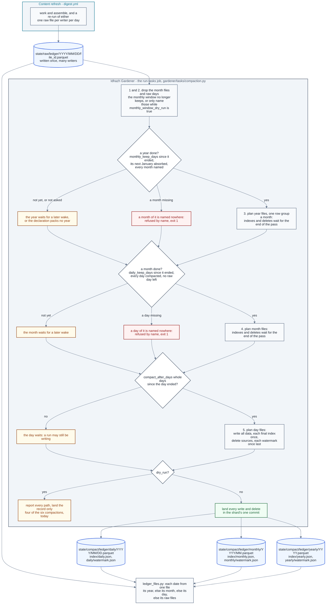

# Ledger compaction

**Last Updated**: 2026-10-04

How a ledger's daily, monthly and yearly files are packed and dropped. The
gardener runs a compaction like any other task; how a wake runs its tasks and
lands what they wrote is [idhazh-gardener.md](idhazh-gardener.md).

**A compaction moves one ledger's rows out of the many small raw files its
writers leave, into one file a day and then one file a month, and deletes what
it moved.** Where its declaration asks, it then packs each finished year's month
files into one file a year. A raw file holds one writer's rows for one day, so a
ledger gains a file on every run, and at a few rows a file a parquet file is
mostly its footer.
One task a ledger does the move: `config/gardener/compact-<ledger>.json`, served
by `backend/idhazh/gardener/tasks/compaction.py` through its kind, so another
ledger is one declaration and no Python. Six ship - for `gardener`,
`visual-prunes`, `feed-retirements`, `item-health`, `summary-quality-evals` and
`host-fingerprint`. **`item-health` and `host-fingerprint` pack live**, and each
packs a month 31 days after it ends: the console reads their packed files and
nothing newer, so a finished day reaches it within about 48 hours. The other
four only report, so the console shows the `summary-quality-evals` days up to the day that
ledger's migration ran
([../contracts/persistence.md](../contracts/persistence.md#moving-a-ledger-onto-the-door)).
**`summary-quality-evals` keeps every month: its `monthly_window` is `forever`, so it may pack
the eval rows and never drops a month** ([below](#design-rationale)). It is the one
ledger that packs a finished year into one year file ([A year](#a-year)). The files it
writes are laid out in
[../contracts/persistence.md](../contracts/persistence.md#the-two-roots), and
its knobs are in
[../../concepts/config/idhazh-gardener.md](../../concepts/config/idhazh-gardener.md#the-compaction-declarations-that-ship).

**The CSV day trees are not on this path.** A compaction never reads or writes
them; their closed days are folded in place by the retention task that owns each
tree, in [the closed-day fold](idhazh-gardener.md#the-closed-day-fold).

## One pass, in order

| Step | What it does |
| --- | --- |
| 1 | Drops each month file the monthly window no longer keeps, and its entry in `index/monthly.json`. While the window only reports, names them and keeps them |
| 2 | Drops every raw day in a month the window no longer keeps. While the window only reports, names them and keeps them |
| 3 | Packs every year that is done into its year file, where the declaration sets `monthly_keep_days` |
| 4 | Absorbs every month that is done into its month file |
| 5 | Takes every raw day that is due into its day file |

**Drops first and days last, because no pass may write a path it deletes.** A
shard refuses a path it both wrote and deleted, so a pass that did either would
stall every wake after it. In this order a year packs month files and a month
absorbs day files that an earlier wake wrote, never one this pass wrote, and a
period whose last part this pass writes is taken at the next wake.

**Every rule counts whole UTC days after a period's own end.** The pass measures
from 00:00 UTC on the wake's own day, so every wake of one UTC day gets the same
answer, and moving a cron changes nothing ([CLAUDE.md](../../../CLAUDE.md)
section 2).

## A day

**A day is due once `compact_after_days` whole days have passed since it
ended.** At one, a wake on the 25th takes the days up to the 23rd.
Days go in order, each on its own, at most `max_periods_per_run` a pass. For each
one the pass reads every raw file of the day and settles the rows: one file's
rows per work unit - the last file of its highest attempt - then the first row
of each key. It writes the day's day file and no raw listing.
After all stages decide their files, the pass writes each final index once,
in yearly, monthly, daily order; deletes source files; then writes each changed
watermark once, last. Monthly absorption and new days share one final daily
index. Index bytes grow linearly with the final entry count, not with that count
times the number of days taken. Before the indexes land, source files survive.
After they land, an interrupted pass resumes from the indexed compact files
and any source files left, with no row lost.
The bounded fixture measurement is
[what-a-compaction-pass-costs.md](../../reference/benchmarks/what-a-compaction-pass-costs.md).

**A watermark records what the data covers, never when a job ran.** It names
the newest day taken, so a lost watermark write costs repeated work and never a
skipped day: the next wake finds the mark behind and takes those days again,
from their indexed day files and any raw files still there.

**A quiet day still gets a file.** A day with no raw files gets a day file with
no rows and an index entry. So the newest day `index/daily.json` names is always
the watermark's day, and a reader can tell a quiet day from a missing one
without opening the watermark.

**A day that cannot be read whole is not taken.** A file that is not a ledger
file, or that this build cannot read, stops its day, and so does a day holding
more than `max_raw_files_per_period` files. Nothing of that day is deleted, the
watermark stays before it, and the pass ends `failed` naming it, so the task
exits 1. Every step the pass took before that day still lands.

**A re-run that lands after its day was compacted replaces its first attempt.**
GitHub lets a failed job run again for 30 days, and the re-run writes into the
day its run first wrote. A day at or below the watermark that has raw files
again is taken again, and before the new days: its day file is rebuilt from its
own rows and the new raw files, settled once. A compact row keeps the identity
its raw file gave it, which is what lets attempt 2 replace attempt 1 even when it
filed fewer rows. The watermark does not move back.

**The first pass starts on the first of a month**: the month of the older of the
oldest raw day and the newest due day, or the oldest month the monthly window
keeps if that is later. So every month the daily index holds is whole, and the
check a month makes for a missing day is exact.

## A month

**A month is absorbed whole or not at all, and only when four things are
true**: `daily_keep_days` whole days have passed since it ended; the daily
watermark is past its last day; `index/daily.json` names every one of its days;
and none of its raw days still holds files. The first two say the month is done,
the third that nothing of it is missing, and the fourth that no re-run is still
waiting in it. A month that fails the first, second or fourth waits for a later
wake. **A month whose days the daily index does not all name is a hole**: it is
refused by name, the watermark stays, and the task exits 1, because absorbing it
would put the missing day in no file.

Month files follow the pass-wide write order described above. A pass that stops
before the monthly index lands keeps all daily sources. Once that index names
the month, the next pass keeps its file and removes any remaining daily files
by their calendar dates, even if the daily index already excludes them.
The monthly watermark advances last. A live pass lands all changes in one commit, so no commit on `main`
holds one of the month's dates in both periods, or in neither.
The day files are joined as they are and never settled across days: a key with
no date in it may repeat on two days, and both rows are facts.

**A month file lives exactly `monthly_window` after its month is absorbed.**
Month M goes on the day month M plus the window becomes absorbable, so the
monthly period holds exactly `monthly_window` month files on every day, and the
ledger reaches back `daily_keep_days` further than that. At 13 months and 45
days, January 2026 goes on 15 April 2027, the day February 2027 is absorbed.

**Raw files that land in a month already absorbed are refused and kept.**
`daily_keep_days` is at least 31, one day more than GitHub's 30-day re-run
window, so no re-run can land there; a file that does is for a person to read.
The rest of the pass still runs.

## A year

**A year is packed only where its declaration sets `monthly_keep_days`.** One
declaration sets it: `compact-summary-quality-evals`, whose `monthly_keep_days` in
`config/gardener/compact-summary-quality-evals.json` (93) is how many whole days
after a year ends the eval ledger waits to pack it. Every other ledger keeps its
month files exactly as `monthly_window` says. A ledger that packs years keeps
`monthly_window` forever, because a window would delete a month file before its
year took it, and its year files are kept for ever. **Each ledger's own
declaration sets its wait, a ledger the site publishes included**: the browser
reads a year file by byte range, at an address no earlier read used
([how-the-query-door-answers-a-panel.md](how-the-query-door-answers-a-panel.md#how-a-year-file-is-read-by-byte-range)),
so no wait has to keep the console's reads away from year files.

**A year is packed whole or not at all, and only when three things are true**:
`monthly_keep_days` whole days have passed since it ended, at 00:00 UTC on 1
January; the monthly watermark is past its December, so its next January is
absorbed; and `index/monthly.json` names every one of its months, each with its
file. A year that fails the first or second waits for a later wake. A year
missing a month is refused by name, the yearly watermark stays, and the task
exits 1. A year's months run from January to December, except in the first year
a ledger packs, whose months start at the oldest month the monthly index names.
That year's file still covers the whole year, so a reach that counts from the
yearly index starts on its 1 January even when its first rows came later.

**The earliest a year can go is `daily_keep_days` plus 32 days after it ends.**
Its next January is absorbed `daily_keep_days` after that January ends, 31 days
into the new year, and the pass packs years before it absorbs months, so the
year goes one wake later. A smaller `monthly_keep_days` would change nothing, so
the loader refuses one. At a `daily_keep_days` of 45, 2026 is packed on 19 March
2027 at the earliest.

Year files follow the pass-wide write order described above.
The month files are joined as they are and never settled, and the monthly
watermark stays where it is. A pass that stopped before the yearly index leaves
every month file, so the next wake packs that year again. A pass that stopped
after it leaves a year the yearly index already names, so the next wake deletes
the month files still there by calendar month, even if the monthly index no
longer names them, rewrites the monthly index and moves the
watermark, and builds nothing. Either way a reader in between reads each month
once: a month both indexes name is read from its year.

**A year file is built one month at a time, one row group a month.** The pass
holds one month's rows at a time rather than the year's, and a reader that
filters on a date can skip the row groups of the other months. A year file over
50 MiB, the size at which GitHub warns about a pushed file, is refused by name
and its month files are kept: GitHub refuses a push that holds a file over
100 MiB, and one that did would stall every later wake.

## The three indexes, and a file that is missing

**A ledger's three indexes exist together.** Whatever writes one of
`index/daily.json`, `index/monthly.json` and `index/yearly.json` also writes
each of the others the ledger does not have, with no entries, and no pass
deletes one. An empty index truthfully says no period of its kind is packed yet;
a missing one says nothing, so a reader could not tell a lost list from a period
never packed, and would have to ask the site for a file that is not there. A
ledger that holds `daily.json` alone gains the other two, empty, at its next pass
that writes a day. A ledger whose declaration packs no year still has an empty
`yearly.json`, because the console reads all three together
([how-the-query-door-answers-a-panel.md](how-the-query-door-answers-a-panel.md#how-far-a-ledger-reaches)).

**An index its watermark says was packed, and that is not there, stops the
pass by name.** A pass that read it as empty would rewrite it naming only what
this pass packs, and every period packed before would drop out of sight. The task
fails that wake, and a person restores the file from git history.

**A missing file has one of four names**, declared once as `LEDGER_FAULTS` in
`frontend/src/lib/data/slice-shapes.ts`. The backend's copy is `LedgerFault` in
`backend/idhazh/contracts/ledger_fault.py`, and
`backend/tests/contracts/test_frontend_index_shapes.py` holds the two to one list.
The query door carries the name on its answer
([how-the-query-door-answers-a-panel.md](how-the-query-door-answers-a-panel.md#when-a-file-is-missing)),
and the gardener's logs and the backend's own ledger reader print it as
`fault=<name>`, so one search finds a fault on both sides.

| # | Name | What is missing | What the gardener does |
| --- | --- | --- | --- |
| 1 | `not-packed` | `index/daily.json`: no day of the ledger is packed | A first pass writes all three indexes |
| 2 | `index-missing` | `index/monthly.json` or `index/yearly.json`, while `index/daily.json` is there | Writes an empty one when no period of its kind was ever packed; stops the pass by name when that period's watermark says one was |
| 3 | `file-missing` | A file an index names | Refuses the year it would pack, the month it would absorb, or the day it would take again, and keeps every file it would have read; a person restores the file from git history |
| 4 | `day-missing` | A day between the first and the newest packed day that no index names | Refuses the month or the year that holds it |

**Three gaps are expected, and none of them is a fault**: a day newer than the
newest packed day, an entry with `rows: 0`, and an index with no entries. None
of them makes a reader ask for a file that is not there.

## What a dry run does, and what the record says

**A dry run does all of the work and changes nothing.** It reads every file,
settles the rows, builds every file in memory, and reports every path a live
pass would write and delete. So the list a person reads before turning a
compaction live is the list the live pass carries out.

**The monthly window has a switch of its own, `monthly_window_dry_run`.** With
it `true`, steps 1 and 2 name every month file past the window and every raw
file of a day in a month past it, and keep them; steps 3 to 5 then pack those
days and months like any other, as if the window kept every month, so a first
pass does not start at the oldest month the window keeps. `dry_run` still
decides whether anything lands, so a dry run with the window reporting names
what that live pass would do. With it `false`, a pass drops what the window no
longer keeps, as above.

**The record row says what the pass did, or would have.** `deleted` and
`bytes_freed` count the files it deleted. `selected` counts the same files and
every file the monthly window would have deleted that the pass kept because the
window only reports, so `selected` minus `deleted` is what turning the window
live would take at that wake. A raw file the pass packed is deleted either way,
and is counted once. `bytes_freed` is never netted against the files it wrote:
the net is `bytes_freed` minus the `bytes` of the index entries it wrote.
`candidates_seen` counts every raw day folder it listed and every file it read,
weighed or named, so a listing that grows while a compaction only reports shows
in every row. `until` is the newest day that was due. A pass that used its
budget stops `ceiling`, with `resume_from` naming the day, month or year the
next pass starts at; one that refused a period stops `failed`, naming it.

## Design rationale

**2026-09-28: a compaction pass drops, then absorbs months, then takes days.**
The first design took the days and then the months. A shard refuses a path it
both wrote and deleted, and in that order a catch-up pass takes a day and
then absorbs the month that holds it - writing a day file and deleting it in one
pass - which would stall every later wake. The order costs a month one more wake
after its last day is taken (Carmack).

**2026-10-03: the compaction writes no raw listing.** It used to write
`state/raw/<ledger>/index/<YYYY-MM-DD>.json` for each day it took and keep it
90 days. Nothing read it: a browser reads the daily index for a packed day, and
the site build stages its own listing, with sizes, for a day not packed yet. A
re-run is rebuilt from the day file and the new raw files, never the listing.
So the setting that kept them
is gone. A pass lists the raw day folders once, by name, and opens only the
days it takes, so what one pass reads is bounded by its budget rather than by
the backlog (Fowler, Carmack).

**2026-10-04: the leftover listings were deleted in one commit, and the code
meant to delete them is gone.** The 2026-10-03 change made each pass delete
every listing it found. That step never ran: a pass sees only the files its
scheduled window names, and no window names `index/`. So the 325 listings left
in seven ledgers were deleted from `state/` by hand. The code that found, read
or deleted a listing in `state/` was deleted with them. No check refuses a new
one: no code writes a listing there, and nothing reads one. The person's
ruling, 2026-10-04.

**2026-09-28: the monthly window counts from the month's absorption.** A month
file goes when the month `monthly_window` later is absorbed, so the period holds
exactly `monthly_window` files on every day. Counted from the month's own end, a
window shorter than `daily_keep_days` plus a month would drop a month before it
was absorbed, and the loader carried a rule to refuse that pair. Counted this
way no such gap can open, so the rule went (Fowler and Carmack).

**2026-09-28: `daily_keep_days` is at least 31.** GitHub lets a failed run be
re-run for 30 days, and the re-run writes into its first day, so a month absorbed
sooner could still be reached by one. The 30 is declared once, as
`GITHUB_RERUN_DAYS` in `backend/idhazh/contracts/knobs/gardener.py`, and the
floor is derived from it. A raw file that lands in an absorbed month anyway is
refused and kept for a person (Carmack and Fowler).

**The two ledgers packed live wait 31 days, not 45.** 31 is the
shortest wait that still catches every re-run GitHub allows, and nothing needs
the 14 days more that 45 waits. A shorter wait, such as 15 days, would need a
month file rebuilt when a late re-run lands, which the packing refuses. The two
declarations set 31, and the four that only report set 45.

**A compaction's monthly window has a switch of its own.** Packing deletes only
files whose rows it has just written into a coarser file; the monthly window
deletes rows. With one `dry_run` for both, a ledger could not pack live while its
window only reported, so `monthly_window_dry_run` reports the window's drops
while the rest of the pass runs live. A window of forever where the window
should only report would have taken the retention number out of the file a
person reads. A second task for the window's drops would have had two tasks
writing one ledger's periods in one wake, and the shard refuses a path one task
writes and another deletes. The record keeps its fields and their meaning:
`selected` counts what the window would also take, so a person reads it before
turning the window live, and no reader of the record changes.

**A missing file has a name, and a ledger's three indexes always exist.** Large
table formats handle a missing file the same way, and this design copies them:

| # | Platform | What it does |
| --- | --- | --- |
| 1 | Delta Lake | The first version of a table must hold its `metaData` action, so the log exists before any data file does, and readers take the files to read from the log rather than from a listing ([protocol](https://github.com/delta-io/delta/blob/master/PROTOCOL.md)). Its errors have fixed names, such as `DELTA_PATH_DOES_NOT_EXIST`, `DELTA_FILE_NOT_FOUND` and `DELTA_VERSIONS_NOT_CONTIGUOUS` for a gap in the log ([error classes](https://raw.githubusercontent.com/delta-io/delta/master/spark/src/main/resources/error/delta-error-classes.json)) |
| 2 | Apache Iceberg | The table tracks individual data files rather than directories, and a scan is planned by reading the manifests of the current snapshot ([spec](https://iceberg.apache.org/spec/)) |
| 3 | Apache Spark | A file a table names that is gone is `FAILED_READ_FILE.FILE_NOT_EXIST`, and the message names the fix, `REFRESH TABLE` ([error conditions](https://spark.apache.org/docs/latest/sql-error-conditions.html)). Skipping such files instead, `ignoreMissingFiles`, is an option a reader has to switch on ([file source options](https://spark.apache.org/docs/latest/sql-data-sources-generic-options.html)) |
| 4 | Apache Hudi | The table keeps its own file listings, so a reader or writer need not ask storage whether a file exists ([metadata](https://hudi.apache.org/docs/metadata)) |

Three rules follow. **An empty index is right, and an empty data file never
is**: an empty `monthly.json` or `yearly.json` truthfully says no month or year
is packed, while an empty
day file standing in for a lost one would draw a lost day as a quiet one. **No
list of allowed 404s**: it would be Spark's `ignoreMissingFiles` under another
name, and a lost index would then look exactly like one never written. So a
ledger that packs no year still carries an empty `yearly.json`. **No
field in `daily.json` names the other indexes**: it would change a stored shape
to say what an empty file already says.

**2026-09-28: a first pass starts on the first of a month.** Starting at the
oldest raw day would leave the daily index holding part of a month, and that
month's check would call the days before it holes. The start asks the same
function the window drops months by, `first_kept_month`, so a first pass never
takes a day the same pass would drop; while the window only reports, nothing is
dropped, and the first pass starts without regard to the window (Carmack and
Fowler).

**A finished year's month files may be packed into one year file.** A ledger
may pack each finished year into one file, kept for ever, rather than delete its
month files once they pass `monthly_window`. The packing is written once and
turned on in each ledger's own declaration. The switch is one field,
`monthly_keep_days`, whose null packs nothing, so no ledger's behaviour changes
until its declaration says so. A pass packs years before it absorbs months,
which keeps it from deleting a file it wrote. A year waits for its next January,
and a smaller wait is refused rather than silently lengthened. The year is built
one month at a time: for the eval ledger at September 2026's rate, that holds
about a quarter of the memory a whole-year build holds, 0.33 GB against 1.41 GB,
measured once on a laptop. The first live pass times it on a runner. A year file
sits in a folder of its own, `yearly/<YYYY>/<YYYY>.parquet`, because a shard
fetches a watermark together with every file beside it: a year file beside the
year watermark would be downloaded on every wake, one more file every year.

**The `compact-summary-quality-evals` compaction packs the eval rows and never drops a month.** Every
eval row is kept for ever and nothing summarises a month: the
rows are the evidence behind every quality claim, and a chart that wants a
monthly figure computes it from them when it draws. So the `monthly_window` of
`config/gardener/compact-summary-quality-evals.json` is `forever`, and a live pass may make one
file a day and one a month without taking a row. Its `monthly_keep_days` packs a
finished year's month files into one year file, kept for ever, so the month files
stop adding up and no row goes.

## See also

- [idhazh-gardener.md](idhazh-gardener.md) - the program that runs every compaction task, and how a shard lands what one wrote and deleted.
- [../../concepts/config/idhazh-gardener.md](../../concepts/config/idhazh-gardener.md#the-compaction-declarations-that-ship) - every compaction declaration that ships, what each one keeps, and what each key means.
- [../contracts/persistence.md](../contracts/persistence.md) - the two roots a compaction writes under, and how a ledger is read back from every kind of file.
- [how-the-query-door-answers-a-panel.md](how-the-query-door-answers-a-panel.md) - how a browser reads the files a compaction writes.
- [../../reference/benchmarks/what-a-compaction-pass-costs.md](../../reference/benchmarks/what-a-compaction-pass-costs.md) - what one pass costs on a bounded fixture.
