# Visual planning and rendering

**Last Updated**: 2026-09-14

How an item gets a chart or - most of the time - nothing at all.
The rule this subsystem serves is in [`../../concepts/digest.md`](../../concepts/digest.md): a
visual must carry a fact the sentence beside it does not. A picture that decorates is worse than
no picture, because the product is trust and an invented axis label costs it permanently.

## One model, one pass, inside `work`

There is no separate visual stage and no second model:

```
idhazh work --date <D> # two calls an item: labels, then the summary and the plan
idhazh assemble --date <D> # the day payload picks up whatever was drawn
```

Call 2 writes the summary and the plan in one reply, so the same model that read the article
decides the picture and `work` draws it while it still holds the text.

**It was two stages on two models until 2026-09-13.** `idhazh visuals` ran a Qwen3-4B after the
summarizer had finished, decided a picture from the summary, and rendered it in a job of its own.
Plan 11 row #6 deleted that stage, the job, the model and the flag that switched between the two
paths, in one commit (owner ruling 2026-09-13: move forward, no rollback). The reason the pass
moved is that a second pass decides from a **summary of** the article rather than from the
article, and both payloads validate - so nothing would say it had happened.

Two things follow from `work` being the job that draws. It is sharded four ways, so four runners
render a quarter of the day each instead of one runner rendering all of it against a budget; and
each shard has to hand its drawn bytes to `assemble` itself, which is the `shard-visuals-<n>`
artifact in `digest.yml`. The decisions travel inside `items-<n>`, which is rooted at the items
directory and therefore cannot carry a file written under `frontend/public/digest/`. Without the
second artifact the day publishes a payload naming an asset nobody uploaded, which
`stages.validate_days._picture_faults` reports as "names a picture file that is not there".

**The flag is the first of two commits** (plan 11 rows #5b and #6). The second deletes the flag,
the small model, this stage and its job together. Until then the flag off leaves the pipeline
exactly where it was.

**What proves the fold still draws is `test_a_decided_item_leaves_a_drawn_chart_on_disk`, and it is
the only test that does.** Once the small model goes, the two calls are the only thing left that
puts a picture on disk, so the question a reader cares about is whether a file lands - not whether
a decision does. Every route to no picture writes a decision too, so a test that reads
`asked_the_model` off the payload passes on a day the digest drew nothing. This one reads the SVG
back from the path the payload names and checks the bars carry the article's own entity names.

It needs an article a bar can legally be drawn from, which is rarer than it sounds.
`tests/fixtures/pages/article.html` states three figures in three units - dollars, megawatts and
customers - so `units_convertible` refuses every bar expressible from it, correctly.
`tests/fixtures/pages/wind.html` exists for this: four countries, four figures, one unit, matching
the shape `tests/fixtures/visual-validator/` already keeps as the plan that passes. Its recorded
pair is `call-one/wind-labelled.json` and `call-two/wind-summary-and-plan.json`, and the element
ids in the second are the ones this pipeline mints from the first - so an extractor change that
moves a span turns the test red rather than quietly turning the picture off.

## The model never writes a number

This is the whole safety design, and it is structural rather than instructed.

1. The extractor pulls every quantity out of the article text with a regex, and gives each one an
 index and a unit.
2. The model is shown that indexed menu and asked to choose bars **by index**.
3. The spec is built here in Python from the chosen indices.

A chart value that is not in the article is therefore unreachable, not merely unlikely. The Row #8
oracle - "every value in a rendered chart is present in the source article" - is a property of the
shape rather than a hope about the prompt, and the test asserts it directly.

## The plan a compiler draws from, and the four things it may not carry

`VisualPlan` in [`backend/idhazh/contracts/visual.py`](../../../backend/idhazh/contracts/visual.py)
is the shape a planner decodes into and the only thing a compiler is allowed to read. It carries
element references and closed vocabularies: a decision, a purpose, a type, one channel per encoding
role, the elements it draws from, which of them name the marks and which one lands first, one
sentence of reasoning, a title, a caption, a confidence and the vocabulary date-stamp it
was planned against. It lands ahead of its producers, so nothing writes one yet (Guardrail #3).

What it may not carry is as much of the contract as what it holds.

| Prohibition | What refuses it |
| --- | --- |
| **No geometry** | Geometry is a number, and the schema admits exactly one number. A payload naming a pixel names a key the model does not declare, and an undeclared key does not load. |
| **No literal values** | Same guard. Every drawn figure is reached by citing an element, so a number pushed into a reference field fails that field's own grammar. |
| **No authored text where a reader reads a fact** | `labels` and `annotations` are element ids, not strings. Code cuts every character a reader sees off a chart; the model points at which characters. |
| **No `alt_text`** | The field is not declared, it is named in `FORBIDDEN_FIELDS`, and the module refuses to import if one is added back. |

**The geometry ban is what keeps the compiler swappable.** A plan that names a pixel is a plan bound
to one renderer, and the renderer is a choice this project has already changed once. Nothing in the
plan says how wide, how tall, what colour or what font; a compiler decides all four and a second
compiler may decide them differently over the same plan.

**Alt text is the compiler's, and the reason is worth keeping.** Assembled from element values the
compiler already holds, it is correct by construction. Written by the model it would be one prose
channel restating the chart's own data, and no validator can read prose to check it - so it would be
the last unguarded channel in a design whose whole claim is that a stranger's page cannot reach a
drawn figure.

**Three prose channels remain, and the shape only bounds them.** `title`, `caption` and `why` are
length-capped here. Whether a numeral inside one is matched by a cited element is the validator's
check, not the shape's - it needs the article's element table, which the plan deliberately does not
carry.

**`confidence` decodes after `type`, and that ordering is the field's licence to exist.** Field order
is decode order. Second in the list a confidence conditions every field after it, and the model reads
its own hedge back as evidence. Last but one it records what the model thought and gates nothing.

**Every array has a `maxItems` and every decoded string a `maxLength`, so the worst-case reply length
is arithmetic.** At the bounds the contract declares, the longest plan the decoder can produce is
**3,767 characters** - and a token spans at least one character, so that is also a ceiling of 3,767
tokens. The two committed fixtures measure 838 characters for a four-bar plan citing eight elements
and 368 for one that declines, between a fifth and a tenth of the ceiling. The derivation is field
by field in the module docstring, it is recomputed from the generated schema, and the module refuses
to import if a bound moves without the ceiling moving with it.

The ceiling is loose by construction and the arithmetic says where: `encodings` is 51 percent of it
and `element_ids` a further 22 percent, because the schema can bound each channel at eight elements
and cannot say that no type fills more than four channels. That last sentence is a validator rule,
and a validator runs after the tokens are already spent.

## Every encoding role is a key, and an unused one is empty

`encodings` is one object with a field per role, and the schema requires all nine. A `bar` fills
`category` and `quantity` and emits `"bins": []`, `"size": []` and five more empty arrays beside
them.

**Presence is what the shape guarantees; what may be empty is the validator's.** Left optional, a
role is a role the model can simply not mention - and a plan that names `bar` and omits `quantity`
reads as a complete answer rather than as a failure. That is "a confident chart with no bars in it",
which happened twice on the first live run. Required, the same reply is a decode failure at the key.
Which roles a given type may leave empty needs that type's own rule set, and a JSON Schema cannot say
"at most four roles for a `bar`", so the per-type ruling belongs to the validator and this shape only
guarantees the validator has something to rule on.

The roles are fields rather than a map because a schema can require the keys of an object it
declares and cannot require the keys of a map. An eighteen-branch union, one per type, would have
reached the same place and was refused: the decoder would have to pick a branch before it has picked
a type.

**There is no `label` role, and `labels` is why.** `labels` is the one naming channel - the elements
whose own characters name the marks and the axes, capped at eight marks and two axes. A `label` role
would ask the model the same question a second time inside `encodings`, and a model that answers it
twice can answer it two ways with nothing to settle which. So naming stays one field and `encodings`
answers a different question: which elements are drawn, and by which channel. `event_label` is not
the exception it looks like - a timeline's `time` channel places a dot and nothing else, so the event
text is the mark rather than a name for one.

**What that costs, measured.** An empty role is `"<name>":[]` and a comma. The nine role names cost
114 characters on a plan that declines and the seven a `bar` leaves empty cost 87. Tokenized with the
Qwen3 vocabulary (`Qwen3-8B-Q4_K_M.gguf` through `llama-tokenize`, 2026-09-09) that is 28 tokens and
23 tokens, about 3.1 tokens an empty role.

| At | Declining plan, 9 empty | Eight-bar plan, 7 empty | Over 80 items |
| --- | --- | --- | --- |
| 6.01 tok/s, the configured summarizer, `ubuntu-latest`, 2026-08-23 | 4.7 s | 3.8 s | 5.1 to 6.2 min |

Eighty is `run.safety_ceiling_per_run` and is the most items a run plans for, so the run figure is an
upper bound - an item the reachability gate refuses never reaches call 2's plan half at all.
`digest.yml` fires five scheduled runs a day, so the day's ceiling is 400 plans: 26 to 31 minutes of
runner wall-clock, spread over four shards rather than paid serially. The worst-case reply ceiling
did not move: it already counted every declared key, because a grammar-constrained decoder emits
them all.

## The validator refuses, and each check refuses on its own

`backend/idhazh/visual_validator.py` reads one plan and one article's element table and returns the
checks that did not hold. An empty answer means the plan may be drawn. Nine checks, all of them
deterministic code over committed data - **no check calls a model, and a test reads the module's own
imports so none can start to** (`CLAUDE.md` section 0a). It reads the same test against
`visual_vocabulary.py`, or moving a table out of the validator would move it out from under the
guard.

It is a sibling module rather than part of the planner. A validator is not a contract, so it may
import both `contracts/visual.py` and `contracts/element.py`, which a contract may not
([`../contracts/schemas.md`](../contracts/schemas.md)); and the planner it would otherwise sit inside
is the module being replaced.

| Check | What must hold | What it catches |
| --- | --- | --- |
| `element_exists` | Every id in `element_ids` is in the article's table. | A plan drawing an element the article never had. |
| `semantically_compatible` | Each element's kind fits the channel it fills. | A quote drawn as a bar height; a number used as an axis tick's name. |
| `units_convertible` | Within one measured channel, every unit is convertible or identical. | Three megawatt bars and a headcount on one axis. |
| `roles_valid_for_type` | The filled roles are the ones the type declares. | A `bar` carrying `bins`; a `bar` with an empty `quantity`. |
| `enough_data` | The marks sit between `visuals.min_chart_points` and `visuals.max_chart_points` - and a histogram, whose marks are its bins, cites a value for every bin. | Two bars, which is a sentence rather than a comparison; three values asked to fill five bars. |
| `no_duplicate_in_role` | No element fills one channel twice. | One number drawn three times under three names. |
| `no_invented_values` | Every figure reads out of the characters its element names. | A table cell that disagrees with its own excerpt. |
| `numerals_matched` | Every numeral in `title`, `caption` and `why` is one a cited element states. | A caption that converted a figure, or reached one from nowhere. |
| `plan_version_current` | The plan met the vocabulary this build holds. | Contract drift, found rather than drawn. |

**Each check returns at most one refusal, carrying its own stable name.** That is a design
constraint rather than a testing preference. A validator that answers with one string cannot say
which rule fired, so no rule can ever be retired, tuned or trusted. It also decides the order:
`element_exists` resolves first and every later check reads resolved elements only, or one absent
element would trip four rules at once and the report would name the wrong cause.

`backend/tests/test_visual_validator.py` holds **one fixture per check, each tripping only its own**,
asserted as `[rejection.check for rejection in rejections] == [check]` rather than as a membership -
a membership passes while three other rules are firing. Each check was also neutered in turn against
its own fixture, and all nine left the plan accepted, so every one of them is the sole cause of the
refusal it is credited with.

### Where the vocabulary lives, and why none of it is in `config/`

`visuals.min_chart_points`, `visuals.max_chart_points` and `visuals.histogram_bins` are knobs and
are read from `config/` (Guardrail #6). The tables are not knobs, and since 2026-09-09 they are not the
validator's either: `backend/idhazh/visual_vocabulary.py` holds which roles a type may fill, which
kinds may fill a channel, which channels are drawn on a measured axis, which units measure the same
thing, and the two date-stamps over those tables.

**Two stages read them, which is why they have a module of their own.** The validator asks whether a
plan holds to the vocabulary; the resolver asks what a plan that already holds to it displays. Until
the split, `derived_values.py` imported five names out of `visual_validator.py` - and that reads as
a later stage borrowing an earlier stage's constant, when what it really was is a shared vocabulary
with no home, sitting in whichever consumer happened to be written first. Facts about the visual
language now sit below both stages, and `derived_values.py` no longer imports the validator at all.

It is not a contract and does not sit under `contracts/`: it holds no persisted shape, it generates
no schema, and it imports `idhazh.elements`, which a contract may not (`CLAUDE.md` section 4). The
move changed no behaviour and moved neither stamp - **a date-stamp that changes because a file moved
is a date-stamp that lies**, which is the same argument that keeps both of them out of `config/`.

- **Which roles a type may fill** is a relation between `VisualType` and `EncodingRole`, two closed
 vocabularies that are both Python enums in `contracts/visual.py`. A JSON file cannot reference
 either, so a copy there is a second spelling that drifts. "A bar has no bins" is also what a bar
 *is* rather than something an operator should be able to edit: a config edit that let a bar draw
 bins would publish a plan no compiler has a template for.
- **Which units measure the same thing** is arithmetic. A kilotonne is a thousand tonnes whatever
 anybody configures. `MAGNITUDE` in `idhazh.elements` is the precedent - a magnitude word's
 multiplier lives in code beside the pattern that reads it.

Eleven of the eighteen declarable types have a role rule: the grammar-of-graphics forms, where the
channels follow from the role names and anybody would write the same table. The other seven -
`table`, `flow`, `comparison`, `callout`, `quotecard`, `whowhat`, `keyfacts` - are **named as having
no rule yet**, and a plan naming one is refused by name. Naming them is the point: a type in neither
set would be waved through by both per-type checks and drawn with nothing having ruled on it.
Refusing them is also correct rather than a stopgap - declarable is not renderable, `enabled_kinds`
is `["chart"]`, and a downgrade ladder re-enters this same validator with a nearer neighbour.

`PLAN_VOCABULARY_VERSION` is the date-stamp of the role table, and it is not the plan contract's
`version`, which says when the *shape* last moved. `plan_version_current` compares the two
date-stamps rather than matching them, because the two directions are different faults: a plan
behind the vocabulary is re-planned, and a plan ahead of it came from a build this one cannot read.
It earns its place beside `roles_valid_for_type`, which already refuses a plan the current table
disallows - this one is for the plan the table still allows *by accident*, where a role's meaning
moved rather than its legality.

### Units are convertible or identical, not merely equal strings

Comparing unit strings for equality is cheaper and it is wrong in the direction that matters. It
refuses `4,200 tonnes` beside `4.2 kt`, which is the pair a reader most needs joined, and it accepts
`tonnes` beside `t` only by accident of spelling. So two units are commensurable when they are the
same string, **or** when one table names both under one dimension - power, energy, mass, length or
duration.

That table is a closed allow-list and its omissions are the safety. A unit is read off a stranger's
page (Guardrail #11), so a unit the table does not name is compared by identity and is never assumed
compatible with anything. `m` is out because it is metres or millions, and a guess there is a
one-million-fold error on a published bar - the same reason `MAGNITUDE` omits it. `ton` is out
because short, long and metric tons are three different masses. Currency symbols are out because
joining two of them needs an exchange rate, which is a number no article wrote.

**What is not settled here is the conversion itself.** A channel mixing commensurable units passes
this check and is not drawable until something converts it, because drawing 4,200 beside 4.2 on one
axis is worse than refusing both. This check answers whether a conversion is *possible*; what it
produces, and the provenance chain that records it, are the derived-value contract below.

## A number the article did not write, and the four ways code may reach one

Every figure a reader reads off an axis resolves one of two ways. It is a **Tier 1 element** - the
characters the article itself wrote, cut at a span anybody can re-slice - or it is a **derived
value**, arithmetic code performed over Tier 1 elements, carrying a chain back to every one of them.
There is no third way, and `DisplayedValue` in `backend/idhazh/contracts/derived.py` is that sentence
written as a shape: exactly one of the two, never both, never neither. A figure that resolves to
nothing does not load, so the walk over a plan proves the resolver never reaches for the exception
rather than proving nobody happened to write one.

**Four functions, and the list is closed.** Its shortness is the guarantee rather than a starting
point: the model picks the type and points at elements, and it cannot name a function, cannot supply
an operand, and has no numeric field anywhere in its schema - `contracts/visual.py` refuses to import
if it grows one. So the worst a prompt injection can do stays "pick the wrong elements". A fifth
function is an owner decision and `contracts/derived.py` raises at import if one appears, which is
why the argument for the list being short is written beside the constant rather than only here.

| Function | Reads | Produces | What its chain records beyond function, version and inputs |
| --- | --- | --- | --- |
| `count` | the elements in one bin | how many there are, unitless | the bin's floor and ceiling |
| `sum` | two or more elements stating one unit | their total, in that unit | nothing |
| `share_of_declared_whole` | the part first, then the parts that make the whole | a percentage | nothing |
| `convert` | one element | the same quantity against another unit of its dimension | the source unit and the unit table's date-stamp |

`inputs` holds Tier 1 element ids and never another derived value. A chain that nests can be
complete at each hop and still name no element at the bottom, and "every input element" is what the
rule asks for. `share_of_declared_whole` totals its whole internally for the same reason: the share
names every element it read, and there is no intermediate a later reader has to chase.

### `convert` is a derived value; formatting is not

`2000000` drawn as `2M` moves no quantity - same number, different glyphs, nothing to record.
`4200 tonnes` drawn as `4.2 kt` is a different number against a different unit, so it carries the
full chain. Where that line falls decides what needs provenance, and running the two acts together is
how a formatting rule becomes permission to state a figure the article never gave.

The line is drawn on **scale, not spelling**. `tonne` and `t` are two names for one unit, so a
channel holding both draws them unchanged and the axis label picks a spelling - that is formatting.
`kt` beside them is a thousand-fold difference, and moving it earns a chain. On the committed
`units-convert` plan, which passes all nine validator checks and was not drawable before this, that
is one converted mark out of three.

Nothing is lost, which is what makes conversion safe here. An element's Tier 1 `span_excerpt` is the
article's own characters and is never overwritten, so a reader who wants the figure the article
printed can always be given it.

**The target unit is code's choice, never the plan's.** Taking the first entry's unit would hand the
choice to the model, which orders the channel. So the target is the smallest scale present, and among
units sharing that scale the one that sorts first. Two properties fall out and both are load-bearing:
it is a fact about the channel's contents rather than about the plan's order, and converting to the
smallest present unit only ever multiplies, so no value is divided into a repeating decimal and no
rounding decision is hidden inside a mark. A ratio that will not state exactly is refused rather than
rounded - the table holds no such pair today, so that fails closed on a table that grows.

### A histogram's marks are its bins, and the check counted its inputs

Every other type draws one mark per element in the channel `TypeRules` names, so counting that
channel counts the marks. A histogram does not: its `bins` channel holds the values being
distributed, and the bars a reader counts are `visuals.histogram_bins` of them. Until 2026-09-09
`enough_data` counted the channel for every type, so a histogram was admitted or refused on a
quantity it does not draw. Nothing collided at the committed value - `histogram_bins` is 3 and
`min_chart_points` is 3 - but the two readings were wrong in opposite directions: raise
`histogram_bins` to 12 and the validator admitted every plan asking for more bars than the ceiling
allows, while three values with twelve bins read as too few marks when what it had was too many
bars.

**"Enough data" is one check, because the second question is not about a plan.** How many bars a
histogram draws is the same for every histogram in the run, so a per-plan check would answer it
identically for every item and blame the article each time. It is asked once, where the config
loads: `VisualsConfig` holds `visuals.histogram_bins` inside the same `min_chart_points` to
`max_chart_points` window every other type's mark count sits in, and a value outside it fails the
build naming the operator who set it. What is left for `enough_data` to ask of a plan is whether the
article gave enough values to fill those bars - a floor of `visuals.histogram_bins` on the cited
values, because fewer values than bins leaves a bin empty whatever their spread.

A tenth check was weighed and refused. It would have fired on every histogram of every run for one
config edit, and the reader loses nothing by its absence: the same fault is caught earlier and
stated once. The three bounds are all `config/` knobs and none is a number chosen in code (Guardrail #6);
no new knob was needed, because `min_chart_points` and `max_chart_points` already mean "how many
marks a chart may draw" and a histogram's bars are marks.

### Binning is versioned config, and where the edges fall is not

A histogram's bars are counts rather than figures the article wrote, so something has to say how many
bins its values fall into. `visuals.histogram_bins` says, and the model is the one thing that may not.
Where the edges fall - equal width over the range the values cover, half-open except the last bin,
which is closed so the widest value has somewhere to go - is arithmetic and lives in
`idhazh.derived_values`, stamped by `DERIVED_VALUE_VERSION`.

A bin nothing falls into refuses the drawing. Its chain would name no element, and a mark that
resolves to nothing is the one thing this contract exists to keep off a page. The item degrades and
publishes no picture, which is the honest answer when a knob asks for more bins than the channel has
spread to fill. The default is `min_chart_points` rather than a textbook rule for a sample size this
stage never sees. **What reaches that refusal is a lack of spread and nothing else**, now that
`enough_data` refuses a plan citing fewer values than bins: a count shortfall is a plan fault the
validator names, and only values that crowd into one end of their own range get this far.

### The resolver refuses with a value, because the caller degrades

`resolve_displayed_values` returns a `Resolution`: the figures it drew, or one `Refusal` naming the
check that stopped it. It is the counterpart of the validator's `Rejection` and it exists for the
same reason - a refusal that cannot say which rule fired is a rule nobody can retire, tune or show to
work.

**It returns rather than raises because the empty bin above is reachable on a plan the validator
passed.** Thirteen of the fourteen refusals restate one of the nine checks, so a caller meeting one of
those resolved a plan it never validated - this run's own arithmetic being wrong. The fourteenth,
`values_have_spread`, is the resolver's own: values crowding into one end of their own range leave a
bar empty with a figure for every bin, and no check above refuses that. The paragraph above says the
item degrades and publishes no picture, and a caller can only do that if the refusal is something it
reads off the return. A caller that has to remember a `try` is a caller who will one day not, and the
`try` it forgets takes a whole day's digest off the air to punish one story - the trade `CLAUDE.md`
section 1a already refuses.

**The two empty-bin causes carry different names, and the difference is what an operator acts on.**
`enough_values_for_bins` says the article was thin; `values_have_spread` says
`visuals.histogram_bins` is set higher than the article's figures can fill. Folded into one name,
every empty bar reads as the knob. The four functions and the helpers under them still raise
`DerivedValueError`, which now carries the same check name - reaching `convert` with two units that
do not measure the same thing is a bug rather than an article with a problem, and the boundary a
stage calls is the one place that turns the raise into a refusal.

### Three stamps, and none of them is a config key

The plan's file list proposed `visuals.unit_table_version`. It is refused. A stamp an operator can
edit without editing the table it stamps is a stamp that lies, and every derived value that recorded
it lies with it. Which units measure the same thing is arithmetic - a kilotonne is a thousand tonnes
whatever anybody configures - so the table and its date-stamp stay in code, for the second of the two
reasons the role table stays there. The first reason does not carry over: the unit table references no
Python enum, so a JSON copy of it would be readable in a way a copy of the role table is not.

| Stamp | Stamps | Recorded by | Where |
| --- | --- | --- | --- |
| `PLAN_VOCABULARY_VERSION` | which roles a type may fill | `VisualPlan.plan_version` | `visual_vocabulary.py` |
| `UNIT_TABLE_VERSION` | which units measure the same thing, and by what factor | a `convert` chain | `visual_vocabulary.py` |
| `DERIVED_VALUE_VERSION` | the four functions and the binning rule | every chain | `derived_values.py` |

**Row 3 shipped one stamp over two tables and it is split here, because the two answer different
questions to different readers.** `plan_version_current` compares a plan against
`PLAN_VOCABULARY_VERSION`, and a plan behind it is re-planned - a model call per item. Folded
together, adding a unit spelling would cost a re-plan of every in-flight plan for a reason the model
had no part in. And a reader auditing a drawn `4.2` would get a stamp that also moves when a bar
gains a legal role, which is a stamp that says less than it appears to.

### The two rates, and why both

`derived_value_rate` is the **narrowness** alarm: what share of the figures on a page code computed
rather than the article wrote. `trusted_data_ratio` is the **correctness** alarm: what share resolves
at all, against the table it claims to come from. A build can move either without moving the other,
which is why both are reported. The closed allow-list and the separate rate are the only two things
keeping this contract narrow, and skipping either loses the guarantee unnoticed.

Both are `None` over an empty set rather than zero. A rate over nothing is not zero, and a day whose
planner drew no charts reads as a perfect score under the other convention.

**Neither is wired to a surface, and that is a named seam rather than an oversight.** Nothing resolves
a plan into figures on the daily path yet, because the compiler that would is plan 12's. They ship as
functions over a resolved set with bounded tests; the run manifest is where a per-run rate belongs,
beside `charts_drafted` and `items_prefiltered`, and it gains the two columns on the day the compiler
produces resolved sets. A field nobody writes is worse than a seam somebody named.

`sum` is the one function the resolver does not reach today: no type in the vocabulary draws a total.
It is here, tested and complete, because shipping the list four short of its own definition would be
the widening this contract exists to prevent, arriving as an omission.

### The two provenance invariants, ruled

Both were declared build-failing where they were first written, and neither had been ruled against
`CLAUDE.md` section 1a's "degrade, do not fail". They are ruled here, and neither ruling changes what
a corpus build does today.

- **`derived_provenance_complete` degrades the item.** A plan whose drawn figure resolves neither to
 a Tier 1 element nor to a derived value with a complete chain is refused by the validator, the item
 publishes with no picture, and the check that refused it is recorded - because taking a whole day's
 digest off the air to punish one story is the trade section 1a already refuses.
- **`span_integrity_pass` breaks the build on its write side and degrades the item on its read
 side.** That is what `ElementTable.span_drift` already does, and it is the three-part regime the
 element table shipped with rather than one build-failing gate.

**The span invariant is the exception because it is the only one asked on both sides of a boundary,
not because span drift is graver.** A producer cut every excerpt out of the string it hashed moments
earlier, so a mismatch there is this run's own arithmetic being wrong and every article in the run
has it - failing the build says exactly what is true. Every other invariant in this area is asked
only of a payload the asker did not build, where the worst case is one item's problem and says
nothing about a sibling. Degrading is the rule; what the exception turns on is the side of the
boundary, not the invariant.

## What the extractor drops, and why

| Dropped | Reason |
| --- | --- |
| A bare four-digit integer in 1900-2100 with no unit | It is a year. A year is a label, not a bar height. Dropping it costs nothing, because a label is a free string the model can still write. |
| A number preceded by a hyphen after a word character | `COVID-19`, `GPT-4`, `Qwen3-4B`. Identifiers, not quantities. |
| A magnitude of a bare `m` or `k` | `15 m` is fifteen metres or fifteen million. The model never writes a number, but the extractor does, and a guess here is a one-million-fold error on a published bar. The spelled-out words and the unambiguous `bn`/`mn`/`tn` are kept. |
| Anything at or below 2 with no unit | A list marker. `2 percent` keeps its unit and survives. |
| A repeat of the same value **in the same unit** | One figure quoted in a lead and a body paragraph is one fact. Twelve percent and twelve people are two. |

The menu is capped at `visuals.max_facts` (default 16). A long indexed list is lost-in-the-middle
for a small model choosing an integer.

## The model is not asked a question already answered

A published bar is `facts[i]` for some `i`. Every bar in a chart shares one unit, one quantity may
fill only one bar, and a chart needs at least `visuals.min_chart_points` of them. So the widest
chart an article can carry is the size of the largest unit group in its own numbers. Below that
threshold the answer is `none` whatever the model replies.

`reachable_kinds` computes that before the request is built. When no enabled kind survives it,
the planner writes a `VisualDecision` with `kind: none`, `asked_the_model: false`, and a rationale that says
the model never ran. The run manifest counts those separately as `items_prefiltered`.

Three properties of how it is written, and each one is load-bearing:

- **It is a predicate over every enabled kind, not a chart special case.** Chart is the only kind
 left, so the predicate answers for one today - but a kind added later declares its own
 reachability here rather than being let through by an `if` that only knows about charts. The
 diagram arm is what made that shape necessary and then proved its own cost: a diagram's steps come
 from prose, so nothing about one is decidable in advance, and with `diagram` in
 `visuals.enabled_kinds` **no item was ever skipped** - measured at 145 of 145 asked on 2026-08-25.
- **It reads the facts only - never the article's words.** A predicate that branched on fetched
 prose would let a stranger's page steer our control flow, which is Guardrail #11 with no prompt in
 sight. There was no keyword rescue for the diagram arm for the same reason.
- **The empty string is a unit group.** `numeric_facts` writes `""` when nothing after the number
 reads as a unit, and `same_unit_bars` already groups on it. Excluding it here would gate items
 that publish today.

With the arm off, measured on the 145 items of run `32804437110` with no model and no network:
**68 items (46.9%) never reach the model**, and 77 do. The histogram of widest unit group per
article is in [`../../reference/measurements.md`](../../reference/measurements.md).

The denominator moves when this is on: the same charts sit over a smaller decided set, so a chart
rate quoted against `items_routed` alone climbs without a single extra chart existing. Quote it
against `items_routed + items_prefiltered`, or state which one you meant. Both keys are the wire
names the run manifest froze on 2026-09-05; the Python behind them is `items_decided` and
`items_prefiltered` ([../contracts/schemas.md](../contracts/schemas.md)).

## The two-call gate suppresses the plan and never skips the call

The single-call gate above skips a request. The two-call flow cannot, because **call 2 is the call
that writes the summary** - so what the gate takes away is the plan's decode, not the request. The
grammar is what takes it: `call_two_model(plan=False)` is the summary draft alone, with no `visual`
property, so the decoder has nowhere to write a plan. A smaller budget on its own would not do it -
the decoder would start the plan and meet the cap part-way through, which spends the decode the gate
exists to save and returns a cut reply.

`reachable_types` is the predicate, and **it reads the validator's own tables** - `TYPE_RULES`,
`ROLE_KINDS`, `VALUE_ROLES` and `commensurable`, out of
[`visual_vocabulary.py`](../../../backend/idhazh/visual_vocabulary.py). A gate written from
somebody's reading of those rules drifts the first day a rule moves, silently, in the direction that
costs items their pictures. For each type with a role rule it asks three questions of the element
table alone: is every required channel fillable by some element of a kind that channel takes, does
the channel the type counts its marks in reach the floor, and - where that channel is drawn on a
measured axis - do enough of those marks measure the same thing.

Three of the nine checks cannot refuse a plan the gate admitted, so the gate does not ask them.
`element_exists` is satisfied by choosing from the table. `plan_version_current` is stamped by code.
`numerals_matched` is about prose, and a plan can always write prose with no numeral in it. One
check does the opposite and is asked early: an element whose cell disagrees with its own characters
fails `no_invented_values` wherever it is drawn, so the gate reads it with the producer's own reader
and does not count it as a mark.

**It reads no word of the article.** Every input is a kind, a unit or a figure re-read from the
span - so a page that asks to be drawn is answered with the same tuple as one that does not. That is
Guardrail #11 with no prompt in sight, and it is the same property the single-call gate holds.

**The gate is proved by exhaustion, not by sampling.**
`test_the_gate_admits_nothing_the_validator_would_have_passed` builds a table the gate calls
unreachable and enumerates every assignment of every subset of its elements to every required
channel of every ruled type, asserting the validator refuses all of them. One survivor would mean
the gate costs an item a picture a reader would have seen, which is the one way a cheap gate is
expensive.

| What the gate changes about call 2 | Before | Gated |
| --- | --- | --- |
| The decoder shape | `{summary, visual}` | the summary draft alone |
| The output budget | 4,694 tokens | 905 tokens |
| The trailing user turn | 2,555 characters | 961 characters |
| The system turn, the article, call 1's reply | unchanged | unchanged |

Both budgets are derived from the reply shape's own bounds by the same arithmetic rather than one
being the other minus the plan's - two ways of computing one quantity disagree the first time a
bound moves, and the one that is wrong is the one nobody reads. The saving is 3,789 tokens off the
ceiling, which is 81 percent of it.

**A ceiling is not a measurement of seconds, so here is one.** The "21 measured seconds" this page
used to quote was a saving for skipping a whole call, which cannot happen, and that figure is
withdrawn rather than re-used. What the gate really saves is the plan's decode. Measured 2026-09-11
by tokenising the committed call-2 reply with `Qwen3-8B-Q4_K_M.gguf` through `llama-tokenize`: the
whole reply is **327 tokens**, the summary alone is **152**, and the plan half is **176** - so a
plan is 54 percent of what an ordinary reply decodes. At the 6.01 tok/s the summarizer decodes at
(`ubuntu-latest`, 2026-08-23) that is **29.3 seconds an item**, on the items the gate fires for.
**It is one reply and not a distribution**: the fixture is written by hand, so this sizes the saving
rather than measuring a run, and no run had read one when it was written - the stage that dispatches
call 2 shipped on 2026-09-12 behind a flag, and the flag went away with the old path on 2026-09-13.
(176 by direct count and 175
by subtracting the summary from the whole - the one-token gap is a merge across the object
boundary.) How often the gate fires is the other half of the bill and is a run measurement still
owed on the two-call flow; the single-call gate's own rate was 46.9 percent of items, measured
on 2026-08-25.

**The prompt loses its plan half too, and that is the same rule read a second time.** A turn that
asks for a title, a caption and a reason the grammar has nowhere to put does not simply get ignored:
constrained decoding renormalises onto the tokens the grammar allows, so the text goes into the only
channel left open, which is the summary a reader reads. `summarize_and_plan_visual.txt` is now the
summary half with a `$plan` slot, and `plan_visual.txt` is what goes in it - one file substituted in
or out rather than two whole prompts, so the summary half cannot drift between the two requests. A
test asserts the two renders share it byte for byte.

**Suppressing the plan moves nothing in front of the article.** All three differences sit after the
system turn, the article and call 1's reply, so the cached prefix a gated item reuses is the prefix
an ungated one reuses, and the floor row #3 measured is the same floor for both.

## Every `none` says which gate refused it

`none` is the majority outcome by design - two items in three - so a `none` with no cause makes the
largest number an operator reads the one that explains nothing, and no gate can be retired, tuned or
shown to work. `VisualDecision.none_reason` is a typed enum rather than a sentence in `rationale`,
because a console counts members and cannot count prose.

| Member | The route it names |
| --- | --- |
| `not_reachable` | No choice over this article's elements could have survived the validator. The call still ran and still wrote the summary. |
| `model_declined` | The model was asked and answered `none`. The ordinary answer, and the one the design wants to stay common. |
| `validation_failed` | A plan was drafted, the validator refused it, and the ladder reached no depth that validates. |
| `output_budget_cut` | The reply ran out of output budget after the summary closed, so the plan was never written. The item publishes; the picture is what was lost. |

**One member per gate, never one per call site.** The reachability gate refuses in two places - the
single-call prefilter above and the two-call suppression - and both record `not_reachable`, because
what an operator acts on is the gate rather than the line of code. And **which** check refused is
`ValidatorCheck`'s to say: one fact with two homes is a fact that can disagree with itself.

`validation_failed` is the member that rule is doing the most work in. Three routes write it, and
the last two only exist once a stage dispatches call 2: the validator refused the plan by name; the
reply's plan half would not hold `VisualPlan`'s own rules, which a grammar cannot enforce because
they read one field against another; and every check passed and `compile_bar` still could not draw
it. To an operator those are one answer - a plan was drafted and this build refuses it - so the
rationale says which, and the member does not. `visual_planner.not_drawable_here` writes the second
and third; `refused_by_the_validator` writes the first, because only it has rejections to name.

**Four members, because four routes have a writer.** The design record names six gates and the
two-call flow adds a seventh. The potential class, the novelty floor, the sufficiency bar and the
per-visual byte cap are not built, so a member for each would be a word nobody can produce, nobody
can retire and nobody can tell from a bug. Each arrives as an additive member with the row that
builds its gate. The oracle holds the enum to that: every route is driven from its own fixture and
the set collected must equal the enum exactly.

The single-call planner these four replace writes null. Its causes are sentences in `rationale`, and
several of them - no summary to illustrate, a reply that lost its shape, a kind with no renderer -
are not gates at all, so typing them into this vocabulary would be work the row that retires that
planner deletes. A payload written before the field existed writes null for the same reason, and
that is the honest reading: nothing committed says which gate refused it.

## The ladder steps down, and four rules stop it becoming a new picture

A downgrade is **the same claim re-rendered in a weaker form**. It is never permission to go and
find something else to draw, and four invariance rules are what make that a property rather than an
intention.

| # | Rule | How it is held |
| --- | --- | --- |
| 1 | The element set does not change | The candidate is built by relabelling the type and emptying the channels the target does not declare. `element_ids`, `labels` and `annotations` come through untouched. |
| 2 | The purpose survives | The plan's own `purpose` is never written, **and** every edge in the allow-list names the purposes it preserves. |
| 3 | The floor escalates | Each depth reads a higher percentile of the depth-0 published mark counts for the type being stepped down to. |
| 4 | It re-validates | The candidate re-enters the **same** validator, and a depth that fails falls to the next depth rather than publishing. |

**Emptying a channel is not dropping an element**, and that difference is the whole of rule 1. What
a `bubble` loses on the way to a `scatter` is the size *channel*; the elements that filled it stay
declared, stay checked by `no_invented_values`, and are simply not drawn. Read the other way - as
"an element may not leave `element_ids`" - the rule would ban every edge the source document lists.

**Rule 2 needs the edges to carry purposes, because comparing each step's endpoints cannot make a
chain safe.** `pie` to `stacked_bar` keeps a composition and `stacked_bar` to `bar` does not, so a
ladder that only asked "does this plan still say `composition`?" would walk a composition into a
comparison in two moves and record both as legal. Naming the purposes an edge preserves asks every
step about the one purpose the plan started with.

### The static allow-list, and the four edges it refuses

`DOWNGRADE_EDGES` is a static table with its own date-stamp. Without one the ladder can walk a
comparison into a timeline and record it as a legal edge; the cross-family ban is what "purpose
survives" implies and never states.

| From | To | Preserves | What the step gives up |
| --- | --- | --- | --- |
| `bubble` | `scatter` | `relationship` | The size channel. The two measured axes the relationship is stay. |
| `pie` | `stacked_bar` | `composition` | The circle. Parts of a declared whole, stacked in one bar. |
| `stacked_bar` | `bar` | `comparison` | The series split, which is what a stacked bar is refused for when its parts are not exhaustive. |
| `comparison` | `bar` | `comparison` | Nothing a reader sees - `comparison` has no role rule yet, so this is the "nearest built neighbour" `UNRULED_TYPES` promises. |
| `whowhat` | `bar` | `comparison` | The grid. A one-attribute comparison grid drawn as the comparison it is. |

**An edge that cannot change an outcome is not on the list.** A target whose required channels equal
the source's rescues nothing - a plan refused as a `line` is refused identically as an `area` - so
that pair is absent rather than listed and never fired. A test holds the whole table to that.

Four refusals are worth naming, because each is a judgement rather than a derivation:

- **`line` to `bar`** is in the source document with the condition "if the time axis is safely
  categorical". Nothing in this build can decide that, and a condition nobody can evaluate is a
  condition nobody should encode.
- **`slope` to `bar`** destroys the before-and-after pairing the slope exists to show, so it is not
  an edge at all.
- **`flow`** is the diagram family, whose only fallback is `none` - never sideways into a chart.
- **Any chart to `table` at depth 2** is in the source document, and `table` has no role rule, so
  the validator refuses it by name. A target that cannot pass rescues nothing.

### The floor, what it is a percentile of, and what an empty corpus means

`visuals.downgrade_floor_percentiles` is the ladder as one list: how many rungs it has and how high
each one is. Entry *n* is the percentile a downgrade at depth *n+1* must reach, so **the length is
the deepest permitted downgrade and the depth after it refuses** - `[50, 75]` is the design's own
ladder, the median at the first step down and the 75th percentile at the second, refuse at the
third. An empty list is the ladder switched off, which is one knob doing two jobs on purpose: a
separate on-off flag can disagree with the rungs beside it, and zero rungs is already an unambiguous
no. It ships empty, because the flag stays off until the whole two-call path works. The rungs must
rise, and `VisualsConfig` refuses a list that does not - a floor that falls with depth is a ladder
that gets easier the further down it goes.

**The floor is on the mark count**, which is the quantity the validator's own `enough_data` already
counts, over elements code extracted. The population is the depth-0 published mark counts for the
target type: including downgrades makes a loop where downgrades score lower, drag the floor down and
admit more downgrades, so the bar would loosen exactly as quality fell. It is nearest-rank, so an
integer population gives an integer floor and nothing is interpolated into a mark count no published
visual ever drew.

**A floor that cannot be computed is not cleared.** Waiving it on an empty population would make
depth 1 publish on the validator alone, which is depth 1 quietly becoming the default path. The
consequence is stated rather than hidden: `state/visuals/` does not exist yet, so today the
population is always empty, every depth refuses, and **the ladder behaves exactly as if it were
off**. What ships now is the mechanism, its edges and three of its four invariants under test; the
floor arm becomes live when the ledger does.

**A downgrade with no annotation fails**, at every depth and not only at depth 2. The source
document states it both ways - a table that puts it at depth 2 and a rule that puts it at depth 1
with the reason "this is what prevents depth 1 from quietly becoming the default path" - and the
rule is the one with a reason attached. It is also the weaker of the two claims in this codebase
already: the programme requires an annotated mark on **every** visual, not only a downgraded one.

**What the percentile cannot do, said next to it.** A mark count is bounded to the
`min_chart_points`-to-`max_chart_points` window, 3 to 8 today, so a percentile over it is a
low-resolution instrument and two adjacent rungs can land on one integer - at which point the ladder
stops escalating. That is visible rather than silent, because each depth records the floor it
applied, and the answer is to move the percentiles rather than the mechanism.

**The kill criterion is pre-committed here, before any data is read.** If downgraded visuals are
kept materially less often than depth-0 ones, the ladder is manufacturing exactly the pointless
visuals it was gated against: the flag goes off and **the ladder is deleted, not tuned**. The
instrument is `visual_keep_rate` at depth 1 or more against depth 0, and it needs the keep-rate panel
and the ledger behind it, so the criterion cannot fire until both exist. Writing the line down first
is what stops the number being argued after it is seen.

## The stage stopped itself before the job did

**This section is history.** The separate stage, its job and its clock retired on 2026-09-13, and a
picture is now decided inside the shard that read the article. It is kept because the defect it
records is a property of any long job that hands its only copy of its output to an upload step.

The stage's wall-clock was `items with an OK summary x per-item cost`, and neither factor was
bounded. The first was set by how well the summarizer did, up to `run.safety_ceiling_per_run`
(200). The second was set by whichever host the runner gave us: measured mean **20.7 s on a fast
host and 40.3 s on a slow one**, over six runs and 703 items on 2026-08-24/25. A 145-item day
therefore needed anywhere from 50 to 97 minutes against a 50-minute job.

What happened when it went over is the part that made the defect invisible. A job cancelled at its
timeout **skips any step without an explicit condition**, and the `visuals` artifact upload was one
of those. So the run threw away every decision the hour had bought - on 2026-08-25 that was 88
decided items and 9 rendered charts - and `assemble` published 145 items with zero visuals and no
error anywhere on the page. The day cannot recover: `build_day` keeps an already-published item,
so the four later runs of that day re-decide the same items at full price and their answers are
discarded.

Three things changed, and each one addresses a different link in that chain:

| Change | What it stops |
| --- | --- |
| `stage_visual_planner` stops at `run.visual_planner_budget_minutes` (40) | The job is never cancelled, so it always reaches its upload step. |
| The `visuals` upload runs on `always` | Even a job cancelled for some other reason hands over what it made. |
| `visuals.enabled_kinds` drops `diagram` | 46.9% of the day stops reaching the model at all, so far more items fit inside the same budget. |
| The planner skips what the day already published | Runs 2 to 5 stop re-deciding run 1's items for an answer the assembler discards. |

**The budget stop is not a rare event, and that is now measured.** Over the eleven committed runs
that decided anything, the stage spends its **whole** budget on ten of them and leaves items
undecided on nine, at a median of 48.9 seconds an asked item and a median of 18 items left
([`../../reference/measurements.md`](../../archive/measurements-2026-08.md#the-route-stages-per-item-cost-over-every-run)).
So a run that hits the bound is the normal case rather than a symptom, and **a single run's figure
must not be quoted as what the stage costs** - the fastest run on record is 1.7 times faster per
item than the next, which is enough to make an ordinary run look like a regression. What would
change the picture is sharding the stage, not tuning the number.

**The planner visits the best story first.** The plan is vertical-major, so stopping part-way down
it would cost whole verticals their pictures while the weakest story in the first vertical kept
one. `plannable_items` sorts by `rank_score` before the loop, which is the rule
`_within_ceiling` already follows for the safety ceiling: drop the weakest stories across every
vertical, never a suffix.

**The planner skips an item the day's committed digest already carries.** `build_day` keeps an
already-published item and discards the new run's copy, for crash consistency between the day write
and the ledger append rather than to hold a reading order steady. So a later run's decision for one
of those items is computed, written, read back and thrown away. A day runs five times: without the
skip, run 2 spends its whole budget re-deciding run 1's items at 20 to 40 measured seconds each,
and the items it actually introduced queue behind them. This is the resumability invariant the rest
of the pipeline already holds - a re-run costs only the unfinished items - applied to the one stage
that did not. It reads the committed `digest.json` the same way the asset counter reads the
committed directory, so it needs no handshake with the assembler.

The corollary is worth stating plainly: **an item published without a visual can never gain one.**
That is a property of `build_day`, not of the planner, and it is why a run cancelled at the bound
cost its day permanently rather than for one run. Changing it means letting a later run mutate a
published item, which is a decision about the day payload rather than about the planner.

**An item the stage never reached writes no payload.** That is the same fact `items_routed` already
reports - "items the planner reached" - and it is what an item looks like today when the planner
never starts. A budget stop is the stage stopping, not a decision about an item, so it does not
borrow `asked_the_model` and does not move `items_prefiltered`, which counts one specific cause.
The run log names the count and the mean that produced it.

The job's `timeout-minutes` is 50 against a 40-minute stage budget. It is the backstop, not the
budget, and the 10 minutes between them are the fixed cost the stage clock never sees - checkout,
weights, install, model start. Both numbers came down together on 2026-08-25, because a job bound
20 minutes above the stage bound is 20 minutes in which a stuck stage burns runner wall-clock past
its own limit. Raising either one is the move Guardrail #2 forbids.

**The chart arm has a kill line, registered before the data was read.** Authority: Jony,
2026-08-25. Over 14 consecutive days with the chart-only gate on, retire the arm if the median day
publishes a chart on fewer than 5% of published items, or spends more than 6 planner minutes per
published chart. Either limb trips it. A day stopped at the budget still counts. Measured
2026-08-25 on `ubuntu-latest` (4 vCPU, 16 GB): 6.2% and 4.4 minutes - inside the line on both
limbs, which is why the arm ships. Writing the line down first is what stops the number being
argued after it is seen.

`charts_drafted` on the run manifest is what makes that reading possible. It counts the items whose
planner reply asked for a chart, whatever the decision became, so the gap between it and the day's
published charts is exactly what the two controls below rejected. Without it a model that stops
asking for charts and checks that start refusing them are the same number.

**The summarizer swap on 2026-08-27 moved an input the window sits on.** The planner ran on its own
Qwen3-4B and that model did not change, but the user turn it read carried the summary text as well
as the article's opening and the indexed numbers - so a different summarizer wrote a different
question, and `charts_drafted` could move with no planner change at all. The 6.2% and 4.4 minutes
measured on 2026-08-25 were taken on the retired incumbent's summaries. Read the fourteen-day window
from days after the swap, and treat a step at the swap date as a changed input rather than a
verdict. The mark that would make that step visible on the console is not built
([../summarize/throughput.md](../summarize/throughput.md)).

## Where the kill line is read from

The console carries a `Charts` table, one row per published day, newest first. It is the surface the
kill line is read off, and it is for the operator: nothing about chart economics reaches the digest
page a reader sees. Seven columns:

| Column | Read from |
| --- | --- |
| Day | The published date. |
| Reached | `items_routed + items_prefiltered`, summed over the day's runs. |
| Asked the model | `items_routed`, summed over the day's runs. |
| Charts drafted | `charts_drafted`, summed over the day's runs. |
| Charts published | The day's `digest.json`: items whose `visual` is a `chart` in state `rendered`. |
| Minutes spent | `route_ms` summed over the runs that recorded one, in minutes. |
| Minutes per visual | Minutes spent divided by charts published. |

The two gaps are the point. Reached against asked is the reachability gate above, running before any
request. Drafted against published is the two post-model controls. A single funnel of bars would
make the last stage the shortest and hardest to read, and the last stage is where the decision sits -
so it is a table.

**A number that does not exist prints a dash, never a zero.** A day on which nothing was decided
reached zero items, which is a measurement and prints as `0`. It spent no measured minutes, which is
not the same as spending none - `route_ms` is null on that manifest, and `0.0` there would read as a
stage that was free. A day with no published chart has no per-chart cost, so that cell is a dash
too rather than an infinity or a zero.

**Zero reached and a day older than the counts read the same, on purpose.** `items_routed`,
`items_prefiltered` and `charts_drafted` all default to zero on a manifest written before they
existed, so a day from before 2026-08-24 prints zero reached beside the charts it really published.
That is the honest reading: nothing committed says what its planner did. It also means a day before
the counts existed cannot enter the kill line's fourteen-day window, which is correct - the window
starts when the chart-only gate went on, and the gate and the counts landed together.

**No rate is stored.** `Minutes per visual` is two committed numbers divided at read time. A
persisted rate is a third fact that can disagree with the two it came from, and the console's whole
claim is that every figure on it was written down when the run happened.

**Charts published is counted from the payload, not from the manifest.** The manifest records what
the planner decided; the payload records what a reader can see. A chart whose render failed is a
visual and is not a published chart, so counting visuals instead would put a failure on the chart
arm's bill.

## Two controls that run after the model has answered

**Bars must measure the same thing.** The largest group of chosen bars that share a unit is kept
and the rest are dropped. This never invents a bar and never mixes units; it only ever removes. If
what remains is below `visuals.min_chart_points`, the item is decided to nothing.

**One quantity may fill one bar.** A draft that names the same `fact_index` twice is decided to
nothing. Without this the model can name index 3 three times, `same_unit_bars` groups all three
under one unit, the width check passes, and a chart of one number under three invented labels
publishes - every value true and the comparison fabricated. It is also what makes the reachability
predicate above exact rather than approximate.

**A caption written about dropped bars is discarded.** If any bar was removed, the model's caption
described a chart that no longer exists.

## Where a drawing becomes pixels, ruled

**The reader's browser draws the chart. The pipeline never draws one.** Owner ruling,
2026-09-13, under `CLAUDE.md` section 0.

**The chain, end to end.** Code reads the article and finds every quantity it can, with the
offsets that prove where each one came from. The model labels those quantities, names the
chart type and selects which elements it is drawn from. Code compiles that into a spec -
the data and its shape, and nothing else. **The day payload carries that spec**, and the
reader's browser draws the SVG from it with d3. Nothing renders at build time and no
drawing is committed.

**This closes a question three documents answered three different ways**, which is why a
worker scoping plan 12 row #1 stopped rather than guess. In
[`../../../TODO/20260902-visual-planner-pseudo-plan.md`](../../../TODO/20260902-visual-planner-pseudo-plan.md),
row 22 ruled build-time SVG with hydration on point-or-focus, and row 37 ruled that the
compiled spec travels in the day payload and the browser draws it. The proposal behind both
still records the question as open. The code follows row 22. **Row 37 was right, and it is
now the whole rule rather than the tail of it**: there is one drawing path and it is the
browser's.

**What the ruling costs, named rather than implied.** A reader with JavaScript off gets no
chart, where today they get one, because today the drawing is markup inside the document
itself. That is the reason row 22 chose build-time SVG and it is a real loss. **They get no
sentence either, and this page said they did until 2026-09-14.** Measured on the canary
build that day: the prerendered document carries zero `<figure>` elements, because the
figure exists only once the marks have arrived - so `alt` reaches a payload blob and never
a reader who runs no script. What a reader who does run one hears is written in the browser
off the same marks the bars are drawn from, and it states every one of them
([../../concepts/design-system.md](../../concepts/design-system.md#every-fact-a-drawing-shows-is-reachable-without-a-pointer)).

**And every day published before 2026-09-13 loses its chart, for every reader rather than
only for one with JavaScript off.** The 495 committed drawings are deleted and no marks file
was ever written for one, so those stories publish shorter from here on. Back-filling would
mean re-fetching 495 source pages that have since moved, and a chart compiled from today's
page under an old day's date is a record of nothing.

And the drawing stops being an archival artefact: a committed SVG is a fixed record of what a
reader saw on a given day, where a spec plus drawing code can be redrawn differently by a
later change with nothing in the payload to show it moved. `renderer_version` travelling on
the payload is what makes that visible, and it is why it is minted before anything draws.

**What it buys.** The 495 committed drawings - 6,297,398 bytes, mean 12.7 KB each,
re-measured on this branch 2026-09-13 - stop being published bytes, and their growing tail
stops counting against the 1 GB site cap (Guardrail #2). A visual's marks weigh about a tenth
of what its drawing did: the two on the canary day are 1,711 and 1,332 bytes against a mean
drawing of 12,722. The chart takes the width the reader's screen actually has, which a fixed
build-time canvas cannot do and which is the whole of plan 12's complaint. And the build-time
renderer's own non-determinism goes with it - the clip-path counter recorded below - so an
item compiled twice from unchanged inputs now writes identical bytes, and git does not
conflict on two adds of identical content.

**The two-runs-one-path race itself does not go, and the row that deleted the renderer did
not delete the control** (Fowler, 2026-09-13). The marks file is filed under the item's id
exactly as the drawing was, and it is compiled from a plan and an element table derived from
text re-fetched off the open web - so a source page that moved between two runs' fetches still
puts two different blobs on one path. That is rarer than the clip-path counter was and exactly
as expensive: run `32869125768` cost eight workers, a day of summaries and the day's digest.
A rare catastrophic failure with the control deleted is worse than a frequent one, because
nobody will have it in mind when it fires. `drop_raced_assets.py` keeps the job and changed
only what it lists.

**What the reading page now carries, measured rather than estimated** (Guardrail #8). Two d3
modules reach a reader and no others: `d3-scale` gives the bar its band scale - the
per-category slot, step, padding and rounding arithmetic that decides where each mark sits -
and `d3-array` supplies the `range` and `InternMap` that band scale is built on. Both were
already installed for the operator console's chart frame, so this added no install time, and
both are now exact-pinned: a caret range lets a patch bump move pixels with no diff to review.
`d3-selection`, `d3-axis` and `d3-shape` are **not installed**, which is the control rather
than a preference - a package that is not in the lockfile cannot be imported onto a reading
page. Nothing here joins, enters or exits, so `d3-selection` would buy a join engine and use
only its append path; `d3-axis` writes a 10px axis font, which is below `--text-xs` at every
root size this site uses, so it would be imported in order to be undone; and `d3-shape` has no
rect generator, so it waits for the row that draws a path (Carmack, 2026-09-13).

Measured on the development box (Windows 11, 8 vCPU, node 24.12.0), 2026-09-13, control build
at `origin/main` against this branch, same machine and same toolchain: the reading route's
first load goes from **60,544 to 62,577 bytes at gzip -5**, over 24 modules either way. That
is **2,033 bytes, 3.4 percent**, and it covers the scale arithmetic, the geometry module and
the component rewrite together, net of the inlining code they replaced. Raw, it is 144,500 to
149,955. **There is no `page_weight` entry to re-baseline**: the owner ruled on 2026-09-10
that a route may be named in `page_weight.ceilings_bytes` only if its weight does not move
when a run publishes, and a reading route's document carries the day. The gate measures and
prints it rather than guarding it.

**What the reader can read, measured rather than promised, and it is not the floor yet.** The
drawing is placed at the width the card actually gave it, in CSS pixels, so one drawn unit is
one pixel on screen and there is no scale factor between what a token says and what a reader
sees. Measured on the canary day, both arms on one developer machine back to back with
`BUILD_VERSION` pinned, 2026-09-14, at 360, 390 and 1440 CSS px in both themes. **After, the
scale is 1.000 at all three widths and every drawn string resolves at 12.0 CSS px**, which is
`--text-xs` at its own size. Before, the same drawing laid itself out 720 units wide whatever
the card gave it, so the browser squeezed or stretched it: **0.350 at 360 px, 0.392 at 390 px
and 1.233 at 1440 px**. A string set at 12 therefore reached the reader at **4.2, 4.7 and
14.8 CSS px** - 65 percent under the token on a small phone, and 23 percent over it on a
desktop. The drawn height moved with the width the same way: the taller of the canary's two
charts stood 59.5 px at 360 and 209.7 px at 1440, and now stands **202 px at all three**, so
the figure is its final height before a mark lands in it. Plan 12 row #2 removed that scale;
row #4 is the row that holds the result to a floor a person can read, and it could not start
until something measurable was drawing. The width comes from
`frontend/src/lib/visual/width.ts`, which measures the figure's content box and is one watcher
for every chart on the page rather than one each (Guardrail #12).

**The name sits above its bar rather than beside it, and that is what makes one layout work at
every width** (row #2, 2026-09-14). A name column has to hold the longest name the compiler
allows - `MARK_NAME_MAX` is 40 of the article's own characters, about 250 CSS pixels at
`--text-xs` - and a 360 px phone has roughly 300 pixels of card to spend. Side by side, a
column that fits the names leaves nothing for the bars and a column that fits the bars cuts
the names in half; the old drawing hid that by scaling the type down until the names fitted,
which is the defect above. Above the bar, the name has the whole width at every size, and the
bar has all of it but the sixteenth reserved for the figure that sits beside it - so the
comparison the chart exists to make gets every pixel left once the number it compares has
somewhere to stand. What a reader gives up is the tidy left-hand column of names a desktop had
room for, and one text line of height per bar.

**What this ruling does NOT change, because each has been read as following from it.** The
pages stay prerendered; prerendering a route and prerendering a chart are different acts and
only the second one ends. The model still never writes a number - it labels, names and
selects, and code cuts every character a reader sees. The validator, the downgrade ladder
and the sufficiency bar all stay; what moves is only where the spec becomes pixels. The
console keeps its own chart engine and is not migrated.

### The whole flow, drawn, so nobody has to infer it again

**This is the target state and it is drawn because inferring it is what went wrong.** The two
drawings it extends are in
[`../../../TODO/20260902-visual-planner-pseudo-plan.md`](../../../TODO/20260902-visual-planner-pseudo-plan.md):
section 1a draws the pipeline end to end, and section 10.1b-m zooms into stage 1, where code and the
model divide the work. Neither drawing reached the reader's browser, because when they were made the
pipeline still drew the picture. This one carries the chain all the way to the screen. Same
conventions: **a box carries a name and the one assertion an arrow cannot carry**, and every field
list lives in the table below, keyed by node id.

```mermaid
%%{init: {"theme":"base","themeVariables":{"fontSize":"15px","fontFamily":"ui-monospace, SFMono-Regular, Menlo, Consolas, monospace","background":"#ffffff","mainBkg":"#ffffff","edgeLabelBackground":"#ffffff","labelBackground":"#ffffff","textColor":"#0b1020","titleColor":"#0b1020","nodeTextColor":"#0b1020","secondaryTextColor":"#0b1020","tertiaryTextColor":"#0b1020","lineColor":"#6e7781","primaryColor":"#eef2ff","primaryBorderColor":"#4c6ef5","primaryTextColor":"#0b1020","clusterBkg":"#f8f9fb","clusterBorder":"#c3c8d0"}}}%%
flowchart TD

  subgraph BE["BUILD TIME - the pipeline, in CI.  NOTHING IS DRAWN HERE."]
    direction TB
    ART["<b>ARTICLE</b><br/>sanitized text; every span indexes these bytes"]
    CP["<b>CANDIDATE PASS</b> - code<br/>finds every quantity the number pattern matches<br/>mints element_id, span_start, span_end"]
    C1["<b>CALL 1</b> - model<br/>labels what each number MEANS<br/>no schema field accepts a value, a unit or an offset"]
    ANC["<b>ANCHORING</b> - code<br/>one rule per shape<br/>what will not anchor is dropped"]
    TE[("<b>TRUSTED ELEMENTS</b><br/>TIER 1 byte-exact, cut from the article<br/>TIER 2 model-assigned, span-anchored")]
    C2["<b>CALL 2</b> - model<br/>writes the summary AND names the visual type<br/>selects elements BY ID into encoding roles"]
    VP["<b>VISUAL PLAN</b><br/>type + role -&gt; element_ids<br/>no geometry, no literal value, no authored text"]
    VV{"<b>VALIDATOR</b> - deterministic, no model<br/>is this type drawable from these elements?"}
    DL["<b>DOWNGRADE LADDER</b><br/>depth 1, depth 2, then refuse"]
    VC["<b>COMPILER</b> - code<br/>plan + elements =&gt; THE DATA AND ITS SHAPE<br/>every number traced to an element or a derived value"]
    ART --> CP --> C1 --> ANC --> TE --> C2 --> VP --> VV
    VV -->|"drawable"| VC
    VV -->|"not drawable"| DL
    DL -->|"re-enters the SAME validator"| VV
  end

  subgraph PUB["PUBLISHED - committed files, sharded by day"]
    direction TB
    DJ[("<b>digest.json</b> - the day's TEXT<br/>carries a POINTER to the visual, never its data<br/><b>never deleted</b>")]
    VJ[("<b>&lt;item_id&gt;.json</b> - ONE VISUAL, ONE FILE<br/>the data, its shape, renderer_version<br/><b>pruned on its own clock</b>")]
  end

  subgraph FE["READ TIME - the reader's browser.  EVERY DRAWING HAPPENS HERE."]
    direction TB
    PG["<b>THE PAGE</b><br/>reads digest.json and renders the text<br/>the text never waits on a drawing"]
    FJ["<b>FETCH</b> the visual file<br/>when the story comes near"]
    SC{"<b>SHAPE CHECK</b> - the frontend contract<br/>does this data fit the type it names?"}
    D3["<b>d3 DRAWS</b> the SVG into the document<br/>at the width the screen actually has"]
    DEG(["<b>DEGRADE</b> - the story is simply shorter<br/>no broken glyph, no grey box, no skeleton"])
    PG --> FJ --> SC
    SC -->|"fits"| D3
    SC -->|"does not fit"| DEG
  end

  VC -->|"the pointer"| DJ
  VC -->|"the data"| VJ
  DJ --> PG
  VJ --> FJ

  subgraph KEY["KEY"]
    direction LR
    K1["code"]
    K2["model"]
    K3{"a gate that can refuse"}
    K4[("persisted")]
    K5(["a refusal"])
  end

  classDef code fill:#eef2ff,stroke:#4c6ef5,stroke-width:2px,color:#0b1020;
  classDef model fill:#fff4e6,stroke:#f08c00,stroke-width:2px,color:#0b1020;
  classDef gate fill:#f3f0ff,stroke:#7048e8,stroke-width:2px,color:#0b1020;
  classDef store fill:#e6fcf5,stroke:#0ca678,stroke-width:2px,color:#0b1020;
  classDef none fill:#fff5f5,stroke:#e03131,stroke-width:1.5px,color:#0b1020;
  classDef plain fill:#f8f9fa,stroke:#adb5bd,stroke-width:1px,color:#0b1020;

  class ART,PG,FJ plain;
  class CP,ANC,VP,DL,VC,D3,K1 code;
  class C1,C2,K2 model;
  class VV,SC,K3 gate;
  class TE,DJ,VJ,K4 store;
  class DEG,K5 none;
```



**What the boxes do not carry.**

| Node | What it holds |
|---|---|
| `CP` | Code reads first and the model never sees a raw article without a candidate table beside it. It emits `element_id`, `kind`, `surface`, `span_start`, `span_end`, `value`, `unit`, `sentence_index`, `extractor` |
| `C1` | The model's whole numeric vocabulary is `0..len(candidates)-1`. **It cannot write a number because no field of the schema accepts one**, which is a property of the grammar rather than a check somebody remembered to add |
| `VP` | `decision`, `purpose`, `type`, `encodings`, `element_ids`, `labels`, `annotations`, `why`, `title`, `caption`, `confidence`, `plan_version`. Four prohibitions: no geometry, no literal value, no authored text, no `alt_text` |
| `VV` | Eight checks: elements exist; semantically compatible; units compatible; roles valid for the type; enough data; no duplicate in a role; no invented values; numerals matched |
| `VC` | The one place the picture's numbers come into being, and every one of them is arithmetic over Tier 1 elements through a closed four-function allow-list - `count`, `sum`, `share_of_declared_whole`, `convert` |
| `DJ` | The day's text, and for each item a pointer: the visual's `kind`, its `state`, and where its file is. **No chart data, ever** |
| `VJ` | One visual, as `VisualData`: `item_id`, `type`, `renderer_version`, a flat `marks` pool each carrying `text`, `value`, `unit` and its provenance, and an `encoding` saying which marks fill which channel |
| `SC` | The frontend contract. It refuses rather than guesses, and a refusal costs the story its picture and nothing else |

**Three things this drawing rules out, and a plan-doc may not relax any of them.**

**The model names the type; it never draws and never writes a number.** It selects by id into roles. Every displayed value is cut by code from the article's own bytes, or derived from those by the allow-list.

**Nothing is drawn at build time.** There is no SVG on disk, no headless browser, and no Node in the pipeline. `BE` ends at data.

**The text never waits on a drawing.** `digest.json` is a complete page on its own. The visual file is a separate fetch, and a reader who never scrolls to a chart never pays for one.

### Where the data lives, and why it is not in the day payload

**Published location, ruled 2026-09-13.** One visual is one file, in the day's own directory, beside
the payload that points at it:

```
frontend/public/digest/<YYYY>/<MM>/<DD>/<item_id>.json
```

That is the path the drawing occupied with a `.svg` extension until 2026-09-13, so the shape did not
move -
only what is inside it. **The shard is the day directory**, which is what every other published
store uses, and the day is also what a reader fetches.

**The chart data is kept out of `digest.json`, and the prune is the reason rather than the size.**
The day payload is never deleted - it is the record that a day happened. Chart data inside it would
therefore be undeletable, and `retention.image_months` would have nothing to act on. A separate file
per visual keeps the two clocks apart: the text is permanent, the drawing ages out, and the prune
granularity stays exactly what it is today rather than coarsening to a whole day.

**The size argument is real but it is the second reason.** Measured 2026-09-13 over all 24 committed
days: `digest.json` totals 23.30 MB, mean 994.3 KB a day, largest 1.88 MB. Only 495 of 9,353 items
carry a drawing - **5.3 percent** - so folding chart data into the payload would make every reader
download data for charts that 94.7 percent of stories do not have, and would push the largest day
further up against the 1 GB site cap.

### The contract, and the one field the day payload gains

`VisualData` in `backend/idhazh/contracts/visual_data.py` is the shape of that file, and
`schemas/visual-data.schema.json` is generated from it. Three parts.

| Part | What it is |
| --- | --- |
| `item_id`, `type` | Which story, and which of the declarable forms. A new type costs an enum member, never a new document format. |
| `marks` | **A flat pool, not a list of rows.** Each mark carries what it says (`text`), what it measures (`value` with its `unit`), and where that came from - `element_id` for a slice of the article, or `derived` for a chain through the four-function allow-list. Exactly one of the two, checked. |
| `encoding` | Which marks fill which channel, by id, mirroring `PlanEncodings` role for role. Every role is a key and an unused one is empty. |

**The pool is flat because a row is a geometry decision.** A bar is a name and a length, a scatter
point is two measured axes, a histogram bar is a bin - shape them into rows here and this contract
grows a case per type and stops being data. A flat pool with an encoding over it can also express
the thing a row list cannot: four names against three figures, which is exactly the mis-shaped
payload the reader's page has to refuse rather than draw short.

The day payload gains **one** field, `DigestVisual.data_path`, and gains nothing else. It stays what
the flow's node table says it is - a pointer - and the chart data never enters it.

### `renderer_version` has one home, and this is why it has one

`VisualData.renderer_version` is the one place a drawing contract's version is stated. Not on a
mark, not on the decision, not in the day payload.

**Two homes is a failure this subsystem has already had.** `spec_format` carried the same idea in a
second place, the two disagreed on 2026-09-05T18:00, and what disagreeing looks like from a reader's
seat is a page drawing yesterday's numbers under today's rules. A version in one place can be wrong.
A version in two places can be *inconsistent*, and nothing downstream can tell which one to believe.

The reader's page holds the set of renderers it knows and refuses anything else. That is what lets
the shape move at all: a later build publishes a later stamp, an older cached page does not draw it,
and nobody gets a chart whose data means something other than what the picture says.

### The degrade rule, stated once

**A visual that cannot be drawn leaves the story shorter, and costs nothing else.** Four things
degrade, and every one of them degrades to the same place.

| What went wrong | What the reader gets |
| --- | --- |
| The day predates this file, so `data_path` is absent | The story, with no chart. Absent reads as no data carried. |
| The drawing was published and the data write failed | The story, with no chart. `data_path` stays null; nothing half-written is pointed at. |
| The file does not fetch, or is not a `visual-data` document | The story, with no chart. |
| The document names a renderer or a type this page does not know, or its channels do not pair | The story, with no chart, and a console line naming the file. |

**It refuses rather than guesses, and refusing is free.** A degrade path that draws something
approximate is how a wrong chart reaches a reader, and the product is trust. 94.7 percent of stories
already have no visual, so a story without one is the ordinary shape of the page rather than a hole
in it - there is no placeholder to design and no layout to hold open.

`refusedVisualData` in `frontend/src/lib/payload/drawing.ts` is where that check lives, and
`frontend/src/lib/visual/bar.ts` is what draws once it has passed. The split is not decoration:
geometry with no DOM in it can be checked by calling it twice and comparing, which is the row's
own oracle, and a function that also wrote to a document could only be checked by rendering one.

### Two things that moved with the drawing, and where they went

**`retention.py` reads identity rather than extension.** `_visuals_in` selected a day's
prunable files by image suffix, and a visual is a `.json` document now - the same extension
`digest.json` and `run.json` carry. Adding `.json` to a suffix set would have made the record
that a day happened a deletion candidate, which is a much worse failure than an orphan. So a
visual is **a file named for an item**, which is the rule `render.write.assets_in_day` already
used and the rule the writer already obeys. It needs no list of names to skip, and a list is
what rots: the one that named `digest.json` was written before `run.json` existed, and
`run.json` walked straight through it. `retention.image_months` is 13, so nothing prunes
before 2027 either way.

**`frontend/scripts/copy-visuals.mjs` stages by the same rule.** It selected by image suffix
and now selects a per-item `.json`, because the file the browser fetches has to be in the
bundle. `visuals.asset_base_url` still switches both halves together - where a visual is asked
for and whether it also ships cannot disagree.


## What the pipeline stopped doing on 2026-09-13

**This section is the record of three renderers that were deleted, and what each cost.** None
of them runs. It is kept because a page that hides a thing we removed is as wrong as one that
describes a thing we still run, and because two of the three were removed on measurements
somebody would otherwise take again.

| Kind | Persisted | Drawn by |
| --- | --- | --- |
| `chart` | `VisualData` - marks and their channels | d3 in the reader's browser |

Chart is the only kind. `VisualKind` held four until 2026-09-05, and the other three are gone.

**Why there is no image renderer.** Measured on `ubuntu-latest` (4 vCPU, 16 GB),
2026-08-23, run `32654562728`: `Tongyi-MAI/Z-Image-Turbo` at bfloat16 loads in
159.2 s at 9.2 GB resident, then spends **527 s per denoising step** at 512x512.
Nine steps is about **79 minutes for one image** - longer than the whole `visuals`
job's 60-minute bound, and about 196 hours for a 149-item day against a 6-hour
job limit. The job was cancelled at step 7 of 9 and never reached 768px or a byte
count. The plan's second candidate, `alpha-vllm/Anima-2.9B`, answers 401
Repository Not Found: it does not exist. Reducing steps does not rescue it -
three steps is still 26 minutes, and one step is noise. Guardrail #2 says the budget
is the platform, so the feature goes rather than the budget. The `image` member
survived in the enum for two more weeks so that a payload could say it, and no
payload ever did: scanned 2026-09-05 over all 15 committed `digest.json` files,
6,425 items and 351 visuals, and every one is a chart. It was deleted on that
evidence.

**And why the diagram renderer went with it.** The arm shipped off on 2026-08-25
for the reason above - it drafted zero diagrams in 88 items and rendered zero in
703, while making the reachability gate unfireable. What was left was a round trip
with nothing at either end. The planner wrote `flowchart TD` text "so anyone can
re-render this with the real Mermaid toolchain", and nobody can: the payload lands
under gitignored `backend/var/`, travels as a one-day artifact, and the published
`DigestVisual` carries no spec at all, so the text is unreachable 24 hours after a
run. The reader lost nothing, because the reader never received Mermaid. It also
lost data on the way back - the parser matched edges and threw them away, so order
came from a sort and two different graphs drew identically. And the diagram family
is being rebuilt on a plan that carries nodes and edges natively, so serialising
that to `flowchart TD` and reading it back with a regex would end with less than it
began. Deleted 2026-09-05 on the same scan: zero committed items carry a diagram.

**The Vega-Lite renderer is the third one deleted, and this one was the reader's.**
`vl-convert` bundled the Vega toolchain as a Rust extension and turned a compiled spec into an
SVG under `frontend/public/digest/<YYYY>/<MM>/<DD>/<item_id>.svg`, beside the payload that
referenced it. Measured 2026-08-22 (8 vCPU, `vl-convert-python` 1.9.0.post1): 2,568 ms for the
first render in a process, 49 ms warm, about 7 KB of SVG - the cold cost being engine boot,
paid once per run rather than once per item. It went on 2026-09-13 with the dependency, its
mypy override, the 495 committed drawings, the canvas knobs only it read, and `render_visual`,
the one call that turned a spec into a file.

**It was also not deterministic inside one process, and that was found while scoping the row
that deleted it.** Vega's clip-path id counter was global to the process, so the first render
of a titled plan emitted `clip1` to `clip4`, the second `clip5` to `clip8`, and at `clip10` the
id gained a digit and the file gained a byte. `_drawn` ran once per item inside one shard
process, so **an asset's bytes depended on where its item sat in the render order**. Measured
2026-09-13 on the development box against
`tests/fixtures/visual-validator/plans/passes.json`: three renders of one plan in one process
gave three different byte strings, the third 6 bytes longer than the first. The committed
evidence agreed - 495 drawings carried 3,256 clip ids running from `clip1` to `clip67`, which a
per-render counter could not produce. The determinism test could not see it: its inline spec
carried no title, so it emitted no clip path at all and passed for a reason other than the
property it named. It was recorded rather than patched, because a fix inside a module being
deleted is the temporary kind `CLAUDE.md` Guardrail #5 refuses - and it was deleted with the
module rather than ported, because its false comfort was the defect. What replaced it is a
property the data can carry: compiling one plan twice gives one document.

### One plan becomes one set of marks, and `compile_bar` is the only thing that makes them

`backend/idhazh/render/chart.py` holds the compiler the plan contract was written for. It takes one
validated `VisualPlan` and one article's `ElementTable`, resolves every mark through
`resolve_displayed_values`, and returns the alt text and the published `VisualData` together.

**The file kept its name and the package kept its name.** `chart.py` says what it produces rather
than how, and it still produces a chart - as data now rather than as pixels. Stripping it in place
is also the diff a reviewer can read: the resolution path, which is the whole safety argument,
shows as untouched lines rather than as a file that arrived from nowhere. Renaming `render/` would
move 23 importers and a dozen doc references for no behaviour, and the moment that is worth an hour
is the one where plans 15 to 18 add the second visual vocabulary and somebody has to name a new
module anyway (Fowler, 2026-09-13).

**One resolution, two outputs.** The sentence a screen reader hears and the data a browser draws
are built from the same resolved marks in one pass, so the picture a reader sees and the sentence
beside it cannot disagree about what the article said. Resolving twice is how they would.

**Every number in those marks came out of the article, by construction.** The plan carries element
references and no figure at all - the shape refuses one - so a bar can only be as long as an element
the extractor cut out of the article's own characters, or as long as a derived value with a chain
back to several of them. Nothing in the compiler can reach a number from anywhere else.

**Category `i` names quantity `i`.** The resolver returns each channel in the plan's own order, so
the pairing is the plan's rather than a rule invented in the compiler, and the bars are drawn in
that order. Re-ranking them here would be the compiler deciding what the comparison says.

**One type, and a second is refused by name.** `bar` is what this build compiles. Compiling a `line`
plan into bars because bars are what we have would publish a picture nobody planned, so every other
member of the vocabulary raises `CompileError` naming itself. The rest of the types are plan 12's.

**The alt text is assembled from the same figures the marks carry**, so the sentence and the
picture cannot disagree. That is the reason `alt_text` is not a field the model may write - and
since 2026-09-13 it is also the whole of what a reader with JavaScript off receives.

**No `title` and no `caption` reach the wire.** The plan carries both and the published marks carry
neither, because publishing the compiled result must not become the hole an authored string gets
through. The drawn title the old renderer put above the bars is therefore gone, and plan 12 row #5
is the row that gives a caption a home.

**A plan this build cannot compile leaves the item decided to nothing, and that is the contract's
ruling rather than a shortcut.** `render_failed` means marks were compiled and their file did not
land, and `VisualDecision` refuses a `render_failed` that carries no spec - so a plan that never
compiled has nothing to record there. `render_planned_visual` in `render/write.py` is the whole path
in one call for exactly that reason: the decision arrives as the `none` it is, a successful compile
promotes it to a `chart` through the contract's own validation, and a caller never has to remember a
`try`.

**The oracle is the published figure against the element table.** `backend/tests/test_render.py`
compiles the committed `bar` plan and asserts every published figure equals the one its element
states, in the plan's own channel order; a second arm doubles one element's figure and requires that
one mark to double with the other three untouched, which is what an equality on a single table
cannot say. The browser's half is `frontend/tests/item-visual.spec.ts`, which reads the same numbers
back off a real page and checks each bar's length is its figure in proportion to the longest.

**The canary day carries one compiled visual and one written by hand**, built by
`backend/utilities/build_canary_day.py` from the same committed plan and table, so the browser suite
reads back the marks the backend oracle compiled. Driven from the canary and never from
`frontend/public/digest/`, because a test may not cost more as the archive grows (Guardrail #12).
The hand-written one carries the case a compiled plan cannot - bars with no unit on their axis - and
a third story is planned with no file, which is what keeps a visual that is not a published chart on
the day.

**The name is the item's own id, so a path is a function of the item and of nothing else.**
`energy-4821903756.json` on a day written before 2026-09-12 and `energy-wfyypy5sgvnwcxd3.json` after
it - the same id a reader already lands on as an anchor, in whichever of the two live shapes that
day was written under ([`layout.md`](layout.md)). Two items cannot share a path, so nothing has to
notice that they did.

That is the third answer to one defect, and the first two are worth keeping on the page because they
are what a counter costs. **A per-process counter** restarted at 1 in every run, so the second run of
2026-08-24 overwrote the first run's file while the digest still referenced both items: 32 declared
visuals over 18 files, fourteen paths claimed twice, and `india-01.svg` shared by a stock-market
story and a defence-stocks story - one of them showing a chart of the other's numbers under alt text
describing figures that were not in the picture. **A counter seeded from the day's directory** fixed
that and could not fix the next one: a run takes about three hours and the day is refreshed five
times, so a second run is planning while the first is still summarizing, neither checkout can see what
the other has not pushed, and both read the same highest ordinal. Both wrote `energy-03.svg` for
different items with different bytes. The planner never found out; the push did, and run
`32869125768` lost eight workers and a visuals job at `CONFLICT (add/add)` over four asset paths, because
git cannot rebase two adds of one path. Every summary in the day expired with the `items-*`
artifacts.

The common factor is that a counter has to be seeded from something a process can observe, and two
processes observed different things. **An identity cannot be read from a directory.** That is the
whole of the fix, and it is why no third seeding rule was tried.

**What is left is one story compiled twice, and it has one right answer.** Two overlapping runs can
still both plan the same item, compile it, and disagree about the bytes - the article is re-fetched
from the open web, so a source page that moved between the two fetches yields a different element
table and a different plan. That path is now the same item on both sides, never two stories under one
name - so there is nothing to choose between. The tip's copy is published and a reader may already
hold that address, and `build_day` keeps the tip's item over this run's in any case, which makes this
run's file the one nothing will reference. Before each rebase attempt the commit step lists the paths
the tip already publishes and hands them to
[`backend/utilities/drop_raced_assets.py`](../../../backend/utilities/drop_raced_assets.py), which
deletes this run's copy of any of them. The decision payload is left naming the same path, because after
the rebase the tip's file is sitting at it.

**The renderer's own non-determinism was a second cause of differing bytes, and it left with the
renderer.** What that cost, and why the test that should have caught it did not, is recorded above.
An item compiled twice from unchanged inputs now writes identical bytes and git merges those without
a conflict, which is why the race is rarer than it was - and why it is not gone.

**Neither control repairs the day it already happened on.** Both stop a run standing on a path
another run published; neither revisits a payload that already names one file twice. 2026-08-24 kept
its 32 declared visuals over 18 files until it was repaired by hand on 2026-08-27, and it is the only
committed day that ever held one - the other five are one path per item. The repair nulls the visual
on **all 28** items that claimed a shared path, not one of each pair: nothing committed says which of
the two stories a chart was drawn for, so keeping one is a guess wearing a record's clothes. The four
singly claimed files keep their items. The 14 files nobody names any more are deleted - 172,164
bytes, three quarters of that day's picture weight, dead against the 1 GB Pages cap (Guardrail #2). No
reader-facing string was added: no picture is the common and correct answer and the page says nothing
about it, so a repaired item reads exactly like the 699 that never had one.

**`validate-days` is what would have caught it.** It holds the three ways a payload and its
directory can disagree: no two items share a path, every declared path is a file that is there, and
every file in a day directory named for an item is named by an item. It runs inside
`idhazh validate-days` rather than as a test per committed day, because a day already published is
frozen and re-checking every one of them costs more every day the pipeline runs (Guardrail #12). The
trees it is driven against are built in `backend/tests/test_published_assets.py` - one correct, and
one for each way a payload and its directory can disagree - and a built tree can also carry a fault
the archive has never produced.

## Design rationale

**Why the floor is a mark count and never `confidence`.** The ladder needs a number that rises with
depth, and the only per-plan number in the contract is `confidence` - which the shape itself says is
"recorded, and it gates nothing". Three reasons, and the cheapest one comes first: gating on it
breaks the shape's own written guarantee. It is also the one free number the model writes, so
prohibition 2 - "the worst a prompt injection can do is pick the wrong bars; it cannot draw the
wrong number" - would stop being true of publish decisions (Guardrail #11). And a model may not select
what publishes (`CLAUDE.md` section 0a). The mark count is code's own count over code's own
elements, and it is the quantity `enough_data` already rules on. Authority: Andre and Fowler, ruled
independently and agreeing, 2026-09-11.

**What the mark count cannot see, said rather than implied.** It is a floor, not a quality score. It
cannot tell whether the marks differ from each other, whether the labels are legible, or whether
anybody would choose to look - which is Susan's standing warning about this whole subsystem: every
binding gate here is integrity or cost, and a plain grey bar chart passes all of them.

**Why `none_reason` lives on the decision and not on the plan.** Three of its five members fire when
no plan object exists at all - the gate takes the plan fields off the request, and the budget cut and
the window cut both lose the plan's bytes - so a field on `VisualPlan` would be unwritable on exactly
the routes it is for. `VisualDecision` exists for every item either way, and `asked_the_model` and
`drafted_chart` are the same kind of fact in the same payload. Authority: Fowler, 2026-09-11.

**Why a cut reply needs two members and not one.** `output_budget_cut` and `window_exhausted` arrive
as the same event: `--no-context-shift` means a decode that reaches the end of the context window
stops there, on an ordinary HTTP 200, with the same `finish_reason` of `length` a decode that spent
its whole output budget returns. One member for both would have made the largest thing an operator
can act on unreadable, because the fix for one is not the fix for the other - a budget cut is the
reply shape's own arithmetic, and a window cut is `models.summarize.inference.n_ctx` against
`extract.truncation_cap_tokens`. Separating them costs one comparison at the one call site that
writes either, over numbers already in hand: the server counted the prompt, and call 2's budget is
derived from its own grammar. Plan 11 row #3f, 2026-09-13;
[`../summarize/prompt.md`](../summarize/prompt.md) carries the sizing behind it.

**Why the edge table has a date-stamp of its own.** `PLAN_VOCABULARY_VERSION` is what
`plan_version_current` compares a plan against, so moving it re-plans every item carrying an older
one - a model call apiece. Adding a downgrade edge must not cost that, and `UNIT_TABLE_VERSION` set
the precedent for the same reason.

**Why the ladder ships inert rather than waiting for its ledger.** With no depth-0 population every
floor is uncomputable and every depth refuses, so today the ladder answers exactly as it would with
the flag off. That is deliberate: the edges, the invariants and the refusals are under test now, at
no reader-visible cost, and the one arm that needs a corpus is the one arm that waits. The
alternative - hold the whole mechanism back until `state/visuals/` lands - would put the edge table
and the invariance rules into the same commit as the ledger, where a review has to hold both.

**Why the call-2 prompt lost its plan half.** A turn that asks for fields the grammar cannot hold is
not ignored: constrained decoding renormalises onto the allowed tokens, so the text goes into the
only channel still open, which is the summary a reader reads. The same rule already governs the key
points, where asking for more than the grammar admits "would lose the item for doing what it was
told". The cost is that the unsuppressed turn moved as well: 2,614 characters to 2,555, with three
plan-referencing sentences relocated into the plan block. No rule was dropped - "summary first",
"finish the summary before you start the plan" and "you never type a number into the plan" all
survive, in the half where they are true. Authority: Andre, 2026-09-11.

**Why the reachability gate reads the validator's tables rather than a copy of its rules.** The gate
is a prediction of the validator, and a prediction written from somebody's reading of the rules is
wrong the first day a rule moves - silently, and in the direction that costs items their pictures.
Asking `TYPE_RULES`, `ROLE_KINDS`, `VALUE_ROLES` and `commensurable` directly means a rule can only
move in one place.

**Why the model picks an index instead of writing a spec.** The obvious design is to ask the model
for a Vega-Lite object. It is also the design where a hallucinated axis value is one sampling
accident away, and where the only defence is checking the output against the article afterwards -
a check that has to parse an arbitrary spec and decide which of its numbers are data. Indices
invert that: the model's entire numeric vocabulary is `0..len(facts)-1`, a bound check is two
lines, and the property holds for specs nobody has thought of yet.

**Why our own SVG for diagrams rather than Mermaid's own renderer.** `mermaid-cli` drives a
headless Chromium. That is roughly 300 MB of install and seconds per render, on a runner with a
6 h budget, to draw a chain of labelled boxes for perhaps one item in ten. The Mermaid source is
still what gets persisted, so the record is portable and anyone can re-render it with the real
toolchain. What we decline to do is ship a browser to lay out six rectangles.

**Why every field of the model's reply is required, including the empty ones.** A field with a
default is absent from the schema's `required` list, and a constrained decoder emits exactly what
`required` forces. On the first live run the model returned a confident `kind` of `chart` with no
bars in it, twice, because `points` was optional. Required-and-empty is the honest shape.

**Why `reason` is decoded before `kind`.** Pydantic emits properties in declaration order and
llama.cpp builds its grammar in that order, so **field order is decode order**. With `kind` first
the model committed to an answer and then filled `reason` by copying the prompt's own rules back -
observed live, verbatim. With `reason` first, one plain sentence about the item grounds the choice
that follows.

**Why the prompt states no base rate.** The first prompt said "Almost always it does not", "the
right answer roughly two times in three", and "When in doubt, choose none". At `temperature=0`
there is no sampling to recover from a shifted argmax, so a stated prior becomes a deterministic
flip rather than a nudge. The rewrite keeps `none` as the common answer by making it the terminal
branch of an ordered test, which reaches the same place without leaning on the logits.

**Why the feed floor of one prompt rule became two code controls.** "Do not chart a year" and "do
not chart quantities that measure different things" were requests. A request is negotiable by a
4B reading an article that mentions years. Both are now enforced - the first in the extractor, the
second after the model answers - and the prompt is shorter for it.

**Why the planner skipped a call rather than running faster.** Measured 2026-08-24 on `ubuntu-latest`
(run `32742672105`): 47 s of fixed cost, a 3155 s stage, 149 items at a mean of 21.0 s each, and 15
charts out of 149. Nine calls in ten produced nothing. Removing a call whose outcome is decided is
not an optimisation of the model; it is deleting work that could not have mattered. Everything else
on the table either hid the cost or raised the budget.

**Why a skipped item still writes a payload.** Silence is what turns a skip into a quiet descope.
`asked_the_model: false` plus a rationale naming the reason means a later reader of the payload does
not have to infer why an item has no picture, and `items_prefiltered` keeps the day's chart rate
from climbing on arithmetic alone.

**The gate is proved by exhaustion, not by sampling.** `test_the_gate_never_rejects_a_chart_the_model_path_would_publish`
enumerates every distinct index subset a draft could name over a fact list the gate calls
unreachable, and asserts `to_decision` lands on `none` for all of them. One survivor would mean the
gate drops a chart a reader would have seen. That test is what makes "provable" a true word here,
and it only became true once one quantity was limited to one bar.

**The diagram arm is off, on the measurement it was waiting for.** The doc used to say "the arm
stays enabled until one run separates the three explanations - no exemplar in the prompt,
`min_diagram_steps` blocking short answers, or news items genuinely not being flowcharts." That run
landed. `32804437110` logs the draft kind beside the final kind: **17 chart drafts, 71 `none`
drafts, and 0 diagram drafts in 88 items.** The model is not asking for diagrams and our checks are
not rejecting them, so the first explanation is the live one - and the second and third cannot be
told apart without a prompt change nobody has a reason to make. Across 703 decided items on
2026-08-24/25 the arm produced nothing at all. Meanwhile it was the reason the reachability gate
above could never fire, which cost 46.9% of every day at 20.7 to 40.3 s an item.

So the arm is switched off in `visuals.enabled_kinds`, and the contract default follows, because a
fresh clone should not pay for it either (Guardrail #6: the sane default is the measured one). Nothing
else changes: the `diagram` enum member, the Mermaid writer, the SVG layout and their tests all
stay, and `TestToDecision` keeps both arms on so the rejection paths and the injection canaries still
hold. Turning it back on is one word in `config/idhazh.json`. The prompt still describes diagrams;
it was left alone on purpose, because editing it changes the decode grammar and would invalidate
the 21 s and 40 s figures this whole page rests on. A draft that asks for one now folds to `none`
with a rationale naming the switch.

**This is a pause, not a descope, and the condition to reopen it is written down.** Authority:
Jony, 2026-08-25. Two things reopen the arm together, never separately: a prompt carrying a diagram
exemplar that, measured offline against fixture articles, drafts diagrams at a rate surviving the
post-model checks - AND a hand-read sample showing those drafts carry an order the summary does not
already state. The first alone only proves a model will say "diagram" when asked to. The experiment
runs against fixtures, off the daily path, because on the daily path its bill is paid by readers:
every day it runs, the gate cannot fire and the planner spends the hour before publishing nothing.

**A day with no visuals says nothing to the reader.** Authority: Jony, 2026-08-25. "No picture" is
the normal answer for an item, so a day where the planner died reads exactly like a day where
nothing earned one, and both are honest. A line about our own missing machinery is the one thing on
the page a reader can neither verify nor act on. `items_failed` stays, because a missing story is
something the reader actually lost. The planner's failure belongs where an operator looks: the run
manifest's `items_routed` and `route_ms`, and the console.

**Why a raced chart is dropped rather than merged, refreshed, renumbered or picked between.**
Authority: the owner, 2026-08-27. Every cheaper-looking answer publishes a wrong picture instead of
failing, which is worse than losing a day because nobody finds out. Adding the day's directory to
`REFRESH_PATHS` makes the rebuild's hand-back delete every chart this run added that the tip lacks,
while the regenerated `digest.json` still names them - `assemble` copies the path from the decision
payload and cannot render anything - so the day publishes with broken images. Resolving the add/add
by a stated side has two outcomes and no third one; `-X theirs` gives our item the tip's picture,
`-X ours` overwrites an address a reader may already hold. **Renumbering was the answer while a path
could mean two different stories**, and it is the wrong answer now: the path names one item, so
moving this run's copy to some other name would file that item's picture under a name that is not
its own, and leave two files where the day references one. Dropping is what is left, and it costs
nothing - the rebuild keeps the tip's item, so this run's copy was never going to be referenced.

**Why the drop happens in the shell's retry loop and not inside `assemble`.** The rebase is what
fails, and it runs before `REGENERATE_COMMAND` does, so a fix that runs after it never gets to run
at all. The naming rule itself stays in `backend/idhazh/render/write.py`, which owns it: the shell
lists paths and pipes them, and a small argv wrapper under `backend/utilities/` does the work.
Bash never learns what an item id means (Guardrail #3).

**Why the budget became a stop rather than a louder warning.** `run.visual_planner_budget_minutes` already
existed and already logged when the stage went over. It fired after the fact, into a log nobody
reads until a reader notices a day with no pictures - and by then the run had already been
cancelled and had already binned its artifact. A warning that only ever describes a loss is not a
control. The same field then stopped the loop, which was the smallest change that made the job fit its
bound by design instead of by which host it drew (Guardrail #2). The knob retired with the stage on
2026-09-13.

**Two things about the 2026-08-24 repair are not in the record above.** Authority: owner,
2026-08-27.

The first is that no other committed day needs it. 2026-08-21 published no visual at all,
2026-08-22 and 2026-08-23 published one each, and 2026-08-25 (27 visuals over 27 files) and
2026-08-26 (40 over 40) name one file per item throughout. 2026-08-24 is the only day that ever
pointed two items at one picture, so the repair is a one-day event and not the first of a series.

The second is what that test - `backend/tests/test_published_assets.py` - costs the prune, and the
cost is the guard working rather than a false alarm. The prune - `visuals_older_than` in
[`retention.py`](../../../backend/idhazh/retention.py) - deletes an old day's SVGs and leaves the
payload that names them alone, on purpose: it removes visuals, never a day. So switching the prune
on fails the second of the test's three assertions - every declared path is a file that is there -
on the first day it prunes. The prune has to learn to null the item's `visual` as it deletes the
file before it can be enabled.

## Rejected alternatives

| Option | Why rejected |
| --- | --- |
| Skip call 2 entirely when the gate refuses | Call 2 is the call that writes the summary, so skipping it costs the item the thing a reader came for. The gate suppresses the plan fields inside the call and never the call (O43). |
| Suppress the plan with a smaller budget and leave the grammar whole | The decoder starts the plan and meets the cap part-way through, which spends the decode the gate exists to save and hands back a cut reply. The grammar is the control; a budget is a request. |
| Derive the suppressed budget as the full one minus the plan's characters | Two ways of computing one quantity, which disagree the first time a bound moves - and the one that is wrong is the one nobody reads. Both come off the same two-half arithmetic over their own schema. |
| Leave the plan half in the call-2 prompt when the grammar cannot hold it | Constrained decoding renormalises onto the allowed tokens, so a title, a caption and a reason with nowhere to go end up in the summary a reader reads. |
| `confidence` as the ladder's escalating floor | The contract says it gates nothing, it is the one free number the model writes, and a model may not select what publishes (`CLAUDE.md` section 0a). Gating it would also destroy it as a diagnostic. |
| Waive the floor when no depth-0 visuals have been published | Depth 1 would publish on the validator alone, which is depth 1 quietly becoming the default path - the failure the escalating floor exists to prevent. |
| A separate on-off flag beside the ladder's rungs | Two knobs that can disagree about one thing. Zero rungs is already an unambiguous no, and the rung count is already the maximum depth. |
| A `none_reason` member for each of the six gates the design record names | Four of the six have no code behind them, so four members would be words nobody can produce, nobody can retire and nobody can tell from a bug. Each arrives with the row that builds its gate. |
| Put `none_reason` on `VisualPlan` as a third code-stamped field | Two of its four routes fire when no plan object exists at all, so the field would be unwritable on exactly the cases it is for. |
| A `line` to `bar` downgrade edge | The source document allows it "if the time axis is safely categorical", and nothing in this build can decide that. A condition nobody can evaluate is a condition nobody should encode. |
| Any chart to `table` at depth 2 | `table` has no role rule, so the validator refuses it by name. A target that cannot pass rescues nothing, and listing it would be a rung nobody can stand on. |
| Let the ladder move an element from one channel to another | It re-encodes the claim - the same date now means "a name on the axis" rather than "a point in time" - so the purpose survives in the field and not in the drawing. |
| Let a downgrade skip re-validation | Then a downgrade can publish the thing the original plan was refused for. |
| A repair retry instead of a ladder | A retry must perturb the input, and there is no rejection reason to feed back: the ladder was chosen over a repair retry precisely so that no validator failure ever re-calls the model. |
| A funnel of bars for the four chart counts on the console | The stages fall by an order of magnitude - 88 reached, 47 asked, 17 drafted, 9 published on 2026-08-25 - so the bar the decision rests on is the one a reader can barely see. A table gives every stage the same weight. |
| A model filter or a model legend on the console Charts table | A filter over two values hides half the data and saves nobody any work. When a second model has run enough days to compare, the ledger it is read from has to be truthful first. |
| Ask the model for a Vega-Lite spec directly | A fabricated axis value becomes reachable, and verifying it afterwards means parsing an arbitrary spec to work out which numbers are data. |
| Raise `visuals`'s `timeout-minutes` | The budget is the platform, not a preference (Guardrail #2). It also fixes nothing: the per-item cost doubles between runner hosts, so any bound is a coin toss until the work inside it is bounded. |
| Shard the `visuals` job across a matrix | **Unblocked on 2026-08-27 and still not built.** It was blocked on the asset name: a per-vertical counter seeded from the day's directory meant four shards would each read the same highest ordinal and two would write `energy-01.svg`, silently, long before any commit. Naming the asset from the item id removes that, so sharding is now an ordinary throughput change rather than a contract one - and it is the strongest lever left, because the stage spends its whole 40-minute budget on ten of the eleven runs on record. Nobody has measured what a sharded planner costs in cache restores and model loads against what it saves, and that measurement is the work. |
| Keep the per-vertical counter and seed it better | Every seeding rule reads something a process can observe, and the defect is that two processes observe different things. A per-process counter lost 2026-08-24; a directory-seeded counter lost run `32869125768`. There is no third thing to read. |
| Name the asset from a hash of the address, `<vertical>-<url_key prefix>.svg` | It fixes the same defect as the item id and breaks a rule the item id does not: [`layout.md`](layout.md) says no hash appears in any path, filename or URL, and `backend/tests/test_contracts.py::test_no_hash_appears_in_any_published_path` holds it. The item id is already a published address - it is the anchor a reader lands on - so it costs the reader nothing that has not already been accepted. |
| Add the day's directory to `REFRESH_PATHS` | The hand-back deletes what the tip lacks and restores what it has, so this run's own charts are deleted while the rebuilt `digest.json` still names them, and the colliding one comes back with the other story's bytes. A broken image and a wrong image, published, instead of a job that failed loudly. |
| Resolve the add/add with `-X ours` or `-X theirs` | `theirs` puts the tip's picture under our alt text; `ours` overwrites an address a reader may already hold. Neither side of a coin flip is a correct answer to "whose chart is this". |
| Leave the 2026-08-24 day as history and let retention prune it | Retention never removes it. `retention.dry_run` is `true`, which makes every pass report-only, and the prune deletes visuals rather than days, so it would never reach a payload even switched on. "Let it age out" is not a thing that happens here; the day stays wrong until somebody edits it. |
| Keep the first claimant's chart and null only the second | The order two items sit in a payload is not evidence of which one the chart was drawn for. This repairs 14 items by guessing on the other 14, and a guess that publishes is the failure being fixed. |
| Re-render the 2026-08-24 day from its committed decisions | Not rejected - impossible. It was offered as the thorough option in a handover and could never have been taken: the `visuals` artifact carries `retention-days: 1` and nothing under `backend/var/` is committed, so that day's decisions expired on 2026-08-25, before anyone read the handover. |
| Renumber a raced chart instead of dropping it | Right while a path could mean two different stories, wrong now that it names one item. Moving this run's copy would file that item's picture under a name that is not its own, and leave two files where the day references one. |
| Cap the number of items the planner may consider | A count has to be set for the worst host, so a fast host would decide 88 items and then idle for half an hour. The clock is the thing that runs out, so bound the clock. The same proposal moved back to the planning step was refused on 2026-08-25 for this reason and three more, including that it would delete about 436 items from a 731-item day - [../sources/freshness.md](../sources/freshness.md). |
| A `skip_unreachable` config flag | A knob whose `false` setting means "spend 21 measured seconds proving a theorem you already proved". Nobody would set it. The predicate is derived from `min_chart_points` and `enabled_kinds`, which are already config. |
| Give a budget-stopped item a `VisualDecision` saying so | It would land in `items_prefiltered`, which counts one specific cause, and it would freeze a `none` into the published day that a later run can never lift. Not writing a payload is what an unreached item already looks like. |
| A keyword pre-filter to rescue the diagram arm | Fetched words would steer our control flow. Guardrail #11 in spirit, with no prompt involved. |
| A second, smaller model to triage items first | Two calls where the point was zero. |
| Diffusion for charts | Produces a beautiful picture of a chart with hallucinated axis labels. |
| A charting library in the renderer | `vl-convert` took a spec to SVG with no browser and no runtime JavaScript. **Retired 2026-09-13**: the reader's browser draws the chart now, so there is no renderer for a library to be in. |
| `mermaid-cli` for diagrams | A headless Chromium to lay out a linear chain of boxes. |
| PNG or WebP for charts and diagrams | A bar chart is a dozen paths. The vector is smaller than any raster of it, stays sharp on a phone, and costs the retention budget less. Raster stays the right answer for a photographic image. |
| Discard the whole chart when one bar disagrees on units | Observed live: the model picked three correct year-on-year megawatt bars and appended the sector headcount. Three good bars thrown away to reject one bad one. |
| A model checks the plan | A judge that shares the failure modes of the thing judged is not a measurement (`CLAUDE.md` section 0a). Every check the plan needs is a comparison against the article's own element table, which is committed data - so the model buys nothing and costs the only guarantee the subsystem sells. |
| Compare unit strings for equality in the validator | Cheaper, and wrong in the direction that matters: it refuses `4,200 tonnes` beside `4.2 kt`, which is the pair a reader most needs joined, while accepting `tonnes` beside `t` only by accident of spelling. |
| Put the per-type role table in `config/` | It is a relation between two Python enums, and a JSON file can reference neither - so the copy there would be a second spelling that drifts from both. It is also not a knob: a config edit that let a `bar` draw `bins` would publish a plan no compiler has a template for. |
| Return one refusal string from the validator | Cheaper to write and it makes every rule unfalsifiable at once. Nothing can then say which check fired, so no check can be retired, tuned or shown to work - and a fixture that trips three rules proves none of them. |
| Plan on the 8B | Classification is the easy task. The big model belongs on summarization, and a second set of weights would not fit the pass anyway. |
| Keep `image` out of the enum until it is built | A payload must be able to say `image`, and the four-way vocabulary is a contract. The gate belongs in config, so switching it on is an edit rather than a schema change. |

## See also

- [`../../concepts/digest.md`](../../concepts/digest.md) - the visual rule this serves.
- [`../contracts/schemas.md`](../contracts/schemas.md) - where a persisted shape lives, and the drift gate over it.
- [`../../reference/github-actions.md`](../../reference/github-actions.md) - the commit loop that drops a raced chart.
- [`../sources/trust-boundary.md`](../sources/trust-boundary.md) - why article text is data.
- [`../contracts/determinism.md`](../contracts/determinism.md) - why decoding is pinned in one place.
- [`../../concepts/evaluation.md`](../../concepts/evaluation.md) - how a stage gets measured.
