# Visual planning and rendering

**Last Updated**: 2026-09-23

How an item gets a chart or - most of the time - nothing at all: which pass
decides, which gate refuses, and what every refusal is called. The rule this
subsystem serves is in [`../../concepts/digest.md`](../../concepts/digest.md): a
visual must carry a fact the sentence beside it does not. A picture that decorates is worse than
no picture, because the product is trust and an invented axis label costs it permanently.

This page holds the decision path end to end, and the drawing of it. Each step
along that path is written up on a page of its own, and the table below routes.

## Where each step is written up

Six pages, one question each. Arrive at the one holding your question and stop.

| Page | The question it answers |
| --- | --- |
| this one | Which pass decides a picture, which gate refuses, and what every `none` is called |
| [what-a-visual-plan-may-say-and-what-happens-to-one-that-is-refused.md](what-a-visual-plan-may-say-and-what-happens-to-one-that-is-refused.md) | What shape the model decodes into, the nine checks it must clear, and the ladder a refused plan may step down |
| [where-every-drawn-figure-came-from.md](where-every-drawn-figure-came-from.md) | This number is on a bar - is it the article's own characters, or arithmetic over them, and what chain proves it |
| [where-a-drawing-becomes-pixels.md](where-a-drawing-becomes-pixels.md) | Who draws the chart, what the compiler publishes, and what a reader receives |
| [one-visual-one-file-and-the-race-between-two-runs.md](one-visual-one-file-and-the-race-between-two-runs.md) | What the file is called, and what happens when two overlapping runs write it |
| [what-drawing-costs-and-what-has-been-retired-for-it.md](what-drawing-costs-and-what-has-been-retired-for-it.md) | What drawing has cost, what has already been retired for costing too much, and where the line is read from |

## One model, one pass, inside `work`

There is no separate visual stage and no second model:

```
idhazh work --date <D> # two calls an item: labels, then the summary and the plan
idhazh assemble --date <D> # the day payload picks up whatever was drawn
```

The summarize-and-plan call writes the summary and the plan in one reply, so the same model that read the article
decides the picture and `work` draws it while it still holds the text.

**It was two stages on two models until 2026-09-13.** `idhazh visuals` ran a Qwen3-4B after the
summarizer had finished, decided a picture from the summary, and rendered it in a job of its own.
Plan 11 row #6 deleted that stage, the job, the model and the flag that switched between the two
paths, in one commit (owner ruling 2026-09-13: move forward, no rollback). The reason the pass
moved is that a second pass decides from a **summary of** the article rather than from the
article, and both payloads validate - so nothing would say it had happened. What that stage cost
while it ran is in
[what-drawing-costs-and-what-has-been-retired-for-it.md](what-drawing-costs-and-what-has-been-retired-for-it.md).

Two things follow from `work` being the job that draws. It is sharded four ways, so four runners
render a quarter of the day each instead of one runner rendering all of it against a budget; and
each shard has to hand its drawn bytes to `assemble` itself, which is the `shard-visuals-<n>`
artifact in `digest.yml`. The decisions travel inside `items-<n>`, which is rooted at the items
directory and therefore cannot carry a file written under `frontend/public/digest/`. Without the
second artifact the day publishes a payload naming an asset nobody uploaded, which
`stages.validate_days._picture_faults` reports as "names a picture file that is not there".

**The flag is the first of two commits** (plan 11 rows #5b and #6). The second deletes the flag,
the small model, this stage and its job together. Until then the flag off leaves the pipeline
exactly where it was.

**What proves the fold still draws is `test_a_decided_item_leaves_a_drawn_chart_on_disk`, and it is
the only test that does.** Once the small model goes, the two calls are the only thing left that
puts a picture on disk, so the question a reader cares about is whether a file lands - not whether
a decision does. Every route to no picture writes a decision too, so a test that reads
`asked_the_model` off the payload passes on a day the digest drew nothing. This one reads the SVG
back from the path the payload names and checks the bars carry the article's own entity names.

It needs an article a bar can legally be drawn from, which is rarer than it sounds.
`tests/fixtures/pages/article.html` states three figures in three units - dollars, megawatts and
customers - so `units_convertible` refuses every bar expressible from it, correctly.
`tests/fixtures/pages/wind.html` exists for this: four countries, four figures, one unit, matching
the shape `tests/fixtures/visual-validator/` already keeps as the plan that passes. Its recorded
pair is `label/wind-labelled.json` and `summarize-and-plan/wind-summary-and-plan.json`, and the element
ids in the second are the ones this pipeline mints from the first - so an extractor change that
moves a span turns the test red rather than quietly turning the picture off.

## The model never writes a number

This is the whole safety design, and it is structural rather than instructed.

1. The extractor pulls every quantity out of the article text with a regex, and gives each one an
 index and a unit.
2. The model is shown that indexed menu and asked to choose bars **by index**.
3. The spec is built here in Python from the chosen indices.

A chart value that is not in the article is therefore unreachable, not merely unlikely. The Row #8
oracle - "every value in a rendered chart is present in the source article" - is a property of the
shape rather than a hope about the prompt, and the test asserts it directly.

What the extractor refuses to put on that menu in the first place, and what the four functions are
that may reach a number the article did not write, are in
[where-every-drawn-figure-came-from.md](where-every-drawn-figure-came-from.md).

## The model is not asked a question already answered

A published bar is `facts[i]` for some `i`. Every bar in a chart shares one unit, one quantity may
fill only one bar, and a chart needs at least `visuals.min_chart_points` of them. So the widest
chart an article can carry is the size of the largest unit group in its own numbers. Below that
threshold the answer is `none` whatever the model replies.

`reachable_kinds` computes that before the request is built. When no enabled kind survives it,
the planner writes a `VisualDecision` with `kind: none`, `asked_the_model: false`, and a rationale that says
the model never ran. The run manifest counts those separately as `items_prefiltered`.

Three properties of how it is written, and each one is load-bearing:

- **It is a predicate over every enabled kind, not a chart special case.** Chart is the only kind
 left, so the predicate answers for one today - but a kind added later declares its own
 reachability here rather than being let through by an `if` that only knows about charts. The
 diagram drawing is what made that shape necessary and then proved its own cost: a diagram's steps come
 from prose, so nothing about one is decidable in advance, and with `diagram` in
 `visuals.enabled_kinds` **no item was ever skipped** - measured at 145 of 145 asked on 2026-08-25.
- **It reads the facts only - never the article's words.** A predicate that branched on fetched
 prose would let a stranger's page steer our control flow, which is Guardrail #11 with no prompt in
 sight. There was no keyword rescue for the diagram drawing for the same reason.
- **The empty string is a unit group.** `numeric_facts` writes `""` when nothing after the number
 reads as a unit, and `same_unit_bars` already groups on it. Excluding it here would gate items
 that publish today.

With diagram drawing off, measured on the 145 items of run `32804437110` with no model and no network:
**68 items (46.9%) never reach the model**, and 77 do. The histogram of widest unit group per
article is in [`../../reference/pipeline-cost.md`](../../reference/pipeline-cost.md).

The denominator moves when this is on: the same charts sit over a smaller decided set, so a chart
rate quoted against `items_routed` alone climbs without a single extra chart existing. Quote it
against `items_routed + items_prefiltered`, or state which one you meant. Both keys are the wire
names the run manifest froze on 2026-09-05; the Python behind them is `items_decided` and
`items_prefiltered` ([../contracts/schemas.md](../contracts/schemas.md)).

## The two-call gate suppresses the plan and never skips the call

The single-call gate above skips a request. The two-call flow cannot, because **the summarize-and-plan call is the call
that writes the summary** - so what the gate takes away is the plan's decode, not the request. The
grammar is what takes it: `summarize_and_plan_model(plan=False)` is the summary draft alone, with no `visual`
property, so the decoder has nowhere to write a plan. A smaller budget on its own would not do it -
the decoder would start the plan and meet the cap part-way through, which spends the decode the gate
exists to save and returns a cut reply.

`reachable_types` is the predicate, and **it reads the validator's own tables** - `TYPE_RULES`,
`ROLE_KINDS`, `VALUE_ROLES` and `commensurable`, out of
[`visual_vocabulary.py`](../../../backend/idhazh/visual_vocabulary.py). A gate written from
somebody's reading of those rules drifts the first day a rule moves, silently, in the direction that
costs items their pictures. For each type with a role rule it asks three questions of the element
table alone: is every required channel fillable by some element of a kind that channel takes, does
the channel the type counts its marks in reach the floor, and - where that channel is drawn on a
measured axis - do enough of those marks measure the same thing.

Three of the nine checks cannot refuse a plan the gate admitted, so the gate does not ask them.
`element_exists` is satisfied by choosing from the table. `plan_version_current` is stamped by code.
`numerals_matched` is about prose, and a plan can always write prose with no numeral in it. One
check does the opposite and is asked early: an element whose cell disagrees with its own characters
fails `no_invented_values` wherever it is drawn, so the gate reads it with the producer's own reader
and does not count it as a mark.

**It reads no word of the article.** Every input is a kind, a unit or a figure re-read from the
span - so a page that asks to be drawn is answered with the same tuple as one that does not. That is
Guardrail #11 with no prompt in sight, and it is the same property the single-call gate holds.

**The gate is proved by exhaustion, not by sampling.**
`test_the_gate_admits_nothing_the_validator_would_have_passed` builds a table the gate calls
unreachable and enumerates every assignment of every subset of its elements to every required
channel of every ruled type, asserting the validator refuses all of them. One survivor would mean
the gate costs an item a picture a reader would have seen, which is the one way a cheap gate is
expensive.

| What the gate changes about the summarize-and-plan call | Before | Gated |
| --- | --- | --- |
| The decoder shape | `{summary, visual}` | the summary draft alone |
| The output budget | 4,735 tokens | 946 tokens |
| The trailing user turn | 2,555 characters | 961 characters |
| The system turn, the article, the label call's reply | unchanged | unchanged |

Both budgets are derived from the reply shape's own bounds by the same arithmetic rather than one
being the other minus the plan's - two ways of computing one quantity disagree the first time a
bound moves, and the one that is wrong is the one nobody reads. The saving is 3,789 tokens off the
ceiling, which is 80 percent of it.

**A ceiling is not a measurement of seconds, so here is one.** The "21 measured seconds" this page
used to quote was a saving for skipping a whole call, which cannot happen, and that figure is
withdrawn rather than re-used. What the gate really saves is the plan's decode. Measured 2026-09-11
by tokenising the summarize-and-plan call's committed reply with `Qwen3-8B-Q4_K_M.gguf` through `llama-tokenize`: the
whole reply is **327 tokens**, the summary alone is **152**, and the plan half is **176** - so a
plan is 54 percent of what an ordinary reply decodes. At the 6.01 tok/s the summarizer decodes at
(`ubuntu-latest`, 2026-08-23) that is **29.3 seconds an item**, on the items the gate fires for.
**It is one reply and not a distribution**: the fixture is written by hand, so this sizes the saving
rather than measuring a run, and no run had read one when it was written - the stage that dispatches
the summarize-and-plan call shipped on 2026-09-12 behind a flag, and the flag went away with the old path on 2026-09-13.
(176 by direct count and 175
by subtracting the summary from the whole - the one-token gap is a merge across the object
boundary.) How often the gate fires is the other half of the bill and is a run measurement still
owed on the two-call flow; the single-call gate's own rate was 46.9 percent of items, measured
on 2026-08-25.

**The prompt loses its plan half too, and that is the same rule read a second time.** A turn that
asks for a title, a caption and a reason the grammar has nowhere to put does not simply get ignored:
constrained decoding renormalises onto the tokens the grammar allows, so the text goes into the only
channel left open, which is the summary a reader reads. `summarize_and_plan_visual.txt` is now the
summary half with a `$plan` slot, and `plan_visual.txt` is what goes in it - one file substituted in
or out rather than two whole prompts, so the summary half cannot drift between the two requests. A
test asserts the two renders share it byte for byte.

**Suppressing the plan moves nothing in front of the article.** All three differences sit after the
system turn, the article and the label call's reply, so the cached prefix a gated item reuses is the prefix
an ungated one reuses, and the floor row #3 measured is the same floor for both.

## Every `none` says which gate refused it

`none` is the majority outcome by design - two items in three - so a `none` with no cause makes the
largest number an operator reads the one that explains nothing, and no gate can be retired, tuned or
shown to work. `VisualDecision.none_reason` is a typed enum rather than a sentence in `rationale`,
because a console counts members and cannot count prose.

| Member | The route it names |
| --- | --- |
| `not_reachable` | No choice over this article's elements could have survived the validator. The call still ran and still wrote the summary. |
| `model_declined` | The model was asked and answered `none`. The ordinary answer, and the one the design wants to stay common. |
| `validation_failed` | A plan was drafted, the validator refused it, and the ladder reached no depth that validates. |
| `output_budget_cut` | The reply ran out of output budget after the summary closed, so the plan was never written. The item publishes; the picture is what was lost. |

**One member per gate, never one per call site.** The reachability gate refuses in two places - the
single-call prefilter above and the two-call suppression - and both record `not_reachable`, because
what an operator acts on is the gate rather than the line of code. And **which** check refused is
`ValidatorCheck`'s to say: one fact with two homes is a fact that can disagree with itself.

`validation_failed` is the member that rule is doing the most work in. Three routes write it, and
the last two only exist once a stage dispatches the summarize-and-plan call: the validator refused the plan by name; the
reply's plan half would not hold `VisualPlan`'s own rules, which a grammar cannot enforce because
they read one field against another; and every check passed and `compile_bar` still could not draw
it. To an operator those are one answer - a plan was drafted and this build refuses it - so the
rationale says which, and the member does not. `visual_planner.not_drawable_here` writes the second
and third; `refused_by_the_validator` writes the first, because only it has rejections to name.

**Four members, because four routes have a writer.** The design record names six gates and the
two-call flow adds a seventh. The potential class, the novelty floor, the sufficiency bar and the
per-visual byte cap are not built, so a member for each would be a word nobody can produce, nobody
can retire and nobody can tell from a bug. Each arrives as an additive member with the row that
builds its gate. The oracle holds the enum to that: every route is driven from its own fixture and
the set collected must equal the enum exactly.

The single-call planner these four replace writes null. Its causes are sentences in `rationale`, and
several of them - no summary to illustrate, a reply that lost its shape, a kind with no renderer -
are not gates at all, so typing them into this vocabulary would be work the row that retires that
planner deletes. A payload written before the field existed writes null for the same reason, and
that is the honest reading: nothing committed says which gate refused it.

## Two controls that run after the model has answered

**Bars must measure the same thing.** The largest group of chosen bars that share a unit is kept
and the rest are dropped. This never invents a bar and never mixes units; it only ever removes. If
what remains is below `visuals.min_chart_points`, the item is decided to nothing.

**One quantity may fill one bar.** A draft that names the same `fact_index` twice is decided to
nothing. Without this the model can name index 3 three times, `same_unit_bars` groups all three
under one unit, the width check passes, and a chart of one number under three invented labels
publishes - every value true and the comparison fabricated. It is also what makes the reachability
predicate above exact rather than approximate.

**A caption written about dropped bars is discarded.** If any bar was removed, the model's caption
described a chart that no longer exists.

## The whole flow, drawn, so nobody has to infer it again

**This is the target state and it is drawn because inferring it is what went wrong.** The two
drawings it extends are in
[`../../../TODO/20260902-visual-planner-pseudo-plan.md`](../../../TODO/20260902-visual-planner-pseudo-plan.md):
section 1a draws the pipeline end to end, and section 10.1b-m zooms into stage 1, where code and the
model divide the work. Neither drawing reached the reader's browser, because when they were made the
pipeline still drew the picture. This one carries the chain all the way to the screen. Same
conventions: **a box carries a name and the one assertion an arrow cannot carry**, and every field
list lives in the table below, keyed by node id.

```mermaid
%%{init: {"theme":"base","themeVariables":{"fontSize":"15px","fontFamily":"ui-monospace, SFMono-Regular, Menlo, Consolas, monospace","background":"#ffffff","mainBkg":"#ffffff","edgeLabelBackground":"#ffffff","labelBackground":"#ffffff","textColor":"#0b1020","titleColor":"#0b1020","nodeTextColor":"#0b1020","secondaryTextColor":"#0b1020","tertiaryTextColor":"#0b1020","lineColor":"#6e7781","primaryColor":"#eef2ff","primaryBorderColor":"#4c6ef5","primaryTextColor":"#0b1020","clusterBkg":"#f8f9fb","clusterBorder":"#c3c8d0"}}}%%
flowchart TD

  subgraph BE["BUILD TIME - the pipeline, in CI.  NOTHING IS DRAWN HERE."]
    direction TB
    ART["<b>ARTICLE</b><br/>sanitized text; every span indexes these bytes"]
    CP["<b>CANDIDATE PASS</b> - code<br/>finds every quantity the number pattern matches<br/>mints element_id, span_start, span_end"]
    C1["<b>LABEL CALL</b> - model<br/>labels what each number MEANS<br/>no schema field accepts a value, a unit or an offset"]
    ANC["<b>ANCHORING</b> - code<br/>one rule per shape<br/>what will not anchor is dropped"]
    TE[("<b>TRUSTED ELEMENTS</b><br/>TIER 1 byte-exact, cut from the article<br/>TIER 2 model-assigned, span-anchored")]
    C2["<b>SUMMARIZE-AND-PLAN CALL</b> - model<br/>writes the summary AND names the visual type<br/>selects elements BY ID into encoding roles"]
    VP["<b>VISUAL PLAN</b><br/>type + role -&gt; element_ids<br/>no geometry, no literal value, no authored text"]
    VV{"<b>VALIDATOR</b> - deterministic, no model<br/>is this type drawable from these elements?"}
    DL["<b>DOWNGRADE LADDER</b><br/>depth 1, depth 2, then refuse"]
    VC["<b>COMPILER</b> - code<br/>plan + elements =&gt; THE DATA AND ITS SHAPE<br/>every number traced to an element or a derived value"]
    ART --> CP --> C1 --> ANC --> TE --> C2 --> VP --> VV
    VV -->|"drawable"| VC
    VV -->|"not drawable"| DL
    DL -->|"re-enters the SAME validator"| VV
  end

  subgraph PUB["PUBLISHED - committed files, sharded by day"]
    direction TB
    DJ[("<b>digest.json</b> - the day's TEXT<br/>carries a POINTER to the visual, never its data<br/><b>never deleted</b>")]
    VJ[("<b>&lt;item_id&gt;.json</b> - ONE VISUAL, ONE FILE<br/>the data, its shape, renderer_version<br/><b>pruned on its own clock</b>")]
  end

  subgraph FE["READ TIME - the reader's browser.  EVERY DRAWING HAPPENS HERE."]
    direction TB
    PG["<b>THE PAGE</b><br/>reads digest.json and renders the text<br/>the text never waits on a drawing"]
    FJ["<b>FETCH</b> the visual file<br/>when the story comes near"]
    SC{"<b>SHAPE CHECK</b> - the frontend contract<br/>does this data fit the type it names?"}
    D3["<b>d3 DRAWS</b> the SVG into the document<br/>at the width the screen actually has"]
    DEG(["<b>DEGRADE</b> - the story is simply shorter<br/>no broken glyph, no grey box, no skeleton"])
    PG --> FJ --> SC
    SC -->|"fits"| D3
    SC -->|"does not fit"| DEG
  end

  VC -->|"the pointer"| DJ
  VC -->|"the data"| VJ
  DJ --> PG
  VJ --> FJ

  subgraph KEY["KEY"]
    direction LR
    K1["code"]
    K2["model"]
    K3{"a gate that can refuse"}
    K4[("persisted")]
    K5(["a refusal"])
  end

  classDef code fill:#eef2ff,stroke:#4c6ef5,stroke-width:2px,color:#0b1020;
  classDef model fill:#fff4e6,stroke:#f08c00,stroke-width:2px,color:#0b1020;
  classDef gate fill:#f3f0ff,stroke:#7048e8,stroke-width:2px,color:#0b1020;
  classDef store fill:#e6fcf5,stroke:#0ca678,stroke-width:2px,color:#0b1020;
  classDef none fill:#fff5f5,stroke:#e03131,stroke-width:1.5px,color:#0b1020;
  classDef plain fill:#f8f9fa,stroke:#adb5bd,stroke-width:1px,color:#0b1020;

  class ART,PG,FJ plain;
  class CP,ANC,VP,DL,VC,D3,K1 code;
  class C1,C2,K2 model;
  class VV,SC,K3 gate;
  class TE,DJ,VJ,K4 store;
  class DEG,K5 none;
```



**What the boxes do not carry.**

| Node | What it holds |
|---|---|
| `CP` | Code reads first and the model never sees a raw article without a candidate table beside it. It emits `element_id`, `kind`, `surface`, `span_start`, `span_end`, `value`, `unit`, `sentence_index`, `extractor` |
| `C1` | The model's whole numeric vocabulary is `0..len(candidates)-1`. **It cannot write a number because no field of the schema accepts one**, which is a property of the grammar rather than a check somebody remembered to add |
| `VP` | `decision`, `purpose`, `type`, `encodings`, `element_ids`, `labels`, `annotations`, `why`, `title`, `caption`, `confidence`, `plan_version`. Four prohibitions: no geometry, no literal value, no authored text, no `alt_text` |
| `VV` | Nine checks: elements exist; semantically compatible; units convertible; roles valid for the type; enough data; no duplicate in a role; no invented values; numerals matched; plan version current |
| `VC` | The one place the picture's numbers come into being, and every one of them is arithmetic over Tier 1 elements through a closed four-function allow-list - `count`, `sum`, `share_of_declared_whole`, `convert` |
| `DJ` | The day's text, and for each item a pointer: the visual's `kind`, its `state`, and where its file is. **No chart data, ever** |
| `VJ` | One visual, as `VisualData`: `item_id`, `type`, `renderer_version`, a flat `marks` pool each carrying `text`, `value`, `unit` and its provenance, and an `encoding` saying which marks fill which channel |
| `SC` | The frontend contract. It refuses rather than guesses, and a refusal costs the story its picture and nothing else |

**Three things this drawing rules out, and a plan-doc may not relax any of them.**

**The model names the type; it never draws and never writes a number.** It selects by id into roles. Every displayed value is cut by code from the article's own bytes, or derived from those by the allow-list.

**Nothing is drawn at build time.** There is no SVG on disk, no headless browser, and no Node in the pipeline. `BE` ends at data.

**The text never waits on a drawing.** `digest.json` is a complete page on its own. The visual file is a separate fetch, and a reader who never scrolls to a chart never pays for one.

## Design rationale

**Why the model picks an index instead of writing a spec.** The obvious design is to ask the model
for a Vega-Lite object. It is also the design where a hallucinated axis value is one sampling
accident away, and where the only defence is checking the output against the article afterwards -
a check that has to parse an arbitrary spec and decide which of its numbers are data. Indices
invert that: the model's entire numeric vocabulary is `0..len(facts)-1`, a bound check is two
lines, and the property holds for specs nobody has thought of yet.

**Why the feed floor of one prompt rule became two code controls.** "Do not chart a year" and "do
not chart quantities that measure different things" were requests. A request is negotiable by a
4B reading an article that mentions years. Both are now enforced - the first in the extractor, the
second after the model answers - and the prompt is shorter for it.

**Why the planner skipped a call rather than running faster.** Measured 2026-08-24 on `ubuntu-latest`
(run `32742672105`): 47 s of fixed cost, a 3155 s stage, 149 items at a mean of 21.0 s each, and 15
charts out of 149. Nine calls in ten produced nothing. Removing a call whose outcome is decided is
not an optimisation of the model; it is deleting work that could not have mattered. Everything else
on the table either hid the cost or raised the budget.

**Why a skipped item still writes a payload.** Silence is what turns a skip into a quiet descope.
`asked_the_model: false` plus a rationale naming the reason means a later reader of the payload does
not have to infer why an item has no picture, and `items_prefiltered` keeps the day's chart rate
from climbing on arithmetic alone.

**The gate is proved by exhaustion, not by sampling.** `test_the_gate_never_rejects_a_chart_the_model_path_would_publish`
enumerates every distinct index subset a draft could name over a fact list the gate calls
unreachable, and asserts `to_decision` lands on `none` for all of them. One survivor would mean the
gate drops a chart a reader would have seen. That test is what makes "provable" a true word here,
and it only became true once one quantity was limited to one bar.

**Why the reachability gate reads the validator's tables rather than a copy of its rules.** The gate
is a prediction of the validator, and a prediction written from somebody's reading of the rules is
wrong the first day a rule moves - silently, and in the direction that costs items their pictures.
Asking `TYPE_RULES`, `ROLE_KINDS`, `VALUE_ROLES` and `commensurable` directly means a rule can only
move in one place.

**Why the summarize-and-plan prompt lost its plan half.** A turn that asks for fields the grammar cannot hold is
not ignored: constrained decoding renormalises onto the allowed tokens, so the text goes into the
only channel still open, which is the summary a reader reads. The same rule already governs the key
points, where asking for more than the grammar admits "would lose the item for doing what it was
told". The cost is that the unsuppressed turn moved as well: 2,614 characters to 2,555, with three
plan-referencing sentences relocated into the plan block. No rule was dropped - "summary first",
"finish the summary before you start the plan" and "you never type a number into the plan" all
survive, in the half where they are true. Authority: Andre, 2026-09-11.

**Why `none_reason` lives on the decision and not on the plan.** Three of its five members fire when
no plan object exists at all - the gate takes the plan fields off the request, and the budget cut and
the window cut both lose the plan's bytes - so a field on `VisualPlan` would be unwritable on exactly
the routes it is for. `VisualDecision` exists for every item either way, and `asked_the_model` and
`drafted_chart` are the same kind of fact in the same payload. Authority: Fowler, 2026-09-11.

**Why a cut reply needs two members and not one.** `output_budget_cut` and `window_exhausted` arrive
as the same event: `--no-context-shift` means a decode that reaches the end of the context window
stops there, on an ordinary HTTP 200, with the same `finish_reason` of `length` a decode that spent
its whole output budget returns. One member for both would have made the largest thing an operator
can act on unreadable, because the fix for one is not the fix for the other - a budget cut is the
reply shape's own arithmetic, and a window cut is `--ctx-size` on the summarize entry against
`extract.truncation_cap_tokens`. Separating them costs one comparison at the one call site that
writes either, over numbers already in hand: the server counted the prompt, and the summarize-and-plan call's budget is
derived from its own grammar. Plan 11 row #3f, 2026-09-13;
[`../summarize/prompt.md`](../summarize/prompt.md) carries the sizing behind it.

**This page became the decision path and an index on 2026-09-23, and five pages came off it.** It
answered at least six questions at about 31,700 tokens, which made it the heaviest page the routing
table could send an agent to once the config and frontend pages were cut. The stem keeps the
question somebody arrives with - how does an item get a chart or nothing - and the drawing of that
chain; each child keeps one of the others. The cost is real and is the usual one: a ruling whose
page nobody can guess now costs a table lookup, where before it cost a long scroll
([../../reference/documentation-structure.md](../../reference/documentation-structure.md)). One
correction travelled with the split: the flow drawing's node table said the validator holds eight
checks and it holds nine - `plan_version_current` was added after the drawing was made.
Authority: Fowler.

## Rejected alternatives

| Option | Why rejected |
| --- | --- |
| Ask the model for a Vega-Lite spec directly | A fabricated axis value becomes reachable, and verifying it afterwards means parsing an arbitrary spec to work out which numbers are data. |
| Skip the summarize-and-plan call entirely when the gate refuses | The summarize-and-plan call is the call that writes the summary, so skipping it costs the item the thing a reader came for. The gate suppresses the plan fields inside the call and never the call (O43). |
| Suppress the plan with a smaller budget and leave the grammar whole | The decoder starts the plan and meets the cap part-way through, which spends the decode the gate exists to save and hands back a cut reply. The grammar is the control; a budget is a request. |
| Derive the suppressed budget as the full one minus the plan's characters | Two ways of computing one quantity, which disagree the first time a bound moves - and the one that is wrong is the one nobody reads. Both come off the same two-half arithmetic over their own schema. |
| Leave the plan half in the summarize-and-plan prompt when the grammar cannot hold it | Constrained decoding renormalises onto the allowed tokens, so a title, a caption and a reason with nowhere to go end up in the summary a reader reads. |
| A `none_reason` member for each of the six gates the design record names | Four of the six have no code behind them, so four members would be words nobody can produce, nobody can retire and nobody can tell from a bug. Each arrives with the row that builds its gate. |
| Put `none_reason` on `VisualPlan` as a third code-stamped field | Two of its four routes fire when no plan object exists at all, so the field would be unwritable on exactly the cases it is for. |
| A `skip_unreachable` config flag | A knob whose `false` setting means "spend 21 measured seconds proving a theorem you already proved". Nobody would set it. The predicate is derived from `min_chart_points` and `enabled_kinds`, which are already config. |
| A second, smaller model to triage items first | Two calls where the point was zero. |
| Discard the whole chart when one bar disagrees on units | Observed live: the model picked three correct year-on-year megawatt bars and appended the sector headcount. Three good bars thrown away to reject one bad one. |
| Plan on the 8B | Classification is the easy task. The big model belongs on summarization, and a second set of weights would not fit the pass anyway. |

## See also

- [what-a-visual-plan-may-say-and-what-happens-to-one-that-is-refused.md](what-a-visual-plan-may-say-and-what-happens-to-one-that-is-refused.md) - the shape and the nine checks.
- [where-every-drawn-figure-came-from.md](where-every-drawn-figure-came-from.md) - where every number on an axis came from.
- [where-a-drawing-becomes-pixels.md](where-a-drawing-becomes-pixels.md) - who draws the chart, and what the compiler publishes.
- [one-visual-one-file-and-the-race-between-two-runs.md](one-visual-one-file-and-the-race-between-two-runs.md) - the file's name, and the race it ended.
- [what-drawing-costs-and-what-has-been-retired-for-it.md](what-drawing-costs-and-what-has-been-retired-for-it.md) - what drawing has cost, and what was retired for it.
- [`../../concepts/digest.md`](../../concepts/digest.md) - the visual rule this serves.
- [`../contracts/schemas.md`](../contracts/schemas.md) - where a persisted shape lives, and the drift gate over it.
- [`../../reference/github-actions.md`](../../reference/github-actions.md) - the commit loop that drops a raced chart.
- [`../sources/trust-boundary.md`](../sources/trust-boundary.md) - why article text is data.
- [`../contracts/determinism.md`](../contracts/determinism.md) - why decoding is pinned in one place.
- [`../../reference/benchmarks/articles-that-state-a-whole.md`](../../reference/benchmarks/articles-that-state-a-whole.md) - how often an article declares a whole its parts add up to, which is what decides whether `pie` may be drawn at all.
- [`../../concepts/evaluation.md`](../../concepts/evaluation.md) - how a stage gets measured.
