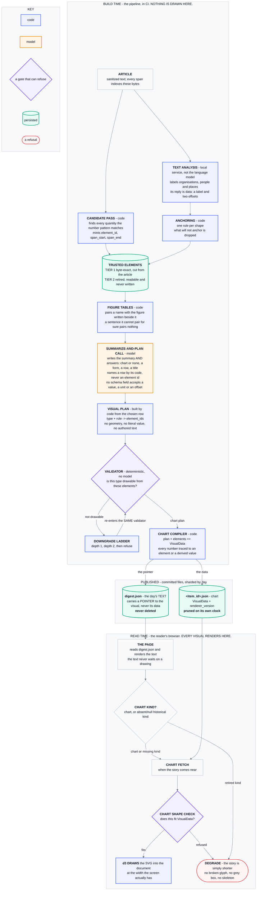

# Visual planning and rendering

**Last Updated**: 2026-11-18

How an item gets a numeric chart or - most of the time - nothing at
all: which pass decides, which gate refuses, and what every refusal is called.
The rule this subsystem serves is in
[the visual rule](../../concepts/digest.md#the-visual-rule): a supported comparison
or relationship must become quicker to grasp than prose alone. Facts already
in the summary are not disqualified, but decoration earns no space and every
source-evidence and qualification check still applies.

This page holds the decision path end to end, and the drawing of it. Each step
along that path is written up on a page of its own, and the table below routes.

## Where each step is written up

Six pages, one question each. Arrive at the one holding your question and stop.

| Page | The question it answers |
| --- | --- |
| this one | Which pass decides a visual, which gate refuses, and what every `none` is called |
| [what-a-visual-plan-may-say-and-what-happens-to-one-that-is-refused.md](what-a-visual-plan-may-say-and-what-happens-to-one-that-is-refused.md) | How a chart answer becomes a plan, the eleven checks it must clear, and the ladder a refused plan may step down |
| [where-every-drawn-figure-came-from.md](where-every-drawn-figure-came-from.md) | This number is on a bar - is it the article's own characters, or arithmetic over them, and what chain proves it |
| [where-a-drawing-becomes-pixels.md](where-a-drawing-becomes-pixels.md) | Who renders the chart, what its compiler publishes, and what a reader receives |
| [one-visual-one-file-and-the-race-between-two-runs.md](one-visual-one-file-and-the-race-between-two-runs.md) | What the file is called, and what happens when two overlapping runs write it |
| [what-drawing-costs-and-what-has-been-retired-for-it.md](what-drawing-costs-and-what-has-been-retired-for-it.md) | What drawing has cost, what has already been retired for costing too much, and where the line is read from |

## One model, one pass, inside `work`

There is no separate visual stage and no second model:

```
idhazh work --date <D> # one call an item: the summary and the answer about a chart
idhazh assemble --date <D> # the day payload picks up whatever was drawn
```

The summarize-and-plan call writes the summary and, when code built a table of figures
from the article, the answer about a chart in one reply. So the same model that read the
article decides whether a chart is worth drawing, and `work` builds the plan from its
answer and compiles the data while it still holds the text.

The shared system turn joins the separately configured
`write_digest_summary` and `plan_visual` files; the later `continue_summary`
turn reads its own file from the same selected config root. Their paths and
rendering rules belong to [the prompt page](../summarize/prompt.md).

Before the request is built, code finalizes the source element table and builds tables of
names and figures from it, with no model
([the table rules](../summarize/prompt.md#the-model-is-shown-tables-of-figures-never-the-element-table)).
The request shows those tables after the article, and its grammar admits only `none` or a
form on offer, and only a row code the tables show. A valid decline remains available. Only
`bar` and `dot` are offered, because they are the forms whose marks are one name and one
figure and that need no separately stated whole. The validator, the replacement ladder and
the compiler still support the other numeric forms, but no model answer reaches them, so
the ladder is not reachable from an answer today (it stays off by default). The
[compiler capability table](where-a-drawing-becomes-pixels.md#declared-types-are-not-delivery-promises)
names the abandoned forms retained only for historical reading.

**It was two stages on two models until 2026-09-13.** `idhazh visuals` ran a Qwen3-4B after the
summarizer had finished, decided a picture from the summary, and rendered it in a job of its own.
Plan 11 row #6 deleted that stage, the job, the model and the flag that switched between the two
paths, in one commit (maintainer ruling 2026-09-13: move forward, no rollback). The reason the pass
moved is that a second pass decides from a **summary of** the article rather than from the
article, and both payloads validate - so nothing would say it had happened. What that stage cost
while it ran is in
[what-drawing-costs-and-what-has-been-retired-for-it.md](what-drawing-costs-and-what-has-been-retired-for-it.md).

Two things follow from `work` being the job that draws. It is sharded four ways, so four runners
render a quarter of the day each instead of one runner rendering all of it against a budget; and
the file a shard writes stays on its runner, which is thrown away. What reaches `assemble` is the
decision inside `items-<n>`, and a rendered decision carries the chart's bytes in `spec` - the
same string the shard wrote to its file. `assemble` positively selects chart
decisions and writes their files before recording the day, without replacing
a file already present. Retired visual kinds produce no view or asset; their
historical outcome metadata remains unchanged. Until 2026-10-04 each shard also uploaded its whole
day directory as `shard-visuals-<n>` and `assemble` merged the four into its own. In run
`37212772816` two of them carried a newer `digest.json` than the other two, and the merged file
could not be read. No job hands a file under `frontend/public/` to another job now.

**The flag is the first of two commits** (plan 11 rows #5b and #6). The second deletes the flag,
the small model, this stage and its job together. Until then the flag off leaves the pipeline
exactly where it was.

**Numeric charts cross the actual worker and assembly boundary in tests.**
`test_assemble_publishes_a_chart_from_its_decision_alone` runs
the production call against a local boundary reply. Real extraction and anchoring finalize
the evidence; the actual request must show the rows code built from it and admit their
codes. Only named serialized article, summary, decision and item-health
outputs, plus their input fingerprint, cross into a fresh publisher tree.
Neither the worker's public directory nor its captures cross.

Ordinary `stage_assemble` must recreate the named asset from those outputs.
The test checks its exact worker bytes, the digest reference and the
publication inventory, then feeds those published bytes to the actual
TypeScript reader guard. A legitimate declining boundary answer separately
keeps its summary publishable, records `model_declined` and publishes no visual.
Removing the numeric assembly writer or rejecting the compiler's payload in the
reader breaks this coverage.

The existing reader journey uses compiler-produced numeric canaries with a
plain item beside them. It checks served asset bytes, then exercises missing
and empty numeric responses without losing the story, followed by recovery on
reload. Navigation/reload retains the numeric observer lifecycle regression
coverage. These are deterministic transport and rendering
checks, not evidence that the current model generates useful plans.

It needs an article a bar can legally be drawn from, which is rarer than it sounds.
`tests/fixtures/pages/article.html` states three figures in three units - dollars, megawatts and
customers - so no table of one unit can be built from it, and `units_convertible` would refuse every
bar expressible from it anyway.
`tests/fixtures/pages/wind.html` exists for this: four countries, four figures, one unit, matching
the shape `tests/fixtures/visual-validator/` already keeps as the plan that passes. Its recorded
reply is `summarize-and-plan/wind-summary-and-plan.json`: a `bar` answer whose `focus` is the
Denmark row, `r1`, citing a row and no element id. The four rows it chooses among are the ones
this pipeline builds from the page and from the four countries a loopback stand-in for the
text-analysis service labels - so an extractor or table-builder change that
moves or drops a row turns the test red rather than quietly turning the picture off.

**Generation and normal publication require separate observations.** Retain
the actual call for named warranted numeric chart examples and a
legitimate no-visual example, using the committed model and production path.
Record the code revision, model identity, source inputs and runner conditions
beside the captured requests, replies, decisions and resulting named assets.
Recorded or authored replies, an old capture, a forced type and a successful
summary cannot establish present-day generation. A warranted example that
still declines or malforms remains an unresolved defect, not a restored
capability.

After producer delivery, inspect a normal scheduled Content refresh run's
actual source revision, decisions, assets, digest, inventory and served day.
The [Pipeline tests workflow](../../reference/github-actions.md#pipeline-tests)
can show production execution but publishes no reader-facing day. Do not
repeatedly dispatch a production writer to turn this observation into a merge
gate.

## The model never writes a number

This is the whole safety design, and it is structural rather than instructed.

1. Code cuts quantity and date spans, then anchors the mentions the text-analysis
   service returned against the same article text.
2. Code builds tables of names and figures from those elements. The model is shown
   the rows and answers with a form on offer and a row code the request showed,
   enforced by the article-specific request grammar, and with words that carry no digit.
3. The plan is built here in Python from the elements the chosen row's table stands
   for, and the spec from the plan. Any derived value
   is arithmetic over source-backed elements through the closed, provenance-
   carrying rules in [where every drawn figure came from](where-every-drawn-figure-came-from.md).

A model-authored value is therefore unreachable, not merely unlikely. A chart
may show a derived value that is not literal source text only when code computes
it from those elements and preserves its provenance. The source-or-derived
boundary is a property of the shape, not a hope about the prompt.

What the extractor refuses to turn into an element in the first place, and what the four functions are
that may reach a number the article did not write, are in
[where-every-drawn-figure-came-from.md](where-every-drawn-figure-came-from.md).

## The model is not asked a question already answered

A published bar is one name beside one figure the article states. Every bar in a chart
shares one unit, and a chart needs at least `visuals.min_chart_points` of them. So an
article can carry a chart only if code can build a table of that many rows from it. **The
table builder is the gate**: a table built means the question about a chart is asked; none
built means it is left off, and the answer is `none` whatever the model would have replied.

Two properties of how it is written, and each one is load-bearing:

- **No word of the article is read as an instruction.** The builder uses a name's words to
 find where the name stands again in the text, and a figure's unit and place. A predicate
 that branched on what fetched prose says would let a stranger's page steer our control
 flow, which is Guardrail #11 with no prompt in sight
 ([the cell checks](../sources/trust-boundary.md#the-tables-of-figures-are-article-words-inside-the-fence)).
- **A figure with no unit forms no table.** A byline or a page number has no unit and is not
 a measure to compare.

## The gate suppresses the question and never skips the call

The summarize-and-plan call is the call that writes the summary, so the gate cannot skip it:
what it takes away when no table was built is the answer about a chart, not the request. The
grammar is what takes it: `summarize_and_plan_model(plan=False)` is the summary draft alone, with no `visual`
property, so the decoder has nowhere to write an answer. A smaller budget on its own would not do it -
the decoder would start the answer and meet the cap part-way through, which spends the decode the gate
exists to save and returns a cut reply. So the gate does not touch the budget at all.

| What the gate changes about the summarize-and-plan call | Table built | No table |
| --- | --- | --- |
| The decoder shape | `{summary, visual}` | the summary draft alone |
| The output budget | the model file's response limit | the same |
| The trailing user turn | the tables and the continuation | the continuation only |
| The system turn and the article | unchanged | unchanged |

The budget is the response limit the model file names (`sampling.max_tokens`, 8,192 in every committed
model file), gated or not. With no length asked of the model there is no word bound to derive a budget
from, and a second, smaller number for the gated call would be a cap on the summary a table-less item may
write. What the gate saves is the decode of the answer about a chart, which the grammar removes.

**What that saves is small and its size is an estimate.** The answer is a few short fields - a sentence
for `why`, a title, usually a null caption - so the saving is likely small beside the summary's decode.
Tokenising the summary half and the `visual` half of captured replies with the configured vocabulary
would settle it. How often the gate fires is the other half of the bill: the share of items whose
decision is `not_reachable`. Neither is measured here.

**The trailing ask loses its visual field too, and that is the same rule read a second time.** A turn that
asks for a `visual` the grammar has nowhere to put does not simply get ignored:
constrained decoding renormalises onto the tokens the grammar allows, so the text goes into the only
channel left open, which is the summary a reader reads.
`config/prompts/continue-summary.txt` derives that last line from the selected
reply shape. The chart rules in `plan-visual.txt` stay in the shared system prefix and open by saying the
answer is written only when tables are listed after the item, so a request with no table reads them as not
applying, and the two requests cannot drift before the article.
A test asserts that cached prefix is identical with and without tables.

**Leaving the question off moves nothing in front of the article.** Both differences sit after the
system turn and the article, so the cached prefix a gated item reuses is the prefix
an ungated one reuses.

## Every `none` says which gate refused it

`none` is the majority outcome by design - two items in three - so a `none` with no cause makes the
largest number an operator reads the one that explains nothing, and no gate can be retired, tuned or
shown to work. `VisualDecision.none_reason` is a typed enum rather than a sentence in `rationale`,
because a console counts members and cannot count prose.

| Member | The route it names |
| --- | --- |
| `not_reachable` | No table of names and figures was on offer, so no question about a chart was asked. The call still ran and still wrote the summary. A row written before 2026-11-18 means instead that no choice over the article's elements could have validated. |
| `model_declined` | The model was asked and answered `none`. The ordinary answer, and the one the design wants to stay common. |
| `validation_failed` | A plan was drafted, the validator refused it, and the ladder reached no depth that validates. |
| `output_budget_cut` | The reply ran out of output budget after the summary closed, so the plan was never written. The item publishes; the picture is what was lost. |
| `window_exhausted` | The prompt filled the context window, so the plan was cut before it was written. |

**One member per gate, never one per call site.** The gate that leaves the question about a
chart off the request records `not_reachable` wherever it fires - no table built, and tables
dropped because they would not fit the window - because
what an operator acts on is the gate rather than the line of code. And **which** check refused is
`ValidatorCheck`'s to say: one fact with two homes is a fact that can disagree with itself.

`validation_failed` means a plan was drafted and this build refused it. Its
`rationale` distinguishes invalid evidence, an unsupported compiler, an
unselected request, an answer about a chart that breaks one of its own rules and
a replacement that cleared no measured floor. The
summary remains publishable. `rejection_reason` records the first
`ValidatorCheck` that rejected the original request, and remains on the
decision if a replacement is later selected or refused. It stays null when
the original request passed validation. A shape, configuration or compiler
refusal does not create a rejection, but does not erase one already recorded
for the original request.

An invalid plan keeps its first native field and rule in the bounded,
sanitized `rationale` and the item-health `failed_field` and `failed_rule`
cells. The [plan's cross-field rules](what-a-visual-plan-may-say-and-what-happens-to-one-that-is-refused.md#the-plan-a-compiler-draws-from-and-the-four-things-it-may-not-carry)
supply those details directly; recording never parses an English message.
An answer that breaks one of [its own rules](what-a-visual-plan-may-say-and-what-happens-to-one-that-is-refused.md#a-chart-answer-becomes-a-plan-in-code)
is recorded the same way, as `visual.focus` and `visual_choice_focus_required` for an answer
with no row.
Rejected values, unknown input keys and article text are not diagnostics.
A successful item-health row keeps `detail` null: its visual refusal does not
make the summary a failure.

The final `VisualDecision` records the original `planned_type` and the
successfully written `rendered_type` separately. `downgrade_depth` is zero
without a selected replacement and positive after one is selected, even if its
later write fails. `deepest_downgrade_depth` records the deepest rung reached
even when no replacement is selected; it is the attempt depth used by
`VisualAttemptRow`, and is distinct from the selected depth above.
`gate_floor_applied` is true if a numeric mark-count floor excluded a
replacement candidate, false if numeric floors were compared but excluded
none, and null if no numeric floor was compared. `marks` counts delivered
marks, not the flat mark pool. Without successful delivery, the delivered type
and mark count are null. Untyped requests and older unmeasured outcomes leave
the new evidence fields null; never infer an old request from its final drawing.
Only a valid native plan establishes the requested type. A contradictory
decline or malformed JSON cannot establish it, even if its raw bytes name a
type.

The worker projects the requested type, delivered type, selected depth, marks
and identity into its sealed item record before either completion path. The
full decision remains in the item's visual-decision payload, including the
first rejection and deepest rung needed to record an attempt without parsing
`rationale`. The record stage writes the item-health row through
`state/raw/item-health/`; its compactor later writes the corresponding
`state/compact/item-health/` files.

The shard's `visual_outcomes` report counts requested types and computes
`wasted_decode_rate`: measured typed requests not delivered in their requested
form divided by all measured typed requests. Both a different delivered type
and no delivered type count. Thus a safe replacement still records demand for
the missing requested form, not a quality failure in the replacement. The
result is a fraction, not a token-weighted cost; no measured request gives
null, not zero. Declines, suppressed or unparseable requests and historical
unknown outcomes do not enter its denominator. The stored item rows preserve
the inputs, not a second copy of the derived rate.

**Five members, because five routes have writers.** No table, model decline,
drafted-plan refusal, output-budget cut and context-window cut each have a
producer. A proposed gate without a writer gets no member. The oracle holds the
enum to that: every route is driven from its own fixture and the set collected
must equal the enum exactly.

The retired single-call planner writes null. Its causes are sentences in
`rationale`, and several - no summary to illustrate, a reply that lost its
shape, a kind with no renderer - are not gates at all. A payload written before the field existed writes null for the same reason, and
that is the honest reading: nothing committed says which gate refused it.

## Two controls that run after the model has answered

**Bars must measure the same thing.** The largest group of chosen bars that share a unit is kept
and the rest are dropped. This never invents a bar and never mixes units; it only ever removes. If
what remains is below `visuals.min_chart_points`, the item is decided to nothing.

**One quantity may fill one bar.** A draft that names the same `fact_index` twice is decided to
nothing. Without this the model can name index 3 three times, `same_unit_bars` groups all three
under one unit, the width check passes, and a chart of one number under three invented labels
publishes - every value true and the comparison fabricated.

**A caption written about dropped bars is discarded.** If any bar was removed, the model's caption
described a chart that no longer exists.

## The whole flow, drawn, so nobody has to infer it again

**This is the current path from article text through extraction and visual
planning to the reader.** The
[extraction page](../extraction/elements.md) defines how source-backed elements
are found, labelled and anchored. **A box carries a name and the one assertion
an arrow cannot carry**, and every field list lives in the table below, keyed by
node id.


```mermaid
%%{init: {"theme":"base","themeVariables":{"fontSize":"15px","fontFamily":"ui-monospace, SFMono-Regular, Menlo, Consolas, monospace","background":"#ffffff","mainBkg":"#ffffff","edgeLabelBackground":"#ffffff","labelBackground":"#ffffff","textColor":"#0b1020","titleColor":"#0b1020","nodeTextColor":"#0b1020","secondaryTextColor":"#0b1020","tertiaryTextColor":"#0b1020","lineColor":"#6e7781","primaryColor":"#eef2ff","primaryBorderColor":"#4c6ef5","primaryTextColor":"#0b1020","clusterBkg":"#f8f9fb","clusterBorder":"#c3c8d0"}}}%%
flowchart TD

  subgraph BE["BUILD TIME - the pipeline, in CI.  NOTHING IS DRAWN HERE."]
    direction TB
    ART["<b>ARTICLE</b><br/>sanitized text; every span indexes these bytes"]
    CP["<b>CANDIDATE PASS</b> - code<br/>finds every quantity the number pattern matches<br/>mints element_id, span_start, span_end"]
    TA["<b>TEXT ANALYSIS</b> - local service, not the language model<br/>labels organisations, people and places<br/>its reply is data: a label and two offsets"]
    ANC["<b>ANCHORING</b> - code<br/>one rule per shape<br/>what will not anchor is dropped"]
    TE[("<b>TRUSTED ELEMENTS</b><br/>TIER 1 byte-exact, cut from the article<br/>TIER 2 retired, readable and never written")]
    TB["<b>FIGURE TABLES</b> - code<br/>pairs a name with the figure written beside it<br/>a sentence it cannot pair for sure pairs nothing"]
    C2["<b>SUMMARIZE-AND-PLAN CALL</b> - model<br/>writes the summary AND answers: chart or none, a form, a row, a title<br/>names a row by its code, never an element id<br/>no schema field accepts a value, a unit or an offset"]
    VP["<b>VISUAL PLAN</b> - built by code from the chosen row<br/>type + role -&gt; element_ids<br/>no geometry, no literal value, no authored text"]
    VV{"<b>VALIDATOR</b> - deterministic, no model<br/>is this type drawable from these elements?"}
    DL["<b>DOWNGRADE LADDER</b><br/>depth 1, depth 2, then refuse"]
    VC["<b>CHART COMPILER</b> - code<br/>plan + elements =&gt; VisualData<br/>every number traced to an element or a derived value"]
    ART --> CP --> TE
    ART --> TA --> ANC --> TE
    TE --> TB --> C2 --> VP --> VV
    VV -->|"chart plan"| VC
    VV -->|"not drawable"| DL
    DL -->|"re-enters the SAME validator"| VV
  end

  subgraph PUB["PUBLISHED - committed files, sharded by day"]
    direction TB
    DJ[("<b>digest.json</b> - the day's TEXT<br/>carries a POINTER to the visual, never its data<br/><b>never deleted</b>")]
    VJ[("<b>&lt;item_id&gt;.json</b> - chart<br/>VisualData + renderer_version<br/><b>pruned on its own clock</b>")]
  end

  subgraph FE["READ TIME - the reader's browser.  EVERY VISUAL RENDERS HERE."]
    direction TB
    PG["<b>THE PAGE</b><br/>reads digest.json and renders the text<br/>the text never waits on a drawing"]
    ROUTE{"<b>CHART KIND?</b><br/>chart, or absent/null historical kind"}
    FJ["<b>CHART FETCH</b><br/>when the story comes near"]
    SC{"<b>CHART SHAPE CHECK</b><br/>does this fit VisualData?"}
    D3["<b>d3 DRAWS</b> the SVG into the document<br/>at the width the screen actually has"]
    DEG(["<b>DEGRADE</b> - the story is simply shorter<br/>no broken glyph, no grey box, no skeleton"])
    PG --> ROUTE
    ROUTE -->|"chart or missing kind"| FJ --> SC
    SC -->|"fits"| D3
    SC -->|"refused"| DEG
    ROUTE -->|"retired kind"| DEG
  end

  VC -->|"the pointer"| DJ
  VC -->|"the data"| VJ
  DJ --> PG
  VJ --> FJ

  subgraph KEY["KEY"]
    direction LR
    K1["code"]
    K2["model"]
    K3{"a gate that can refuse"}
    K4[("persisted")]
    K5(["a refusal"])
  end

  classDef code fill:#eef2ff,stroke:#4c6ef5,stroke-width:2px,color:#0b1020;
  classDef model fill:#fff4e6,stroke:#f08c00,stroke-width:2px,color:#0b1020;
  classDef gate fill:#f3f0ff,stroke:#7048e8,stroke-width:2px,color:#0b1020;
  classDef ledger fill:#e6fcf5,stroke:#0ca678,stroke-width:2px,color:#0b1020;
  classDef none fill:#fff5f5,stroke:#e03131,stroke-width:1.5px,color:#0b1020;
  classDef plain fill:#f8f9fa,stroke:#adb5bd,stroke-width:1px,color:#0b1020;

  class ART,PG,ROUTE,FJ plain;
  class CP,TA,ANC,TB,VP,DL,VC,D3,K1 code;
  class C2,K2 model;
  class VV,SC,K3 gate;
  class TE,DJ,VJ,K4 ledger;
  class DEG,K5 none;
```

**What the boxes do not carry.**

| Node | What it holds |
|---|---|
| `CP` | Code reads first and finds every quantity it can, and the tables of figures the model is shown are built from what it found. It emits `element_id`, `kind`, `span_excerpt`, `span_start`, `span_end`, `value`, `unit`, `sentence_index`, `extractor` |
| `TA` | A local process the run starts, asked once per article before the model reads it. The pipeline reads a label and two offsets of each mention and nothing else; the words it returns are compared with the characters those offsets cut from `Article.text`, and a mention whose words differ is dropped. No word it returns reaches a prompt, path, URL or command |
| `TB` | Reads the element table and the article text with no model. A table is a run of consecutive sentences that each pair names with exactly one figure of one unit. A wrong pairing is worse than a missed one, so a sentence it cannot pair for sure pairs nothing ([the rules](../summarize/prompt.md#the-model-is-shown-tables-of-figures-never-the-element-table)). Each row keeps its name element and its figure element; the model is shown only the row code, the name and the figure's words |
| `C2` | The model's whole vocabulary for what to draw is the row codes the request shows and the forms on its forms line. **It writes no number**: no field of its answer is numeric, which is a property of the grammar, and a chart answer whose `why`, `title` or `caption` holds a digit is refused by name. The validator's numeral check is the second line |
| `VP` | `decision`, `purpose`, `type`, `encodings`, `declared_whole_element_id`, `element_ids`, `labels`, `annotations`, `why`, `title`, `caption`, `confidence`, `plan_version`. Four prohibitions: no geometry, no literal value, no authored text, no `alt_text`. Code fills it from the chosen row: purpose `comparison`, the offered form, the table's names as the category channel and its figures as the quantity channel in row order, no other channel, no declared whole, no labels, and the focus row's figure as the one annotation. `confidence` is optional and null here |
| `VV` | Ten checks: elements exist; semantically compatible; units convertible; roles valid for the type; enough data; no duplicate in a role; no invented values; numerals matched; plan version current; stacked parts equal a separate declared whole |
| `VC` | The chart compiler: the one place chart numbers come into being, each arithmetic result resolved over Tier 1 elements through the closed four-function allow-list - `count`, `sum`, `share_of_declared_whole`, `convert` |
| `DJ` | The day's text, and for each item a pointer: the visual's `kind`, its `state`, and where its file is. **No visual data, ever** |
| `VJ` | A chart as `VisualData`: `item_id`, `type`, `renderer_version`, the flat `marks` pool with provenance, and the encoding that assigns marks to channels |
| `ROUTE` | Only `chart` or absent/null historical kinds draw. Retired kinds become no visual, including in cached-day ingestion |
| `SC` | The numeric reader validates its payload and refuses rather than guesses; a refusal costs the story its visual and nothing else |

**Three things this drawing rules out, and a plan-doc may not relax any of them.**

**The model names the form and a row; it never draws and never writes a number.** Code builds the plan from the row's table. Every displayed value is cut by code from the article's own bytes, or derived from those by the allow-list.

**Nothing is drawn at build time.** There is no SVG on disk, no headless browser, and no Node in the pipeline. `BE` ends at data.

**The text never waits on a visual.** `digest.json` is a complete page on its own. The visual file is a separate fetch, and a reader who never scrolls to a chart never pays for that file.

## Design rationale

Type selection is active; safe replacement remains a separate, inactive policy. Their
configuration, production evidence and refusal rules are defined on the
[plan validation page](what-a-visual-plan-may-say-and-what-happens-to-one-that-is-refused.md).
The existing item ledger carries terminal measurements so requested forms
remain visible through both replacement and refusal. A failed file write is
not delivery, and a useful replacement is still an unmet original request.

**Why attempt evidence stays separate from delivery.** Selected depth says
which replacement was chosen; deepest depth and first rejection explain the
search even when it ends in refusal. An attempt writer can read these typed
facts from `VisualDecision` instead of parsing `rationale`. A search may
compare several numeric floors, so nullable boolean evidence records whether
any floor excluded a candidate without presenting one floor as representative.

**Why the model picks a row instead of writing a spec.** The obvious design is to ask the model
for a Vega-Lite object. It is also the design where a hallucinated axis value is one sampling
accident away, and where the only defence is checking the output against the article afterwards -
a check that has to parse an arbitrary spec and decide which of its numbers are data. Row codes
invert that: the model's entire vocabulary for what to draw is the codes the request showed, a
bound check is an enum in the grammar, and the property holds for specs nobody has thought of yet.

**Why the feed floor of one prompt rule became two code controls.** "Do not chart a year" and "do
not chart quantities that measure different things" were requests. A request is negotiable by a
4B reading an article that mentions years. Both are now enforced - the first in the extractor, the
second after the model answers - and the prompt is shorter for it.

**Why a table-less item still writes a decision.** Silence is what turns a gate into a quiet descope.
`none_reason` of `not_reachable` plus a rationale naming the reason means a later reader of the payload
does not have to infer why an item has no picture.

**Why the table gate is pinned to the validator's role table.** The forms a table is offered as are a
prediction of what the validator accepts, and a prediction written from somebody's reading of the rules is
wrong the first day a rule moves - silently, and in the direction that costs items their pictures. A test
holds each offered form to the validator's role table (a name and a figure a mark), so a rule can only
move in one place and a move the builder has not followed fails the build.

**Why the question about a chart is left off the request when there is no table.** A turn that asks for
fields the grammar cannot hold is
not ignored: constrained decoding renormalises onto the allowed tokens, so the text goes into the
only channel still open, which is the summary a reader reads. So the grammar and the trailing ask lose the
visual field together, and the chart rules stay in the shared system turn, which opens by saying the answer
is written only when tables are listed after the item.

**Why `none_reason` lives on the decision and not on the plan.** Three of its five members fire when
no plan object exists at all - the gate leaves the question about a chart off the request, and the budget cut and
the window cut both lose the plan's bytes - so a field on `VisualPlan` would be unwritable on exactly
the routes it is for. `VisualDecision` exists for every item either way, and `asked_the_model` and
`drafted_chart` are the same kind of fact in the same payload. Authority: Fowler, 2026-09-11.

**Why a cut reply needs two members and not one.** `output_budget_cut` and `window_exhausted` arrive
as the same event: `--no-context-shift` means a decode that reaches the end of the context window
stops there, on an ordinary HTTP 200, with the same `finish_reason` of `length` a decode that spent
its whole output budget returns. One member for both would have made the largest thing an operator
can act on unreadable, because the fix for one is not the fix for the other - a budget cut is the
reply shape's own arithmetic, and a window cut is `--ctx-size` on the summarize entry against
`extract.truncation_cap_tokens`. Separating them costs one comparison at the one call site that
writes either, over numbers already in hand: the server counted the prompt, and the summarize-and-plan call's budget is
the model file's response limit. Plan 11 row #3f, 2026-09-13;
[`../summarize/prompt.md`](../summarize/prompt.md) carries the sizing behind it.

**This page became the decision path and an index on 2026-09-23, and five pages came off it.** It
answered at least six questions at about 31,700 tokens, which made it the heaviest page the routing
table could send an agent to once the config and frontend pages were cut. The stem keeps the
question somebody arrives with - how does an item get a chart or nothing - and the drawing of that
chain; each child keeps one of the others. The cost is real and is the usual one: a ruling whose
page nobody can guess now costs a table lookup, where before it cost a long scroll
([../../reference/documentation-structure.md](../../reference/documentation-structure.md)). One
correction travelled with the split: the flow drawing's node table said the validator holds eight
checks and it holds eleven - `plan_version_current`, `stacked_bar_exhaustive` and `pie_exhaustive` were added after the drawing was made.
Authority: Fowler.

### Diagrams deferred

`flow` is abandoned and excluded from active requests; retaining its historical
name does not defer a delivery. The other diagram families and their supporting
work remain deferred, not delivered: sequence and contrast word lists, the
`comparative` and `processual` reporting classes, force layout, `hierarchy`,
`state`, `mindmap`, and the expanded whole-day check. The summarize-and-plan
call chooses from the configured active visual types, and code validates its
choice.

The intended reader benefit is a diagram that explains a process or relationship
better than the summary alone. No reader-facing diagram has yet demonstrated
that benefit, so its supporting classification and layout work is deferred too.
Keep the current three reporting classes; other visual work does not wait for
diagram delivery.

If diagrams return to scope, first use source-backed examples to establish that
reader benefit. Every arrow must have supporting article evidence; paragraph
order alone supports no connection, and a matching text span does not prove
direction or causality. These are requirements for future work, not claims that
diagram validation or rendering exists today.

## Rejected alternatives

| Option | Why rejected |
| --- | --- |
| Ask the model for a Vega-Lite spec directly | A fabricated axis value becomes reachable, and verifying it afterwards means parsing an arbitrary spec to work out which numbers are data. |
| Skip the summarize-and-plan call entirely when the gate refuses | The summarize-and-plan call is the call that writes the summary, so skipping it costs the item the thing a reader came for. The gate leaves the answer about a chart off the request and never skips the call. |
| Suppress the answer about a chart with a smaller budget and leave the grammar whole | The decoder starts the answer and meets the cap part-way through, which spends the decode the gate exists to save and hands back a cut reply. The grammar is the control; a budget is a request. |
| Leave the question about a chart in the trailing ask when the grammar cannot hold it | Constrained decoding renormalises onto the allowed tokens, so a title, a caption and a reason with nowhere to go end up in the summary a reader reads. |
| A `none_reason` member for each of the six gates the design record names | Four of the six have no code behind them, so four members would be words nobody can produce, nobody can retire and nobody can tell from a bug. Each arrives with the row that builds its gate. |
| Put `none_reason` on `VisualPlan` as a third code-stamped field | Two of its four routes fire when no plan object exists at all, so the field would be unwritable on exactly the cases it is for. |
| A `skip_unreachable` config flag | A knob whose `false` setting means "ask about a chart on a request that has no table to ask it about". Nobody would set it. Whether a table is built is derived from `visuals.enabled_kinds`, `visuals.enabled_types`, `min_chart_points` and `max_chart_points`, which are already config. |
| A second, smaller model to triage items first | Two calls where the point was zero. |
| Discard the whole chart when one bar disagrees on units | Observed live: the model picked three correct year-on-year megawatt bars and appended the sector headcount. Three good bars thrown away to reject one bad one. |
| Plan on the 8B | Classification is the easy task. The big model belongs on summarization, and a second set of weights would not fit the pass anyway. |

## See also

- [what-a-visual-plan-may-say-and-what-happens-to-one-that-is-refused.md](what-a-visual-plan-may-say-and-what-happens-to-one-that-is-refused.md) - the shape and the eleven checks.
- [where-every-drawn-figure-came-from.md](where-every-drawn-figure-came-from.md) - where every number on an axis came from.
- [where-a-drawing-becomes-pixels.md](where-a-drawing-becomes-pixels.md) - who draws the chart, and what the compiler publishes.
- [one-visual-one-file-and-the-race-between-two-runs.md](one-visual-one-file-and-the-race-between-two-runs.md) - the file's name, and the race it ended.
- [what-drawing-costs-and-what-has-been-retired-for-it.md](what-drawing-costs-and-what-has-been-retired-for-it.md) - what drawing has cost, and what was retired for it.
- [`../../concepts/digest.md`](../../concepts/digest.md) - the visual rule this serves.
- [`../contracts/schemas.md`](../contracts/schemas.md) - where a persisted shape lives, and what binds the frontend's copy of one.
- [../../reference/github-actions.md](../../reference/github-actions.md) - workflow triggers and publication rules.
- [`../sources/trust-boundary.md`](../sources/trust-boundary.md) - why article text is data.
- [`../contracts/determinism.md`](../contracts/determinism.md) - why decoding is pinned in one place.
- [`../../reference/benchmarks/articles-that-state-a-whole.md`](../../reference/benchmarks/articles-that-state-a-whole.md) - how often an article declares a whole its parts add up to, which is what decides whether `pie` may be drawn at all.
- [`../../concepts/evaluation.md`](../../concepts/evaluation.md) - how a stage gets measured.
