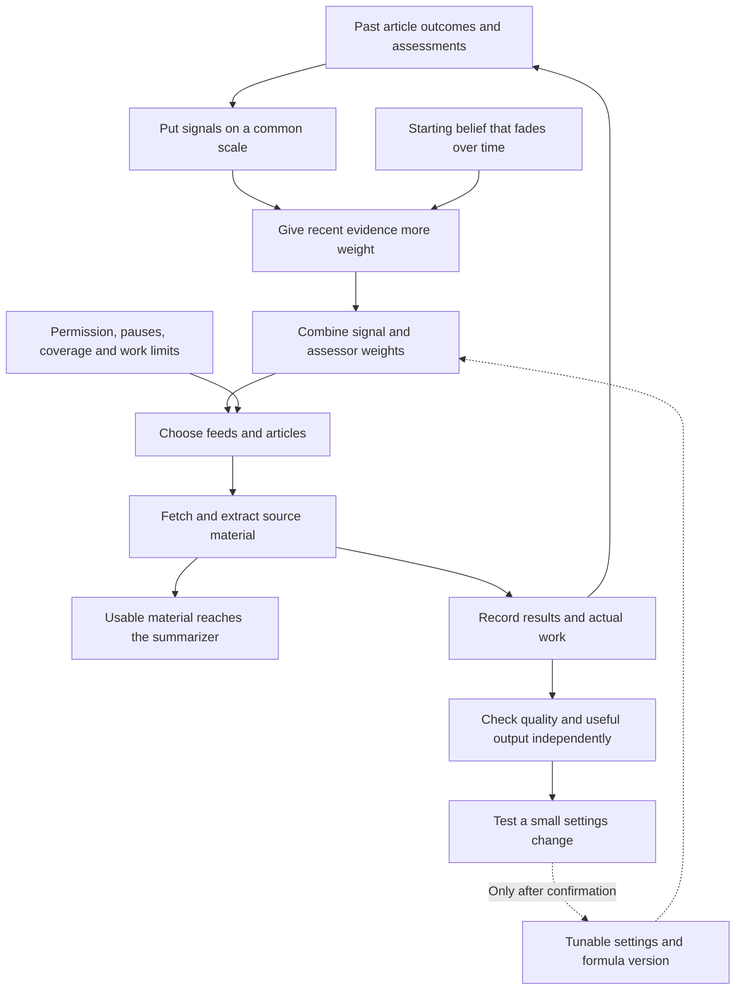

# Intelligent F.E.E.D - I Feed

**Last Updated**: 2026-09-09

**Status: design proposal and guidelines, not deployed behavior.**
F.E.E.D expands to Feed Evaluation & Execution Decider. Intelligent F.E.E.D -
I Feed is the project name for this design. The owner supplied the intent on
2026-09-09. This page recommends what to build for this app. Its settings and
methods can change as we learn. No scoring values have been calibrated, and no
improvement has yet been measured.

**A feed earns its place.** Being on our list gives it a chance to prove useful.
It does not guarantee requests, model time or space in the digest. A dependable
source earns more work; one that repeatedly sends us unusable material earns
less. Even a trusted source needs recent evidence.

The [feed concept](../../concepts/feed.md) names this intent.
[Health](health.md) and [discovery](discovery.md) describe today's behavior.
The research informs this design; it is not a ready-made implementation or a
promise that its published results apply here.

## What we should build first

The immediate problem is concrete: a feed can return valid RSS every time
while its articles repeatedly refuse access or yield only teasers. Our current
warning tells us about that problem but does not stop the next wasted request.

The recommended first delivery is **a trustworthy admission report and a
recoverable stop before article selection**. These use existing observations
and address a measured failure. The score begins as a visible explanation;
we test its proposed effects before letting it change more behavior.

| Priority | App-specific change | Value and limit |
| --- | --- | --- |
| First | Report every article in a bounded admission sample, including successful extraction warnings and selection exclusions. Return review when evidence is insufficient. | One readable exception can no longer hide a mostly blocked feed. This does not claim to automate editorial judgment. |
| First | Use each feed's recent article-access outcomes to pause normal article work after supported repeated failures. Record the cause and a next check. | Stops wasting another selection slot. Our model failures and quiet publishing days are not source failures. |
| First | Reserve a fixed allowance for new feeds and recovery checks, with enough distinct observations before restoring normal work. | A source can earn its way back. A pause ending permits a check, not an automatic return. |
| First | Show the evidence, proposed score and decision together. Compare the proposed decisions with today's behavior on captured examples. | We can inspect and tune the model before it controls the digest. A higher score alone is not success. |
| Adjacent fix | Make the existing affiliate exclusion match its intended host and path, not arbitrary text in a query. | Preserves the editorial decision without excluding unrelated reporting. |
| Later | Let the composite replace today's source-priority calculation; tune its settings automatically within tested limits. | Needs trustworthy quality assessments, selection records and independent comparisons first. |
| Later | Change topic assignments, add publisher-wide limits, use richer classifiers or combine LLM and human quality assessments. | Keep these possible without making them prerequisites for stopping known bad article requests. |

This is an impact-first choice, not a claim that exactly 20 percent of the
work produces 80 percent of the benefit. Preserve the wider model below, but
do not implement every paper or every proposed metric in the first delivery.

Keep today's freshness, duplicate suppression, source limits and source floor
at first. Record their effects so later changes are deliberate. Do not add a
second source-weight penalty on top of the old one. Keep the proposed generic
query cleanup separate because it changes article identity and old-record reads.

## The model in one picture

Read the arithmetic from top to bottom: put measurements on a common scale,
give recent evidence more influence, then combine the chosen weights. Selection
also checks permission and work limits. The lower loop tests settings against
actual results. It is not the score grading itself.

The first delivery supplies the evidence, inspection and temporary-stop parts.
Automatic score-led selection and settings promotion follow only when their
comparisons justify them. Every box remains replaceable through a versioned
contract, rather than through an unbounded plugin system.

For example, an HTTP 403 costs a request and an article-selection opportunity,
not generation tokens. A source that posts one useful weekly article gets no
failure on its quiet days. A prominent publisher whose readable pages contain
only promotional material does not become good merely by answering quickly.

## Objective and guidelines

Improve useful, distinct source material for the summarizer within the chosen
resource and coverage budgets. Catalog membership is not an entitlement to
requests, model work, reader space or permanent membership. Sustained delivery
earns those opportunities. A rising internal score is not the objective.

| # | Guideline | Consequence for the model |
| --- | --- | --- |
| 1 | Treat membership and execution as earned. | A newcomer gets a bounded trial. Evidence can increase, reduce, suspend or end its allocation. Keep its identity and history after removal. |
| 2 | Keep facts, assessments and decisions distinguishable. | Actual HTTP results, timings and counts are observations. Quality is an assessment. Eligibility and allocation are policy decisions made from both. |
| 3 | Make scoring methods replaceable and combinable. | Deterministic Python, LLM and human assessments can have different influence on different signals. Python computes the composite; that does not imply every assessment is deterministic. |
| 4 | Give new sources a starting belief, not a lifetime advantage. | Use a reference median for ordinary sources and configurable higher quality priors for official, trusted or human-curated sources. Distinguish a favorable prior from earned confidence. |
| 5 | Let evidence and starting advantages age. | Recent sustained delivery matters more than old success. Quiet weekly feeds lose evidence freshness, not receive invented failure observations. |
| 6 | Reward useful delivery and charge attributable waste. | Include lost selection slots, wasted requests and wasted model work. Keep their units and causes separate. More output or cheaper prose is not automatically better journalism. |
| 7 | Show the components behind the composite. | Report support, age, missing assessments and disagreement beside the score. Operational trust is not a certificate of factual truth. |
| 8 | Let tiers and topic assignments evolve. | Effective priority can move up or down. Vertical and lens assignments are semi-sticky: sustained evidence can change them. The vocabulary itself can have a new version. |
| 9 | Balance earned priority with coverage and discovery. | Source and publisher limits, coverage minimums and bounded exploration form part of allocation. Several feeds from one publisher do not establish several independent perspectives. |
| 10 | Separate temporary restraint from permanent removal. | Paywalls and repeated failures can stop normal work promptly. Recovery earns re-entry through fresh evidence; simply waiting does not prove recovery. |
| 11 | Treat filters and URL identity as model inputs too. | Review freshness, duplicates, failed-address suppression, exclusions, quotas and source floors together. A cleaner that merges different articles can corrupt both selection and reputation. |
| 12 | Tune against evidence outside the objective being optimized. | Compare policies on fixed, independently assessed outcomes and equal budgets. Include unselected sources so the model can discover its own blind spots. |
| 13 | Keep every policy choice revisable. | Ranges, mappings, weights, priors, decay, evidence requirements, transition authority and formula versions can change. Store enough provenance to compare and roll back those changes. |

## One feedback loop

1. Select due, permitted feeds within a polling budget, then observe their
 offering. Select bounded article work and record access and content outcomes.
2. Attach assessments from the enabled methods and classify sampled content.
3. Update age-weighted component estimates and their evidence support.
4. Apply eligibility, identity and selection policy. Allocate the available work.
5. Execute and record outcomes, including work that failed or was not attempted.
6. Periodically compare prediction with delivery, test policy candidates and
 review due sources for recovery or continued membership.

The admission utility and periodic hygiene pass are two entry points to this
same loop, not separate definitions of a good feed. The current utility's
any-one-success verdict is an access observation, not a sufficient admission
decision.

## How scoring works

A score has four ingredients: what happened, how much evidence we have, how
old it is, and how much each signal matters. The starting belief fills the gap
when evidence is scarce. It is not a record of success.

Higher quality and usable delivery help. More failed requests and wasted work
hurt. A signal's weight controls its importance; an assessor's weight controls
how much we rely on code, a model or a person to assess that signal. These are
different settings. The first delivery can give an unqualified method no
influence without removing the ability to use it later.

Always show the evidence beside the score. A source with one success has not
proved the same thing as a source with many successes across several weeks.
Three ratings of one article do not turn it into three independent articles.

The next sections retain the exact definitions for implementation. The overall
decision flow continues under [Choosing the next work](#choosing-the-next-work).

### Component evidence

Start with the following dimensions. This is a candidate set, not a closed list.
Each dimension has a declared observation unit, denominator and normalization.
Use $[0,1]$ internally as a convenient convention, with higher values better.
Preserve the raw values before normalization.

| Dimension | Proposed evidence | Important distinction |
| --- | --- | --- |
| Article quality | Substance, attribution, completeness and other rubric-defined assessments of readable articles. | Length, extraction success and summary faithfulness alone do not establish quality or truth. |
| Slot fulfillment | Reserved article opportunities for which the source delivered usable material, divided by opportunities with a known source-side outcome. | Our model failing after usable extraction is not a source failure. An unselected article did not waste a reserved slot. |
| Request efficiency | One minus source-attributable wasted requests divided by observed requests in the defined scope. | Retries consume requests but are not new independent article observations. |
| Model-work efficiency | One minus source-attributable wasted model time divided by observed model time in the defined scope. | A fetch-time 403 uses no generation tokens. Zero model work is missing evidence for this ratio, not perfect efficiency. |

Usable material means a substantive article or primary document with enough
context, attribution, dates and qualifications for a faithful summary. An RSS
teaser can be a good discovery input when its link supplies that material. A
teaser-only extraction, navigation page or affiliate promotion can be readable
without being useful. Preserve successful extraction warnings as evidence;
neither a minimum word count nor a fluent summary settles this question.

Classify attribution as source, pipeline or unresolved. Every attempt consumes
the resource budget, including permission checks and failed attempts. Only
supported source attribution contributes to a source penalty in this proposal.
Keep shared model startup and infrastructure costs visible without assigning
them arbitrarily to one feed. Useful long-form work is costly, not necessarily
wasteful.

Slot fulfillment already expresses source delivery loss. Adding a separate
inverse-yield penalty would count that same dimension twice. Request and model
waste are different resource dimensions, but their correlations still matter
when choosing weights. Rate estimates use their stated exposure denominators;
an unweighted average of daily percentages answers a different question.

### Direction is separate from importance

For raw metric value $r$, define versioned anchors $l_k<u_k$ and
$z_k(r)=\operatorname{clip}_{[0,1]}((r-l_k)/(u_k-l_k))$. Then normalize once:

$$
g_k(r)=\begin{cases}
z_k(r) & \text{higher is better},\\
1-z_k(r) & \text{lower is better}.
\end{cases}
$$

Quality and usable delivery are benefits. Refusal rate and wasted requests are
costs. Thus a rising refusal rate lowers utility even though all composite
weights are positive. A metric already expressed as one minus waste is already
benefit-oriented; do not invert it a second time.

Use a declared target-band normalizer where both too little and too much are
undesirable, rather than assuming more is always better. Article length is an
example of a possible diagnostic, not an automatic reward for verbosity.

The normalizer says which direction is good. The component weight says how much
it matters. Inside the linear blend, the sensitivity to a normalized estimate
is $(U-L)w_k a_{km}$: a larger weight makes the same change matter more. Current
weights do not learn that importance merely because new observations arrive.

Keep measurement validity separate from saturation. Reject impossible counts
or non-finite values; preserve valid raw values outside normalization anchors
and record that they saturated. Missing values remain missing. Frequent
saturation is a calibration warning, not a reason to silently move the anchors.
Freeze anchors within a policy comparison. Min/max scaling over whichever feeds
were selected today would change yesterday's meaning without a policy revision.

### Methods and priors

Let $x_{fkmj}=g_k(r_{fkmj})$ be normalized assessment $j$ for feed $f$, component $k$, and
method $m$. Methods can include deterministic code, an LLM, and a person.
HTTP statuses and elapsed time remain measured facts; an assessor's opinion
about them does not replace the observation.

A simple starting estimator combines a neutral reference, an expiring source
seed and decaying observations:

$$
d_j(t)=e_j 2^{-(t-t_j)/h_{e,k}},
\qquad p_{fkm}(t)=p_{fkm,0}2^{-(t-t_{\mathrm{seed}})/h_{p,k}}
$$

$$
\mu_{fkm}(t)=
\frac{\nu_k b_k+p_{fkm}(t)s_{fkm}+\sum_j d_j(t)x_{fkmj}}
{\nu_k+p_{fkm}(t)+\sum_j d_j(t)}
$$

Here $b_k$ is the neutral reference median, $s_{fkm}$ the source seed mean,
$\nu_k>0$ the neutral support, and $p_{fkm,0}$ the initial seed support.
The positive half-lives $h_{e,k}$ and $h_{p,k}$ govern observation and seed decay.
Times and half-lives use the same declared unit. Observation weight $e_j$ is
nonnegative and reflects the declared evidence unit and sampling policy.

The reference median comes from a versioned reference cohort, not whatever
sources survived the latest selection. For ordinary sources, set the seed at
that reference; a trusted seed can start higher. Tune its strength separately.
Refreshing state does not restart the seed clock. With no new evidence, old
advantages tend toward neutral and earned support declines. Low evidence can
lead to probation or review, rather than an invented failure or a guaranteed
place. Cadence-aware evidence windows protect infrequent publication.

Implement the sums incrementally, not by replaying lifetime history for every
score. Record event, assessment and arrival times separately. Declare what
$t_j$ timestamps for each component: the fetch event for access evidence, or
the material's capture time for an assessment of that material. A later rating
does not turn an old capture into a fresh source observation. Pending outcomes
are unknown, not failures.

At update time $t$, first decay stored state from its previous update using
$\lambda=2^{-\Delta t/h_{e,k}}$. For incoming evidence stamped $t_j$, use
$d_j(t)=e_j2^{-(t-t_j)/h_{e,k}}$ and update
$S\leftarrow\lambda S+d_j(t)x_j$ and $W\leftarrow\lambda W+d_j(t)$.
These replace the two observation sums above. Adding the incoming observation
at its full weight is the special case $t_j=t$, not the delayed-outcome case.
For rate components, preserve weighted numerators and denominators with matching
exposure units. Milliseconds of exposure are not independent quality samples.
Corrections to an already-settled opportunity replace its contribution or
trigger bounded replay; retries do not add successful-article votes.

### Composite and influence

$$
T_f(t)=L+(U-L)\sum_k w_k\sum_m a_{km}\mu_{fkm}(t)
$$

$T_f$ is the composite trust/usefulness score on the configured range $[L,U]$,
with $L<U$. Component weights $w_k$ sum to one. Method weights $a_{km}$ sum to
one within each component. All weights are nonnegative. A lower efficiency
component supplies the negative reward by lowering this composite.

The blend is compensatory: strong efficiency can mask poor quality if its
weights allow that. Therefore propose separate, tunable minimum material and
quality conditions for ordinary allocation, with bounded inspection of unknown
sources. An excellent request record alone does not satisfy those conditions.
Quality-weight bounds can limit compensation but are not a substitute for
checking the material. The composite is a utility index, not a calibrated
probability that an article will be good.

The method matrix can give code all influence over a measured component while
blending code, model and human assessments of quality. A disabled method has
zero weight. A missing assessment from an enabled method retains its prior and
is reported as missing; silently redistributing its weight would change policy.
Matching numeric ranges alone does not make different rubrics comparable.

Keep confidence separate from $T_f$. Count distinct underlying articles and
dates or publication cycles, not the number of assessors. Three ratings of one
article are three views of one observation. Track earned and prior support
separately. Confidence, uncertainty adjustments and minimum support are
calibrated policy choices, not a model's self-reported confidence.

Evidence support and evidence freshness answer different questions. Even the
usual weighted-sample calculation $(\sum_j d_j)^2/\sum_j d_j^2$ is unchanged
when all old observations decay by the same factor. It cannot alone certify
current behavior. Include age and possible drift bias in any claimed interval;
do not attach a standard Beta or UCB confidence label to arbitrary blended,
correlated assessments without validating its assumptions.

Python owns this arithmetic in either deterministic or hybrid mode. LLM and
human assessment outputs retain their method, rubric, model/prompt or reviewer
revision. Topic classification is a separate output from numeric assessment.
Changing its accepted labels can still change coverage allocation, so its
effects belong in evaluation too.

## Choosing the next work

Choose which feeds to ask, then which offered articles to try. Use past
delivery for the first choice and the newly offered links for the second.
Keep room for new and returning sources; otherwise a low-ranked source has
no way to show that it improved. Keep permission and temporary stops outside
the score so a large number cannot override them.

For the first delivery, retain existing story ranking and coverage limits.
Record the proposed score and which decisions it would change. Once qualified,
use it to replace source priority rather than multiply yet another penalty
into the current calculation.

### Later coverage option

Acquisition and article allocation share evidence but are distinct decisions.
Before a feed request, use due time, observed cadence, past useful discoveries,
access state and bounded exploration. Current article content is not yet known.
After feed parsing, use the offered candidates and the article selection policy.
Polling every source and applying intelligence only afterward leaves acquisition
uncontrolled.

Define a value for the selected set, then derive marginal gains from it. One
simple coverage model is:

$$
F_\theta(A)=\sum_{c\in\mathcal C}v_c
\max_{i\in A}\{t_{f(i)}z_{ic}\},
\qquad \Delta(i\mid A)=F_\theta(A\cup\{i\})-F_\theta(A).
$$

Here $t_f=(T_f-L)/(U-L)$; $A$ is the selected set; $\mathcal C$ is a bounded set
of developments or complementary coverage units; $v_c\ge0$ is the configured
value of each unit; and $z_{ic}\in[0,1]$ describes how candidate $i$ covers it.
An empty maximum is zero. Duplicate tellings cover the same unit and earn less
additional value; a new fact, correction or perspective can cover another unit.
Topic labels alone are too coarse to declare two articles duplicates.

Choose feasible positive marginal gains under the slot, request, assessment and
model-work budgets, reserving trial capacity for unknown and returning feeds.
A bounded greedy choice is the baseline, not a claim of globally optimal
selection. This fixed-value coverage form has diminishing returns, but published
guarantees for a size-only constraint do not automatically extend to our combined
budgets, minimums, changing evidence and exploration. The coverage representation
and its classifier error need validation too.

This counts source quality once through $t_f$. It does not multiply a second
quality score into $z_{ic}$. If a later predictor estimates candidate quality,
it replaces that part of the valuation in a new formula version. Likewise,
penalizing historical waste and constraining actual budgets serve different
purposes; adding a second identical cost penalty needs a demonstrated benefit.

Quantity means useful, distinct contributions within a time window, not offered
RSS volume. One success from one attempt and ninety from one hundred have
different evidence support; neither their raw ratios nor their counts alone
settle allocation. A busy publisher's ninety duplicate stories do not establish
ninety useful contributions. A quiet specialist can earn a place through scarce
coverage. Independent evaluation checks both quality and useful quantity.

Use the composite once. Do not retain the old tier, RSS reliability and manual
weight multipliers as additional rewards or penalties for the same evidence.
Seed tier describes the starting assumption; effective priority is earned.
Provenance stays factual: a poorly performing institution does not become a
community publisher. Effective tier bands can change under the configured
adaptation policy without mislabelling provenance.

| Selection input | Place in the proposed system |
| --- | --- |
| Permission, public-address safety and observed access restrictions | Eligibility before ordinary allocation. High scores do not supply permission or make a blocked page readable. |
| Temporary and permanent source states | Control ordinary work, probation and due probes. Limits name the affected article, endpoint, feed or publisher scope. |
| URL identity and article-path exclusions | Decide which offered address is a distinct, eligible candidate, before spending article resources. |
| Freshness | A tunable article-age policy, not a requirement that every feed post daily. Today's setting is 24 hours. |
| Already published and same-day settled failures | Avoid repeated work. Retention, failure classes and retry conditions are explicit policy inputs. |
| Near-duplicate detection | A tunable record-only or enforcing policy. Today's plan-stage similarity pass is record-only. |
| Per-feed and per-publisher limits | Concentration controls around earned allocation. Today's per-feed limit is two per run and its daily share is a soft 5 percent; neither is a proposed permanent constant. |
| Minimum source counts | Coverage sufficiency, not a reason to retain useless feeds. Prefer independent-publisher counts, with explicit soft/strict behavior when supply falls short. Distinguish eligible publishers from those that actually supplied today's stories. |
| Exploration and recovery allowance | Bounded opportunities for new, quiet and recoverable sources. A source cannot earn better evidence if allocation never lets it be observed. |

Set the precedence when budgets, coverage minimums and concentration limits
conflict. Record an unmet target rather than hiding it. The existing floor
counts eligible feeds, including temporary rests; changing to publisher counts
or daily participation changes its meaning and needs a contract revision.

### URL cleanup proposal

There is no `/news/` allowlist in the reviewed code. The one configured exclusion
is `fool.com/the-ascent/`, intended to exclude affiliate-product pages, not all
Motley Fool reporting. The current full-URL substring match also rejects an
unrelated URL with that string in a query. Constructed offline checks confirmed
this behavior on 2026-09-09; they do not establish how often it occurs in feeds.

Prefer structured host and path-segment matching, with explicit subdomain and
case behavior. Give exclusions a reason, scope and review policy. Removing the
affiliate exclusion would admit those promotional pages to ordinary selection;
tightening the matcher would keep the purpose without blocking query mentions.

For identity cleanup, preserve unknown query keys, including `s`, `ref` and
`src`. Remove a key only under a documented tracking policy with evidence for
its scope. Use URL parsing and encoding APIs to preserve values, repeated keys
and escaping. Keep the original address and canonicalization version.

Changing cleanup can split an identity that was previously merged. Match old
and new keys only where equivalence is supported; a blanket old-key fallback
would recreate the false merge. Preserve published identities and mark ambiguous
old observations rather than attributing them to both new articles. Use bounded
requalification for unresolved cases and compare old/new decisions on fixtures
before changing the live identity policy.

## Five- and ten-times catalog scale

The reviewed curation branch contains 151 active article feeds, 2 salience
feeds and 53 retired feed entries, counted on 2026-09-09. The article-feed
scenarios are 755 and 1,510 active feeds. These are catalog counts, not a claim
about what is merged or a benchmark of an implemented I Feed system.

Let $N$ be the scheduled catalog size, $K$ the enabled signal count, $M$ the
assessment-method count, $n$ new observations, $R$ the poll allowance per round,
$B$ the article/probe allowance, and $A_{max}$ the bounded candidate pool.
The following are symbolic design bounds, not timing measurements.

| Work | Proposed bound and qualification |
| --- | --- |
| Compact per-feed state | $O(NKM)$ for fixed-size summaries and bounded per-feed buffers. Storage grows with sources, not with every historical attempt. |
| New-evidence updates | $O(nKM)$ upper bound, touching affected feeds rather than their lifetime records. Apply decay lazily at the next read/update. |
| Catalog/state loading | A plain snapshot scan is $O(NKM)$, not constant time. This is a reasonable first design for authored catalog growth; do not call a whole-file read indexed access. |
| Due scheduling | An indexed due queue can offer $O(\log N)$ updates after loading. Use due time, not stale score order; different decay rates can change rank between updates. |
| Ordinary ranking | Sorting a bounded pool is $O(A_{max}\log A_{max})$. Coverage-aware greedy rescoring adds work per selected slot and coverage unit, so bound those too. |
| Retrieval, classification and audits | Fixed global work allowances plus response-byte, entry and input-length caps. Increasing the catalog does not authorize a model assessment of every source each round. |
| Historical comparisons | Bounded retained samples and checkpoints. No all-time article-pair comparison or repeated scan of every retirement. |

There is a statistical limit even with infinitely fast workers. A full sweep
with at most $R$ feed polls per round takes at least $\lceil N/R\rceil$ rounds.
For desired revisit intervals $\tau_f$ in rounds, a necessary idealized
feasibility condition is $\sum_f1/\tau_f\le R$. Permission checks, retries and
other overhead consume the actual request allowance as well.

| Active article feeds | Ideal minimum rounds for one poll each, at unchanged $R$ |
| --- | --- |
| 151 | $\lceil151/R\rceil$ |
| 755, five times the reviewed catalog | $\lceil755/R\rceil$ |
| 1,510, ten times the reviewed catalog | $\lceil1510/R\rceil$ |

Similarly, collecting $q$ real article observations for each of $N_{new}$ new
feeds needs at least $\lceil qN_{new}/B_{trial}\rceil$ rounds, where $B_{trial}$
is the trial part of $B$. Publication cadence and failed reads can make it
longer. No prior or LLM prediction demonstrates an unobserved access success.

Thus the architecture can support these catalog sizes without quadratic
history work, but fixed observations cannot promise unchanged discovery delay,
confidence and coverage. Choose more observation capacity, longer qualification,
or a smaller regularly polled set. If a feed drops entries before its next poll,
stories can be missed; the scheduler cannot repair that by changing timestamps.

Use separate bounded earned, exploration and recovery allowances. A rotating
due census supplies minimum observation opportunities where feasible; randomized
sampling within it supports evaluation. Random exploration alone supplies no
maximum wait. Monitor observation-age and waiting-time distributions by cadence
and topic so the highest-volume sources cannot hide starvation elsewhere.

Shared publisher or topic context can guide new-source trials later. It does
not become that source's earned history. Prefer a simple scan of compact state
before adding a database, approximate index or contextual-bandit predictor.
Validate scale with built varied catalogs and finite samples, not by treating
copies of one feed as independent evidence. Shard and worker efficiency are
outside this design question.

## Lifecycle and classification

Recommended lifecycle: trial -> active -> reduced allocation -> temporary
suspension -> due probe -> trial. Sustained recovery earns normal allocation.
Repeated, supported failures can reach permanent disablement under an explicit
authority policy. A permanent stop has no scheduled automatic return; reopening
is an explicit decision and can start another trial without deleting history.

For confirmed paywalls, stop ordinary work on the evidenced scope promptly.
Do not infer a whole-publisher restriction from one paid article, or infer a
paywall from HTTP 403 alone. Periodic permitted access probes can test recovery
without generating summaries. Decay toward a neutral score does not clear an
unresolved restriction. Transition thresholds, durations, scope escalation,
recovery sample requirements and human/automatic authority remain configurable.

Use a fixed global hygiene budget and a bounded due queue in GitHub Actions.
Reuse production observations first. Re-evaluation and recovery need not wait
for a successful digest assembly, and need not scan every historical retirement.
Whether this is a step in an existing workflow or a separate schedule is a
deployment choice after the model and work budget are settled.

For verticals and lenses, retain distributions over a representative bounded
sample, including unselected articles where available. An LLM, deterministic
classifier or person may supply labels. Accept labels from the current
versioned vocabulary or record abstention. Aggregate evidence across distinct
articles and dates; tune the change margin, minimum support and dwell period
so one article does not move a feed back and forth.

The current vertical and lens set is not permanent. Vocabulary additions,
splits, merges and removals can be proposed and adopted through a versioned
revision. Human approval is a starting recommendation, not a limitation baked
into the data model. Preserve the meaning of classifications already published.

## What we store

Agree on what each record means before writing its reader or writer. These
are five responsibilities, not a requirement for five new files or a framework.

| Responsibility | Contents and ownership |
| --- | --- |
| Source catalog | Stable feed/publisher identity, endpoints, provenance, starting assumptions, `added_on`, `retired_on` and typed `retirement_reason`. No `retirement_note` or substitute notes field. Preserve unknown legacy values. |
| I Feed policy | Formula and objective revisions; signal directions, units, valid domains and normalizers; component/method weights; priors; decay; quotas/floors; taxonomy adaptation; transitions; assessment and hygiene budgets. Parameters declare ranges and step bounds. Each action can be observe-only, recommend, or delegated execution. |
| Evidence and assessments | Reuse measured ledgers. Link assessor outputs to underlying event IDs, with event/assessment/arrival times, method and rubric revisions, context, pool/selection/assessment probabilities, exposure, attribution and raw costs. Distinguish observation, assessment and prediction. Multiple ratings do not create multiple outcomes. |
| Derived state | Component estimates and support, composite, effective priority, topic distributions, restrictions, due probes and update checkpoints. Pipeline-owned state is distinct from human-edited policy and catalog. |
| Decision record | Inputs and cutoff, eligible pool, selected/excluded work, reasons, budgets, prior state, catalog/policy/taxonomy/assessor revisions and links to eventual outcomes. A policy trial also records parent, candidate, confirmation evidence, verdict and rollback target. |

Prefer a separately validated I Feed policy section or file so tuning does not
rewrite the source list. Its filename is secondary. Preserve the catalog's
`feeds` and `retired` separation and historical source lookup. A later authority
policy can delegate catalog transitions, but runtime state and catalog state
need an explicit reconciliation procedure rather than two conflicting answers.

Formula implementations are versioned code, not arbitrary executable strings
in JSON. Raw observations and assessor outputs support bounded replay; stored
decayed totals alone cannot reconstruct a different historical half-life.
Retain bounded raw evidence plus checkpoints. For incompatible changes, replay
what is available or declare a new warm-up period rather than inventing history.

## Self-evaluation and tuning

Updating a source score and improving the formula are different jobs. The
first happens when new evidence arrives. The second needs a comparison with
results that did not come from the formula being tested.

Start by reporting changes and testing candidate settings without changing
publication. Later, the same process can promote settings automatically within
agreed limits. A change alarm is a reason to investigate, not proof that a
replacement is better.

### What can correct itself

The weighted mean does not correct its own formula. Define three change classes
so automatic score refresh is not advertised as automatic model improvement.

| Change | Example | Proposed mechanism |
| --- | --- | --- |
| Reputation update | A feed starts refusing articles. | Settle observations and update estimates, support and configured lifecycle decisions. The formula is unchanged. |
| Bounded parameter tuning | A quality signal predicts useful articles poorly, or old evidence persists too long. | Search component/method weights, prior strength, half-lives and allocation settings within the authorized envelope. Confirm before promotion. |
| Model revision | Add a metric, change its meaning, replace the blend, or revise taxonomy. | Select a tested version with migrations and a new comparison. Bounded retuning cannot create information absent from its features. |

All three can have configurable action authority. Formula revisions can be
selected automatically from evaluated alternatives where delegated; they do
not require self-modifying, untested Python. The current implementation contains
none of this new tuning loop.

### Detect drift without confusing its cause

Monitor measured outcomes and prediction errors, not just the composite. Use
decision-time estimates for the comparison. For a genuinely calibrated binary
delivery predictor, squared error $(y-\hat p)^2\in[0,1]$ is one useful stream;
the composite $T_f$ is not $\hat p$. Keep topic mix, useful quantity, assessor
agreement, missingness and normalization saturation as separate signals.

| Observation | First response to evaluate |
| --- | --- |
| Access loss localized to one feed | Recheck its scope and attribution; update or suspend that feed's ordinary work. |
| Similar extraction loss across sources after our release | Investigate the extractor or pipeline revision before demoting many publishers. |
| Topic mix changes while quality stays stable | Reconsider classification and coverage allocation, not source honesty. |
| Old and new assessors disagree on the same frozen articles | Recalibrate the assessor; do not label this source drift. |
| Held-out useful quantity or quality deteriorates at equal budgets | Trigger policy review even if internal scores rise. |

A bounded recent/reference window detector is a useful baseline. OPTWIN and
confidence-sequence research offer candidate techniques, not automatic validity
for sparse, correlated feed data. Choose windows in observations and publication
cycles, minimum support, practical effect size and false-alarm allowance.
Account for repeated looks, many feeds/signals and restarted detectors. A fixed
per-feed false-alarm rate does not preserve a global error budget at ten times
the sources. Prefer finite scheduled tests first, or a qualified sequential
method; ordinary fixed-sample intervals are not valid for unlimited peeking.

An alarm triggers diagnosis or a trial, not a claim that a replacement is
better. The Window Dilemma research is a useful counterexample to assuming
that more drift detection always improves predictions. Compare scheduled
recalibration with alarm-triggered recalibration on the same evidence.

### Parameter envelope

The parameter envelope is simply the allowed range of changes. Each setting
has a lower bound, an upper bound and a maximum change per review. Several
settings can also share a limit, such as a minimum combined quality weight.
Small weight changes can reorder many feeds, so also limit how much work a
trial can affect.

For settings $\theta$ and the approved baseline $\theta^0$, define:

$$
\Theta=\{\theta: \ell_j\le\theta_j\le u_j,
\quad |\theta_j-\theta_j^0|\le s_j,\quad
\operatorname{validGroups}(\theta)\}.
$$

The predicate `validGroups` checks the declared shared limits. It is not a
second scoring formula.

Store `value`, `unit`, `lower`, `upper`, `max_step`, update cadence and authority.
Use $0\le w_k,a_{km}\le1$ with their sum constraints; positive finite half-life
bounds; and integer bounds for sample, poll and trial counts. Group constraints
such as a quality-weight floor prevent the tuner assigning nearly everything
to easy delivery. Include a total movement allowance over a review period and
an exposure/change-rate cap: small coefficient changes can reorder the entire
candidate pool. Reject an infeasible envelope rather than silently coercing it.

These limits are adjustable policy, not permanent rules. Changing the envelope,
metric direction, reference cohort or success objective starts a separately
authorized revision. A candidate does not improve its own test by weakening
the test while it runs.

### Candidate, confirmation and rollback

1. Freeze a baseline, outcome objective, resource budgets, rubric, taxonomy and
 assessor versions for the comparison. Use independently assessed useful
 distinct quantity and quality, not $T_f$ or agreement with the tuning model.
2. Search a finite candidate set on training evidence. Start with small grid or
 coordinate changes. Fix the selected candidate before looking at fresh
 confirmation evidence; repeatedly tuning on the same holdout overfits it.
3. Evaluate in time order on supported logged decisions. Where support is absent,
 use a limited prospective trial within permitted sources and its own budget.
 Log its policy probability and cap both duration and affected work.
4. Promote only with adequate evidence of improvement and acceptable quality,
 quantity and coverage regressions. Otherwise retain the baseline. An expired
 trial can conclude `insufficient_evidence`, not automatically win or lose.
5. Monitor the promoted policy on new outcomes and roll back on the agreed
 deterioration or budget condition. Restore compatible policy/state while
 preserving real outcomes and unresolved access restrictions.

In plain language, a candidate should improve independently assessed useful
coverage without unacceptable losses in quality, useful quantity or important
topics. The comparison needs enough evidence to distinguish an improvement
from noise. If it cannot, keep the baseline and say the result is uncertain.

One possible mathematical criterion, not yet calibrated, is:

$$
\operatorname{LCB}(J_c-J_b)>\eta,\qquad
\operatorname{LCB}(G_{c,g}-G_{b,g})\ge-\rho_g\quad\text{for every guard }g.
$$

$J$ is the independently defined useful-coverage objective on $[0,1]$; $c$ and
$b$ denote candidate and baseline. Guards $G_g\in[0,1]$ separately track quality,
useful quantity and coverage for important groups. $\eta\ge0$ is the minimum
gain and $\rho_g\ge0$ is the tolerated loss. LCB denotes a lower confidence
bound from the chosen, validated comparison procedure. Require resource
compliance as well. A deterioration upper bound below $-\rho_g$, or a direct
budget violation, can trigger rollback. Lack of precision means unknown, not
safe. These are design criteria, not a proved I Feed safety guarantee.

For repeated tests, allocate an error allowance across candidates, metrics and
restarts, or use a suitable joint sequential procedure. Changing assessor or
objective versions also needs an overlap sample to distinguish changed judgment
from changed source behavior. No method discovers the correct editorial values
without an external definition of better source material.

### What replay can establish

Selected-only logs are biased toward the old policy. Preserve the eligible
candidate pool, decision-time features, exclusions, outcomes and separate pool,
selection and assessment probabilities. I Feed selects sets; a per-item click
bandit estimator is not automatically an estimator of diverse set value.

For sequential selection, an ordered set's logging probability is the product
of its conditional choices, including stopping. Marginal inclusion probabilities
can support additive item totals under appropriate assumptions. Coverage and
duplicate interactions need joint/slate treatment. Candidates assigned zero
probability by the logger have no direct counterfactual support. Earlier
deterministic logs cannot demonstrate all alternatives. Probability clipping
trades variance for bias; record both the support and the estimator assumptions.

Doubly robust estimation and conservative improvement research inform this
design. They do not reconstruct outcomes nobody observed, and one-step replay
does not certify the long-run feedback loop. Keep observed outcomes, human or
LLM assessments of captured material, and predicted unseen outcomes distinct.
Synthetic predictions may guide a trial, not increase earned delivery counts.

Use bounded source/topic/cadence-stratified audits, including unselected feeds.
Keep independent confirmation labels out of the candidate's training material.
The summarizer's own fluency or faithfulness to a teaser is not independent
proof that the source input was good. Old readers reject unknown schema fields,
so data compatibility and migrations belong to rollback, not just an off switch.

### Checks before enabling control

Use fixed fixtures and built catalog scenarios. Check monotone benefit/cost
normalizers; score bounds; invalid and missing inputs; infeasible parameter
groups; trial exposure; and snapshot replay. Include weekly silence, a 403 with
no generation work, repeated assessors, correlated sources, saturation, delayed
outcomes, drift introduced by our extractor, unsupported choices, an old ban
after decay and ambiguous old URL identities. Scale scenarios vary source
cadence, publisher overlap and topic supply; duplicating data does not create
new statistical support.

Then compare useful input quality, distinct quantity, missed coverage and
observation delays against the baseline. Arithmetic and schema tests can
disprove defects; only independent outcome evidence can justify improvement.

## Design rationale

The owner requested a unified, tunable model rather than unrelated fixes.
Editor, Andre, Carmack and Fowler were consulted. The composite is useful
because it can control allocation; the component evidence remains necessary
because the remedy depends on what failed. An RSS response alone cannot justify
continued article work, and rank-only demotion may still spend the same slots.

The owner also clarified that Python-only scoring is a possible starting mode,
not a permanent architecture restriction. Hybrid deterministic, LLM and human
assessment is within the design space. Classification and qualitative numeric
assessment are separate capabilities with separately tunable influence.

Current deployed policy still excludes LLM-as-judge publication decisions, and
current source health does not control allocation through a composite. This
proposal does not silently turn either on. Adopting such a mode includes the
corresponding explicit policy and contract revision; it is not blocked forever
by making today's default an immutable schema assumption.

### What the research changes

The formula is one part of an adaptive acquisition problem with partial
feedback. Bandit research supplies exploration and logging discipline; crawl
research supplies revisit scheduling; drift research supplies change tests;
coverage research supplies diminishing returns; and policy-evaluation research
supplies ways to compare alternatives without treating selection as unbiased.
None proves that our combined model improves summarizer input.

| Borrow now | Defer until evidence warrants it | Drop from the proposed starting system |
| --- | --- | --- |
| Distinct-event logging, compact decay, separate polling/article budgets and rotating exploration. | Shared contextual predictors or hierarchical priors for sparse feeds. | Exhaustive rescoring and all-pairs comparison of accumulated articles. |
| Quality/material checks and diminishing reward for repeated developments. | Complex constrained submodular or knapsack solvers. | Treating clicks, article volume or the composite as the reader-quality objective. |
| Bounded policy candidates, independent confirmation and baseline rollback. | Formal off-policy estimators until logging/support assumptions are met. | Claiming every historic unselected choice can be evaluated. |
| Assessor provenance, alignment checks and configurable hybrid influence. | LLM-derived priors and additional assessors that beat the simpler baseline. | Calling invented counterfactual outcomes observed successes; autonomous untested formula-code edits. |

## Research behind the choices

The [research reference](../../reference/i-feed-research.md) preserves the 29
arXiv papers, reading depth, assumptions and rejected shortcuts. They explain
why this design is plausible, not why all of it should be built immediately.
The selected first delivery needs disciplined observations and bounded choices,
not a new learning framework. Later methods earn adoption by beating it.

## Continuing this work

**Handoff, 2026-09-09:** I Feed is documented but not implemented. There is no
new source score, automatic article-access pause, recovery scheduler or policy
tuner in production. Committing this design does not activate any of them.

Keep this page as the design: the purpose, boundaries, trade-offs and selected
scope. After the first delivery is agreed, write an execution plan under
`TODO/` that links here for decisions and contains the ordered changes and
checks. Do not create a second competing design or repeat the paper search.

The next design pass should settle the usable-article definition and the
minimum evidence, pause and recovery settings on captured examples. Choose a
small initial signal set and identify which inputs are observed, assessed or
still unavailable. Unavailable quality measurements are not zeros or invented
model verdicts. Those decisions make the first implementation plan executable.

| Existing location | Where to continue |
| --- | --- |
| [probe_feeds.py](../../../backend/utilities/probe_feeds.py) | Improve the admission report. Preserve production fetch/extraction behavior; replace the any-one-success admission interpretation. |
| [publish_source_health.py](../../../backend/idhazh/publish_source_health.py) and [item health](item-health.md) | Reuse source-outcome definitions carefully. The public view's maturity is global, not each feed's history, and the public JSON is not planner control state. |
| [cli.py](../../../backend/idhazh/cli.py) and [rank.py](../../../backend/idhazh/rank.py) | Put temporary article-access decisions before spending the next article slot. Check the owning path when implementation starts; do not use a later warning as the control. |
| [sources.py](../../../backend/idhazh/contracts/sources.py) | Define the feed-specific catalog changes and migration first. Keep `added_on`, `retired_on` and a typed `retirement_reason`; no `retirement_note`. |
| [discover.py](../../../backend/idhazh/discover.py) | Fix host/path matching separately from identity-changing query cleanup. There is no `/news/` allowlist to remove. |
| [test_discover.py](../../../backend/tests/test_discover.py) and [test_publish_source_health.py](../../../backend/tests/test_publish_source_health.py) | Extend bounded fixtures for the touched behavior. Add a focused report test when its contract is defined. |

Preserve the owner's ability to augment, replace and retire metrics. A metric
definition names its meaning, unit, direction, range, evidence source, version
and active weight. Setting its weight to zero can disable influence without
deleting old evidence. Replacing its meaning creates a new version, rather than
reinterpreting old numbers. Formula and assessor versions follow the same idea.

Start code only after its contracts and scope are authorized. Use one named
worktree, focused fixture checks and the shared test selector. There is no need
to rerun live feed probes or the application suite to edit these documents.

## See also

- [../../concepts/feed.md](../../concepts/feed.md) - the earned-feed concept.
- [../../concepts/config.md](../../concepts/config.md) - configuration and generated contracts.
- [../../concepts/evaluation.md](../../concepts/evaluation.md) - existing article and summary measurements.
- [../../concepts/growing-reads.md](../../concepts/growing-reads.md) - bounded observations and retained state.
- [../../reference/i-feed-research.md](../../reference/i-feed-research.md) - supporting papers, assumptions and limits.
- [discovery.md](discovery.md) - current admission, identity and selection behavior.
- [health.md](health.md) - current health, warning and retirement behavior.
- [freshness.md](freshness.md) - current age, history and ranking policy.
- [../../how-to/run-the-gates.md](../../how-to/run-the-gates.md) - verification appropriate to an implemented change.
