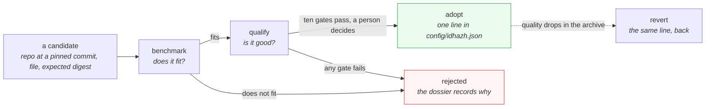

# The model boundary

**Last Updated**: 2026-09-21

How the summarizer stays generic while the model behind it changes. This page
owns the shape of the boundary - what crosses it, which side each fact lives
on, and what proves the two sides agree. The prompt's wording is
[prompt.md](prompt.md); what a call costs is [throughput.md](throughput.md).

## The shape

The app hands over article text, its own instructions and its own output
schema, and gets back a payload in its own shape. Between those two points sit
two thin pieces of model-shaped code. Nothing else in `backend/` knows which
model is loaded.

```mermaid
flowchart LR
  subgraph app_in["The app - knows no model"]
    direction TB
    A1["article text<br/><i>sanitized once, at the trust boundary</i>"]
    A2["the instructions<br/>backend/idhazh/prompts/*.txt"]
    A3["the output schema<br/><i>generated from the contract</i>"]
  end

  subgraph shim_in["Inward shim - render_prompt, completion_payload"]
    direction TB
    S1["place the system text<br/><i>its own turn, or folded into the first user turn</i>"]
    S2["wrap every turn<br/><i>opening, closing, reply opening</i>"]
    S3["build the request<br/><i>schema, prompt cache, budgets</i>"]
    S1 --> S2 --> S3
  end

  subgraph engine["llama-server - one process, one model"]
    direction TB
    M1["grammar masks the logits<br/><i>schema converted to a grammar</i>"]
    M2["decode"]
    M1 --> M2
  end

  subgraph shim_out["Outward shim - parse_completion"]
    direction TB
    O1["read either reply envelope"]
    O2["drop the reasoning block"]
    O3["validate against the same schema"]
    O1 --> O2 --> O3
  end

  OUT["Summary payload<br/><i>the app's own shape again</i>"]

  A1 --> S1
  A2 --> S1
  A3 --> S3
  S3 -->|"prompt bytes"| M1
  M2 -->|"reply bytes"| O1
  O3 --> OUT

  ENTRY["config/models/&lt;slug&gt;.json<br/><b>every model-shaped fact, in one file</b><br/><i>weights, turn envelope, window, budgets</i>"]
  ENTRY -.->|declares| S1
  ENTRY -.->|declares| S2
  ENTRY -.->|declares| M1
  ENTRY -.->|declares| O2

  subgraph meas["Performance measurement - manual dispatch, never a merge gate"]
    direction TB
    B1["case 1 - llama-bench<br/><i>raw prefill and decode, no server</i>"]
    B2["case 2 - llama-server + real work<br/><i>samples drawn from corpus/holdout.txt</i>"]
    B1 --> B2
  end

  REC["docs/reference/models/&lt;slug&gt;.md<br/><i>one current reading of each quantity</i>"]

  ENTRY -.-> B1
  M2 -.->|"tokens a second, resident set"| B2
  OUT -.->|"seconds an item"| B2
  B2 -.->|"a person transcribes"| REC

  style shim_in fill:#eef2ff,stroke:#4c6ef5
  style shim_out fill:#eef2ff,stroke:#4c6ef5
  style meas fill:#fff4e6,stroke:#f08c00
  style ENTRY fill:#ebfbee,stroke:#2f9e44
```

Dotted lines carry no data at run time. They are declarations - the entry
saying what the shims must do - and measurement taps, which only exist during a
dispatched benchmark.

## Which side each fact lives on

The line is between the **envelope** and the **content**, and it is the whole
design.

| Fact | Side | Why |
| --- | --- | --- |
| How a turn opens and closes | Envelope, per model | Different between model families; nothing this project wrote decides it |
| How an assistant reply opens | Envelope, per model | A generation prompt ends with more than a role header, and what it ends with is the model's |
| Whether a system role exists, and where its text goes when it does not | Envelope, per model | A turn topology. The bytes do not change; their address does. `turns.system_role` is a closed choice of two, and `turns.system_joiner` is what separates the two blocks when they share a turn |
| Which template keyword turns reasoning off | Envelope, per model | It is a variable name belonging to that model's template. `turns.thinking_kwarg` carries it, and null means the template reads none |
| The window, the batch sizes, the budgets | Envelope, per model | Measured against those weights, and pinned to their digest |
| **Which architecture the weights carry** | Envelope, per model | `arch` is the `general.architecture` key written inside the GGUF - `qwen35` for the configured weights, `gemma4` for a Gemma 4 entry. Required with no default: an entry that inherits the incumbent's architecture is claiming something nobody checked. Case 4 reads the key back out of the file the server was pointed at, a few kilobytes of header rather than a second download, and refuses when the two disagree - the one case where the digest, the alias and the filename all agree and only the words get worse |
| **Which weights the settings were set for** | Envelope, per model | `declared_for` holds the entry's own `sha256`, and load refuses a mismatch. The failure it stops is five strings edited in place - repo, file, revision, digest and id - with the settings underneath them untouched. Not hypothetical: the summarizer moved from the 8B to the 9B on 2026-08-27 and the settings block did not move with it. The markers need no such pin since 2026-09-21, because the server derives them from the template the weights carry |
| **Which control tokens the sanitizer strips** | **Content, global** | A forged turn is written in whatever syntax the attacker picks, so a pattern that knew only the model in use is a pattern an attacker walks around. See below |
| **The instructions** | **Content, global** | See below |
| **The output schema** | **Content, global** | It is the one control that survives an injection, and a per-model control is a per-model hole |
| **Every gate threshold** | **Content, global** | A gate never moves to let a candidate through |

### Why the control tokens are global and the refusal is not

The sanitizer is the control that keeps a forged turn out of an article
(Guardrail #11), and it is the one model-shaped fact that does **not** move onto
the entry. An article is fetched once and read by whatever is loaded, and the
attacker picks the syntax - so a pattern derived from the configured entry's own
markers would defend the one family nobody was attacking. The pattern knows
seven families: ChatML and its pipe-delimited descendants, Llama 2's instruct
brackets, markdown role headers, DeepSeek's fullwidth-pipe tokens, Mistral's
bracket directives, the bare angle-bracket token Gemma and Nemotron use, and the
reasoning channel the incumbent opens its own replies with.

That list cannot be complete - somebody ships a new family every few months - so
the per-model half is a **refusal, not a pattern**. `idhazh.config.load` renders
every marker the entry declares, asks
`idhazh.sanitize.why_a_forged_turn_would_survive` whether the pattern strips it,
and stops the run naming the marker when it does not. An unknown family is then
a config error before anything is fetched rather than an open turn boundary on
the first article.

It asks two questions, because either alone lets a marker through. **Is the
marker recognised at all** - one the pattern never matches is one an article may
write out in full. **Is anything structural left** - a marker matched only in
part leaves its delimiters behind. The second question is what refuses a model
whose turn boundary is ordinary words, `USER: `, and that refusal is the right
answer rather than a gap: a pattern wide enough to strip it would strip a line
of dialogue out of an article.

### Why the instructions never become per-model

Three reasons, and the first is mechanical.

**The run stamp would go blind.** `prose_changed_alone` reports nothing
whenever the model digest moved. Per-model wording means a prompt edit made
*because* the new model needed it is permanently invisible - hidden inside the
swap that carried it. The one alarm that survives a model change stops working
on exactly the day it is needed.

**Qualification would stop measuring one thing.** The ten gates compare two
models on one frozen corpus. Different words on each side measures two changes
and reports one number.

**A candidate could be fitted to the gates.** A model that needs different
instructions to score well is a model that failed, not a model that needs a
file. Keeping the words fixed is what makes the comparison honest.

A model with no system role is the case that looks like an exception and is
not. The same bytes go to a different address: `turns.system_role` says which
address, and `backend/idhazh/prompts/*.txt` is untouched either way.

**The two stamps disagree about whether they can see that, and the difference
is the reason the envelope is declared rather than inferred.** The digest run's
`prompt_sha256` renders both turns through the envelope, so a placement change
moves it exactly as a reworded instruction would - measured 2026-09-14: the
same two turns render 28 bytes shorter under the fold and the digest moves. The
qualification run's stamp does not. `stages/qualify.py` hands `build_inputs`
the content-only digest from `summarize.prompt_inputs`, which takes no envelope
and carries no turn marker, so nothing on `turns` can move it - and the ten
gates are what adopt a model. A candidate compared through a digest that is
blind to how its turns were written needs the envelope stated on the entry and
checked against the running server, which is case 1 of the start-up proof.

## Two shapes, and which one a run writes down

The entry is two things at once, so it is two contracts.

| Shape | Who writes it | Carries |
| --- | --- | --- |
| `ModelEntry` | a person, in `config/` | the weights, the runtime settings, **and the turn envelope** |
| `ModelRef` | a run, into `run.json` | the weights and the runtime settings |

The envelope is required on the declared shape and absent from the recorded
one. Required, because an entry that forgets its markers must fail rather than
inherit the incumbent's: inherited markers render a prompt with no turn
structure that the grammar still accepts, so the only symptom is worse
summaries. Absent from the record, because no `model_ref` a run has ever
written carries markers, and a required field there would stop today's build
reading yesterday's day (`CLAUDE.md` section 11).

What that gives up is that `run.json` never says how the turns were written.
It is paid for by `RunRecord.inputs.prompt_sha256`, which digests both turns
**rendered through** the envelope - so a marker that moved still moves the
stamp, and `prose_changed_alone` still has something to compare. Ruled by
Fowler, 2026-09-13.

**The same split is why the recorded shape carries no markers at all.** A run
written before 2026-09-14 carries no envelope, so a field required there would
stop today's build reading yesterday's run. Since 2026-09-21 there is nothing to
require either way: six of the eight markers are read off the model's own
template at server start and written nowhere, and the two that cannot be -
`thinking_close` and `thinking_kwarg` - sit on the entry under the one
`declared_for` pin, where somebody can act on the refusal.

The envelope reached the entry on 2026-09-13. Before that it was one global
file, `backend/idhazh/prompts/turn_markers.json`, with no model key - so a
model whose turns differ was a source edit, and one process holding two
candidates would have rendered both with the first one's markers. The lookup is
keyed by the entry now. Config load checked that path for a returning file
until 2026-09-21; the check went because nothing can recreate the file, and a
guard against an event with no mechanism is nine lines nobody can trigger.

## The inward shim

Three steps, in order, all reading the entry and never a model name.

1. **Place the system text.** Its own turn, or folded into the first user turn
   behind a declared joiner. A closed choice of two, because each is a turn
   topology and a free-form string would be a template language in config. The
   joiner is required under the fold and refused beside a system turn, so the
   field is never set on the case that would ignore it.
2. **Wrap the turns.** Substitute the role into the opening, append the
   closing, and end with the reply opening the model expects.
3. **Build the request.** Attach the output schema, ask for the prompt cache,
   and set the budgets.

The second call of an item is a literal byte-extension of the first, which is
what lets the prefix cache hold. That property lives in the expression itself
rather than in an agreement between call sites.

## The outward shim

Thinner than the inward one, on purpose. The grammar has already forced the
reply into our schema, and a grammar is a runtime control that behaves
identically on any model. So only two things on the way out are model-shaped:
which envelope the runtime wrapped the reply in, and whether a reasoning block
is present and has to be dropped before anything reads it.

The envelope is also where the runtime says why the decode stopped, and the two
routes spell that differently: the chat route writes `finish_reason`, the
rendered-completion route writes `stop_type`. Three of `stop_type`'s words
translate - `limit` is `length`, and `eos` and `word` are both a decode that
ended itself, which is `stop`. **A word not in that set is carried through as
the server wrote it, and a reply that named no reason at all carries none.**
Both used to arrive as `stop`, so a novel ending and an unreported one reached
the census as an ordinary clean stop, with nothing left in the row to tell them
apart by (Guardrail #10). It is not an enum for the reason
`ItemHealthRow.label_finish_reason` gives: the vocabulary belongs to
llama-server, and a row that would not validate because the runtime minted a
word would lose the whole item over a label.

The envelope also says which prefix-cache slot answered the call. Three fields
carry it, and all three arrive on the route the summarizer already posts to, so
reading them costs no extra request (measured 2026-09-15 on build
`b10598-56db501e7`, [pipeline-cost.md](../../reference/pipeline-cost.md)).

| Census column | Reply field | What it says |
| --- | --- | --- |
| `slot_id` | `id_slot` | which slot answered. `0` at `-np 1`, which is every committed model entry |
| `kv_tokens_at_start` | `tokens_cached` | what the slot holds once this prompt is in it - where the next call starts from |
| `prefix_shared_with_previous` | `timings.cache_n` above zero | whether this call read anything back out of the slot |

**An item makes two calls and the row has one set of those columns, so the row
carries the FIRST call's.** The second call's prompt is the first one's extended
- that is the whole point of the continuation - so its `cache_n` is above zero
on every row and its slot state is a fact about the item itself. Only the first
call's slot was last touched by the item *before* this one, which is the
question these three exist to answer.

`timings.cache_n` is read once, in `parse_completion`, and both
`label_cached_tokens` and `prefix_shared_with_previous` come off that one
reading. A boolean derived anywhere else would be the same reading written
twice, and two writings drift (Guardrail #10).

**An absent field is null and never zero.** Slot `0` is a real slot, and a cold
slot really does reuse nothing, so a default would put a number nobody measured
on every row. A field the server sends as something that is not a whole number
is absent too: these fill an instrument column, and an instrument may not cost
an item.

Everything after that is the app's own validation.

## What proves the two sides agree

A declared envelope nobody checks is worse than a single global file, because
a wrong marker renders a prompt with no turn structure that the grammar still
accepts - worse summaries and no error anywhere. So the server is asked, once,
before the first item:

| Case | Question | Refuses |
| --- | --- | --- |
| 1 | Does our render match the server's own render of the same turns? | Compared as token ids, not bytes, so a leading sequence token is not counted twice |
| 2 | Did the slot reuse any of the previous call's prefix? | A silent doubling of prefill cost per item |
| 3 | Does the schema still constrain the decode? | A grammar converter that quietly dropped a feature |
| 4 | Are the loaded weights the declared weights? | A repackaged model under a familiar name |
| 5 | Is the window inside what the model was trained for? | A short native window under a larger configured one |

None has a skip flag. The proof is what pays for declaring the envelope in
config at all. An unread proof refuses too: a server that will not answer, a
model list that names no trained length, or a weights file whose header cannot
be read stops the run exactly as a disagreement does.

`idhazh.llm.server.prove_the_entry` is the whole of it, and `digest.yml` calls
it in the work job between the health check and the first item. Each case is a
function of its own over recorded values, so each is driven from a fixture in
both directions - once with the agreeing value, once with one value changed -
and every refusal names what was declared beside what was reported.

**Where each case reads its fact.** Cases 1, 2, 3 and 5 read the running server:
`/apply-template` and `/tokenize` for the render, two `/completions` calls for
the cache and the grammar, `/v1/models` for the trained length. Case 4 reads the
weights file itself, because llama-server does not publish an architecture.
`/props` carries the path, the alias, the file type, the build and the window;
`/v1/models` adds the vocabulary, the embedding width, the parameter count and
the trained length. Neither carries `general.architecture`, so the probe reads
that key off the front of the file the server was pointed at - a few kilobytes,
not a size that follows the model - beside the `/props` filename assertion
`digest.yml` already makes. The filename says which file; the header says what
that file is.

**Case 3 builds its schema from the one the run really sends.** The reply schema
is generated from a model, so a committed probe schema would be a second copy
that drifts. `prove_the_entry` takes the schema as an argument instead - which
is also what keeps the model layer at the bottom of the dependency graph, since
the module that builds that schema imports this one.

**Case 2 asks whether the slot reused anything, not whether it reused all of
it.** The first version wanted the second call's reused count to reach the first
call's prompt length, on the reasoning that the first prompt is a byte prefix of
the second one. The premise is true and the conclusion does not follow: the slot
does not resume at the end of the previous prompt, it restores a context
checkpoint written part way through it and resumes from there. Where the
checkpoint sits is the runtime's business and it moves with the build, so there
is no count to demand and no threshold that would not be an invented number
(Guardrail #10). Zero is the whole of the line, and it is enough - the four
failures the case exists to catch (a flipped prompt-cache default, a seam that
re-splits, a leading-token mismatch, a slot lost to parallelism) all reuse
nothing rather than a little less than everything.

Measured 2026-09-14, GitHub `ubuntu-latest`, llama.cpp `b10598`,
Qwen3.5-9B-Q4_K_M, run 34820209002: first probe 31 tokens prefilled, slot
checkpointed at position 26, second probe 27 of 60 reused and 33 evaluated.
Prefill was cut, not doubled. The version that wanted 31 refused all four work
shards on the first real run it ever saw, and 2026-09-14 planned 80 stories and
published none.

### Design rationale - a start-up proof runs against the runtime, not against a model of it

Case 2 passed every test and every rehearsal and was wrong in production, because
its rule was derived from what the prompt bytes must be rather than from what
the server does with them. The general shape: a proof over a runtime's internal
bookkeeping states the property the bookkeeping is *for* - here, that the prefix
was not re-read - and never a number the runtime is free to choose. Anything
finer is a second implementation of the runtime, kept in a docstring, drifting.

## The lifecycle of a model

The benchmark is cheap and answers whether a model fits the runner. The
qualification is expensive and answers whether its summaries are good. They are
not chained, because chaining spends the expensive one on candidates already
dead.

Reverting costs one line because adopting never modified the previous model's
file. Its weights cache key is its own digest, so that cache is still valid.

**A file the pointer does not name is still a file it can name**, so every entry
under `config/models/` is loaded and checked by
`backend/tests/contracts/test_model_registry.py` rather than only the active
one. Before that, an alternative sat unvalidated until the day somebody switched
to it - and that day is a pipeline run.

**A second set of weights that drafts ahead of the first is not offered.** It
was until 2026-09-21, as `models.summarize.draft`, and the mechanism's whole
claim is that it cannot change a word: the target verifies every drafted token
and rejects any it would not itself have produced. Two paired dispatches refused
that claim on nine articles of nine - each case reproduced its own summaries
byte-identically across its repeats, so the difference was the head rather than
the sampler. A speed-up that rewrites the summary is a model change, priced on
quality, and nobody had a reading that said it was a better model. So the field,
the five `--spec-*` flags and the second download went together, and a run
record that names a head still reads through the migration on `ModelRef`.

## The two measurement cases

Both are manual dispatch. Neither gates a merge: the fastest and slowest shard
of one run differ by up to 4.35 times on prefill, so a merge gate on a
throughput number is a gate on the runner lottery.

### Case 1 - llama-bench

Raw prefill and decode rates at several prompt lengths, against a pinned
runtime build verified by digest. No server, no pipeline, no prompt.

It answers one question well: how fast does this model move tokens on this
class of machine. It cannot answer seconds per item, and it never observes a
resident set, because it never starts the server the pipeline talks to.

### Case 2 - llama-server with real samples

The server starts through the same argv builder production uses, at the
candidate's declared window, and real pipeline work runs against it.

**The samples come from `corpus/holdout.txt`**, which lists item digests held
out of training. Holdout rows are the only honest source: benchmarking a
fine-tuned model on rows it was trained on measures memorisation rather than
summarization. The rows themselves are in `corpus/corpus.jsonl`, and
`corpus/corpus.meta.json` records how many models contributed - a count worth
reading before training, because a swap makes the corpus mixed-teacher.

What case 2 records that case 1 cannot:

| Quantity | Why the server is needed |
| --- | --- |
| Seconds an item | The whole two-call sequence, not a token rate |
| Peak resident set | `llama-bench` never starts the process whose memory matters |
| Model load time, cold and warm | The first day after a swap is cold on every shard at once |
| Prompt-cache hit between calls | Only observable on the real call sequence |
| Output digests | Determinism, by replaying the same rows |

Case 2 never scores quality. The ten gates judge quality and they live
elsewhere; a scorer inside a bench becomes the thing that selects, and the
alarm stops being able to detect drift.

### Where a reading lands

A dispatched run uploads an artifact, and an artifact is deleted on a retention
clock - so a decision taken weeks later cannot cite one. The run therefore
emits the body of a model page, numbers filled in, and a person commits it to
`docs/reference/models/<slug>.md`. That page carries one current reading of
each quantity rather than a log of runs, and links to the benchmark records
behind it.

CI does not commit that page. Doc routing is reviewed in a pull request, and
every commit CI makes lands in the range the scheduled prune has to rewrite.

## Design rationale

**One complete file per model, never a merge.** A layered shape - global
defaults with per-model overrides - makes the same swap a one-line edit, so the
edit was never the argument. The cost is that no file contains the value that
won, and the two refusals that protect a swap would run against a product no
file holds. With one role configured, deduplication saves nothing. Revisit if a
second role becomes real.

**The envelope is data; the strategies are code.** Which placement a model
needs is a value. What "folded into the first user turn" means is a code path.
Expressing the second as data requires a template language in config, which is
a second renderer nobody tests.

**No free-form flag map on the entry.** It would put an operator-supplied
string onto a process argv and move flag spelling out of the single function
allowed to spell one. Every knob is a named field with a type and a default.

**No branch on a model's identity, anywhere under `backend/idhazh/llm/`.** A
branch on a value is configuration. A branch on an identity is a fork, and the
second one arrives within a release of the first.

**Span one drops a named set, and the set is what span two owns rather than
what a schema is.** Deriving the thinking span by removing `json_schema` alone
was correct while one route existed. On the route whose answer is a word, span
one inherited the grammar - so it was allowed to write three verdict words and
nothing else, which is a reasoning block it could not open - and inherited
`n_probs`, asking the server for a list of alternatives at every position of a
span nobody reads a distribution off. The rule is now the set, each member
carrying its own reason, and a recorded reply cannot see either fault: a span
constrained to three words comes back as a perfectly well-formed verdict.

**The thinking temperature is the caller's, and null carries the answer's
over.** Every committed entry pins 0.2, so the summariser is unaffected and no
output moves. A caller that pins 0.0 for a one-word answer is the case this
exists for: greedy decoding on a span whose length is uncapped by default runs
until it repeats itself, and the repetition ends at the window rather than at
the marker it is looping instead of writing.

**The layer hands back the raw window and computes no margin.** It has no idea
what a verdict opening is, and it must not - one caller's answer is the emitted
token and another's is the distribution, so a single shared margin would be two
instruments in one column. Which decoded position the answer opens at is handed
in for the same reason: where a caller's answer starts is a fact about that
caller's spans, not about this layer.

**The probability mode is sent rather than left to the build.** Whether the
numbers beside the word are the model's own or the distribution after the
grammar reshaped it decides whether renormalising them means anything, and no
workflow pins a llama.cpp build. It is measured rather than assumed: on
`b10444-5f754ea0e` the window is the model's own, the build honours a request
for 25 alternatives, and asking for the post-sampling numbers returns no window
at all - [which probabilities the server
returns](../../reference/benchmarks/which-probabilities-the-server-returns.md).

## What the entry declares, and what refuses a declaration

Every value the entry carries about a file it names passes a closed grammar
before a program is handed it: the repository, the commit, the filename, the
digest, the alias, the quantisation, the declared size and any server flag. The
rules and the refusal's four parts are in
[ci-model-runtime.md](../../reference/ci-model-runtime.md#every-download-names-a-commit).

**An entry may declare more than one companion file, and the run fetches every
one of them.** The cache key is a digest over the whole declared set, so an
entry that gains a second companion gets a different entry rather than restoring
a complete-looking one with a file missing - which llama-server reports at load
rather than at fetch, on a different machine, hours later.

**What is refused is an entry declaring two companions to a surface that can
publish one.** The measurement arms still republish a single companion's four
refs for their own inline downloads, and that projection names the count and the
files rather than truncating in silence.

**This page describes the boundary rather than tracking work**, so it changes
when the shape changes. [Swap the Summarizer
Model](../../how-to/evaluate-new-summarizer-model.md) is the procedure.

## See also

- [prompt.md](prompt.md) - what the instructions say and why they are ordered that way.
- [throughput.md](throughput.md) - what a call costs, and where the time goes.
- [../contracts/schemas.md](../contracts/schemas.md) - how a persisted shape is declared, versioned and migrated.
- [../contracts/determinism.md](../contracts/determinism.md) - what the run stamp records, and what it cannot see.
- [../../concepts/config/model-file.md](../../concepts/config/model-file.md) - the runtime settings and turn markers declared for one set of weights.
- [../../how-to/evaluate-new-summarizer-model.md](../../how-to/evaluate-new-summarizer-model.md) - the runbook for benchmarking, adopting and reverting.
- [../../how-to/fine-tune-a-model.md](../../how-to/fine-tune-a-model.md) - the training corpus, and what a base swap does to an adapter.
- [../../reference/pipeline-cost.md](../../reference/pipeline-cost.md) - the instrument log.
