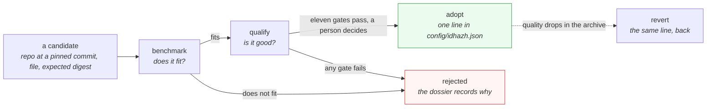

# The model boundary

**Last Updated**: 2026-09-13

How the summarizer stays generic while the model behind it changes. This page
owns the shape of the boundary - what crosses it, which side each fact lives
on, and what proves the two sides agree. The prompt's wording is
[prompt.md](prompt.md); what a call costs is [throughput.md](throughput.md).

## The shape

The app hands over article text, its own instructions and its own output
schema, and gets back a payload in its own shape. Between those two points sit
two thin pieces of model-shaped code. Nothing else in `backend/` knows which
model is loaded.

Dotted lines carry no data at run time. They are declarations - the entry
saying what the shims must do - and measurement taps, which only exist during a
dispatched benchmark.

## Which side each fact lives on

The line is between the **envelope** and the **content**, and it is the whole
design.

| Fact | Side | Why |
| --- | --- | --- |
| How a turn opens and closes | Envelope, per model | Different between model families; nothing this project wrote decides it |
| How an assistant reply opens | Envelope, per model | A generation prompt ends with more than a role header, and what it ends with is the model's |
| Whether a system role exists, and where its text goes when it does not | Envelope, per model | A turn topology. The bytes do not change; their address does |
| Which template keyword turns reasoning off | Envelope, per model | It is a variable name belonging to that model's template |
| Which control tokens the sanitizer strips | Envelope, per model | A forged turn is only forged in a syntax some model honours |
| The window, the batch sizes, the budgets | Envelope, per model | Measured against those weights, and pinned to their digest |
| **The instructions** | **Content, global** | See below |
| **The output schema** | **Content, global** | It is the one control that survives an injection, and a per-model control is a per-model hole |
| **Every gate threshold** | **Content, global** | A gate never moves to let a candidate through |

### Why the instructions never become per-model

Three reasons, and the first is mechanical.

**The run stamp would go blind.** `prose_changed_alone` reports nothing
whenever the model digest moved. Per-model wording means a prompt edit made
*because* the new model needed it is permanently invisible - hidden inside the
swap that carried it. The one alarm that survives a model change stops working
on exactly the day it is needed.

**Qualification would stop measuring one thing.** The eleven gates compare two
models on one frozen corpus. Different words on each side measures two changes
and reports one number.

**A candidate could be fitted to the gates.** A model that needs different
instructions to score well is a model that failed, not a model that needs a
file. Keeping the words fixed is what makes the comparison honest.

A model with no system role is the case that looks like an exception and is
not. The same bytes go to a different address, so the prompt digest does not
move and an envelope field records that the placement changed.

## The inward shim

Three steps, in order, all reading the entry and never a model name.

1. **Place the system text.** Its own turn, or folded into the first user turn
   behind a declared joiner. A closed choice of two, because each is a turn
   topology and a free-form string would be a template language in config.
2. **Wrap the turns.** Substitute the role into the opening, append the
   closing, and end with the reply opening the model expects.
3. **Build the request.** Attach the output schema, ask for the prompt cache,
   and set the budgets.

The second call of an item is a literal byte-extension of the first, which is
what lets the prefix cache hold. That property lives in the expression itself
rather than in an agreement between call sites.

## The outward shim

Thinner than the inward one, on purpose. The grammar has already forced the
reply into our schema, and a grammar is a runtime control that behaves
identically on any model. So only two things on the way out are model-shaped:
which envelope the runtime wrapped the reply in, and whether a reasoning block
is present and has to be dropped before anything reads it.

Everything after that is the app's own validation.

## What proves the two sides agree

A declared envelope nobody checks is worse than a single global file, because
a wrong marker renders a prompt with no turn structure that the grammar still
accepts - worse summaries and no error anywhere. So the server is asked, once,
before the first item:

| Arm | Question | Refuses |
| --- | --- | --- |
| 1 | Does our render match the server's own render of the same turns? | Compared as token ids, not bytes, so a leading sequence token is not counted twice |
| 2 | Did the prefix cache actually hold between two calls? | A silent doubling of prefill cost per item |
| 3 | Does the schema still constrain the decode? | A grammar converter that quietly dropped a feature |
| 4 | Are the loaded weights the declared weights? | A repackaged model under a familiar name |
| 5 | Is the window inside what the model was trained for? | A short native window under a larger configured one |

None has a skip flag. The proof is what pays for declaring the envelope in
config at all.

## The lifecycle of a model

The benchmark is cheap and answers whether a model fits the runner. The
qualification is expensive and answers whether its summaries are good. They are
not chained, because chaining spends the expensive one on candidates already
dead.

Reverting costs one line because adopting never modified the previous model's
file. Its weights cache key is its own digest, so that cache is still valid.

## The two measurement arms

Both are manual dispatch. Neither gates a merge: the fastest and slowest shard
of one run differ by up to 4.35 times on prefill, so a merge gate on a
throughput number is a gate on the runner lottery.

### Arm 1 - llama-bench

Raw prefill and decode rates at several prompt lengths, against a pinned
runtime build verified by digest. No server, no pipeline, no prompt.

It answers one question well: how fast does this model move tokens on this
class of machine. It cannot answer seconds per item, and it never observes a
resident set, because it never starts the server the pipeline talks to.

### Arm 2 - llama-server with real samples

The server starts through the same argv builder production uses, at the
candidate's declared window, and real pipeline work runs against it.

**The samples come from `corpus/holdout.txt`**, which lists item digests held
out of training. Holdout rows are the only honest source: benchmarking a
fine-tuned model on rows it was trained on measures memorisation rather than
summarization. The rows themselves are in `corpus/corpus.jsonl`, and
`corpus/corpus.meta.json` records how many models contributed - a count worth
reading before training, because a swap makes the corpus mixed-teacher.

What arm 2 records that arm 1 cannot:

| Quantity | Why the server is needed |
| --- | --- |
| Seconds an item | The whole two-call sequence, not a token rate |
| Peak resident set | `llama-bench` never starts the process whose memory matters |
| Model load time, cold and warm | The first day after a swap is cold on every shard at once |
| Prompt-cache hit between calls | Only observable on the real call sequence |
| Output digests | Determinism, by replaying the same rows |

Arm 2 never scores quality. The eleven gates are the quality arm and they live
elsewhere; a scorer inside a bench becomes the thing that selects, and the
alarm stops being able to detect drift.

### Where a reading lands

A dispatched run uploads an artifact, and an artifact is deleted on a retention
clock - so a decision taken weeks later cannot cite one. The run therefore
emits the body of a model page, numbers filled in, and a person commits it to
`docs/reference/models/<slug>.md`. That page carries one current reading of
each quantity rather than a log of runs, and links to the benchmark records
behind it.

CI does not commit that page. Doc routing is reviewed in a pull request, and
every commit CI makes lands in the range the scheduled prune has to rewrite.

## Design rationale

**One complete file per model, never a merge.** A layered shape - global
defaults with per-model overrides - makes the same swap a one-line edit, so the
edit was never the argument. The cost is that no file contains the value that
won, and the two refusals that protect a swap would run against a product no
file holds. With one role configured, deduplication saves nothing. Revisit if a
second role becomes real.

**The envelope is data; the strategies are code.** Which placement a model
needs is a value. What "folded into the first user turn" means is a code path.
Expressing the second as data requires a template language in config, which is
a second renderer nobody tests.

**No free-form flag map on the entry.** It would put an operator-supplied
string onto a process argv and move flag spelling out of the single function
allowed to spell one. Every knob is a named field with a type and a default.

**No branch on a model's identity, anywhere under `backend/idhazh/llm/`.** A
branch on a value is configuration. A branch on an identity is a fork, and the
second one arrives within a release of the first.

## What is wrong with the boundary today

Both shims exist and both work, and the schema constrains the decode on both
transports - measured on build b10444, 2026-09-12. What is wrong is **where the
model-shaped facts are declared.** The turn envelope sits in one global file
with no model key; the system placement and the thinking keyword are spelled in
source; arm 2 of the bench indexes a config key that does not exist, so it
cannot run at all. The boundary is real, but it is not yet configuration, and a
model whose turns differ needs a source edit.

Nothing reconciles the envelope against the running server either, which is
what makes that arrangement quietly dangerous rather than merely inconvenient.
A wrong marker is accepted by the grammar and yields worse summaries with
nothing red.

Moving those facts onto the entry, adding the five proofs, and drawing arm 2's
samples from the holdout is
[`../../../TODO/20260913-28-model-swap-plan.md`](../../../TODO/20260913-28-model-swap-plan.md).
Its Status Reckoner is the live view of what has landed. **This page describes
the boundary rather than tracking the work**, so it changes when the shape
changes and not when a row merges.

## See also

- [prompt.md](prompt.md) - what the instructions say and why they are ordered that way.
- [throughput.md](throughput.md) - what a call costs, and where the time goes.
- [../contracts/schemas.md](../contracts/schemas.md) - how a persisted shape is declared, versioned and migrated.
- [../contracts/determinism.md](../contracts/determinism.md) - what the run stamp records, and what it cannot see.
- [../../concepts/config.md](../../concepts/config.md) - the config shape and every knob on it.
- [../../how-to/evaluate-new-summarizer-model.md](../../how-to/evaluate-new-summarizer-model.md) - the runbook for benchmarking, adopting and reverting.
- [../../how-to/fine-tune-a-model.md](../../how-to/fine-tune-a-model.md) - the training corpus, and what a base swap does to an adapter.
- [../../reference/measurements.md](../../reference/measurements.md) - the instrument log.
