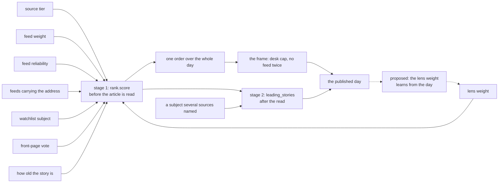

# Placement

**Last Updated**: 2026-09-13

Where a story goes in the published day, and why it sits above the one below
it.

[discovery.md](../architecture/sources/discovery.md#ranking-is-arithmetic-not-judgement)
owns the score: how good is this story, against the others on its desk.
**Placement owns the day: given every story's score, what does the day look
like?** Those are two questions and they were one function until 2026-09-13.
`backend/idhazh/placement.py` is the answer to the second.

**A reader's version of the first question is answered here too**, in plain
words and one worked example, because somebody asking why a story leads is
asking about the finished page rather than about one stage of it. The exact
formula stays where it is and is cited rather than copied: two statements of one
formula is one of them going quietly wrong.

## This is what replaces the editor

Nobody reads this digest before it publishes, and it publishes five times a day.
So a standing editorial decision can only reach a reader as arithmetic that runs
without one. There is no other shape available: a rule a person has to apply is
a rule that is applied on none of the five runs.

Three numbers in `config/idhazh.json` are that decision. Each has a sane default,
so a fresh clone runs on them, and each has a test that fails when the rule is
broken (`backend/tests/test_placement.py`).

| Knob | Value | The decision it carries |
| --- | ---: | --- |
| `placement.head_items` | 20 | How many of the day's first stories the frame governs. Past this slot the order is the score's alone |
| `placement.max_desk_in_head` | 5 | How many of those 20 one desk may hold |
| `placement.head_no_repeat` | 10 | How far down the head one feed may not repeat |

## Why this story is above that one

Every story gets a number, and the number decides the order. It is worked out
before any model has read the article, and it is our best guess at how likely
the story is to be worth your time.

Start with how much we trust the feed that carried it. Multiply that by the
number of feeds that carried the same link. Then add a set amount for each of
four things: it names a company or a person we follow, it was on somebody's
front page, it matches a subject we weight (we call one of those a **lens**),
and it is recent. The day is then sorted, best first, and the three settings at
the top of this page reshuffle the first twenty stories, so that one subject
area (we call one a **desk**) cannot fill the whole first screen. On the days we
measured, most of those twenty slots moved.

**No bonus is ever taken away, and nothing already in the day is dropped for
being old.** A feed we trust less simply starts lower, and an older story keeps
less of the freshness amount. Age is the one thing decided twice: a story
published further back than `collect.max_age_hours` is refused at the door,
before any of this runs. What may be admitted is
[freshness.md](../architecture/sources/freshness.md); everything below is the
order of what passed.

### Three stages, and only the first two run

| Stage | Where it runs | When | What it decides |
| --- | --- | --- | --- |
| 1 | `backend/idhazh/rank.py`, `score` | in `plan`, **before the article is fetched or read** | `rank_score`, which is the order of the whole day |
| 2 | `backend/idhazh/assemble.py`, `leading_stories` | in `assemble`, after the read, over the finished day | the leading block only. **It never re-orders the stream** |
| 3 | nowhere | - | proposed, and nothing builds it (below) |

**Stage 1 knows nothing about the article.** It has the feed, the link, the
headline and the time of publication, and nothing else - which is why a re-run
over the same feeds produces the same list. Stage 2 runs once the day is
finished and adds one step for a subject several sources named, to choose the
block at the top of the page.

**The exact formula is
[discovery.md](../architecture/sources/discovery.md#ranking-is-arithmetic-not-judgement),
in the code block it already carries, and it is not repeated here.** That page
owns the score. A second copy of a formula is a second thing to keep right, and
only one of the two would have a test pointing at it.

### Every number the order depends on, and where it lives

Each row is one number a person can change without touching Python
([config.md](config.md)). `backend/tests/test_order_of_the_day.py` reads this
table off this page and looks each setting up in the live config file, so a
number here that stops matching the real one fails the build rather than
quietly going stale.

| What it measures | Where the number lives | Today |
| --- | --- | ---: |
| Trust in an institution publishing about itself | `collect.tier_weights.institution` | 1.0 |
| Trust in the trade press | `collect.tier_weights.trade_press` | 0.6 |
| Trust in a community feed | `collect.tier_weights.community` | 0.3 |
| What one more feed carrying the same link is worth | `collect.repetition_weight` | 1.0 |
| Naming a company or person we follow | `collect.watchlist_bonus` | 0.5 |
| Sitting on an aggregator's front page | `collect.front_page_bonus` | 0.4 |
| How far freshness may move a score | `collect.recency_weight` | 0.6 |
| The hours in which that freshness halves | `collect.recency_half_life_hours` | 18.0 |
| The age past which a story may not be added at all | `collect.max_age_hours` | 24.0 |
| The lowest a feed's record may drag it | `collect.reliability_floor` | 0.5 |
| The days of record that reliability reads | `collect.reliability_window_days` | 30 |
| A subject several sources named, in stage 2 | `ui.lead_shared_subject_weight` | 0.2 |
| Sources that have to name it before it counts | `ui.lead_cluster_floor` | 3 |

Only `collect.max_age_hours` decides admission. Every other row decides order.

Three more numbers are not one value, so they are not in the table above.

- **`FeedDef.weight`, in `config/sources.json`** - one weight per feed, set by
  hand. It is soft retirement: drop a feed to 0.5, watch what it costs, then
  decide.
- **`LensDef.weight`, in `config/taxonomy.json`** - one weight per lens, and a
  story takes the heaviest lens it matched, never the sum. The heaviest today is
  0.3. Four of the live lenses sit at 0.0, so they label a story without moving
  it.
- **`ledger.reliability`** - worked out every run from the feed's recent record
  rather than set by anybody. It is the only learned number in this project. It
  can only ever reduce a score, because it is capped at 1.0 above and at
  `collect.reliability_floor` below, and a feed we have no recent record for is
  treated as fully reliable - so a new feed is never punished for being new.

### The signals, the engine, and the one edge that points backwards

Every solid edge points forward, and a signal is read exactly once. **The dashed
pair is the only loop in the diagram, and nothing builds it today**: it would
let a lens weight move on what the day did, which is the one place this design
could start optimising against its own output.

## A worked example

Three stories, one day, driven from
[tests/fixtures/rank/worked-example.json](../../tests/fixtures/rank/worked-example.json).
`backend/tests/test_order_of_the_day.py` runs the real scoring code over that
fixture and fails if any number or the order below disagrees with what the code
returns. **It is built rather than taken from a real day**, because it has to
make every part of the sum fire at once and no real day guarantees that.

Everything is measured against a clock reading 12:00 on 2026-09-13.

| Story | How its number is built | Score |
| --- | --- | ---: |
| A ministry statement a wire service also carried | trust 1.0, doubled by the second feed, plus 0.48 for being six hours old | 2.47622 |
| A trade-press scoop on a watchlist company, from a front page | trust 0.6, one feed, plus 1.2 of bonuses, plus 0.58 for being one hour old | 2.377334 |
| A community post on a feed we turned down | trust 0.3, cut to 0.12 by the feed's own weight and its record, plus 0.28 for being twenty hours old | 0.397762 |

**The second story collects every bonus this project can pay, and still loses.**
Its watchlist company, its front page and its lens are worth 1.2 together, and
being five hours fresher adds 0.1011 more - 1.3011 in all. The first story
collects no bonus at all. What it has instead is a more trusted feed, worth 0.4,
and a second feed carrying the same link, worth 1.0 - 1.4 together. It wins by
0.0989, which is four percent of its own score, so the two are close.

**The lesson is the multiply, not the size of any one bonus.** A bonus adds the
same fixed amount whatever the story is. A second feed carrying the same link
doubles whatever trust the story already had: worth 1.0 to this institution and
only 0.6 to the trade-press story. **So the same signal pays more to the stories
that already score well** - which is how one subject area comes to own a whole
first screen, and it is the defect the design rationale below owns.

Scores are printed to six decimal places because a test compares them with what
the code returns. Nothing about the day turns on the sixth.

**Stage 2 would take the first story to 2.68** if three different sources named
the same company or person in their headlines. That changes which stories open
the page, and changes the order of the stream not at all.

## One order over the whole day

Every story the day carries is in one list, best first: `rank_score` descending,
then the story's own time, then its address. Ties break on the address so two
runs over one day cannot disagree, and sorts are stable so the three compose.

**A story with no score sorts last rather than at zero.** `rank_score` is null on
every day published before the field landed, and reading null as zero would put
those stories at the bottom of a day where every score is positive and at the top
of one where they are not - a claim the payload never made
([layout.md](../architecture/publishing/layout.md#an-item-says-why-it-is-here-and-whose-clock-its-time-is)).

## The frame, and the three things it may never do

The frame applies to the first `head_items` slots and to nothing else.

- **A cap displaces; it never shortens.** A story a cap holds out of the head
  keeps its place in the day, lower down. The slot it gives up goes to the best
  story that fits. `rank._take` already follows this rule for the day ceiling and
  this is that rule applied to an order rather than to a selection. A reader
  cannot see what was left out, so leaving something out is the one thing a frame
  may not buy - which is why `len(out) == len(in)` is half the oracle.
- **The first slot is the score's own first pick.** No cap can bind on an empty
  head, so the frame can never argue with the ranker about the day's lead story.
- **The frame yields before the day does.** Where the caps cannot fill the head -
  a day on one desk, or a day shorter than the head - the best story a cap held
  down takes the slot back. On a single-desk day that leaves the score's order
  untouched.

**A cap can put a story behind one it outscores, and that is what a cap is.** The
story is still on the page and the reader can still reach it. What the frame
refuses is the claim that all twenty head slots belong to one desk.

The frame counts the desk a **reader** sees, which is `desk` where something has
read the article and the feed's declared `vertical` where nothing has. Counting
anything else would cap a grouping nobody is shown.

## Design rationale

### The desk cap is 5, and it was set on what the reader is guaranteed (2026-09-13)

**The measurement killed the alternative.** The cap was first argued from an
estimate - `india` is 31.7 percent of the published day, so it is about 6 of the
top 20 - which reads one population's share onto another. Read directly off the
13 committed days that carry `rank_score`, on Intel Core i7-1265U / Windows 11 /
Python 3.14.2, 2026-09-13:

| Measured over the top 20 by `rank_score` | Value |
| --- | --- |
| Biggest desk in the top 20 | minimum 8, **median 12**, maximum **20** |
| Days where the top 20 held 2 desks or fewer | 5 of 13 |
| The worst day | 2026-09-07: all 20 head slots, one desk |
| Biggest feed in the first 10 | 3 to 8 |

So the head is already lopsided far past what the day's own desk shares imply,
and **every cap from 4 to 10 fires on 85 percent of days or more.** "Rarely
binds" was not a property available to buy, so it could not be the property to
choose on.

What is left is what the reader is guaranteed on the screen they actually get.
The stream pages at twelve, so the cold load is 12 stories:

| Cap | Desks guaranteed in the first 12 | In the first 20 | Head slots it moves over 13 days |
| ---: | ---: | ---: | ---: |
| 4 | 3 | 5 | 126 |
| **5** | **3** | **4** | **113** |
| 6 | 2 | 4 | 100 |
| 8 | 2 | 3 | 74 |

**5 is the largest cap that puts three desks in the cold load.** 6 guarantees
two, which is the desk-block at a smaller size. 4 guarantees the same three as 5
and moves 13 more slots to buy nothing - and at four desks of five it is a quota
rather than a cap, so the page could never report a day one desk genuinely owned.

**What the reader loses at 5 rather than 4.** Four desks can fill the head on
their own, so on a thin day for one desk a reader can read the first screen, page
once, and have seen nothing from it. Measured, that is one day in thirteen.

### What the frame does to the days already published (2026-09-13)

Applied to every committed day that carries `rank_score`, same machine and date:

| What was measured | Before the frame | After it |
| --- | --- | --- |
| Biggest desk in the head | 8 to 20, median 12 | **5 on all 13 days** |
| Distinct desks in the head | 1 to 4 | **5 on 12 days, 4 on one** (2026-09-10) |
| Distinct feeds in the first 10 | 3 to 8 of 10 | **10 of 10 on all 13 days** |
| Head slots that differ from the unframed score order | - | 16 to 19 of 20 |
| Items in, items out | 5,793 | **5,793** |

**Sixteen to nineteen of the twenty slots move, and that is the size of the
defect rather than the aggressiveness of the cap.** A head that was 12 of one
desk cannot be brought to 5 by moving three stories. The last row is the one that
matters most: every story is still on the page.

**This cap is set for the score as it is today, not for the score rows #3 and #4
of plan 25 will leave behind.** Setting it for an unmerged score costs a one-desk
head every day until those rows land, on a promise. Setting it for today costs an
occasional bind on a day one desk genuinely owns, and a guarantee that stops
binding has stopped being needed. Ruled by Jony and by Editor independently,
2026-09-13; Editor's first ruling of 8 was withdrawn when the measurement above
replaced the estimate it rested on.

**Why the head is lopsided at all is a different defect, and it is owned.**
`rank_score` today multiplies authority by carriage, which doubles it at two
carriers, so a desk whose stories get syndicated sweeps the head. Plan 25 row #3
rewrites the score's terms and row #4 turns carriage into a single tie-break
worth less than one tier step.

### Stage 3 is proposed, and the research answer to our constraint is a target distribution (2026-09-13)

Stage 3 would re-rank the stories already taken, **after the read**, on what the
article turned out to contain - how many of its figures are anchored in the
text, how much of it is attributed to somebody named. Stage 1 cannot do any of
that: it runs before the article is fetched. **Writing that down is the point of
this section**, because the cheap mistake is to add such a term to stage 1,
where there is nothing to compute it from.

**The research working under this project's exact constraint does not build a
learned importance score. It builds a target distribution and measures the
divergence from it.** The constraint is no clicks, no dwell and no reader signal
of any kind; editorial values a person states rather than a system infers; and a
list that has to be published every day whether or not anything was learned.
Four papers, read on the open web and verified against arXiv on 2026-09-11:

- [RADio](https://arxiv.org/abs/2209.13520) (arXiv 2209.13520, RecSys 2022) -
  a **rank-aware** divergence. It matters here because a reader's attention falls
  down a list, and the head is where a skew is felt.
- [D-RDW](https://arxiv.org/abs/2508.13035) (arXiv 2508.13035, RecSys 2025) - a
  **customisable** target, so a person writes the norm down and the arithmetic
  reports the distance rather than deciding it.
- [Vrijenhoek and colleagues](https://arxiv.org/abs/2012.10185) (arXiv
  2012.10185) - the argument that editorial values can be written down as a
  distribution at all, rather than left as taste.
- [Frames for diversity](https://arxiv.org/abs/2509.02266) (arXiv 2509.02266,
  2025) - evidence that **the axis you diversify on matters more than the
  algorithm** does.

**They are cited for their shape, never for a number.** Nothing here adopts a
threshold from any of them, and nothing in this repository builds stage 3 today.
What the four buy is that a later change can argue for a target on evidence
instead of rediscovering the field, and that the argument starts from the right
shape.

### The head is a count and never a share (2026-09-11)

What a reader sees before deciding whether to scroll does not grow with the day.
A share of a 731-story day is a head nobody reaches. Ruled by Jony.

### The order is computed here and published (2026-09-11)

A re-order at read time makes a shared link show the recipient a different page
from the one the sender saw, and the browser cannot express a desk cap anyway: it
has the day but not the plan, not the desk shortfalls and not the run boundary.
It would also put an editorial rule on the reader's device, where a slow phone
decides when it applies.

**The frontend still draws its own order today**, and plan 25 row #10 removes it.
Until then the page re-sorts a payload that now has a defensible order rather
than one that has none, which is why the removal is a later row and not this one.

## Rejected alternatives

| Option | Why rejected | Authority |
| --- | --- | --- |
| Interleave the desks round-robin | A cap of one in five with no editorial input. On a heavy-AI day it publishes four thin desks ahead of the day's actual story. A cap bounds a desk's share of the head; it does not promise every desk an equal share | Editor |
| Leave the ordering in the browser and drop it from the backend | Two orders where one is enough, and the browser's cannot express a desk cap | Carmack |
| Apply the caps at plan time, in `rank.plan_vertical` | The caps are about the head of the assembled day, and plan time runs one desk at a time and cannot see it | Fowler |
| Choose the desk cap on how often it fires | Measured 2026-09-13: no workable cap is idle, so frequency measures nothing and was standing in for "am I overruling the ranker" - which it does not measure either | Editor |
| Drop a story a cap refuses | A shorter day, and nothing on the page says what was left out | `CLAUDE.md` Guardrail #5 |
| Answer "why is this story above that one" on a second page of its own | Two pages for one question, told apart only by which one a reader happened to open. This page landed first, so the question is answered here | `CLAUDE.md` section 5 |
| Answer it inside [freshness.md](../architecture/sources/freshness.md) instead | That page answers "how old is too old", which is one term of one stage. Nobody asking why one story leads arrives there | `CLAUDE.md` section 5 |
| Repeat the exact formula here as well as on `discovery.md` | Two copies of one definition, and only one of them would have a test pointing at it, so the other goes quietly wrong the day the score changes | Fowler, 2026-09-13 |
| Put the formula in `rank.py`'s docstring and link to it | A docstring carries no diagram, no citation and no worked example, and that module is over six hundred lines with scoring as one of the five jobs in it | Fowler |
| Learn the whole selection score end to end | There is no click, no dwell and no reader signal of any kind, so there is no target to learn against. The four papers above are what this repository has instead | `CLAUDE.md` Guardrail #1 |

## See also

- [../architecture/sources/discovery.md](../architecture/sources/discovery.md#ranking-is-arithmetic-not-judgement) - the score this order reads, term by term, and the second order over the same day.
- [../architecture/publishing/layout.md](../architecture/publishing/layout.md) - the published payload this order is written into.
- [../reference/i-feed-research.md](../reference/i-feed-research.md) - the research catalog, which holds two of the four papers cited above with their limits.
- [digest.md](digest.md) - what a reader gets, and the leading block that is chosen separately.
- [taxonomy.md](taxonomy.md) - what a desk is, and where the five come from.
- [config.md](config.md) - where a knob lives and the sane-default rule.
- [../../CLAUDE.md](../../CLAUDE.md) - Guardrail #6 (no hard coding) and section 11 (schema versioning).
