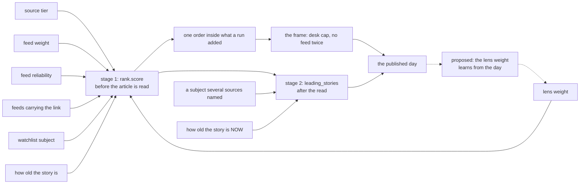

# Placement

**Last Updated**: 2026-09-16

Where a story goes in the published day, and why it sits above the one below
it.

[discovery.md](../architecture/sources/discovery.md#ranking-is-arithmetic-not-judgement)
owns the score: how good is this story, against the others on its desk.
**Placement owns the day: given every story's score, what does the day look
like?** Those are two questions and they were one function until 2026-09-13.
`backend/idhazh/placement.py` is the answer to the second.

**A reader's version of the first question is answered here too**, in plain
words and one worked example, because somebody asking why a story leads is
asking about the finished page rather than about one stage of it. The exact
formula stays where it is and is cited rather than copied: two statements of one
formula is one of them going quietly wrong.

## This is what replaces the editor

Nobody reads this digest before it publishes, and it publishes five times a day.
So a standing editorial decision can only reach a reader as arithmetic that runs
without one. There is no other shape available: a rule a person has to apply is
a rule that is applied on none of the five runs.

Three numbers in `config/idhazh.json` are that decision. Each has a sane default,
so a fresh clone runs on them, and each has a test that fails when the rule is
broken (`backend/tests/placement/`).

| Knob | Value | The decision it carries |
| --- | ---: | --- |
| `placement.head_items` | 20 | How many of the day's first stories the frame governs. Past this slot the order is the score's alone |
| `placement.max_desk_in_head` | 5 | How many of those 20 one desk may hold |
| `placement.head_no_repeat` | 10 | How far down the head one feed may not repeat |

Two more sit in `config/taxonomy.json` rather than here, one pair per desk,
because they are bounds on a desk and that is where a desk's other bound already
lives: [what a desk may not fall below, and may not rise above](#what-a-desk-may-not-fall-below-and-may-not-rise-above).

## Why this story is above that one

Every story gets a number, and the number decides the order. It is worked out
before any model has read the article, and it is our best guess at how likely
the story is to be worth your time.

Start with how much we trust the feed that carried it. Then add a set amount for
each of four things: more than one of our feeds carried the same link, it names a
company or a person we follow, it matches a subject we weight (we call each of
those a **lens**), and it is recent. The day is then sorted, best first, and the
three settings at the top of this page reshuffle the first twenty stories, so
that one subject area (we call each one a **desk**) cannot fill the whole first
screen. On the days we measured, most of those twenty slots moved.

**Being carried by several feeds used to multiply the trust rather than add to
it, and it stopped on 2026-09-13.** Two feeds doubled a story's score and three
tripled it, with no upper limit. It is now one small fixed amount that is paid
once, whether two feeds carried the link or six - because three feeds carrying
the same link is not three times the story. What the count measures is the same
article reaching us twice, not two newsrooms each deciding it mattered: two
outlets writing their own piece produce two different links and both count as
one. The design rationale below has what that changed.

**A fifth thing used to add to it and no longer does.** If an aggregator's front
front page carried the story, that was worth a set amount until 2026-09-13. It
happened to 8 stories out of 5,682, so almost nobody ever saw it change an
order, and a number that rare cannot be checked. We still record that it
happened; it just no longer moves the story.

**No bonus is ever taken away, and nothing already in the day is dropped for
being old.** A feed we trust less simply starts lower, and an older story keeps
less of the freshness amount. Age is the one thing decided twice: a story
published further back than `collect.max_age_hours` is refused at the door,
before any of this runs. What may be admitted is
[freshness.md](../architecture/sources/freshness.md); everything below is the
order of what passed.

**Age is read a second time when the block at the top of the page is chosen, and
only there.** The number above is worked out once, at the run that found the
story, and it never changes afterwards - so a story found at 02:20 was still
being treated as this morning's news at seven in the evening. The block at the
top of the page is chosen across the whole day and rebuilt at every run, so it
asks again: how old is this story right now? A story keeps all of its number for
the first few hours and then keeps less of it, smoothly. The stream below the
block does not ask, because a stream that re-ordered itself through the day
would move a story a reader had already read.

### Three stages, and only the first two run

| Stage | Where it runs | When | What it decides |
| --- | --- | --- | --- |
| 1 | `backend/idhazh/rank.py`, `score` | in `plan`, **before the article is fetched or read** | `rank_score`, which is the order inside what a run added |
| 2 | `backend/idhazh/assemble.py`, `leading_stories` | in `assemble`, after the read, over the finished day | the leading block only. **It never re-orders the stream** |
| 3 | nowhere | - | proposed, and nothing builds it (below) |

**Stage 1 knows nothing about the article.** It has the feed, the link, the
headline and the time of publication, and nothing else - which is why a re-run
over the same feeds produces the same list. Stage 2 runs once the day is
finished and scores a weighted sum - the stage 1 number, a subject several
sources named, and how many other sources carried the story - then multiplies
the result by what the story's age is worth at that hour, to choose the block at
the top of the page.
**Stage 2 is the only part of the order that reads a clock**, and
`backend/idhazh/placement.py` carries the reason beside the code. The terms and
what each is worth are in
[layout.md](../architecture/publishing/how-a-day-is-ordered-and-what-each-desk-published.md#the-weighted-score-that-chooses-the-leading-block).
**The exact formula is
[discovery.md](../architecture/sources/discovery.md#ranking-is-arithmetic-not-judgement),
in the code block it already carries, and it is not repeated here.** That page
owns the score. A second copy of a formula is a second thing to keep right, and
only one of the two would have a test pointing at it.

### Every number the order depends on, and where it lives

Each row is one number a person can change without touching Python
([config/appearance.md](config/appearance.md)). `backend/tests/test_order_of_the_day.py` reads this
table off this page and looks each setting up in the live config file, so a
number here that stops matching the real one fails the build rather than
quietly going stale.

| What it measures | Where the number lives | Today |
| --- | --- | ---: |
| Trust in an institution publishing about itself | `collect.tier_weights.institution` | 1.0 |
| Trust in the trade press | `collect.tier_weights.trade_press` | 0.6 |
| Trust in a community feed | `collect.tier_weights.community` | 0.3 |
| What one more feed carrying the same link is worth | `collect.carriage_step` | 0.25 |
| Naming a company or person we follow | `collect.watchlist_bonus` | 0.5 |
| How far freshness may move a score | `collect.recency_weight` | 0.6 |
| The hours in which that freshness halves | `collect.recency_half_life_hours` | 18.0 |
| The age past which a story may not be added at all | `collect.max_age_hours` | 24.0 |
| The lowest a feed's record may drag it | `collect.reliability_floor` | 0.5 |
| The days of record that reliability reads | `collect.reliability_window_days` | 30 |
| A subject several sources named, in stage 2 | `ui.lead_shared_subject_weight` | 0.2 |
| Sources that have to name it before it counts | `ui.lead_cluster_floor` | 3 |
| How much of a lead's score the stage 1 number is | `ui.lead_rank_weight` | 1.0 |
| What each other source carrying the story adds | `ui.lead_also_covered_weight` | 0.0 |
| Hours a story keeps its whole number before age counts, in stage 2 | `placement.freshness_offset_hours` | 6.0 |
| Hours past that at which it is worth the share below | `placement.freshness_scale_hours` | 24.0 |
| What it is worth by then, as a share of what it was | `placement.freshness_decay_at_scale` | 0.5 |

Only `collect.max_age_hours` decides admission. Every other row decides order.

Three more numbers are not one value, so they are not in the table above.

- **`FeedDef.weight`, in `config/sources.json`** - one weight per feed, set by
  hand. It is soft retirement: drop a feed to 0.5, watch what it costs, then
  decide.
- **`LensDef.weight`, in `config/taxonomy.json`** - one weight per lens, and a
  story takes the heaviest lens it matched, never the sum. The heaviest today is
  0.3. Four of the live lenses sit at 0.0, so they label a story without moving
  it.
- **`ledger.reliability`** - worked out every run from the feed's recent record
  rather than set by anybody. It is the only learned number in this project. It
  can only ever reduce a score, because it is capped at 1.0 above and at
  `collect.reliability_floor` below, and a feed we have no recent record for is
  treated as fully reliable - so a new feed is never punished for being new.

### The signals, the engine, and the one edge that points backwards

Every solid edge points forward. **The dashed pair is the only loop in the
diagram, and nothing builds it today**: it would let a lens weight move on what
the day did, which is the one place this design could start optimising against
its own output.

**Age is the one signal read twice, and the two readings answer different
questions.** `how old the story is` is asked once, at the run that found the
story, and it is part of deciding which stories get a slot in the day at all.
`how old the story is NOW` is asked again every time the block is chosen, and it
decides where a story that already has a slot sits at the top of the page.
Nothing else on this diagram is read more than once.

**An eighth signal fed stage 1 until 2026-09-13** - an aggregator's front-page
vote. It is still collected and still published on the story; it is no longer an
edge into the score.

## A worked example

Three stories, one day, driven from
[tests/fixtures/rank/worked-example.json](../../tests/fixtures/rank/worked-example.json).
`backend/tests/test_order_of_the_day.py` runs the real scoring code over that
fixture and fails if any number or the order below disagrees with what the code
returns. **It is built rather than taken from a real day**, because it has to
make every part of the sum fire at once and no real day guarantees that.

Everything is measured against a clock reading 12:00 on 2026-09-13.

| Story | How its number is built | Score |
| --- | --- | ---: |
| A trade-press scoop on a watchlist company | trust 0.6, one feed, plus 0.8 of bonuses, plus 0.58 for being one hour old | 1.977334 |
| A ministry statement a wire service also carried | trust 1.0, plus 0.25 because a second feed carried it, plus 0.48 for being six hours old | 1.72622 |
| A community post on a feed we turned down | trust 0.3, cut to 0.12 by the feed's own weight and its record, plus 0.28 for being twenty hours old | 0.397762 |

**The second story has the better source and loses anyway, because the first one
collects every bonus this project can pay.** Its watchlist company and its lens
are worth 0.8 together and being five hours fresher adds 0.1011 more - 0.9011 in
all. The ministry statement collects 0.25, for the wire service that repeated
it. A more trusted feed is worth 0.4 of that gap and the second feed is worth
0.25, which is 0.65 against 0.9011. It loses by 0.251114, a seventh of the
winner's score.

**This example ran the other way until 2026-09-13, and that is the change worth
understanding.** The wire service used to DOUBLE the ministry statement's trust
rather than add a step to it, which took it from 1.0 to 2.0 and put it first by
0.498886 - twenty percent clear of a story carrying every bonus we have. The
same signal paid 1.0 to the institution and would have paid only 0.6 to the
trade-press story, **so the fact that another feed repeated an article paid most
to whatever already scored highest**. That is the opposite of what a tie-break
does, and it is why the term is now a flat step.

**The lesson is what a repeat is evidence of.** A second feed carrying the same
link means the article reached us twice. It does not mean two newsrooms each
judged the story important - for that they would have to write their own piece,
which produces a second link and leaves both reading 1. So the repeat is worth
something, and it is worth less than one step down the trust ladder.

**The gap was 0.0989 the other way until 2026-09-13**, when the front-page term
was removed and the scoop lost 0.4 of its bonuses. Two rewrites later the same
three stories are in the reverse order. Nothing about the stories changed; two
terms did.

Scores are printed to six decimal places because a test compares them with what
the code returns. Nothing about the day turns on the sixth.

**Stage 2 would take the ministry statement to 1.93** if three different sources
named the same company or person in their headlines - still behind the scoop.
That changes which stories open the page, and changes the order of the stream
not at all.

## One order inside what a run added

Every story a run added is in one list, best first: `rank_score` descending,
then the story's own time, then its address. Ties break on the address so two
runs over one day cannot disagree, and sorts are stable so the three compose.

**A story with no score sorts last rather than at zero.** `rank_score` is null on
every day published before the field landed, and reading null as zero would put
those stories at the bottom of a day where every score is positive and at the top
of one where they are not - a claim the payload never made
([layout.md](../architecture/publishing/what-a-published-item-says-about-itself.md#an-item-says-why-it-is-here-and-whose-clock-its-time-is)).

**The list is the run's block, not the day, and the blocks stay in the order the
runs published them.** A day is published five times. Run 4 can score higher than
anything run 1 found, so one sort over the combined day moves a story a reader
read at breakfast down the page at lunchtime - the one thing the reading page was
built never to do
([layout.md](../architecture/publishing/how-a-day-is-ordered-and-what-each-desk-published.md#rejected-alternatives)). `DigestDay`
refuses such a payload outright: `introduced_by_run` may never decrease down
`items`. So the sort, the desk caps and the head frame all run over one block at
a time.

**The day's best story still reaches the top of the page.** That is the leading
block's job, chosen across the whole day by `assemble.leading_stories` and drawn
above the stream. It is a second, separate order over the same list, and a reader
loses nothing by the stream below it being append-only.

### Design rationale

**2026-09-13.** `placement.place` shipped taking the order over the whole
combined day. It passed every test and every gate, because the frame's tests are
built on single-run days and the committed archive had never been re-placed. The
first production run that added stories to a day already published crashed on the
`DigestDay` validator, and the pipeline published nothing for the rest of that
day. Measured over the 24 committed days: 20 of the 22 that ran more than once
would have been refused, several breaking at the second item. The fix changes the
code rather than the contract (`CLAUDE.md` section 0d) - the contract is the
reader-facing rule and it was right.

## The frame, and the three things it may never do

The frame applies to the first `head_items` slots and to nothing else.

- **A cap displaces; it never shortens.** A story a cap holds out of the head
  keeps its place in the day, lower down. The slot it gives up goes to the best
  story that fits. `rank._take` already follows this rule for the day ceiling and
  this is that rule applied to an order rather than to a selection. A reader
  cannot see what was left out, so leaving something out is the one thing a frame
  may not buy - which is why `len(out) == len(in)` is half the oracle.
- **The first slot is the score's own first pick.** No cap can bind on an empty
  head, so the frame can never argue with the ranker about the day's lead story.
- **The frame yields before the day does.** Where the caps cannot fill the head -
  a day on one desk, or a day shorter than the head - the best story a cap held
  down takes the slot back. On a single-desk day that leaves the score's order
  untouched.

**A cap can put a story behind one it outscores, and that is what a cap is.** The
story is still on the page and the reader can still reach it. What the frame
refuses is the claim that all twenty head slots belong to one desk.

The frame counts the desk a **reader** sees, which is `desk` where something has
read the article and the feed's declared `vertical` where nothing has. Counting
anything else would cap a grouping nobody is shown.

## What a desk may not fall below, and may not rise above

Two more numbers a person sets, one pair per desk, in `config/taxonomy.json`
beside the `min_feeds` floor each desk already carries. They run in
`placement.refile`, over the whole day rather than over its head.

| Desk | Floor | Ceiling | What it means |
| --- | ---: | ---: | --- |
| India | 6 | 0.4 | India may hold up to four stories in ten of a day. A region desk covers many subjects, so a large share of it is still a varied digest |
| World | 6 | 0.4 | World may hold up to four in ten, for the same reason India may |
| AI | 6 | 0.35 | AI may hold up to seven stories in twenty. More room than Energy or Business because it has 35 feeds where they have 21, less than a region desk because it is one subject rather than a place |
| Energy | 6 | 0.25 | Energy may hold up to one story in four. Past that a reader who opened a news digest is reading an energy newsletter with four small rails |
| Business and Economy | 6 | 0.25 | The same, for the same reason |

**The floor is a count and the ceiling is a share, and the difference is the
point.** A count is a moving share - ten stories is 1.4 percent of a 731-story
day and a quarter of a 40-story one - so the rule about one desk crowding out
the rest of the day has to be a share. A floor is a count because it asks
whether the desk is worth opening at all, and six stories is a fragment on a
100-story day and on a 450-story one alike.

**Neither one admits a story or drops one.** Both re-file: a story over the
ceiling moves to its second desk, and a thin desk is opened from stories the day
already carries. The day is exactly as long either way, so nothing a reader
could have seen is ever taken out
(`backend/tests/placement/`).

### The four things neither rule may do

- **The floor never admits a story a gate refused.** Too old, a desk whose feeds
  did not answer today, a read that failed, a summary that failed - all of them
  stand. A refused story never becomes a story at all, so there is nothing for a
  floor to reach; and a desk this run will not render receives nothing, because
  a page showing stories under a name the same day says planned nothing is the
  page and the operator surface disagreeing about one word.
- **A desk it cannot fill publishes thin and says so.** The day's own record
  already carries the reason - how many addresses the desk was offered, how many
  were too old, and whether its feeds were under their floor.
- **The floor never reaches a previous day.** A day fills from its own stories.
- **A desk never dips under its own floor to lift another over theirs.** That is
  two thin desks where there was one full one, so a floor that cannot be reached
  in one piece is not started.

### A story's second desk, and where the overflow goes

A story over its desk's ceiling moves to its **second desk**, and it keeps a
claim on the desk it left. So it is filed under one name and has a claim on two,
and it is drawn once in the stream: cross-filing changes which desk a story
belongs to, never how many times it appears in the day.

The second desk is the one other desk the reading of the article named. Where no
reading named one, it is the desk whose feed carried the story, which is the
fallback the ceiling shipped with on 2026-09-13. **One, never a list**: a story
on four desks is a story on no desk. A second desk is also refused outright in
two cases, because each would be a claim nothing can honour - one that repeats
the desk the day already filed the story under, and one naming a desk this run
found below its feed floor and will not render.

**Nothing moves on any day the site has published, and that is the honest state
rather than something to imply.** Both numbers are live arithmetic with a test
behind each, and both are inert, because a story only gets a second desk once
something reads the article. Measured 2026-09-13 over the committed archive: **0
of 9,353 items across 24 days carry a read desk of any kind.** The field is
there; the call that fills it is
[20260910-23-article-classification-plan.md](../../TODO/20260910-23-article-classification-plan.md)
row #8, and until that ships the valve is dry.

**A ceiling with nowhere to send a story leaves it where it is** rather than
shortening the day, and that is the one behaviour this rule may never get wrong.

### What the number on a pill promises

**The number on a desk's pill is how many stories that desk's page lists** - the
same set, counted the same way - so a reader who taps it and counts gets the
number they tapped.

It promises the number and the page agree. It does not promise which set, and
today that set is the stories filed under the desk: a cross-filed story is
counted and listed where it is filed, and not on its second desk. Widening one
side without the other is the defect this sentence exists to refuse - a pill
reading 40 over a page listing 37 - so the two widen together or neither does.
Ruled by Editor, 2026-09-13.

## Design rationale

### A story cross-files to a second desk, and the ceiling stops erasing a reading (2026-09-13)

**The ceiling had one place to send a story and it was backwards.** Until this
date a story's second desk was the desk whose feed carried it, so the only move
available was back to where the story arrived - and a story already filed under
its feed's word had nowhere to go at all. On the day the ceiling is most needed,
that is the story it cannot move. The article's own reading now names the second
desk, and the feed's word stays as the fallback beneath it.

**A move swaps the two desks rather than overwriting the first.** The published
item carries `desk` and `secondary_desk`, and a move puts the old first desk in
the second slot. A ceiling says a desk is busy today; nothing about the story
changed, so erasing what the story was read as would hand a crowding rule a
second job nobody gave it. The alternative - consuming the second desk on the
move - was rejected on what it costs a reader: on a heavy AI day, AI stories
would fall off the AI page **because** the desk was busy, which is the inverted
failure and the reader cannot see the reason for it.

**A story names at most two desks, and the contract is what enforces it.** The
second desk may never equal the desk the day filed the story under, and the day
must list every name any story holds. Both are `DigestDay` validators rather
than a rule written down somewhere, so a payload that broke either one fails at
write time.

**Neither count moved, and that is the decision rather than an omission.** A
pill is a promise about what its page lists, so the number and the list widen in
one change or in neither - and the page half needs a render test in
`frontend/tests/`, which a second worker held while this landed. Ruled by Editor,
2026-09-13, who also named what the follow-up owes: the desk page lists every
story naming the desk either way, `desk_count` counts that same set, the three
day totals switch from summing `desk_count` to summing `count` so a cross-filed
story is counted once in the day's own total, and the ceiling sentence above is
rewritten to say it bounds where the day **files** a story rather than how many
a reader can reach under that name.

**What a reader gets today: nothing, and that is measurable rather than
arguable.** 0 of 9,353 committed items across 24 days carry a read desk, so no
story has a second desk, no story moves, and every count on every published day
is the number it was. What lands is the mechanism and the contract, and the two
tests that say the mechanism is load-bearing: neuter the reading and the oracle
goes red, neuter the swap and the payload refuses to validate.

### The desk floor and the desk ceiling, and the numbers behind them (2026-09-13)

**Five desks cannot go empty today and nothing in the code guarantees it.** A
feed sits on exactly one desk, and a desk's `min_feeds` floor counts FEEDS
rather than stories, so the five desks are held up by the shape of
`config/sources.json` and not by a rule.

**And the failure to expect is not the obvious one.** The obvious risk is a desk
going empty. The risk the measurements point at is the opposite: on a heavy-AI
day, a model reading the article concentrates where the feeds distributed. Three
AI-adjacent stories arriving on an Energy feed, a Business feed and a World feed
are three desks today and one desk afterwards - so a five-desk digest becomes a
one-desk digest with four thin rails, on exactly the day a reader most needs the
other four. The ceiling is what stops that and the floor is what fills the gap
it leaves.

Measured 2026-09-13 from the committed archive, 24 days and 9,353 items,
2026-08-21 to 2026-09-13, counting the desk a reader sees.

| Desk | Share of the archive | Worst day | Worst full day | Fewest in a day |
| --- | ---: | ---: | ---: | ---: |
| `india` | 32.4 percent | 44.7 | 44.7 | 0 |
| `world` | 26.9 | 37.2 | 37.2 | 0 |
| `ai` | 14.7 | 100.0 | **29.5** | 3 |
| `energy` | 13.2 | 19.3 | 19.3 | 0 |
| `business-economy` | 12.7 | 16.7 | 16.7 | 0 |

A full day runs 282 to 731 stories, median 374 over the 20 days above 100. Four
days are stubs from the pipeline's first week and from a day still running, and
`ai`'s 100 percent is one of them: 4 stories out of 4 on 2026-08-21.

**Every ceiling sits above what supply has ever produced, and that is the whole
design.** ESCALATE trigger 2 of the placement plan fires at a desk above roughly
a third of the day **when supply does not put it there**, so a ceiling that cut
into a real day would be enforcing a quota rather than catching a failure. Four
of the five have never fired on the committed archive. `india` would have fired
on one day, by 4.7 points - about 17 stories, well inside the one-in-ten
day-over-day churn the same plan sets as its other trigger.

**The tiers are editorial rather than statistical.** A region desk is a
container for many stories; a subject desk is one story told many ways. A
40-percent India day still has an election, a flood, a rate decision and a
company. A 40-percent AI day is one story forty times, and duplication is the
cheapest thing on any desk to cut. `ai` sits between the two because it is a
subject with 35 feeds where the other subject desks have 21.

**`ai` was ruled at 0.35 rather than 0.30 on one number.** 29.5 percent is the
largest share it has ever taken on a real day, and it took it on the largest day
in the archive - 216 stories of 731, on 2026-08-24. A ceiling of 0.30 clears
that by half a point, so it would not bind today and would bind on the next
AI-heavy day, cutting four real stories off the day AI genuinely was the news. A
desk ceiling exists to stop one desk crowding the others out of a day that had
room for them; it is not a device for trimming the day's dominant story.

**The floor is six on every desk, and it is deliberately low.** Below six a desk
page is less than one screen and a reader who chose that desk regrets it; at six
there is a lead and five behind it. It is the same number on all five because
"worth opening at all" means the same thing to a reader whichever pill they
tapped. A floor of 20 on a day with 8 real Energy stories would file 12 stories
under a label that is false, and the desk label is a factual claim about the
story. A thin desk shown as thin is honest; a padded desk is not. On the
committed archive a floor of 6 never fires - every desk's median is 36 or higher.

**What a reader loses, said plainly.** On a genuinely huge India day they see a
handful of India stories filed under World. They lose the label, not the story:
it is in the same stream, in the same order, and one tap away on the desk it
moved to. Nothing is removed from the day.

**The two numbers cannot contradict each other, and the arithmetic that stops
them is borrowed.** Five desks at a floor of six need thirty stories, and a
quarter of a twenty-story day is five. So a desk's allowance is the larger of
its floor and its share of the day - the same shape `rank.day_source_ceiling`
already uses for the per-feed case, and for the same reason. It also switches the
ceiling off on a day too thin to backfill, at the exact point where it would
have cut a desk below the breadth the floor guarantees, rather than at a day
size somebody guessed. A stated minimum day size was offered and refused for
being a sixth number nobody could point at a day for.

**A day-size threshold and a global floor were both rejected.** `ai` has 35
feeds and the other four have 21, so one number for all five would mean
different things on different desks; the floor is per-desk for the same reason
`min_feeds` already is. Filling a thin desk from a previous day was refused
because it publishes yesterday under today's date, and `ui.lead_max_yesterday`
already bounds the one place a previous day may appear, at one. Dropping a thin
desk from the pill row was refused because the desk exists in
`config/taxonomy.json` and a reader who chose it yesterday would find it gone
with no explanation.

Ruled by Editor, 2026-09-13, over three rounds: the tiers and the floor, then
`ai`'s number against its maximum real-day share, then the arithmetic that keeps
the two rules agreeing.

### Carriage became a tie-break, and it moved the lead on 8 days in 13 (2026-09-13)

Being carried by several of our feeds multiplied a story's authority until this
date. `1 + collect.repetition_weight * (carried_by - 1)` at a weight of 1.0
**doubled** the authority term at two feeds and tripled it at three, and nothing
capped it. It is now `collect.carriage_step`, a flat 0.25 paid once at two
carriers.

Three things were wrong with the multiplier and only the third is obvious.

- **It paid in proportion to what a story already had.** A second feed bought
  1.0 on an institution and 0.3 on a community feed - the same signal worth
  three times as much to the story that needed it least. A tie-break pays one
  amount.
- **It was unbounded.** A story on six feeds took the day, and no rule said
  otherwise.
- **It priced syndication as agreement.** `carried_by` counts feeds carrying
  **one address** ([layout.md](../architecture/publishing/what-a-published-item-says-about-itself.md#an-item-says-why-it-is-here-and-whose-clock-its-time-is)),
  so it counts the same article arriving twice.
  [digest.md](digest.md) already refuses to print "three sources covered this"
  because the number does not support the claim, while the ranker was making
  that claim in arithmetic.

Measured over the 13 committed days that carry `rank_score`, 5,682 stories, on
Intel Core i7-1265U / Windows 11 / Python 3.14.2, 2026-09-13. Each story's
authority term was recovered from the published payload and `config/`; the
recovery self-checks, because the recency bonus it leaves over has to land
inside its own 0 to 0.6 range, and it does for all 323 carried stories at a
median of 0.5774.

| The head a reader meets, with the frame applied | Today | At a step of 0.25 |
| --- | ---: | ---: |
| Stories that more than one feed carried | 323 of 5,682 - **5.7 percent** | unchanged |
| Head slots they hold | 54 of 260 - **20.8 percent** | 20 of 260 - **7.7 percent** |
| Stories entering or leaving the head | - | 48 of 260 |
| Head slots whose story changes | - | **179 of 260** |
| Days whose lead changes | - | **8 of 13** |
| Distinct desks in the head, median | 5 | 5 |
| Distinct feeds in the head, median | 16 | 16 |
| Biggest desk's share of the head, median | 25 percent | 25 percent |

**The day does not move; the top of it does.** Four readings say the desk mix is
flat, so neither of this plan's ESCALATE triggers fires - the first is about
day-over-day desk churn a weight change caused, and the second about one desk
taking a third of the day.

**All eight lead changes are the same swap, in the same direction**: wire copy
two or three of our feeds repeated, replaced by one feed carrying the story from
the organisation it is about. A term doing several things would give a mixed
table. One direction eight times says one term was doing one thing wrong.

**What the reader loses, said plainly.** On those eight days the top slot moves
off a story that changes what they pay - CNG prices on 2026-08-31, LPG refill
intervals on 09-07, coal supply on 09-05 and 09-10 - and onto AI and chip
infrastructure. Those stories keep their place in the day and a reader who
scrolls still reaches them. A reader who reads only the top slot does not, and
that is most readers. What they gain is the account from the people it happened
to instead of the fourth copy of it: on 2026-09-11 the RBI Governor on the
monetary policy committee rather than a state broadcaster's pledge, and on 09-12
a former RBI Governor on UPI.

**The step's size is set by two rules, not by a measurement, and that is on
purpose.** It may not reach the smallest gap between two tier weights - 0.3
today - or carriage would promote a community story past a trade-press one. It
may not fall to `ui.lead_shared_subject_weight` - 0.2 today - or a subject that
recurs across a week would outrank a story two feeds carried today. Across the
whole of the 0.1 those two leave, **6 of 260 head slots move and no lead does**,
so nothing inside the window is measurable and the only thing worth buying is
margin: both bounds are estimates a person can edit, and 0.25 is the value that
stays legal when either moves.
`backend/tests/test_rank.py::test_the_carriage_step_cannot_outrank_one_tier_step`
reads both walls off `config/`, so the build says the day one is crossed.

**The frequency method this project uses elsewhere was tried and refused.**
[discovery.md](../architecture/sources/discovery.md#why-a-shared-subject-is-worth-less-than-a-second-carrier)
prices a signal by how often it fires, and a shared subject fires 2.25 times as
often as a second carrier, which prices carriage at 0.45. The tier-step rule
refuses anything at or above 0.3. The rule wins, because it is a ruling about
what may outrank what and the other is an estimate. Ruled by Editor, 2026-09-13.

**Carriage was not removed, and this is what removing it would have cost.** At a
step of 0.0 carried stories hold 6 of 260 head slots - **below** their 5.7
percent base rate, because carried stories skew to the trade press - and the
lead changes on 9 days rather than 8. So removing the term moves the day more
than re-shaping it does, and in a direction nobody measured. It is also one of
the four reasons the leading block can print, and the only cross-check we have
that somebody else spent a slot on the story.

### The lead opens on an organisation talking about itself, on 8 days in 13 (2026-09-13)

**This is a defect of the published digest and no row owns it.** It is written
here with its count so that nobody meets it by surprise.

A story leads the day when the feed that carried it sits at `institution` tier
and declares its kind as `announcement` or `research` - an organisation
publishing about its own work - on **8 of the 13 committed days** that carry
`rank_score`, up from **4 of 13** before carriage became a tie-break. Both
figures are measured against the feed list as `config/sources.json` holds it
today, so a day whose lead was on a since-retired feed is recomputed rather than
counted.

| The lead slot, 13 days | Before | After |
| --- | ---: | ---: |
| An organisation publishing about itself | **4 of 13** | **8 of 13** |
| Desk `ai` | 4 | **8** |
| Desk `india` | 7 | 4 |
| Desk `world` | 2 | 0 |

**Four of the eight are already there and carriage never touched them.** IBM and
Confluent on 2026-09-02, NVIDIA and Hugging Face on 09-03, NVIDIA Jetson on
09-04, Mistral's funding round on 09-08. All four are single-feed institution
stories that win on the trust ladder alone, and all four lead the day before and
after.

**The defect is not carriage and the step cannot fix it.** Nothing in the score
separates an institution reporting a fact about the world from an institution
announcing its own product. The institution tier is 1.0 because one institution
saying a thing makes it true - an argument about whether a fact is **reliable** -
and it is being spent on whether a story is **important**. A vendor is maximally
reliable about its own launch, which is exactly why the launch is a weak lead:
nobody but the vendor decided it was worth publishing. Every value in the step's
legal window leaves all 8 of those leads exactly where they are.

**What the reader loses is the first thing they see.** A reader who opens the
digest to find out what happened yesterday is handed a product launch and has to
scroll to reach the day.

**Where the fix belongs.** Not with the desk floor and ceiling, which bound a
desk's share of the **day** and cannot reach one slot - the day's desk mix does
not move at all here. It belongs beside `ui.lead_max_yesterday`, which is
already a bound on the lead slot keyed off something other than the score.
Named by Editor, 2026-09-13, who accepted it for a bounded period on the
condition that it is written down with its count.

**Two feeds of one organisation are two feeds to the frame**, which is the
adjacent gap. `placement.head_no_repeat` stops one `source_id` repeating in the
first ten stories, and `nvidia-newsroom` and `nvidia-technical-blog` are two
`source_id`s. A reader reads brand names rather than feed ids, so a head with
three NVIDIA stories in eight reads as one voice however many feeds supplied it.
`config/sources.json` carries no field saying two feeds belong to one
organisation, which is the same missing relation the wire-syndication gap names.

### The score's terms are ranked, and one of them was retired (2026-09-13)

`rank_score` used to decide only which stories were admitted. Since the day
became one order it also decides which story a reader meets first, and those are
different jobs: an admission score only has to point the right way, while an
order is read off the gaps between the numbers. So the terms are now ranked, and
the ranking is an editor's rather than an accident of four numbers somebody
typed. The ranking, what each term may move a story by, and the test that reads
it off `config/` are on
[discovery.md](../architecture/sources/discovery.md#the-terms-in-the-order-an-editor-set-them).

**One term went.** An aggregator's front-page vote was worth
`collect.front_page_bonus`, 0.4 - more than the 0.3 step between the community
and trade-press tiers. Measured over the 13 committed days that carry
`rank_score`, 5,682 stories, on Intel Core i7-1265U / Windows 11 / Python
3.14.2, 2026-09-13:

| The front-page vote | Value |
| --- | --- |
| Stories it fired on | **8 of 5,682 - 0.14 percent** |
| Head slots it fired on | 2 of 260 |
| Stories that enter or leave the first twenty when it is removed | **none, on all 13 days** |
| Slots in the first twenty whose story changes | 17 of 260, on 2 of the 13 days |
| Days on which the **lead story** changes | **2 of 13** |
| What it was worth when it fired | 0.4, against a smallest tier step of 0.3 |

A term that moves nothing 99.9 percent of the time and then decides the lead is
a lottery rather than a ranking term, and nobody could attribute a move to it
either way.
[discovery.md](../architecture/sources/discovery.md#a-speculative-term-ships-with-the-condition-that-retires-it)
had already written the condition down on 2026-08-30 - retire it if it fires on
under 1 percent - so this is that condition honoured rather than a new decision.

**What the reader loses is the lead on about one day in seven.** The day keeps
every story it had and the first twenty hold the same twenty stories; what
changes is which of them is first. These are the two days:

| Day | The vote made this the lead | Without it the lead is | Where the voted story lands |
| --- | --- | --- | ---: |
| 2026-09-03 | NVIDIA agrees to acquire Hugging Face for $12.93 billion, one feed | Supreme Court dismisses SEBI appeals against NSE, three feeds | slot 11 |
| 2026-09-08 | Mistral raises 3 billion euros in Europe's largest tech round, one feed | Centrum Air launches Hyderabad-Tashkent flights, three feeds | slot 6 |

**Both voted stories read like the better lead, and that is an argument about a
different term.** Each is a single-feed story from the organisation it is about;
each story that replaces it is a three-feed wire story that wins because carriage
multiplies authority. The property worth keeping is "one feed, and it is the
primary source" - not "a community upvoted it". **Carriage stopped multiplying on
the same day** and the section above is that change, measured: those two days are
two of the eight whose lead moves back to a single-feed primary source.
`on_front_page` is still published, so restoring the term costs one weight the
day an aggregator and a news digest start reading the same internet.

### The watchlist weight did not move, and the measurement is why (2026-09-13)

`discovery.md` sets a weight by measuring how often the signal fires: a commoner
signal is worth less. Applied here, a watchlist subject fires on 22.1 percent of
the stream against 5.7 percent for a second feed carrying one address - 3.88
times as often - so the method prices it at 0.6 / 3.88 = **0.15, not 0.5**. The
method is not suspect: it reproduces the heaviest lens weight at exactly the 0.3
it already carries.

It was not applied, because the measurement refused it. Over the same 13 days:

| The raw top 20, before the frame runs | At 0.5, today | At 0.15 |
| --- | --- | --- |
| Biggest desk's share of it | 40 to 100 percent, median **80** | 85 to 100 percent, median **95** |
| Distinct desks in it | 1 to 4 | **1 to 3** |
| Institution stories in it, over 13 days | **51** | **16** |
| Head slots that differ from today | - | median 17 of 20; the lead story moves on 4 of 13 days |

**A watchlist subject is not informative because it is rare. It is informative
because a person chose it**, so a frequency method is the wrong instrument for
it. The reading above was taken while carriage still multiplied, when this was
the only additive term that could lift an un-syndicated story from a second desk
into the head - so cutting it would have handed the head to the wires. **What
the reader loses at 0.15 is the story nobody else carried, on a subject the desk
said matters**, which is the one story they cannot get anywhere else.

The frame would still cap the biggest desk at 5 of 20, so a reader would not see
the 95 percent. They would see slots 6 to 20 filled from further down a tail the
score ranked lower: **a frame that holds the shape does not hold the quality.**

Ruled by Editor, 2026-09-13. **The re-measurement this section asked for has
been taken and the weight still does not move.** Carriage became a flat step the
same day, so the reason above - that this is the only term able to lift an
un-syndicated story - has weakened: carriage now holds 7.7 percent of the head
rather than 20.8, so the wires it was holding out are already held out by
something else. What has not changed is the argument that killed the 0.15 in the
first place, which is that a frequency method cannot price a signal a person
chose. Re-pricing this weight against the new step would move the leading
block's order, which nothing measured here covers, and it belongs to plan 23 row
#17's per-run loop.

### Recency is nearly a constant, and no row owns the fix (2026-09-13)

Recency is the second of the four terms by ceiling, and the ceiling is most of
what it is. The bonus is not published, so it has to be recovered from the score,
which leaves **5,442 of those 5,682 stories** answerable. It fires on **every one
of them**, paying a median of 0.5656 against a ceiling of 0.6 - **94 percent of
the most it can ever pay** - and the middle half of the stream spans 0.5053 to
0.5874, **a spread of 0.08, a quarter of the smallest step between two tiers**.
The median story is 1.5 hours old when it is scored and three quarters are under
4.5 hours, so an 18-hour half-life over a 24-hour admission window adds nearly
the same amount to everything.

Raising `collect.recency_weight` does not fix that - it scales a flat term. The
half-life is what would, and this row's scope named 18 hours, so it could not be
touched here. Named in
[TODO/20260910-25-placement-plan.md](../../TODO/20260910-25-placement-plan.md)
section 18 as a gap nobody owns.

### Age is read again when the block is chosen, and nowhere else (2026-09-16)

**The gap above had a second half nobody had named.** A flat term at plan time
is one problem. The other is that the number is worked out once and then stored,
so a story found at 02:20 carries its 02:20 freshness for the rest of the day.
By the evening run it is sixteen hours old, it still holds the whole bonus it
earned that morning, and it outranks something that broke an hour ago.

**The block at the top of the page now multiplies each candidate by what its age
is worth at that moment.** The curve is flat for `placement.freshness_offset_hours`
and then falls smoothly, reaching `placement.freshness_decay_at_scale` of its
value `placement.freshness_scale_hours` after the flat part ends. The width is
worked out from those two numbers rather than typed in, so a person sets a
sentence they can read. `placement.freshness_multiplier` is the whole of it.

**Why the block and not the stream.** The block is the only order taken across
the whole day, so it is the only place where a story found at 02:20 and one
found at 18:20 are ever compared - two run blocks never compete in the stream.
And the stream may not read a clock at all: the same day placed again at a later
hour would come back in a different order inside a block a reader has already
read, which is the rule [one order inside what a run added](#one-order-inside-what-a-run-added)
exists to hold.

**Why this curve and not the two obvious alternatives.** A power law of the
`(score) / (hours + 2)^1.8` shape has the same flat-start idea in its `+ 2` and
is simpler, but its tail never really ends - a week-old story keeps a visible
share of its number, and this digest publishes a day at a time. The plain
half-life already used at plan time has no flat part at all, so it cuts hardest
in the first hour, which is the opposite of what a digest wants. The curve with
a flat shoulder says both things: nothing inside the shoulder is marked down,
and past it the fall is smooth and finite.

**It multiplies rather than adding, and that is load-bearing.** A multiplier
keeps the shape of how good a story is and moves where that sits in time. A term
that added would let a fresh but worthless story outrank a strong one, which is
the one failure this ordering exists to refuse.

**The two readings of age are not double counting.** The plan-time bonus decides
which stories get a slot at all - it orders the pool the safety ceilings cut.
The read-time curve decides where a story that already has a slot sits on the
page. They answer different questions over different populations.

**What the numbers are, and what would move them.** The three are ESTIMATES and
none is measured. 6 hours is about one publishing cycle, which is the shortest
flat part that lets a story reach the next run at full value; 24 hours is
`collect.max_age_hours`, so the shipped pair says a story running a whole
admission window past its shoulder is worth half. What would overturn them is
the published age of the stories that actually led each committed day, which
nobody has read yet. `placement.freshness_decay_at_scale` set to exactly 1.0
switches the whole curve off and restores the order this block had before, which
is the revert and is one edit to one line.

### The desk cap is 5, and it was set on what the reader is guaranteed (2026-09-13)

**The measurement killed the alternative.** The cap was first argued from an
estimate - `india` is 31.7 percent of the published day, so it is about 6 of the
top 20 - which reads one population's share onto another. Read directly off the
13 committed days that carry `rank_score`, on Intel Core i7-1265U / Windows 11 /
Python 3.14.2, 2026-09-13:

| Measured over the top 20 by `rank_score` | Value |
| --- | --- |
| Biggest desk in the top 20 | minimum 8, **median 12**, maximum **20** |
| Days where the top 20 held 2 desks or fewer | 5 of 13 |
| The worst day | 2026-09-07: all 20 head slots, one desk |
| Biggest feed in the first 10 | 3 to 8 |

So the head is already lopsided far past what the day's own desk shares imply,
and **every cap from 4 to 10 fires on 85 percent of days or more.** "Rarely
binds" was not a property available to buy, so it could not be the property to
choose on.

What is left is what the reader is guaranteed on the screen they actually get.
The stream pages at twelve, so the cold load is 12 stories:

| Cap | Desks guaranteed in the first 12 | In the first 20 | Head slots it moves over 13 days |
| ---: | ---: | ---: | ---: |
| 4 | 3 | 5 | 126 |
| **5** | **3** | **4** | **113** |
| 6 | 2 | 4 | 100 |
| 8 | 2 | 3 | 74 |

**5 is the largest cap that puts three desks in the cold load.** 6 guarantees
two, which is the desk-block at a smaller size. 4 guarantees the same three as 5
and moves 13 more slots to buy nothing - and at four desks of five it is a quota
rather than a cap, so the page could never report a day one desk genuinely owned.

**What the reader loses at 5 rather than 4.** Four desks can fill the head on
their own, so on a thin day for one desk a reader can read the first screen, page
once, and have seen nothing from it. Measured, that is one day in thirteen.

### What the frame does to the days already published (2026-09-13)

Applied to every committed day that carries `rank_score`, same machine and date:

| What was measured | Before the frame | After it |
| --- | --- | --- |
| Biggest desk in the head | 8 to 20, median 12 | **5 on all 13 days** |
| Distinct desks in the head | 1 to 4 | **5 on 12 days, 4 on one** (2026-09-10) |
| Distinct feeds in the first 10 | 3 to 8 of 10 | **10 of 10 on all 13 days** |
| Head slots that differ from the unframed score order | - | 16 to 19 of 20 |
| Items in, items out | 5,793 | **5,793** |

**Sixteen to nineteen of the twenty slots move, and that is the size of the
defect rather than the aggressiveness of the cap.** A head that was 12 of one
desk cannot be brought to 5 by moving three stories. The last row is the one that
matters most: every story is still on the page.

**This cap is set for the score as it is today, not for the score rows #3 and #4
of plan 25 will leave behind.** Setting it for an unmerged score costs a one-desk
head every day until those rows land, on a promise. Setting it for today costs an
occasional bind on a day one desk genuinely owns, and a guarantee that stops
binding has stopped being needed. Ruled by Jony and by Editor independently,
2026-09-13; Editor's first ruling of 8 was withdrawn when the measurement above
replaced the estimate it rested on.

**Why the head is lopsided at all is a different defect, and it is now closed.**
`rank_score` multiplied authority by carriage until 2026-09-13, which doubled it
at two carriers, so a desk whose stories get syndicated swept the head. Plan 25
row #3 ranked the score's terms and retired the one nobody could attribute a
move to, and it took no story out of the first twenty on any committed day - the
lopsidedness was the multiplier, and the section at the top of this rationale is
the row that replaced it with a tie-break worth less than one tier step. The cap
is set on what the reader is guaranteed either way, because a cap set on how
often it fires would have to be re-set every time a weight moved.

### Stage 3 is proposed, and the research answer to our constraint is a target distribution (2026-09-13)

Stage 3 would re-rank the stories already taken, **after the read**, on what the
article turned out to contain - how many of its figures are anchored in the
text, how much of it is attributed to somebody named. Stage 1 cannot do any of
that: it runs before the article is fetched. **Writing that down is the point of
this section**, because the cheap mistake is to add such a term to stage 1,
where there is nothing to compute it from.

**The research working under this project's exact constraint does not build a
learned importance score. It builds a target distribution and measures the
divergence from it.** The constraint is no clicks, no dwell and no reader signal
of any kind; editorial values a person states rather than a system infers; and a
list that has to be published every day whether or not anything was learned.
Four papers, read on the open web and verified against arXiv on 2026-09-11:

- [RADio](https://arxiv.org/abs/2209.13520) (arXiv 2209.13520, RecSys 2022) -
  a **rank-aware** divergence. It matters here because a reader's attention falls
  down a list, and the head is where a skew is felt.
- [D-RDW](https://arxiv.org/abs/2508.13035) (arXiv 2508.13035, RecSys 2025) - a
  **customisable** target, so a person writes the norm down and the arithmetic
  reports the distance rather than deciding it.
- [Vrijenhoek and colleagues](https://arxiv.org/abs/2012.10185) (arXiv
  2012.10185) - the argument that editorial values can be written down as a
  distribution at all, rather than left as taste.
- [Frames for diversity](https://arxiv.org/abs/2509.02266) (arXiv 2509.02266,
  2025) - evidence that **the axis you diversify on matters more than the
  algorithm** does.

**They are cited for their shape, never for a number.** Nothing here adopts a
threshold from any of them, and nothing in this repository builds stage 3 today.
What the four buy is that a later change can argue for a target on evidence
instead of rediscovering the field, and that the argument starts from the right
shape.

### The head is a count and never a share (2026-09-11)

What a reader sees before deciding whether to scroll does not grow with the day.
A share of a 731-story day is a head nobody reaches. Ruled by Jony.

### The order is computed here and published (2026-09-11)

A re-order at read time makes a shared link show the recipient a different page
from the one the sender saw, and the browser cannot express a desk cap anyway: it
has the day but not the plan, not the desk shortfalls and not the run boundary.
It would also put an editorial rule on the reader's device, where a slow phone
decides when it applies.

**The frontend still draws its own order today**, and plan 25 row #10 removes it.
Until then the page re-sorts a payload that now has a defensible order rather
than one that has none, which is why the removal is a later row and not this one.

## Rejected alternatives

| Option | Why rejected | Authority |
| --- | --- | --- |
| Interleave the desks round-robin | A cap of one in five with no editorial input. On a heavy-AI day it publishes four thin desks ahead of the day's actual story. A cap bounds a desk's share of the head; it does not promise every desk an equal share | Editor |
| Leave the ordering in the browser and drop it from the backend | Two orders where one is enough, and the browser's cannot express a desk cap | Carmack |
| Apply the caps at plan time, in `rank.plan_vertical` | The caps are about the head of the assembled day, and plan time runs one desk at a time and cannot see it | Fowler |
| Choose the desk cap on how often it fires | Measured 2026-09-13: no workable cap is idle, so frequency measures nothing and was standing in for "am I overruling the ranker" - which it does not measure either | Editor |
| Drop a story a cap refuses | A shorter day, and nothing on the page says what was left out | `CLAUDE.md` Guardrail #5 |
| Answer "why is this story above that one" on a second page of its own | Two pages for one question, told apart only by which one a reader happened to open. This page landed first, so the question is answered here | `CLAUDE.md` section 5 |
| Answer it inside [freshness.md](../architecture/sources/freshness.md) instead | That page answers "how old is too old", which is one term of one stage. Nobody asking why one story leads arrives there | `CLAUDE.md` section 5 |
| Repeat the exact formula here as well as on `discovery.md` | Two copies of one definition, and only one of them would have a test pointing at it, so the other goes quietly wrong the day the score changes | Fowler, 2026-09-13 |
| Put the formula in `rank.py`'s docstring and link to it | A docstring carries no diagram, no citation and no worked example, and that module is over six hundred lines with scoring as one of the five jobs in it | Fowler |
| Learn the whole selection score end to end | There is no click, no dwell and no reader signal of any kind, so there is no target to learn against. The four papers above are what this repository has instead | `CLAUDE.md` Guardrail #1 |

## See also

- [../architecture/sources/discovery.md](../architecture/sources/discovery.md#ranking-is-arithmetic-not-judgement) - the score this order reads, term by term, and the second order over the same day.
- [../architecture/publishing/layout.md](../architecture/publishing/layout.md) - the published payload this order is written into.
- [../reference/i-feed-research.md](../reference/i-feed-research.md) - the research catalog, which holds two of the four papers cited above with their limits.
- [digest.md](digest.md) - what a reader gets, and the leading block that is chosen separately.
- [taxonomy.md](taxonomy.md) - what a desk is, and where the five come from.
- [config.md](config.md) - where a knob lives and the sane-default rule.
- [../../CLAUDE.md](../../CLAUDE.md) - Guardrail #6 (no hard coding) and section 11 (schema versioning).
