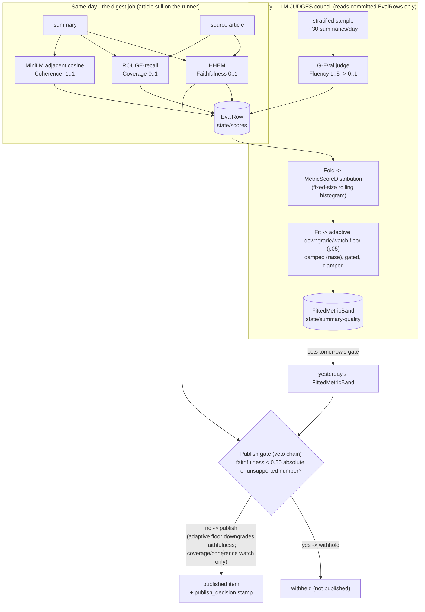

# Summary quality: metrics and the auto-tuning loop

**Last Updated**: 2026-09-18

How yen-idhazh measures whether a summary is good, and how the thresholds tune themselves with no human
in the loop. Faithfulness (HHEM) ships today; coverage, coherence, fluency and the auto-tuning loop
below are the target design, implemented by a feedback-loop plan under `TODO/` that reuses the
`LLM-JUDGES` workflow and the `Fit` pattern from the same-story similarity judge.

## The four metrics

We are a summarizer, so the honest vocabulary is SummEval's four axes, not RAGAS. RAGAS measures a
retriever plus a generator answering a query; we have neither a retriever nor a query, so its
`Context Precision` and `Context Recall` have nothing to score here, and `Answer Relevance` is a
question-answering metric with no question. The chart labels are `Faithfulness`, `Coverage`,
`Coherence`, `Fluency`.

| Chart label | Instrument | Reads | Output | Stage | Role |
| --- | --- | --- | --- | --- | --- |
| Faithfulness | HHEM-2.1-Open cross-encoder | article + summary | 0..1 | same-day digest job | gate: block (absolute) + downgrade (adaptive) |
| Coverage | ROUGE-recall | article + summary | 0..1 | same-day digest job | monitor (watch) |
| Coherence | MiniLM adjacent-sentence cosine | summary only | -1..1 | same-day digest job | monitor (watch) |
| Fluency | G-Eval (summariser as judge) | summary only | 0..1 | next-day council, sampled | monitor (watch), next-day |

### Recognised-name mapping (for anyone arriving with RAG vocabulary)

| Our label | SummEval | RAGAS (why it does not fit) |
| --- | --- | --- |
| Faithfulness | consistency | Faithfulness - the one clean overlap (grounded in the source, no invention) |
| Coverage | relevance | ~Context Recall - but there is no retrieved context to score |
| Coherence | coherence | none |
| Fluency | fluency | none |
| (not measured) | - | Context Precision, Answer Relevance - retriever/QA metrics, no retriever, no query |

If an extraction-quality axis is ever wanted it is named `Extraction cleanliness` (or the existing
`extractiveness` counterweight), never a borrowed RAGAS label - inventing a retriever the reader
thinks exists is worse than leaving the axis unnamed.

## How each is measured

- **Faithfulness** = `HHEM(premise = article, hypothesis = summary)`, taken as the **max over
  overlapping windows** of the article (a claim is supported if any window supports it; a mean would
  punish length). Scored twice - against the text the model read and against the whole article - and
  the gap is the truncation cost. It is the only metric reliable enough to WITHHOLD a story, and it
  withholds only at the absolute 0.50 line, never at the drifting adaptive floor (see the publish gate).
- **Coverage** = ROUGE-recall: `|content_ngrams(summary) & content_ngrams(source)| /
  |content_ngrams(source)|`. Recognised, reference-free, needs the source, so it runs same-day.
- **Coherence** = mean cosine of adjacent summary sentences. With unit vectors `v_1..v_n` for the
  summary's sentences, `coherence = (1 / (n-1)) * sum_{i=1..n-1} dot(v_i, v_{i+1})`. Summary-only.
  Null for a one-sentence summary. A monitor, never a gate: a repeated sentence reads as maximally
  coherent, so it is the wrong instrument to drop an item on.
- **Fluency** = G-Eval. The summariser judges its own output's readability on a 1-5 scale, one
  grammar-constrained digit, scored from the first-token probabilities rather than the digit itself:
  `raw = sum_{i=1..5} p_i * i`, stored as `(raw - 1) / 4` in `[0,1]`. Input is the **summary only**
  (no source needed, which is what lets it run next-day). It judges fluency and nothing else -
  coherence is already measured for free, and a holistic "good summary" score collapses dimensions
  and games easily.

## The auto-tuning loop

No human labels. Each metric gets an adaptive floor - a percentile of its own rolling distribution,
folded and fitted daily exactly like the same-story similarity line, flipped to the low tail because
for a quality metric low = bad. The adaptive floor DOWNGRADES or WATCHES; the one line that WITHHOLDS
is the absolute HHEM 0.50 that already ships and does not drift. Sane defaults ship - faithfulness
seeds its floor from the ~6,966 committed HHEM readings on day one - and the loop's own first fortnight
replaces the transplanted numbers on the other three.

### The fitted band (sane defaults, self-correcting)

Fold every committed per-item score into a fixed-size slot record (a rolling histogram that never
grows with the archive), then walk the slots from the low tail. Each metric's band carries two floors:

- **Block floor - absolute, not adaptive.** The reader-safety line that already ships - HHEM 0.50,
  plus the unsupported-number rule - and it does not move with the fleet. Only faithfulness has one,
  because a false claim is the one failure where no story beats the story.
- **Downgrade/watch floor - adaptive p05** of the rolling distribution. Below it, faithfulness
  DOWNGRADES (the low-confidence marker) and the other three only WATCH (an operator alarm), because
  their low tail is confounded: adjacent-cosine reads a repeated sentence as maximally coherent, and
  ROUGE-recall reads a faithful abstraction as low coverage, so their low tail can be a good summary.
- **Damping 0.15 new / 0.85 old, one-directional - damp the raise.** Raising a floor withholds or
  marks MORE, which is the invisible-deletion direction (a withheld good summary is a story the reader
  never sees), so a rise is damped and needs sustained evidence; a fall (act less) lands at once. This
  is plan 34's invariant: the move toward more invisible deletion is always the damped one.
- **Gates**: a fit runs only once its distribution has enough days and samples. Faithfulness seeds
  from the committed HHEM history, so its gates clear on day one; the other three are record-only until
  their distribution fills (~5-10 days).
- **Settled**: when the fit stops moving week-on-week, council cadence drops to weekly and returns to
  daily on its own.

Why the block is absolute and only the downgrade is adaptive: a percentile floor is relative, so it
rises as the summariser improves and would start withholding absolutely-fine stories with no signal
they went missing. A withhold must bind to an absolute property of the artifact ("asserts an
unsupported fact"), which does not drift. The adaptive floor is safe to move because a downgrade is
visible and recoverable and a watch touches no reader at all.

## The publish gate - "content decides its future"

Today HHEM sets a display badge and the item publishes anyway. The loop promotes that to a decision,
and the decision is a **veto chain, never a composite** - averaging the four axes into one number would
dilute the one reliable signal (HHEM) with three confounded ones and erase which axis fired, so the
gate reads each metric separately and takes the most severe action any of them earns. A displayed
"overall" number, if the console ever wants one, feeds no action.

Each metric carries an **action config - `block`, `downgrade` or `watch`** - so the loop is fully
instrumented and the action is a knob, not a hardcode. The shipped defaults:

| Metric | Default action | Why |
| --- | --- | --- |
| Faithfulness | **block** below 0.50 (absolute), **downgrade** below the adaptive floor | A false claim is the one failure where silence beats the story |
| Coverage | **watch** | Low ROUGE-recall can be a faithful abstraction, not an omission - marking it low would lie to the reader |
| Coherence | **watch** | Adjacent-cosine reads a repeated sentence as coherent - its low tail is not reliably "bad" |
| Fluency | **watch** | Scored next-day, after the item shipped - it can only alarm on a fleet-wide slide |

So a below-0.50 faithfulness (or any unsupported number) is **withheld**; a faithfulness below its
adaptive floor is **downgraded** with the low-confidence marker; everything else only moves an operator
alarm. The owner can promote any metric's action on its track record.

The gate reads **yesterday's** committed fitted band, so it is at most one day stale. It ships behind a
flag, default off; while off it **stamps the decision but never suppresses**, so a person reads one
corpus turn of what it WOULD have withheld before it is allowed to withhold. Withholding a story is a
reader-safety decision (owner) applied to an editorial content call (Editor); the metric-to-action map
is Editor's, the withhold floor and the standing permission are the owner's (Level 5).

The withhold RATE is itself watched: a thin-but-true digest beats a full-but-false one, but a rising
withhold rate is a bad-summariser day an operator must see, not a digest silently going hollow.

## Where each metric runs, and why

The binding constraint is that article bodies are gitignored and gone the next day. So anything that
needs the source (faithfulness, coverage) is computed the day the item is fresh; only summary-only
metrics (coherence, fluency) can be computed next-day in the council. Faithfulness and coverage and
coherence all land on one committed eval row same-day; the council next-day only folds those numbers
into distributions, fits the bands, and spends the one decode G-Eval fluency needs on a small daily
sample.

## See also

- `docs/concepts/evaluation.md` - the eval ledger, HHEM, and the metrics that ship today.
- `TODO/20260917-34-similarity-autotune-plan.md` - the `LLM-JUDGES` workflow and the `Fit` pattern
  this loop reuses.
- `TODO/20260918-35-search-eval-key-points-plan.md` - the cleanup that precedes this loop.
