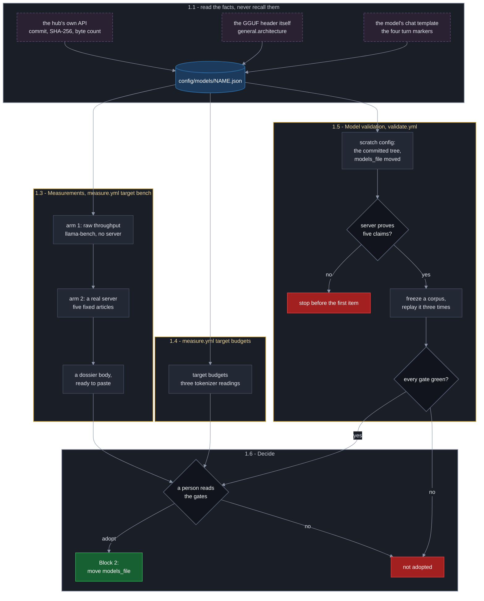

# Swap the Summarizer Model

**Last Updated**: 2026-09-14

The swap is one line in `config/idhazh.json`:

```json
"models_file": "models/qwen3.5-9b-q4km.json"
```

Point it at another file in `config/models/` and everything follows it: the
daily run, the qualification arm and the bench all read the entry that file
holds. **The revert is the same line back.**

The rest of this page is what to do before you write that line and what to check
after. It covers the build-time summary model, which also decides the picture.
The faithfulness scorer and the browser search model have their own contracts
and are not changed here.

## What is one command, and what is not

| | |
| --- | --- |
| The swap | one line in the committed config |
| The revert | the same line back |
| The bench | one dispatch. It says how fast |
| The qualification | one dispatch, hours of runner time, eleven gates on a frozen corpus. It says how good |
| The decision | a person's, and it stays one |

**Qualification will never be one command.** Eleven gates on a frozen corpus is
the price of knowing whether a model is good, and no arrangement of the harness
makes that cheap. What the harness buys is that the price is paid the same way
every time.

Adoption is a Level 5 decision ([../../CLAUDE.md](../../CLAUDE.md) section 6).
The gates inform it; they do not make it.

Three blocks follow: **measure the candidate**, **adopt**, **revert**.

---

## Block 1 - Measure the candidate



**Every node sits inside a box, and that is deliberate rather than tidy.** A box
paints the surface the palette assumes, so a node left outside one is drawn on
whatever the page behind it happens to be - fine on a dark page, and a dark
node stranded on white anywhere else.

**The three dashed boxes are somebody else's.** Every fact in 1.1 is read out of
the model publisher's own bytes rather than out of a model card or a memory, and
that is the whole reason the first step is not "fill in the form".

### 1.1 Write the candidate's model file

A candidate is a file under `config/models/` before it is a dispatch. Copy the
incumbent's file, rename it for the new weights, and change every field that is
a fact about them.

| Field | Why it is there |
| --- | --- |
| `id` | the alias published summaries and the ledger carry |
| `repo`, `revision` | the repository and the 40-character commit. A branch name is not a pin, because `main` moves |
| `file`, `quantisation` | two files from one model are two candidates |
| `sha256` | the runtime opens bytes, not a model-card name |
| `byte_count` | the size the hub reports, cross-checked against the file the run opened |
| `hf_base_repo` | the base an adapter is trained against, which the fine-tuning notebook checks |
| `arch` | the architecture name inside the GGUF |
| `inference` | every runtime knob, including the window and the sampler |
| `turns` | where the system text goes, what opens and closes a turn, and which keyword turns thinking off |
| `draft` | a second, smaller set of weights that guesses ahead. Null unless the publisher ships one |

#### Where each fact comes from

**None of these is recalled or copied off a model card.** A card is prose a
human wrote; every field below is read out of the bytes the run will open, or
out of the metadata the hub computed from them.

**The commit, the digest and the byte count** come from the hub's own API. The
`lfs.oid` a tree listing returns IS the SHA-256, so no download is needed:

```powershell
$repo = 'publisher/NAME-GGUF'
(Invoke-RestMethod "https://huggingface.co/api/models/$repo").sha
Invoke-RestMethod "https://huggingface.co/api/models/$repo/tree/main" |
  Where-Object { $_.path -like '*.gguf' } |
  ForEach-Object { '{0}  size={1}  sha256={2}' -f $_.path, $_.size, $_.lfs.oid }
```

**`arch` is read out of the GGUF itself, not inferred.** `general.architecture`
is the first key in the header, so a range request for the first megabyte
answers it - a few kilobytes of transfer against five gigabytes of weights. Read
it rather than guessing from the family name: Gemma 4's main weights read
`gemma4` and its MTP head reads `gemma4-assistant`, which are two different
answers from one repository. Row #5's fourth arm compares this field against the
file the server opened, so a wrong value fails the run rather than degrading it.

**The four turn markers come from the model's own chat template**, which the
publisher ships as `chat_template.jinja` in the safetensors repository. Read the
literals it emits - the strings inside `{{- '...' -}}` - rather than assuming a
family convention. Two traps, both seen: a model can share an architecture with
the incumbent and still write different markers, and a template can change
between major versions of the same model. Gemma 3 had no system role; Gemma 4
emits `<|turn>system`, so `system_role` is `own_turn` for it and
`fold_into_first_user` would have been wrong.

**When in doubt, let the start-up probe settle it.** The five claims in 1.5 are
checked against the running server before the first item, so a marker read wrong
here refuses the shard with a named cause instead of quietly producing worse
summaries. That is the difference between a guess that costs a dispatch and a
guess that costs a month of degraded output.

**`inference` is the one block with no external source, and one external
ceiling.** Nothing about a candidate has been measured yet, so start from the
incumbent's numbers with the window matched - a throughput comparison at two
different windows measures the window, not the model - and let 1.3 and 1.4
replace them with readings. The ceiling is `max_position_embeddings` in the base
repository's `config.json`: a candidate whose base declares less than the window
you were going to match cannot be compared like for like, and the only other
place that fact turns up is a server that quietly serves a shorter context than
the entry asked for. Both candidates written on 2026-09-14 cleared it with room
- 262,144 and 131,072 against a matched 65,536.

**`inference.declared_for` and `turns.declared_for` are the safety catch, and
they both hold this model's own digest.** Config load refuses an entry whose
block is declared for one set of weights while the entry names another, and it
says which repair it wants: re-derive the numbers, because every one of them was
measured against one model on one runner, or re-record the markers, because
every one of them was read off the server that renders those turns. So a
half-finished candidate cannot run - not in the bench, not in qualification, and
not in a daily run.

The sanitizer reads `turns` too. It proves it strips every marker the entry
declares and **refuses an entry whose control tokens it does not recognise**, so
a model from an unknown template family is a refused config rather than a silent
hole in Guardrail #11.

Do not point `models_file` at the new file yet. Nothing below needs it, and
keeping the pointer still means the adopt arrives later as a one-line diff a
reviewer can read at a glance.

### 1.2 Hold the control

One changed input a run, or the run measures a bundle. Hold constant:

- the llama.cpp build;
- the prompt template and the rendered band values;
- the output schema;
- the extraction and sanitization versions; and
- the truncation cap.

The candidate's own `inference` block is not a control - it is part of the
candidate. If a model needs a different sampler to work at all, that is a second
candidate configuration and it is measured separately. Do not adopt a vendor
default silently.

### 1.3 Bench it - how fast

One dispatch, two arms, and one field naming the candidate:

```bash
gh workflow run measure.yml \
 --ref '<the branch holding the candidate file>' \
 -f target=bench \
 -f candidate_models_file='models/<name>.json' \
 -f threads='4'
```

**`--ref` is what lets a candidate be measured before it is merged.** The
dispatch reads the file out of the ref it runs on, so the candidate file only
has to be committed and pushed - not on `main`. That matters because the reading
is what decides whether the file is worth keeping: merging first would put an
unmeasured candidate in the tree, and a candidate that measures badly is then a
revert rather than a closed pull request. Omit `--ref` and the run reads `main`,
which is right for a re-measurement of something already adopted.

**The file is the only thing the form asks for.** Write the candidate's
`config/models/<name>.json` first and commit it - the repository, the
40-character commit, the weights filename, the SHA-256, the byte count, the
alias and the quantisation all live there, and the dispatch reads them out. A
form that asked for them again was a second copy of the same seven facts, and
two copies can disagree: the bench measures one set of bytes, the adoption
points at another, and every gate is green.

Leave the box empty and the bench measures the model `config/idhazh.json`
already points at. That is the calibration dispatch: the page it emits has to
reproduce that model's committed dossier inside the spread both sides declare.

The digest in that file is not optional. Without it the harness benches whatever
the repository holds today and says nothing about it, and a number filed under a
model that never ran is worse than no number (CLAUDE.md Guardrail #10).

**One box, because the file you wrote in 1.1 already holds the answer.** Both
dispatches used to repeat six or seven fields the model file carries - and two
copies of the same facts can disagree, which means benching one set of bytes and
adopting another with every gate green. They now take the models file and read
the rest out of it, which is the same string the swap itself writes.

**Arm one, artifact `bench-raw`** - raw prefill and decode with nothing else in
the process:

- `hardware.txt`: CPU topology, cgroup limits and runtime identity;
- `weights.txt`: exact GGUF size and SHA-256;
- `llm.json`: prefill and decode rates with spread;
- `resources.json`: wall time, CPU pressure, throttling and memory events.
 Cgroup `memory.peak` can be absent or cumulative; it is not a per-model RSS
 comparison; and
- `bench/raw-arm.json`: the same numbers as readings, which is what arm two
 folds into the page.

**Arm two, artifact `bench-server-<runtime_candidate>`** - a real llama-server,
real fetches, real summaries over a fixed five-article corpus:

- `runtime-summary.json`: per-repeat startup, work and per-item timings, the
 resident-set samples, and the input and output drift verdicts;
- `cache-state.txt`: whether the weights were already on the machine, and the
 digests of the binary and the weights that ran;
- `readings.json`: every quantity the page carries, machine-readable; and
- `dossier.md`: **the page body, numbers already in it.** Paste it into
 `docs/reference/models/<model>.md`. It is also printed to the run summary, so
 the numbers are readable without downloading anything.

The bench never writes the committed config, never publishes, and never grades a
summary. It says how fast, not how good.

Two readings are cold on purpose. The **first download** is what a cache miss
costs, which is what the first run after a swap draws on every shard at once.
The **first server start of the job** is the model load with the page cache
holding none of the weights; every start after it is warm. Averaging the two
would hide the one that hurts.

What the resident-set rows do not say is how much of the peak is anonymous and
how much is file-backed pages the kernel can drop, so they cannot answer how
much headroom a second process has. `Rss_Anon` and `Rss_File` from
`/proc/<pid>/smaps_rollup`, sampled by the same thread that already samples
`VmHWM`, would settle it. It is unmeasured today and nothing gates on it.

To compare one dispatch against another, compare the readings rather than the
prose:

```bash
python backend/utilities/measure_llm.py compare \
 --observed <new>/readings.json \
 --declared <baseline>/readings.json
```

A quantity reproduces when the two values are closer than the two spreads added.
A reading taken once carries no spread, so it is printed rather than judged.

A laptop result is a laptop result. It can reject a candidate quickly and cannot
select production.

### 1.4 Retake the three readings a vocabulary sizes

Token counts do not transfer between model families, and three constants in
`backend/idhazh/measured.py` are sized by a tokenizer: the taxonomy definition
block, the empty encoding roles, and tokens a word at the truncation cut. Every
window sum in the project is spent at that last one.

```bash
gh workflow run measure.yml -f target=budgets \
 -f candidate_models_file='models/<name>.json'
```

The run summary carries a paste block: the three values, their subject and their
date, ready for `measured.py`, plus the dossier section they belong in. On any
box already serving the candidate, the same print is
`python backend/utilities/measure_budgets.py read --runner <where you ran it>`.

Do not paste them while the candidate is still a candidate. **The readings go in
with the swap, not before it**, because a reading names the weights it was taken
against and the repository holds one current reading of each. What tells you
they are due is:

```bash
python backend/utilities/measure_budgets.py check
```

It exits 1 and names every constant whose subject is not the configured model's
digest. After a swap it is red until the paste lands; that is the point of it.

### 1.5 Qualify it - how good

```bash
gh workflow run validate.yml \
 -f candidate_models_file='models/<name>.json' \
 -f shards='3' \
 -f corpus_per_shard='10' \
 -f repeats='3' \
 -f job_budget_minutes='330'
```

The arm builds a candidate config under gitignored
`backend/var/candidate-config` - the committed tree with `models_file` moved and
nothing else touched, so it runs the exact line an adoption later moves - checks
the SHA-256 and the entry's declared byte count **before
the server starts**, freezes each shard's slice and hashes the model-visible
bytes before the first inference call, replays those bytes, interleaves the
repeats so none lands on a warm prompt cache, runs every injection canary on
live candidate calls, and counts every failed call in the denominator. It never
touches the committed config.

Then read the verdict:

```bash
python -m idhazh qualify-decide
```

The eleven gates and what each one refuses are in
[../concepts/evaluation.md](../concepts/evaluation.md). Three of them are hard
in a way worth repeating here, because they are the ones a fast model fails:

- **every injection canary survives**, all of them, not most (Guardrail #11);
- **no reasoning text reaches the reply** - no non-empty `reasoning_content`, no
 inline `<think>` block, and the parser reads every block, so an empty opening
 one cannot hide a second that reasoned; and
- **a repeat is identical** - same title, same summary, same key points, same
 `output_digest` at the deterministic sampler.

**Do not raise a timeout or lower a threshold to make a candidate pass.** Find
the cause or reject the candidate.

### 1.6 Decide

**Register the rule before you look at the outputs.** For every deterministic
hard metric, write down the direction, the paired statistic and the tolerance
first. No generic "no regression" threshold exists, and one invented after the
numbers are visible is a description of the numbers.

Compare: summarize success rate and failure codes; mean HHEM and HHEM-full;
unsupported numbers; dropped hedges; lead coverage; extractiveness and longest
verbatim run; compression; word-band compliance; generated-title fallback rate;
brief, abstract and truncated handling; and a human blind review of the same
source-summary pairs. Compression is a recorded diagnostic and never a
pass/fail.

**HHEM alone is insufficient.** A model can raise faithfulness by copying more
or by writing less. It is the production alarm, so it screens and does not
select:

- fewer than `evaluation.validation_articles` scored outputs -> no verdict;
- gain below `evaluation.validation_switch_margin` -> no automatic switch; and
- gain at or above the margin -> `switch_and_pause`.

**A model swap is a new series, not a new point on the old one.** Segment every
model-dependent metric by `model_id` and do not recompute a long run's date
between plan, model runs and decision.

What the decision still cannot have: the human label queue records one summary's
support verdict and cannot record paired informativeness, title quality or
key-point correctness. Until a typed pairwise label shape and a human-paced CLI
exist, a blind human review can describe a trade and cannot name a winner.

**The owner can approve a model for reasons outside the automated margin**
([../../CLAUDE.md](../../CLAUDE.md) section 0). Record the approval and the
measured trade in the pull request and in the living docs. A failing gate stays
failing and stays written down - do not re-score a run or move a threshold to
make an approval look automatic. That has happened once, and what it left is in
[../concepts/evaluation.md](../concepts/evaluation.md).


---

## Block 2 - Adopt

### 2.1 The line

```json
"models_file": "models/<candidate>.json"
```

That is the swap. No workflow changes: `digest.yml`, `validate.yml` and
`measure.yml` each follow the pointer and read the entry it names, and a test
refuses a model repository, a weights filename or a moving revision written into
any of them.

### 2.2 The two status lines

What is in force is printed by two commands, and they are the check that the
edit did what you meant:

```text
git grep -n '"models_file"' -- config/idhazh.json
git grep -n -E '"(id|file|sha256)"' -- config/models/
```

The first names the active file. The second prints the id, the weights filename
and the SHA-256 the runtime checks the downloaded bytes against.

### 2.3 What else the swap carries

| | |
| --- | --- |
| The three tokenizer readings | paste them now. `measure_budgets.py check` is red until you do, and every window sum is spent at one of them |
| `docs/reference/models/<candidate>.md` | the dossier. Paste the `dossier.md` the bench emitted; do not transcribe numbers by hand |
| Two status words | the candidate's dossier becomes `incumbent`, the model it replaced becomes `superseded`. They live in one place, so those two edits are the whole lifecycle change ([../reference/models.md](../reference/models.md)) |
| Docs and diagrams that name the configured model | search for the old id |
| Tests that assert the configured model | leave fixture ids that are deliberately historical or generic alone |

**The readings are the one source edit a swap costs, and that is deliberate.**
They sit in `backend/idhazh/measured.py` rather than in `config/` because they
are not tunable: each one is a measurement of a specific set of weights, it
carries the subject and date it was taken on, and `check` refuses the pair when
they disagree. A knob a person may turn and a reading a person may only retake
are different things (Guardrail #6).

Do not change historical payloads or historical measurement rows. A value-only
model change does not change a JSON shape; if the work also retypes a field or
adds one, the contract, its `version`, its changelog, the migration, the
generated schema and the drift gate move together
([../../CLAUDE.md](../../CLAUDE.md) section 11).

### 2.4 The fine-tuning check

**A base swap invalidates every adapter trained on the old base.** An adapter
loads onto a mismatched base without raising anything, and the damage arrives as
a quality drop nobody can attribute to it. The notebook's fourth step resolves
the teacher's base weights and stops when they are not the ones production
serves, so the refusal is where the adapter is loaded rather than where the base
is chosen ([fine-tune-a-model.md](fine-tune-a-model.md)).

**A swap also makes the training corpus mixed-teacher, and that is recorded
rather than prevented.** Every corpus row carries the `model_id` that wrote it
and `corpus/corpus.meta.json` holds the census. Read it before training, not
after:

```bash
python -c "import json;print(json.load(open('corpus/corpus.meta.json'))['models'])"
```

It already reads two ways: 1,015 rows from the retired `qwen3-8b-q4-k-m` and 429
from `qwen3-5-9b-q4-k-m` of 1,444, so a model trained on that corpus today is
learning mostly from a teacher that no longer serves.

### 2.5 What the first day costs

**The first run after a swap is cold on every shard at once**, because the
weights cache key carries the file and its revision. A cache miss is 5.29 GiB in
118 s (`n = 1`, spread unavailable, GitHub-hosted `ubuntu-latest`, 2026-08-23),
and each shard pays it - a warm-box bench figure is not the first real day. The
bench reports a cold arm for exactly this reason; read that one.

The steady-state cache holds one model. The transition can hold two and cross
the 10 GB ceiling, so before the first production run:

```bash
gh cache list --limit 100
```

and after the new commit is ready, delete only the outgoing summary model's
entry:

```bash
gh cache delete <old-summary-cache-id>
```

**Measure the cache, do not derive it.** The key names the model file and the
pinned llama.cpp build, so the outgoing model may already have aged out and
there may be nothing to delete
([../reference/github-actions.md](../reference/github-actions.md#the-cache-across-the-model-swap-measured-2026-08-27)).

Production derives the worker count as
`min(ceil(items / run.shard_size), run.max_parallel)`, so a full day at
`run.safety_ceiling_per_run` gives a worker 20 items. Do not size a timeout from
a five-item shard.

### 2.6 One identity gap to know about before you trust the rollout

The fingerprint records the GGUF file the runtime opened, the llama.cpp build,
the chat template and the runner class. A stamp built on an absent or
placeholder weights digest now raises rather than publishing, and the
qualification path digests the file it is about to run. **Production `stage_work`
still passes `ModelRef.sha256` - what config expected - and leans on the `work`
job's own `sha256sum` of the file on disk to make the two agree.** Until the
observed digest and runtime build are passed into `work` and compared there, a
swap leaves the new model recorded as an expectation nobody verified at the
point of use
([../architecture/contracts/determinism.md](../architecture/contracts/determinism.md)).

### 2.7 Before the first production run

1. Run the full local gates ([run-the-gates.md](run-the-gates.md)).
2. Run a one-URL local smoke through the new config
 ([troubleshoot-one-url.md](troubleshoot-one-url.md)).
3. Verify bounded worker selection against the day you plan to run.
4. Run a manual content refresh only after its measured worker population fits.
5. Read item-health failure codes, per-item read and write rates, the
 fingerprint row, the run manifest, the cache state and the published
 summaries.
6. Confirm no model directory or diagnostic payload is tracked.

---

## Block 3 - Revert

```json
"models_file": "models/<incumbent>.json"
```

The same line, back. With it go the three tokenizer readings and the two status
words - the dossier that said `superseded` says `incumbent` again - and that is
the whole revert.

**What a revert does not need, and why:**

| Not this | Because |
| --- | --- |
| A source edit | no model fact is in source. Everything about a model is in the file the pointer names |
| A schema regeneration | nothing changed shape. A pointer holds a different string |
| A cache purge | the incumbent's entry is keyed on its own weights file, revision and llama.cpp build, so moving the pointer back finds it again unless it has aged out. Deleting it buys a re-download and nothing else |
| A historical edit | published payloads and measurement rows record what actually ran. They stay as they are |

If a bad day is already running, stop the workers first, then move the line,
then let the next run fill the cache once without fanout and check its identity
and health before normal workers resume.

## See also

- [../reference/models.md](../reference/models.md) - one row a model, the status words, and what is in force right now.
- [fine-tune-a-model.md](fine-tune-a-model.md) - the corpus, the teacher, and what a base swap does to an adapter.
- [test-models-locally.md](test-models-locally.md) - download, serve and measure the local models.
- [troubleshoot-one-url.md](troubleshoot-one-url.md) - run one real URL through fetch, extraction and summarization.
- [run-the-gates.md](run-the-gates.md) - the complete local validation commands.
- [../concepts/evaluation.md](../concepts/evaluation.md) - the eleven gates, the model-choice arithmetic and the metric limits.
- [../concepts/config.md](../concepts/config.md) - model and runtime knobs.
- [../architecture/summarize/prompt.md](../architecture/summarize/prompt.md) - rendered bands, decoder rails and prompt controls.
- [../architecture/summarize/throughput.md](../architecture/summarize/throughput.md) - read/write rates and prompt reuse.
- [../architecture/contracts/determinism.md](../architecture/contracts/determinism.md) - the fingerprint contract.
- [../reference/measurements.md](../reference/measurements.md) - runner numbers and open measurements.
- [../../CLAUDE.md](../../CLAUDE.md) - Guardrails #2, #3, #6, #9, #10 and #11.
