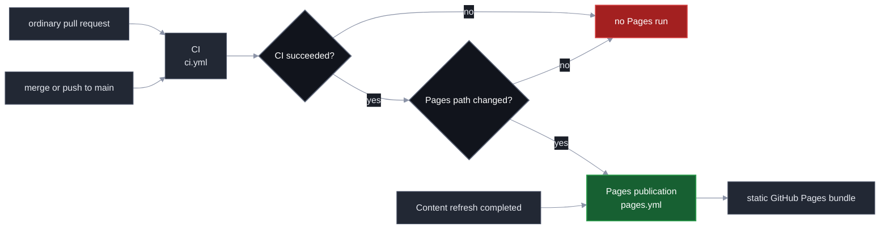
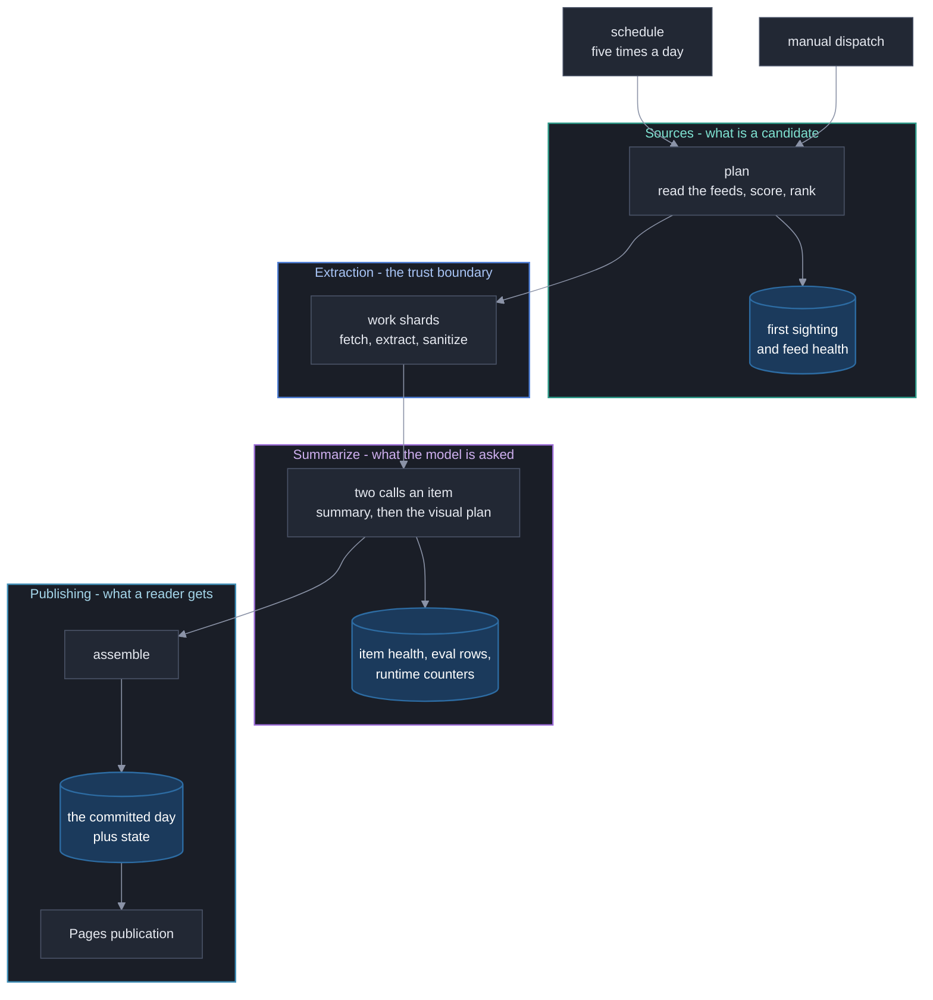
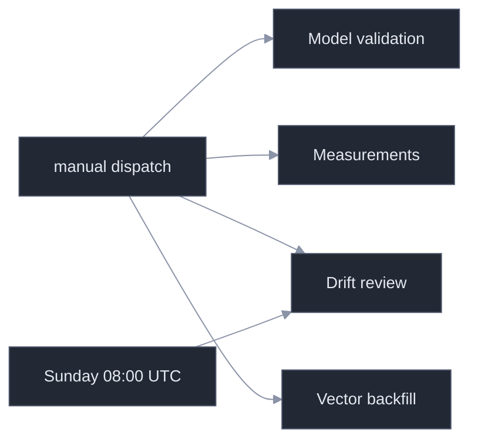
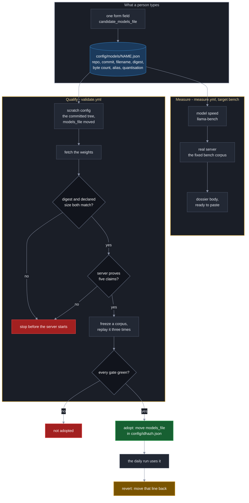

# GitHub Actions Workflows

**Last Updated**: 2026-09-17
The exact workflow display names, files, and trigger classes. All scheduled
times are UTC.

**Two workflows push to `main`.** `digest.yml` does it on every run. `measure.yml`
does it from 2026-09-17, and only from the `runtime` job, and only the machine
that job drew - one row under `state/pipeline-tests/host-fingerprint/`. Nothing
else in `measure.yml` writes anything back; every other job uploads an artifact
and the runner takes the rest with it. The permission is raised on that one job
rather than at workflow level, so the others still cannot.

## Trigger reference

| File | Display name | Automatic trigger | Manual dispatch |
| --- | --- | --- | --- |
| `ci.yml` | `CI` | Pull request; push to `main` | yes |
| `digest.yml` | `Content refresh` | `20 2 * * *`, `20 6 * * *`, `20 10 * * *`, `20 14 * * *`, `20 18 * * *` | yes |
| `pages.yml` | `Pages publication` | Completed `CI` run that succeeded; completed `Content refresh` run | yes |
| `drift.yml` | `Drift review` | Sunday at 08:00 (`0 8 * * 0`) | yes |
| `validate.yml` | `Model validation` | none | yes |
| `measure.yml` | `Measurements` | none | yes |
| `probe.yml` | `Runtime probe` | none | yes |
| `prune.yml` | `Corpus prune` | every `finetune.prune_every_days` | yes |
| `backfill.yml` | `Vector backfill` | none | yes |
| `idhazh-pipeline-tests.yaml` | `Pipeline tests` | none | yes |

An ordinary pull request starts CI only. A merge or direct push to `main` starts
CI, and **publication follows CI's verdict rather than the push**: a push reaches
both workflows at the same moment, so publishing on the push would publish
before anything had judged the commit. When CI succeeds, `pages.yml` publishes
the exact commit CI verified - not the branch tip, which may have moved - and
only when that commit touches `frontend/**`, `config/idhazh.json` or `state/**`.

The daily path is not gated on a conclusion, and that is deliberate. The job
that writes a day runs `validate-days` before its own commit, so the day is
verified by its producer; a sibling job failing afterwards does not unvalidate
it, and refusing to publish would leave a good day unread for up to four hours.
That path publishes the branch tip rather than the triggering commit, because a
run's `head_sha` is the commit it started from and the day it wants published is
the commit it made afterwards.

`measure-migrated-tree.yml` was on this list and it is gone. It ran once, on
2026-09-08, to answer what the site would weigh once the prerendered dated
documents and the committed encoder weights left it. **Its second case deleted
the weights and did not delete the dated directories**, so the number it
reported describes a tree nobody built; the real figure was taken off the
ordinary `site` job instead, because the site as it ships is the migrated tree
([measurements.md](measurements.md)). The shell-and-fetch migration deleted
the file on closing: a measurement harness nobody runs is upkeep with no reader.

## The schedule asks for five runs a day and gets fewer

**This is the single most important thing on this page, because it is invisible
in the run list.** GitHub places a scheduled workflow on a best-effort queue. On
a free public repository it delays runs under load, and it **drops the slots it
cannot place** - without creating a run, without a failure, and without a
notification.

Measured 2026-08-29 from `gh api
repos/miztiik/yen-idhazh/actions/workflows/digest.yml/runs`, over every run
created since 2026-08-26:

| Day | Slots elapsed | Runs created | Runs that failed |
| --- | --- | --- | --- |
| 2026-08-26 | 5 | 5 | 0 |
| 2026-08-27 | 5 | 2 | 0 |
| 2026-08-28 | 5 | 1 | 0 |
| 2026-08-29 (to 11:46 UTC) | 3 | 2 | 0 |

**Nothing failed. Eight of the thirteen slots over the last three days were
never created at all.** A thin digest day is a run that did not happen, not a
run that broke, and until 2026-08-29 no artifact in this repository recorded the
difference.

Slot by slot, with the delay each one carried:

| Slot | Started | Late by |
| --- | --- | --- |
| 2026-08-26, all five | 03:27, 07:11, 10:53, 15:54, 20:05 | 33 to 105 min |
| 2026-08-27 02:20, 06:20, 14:20 | never | - |
| 2026-08-27 10:20 | 12:50 | 2 h 30 |
| 2026-08-27 18:20 | 23:48 | 5 h 28 |
| 2026-08-28 02:20, 06:20, 10:20 | never | - |
| 2026-08-28 14:20 | 14:23 | 3 min |
| 2026-08-28 18:20 | **2026-08-29** 01:46 | 7 h 26 |
| 2026-08-29 02:20 | never | - |
| 2026-08-29 06:20 | 09:06 | 2 h 46 |

**A slot delayed past midnight publishes to the wrong day.** The `plan` job dates
a run with `date -u +%F`, so the 18:20 slot of 2026-08-28 started at 01:46 and
filed its 108 items under 2026-08-29. That is why 2026-08-28 shows one run and
2026-08-29 shows two. The rule "a run belongs to the UTC day it ran" is
defensible and is not being changed here; what was missing is that anybody could
see it happen.

### What was done about it

Two things, and neither of them makes GitHub reliable, because nothing in this
repository can.

**The cron is five one-slot lines rather than one five-hour line.** The schedule
is identical. `github.event.schedule` hands a run the cron line that fired, and
with a single `20 2,6,10,14,18 * * *` line that string is the whole expression -
a run cannot tell which of the five slots it is, so it cannot say how late it
started. Five lines make the slot nameable.

**The `plan` job reports its own lateness.** It prints the slot and the delay on
every scheduled run, and raises a workflow warning past 120 minutes. That
threshold is **derived, not measured**: a scheduled run here normally starts 40
to 70 minutes after its cron minute, so it is roughly twice the recorded normal.
Nothing reads it to make a decision - it annotates the run summary and stops
there.

**What was not done.** No retry, no self-dispatch, no extra cron slots to absorb
the losses. A workflow that re-fires itself on a schedule it cannot observe is a
way to run two pipelines at once, and the `digest` concurrency group has already
cancelled queued runs on this repository (2026-08-24 and 2026-08-25 carry six
`cancelled` runs between them). The honest position is that the platform decides
how many runs happen, and this page is where that is written down.



## Content refresh

The schedule and manual dispatch use the same job graph. The plan job creates
the work list, then derives the fan-out from it. The work matrix creates one to
eight total worker jobs. Manual dispatch offers 1 through 8 and defaults to
four; an explicit input always wins over the derivation, and the plan job
rejects any other value before it creates the matrix. The work strategy sets
`max-parallel` to that same derived count, so every worker of a run starts at
once and the fan-out cannot disagree with its own concurrency cap.

**The ceiling is eight; a run derives at most four for itself.** A scheduled run
passes no inputs, so the count is
`min(ceil(items / run.shard_size), run.max_parallel)`, never below one - and
`run.max_parallel` is four. A day of 16 or more items therefore still runs the
four workers it has always run, and a smaller day runs fewer. Every extra worker
restores the weights again, and that restore is the largest fixed cost in the
pipeline. One dispatch has now run at eight and halved the slowest worker, from
113.1 minutes to 58.8 - but it failed at `assemble` and published nothing, so no
day has yet reached a reader through that fan-out. What moves `run.max_parallel`
to eight is written under
[Eight work shards](../archive/measurements-2026-08.md#eight-work-shards), not this change.

A *derived* count above the ceiling is walked down into it rather than rejected:
by then the feeds have been read, and a config the guard disagrees with must
cost the tail of the fan-out rather than the whole day. Only a dispatched value
is a hard failure.

**A queued dispatch can be cancelled by the next scheduled run, silently.** The
workflow sets `concurrency: group: digest` with `cancel-in-progress: false`, so a
dispatch fired while a run is going does not interrupt it - it waits. GitHub
keeps only **one** pending run per concurrency group, and a newer pending run
cancels the older one. So a dispatch parked behind an in-flight run is cancelled
the moment a cron creates the next one, and the operator sees a cancelled run
rather than an error. Fire a dispatch within minutes of a run completing, not
while one is going. The crons are `20 2,6,10,14,18` UTC and a scheduled run
normally starts 40-70 minutes after its cron minute, but GitHub deprioritises
schedules under load: on 2026-08-27 the 02:20 and 06:20 slots produced no run at
all and the 10:20 slot started at 12:50, two and a half hours late. Read
`gh run list --workflow digest.yml` for what actually exists rather than working
from the cron.

Guardrail #2 allows 20 concurrent jobs. Eight workers is eight, so the ceiling
is nowhere near
the platform limit. Every shard restores the same cache key, so more shards buy
more restores and never more cache bytes.

The derivation runs in its own `fanout` step after `Plan the day`, because there
is no planned item count before the plan exists. `jobs.plan.outputs.shards` and
`jobs.plan.outputs.matrix` both read that step; `date` and `faithfulness` still
come from `decide`, the three model refs come from `models`, and
`shard_timeout_minutes` comes from `bounds`. Everything a job needs before its
first step travels as a job output, because `needs` resolves there and `steps`
does not.

Each worker receives its round-robin share of the whole plan and reads the count
from the job output rather than deriving it again - two answers to that question
would drop or double-work items with no error. The workflow enforces
`config.run.shard_size`, `config.run.max_parallel` and, since 2026-08-27,
`config.run.shard_timeout_minutes`: the work job's `timeout-minutes` is that
value and nothing else, so changing the config number changes the bound.
`run.safety_ceiling_per_run` is the item ceiling sized against it.

Each worker checks its weights before it starts the server. `sha256sum` compares
the file on disk against `models.summarize.sha256` in the active model file, on a
cache hit as well as a miss, because a restored cache entry is the one case where
nobody watched the bytes arrive. So do the two measurement jobs that load the summarizer.
The rule is written once, under
[Every download fails loudly, and every weight is checked](#every-download-fails-loudly-and-every-weight-is-checked).
The health check then asserts that
`GET /v1/models` returns the configured alias and that `GET /props` names the
configured filename. A shard that fails either one stops before it summarizes
anything.

Assemble runs even after a worker failure, then commits the digest and state.

**A run that publishes nothing annotates the run summary.** `if: always()` buys
the record of a bad day, and its cost is a stage that can decide nothing and
still exit 0. On 2026-09-14 it did: every work shard refused at start-up, 80
stories were planned, 80 were recorded `not_attempted`, an empty day was
committed, and the only sentence naming the cause sat in a work-job log that
expires - so the published archive kept the symptom for ever and the cause for
ninety days. `stage_assemble` now prints
`::error title=The run published nothing::` when a day planned stories and
published none, naming the counts and sending the reader to the work jobs. It
does not exit non-zero: failing there would skip the steps that commit the day,
which is the invisibility `if: always()` exists to prevent.



The plan job also commits first-sighting and feed-health state before it starts
the workers. This keeps observations from a failed refresh. Each worker then
commits the item-health and eval rows for the items its own shard settled, for
the same reason: those rows otherwise ride only in that shard's `items-<shard>`
artifact, which expires and is never committed.

A worker commits a third row in the same step: what its model server counted for
the whole shard, read once from `/metrics` at job end and filed in
`state/runtime-counters.csv`. The raw body still ships in `runtime-log-<shard>`,
which keeps it for two days - long enough to read a failure, far too short to
hold a published rate to account. The committed row is what lets
`backend/utilities/reconcile_prefill.py` check the item-health ledger's read rate
against a second instrument (Guardrail #10).

The same row carries two facts about the job rather than about its server: how
long the shard took, and which processor it drew. The `work` job's first step -
ahead of the checkout, so the clock covers the cache restore and the weight load
- writes an epoch second and the `/proc/cpuinfo` `model name` line to
`$GITHUB_ENV`, and the counters step passes both to `python -m idhazh counters`.
The rollback rule for the truncation cap reads that clock, and until 2026-08-29
the only place it existed was the jobs API, which drops a job record when the run
ages out ([../archive/measurements-2026-08.md](../archive/measurements-2026-08.md#the-instrument-trigger-a-reads)).

### The commit steps push through a rebase, and the one that can rebuild rebuilds

The plan job, each work shard and the assemble job commit, then push in a loop of
three attempts. From 2026-09-17 the bench's `runtime` job does too. All of them
run one script,
[`.github/scripts/commit-and-push.sh`](../../.github/scripts/commit-and-push.sh).
Two copies of the loop were a loop no test could execute.

**A ledger reaches the repository only when the job that wrote it stages it.** No
other job can stand in. Each one runs on its own runner with its own checkout, so
the `state` assemble stages whole carries nothing a work shard wrote.
`state/host-fingerprint` was written from the day the probe shipped and staged by
nobody, and `state/span-rollup` for nine days, and neither broke a test: the
ledger side was in Python, the staging side was in YAML, and nothing read both.
[`backend/tests/workflows/test_ledger_staging.py`](../../backend/tests/workflows/test_ledger_staging.py)
reads both. It takes every store from the `*_relpath` helpers the store modules
already export, charges each one to the job whose `python -m idhazh <verb>` step
reaches its writer, and fails naming the store, the job, the workflow file and
the step to add the path to. A ledger is written by an `append_*` call and the
trace tree by a file sink opened on its own path helper; both count, because both
die with the runner. It names no store itself, so a thirteenth one is covered the
day its writer lands rather than the day somebody remembers to add it to a list -
which is why the three hand-written lists it replaced were deleted on 2026-09-17
rather than kept beside it.

The same file holds the second half of that. A ledger that declares a key must be
in `ledger.keyed_paths`, the registry the post-merge settlement walks, and a
ledger that declares none must be absent from it. The two sides are compared as
sets rather than as a subset, so the registry's one deliberate absence has to stay
the one its own docstring claims. `state/span-rollup` was staged from 2026-09-15
and settled by nothing until 2026-09-16, which is the gap this closes. The one
writer that replaces its file rather than appending to it - `write_chrome` - names
no key as it writes, because there is no repeat for it to drop at write time; it
is still registered, because `merge=union` stacks two runs' folds and only the
settlement can take one back out.

A rebase refuses to start while a tracked file is modified. Run `32671663130`
died that way: one file was CRLF against a `text eol=lf` attribute, so every
Linux checkout saw it modified before any step ran, and the retry loop threw away
a day that plan, four shards and assemble had all finished.

The work is already in a commit when the loop begins, so anything left in the
working tree is runner noise. The loop prints what is dirty and discards it
before the rebase. `--autostash` was removed - it stashes the noise and then
fails the step when the stash will not reapply, which is the failure it looks
like it prevents.

**An untracked file stops a rebase too, and until 2026-09-17 this page said it
could not.** A rebase detaches HEAD onto the tip first, and that checkout refuses
when a file the incoming commits add is already sitting untracked in the working
tree: `error: The following untracked working tree files would be overwritten by
checkout`. The rebase never starts, so there is nothing for `git rebase --abort`
to abort, and the loop spends all three attempts on the first one.

Run `35152132574` is the record. A work shard wrote
`state/host-fingerprint/2026/09/16.csv` at a time when its commit step did not
stage that path, so the file stayed untracked; a sibling shard pushed the same
path while this one was still reading articles. 303 measured rows over six
ledgers were committed locally and thrown away with the runner, and the day's
other three shards published without them.

The staging list has since gained that path, which closes that one collision and
not the next: the list is written by hand, and a new `state/` writer has arrived
without it three times (`state/span-rollup` and `state/traces` on 2026-09-15,
`state/host-fingerprint` on 2026-09-16). So the loop also clears, before each
rebase, exactly the untracked files the tip is about to write - and names each
one in the run log. **A path this job did not stage is a path it is not pushing**,
so removing it costs the push nothing it was going to carry, and every path that
WAS staged still lands. Everything else untracked survives: `llama-server.log`
and the memory samples are untracked, and later steps upload them.

**There are two ways to lose the push race, and they need different answers.**

The plan job only records what it saw, and so does a work shard. Their ledgers
are append-only and every row is independent of its neighbours, so two runs that
both appended are not in disagreement and the union of both sides is the answer.
Every file under `state/` carries `merge=union` in `.gitattributes`, so that
rebase resolves itself. A reader of those ledgers already deduplicates.

That is the answer for two runs writing different rows and the wrong one for two
attempts writing the same row, and an appending stage cannot tell them apart: it
filters against the file it checked out, and `actions/checkout` pins the job to
the commit its run was triggered at. So the work shard's commit step names
`DROP_REPEATED_ROWS_COMMAND`, which runs after the rebase, on the merged file -
the only artefact that has ever held both attempts. The first row for a key wins,
which is the rule the appending stages already state.

A shard's two steps carry `continue-on-error`, so neither can fail the shard. The
shard owes the run its items artifact, and assemble writes the same census again,
so a ledger that will not push costs this run an early copy of rows it gets
anyway - while a failed shard costs the day a whole worker. Eight shards racing
one branch is the contention case the loop's three attempts and the union driver
exist for.

The assemble job rebuilds what it commits, so it rebuilds. `actions/checkout@v6`
carries no `ref`, so the job takes main's tip at trigger time, and a run takes
164-184 min - the day is always built on a base up to three hours old, and the
push is the first thing to find out. On a rejected push the loop hands the
derived paths back to origin's tip and runs `python -m idhazh assemble` again
against it. That stage already loads the previous day and appends to it, so it
is the conflict resolver; it was being run once against a stale base and then
thrown at `git merge-file`. A text merge of two digests produces a payload no
producer would ever write.

`REFRESH_PATHS` names what the rebuild owns: the day's `digest.json` and
`run.json`, `frontend/public/telemetry/`, and the four ledgers the workers and
assemble append to. It never names the day's directory. The `shard-visuals-*`
artifacts unpack this run's rendered charts into that same directory and no producer in
the assemble job can make them again, so the two payload files are named one at a
time. `frontend/public/telemetry/` is a full rewrite of `state/item-health/`,
which is why it is regenerated and not unioned: a union of two rewrites is a file
with every row twice.

**The charts in that directory are the other way to lose the day, and they get
their own answer.** A chart used to be filed as `<vertical>-<NN>.svg`, numbered
from the day's directory, and two runs of one day overlap by hours - so both read
the same highest number and both wrote `energy-03.svg` for different items. Run
`32869125768` finished eight workers and a visual planner and then died at this step on
`CONFLICT (add/add)` over four such paths, because git cannot rebase two adds of
one path. `REFRESH_PATHS` cannot help: hand-back would delete this run's charts
while the rebuilt `digest.json` still names them.

Since 2026-08-27 a chart is filed under its item's own id, so two stories can no
longer land on one path at all. What is left is two runs **compiling** the same
item to different bytes, and `DROP_RACED_ASSETS_COMMAND` is the answer to that.
The word changed on 2026-09-13, when the build-time renderer was deleted: nothing
renders, the reader's browser draws the chart, and what a run writes is the marks.
The renderer's own non-determinism went with it, so an item compiled twice from
unchanged inputs now writes identical bytes and git merges those without a
conflict. The race did not go with it: the marks come from an article re-fetched
from the open web, so a source page that moved between two runs' fetches still
puts two different blobs on one path. Before
each rebase attempt the loop lists the asset paths the tip already publishes -
`git ls-tree -r --name-only FETCH_HEAD` over the same staged paths - and pipes
them to that command, which deletes this run's copy of any of them. The tip's
file never moves: it is published, a reader may already hold that address, and
the rebuild keeps the tip's item over this run's in any case - so this run's copy
is the one nothing would have referenced. The decision payload keeps naming the
same path, because the tip's file is sitting at it after the rebase, so the
rebuilt day
still names a file that is really in the tree. `DROP_RACED_ASSETS_COMMAND` without
`REGENERATE_COMMAND` is rejected at startup, because only a job that rebuilds can
commit the drops. Why it is a drop and not a merge side, a refresh or a rename is
in [`../architecture/publishing/visuals.md`](../architecture/publishing/visuals.md).

**Every command in the loop is guarded.** Until 2026-08-25 `git pull --rebase
origin main` was the only unguarded one, so under `bash -e` a conflict ended the
script inside attempt 1: no attempt 2, no failure message, no day, and a checkout
left mid-rebase. A guarded failure now says what it was, leaves no rebase in
progress, and ends on the three-attempt message.

A workflow contract test pins this shape, and executes the script against real
local repositories - including a scripted origin that gains both another run of
the same day and an unrelated pull-request merge while the job works, and one
where both sides rendered a chart onto the same path. Measured 2026-08-25, git
2.55.0, bash 5.3.15. CI never runs `digest.yml`, so a change to the loop still
needs a dispatched run to verify end to end.

### The rebuild reads its own mid-flight payloads with whatever code main now holds

**A contract change merged while a run is in flight breaks that run**, and the
error names neither the cause nor the fix. The rebuild above re-runs
`python -m idhazh assemble` against `origin/main` after a lost push race. It
re-runs the code at the tip, and the per-item payloads on the runner's disk were
written hours earlier by the code the run started with. If the two disagree about
a field, the reader raises where nothing is wrong with the data.

Measured on run `33951249328`, 2026-09-05. The then-separate `visuals` job wrote its per-item
payloads at 08:23:21. `assemble` committed at 09:03:08, lost the push at
09:03:09, rebased `a6acdb6..b68f625`, printed `rebuilding the day against
origin/main`, and raised:

```
pydantic_core.ValidationError: 3 validation errors for VisualDecision
decided_at Field required
route_ms Extra inputs are not permitted
routed_at Extra inputs are not permitted
```

Two of those three fields had been renamed on `main` between 08:23 and 09:03.
Nothing was wrong with the payloads and nothing was wrong with the new contract.

**The window is most of the day.** Five scheduled runs, each 164 to 184 minutes,
so a merge lands inside a live run more often than not. Two consequences:

- **Check for an in-flight run before merging a contract change.**
 `gh run list --workflow digest.yml --status in_progress` answers it. A change
 that removes, renames or retypes a field on any payload under `backend/var/`
 waits for the run to finish.
- **The failure is loud and the day is lost, not corrupted.** `assemble` raises
 rather than publishing a half-read day, and the next scheduled run rebuilds
 from its own payloads under the new contract. So the cost is one digest, and
 the answer is to time the merge rather than to build a guard - a guard would
 have to read the old shape, which is exactly the migration `CLAUDE.md`
 section 11 already requires when the payload is committed. These are not.

**The error now names the condition, which is a smaller claim than fixing it.**
Every read of a payload one job of a run wrote and a later job reads goes
through `Contract.read`, which compares the stamp on the payload against the one
the running build declares before parsing rules on anything. When the two differ
and the payload will not load, it raises `StalePayloadError` carrying both
stamps and the remedy, instead of a list of fields that are not wrong. A payload
stamped with the build's own version still raises the parser's own error
untouched - that is a defect and dressing it up would hide every real bug behind
a story about timing. The bullet above still holds: the day is still lost, the
next scheduled run still rebuilds it, and timing the merge is still the thing
that prevents it. What changed is that the operator can now read the failure
without opening two commits.

**The proper fix is a rule change, and it is not this one.** `CLAUDE.md`
section 11 requires a read-side migration when a persisted shape moves, and it
scopes that to committed files - which is why the payloads under `backend/var/`
are outside it. They are not committed, but they ARE written by one build and
read by another, which is the property the rule actually cares about. Extending
section 11 to cover them would close the hole rather than report it: a rename
would ship with a reader for the old shape, the straddling run would read its
own payloads and publish, and no day would be lost. The cost is that every
rename on those shapes becomes expand-migrate-contract - two commits and a
window of hours where both shapes are read - rather than one commit. That is a
change to the engineering contract and to a persisted-contract rule, so it is
Level 5 (`CLAUDE.md` section 6) and belongs to the owner, not to a fix PR.

Two things that look like fixes and are not. Re-running the producer instead of
the assembler when the contract has moved does not work: `assemble` is what
merges the day with what is already published, so skipping it is not an option
and re-running the whole day costs the run again. And degrading the item, which
`CLAUDE.md` section 1a would otherwise reach for, is the wrong shape here - the
three cases that principle names are all the outside world failing, and this is
the build and the disk disagreeing. Degrading would publish a day quietly
missing N items because somebody merged a rename, and nothing would come back to
correct it. Failing loudly costs one publishing slot and the next run repairs
itself.

Model validation and measurements never run on a pull request, push, or
schedule. A person dispatches them. Drift review is a separate weekly or manual
workflow; it does not run inside Content refresh. Vector backfill is dispatched
too, and the reason it is never scheduled is in
[Vector backfill](#vector-backfill).



## Pages publication

`pages.yml` builds only committed data and uploads a static bundle. It does not
run the producer or a model, and the published site has no runtime backend. When
it runs and which commit it takes are in [Trigger reference](#trigger-reference)
above; this section is what it does once it has decided to publish.

**A newer build supersedes an older one; a deploy in flight always finishes.**
Concurrency is declared on the two jobs rather than on the workflow, because
they want opposite answers. The `build` job groups as `pages-build` with
`cancel-in-progress: true`: it makes a replaceable artifact, publishing is
last-write-wins, and an older bundle that finishes is discarded the moment the
newer one deploys. The `deploy` job keeps the group `pages` with
`cancel-in-progress: false`, because it replaces the live site and a
half-replaced site is worse than an old one.

**Cancelling a build cannot strand a deployment, and two independent facts say
so.** `deploy` declares `needs: build` and carries no `if:`, so its condition is
the default `success()` - a cancelled job satisfies no `needs`, and the deploy
never starts. Independently of how the scheduler reads a cancellation, a build
that stopped early never finished `actions/upload-pages-artifact`, and artifacts
are scoped to their own run, so there is nothing for that run's deploy to take.
The site is replaced from a complete bundle or not at all.

The two settings are structural rather than tunable, so they are written in the
workflow and not in `config/` (Guardrail #6). GitHub resolves `concurrency`
before a job starts, so no config file has been read yet; and no value a knob
could hold would make cancelling a live deploy right. They are the same kind of
statement as `needs:` - what each job is, not how hard it should try.

### What the split actually saves, measured 2026-09-17

Taken against the live API, last 100 `pages.yml` runs.

| Reading | Value | What it means |
| :--- | ---: | :--- |
| Runs in 24 hours | 85 | CI succeeds on every merge to `main`, and each success reaches here. |
| Of the last 60, runs that built | 28 | The other 32 stopped at `decide`: the commit touched none of `frontend/**`, `config/idhazh.json` or `state/**`, so nothing was rebuilt and no artifact was uploaded. |
| A build that runs | 49 s median, 60 s worst | So one cancelled build returns at most a minute of runner time. |
| A deploy | 10 s median | Short enough that queueing behind one costs little. |
| Runs cancelled | 0 | Nothing was being cancelled before this change. |
| Consecutive runs that overlap at all | 6 of 99 | Publication is bursty but thinly spread, so the group binds rarely. |

**The saving is small and the reason to take it is not the saving.** At 6
overlapping pairs and 49 s a build, the runner time returned is on the order of
five minutes a day. What the old shape cost that does not show up as minutes is
head-of-line blocking: one group over the whole run put a newer commit's build
behind the previous run's build *and* deploy, so the freshest bundle waited on a
bundle already known to be out of date. The change removes that, cannot make the
published site worse, and reverts by moving five lines. That is the whole case
for it (Guardrail #10).

**What GitHub's own starter workflows say, and what they do not.** Both
`actions/starter-workflows` Pages templates carry `concurrency: group: "pages"`
with `cancel-in-progress: false` and the comment "do NOT cancel in-progress runs
as we want to allow these production deployments to complete". In `static.yml`
there is a single job that builds and deploys, so the comment can only be about
the deploy. `jekyll-gh-pages.yml` does split `build` and `deploy` with
`needs: build`, and still declares one group at workflow level - the comment
still reasons about "production deployments", and the build inherits the setting
only because a workflow-level block cannot address one job. So the guidance
applies to the deploy job; the build is swept up by where the block sits rather
than by an argument about builds.

One thing this change does not fix, because it was already true: if CI for an
older commit finishes after CI for a newer one, the older commit publishes last.
Publication orders by when a verdict arrived, not by commit order.

## Testing a candidate model, end to end



**One form field, because the file already holds the answer.** Both dispatches take `candidate_models_file` and nothing else about the candidate. Every fact a run needs - the repository, the 40-character commit, the GGUF filename, its SHA-256, its byte count, the alias the server answers to, the quantisation - is written in `config/models/<name>.json`, and a form that asked for them again was a second copy that could disagree with the first. It could bench one set of bytes and adopt another with every gate green. Leave the field empty and the run re-measures whatever `config/idhazh.json` currently points at, which is how the bench is checked against the page it reproduces.

**The scratch config differs from the committed tree in the line an adoption moves.** Both workflows copy `config/`, move `models_file`, and change no control - so every setting the numbers are read under is the committed one by construction, and a candidate is measured through the exact line an adoption later moves. Until 2026-09-14 the step rebuilt the entry field by field and copied the incumbent's `inference` and `turns` blocks across with their digests overwritten, which asserted that numbers measured for one model held for another.

**The bench copy carries one more key, and it is not a control.** `run.trial_state_dirname` says where that run's own ledgers land, not what the run measures. The bench passes `pipeline-tests`, so every ledger the dispatch writes goes under `state/pipeline-tests/` and none of it is beside the rows the console reads - which has been true of every stage the bench runs since 2026-09-17, and of the `plan` step only since then ([Design rationale](#what-a-validation-or-bench-run-must-never-share-with-production)). `Model validation` and the budget retake pass nothing and build exactly the copy they always did. Why the rows are split rather than filtered is on [host-metrics.md](host-metrics.md#design-rationale).

Each Measurements dispatch selects exactly one target:

| Target | Jobs it runs | What they measure | Inputs that target reads |
| --- | --- | --- | --- |
| `bench` | `llama-bench`, then `runtime` | `llama-bench` times how fast the weights read a prompt and write an answer; `runtime` then runs a real llama-server over `bench.corpus_items` articles and emits the dossier body from both halves | `candidate_models_file`; `threads` and `model_speed_case` for the first; `runtime_candidate`, `runtime_repeats`, `runtime_threads`, `runtime_threads_batch` for the second |
| `image` | `image` | CPU image-model candidates | none |
| `corpus` | `corpus` | Live article-length sampling | `corpus_links` |
| `batched` | `batched` | `llama-batched-bench` aggregate decode at parallel levels 1, 2 and 4, three repeats on one host | none; the bench parameters are pinned in the workflow and the context and threading knobs come from `config/idhazh.json` |
| `budgets` | `budgets` | The three token counts a vocabulary sizes, retaken against the candidate's own tokenizer | `candidate_models_file`, `budget_samples` |

The form keeps all target-specific inputs visible. A job reads only the inputs
for its selected target. The default target is `bench`; the default runtime
candidate is `baseline`.

**The model speed case can be bypassed, and the rest of the `bench` target still
runs.** `bench.run_model_speed_case` in `config/idhazh.json` is true by default;
the `model_speed_case` dispatch input overrules it for one run (`config` follows
the knob, `run` and `skip` do not). Bypassing it skips the `llama-bench` job and
nothing else: the fixed corpus, the real server over it, the machine probe and
the committed host row all still happen. What is given up is the prefill and
decode rates, and with them the dossier - a dossier is both halves, so a
dispatch missing one emits the server half and a line naming the half that is
missing. It also moves who pays for the weights, because the speed case is what
fills the cache entry the server case restores ([ci-caches.md](ci-caches.md)).
Measured 2026-09-16 over the four dispatches of that day on stock
`ubuntu-latest`, the speed case took 9.1, 26.7, 27.2 and 87.6 minutes - between
a tenth and a third of a whole dispatch
([what a bench dispatch costs](benchmarks/what-a-bench-dispatch-costs.md)).

`Model validation` reads `config/idhazh.json`, follows its pointer to the model
file, and takes every candidate fact from there. It names no model of its own.
[Swap the Summarizer Model](../how-to/evaluate-new-summarizer-model.md) owns the
procedure and the acceptance requirements.

**What a swap costs the 10 GB cache is a reading, and it lives in the instrument
log.** This page carried a second copy of the 2026-08-27 table until 2026-09-17;
the fuller one, with the headroom left over, is
[The cache transition](measurements.md#the-cache-transition-measured-2026-08-27),
and the standing rule about which caches earn their bytes is
[ci-caches.md](ci-caches.md).

## Vector backfill

`python -m idhazh backfill-vectors` re-encodes every closed committed day whose
vectors are not exactly the set its items earned. The workflow runs it, prints
the resulting coverage, builds the site, and commits only when the `commit`
input is on - so the first dispatch reports and the second one publishes.

Three things about it are decisions rather than details.

**It excludes the current UTC day.** A day payload is one JSON file with no
union merge, and the scheduled pipeline appends to the live day several times an
hour. Two producers writing that file do not interleave: one wins whole and the
other one's run is gone.

**It re-encodes a wrong day whole rather than topping it up.** Measured
2026-08-26 over the 439 vectors the five closed days carried: a re-encode
reproduces them at a median cosine of 0.9936 and moves the top-10 neighbour list
of 413 of them. The same measurement against the day CI had written hours
earlier returns a median cosine of 1.000000. Every closed day predates
`fix(embed): make a vector a function of its own text, not of its batch`, so its
vectors carry an arithmetic the browser's query encoder no longer uses. Topping
such a day up would leave one block holding two arithmetics for a single query
to rank against.

**It validates every day and builds the site before it commits, and weighs the
pages after.** The vectors ride inside the day payloads, and `/archive/` inlines
every committed day, so this is the one job that can write a payload no reader
can read or push that page past the ceiling in `config/idhazh.json`. Those are
two severities. An invalid payload means the day is broken, so `idhazh
validate-days` and then `npm run build` run first and stop the commit; a page
over its recorded weight still reads correctly, so `npm run bundle-gate` runs
after the commit and fails the job without costing the repair
([../architecture/publishing/layout.md](../architecture/publishing/layout.md#a-bad-day-is-stopped-before-the-commit-the-weight-ratchet-is-not-2026-08-29)).
`digest.yml` carries the same order for the same reason. **The validate step is
there because the build stopped answering for it**: a reading document has
carried a seed rather than its whole day since 2026-09-01, so a build never
opens the stories past it.

## Pipeline tests

A production run takes about 200 minutes and has been cancelling shards, so a
change to the pipeline was tested the next day, against a day of eighty articles
whose spread hid whatever the change did. `idhazh-pipeline-tests.yaml` closes
that loop inside `pipeline-tests.budget_minutes`, which is 45. It runs the real
path - the real fetcher, the real extractor, the real two calls, the real model
server - over two articles, three times over, and reports what each pass cost.
It publishes nothing: no step writes `frontend/public/`, no step commits, and
what the passes produced leaves as a 90-day artifact.

**The dispatch takes one field, and it names the model.** Leave
`candidate_models_file` empty and the cases run the model `config/idhazh.json`
already names, which is what every reading this workflow has taken. Name a file
under `config/models/` and a scratch copy of `config/` points at it, every case
is cut from that copy, and the real prompts and the real two calls run on those
weights - so the cheapest real-path check of a candidate is a dispatch here
rather than a bench. What it settles and what it does not is in
[../how-to/evaluate-new-summarizer-model.md](../how-to/evaluate-new-summarizer-model.md#the-cheapest-check-is-the-pipeline-tests-and-it-uses-the-real-prompts).
The committed config is never written: the scratch copy differs in one line, and
in `run.trial_state_dirname`, which puts this dispatch's own ledgers under
`state/pipeline-tests/` rather than beside the rows the console reads.

**The two articles are drawn, not fixed.** `config/pipeline-tests.json` holds at
least twenty candidate addresses, each one an article this pipeline has really
fetched and summarized, and each naming the feed in `config/sources.json` that
carried it. The dispatch draws two, seeded from the run id GitHub allocated, and
prints the seed beside the pair. A fixed pair would pass for as long as those
two pages stayed up and say nothing about anything else the extractor meets; a
draw with no seed printed could not be replayed.

**The draw happens once, before any case starts.** One step draws, one step turns
the pair into a run plan, and all three cases run that one plan - so the three
record the same two item ids and the numbers between them can be subtracted. The
final step compares what each case recorded against what the plan asked for and
fails the job when they disagree, because an address that 404s would otherwise
leave one case with one item and three rows of plausible numbers.

**Three cases, in sequence, on one runner, and never a matrix.** Prefill spans
4.2x between GitHub-hosted runners ([measurements.md](measurements.md)), which
is larger than anything a case here is looking for, so three jobs would report
the three hosts they drew. Sequential on one box cancels the host.

| Case | What it changes | What the difference prices |
| --- | --- | --- |
| `baseline` | nothing - the production path exactly | the number the other two are read against |
| `no-visual-decision` | no picture is reachable, so the summarize-and-plan call returns the summary alone | the visual plan's decode, on the same server process |
| `parallel-2` | two server slots, and the window doubled with them | decode throughput at two slots, plus a second model load |

Each case is a step rather than an iteration of a loop, so the run page shows
each case's own wall clock. Every case setting is in config (Guardrail #6): the
addresses, the draw size, the job bound, the slot counts and the windows. One
step writes a config root per case from the committed `config/`, differing only
in what that case changes, and the committed config is never edited - a case that
edited it would leave the next case reading whatever the last one wrote.

**The parallel case doubles `n_ctx` because llama-server divides the window it is
given between its slots.** Two slots on the committed 65,536 is a 32,768-token
slot, and the worst article the truncation cap admits needs 54,887 - so leaving
the window alone would make that case a test of a smaller window wearing a
concurrency case's name. The slot count is fixed when the process starts, which
is why that case costs a restart and a second model load.

Two things one dispatch cannot settle. **Whether two articles are representative
of the eighty a production day carries - they are not**, and the draw is what
stops them being representative of nothing instead. And the faithfulness scorer,
which every case skips: it is a second model download, it is identical across the
cases so it cancels from every comparison here, and it is not what the two-call
path is being measured for.

## Display names and files

A workflow display name is the label shown in the Actions UI. Its filename is
the stable automation interface for repository paths, API calls, and CLI
dispatch. Keep the ten filenames stable when a UI label changes.

GitHub's `workflow_run.workflows` selector is the exception: it matches a
display name. `pages.yml` therefore names `Content refresh` in that selector.
The workflow contract test pins both sides so a label change cannot silently
stop publication.

## Action versions

Every workflow calls the same nine actions, each pinned to one approved major.
GitHub retired the Node 20 runtime on its runners, so an action major that still
declares `using: node20` is force-run on Node 24 today and stops running later.

| Action | Major | Runtime |
| --- | --- | --- |
| `actions/cache` | `v6` | `node24` |
| `actions/checkout` | `v6` | `node24` |
| `actions/configure-pages` | `v6` | `node24` |
| `actions/deploy-pages` | `v5` | `node24` |
| `actions/download-artifact` | `v8` | `node24` |
| `actions/setup-node` | `v7` | `node24` |
| `actions/setup-python` | `v7` | `node24` |
| `actions/upload-artifact` | `v7` | `node24` |
| `actions/upload-pages-artifact` | `v5` | composite, pins a `node24` `upload-artifact` |

Each runtime above was read from that major's own `action.yml` on 2026-08-24.
The workflow contract test asserts the table: a new action, or a call site left
on an old major, fails CI.

`setup-node` still selects Node 22 for the frontend commands. That is the
application runtime and is unrelated to the runtime an action itself declares.

### One action is ours, and it is not pinned to a major

`.github/actions/candidate-config` is a composite action this repository owns.
A `./`-prefixed action resolves to this repository at the commit the run checked
out, so there is no major to approve and nothing for a version pin to add - it
is already the code under test. The contract test asserts the directory exists
rather than asserting a version, and a second test reads the shell it runs.

It builds the scratch config: a copy of `config/` whose `models_file` points at
the candidate, and which differs from the committed tree in that one line and
nothing else. `measure.yml` and `validate.yml` both call it. They carried
byte-identical copies of the step until 2026-09-15, differing only in the job
they read the models file from - and a step duplicated across two files is a
step that drifts the day one of them is edited, which had already happened twice
in these two workflows.

**What the extraction cost, stated rather than implied.** The two workflows are
47 lines shorter and there is one new file a reader has to open, plus 36 lines
of test machinery that teaches the harness to read a composite action. It does
not remove a check; it removes the second place the step could be edited.

## Design rationale

### The speed case is a job somebody can turn off, and turning it off must not turn off the rest

Owner decision, 2026-09-17. The `llama-bench` job measures how each candidate
performs, it is only dispatched while models are being tested, and it stays. The
open question was what to do when somebody wants to exercise the `bench` flow
itself and does not want to pay for it.

**A bypass is worth having because the job is a real share of the dispatch, not
a rounding error.** Over the four dispatches of 2026-09-16 on stock
`ubuntu-latest` it took 9.1, 26.7, 27.2 and 87.6 minutes against whole dispatches
of 170.6, 188.5, 113.6 and 287.8 - between a tenth and a third.

**Two controls rather than one, because they answer different questions.**
`bench.run_model_speed_case` is the standing answer and lives in
`config/idhazh.json`, so changing it changes behaviour with no source edit
(Guardrail #6). The `model_speed_case` dispatch input is one run's answer, so an
operator needs no commit; `config` defers, and `run` or `skip` overrules. The
decision is taken once, in the `models` job, by
`backend/utilities/model_speed_case.py` - a job's own `if:` cannot read a step of
that job, so the answer has to travel as an output, and putting the rule in a
module keeps it out of a `${{ }}` expression nothing can run.

**The consequence is the part worth writing down.** A GitHub job whose `if:`
carries no status function is given an implicit `success()`, and a skipped need
is not a success - so a skipped job skips every dependant, silently. `runtime`
needs the speed case, so without a change it would have vanished with it and a
bypass would have skipped half the workflow. `runtime` now lifts the implicit
check with `!cancelled()` and puts back exactly what it was doing: `models` must
have succeeded, and the speed case must have either succeeded or been skipped. A
speed case that **failed** still stops it, because a candidate that cannot move a
token has already answered the question `runtime` would spend five hours asking
again. `budgets`, `batched`, `image` and `corpus` never needed the speed case and
are untouched; the test walks `needs` rather than trusting that sentence.

**Two steps degrade rather than fail.** The dossier is both halves by
definition, so the artifact download and the emit step run only when the speed
case ran, and a bypassed dispatch prints a line naming the half it does not have.
Emitting half a page that read like a whole one would be worse than emitting
none.

**What a bypass costs beyond the rates: the weights get downloaded in a
different job.** The speed case is what fills the cache entry the server case
restores. Skip it and `runtime` pays for the same bytes itself, once
([ci-caches.md](ci-caches.md)).

### What the model workflows share, and what they must not

Answered 2026-09-17. `measure.yml` and `validate.yml` both stand a candidate
model up on a runner, and the open question was how much of that they should
hold in common. `.github/actions/candidate-config` was the first block; the
rest was open.

**The rule, in one sentence: share a block when the copies have to be
byte-identical for the system to be correct, and duplicate it when they have to
be allowed to differ.** The scratch config passes that outright. A control the
bench holds fixed and the qualification does not is not a control, so the two
copies had to be one file or the two answers were about different things.

**For the middle cases, count inputs against callers.** An action with more
inputs than callers is a function with a mode flag, and a mode flag is the
duplication wearing a shared name. `candidate-config` has two inputs and three
call sites, so it is a block. A shared corpus step would need an input per
calling workflow, so it is not.

#### The runtime pin was the next block, and it was taken one caller at a time

Fetching the inference runtime and the weights and proving the digests was **249
substantive lines across 23 steps in five workflows** - `digest.yml`,
`idhazh-pipeline-tests.yaml`, `measure.yml`, `probe.yml` and `validate.yml`.
Counted on 2026-09-17 over every step whose shell names `llama.tar.gz`,
`huggingface.co/` or `sha256sum --check`; `ci.yml`'s browser cache is not a
model runtime and is not in it.

The pin itself - `LLAMA_CPP_BUILD`, its asset name and its SHA-256 - was spelled
in **13 places that had to change together**: five `env:` blocks and eight fetch
steps. It is now in **two**: `.github/scripts/llama-cpp-pin.sh` and
`measure.yml`'s `env:` block, which is the one caller still to convert.

```powershell
git grep -c 'LLAMA_CPP_BUILD:' -- .github/workflows
git grep -c 'releases/tags/${LLAMA_CPP_BUILD}' -- .github/workflows
```

Those two counts are a reading of this tree, not a constant. **The property is
what mattered and it did not move: every copy of the pin had to change at once,
and nothing in the tree compared them.** Change twelve of the thirteen and a
qualification runs on a runtime production does not run, with every gate green,
because no check could tell. That is what made it worth a block rather than a
rule somebody remembers. What holds it together now is a contract test that
pins the three variables in every workflow still spelling them and refuses any
copy of them in a workflow that has been converted; where the pinned values live
and how a caller reads them is [ci-model-runtime.md](ci-model-runtime.md).

**The conversion was a strangler, one workflow per commit, and the workflow that
publishes went last.** Four alternatives were live.

| Option | Cost | What it gives up |
| --- | --- | --- |
| One commit converting all five | One review, one revert | A revert takes four working conversions out with the fifth. The daily run is in that set, so the blast radius of a mistake is a published day. |
| One commit per workflow, publisher last | Five reviews, five reverts, a window where the tree holds two shapes | Nothing, except that the census reads oddly mid-way - which is why the counts above are dated |
| Leave the pin copied, add a test that compares the copies | No workflow moves | The test would go green on five agreeing copies and say nothing about the sixth place somebody adds next |
| One script with an optional `WEIGHTS_FILE` | One file instead of two | Every caller's weights refusals become optional to satisfy one caller that opens no weights |

The second was taken. `probe.yml` first because it opens no weights and a
mistake there costs a dispatch nobody depends on; `validate.yml` next because a
mistake costs a qualification that can be re-run; `digest.yml` last because it
publishes to readers and a bad fetch there is a bad day on the site.

That order is also what made the fourth option refusable rather than merely
disliked. `probe.yml` converted first, so the question "what does a job that
opens no weights need" had to be answered before any weights-carrying caller
moved - and the answer was a second script, `install-llama-runtime.sh`, which
`fetch-model-runtime.sh` sources. Had `digest.yml` gone first, the cheap answer
would have been an optional `WEIGHTS_FILE` and the refusals would have been
weakened for every caller.

#### What stays duplicated, and why

Checkout, Python setup, `LLAMA_PORT` and artifact upload stay copied. Each is
one or two lines, each workflow's copy is already correct, and a block that
saved two lines would cost a file to open.

**The corpus build looks the most shareable and is the one that must not be.**
Five workflows build a corpus five ways, and each way is a different sampling
contract:

| Workflow | What its corpus is chosen to answer |
| :--- | :--- |
| `digest.yml` | What runs today - the day's ranked plan, for readers |
| `measure.yml`, target `corpus` | What article lengths the open web really has |
| `measure.yml`, target `bench` | What `bench.corpus_items` articles cost on this machine |
| `validate.yml` | Is this model good enough on text that cannot move under it |
| `idhazh-pipeline-tests.yaml` | What this code change cost on the same drawn pair |

A shared step would take a mode, and the mode would be the whole of the
difference between them.

#### No workflow takes prompt text as an input

**The prompt is shipped code, never a dispatch argument.** No workflow, script
or utility in this repository accepts prompt text, a prompt path or a prompt
override, and none may gain one. Both model paths already read the shipped
prompt by construction: the summariser and the classifier resolve their prompt
file from `__file__`, and the scratch config is a copy of `config/`, where no
prompt lives. So a measurement is taken under the prompt production runs, and a
dispatch cannot quietly change what was asked. Written down here so it stays
true when somebody adds the sixth workflow.

#### What a validation or bench run must never share with production

Six things, and they are the whole list: the published site under
`frontend/public/`, the committed `config/models/<name>.json` the incumbent
points at, the production ledgers under `state/`, the seen store inside them,
the run id and the date a production day is keyed on, and article text, which
never leaves the job that fetched it.

**One of those six was open until 2026-09-17 and is now closed for the bench.**
`run.trial_state_dirname` moves a run's whole state root, and the bench passes
`pipeline-tests` - but its `plan` step ran without `--config`, so it loaded the
committed config, which redirects nothing. `plan` appends to the seen store,
feed health, feed retirements and the counterfactual scores, so every bench
dispatch wrote four production ledgers, and the seen store is the one that
bites: a marked address makes the next production day skip that story with
nothing in the log to say why. The step now reads the scratch config, and
`test_no_bench_stage_can_reach_the_production_state_root` asserts it for every
stage any job in that file runs, present or future.

**`validate.yml`'s plan job still has it, and that is a decision rather than an
oversight.** Its `Read the feeds` step runs `plan` against the committed config
in a job that builds no scratch config at all. Redirecting it is two lines, and
the cost is not two lines: `plan` reads the seen store as well as writing it, so
a redirected qualification would plan from an empty one and draw different
articles. That changes which corpus a qualification is judged on, which is the
evaluation owner's call and not a workflow edit's. What settles it is one
dispatch each way, comparing the drawn addresses.

## What is not on this page

This page answers one question: which workflows exist, when each runs, and what
each does. Three things these workflows depend on are exact values rather than
behaviour, and each has its own page.

| Question | Page |
| :--- | :--- |
| How does a job get the inference runtime and the weights, and how does it prove it got the right ones? | [ci-model-runtime.md](ci-model-runtime.md) |
| What shape must a `workflow_dispatch` input have, and which shapes exist? | [ci-dispatch-inputs.md](ci-dispatch-inputs.md) |
| What repository settings and platform limits decide how these workflows behave? | [ci-environment.md](ci-environment.md) |

## See also

- [ci-model-runtime.md](ci-model-runtime.md) - the runtime pin, the cache key, the weight digests, and where the production model ref is written.
- [ci-dispatch-inputs.md](ci-dispatch-inputs.md) - the three input shapes, and the one that decides a published address.
- [ci-environment.md](ci-environment.md) - the repository settings these workflows need, and the platform limits that shape them.
- [ci-caches.md](ci-caches.md) - every cache these workflows keep, what it costs against the 10 GB ceiling, and when a new job earns one.
- [../how-to/analyze-a-pipeline-artifact.md](../how-to/analyze-a-pipeline-artifact.md) - how to read what the model was asked and what it answered, out of the `captures-<shard>` artifact.
- [../architecture/overview.md](../architecture/overview.md) - how CI, committed payloads, and the static site fit together.
- [../concepts/pipeline-loop.md](../concepts/pipeline-loop.md) - what each pipeline stage owns.
- [../how-to/run-the-pipeline.md](../how-to/run-the-pipeline.md) - how to run the same stages locally.
- [../architecture/sources/freshness.md](../architecture/sources/freshness.md) - what five runs add to one day.
- [../../CLAUDE.md](../../CLAUDE.md) - Rules #1, #2, #9, and #10.
