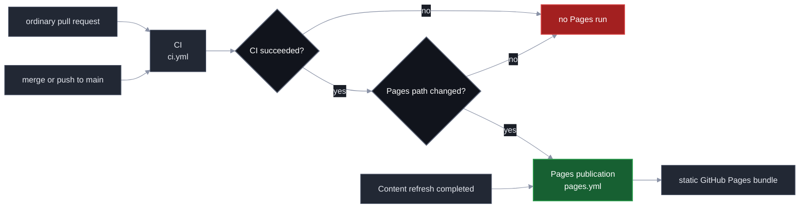
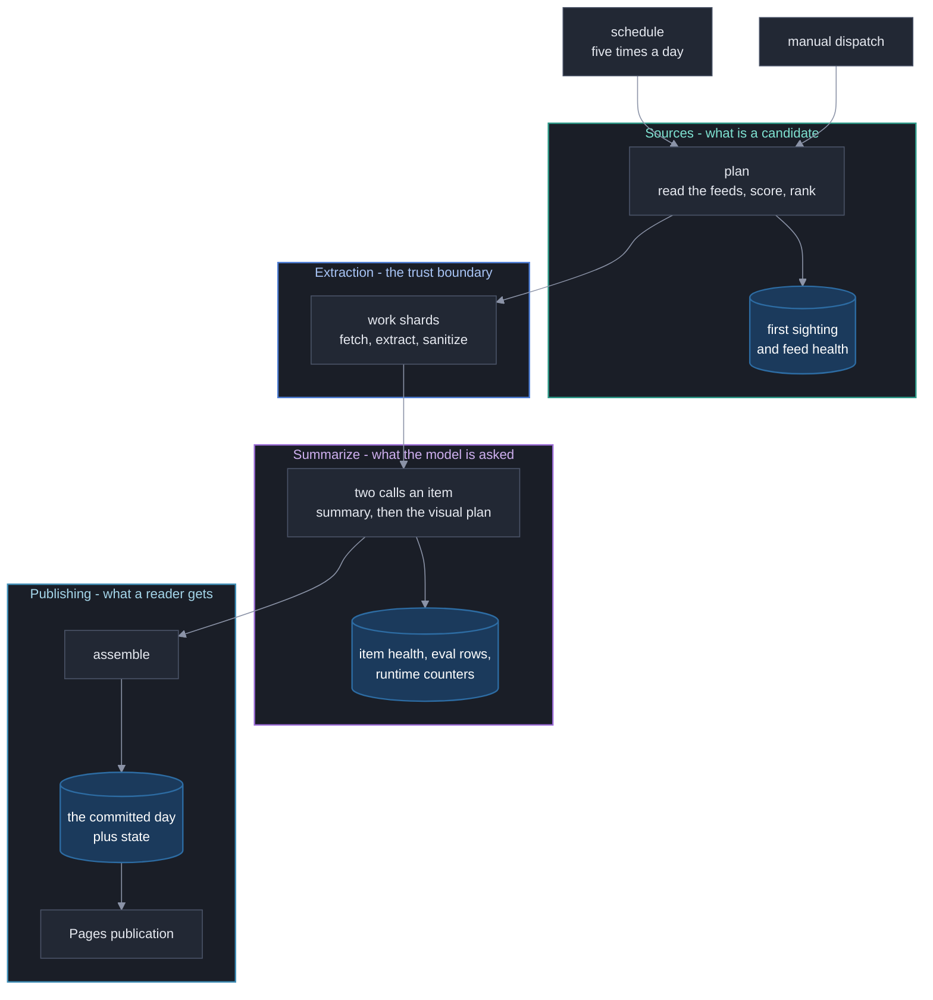
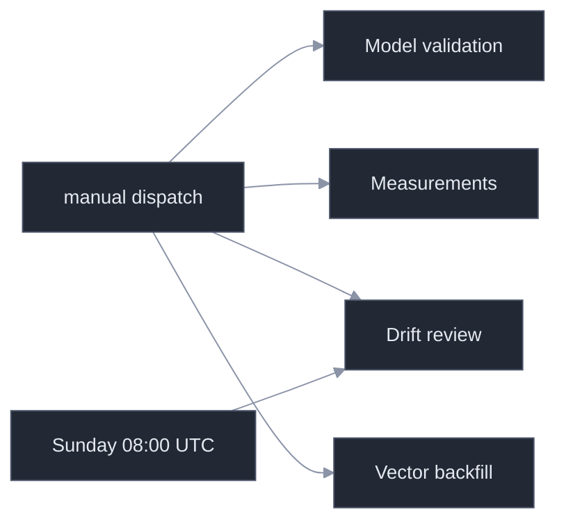
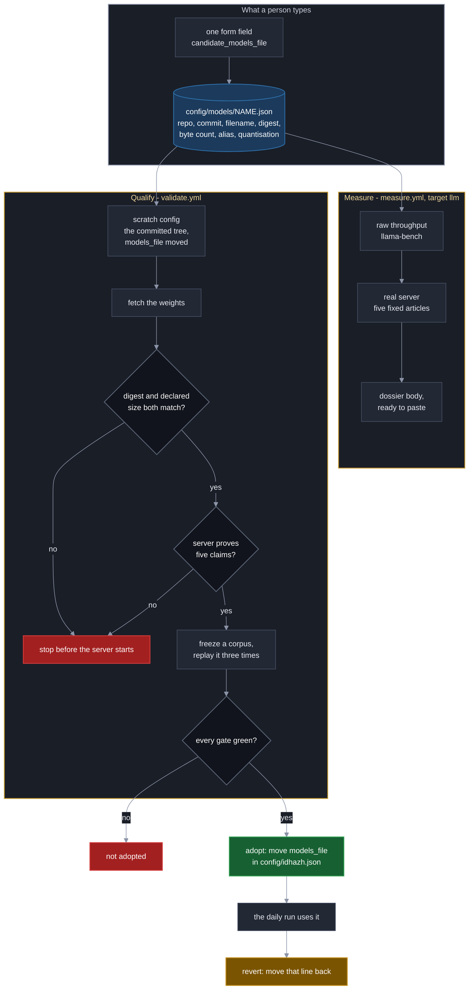

# GitHub Actions Workflows

**Last Updated**: 2026-09-15
The exact workflow display names, files, and trigger classes. All scheduled
times are UTC.

## Trigger reference

| File | Display name | Automatic trigger | Manual dispatch |
| --- | --- | --- | --- |
| `ci.yml` | `CI` | Pull request; push to `main` | yes |
| `digest.yml` | `Content refresh` | `20 2 * * *`, `20 6 * * *`, `20 10 * * *`, `20 14 * * *`, `20 18 * * *` | yes |
| `pages.yml` | `Pages publication` | Completed `CI` run that succeeded; completed `Content refresh` run | yes |
| `drift.yml` | `Drift review` | Sunday at 08:00 (`0 8 * * 0`) | yes |
| `validate.yml` | `Model validation` | none | yes |
| `measure.yml` | `Measurements` | none | yes |
| `probe.yml` | `Runtime probe` | none | yes |
| `prune.yml` | `Corpus prune` | every `finetune.prune_every_days` | yes |
| `backfill.yml` | `Vector backfill` | none | yes |
| `idhazh-pipeline-tests.yaml` | `Pipeline tests` | none | yes |

An ordinary pull request starts CI only. A merge or direct push to `main` starts
CI, and **publication follows CI's verdict rather than the push**: a push reaches
both workflows at the same moment, so publishing on the push would publish
before anything had judged the commit. When CI succeeds, `pages.yml` publishes
the exact commit CI verified - not the branch tip, which may have moved - and
only when that commit touches `frontend/**`, `config/idhazh.json` or `state/**`.

The daily path is not gated on a conclusion, and that is deliberate. The job
that writes a day runs `validate-days` before its own commit, so the day is
verified by its producer; a sibling job failing afterwards does not unvalidate
it, and refusing to publish would leave a good day unread for up to four hours.
That path publishes the branch tip rather than the triggering commit, because a
run's `head_sha` is the commit it started from and the day it wants published is
the commit it made afterwards.

`measure-migrated-tree.yml` was on this list and it is gone. It ran once, on
2026-09-08, to answer what the site would weigh once the prerendered dated
documents and the committed encoder weights left it. **Its second case deleted
the weights and did not delete the dated directories**, so the number it
reported describes a tree nobody built; the real figure was taken off the
ordinary `site` job instead, because the site as it ships is the migrated tree
([measurements.md](measurements.md)). The shell-and-fetch migration deleted
the file on closing: a measurement harness nobody runs is upkeep with no reader.

## The schedule asks for five runs a day and gets fewer

**This is the single most important thing on this page, because it is invisible
in the run list.** GitHub places a scheduled workflow on a best-effort queue. On
a free public repository it delays runs under load, and it **drops the slots it
cannot place** - without creating a run, without a failure, and without a
notification.

Measured 2026-08-29 from `gh api
repos/miztiik/yen-idhazh/actions/workflows/digest.yml/runs`, over every run
created since 2026-08-26:

| Day | Slots elapsed | Runs created | Runs that failed |
| --- | --- | --- | --- |
| 2026-08-26 | 5 | 5 | 0 |
| 2026-08-27 | 5 | 2 | 0 |
| 2026-08-28 | 5 | 1 | 0 |
| 2026-08-29 (to 11:46 UTC) | 3 | 2 | 0 |

**Nothing failed. Eight of the thirteen slots over the last three days were
never created at all.** A thin digest day is a run that did not happen, not a
run that broke, and until 2026-08-29 no artifact in this repository recorded the
difference.

Slot by slot, with the delay each one carried:

| Slot | Started | Late by |
| --- | --- | --- |
| 2026-08-26, all five | 03:27, 07:11, 10:53, 15:54, 20:05 | 33 to 105 min |
| 2026-08-27 02:20, 06:20, 14:20 | never | - |
| 2026-08-27 10:20 | 12:50 | 2 h 30 |
| 2026-08-27 18:20 | 23:48 | 5 h 28 |
| 2026-08-28 02:20, 06:20, 10:20 | never | - |
| 2026-08-28 14:20 | 14:23 | 3 min |
| 2026-08-28 18:20 | **2026-08-29** 01:46 | 7 h 26 |
| 2026-08-29 02:20 | never | - |
| 2026-08-29 06:20 | 09:06 | 2 h 46 |

**A slot delayed past midnight publishes to the wrong day.** The `plan` job dates
a run with `date -u +%F`, so the 18:20 slot of 2026-08-28 started at 01:46 and
filed its 108 items under 2026-08-29. That is why 2026-08-28 shows one run and
2026-08-29 shows two. The rule "a run belongs to the UTC day it ran" is
defensible and is not being changed here; what was missing is that anybody could
see it happen.

### What was done about it

Two things, and neither of them makes GitHub reliable, because nothing in this
repository can.

**The cron is five one-slot lines rather than one five-hour line.** The schedule
is identical. `github.event.schedule` hands a run the cron line that fired, and
with a single `20 2,6,10,14,18 * * *` line that string is the whole expression -
a run cannot tell which of the five slots it is, so it cannot say how late it
started. Five lines make the slot nameable.

**The `plan` job reports its own lateness.** It prints the slot and the delay on
every scheduled run, and raises a workflow warning past 120 minutes. That
threshold is **derived, not measured**: a scheduled run here normally starts 40
to 70 minutes after its cron minute, so it is roughly twice the recorded normal.
Nothing reads it to make a decision - it annotates the run summary and stops
there.

**What was not done.** No retry, no self-dispatch, no extra cron slots to absorb
the losses. A workflow that re-fires itself on a schedule it cannot observe is a
way to run two pipelines at once, and the `digest` concurrency group has already
cancelled queued runs on this repository (2026-08-24 and 2026-08-25 carry six
`cancelled` runs between them). The honest position is that the platform decides
how many runs happen, and this page is where that is written down.



## Content refresh

The schedule and manual dispatch use the same job graph. The plan job creates
the work list, then derives the fan-out from it. The work matrix creates one to
eight total worker jobs. Manual dispatch offers 1 through 8 and defaults to
four; an explicit input always wins over the derivation, and the plan job
rejects any other value before it creates the matrix. The work strategy sets
`max-parallel` to that same derived count, so every worker of a run starts at
once and the fan-out cannot disagree with its own concurrency cap.

**The ceiling is eight; a run derives at most four for itself.** A scheduled run
passes no inputs, so the count is
`min(ceil(items / run.shard_size), run.max_parallel)`, never below one - and
`run.max_parallel` is four. A day of 16 or more items therefore still runs the
four workers it has always run, and a smaller day runs fewer. Every extra worker
restores the weights again, and that restore is the largest fixed cost in the
pipeline. One dispatch has now run at eight and halved the slowest worker, from
113.1 minutes to 58.8 - but it failed at `assemble` and published nothing, so no
day has yet reached a reader through that fan-out. What moves `run.max_parallel`
to eight is written under
[Eight work shards](../archive/measurements-2026-08.md#eight-work-shards), not this change.

A *derived* count above the ceiling is walked down into it rather than rejected:
by then the feeds have been read, and a config the guard disagrees with must
cost the tail of the fan-out rather than the whole day. Only a dispatched value
is a hard failure.

**A queued dispatch can be cancelled by the next scheduled run, silently.** The
workflow sets `concurrency: group: digest` with `cancel-in-progress: false`, so a
dispatch fired while a run is going does not interrupt it - it waits. GitHub
keeps only **one** pending run per concurrency group, and a newer pending run
cancels the older one. So a dispatch parked behind an in-flight run is cancelled
the moment a cron creates the next one, and the operator sees a cancelled run
rather than an error. Fire a dispatch within minutes of a run completing, not
while one is going. The crons are `20 2,6,10,14,18` UTC and a scheduled run
normally starts 40-70 minutes after its cron minute, but GitHub deprioritises
schedules under load: on 2026-08-27 the 02:20 and 06:20 slots produced no run at
all and the 10:20 slot started at 12:50, two and a half hours late. Read
`gh run list --workflow digest.yml` for what actually exists rather than working
from the cron.

Guardrail #2 allows 20 concurrent jobs. Eight workers is eight, so the ceiling
is nowhere near
the platform limit. Every shard restores the same cache key, so more shards buy
more restores and never more cache bytes.

The derivation runs in its own `fanout` step after `Plan the day`, because there
is no planned item count before the plan exists. `jobs.plan.outputs.shards` and
`jobs.plan.outputs.matrix` both read that step; `date` and `faithfulness` still
come from `decide`, the three model refs come from `models`, and
`shard_timeout_minutes` comes from `bounds`. Everything a job needs before its
first step travels as a job output, because `needs` resolves there and `steps`
does not.

Each worker receives its round-robin share of the whole plan and reads the count
from the job output rather than deriving it again - two answers to that question
would drop or double-work items with no error. The workflow enforces
`config.run.shard_size`, `config.run.max_parallel` and, since 2026-08-27,
`config.run.shard_timeout_minutes`: the work job's `timeout-minutes` is that
value and nothing else, so changing the config number changes the bound.
`run.safety_ceiling_per_run` is the item ceiling sized against it.

Each worker checks its weights before it starts the server. `sha256sum` compares
the file on disk against `models.summarize.sha256` in the active model file, on a
cache hit as well as a miss, because a restored cache entry is the one case where
nobody watched the bytes arrive. So do the two measurement jobs that load the summarizer.
The rule is written once, under
[Every download fails loudly, and every weight is checked](#every-download-fails-loudly-and-every-weight-is-checked).
The health check then asserts that
`GET /v1/models` returns the configured alias and that `GET /props` names the
configured filename. A shard that fails either one stops before it summarizes
anything.

Assemble runs even after a worker failure, then commits the digest and state.

**A run that publishes nothing annotates the run summary.** `if: always()` buys
the record of a bad day, and its cost is a stage that can decide nothing and
still exit 0. On 2026-09-14 it did: every work shard refused at start-up, 80
stories were planned, 80 were recorded `not_attempted`, an empty day was
committed, and the only sentence naming the cause sat in a work-job log that
expires - so the published archive kept the symptom for ever and the cause for
ninety days. `stage_assemble` now prints
`::error title=The run published nothing::` when a day planned stories and
published none, naming the counts and sending the reader to the work jobs. It
does not exit non-zero: failing there would skip the steps that commit the day,
which is the invisibility `if: always()` exists to prevent.



The plan job also commits first-sighting and feed-health state before it starts
the workers. This keeps observations from a failed refresh. Each worker then
commits the item-health and eval rows for the items its own shard settled, for
the same reason: those rows otherwise ride only in that shard's `items-<shard>`
artifact, which expires and is never committed.

A worker commits a third row in the same step: what its model server counted for
the whole shard, read once from `/metrics` at job end and filed in
`state/runtime-counters.csv`. The raw body still ships in `runtime-log-<shard>`,
which keeps it for two days - long enough to read a failure, far too short to
hold a published rate to account. The committed row is what lets
`backend/utilities/reconcile_prefill.py` check the item-health ledger's read rate
against a second instrument (Guardrail #10).

The same row carries two facts about the job rather than about its server: how
long the shard took, and which processor it drew. The `work` job's first step -
ahead of the checkout, so the clock covers the cache restore and the weight load
- writes an epoch second and the `/proc/cpuinfo` `model name` line to
`$GITHUB_ENV`, and the counters step passes both to `python -m idhazh counters`.
The rollback rule for the truncation cap reads that clock, and until 2026-08-29
the only place it existed was the jobs API, which drops a job record when the run
ages out ([../archive/measurements-2026-08.md](../archive/measurements-2026-08.md#the-instrument-trigger-a-reads)).

### The three commit steps push through a rebase, and the one that can rebuild rebuilds

The plan job, each work shard and the assemble job commit, then push in a loop of
three attempts. All of them run one script,
[`.github/scripts/commit-and-push.sh`](../../.github/scripts/commit-and-push.sh).
Two copies of the loop were a loop no test could execute.

A rebase refuses to start while a tracked file is modified. Run `32671663130`
died that way: one file was CRLF against a `text eol=lf` attribute, so every
Linux checkout saw it modified before any step ran, and the retry loop threw away
a day that plan, four shards and assemble had all finished.

The work is already in a commit when the loop begins, so anything left in the
working tree is runner noise. The loop prints what is dirty and discards it
before the rebase. Untracked files are left alone: they cannot block a rebase,
and a later step may still want them. `--autostash` was removed - it stashes the
noise and then fails the step when the stash will not reapply, which is the
failure it looks like it prevents.

**There are two ways to lose the push race, and they need different answers.**

The plan job only records what it saw, and so does a work shard. Their ledgers
are append-only and every row is independent of its neighbours, so two runs that
both appended are not in disagreement and the union of both sides is the answer.
Every file under `state/` carries `merge=union` in `.gitattributes`, so that
rebase resolves itself. A reader of those ledgers already deduplicates.

That is the answer for two runs writing different rows and the wrong one for two
attempts writing the same row, and an appending stage cannot tell them apart: it
filters against the file it checked out, and `actions/checkout` pins the job to
the commit its run was triggered at. So the work shard's commit step names
`DROP_REPEATED_ROWS_COMMAND`, which runs after the rebase, on the merged file -
the only artefact that has ever held both attempts. The first row for a key wins,
which is the rule the appending stages already state.

A shard's two steps carry `continue-on-error`, so neither can fail the shard. The
shard owes the run its items artifact, and assemble writes the same census again,
so a ledger that will not push costs this run an early copy of rows it gets
anyway - while a failed shard costs the day a whole worker. Eight shards racing
one branch is the contention case the loop's three attempts and the union driver
exist for.

The assemble job rebuilds what it commits, so it rebuilds. `actions/checkout@v6`
carries no `ref`, so the job takes main's tip at trigger time, and a run takes
164-184 min - the day is always built on a base up to three hours old, and the
push is the first thing to find out. On a rejected push the loop hands the
derived paths back to origin's tip and runs `python -m idhazh assemble` again
against it. That stage already loads the previous day and appends to it, so it
is the conflict resolver; it was being run once against a stale base and then
thrown at `git merge-file`. A text merge of two digests produces a payload no
producer would ever write.

`REFRESH_PATHS` names what the rebuild owns: the day's `digest.json` and
`run.json`, `frontend/public/telemetry/`, and the four ledgers the workers and
assemble append to. It never names the day's directory. The `shard-visuals-*`
artifacts unpack this run's rendered charts into that same directory and no producer in
the assemble job can make them again, so the two payload files are named one at a
time. `frontend/public/telemetry/` is a full rewrite of `state/item-health/`,
which is why it is regenerated and not unioned: a union of two rewrites is a file
with every row twice.

**The charts in that directory are the other way to lose the day, and they get
their own answer.** A chart used to be filed as `<vertical>-<NN>.svg`, numbered
from the day's directory, and two runs of one day overlap by hours - so both read
the same highest number and both wrote `energy-03.svg` for different items. Run
`32869125768` finished eight workers and a visual planner and then died at this step on
`CONFLICT (add/add)` over four such paths, because git cannot rebase two adds of
one path. `REFRESH_PATHS` cannot help: hand-back would delete this run's charts
while the rebuilt `digest.json` still names them.

Since 2026-08-27 a chart is filed under its item's own id, so two stories can no
longer land on one path at all. What is left is two runs **compiling** the same
item to different bytes, and `DROP_RACED_ASSETS_COMMAND` is the answer to that.
The word changed on 2026-09-13, when the build-time renderer was deleted: nothing
renders, the reader's browser draws the chart, and what a run writes is the marks.
The renderer's own non-determinism went with it, so an item compiled twice from
unchanged inputs now writes identical bytes and git merges those without a
conflict. The race did not go with it: the marks come from an article re-fetched
from the open web, so a source page that moved between two runs' fetches still
puts two different blobs on one path. Before
each rebase attempt the loop lists the asset paths the tip already publishes -
`git ls-tree -r --name-only FETCH_HEAD` over the same staged paths - and pipes
them to that command, which deletes this run's copy of any of them. The tip's
file never moves: it is published, a reader may already hold that address, and
the rebuild keeps the tip's item over this run's in any case - so this run's copy
is the one nothing would have referenced. The decision payload keeps naming the
same path, because the tip's file is sitting at it after the rebase, so the
rebuilt day
still names a file that is really in the tree. `DROP_RACED_ASSETS_COMMAND` without
`REGENERATE_COMMAND` is rejected at startup, because only a job that rebuilds can
commit the drops. Why it is a drop and not a merge side, a refresh or a rename is
in [`../architecture/publishing/visuals.md`](../architecture/publishing/visuals.md).

**Every command in the loop is guarded.** Until 2026-08-25 `git pull --rebase
origin main` was the only unguarded one, so under `bash -e` a conflict ended the
script inside attempt 1: no attempt 2, no failure message, no day, and a checkout
left mid-rebase. A guarded failure now says what it was, leaves no rebase in
progress, and ends on the three-attempt message.

A workflow contract test pins this shape, and executes the script against real
local repositories - including a scripted origin that gains both another run of
the same day and an unrelated pull-request merge while the job works, and one
where both sides rendered a chart onto the same path. Measured 2026-08-25, git
2.55.0, bash 5.3.15. CI never runs `digest.yml`, so a change to the loop still
needs a dispatched run to verify end to end.

### The rebuild reads its own mid-flight payloads with whatever code main now holds

**A contract change merged while a run is in flight breaks that run**, and the
error names neither the cause nor the fix. The rebuild above re-runs
`python -m idhazh assemble` against `origin/main` after a lost push race. It
re-runs the code at the tip, and the per-item payloads on the runner's disk were
written hours earlier by the code the run started with. If the two disagree about
a field, the reader raises where nothing is wrong with the data.

Measured on run `33951249328`, 2026-09-05. The then-separate `visuals` job wrote its per-item
payloads at 08:23:21. `assemble` committed at 09:03:08, lost the push at
09:03:09, rebased `a6acdb6..b68f625`, printed `rebuilding the day against
origin/main`, and raised:

```
pydantic_core.ValidationError: 3 validation errors for VisualDecision
decided_at Field required
route_ms Extra inputs are not permitted
routed_at Extra inputs are not permitted
```

Two of those three fields had been renamed on `main` between 08:23 and 09:03.
Nothing was wrong with the payloads and nothing was wrong with the new contract.

**The window is most of the day.** Five scheduled runs, each 164 to 184 minutes,
so a merge lands inside a live run more often than not. Two consequences:

- **Check for an in-flight run before merging a contract change.**
 `gh run list --workflow digest.yml --status in_progress` answers it. A change
 that removes, renames or retypes a field on any payload under `backend/var/`
 waits for the run to finish.
- **The failure is loud and the day is lost, not corrupted.** `assemble` raises
 rather than publishing a half-read day, and the next scheduled run rebuilds
 from its own payloads under the new contract. So the cost is one digest, and
 the answer is to time the merge rather than to build a guard - a guard would
 have to read the old shape, which is exactly the migration `CLAUDE.md`
 section 11 already requires when the payload is committed. These are not.

**The error now names the condition, which is a smaller claim than fixing it.**
Every read of a payload one job of a run wrote and a later job reads goes
through `Contract.read`, which compares the stamp on the payload against the one
the running build declares before parsing rules on anything. When the two differ
and the payload will not load, it raises `StalePayloadError` carrying both
stamps and the remedy, instead of a list of fields that are not wrong. A payload
stamped with the build's own version still raises the parser's own error
untouched - that is a defect and dressing it up would hide every real bug behind
a story about timing. The bullet above still holds: the day is still lost, the
next scheduled run still rebuilds it, and timing the merge is still the thing
that prevents it. What changed is that the operator can now read the failure
without opening two commits.

**The proper fix is a rule change, and it is not this one.** `CLAUDE.md`
section 11 requires a read-side migration when a persisted shape moves, and it
scopes that to committed files - which is why the payloads under `backend/var/`
are outside it. They are not committed, but they ARE written by one build and
read by another, which is the property the rule actually cares about. Extending
section 11 to cover them would close the hole rather than report it: a rename
would ship with a reader for the old shape, the straddling run would read its
own payloads and publish, and no day would be lost. The cost is that every
rename on those shapes becomes expand-migrate-contract - two commits and a
window of hours where both shapes are read - rather than one commit. That is a
change to the engineering contract and to a persisted-contract rule, so it is
Level 5 (`CLAUDE.md` section 6) and belongs to the owner, not to a fix PR.

Two things that look like fixes and are not. Re-running the producer instead of
the assembler when the contract has moved does not work: `assemble` is what
merges the day with what is already published, so skipping it is not an option
and re-running the whole day costs the run again. And degrading the item, which
`CLAUDE.md` section 1a would otherwise reach for, is the wrong shape here - the
three cases that principle names are all the outside world failing, and this is
the build and the disk disagreeing. Degrading would publish a day quietly
missing N items because somebody merged a rename, and nothing would come back to
correct it. Failing loudly costs one publishing slot and the next run repairs
itself.

Model validation and measurements never run on a pull request, push, or
schedule. A person dispatches them. Drift review is a separate weekly or manual
workflow; it does not run inside Content refresh. Vector backfill is dispatched
too, and the reason it is never scheduled is in
[Vector backfill](#vector-backfill).



### Testing a candidate model, end to end



**One form field, because the file already holds the answer.** Both dispatches take `candidate_models_file` and nothing else about the candidate. Every fact a run needs - the repository, the 40-character commit, the GGUF filename, its SHA-256, its byte count, the alias the server answers to, the quantisation - is written in `config/models/<name>.json`, and a form that asked for them again was a second copy that could disagree with the first. It could bench one set of bytes and adopt another with every gate green. Leave the field empty and the run re-measures whatever `config/idhazh.json` currently points at, which is how the bench is checked against the page it reproduces.

**The scratch config differs from the committed tree in one line.** Both workflows copy `config/`, move `models_file`, and change nothing else - so every control the numbers are read under is the committed one by construction, and a candidate is measured through the exact line an adoption later moves. Until 2026-09-14 the step rebuilt the entry field by field and copied the incumbent's `inference` and `turns` blocks across with their digests overwritten, which asserted that numbers measured for one model held for another.

Each Measurements dispatch selects exactly one target:

| Target | What runs | Inputs used by that target |
| --- | --- | --- |
| `llm` | GGUF download timing and `llama-bench` throughput | `models`, `threads` |
| `image` | CPU image-model candidates | none |
| `corpus` | Live article-length sampling | `corpus_links` |
| `runtime` | Fixed-shard llama-server candidate sweep | `runtime_candidate`; `runtime_repeats`; `runtime_threads` for `threads`; `runtime_threads_batch` for `threads_batch` |
| `batched` | `llama-batched-bench` aggregate decode at parallel levels 1, 2 and 4, three repeats on one host | none; the bench parameters are pinned in the workflow and the context and threading knobs come from `config/idhazh.json` |

The form keeps all target-specific inputs visible. A job reads only the inputs
for its selected target. The default target is `llm`; the default runtime
candidate is `baseline`.

`Model validation` reads `config/idhazh.json`, follows its pointer to the model
file, and takes every candidate fact from there. It names no model of its own.
[Swap the Summarizer Model](../how-to/evaluate-new-summarizer-model.md) owns the
procedure and the acceptance requirements.

### The cache across the model swap, measured 2026-08-27

Read with `gh cache list` on either side of the 2026-08-27 summarizer swap,
against the 10 GB repository ceiling in Guardrail #2. `n=1` - a cache listing is a
state, not a sample, so there is no spread.

| Moment | Bytes | Of the 10 GB cap |
| --- | --- | --- |
| Before: the visual planner's `llm-Qwen3-4B-Q4_K_M.gguf-b10598-v4` 2,438,761,586, a stale `qualify-03b74727...-b10598` 5,614,108,894, python and node about 0.59 GB | 8.05 GB | 81% |
| After deleting the stale qualification copy | 3,031,429,559 | 30% |
| After the production fill of 5,680,522,464 for the configured summarizer | **8,711,952,023** | **87%** |

**There was no retired-incumbent Qwen3-8B weights cache to delete.** PR #135
moved the cache key
to `-v4`, and the retired incumbent never filled under that key, so the whole
transition was one deletion of a qualification artifact rather than a swap of two
five-gigabyte entries. The cache key is
`llm-<file>-<revision>-<llama.cpp build>-v4`, built from the plan job's outputs,
so a model change moves the key and an old entry ages out rather than being
restored under a new alias
([measurements.md](measurements.md#the-cache-transition-measured-2026-08-27)).

Pages publication builds only committed data and uploads a static bundle. It
does not run the producer or a model, and the published site has no runtime
backend.

## Vector backfill

`python -m idhazh backfill-vectors` re-encodes every closed committed day whose
vectors are not exactly the set its items earned. The workflow runs it, prints
the resulting coverage, builds the site, and commits only when the `commit`
input is on - so the first dispatch reports and the second one publishes.

Three things about it are decisions rather than details.

**It excludes the current UTC day.** A day payload is one JSON file with no
union merge, and the scheduled pipeline appends to the live day several times an
hour. Two producers writing that file do not interleave: one wins whole and the
other one's run is gone.

**It re-encodes a wrong day whole rather than topping it up.** Measured
2026-08-26 over the 439 vectors the five closed days carried: a re-encode
reproduces them at a median cosine of 0.9936 and moves the top-10 neighbour list
of 413 of them. The same measurement against the day CI had written hours
earlier returns a median cosine of 1.000000. Every closed day predates
`fix(embed): make a vector a function of its own text, not of its batch`, so its
vectors carry an arithmetic the browser's query encoder no longer uses. Topping
such a day up would leave one block holding two arithmetics for a single query
to rank against.

**It validates every day and builds the site before it commits, and weighs the
pages after.** The vectors ride inside the day payloads, and `/archive/` inlines
every committed day, so this is the one job that can write a payload no reader
can read or push that page past the ceiling in `config/idhazh.json`. Those are
two severities. An invalid payload means the day is broken, so `idhazh
validate-days` and then `npm run build` run first and stop the commit; a page
over its recorded weight still reads correctly, so `npm run bundle-gate` runs
after the commit and fails the job without costing the repair
([../architecture/publishing/layout.md](../architecture/publishing/layout.md#a-bad-day-is-stopped-before-the-commit-the-weight-ratchet-is-not-2026-08-29)).
`digest.yml` carries the same order for the same reason. **The validate step is
there because the build stopped answering for it**: a reading document has
carried a seed rather than its whole day since 2026-09-01, so a build never
opens the stories past it.

## Pipeline tests

A production run takes about 200 minutes and has been cancelling shards, so a
change to the pipeline was tested the next day, against a day of eighty articles
whose spread hid whatever the change did. `idhazh-pipeline-tests.yaml` closes
that loop inside `pipeline-tests.budget_minutes`, which is 45. It runs the real
path - the real fetcher, the real extractor, the real two calls, the real model
server - over two articles, three times over, and reports what each pass cost.
It publishes nothing: no step writes `frontend/public/`, no step commits, and
what the passes produced leaves as a 90-day artifact.

**The two articles are drawn, not fixed.** `config/pipeline-tests.json` holds at
least twenty candidate addresses, each one an article this pipeline has really
fetched and summarized, and each naming the feed in `config/sources.json` that
carried it. The dispatch draws two, seeded from the run id GitHub allocated, and
prints the seed beside the pair. A fixed pair would pass for as long as those
two pages stayed up and say nothing about anything else the extractor meets; a
draw with no seed printed could not be replayed.

**The draw happens once, before any case starts.** One step draws, one step turns
the pair into a run plan, and all three cases run that one plan - so the three
record the same two item ids and the numbers between them can be subtracted. The
final step compares what each case recorded against what the plan asked for and
fails the job when they disagree, because an address that 404s would otherwise
leave one case with one item and three rows of plausible numbers.

**Three cases, in sequence, on one runner, and never a matrix.** Prefill spans
4.2x between GitHub-hosted runners ([measurements.md](measurements.md)), which
is larger than anything a case here is looking for, so three jobs would report
the three hosts they drew. Sequential on one box cancels the host.

| Case | What it changes | What the difference prices |
| --- | --- | --- |
| `baseline` | nothing - the production path exactly | the number the other two are read against |
| `no-visual-decision` | no picture is reachable, so the summarize-and-plan call returns the summary alone | the visual plan's decode, on the same server process |
| `parallel-2` | two server slots, and the window doubled with them | decode throughput at two slots, plus a second model load |

Each case is a step rather than an iteration of a loop, so the run page shows
each case's own wall clock. Every case setting is in config (Guardrail #6): the
addresses, the draw size, the job bound, the slot counts and the windows. One
step writes a config root per case from the committed `config/`, differing only
in what that case changes, and the committed config is never edited - a case that
edited it would leave the next case reading whatever the last one wrote.

**The parallel case doubles `n_ctx` because llama-server divides the window it is
given between its slots.** Two slots on the committed 65,536 is a 32,768-token
slot, and the worst article the truncation cap admits needs 54,887 - so leaving
the window alone would make that case a test of a smaller window wearing a
concurrency case's name. The slot count is fixed when the process starts, which
is why that case costs a restart and a second model load.

Two things one dispatch cannot settle. **Whether two articles are representative
of the eighty a production day carries - they are not**, and the draw is what
stops them being representative of nothing instead. And the faithfulness scorer,
which every case skips: it is a second model download, it is identical across the
cases so it cancels from every comparison here, and it is not what the two-call
path is being measured for.

## Display names and files

A workflow display name is the label shown in the Actions UI. Its filename is
the stable automation interface for repository paths, API calls, and CLI
dispatch. Keep the ten filenames stable when a UI label changes.

GitHub's `workflow_run.workflows` selector is the exception: it matches a
display name. `pages.yml` therefore names `Content refresh` in that selector.
The workflow contract test pins both sides so a label change cannot silently
stop publication.

## Action versions

Every workflow calls the same nine actions, each pinned to one approved major.
GitHub retired the Node 20 runtime on its runners, so an action major that still
declares `using: node20` is force-run on Node 24 today and stops running later.

| Action | Major | Runtime |
| --- | --- | --- |
| `actions/cache` | `v6` | `node24` |
| `actions/checkout` | `v6` | `node24` |
| `actions/configure-pages` | `v6` | `node24` |
| `actions/deploy-pages` | `v5` | `node24` |
| `actions/download-artifact` | `v8` | `node24` |
| `actions/setup-node` | `v7` | `node24` |
| `actions/setup-python` | `v7` | `node24` |
| `actions/upload-artifact` | `v7` | `node24` |
| `actions/upload-pages-artifact` | `v5` | composite, pins a `node24` `upload-artifact` |

Each runtime above was read from that major's own `action.yml` on 2026-08-24.
The workflow contract test asserts the table: a new action, or a call site left
on an old major, fails CI.

`setup-node` still selects Node 22 for the frontend commands. That is the
application runtime and is unrelated to the runtime an action itself declares.

### One action is ours, and it is not pinned to a major

`.github/actions/candidate-config` is a composite action this repository owns.
A `./`-prefixed action resolves to this repository at the commit the run checked
out, so there is no major to approve and nothing for a version pin to add - it
is already the code under test. The contract test asserts the directory exists
rather than asserting a version, and a second test reads the shell it runs.

It builds the scratch config: a copy of `config/` whose `models_file` points at
the candidate, and which differs from the committed tree in that one line and
nothing else. `measure.yml` and `validate.yml` both call it. They carried
byte-identical copies of the step until 2026-09-15, differing only in the job
they read the models file from - and a step duplicated across two files is a
step that drifts the day one of them is edited, which had already happened twice
in these two workflows.

**What the extraction cost, stated rather than implied.** The two workflows are
47 lines shorter and there is one new file a reader has to open, plus 36 lines
of test machinery that teaches the harness to read a composite action. It does
not remove a check; it removes the second place the step could be edited.

## The inference runtime is pinned, and the cache key says which build

`digest.yml`, `validate.yml`, `measure.yml`, `idhazh-pipeline-tests.yaml` and
`probe.yml` run one llama.cpp build. Each declares the same three variables, and
each checks the archive against its digest before it unpacks anything.

| Variable | Value |
| --- | --- |
| `LLAMA_CPP_BUILD` | `b10598` |
| `LLAMA_CPP_ASSET` | `llama-b10598-bin-ubuntu-x64.tar.gz` |
| `LLAMA_CPP_SHA256` | `d77a09db4165f8850b513629ed0ffeaab7851bb03e7cc3870b74e721f894694c` |

The SHA-256 is the release API's own `digest` for that asset. It was confirmed
on 2026-08-25 by downloading the 16,377,727-byte archive and hashing it.

The weights cache key names the build: `llm-<weights>-<build>-v4` in the two
`digest.yml` jobs, `validate-<challenger>-<build>-v3` in `validate.yml`. The
`digest.yml` suffix moved to `v4` when the weights half stopped coming from a
workflow variable, so the first run after that refetched once rather than
restoring an entry nobody could attribute. `v3` was the same move for the build.

**The key matters more than the pin.** The fetch step runs only on a cache
miss. Keyed on the weights alone, the cache froze one binary and then served a
different one the first time the entry was evicted - the instability of
following the newest release with none of its freshness, and no record on the
run of which build served the day. A throughput number measured in `measure.yml`
now describes the binary that writes the digest (Guardrail #10).

The run manifest is not fixed by this. It still records `runtime_build` as the
fixed string `llama-server-local`, so the manifest does not yet name the build.

A workflow contract test pins the three variables, the digest check on every
fetch path, and the build inside every runtime cache key.

### `probe.yml` asks the build what it accepts

The pin says which binary runs. It does not say what that binary understands,
and a models entry naming a speculation kind the build cannot drive fails late
and quietly: the server starts, loads the draft head, drafts nothing, and the
job spends its hour before anybody reads the flag back. `probe.yml` installs the
same asset the three runtime arms install, runs `llama-server --help`, prints
the speculation lines to the job summary, and keeps the whole help text as a
30-day artifact - so the next question about this build is answered by
downloading that artifact rather than by a second run.

It is a `workflow_dispatch` with no scheduled trigger and it loads no weights,
so it costs about a minute of runner time. It takes no input for a build,
either: it reads the same three pinned variables the runtime arms read and is
held to them by the same test, so its answer cannot describe a binary
production does not run. Probing a candidate build is a branch that moves the
pin, dispatched with `--ref` - the same commit somebody would have to make to
adopt it.

The question that made it was whether `b10598` accepts the kind a Gemma
multi-token head needs, and that is the shape of every question it answers:
read the runtime's own answer rather than a release note's.

## Every download fails loudly, and every weight is checked

Every download in every workflow is spelled `curl -fsSL --retry 3
--retry-all-errors`, and the release lookups that find the llama.cpp archive are
spelled `curl -fsS`. `-f` is the letter that matters. Without it curl treats a
403 or a 502 as a successful transfer: it writes the HTTP error body into the
output file and exits 0. Nothing downstream looks at the file until a server
tries to open it.

In the daily run that is worse than a failed step, because `backend/models` is a
cache path. A rate-limited minute writes a page of error text where the weights
should be, `actions/cache` saves it under the pinned key, and every later run
restores that same page until the entry is evicted. The retries are the cheap
half of the fix; `-f` is the half that stops the bad file being written at all.

The digest check is what catches the other failure, a transfer that dies
mid-body. That is a 200 response, so curl has nothing to retry and the file on
disk is simply short. Every job that downloads weights therefore runs
`sha256sum --check` against a recorded digest, after the fetch and before
anything reads the file. **No check carries an `if:`.** The fetch step is
skipped on a cache hit, and a restored entry is the one case where nobody
watched the bytes arrive - so it is the case that most needs the check.

| Workflow and job | Weights | Digest read from |
| --- | --- | --- |
| `digest.yml` / `work` | the summarizer | `models.summarize.sha256` |
| `measure.yml` / `runtime` | the bench candidate | the `models` job's `candidate_sha256` |
| `measure.yml` / `batched` | the summarizer | `models.summarize.sha256` |
| `validate.yml` / `qualify` | the candidate | the `plan` job's `candidate_sha256` |

The two config digests are the same field, `ModelRef.sha256` in the file
`config/idhazh.json`'s `models_file` points at. The other two are the exception,
and deliberately: an operator can point the bench and the validation case at a
model config does not name, so each resolves the digest once - from the dispatch
input, or from config when there is none - and republishes it as a job output
the whole run reads. The bench's raw case checks the same digest a step earlier,
inside `measure_llm.py`, against the Hub's own record for that commit.

The workflow contract test that holds this open is closed-world. It finds the
downloads by reading every workflow file rather than by consulting a list, and
fails when the set it finds differs from the set it pins. A tenth workflow that
downloads weights fails the test until it carries the same pair of steps.

### The digest settles the bytes, and the declared size settles the document

`sha256sum` says the file on disk is the file the entry named. It says nothing
about whether the entry is internally consistent, so both arms that resolve a
candidate also compare `stat -c %s` against the entry's own `byte_count`. An
entry that declares no size skips the check, because that is an entry nobody has
fetched yet rather than an entry that disagrees with itself.

`validate.yml` has done this since it was written and `measure.yml` had not. The
drift was found on 2026-09-15 by diffing the two files, which is the same way the
last one was found and the reason both are now held by one test.

### Healthy says a server replied, not which weights replied

Every number a bench reports is filed under the candidate's id, so a server
answering under any other alias makes the whole run a measurement of something
else wearing the candidate's name (Guardrail #10). Nothing in the report would
look wrong: every figure would be internally consistent.

Four server starts exist across the workflows and **all four now ask
`GET /v1/models` before anything is measured** - the daily run's worker, the
bench's runtime arm, the bench's vocabulary arm, and both starts in
`idhazh-pipeline-tests.yaml`. Two of those learned it on 2026-09-15; the daily
run and the validation arm already did it.

The alias comes from the same config the server's flags came from, never from a
second copy, so the two cannot disagree (Guardrail #6). The test is discovery-
based rather than a list: every step whose script waits on `/health` must also
name `/v1/models`, so an arm added later is held to the rule whether or not
anybody remembered it.

## One place writes a production model ref, and it is config

`config/models/<name>.json` holds `models.summarize`, and `config/idhazh.json`
says which of those files is active through `models_file`. None of the
three workflows that load weights - `digest.yml`, `measure.yml`, `validate.yml` -
holds a model repository, a weights filename or a publisher name of its own.
Grepping all three for a `.gguf` name, a Hugging Face repository or a branch in a
download path returns nothing, and a workflow contract test asserts exactly that.
None of them names the model file either: each one reads the pointer and follows
it, so a swap is one line for a workflow as well.

Each one reads config in a `models` step and publishes job outputs. `digest.yml`
does it inside `plan`, which `work` already needs; `measure.yml` has
a small `models` job of its own that every target depends on, and that job also
decides the bench candidate - the dispatch input where one was given, the
configured model otherwise - so both bench cases read one answer rather than
repeating the fallback; `validate.yml`
resolves the candidate once inside `plan`. **The `needs` context resolves before
a job's first step while `steps` does not**, which is the whole reason the refs
travel as job outputs: it is what lets a cache key and a job-scoped `env` name
the weights they hold. A step cannot.

That second copy was the defect. The alias came from config while the repository
and the filename came from workflow `env`, so editing one served the old bytes
under the new alias and filed every eval row under a model that never ran
(Guardrail #10). Changing the model is now one edit to config, and the cache key moves
with it.

### A dispatch input is not a copy

`measure.yml` exists to benchmark a model config does not name, and `validate.yml`
exists to qualify one. Both keep their inputs, and an input always wins. What was
removed is the literal DEFAULT behind it. A dispatch that fills nothing in now
measures, or re-qualifies, the model config names.

The values for a model under adoption live in
[measurements.md](measurements.md), where a target is declared - not in a
workflow file, where nothing would ever check them against the run.

### Every download names a commit

Each ref carries a `revision`, and every fetch path uses it. A branch hands back
whatever was uploaded last, so the bytes can move under a config that still
records the old `sha256`; the run would then fail a check nobody had changed, or
in `measure.yml`, which had no checksum step, quietly measure a different model.

The revision is in the weights cache key for the same reason the build is. The
fetch step runs only on a cache miss, so a key that cannot tell two uploads of
one filename apart would hold a repinned config on a hit whose bytes fail the
checksum on every run until the entry expires.

The `models` step asserts each value is one bare word before it writes it. Every
ref is substituted straight into a shell command downstream, and that step is the
only point between config and those commands where a value carrying a space, a
quote or a newline can be stopped.

`measure.yml` and `validate.yml` keep their own candidate variables on purpose:
benching or validating a model means naming one that is deliberately not in
config yet. Each keys its own weights entry on the candidate digest rather than
on the production ref, so the two never share an entry with the daily run and a
dispatch that names nothing simply keys on the configured model's digest.

## One function builds the server command, and one variable says the port

`digest.yml`, `validate.yml` and `measure.yml` each stand up a `llama-server`,
and none of them writes a flag. Every one imports `server_argv` from
`backend/idhazh/llm/server.py`, which renders the whole command from
`config/idhazh.json`. A contract test holds that from both sides: exactly one
Python file spells those flags, and no command in any workflow spells one.

There used to be a second renderer, `backend/utilities/llama_server_argv.py`,
and it existed for exactly one reason. Both `digest.yml` inference jobs ran
`Start the model` before `Install`, so `pip install -e.` had not run and the
package was not importable yet. `Install` now runs one step earlier, straight
after `setup-python`, and the copy is gone. Moving a step within a job is the
same work in a different position, so no wall-clock claim is made for it
(Guardrail #10).

While the copy existed the two halves drifted, and the case that drifted is the
one nobody diffed. `validate.yml` never needed the utility - its `Install`
already ran before its server started - so for two changes it qualified
candidates on a server the daily run does not run.

**The port is one `env: LLAMA_PORT` per workflow.** It was nine literals in
`digest.yml` and three in `validate.yml`, and all of them had to move together
or the job failed in a way that reads as an unreachable model (Guardrail #6).
`server_argv` takes it as an argument; every `/health`, `/v1/models`, `/props`
and `/metrics` probe reads it; and `idhazh.llm.server` reads the same variable
for the address the summarize stage posts to, so the server and its client
cannot end up on different ports. It is not a config field. It decides nothing
about the words, so `idhazh.fingerprint` has nothing to classify and the run's
recorded inputs do not move.

## Every dispatch input has a shape, and one of them decides a published address

A `workflow_dispatch` form is free text unless somebody constrained it. The
seven workflows declare 24 inputs between them. Until 2026-08-27 one of those
24 was constrained by nothing at all, and it was the one that decides where a
day is published.

**`digest.yml`'s `date` is the expensive one.** It becomes the day's directory,
five artifact paths, two commit messages and six `--date` arguments.
`2026-8-27`, `2026/08/27`, `2026-13-45` and a trailing space all read as a date
to a person, and none of them fails anywhere in the run: every stage takes the
string, the commit lands, and the day is published to an address the site never
looks at. A run takes 164-184 minutes, so one keystroke costs a digest nobody
sees for about three hours.

**This is a correctness boundary, not a privilege boundary.** `digest.yml`
carries `permissions: contents: write`, and only a dispatch reaches the form, so
whoever fills it in can already commit to `main` by hand. The pattern is worth
having because the mistake is silent, not because the person is untrusted.

The check runs where the value first becomes a fact - the `decide` step of the
`plan` job - and it runs **after** the empty-string default resolves. That is
what makes the scheduled path the case the pattern is proved against rather than
the case nobody ever ran it on: a schedule passes no inputs, `date -u +%F`
writes `2026-08-27`, and the same pattern accepts it. The month and the day are
bounded as well as counted, because `2026-13-45` publishes exactly as well as a
real day does.

The value arrives as `DISPATCH_DATE` in the step's `env` rather than pasted into
the script. A pasted value is text before it is a value, so a pattern written
under the paste is reading a script the input has already edited.

### Three shapes, and a closed list

Every one of the 24 inputs is one of three things, and a contract test finds
them by reading the workflow files rather than by consulting a list - so a new
input fails the test until somebody says which one it is and the test finds the
evidence in the file.

| Shape | What it means | Count |
| --- | --- | --- |
| Enumerated | `type: choice` with an option list, or `type: boolean`. GitHub renders a menu or a checkbox and no other value can be submitted. | 5 |
| Read by name | The value never lands in a script. It reaches a step as an environment variable, and the program that reads it decides what it means. | 9 |
| Matched | The workflow matches the value against an anchored pattern before anything acts on it. | 10 |

The named inputs:

- **Enumerated** - `backfill.commit`, `digest.faithfulness`, `digest.shards`,
 `measure.target`, `measure.runtime_candidate`.
- **Read by name** - `measure.models`, `measure.runtime_threads`,
 `measure.runtime_threads_batch`, and `candidate_models_file` on both
 `measure.yml` and `validate.yml`. That one becomes a file path, so the step
 resolves it and proves it sits inside `config/` rather than matching its
 spelling, then asserts every field it republishes is one bare word.
- **Matched** - `digest.date`, `drift.recent_days`, `drift.baseline_days`,
 `measure.corpus_links`, `measure.threads`, `validate.shards`,
 `validate.repeats`, `validate.corpus_per_shard`,
 `validate.job_budget_minutes`.

`validate.yml` shapes its four numbers in one step of the `plan` job, which is
the job every other job needs, so "before its first use" is anywhere after that
step - the qualify matrix, the job bound and the gate all read them later. The
byte check reads the size the candidate's own entry declares, not a number the
form carried.

`drift.yml` was the other one worth fixing. Its two window sizes were pasted
into a Python program inside the step, so a value that is not a number was a
value the program was built from. They now arrive through `env` and the program
reads them with `os.environ`. That step also gained the `set -euo pipefail`
every other step in the repository starts with, so a crash inside the comparison
now turns the step red instead of passing through `tee` as a success and
skipping the issue step on `if: success`.

### The linter reads scripts, and the test reads the rest

CI runs `shellcheck --severity=style.github/scripts/*.sh` in the gates job.
`ruff` and `mypy` stop at Python, and that directory holds the retry loop both
daily commit steps run - the one whose failure costs a whole day's digest.
`--severity=style` is the strictest level, so a warning fails the build rather
than becoming a note somebody scrolls past.

It arrives as `shellcheck-py` in the `dev` extra, pinned by the same manifest
that pins `ruff` and `mypy`. A CI step that downloaded the binary would be an
unpinned fetch, which is the shape this repository has already had to remove
once. Measured 2026-08-27 on Python 3.12: 34,782,285 installed
bytes from an 8.0 MB wheel - a statically linked Haskell binary, and about
48 times the size of the next-largest dev dependency. One observation, so no
spread, and a Linux runner installs a different wheel.

**`shellcheck` cannot read a `run:` body**, because a `run:` body is a string
inside YAML, not a file. The tool that can read one is `actionlint`, a Go binary
this repository does not fetch. The inline shell is held by the contract tests
in `backend/tests/workflows/` instead, which execute the real steps
rather than grep them.

## Repository settings these workflows depend on

Read from the repository API on 2026-08-25.

| Setting | Value | Why |
| --- | --- | --- |
| `allow_squash_merge` | true | The default. One entry on `main` per PR. |
| `allow_merge_commit` | true | For a PR carrying several independent intents, so each stays revertible. |
| `allow_rebase_merge` | true | Same reason. History looks squash-only, but rebase is available. |
| `allow_update_branch` | true | A PR can be brought up to date from `main` without a local push. |
| `delete_branch_on_merge` | true | The remote branch goes away on merge. |
| `allow_auto_merge` | true | Turned on 2026-08-31. See below. |
| `squash_merge_commit_title` | `PR_TITLE` | The subject is the PR title. GitHub appends the PR number. |
| `squash_merge_commit_message` | `PR_BODY` | The body is the PR body. Branch commit bodies are never concatenated. See below. |
| `merge_commit_title` | `MERGE_MESSAGE` | The merge path, when a PR carries several intents. |
| `merge_commit_message` | `PR_TITLE` | Neither merge-commit setting reads a branch commit body, so that path was never affected. |

**`main` is not a protected branch, and protecting it would break
publication.** `digest.yml` and `validate.yml` push their state commits straight
to `main` - the eval ledger, the seen-URL store, feed health, the digest
payload. A branch-protection rule makes those pushes fail, and a scheduled run
that cannot commit has done its work for nothing. Protecting `main` is possible,
but only after the direct pushes in those two workflows are redesigned or
explicitly exempted.

**`allow_auto_merge` was turned on on 2026-08-31, and on its own it buys
nothing. Measured, not assumed.** The setting was off on the argument that
GitHub's auto-merge needs branch protection, and that argument is right.
`gh pr merge 303 --squash --delete-branch --auto` was run against a pull request
whose four checks were still in flight: it **exited 0 and queued nothing**.
`autoMergeRequest` read `null` and `mergeStateStatus` read `UNSTABLE`, with
`rulesets` empty and `branches/main/protection` answering 404. A zero exit code
is not evidence here - read `autoMergeRequest` through the GraphQL API instead.

The reason is that auto-merge queues a merge behind something that BLOCKS it.
With no required status check nothing blocks, so there is nothing to queue
behind, and GitHub declines rather than waiting for checks it was never told to
care about.

**What would make it work, and what that costs.** A repository ruleset on `main`
requiring the `gates` and `site` checks, with `github-actions[bot]` on its
bypass list. The bypass is load-bearing: `digest.yml` and `validate.yml` push
state commits straight to `main` with the job's own token - the eval ledger, the
seen-URL store, feed health, the digest payload - and a ruleset that forgets it
stops the digest publishing that night. The setting stays on because it is free
and is the half that cannot break anything; the ruleset is written here as the
next step rather than taken quietly.

**A squash commit takes its message from the pull request, not from the branch
commits.** `squash_merge_commit_message` was `COMMIT_MESSAGES` until 2026-08-25.
That value concatenates every branch commit body into the landed message, so a
`Co-authored-by` attribution trailer written on a branch commit reaches `main`
by itself. `CLAUDE.md` section 8 forbids that trailer, and PR #71 stayed clean
only because the message was passed by hand at merge time. `PR_BODY` removes the
path instead of relying on the person merging to notice.

The cost is that the pull request body is now the commit body. Write it as a
commit message - plain prose, ASCII, no heading markup - because whatever it
contains lands on `main`. Wrap it at 72 columns. GitHub re-wraps a wider body
and leaves an orphan word on its own line: PR #72 was written at 80 columns and
landed with a longest line of 72, measured 2026-08-25. `main` is unprotected, so
no check can block a bad message; this setting is what makes the good outcome
the default one.

## Platform limits that shape the workflows

The ceilings themselves are stated once, in `CLAUDE.md` Guardrail #2. What follows is
the behaviour behind them, which is what actually decides a workflow's shape.
Verified 2026-08-20.

- **Actions minutes are free and unmetered**, because this repository is public.
 The widely quoted 2,000 minutes per month is a private-repository figure and
 does not apply. Wall-clock is the constraint, not a monthly balance.
- **A cache entry unread for 7 days is deleted**, and a restore is paid once per
 *job* rather than once per run. That is why `digest.yml` gives a worker a
 shard of several items instead of fanning out one job per item: the weights
 restore is the largest fixed cost, and every extra job pays it again. Which
 entry each workflow fills, and the bar a new one clears against the shared
 10 GB ceiling, is in [ci-caches.md](ci-caches.md).
- **`GITHUB_TOKEN` allows 1,000 API requests per hour per repository**, shared
 across every job of every concurrently running workflow. A step that polls in
 a loop spends a budget the scheduled pipeline also needs.
- **The Pages deploy itself times out at 10 minutes**, separately from the job
 timeout, and separately from the 1 GB site cap.
- **A job stopped by `timeout-minutes` is *cancelled*, and a cancelled job skips
 every step that carries no condition.** `if: failure` does not run either -
 only `if: always` does. So an artifact upload written the ordinary way is
 silently dropped exactly when a long job most needed to hand over what it
  made. Observed 2026-08-25 on the since-retired `visuals` job in `digest.yml`, run
 `32804437110`: the step list records the render step as `cancelled`, the log
 upload (which has `always`) as `success`, and the decisions upload as
 **`skipped`**.
 88 planning decisions and 9 rendered charts existed on that runner and none of
 them left it. **Any upload step that carries a job's only copy of its output
 needs `if: always`.** The rule was written and three sibling steps in the same
 file never got it: on 2026-09-14, run `34852763827`, the `work` job's three
 uploads still carried no condition, three of four shards were cancelled at
 `run.shard_timeout_minutes`, and 33 items their ledger steps had already
 recorded as published never reached `assemble`. **Fixing one step in a file is
 not fixing the file.**
- **Every `digest.yml` artifact a re-render needs is gone within one day, so "re-render the day from its decisions" is not a repair option for any day older than 24 hours.** Read off `digest.yml` on 2026-09-15, it keeps seven: `plan` 1 day, `shard-visuals-<shard>` 1 - that one
 carries this run's rendered charts - `runtime-log-<shard>` 2, `items-<shard>`
 7, `review` 7, `evidence-<shard>` 14, and `captures-<shard>` 90. **The re-render window is set by the
 shortest of those and never by the longest**, which is the trap in reading the
 list: `assemble` downloads `plan`, `items-*` and `shard-visuals-*` and needs
 all three, so a week-old `items-*` repairs nothing once the other two have
 gone - and a 90-day `captures-*` repairs nothing at all, because it holds what the model was asked rather than what the day published. Nothing under `backend/var/` is committed either: `.gitignore` line 52
 is `backend/var/`, and `git ls-files backend/var` returns no files. **The
 committed record of a run is the digest under `frontend/public/digest/` plus
 the rows under `state/`, and never the intermediates.** Repairing an older day
 therefore means reading its articles again and paying the whole work stage
 again - there is no cheaper path, and a
 plan that assumes one is proposing something that cannot be done. Job *logs*
 are the exception: they outlive every artifact here, which is why a question
 about what a past run did is asked with `gh run view --job <id> --log`. **`captures-<shard>` is the one artifact that outlives the day it describes**, and it is the odd one on purpose: a regression is found by comparing today with a run from weeks ago, so a window shorter than the comparison is a window that closes exactly when it is wanted. It holds each call's rendered prompt and raw reply behind `logging.capture_prompts` and `logging.capture_replies`; with both off the directory is empty and the upload is a green no-op. It is never committed and is named in no `commit-and-push.sh` call, because a rendered prompt carries the article body inside it ([../../CLAUDE.md](../../CLAUDE.md) section 0a).

 **A capture is not read by hand.** One file is a single JSON object holding a 15,000-character prompt on one line. [../how-to/analyze-a-pipeline-artifact.md](../how-to/analyze-a-pipeline-artifact.md) is the procedure: what to download, what to run, and what the document it writes holds.
- **A re-run is per job, never per step, and it reuses the original commit.**
 `gh run rerun <id> --failed` and `gh run rerun --job <id>` start the failed job
 again from its first step; there is no way to resume at the step that failed.
 That is survivable here only because the expensive jobs are separate: a failed
 `assemble` re-runs alone - 82 s in run `33270983446` - while `plan` and the
 `work` shards keep their results and are not repeated. It works
 for one day, because `plan` and `shard-visuals-*`, two of the three artifacts
 `assemble` downloads, carry
 `retention-days: 1`. **The re-run uses the same `GITHUB_SHA` and the same
 workflow file as the original event**, so it cannot pick up a fix that landed
 afterwards, and a job that failed against a `main` which has since moved will
 re-measure the tree it started from rather than the one that is published now.
 A re-run that goes green for that reason has laundered the failure rather than
 answered it.

## See also

- [ci-caches.md](ci-caches.md) - every cache these workflows keep, what it costs against the 10 GB ceiling, and when a new job earns one.
- [../how-to/analyze-a-pipeline-artifact.md](../how-to/analyze-a-pipeline-artifact.md) - how to read what the model was asked and what it answered, out of the `captures-<shard>` artifact.
- [../architecture/overview.md](../architecture/overview.md) - how CI, committed payloads, and the static site fit together.
- [../concepts/pipeline-loop.md](../concepts/pipeline-loop.md) - what each pipeline stage owns.
- [../how-to/run-the-pipeline.md](../how-to/run-the-pipeline.md) - how to run the same stages locally.
- [../architecture/sources/freshness.md](../architecture/sources/freshness.md) - what five runs add to one day.
- [../../CLAUDE.md](../../CLAUDE.md) - Rules #1, #2, #9, and #10.
