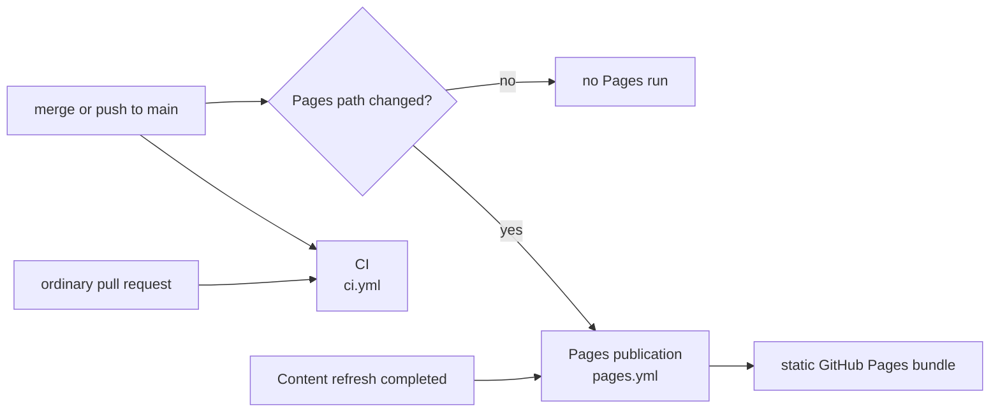
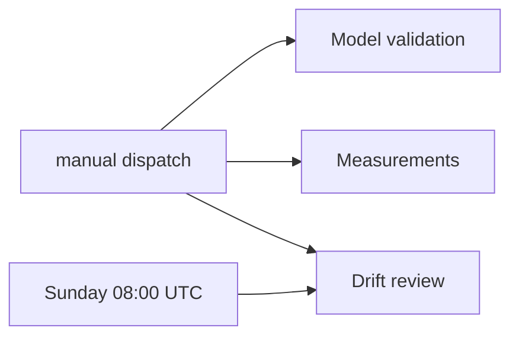

# GitHub Actions Workflows

**Last Updated**: 2026-08-25

The exact workflow display names, files, and trigger classes. All scheduled
times are UTC.

## Trigger reference

| File | Display name | Automatic trigger | Manual dispatch |
| --- | --- | --- | --- |
| `ci.yml` | `CI` | Pull request; push to `main` | yes |
| `digest.yml` | `Content refresh` | `20 2,6,10,14,18 * * *` | yes |
| `pages.yml` | `Pages publication` | Push to `main` when `frontend/**`, `config/idhazh.json`, or `state/**` changes; completed `Content refresh` run | yes |
| `drift.yml` | `Drift review` | Sunday at 08:00 (`0 8 * * 0`) | yes |
| `validate.yml` | `Model validation` | none | yes |
| `measure.yml` | `Measurements` | none | yes |

An ordinary pull request starts CI only. A merge or direct push to `main`
starts CI, and starts Pages publication only when its path filter matches.

## Content refresh

The schedule and manual dispatch use the same job graph. The plan job creates
the work list. The work matrix creates one to four total worker jobs. Scheduled
runs use four. Manual dispatch offers only 1, 2, 3, or 4 and defaults to four.
The plan job rejects any other value before it creates the matrix. The work
strategy also sets `max-parallel: 4`; that limits concurrency but is not the
total-job cap.

Each worker receives its round-robin share of the whole plan. The workflow does
not enforce `config.run.shard_size` or `shard_timeout_minutes`; the work job uses
a 330-minute workflow timeout. A model-fit claim must use the measured worker
population or first wire those config values.

Route uses the worker outputs. Assemble runs even after a worker or route
failure, then commits the digest and state.

The plan job also commits first-sighting and feed-health state before it starts
the workers. This keeps observations from a failed refresh.

### Both commit steps push through a rebase, and the one that can rebuild rebuilds

The plan job and the assemble job each commit, then push in a loop of three
attempts. Both run one script,
[`.github/scripts/commit-and-push.sh`](../../.github/scripts/commit-and-push.sh).
Two copies of the loop were a loop no test could execute.

A rebase refuses to start while a tracked file is modified. Run `32671663130`
died that way: one file was CRLF against a `text eol=lf` attribute, so every
Linux checkout saw it modified before any step ran, and the retry loop threw away
a day that plan, four shards and assemble had all finished.

The work is already in a commit when the loop begins, so anything left in the
working tree is runner noise. The loop prints what is dirty and discards it
before the rebase. Untracked files are left alone: they cannot block a rebase,
and a later step may still want them. `--autostash` was removed - it stashes the
noise and then fails the step when the stash will not reapply, which is the
failure it looks like it prevents.

**There are two ways to lose the push race, and they need different answers.**

The plan job only records what it saw. Its ledgers are append-only and every row
is independent of its neighbours, so two runs that both appended are not in
disagreement and the union of both sides is the answer. Every file under
`state/` carries `merge=union` in `.gitattributes`, so that rebase resolves
itself. A reader of those ledgers already deduplicates.

The assemble job rebuilds what it commits, so it rebuilds. `actions/checkout@v6`
carries no `ref`, so the job takes main's tip at trigger time, and a run takes
164-184 min - the day is always built on a base up to three hours old, and the
push is the first thing to find out. On a rejected push the loop hands the
derived paths back to origin's tip and runs `python -m idhazh assemble` again
against it. That stage already loads the previous day and appends to it, so it
is the conflict resolver; it was being run once against a stale base and then
thrown at `git merge-file`. A text merge of two digests produces a payload no
producer would ever write.

`REFRESH_PATHS` names what the rebuild owns: the day's `digest.json` and
`run.json`, `frontend/public/telemetry/`, and the three ledgers assemble appends
to. It never names the day's directory. The routes artifact unpacks this run's
rendered charts into that same directory and no producer in the assemble job can
make them again, so the two payload files are named one at a time.
`frontend/public/telemetry/` is a full rewrite of `state/item-health/`, which is
why it is regenerated and not unioned: a union of two rewrites is a file with
every row twice.

**Every command in the loop is guarded.** Until 2026-08-25 `git pull --rebase
origin main` was the only unguarded one, so under `bash -e` a conflict ended the
script inside attempt 1: no attempt 2, no failure message, no day, and a checkout
left mid-rebase. A guarded failure now says what it was, leaves no rebase in
progress, and ends on the three-attempt message.

A workflow contract test pins this shape, and executes the script against real
local repositories - including a scripted origin that gains both another run of
the same day and an unrelated pull-request merge while the job works. Measured
2026-08-25, git 2.55.0, bash 5.3.15. CI never runs `digest.yml`, so a change to
the loop still needs a dispatched run to verify end to end.

Model validation and measurements never run on a pull request, push, or
schedule. A person dispatches them. Drift review is a separate weekly or manual
workflow; it does not run inside Content refresh.

Each Measurements dispatch selects exactly one target:

| Target | What runs | Inputs used by that target |
| --- | --- | --- |
| `llm` | GGUF download timing and `llama-bench` throughput | `models`, `threads` |
| `image` | CPU image-model candidates | none |
| `corpus` | Live article-length sampling | `corpus_links` |
| `runtime` | Fixed-shard llama-server candidate sweep | `runtime_candidate`; `runtime_threads` for `threads`; `runtime_threads_batch` for `threads_batch` |
| `batched` | `llama-batched-bench` aggregate decode at parallel levels 1, 2 and 4, three repeats on one host | none; the bench parameters are pinned in the workflow and the context and threading knobs come from `config/idhazh.json` |

The form keeps all target-specific inputs visible. A job reads only the inputs
for its selected target. The default target is `llm`; the default runtime
candidate is `baseline`.

`Model validation` currently hardcodes Qwen3-8B as incumbent, downloads and
caches incumbent plus challenger together, and refetches each planned URL for
each model. It is an exploratory dispatch, not a controlled adoption gate.
[Evaluate and Adopt a New Summarizer Model](../how-to/evaluate-new-summarizer-model.md)
owns the repair and acceptance requirements.

Pages publication builds only committed data and uploads a static bundle. It
does not run the producer or a model, and the published site has no runtime
backend.

## Display names and files

A workflow display name is the label shown in the Actions UI. Its filename is
the stable automation interface for repository paths, API calls, and CLI
dispatch. Keep the six filenames stable when a UI label changes.

GitHub's `workflow_run.workflows` selector is the exception: it matches a
display name. `pages.yml` therefore names `Content refresh` in that selector.
The workflow contract test pins both sides so a label change cannot silently
stop publication.

## Action versions

Every workflow calls the same nine actions, each pinned to one approved major.
GitHub retired the Node 20 runtime on its runners, so an action major that still
declares `using: node20` is force-run on Node 24 today and stops running later.

| Action | Major | Runtime |
| --- | --- | --- |
| `actions/cache` | `v6` | `node24` |
| `actions/checkout` | `v6` | `node24` |
| `actions/configure-pages` | `v6` | `node24` |
| `actions/deploy-pages` | `v5` | `node24` |
| `actions/download-artifact` | `v8` | `node24` |
| `actions/setup-node` | `v7` | `node24` |
| `actions/setup-python` | `v7` | `node24` |
| `actions/upload-artifact` | `v7` | `node24` |
| `actions/upload-pages-artifact` | `v5` | composite, pins a `node24` `upload-artifact` |

Each runtime above was read from that major's own `action.yml` on 2026-08-24.
The workflow contract test asserts the table: a new action, or a call site left
on an old major, fails CI.

`setup-node` still selects Node 22 for the frontend commands. That is the
application runtime and is unrelated to the runtime an action itself declares.

## The inference runtime is pinned, and the cache key says which build

`digest.yml`, `validate.yml` and `measure.yml` run one llama.cpp build. Each
declares the same three variables, and each checks the archive against its
digest before it unpacks anything.

| Variable | Value |
| --- | --- |
| `LLAMA_CPP_BUILD` | `b10598` |
| `LLAMA_CPP_ASSET` | `llama-b10598-bin-ubuntu-x64.tar.gz` |
| `LLAMA_CPP_SHA256` | `d77a09db4165f8850b513629ed0ffeaab7851bb03e7cc3870b74e721f894694c` |

The SHA-256 is the release API's own `digest` for that asset. It was confirmed
on 2026-08-25 by downloading the 16,377,727-byte archive and hashing it.

The weights cache key names the build: `llm-<weights>-<build>-v3` in the two
`digest.yml` jobs, `validate-<challenger>-<build>-v3` in `validate.yml`. The
suffix moved from `v2` in the same change, so the first run after it landed
refetched once rather than restoring the older entry.

**The key matters more than the pin.** The fetch step runs only on a cache
miss. Keyed on the weights alone, the cache froze one binary and then served a
different one the first time the entry was evicted - the instability of
following the newest release with none of its freshness, and no record on the
run of which build served the day. A throughput number measured in `measure.yml`
now describes the binary that writes the digest (Rule #10).

The run manifest is not fixed by this. It still records `runtime_build` as the
fixed string `llama-server-local`, so the manifest does not yet name the build.

A workflow contract test pins the three variables, the digest check on every
fetch path, and the build inside every runtime cache key.

## Repository settings these workflows depend on

Read from the repository API on 2026-08-25.

| Setting | Value | Why |
| --- | --- | --- |
| `allow_squash_merge` | true | The default. One entry on `main` per PR. |
| `allow_merge_commit` | true | For a PR carrying several independent intents, so each stays revertible. |
| `allow_rebase_merge` | true | Same reason. History looks squash-only, but rebase is available. |
| `allow_update_branch` | true | A PR can be brought up to date from `main` without a local push. |
| `delete_branch_on_merge` | true | The remote branch goes away on merge. |
| `allow_auto_merge` | **false** | Deliberate. See below. |
| `squash_merge_commit_title` | `PR_TITLE` | The subject is the PR title. GitHub appends the PR number. |
| `squash_merge_commit_message` | `PR_BODY` | The body is the PR body. Branch commit bodies are never concatenated. See below. |
| `merge_commit_title` | `MERGE_MESSAGE` | The merge path, when a PR carries several intents. |
| `merge_commit_message` | `PR_TITLE` | Neither merge-commit setting reads a branch commit body, so that path was never affected. |

**`main` is not a protected branch, and protecting it would break
publication.** `digest.yml` and `validate.yml` push their state commits straight
to `main` - the eval ledger, the seen-URL store, feed health, the digest
payload. A branch-protection rule makes those pushes fail, and a scheduled run
that cannot commit has done its work for nothing. GitHub's built-in auto-merge
requires branch protection, which is why `allow_auto_merge` is off rather than
merely unused. Protecting `main` is possible, but only after the direct pushes
in those two workflows are redesigned or explicitly exempted.

**A squash commit takes its message from the pull request, not from the branch
commits.** `squash_merge_commit_message` was `COMMIT_MESSAGES` until 2026-08-25.
That value concatenates every branch commit body into the landed message, so a
`Co-authored-by` attribution trailer written on a branch commit reaches `main`
by itself. `CLAUDE.md` section 8 forbids that trailer, and PR #71 stayed clean
only because the message was passed by hand at merge time. `PR_BODY` removes the
path instead of relying on the person merging to notice.

The cost is that the pull request body is now the commit body. Write it as a
commit message - plain prose, ASCII, no heading markup - because whatever it
contains lands on `main`. Wrap it at 72 columns. GitHub re-wraps a wider body
and leaves an orphan word on its own line: PR #72 was written at 80 columns and
landed with a longest line of 72, measured 2026-08-25. `main` is unprotected, so
no check can block a bad message; this setting is what makes the good outcome
the default one.

## Platform limits that shape the workflows

The ceilings themselves are stated once, in `CLAUDE.md` Rule #2. What follows is
the behaviour behind them, which is what actually decides a workflow's shape.
Verified 2026-08-20.

- **Actions minutes are free and unmetered**, because this repository is public.
  The widely quoted 2,000 minutes per month is a private-repository figure and
  does not apply. Wall-clock is the constraint, not a monthly balance.
- **A cache entry unread for 7 days is deleted**, and a restore is paid once per
  *job* rather than once per run. That is why `digest.yml` gives a worker a
  shard of several items instead of fanning out one job per item: the weights
  restore is the largest fixed cost, and every extra job pays it again.
- **`GITHUB_TOKEN` allows 1,000 API requests per hour per repository**, shared
  across every job of every concurrently running workflow. A step that polls in
  a loop spends a budget the scheduled pipeline also needs.
- **The Pages deploy itself times out at 10 minutes**, separately from the job
  timeout, and separately from the 1 GB site cap.
- **A job stopped by `timeout-minutes` is *cancelled*, and a cancelled job skips
  every step that carries no condition.** `if: failure()` does not run either -
  only `if: always()` does. So an artifact upload written the ordinary way is
  silently dropped exactly when a long job most needed to hand over what it
  made. Observed 2026-08-25 on `digest.yml`'s `route` job, run `32804437110`:
  the step list records `Route and render` as `cancelled`, `Upload router log`
  (which has `always()`) as `success`, and the `routes` upload as **`skipped`**.
  88 routing decisions and 9 rendered charts existed on that runner and none of
  them left it. **Any upload step that carries a job's only copy of its output
  needs `if: always()`.**

## See also

- [../architecture/overview.md](../architecture/overview.md) - how CI, committed payloads, and the static site fit together.
- [../concepts/pipeline-loop.md](../concepts/pipeline-loop.md) - what each pipeline stage owns.
- [../how-to/run-the-pipeline.md](../how-to/run-the-pipeline.md) - how to run the same stages locally.
- [../architecture/sources/freshness.md](../architecture/sources/freshness.md) - what five runs add to one day.
- [../../CLAUDE.md](../../CLAUDE.md) - Rules #1, #2, #9, and #10.
