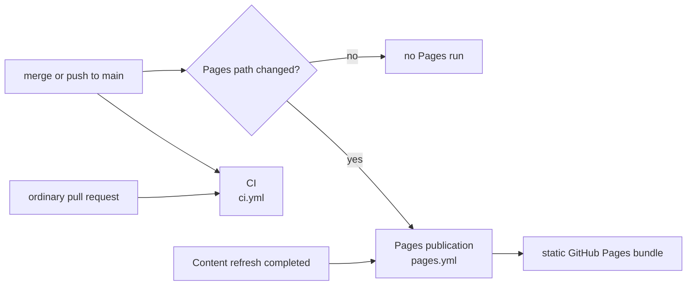
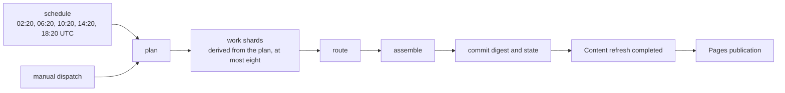
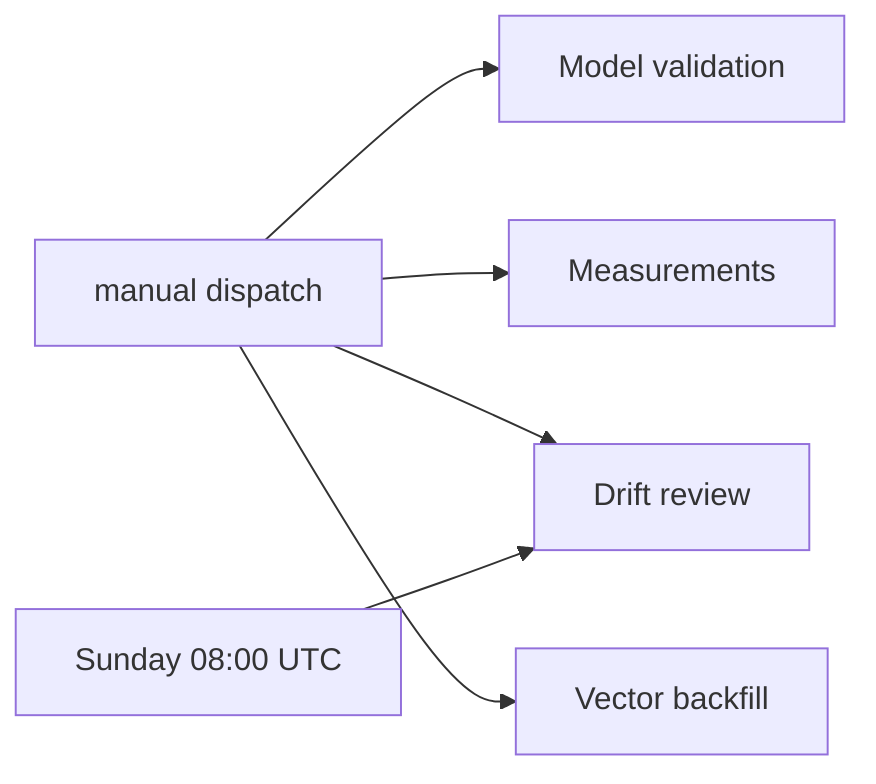

# GitHub Actions Workflows

**Last Updated**: 2026-08-27

The exact workflow display names, files, and trigger classes. All scheduled
times are UTC.

## Trigger reference

| File | Display name | Automatic trigger | Manual dispatch |
| --- | --- | --- | --- |
| `ci.yml` | `CI` | Pull request; push to `main` | yes |
| `digest.yml` | `Content refresh` | `20 2,6,10,14,18 * * *` | yes |
| `pages.yml` | `Pages publication` | Push to `main` when `frontend/**`, `config/idhazh.json`, or `state/**` changes; completed `Content refresh` run | yes |
| `drift.yml` | `Drift review` | Sunday at 08:00 (`0 8 * * 0`) | yes |
| `validate.yml` | `Model validation` | none | yes |
| `measure.yml` | `Measurements` | none | yes |
| `backfill.yml` | `Vector backfill` | none | yes |

An ordinary pull request starts CI only. A merge or direct push to `main`
starts CI, and starts Pages publication only when its path filter matches.

## Content refresh

The schedule and manual dispatch use the same job graph. The plan job creates
the work list, then derives the fan-out from it. The work matrix creates one to
eight total worker jobs. Manual dispatch offers 1 through 8 and defaults to
four; an explicit input always wins over the derivation, and the plan job
rejects any other value before it creates the matrix. The work strategy sets
`max-parallel: 8`, so a dispatch at the ceiling runs every worker at once.

**The ceiling is eight; a run derives at most four for itself.** A scheduled run
passes no inputs, so the count is
`min(ceil(items / run.shard_size), run.max_parallel)`, never below one - and
`run.max_parallel` is four. A day of 16 or more items therefore still runs the
four workers it has always run, and a smaller day runs fewer. Every extra worker
restores the weights again, and that restore is the largest fixed cost in the
pipeline. One dispatch has now run at eight and halved the slowest worker, from
113.1 minutes to 58.8 - but it failed at `assemble` and published nothing, so no
day has yet reached a reader through that fan-out. What moves `run.max_parallel`
to eight is written under
[Eight work shards](measurements.md#eight-work-shards), not this change.

A *derived* count above the ceiling is walked down into it rather than rejected:
by then the feeds have been read, and a config the guard disagrees with must
cost the tail of the fan-out rather than the whole day. Only a dispatched value
is a hard failure.

Rule #2 allows 20 concurrent jobs. Eight workers plus the router is nine, and
`route` waits on `work` rather than racing it, so the ceiling is nowhere near
the platform limit. Every shard restores the same cache key, so more shards buy
more restores and never more cache bytes.

The derivation runs in its own `fanout` step after `Plan the day`, because there
is no planned item count before the plan exists. `jobs.plan.outputs.shards` and
`jobs.plan.outputs.matrix` both read that step; `date` and `faithfulness` still
come from `decide`, and the four model refs come from `models`.

Each worker receives its round-robin share of the whole plan and reads the count
from the job output rather than deriving it again - two answers to that question
would drop or double-work items with no error. The workflow enforces
`config.run.shard_size` and `config.run.max_parallel`. It still does not enforce
`shard_timeout_minutes`; the work job uses a 330-minute workflow timeout, and
`run.safety_ceiling_per_run` is the ceiling sized against it.

Each worker checks its weights before it starts the server. `sha256sum` compares
the file on disk against `models.summarize.sha256` in `config/idhazh.json`, on a
cache hit as well as a miss, because a restored cache entry is the one case where
nobody watched the bytes arrive. The router does the same against
`models.route.sha256`; so do the two measurement jobs that load the summarizer.
The rule is written once, under
[Every download fails loudly, and every weight is checked](#every-download-fails-loudly-and-every-weight-is-checked).
The health check then asserts that
`GET /v1/models` returns the configured alias and that `GET /props` names the
configured filename. A shard that fails either one stops before it summarizes
anything.

Route uses the worker outputs. Assemble runs even after a worker or route
failure, then commits the digest and state.

The plan job also commits first-sighting and feed-health state before it starts
the workers. This keeps observations from a failed refresh.

### Both commit steps push through a rebase, and the one that can rebuild rebuilds

The plan job and the assemble job each commit, then push in a loop of three
attempts. Both run one script,
[`.github/scripts/commit-and-push.sh`](../../.github/scripts/commit-and-push.sh).
Two copies of the loop were a loop no test could execute.

A rebase refuses to start while a tracked file is modified. Run `32671663130`
died that way: one file was CRLF against a `text eol=lf` attribute, so every
Linux checkout saw it modified before any step ran, and the retry loop threw away
a day that plan, four shards and assemble had all finished.

The work is already in a commit when the loop begins, so anything left in the
working tree is runner noise. The loop prints what is dirty and discards it
before the rebase. Untracked files are left alone: they cannot block a rebase,
and a later step may still want them. `--autostash` was removed - it stashes the
noise and then fails the step when the stash will not reapply, which is the
failure it looks like it prevents.

**There are two ways to lose the push race, and they need different answers.**

The plan job only records what it saw. Its ledgers are append-only and every row
is independent of its neighbours, so two runs that both appended are not in
disagreement and the union of both sides is the answer. Every file under
`state/` carries `merge=union` in `.gitattributes`, so that rebase resolves
itself. A reader of those ledgers already deduplicates.

The assemble job rebuilds what it commits, so it rebuilds. `actions/checkout@v6`
carries no `ref`, so the job takes main's tip at trigger time, and a run takes
164-184 min - the day is always built on a base up to three hours old, and the
push is the first thing to find out. On a rejected push the loop hands the
derived paths back to origin's tip and runs `python -m idhazh assemble` again
against it. That stage already loads the previous day and appends to it, so it
is the conflict resolver; it was being run once against a stale base and then
thrown at `git merge-file`. A text merge of two digests produces a payload no
producer would ever write.

`REFRESH_PATHS` names what the rebuild owns: the day's `digest.json` and
`run.json`, `frontend/public/telemetry/`, and the three ledgers assemble appends
to. It never names the day's directory. The routes artifact unpacks this run's
rendered charts into that same directory and no producer in the assemble job can
make them again, so the two payload files are named one at a time.
`frontend/public/telemetry/` is a full rewrite of `state/item-health/`, which is
why it is regenerated and not unioned: a union of two rewrites is a file with
every row twice.

**The charts in that directory are the other way to lose the day, and they get
their own answer.** A chart is filed as `<vertical>-<NN>.svg`, numbered from the
day's directory, and two runs of one day overlap by hours - so both read the same
highest number and both write `energy-03.svg` for different items. Run
`32869125768` finished eight workers and a router and then died at this step on
`CONFLICT (add/add)` over four such paths, because git cannot rebase two adds of
one path. `REFRESH_PATHS` cannot help: hand-back would delete this run's charts
while the rebuilt `digest.json` still names them.

`RENUMBER_COMMAND` is the answer. Before each rebase attempt the loop lists the
asset paths the tip already publishes - `git ls-tree -r --name-only FETCH_HEAD`
over the same staged paths - and pipes them to that command. Anything local
standing on one of those paths moves to the next free number for its vertical,
and the route payload naming it moves with it, so the rebuild that follows writes
a day whose every asset path is really in the tree. The tip's file never moves: it
is published, and a reader may already hold that address. `RENUMBER_COMMAND`
without `REGENERATE_COMMAND` is rejected at startup, because only a job that
rebuilds can commit the moves. Why it is a rename and not a merge side is in
[`../architecture/publishing/visuals.md`](../architecture/publishing/visuals.md).

**Every command in the loop is guarded.** Until 2026-08-25 `git pull --rebase
origin main` was the only unguarded one, so under `bash -e` a conflict ended the
script inside attempt 1: no attempt 2, no failure message, no day, and a checkout
left mid-rebase. A guarded failure now says what it was, leaves no rebase in
progress, and ends on the three-attempt message.

A workflow contract test pins this shape, and executes the script against real
local repositories - including a scripted origin that gains both another run of
the same day and an unrelated pull-request merge while the job works, and one
where both sides rendered a chart onto the same path. Measured 2026-08-25, git
2.55.0, bash 5.3.15. CI never runs `digest.yml`, so a change to the loop still
needs a dispatched run to verify end to end.

Model validation and measurements never run on a pull request, push, or
schedule. A person dispatches them. Drift review is a separate weekly or manual
workflow; it does not run inside Content refresh. Vector backfill is dispatched
too, and the reason it is never scheduled is in
[Vector backfill](#vector-backfill).

Each Measurements dispatch selects exactly one target:

| Target | What runs | Inputs used by that target |
| --- | --- | --- |
| `llm` | GGUF download timing and `llama-bench` throughput | `models`, `threads` |
| `image` | CPU image-model candidates | none |
| `corpus` | Live article-length sampling | `corpus_links` |
| `runtime` | Fixed-shard llama-server candidate sweep | `runtime_candidate`; `runtime_threads` for `threads`; `runtime_threads_batch` for `threads_batch` |
| `batched` | `llama-batched-bench` aggregate decode at parallel levels 1, 2 and 4, three repeats on one host | none; the bench parameters are pinned in the workflow and the context and threading knobs come from `config/idhazh.json` |

The form keeps all target-specific inputs visible. A job reads only the inputs
for its selected target. The default target is `llm`; the default runtime
candidate is `baseline`.

`Model validation` currently hardcodes Qwen3-8B as incumbent, downloads and
caches incumbent plus challenger together, and refetches each planned URL for
each model. It is an exploratory dispatch, not a controlled adoption gate.
[Evaluate and Adopt a New Summarizer Model](../how-to/evaluate-new-summarizer-model.md)
owns the repair and acceptance requirements.

Pages publication builds only committed data and uploads a static bundle. It
does not run the producer or a model, and the published site has no runtime
backend.

## Vector backfill

`python -m idhazh backfill-vectors` re-encodes every closed committed day whose
vectors are not exactly the set its items earned. The workflow runs it, prints
the resulting coverage, builds the site, and commits only when the `commit`
input is on - so the first dispatch reports and the second one publishes.

Three things about it are decisions rather than details.

**It excludes the current UTC day.** A day payload is one JSON file with no
union merge, and the scheduled pipeline appends to the live day several times an
hour. Two producers writing that file do not interleave: one wins whole and the
other one's run is gone.

**It re-encodes a wrong day whole rather than topping it up.** Measured
2026-08-26 over the 439 vectors the five closed days carried: a re-encode
reproduces them at a median cosine of 0.9936 and moves the top-10 neighbour list
of 413 of them. The same measurement against the day CI had written hours
earlier returns a median cosine of 1.000000. Every closed day predates
`fix(embed): make a vector a function of its own text, not of its batch`, so its
vectors carry an arithmetic the browser's query encoder no longer uses. Topping
such a day up would leave one block holding two arithmetics for a single query
to rank against.

**It builds the site before it commits.** The vectors ride inside the day
payloads, and `/archive/` inlines every committed day, so this is the one job
that can push that page past the ceiling in `config/idhazh.json`. Proving the
site still fits before the commit is the difference between a dispatch that does
nothing and a dispatch that breaks `main` (Rule #2).

## Display names and files

A workflow display name is the label shown in the Actions UI. Its filename is
the stable automation interface for repository paths, API calls, and CLI
dispatch. Keep the seven filenames stable when a UI label changes.

GitHub's `workflow_run.workflows` selector is the exception: it matches a
display name. `pages.yml` therefore names `Content refresh` in that selector.
The workflow contract test pins both sides so a label change cannot silently
stop publication.

## Action versions

Every workflow calls the same nine actions, each pinned to one approved major.
GitHub retired the Node 20 runtime on its runners, so an action major that still
declares `using: node20` is force-run on Node 24 today and stops running later.

| Action | Major | Runtime |
| --- | --- | --- |
| `actions/cache` | `v6` | `node24` |
| `actions/checkout` | `v6` | `node24` |
| `actions/configure-pages` | `v6` | `node24` |
| `actions/deploy-pages` | `v5` | `node24` |
| `actions/download-artifact` | `v8` | `node24` |
| `actions/setup-node` | `v7` | `node24` |
| `actions/setup-python` | `v7` | `node24` |
| `actions/upload-artifact` | `v7` | `node24` |
| `actions/upload-pages-artifact` | `v5` | composite, pins a `node24` `upload-artifact` |

Each runtime above was read from that major's own `action.yml` on 2026-08-24.
The workflow contract test asserts the table: a new action, or a call site left
on an old major, fails CI.

`setup-node` still selects Node 22 for the frontend commands. That is the
application runtime and is unrelated to the runtime an action itself declares.

## The inference runtime is pinned, and the cache key says which build

`digest.yml`, `validate.yml` and `measure.yml` run one llama.cpp build. Each
declares the same three variables, and each checks the archive against its
digest before it unpacks anything.

| Variable | Value |
| --- | --- |
| `LLAMA_CPP_BUILD` | `b10598` |
| `LLAMA_CPP_ASSET` | `llama-b10598-bin-ubuntu-x64.tar.gz` |
| `LLAMA_CPP_SHA256` | `d77a09db4165f8850b513629ed0ffeaab7851bb03e7cc3870b74e721f894694c` |

The SHA-256 is the release API's own `digest` for that asset. It was confirmed
on 2026-08-25 by downloading the 16,377,727-byte archive and hashing it.

The weights cache key names the build: `llm-<weights>-<build>-v4` in the two
`digest.yml` jobs, `validate-<challenger>-<build>-v3` in `validate.yml`. The
`digest.yml` suffix moved to `v4` when the weights half stopped coming from a
workflow variable, so the first run after that refetched once rather than
restoring an entry nobody could attribute. `v3` was the same move for the build.

**The key matters more than the pin.** The fetch step runs only on a cache
miss. Keyed on the weights alone, the cache froze one binary and then served a
different one the first time the entry was evicted - the instability of
following the newest release with none of its freshness, and no record on the
run of which build served the day. A throughput number measured in `measure.yml`
now describes the binary that writes the digest (Rule #10).

The run manifest is not fixed by this. It still records `runtime_build` as the
fixed string `llama-server-local`, so the manifest does not yet name the build.

A workflow contract test pins the three variables, the digest check on every
fetch path, and the build inside every runtime cache key.

## Every download fails loudly, and every weight is checked

Every download in every workflow is spelled `curl -fsSL --retry 3
--retry-all-errors`, and the release lookups that find the llama.cpp archive are
spelled `curl -fsS`. `-f` is the letter that matters. Without it curl treats a
403 or a 502 as a successful transfer: it writes the HTTP error body into the
output file and exits 0. Nothing downstream looks at the file until a server
tries to open it.

In the daily run that is worse than a failed step, because `backend/models` is a
cache path. A rate-limited minute writes a page of error text where the weights
should be, `actions/cache` saves it under the pinned key, and every later run
restores that same page until the entry is evicted. The retries are the cheap
half of the fix; `-f` is the half that stops the bad file being written at all.

The digest check is what catches the other failure, a transfer that dies
mid-body. That is a 200 response, so curl has nothing to retry and the file on
disk is simply short. Every job that downloads weights therefore runs
`sha256sum --check` against a recorded digest, after the fetch and before
anything reads the file. **No check carries an `if:`.** The fetch step is
skipped on a cache hit, and a restored entry is the one case where nobody
watched the bytes arrive - so it is the case that most needs the check.

| Workflow and job | Weights | Digest read from |
| --- | --- | --- |
| `digest.yml` / `work` | the summarizer | `models.summarize.sha256` |
| `digest.yml` / `route` | the router | `models.route.sha256` |
| `measure.yml` / `runtime` | the summarizer | `models.summarize.sha256` |
| `measure.yml` / `batched` | the summarizer | `models.summarize.sha256` |
| `validate.yml` / `qualify` | the candidate | the `plan` job's `candidate_sha256` |

The four config digests are the same field, `ModelRef.sha256` in
`config/idhazh.json`. `validate.yml` is the one exception, and deliberately: an
operator can point it at a model config does not name, so its `plan` job decides
the digest once - from the dispatch input, or from config when there is none -
and republishes it as a job output the whole run reads.

The workflow contract test that holds this open is closed-world. It finds the
downloads by reading every workflow file rather than by consulting a list, and
fails when the set it finds differs from the set it pins. A tenth workflow that
downloads weights fails the test until it carries the same pair of steps.

## One place writes a production model ref, and it is config

`config/idhazh.json` holds `models.summarize` and `models.route`. None of the
three workflows that load weights - `digest.yml`, `measure.yml`, `validate.yml` -
holds a model repository, a weights filename or a publisher name of its own.
Grepping all three for a `.gguf` name, a Hugging Face repository or a branch in a
download path returns nothing, and a workflow contract test asserts exactly that.

Each one reads config in a `models` step and publishes job outputs. `digest.yml`
does it inside `plan`, which `work` and `route` already need; `measure.yml` has
a small `models` job of its own that every target depends on; `validate.yml`
resolves the candidate once inside `plan`. **The `needs` context resolves before
a job's first step while `steps` does not**, which is the whole reason the refs
travel as job outputs: it is what lets a cache key and a job-scoped `env` name
the weights they hold. A step cannot.

That second copy was the defect. The alias came from config while the repository
and the filename came from workflow `env`, so editing one served the old bytes
under the new alias and filed every eval row under a model that never ran
(Rule #10). Changing the model is now one edit to config, and the cache key moves
with it.

### A dispatch input is not a copy

`measure.yml` exists to benchmark a model config does not name, and `validate.yml`
exists to qualify one. Both keep their inputs, and an input always wins. What was
removed is the literal DEFAULT behind it. A dispatch that fills nothing in now
measures, or re-qualifies, the model config names.

The values for a model under adoption live in
[measurements.md](measurements.md), where a target is declared - not in a
workflow file, where nothing would ever check them against the run.

### Every download names a commit

Each ref carries a `revision`, and every fetch path uses it. A branch hands back
whatever was uploaded last, so the bytes can move under a config that still
records the old `sha256`; the run would then fail a check nobody had changed, or
in `measure.yml`, which had no checksum step, quietly measure a different model.

The revision is in the weights cache key for the same reason the build is. The
fetch step runs only on a cache miss, so a key that cannot tell two uploads of
one filename apart would hold a repinned config on a hit whose bytes fail the
checksum on every run until the entry expires.

The `models` step asserts each value is one bare word before it writes it. Every
ref is substituted straight into a shell command downstream, and that step is the
only point between config and those commands where a value carrying a space, a
quote or a newline can be stopped.

`measure.yml` and `validate.yml` keep their own model variables on purpose.
Neither keys a cache on a production model ref, and measuring or validating a
candidate means naming a model that is deliberately not in config yet.

## One function builds the server command, and one variable says the port

`digest.yml`, `validate.yml` and `measure.yml` each stand up a `llama-server`,
and none of them writes a flag. Every one imports `server_argv` from
`backend/idhazh/llm/server.py`, which renders the whole command from
`config/idhazh.json`. A contract test holds that from both sides: exactly one
Python file spells those flags, and no command in any workflow spells one.

There used to be a second renderer, `backend/utilities/llama_server_argv.py`,
and it existed for exactly one reason. Both `digest.yml` inference jobs ran
`Start the model` before `Install`, so `pip install -e .` had not run and the
package was not importable yet. `Install` now runs one step earlier, straight
after `setup-python`, and the copy is gone. Moving a step within a job is the
same work in a different position, so no wall-clock claim is made for it
(Rule #10).

While the copy existed the two halves drifted, and the arm that drifted is the
one nobody diffed. `validate.yml` never needed the utility - its `Install`
already ran before its server started - so for two changes it qualified
candidates on a server the daily run does not run.

**The port is one `env: LLAMA_PORT` per workflow.** It was nine literals in
`digest.yml` and three in `validate.yml`, and all of them had to move together
or the job failed in a way that reads as an unreachable model (Rule #6).
`server_argv` takes it as an argument; every `/health`, `/v1/models`, `/props`
and `/metrics` probe reads it; and `idhazh.llm.server` reads the same variable
for the address the summarize stage posts to, so the server and its client
cannot end up on different ports. It is not a config field. It decides nothing
about the words, so `idhazh.fingerprint` has nothing to classify and
`pipeline_fingerprint` does not move.

## Repository settings these workflows depend on

Read from the repository API on 2026-08-25.

| Setting | Value | Why |
| --- | --- | --- |
| `allow_squash_merge` | true | The default. One entry on `main` per PR. |
| `allow_merge_commit` | true | For a PR carrying several independent intents, so each stays revertible. |
| `allow_rebase_merge` | true | Same reason. History looks squash-only, but rebase is available. |
| `allow_update_branch` | true | A PR can be brought up to date from `main` without a local push. |
| `delete_branch_on_merge` | true | The remote branch goes away on merge. |
| `allow_auto_merge` | **false** | Deliberate. See below. |
| `squash_merge_commit_title` | `PR_TITLE` | The subject is the PR title. GitHub appends the PR number. |
| `squash_merge_commit_message` | `PR_BODY` | The body is the PR body. Branch commit bodies are never concatenated. See below. |
| `merge_commit_title` | `MERGE_MESSAGE` | The merge path, when a PR carries several intents. |
| `merge_commit_message` | `PR_TITLE` | Neither merge-commit setting reads a branch commit body, so that path was never affected. |

**`main` is not a protected branch, and protecting it would break
publication.** `digest.yml` and `validate.yml` push their state commits straight
to `main` - the eval ledger, the seen-URL store, feed health, the digest
payload. A branch-protection rule makes those pushes fail, and a scheduled run
that cannot commit has done its work for nothing. GitHub's built-in auto-merge
requires branch protection, which is why `allow_auto_merge` is off rather than
merely unused. Protecting `main` is possible, but only after the direct pushes
in those two workflows are redesigned or explicitly exempted.

**A squash commit takes its message from the pull request, not from the branch
commits.** `squash_merge_commit_message` was `COMMIT_MESSAGES` until 2026-08-25.
That value concatenates every branch commit body into the landed message, so a
`Co-authored-by` attribution trailer written on a branch commit reaches `main`
by itself. `CLAUDE.md` section 8 forbids that trailer, and PR #71 stayed clean
only because the message was passed by hand at merge time. `PR_BODY` removes the
path instead of relying on the person merging to notice.

The cost is that the pull request body is now the commit body. Write it as a
commit message - plain prose, ASCII, no heading markup - because whatever it
contains lands on `main`. Wrap it at 72 columns. GitHub re-wraps a wider body
and leaves an orphan word on its own line: PR #72 was written at 80 columns and
landed with a longest line of 72, measured 2026-08-25. `main` is unprotected, so
no check can block a bad message; this setting is what makes the good outcome
the default one.

## Platform limits that shape the workflows

The ceilings themselves are stated once, in `CLAUDE.md` Rule #2. What follows is
the behaviour behind them, which is what actually decides a workflow's shape.
Verified 2026-08-20.

- **Actions minutes are free and unmetered**, because this repository is public.
  The widely quoted 2,000 minutes per month is a private-repository figure and
  does not apply. Wall-clock is the constraint, not a monthly balance.
- **A cache entry unread for 7 days is deleted**, and a restore is paid once per
  *job* rather than once per run. That is why `digest.yml` gives a worker a
  shard of several items instead of fanning out one job per item: the weights
  restore is the largest fixed cost, and every extra job pays it again.
- **`GITHUB_TOKEN` allows 1,000 API requests per hour per repository**, shared
  across every job of every concurrently running workflow. A step that polls in
  a loop spends a budget the scheduled pipeline also needs.
- **The Pages deploy itself times out at 10 minutes**, separately from the job
  timeout, and separately from the 1 GB site cap.
- **A job stopped by `timeout-minutes` is *cancelled*, and a cancelled job skips
  every step that carries no condition.** `if: failure()` does not run either -
  only `if: always()` does. So an artifact upload written the ordinary way is
  silently dropped exactly when a long job most needed to hand over what it
  made. Observed 2026-08-25 on `digest.yml`'s `route` job, run `32804437110`:
  the step list records `Route and render` as `cancelled`, `Upload router log`
  (which has `always()`) as `success`, and the `routes` upload as **`skipped`**.
  88 routing decisions and 9 rendered charts existed on that runner and none of
  them left it. **Any upload step that carries a job's only copy of its output
  needs `if: always()`.**

## See also

- [../architecture/overview.md](../architecture/overview.md) - how CI, committed payloads, and the static site fit together.
- [../concepts/pipeline-loop.md](../concepts/pipeline-loop.md) - what each pipeline stage owns.
- [../how-to/run-the-pipeline.md](../how-to/run-the-pipeline.md) - how to run the same stages locally.
- [../architecture/sources/freshness.md](../architecture/sources/freshness.md) - what five runs add to one day.
- [../../CLAUDE.md](../../CLAUDE.md) - Rules #1, #2, #9, and #10.
