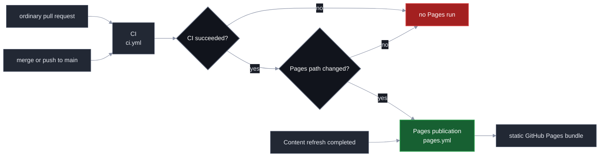
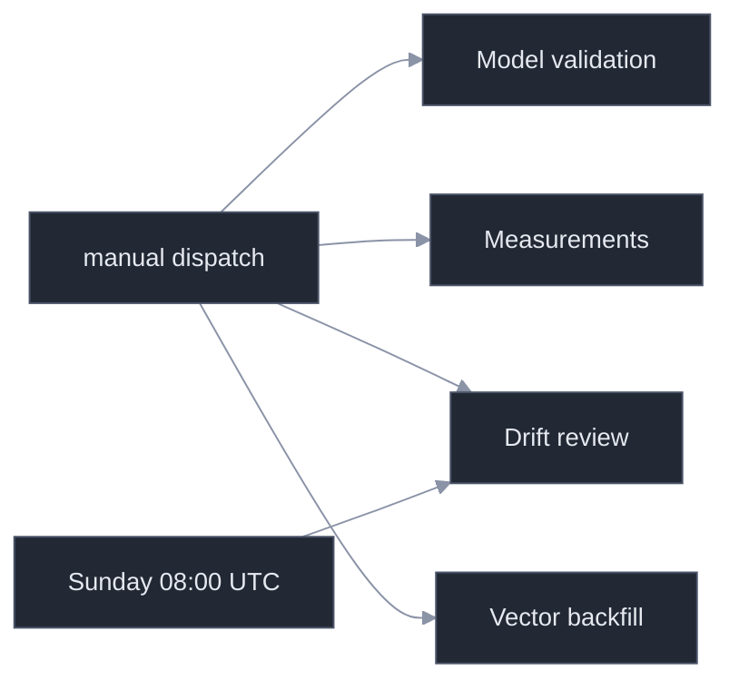
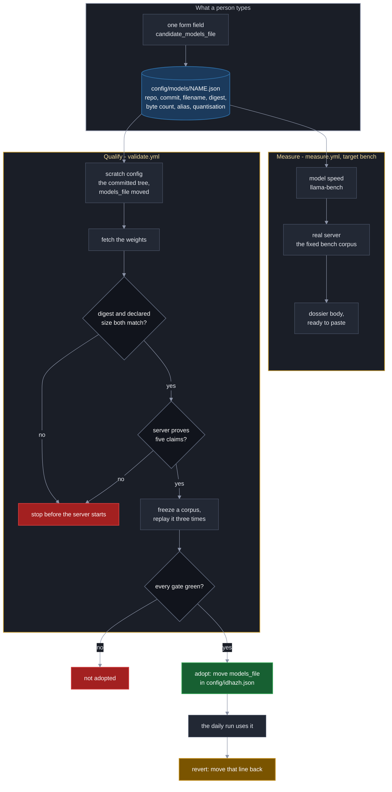

# GitHub Actions Workflows

**Last Updated**: 2026-09-23
The exact workflow display names, files, and trigger classes. All scheduled
times are UTC.

**Three workflows push to `main`.** `digest.yml` does it on every run.
`prune.yml` does it on the first wake `finetune.prune_every_days` allows, and it
is the one force-push this repository permits. `measure.yml` does it only from
the `runtime` job, and only the machine that job drew - one row under
`state/pipeline-tests/host-fingerprint/`. Nothing else in `measure.yml` writes
anything back; every other job uploads an artifact and the runner takes the rest
with it. The permission is raised on that one job rather than at workflow level,
so the others still cannot.

## Trigger reference

| File | Display name | Automatic trigger | Manual dispatch |
| --- | --- | --- | --- |
| `ci.yml` | `CI` | Pull request; push to `main` | yes |
| `digest.yml` | `Content refresh` | `20 2 * * *`, `20 6 * * *`, `20 10 * * *`, `20 14 * * *`, `20 18 * * *` | yes |
| `pages.yml` | `Pages publication` | Completed `CI` run that succeeded; completed `Content refresh` run | yes |
| `drift.yml` | `Drift review` | Sunday at 08:00 (`0 8 * * 0`) | yes |
| `validate.yml` | `Model validation` | none | yes |
| `measure.yml` | `Measurements` | none | yes |
| `prune.yml` | `Corpus prune` | `37 23 * * *`; squashes on the first wake `finetune.prune_every_days` allows | yes |
| `backfill.yml` | `Vector backfill` | none | yes |
| `idhazh-pipeline-tests.yaml` | `Pipeline tests` | none | yes |

An ordinary pull request starts CI only. A merge or direct push to `main` starts
CI, and **publication follows CI's verdict rather than the push**: a push reaches
both workflows at the same moment, so publishing on the push would publish
before anything had judged the commit. When CI succeeds, `pages.yml` publishes
the exact commit CI verified - not the branch tip, which may have moved - and
only when that commit touches `frontend/**`, `config/idhazh.json` or `state/**`.

The daily path is not gated on a conclusion, and that is deliberate. The job
that writes a day runs `validate-days` before its own commit, so the day is
verified by its producer; a sibling job failing afterwards does not unvalidate
it, and refusing to publish would leave a good day unread for up to four hours.
That path publishes the branch tip rather than the triggering commit, because a
run's `head_sha` is the commit it started from and the day it wants published is
the commit it made afterwards.

## The one force-push wakes when no digest can be running

`prune.yml` ends in `git push --force origin main`, the only force-push this
repository allows ([../../CLAUDE.md](../../CLAUDE.md) section 8). A digest job
pushes the day it just built, so a force-push landing while one is in flight can
discard it.

**The hour is derived from the digest cron list rather than chosen.** A scheduled
run starts 40 to 70 minutes after its cron minute and then takes 164 to 184
minutes end to end (`ubuntu-latest`, 2026-08-23/24, n=3 -
[../architecture/sources/freshness.md](../architecture/sources/freshness.md)), so
each `Content refresh` line at H:20 occupies H+1:00 to H+4:34:

| Cron line | Occupied, UTC |
| :--- | :--- |
| `20 2 * * *` | 03:00 - 06:34 |
| `20 6 * * *` | 07:00 - 10:34 |
| `20 10 * * *` | 11:00 - 14:34 |
| `20 14 * * *` | 15:00 - 18:34 |
| `20 18 * * *` | 19:00 - 22:34 |

That leaves four gaps of 26 minutes and one of 266, from 22:34 to 03:00. Prune
needs a 60-minute window - 40 minutes of queue drift through its own 30-minute
`timeout-minutes` - so no short gap can hold it and the long one can. Centred
there it has 103 minutes of margin on each side, which is `37 23 * * *`: the job
starts between 00:17 and 00:47 and has pushed by 01:17. The old `20 4 * * *` sat
inside the 02:20 run's span, so a prune that did fire force-pushed inside the
digest window nearly every day.

**This lowers the odds; it does not close them.** GitHub queues scheduled runs by
load, so a run later than the recorded normal still reaches 23:37 - the section
below is why that cannot be relied on either way. Closing it needs a lock across
two workflows, which GitHub does not offer. `concurrency` governs one group, and
a group shared with `Content refresh` would let a waiting prune be deleted,
which is a prune that never bounds the repository - and `Content refresh` has no
group to share. What keeps a clash from costing another run its commits is the
tip check the prune's push makes, not this hour.

## The schedule asks for five runs a day and gets fewer

**This is the single most important thing on this page, because it is invisible
in the run list.** GitHub places a scheduled workflow on a best-effort queue. On
a free public repository it delays runs under load, and it **drops the slots it
cannot place** - without creating a run, without a failure, and without a
notification. A thin digest day is a run that did not happen rather than a run
that broke, and the run list cannot tell you which. Measured 2026-08-29 over the
three preceding days, eight of thirteen slots produced no run at all and nothing
failed.

**A slot delayed past midnight publishes to the wrong day.** The `plan` job dates
a run with `date -u +%F`, so a slot that starts after 00:00 files its items under
the following day. The rule "a run belongs to the UTC day it ran" is defensible
and is not being changed here; what was missing is that anybody could see it
happen.

### What was done about it

Two things, and neither of them makes GitHub reliable, because nothing in this
repository can.

**The cron is five one-slot lines rather than one five-hour line.** The schedule
is identical. `github.event.schedule` hands a run the cron line that fired, and
with a single `20 2,6,10,14,18 * * *` line that string is the whole expression -
a run cannot tell which of the five slots it is, so it cannot say how late it
started. Five lines make the slot nameable.

**The `plan` job reports its own lateness.** It prints the slot and the delay on
every scheduled run, and raises a workflow warning past 120 minutes. That
threshold is **derived, not measured**: a scheduled run here normally starts 40
to 70 minutes after its cron minute, so it is roughly twice the recorded normal.
Nothing reads it to make a decision - it annotates the run summary and stops
there.

**What was not done.** No retry, no self-dispatch, no extra cron slots to absorb
the losses. A workflow that re-fires itself on a schedule it cannot observe
cannot tell a dropped slot from one that ran, so it would fire against its own
successes with nothing bounding how many runs it creates - and since runs of
this workflow may now overlap
([committing.md](../architecture/publishing/committing.md#two-runs-of-one-day-work-at-the-same-time-and-nothing-queues-them)),
nothing outside it would hold that number down either. The honest position is
that the platform decides how many runs happen, and this page is where that is
written down.

## Content refresh

The schedule and manual dispatch use the same job graph. The plan job creates
the work list, then derives the fan-out from it. The work matrix creates one to
eight total worker jobs. Manual dispatch offers 1 through 8 and defaults to
four; an explicit input always wins over the derivation, and the plan job
rejects any other value before it creates the matrix. The work strategy sets
`max-parallel` to that same derived count, so every worker of a run starts at
once and the fan-out cannot disagree with its own concurrency cap.

**The ceiling is eight; a run derives at most four for itself.** A scheduled run
passes no inputs, so the count is
`min(ceil(items / run.shard_size), run.max_parallel)`, never below one - and
`run.max_parallel` is four. A day of 16 or more items therefore still runs the
four workers it has always run, and a smaller day runs fewer. Every extra worker
restores the weights again, and that restore is the largest fixed cost in the
pipeline. What moves `run.max_parallel` to eight is written under
[Eight work shards](../archive/measurements-2026-08.md#eight-work-shards), not this change.

A *derived* count above the ceiling is walked down into it rather than rejected:
by then the feeds have been read, and a config the guard disagrees with must
cost the tail of the fan-out rather than the whole day. Only a dispatched value
is a hard failure.

**A dispatch fired during a run starts straight away, and two runs of one day
work side by side.** This workflow declares no `concurrency` group. Every
committed path a job writes carries that run's own identity, so two runs name
two files rather than one and the read settles them
([committing.md](../architecture/publishing/committing.md#two-runs-of-one-day-work-at-the-same-time-and-nothing-queues-them)).
Until 2026-09-23 the workflow set `concurrency: group: digest` with
`cancel-in-progress: false`, and that queue cost more than it bought: GitHub
keeps only **one** pending run per group and a newer pending run cancels the
older, so a dispatch parked behind an in-flight run vanished the moment a cron
created the next one, and the operator saw a cancelled run rather than an error.
Read `gh run list --workflow digest.yml` for what actually exists rather than
working from the cron, because the schedule is best-effort
([above](#the-schedule-asks-for-five-runs-a-day-and-gets-fewer)).

Guardrail #2 allows 20 concurrent jobs. Eight workers is eight, so one run is
nowhere near the platform limit and two overlapping runs are sixteen. Every
shard restores the same cache key, so more shards buy more restores and never
more cache bytes.

The derivation runs in its own `fanout` step after `Plan the day`, because there
is no planned item count before the plan exists. `jobs.plan.outputs.shards` and
`jobs.plan.outputs.matrix` both read that step; `date` and `faithfulness` still
come from `decide`, the three model refs come from `models`, and
`shard_timeout_minutes` comes from `bounds`. Everything a job needs before its
first step travels as a job output, because `needs` resolves there and `steps`
does not.

Each worker receives its round-robin share of the whole plan and reads the count
from the job output rather than deriving it again - two answers to that question
would drop or double-work items with no error. The workflow enforces
`config.run.shard_size`, `config.run.max_parallel` and
`config.run.shard_timeout_minutes`: the work job's `timeout-minutes` is that
value and nothing else, so changing the config number changes the bound.
`run.safety_ceiling_per_run` is the item ceiling sized against it.

Each worker checks its weights before it starts the server. `sha256sum` compares
the file on disk against `models.summarizer.sha256` in the active model file, on a
cache hit as well as a miss, because a restored cache entry is the one case where
nobody watched the bytes arrive. So do the two measurement jobs that load the summarizer.
The rule is written once, under
[Every download fails loudly, and every weight is checked](ci-model-runtime.md#every-download-fails-loudly-and-every-weight-is-checked).
The health check then asserts that
`GET /v1/models` returns the configured alias and that `GET /props` names the
configured filename. A shard that fails either one stops before it summarizes
anything.

Assemble runs even after a worker failure, then commits the digest and state. It
does not run after a PLAN failure: the plan is the artifact it downloads by name,
so there is nothing to assemble, and starting it anyway reported a missing
artifact one job away from whatever actually went wrong. The gate is
`!cancelled() && needs.plan.result == 'success'`, and the status function is what
keeps the failed-worker path - a bare condition gets an implicit `success()` over
every job in `needs`, which would hold the day back for one shard that died.

**A run that publishes nothing annotates the run summary.** Running after a
failed worker buys the record of a bad day, and its cost is a stage that can
decide nothing and still exit 0. Without the annotation, a run whose every shard
refused at start-up commits an empty day and leaves the only sentence naming the
cause in a work-job log that expires - so the published archive keeps the symptom
for ever and the cause for ninety days. `stage_assemble` prints
`::error title=The run published nothing::` when a day planned stories and
published none, naming the counts and sending the reader to the work jobs. It
does not exit non-zero: failing there would skip the steps that commit the day,
which is the invisibility this job's condition exists to prevent.

The plan job also commits first-sighting and feed-health state before it starts
the workers. This keeps observations from a failed refresh. Each worker then
commits the item-health and eval rows for the items its own shard settled, for
the same reason: those rows otherwise ride only in that shard's `items-<shard>`
artifact, which expires and is never committed.

A worker commits a third row in the same step: what its model server counted for
the whole shard, read once from `/metrics` at job end and filed into this
shard's own segment under `state/host-fingerprint/`.
The raw body still ships in `runtime-log-<shard>`, which keeps it for two days -
long enough to read a failure, far too short to hold a published rate to
account. The committed row is what lets
`backend/utilities/reconcile_prefill.py` check the item-health ledger's read rate
against a second instrument (Guardrail #10).

The same row carries a fact about the job rather than about its server: how long
the shard took. The `work` job's first step - ahead of the checkout, so the clock
covers the cache restore and the weight load - writes an epoch second to
`$GITHUB_ENV`, and the job-clock step passes it to `python -m idhazh job-clock`.
The rollback rule for the truncation cap reads that clock, and the only other
place it exists is the jobs API, which drops a job record when the run ages out.

**How those commits reach the repository is a page of its own.** Ten jobs of
one run push to one branch, and the rebase loop, the rebuild and the raced-asset
rule are in
[../architecture/publishing/committing.md](../architecture/publishing/committing.md).

Model validation and measurements never run on a pull request, push, or
schedule. A person dispatches them. Drift review is a separate weekly or manual
workflow; it does not run inside Content refresh. Vector backfill is dispatched
too, and the reason it is never scheduled is in
[Vector backfill](#vector-backfill).

## Pages publication

`pages.yml` builds only committed data and uploads a static bundle. It does not
run the producer or a model, and the published site has no runtime backend. When
it runs and which commit it takes are in [Trigger reference](#trigger-reference)
above; this section is what it does once it has decided to publish.

**A newer build supersedes an older one; a deploy in flight always finishes.**
Concurrency is declared on the two jobs rather than on the workflow, because
they want opposite answers. The `build` job groups as `pages-build` with
`cancel-in-progress: true`: it makes a replaceable artifact, publishing is
last-write-wins, and an older bundle that finishes is discarded the moment the
newer one deploys. The `deploy` job keeps the group `pages` with
`cancel-in-progress: false`, because it replaces the live site and a
half-replaced site is worse than an old one.

**Cancelling a build cannot strand a deployment, and two independent facts say
so.** `deploy` declares `needs: build` and carries no `if:`, so its condition is
the default `success()` - a cancelled job satisfies no `needs`, and the deploy
never starts. Independently of how the scheduler reads a cancellation, a build
that stopped early never finished `actions/upload-pages-artifact`, and artifacts
are scoped to their own run, so there is nothing for that run's deploy to take.
The site is replaced from a complete bundle or not at all.

The two settings are structural rather than tunable, so they are written in the
workflow and not in `config/` (Guardrail #6). GitHub resolves `concurrency`
before a job starts, so no config file has been read yet; and no value a knob
could hold would make cancelling a live deploy right. They are the same kind of
statement as `needs:` - what each job is, not how hard it should try.

### Why the two groups are split

**The saving is not the reason.** One group over the whole run put a newer
commit's build behind the previous run's build *and* deploy, so the freshest
bundle waited on a bundle already known to be out of date. Splitting removes that
head-of-line blocking, cannot make the published site worse, and reverts by
moving five lines - which is the whole case for it (Guardrail #10). The runner
time it returns is on the order of minutes a day.

GitHub's own Pages starter workflows declare one group at workflow level with
`cancel-in-progress: false`, and the comment reasons about "production
deployments". That is an argument about the deploy. The build is swept up by
where the block sits rather than by an argument about builds, which is why
following the template job for job would be following its layout rather than its
reasoning.

One thing this does not fix, because it was already true: if CI for an
older commit finishes after CI for a newer one, the older commit publishes last.
Publication orders by when a verdict arrived, not by commit order.

## Testing a candidate model, end to end

**One form field, because the file already holds the answer.** Both dispatches take `candidate_models_file` and nothing else about the candidate. Every fact a run needs - the repository, the 40-character commit, the GGUF filename, its SHA-256, its byte count, the alias the server answers to, the quantisation - is written in `config/models/<name>.json`, and a form that asked for them again was a second copy that could disagree with the first. It could bench one set of bytes and adopt another with every gate green. Leave the field empty and the run re-measures whatever `config/idhazh.json` currently points at, which is how the bench is checked against the page it reproduces.

**The scratch config differs from the committed tree in the line an adoption moves.** Both workflows copy `config/`, move `models_file`, and change no control - so every setting the numbers are read under is the committed one by construction, and a candidate is measured through the exact line an adoption later moves. Rebuilding the entry field by field instead, and copying the incumbent's `inference` and `turns` blocks across with their digests overwritten, would assert that numbers measured for one model hold for another.

**Both candidate copies carry one more key, and it is not a control.** `run.trial_state_dirname` says where that run's own ledgers land, not what the run measures. The bench and `Model validation` both pass `pipeline-tests`, so every ledger either dispatch writes goes under `state/pipeline-tests/` and none of it is beside the rows the console reads ([Design rationale](#what-a-validation-or-bench-run-must-never-share-with-production)). The budget retake passes nothing and builds exactly the copy it always did. Why the rows are split rather than filtered is on [host-metrics.md](host-metrics.md#design-rationale).

Each Measurements dispatch selects exactly one target:

| Target | Jobs it runs | What they measure | Inputs that target reads |
| --- | --- | --- | --- |
| `bench` | `llama-bench`, then `runtime` | `llama-bench` times how fast the weights read a prompt and write an answer; `runtime` then runs a real llama-server over `bench.corpus_items` articles and emits the dossier body from both halves | `candidate_models_file`; `threads` and `model_speed_case` for the first; `runtime_candidate`, `runtime_repeats`, `runtime_threads`, `runtime_threads_batch`, `runtime_corpus_items`, `runtime_corpus_offset` for the second |
| `image` | `image` | CPU image-model candidates | none |
| `corpus` | `corpus` | Live article-length sampling | `corpus_links` |
| `batched` | `batched` | `llama-batched-bench` aggregate decode at parallel levels 1, 2 and 4, three repeats on one host | none; the bench parameters are pinned in the workflow and the context and threading knobs come from `config/idhazh.json` |
| `budgets` | `budgets` | The three token counts a vocabulary sizes, retaken against the candidate's own tokenizer | `candidate_models_file`, `budget_samples` |

The form keeps all target-specific inputs visible. A job reads only the inputs
for its selected target. The default target is `bench`; the default runtime
candidate is `baseline`.

**The model speed case can be bypassed, and the rest of the `bench` target still
runs.** `bench.run_model_speed_case` in `config/idhazh.json` is true by default;
the `model_speed_case` dispatch input overrules it for one run (`config` follows
the knob, `run` and `skip` do not). Bypassing it skips the `llama-bench` job and
nothing else: the fixed corpus, the real server over it, the machine probe and
the committed host row all still happen. What is given up is the prefill and
decode rates, and with them the dossier - a dossier is both halves, so a
dispatch missing one emits the server half and a line naming the half that is
missing. It also moves who pays for the weights, because the speed case is what
fills the cache entry the server case restores. What the job costs against a
whole dispatch is in
[what a bench dispatch costs](benchmarks/what-a-bench-dispatch-costs.md).

`Model validation` reads `config/idhazh.json`, follows its pointer to the model
file, and takes every candidate fact from there. It names no model of its own.
[Swap the Summarizer Model](../how-to/evaluate-new-summarizer-model.md) owns the
procedure and the acceptance requirements.

**Several candidates can be dispatched at once, and the concurrency group is what
lets them.** GitHub keeps only one pending run per group, each new one cancelling
the last, so a single `validate` group would queue a four-candidate comparison
and leave the operator with the run that started, the case dispatched last, and
two cancelled runs carrying no error. The group is
`validate-${{ inputs.candidate_models_file || 'the-configured-model' }}`: the
candidate file is the whole of what makes two dispatches different questions, so
it is what names the group. Two dispatches of one candidate still queue, which
is right. An empty field means the configured model, and it is named rather than
left as a bare trailing dash for every empty dispatch to collide on. `inputs` is
a legal context on a `concurrency` key and this workflow is dispatch-only, so it
is always populated. `measure.yml` groups per target, so a bench dispatch is
never affected by one aimed at another target. `digest.yml` declares no group at
all, so nothing there is cancelled or queued
([committing.md](../architecture/publishing/committing.md#two-runs-of-one-day-work-at-the-same-time-and-nothing-queues-them)).

What a swap costs the cache is a reading, and it lives in the instrument log:
[The cache transition](pipeline-cost.md#the-cache-transition-measured-2026-08-27).

## Vector backfill

`python -m idhazh backfill-vectors` re-encodes every closed committed day whose
vectors are not exactly the set its items earned. The workflow runs it, prints
the resulting coverage, builds the site, and commits only when the `commit`
input is on - so the first dispatch reports and the second one publishes.

Three things about it are decisions rather than details.

**It excludes the current UTC day.** A day payload is one JSON file with no
union merge, and the scheduled pipeline appends to the live day several times an
hour. Two producers writing that file do not interleave: one wins whole and the
other one's run is gone.

**It re-encodes a wrong day whole rather than topping it up.** A day whose
vectors predate a change to the embedding arithmetic holds vectors the browser's
query encoder no longer produces. Topping such a day up would leave one block
holding two arithmetics for a single query to rank against.

**It validates every day and builds the site before it commits, and weighs the
pages after.** The vectors ride inside the day payloads, and `/archive/` inlines
every committed day, so this is the one job that can write a payload no reader
can read or push that page past the ceiling in `config/idhazh.json`. Those are
two severities. An invalid payload means the day is broken, so `idhazh
validate-days` and then `npm run build` run first and stop the commit; a page
over its recorded weight still reads correctly, so `npm run bundle-gate` runs
after the commit and fails the job without costing the repair
([../architecture/publishing/what-the-site-weighs-and-when-it-stops-fitting.md](../architecture/publishing/what-the-site-weighs-and-when-it-stops-fitting.md#a-bad-day-is-stopped-before-the-commit-the-weight-ratchet-is-not)).
`digest.yml` carries the same order for the same reason. **The validate step is
there because the build stopped answering for it**: a reading document carries a
seed rather than its whole day, so a build never opens the stories past it.

## Pipeline tests

A production run takes about 200 minutes and has been cancelling shards, so a
change to the pipeline was tested the next day, against a day of eighty articles
whose spread hid whatever the change did. `idhazh-pipeline-tests.yaml` closes
that loop inside `pipeline-tests.budget_minutes`, which is 45. It runs the real
path - the real fetcher, the real extractor, the real two calls, the real model
server - over two articles, three times over, and reports what each pass cost.
It publishes nothing a reader sees: no step writes `frontend/public/` and no
page is on any reader's path. It does commit one thing. A second `commit` job
appends what each case measured - its span rollup and its traces - under that
case's own trial root, which no console page reads, and what the passes produced
otherwise leaves as a 90-day artifact.

**The write is one job's, and the reading job never has it.** The `cases` job
holds `contents: read`; the `commit` job holds `contents: write` and runs no
case. The two meet through an artifact, and the artifact is read before anything
is staged: `backend/utilities/pipeline_test_ledgers.py` takes every downloaded
row through the contract its ledger declares and every directory name out of
`config/pipeline-tests.json`, so nothing a fetched page touched decides a path
(Guardrail #11). A refusal ends the job with nothing staged. The split bounds
what a bad push could reach; the check is the control.

**Each case writes its own trial root.** The three cases share one plan, so they
share a run id, a shard, a job and an attempt - which is the whole of a writer's
filename. Without a root each, the last case to write would be the only one
anybody could read. `backend/utilities/pipeline_case_config.py` names them
`pipeline-tests-<case>`, side by side under `state/` rather than nested, because
`run.trial_state_dirname` is a slug and a slug holds no separator.

**The dispatch takes one field, and it names the model.** Leave
`candidate_models_file` empty and the cases run the model `config/idhazh.json`
already names, which is what every reading this workflow has taken. Name a file
under `config/models/` and a scratch copy of `config/` points at it, every case
is cut from that copy, and the real prompts and the real two calls run on those
weights - so the cheapest real-path check of a candidate is a dispatch here
rather than a bench. What it settles and what it does not is in
[../how-to/evaluate-new-summarizer-model.md](../how-to/evaluate-new-summarizer-model.md#the-cheapest-check-is-the-pipeline-tests-and-it-uses-the-real-prompts).
The committed config is never written: the scratch copy differs in one line, and
in `run.trial_state_dirname`, which puts each case's own ledgers under
`state/pipeline-tests-<case>/` rather than beside the rows the console reads.

**The two articles are drawn, not fixed.** `config/pipeline-tests.json` holds at
least twenty candidate addresses, each one an article this pipeline has really
fetched and summarized, and each naming the feed in `config/sources.json` that
carried it. The dispatch draws two, seeded from the run id GitHub allocated, and
prints the seed beside the pair. A fixed pair would pass for as long as those
two pages stayed up and say nothing about anything else the extractor meets; a
draw with no seed printed could not be replayed.

**The draw happens once, before any case starts.** One step draws, one step turns
the pair into a run plan, and all three cases run that one plan - so the three
record the same two item ids and the numbers between them can be subtracted. The
final step compares what each case recorded against what the plan asked for and
fails the job when they disagree, because an address that 404s would otherwise
leave one case with one item and three rows of plausible numbers.

**Three cases, in sequence, on one runner, and never a matrix.** Prefill spans
4.2x between GitHub-hosted runners ([pipeline-cost.md](pipeline-cost.md)), which
is larger than anything a case here is looking for, so three jobs would report
the three hosts they drew. Sequential on one box cancels the host.

| Case | What it changes | What the difference prices |
| --- | --- | --- |
| `baseline` | nothing - the production path exactly | the number the other two are read against |
| `no-visual-decision` | no picture is reachable, so the summarize-and-plan call returns the summary alone | the visual plan's decode, on the same server process |
| `parallel-2` | two server slots, and the window doubled with them | decode throughput at two slots, plus a second model load |

Each case is a step rather than an iteration of a loop, so the run page shows
each case's own wall clock. Every case setting is in config (Guardrail #6): the
addresses, the draw size, the job bound, the slot counts and the windows. One
step writes a config root per case from the committed `config/`, differing only
in what that case changes, and the committed config is never edited - a case that
edited it would leave the next case reading whatever the last one wrote.

**The parallel case doubles `n_ctx` because llama-server divides the window it is
given between its slots.** Two slots on the committed 65,536 is a 32,768-token
slot, and the worst article the truncation cap admits needs 64,699 - so leaving
the window alone would make that case a test of a smaller window wearing a
concurrency case's name. The slot count is fixed when the process starts, which
is why that case costs a restart and a second model load.

Two things one dispatch cannot settle. **Whether two articles are representative
of the eighty a production day carries - they are not**, and the draw is what
stops them being representative of nothing instead. And the faithfulness scorer,
which every case skips: it is a second model download, it is identical across the
cases so it cancels from every comparison here, and it is not what the two-call
path is being measured for.

## Display names and files

A workflow display name is the label shown in the Actions UI. Its filename is
the stable automation interface for repository paths, API calls, and CLI
dispatch. Keep the ten filenames stable when a UI label changes.

GitHub's `workflow_run.workflows` selector is the exception: it matches a
display name. `pages.yml` therefore names `Content refresh` in that selector.
The workflow contract test pins both sides so a label change cannot silently
stop publication.

## Action versions

Every workflow calls the same nine actions, each pinned to one approved major.
GitHub retired the Node 20 runtime on its runners, so an action major that still
declares `using: node20` is force-run on Node 24 today and stops running later.

| Action | Major | Runtime |
| --- | --- | --- |
| `actions/cache` | `v6` | `node24` |
| `actions/checkout` | `v6` | `node24` |
| `actions/configure-pages` | `v6` | `node24` |
| `actions/deploy-pages` | `v5` | `node24` |
| `actions/download-artifact` | `v8` | `node24` |
| `actions/setup-node` | `v7` | `node24` |
| `actions/setup-python` | `v7` | `node24` |
| `actions/upload-artifact` | `v7` | `node24` |
| `actions/upload-pages-artifact` | `v5` | composite, pins a `node24` `upload-artifact` |

Each runtime above was read from that major's own `action.yml` on 2026-08-24.
The workflow contract test asserts the table: a new action, or a call site left
on an old major, fails CI.

`setup-node` still selects Node 22 for the frontend commands. That is the
application runtime and is unrelated to the runtime an action itself declares.

### Two actions are ours, and neither is pinned to a major

`.github/actions/candidate-config` and `.github/actions/model-server` are
composite actions this repository owns. A `./`-prefixed action resolves to this
repository at the commit the run checked out, so there is no major to approve
and nothing for a version pin to add - it is already the code under test. The
contract test asserts the directory exists rather than asserting a version, and
the harness reads what each one runs.

`candidate-config` builds the scratch config: a copy of `config/` whose
`models_file` points at the candidate, and which differs from the committed tree
in that one line and nothing else. `measure.yml` and `validate.yml` both call
it. A step duplicated across two files is a step that drifts the day one of them
is edited, and these two workflows had already proved it.

`model-server` is the five steps that put a healthy `llama-server` in front of a
job: restore the cache, fetch on a miss, check the digests, start the server,
and prove it answers for the weights it was handed. `digest.yml`'s `work` shard
and `llm-council.yml`'s judging shard both call it, and they are the two jobs
that run all five. They share one cache entry by construction now - there is one
key literal, so the two cannot key it differently.

**What the extraction cost, stated rather than implied.** For
`candidate-config`: two workflows 47 lines shorter, one new file to open, and 36
lines of test machinery that taught the harness to read a composite action's
shell. For `model-server`: the two workflows are 155 lines shorter and the new
file is 195, because it carries both callers' comments merged rather than two
near-copies of them; the harness grew 117 lines, most of it one reader that
follows a `./` action into its steps so that every oracle over the block still
finds it. Neither extraction removes a check; each removes the second place a
step could be edited.

## Design rationale

### The speed case is a job somebody can turn off, and turning it off must not turn off the rest

The `llama-bench` job measures how each candidate
performs, it is only dispatched while models are being tested, and it stays. The
open question was what to do when somebody wants to exercise the `bench` flow
itself and does not want to pay for it.

**A bypass is worth having because the job is a real share of the dispatch, not
a rounding error** - between a tenth and a third of one
([what a bench dispatch costs](benchmarks/what-a-bench-dispatch-costs.md)).

**Two controls rather than one, because they answer different questions.**
`bench.run_model_speed_case` is the standing answer and lives in
`config/idhazh.json`, so changing it changes behaviour with no source edit
(Guardrail #6). The `model_speed_case` dispatch input is one run's answer, so an
operator needs no commit; `config` defers, and `run` or `skip` overrules. The
decision is taken once, in the `models` job, by
`backend/utilities/model_speed_case.py` - a job's own `if:` cannot read a step of
that job, so the answer has to travel as an output, and putting the rule in a
module keeps it out of a `${{ }}` expression nothing can run.

**The consequence is the part worth writing down.** A GitHub job whose `if:`
carries no status function is given an implicit `success()`, and a skipped need
is not a success - so a skipped job skips every dependant, silently. `runtime`
needs the speed case, so without a change it would have vanished with it and a
bypass would have skipped half the workflow. `runtime` now lifts the implicit
check with `!cancelled()` and puts back exactly what it was doing: `models` must
have succeeded, and the speed case must have either succeeded or been skipped. A
speed case that **failed** still stops it, because a candidate that cannot move a
token has already answered the question `runtime` would spend five hours asking
again. `budgets`, `batched`, `image` and `corpus` never needed the speed case and
are untouched; the test walks `needs` rather than trusting that sentence.

**Two steps degrade rather than fail.** The dossier is both halves by
definition, so the artifact download and the emit step run only when the speed
case ran, and a bypassed dispatch prints a line naming the half it does not have.
Emitting half a page that read like a whole one would be worse than emitting
none.

**What a bypass costs beyond the rates: the weights get downloaded in a
different job.** The speed case is what fills the cache entry the server case
restores. Skip it and `runtime` pays for the same bytes itself, once.

### What the model workflows share, and what they must not

`measure.yml` and `validate.yml` both stand a candidate
model up on a runner, and the open question was how much of that they should
hold in common. `.github/actions/candidate-config` was the first block; the
rest was open.

**The rule, in one sentence: share a block when the copies have to be
byte-identical for the system to be correct, and duplicate it when they have to
be allowed to differ.** The scratch config passes that outright. A control the
bench holds fixed and the qualification does not is not a control, so the two
copies had to be one file or the two answers were about different things.

**For the middle cases, count inputs against callers.** An action with more
inputs than callers is a function with a mode flag, and a mode flag is the
duplication wearing a shared name. `candidate-config` has two inputs and three
call sites, so it is a block. A shared corpus step would need an input per
calling workflow, so it is not.

#### The runtime pin is a block, and converting to it goes one caller at a time

Fetching the inference runtime and the weights and proving the digests was
hundreds of lines across two dozen steps in four workflows - `digest.yml`,
`idhazh-pipeline-tests.yaml`, `measure.yml` and `validate.yml`.

The pin itself - `LLAMA_CPP_BUILD`, its asset name and its SHA-256 - was spelled
in more than a dozen places that had to change together. It is now in
`config/llama-cpp-pin.json`, plus `measure.yml`'s `env:` block, which is the one
caller still to convert.

**The property is what mattered: every copy of the pin had to change at once, and
nothing in the tree compared them.** Change all but one and a qualification runs
on a runtime production does not run, with every gate green, because no check
could tell. That is what made it worth a block rather than a rule somebody
remembers. What holds it together now is a contract test that
pins the three variables in every workflow still spelling them and refuses any
copy of them in a workflow that has been converted; where the pinned values live
and how a caller reads them is [ci-model-runtime.md](ci-model-runtime.md).

**The conversion is a strangler, one workflow per commit, and the workflow that
publishes goes last.** A job that opened no weights went first, because a
mistake there cost a dispatch nobody depended on; `validate.yml` next because a
mistake costs a qualification that can be re-run; `digest.yml` last because it
publishes to readers and a bad fetch there is a bad day on the site.

That order is also what makes one alternative refusable rather than merely
disliked.

| Option | Why rejected |
| --- | --- |
| One commit converting all five | A revert takes four working conversions out with the fifth, and the daily run is in that set - so the blast radius of a mistake is a published day |
| Leave the pin copied, add a test that compares the copies | The test goes green on five agreeing copies and says nothing about the sixth place somebody adds next |
| One script with an optional `WEIGHTS_FILE` | Every caller's weights refusals become optional to satisfy one caller that opens no weights. Converting the weightless job first forced the question "what does a job that opens no weights need" to be answered before any weights-carrying caller moved, and the answer was two shell scripts, one sourcing the other. Both are gone: the install and the download are two verbs of one program, and a verb takes no arguments it does not need |

#### The model block is a block, and counting its inputs says the wrong thing

The five steps that stand a model server up - restore the cache, fetch on a
miss, check the digests, start the server, prove it answers - were two copies:
`digest.yml`'s `work` shard and `llm-council.yml`'s judging shard. They had
already drifted. The daily run put the weights revision into its cache key and
the judging run got the same edit by hand afterwards, so for a while the only
thing holding the two keys together was a test that compared two literals - and
a comparison can only catch a drift somebody has already shipped. There is one
literal now, and nothing left to compare it against.

**The rule above counts inputs against callers, and on this block that count
lies.** `model-server` takes ten inputs for two callers. None of them is a mode
flag. Eight carry one fact out of the committed model entry, republished by
whichever job the caller runs first; two carry what a composite action cannot
reach for itself - the token, because `secrets` is not in scope inside an
action, and the port, because it is declared in the caller's workflow `env`.
Every input takes the same value in both callers and no input changes what the
action does.

**So the test is what an input CHANGES, not how many there are.** An input that
selects behaviour is duplication wearing a shared name, and the count catches
it. An input that carries a value the action cannot look up is plumbing, and
plumbing scales with what the block needs rather than with how many callers it
has.

**The role is the input it deliberately does not take.** The action serves
`models.summarizer` and no caller chooses. That is exactly why the two callers
can share one cache entry: they open the same bytes. A caller serving a
different model needs a different key, a different recorded digest and a
different alias to assert, which is a design change rather than a parameter.

**The probe address is an input rather than an inherited variable.** A composite
action's `run` steps are handed the job's environment, so
`$MODEL_SERVER_PROBE` would probably have resolved on its own - but "probably"
is a production run to find out, and the failure would be a five-hour job that
never starts a server. Handing it over costs one line per caller, leaves the
address's one home in the caller's workflow `env`, and turns an assumption about
the runner into a declaration the file states. The action takes no port at all:
the server command reads that out of the config root it is given.

#### What stays duplicated, and why

Checkout, Python setup, `MODEL_SERVER_PROBE` and artifact upload stay copied.
Each is one or two lines, each workflow's copy is already correct, and a block
that saved two lines would cost a file to open.

**The corpus build looks the most shareable and is the one that must not be.**
Five workflows build a corpus five ways, and each way is a different sampling
contract:

| Workflow | What its corpus is chosen to answer |
| :--- | :--- |
| `digest.yml` | What runs today - the day's ranked plan, for readers |
| `measure.yml`, target `corpus` | What article lengths the open web really has |
| `measure.yml`, target `bench` | What `bench.corpus_items` articles cost on this machine |
| `validate.yml` | Is this model good enough on text that cannot move under it |
| `idhazh-pipeline-tests.yaml` | What this code change cost on the same drawn pair |

A shared step would take a mode, and the mode would be the whole of the
difference between them.

#### No workflow takes prompt text as an input

**The prompt is shipped code, never a dispatch argument.** No workflow, script
or utility in this repository accepts prompt text, a prompt path or a prompt
override, and none may gain one. Both model paths already read the shipped
prompt by construction: the summariser and the classifier resolve their prompt
file from `__file__`, and the scratch config is a copy of `config/`, where no
prompt lives. So a measurement is taken under the prompt production runs, and a
dispatch cannot quietly change what was asked. Written down here so it stays
true when somebody adds the sixth workflow.

#### What a validation or bench run must never share with production

Six things, and they are the whole list: the published site under
`frontend/public/`, the committed `config/models/<name>.json` the incumbent
points at, the production ledgers under `state/`, the seen store inside them,
the run id and the date a production day is keyed on, and article text, which
never leaves the job that fetched it.

**`run.trial_state_dirname` moves a run's whole state root, and every stage of
both dispatches has to read the copy that declares it.** A step that runs without
`--config` loads the committed config, which redirects nothing. `plan` is the one
that bites: it appends to the seen store, feed health, feed retirements and the
counterfactual scores, and a marked address makes the next production day skip
that story with nothing in the log to say why. Both workflows build the scratch
copy in the `plan` job and both pass `pipeline-tests`.
`test_no_bench_stage_can_reach_the_production_state_root` asserts it for every
stage any job in that file runs, present or future.

**The cost is not the two lines.** `plan` reads the seen store as well as writing
it, so a redirected qualification plans from an empty one and draws articles a
production day already covered. That is the trade: a qualification measures how
well a model summarizes text, whether a reader has already seen the story is a
publication question, and filtering on it made the corpus depend on what
production happened to publish that week. The count does not move - 3 shards of
10 - only which addresses fill it.

**`qualify-decide` was the last stage outside this rule, and it is inside it from
2026-09-18.** It writes the run's verdict, which is the record the dispatch exists
to leave, and `evals.golden.ledger_relpath` returned `state/validation-<date>.csv`
for both callers to join to the repository root - so that row landed in production
`state/` whatever `run.trial_state_dirname` said. The verdict now goes to
`state/pipeline-tests/validation/<YYYY>/<MM>/<DD>/`, its `decide` job builds the
scratch copy like the two jobs before it, and the segment it writes there is the
verdict rather than a copy waiting to be folded.
`backend/tests/workflows/test_validation_state_root.py` holds the assertions;
`test_no_validation_stage_can_reach_the_production_state_root` asserts the
redirect for every stage any job in that file runs, present or future, and
`test_a_decide_run_on_a_trial_config_writes_nothing_outside_its_own_tree` runs the
stage and lists every file it wrote.

### Three shapes in the digest workflow look like waste, and each is priced

Examined 2026-09-21. All three stay, for three different reasons, so a reader who wants to remove one should know which argument they are up against.

**The `plan` job stays its own job, and folding it into `work` is refused as written.** `stages/plan.py` calls `discover.candidates_from_feed` once per feed, so the stage reads the open web; four shards planning independently would read the feeds at four instants. Some articles would be summarised twice under two addresses and others never, and every source would be read four to eight times a run. The matrix is circular on top of that: `max-parallel` and `matrix` in the `work` job are expressions over `needs.plan.outputs`, and Actions resolves both before any step of `work` runs.

**What the overlap is worth is now measurable rather than arguable.** The plan job costs 0.41 min of its own provisioning ([what a bench dispatch costs](benchmarks/what-a-bench-dispatch-costs.md)). The shape that would collect it is a cheap job carrying only the date, the model refs, the pin and a fanout read from `run.max_parallel`; `work` would then need that job rather than `plan`, run its prelude beside the plan job, and block on the plan artifact with a bounded `gh api` poll. That hides the whole plan job behind a 5 to 6 min prelude - 2.6 to 3.6 percent of an 83.5 to 117.5 min slowest shard ([pipeline-cost.md](pipeline-cost.md)) - for about 120 lines of workflow. It is unbuilt rather than refused, and the plan job now closes the `HostFingerprintRow` it opens, so the saving can be read off a committed duration instead of estimated.

**`shard_bound.py` and the `work` matrix look like the relay this repository otherwise closes, and they are not.** `timeout-minutes` and `strategy.matrix` are job-level keys. Actions resolves them before any step of that job runs, so a value they need cannot be read by a step of their own job - it has to arrive as an expression over a prior job's output. Named here so nobody files them as a defect and "fixes" them into a workflow that cannot start.

**Four callers fetch, verify, start and health-check a model server as a unit, and they stay four.** Whether one composite action would pay for itself is countable rather than arguable: how many merged pull requests in the last quarter changed more than one of the four in the same commit. Zero means four copies cost nothing to keep. Two or more means the action pays for itself. A fifth caller brings it in regardless of the count.

## What is not on this page

This page answers one question: which workflows exist, when each runs, and what
each does. Four things these workflows depend on are answered elsewhere, and
each has its own page.

| Question | Page |
| :--- | :--- |
| How does a run's rows reach the repository, and what happens when a job loses the push race? | [../architecture/publishing/committing.md](../architecture/publishing/committing.md) |
| How does a job get the inference runtime and the weights, and how does it prove it got the right ones? | [ci-model-runtime.md](ci-model-runtime.md) |
| What shape must a `workflow_dispatch` input have, and which shapes exist? | [ci-dispatch-inputs.md](ci-dispatch-inputs.md) |
| What repository settings and platform limits decide how these workflows behave? | [ci-environment.md](ci-environment.md) |

## See also

- [ci-model-runtime.md](ci-model-runtime.md) - the runtime pin, the cache key, the weight digests, and where the production model ref is written.
- [../architecture/publishing/committing.md](../architecture/publishing/committing.md) - the rebase loop these jobs push through, and the raced-asset rule.
- [ci-dispatch-inputs.md](ci-dispatch-inputs.md) - the three input shapes, and the one that decides a published address.
- [ci-environment.md](ci-environment.md) - the repository settings these workflows need, and the platform limits that shape them.
- [../how-to/analyze-a-pipeline-artifact.md](../how-to/analyze-a-pipeline-artifact.md) - how to read what the model was asked and what it answered, out of the `captures-<shard>` artifact.
- [../architecture/overview.md](../architecture/overview.md) - how CI, committed payloads, and the static site fit together.
- [../concepts/pipeline-loop.md](../concepts/pipeline-loop.md) - what each pipeline stage owns.
- [../how-to/run-the-pipeline.md](../how-to/run-the-pipeline.md) - how to run the same stages locally.
- [../architecture/sources/freshness.md](../architecture/sources/freshness.md) - what five runs add to one day.
- [../../CLAUDE.md](../../CLAUDE.md) - Guardrails #1, #2, #9, and #10.
