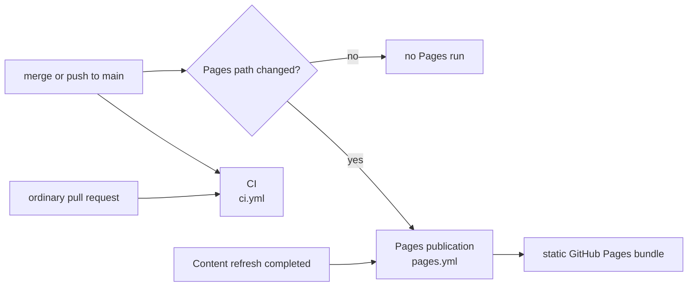
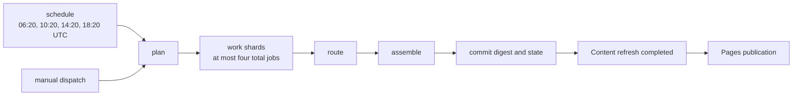
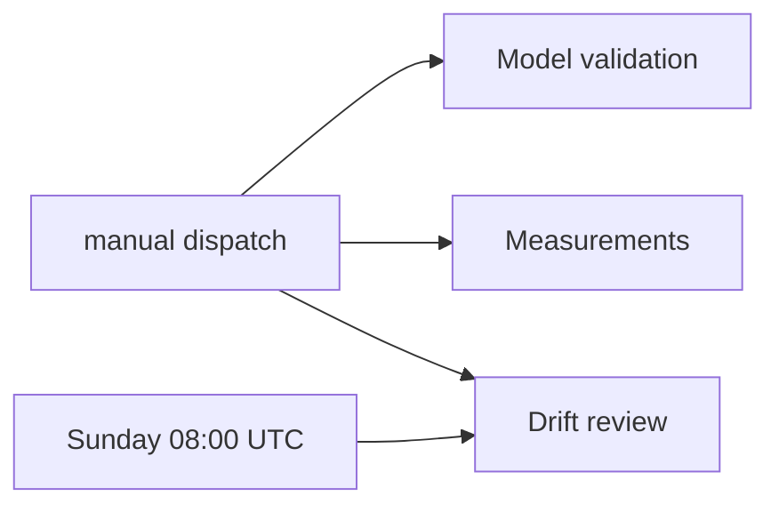

# GitHub Actions Workflows

**Last Updated**: 2026-08-24

The exact workflow display names, files, and trigger classes. All scheduled
times are UTC.

## Trigger reference

| File | Display name | Automatic trigger | Manual dispatch |
| --- | --- | --- | --- |
| `ci.yml` | `CI` | Pull request; push to `main` | yes |
| `digest.yml` | `Content refresh` | `20 6,10,14,18 * * *` | yes |
| `pages.yml` | `Pages publication` | Push to `main` when `frontend/**`, `config/idhazh.json`, or `state/**` changes; completed `Content refresh` run | yes |
| `drift.yml` | `Drift review` | Sunday at 08:00 (`0 8 * * 0`) | yes |
| `validate.yml` | `Model validation` | none | yes |
| `measure.yml` | `Measurements` | none | yes |

An ordinary pull request starts CI only. A merge or direct push to `main`
starts CI, and starts Pages publication only when its path filter matches.

## Content refresh

The schedule and manual dispatch use the same job graph. The plan job creates
the work list. The work matrix creates one to four total worker jobs. Scheduled
runs use four. Manual dispatch offers only 1, 2, 3, or 4 and defaults to four.
The plan job rejects any other value before it creates the matrix. The work
strategy also sets `max-parallel: 4`; that limits concurrency but is not the
total-job cap.
Route uses the worker outputs. Assemble runs even after a worker or route
failure, then commits the digest and state.

The plan job also commits first-sighting and feed-health state before it starts
the workers. This keeps observations from a failed refresh.

### Both commit steps push through a rebase, and neither rebases on a dirty tree

The plan job and the assemble job each commit, then push in a loop of three
attempts. A push that loses a race rebases and tries again.

A rebase refuses to start while a tracked file is modified. Run `32671663130`
died that way: one file was CRLF against a `text eol=lf` attribute, so every
Linux checkout saw it modified before any step ran, and the retry loop threw away
a day that plan, four shards and assemble had all finished.

The work is already in a commit when the loop begins, so anything left in the
working tree is runner noise. Each loop now prints what is dirty and discards it
before the rebase. Untracked files are left alone: they cannot block a rebase,
and a later step may still want them. `--autostash` was removed - it stashes the
noise and then fails the step when the stash will not reapply, which is the
failure it looks like it prevents.

A workflow contract test pins this shape. CI never runs `digest.yml`, so a change
to either loop needs a dispatched run to verify.

Model validation and measurements never run on a pull request, push, or
schedule. A person dispatches them. Drift review is a separate weekly or manual
workflow; it does not run inside Content refresh.

Each Measurements dispatch selects exactly one target:

| Target | What runs | Inputs used by that target |
| --- | --- | --- |
| `llm` | GGUF download timing and `llama-bench` throughput | `models`, `threads` |
| `image` | CPU image-model candidates | none |
| `corpus` | Live article-length sampling | `corpus_links` |
| `runtime` | Fixed-shard llama-server candidate sweep | `runtime_candidate`; `runtime_threads_batch` for `threads_batch` |

The form keeps all target-specific inputs visible. A job reads only the inputs
for its selected target. The default target is `llm`; the default runtime
candidate is `baseline`.

Pages publication builds only committed data and uploads a static bundle. It
does not run the producer or a model, and the published site has no runtime
backend.

## Display names and files

A workflow display name is the label shown in the Actions UI. Its filename is
the stable automation interface for repository paths, API calls, and CLI
dispatch. Keep the six filenames stable when a UI label changes.

GitHub's `workflow_run.workflows` selector is the exception: it matches a
display name. `pages.yml` therefore names `Content refresh` in that selector.
The workflow contract test pins both sides so a label change cannot silently
stop publication.

## Action versions

Every workflow calls the same nine actions, each pinned to one approved major.
GitHub retired the Node 20 runtime on its runners, so an action major that still
declares `using: node20` is force-run on Node 24 today and stops running later.

| Action | Major | Runtime |
| --- | --- | --- |
| `actions/cache` | `v6` | `node24` |
| `actions/checkout` | `v6` | `node24` |
| `actions/configure-pages` | `v6` | `node24` |
| `actions/deploy-pages` | `v5` | `node24` |
| `actions/download-artifact` | `v8` | `node24` |
| `actions/setup-node` | `v7` | `node24` |
| `actions/setup-python` | `v7` | `node24` |
| `actions/upload-artifact` | `v7` | `node24` |
| `actions/upload-pages-artifact` | `v5` | composite, pins a `node24` `upload-artifact` |

Each runtime above was read from that major's own `action.yml` on 2026-08-24.
The workflow contract test asserts the table: a new action, or a call site left
on an old major, fails CI.

`setup-node` still selects Node 22 for the frontend commands. That is the
application runtime and is unrelated to the runtime an action itself declares.

## See also

- [../architecture/overview.md](../architecture/overview.md) - how CI, committed payloads, and the static site fit together.
- [../concepts/pipeline-loop.md](../concepts/pipeline-loop.md) - what each pipeline stage owns.
- [../how-to/run-the-pipeline.md](../how-to/run-the-pipeline.md) - how to run the same stages locally.
- [../architecture/sources/freshness.md](../architecture/sources/freshness.md) - what four runs add to one day.
- [../../CLAUDE.md](../../CLAUDE.md) - Rules #1, #2, #9, and #10.
