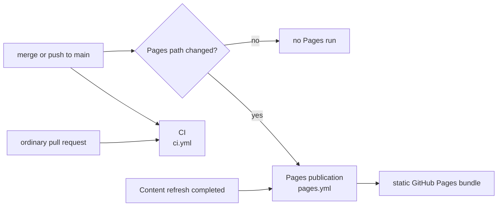
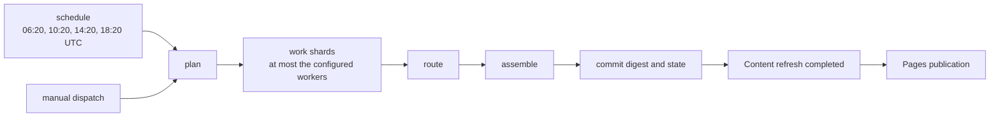
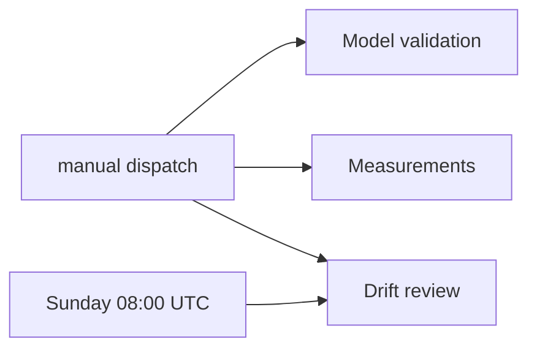

# GitHub Actions Workflows

**Last Updated**: 2026-08-23

The exact workflow display names, files, and trigger classes. All scheduled
times are UTC.

## Trigger reference

| File | Display name | Automatic trigger | Manual dispatch |
| --- | --- | --- | --- |
| `ci.yml` | `CI` | Pull request; push to `main` | yes |
| `digest.yml` | `Content refresh` | `20 6,10,14,18 * * *` | yes |
| `pages.yml` | `Pages publication` | Push to `main` when `frontend/**`, `config/idhazh.json`, or `state/**` changes; completed `Content refresh` run | yes |
| `drift.yml` | `Drift review` | Sunday at 08:00 (`0 8 * * 0`) | yes |
| `validate.yml` | `Model validation` | none | yes |
| `measure.yml` | `Measurements` | none | yes |

An ordinary pull request starts CI only. A merge or direct push to `main`
starts CI, and starts Pages publication only when its path filter matches.

## Content refresh

The schedule and manual dispatch use the same job graph. The plan job creates
the work list. The work matrix runs no more than the configured worker count.
Route uses the worker outputs. Assemble runs even after a worker or route
failure, then commits the digest and state.

The plan job also commits first-sighting and feed-health state before it starts
the workers. This keeps observations from a failed refresh.

Model validation and measurements never run on a pull request, push, or
schedule. A person dispatches them. Drift review is a separate weekly or manual
workflow; it does not run inside Content refresh.

Pages publication builds only committed data and uploads a static bundle. It
does not run the producer or a model, and the published site has no runtime
backend.

## Display names and files

A workflow display name is the label shown in the Actions UI. Its filename is
the stable automation interface for repository paths, API calls, and CLI
dispatch. Keep the six filenames stable when a UI label changes.

GitHub's `workflow_run.workflows` selector is the exception: it matches a
display name. `pages.yml` therefore names `Content refresh` in that selector.
The workflow contract test pins both sides so a label change cannot silently
stop publication.

## See also

- [../architecture/overview.md](../architecture/overview.md) - how CI, committed payloads, and the static site fit together.
- [../concepts/pipeline-loop.md](../concepts/pipeline-loop.md) - what each pipeline stage owns.
- [../how-to/run-the-pipeline.md](../how-to/run-the-pipeline.md) - how to run the same stages locally.
- [../architecture/sources/freshness.md](../architecture/sources/freshness.md) - what four runs add to one day.
- [../../CLAUDE.md](../../CLAUDE.md) - Rules #1, #2, #9, and #10.