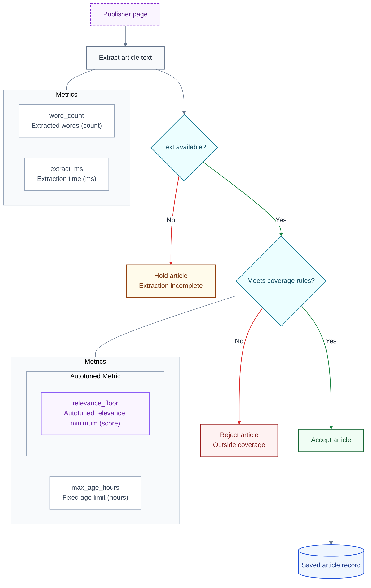

# Native Mermaid documentation theme

**Last Updated**: 2026-10-02

How to draw documentation diagrams for the native Copilot editor, GitHub
Markdown and print. All three are required. Use native rendering, not an
external stylesheet, custom renderer, generated image or separate site.

## Supported design

Use plain labels, standard Mermaid shapes, simple node colours and labelled
arrows. Request `sans-serif` once for the whole diagram through
`themeVariables.fontFamily`. The host chooses the installed sans-serif face
and controls text layout, box sizing and group headers. Do not promise an
exact typeface, mixed weights within a label, equal box widths or individually
coloured group headers.

Do not put styled HTML in a label. A simple ` ` may separate a name from
its description. Do not add spans, div wrappers, styled bold tags, CSS sizing
tricks or invisible text padding.

The same theme applies to every document. Copy the declarations in the
[example](#native-example-and-template), change the content and assign roles.
Each ordinary node gets one role class. Do not add a second width or typography
class that could replace its colours.

## Palette and shapes

Keep pale fills, dark text and clear borders on light and dark pages. Preserve
role colours; do not make every node grey. Words and shapes must retain the
meaning in grayscale. Do not paint a large dark background behind a diagram.

**Table A - Native roles**

| ID | Role | Colour | Shape or other signal |
| --- | --- | --- | --- |
| A1 | Work | Pale neutral | Action in a rectangle |
| A2 | Decision | Pale cyan | Question in a diamond |
| A3 | Accepted / yes | Pale green | Explicit positive outcome |
| A4 | Rejected / no | Pale red | Explicit negative outcome |
| A5 | Warning / held | Pale amber | Reason in the label |
| A6 | Saved data | Pale blue | Native storage cylinder |
| A7 | External system | Pale purple | System name and dashed border |
| A8 | Metric | White with a visible border | Name and description |
| A9 | Autotuned metric | Pale purple | Solid-bordered card under an Autotuned Metric heading |

Use one colour for all decision diamonds. A No branch that waits is an amber
hold, not a red failure.

Apply purple to the **autotuned metric card itself**. Do not depend on custom
colouring of the surrounding group header. External systems also use purple,
but have dashed borders and system names.

Use the native cylinder without custom geometry. Give it the saved-data role;
do not resize its body or end caps separately.

## Metrics and grouping

Use **Metrics** as the outer title. Give each metric its own inner rectangle,
not separate label/value cells. Its text names the quantity, describes it and
includes the unit. Distinguish measured values from fixed limits; do not insert
live readings. Link to the setting's owner instead of copying a limit that can
become stale.

An automatically maintained value goes in a nested group titled
**Autotuned Metric**, and its inner card uses the purple `autotuned` class.
Do not add a hanging update box or circular self-arrow just to mark that status.
A measurement changing between runs is not automatically an autotuned setting.

Attach metric groups to the relevant step or decision using a line without an
arrowhead. Metric cards are notes, not extra processing steps.

Use a top-to-bottom flow. For large processes, show major phases first and
put details below, linked with ordinary Markdown. Groups may identify real
subsystems, phases or metric notes. Let the native layout route the arrows;
do not modify SVG coordinates to force alignment.

## Branches

Label every decision branch with Yes/No, Possible/Not possible, or its actual
condition. Use green arrows for affirmative branches and red for negative
ones. Keep branch words as plain native text; do not force their colour with
HTML.

`linkStyle` edge numbers start at zero and include every earlier edge.
Recheck them when the diagram changes. In the example, edges 3 and 5 are Yes,
and edges 2 and 4 are No. Accepted and rejected destination boxes also keep
their green and red role colours.

A dashed return arrow is reserved for genuine feedback. Name what changes
and when it applies. It is not required merely because a metric is autotuned.

## Native example and template

Copy this native Mermaid block as a starting point. Keep its theme values
consistent across documents and include only the role classes a diagram uses.
These classes are for flowcharts; other Mermaid diagram types use their own
native notation.

The article-intake flow and metric names below are illustrative, not the
production pipeline or its configuration.

The autotuned card is purple; group headers use the native appearance.
Metric connections have no arrowheads because they are notes.

## Native display and print

Check the actual native editor and GitHub rendering, not a different browser
renderer. Confirm readable labels, role colours, purple autotuned cards and
correct branch labels. Host fonts and layout may differ.

Print the rendered diagram, not its source code. Check the host's print
preview in light mode and grayscale. Keep pale fills and avoid dark page
backgrounds. Labels, diamonds, storage shapes, dashed borders and arrowheads
must still convey meaning if fills disappear. Do not depend on a printer
retaining colour or background fills.

Keep the diagram within the printable area without clipping or unreadably
small text. If necessary, split a large flow into an overview and named detail
diagrams instead of forcing it onto one page. Printability is part of the
theme, not an optional export feature.

If a native viewer does not support a styling property, leave that property
at its native default. Do not add external rendering machinery or unsupported
markup to recover it.

## Design rationale

Native Markdown viewers own their rendering and do not load the repository's
site stylesheet. Plain labels and complete role classes keep the diagrams
editable without a second publishing path. Pale fills preserve meaning on
screen without ink-heavy print backgrounds; labels and shapes preserve it
without colour.

## See also

- [documentation-structure.md](documentation-structure.md#diagrams) - where documentation belongs.
- [../architecture/overview.md](../architecture/overview.md) - the project's architecture.
- [Mermaid flowcharts](https://mermaid.js.org/syntax/flowchart.html).
- [Mermaid themes](https://mermaid.js.org/config/theming.html).
- [GitHub diagram support](https://docs.github.com/en/get-started/writing-on-github/working-with-advanced-formatting/creating-diagrams).
