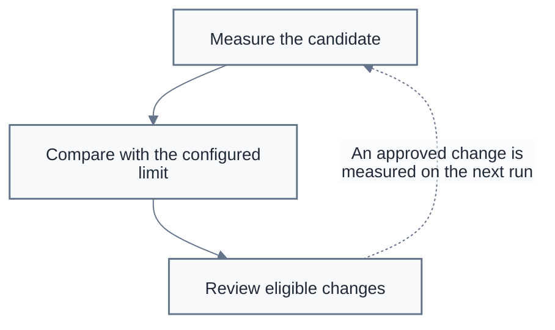
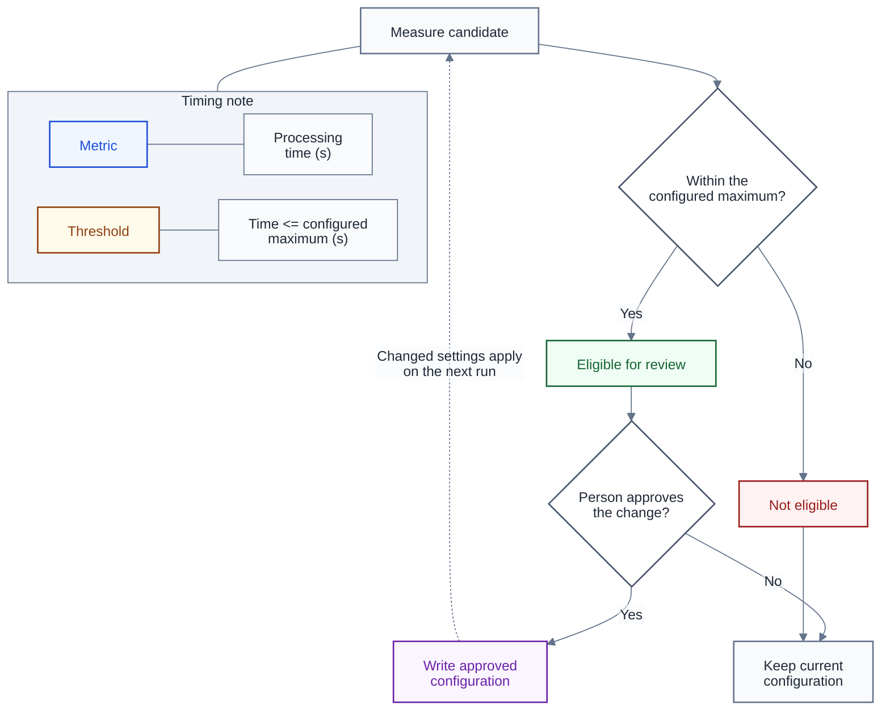

# Mermaid diagrams

**Last Updated**: 2026-10-02

How to draw documentation diagrams that read in GitHub, Copilot and print.
These rules cover the diagram, not the published site's theme.

## One palette for both page themes and print

Use pale fills, dark text and visible borders. Keep the same diagram colours
on light and dark pages; this is not an automatic dark-theme switch. Do not
paint a large dark background behind the diagram or a subsystem.

Every diagram is a self-contained fenced `mermaid` block. Use Mermaid's
`base` theme and explicit colours. Start a flowchart with this configuration:

```text
%%{init: {"theme": "base", "htmlLabels": false, "themeVariables": {"background": "#ffffff", "primaryColor": "#f8fafc", "primaryTextColor": "#1f2937", "primaryBorderColor": "#64748b", "lineColor": "#64748b", "textColor": "#1f2937", "clusterBkg": "#f1f5f9", "clusterBorder": "#64748b", "titleColor": "#1f2937", "edgeLabelBackground": "#f8fafc", "fontSize": "14px"}}}%%
```

`background` is an input to Mermaid's colour calculation, not a promise that
the viewer paints a canvas. Node, group and edge-label fills must be explicit.
Dark edge-label text needs its pale label background on a dark page.

Use `classDef` for node styles, not a repository stylesheet, `themeCSS`,
HTML spans or browser theme queries. The two viewers control their own page
styles and security settings. Keep HTML labels off; `<br/>` may separate
lines, but do not rely on styled HTML or custom fonts.

Print must preserve the meaning in grayscale and with background graphics
disabled. Keep words, shapes and borders; colour is a second signal.
Do not assume that a printer removes SVG fills: the pale palette limits ink
even when it keeps them. If the viewer prints its own dark page background,
switch that page to light mode before printing or saving a PDF.

## Node meanings

Give each flowchart node a class. Copy only the classes the diagram uses.
The class names and colours mean the same thing on every page.

```text
classDef stage fill:#f8fafc,stroke:#64748b,stroke-width:1.5px,color:#1f2937;
classDef decision fill:#ffffff,stroke:#475569,stroke-width:1.5px,color:#1f2937;
classDef yes fill:#f0fdf4,stroke:#166534,stroke-width:1.5px,color:#166534;
classDef no fill:#fef2f2,stroke:#991b1b,stroke-width:1.5px,color:#991b1b;
classDef warn fill:#fffbeb,stroke:#92400e,stroke-width:1.5px,color:#92400e;
classDef ledger fill:#eff6ff,stroke:#1d4ed8,stroke-width:1.5px,color:#1f2937;
classDef ext fill:#f8fafc,stroke:#64748b,stroke-width:1.5px,stroke-dasharray:5 3,color:#1f2937;
classDef metric fill:#eff6ff,stroke:#1d4ed8,stroke-width:1.5px,color:#1d4ed8;
classDef threshold fill:#fffbeb,stroke:#92400e,stroke-width:1.5px,color:#92400e;
classDef feedback fill:#faf5ff,stroke:#6b21a8,stroke-width:1.5px,color:#6b21a8;
classDef detail fill:#f8fafc,stroke:#64748b,stroke-width:1px,color:#1f2937;
```

- `stage` is work. Name it with a verb.
- `decision` is a diamond containing a question. Label every outgoing arrow
  with its answer: `Yes` / `No`, `Possible` / `Not possible`, or a more precise
  condition.
- `yes` and `no` identify affirmative and negative outcomes, not the question.
  A `No` answer that leads to ordinary work does not make that work an error.
  Keep that work neutral; use the outcome colours for acceptance or refusal.
- `warn` is held or degraded work. Say why in the label.
- `ledger` is stored data; use a storage shape as well as the colour.
- `ext` is an external dependency; its dashed border distinguishes it without
  colour.
- `metric`, `threshold` and `detail` are annotation cells, not process steps.
- `feedback` identifies a step that changes a setting used by later work.
  Recording a measurement is not such a change.

Other Mermaid diagram types use their own notation and theme variables.
Do not put flowchart-only `classDef` statements into a sequence diagram.

## Metrics, thresholds and two-colour notes

A **metric** names what a step measures. A **threshold** is the limit used
by a decision. Show the metric's name and unit, not a live reading. Show the
comparison and the configured limit separately. Name the configuration key
or link to its owning page in the surrounding text rather than copying a
number that can become stale.

Use paired note cells for two colours: `Metric` uses the blue `metric` class
and its quantity uses the charcoal `detail` class. Pair `Threshold` with its
comparison in the same way, using amber for the label. Node-level styles do
not colour separate words inside one label. Paired cells avoid depending on
HTML support that differs between viewers.

Attach the note to its owning step or decision with a line without an
arrowhead, `---`. Use the same line between a label cell and its detail cell.
The cells describe work; they do not add an execution order. Omit a note when
the step does not produce a metric or use a threshold.

## Overview, detail and feedback

Use `flowchart TD` for a process overview. Give each major phase one box, then
put its internal steps in a separate detail diagram below. Link to that
detail with ordinary Markdown, not an interactive Mermaid click handler.
A small process may fit in one diagram.

A `subgraph` may name a real subsystem, a workflow phase or an annotation
group. Keep its fill neutral. Use the group's title to say what its contents
share; do not create boxes only to colour the page. If nested groups make the
result too wide or dense to print, split the detail rather than shrink the
text. Mermaid can ignore a group's local direction when its internal nodes
connect outside it; do not rely on that direction to explain the order.

Use solid arrows, `-->`, for the main path. Use a dashed return arrow,
`-.->`, only when a later step changes earlier work or a future run.
Name the change and when it takes effect on that arrow. Draw a review or
approval step when a person must authorize the change. An annotation line
has no arrowhead; it is not a feedback path or a retry.

### Example overview

This is a notation example, not a claim about a production workflow. A
candidate is measured against a configured time limit. Eligibility does
not approve a change; a person still decides whether to apply it.



The [detail diagram](#example-detail) expands the comparison and review.

### Example detail



## Project bindings

The following border and title accents identify this project's subsystems.
They do not change the neutral group fill or replace the node meanings.

```text
classDef sysIngest fill:#f1f5f9,stroke:#0f766e,stroke-width:1.5px,color:#0f766e;
classDef sysExtract fill:#f1f5f9,stroke:#1d4ed8,stroke-width:1.5px,color:#1d4ed8;
classDef sysModel fill:#f1f5f9,stroke:#6b21a8,stroke-width:1.5px,color:#6b21a8;
classDef sysPublish fill:#f1f5f9,stroke:#0e7490,stroke-width:1.5px,color:#0e7490;
classDef sysEval fill:#f1f5f9,stroke:#92400e,stroke-width:1.5px,color:#92400e;
classDef sysOps fill:#f1f5f9,stroke:#475569,stroke-width:1.5px,color:#475569;
```

These name ingestion, extraction, models, publication, evaluation and
operations respectively. Put field lists and current configuration values
in the owning page, not in a large overview box.

## Checks before delivery

Render the changed diagrams in the target viewers in both page themes.
Inspect print preview in grayscale with background graphics off. Check text,
arrowheads, group titles and edge-label backgrounds as well as node fills.
If a diagram needs shrinking until its labels are hard to read, split it.

Confirm that decisions have labelled branches, annotations have no
arrowheads, and every feedback arrow names a real change and its timing.
The example's two note cells must remain distinguishable by their words when
colour is absent. Do not claim that editing these rules restyled diagrams
whose Mermaid blocks were not changed.

## Design rationale

GitHub and Copilot render Markdown without importing the repository's site
styles. A fixed pale palette keeps the diagram legible on either page theme
and avoids large ink-heavy fills in print. Words and shapes carry the meaning
when colour is unavailable. Paired annotation cells use the same node styling
as the rest of the diagram, without a separate renderer or export tool.

Diagram notation can be used independently of documentation placement.
Keeping it here lets the documentation-structure page stay focused on its
own question while this page holds the complete style and examples.

## See also

- [documentation-structure.md](documentation-structure.md#diagrams) - where documentation belongs.
- [../architecture/overview.md](../architecture/overview.md) - the project's architecture.
- [Mermaid theme configuration](https://mermaid.js.org/config/theming.html) - theme variables and colour calculation.
- [GitHub diagrams](https://docs.github.com/en/get-started/writing-on-github/working-with-advanced-formatting/creating-diagrams) - native Markdown rendering and the viewer's Mermaid version.
